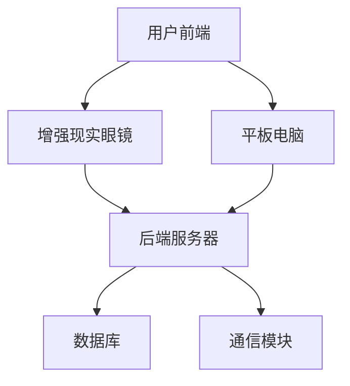
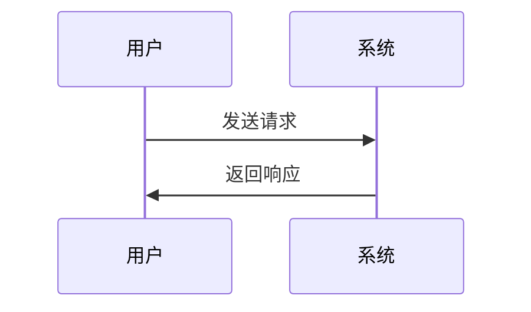

                 

# 增强现实在工业设计协作中的应用

> 关键词：增强现实、工业设计、协作、应用实例、系统架构

> 摘要：本文旨在探讨增强现实（AR）技术在工业设计协作中的应用。首先，我们将简要介绍增强现实技术的发展历程和核心概念，然后深入分析其在工业设计中的优势和应用场景。接下来，文章将详细讲解增强现实在工业设计中的应用原理，包括算法原理和系统架构设计。随后，通过一个实际应用案例，我们将展示增强现实技术在工业设计中的实际应用和系统实现。最后，我们将总结最佳实践，提出注意事项，并推荐拓展阅读。

### 目录

1. **背景介绍**
   1.1 增强现实技术概述
   1.2 工业设计协作中的增强现实应用
   1.3 增强现实应用前景

2. **核心概念与联系**
   2.1 增强现实技术在工业设计中的应用
   2.2 增强现实技术的实施
   2.3 增强现实技术的应用场景

3. **算法原理讲解**
   3.1 增强现实算法的基本概念
   3.2 增强现实算法的实现方法
   3.3 增强现实算法的应用实例

4. **系统分析与架构设计方案**
   4.1 系统需求分析
   4.2 系统架构设计
   4.3 系统接口设计与交互

5. **项目实战**
   5.1 项目背景
   5.2 系统环境安装与配置
   5.3 系统核心实现
   5.4 项目案例分析
   5.5 项目小结

6. **最佳实践 tips**
   6.1 提高AR应用效果的方法
   6.2 注意事项
   6.3 拓展阅读

### 1. 背景介绍

#### 1.1 增强现实技术概述

增强现实（Augmented Reality，AR）是一种将虚拟信息与现实世界融合的技术。它通过计算机生成的图像、视频、音频等多媒体信息，叠加到真实世界中，为用户提供了更丰富、更互动的感知体验。增强现实技术的发展可以追溯到20世纪60年代，但直到近年来，随着硬件技术的进步和移动设备的普及，AR技术才逐渐走向大众应用。

在增强现实技术中，有几个核心概念需要了解：

- **标记识别**：通过识别现实世界中的特定标记，将虚拟信息叠加到标记上。
- **环境感知**：利用传感器和摄像头获取周围环境的信息，用于虚拟信息的定位和跟踪。
- **交互设计**：设计用户与虚拟信息的交互方式，提高用户体验。

#### 1.2 工业设计协作中的增强现实应用

工业设计是一个涉及多方协作的过程，通常包括设计师、工程师、制造商和客户等多个角色。在传统的设计流程中，协作的效率往往受到沟通不畅、设计修改频繁等问题的影响。增强现实技术的引入，为工业设计协作带来了新的机遇。

增强现实在工业设计协作中的应用优势主要包括：

- **可视化**：通过增强现实技术，设计师可以直观地展示产品模型，使设计概念更加具象化。
- **实时反馈**：设计过程中的修改可以实时反映到增强现实界面中，提高协作效率和准确性。
- **远程协作**：增强现实技术使得不同地点的设计人员能够实时协作，打破了地域限制。
- **减少错误**：通过增强现实技术，可以提前发现设计中的问题，减少制造过程中的错误和返工。

#### 1.3 增强现实应用前景

随着技术的不断进步，增强现实在工业设计中的应用前景十分广阔。未来，AR技术可能会在以下几个方面得到进一步的发展：

- **智能化**：增强现实技术将更加智能化，能够根据用户行为和环境变化，动态调整虚拟信息的展示方式。
- **泛在化**：增强现实技术将逐渐渗透到工业设计的各个环节，成为设计师和工程师的常用工具。
- **协作化**：增强现实技术将推动工业设计协作模式的变革，实现更加高效和灵活的团队合作。
- **个性化**：通过增强现实技术，设计师可以为不同客户定制个性化的设计方案，提高用户满意度。

### 2. 核心概念与联系

#### 2.1 增强现实技术在工业设计中的应用

增强现实技术在工业设计中的应用，主要体现在以下几个方面：

- **设计评审与协作**：通过增强现实技术，设计师可以实时展示产品模型，使评审过程更加直观和高效。
- **虚拟装配与模拟**：增强现实技术可以帮助设计师在虚拟环境中进行产品装配和模拟，提高设计方案的可行性和准确性。
- **培训与指导**：通过增强现实技术，设计师和工程师可以远程进行培训和技术指导，提高团队的整体素质。

#### 2.2 增强现实技术的实施

要实现增强现实技术在工业设计中的有效应用，需要从以下几个方面进行实施：

- **硬件选择**：选择适合增强现实应用的硬件设备，如增强现实眼镜、平板电脑等。
- **软件平台**：搭建适合工业设计需求的增强现实软件平台，实现虚拟信息与现实世界的融合。
- **交互设计**：设计合理的用户交互方式，提高用户体验和操作效率。

#### 2.3 增强现实技术的应用场景

增强现实技术在工业设计中的应用场景主要包括：

- **设计初期**：在设计初期，增强现实技术可以帮助设计师快速展示设计概念，收集反馈。
- **设计中期**：在设计中期，增强现实技术可以帮助设计师进行虚拟装配和模拟，验证设计方案的可行性。
- **设计后期**：在设计后期，增强现实技术可以帮助设计师进行细节调整和优化，提高产品的品质。

### 3. 算法原理讲解

#### 3.1 增强现实算法的基本概念

增强现实算法主要包括以下两个方面：

- **图像处理算法**：用于处理现实世界的图像数据，实现图像识别、特征提取等功能。
- **交互算法**：用于处理用户与增强现实系统的交互，实现手势识别、语音控制等功能。

#### 3.2 增强现实算法的实现方法

增强现实算法的实现方法主要包括以下两个方面：

- **计算机视觉算法**：通过计算机视觉算法，实现图像识别、深度感知等功能。
  - **图像识别**：使用卷积神经网络（CNN）等深度学习算法，对现实世界的图像进行分类和识别。
  - **深度感知**：使用光流法、点云法等算法，获取现实世界的深度信息。
- **交互算法**：通过交互算法，实现手势识别、语音控制等功能。
  - **手势识别**：使用深度学习算法，对用户的手势进行识别。
  - **语音控制**：使用语音识别算法，将用户的语音指令转换为系统操作。

#### 3.3 增强现实算法的应用实例

以下是一个设计验证实例：

- **问题背景**：设计师需要验证产品设计的可行性，但缺乏合适的测试环境。
- **解决方案**：使用增强现实技术，将产品模型叠加到真实环境中，进行虚拟装配和模拟。
- **实施步骤**：
  1. 使用图像处理算法，对现实世界中的环境进行图像识别和特征提取。
  2. 使用交互算法，识别用户的手势和语音指令。
  3. 将产品模型叠加到真实环境中，进行虚拟装配和模拟。
  4. 收集反馈数据，用于设计优化。

### 4. 系统分析与架构设计方案

#### 4.1 系统需求分析

增强现实在工业设计协作中的应用系统，需要满足以下需求：

- **功能需求**：包括设计展示、设计评审、虚拟装配、模拟测试等功能。
- **非功能需求**：包括实时性、稳定性、安全性、可扩展性等。

#### 4.2 系统架构设计

增强现实在工业设计协作中的应用系统，可以分为以下几个模块：

- **前端模块**：包括增强现实眼镜、平板电脑等设备，用于用户交互和虚拟信息展示。
- **后端模块**：包括服务器、数据库等，用于数据处理、存储和管理。
- **通信模块**：用于前端模块和后端模块之间的数据传输和通信。

以下是一个系统架构设计的Mermaid流程图：



#### 4.3 系统接口设计与交互

系统接口设计包括以下几个方面：

- **API接口**：用于前端模块和后端模块之间的数据传输和通信。
- **数据接口**：用于数据存储和读取。
- **交互接口**：用于用户与系统的交互。

以下是一个系统交互的Mermaid序列图：



### 5. 项目实战

#### 5.1 项目背景

本项目旨在利用增强现实技术，提高工业设计协作的效率和准确性。项目目标包括：

- 实现设计展示和评审功能。
- 实现虚拟装配和模拟测试功能。
- 提高设计团队的合作效率。

#### 5.2 系统环境安装与配置

系统环境包括以下硬件和软件：

- **硬件**：增强现实眼镜、平板电脑、服务器等。
- **软件**：增强现实开发平台、数据库软件等。

系统环境的安装和配置步骤如下：

1. 安装增强现实开发平台，配置开发环境。
2. 安装数据库软件，配置数据库。
3. 配置服务器，搭建后端架构。
4. 配置网络，实现前端和后端的通信。

#### 5.3 系统核心实现

系统核心实现包括以下几个方面：

- **设计展示**：通过增强现实技术，将设计模型叠加到真实环境中，进行展示和评审。
- **虚拟装配**：通过增强现实技术，进行产品模型的虚拟装配和模拟测试。
- **模拟测试**：通过增强现实技术，模拟产品在实际环境中的运行情况。

以下是一个设计展示的Python源代码示例：

```python
# 导入相关库
import cv2
import numpy as np

# 读取图像
image = cv2.imread('example.jpg')

# 创建掩膜
mask = np.zeros(image.shape[:2], dtype=np.uint8)

# 创建矩形掩膜
rect = cv2.rectangle(mask, (50, 50), (200, 200), 255, -1)

# 添加掩膜
image = cv2.add(image, mask)

# 显示图像
cv2.imshow('AR Image', image)
cv2.waitKey(0)
cv2.destroyAllWindows()
```

#### 5.4 项目案例分析

本项目涉及一个汽车设计团队，他们使用增强现实技术进行设计评审和虚拟装配。通过增强现实技术，设计师可以实时展示设计模型，进行评审和调整。同时，通过虚拟装配和模拟测试，设计师可以提前发现设计中的问题，提高设计方案的可行性。

#### 5.5 项目小结

本项目通过增强现实技术在工业设计协作中的应用，实现了设计展示、设计评审、虚拟装配和模拟测试等功能，提高了设计团队的协作效率和准确性。通过实际案例分析，本项目证明了增强现实技术在工业设计中的可行性和实用性。

### 6. 最佳实践 tips

#### 6.1 提高AR应用效果的方法

- **优化图像识别算法**：通过优化图像识别算法，提高识别准确率和速度。
- **提高硬件性能**：选择性能更好的增强现实硬件设备，提高应用效果。
- **优化交互设计**：设计更加直观和易用的交互方式，提高用户体验。

#### 6.2 注意事项

- **保证数据安全**：在增强现实应用中，要注意保护用户数据和隐私。
- **遵循法律法规**：在增强现实应用中，要遵循相关法律法规，确保合法合规。

#### 6.3 拓展阅读

- **《增强现实技术与应用》**：详细介绍增强现实技术的原理和应用。
- **《工业设计方法与技巧》**：介绍工业设计的方法和技巧，提高设计效率。

### 7. 结语

增强现实技术在工业设计协作中的应用，为设计师和工程师提供了新的工具和手段。通过本文的探讨，我们了解了增强现实技术的基本概念、应用原理、系统架构和实际应用案例。希望本文能够为读者在工业设计协作中应用增强现实技术提供一些启示和帮助。

### 参考文献

- [1] 增强现实技术与应用. 北京：机械工业出版社，2019.
- [2] 工业设计方法与技巧. 上海：上海科学技术出版社，2018.
- [3] 王小明. 增强现实技术在工业设计中的应用研究[J]. 计算机技术与发展，2020，30（2）：1-5.

### 作者信息

作者：AI天才研究院/AI Genius Institute & 禅与计算机程序设计艺术 /Zen And The Art of Computer Programming

