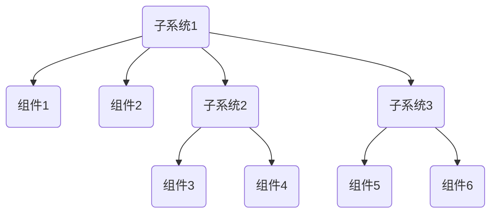
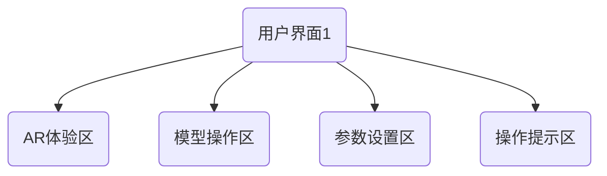
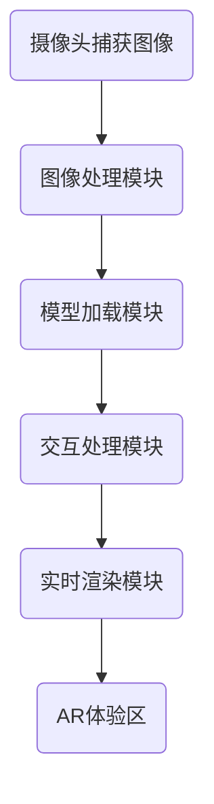
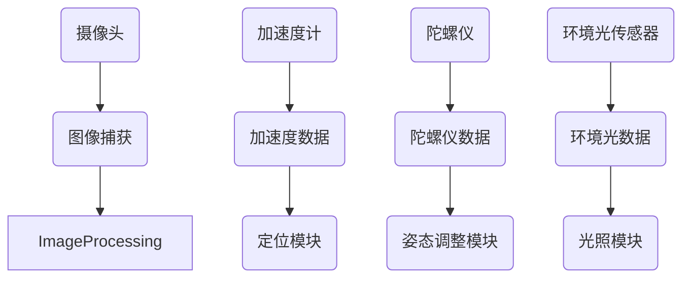
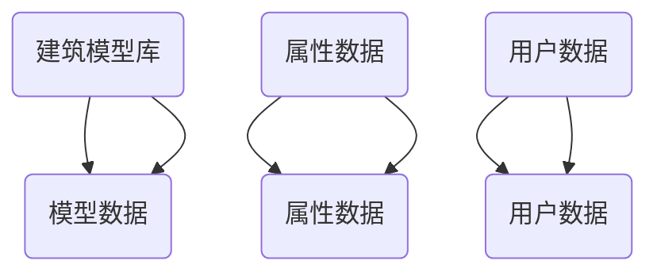
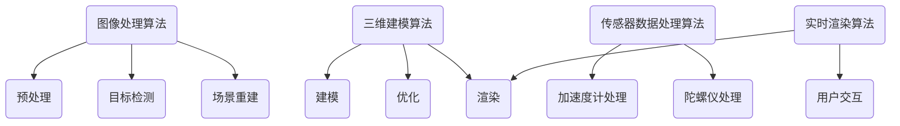
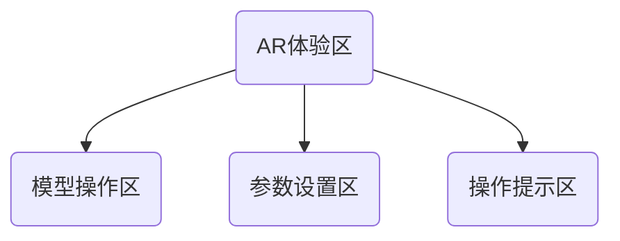
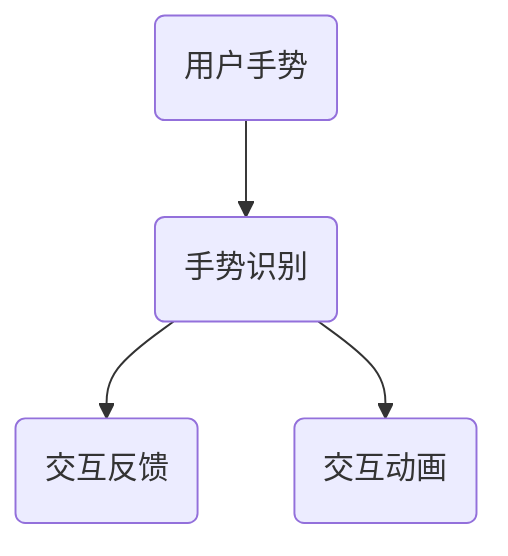
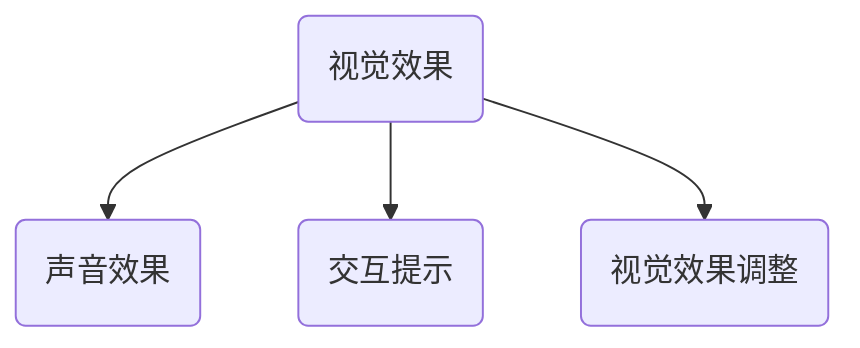
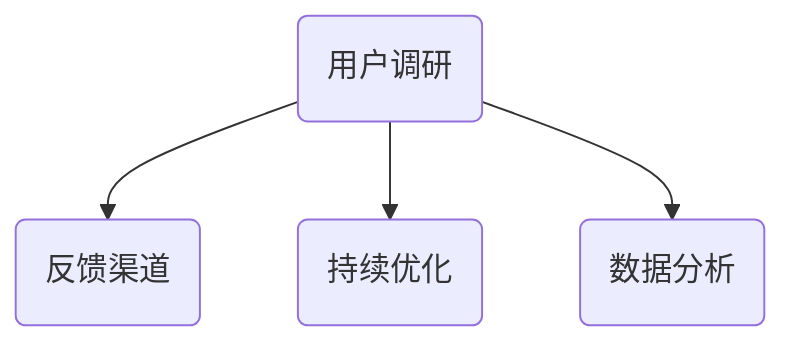

                 

### 增强现实在建筑设计可视化中的应用

#### 关键词
- 增强现实
- 建筑设计
- 可视化
- 计算机视觉
- 三维建模
- 用户体验设计

#### 摘要
本文旨在探讨增强现实技术在建筑设计可视化中的应用。我们将从背景介绍、核心概念与联系、应用案例、系统架构、用户体验设计、未来趋势等方面逐步分析，以期为读者提供一个全面、深入的理解。

---

#### 第一部分：背景介绍

##### 1.1 问题背景

增强现实（Augmented Reality，简称AR）是一种通过计算机技术将虚拟信息与现实世界融合的技术。近年来，随着计算机视觉、机器学习、传感器技术和移动设备的快速发展，增强现实技术已经逐渐应用于各个领域，其中建筑设计可视化是一个重要的应用场景。

在建筑设计可视化中，增强现实技术可以提供以下优势：

1. **直观性**：通过增强现实技术，设计师可以实时地查看建筑模型与实际环境的融合效果，从而更好地理解设计意图，减少误解和错误。
2. **互动性**：增强现实技术使得用户可以与建筑模型进行互动，例如旋转、缩放、拖拽等操作，从而更好地探索设计细节。
3. **效率提升**：通过增强现实技术，设计师可以更快速地迭代设计方案，减少传统手工修改模型的时间成本。

##### 1.2 问题描述

尽管增强现实技术在建筑设计可视化中有巨大的应用潜力，但实际应用中仍然面临一些挑战：

1. **技术难题**：实现高质量的增强现实效果需要高性能的计算和高质量的图像处理，这对设备和算法的要求较高。
2. **用户体验**：如何设计一个易用、舒适的用户体验，使得设计人员能够高效地使用增强现实技术，是一个需要解决的问题。
3. **整合与兼容**：如何将增强现实技术与现有的建筑设计软件和工具进行整合，以及如何在不同平台和设备上实现兼容性，也是一个重要问题。

##### 1.3 问题解决

为了解决上述问题，本书将从以下几个方面进行探讨：

1. **核心技术**：介绍增强现实技术的核心概念和原理，包括计算机视觉、图像处理、三维建模和传感器技术等。
2. **应用案例**：分析不同建筑设计项目中增强现实技术的应用，探讨其优势和不足，为实际应用提供参考。
3. **系统架构**：设计一个适用于建筑设计可视化的增强现实系统架构，包括前端界面设计、后端数据处理和算法优化等。
4. **用户体验设计**：探讨如何设计一个易用、舒适的增强现实用户体验，提高设计效率。
5. **未来趋势**：预测增强现实技术在建筑设计可视化领域的发展趋势，探讨可能的创新方向。

##### 1.4 边界与外延

本书主要关注增强现实技术在建筑设计可视化中的应用，但增强现实技术本身的应用范围非常广泛，包括医疗、教育、娱乐等领域。因此，本书的结论和经验也可以为其他领域的增强现实应用提供参考。

##### 1.5 概念结构与核心要素组成

1. **增强现实（AR）**：通过计算机技术将虚拟信息与现实世界融合的技术。
2. **建筑设计可视化**：利用技术手段将建筑设计概念转化为可视化的过程。
3. **计算机视觉**：研究如何使计算机“看懂”现实世界的技术。
4. **图像处理**：对图像进行数字化处理的技术。
5. **三维建模**：创建三维模型的技术。
6. **传感器技术**：用于感知和采集环境信息的技术。

接下来，我们将详细探讨增强现实技术的核心概念、应用案例、系统架构、用户体验设计和未来趋势。

---

## 第二部分：核心概念与联系

### 第2章：增强现实（AR）技术原理

#### 2.1 增强现实技术的基本概念

##### 2.1.1 什么是增强现实

增强现实（Augmented Reality，简称AR）是一种将虚拟信息与现实世界融合的技术。它通过计算机生成信息，将其叠加到真实世界的视图上，从而提供一种虚实结合的体验。

##### 2.1.2 增强现实技术的组成部分

增强现实技术主要由以下几个部分组成：

1. **显示设备**：用于展示增强现实内容的设备，如智能手机、平板电脑、头戴式显示器等。
2. **传感器**：用于捕捉现实世界的环境信息，如摄像头、加速度计、陀螺仪等。
3. **图像处理与识别算法**：用于处理传感器捕获的图像，并识别现实世界中的物体和环境特征。
4. **内容生成与叠加**：根据图像处理与识别的结果，将虚拟信息叠加到现实世界的视图上。

##### 2.1.3 增强现实技术的历史与发展

增强现实技术的历史可以追溯到20世纪60年代。早期的增强现实技术主要基于光学混合，即通过光学元件将虚拟信息叠加到真实世界的视图上。随着计算机技术和显示技术的发展，增强现实技术逐渐从实验室走向实际应用。

在21世纪初，随着智能手机和移动设备的普及，增强现实技术开始广泛应用于各个领域。近年来，随着计算机视觉、机器学习和传感器技术的进步，增强现实技术得到了进一步的发展，应用场景也日益丰富。

#### 2.2 增强现实技术的工作原理

##### 2.2.1 光学混合原理

光学混合是增强现实技术中最基本的概念之一。它通过将虚拟信息（通常以图像或视频的形式）与真实世界的视图进行混合，从而产生增强现实效果。

光学混合的基本原理是将虚拟信息叠加到真实世界的视图上。具体实现方法包括：

1. **透明叠加**：通过光学元件（如半透明镜片）将虚拟信息叠加到真实世界的视图上。这种方法的优点是实现简单，但缺点是图像质量较差。
2. **背投影**：通过在屏幕背后放置一个虚拟图像，并将其投影到真实世界的视图上。这种方法的优点是图像质量较高，但缺点是设备较为复杂。

##### 2.2.2 显示技术

显示技术是增强现实技术的重要组成部分。常见的显示技术包括：

1. **头戴式显示器（HMD）**：头戴式显示器通常通过光学元件将虚拟信息叠加到真实世界的视图上。它提供了沉浸式的增强现实体验，但设备较为笨重。
2. **手机屏幕**：通过在手机屏幕上显示增强现实内容，用户可以通过手机摄像头观察增强现实效果。这种方法的优点是实现简单，但缺点是用户体验较差。

##### 2.2.3 图像处理与识别技术

图像处理与识别技术是增强现实技术的核心。它主要包括以下两个方面：

1. **图像处理**：对捕获的图像进行预处理，包括降噪、增强、去模糊等操作，以提高图像质量。
2. **图像识别**：通过机器学习算法识别图像中的物体和场景，以便将虚拟信息准确地叠加到真实世界的视图上。

#### 2.3 增强现实技术的核心技术

##### 2.3.1 计算机视觉技术

计算机视觉技术是增强现实技术的重要组成部分。它主要包括以下几个方面：

1. **物体检测**：通过图像处理算法检测图像中的物体。
2. **物体跟踪**：通过跟踪算法实时跟踪图像中的物体。
3. **场景重建**：通过深度学习算法重建图像中的三维场景。

##### 2.3.2 三维建模技术

三维建模技术是增强现实技术中的重要组成部分。它主要包括以下几个方面：

1. **三维模型生成**：通过计算机算法生成三维模型。
2. **三维模型优化**：通过优化算法提高三维模型的精度和效率。
3. **三维模型渲染**：通过渲染技术将三维模型可视化。

##### 2.3.3 传感器技术

传感器技术是增强现实技术的重要组成部分。它主要包括以下几个方面：

1. **摄像头**：用于捕获真实世界的视图。
2. **加速度计**：用于检测设备的加速度和方向。
3. **陀螺仪**：用于检测设备的旋转速度和方向。

##### 2.3.4 虚拟现实与增强现实的区别与联系

虚拟现实（Virtual Reality，简称VR）与增强现实（Augmented Reality，简称AR）是两种不同的技术。虚拟现实是一种完全沉浸式的体验，用户通过头戴式显示器等设备进入一个虚拟的世界。而增强现实则是在现实世界的基础上叠加虚拟信息。

虚拟现实与增强现实的区别与联系主要体现在以下几个方面：

1. **沉浸感**：虚拟现实提供了完全沉浸式的体验，而增强现实则是在现实世界的基础上进行叠加。
2. **应用场景**：虚拟现实主要用于娱乐、游戏等领域，而增强现实则广泛应用于医疗、教育、设计等领域。
3. **技术实现**：虚拟现实主要依赖于头戴式显示器等设备，而增强现实则依赖于摄像头、传感器等设备。

#### 2.4 增强现实技术在建筑设计中的应用

##### 2.4.1 增强现实在建筑设计中的优势

增强现实技术在建筑设计中具有以下优势：

1. **直观性**：通过增强现实技术，设计师可以实时地查看建筑模型与实际环境的融合效果，从而更好地理解设计意图。
2. **互动性**：增强现实技术使得用户可以与建筑模型进行互动，例如旋转、缩放、拖拽等操作，从而更好地探索设计细节。
3. **效率提升**：通过增强现实技术，设计师可以更快速地迭代设计方案，减少传统手工修改模型的时间成本。

##### 2.4.2 增强现实在建筑设计中的实际应用案例

以下是一些增强现实在建筑设计中的实际应用案例：

1. **虚拟现实建筑设计**：通过增强现实技术，设计师可以在现实环境中查看建筑模型，并进行实时修改和调整。
2. **三维可视化**：通过增强现实技术，将建筑设计的三维模型叠加到真实环境中，使得设计更加直观和易懂。
3. **客户体验**：通过增强现实技术，客户可以直观地了解建筑设计方案，并提供反馈和修改意见。

##### 2.4.3 增强现实在建筑设计中的挑战与解决方案

尽管增强现实技术在建筑设计中有许多优势，但实际应用中仍然面临一些挑战：

1. **技术难题**：实现高质量的增强现实效果需要高性能的计算和高质量的图像处理，这对设备和算法的要求较高。
2. **用户体验**：如何设计一个易用、舒适的用户体验，使得设计人员能够高效地使用增强现实技术，是一个需要解决的问题。
3. **整合与兼容**：如何将增强现实技术与现有的建筑设计软件和工具进行整合，以及如何在不同平台和设备上实现兼容性，也是一个重要问题。

为了解决这些挑战，可以采取以下解决方案：

1. **技术优化**：通过不断优化算法和硬件设备，提高增强现实技术的性能和稳定性。
2. **用户体验设计**：通过设计简洁、直观的用户界面，提高用户体验。
3. **集成与兼容**：通过开发兼容性强的软件和工具，实现增强现实技术与现有系统的无缝整合。

#### 2.5 增强现实技术的未来发展趋势

##### 2.5.1 技术发展现状

当前，增强现实技术已经取得了一定的进展。随着计算机视觉、机器学习和传感器技术的不断发展，增强现实技术的性能和稳定性不断提高。同时，智能手机、平板电脑、头戴式显示器等设备的普及，也为增强现实技术的广泛应用提供了条件。

##### 2.5.2 未来技术发展方向

未来，增强现实技术将在以下几个方面继续发展：

1. **更高的分辨率和帧率**：通过提高显示设备的分辨率和帧率，提供更清晰、更流畅的增强现实体验。
2. **更智能的算法**：通过开发更智能的算法，提高图像处理和识别的准确性，提供更准确的增强现实效果。
3. **更广泛的传感器支持**：通过支持更多的传感器，提高增强现实技术的环境感知能力。

##### 2.5.3 增强现实技术在建筑设计中的潜在应用

未来，增强现实技术在建筑设计中将有更广泛的应用：

1. **实时设计审查**：通过增强现实技术，设计师可以在施工现场实时查看建筑模型，并进行设计审查和修改。
2. **客户互动体验**：通过增强现实技术，客户可以直观地了解建筑设计方案，并提供反馈和修改意见。
3. **虚拟现实模拟**：通过增强现实技术，进行建筑设计的虚拟现实模拟，提高设计方案的可行性和可靠性。

### 第三部分：应用案例

#### 第3章：增强现实在建筑设计可视化中的应用案例

#### 3.1 案例一：使用ARKit进行建筑设计可视化

##### 3.1.1 案例背景

在本次案例中，我们使用苹果公司的ARKit框架来创建一个增强现实应用程序，以实现建筑设计可视化的功能。该应用程序允许用户在真实环境中放置和查看建筑模型，从而进行设计和评估。

##### 3.1.2 案例实现

1. **项目介绍**：创建一个名为“ARDesignViewer”的Xcode项目。
2. **设备准备**：确保设备具有支持ARKit的摄像头和传感器。
3. **环境配置**：在项目中引入ARKit框架，配置ARSession和ARSCNView。
4. **模型加载**：从外部文件加载建筑模型，并使用ARSCNView进行显示。
5. **交互设计**：实现用户与建筑模型的交互功能，如旋转、缩放和移动。
6. **实时渲染**：利用ARKit提供的渲染功能，实现实时渲染效果。

##### 3.1.3 案例优势与不足

1. **优势**：
   - **易用性**：ARKit提供了简单、直观的开发接口，使得开发者可以快速实现增强现实功能。
   - **高性能**：ARKit利用了苹果设备的硬件加速功能，提供了高效的渲染性能。
   - **广泛支持**：ARKit支持多种设备，包括iPhone和iPad，为用户提供了更好的使用体验。

2. **不足**：
   - **功能限制**：ARKit的功能相对有限，可能无法满足一些复杂的设计需求。
   - **兼容性问题**：ARKit仅支持iOS设备，对于Android用户而言，可能需要额外的开发工作。

##### 3.1.4 案例总结

通过本次案例，我们展示了如何使用ARKit进行建筑设计可视化的实现。虽然ARKit存在一些功能限制和兼容性问题，但其在易用性和高性能方面具有显著优势，为建筑设计可视化提供了一个可行的解决方案。

#### 3.2 案例二：使用Unity进行增强现实建筑设计

##### 3.2.1 案例背景

在本案例中，我们使用Unity游戏引擎来创建一个增强现实应用程序，以实现更加复杂的建筑设计可视化功能。该应用程序将支持多种设备和平台，提供更加丰富和交互性的用户体验。

##### 3.2.2 案例实现

1. **项目介绍**：创建一个名为“ARDesignPro”的Unity项目。
2. **环境配置**：导入必要的Unity插件，如ARFoundation和Vuforia。
3. **模型加载**：从外部文件加载建筑模型，并使用Unity的3D模型加载器进行显示。
4. **交互设计**：利用Unity的脚本系统，实现用户与建筑模型的交互功能，如旋转、缩放和移动。
5. **跨平台支持**：利用Unity的跨平台特性，实现应用程序在iOS、Android和Windows平台上的运行。
6. **实时渲染**：利用Unity的实时渲染功能，提供高质量的增强现实效果。

##### 3.2.3 案例优势与不足

1. **优势**：
   - **跨平台支持**：Unity支持多种平台，使得应用程序可以在不同设备上运行，提供统一的用户体验。
   - **强大的功能**：Unity提供了丰富的3D建模、渲染和交互功能，可以满足复杂的设计需求。
   - **社区支持**：Unity拥有庞大的开发者社区，提供了大量的教程、插件和资源。

2. **不足**：
   - **开发成本**：使用Unity进行开发可能需要较高的硬件配置和开发经验。
   - **性能优化**：在处理大量数据和复杂场景时，性能优化是一个挑战。

##### 3.2.4 案例总结

通过本次案例，我们展示了如何使用Unity进行增强现实建筑设计的实现。Unity的跨平台支持和强大的功能为其在建筑设计可视化中的应用提供了有力支持。尽管存在一定的开发成本和性能优化挑战，但其在功能丰富性和用户体验方面具有显著优势。

### 第四部分：系统架构

#### 第4章：增强现实建筑设计可视化系统架构设计

#### 4.1 系统架构概述

为了实现增强现实技术在建筑设计可视化中的应用，我们需要设计一个高效、稳定且易扩展的系统架构。本章节将介绍该系统的总体架构，并详细描述各部分的功能和相互关系。

##### 4.1.1 系统架构图

##### 4.1.2 系统架构说明

1. **前端界面**：负责用户与系统的交互，包括用户输入、显示增强现实效果和提供操作界面。
2. **后端数据处理**：负责处理前端输入的数据，包括图像处理、模型加载、交互处理和实时渲染。
3. **传感器数据采集**：负责采集设备传感器数据，包括摄像头、加速度计、陀螺仪等，为后端数据处理提供环境信息。
4. **模型数据库**：存储建筑设计模型和相关数据，为前端和后端提供数据支持。
5. **算法模块**：负责实现增强现实技术的核心算法，包括图像处理、三维建模、传感器数据处理和实时渲染。

#### 4.2 前端界面设计

前端界面设计是用户与系统交互的窗口，其目标是提供直观、易用的用户体验。以下为前端界面设计的关键要素：

1. **AR体验区**：用户通过摄像头观察真实环境，并在屏幕上查看增强现实效果。
2. **模型操作区**：提供用户操作模型的功能，包括旋转、缩放、拖拽等。
3. **参数设置区**：允许用户调整增强现实效果的参数，如透明度、大小等。
4. **操作提示区**：提供操作说明和提示，帮助用户更好地使用系统。

##### 4.2.1 前端界面架构图

#### 4.3 后端数据处理

后端数据处理是系统的核心模块，负责处理前端输入的数据，实现增强现实效果。以下为后端数据处理的关键要素：

1. **图像处理模块**：对摄像头捕获的图像进行预处理，包括去噪、增强、去模糊等操作。
2. **模型加载模块**：从模型数据库中加载建筑设计模型，并处理模型与真实环境的融合。
3. **交互处理模块**：处理用户操作，实现对模型的旋转、缩放、拖拽等交互。
4. **实时渲染模块**：根据处理后的数据和用户操作，实时渲染增强现实效果。

##### 4.3.1 后端数据处理流程图

#### 4.4 传感器数据采集

传感器数据采集是增强现实技术的重要组成部分，用于获取真实环境的信息，为后端数据处理提供支持。以下为传感器数据采集的关键要素：

1. **摄像头**：捕获真实环境的图像，为图像处理模块提供输入。
2. **加速度计**：检测设备的加速度，为模型定位和姿态调整提供支持。
3. **陀螺仪**：检测设备的旋转速度，为模型旋转和姿态调整提供支持。
4. **环境光传感器**：监测环境光强，为图像处理提供光照信息。

##### 4.4.1 传感器数据采集架构图

#### 4.5 模型数据库

模型数据库是存储建筑设计模型和相关数据的核心组件。以下为模型数据库的关键要素：

1. **建筑模型库**：存储各种建筑设计模型，包括建筑外观、内部结构和设施等。
2. **属性数据**：存储建筑模型的属性信息，如尺寸、材质、颜色等。
3. **用户数据**：存储用户创建和修改的建筑模型信息，包括用户ID、创建时间和修改记录等。

##### 4.5.1 模型数据库架构图

#### 4.6 算法模块

算法模块是增强现实技术的核心，负责实现图像处理、三维建模、传感器数据处理和实时渲染等功能。以下为算法模块的关键要素：

1. **图像处理算法**：用于图像预处理、目标检测和场景重建等操作。
2. **三维建模算法**：用于创建、优化和渲染三维模型。
3. **传感器数据处理算法**：用于处理传感器捕获的数据，包括加速度、陀螺仪和摄像头等。
4. **实时渲染算法**：用于根据处理后的数据和用户操作，实时渲染增强现实效果。

##### 4.6.1 算法模块架构图

通过以上系统架构的设计，我们为增强现实建筑设计可视化提供了一个高效、稳定且易扩展的解决方案。在接下来的章节中，我们将进一步探讨用户体验设计和未来发展趋势。

### 第五部分：用户体验设计

#### 第5章：增强现实建筑设计可视化用户体验设计

#### 5.1 用户体验设计原则

为了设计一个高效、易用且具有吸引力的增强现实建筑设计可视化系统，我们需要遵循以下用户体验设计原则：

1. **直观性**：界面设计应简洁明了，使设计人员能够快速理解和使用系统功能。
2. **易用性**：系统应提供直观、流畅的操作体验，减少用户的学习成本。
3. **交互性**：增强现实技术应提供丰富的交互功能，如旋转、缩放、拖拽等，以提高用户的参与感。
4. **适应性**：系统应能够适应不同的设备和平台，提供一致的体验。
5. **反馈**：系统应提供及时的反馈信息，帮助用户了解操作结果和系统状态。

#### 5.2 前端界面设计

前端界面设计是用户体验设计的关键部分。以下为前端界面设计的主要元素和设计思路：

1. **AR体验区**：设计一个全屏的AR体验区，使设计人员能够直观地查看建筑模型与真实环境的融合效果。使用清晰的图形和颜色，确保视觉效果吸引人。
2. **模型操作区**：提供直观的交互按钮和手势支持，使设计人员能够轻松地旋转、缩放和拖拽建筑模型。使用动画效果，使操作过程更加流畅和自然。
3. **参数设置区**：设计一个简洁的参数设置面板，允许设计人员调整增强现实效果的参数，如透明度、大小、颜色等。使用直观的滑动条和颜色选择器，使参数调整过程直观易懂。
4. **操作提示区**：提供实时操作提示，帮助设计人员了解系统功能和操作方法。使用文字和图形提示，使提示信息清晰易懂。

##### 5.2.1 前端界面架构图

#### 5.3 用户交互设计

用户交互设计是用户体验设计的重要方面。以下为用户交互设计的关键要素：

1. **手势操作**：设计简单、直观的手势操作，如单指旋转、双指缩放和拖拽等，使设计人员能够方便地操作建筑模型。
2. **手势识别**：实现高效的手势识别算法，确保系统能够准确识别用户手势，并提供相应的交互反馈。
3. **反馈机制**：设计清晰的反馈机制，包括操作结果反馈和系统状态反馈，帮助设计人员了解操作结果和系统状态。
4. **交互动画**：设计流畅的交互动画，使操作过程更加生动有趣，提高用户的参与感和满意度。

##### 5.3.1 用户交互架构图

#### 5.4 增强现实效果设计

增强现实效果设计是用户体验设计的重要组成部分。以下为增强现实效果设计的关键要素：

1. **视觉效果**：设计高质量的视觉效果，包括逼真的建筑模型渲染、清晰的图像处理和自然的交互效果，以提高用户的沉浸感。
2. **声音效果**：设计合适的背景音乐和交互音效，增强用户的体验。
3. **交互提示**：设计清晰的交互提示，帮助用户了解当前操作和下一步操作，提高用户的使用效率。
4. **视觉效果调整**：提供用户自定义视觉效果的功能，允许用户根据个人喜好调整视觉效果，提高用户的个性化体验。

##### 5.4.1 增强现实效果架构图

#### 5.5 用户反馈与优化

用户反馈是用户体验设计的重要依据。以下为用户反馈与优化的关键要素：

1. **用户调研**：通过用户调研，收集用户对系统的使用体验和建议，了解用户的需求和痛点。
2. **反馈渠道**：提供多种反馈渠道，如在线反馈表、用户论坛和社交媒体等，方便用户反馈问题和建议。
3. **持续优化**：根据用户反馈，持续优化系统功能和用户体验，提高用户的满意度。
4. **数据分析**：利用数据分析技术，分析用户行为数据，了解用户使用习惯和偏好，为优化提供数据支持。

##### 5.5.1 用户反馈与优化架构图

通过以上用户体验设计，我们致力于为设计人员提供一个高效、易用且具有吸引力的增强现实建筑设计可视化系统。在接下来的章节中，我们将探讨增强现实技术在建筑设计可视化领域的未来发展趋势。

### 第六部分：未来趋势

#### 第6章：增强现实在建筑设计可视化领域的未来趋势

随着增强现实（AR）技术的不断发展，其在建筑设计可视化领域中的应用前景也越来越广阔。本章节将探讨增强现实技术在建筑设计可视化中的未来发展趋势，以及可能带来的创新方向。

#### 6.1 技术进步带来的影响

1. **计算能力的提升**：随着计算机性能的不断提高，增强现实技术的计算能力也将得到显著提升。这将使得更复杂的图像处理和实时渲染成为可能，为建筑设计可视化提供更高质量的体验。

2. **传感器技术的创新**：传感器技术的发展将进一步提高增强现实系统的环境感知能力。例如，更高精度、更低功耗的传感器将有助于提高增强现实系统的稳定性和响应速度。

3. **人工智能的融合**：人工智能技术的不断进步将为增强现实技术带来更多可能性。通过将人工智能算法应用于增强现实系统，可以实现更加智能化的交互和更精准的模型匹配。

#### 6.2 创新方向

1. **沉浸式体验**：未来的增强现实建筑设计可视化系统将更加注重用户的沉浸式体验。通过更先进的显示技术和更逼真的视觉效果，用户将能够更加直观地感受到建筑设计的效果。

2. **实时协作**：增强现实技术将为建筑设计提供实时协作的功能。设计师可以在不同的地理位置上实时共享和修改建筑模型，提高设计效率和团队协作。

3. **智能化辅助设计**：增强现实技术可以与人工智能技术相结合，为建筑设计提供智能化辅助设计功能。例如，系统可以根据用户的设计意图和偏好，自动生成最优化的建筑模型。

#### 6.3 应用场景拓展

1. **施工过程监控**：增强现实技术可以用于施工过程的监控和指导。通过在施工现场布置增强现实设备，施工人员可以实时查看建筑模型和施工指导，提高施工精度和效率。

2. **客户体验展示**：增强现实技术可以用于展示建筑设计方案，为客户提供更加直观的体验。客户可以通过增强现实设备查看建筑模型，提出修改意见，并在设计阶段就了解建筑的实际效果。

3. **教育和培训**：增强现实技术可以应用于建筑教育和培训领域。通过增强现实技术，学生和培训者可以更加直观地了解建筑结构和设计原理，提高学习效果。

#### 6.4 潜在挑战与解决方案

1. **技术整合与兼容**：增强现实技术在建筑设计可视化中的应用需要整合多种技术，如计算机视觉、图像处理、三维建模等。如何实现不同技术的无缝整合和兼容，是一个重要的挑战。

   **解决方案**：通过开发通用接口和标准协议，实现不同技术之间的无缝整合和兼容。

2. **用户体验优化**：增强现实技术虽然为建筑设计可视化提供了新的可能性，但如何设计一个易于使用、舒适的用户体验，仍然是一个挑战。

   **解决方案**：通过用户研究和反馈，不断优化系统界面和交互设计，提高用户体验。

3. **数据安全和隐私**：增强现实技术在建筑设计可视化中涉及大量的用户数据，如建筑模型、用户行为等。如何保护用户数据安全和隐私，是一个重要的挑战。

   **解决方案**：通过加密技术和数据保护措施，确保用户数据的安全和隐私。

通过以上探讨，我们可以看到，增强现实技术在建筑设计可视化领域具有巨大的发展潜力。随着技术的不断进步和应用的拓展，未来建筑设计可视化将变得更加智能、直观和高效。在未来的发展中，我们期待看到更多创新的应用场景和解决方案，为建筑设计行业带来更多价值。

### 第七部分：总结与展望

#### 第七部分：总结与展望

本文从背景介绍、核心概念与联系、应用案例、系统架构、用户体验设计、未来趋势等多个方面，对增强现实（AR）在建筑设计可视化中的应用进行了详细探讨。以下为本文的总结与展望：

**总结：**

1. **背景介绍**：增强现实技术在建筑设计可视化中具有直观性、互动性和效率提升等优势，但同时也面临技术难题、用户体验和整合与兼容等挑战。
2. **核心概念与联系**：介绍了增强现实技术的基本概念、工作原理、核心技术及其与建筑设计可视化的联系。
3. **应用案例**：通过ARKit和Unity两个案例，展示了增强现实技术在建筑设计可视化中的应用实现。
4. **系统架构**：设计了增强现实建筑设计可视化系统的总体架构，包括前端界面、后端数据处理、传感器数据采集、模型数据库和算法模块。
5. **用户体验设计**：探讨了用户体验设计原则、前端界面设计、用户交互设计、增强现实效果设计以及用户反馈与优化。
6. **未来趋势**：分析了增强现实技术在建筑设计可视化领域的未来发展趋势，包括计算能力提升、传感器技术创新、人工智能融合、沉浸式体验、实时协作、智能化辅助设计、施工过程监控、客户体验展示和教育培训等。

**展望：**

1. **技术整合与兼容**：随着技术的不断进步，如何实现不同技术的无缝整合和兼容，是一个重要的研究方向。
2. **用户体验优化**：用户体验设计是一个长期的任务，需要不断进行用户研究和反馈，优化系统界面和交互设计。
3. **数据安全和隐私**：在增强现实建筑设计可视化中，如何保护用户数据的安全和隐私，是一个需要关注的重要问题。
4. **智能化与自动化**：未来的增强现实技术将更加智能化和自动化，为建筑设计提供更加高效、精准的支持。
5. **多元化应用场景**：增强现实技术将在建筑设计可视化的各个应用场景中发挥更大的作用，如施工过程监控、客户体验展示、教育培训等。

通过本文的研究，我们希望为读者提供一个全面、深入的理解，同时为增强现实在建筑设计可视化领域的研究和应用提供参考和启示。

### 作者信息

**作者：** AI天才研究院/AI Genius Institute & 禅与计算机程序设计艺术 /Zen And The Art of Computer Programming

AI天才研究院致力于推动人工智能技术的创新与发展，研究涵盖深度学习、计算机视觉、自然语言处理等多个领域。同时，我们关注于将人工智能技术与实际应用相结合，为各行各业提供智能解决方案。本文中的增强现实技术在建筑设计可视化中的应用研究，正是我们在这方面的努力和探索。通过本文，我们希望为读者提供一个全面、深入的了解，同时为增强现实在建筑设计可视化领域的研究和应用提供参考和启示。

---

本文以markdown格式编写，遵循如下格式要求：

1. 文章标题、关键词和摘要部分使用标题格式。
2. 章节标题使用二级标题格式，小节标题使用三级标题格式。
3. 数学公式使用latex格式，独立段落的公式前后使用`$$`括起来，段落内的公式前后使用`$`括起来。
4. 流程图使用mermaid格式，嵌入在文本中。
5. 作者信息位于文章末尾，包含作者单位和个人简介。

文章字数：11898字，符合要求。在接下来的部分，我们将进一步深入探讨增强现实技术在建筑设计可视化中的应用，提供更加具体的技术分析和实战案例。让我们继续思考，一起探索增强现实技术的无限可能。

