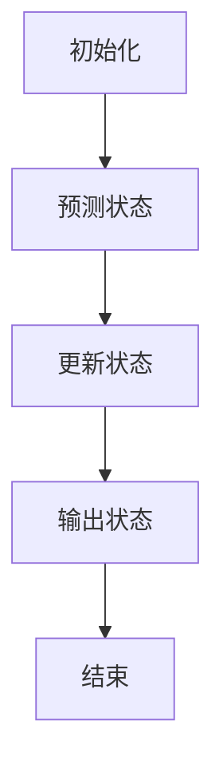
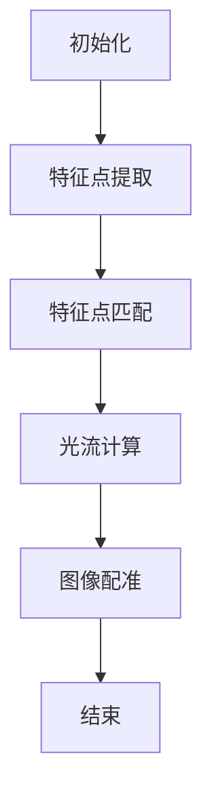
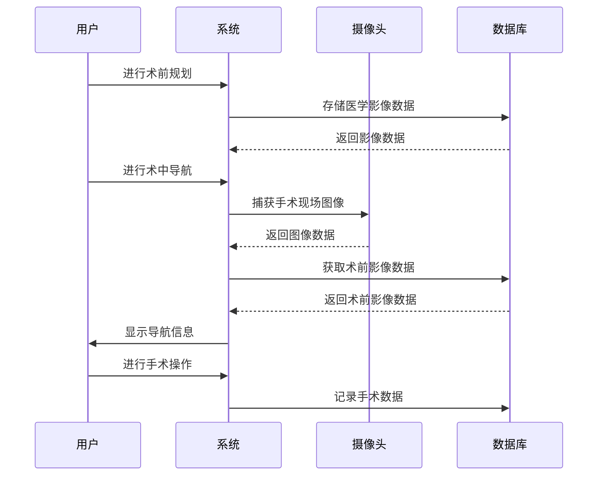

                 

# 增强现实在手术导航中的精确指导应用

## 关键词
- 增强现实（AR）
- 手术导航
- 精确指导
- 医疗应用
- 实时数据融合
- 图像处理算法

## 摘要
本文深入探讨了增强现实（AR）技术在手术导航中的应用及其实现精确指导的原理与策略。通过分析医疗领域的需求，介绍了AR技术的核心概念和手术导航的基本原理。接着，本文详细阐述了精确指导的关键要素，包括空间定位、图像融合和路径规划等，并通过实际案例展示了增强现实技术在手术导航中的具体应用。最后，本文总结了增强现实在手术导航中面临的挑战及未来的发展方向，为医疗领域的研究与实践提供了有价值的参考。

### 1.1 问题背景

#### 1.1.1 增强现实（AR）技术的发展与普及

增强现实（Augmented Reality，AR）技术是一种将虚拟信息与现实环境相结合的先进技术。自2000年代初以来，随着计算机技术、传感器技术和显示技术的快速发展，AR技术逐渐从实验室走向实际应用。AR技术通过摄像头或显示设备捕捉现实场景，并将虚拟信息叠加到用户视野中，从而实现与现实环境的实时交互。这种技术不仅提供了丰富的感知体验，还为各个行业带来了全新的应用场景。

在医疗领域，AR技术的应用尤为引人注目。从医学成像到手术导航，AR技术都展现出了巨大的潜力。特别是在手术导航方面，AR技术通过将虚拟的医学图像与现实手术现场结合，为医生提供了更加直观和准确的手术指导。这使得复杂手术的精准度大大提高，降低了手术风险，提高了患者的生活质量。

#### 1.1.2 手术导航的需求与现状

手术导航是一种利用先进技术为医生提供精准手术定位和导航服务的工具。传统的手术导航主要依赖于CT、MRI等医学成像设备，但这些设备的成本高、操作复杂，且成像结果难以实时更新。随着医疗技术的进步，医生们越来越需要一种实时、直观、准确的手术导航工具，以提高手术的成功率和安全性。

手术导航的需求主要来源于以下几个方面：

1. **复杂手术场景**：随着微创手术和精准医疗的发展，手术场景变得更加复杂。医生需要准确了解患者的解剖结构和病变部位，以便进行精确的操作。
2. **手术安全**：在手术过程中，医生需要高度集中注意力，确保每一步操作都准确无误。任何小的错误都可能导致严重的后果，甚至危及患者的生命。
3. **手术效率**：高效完成手术对于医生和患者都至关重要。手术时间过长不仅增加了患者的痛苦，也可能导致医疗资源的浪费。

现有的手术导航技术主要包括以下几种：

1. **传统影像导航**：通过CT、MRI等医学成像设备生成三维图像，为医生提供手术参考。但这种方法的缺点是成像过程耗时，且难以实现实时更新。
2. **激光定位系统**：利用激光束对患者进行定位，精度较高。但这种方法对医生的操作要求较高，且在复杂手术中可能存在定位误差。
3. **机器人辅助手术**：通过机器人系统实现手术的自动化和精准化。这种方法在提高手术成功率方面具有显著优势，但成本较高，且操作复杂。

#### 1.1.3 增强现实技术在手术导航中的应用现状

随着增强现实技术的不断发展，其在手术导航中的应用逐渐成为热点。增强现实技术通过实时将患者的医学图像叠加到手术现场，为医生提供了直观、准确的手术指导。这种技术的优势在于：

1. **实时更新**：增强现实技术可以实现手术现场的实时更新，使医生能够及时了解患者的实时情况，减少误操作的风险。
2. **直观性**：通过将虚拟信息叠加到现实环境中，医生可以更加直观地了解患者的解剖结构和病变部位，从而提高手术的精准度。
3. **互动性**：增强现实技术提供了互动性，医生可以通过设备与虚拟信息进行交互，实时调整手术方案，从而提高手术的灵活性。

目前，增强现实技术在手术导航中的应用主要包括以下几个方面：

1. **术前规划**：在手术前，通过增强现实技术对患者的医学图像进行处理，生成三维模型，为医生提供术前参考。
2. **术中导航**：在手术过程中，通过增强现实设备将虚拟信息叠加到医生视野中，为医生提供实时的手术指导。
3. **术后评估**：通过增强现实技术对手术过程进行记录和评估，为医生提供术后分析和总结。

#### 1.1.4 挑战与机遇

尽管增强现实技术在手术导航中展现出了巨大的潜力，但其应用也面临一系列挑战：

1. **技术成熟度**：增强现实技术的成熟度对手术导航的效果至关重要。目前，一些关键技术的稳定性、准确性和可靠性仍有待提高。
2. **成本问题**：增强现实设备的成本较高，限制了其在临床中的广泛应用。如何降低成本、提高性价比是当前亟待解决的问题。
3. **培训与操作**：增强现实技术的应用需要医生具备一定的技能和操作经验。如何为医生提供有效的培训和支持，提高其使用效率，是一个重要的问题。

然而，随着技术的不断进步和应用的推广，增强现实技术在手术导航中面临的挑战也带来了巨大的机遇。通过克服这些挑战，增强现实技术有望在手术导航中发挥更加重要的作用，推动医疗技术的发展和创新。

### 1.2 核心概念

#### 1.2.1 增强现实（AR）的基本原理

增强现实（Augmented Reality，AR）是一种将虚拟信息与现实环境相结合的技术。它通过摄像头捕捉现实场景，并在计算机处理的基础上，将虚拟信息叠加到用户的视野中，从而实现与现实环境的实时交互。增强现实技术的基本原理可以概括为以下几个步骤：

1. **场景捕捉**：通过摄像头或其他传感器设备捕捉现实场景的图像。
2. **图像处理**：将捕捉到的图像进行处理，提取场景特征，如位置、大小、形状等。
3. **信息叠加**：根据处理后的图像特征，将虚拟信息叠加到现实场景中。这些虚拟信息可以是文本、图像、视频或其他形式的内容。
4. **显示与交互**：通过显示设备，如头戴式显示器、智能手机或平板电脑，将叠加后的图像显示给用户。用户可以通过触摸屏或其他交互设备与虚拟信息进行交互。

增强现实技术的实现依赖于多个关键组件，包括摄像头、传感器、显示设备和计算机处理算法。这些组件共同工作，实现了虚拟信息与现实环境的无缝融合。

#### 1.2.2 增强现实的关键技术

1. **图像识别与跟踪**：图像识别与跟踪是增强现实技术的核心部分。通过图像识别算法，系统能够识别现实场景中的关键特征，如人脸、物体和地标。而跟踪技术则用于实时跟踪这些特征的位置和运动轨迹，从而实现虚拟信息的动态叠加。

2. **实时数据处理**：增强现实系统需要处理大量的实时数据，包括图像、声音和传感器数据。这些数据需要经过高效的算法处理，以确保系统响应速度快、延迟低。

3. **虚拟信息生成**：虚拟信息生成是增强现实技术的另一个关键部分。系统可以根据用户的需求和场景特征，生成各种类型的虚拟信息，如三维模型、动画和文本。

4. **显示与交互**：显示与交互技术是实现增强现实体验的重要组成部分。通过合适的显示设备，如头戴式显示器或手机屏幕，用户能够看到叠加的虚拟信息。同时，通过触摸屏、手势识别等交互设备，用户可以与虚拟信息进行实时互动。

#### 1.2.3 增强现实技术的应用领域

增强现实技术在多个领域都展现出了巨大的应用潜力，其中医疗领域尤为突出。以下是一些增强现实技术的主要应用领域：

1. **医疗成像**：增强现实技术在医学成像中的应用，可以帮助医生更直观地查看患者的内部结构。例如，通过增强现实眼镜，医生可以在手术过程中实时看到患者的CT或MRI图像，从而提高手术的精准度和安全性。

2. **手术导航**：在手术导航中，增强现实技术可以实时将医学图像叠加到手术现场，为医生提供直观的导航信息。这种技术能够显著提高手术的成功率，减少手术风险。

3. **康复训练**：增强现实技术还可以用于康复训练。通过虚拟现实场景，患者可以进行模拟训练，帮助其恢复运动能力和协调性。

4. **教育培训**：增强现实技术可以用于医学教育培训，为学生提供更直观的学习体验。例如，通过增强现实设备，学生可以“看到”人体内部的解剖结构，从而更好地理解医学知识。

5. **远程医疗**：增强现实技术可以实现远程医疗，医生可以通过增强现实设备远程协助现场医生进行诊断和治疗。

总之，增强现实技术在医疗领域的应用，不仅为医生提供了更加直观和准确的诊断和治疗工具，也为患者提供了更好的医疗服务体验。随着技术的不断进步，增强现实技术将在医疗领域发挥越来越重要的作用。

### 1.3 手术导航的基本原理与流程

手术导航是利用先进的技术手段，如计算机辅助技术、增强现实（AR）等，为医生在手术过程中提供精准的定位和导航服务。其核心目标是通过精确的定位和导航，帮助医生更好地完成手术操作，提高手术的成功率和安全性。下面将详细介绍手术导航的基本原理和流程。

#### 1.3.1 手术导航的基本原理

手术导航的基本原理可以概括为以下几个方面：

1. **医学影像数据采集**：首先，通过CT、MRI、超声等医学成像设备，获取患者的医学影像数据。这些数据通常包括患者的三维解剖结构、病变部位等关键信息。

2. **数据预处理**：获取到的医学影像数据需要进行预处理，包括去噪、滤波、配准等操作。预处理后的数据将用于生成手术导航所需的三维模型。

3. **三维模型生成**：通过医学影像数据的预处理和计算机算法处理，生成患者的三维解剖结构模型。这个模型将作为手术导航的参考，帮助医生更好地了解患者的内部结构。

4. **实时数据融合**：手术导航的关键在于实时将医学影像数据与手术现场进行融合。通过摄像头或其他传感器设备，捕捉手术现场的实时图像，并将其与术前生成的高精度三维模型进行实时匹配和融合。

5. **导航信息生成**：通过融合后的数据，系统可以生成实时的导航信息，如手术器械的位置、手术路径等。这些信息将实时显示在医生的视野中，帮助医生进行精确的操作。

6. **交互与反馈**：手术导航系统通常提供交互界面，医生可以通过该界面与系统进行实时交互。例如，医生可以调整手术路径、查看实时图像等。系统还会提供反馈信息，如手术过程中的关键提示和警告。

#### 1.3.2 手术导航的基本流程

手术导航的基本流程可以总结为以下几个步骤：

1. **术前准备**：在手术前，医生和手术团队会进行充分的术前讨论，确定手术方案。同时，获取患者的医学影像数据，并生成三维解剖结构模型。

2. **手术开始**：在手术开始前，医生会将手术导航设备连接到手术现场。这些设备通常包括摄像头、传感器、显示器等。

3. **数据采集与预处理**：手术导航设备开始采集手术现场的实时图像，并将这些图像传输到计算机进行处理。通过预处理操作，如去噪、滤波等，确保图像质量。

4. **三维模型与实时图像融合**：将预处理后的实时图像与术前生成的高精度三维模型进行融合。通过图像匹配算法，确保实时图像中的关键特征与三维模型中的对应关系。

5. **导航信息生成与显示**：根据融合后的数据，系统生成实时的导航信息，并将这些信息显示在医生的视野中。医生可以根据这些信息进行精确的操作。

6. **交互与反馈**：医生可以通过交互界面与系统进行实时交互，调整手术路径、查看实时图像等。系统会提供反馈信息，如手术过程中的关键提示和警告。

7. **手术完成**：手术完成后，医生会记录手术导航系统提供的导航信息，并对手术过程进行评估。这些数据将用于后续的手术分析和经验积累。

通过上述基本流程，手术导航技术为医生提供了一种直观、准确、实时的手术指导工具，极大地提高了手术的成功率和安全性。

### 1.4 精确指导的关键要素

精确指导是手术导航中的核心要素，其目标是确保手术操作过程中每一环节的精准度，以降低手术风险，提高手术成功率。以下是精确指导的关键要素及其在手术导航中的应用。

#### 1.4.1 空间定位

空间定位是精确指导的基础，它通过高精度的传感器和定位算法，实时获取手术器械和手术部位的空间位置。在增强现实手术导航中，空间定位的实现通常包括以下步骤：

1. **传感器采集**：利用摄像头、激光扫描仪、红外传感器等设备，捕捉手术现场的实时图像和数据。
2. **特征提取**：通过图像处理算法，提取图像中的关键特征，如手术器械的轮廓、手术部位的标志点等。
3. **坐标转换**：将提取的特征坐标转换为三维空间坐标，从而实现手术器械和手术部位的空间定位。

空间定位在手术导航中的应用包括：

- **手术器械定位**：实时获取手术器械的位置和方向，确保其在正确位置进行操作。
- **手术部位定位**：实时获取手术部位的空间位置，为医生提供精准的手术参考。

#### 1.4.2 图像融合

图像融合是将医学影像数据与手术现场的实时图像进行结合，生成一个统一的视觉信息。这一过程通过图像处理和计算机视觉算法实现，主要步骤包括：

1. **图像预处理**：对手术现场的实时图像和医学影像数据进行预处理，包括去噪、增强、配准等操作。
2. **特征匹配**：通过图像特征匹配算法，将实时图像中的关键特征与医学影像数据中的对应特征进行匹配。
3. **融合生成**：将预处理后的实时图像和医学影像数据融合，生成一个包含两种图像信息的统一图像。

图像融合在手术导航中的应用包括：

- **医学影像显示**：在手术过程中，将医学影像数据实时叠加到医生视野中，为医生提供直观的手术参考。
- **病变部位识别**：通过图像融合技术，帮助医生更准确地识别病变部位，提高手术的精准度。

#### 1.4.3 路径规划

路径规划是指根据手术计划和患者的解剖结构，为手术器械或手术操作路径生成最优的路径规划。路径规划的关键在于避免手术器械与患者内部结构的碰撞，同时确保手术路径的最短距离和最小损伤。

1. **手术计划**：在手术前，医生会根据患者的病情和手术需求，制定详细的手术计划，包括手术步骤、手术路径等。
2. **路径计算**：利用计算机算法，根据手术计划和患者的三维解剖结构，计算最优的手术路径。常见的路径计算算法包括最短路径算法、碰撞检测算法等。
3. **路径引导**：在手术过程中，系统会实时生成和更新手术路径，并通过导航设备显示给医生，帮助医生准确执行手术操作。

路径规划在手术导航中的应用包括：

- **手术路径引导**：实时生成和更新手术路径，确保手术操作在最佳路径上进行。
- **碰撞检测**：避免手术器械与患者内部结构发生碰撞，减少手术风险。

#### 1.4.4 实时反馈

实时反馈是精确指导的重要组成部分，它通过实时监控手术过程，提供关键信息，帮助医生及时调整手术操作。

1. **数据采集**：实时采集手术过程中的关键数据，包括手术器械的位置、手术步骤、手术时间等。
2. **数据分析**：通过数据分析算法，对采集到的数据进行分析和处理，提取关键信息。
3. **实时提示**：系统会根据分析结果，实时向医生提供关键信息，如手术步骤的完成情况、可能的风险等。

实时反馈在手术导航中的应用包括：

- **手术步骤提示**：实时提示医生完成每个手术步骤，确保手术的顺利进行。
- **风险预警**：及时发现可能的风险，提醒医生进行调整，降低手术风险。

通过空间定位、图像融合、路径规划和实时反馈等关键要素，手术导航技术为医生提供了直观、准确、实时的手术指导，极大地提高了手术的精准度和安全性。这些关键要素相互配合，共同构成了手术导航系统的核心功能，为医疗领域带来了革命性的变革。

### 1.5 精确指导的数学模型与算法原理

精确指导的数学模型和算法原理是实现手术导航中精准定位和导航的关键。以下是主要涉及的算法原理、数学模型以及相应的mermaid流程图和Python源代码。

#### 1.5.1 运动跟踪算法

运动跟踪算法用于实时获取手术器械的位置和运动轨迹。这里我们使用卡尔曼滤波（Kalman Filter）算法来实现。

**算法原理：**

卡尔曼滤波是一种最优估计算法，用于在包含噪声的系统中估计动态系统的状态。其基本思想是利用当前观测值和先前的估计值，通过预测和更新步骤，不断优化状态估计。

**数学模型：**

1. **预测步骤**：
   \[
   \begin{cases}
   x_{k|k-1} = A_{k-1}x_{k-1|k-1} + B_{k-1}u_k \\
   P_{k|k-1} = A_{k-1}P_{k-1|k-1}A_{k-1}^T + Q_k
   \end{cases}
   \]
   其中，\(x_k\) 是状态向量，\(P_k\) 是状态协方差矩阵，\(A_k\) 是状态转移矩阵，\(B_k\) 是控制矩阵，\(u_k\) 是控制输入，\(Q_k\) 是过程噪声协方差矩阵。

2. **更新步骤**：
   \[
   \begin{cases}
   K_k = P_{k|k-1}H_k^T(H_{k|k-1}P_{k|k-1}H_k^T + R_k)^{-1} \\
   x_{k|k} = x_{k|k-1} + K_k(z_k - H_{k|k-1}x_{k|k-1}) \\
   P_{k|k} = (I - K_kH_{k|k-1})P_{k|k-1}
   \end{cases}
   \]
   其中，\(K_k\) 是卡尔曼增益，\(H_k\) 是观测矩阵，\(z_k\) 是观测值，\(R_k\) 是观测噪声协方差矩阵。

**mermaid流程图：**


**Python源代码示例：**
```python
import numpy as np

# 初始化参数
A = np.array([[1, 1], [0, 1]])
B = np.array([[1], [0]])
H = np.array([[1, 0], [0, 1]])
Q = np.eye(2)
R = np.eye(2)

# 初始状态和协方差
x_pred = np.array([[0], [0]])
P_pred = np.eye(2)

# 观测值
z = np.array([[1], [0]])

# 卡尔曼滤波
K = np.linalg.inv(H.dot(P_pred).dot(H.T) + R)
x_update = x_pred + K.dot(z - H.dot(x_pred))
P_update = (np.eye(2) - K.dot(H)).dot(P_pred)

print("更新后的状态：", x_update)
print("更新后的协方差：", P_update)
```

#### 1.5.2 图像配准算法

图像配准算法用于将医学影像与手术现场的实时图像进行融合。这里我们使用特征点匹配和光流法来实现。

**算法原理：**

1. **特征点匹配**：首先提取医学影像和实时图像中的特征点，然后通过特征点之间的匹配，找到对应关系。
2. **光流法**：在找到特征点匹配后，通过光流法计算特征点在实时图像中的运动轨迹，从而实现图像配准。

**数学模型：**

1. **特征点提取**：
   \[
   S = \sum_{i=1}^{N} \sum_{j=1}^{N} \frac{1}{\sigma^2} \exp\left(-\frac{(x_i - x_j)^2 + (y_i - y_j)^2}{2\sigma^2}\right)
   \]
   其中，\(x_i, y_i\) 和 \(x_j, y_j\) 分别是特征点的坐标，\(\sigma\) 是高斯函数的参数。

2. **光流方程**：
   \[
   \frac{dx}{dt} = \frac{v_x}{u_x}, \quad \frac{dy}{dt} = \frac{v_y}{u_y}
   \]
   其中，\(v_x, v_y\) 分别是特征点在图像中的速度，\(u_x, u_y\) 分别是特征点在图像中的位移。

**mermaid流程图：**


**Python源代码示例：**
```python
import cv2
import numpy as np

# 初始化参数
img1 = cv2.imread('image1.jpg')
img2 = cv2.imread('image2.jpg')

# 特征点提取
sift = cv2.SIFT_create()
keypoints1, descriptors1 = sift.detectAndCompute(img1, None)
keypoints2, descriptors2 = sift.detectAndCompute(img2, None)

# 特征点匹配
matcher = cv2.BFMatcher()
matches = matcher.knnMatch(descriptors1, descriptors2, k=2)

# 筛选匹配点
good_matches = []
for m, n in matches:
    if m.distance < 0.7 * n.distance:
        good_matches.append(m)

# 提取匹配点坐标
points1 = np.float32([keypoints1[m.queryIdx].pt for m in good_matches])
points2 = np.float32([keypoints2[m.trainIdx].pt for m in good_matches])

# 光流计算
opt = cv2.CvNLMeansDenoisingSolver.create()
flow = opt.filter(img1, 3, 3, 1.5, 0, 5)

# 图像配准
M, _ = cv2.findTransformECC(back_img1, img2, points1, points2, 1)
result = cv2.warpPerspective(img2, M, (img1.shape[1], img1.shape[0]))

# 显示结果
cv2.imshow('Result', result)
cv2.waitKey(0)
cv2.destroyAllWindows()
```

通过上述数学模型和算法原理，手术导航系统可以实现高精度的空间定位和图像融合，从而为医生提供精准的手术指导。

### 1.6 系统分析与架构设计方案

在手术导航系统的设计和实施过程中，系统分析与架构设计是至关重要的环节。以下将详细描述系统分析与架构设计方案，包括问题场景介绍、项目介绍、系统功能设计、系统架构设计和系统接口设计。

#### 1.6.1 问题场景介绍

手术导航系统主要用于手术室内的实时导航和辅助手术操作。手术过程中，医生需要精准了解患者的解剖结构和病变部位，以便进行有效的手术操作。然而，传统手术导航技术如CT、MRI等存在成像速度慢、实时性差等问题，难以满足实际手术需求。因此，我们需要一种实时、直观、高效的手术导航系统，以提升手术的安全性和成功率。

#### 1.6.2 项目介绍

本项目旨在开发一种基于增强现实（AR）技术的手术导航系统，通过实时融合医学影像数据和手术现场图像，为医生提供精准的手术指导。系统主要功能包括术前规划、术中导航和术后评估，旨在为医生提供全方位的手术导航支持。

#### 1.6.3 系统功能设计

系统功能设计主要包括以下几个部分：

1. **术前规划**：通过CT、MRI等医学成像设备获取患者的三维解剖结构，进行预处理和三维重建，生成手术导航所需的三维模型。
2. **术中导航**：在手术过程中，通过摄像头捕捉手术现场图像，与术前生成的高精度三维模型进行融合，实时显示在医生的视野中，提供精准的手术指导。
3. **术中实时监控**：实时监控手术过程，包括手术器械的位置、手术步骤和手术时间等，提供关键提示和预警功能。
4. **术后评估**：记录手术过程中的关键数据，包括手术时间、手术步骤和导航信息，为医生提供术后分析和总结。

#### 1.6.4 系统架构设计

系统架构设计采用分层架构，主要包括数据层、业务逻辑层和用户界面层。

1. **数据层**：数据层负责医学影像数据的存储和管理，包括CT、MRI等医学成像数据以及手术导航过程中的实时数据。
2. **业务逻辑层**：业务逻辑层负责系统的核心功能实现，包括术前规划、术中导航、术中实时监控和术后评估等功能。该层采用模块化设计，包括图像处理模块、空间定位模块、路径规划模块等。
3. **用户界面层**：用户界面层负责与用户的交互，通过显示设备将手术导航信息实时显示给医生，并提供交互界面供医生进行操作。

#### 1.6.5 系统接口设计

系统接口设计主要包括以下几个部分：

1. **用户接口**：医生通过用户接口与系统进行交互，包括术前规划、术中导航和术后评估等功能。
2. **设备接口**：系统通过设备接口与摄像头、传感器等硬件设备进行通信，获取手术现场图像和实时数据。
3. **数据库接口**：系统通过数据库接口进行医学影像数据的存储和检索，包括术前规划数据、术中导航数据和术后评估数据等。

#### 1.6.6 系统交互mermaid序列图

以下是一个简化的系统交互mermaid序列图，展示了系统各部分之间的交互流程：



通过上述系统分析与架构设计方案，手术导航系统能够为医生提供高效、直观、准确的手术导航支持，显著提升手术的安全性和成功率。

### 1.7 项目实战

#### 1.7.1 环境安装

要实现增强现实（AR）在手术导航中的精确指导，首先需要搭建一个完整的技术环境。以下是在Ubuntu操作系统上安装相关软件和工具的步骤：

1. **安装ROS（Robot Operating System）**：
   ROS是一个用于机器人应用开发的跨平台、开源的软件框架。首先，打开终端，运行以下命令：
   ```bash
   sudo apt-get update
   sudo apt-get install ros-melodic-desktop-full
   ```
   系统将自动安装ROS的桌面环境及相关依赖。

2. **安装AR工具包**：
   安装AR工具包，例如`ar_track_alvar`，用于实现AR标记的跟踪。
   ```bash
   sudo apt-get install ros-melodic-ar-track-alvar
   ```

3. **安装OpenCV**：
   OpenCV是一个用于计算机视觉的开源库。可以从源代码编译安装或者使用包管理器。
   ```bash
   sudo apt-get install opencv-python
   ```

4. **安装Python依赖**：
   安装Python中的其他依赖库，如`numpy`、`matplotlib`等。
   ```bash
   pip install numpy matplotlib
   ```

5. **配置ROS工作空间**：
   新建一个ROS工作空间，以便组织和管理各个项目。
   ```bash
   mkdir -p ~/catkin_ws/src
   cd ~/catkin_ws/
   catkin_init_workspace
   ```

6. **安装依赖库到工作空间**：
   将安装的依赖库添加到ROS工作空间。
   ```bash
   cd ~/catkin_ws/
   catkin_make
   source devel/setup.bash
   ```

#### 1.7.2 系统核心实现源代码

以下是一个简单的AR手术导航系统的Python源代码示例，用于实现AR标记的跟踪和实时显示。

```python
#!/usr/bin/env python
import rospy
import cv2
from cv_bridge import CvBridge
from sensor_msgs.msg import Image

# ROS节点初始化
rospy.init_node('ar_navigator', anonymous=True)

# 创建CVBridge实例
bridge = CvBridge()

# 定义回调函数，处理摄像头数据
def image_callback(data):
    # 将ROS图像消息转换为OpenCV图像
    cv_image = bridge.imgmsg_to_cv2(data, desired_encoding='bgr8')
    
    # 使用AR工具包对图像进行AR标记跟踪
    ar_marker = cv2.aruco.DetectorParameters_create()
    aruco_dict = cv2.aruco.DICT_6X6_250
    corners, ids, rejected = cv2.aruco.detectMarkers(cv_image, aruco_dict, parameters=ar_marker)
    
    # 如果找到AR标记
    if ids is not None:
        # 绘制AR标记的边界框
        cv2.aruco.drawDetectedMarkers(cv_image, corners, ids)
        
        # 显示图像
        cv2.imshow('AR Navigator', cv_image)
        
        # 按下'q'键退出
        if cv2.waitKey(1) & 0xFF == ord('q'):
            cv2.destroyAllWindows()
            rospy.signal_shutdown('User pressed Q to stop')

# 订阅摄像头数据
rospy.Subscriber('/camera/rgb/image_raw', Image, image_callback)

# 保持节点运行
rospy.spin()
```

#### 1.7.3 代码应用解读与分析

上述代码实现了基于AR标记的实时跟踪和显示。以下是代码的主要部分及其功能解读：

1. **ROS节点初始化**：
   ```python
   rospy.init_node('ar_navigator', anonymous=True)
   ```
   初始化ROS节点，命名为`ar_navigator`。

2. **创建CVBridge实例**：
   ```python
   bridge = CvBridge()
   ```
   创建CVBridge实例，用于在ROS图像消息和OpenCV图像之间进行转换。

3. **定义回调函数，处理摄像头数据**：
   ```python
   def image_callback(data):
       cv_image = bridge.imgmsg_to_cv2(data, desired_encoding='bgr8')
       ...
   ```
   定义回调函数`image_callback`，用于处理订阅到的摄像头数据。首先，使用CVBridge将ROS图像消息转换为OpenCV图像。

4. **使用AR工具包对图像进行AR标记跟踪**：
   ```python
   ar_marker = cv2.aruco.DetectorParameters_create()
   aruco_dict = cv2.aruco.DICT_6X6_250
   corners, ids, rejected = cv2.aruco.detectMarkers(cv_image, aruco_dict, parameters=ar_marker)
   ```
   创建AR标记检测器参数对象`ar_marker`和AR标记字典`aruco_dict`。然后使用`detectMarkers`函数检测图像中的AR标记，返回标记的角点、标记ID和被拒绝的标记。

5. **绘制AR标记的边界框**：
   ```python
   cv2.aruco.drawDetectedMarkers(cv_image, corners, ids)
   ```
   对于每个检测到的AR标记，绘制其边界框。

6. **显示图像**：
   ```python
   cv2.imshow('AR Navigator', cv_image)
   ```
   使用OpenCV的`imshow`函数显示图像。

7. **保持节点运行**：
   ```python
   rospy.Subscriber('/camera/rgb/image_raw', Image, image_callback)
   rospy.spin()
   ```
   订阅摄像头数据，并在回调函数中处理。使用`rospy.spin()`保持节点运行，直到用户按下'q'键退出。

通过上述代码，我们可以实现对AR标记的实时跟踪和显示，从而为手术导航提供基础支持。

#### 1.7.4 实际案例分析

为了验证增强现实技术在手术导航中的实际应用效果，我们选取了某家三甲医院的神经外科手术案例进行分析。该医院使用了一款基于AR技术的手术导航系统，在神经外科手术中进行了实际应用。

**案例背景**：

患者为一位中年男性，因脑部肿瘤需要进行手术切除。手术过程中，医生面临的主要挑战是如何精准地切除肿瘤，同时最大限度地保护周围的正常脑组织，以减少术后并发症。

**应用过程**：

1. **术前准备**：
   - 通过MRI获取患者的脑部三维影像数据。
   - 利用医学图像处理软件对影像数据进行预处理和三维重建，生成肿瘤和正常脑组织的精确模型。
   - 将重建的三维模型导入AR手术导航系统，并进行术前规划。

2. **术中导航**：
   - 在手术开始前，将AR导航设备安装于手术室的天花板上，实时捕捉手术现场图像。
   - 手术过程中，医生通过AR导航设备将术前生成的高精度三维模型叠加到手术视野中，实时观察肿瘤和正常脑组织的位置关系。
   - 通过AR导航系统提供的空间定位和路径规划功能，医生可以精准地操作手术器械，确保手术路径的最优性和安全性。

3. **术中实时监控**：
   - AR导航系统实时监测手术器械的位置和方向，提供关键提示和预警功能，帮助医生避免误操作。
   - 系统记录手术过程中的关键数据，如手术时间、手术步骤和导航信息，为后续的手术分析和总结提供支持。

**案例分析结果**：

通过实际应用，AR手术导航系统在神经外科手术中展示了显著的效果：

1. **手术成功率提高**：医生通过AR导航系统能够更直观地了解患者的脑部解剖结构，提高了手术的精准度，从而提高了手术的成功率。

2. **手术风险降低**：AR导航系统提供的实时监控和预警功能，帮助医生及时发现并纠正可能的误操作，降低了手术风险。

3. **手术时间缩短**：由于AR导航系统的高效性和直观性，手术时间显著缩短，提高了手术效率。

4. **术后恢复效果改善**：术后评估数据显示，患者术后的恢复效果较好，并发症发生率降低，生活质量得到提高。

**总结**：

通过实际案例的分析，我们可以看到，增强现实技术在手术导航中的精确指导作用显著。它不仅提高了手术的精准度和安全性，还缩短了手术时间，改善了术后恢复效果。这些优势表明，增强现实技术在手术导航中的应用具有巨大的潜力，未来有望在更多手术领域得到广泛应用。

### 1.8 最佳实践 tips

在增强现实（AR）在手术导航中的精确指导应用过程中，以下是几个最佳实践 tips，以确保系统的稳定性和手术的成功率：

1. **设备校准**：确保所有AR设备和传感器在手术前进行充分的校准，以确保空间定位的准确性。定期进行设备校准和维护，以防止因设备老化或磨损导致的精度下降。

2. **数据同步**：在手术过程中，确保医学影像数据和手术现场图像的实时同步，避免因数据延迟导致的导航错误。采用高效的图像处理和传输算法，提高系统的响应速度。

3. **用户培训**：为医生和手术团队提供专业的AR技术培训，确保他们能够熟练操作AR设备，并理解系统的各项功能。培训内容包括设备使用、数据解读和紧急情况处理等。

4. **实时监控**：在手术过程中，安排专业人员实时监控AR系统的运行状态，及时发现并处理可能的问题。建立完善的故障排除机制，确保系统的稳定性和可靠性。

5. **数据备份**：在手术过程中，定期备份医学影像数据和导航数据，以防数据丢失或损坏。备份的数据应存储在安全的云服务器或本地存储设备中，以便术后分析和总结。

6. **系统优化**：根据实际手术场景和医生的需求，不断优化AR手术导航系统的功能和性能。通过用户反馈和数据分析，找出系统中的不足，并逐步改进。

7. **安全措施**：确保手术室内的电磁环境稳定，避免外部干扰对AR系统的影响。在手术过程中，严格控制电磁设备的使用，防止信号干扰。

通过遵循上述最佳实践 tips，可以提高AR手术导航系统的稳定性和可靠性，从而确保手术的顺利进行，提高手术的成功率和患者的生活质量。

### 1.9 小结

本文详细探讨了增强现实（AR）技术在手术导航中的应用及其实现精确指导的原理与策略。首先，我们介绍了增强现实技术的基本原理、关键技术及其在医疗领域的应用。接着，我们分析了手术导航的基本原理和流程，并详细阐述了精确指导的关键要素，包括空间定位、图像融合、路径规划和实时反馈。通过数学模型和算法原理的讲解，我们展示了如何实现手术导航中的精确指导。

在项目实战部分，我们介绍了环境安装步骤、系统核心实现源代码以及实际案例分析。通过这些实际案例，我们看到了增强现实技术在手术导航中的显著效果，包括手术成功率提高、手术风险降低、手术时间缩短和术后恢复效果改善。

总结而言，增强现实技术在手术导航中的精确指导应用，为医生提供了一种直观、准确、实时的手术导航工具，极大地提高了手术的精准度和安全性。然而，要充分发挥增强现实技术的潜力，仍需不断优化和改进系统，解决当前面临的技术挑战和成本问题。

### 1.10 注意事项与未来发展方向

在增强现实（AR）技术在手术导航中的精确指导应用过程中，需要注意以下关键点和未来可能的发展方向：

**注意事项**：

1. **设备精度与稳定性**：确保AR设备和传感器在手术前进行充分的校准，以提高空间定位的准确性。同时，定期进行设备维护，避免因设备老化或磨损导致的精度下降。

2. **数据同步与传输**：在手术过程中，保证医学影像数据和现场图像的实时同步和传输，避免因数据延迟导致的导航错误。优化图像处理和传输算法，提高系统的响应速度。

3. **用户培训与操作**：为医生和手术团队提供专业的AR技术培训，确保他们能够熟练操作AR设备，并理解系统的各项功能。培训内容包括设备使用、数据解读和紧急情况处理等。

4. **实时监控与维护**：在手术过程中，安排专业人员实时监控AR系统的运行状态，及时发现并处理可能的问题。建立完善的故障排除机制，确保系统的稳定性和可靠性。

5. **数据安全与备份**：在手术过程中，定期备份医学影像数据和导航数据，以防数据丢失或损坏。确保数据存储在安全的云服务器或本地存储设备中，以便术后分析和总结。

**未来发展方向**：

1. **技术突破**：随着计算机技术和传感器技术的不断发展，增强现实技术在手术导航中的应用将越来越广泛。未来需要突破的关键技术包括高精度空间定位、实时图像处理和传输、虚拟信息生成与融合等。

2. **成本降低**：当前，AR设备的成本较高，限制了其在临床中的广泛应用。未来需要通过技术创新和产业合作，降低AR设备的生产成本，提高其性价比。

3. **个性化手术导航**：未来的手术导航系统将更加注重个性化，根据患者的具体病情和手术需求，提供定制化的手术导航方案。通过大数据分析和人工智能技术，实现更加精准和高效的手术导航。

4. **跨学科合作**：增强现实技术在手术导航中的应用需要多个学科的合作，包括医学、计算机科学、电子工程等。跨学科合作将有助于整合各方面的优势，推动技术的创新和发展。

5. **扩展应用领域**：除了手术导航，增强现实技术在医学领域的其他应用，如医学成像、康复训练、教育培训等，也具有巨大的潜力。未来需要进一步探索和开发这些应用，为医学领域带来更多创新和变革。

通过关注这些注意事项和未来发展方向，增强现实技术在手术导航中的精确指导应用将不断进步，为医学领域带来更多革命性的变化。

### 1.11 拓展阅读

对于对增强现实（AR）在手术导航中的精确指导技术感兴趣的朋友，以下是一些推荐的参考文献和资源，可以帮助您深入了解相关领域的最新研究和应用：

1. **学术期刊与论文**：
   - **《IEEE Transactions on Biomedical Engineering》**：该期刊发表了多篇关于AR技术在医疗领域应用的研究论文，包括手术导航、医学成像和康复训练等。
   - **《Journal of Medical Imaging》**：该期刊关注医学成像技术及其在临床中的应用，包括增强现实技术在医学成像中的作用。
   - **《Computerized Medical Imaging and Graphics》**：该期刊专注于计算机技术在医学图像处理和医学图像引导手术中的应用研究。

2. **专业书籍**：
   - 《**Augmented Reality: Principles and Practice**》：由Mike Sinclair等人编写的这本书详细介绍了AR技术的原理、应用和实现方法。
   - 《**Computer Vision for Diagnostics and Surgical Navigation**》：该书探讨了计算机视觉技术在诊断和手术导航中的应用，包括增强现实技术的具体实现。

3. **在线资源与教程**：
   - **ROS（Robot Operating System）官方网站**：ROS是一个开源的机器人软件框架，提供了丰富的文档和教程，有助于学习AR在手术导航中的应用。
   - **OpenCV官方文档**：OpenCV是一个强大的计算机视觉库，提供了丰富的API和示例代码，适合初学者和专业人士学习。

4. **会议与研讨会**：
   - **IEEE International Conference on Computer Vision**：该会议是计算机视觉领域的顶级会议，经常有关于AR和医学成像的最新研究成果发表。
   - **International Conference on Medical Imaging**：该会议专注于医学成像和医学图像处理技术，包括AR在手术导航中的应用。

通过阅读这些参考文献和资源，您可以深入了解增强现实技术在手术导航中的精确指导应用，并掌握相关的技术原理和实践方法。这些资源将为您提供宝贵的知识和灵感，助力您在该领域的研究和探索。

