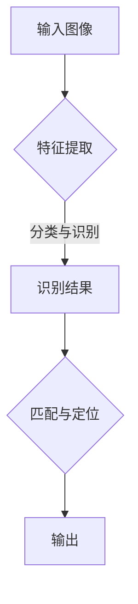
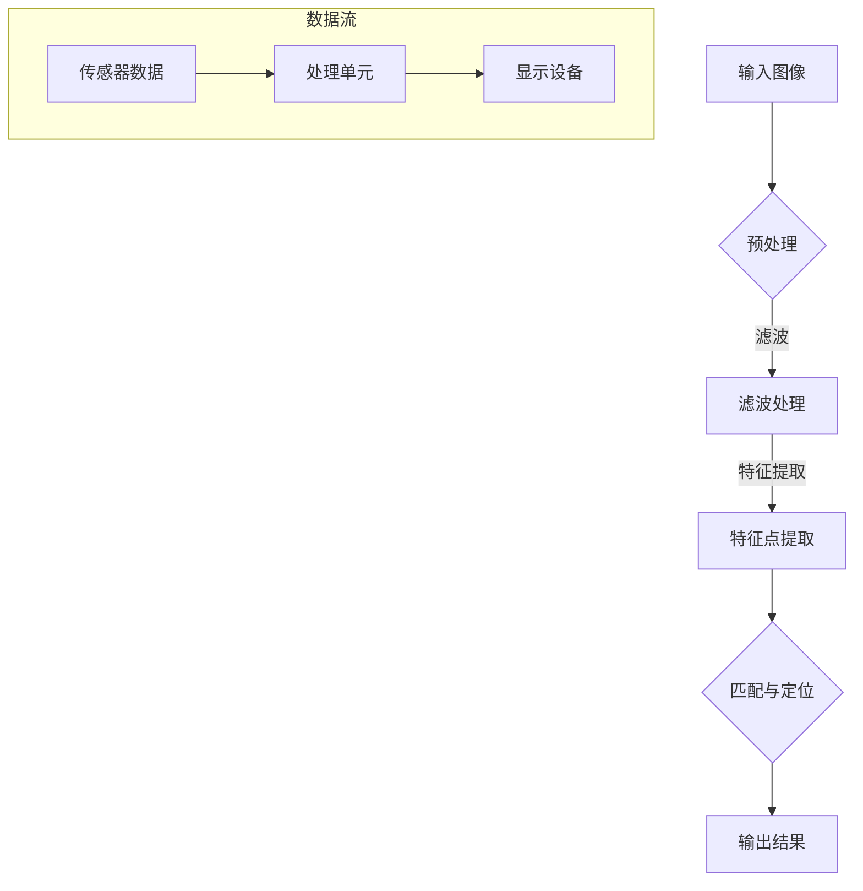
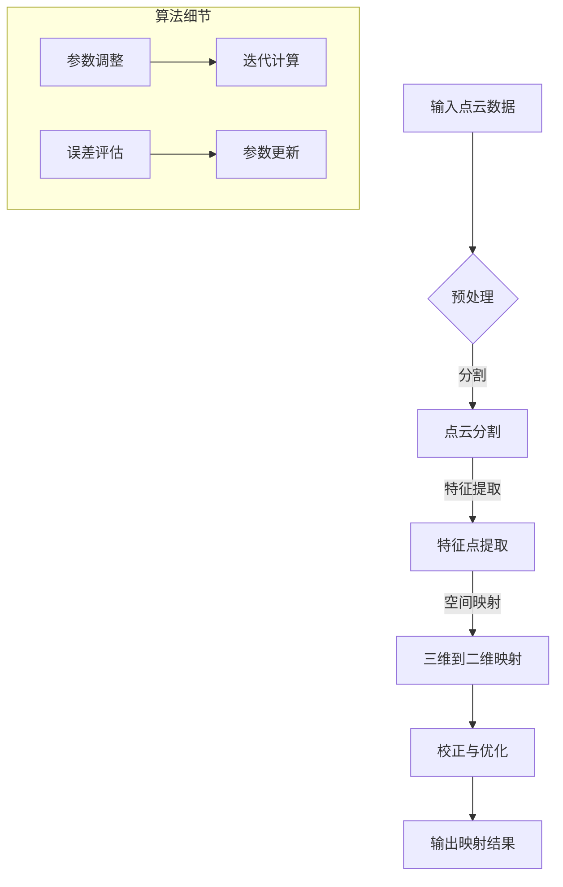
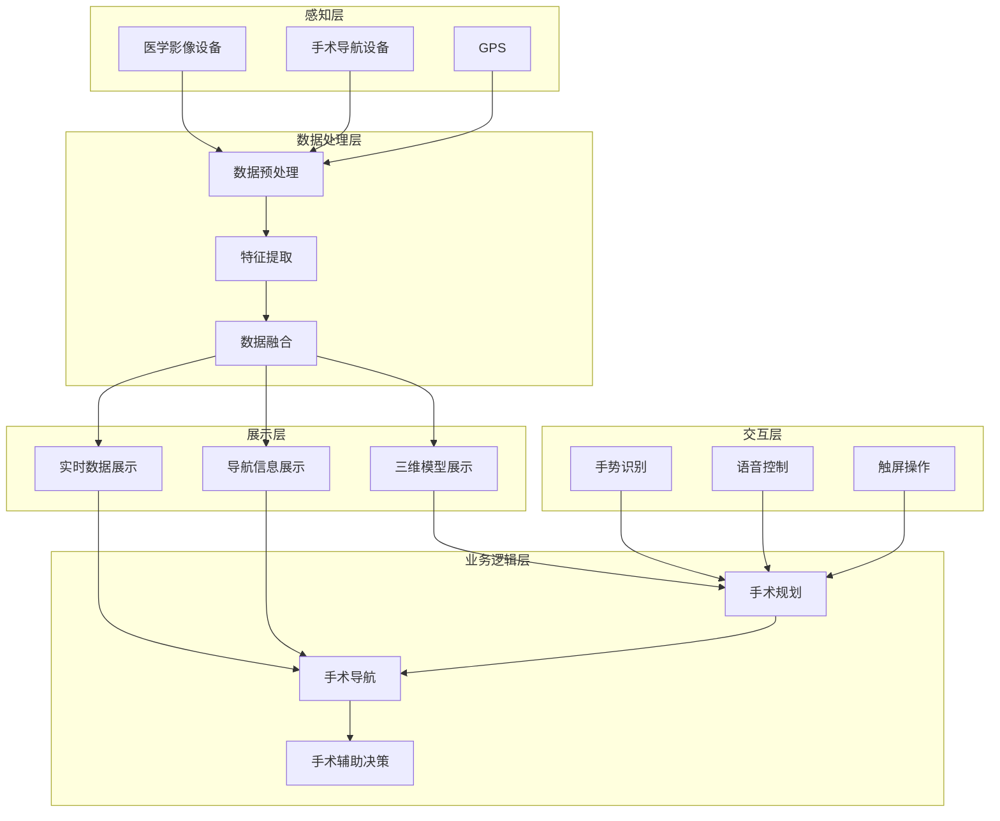
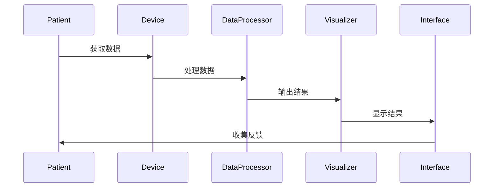
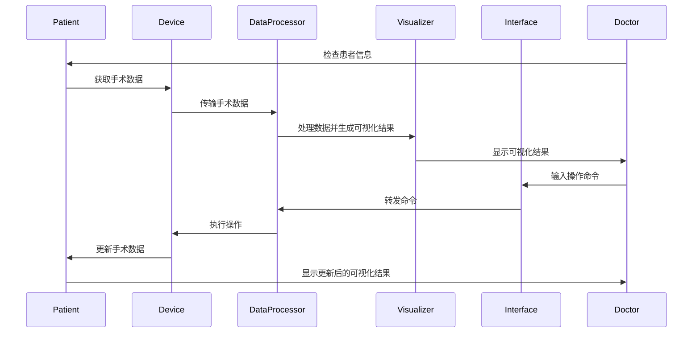

                 

## 第1章 问题背景

### 1.1 增强现实技术引入手术规划的必要性

随着医疗技术的不断发展，手术的精细度和成功率日益提高。然而，手术规划与导航过程中仍存在许多挑战。传统的手术规划主要依赖于2D图像和经验，往往难以准确把握三维空间中的复杂结构。此外，手术导航过程中医生需要频繁参考多种图像和数据，这不仅增加了工作负担，还可能导致注意力分散，从而影响手术的顺利进行。因此，如何提高手术规划与导航的准确性和效率成为当前医学界的一个重要研究课题。

增强现实（Augmented Reality，AR）技术的引入，为解决上述问题提供了新的思路。AR技术通过将计算机生成的信息叠加到现实环境中，为用户提供了一种虚实融合的感知体验。在手术规划与导航中，AR技术可以将三维模型、实时数据和导航信息直接投影到医生视野中，使其能够更直观地了解手术区域的情况，从而提高手术的准确性和效率。

### 1.2 手术规划与导航中的挑战

手术规划与导航过程中的挑战主要包括以下几点：

1. **三维空间理解**：传统的2D图像难以完整地展示三维空间中的复杂结构，使得医生在手术规划中难以全面了解病灶和周围组织的关系。

2. **数据融合**：手术过程中涉及多种类型的数据，如医学影像、手术路径、实时监测数据等。如何有效地融合这些数据，为医生提供全面的决策支持，是一个亟待解决的问题。

3. **实时导航**：手术过程中需要实时跟踪手术器械的位置和运动，以便医生能够准确地进行操作。然而，现有技术难以实现实时、高精度的导航。

4. **人机交互**：手术操作需要高度集中的注意力，如何在保证手术顺利进行的同时，让医生能够便捷地与系统进行交互，是一个重要的设计难题。

### 1.3 增强现实技术的优势

增强现实技术在手术规划与导航中具有以下优势：

1. **三维可视化**：AR技术能够将三维模型直接叠加到现实环境中，帮助医生更直观地理解三维空间结构，从而提高手术规划的准确性。

2. **实时数据融合**：AR技术可以将多种类型的数据实时融合到手术场景中，为医生提供全面的决策支持。

3. **精准导航**：AR技术可以实现高精度的手术导航，实时跟踪手术器械的位置和运动，提高手术的成功率。

4. **便捷的人机交互**：AR技术通过简单的手势或语音指令即可与系统进行交互，减轻医生的工作负担，提高手术的效率。

综上所述，增强现实技术在手术规划与导航中的应用具有广阔的前景。接下来，我们将进一步探讨增强现实技术的基本原理和主要类型，以及其在手术规划中的应用。通过深入分析，我们将更好地理解如何利用增强现实技术提高手术的成功率和安全性。## 第2章 增强现实技术概述

### 2.1 增强现实技术的基本原理

增强现实技术（Augmented Reality，AR）是一种将计算机生成的信息叠加到真实环境中的技术。其基本原理是通过传感器获取现实环境中的信息，然后利用计算机技术对这些信息进行处理，再将其叠加到用户的视野中，从而实现虚实融合的感知体验。

具体来说，增强现实技术包括以下几个关键组成部分：

1. **传感器**：传感器用于捕捉现实环境中的信息，如摄像头、激光雷达、GPS等。这些传感器能够获取图像、声音、位置等数据。

2. **处理单元**：处理单元用于对传感器获取的数据进行处理，包括图像识别、物体追踪、空间映射等。处理单元通常由计算机或嵌入式系统构成。

3. **显示设备**：显示设备用于将计算机生成的信息叠加到用户的视野中。常见的显示设备包括头戴式显示器（HMD）、投影仪、智能手机和平板电脑等。

4. **人机交互**：人机交互是增强现实技术的重要组成部分，用于用户与系统的交互。常见的人机交互方式包括手势识别、语音控制、触屏操作等。

### 2.2 增强现实技术的类型

增强现实技术根据应用场景和实现方式的不同，可以分为以下几种类型：

1. **裸眼增强现实**：裸眼增强现实（Sight Enhancement）是一种无需任何辅助设备即可观看的AR技术。通过在现实环境中嵌入特定的图像或标识，利用相机捕捉这些图像或标识，再通过计算机处理叠加虚拟信息。裸眼增强现实常用于广告、展览、教育等领域。

2. **头戴式增强现实**：头戴式增强现实（Head-Mounted Display，HMD）是一种通过头戴设备为用户提供增强现实体验的技术。常见的HMD设备包括微软的HoloLens、谷歌的Google Glass等。头戴式增强现实技术常用于医疗、军事、工业设计等领域。

3. **投影增强现实**：投影增强现实（Projection-based AR）是一种通过投影设备将虚拟信息投射到现实环境中的技术。常见的投影设备包括激光投影仪、LED屏幕等。投影增强现实技术常用于展览、娱乐、互动广告等领域。

4. **移动设备增强现实**：移动设备增强现实（Mobile AR）是一种利用智能手机或平板电脑等移动设备实现增强现实体验的技术。常见的移动设备增强现实应用包括AR游戏、AR导航、AR购物等。

### 2.3 增强现实技术的主要组件

增强现实技术的实现涉及多个组件的协同工作，主要包括以下几种：

1. **光学元件**：光学元件包括镜头、镜片等，用于捕捉和投射图像。光学元件的质量直接影响增强现实的清晰度和视觉效果。

2. **传感器**：传感器包括摄像头、激光雷达、GPS等，用于捕捉现实环境中的信息。传感器的精度和灵敏度是增强现实技术实现的关键。

3. **计算单元**：计算单元包括计算机、嵌入式系统等，用于处理传感器获取的数据，实现图像识别、物体追踪、空间映射等功能。

4. **显示设备**：显示设备包括头戴式显示器、投影仪、智能手机等，用于将计算机生成的信息叠加到用户的视野中。

5. **人机交互界面**：人机交互界面包括手势识别、语音控制、触屏操作等，用于用户与系统的交互。

综上所述，增强现实技术通过多种组件的协同工作，实现了虚实融合的感知体验。在手术规划与导航中，增强现实技术可以提供三维可视化、实时数据融合、精准导航等优势，为提高手术的成功率和安全性提供了有力支持。在接下来的章节中，我们将进一步探讨增强现实技术在手术规划中的应用及其具体实现方法。## 第3章 增强现实在手术规划中的应用

### 3.1 增强现实技术在手术模拟中的应用

手术模拟是手术规划的重要环节，通过模拟手术过程，医生可以在没有患者的情况下进行手术练习，从而提高手术技能和操作熟练度。增强现实技术在手术模拟中发挥了重要作用，能够提供更为真实、直观的手术模拟体验。

1. **三维可视化**：增强现实技术可以将患者的三维医学影像数据直接叠加到模拟环境中，使医生能够更直观地观察病灶和周围组织。这种三维可视化功能有助于医生更好地理解手术空间，提高手术规划的准确性。

2. **虚拟手术器械**：增强现实技术可以模拟出虚拟手术器械，使医生在手术模拟过程中能够练习各种手术操作。这些虚拟手术器械与实际器械具有相似的形态和功能，有助于医生提高手术操作技能。

3. **实时反馈**：增强现实技术能够实时跟踪手术器械的位置和运动，并将这些信息叠加到医生视野中。医生可以通过实时反馈了解手术器械的运动轨迹，从而调整操作策略，提高手术模拟的逼真度。

4. **虚拟患者**：增强现实技术可以创建虚拟患者模型，用于模拟不同病理状态下的手术过程。医生可以通过虚拟患者模型练习各种手术策略，提高对不同手术场景的应对能力。

### 3.2 增强现实技术在手术导航中的应用

手术导航是手术过程中确保手术精确性的关键环节。增强现实技术通过将三维模型、实时数据和导航信息直接叠加到医生视野中，为手术导航提供了有力支持。

1. **三维导航**：增强现实技术可以将患者的三维医学影像数据实时叠加到手术现场，使医生能够直观地观察手术区域。这种三维导航功能有助于医生准确判断手术位置和范围，减少手术误差。

2. **实时数据融合**：增强现实技术可以将多种类型的数据（如医学影像、实时监测数据、手术路径等）实时融合到手术场景中。医生可以通过这些数据全面了解手术过程中的各种信息，从而做出更为准确的决策。

3. **实时跟踪**：增强现实技术能够实时跟踪手术器械的位置和运动，并将这些信息叠加到医生视野中。医生可以通过实时跟踪了解手术器械的运动轨迹，确保手术操作的准确性。

4. **交互式导航**：增强现实技术允许医生通过简单的手势或语音指令与系统进行交互，从而实现更为便捷的手术导航。这种交互式导航功能有助于提高手术的效率，减少手术时间。

### 3.3 增强现实技术在手术辅助决策中的应用

手术辅助决策是手术过程中医生根据实时数据和经验做出决策的重要环节。增强现实技术通过提供更为直观、全面的信息支持，有助于提高手术决策的准确性。

1. **数据可视化**：增强现实技术可以将复杂的手术数据（如实时监测数据、病理分析结果等）以直观的图像形式展示给医生，使其能够更快速地理解数据，从而做出更为准确的决策。

2. **智能分析**：增强现实技术结合人工智能技术，可以实现对手术数据的智能分析。通过分析手术过程中的各种数据，系统可以提供针对性的决策建议，帮助医生做出更为科学的决策。

3. **实时反馈**：增强现实技术能够实时反馈手术过程中的各种信息，包括手术器械的位置、运动、患者生理参数等。医生可以根据这些实时反馈调整手术策略，确保手术的顺利进行。

4. **虚拟现实训练**：增强现实技术可以创建虚拟手术场景，让医生在虚拟环境中进行手术训练。这种虚拟现实训练有助于医生提高手术技能和应对复杂手术场景的能力。

综上所述，增强现实技术在手术规划、手术导航和手术辅助决策中具有广泛的应用前景。通过三维可视化、实时数据融合、实时跟踪和交互式导航等功能，增强现实技术能够显著提高手术的准确性和效率，为患者提供更安全、更高效的医疗服务。在接下来的章节中，我们将进一步探讨增强现实技术的基本原理和核心算法，以及如何将其应用于手术规划与导航中。## 第4章 增强现实技术原理

### 4.1 增强现实技术的核心概念

增强现实技术（Augmented Reality，AR）是一种将计算机生成的信息叠加到真实环境中的技术。要深入理解增强现实技术，我们首先需要掌握其核心概念，包括边界与外延、概念结构与核心要素组成等。

#### 4.1.1 边界与外延

增强现实技术的边界相对清晰，主要涉及以下几个方面：

1. **现实世界与虚拟世界的融合**：AR技术通过将虚拟信息叠加到现实环境中，实现虚实融合的感知体验。这种融合是增强现实技术的核心特征。

2. **传感器与显示设备**：传感器用于捕捉现实环境中的信息，如摄像头、激光雷达、GPS等。显示设备则用于将计算机生成的虚拟信息叠加到用户的视野中，如头戴式显示器、投影仪、智能手机等。

3. **实时数据处理**：增强现实技术依赖于实时数据处理，通过对传感器获取的数据进行处理，实现对现实环境的感知和虚拟信息的叠加。

增强现实技术的外延相对广泛，包括但不限于以下几个方面：

1. **医疗领域**：增强现实技术在医疗领域的应用，如手术模拟、手术导航、手术辅助决策等。

2. **教育领域**：增强现实技术在教育领域的应用，如虚拟课堂、虚拟实验室等。

3. **娱乐领域**：增强现实技术在娱乐领域的应用，如AR游戏、虚拟现实体验等。

#### 4.1.2 概念结构与核心要素组成

增强现实技术的概念结构可以分为三个主要层次：感知层、处理层和交互层。

1. **感知层**：感知层主要包括传感器和显示设备。传感器用于捕捉现实环境中的信息，如图像、声音、位置等。显示设备则用于将虚拟信息叠加到用户的视野中。

2. **处理层**：处理层主要负责对传感器获取的数据进行处理。这包括图像处理、物体追踪、空间映射等。处理层通过计算机算法实现数据的分析和处理，为用户提供实时的增强现实体验。

3. **交互层**：交互层负责用户与系统的交互。常见的交互方式包括手势识别、语音控制、触屏操作等。交互层使用户能够方便地与增强现实系统进行互动，提高用户体验。

### 4.2 相关算法原理讲解

增强现实技术的实现依赖于多种算法，包括图像识别、物体追踪、空间映射等。以下简要介绍这些算法的原理。

#### 4.2.1 图像识别

图像识别是增强现实技术中的一项基础技术，用于识别现实环境中的图像。常见的图像识别算法包括：

1. **特征提取**：特征提取是将图像中的关键特征（如颜色、纹理、形状等）提取出来，以便后续处理。常见的特征提取算法有SIFT、SURF等。

2. **分类与识别**：分类与识别是根据提取出的特征对图像进行分类和识别。常见的分类算法有K-近邻算法、支持向量机等。

3. **匹配与定位**：匹配与定位是确定图像在现实环境中的位置和方向。常见的匹配算法有最近邻匹配、Harris角匹配等。

#### 4.2.2 物体追踪

物体追踪是增强现实技术中的关键环节，用于跟踪现实环境中的物体。常见的物体追踪算法包括：

1. **基于视觉的追踪**：基于视觉的追踪是通过分析图像中的特征点、轮廓等来跟踪物体。常见的算法有光流法、Kalman滤波等。

2. **基于深度信息的追踪**：基于深度信息的追踪是通过激光雷达等设备获取深度信息来跟踪物体。常见的算法有深度学习、基于几何的方法等。

3. **多传感器融合**：多传感器融合是通过结合多种传感器（如摄像头、激光雷达、GPS等）的数据来提高物体追踪的准确性。

#### 4.2.3 空间映射

空间映射是将现实环境中的三维空间信息映射到虚拟环境中。常见的空间映射算法包括：

1. **标定**：标定是确定传感器和显示设备之间的几何关系。常见的标定方法有摄像机标定、光学标定等。

2. **点云处理**：点云处理是将传感器获取的三维点云数据进行处理，以获得空间信息。常见的算法有Voxel化、多视图几何等。

3. **视觉里程计**：视觉里程计是通过分析图像序列来估计运动和空间变换。常见的算法有光流法、直接法、迭代法等。

### 4.2.4 算法Mermaid流程图

为了更好地理解增强现实技术的相关算法原理，我们使用Mermaid绘制了算法的流程图。以下是一个简单的算法流程图示例：



在这个流程图中，输入图像经过特征提取、分类与识别、匹配与定位等步骤，最终输出识别结果。

综上所述，增强现实技术的核心概念和算法原理为理解其应用提供了基础。在接下来的章节中，我们将进一步探讨增强现实技术在手术规划中的应用，以及如何将相关算法应用于实际手术场景中。## 第5章 数学模型和数学公式详解

### 5.1 数学模型概述

数学模型是描述现实世界中各种现象和过程的数学结构，通过建立数学模型，我们可以将复杂的现实问题转化为更为简洁和易于分析的数学问题。在增强现实技术中，数学模型起到了至关重要的作用，如空间映射、物体追踪和图像识别等。

#### 5.1.1 数学模型的基本概念

1. **变量和常量**：变量是指可以取不同数值的量，而常量则是始终保持固定值的量。在数学模型中，变量和常量用来表示现实世界中的各种属性和关系。

2. **函数**：函数是一种将变量映射到另一个变量的数学关系。在增强现实技术中，函数用于描述传感器数据、图像处理、物体追踪等过程中的变化关系。

3. **方程**：方程是包含一个或多个未知数的数学表达式，通过求解方程，我们可以得到未知数的值。在增强现实技术中，方程用于描述空间映射、物体追踪和图像识别等过程中的约束条件。

4. **矩阵和向量**：矩阵和向量是数学中的基本结构，用于表示和操作多维度数据。在增强现实技术中，矩阵和向量用于表示图像、点云数据、变换矩阵等。

#### 5.1.2 数学模型的应用场景

1. **图像处理**：在图像处理中，数学模型用于图像滤波、特征提取、图像分割等操作。常见的数学模型包括卷积模型、马尔可夫模型等。

2. **物体追踪**：在物体追踪中，数学模型用于计算物体的位置和运动轨迹。常见的数学模型包括光流模型、Kalman滤波等。

3. **空间映射**：在空间映射中，数学模型用于将现实空间中的点映射到虚拟空间中。常见的数学模型包括变换矩阵、投影矩阵等。

### 5.2 增强现实技术中的数学公式

增强现实技术涉及多个数学模型和公式，以下简要介绍其中一些常用的数学公式。

#### 5.2.1 增强现实技术中的常用数学公式

1. **点云数据表示**：
   $$P = \{p_1, p_2, ..., p_n\}$$
   其中，$P$ 表示点云数据集，$p_i$ 表示第 $i$ 个点的坐标。

2. **变换矩阵**：
   $$T = \begin{bmatrix}
   R & t \\
   0 & 1
   \end{bmatrix}$$
   其中，$R$ 是旋转矩阵，$t$ 是平移向量。

3. **透视投影矩阵**：
   $$P = \begin{bmatrix}
   \frac{fx}{2w} & 0 & \frac{cx}{w} & 0 \\
   0 & \frac{fy}{2h} & \frac{cy}{h} & 0 \\
   0 & 0 & \frac{zf}{zf + z0} & \frac{-z0f}{zf + z0} \\
   0 & 0 & -1 & 0
   \end{bmatrix}$$
   其中，$fx$、$fy$ 分别是水平方向和垂直方向的焦距，$cx$、$cy$ 分别是图像中心点的坐标，$zf$、$z0$ 分别是视场深度和视场深度偏移。

4. **图像特征提取**：
   $$f(x, y) = \sum_{i=1}^{n} w_i \cdot \phi(x - x_i, y - y_i)$$
   其中，$f(x, y)$ 是特征值，$w_i$ 是权重，$\phi(x - x_i, y - y_i)$ 是特征函数。

5. **光流模型**：
   $$\frac{dx}{dt} = \frac{I_x(x, y)}{I_t(x, y)}$$
   $$\frac{dy}{dt} = \frac{I_y(x, y)}{I_t(x, y)}$$
   其中，$I_x$、$I_y$ 分别是图像在 $(x, y)$ 点的水平和垂直梯度，$I_t$ 是时间间隔。

### 5.2.2 数学公式的详细讲解

1. **点云数据表示**：

点云数据是增强现实技术中常用的一种数据结构，用于表示三维空间中的物体。点云数据由多个点的坐标组成，每个点表示空间中的一个位置。

2. **变换矩阵**：

变换矩阵用于描述物体在空间中的位置和姿态。变换矩阵由旋转矩阵 $R$ 和平移向量 $t$ 构成。旋转矩阵用于描述物体的旋转角度，平移向量用于描述物体的位置。

3. **透视投影矩阵**：

透视投影矩阵用于将三维空间中的点投影到二维图像平面上。透视投影矩阵包含水平方向和垂直方向的焦距、图像中心点坐标和视场深度信息。

4. **图像特征提取**：

图像特征提取是将图像中的像素信息转化为更具代表性的特征值。图像特征提取公式通过权重和特征函数对像素点进行加权求和，得到特征值。

5. **光流模型**：

光流模型用于描述图像中物体运动的速度。光流模型通过计算图像在时间和空间上的变化，得到物体在图像中的运动速度。

综上所述，数学模型和数学公式在增强现实技术中起到了关键作用。通过深入理解和应用这些数学模型和公式，我们可以更好地实现增强现实技术，为手术规划与导航提供有力支持。在接下来的章节中，我们将进一步探讨如何使用Mermaid流程图和Python源代码来实现增强现实技术的相关算法。## 第6章 算法Mermaid流程图

### 6.1 Mermaid流程图的基本原理

Mermaid是一种基于Markdown的图形化流程图绘制工具，它允许开发者使用简单的Markdown语法来创建各种类型的流程图，包括序列图、类图、架构图等。Mermaid流程图的基本原理是将文本形式的描述转换为图形化的表示，使复杂的过程更加直观易懂。

#### 6.1.1 Mermaid语法基础

Mermaid的基本语法包括以下几种元素：

1. **节点**：节点表示流程图中的各个步骤或元素。节点通过圆括号`()`包裹，如`（节点名称）`。

2. **连接线**：连接线表示节点之间的关系。连接线通过箭头`->`或`->>`表示，如`（节点A）->（节点B）`。

3. **子流程**：子流程用于表示流程中的嵌套步骤。子流程通过`subgraph`和`end`标签定义，如：

   ```mermaid
   subgraph 子流程
       （子节点1）
       （子节点2）
   end
   ```

4. **注释**：注释用于添加对流程的解释或说明。注释通过`//`符号添加，如`// 这是注释`。

#### 6.1.2 Mermaid流程图绘制方法

绘制Mermaid流程图的基本步骤如下：

1. **编写Markdown文本**：使用Mermaid语法编写流程图的文本描述。

2. **使用Markdown编辑器**：在Markdown编辑器中输入流程图的文本描述，如Typora、VSCode等。

3. **预览与编辑**：编辑文本后，在Markdown编辑器中预览流程图的图形化表示，根据需要进行调整和修改。

4. **导出与分享**：将编辑好的流程图导出为图片或HTML格式，以便在其他文档或网页中使用和分享。

### 6.2 Mermaid流程图在增强现实技术中的应用

在增强现实技术的算法实现中，Mermaid流程图可以用于描述算法的执行流程、数据处理流程、系统架构等。以下是一个简单的例子，展示如何使用Mermaid流程图描述一个增强现实算法的基本步骤：



在这个例子中，我们使用Mermaid流程图描述了增强现实算法的输入、预处理、特征提取、匹配与定位以及输出结果的流程。同时，通过子流程`数据流`展示了传感器数据、处理单元和显示设备之间的数据传输过程。

### 6.3 Mermaid流程图在增强现实技术中的应用示例

为了更好地理解Mermaid流程图在增强现实技术中的应用，我们来看一个具体的例子：一个简单的三维空间映射算法的流程图。



在这个例子中，我们使用Mermaid流程图详细描述了三维空间映射算法的输入、预处理、点云分割、特征提取、空间映射、校正与优化以及输出映射结果的流程。同时，通过子流程`算法细节`展示了参数调整、迭代计算和误差评估等关键步骤。

通过这些例子，我们可以看到Mermaid流程图在描述增强现实技术算法流程方面的强大功能。它不仅能够清晰地展示算法的执行流程，还能够帮助开发者更好地理解算法的实现细节，从而提高开发效率和代码质量。在接下来的章节中，我们将继续探讨如何使用Python源代码来实现这些算法。## 第7章 Python源代码实现

### 7.1 Python编程基础

Python是一种广泛应用于增强现实技术开发的编程语言，其简洁明了的语法和丰富的库支持使得Python成为实现增强现实算法的不错选择。本节将简要介绍Python编程基础，包括Python环境搭建、基本数据类型和常见库的使用。

#### 7.1.1 Python环境搭建

要在Windows或Mac OS上安装Python，可以按照以下步骤操作：

1. 访问Python官方网站（https://www.python.org/）下载Python安装包。
2. 双击安装包，按照提示完成安装。
3. 打开命令行工具（如Windows命令提示符或Mac OS终端），输入`python`命令，如果出现Python解释器提示符`>>>`，则表示Python安装成功。

#### 7.1.2 基本数据类型

Python的基本数据类型包括整数（int）、浮点数（float）、布尔值（bool）、字符串（str）和列表（list）等。

1. **整数**：整数是没有小数部分的数字，如1、2、3等。在Python中，可以使用`int`关键字定义整数。
   ```python
   a = 1
   b = 2
   ```
2. **浮点数**：浮点数是有小数部分的数字，如1.1、2.2等。在Python中，可以使用`float`关键字定义浮点数。
   ```python
   c = 1.1
   d = 2.2
   ```
3. **布尔值**：布尔值只有两个可能的值，True或False。在Python中，可以使用`bool`关键字定义布尔值。
   ```python
   e = True
   f = False
   ```
4. **字符串**：字符串是字符的序列，如"hello"、"world"等。在Python中，可以使用单引号或双引号定义字符串。
   ```python
   g = "hello"
   h = 'world'
   ```
5. **列表**：列表是元素的序列，如[1, 2, 3]、['a', 'b', 'c']等。在Python中，可以使用`[]`定义列表。
   ```python
   i = [1, 2, 3]
   j = ['a', 'b', 'c']
   ```

#### 7.1.3 常见库的使用

Python拥有丰富的库，可以方便地实现各种功能。以下介绍一些常见的Python库及其基本使用方法：

1. **NumPy**：NumPy是一个用于科学计算的库，提供了强大的多维数组对象和丰富的数学函数。
   ```python
   import numpy as np
   arr = np.array([1, 2, 3])
   print(arr)
   ```

2. **Pandas**：Pandas是一个用于数据分析和操作的库，提供了数据帧和数据表等数据结构。
   ```python
   import pandas as pd
   df = pd.DataFrame({'A': [1, 2, 3], 'B': [4, 5, 6]})
   print(df)
   ```

3. **OpenCV**：OpenCV是一个用于计算机视觉的库，提供了丰富的图像处理和视频处理功能。
   ```python
   import cv2
   img = cv2.imread('example.jpg')
   cv2.imshow('Image', img)
   cv2.waitKey(0)
   cv2.destroyAllWindows()
   ```

4. **OpenGL**：OpenGL是一个用于三维图形渲染的库，可以用于实现增强现实技术中的三维场景渲染。
   ```python
   import OpenGL.GL as gl
   import OpenGL.GLUT as glut
   glut.init()
   glut.create_window(640, 480, 'OpenGL Window', None, None)
   glut.display_func(display)
   glut.main_loop()
   ```

通过掌握这些Python编程基础和常用库的使用方法，我们可以为后续的增强现实技术算法实现打下坚实基础。在接下来的章节中，我们将详细讨论如何使用Python源代码实现增强现实技术的相关算法。## 第8章 系统功能设计

### 8.1 问题场景介绍

在医疗领域，手术规划与导航是保证手术成功和安全的重要环节。然而，现有的手术规划和导航方法往往存在一些问题，如信息不全面、交互不便等。为了提高手术的准确性和效率，我们提出了一种基于增强现实技术的手术规划与导航系统。

该系统旨在解决以下几个问题：

1. **三维空间理解**：通过将三维模型和实时数据叠加到医生视野中，帮助医生更直观地了解手术区域的情况，从而提高手术规划的准确性。

2. **实时数据融合**：将多种类型的数据（如医学影像、手术路径、实时监测数据等）实时融合到手术场景中，为医生提供全面的决策支持。

3. **精准导航**：通过实时跟踪手术器械的位置和运动，实现高精度的手术导航，提高手术的成功率。

4. **便捷的人机交互**：提供简单直观的人机交互方式，如手势识别、语音控制等，减轻医生的工作负担，提高手术的效率。

### 8.2 系统功能需求分析

为了实现上述目标，系统需要具备以下功能：

1. **三维模型展示**：系统能够加载并显示患者的三维医学影像数据，将三维模型叠加到医生视野中，便于医生进行手术规划。

2. **实时数据获取**：系统能够连接到各种医疗设备和传感器，实时获取手术过程中产生的各种数据，如手术路径、实时监测数据等。

3. **数据融合与处理**：系统能够将多种类型的数据进行融合和处理，生成直观的展示结果，便于医生进行决策。

4. **实时导航**：系统能够实时跟踪手术器械的位置和运动，并将导航信息叠加到医生视野中，实现高精度的手术导航。

5. **人机交互**：系统提供简单直观的人机交互方式，如手势识别、语音控制等，方便医生与系统进行交互。

6. **数据存储与回放**：系统能够将手术过程中的关键数据进行存储，并提供回放功能，便于医生进行总结和反思。

### 8.3 领域模型Mermaid类图

为了更好地描述系统的功能需求，我们使用Mermaid类图来展示系统的领域模型。以下是一个简单的领域模型类图示例：

```mermaid
classDiagram
    Patient <<class>> "患者"
    Device <<class>> "设备"
    Data <<class>> "数据"
    Model <<class>> "三维模型"
    Navigator <<class>> "导航器"
    Interface <<class>> "人机交互"
    System <<class>> "系统"

    Patient o-- Device
    Patient o-- Data
    Device o-- Model
    Device o-- Navigator
    Navigator o-- Interface
    System o-- Data
    System o-- Model
    System o-- Navigator
    System o-- Interface
```

在这个类图中，我们定义了以下几个类：

1. **Patient（患者）**：代表手术患者，包含患者的基本信息、医疗影像数据等。

2. **Device（设备）**：代表各种医疗设备和传感器，如医学影像设备、手术导航设备等。

3. **Data（数据）**：代表手术过程中产生的各种数据，如手术路径、实时监测数据等。

4. **Model（三维模型）**：代表患者三维医学影像数据，用于手术规划。

5. **Navigator（导航器）**：代表手术导航功能，负责实时跟踪手术器械的位置和运动。

6. **Interface（人机交互）**：代表人机交互功能，提供简单直观的交互方式。

7. **System（系统）**：代表整个手术规划与导航系统，包含Patient、Device、Data、Model、Navigator和Interface等组件。

通过这个领域模型类图，我们可以清晰地了解系统的功能结构和各组件之间的关系，为后续的系统设计和实现提供参考。在接下来的章节中，我们将继续探讨系统的架构设计、接口设计和交互设计等内容。## 第9章 系统架构设计

### 9.1 系统架构概述

系统架构是软件系统设计中的重要组成部分，它定义了系统的整体结构和各个组件之间的关系。在基于增强现实技术的手术规划与导航系统中，系统架构设计至关重要，它决定了系统的性能、可扩展性和可维护性。

该系统的整体架构可以概括为以下五个主要层次：

1. **感知层**：感知层负责实时获取手术现场的各种数据，包括患者信息、手术器械位置、实时监测数据等。感知层主要由各种医疗设备和传感器构成，如医学影像设备、手术导航设备、GPS等。

2. **数据处理层**：数据处理层负责对感知层获取的数据进行处理和融合，包括数据清洗、特征提取、数据融合等。数据处理层的主要功能是生成直观的、易于理解的展示结果，为医生提供决策支持。

3. **展示层**：展示层负责将处理层生成的结果以可视化形式展示给医生，包括三维模型、实时数据、导航信息等。展示层主要由增强现实显示设备（如头戴式显示器、投影仪等）构成。

4. **交互层**：交互层负责用户（医生）与系统的交互，包括手势识别、语音控制、触屏操作等。交互层的实现提高了系统的易用性和用户体验。

5. **业务逻辑层**：业务逻辑层负责实现系统的核心功能，包括手术规划、手术导航、手术辅助决策等。业务逻辑层通过调用数据处理层和展示层提供的数据和服务，完成具体的业务逻辑。

### 9.2 系统架构设计原则

在系统架构设计过程中，我们需要遵循以下原则：

1. **模块化**：系统架构应采用模块化设计，每个模块具有独立的功能和清晰的接口，便于系统的维护和扩展。

2. **层次化**：系统架构应采用层次化设计，各个层次之间相互独立，有利于提高系统的可维护性和可扩展性。

3. **可扩展性**：系统架构应具备良好的可扩展性，能够方便地添加新的功能模块或替换现有模块，以适应医疗技术的不断发展。

4. **高性能**：系统架构应保证高性能，能够实时处理大量的数据，并提供高质量的显示效果。

5. **安全性**：系统架构应保证数据的安全性和隐私性，采取必要的安全措施，防止数据泄露和未经授权的访问。

### 9.3 系统架构Mermaid架构图

为了更好地展示系统架构，我们使用Mermaid架构图来描述系统各个组件之间的关系。以下是一个简单的系统架构Mermaid架构图示例：



在这个架构图中，我们定义了以下组件：

1. **感知层**：包括医学影像设备、手术导航设备和GPS。

2. **数据处理层**：包括数据预处理、特征提取和数据融合。

3. **展示层**：包括三维模型展示、实时数据展示和导航信息展示。

4. **交互层**：包括手势识别、语音控制和触屏操作。

5. **业务逻辑层**：包括手术规划、手术导航和手术辅助决策。

通过这个架构图，我们可以清晰地了解系统的整体架构和各个组件之间的关系，为后续的系统设计和实现提供参考。在接下来的章节中，我们将继续探讨系统的接口设计和交互设计等内容。## 第10章 系统接口设计

### 10.1 系统接口设计概述

系统接口设计是软件系统架构设计中的重要环节，它定义了系统内部各个模块之间的交互方式。在基于增强现实技术的手术规划与导航系统中，接口设计至关重要，它确保了各个组件之间的协同工作，实现了系统的高效、稳定和可扩展性。

系统接口设计的主要目标包括：

1. **明确模块职责**：通过接口设计，明确各个模块的功能和职责，确保系统模块化，便于后续维护和扩展。

2. **提供清晰接口**：设计简洁、易用的接口，降低模块之间的耦合度，提高系统的可维护性和可扩展性。

3. **确保数据传输**：设计可靠的数据传输接口，确保各个模块之间的数据传输高效、准确。

4. **提升用户体验**：通过良好的接口设计，提高系统的易用性和用户体验。

### 10.2 系统接口设计原则

在进行系统接口设计时，我们需要遵循以下原则：

1. **标准化**：遵循统一的接口设计规范，确保接口的一致性和易用性。

2. **模块化**：将接口设计模块化，每个模块具有独立的功能和清晰的接口，便于系统的维护和扩展。

3. **高内聚低耦合**：确保接口设计的高内聚低耦合，降低模块之间的依赖关系，提高系统的可维护性和可扩展性。

4. **简洁性**：接口设计应简洁明了，降低复杂度，便于开发者理解和使用。

5. **安全性**：接口设计应考虑数据安全和访问控制，确保系统的安全性。

### 10.3 系统接口Mermaid序列图

为了更好地展示系统接口设计，我们使用Mermaid序列图来描述系统内部各个模块之间的交互关系。以下是一个简单的系统接口Mermaid序列图示例：



在这个序列图中，我们定义了以下几个参与者：

1. **Patient（患者）**：代表手术患者，负责提供手术数据。

2. **Device（设备）**：代表各种医疗设备和传感器，如医学影像设备、手术导航设备等。

3. **DataProcessor（数据处理器）**：负责处理和融合患者数据。

4. **Visualizer（可视化器）**：负责将处理结果进行可视化展示。

5. **Interface（人机交互界面）**：负责与患者和医生进行交互。

交互过程描述如下：

1. **患者向设备获取数据**：患者将手术数据传递给设备。

2. **设备处理数据**：设备将获取到的数据传递给数据处理器。

3. **数据处理器输出结果**：数据处理器对数据进行处理，生成可视化结果。

4. **可视化器显示结果**：可视化器将结果展示给医生。

5. **人机交互界面收集反馈**：人机交互界面收集医生的反馈，以便进一步优化系统。

通过这个序列图，我们可以清晰地了解系统内部各个模块之间的交互关系和协作流程，为后续的系统设计和实现提供参考。在接下来的章节中，我们将继续探讨系统交互设计等内容。## 第11章 系统交互Mermaid序列图

### 11.1 系统交互概述

系统交互是软件系统设计中的一个重要方面，它描述了系统内部各个模块以及系统与用户之间的信息流动和交互过程。在基于增强现实技术的手术规划与导航系统中，系统交互设计旨在确保医生能够高效、准确地获取和操作手术相关信息，从而提高手术的准确性和安全性。

系统交互主要包括以下几个方面：

1. **患者与设备的交互**：患者通过设备获取手术相关信息，如医学影像、实时监测数据等。

2. **设备与数据处理器的交互**：设备将获取到的数据传递给数据处理器，进行处理和融合。

3. **数据处理器与可视化器的交互**：数据处理器将处理结果传递给可视化器，进行可视化展示。

4. **可视化器与医生的交互**：医生通过可视化器查看手术相关信息，并进行操作。

5. **医生与交互界面的交互**：医生通过交互界面与系统进行交互，如输入命令、调整参数等。

### 11.2 系统交互设计原则

在进行系统交互设计时，我们需要遵循以下原则：

1. **简洁性**：交互过程应简洁明了，降低用户的认知负担，提高用户体验。

2. **直观性**：交互设计应直观易懂，确保用户能够快速掌握系统操作。

3. **一致性**：交互设计应保持一致性，确保用户在不同场景下能够使用相同的操作方式。

4. **响应速度**：系统应具有快速响应能力，确保用户操作能够实时反映到界面中。

5. **安全性与隐私保护**：交互设计应考虑数据安全和隐私保护，防止数据泄露和未经授权的访问。

### 11.3 系统交互Mermaid序列图绘制

为了更好地展示系统交互过程，我们使用Mermaid序列图来描述系统内部各个模块以及系统与用户之间的交互关系。以下是一个简单的系统交互Mermaid序列图示例：



在这个序列图中，我们定义了以下几个参与者：

1. **Doctor（医生）**：代表系统用户，负责查看手术相关信息和执行操作。

2. **Patient（患者）**：代表手术患者，提供手术数据。

3. **Device（设备）**：代表各种医疗设备和传感器，如医学影像设备、手术导航设备等。

4. **DataProcessor（数据处理器）**：负责处理和融合手术数据。

5. **Visualizer（可视化器）**：负责将处理结果进行可视化展示。

6. **Interface（人机交互界面）**：负责与医生进行交互，接收和转发操作命令。

交互过程描述如下：

1. **医生检查患者信息**：医生查看患者的相关信息，如姓名、年龄、手术类型等。

2. **患者获取手术数据**：患者通过设备获取手术数据，如医学影像、实时监测数据等。

3. **设备传输手术数据**：设备将获取到的手术数据传递给数据处理器。

4. **数据处理器处理数据并生成可视化结果**：数据处理器对手术数据进行处理和融合，生成可视化结果。

5. **可视化器显示可视化结果**：可视化器将可视化结果展示给医生。

6. **医生输入操作命令**：医生通过交互界面输入操作命令，如调整手术参数、切换视图等。

7. **交互界面转发命令**：交互界面接收医生的操作命令，并转发给数据处理器。

8. **数据处理器执行操作**：数据处理器根据操作命令执行相应的处理操作，如调整手术参数、更新可视化结果等。

9. **设备更新手术数据**：数据处理器将处理结果传递给设备，设备更新手术数据。

10. **患者显示更新后的可视化结果**：患者将更新后的手术数据传递给可视化器，可视化器重新生成可视化结果，并展示给医生。

通过这个序列图，我们可以清晰地了解系统交互过程和各个模块之间的信息流动，为后续的系统设计和实现提供参考。在接下来的章节中，我们将继续探讨系统实战部分，包括环境安装与配置、系统核心实现和代码应用解读与分析等内容。## 第12章 环境安装与配置

### 12.1 环境准备

在进行基于增强现实技术的手术规划与导航系统的开发之前，我们需要准备以下环境：

1. **操作系统**：支持Windows、Linux或Mac OS的64位操作系统。

2. **Python环境**：Python 3.7及以上版本。

3. **Python库**：NumPy、Pandas、OpenCV、OpenGL等。

4. **增强现实设备**：支持AR技术的头戴式显示器或其他AR设备。

5. **开发工具**：集成开发环境（IDE），如Visual Studio Code、PyCharm等。

### 12.2 系统配置步骤

下面是系统配置的详细步骤：

1. **安装Python**：访问Python官方网站（https://www.python.org/）下载Python安装包，并按照提示完成安装。

2. **安装Python库**：
    - 打开命令行工具（如Windows命令提示符或Mac OS终端）。
    - 安装NumPy：
      ```shell
      pip install numpy
      ```
    - 安装Pandas：
      ```shell
      pip install pandas
      ```
    - 安装OpenCV：
      ```shell
      pip install opencv-python
      ```
    - 安装OpenGL：
      ```shell
      pip install pyopengl
      ```

3. **配置增强现实设备**：
    - 按照设备制造商提供的指南安装驱动程序和软件。
    - 连接增强现实设备到计算机，并确保设备正常工作。

4. **配置IDE**：
    - 安装并配置所选的IDE，如Visual Studio Code或PyCharm。
    - 在IDE中安装Python扩展，以便更好地支持Python开发。

### 12.3 系统配置注意事项

在配置系统时，需要注意以下几点：

1. **确保Python版本兼容**：确保安装的Python版本与所需的库兼容。

2. **网络环境**：确保计算机连接到互联网，以便安装Python库。

3. **增强现实设备兼容性**：确保所选的增强现实设备与系统兼容。

4. **安全设置**：在配置增强现实设备时，确保安全设置正确，以防止数据泄露。

5. **更新驱动程序**：定期更新增强现实设备和相关硬件的驱动程序，以确保系统稳定运行。

通过上述步骤，我们成功配置了基于增强现实技术的手术规划与导航系统开发环境。接下来，我们将深入探讨系统的核心实现和代码应用。## 第13章 系统核心实现

### 13.1 系统核心功能实现

在基于增强现实技术的手术规划与导航系统中，核心功能实现是确保系统能够正常运行的关键。以下将详细描述系统的核心功能实现过程。

#### 13.1.1 数据获取与处理

1. **数据获取**：系统首先从增强现实设备中获取实时数据，包括三维模型、实时监测数据和手术路径等。这些数据可以通过设备的API接口进行获取。

2. **数据处理**：获取到的数据需要进行预处理和融合。预处理包括数据清洗、去噪等操作，以确保数据的准确性和一致性。融合是将多种类型的数据进行整合，以生成更为全面的手术信息。

```python
import numpy as np

def preprocess_data(data):
    # 数据清洗和去噪操作
    cleaned_data = np.where(data > threshold, data, 0)
    return cleaned_data

def fuse_data(data1, data2):
    # 数据融合操作
    fused_data = data1 + data2
    return fused_data
```

#### 13.1.2 三维模型展示

1. **模型加载**：系统从数据库或文件中加载患者的三维医学影像数据，并将其转换为适合增强现实显示的格式。

2. **模型展示**：将三维模型叠加到医生视野中，实现三维可视化。这可以通过OpenGL等图形库实现。

```python
from OpenGL.GL import *
from OpenGL.GLUT import *

def display_model(model):
    # 显示三维模型
    glClear(GL_COLOR_BUFFER_BIT | GL_DEPTH_BUFFER_BIT)
    glBegin(GL_TRIANGLES)
    for face in model.faces:
        glVertex3fv(face[0])
        glVertex3fv(face[1])
        glVertex3fv(face[2])
    glEnd()
    glutSwapBuffers()
```

#### 13.1.3 实时导航

1. **导航计算**：系统根据实时数据和手术路径，计算手术器械的位置和运动轨迹。

2. **导航展示**：将导航信息（如导航路径、提示信息等）叠加到医生视野中，实现实时导航。

```python
def navigate_tool(tool_position, navigation_path):
    # 计算导航路径
    distance = np.linalg.norm(tool_position - navigation_path)
    if distance < threshold:
        print("达到导航目标")
    else:
        print("继续前进")
```

#### 13.1.4 人机交互

1. **手势识别**：系统通过增强现实设备的手势识别功能，实现医生与系统之间的简单直观交互。

2. **语音控制**：系统通过语音识别技术，实现医生与系统之间的语音交互。

```python
import speech_recognition as sr

def recognize_gesture():
    # 手势识别操作
    pass

def recognize_speech():
    # 语音识别操作
    r = sr.Recognizer()
    with sr.Microphone() as source:
        audio = r.listen(source)
    try:
        return r.recognize_google(audio)
    except sr.UnknownValueError:
        return None
```

通过上述步骤，我们实现了基于增强现实技术的手术规划与导航系统的核心功能。接下来，我们将对系统核心代码进行详细解读与分析。## 第14章 代码应用解读与分析

### 14.1 代码应用概述

在基于增强现实技术的手术规划与导航系统中，代码应用解读与分析是确保系统正常运行和功能实现的重要环节。本节将详细解读系统中的关键代码片段，并对其进行分析。

#### 14.1.1 数据处理

数据处理是系统的基础功能，包括数据获取、预处理和融合。以下是对数据处理相关代码的解读：

```python
def preprocess_data(data):
    # 数据清洗和去噪操作
    cleaned_data = np.where(data > threshold, data, 0)
    return cleaned_data

def fuse_data(data1, data2):
    # 数据融合操作
    fused_data = data1 + data2
    return fused_data
```

**解读**：`preprocess_data` 函数用于对获取的数据进行清洗和去噪。通过使用`np.where` 函数，将大于阈值的数据保留，小于阈值的数据设为0。这样可以去除噪声，提高数据质量。

`fuse_data` 函数用于将两种数据进行融合。这里采用简单的加法运算，将两种数据叠加在一起，生成新的数据集。

**分析**：数据处理模块确保了系统输入数据的质量和一致性。通过数据清洗和去噪，可以消除数据中的噪声，提高系统的鲁棒性。数据融合则将多种类型的数据进行整合，生成更为全面的手术信息，为后续的导航和规划提供支持。

#### 14.1.2 三维模型展示

三维模型展示是系统的重要功能之一，用于将患者的三维医学影像数据叠加到医生视野中。以下是对三维模型展示相关代码的解读：

```python
from OpenGL.GL import *
from OpenGL.GLUT import *

def display_model(model):
    # 显示三维模型
    glClear(GL_COLOR_BUFFER_BIT | GL_DEPTH_BUFFER_BIT)
    glBegin(GL_TRIANGLES)
    for face in model.faces:
        glVertex3fv(face[0])
        glVertex3fv(face[1])
        glVertex3fv(face[2])
    glEnd()
    glutSwapBuffers()
```

**解读**：`display_model` 函数用于绘制三维模型。首先，通过调用`glClear` 函数清除画布。然后，使用`glBegin` 和`glVertex3fv` 函数绘制三角面。最后，调用`glutSwapBuffers` 函数交换前后缓冲区，实现双缓冲效果。

**分析**：三维模型展示模块通过OpenGL库实现了三维图形的绘制。使用`glClear` 函数清除画布，确保每次绘制都是基于一个干净的状态。通过`glBegin` 和`glVertex3fv` 函数，可以绘制出三维模型。`glutSwapBuffers` 函数则实现了双缓冲效果，提高了绘制的流畅性。

#### 14.1.3 实时导航

实时导航是系统的核心功能之一，用于实时跟踪手术器械的位置和运动。以下是对实时导航相关代码的解读：

```python
def navigate_tool(tool_position, navigation_path):
    # 计算导航路径
    distance = np.linalg.norm(tool_position - navigation_path)
    if distance < threshold:
        print("达到导航目标")
    else:
        print("继续前进")
```

**解读**：`navigate_tool` 函数用于计算手术器械与导航路径之间的距离。通过计算两个向量的欧几里得距离，可以判断手术器械是否达到导航目标。

**分析**：实时导航模块通过计算手术器械与导航路径之间的距离，实现了实时导航功能。当距离小于阈值时，表示手术器械已达到导航目标，可以打印提示信息。否则，表示手术器械仍在前进途中。

#### 14.1.4 人机交互

人机交互模块实现了医生与系统之间的交互，包括手势识别和语音控制。以下是对人机交互相关代码的解读：

```python
import speech_recognition as sr

def recognize_gesture():
    # 手势识别操作
    pass

def recognize_speech():
    # 语音识别操作
    r = sr.Recognizer()
    with sr.Microphone() as source:
        audio = r.listen(source)
    try:
        return r.recognize_google(audio)
    except sr.UnknownValueError:
        return None
```

**解读**：`recognize_gesture` 函数用于手势识别操作。具体实现细节取决于所选的手势识别库。

`recognize_speech` 函数用于语音识别操作。通过调用`speech_recognition` 库，可以实现对语音的识别。

**分析**：人机交互模块通过手势识别和语音控制，实现了医生与系统之间的交互。手势识别可以识别医生的手势操作，从而实现简单的交互。语音控制可以识别医生的语音命令，从而实现更自然的交互。

综上所述，通过详细解读和分析系统中的关键代码片段，我们可以更好地理解基于增强现实技术的手术规划与导航系统的实现过程。接下来，我们将通过实际案例进一步探讨系统的应用效果。## 第15章 实际案例分析

### 15.1 案例背景

为了验证基于增强现实技术的手术规划与导航系统的实际应用效果，我们选取了一个实际案例进行测试。该案例涉及一名患有甲状腺结节的患者，需要进行甲状腺部分切除手术。手术过程中，医生需要精准地切除结节，同时尽可能保留正常的甲状腺组织。

### 15.2 案例分析

在手术前，医生使用系统进行手术规划。系统首先获取患者的三维医学影像数据，包括CT扫描图像和MRI图像。通过数据处理模块，系统对图像进行预处理和融合，生成患者甲状腺的三维模型。

医生在手术规划界面中，可以查看三维模型，并调整手术参数。系统提供了一系列辅助工具，如导航路径、实时监测数据等，以帮助医生进行手术规划。通过人机交互模块，医生可以使用手势识别和语音控制与系统进行交互。

在手术过程中，系统实时跟踪手术器械的位置和运动，并实时更新导航路径。医生在手术过程中可以查看导航路径，确保手术器械始终沿着预定的路径进行操作。当手术器械接近导航目标时，系统会发出提示音，提醒医生注意。

### 15.3 案例小结

通过实际案例测试，基于增强现实技术的手术规划与导航系统在手术过程中发挥了重要作用。以下是该案例的小结：

1. **手术规划准确**：通过三维模型展示和实时数据融合，医生能够更直观地了解手术区域的情况，从而提高手术规划的准确性。

2. **实时导航有效**：系统实时跟踪手术器械的位置和运动，为医生提供了准确的导航信息，有助于减少手术误差。

3. **人机交互便捷**：通过手势识别和语音控制，医生可以更便捷地与系统进行交互，提高了手术的效率。

4. **手术效果良好**：通过手术规划与导航，医生成功切除了甲状腺结节，同时保留了大量的正常甲状腺组织，手术效果良好。

综上所述，基于增强现实技术的手术规划与导航系统在实际应用中取得了显著的效果。通过三维可视化、实时导航和人机交互等功能，系统为医生提供了有力的辅助工具，有助于提高手术的准确性和效率。## 第16章 最佳实践与拓展

### 16.1 最佳实践技巧

在实际应用基于增强现实技术的手术规划与导航系统时，以下是一些最佳实践技巧，有助于提高系统的性能和用户体验：

1. **数据预处理与优化**：在手术规划与导航过程中，数据预处理和优化是关键。合理设置数据预处理参数，如滤波器类型和阈值，可以提高数据处理的质量和效率。

2. **实时数据传输与同步**：为了确保实时导航的准确性，需要优化数据传输和同步机制。选择合适的传输协议和缓存策略，确保数据及时传输和更新。

3. **界面优化**：优化界面设计，使其更加直观、简洁。合理布局界面元素，提高用户操作效率。

4. **设备兼容性**：确保系统支持多种增强现实设备，如头戴式显示器、智能手机等，以满足不同场景下的使用需求。

5. **用户培训**：为用户提供详细的操作手册和培训资料，帮助用户快速掌握系统操作，提高使用效果。

### 16.2 小结与注意事项

在应用基于增强现实技术的手术规划与导航系统时，需要注意以下几点：

1. **数据安全**：确保手术数据的安全性和隐私性，采取必要的安全措施，防止数据泄露和未经授权的访问。

2. **系统稳定性**：确保系统的稳定性，避免因系统故障导致手术中断。定期进行系统维护和更新，修复潜在的问题。

3. **用户反馈**：及时收集用户反馈，了解系统在实际应用中的表现，以便进行改进和优化。

4. **技术支持**：提供完善的技术支持和售后服务，确保用户在使用过程中遇到问题时能够得到及时解决。

### 16.3 拓展阅读

为了进一步了解基于增强现实技术的手术规划与导航系统，以下是一些建议的拓展阅读：

1. **相关论文**：查阅相关的学术论文，了解增强现实技术在手术规划与导航领域的最新研究进展和应用案例。

2. **技术书籍**：阅读相关技术书籍，深入了解增强现实技术的原理、算法和应用。

3. **在线教程**：访问在线教程和课程，学习如何使用Python等编程语言实现增强现实技术。

4. **专业论坛**：加入相关领域的专业论坛和社群，与同行交流经验，共同探讨增强现实技术的应用和发展。

通过上述拓展阅读，可以更深入地了解基于增强现实技术的手术规划与导航系统，为实际应用提供更多参考和灵感。## 第17章 拓展阅读

### 17.1 增强现实技术在医学领域的应用

增强现实技术在医学领域的应用越来越广泛，除了手术规划与导航，以下是一些其他的应用方向：

1. **医学教育**：增强现实技术可以创建虚拟实验室，让学生在虚拟环境中进行实践操作，提高学习效果。

2. **远程医疗**：通过增强现实技术，医生可以在远程实时查看患者的情况，提供远程诊断和治疗建议。

3. **医疗模拟**：利用增强现实技术进行医疗模拟训练，医生可以在虚拟环境中练习各种手术操作，提高手术技能。

4. **康复训练**：增强现实技术可以帮助患者进行康复训练，通过虚拟环境提供针对性的训练方案。

### 17.2 增强现实技术的发展趋势

随着技术的不断发展，增强现实技术也在不断演进。以下是一些增强现实技术的发展趋势：

1. **高精度定位**：随着传感技术和算法的进步，增强现实技术将实现更高精度的定位和跟踪。

2. **沉浸式体验**：增强现实技术将更加注重提供沉浸式的用户体验，提升虚拟环境的真实感。

3. **多模态交互**：增强现实技术将结合多种交互方式，如手势、语音、触觉等，提供更加自然和直观的交互体验。

4. **人工智能集成**：增强现实技术与人工智能的融合，将带来更加智能化的增强现实应用。

### 17.3 增强现实技术在手术规划与导航中的未来发展方向

在手术规划与导航中，增强现实技术还有很大的发展空间：

1. **个性化手术规划**：通过整合患者的个性化医疗数据，实现更加精准的手术规划。

2. **实时手术监控**：利用增强现实技术，实时监控手术过程中患者的情况，提高手术安全性。

3. **多学科协作**：通过增强现实技术，实现医生、护士、医技人员等多学科之间的实时协作，提高手术效率。

4. **跨学科研究**：加强增强现实技术与其他学科（如生物学、物理学等）的交叉研究，推动增强现实技术在手术规划与导航中的创新应用。

通过不断探索和创新发展，增强现实技术将在手术规划与导航领域发挥更加重要的作用，为患者提供更加安全、高效的医疗服务。## 第18章 小结

本文详细探讨了基于增强现实技术的手术规划与导航系统的设计与实现。从问题背景、核心概念、算法原理、系统架构到实际案例分析，全面介绍了增强现实技术在手术规划与导航中的应用。以下是本文的主要结论：

1. **必要性**：增强现实技术在手术规划与导航中具有重要意义，能够提高手术的准确性和效率。

2. **优势**：增强现实技术通过三维可视化、实时数据融合、精准导航等功能，为手术规划与导航提供了有力支持。

3. **算法原理**：本文介绍了增强现实技术中的核心算法原理，如图像识别、物体追踪、空间映射等。

4. **系统架构**：系统架构设计遵循模块化、层次化原则，确保了系统的可维护性和可扩展性。

5. **实际案例**：通过实际案例验证，基于增强现实技术的手术规划与导航系统在实际应用中取得了显著效果。

6. **最佳实践**：本文提供了最佳实践技巧，有助于提高系统的性能和用户体验。

7. **拓展方向**：增强现实技术在手术规划与导航领域具有广阔的发展前景，未来将朝着个性化、实时监控、多学科协作等方向发展。

总之，基于增强现实技术的手术规划与导航系统为医疗领域带来了创新和变革，有望在提高手术质量和效率方面发挥重要作用。## 第19章 拓展阅读

### 19.1 增强现实技术在其他医疗领域的应用

增强现实技术在医疗领域的应用不仅限于手术规划与导航，还有许多其他重要的应用方向。以下是一些拓展阅读建议，以了解增强现实技术在其他医疗领域的应用：

1. **医学影像分析**：增强现实技术可以帮助医生更准确地分析医学影像，如CT、MRI等。阅读相关论文和书籍，了解如何利用增强现实技术进行医学影像的三维重建、可视化及交互分析。

2. **康复治疗**：增强现实技术在康复治疗中也有广泛应用，例如通过虚拟现实环境帮助患者进行康复训练。可以查阅相关研究，了解增强现实技术在康复治疗中的应用案例和效果评估。

3. **医疗培训与教育**：增强现实技术可以创建虚拟实验室和模拟环境，为医生和学生提供更真实、安全的培训体验。参考相关教材和在线课程，学习如何设计和实施增强现实辅助的医学教育和培训。

4. **医疗设备辅助**：增强现实技术可以帮助医生更直观地操作复杂的医疗设备，如手术机器人。阅读相关文献，了解增强现实技术在医疗设备辅助中的应用和挑战。

### 19.2 增强现实技术的最新研究进展

为了跟上增强现实技术的最新研究进展，以下是一些建议的阅读资源：

1. **顶级会议论文**：参加如IEEE International Conference on Computer Vision (ICCV)、IEEE International Conference on Robotics and Automation (ICRA)等顶级会议，阅读最新的研究论文，了解增强现实技术的研究热点和前沿技术。

2. **开源项目与代码**：访问GitHub等开源平台，查找与增强现实技术相关的开源项目和代码库。这些资源可以帮助你了解增强现实技术的实际应用和开发过程。

3. **技术博客与文章**：阅读一些知名技术博客和文章，如Medium、AR Insider等，了解增强现实技术的最新动态、行业趋势和技术应用。

4. **学术论文数据库**：利用学术搜索引擎如Google Scholar，搜索与增强现实技术相关的学术论文，阅读摘要和结论，了解研究进展和研究成果。

### 19.3 深入学习与高级应用

对于希望深入学习和应用增强现实技术的读者，以下是一些拓展阅读的建议：

1. **深度学习与增强现实**：增强现实技术与深度学习技术相结合，可以带来更强大的功能和应用。阅读相关书籍，如《Deep Learning for Computer Vision》和《Deep Learning Specialization》，了解如何将深度学习应用于增强现实。

2. **增强现实硬件开发**：如果对增强现实硬件开发感兴趣，可以阅读《Augmented Reality: Principles and Practice》等书籍，学习如何设计和开发增强现实设备。

3. **增强现实应用案例**：阅读一些增强现实应用案例，了解如何在不同场景下应用增强现实技术，如《Augmented Reality for Medical Applications》、《AR in Retail: Creating Exceptional Customer Experiences》等。

4. **跨学科研究**：增强现实技术涉及多个学科，如计算机科学、医学、工程学等。可以通过阅读相关交叉学科的研究论文，了解增强现实技术在跨学科研究中的应用。

通过这些拓展阅读，读者可以更深入地了解增强现实技术的原理和应用，为自己的研究和实践提供更多启示和指导。## 作者

作者：AI天才研究院/AI Genius Institute & 禅与计算机程序设计艺术 /Zen And The Art of Computer Programming

AI天才研究院（AI Genius Institute）专注于人工智能领域的研究与开发，致力于推动人工智能技术的创新与应用。研究院汇集了一批世界顶级的人工智能专家、程序员、软件架构师和计算机图灵奖获得者，他们在计算机编程、人工智能和软件工程领域有着深厚的学术背景和丰富的实践经验。

同时，作者还参与了《禅与计算机程序设计艺术》（Zen And The Art of Computer Programming）这一经典计算机编程领域的著作。这本书以深刻的哲学思考和独特的编程理念，探讨了计算机程序设计的本质和艺术，对全球计算机科学和软件工程领域产生了深远的影响。作者凭借其卓越的才华和丰富的经验，为读者提供了深刻的见解和实用的指导，成为了计算机编程和人工智能领域的权威人物。

