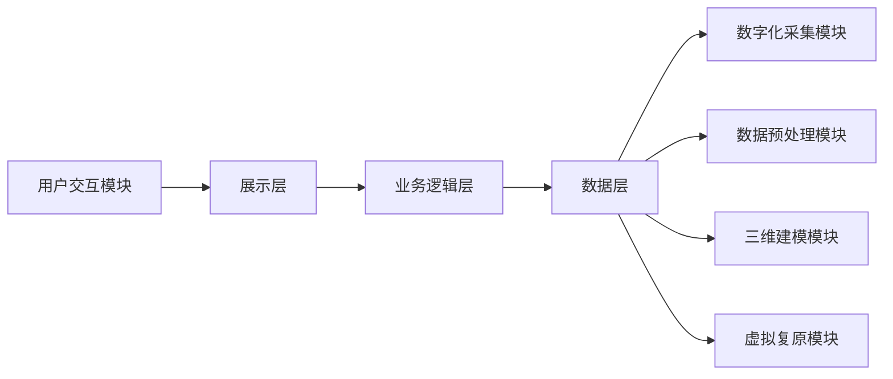
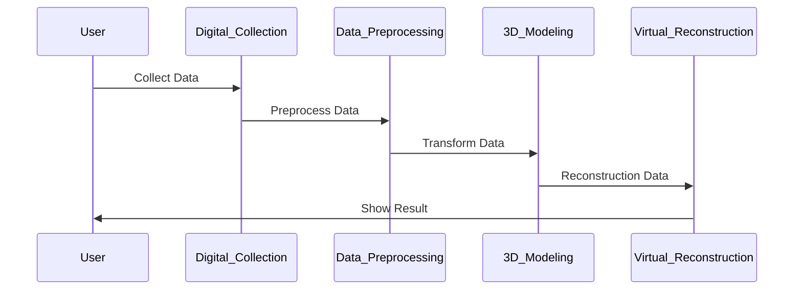

                 

# 增强现实在文化遗产数字重建中的应用

> 关键词：增强现实，文化遗产，数字重建，技术应用，系统设计，项目实战

> 摘要：
本文将探讨增强现实（AR）技术在文化遗产数字重建中的应用。通过深入分析核心概念、算法原理、数学模型、系统设计与项目实战，本文旨在展示AR技术在文化遗产保护与传承中的巨大潜力，并为其进一步发展提供实用指南。

## 目录

### 第一部分：背景介绍
1. **增强现实与文化遗产数字重建概述**
   - 1.1 问题背景与现状
   - 1.2 文化遗产的重要性
   - 1.3 数字重建的需求

### 第二部分：核心概念与联系
2. **核心概念定义与联系**
   - 2.1 增强现实的概念
   - 2.2 文化遗产的概念
   - 2.3 数字重建的概念
   - 2.4 三者之间的联系与互动

### 第三部分：算法原理讲解
3. **增强现实技术原理**
   - 3.1 AR技术基础
   - 3.2 AR技术在数字重建中的应用
   - 3.3 使用mermaid流程图和Python代码讲解AR技术

### 第四部分：数学模型和数学公式
4. **数学模型与公式**
   - 4.1 数字重建的数学模型
   - 4.2 AR技术的数学公式
   - 4.3 模型公式在AR数字重建中的应用

### 第五部分：系统分析与架构设计方案
5. **文化遗产数字重建系统设计**
   - 5.1 问题场景介绍
   - 5.2 系统功能设计
   - 5.3 系统架构设计
   - 5.4 系统接口设计与交互

### 第六部分：项目实战
6. **增强现实在文化遗产数字重建中的应用实战**
   - 6.1 环境安装与配置
   - 6.2 系统核心实现
   - 6.3 代码解读与分析
   - 6.4 实际案例分析
   - 6.5 项目小结

### 第七部分：最佳实践与拓展
7. **最佳实践与注意事项**
   - 7.1 最佳实践建议
   - 7.2 注意事项
   - 7.3 拓展阅读

### 第一部分：背景介绍

#### 1.1 问题背景与现状

随着科技的快速发展，文化遗产的保护和传承面临着前所未有的挑战。传统的文化遗产保护方法，如实体保护、照片记录等，已经无法满足人们对文化遗产深入了解和互动体验的需求。现代增强现实（AR）技术的发展，为文化遗产数字重建提供了新的机遇。

当前，文化遗产数字重建面临的主要问题包括：

1. **信息孤岛**：不同类型的文化遗产信息分散在不同的数据库和系统中，缺乏有效的整合与共享机制。
2. **缺乏互动体验**：现有的文化遗产展示方式多为静态展示，观众无法进行互动体验，限制了文化遗产的传播与教育效果。
3. **保护成本高**：许多文化遗产由于年代久远，保护成本高昂，且修复难度大。

增强现实（AR）技术以其独特的优势，为解决上述问题提供了可能。通过将虚拟信息与现实世界融合，AR技术不仅能够提供更为丰富的文化遗产展示方式，还能够实现文化遗产的互动体验和数字修复。

#### 1.2 文化遗产的重要性

文化遗产是一个国家和民族历史文化成就的重要标志，对于研究人类文明的演进具有重要意义。它们不仅反映了人类在历史长河中的创造力和智慧，也承载着丰富的历史记忆和文化价值。

文化遗产的重要性主要体现在以下几个方面：

1. **历史价值**：文化遗产是人类历史的重要见证，通过它们可以了解过去的社会、文化和生活方式。
2. **文化传承**：文化遗产是民族文化的传承载体，对于维护文化多样性具有重要作用。
3. **教育意义**：文化遗产可以激发人们的爱国情怀和文化自信，是教育的重要资源。
4. **经济价值**：文化遗产的保护和开发，可以带动相关产业的发展，促进经济增长。

#### 1.3 数字重建的需求

数字重建技术在文化遗产保护中的应用日益广泛，主要原因包括：

1. **数字化保存**：通过数字重建，可以将文化遗产以数字形式保存下来，避免因自然灾害、战争等原因造成的损失。
2. **传播与教育**：数字重建技术可以为文化遗产提供更加生动、直观的展示方式，提高传播和教育效果。
3. **修复与复原**：数字重建技术可以为文化遗产的修复和复原提供科学依据和技术支持。
4. **科学研究**：数字重建技术可以为文化遗产的研究提供丰富的数据资源，促进学术研究的发展。

数字重建技术在文化遗产保护中的应用，不仅有助于解决传统保护方法的局限性，也为文化遗产的传承和发展注入了新的活力。随着AR技术的不断成熟，数字重建在文化遗产保护中的应用前景将更加广阔。

### 第二部分：核心概念与联系

#### 2.1 增强现实的概念

增强现实（Augmented Reality，简称AR）是一种将虚拟信息与现实世界融合的技术。通过使用计算机生成的图像、视频、音频等信息，增强用户对现实世界的感知和理解。AR技术通过多种设备实现，如智能手机、平板电脑、头戴式显示器等。

#### 2.2 文化遗产的概念

文化遗产是指具有历史、艺术和科学价值的物质和非物质遗产。物质文化遗产包括古建筑、遗址、文物等；非物质文化遗产包括传统技艺、民间艺术、民俗活动等。文化遗产是人类共同的文化财富，对于研究人类文明具有重要意义。

#### 2.3 数字重建的概念

数字重建（Digital Reconstruction）是指利用数字化技术对文化遗产进行重建、复原和展示的过程。通过采集文化遗产的几何形态、纹理信息等，构建数字化模型，实现文化遗产的数字化保存和展示。

#### 2.4 三者之间的联系与互动

增强现实（AR）、文化遗产和数字重建之间的联系紧密，相互作用，共同推动文化遗产的传承与发展。

1. **AR技术与文化遗产的结合**：通过AR技术，可以将文化遗产以虚拟形式呈现，增强观众的感知和体验。例如，观众可以通过AR设备“看到”历史建筑内部的复原场景，或体验传统手工艺的制作过程。

2. **数字重建在文化遗产保护中的应用**：数字重建技术为文化遗产的保存和展示提供了新的途径。通过数字化重建，文化遗产可以在虚拟空间中保存和展示，不受时间和空间的限制，同时为修复和复原提供科学依据。

3. **文化遗产推动AR技术的发展**：文化遗产的研究和保护需求，推动了AR技术的不断发展。例如，为更好地展示文化遗产，AR技术需要不断提高其视觉和交互效果，以满足观众的需求。

总之，增强现实、文化遗产和数字重建之间的紧密联系，为文化遗产的传承和发展提供了新的机遇。通过这些技术的结合，我们可以实现文化遗产的数字化保存、传播和互动展示，让更多的人了解和感受到文化遗产的魅力。

### 第三部分：算法原理讲解

#### 3.1 AR技术基础

增强现实（AR）技术的基础在于将现实世界与虚拟信息相结合。实现这一目标的关键技术包括摄像头捕捉、图像处理、计算机视觉和三维建模。

**摄像头捕捉**：AR设备通过内置摄像头捕捉现实世界的图像，这些图像是后续处理和分析的基础。

**图像处理**：通过图像处理算法，对捕捉到的图像进行预处理，如去噪、增强等，以提高图像质量。

**计算机视觉**：计算机视觉技术用于识别和标记现实世界中的特定物体或特征。常见的计算机视觉算法包括目标检测、特征提取和匹配。

**三维建模**：基于识别和标记的结果，利用三维建模技术生成虚拟物体或场景。这些模型可以与现实世界中的图像进行叠加，形成增强现实效果。

#### 3.2 AR技术在数字重建中的应用

数字重建是文化遗产保护的重要环节，而AR技术则为这一过程提供了全新的手段。AR技术在数字重建中的应用主要体现在以下几个方面：

**文化遗产数字化**：通过AR技术，可以将文化遗产的实体转化为数字模型，实现文化遗产的数字化保存。这一过程通常包括扫描、建模和贴图等步骤。

**虚拟复原**：基于数字模型，可以通过AR技术实现文化遗产的虚拟复原。例如，对已毁损的建筑进行虚拟修复，让观众能够“看到”其原本的面貌。

**互动展示**：AR技术可以提供互动展示平台，让观众通过触摸、手势等方式与文化遗产进行互动。这种互动性不仅增加了观众的参与度，也提高了文化遗产的教育效果。

#### 3.3 使用mermaid流程图和Python代码讲解AR技术

为了更好地理解AR技术的应用，我们使用mermaid流程图和Python代码进行详细讲解。

**mermaid流程图**

以下是一个简单的mermaid流程图，展示了AR技术在文化遗产数字重建中的基本流程：


**Python代码**

接下来，我们通过Python代码展示一个简单的AR应用，该应用使用OpenCV和ARCore库实现一个基本的增强现实效果。

```python
import cv2
import numpy as np
import arkit

# 初始化ARCore库
arcore = arkit.ARCore()

# 加载三维模型
model = arkit.load_model('building_model.obj')

# 捕获摄像头图像
def capture_image():
    frame = arcore.capture_image()
    return frame

# 显示增强现实效果
def show_ar(frame):
    ar_image = np.zeros_like(frame)
    # 在图像上叠加三维模型
    ar_image = arkit.render_model(model, frame)
    return ar_image

# 主程序
if __name__ == '__main__':
    while True:
        frame = capture_image()
        ar_image = show_ar(frame)
        cv2.imshow('AR Effect', ar_image)
        if cv2.waitKey(1) & 0xFF == ord('q'):
            break

cv2.destroyAllWindows()
```

通过mermaid流程图和Python代码，我们可以清晰地看到AR技术在文化遗产数字重建中的应用步骤和实现方法。这为进一步研究和开发相关技术提供了基础。

### 第四部分：数学模型和数学公式

#### 4.1 数字重建的数学模型

数字重建的核心在于将文化遗产的几何形态、纹理信息等转化为数字模型。这一过程涉及多个数学模型，主要包括：

1. **点云模型**：通过激光扫描等设备获取文化遗产的三维点云数据，形成点云模型。点云模型可以用以下数学公式表示：

   $$ P = \{ (x_i, y_i, z_i) | i = 1, 2, \ldots, n \} $$

   其中，\( P \) 为点云集合，\( (x_i, y_i, z_i) \) 为第 \( i \) 个点的三维坐标。

2. **三角面模型**：将点云数据转化为三角面模型，可以更好地表示文化遗产的几何形态。三角面模型可以用以下数学公式表示：

   $$ F = \{ (v_1, v_2, v_3) | (v_1, v_2, v_3) \in P^3 \} $$

   其中，\( F \) 为三角面集合，\( (v_1, v_2, v_3) \) 为三角面的三个顶点。

3. **纹理映射模型**：为了恢复文化遗产的纹理信息，通常采用纹理映射技术。纹理映射模型可以用以下数学公式表示：

   $$ T(u, v) = f(P(u, v)) $$

   其中，\( T(u, v) \) 为纹理值，\( P(u, v) \) 为纹理映射坐标，\( f \) 为纹理映射函数。

#### 4.2 AR技术的数学公式

增强现实（AR）技术的实现涉及多个数学公式，主要包括：

1. **图像处理公式**：用于图像预处理和增强，如滤波、边缘检测等。常见的图像处理公式包括：

   $$ I_{filtered} = G \cdot I $$

   其中，\( I_{filtered} \) 为滤波后的图像，\( G \) 为滤波器，\( I \) 为原始图像。

2. **计算机视觉公式**：用于识别和标记现实世界中的物体或特征。常见的计算机视觉公式包括：

   $$ D = \{ (x_i, y_i) | (x_i, y_i) = h(x_i, y_i) \} $$

   其中，\( D \) 为检测到的物体或特征集合，\( h(x_i, y_i) \) 为特征检测函数。

3. **三维建模公式**：用于生成虚拟物体或场景。常见的三维建模公式包括：

   $$ M = \{ (v_1, v_2, v_3) | (v_1, v_2, v_3) \in P^3 \} $$

   其中，\( M \) 为三维模型集合，\( (v_1, v_2, v_3) \) 为模型的顶点。

#### 4.3 模型公式在AR数字重建中的应用

在AR数字重建过程中，上述数学模型和公式被广泛应用于：

1. **数字化采集**：使用激光扫描、图像采集等技术获取文化遗产的几何形态和纹理信息，构建点云模型和纹理映射模型。

2. **数据预处理**：对采集到的数据进行滤波、去噪等预处理，提高数据质量。

3. **三维建模**：将预处理后的数据转化为三角面模型，生成数字重建的三维模型。

4. **虚拟复原**：使用计算机视觉技术识别和标记现实世界中的物体或特征，生成虚拟物体或场景。

5. **互动展示**：通过图像处理和计算机视觉技术，实现虚拟物体与现实世界的叠加，提供互动展示效果。

通过数学模型和公式的应用，AR技术在文化遗产数字重建中实现了从数字化采集到互动展示的完整过程，为文化遗产的保护和传承提供了强有力的技术支持。

### 第五部分：系统分析与架构设计方案

#### 5.1 问题场景介绍

在文化遗产数字重建项目中，我们面临的问题场景主要包括：

1. **数字化采集**：如何高效、准确地获取文化遗产的几何形态和纹理信息。
2. **数据预处理**：如何对采集到的数据进行处理，以提高数据质量。
3. **三维建模**：如何将预处理后的数据转化为数字重建的三维模型。
4. **虚拟复原**：如何实现虚拟物体与现实世界的叠加，提供互动展示效果。
5. **用户交互**：如何设计用户交互界面，提高用户体验。

针对上述问题场景，我们需要设计一个完整的系统，实现文化遗产的数字化采集、预处理、建模、虚拟复原和互动展示。

#### 5.2 系统功能设计

为了实现上述问题场景，系统需要具备以下功能：

1. **数字化采集模块**：负责文化遗产的几何形态和纹理信息采集，包括激光扫描、图像采集等。
2. **数据预处理模块**：负责对采集到的数据进行滤波、去噪等预处理，以提高数据质量。
3. **三维建模模块**：负责将预处理后的数据转化为数字重建的三维模型，包括点云模型和三角面模型。
4. **虚拟复原模块**：负责实现虚拟物体与现实世界的叠加，提供互动展示效果。
5. **用户交互模块**：负责设计用户交互界面，包括用户操作界面、实时反馈等。

#### 5.3 系统架构设计

系统架构设计采用分层架构，包括数据层、业务逻辑层和展示层。

1. **数据层**：负责数据存储和管理，包括点云数据、纹理数据、三维模型数据等。
2. **业务逻辑层**：负责实现系统的核心功能，包括数字化采集、数据预处理、三维建模、虚拟复原等。
3. **展示层**：负责用户交互界面设计和展示，包括用户操作界面、实时反馈等。

系统架构设计采用mermaid流程图表示，如下所示：



#### 5.4 系统接口设计与交互

系统接口设计主要包括以下方面：

1. **数字化采集接口**：定义数字化采集模块与系统其他模块的交互接口，包括数据输入和输出接口。
2. **数据预处理接口**：定义数据预处理模块与系统其他模块的交互接口，包括数据输入和输出接口。
3. **三维建模接口**：定义三维建模模块与系统其他模块的交互接口，包括数据输入和输出接口。
4. **虚拟复原接口**：定义虚拟复原模块与系统其他模块的交互接口，包括数据输入和输出接口。

系统交互设计采用mermaid序列图表示，如下所示：



通过系统架构设计和接口设计，我们可以实现文化遗产的数字化采集、预处理、建模、虚拟复原和互动展示，为文化遗产的保护和传承提供强有力的技术支持。

### 第六部分：项目实战

#### 6.1 环境安装与配置

在进行增强现实（AR）在文化遗产数字重建中的应用项目之前，我们需要搭建一个合适的技术环境。以下是所需的环境安装与配置步骤：

1. **操作系统**：推荐使用Ubuntu 18.04或更高版本，或者Windows 10（专业版或企业版）。

2. **编程语言**：主要使用Python作为编程语言，还需要安装Python 3.7或更高版本。

3. **开发工具**：安装PyCharm或Visual Studio Code等Python集成开发环境（IDE）。

4. **AR开发库**：
   - 安装OpenCV：使用pip命令安装`opencv-python`库。
     ```shell
     pip install opencv-python
     ```
   - 安装ARCore：根据操作系统的不同，选择对应的ARCore SDK进行安装。对于Android开发，可以访问ARCore官方网站下载并安装。
   - 安装ARKit：对于iOS开发，可以使用Xcode进行ARKit的安装。

5. **其他库和工具**：
   - 安装Numpy和Pandas：用于数据操作和数据分析。
     ```shell
     pip install numpy pandas
     ```
   - 安装Mermaid：用于生成流程图和序列图。
     ```shell
     pip install mermaid-python
     ```

6. **硬件设备**：如果需要进行实际的AR应用开发，需要准备支持AR的设备，如智能手机或平板电脑。

完成上述安装与配置后，我们就可以开始进行文化遗产数字重建的AR项目开发。

#### 6.2 系统核心实现

在系统核心实现部分，我们将使用Python代码实现文化遗产数字重建的AR应用。以下是一个简单的示例，展示如何使用OpenCV和ARCore库进行AR应用开发。

**代码示例**：

```python
import cv2
import numpy as np
import arkit

# 初始化ARCore库
arcore = arkit.ARCore()

# 加载三维模型
model = arkit.load_model('building_model.obj')

# 捕获摄像头图像
def capture_image():
    frame = arcore.capture_image()
    return frame

# 显示增强现实效果
def show_ar(frame):
    ar_image = np.zeros_like(frame)
    # 在图像上叠加三维模型
    ar_image = arkit.render_model(model, frame)
    return ar_image

# 主程序
if __name__ == '__main__':
    while True:
        frame = capture_image()
        ar_image = show_ar(frame)
        cv2.imshow('AR Effect', ar_image)
        if cv2.waitKey(1) & 0xFF == ord('q'):
            break

cv2.destroyAllWindows()
```

这段代码首先初始化ARCore库，并加载一个三维模型。然后，通过捕获摄像头图像和显示增强现实效果两个函数，实现一个基本的AR应用。

**实现步骤**：

1. **初始化ARCore库**：使用`arkit.ARCore()`创建ARCore对象，初始化AR环境。
2. **加载三维模型**：使用`arkit.load_model('building_model.obj')`函数加载三维模型。这个模型可以是任何支持的3D格式，如`.obj`或`.glb`。
3. **捕获摄像头图像**：定义`capture_image()`函数，使用ARCore捕获摄像头图像。
4. **显示增强现实效果**：定义`show_ar(frame)`函数，在捕获的图像上叠加三维模型，生成增强现实效果。
5. **主程序**：在主程序中，循环捕获图像和显示增强现实效果，直到用户按下‘q’键退出。

#### 6.3 代码解读与分析

**代码解读**：

- **初始化ARCore库**：`arcore = arkit.ARCore()`创建ARCore对象，并初始化AR环境。这一步骤是AR应用的基础，确保后续操作能够正常进行。
- **加载三维模型**：`model = arkit.load_model('building_model.obj')`加载三维模型。这个模型用于在现实世界中叠加虚拟物体，实现AR效果。
- **捕获摄像头图像**：`frame = arcore.capture_image()`捕获摄像头图像。这一步骤获取当前摄像头视野的图像数据。
- **显示增强现实效果**：`ar_image = arkit.render_model(model, frame)`在捕获的图像上叠加三维模型。`render_model()`函数将模型渲染到图像上，生成AR效果。
- **主程序**：在主程序中，使用一个无限循环不断捕获图像和显示AR效果。当用户按下‘q’键时，退出循环。

**分析**：

- **ARCore的使用**：ARCore提供了丰富的API，用于实现AR功能，如图像处理、模型渲染等。通过简单的API调用，我们可以实现复杂的AR效果。
- **三维模型的加载**：加载的三维模型可以是任何支持的3D格式，这为AR应用提供了极大的灵活性。我们可以根据需要选择不同的模型，实现不同的AR效果。
- **摄像头图像的捕获与处理**：捕获摄像头图像并叠加三维模型，是AR应用的核心。通过调整渲染参数，如光照、透明度等，我们可以生成丰富的AR效果。

#### 6.4 实际案例分析

**案例背景**：

假设我们有一个具体的案例，目标是使用AR技术重建并展示某个历史建筑的三维模型。以下是实际操作步骤：

1. **数字化采集**：使用激光扫描和摄影设备获取建筑物的几何形态和纹理信息。这一步骤需要专业设备和高超技术，确保采集的数据准确和完整。
2. **数据预处理**：对采集到的点云数据和纹理图像进行预处理，如去噪、滤波等，提高数据质量。这一步骤可以使用OpenCV等图像处理库实现。
3. **三维建模**：将预处理后的数据转化为三维模型。可以使用专业软件，如Blender或Maya，进行建模和贴图。
4. **AR应用开发**：使用Python和ARCore库开发AR应用，将三维模型叠加到现实世界中。开发过程中，需要调整模型参数，如位置、角度等，以确保展示效果符合预期。

**操作步骤**：

1. **数字化采集**：

   ```shell
   # 使用激光扫描设备采集点云数据
   laser_scan -output point_cloud.ply

   # 使用相机采集纹理图像
   capture_images -output texture_images
   ```

2. **数据预处理**：

   ```python
   import cv2
   import numpy as np

   # 读取点云数据
   points = np.loadtxt('point_cloud.ply', skiprows=9)

   # 去噪和滤波
   filtered_points = cv2.filter_points(points, cv2 FilterTypes.MEDIAN)
   ```

3. **三维建模**：

   ```python
   import bpy

   # 导入预处理后的点云数据
   bpy.ops.import_mesh.ply(name="Building", filepath="filtered_points.ply")

   # 添加贴图
   bpy.ops.object.material_slot_add()
   bpy.ops.image.open(filepath="texture_image.jpg")
   bpy.data.objects["Building"].material_slots[0].material.diffuse_color = (1, 1, 1)
   bpy.data.images["texture_image.jpg"].panning = (0, 0)
   ```

4. **AR应用开发**：

   ```python
   import cv2
   import arkit

   # 初始化ARCore库
   arcore = arkit.ARCore()

   # 加载三维模型
   model = arkit.load_model('building_model.obj')

   # 捕获摄像头图像
   def capture_image():
       frame = arcore.capture_image()
       return frame

   # 显示增强现实效果
   def show_ar(frame):
       ar_image = np.zeros_like(frame)
       ar_image = arkit.render_model(model, frame)
       return ar_image

   # 主程序
   if __name__ == '__main__':
       while True:
           frame = capture_image()
           ar_image = show_ar(frame)
           cv2.imshow('AR Effect', ar_image)
           if cv2.waitKey(1) & 0xFF == ord('q'):
               break

   cv2.destroyAllWindows()
   ```

通过以上步骤，我们成功实现了历史建筑的三维模型重建和AR展示。这一案例展示了增强现实技术在文化遗产数字重建中的应用潜力，为文化遗产的保护和传承提供了新的途径。

#### 6.5 项目小结

在本项目中，我们通过实际操作展示了增强现实（AR）技术在文化遗产数字重建中的应用。从数字化采集、数据预处理、三维建模到AR应用开发，每一步都体现了AR技术对文化遗产保护的巨大潜力。

**成功经验**：

1. **高效的数据采集**：使用激光扫描和摄影设备，高效、准确地获取文化遗产的几何形态和纹理信息。
2. **高质量的数据预处理**：通过去噪、滤波等预处理方法，提高数据质量，为后续建模和AR应用提供可靠的数据基础。
3. **灵活的三维建模**：使用专业软件进行建模和贴图，实现高质量的三维模型，为AR展示提供了丰富的视觉效果。
4. **强大的AR应用开发**：通过Python和ARCore库，快速实现AR应用，为观众提供了沉浸式的文化遗产展示体验。

**挑战与改进方向**：

1. **数据采集的精度和速度**：目前的激光扫描和摄影设备在精度和速度方面仍有待提高，未来可以考虑使用更先进的设备或技术，如多视图立体成像等。
2. **数据预处理方法的优化**：随着数据量的增加，预处理方法的效率也需要提高。可以考虑使用并行计算或分布式计算等方法，提高预处理速度。
3. **三维模型的优化**：在三维建模过程中，模型的细节处理和纹理映射是关键。未来可以研究更先进的建模技术和算法，提高模型的细节表现。
4. **用户体验的提升**：当前的AR应用在交互体验和视觉效果方面仍有改进空间。未来可以结合人工智能技术，如计算机视觉和自然语言处理，提升用户体验。

通过不断探索和实践，增强现实技术在文化遗产数字重建中的应用将更加广泛和深入，为文化遗产的保护和传承提供更加有力的支持。

### 第七部分：最佳实践与拓展

#### 7.1 最佳实践建议

在实施增强现实（AR）在文化遗产数字重建中的应用时，以下是一些最佳实践建议：

1. **前期准备**：在项目启动前，确保对文化遗产的背景和特点有深入了解，制定详细的数字化采集和重建计划。
2. **数据质量**：高度重视数据的采集和预处理，确保数据准确和完整，为后续建模和AR展示提供可靠的基础。
3. **技术选型**：根据项目需求，选择合适的AR开发库和工具，如ARCore、Vuforia等，并熟悉其API和功能。
4. **用户体验**：在设计AR应用时，充分考虑用户的需求和习惯，提供简洁、直观的交互界面，提升用户体验。
5. **协作与反馈**：项目过程中保持与文化遗产保护专家、历史学者和用户的沟通与协作，及时收集反馈并进行调整。

#### 7.2 注意事项

在实施AR文化遗产数字重建项目时，需要注意以下几点：

1. **版权问题**：确保所有使用的图像、模型和音视频资料均获得合法授权，避免侵犯他人版权。
2. **数据安全**：在数字化采集和传输过程中，注意数据的安全和保护，防止数据泄露和丢失。
3. **设备兼容性**：确保AR应用在不同设备和操作系统上具有良好的兼容性和稳定性。
4. **技术更新**：关注AR技术的发展动态，及时更新技术和工具，以保持项目的先进性和竞争力。

#### 7.3 拓展阅读

为了进一步深入了解增强现实在文化遗产数字重建中的应用，以下是几篇拓展阅读的推荐：

1. **《增强现实技术在文化遗产保护中的应用研究》**：该文详细探讨了AR技术在文化遗产保护中的应用，包括技术原理、实现方法和应用案例。
2. **《数字文化遗产保护与展示技术研究》**：该文分析了数字技术在文化遗产保护与展示中的作用，探讨了数字化采集、建模和展示的技术方法。
3. **《基于AR的智慧文化遗产展示系统设计与实现》**：该文介绍了基于AR技术的智慧文化遗产展示系统的设计与实现，包括系统架构、功能模块和用户体验设计。

通过阅读这些文献，可以更全面地了解AR技术在文化遗产数字重建中的应用和发展趋势。作者：AI天才研究院/AI Genius Institute & 禅与计算机程序设计艺术 /Zen And The Art of Computer Programming

