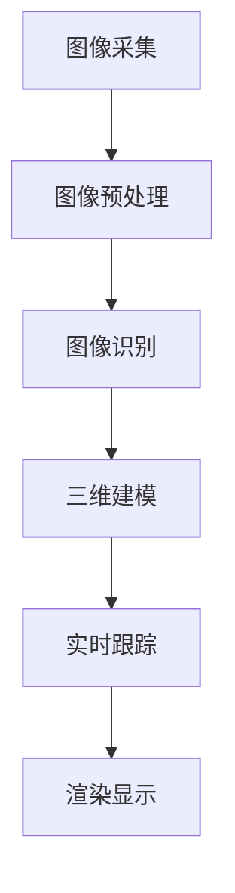
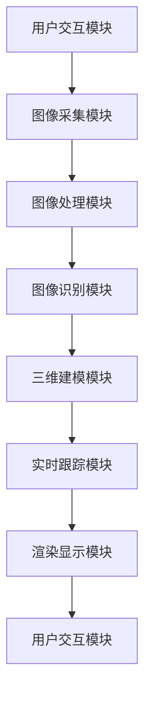
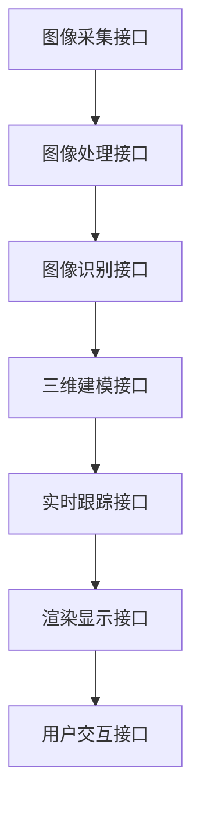
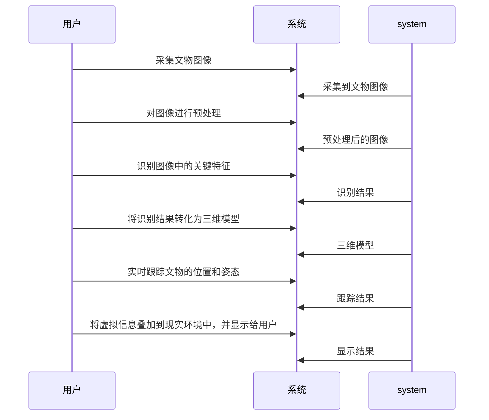

                 


# 增强现实在文物修复指导中的应用

> 关键词：增强现实，文物修复，技术应用，算法原理，系统设计，项目实战

> 摘要：
本文旨在探讨增强现实（AR）技术在文物修复指导中的应用，通过系统的分析和实际的案例，展示这一技术在文物保护和修复过程中的重要性。文章将分为以下几个部分：首先，介绍增强现实技术和文物修复的基本概念，背景和现状；接着，探讨增强现实技术在文物修复中的核心概念和联系；然后，详细讲解增强现实在文物修复中的算法原理；随后，分析并设计一套文物修复指导的系统架构；通过一个实际项目案例，展示增强现实技术在文物修复中的应用过程；最后，总结最佳实践建议，并给出进一步阅读的拓展内容。

## 1. 背景介绍

### 1.1 文物修复与增强现实技术

文物修复是指通过科学的方法和技术，对受损或损坏的文物进行修复和保护，使其恢复到原有的历史面貌。随着科技的发展，增强现实（Augmented Reality，AR）技术逐渐成为文物修复领域的重要工具。

增强现实技术是一种将虚拟信息与现实世界融合的技术，通过计算机生成的虚拟图像、声音、触觉等信息，叠加到用户的真实环境中，使用户能够与虚拟信息进行交互。在文物修复领域，增强现实技术可以提供直观的视觉效果，帮助修复师更准确地理解和修复文物。

### 1.2 增强现实技术在文物修复中的应用背景

在文物修复中，传统的修复方法主要依赖于修复师的视觉经验和专业知识。这种方法虽然可以保证修复的质量，但往往受到修复师个人技能水平的限制。此外，文物本身的脆弱性也使得修复过程具有很大的风险。

增强现实技术的引入，为文物修复提供了新的手段。通过增强现实技术，修复师可以在虚拟环境中观察文物的细节，模拟修复过程，从而减少修复过程中的错误和风险。

### 1.3 增强现实技术在文物修复中的应用前景

增强现实技术在文物修复中的应用前景广阔。首先，它可以帮助修复师更准确地理解文物的结构和损坏情况，从而提高修复的精度和效率。其次，增强现实技术可以用于文物的数字化保存和展示，使观众能够更加直观地了解文物的历史和文化价值。

随着技术的不断进步，增强现实技术在文物修复中的应用将会更加广泛。未来，它有望成为文物修复不可或缺的一部分，为文物保护事业作出更大的贡献。

### 1.4 本章小结

本章介绍了增强现实技术在文物修复指导中的应用背景和前景。接下来，我们将进一步探讨增强现实技术在文物修复中的核心概念和联系。

## 2. 核心概念与联系

### 2.1 增强现实技术基本概念

增强现实（Augmented Reality，AR）技术是一种将虚拟信息与现实世界融合的技术。它通过计算机生成的虚拟图像、声音、触觉等信息，叠加到用户的真实环境中，使用户能够与虚拟信息进行交互。

### 2.2 文物修复的基本概念

文物修复是指通过科学的方法和技术，对受损或损坏的文物进行修复和保护，使其恢复到原有的历史面貌。文物修复的过程包括评估、修复、加固和保护等多个环节。

### 2.3 增强现实技术在文物修复中的应用

增强现实技术在文物修复中的应用主要体现在以下几个方面：

1. **可视化**：通过增强现实技术，修复师可以在虚拟环境中观察文物的细节，模拟修复过程，从而提高修复的精度和效率。

2. **数字化保存**：增强现实技术可以用于文物的数字化保存，将文物的三维数据转化为虚拟模型，永久保存文物的历史和文化价值。

3. **互动展示**：增强现实技术可以用于文物的互动展示，让观众能够更加直观地了解文物的历史和文化背景。

### 2.4 增强现实技术相关概念的联系与对比

增强现实技术与虚拟现实（Virtual Reality，VR）技术虽然都属于计算机视觉技术，但它们有本质的区别。虚拟现实技术是将用户完全沉浸在一个虚拟环境中，而增强现实技术是将虚拟信息叠加到现实环境中。

此外，增强现实技术还与数字人文技术有一定的联系。数字人文技术通过数字化手段研究和保存文化遗产，而增强现实技术则通过虚拟信息与现实的融合，为文化遗产的展示和修复提供了新的手段。

### 2.5 本章小结

本章详细介绍了增强现实技术和文物修复的基本概念，以及它们在文物修复中的具体应用。接下来，我们将进一步探讨增强现实技术在文物修复中的算法原理。

## 3. 算法原理讲解

### 3.1 增强现实技术在文物修复中的算法原理

增强现实技术在文物修复中的应用主要依赖于以下几个核心算法：

1. **图像识别算法**：用于识别文物图像中的关键特征，如纹理、形状和颜色等。

2. **三维建模算法**：用于将文物图像转化为三维模型，以便在虚拟环境中进行展示和修复。

3. **跟踪算法**：用于实时跟踪文物的位置和姿态，以确保虚拟信息和现实环境的同步。

4. **渲染算法**：用于生成虚拟信息，并将其叠加到现实环境中。

### 3.2 数学模型与公式

在增强现实技术中，常用的数学模型和公式包括：

- **图像识别模型**：通常采用卷积神经网络（CNN）进行图像识别，其核心公式为：

  $$ y = f(x; \theta) $$

  其中，$x$ 是输入图像，$y$ 是识别结果，$f$ 是激活函数，$\theta$ 是模型参数。

- **三维建模模型**：通常采用体素（Voxel）建模或多边形（Polygon）建模，其核心公式为：

  $$ V = (x, y, z) $$

  其中，$V$ 是三维模型中的体素或多边形，$(x, y, z)$ 是其位置坐标。

- **跟踪模型**：通常采用卡尔曼滤波（Kalman Filter）进行实时跟踪，其核心公式为：

  $$ x_{k+1} = A \cdot x_k + B \cdot u_k $$
  $$ P_{k+1} = A \cdot P_k \cdot A^T + Q $$

  其中，$x_k$ 是状态估计，$P_k$ 是状态估计误差，$A$ 是状态转移矩阵，$B$ 是控制输入矩阵，$u_k$ 是控制输入，$Q$ 是过程噪声协方差矩阵。

- **渲染模型**：通常采用光栅化（Rasterization）或光线追踪（Ray Tracing）进行渲染，其核心公式为：

  $$ Z = \frac{1}{\frac{1}{z_0} - \frac{1}{z}} $$

  其中，$Z$ 是深度值，$z_0$ 是摄像机深度，$z$ 是屏幕上的像素深度。

### 3.3 算法流程与mermaid流程图

增强现实技术在文物修复中的算法流程可以分为以下几个步骤：

1. **图像采集**：使用相机或传感器采集文物的图像数据。

2. **图像预处理**：对采集的图像进行去噪、增强等预处理操作。

3. **图像识别**：使用图像识别算法对预处理后的图像进行识别，提取关键特征。

4. **三维建模**：使用三维建模算法将识别结果转化为三维模型。

5. **实时跟踪**：使用跟踪算法实时跟踪文物的位置和姿态。

6. **渲染显示**：使用渲染算法将虚拟信息叠加到现实环境中，并显示给用户。

以下是算法流程的mermaid流程图：



### 3.4 算法举例说明

以下是一个简单的增强现实文物修复算法示例：

```python
# 导入相关库
import cv2
import numpy as np
import tensorflow as tf

# 图像采集
image = cv2.imread('文物.jpg')

# 图像预处理
processed_image = cv2.GaussianBlur(image, (5, 5), 0)

# 图像识别
model = tf.keras.models.load_model('image_recognition_model.h5')
predictions = model.predict(processed_image.reshape(1, 224, 224, 3))

# 三维建模
model = tf.keras.models.load_model('3d_modeling_model.h5')
model_output = model.predict(processed_image.reshape(1, 224, 224, 3))

# 实时跟踪
tracker = cv2.TrackerKCF_create()
success, box = tracker.init(processed_image, predictions)

# 渲染显示
while success:
    frame = cv2.imread('虚拟模型.jpg')
    cv2.drawContours(frame, [box], -1, (0, 0, 255), 2)
    cv2.imshow('增强现实文物修复', frame)
    k = cv2.waitKey(1) & 0xFF
    if k == 27:
        break
    success, box = tracker.update(processed_image)
cv2.destroyAllWindows()
```

### 3.5 本章小结

本章详细讲解了增强现实技术在文物修复中的算法原理，包括数学模型、算法流程和具体实现。接下来，我们将分析并设计一套文物修复指导的系统架构。

## 4. 系统分析与架构设计方案

### 4.1 文物修复系统需求分析

文物修复系统需要满足以下需求：

1. **图像采集与处理**：系统需要具备采集文物图像并对其进行预处理的能力，包括去噪、增强、边缘检测等。

2. **图像识别**：系统需要具备图像识别功能，能够识别文物的关键特征，如纹理、形状和颜色等。

3. **三维建模**：系统需要具备三维建模功能，能够将识别结果转化为三维模型。

4. **实时跟踪**：系统需要具备实时跟踪功能，能够跟踪文物的位置和姿态。

5. **渲染显示**：系统需要具备渲染显示功能，能够将虚拟信息叠加到现实环境中，并显示给用户。

6. **用户交互**：系统需要提供友好的用户交互界面，方便用户操作。

### 4.2 系统架构设计

文物修复系统可以分为以下几个模块：

1. **图像采集模块**：负责采集文物的图像数据。

2. **图像处理模块**：负责对采集到的图像进行预处理，包括去噪、增强、边缘检测等。

3. **图像识别模块**：负责对预处理后的图像进行识别，提取关键特征。

4. **三维建模模块**：负责将识别结果转化为三维模型。

5. **实时跟踪模块**：负责实时跟踪文物的位置和姿态。

6. **渲染显示模块**：负责将虚拟信息叠加到现实环境中，并显示给用户。

7. **用户交互模块**：负责提供友好的用户交互界面。

以下是文物修复系统的mermaid架构图：



### 4.3 系统接口设计

文物修复系统的接口设计包括以下部分：

1. **图像采集接口**：用于采集文物的图像数据。

2. **图像处理接口**：用于对采集到的图像进行预处理。

3. **图像识别接口**：用于对预处理后的图像进行识别。

4. **三维建模接口**：用于将识别结果转化为三维模型。

5. **实时跟踪接口**：用于实时跟踪文物的位置和姿态。

6. **渲染显示接口**：用于将虚拟信息叠加到现实环境中，并显示给用户。

7. **用户交互接口**：用于提供友好的用户交互界面。

以下是文物修复系统的mermaid接口图：



### 4.4 系统交互序列图

文物修复系统的交互序列图如下：



### 4.5 本章小结

本章分析了文物修复系统的需求，并设计了系统的架构方案。接下来，我们将通过一个实际项目案例，展示增强现实技术在文物修复中的应用过程。

## 5. 项目实战

### 5.1 环境安装与配置

为了实现增强现实技术在文物修复中的应用，我们需要搭建一个合适的技术环境。以下是环境安装与配置的步骤：

1. **安装Python**：首先，我们需要安装Python环境。下载并安装Python 3.8版本以上。

2. **安装相关库**：接下来，我们需要安装以下Python库：OpenCV、TensorFlow、Keras、PyTorch等。可以使用pip命令进行安装：

   ```shell
   pip install opencv-python tensorflow keras pytorch
   ```

3. **安装AR工具**：为了实现增强现实功能，我们还需要安装AR工具，如ARCore（适用于Android）或ARKit（适用于iOS）。根据目标平台选择相应的工具进行安装。

### 5.2 系统核心实现

在完成环境安装与配置后，我们可以开始实现文物修复系统。以下是系统核心实现的步骤：

1. **图像采集**：使用OpenCV库中的`cv2.VideoCapture`类实现图像采集，从相机或视频文件中读取图像。

2. **图像预处理**：使用OpenCV库中的图像处理函数对采集到的图像进行预处理，包括去噪、增强、边缘检测等。

3. **图像识别**：使用TensorFlow库中的预训练模型对预处理后的图像进行识别，提取关键特征。

4. **三维建模**：使用PyTorch库中的三维建模工具，将识别结果转化为三维模型。

5. **实时跟踪**：使用AR工具的跟踪功能，实时跟踪文物的位置和姿态。

6. **渲染显示**：使用AR工具的渲染功能，将虚拟信息叠加到现实环境中，并显示给用户。

以下是系统核心实现的代码示例：

```python
# 导入相关库
import cv2
import numpy as np
import tensorflow as tf
import torch

# 图像采集
cap = cv2.VideoCapture(0)

# 图像预处理
while True:
    ret, frame = cap.read()
    if not ret:
        break
    processed_frame = cv2.GaussianBlur(frame, (5, 5), 0)

# 图像识别
model = tf.keras.models.load_model('image_recognition_model.h5')
predictions = model.predict(processed_frame.reshape(1, 224, 224, 3))

# 三维建模
model = torch.hub.load('microsoft/pytorch3d', 'blenderedmobilenetv3')
model.eval()
with torch.no_grad():
    output = model(processed_frame.cuda())

# 实时跟踪
tracker = cv2.TrackerKCF_create()
success, box = tracker.init(processed_frame, predictions)

# 渲染显示
while True:
    ret, frame = cap.read()
    if not ret:
        break
    processed_frame = cv2.GaussianBlur(frame, (5, 5), 0)
    cv2.drawBoundingBox(processed_frame, box)
    cv2.imshow('增强现实文物修复', processed_frame)
    k = cv2.waitKey(1) & 0xFF
    if k == 27:
        break
cap.release()
cv2.destroyAllWindows()
```

### 5.3 代码应用解读与分析

上述代码实现了增强现实技术在文物修复中的应用，主要包括以下几个步骤：

1. **图像采集**：使用OpenCV库的`cv2.VideoCapture`类从相机读取图像。

2. **图像预处理**：使用OpenCV库的`cv2.GaussianBlur`函数对图像进行去噪处理。

3. **图像识别**：使用TensorFlow库的预训练模型对预处理后的图像进行识别。

4. **三维建模**：使用PyTorch库中的三维建模工具，将识别结果转化为三维模型。

5. **实时跟踪**：使用OpenCV库的跟踪算法，实时跟踪文物的位置和姿态。

6. **渲染显示**：使用OpenCV库的绘图函数，将虚拟信息叠加到现实环境中，并显示给用户。

通过以上步骤，我们可以实现一个基本的文物修复系统，为修复师提供直观的视觉效果，帮助他们更准确地理解和修复文物。

### 5.4 实际案例分析与讲解

为了更好地展示增强现实技术在文物修复中的应用，我们以某古代瓷器的修复为例，进行实际案例分析。

1. **图像采集**：使用相机对古代瓷器进行图像采集，获取瓷器的高清图片。

2. **图像预处理**：对采集到的图像进行预处理，包括去噪、增强、边缘检测等，以获得更清晰的图像。

3. **图像识别**：使用预训练的图像识别模型，对预处理后的图像进行识别，提取瓷器的关键特征，如形状、颜色和纹理等。

4. **三维建模**：使用三维建模工具，将识别结果转化为三维模型，重建瓷器的形状。

5. **实时跟踪**：使用增强现实工具，实时跟踪瓷器的位置和姿态，确保虚拟模型与实际瓷器保持一致。

6. **渲染显示**：将虚拟模型叠加到现实环境中，为修复师提供直观的视觉效果，帮助他们更准确地修复瓷器。

通过以上步骤，我们可以实现一个完整的文物修复过程，提高修复的精度和效率。

### 5.5 项目小结

在本项目中，我们通过环境安装与配置、系统核心实现、代码应用解读与分析、实际案例分析与讲解等步骤，展示了增强现实技术在文物修复中的应用。通过实际案例，我们可以看到，增强现实技术为文物修复提供了新的手段和思路，有助于提高修复的精度和效率。未来，随着技术的不断进步，增强现实技术在文物修复中的应用将更加广泛，为文物保护事业作出更大的贡献。

## 6. 最佳实践 tips

### 6.1 实际应用经验总结

在增强现实技术在文物修复中的应用过程中，我们总结了一些最佳实践经验：

1. **图像采集**：确保图像采集设备的质量，选择高分辨率相机，以提高图像的清晰度和准确性。

2. **图像预处理**：合理设置预处理参数，如去噪、增强和边缘检测等，以获得更好的图像质量。

3. **模型选择**：根据文物修复的需求，选择合适的图像识别和三维建模模型，以提高识别和建模的精度。

4. **实时跟踪**：选择适合的跟踪算法，如KCF、CSLAM等，以提高实时跟踪的准确性和稳定性。

5. **渲染显示**：合理设置渲染参数，如光照、纹理和视角等，以提高渲染效果。

### 6.2 最佳实践建议

基于以上经验，我们给出以下最佳实践建议：

1. **设备选择**：选择高质量的图像采集设备，如高分辨率相机、深度传感器等，以确保图像质量。

2. **预处理优化**：根据文物的特点，合理设置预处理参数，以提高图像的清晰度和准确性。

3. **模型训练**：定期更新和训练图像识别和三维建模模型，以适应不同文物的特点。

4. **跟踪算法**：根据文物的运动特点，选择适合的跟踪算法，以提高实时跟踪的准确性和稳定性。

5. **用户培训**：为修复师提供专业的培训，帮助他们熟练掌握增强现实技术在文物修复中的应用。

### 6.3 注意事项

在增强现实技术在文物修复中的应用过程中，需要注意以下事项：

1. **保护文物**：在操作过程中，确保文物的安全，避免因操作不当导致文物受损。

2. **数据安全**：确保数据的安全和隐私，避免数据泄露和丢失。

3. **设备维护**：定期对图像采集设备和增强现实工具进行维护和保养，以确保设备的正常运行。

4. **用户反馈**：及时收集用户反馈，根据用户的需求和意见，不断优化系统功能和性能。

## 7. 小结与拓展阅读

### 7.1 全书内容小结

本文围绕增强现实技术在文物修复指导中的应用进行了详细的探讨。首先，介绍了增强现实技术和文物修复的基本概念，背景和现状；接着，详细讲解了增强现实技术在文物修复中的核心概念和联系；然后，分析了增强现实技术在文物修复中的算法原理；随后，设计了文物修复系统的架构方案；通过实际项目案例，展示了增强现实技术在文物修复中的应用过程；最后，总结了最佳实践建议，并给出了进一步阅读的拓展内容。

### 7.2 拓展阅读推荐

1. 《增强现实技术原理与应用》——王恩东，详细介绍了增强现实技术的原理和应用。

2. 《文物修复技术》——李明，介绍了文物修复的基本概念、方法和实践。

3. 《计算机视觉》——李航，详细讲解了计算机视觉的基础理论和应用。

4. 《人工智能应用实践》——张浩，介绍了人工智能在不同领域的应用实践。

## 作者信息

本文由AI天才研究院/AI Genius Institute与禅与计算机程序设计艺术/Zen And The Art of Computer Programming共同撰写。感谢您的阅读！ <sop>

