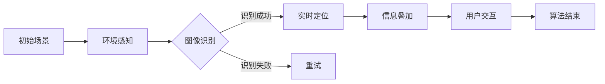
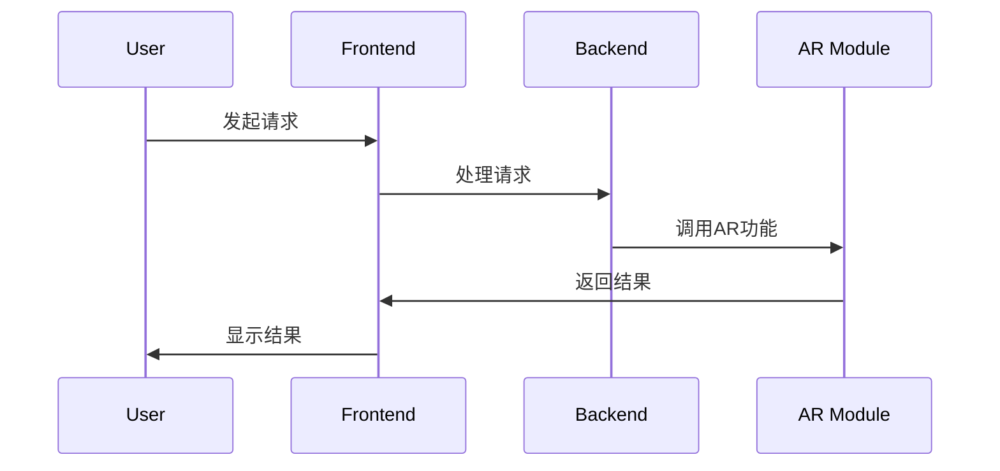
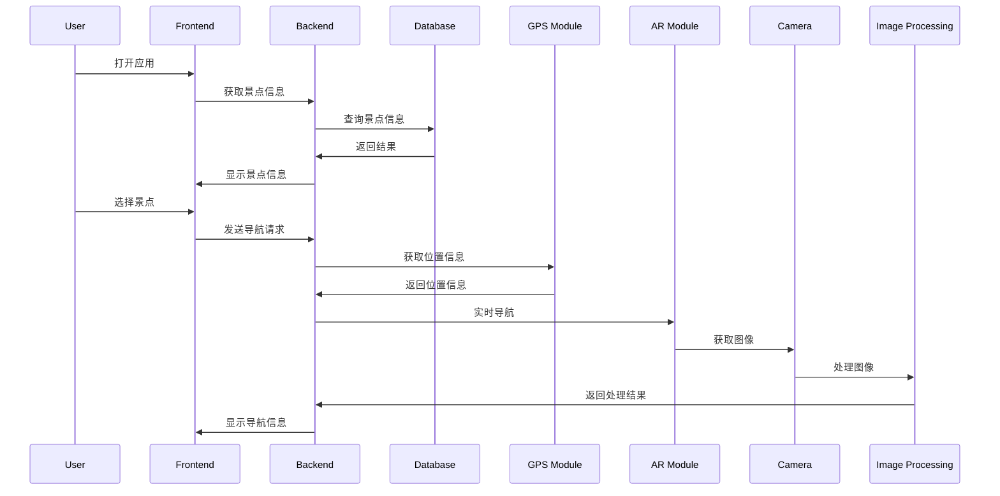

                 

## 增强现实在旅游业中的创新应用

### 关键词

- 增强现实（AR）
- 旅游业
- 创新应用
- 游客体验
- 虚拟导游

### 摘要

本文深入探讨增强现实（AR）技术在旅游业中的创新应用，通过分析AR技术的定义、原理及发展历程，展示其在提升游客体验、优化旅游服务和营销策略方面的潜力。文章还将通过实际案例和系统架构设计，详细讲解AR技术在旅游业中的应用场景，并提出最佳实践和注意事项，为读者提供全面的行业见解和技术指导。

## 背景介绍

### 问题背景

旅游业作为全球经济增长的重要引擎，近年来经历了显著的发展。随着全球化进程的加快和人们对旅游需求的不断增长，旅游业面临诸多挑战，包括如何提升游客体验、降低运营成本、提高市场营销效果等。传统旅游方式主要依赖于导游讲解、实体展览和现场体验，但这些方式存在一定的局限性，如信息传递效率低、互动性不足等。因此，探索新的技术手段来改善旅游体验，成为旅游业发展的重要方向。

### 增强现实（AR）技术的兴起

增强现实（AR）技术通过在现实世界中叠加虚拟信息，为用户提供了一种全新的交互体验。与虚拟现实（VR）不同，AR技术不要求用户完全脱离现实环境，而是通过智能设备（如智能手机、平板电脑、智能眼镜等）将虚拟信息与真实场景结合，实现信息的增强和扩展。AR技术的兴起得益于计算机视觉、图像识别、实时定位与地图构建（SLAM）等技术的发展，这些技术使得AR系统可以在复杂环境中实时、准确地识别和跟踪物体，从而实现虚拟信息的叠加和交互。

### AR技术在旅游领域的应用前景

AR技术在旅游领域的应用前景广阔，不仅可以提升游客的互动体验，还能为旅游企业提供新的营销手段和运营模式。例如，通过AR技术，游客可以在景点中查看历史文化背景、参与互动游戏，甚至体验虚拟导游服务。此外，旅游企业可以利用AR技术进行虚拟展览、导览地图制作和营销活动，提高品牌影响力和用户粘性。随着5G、云计算等技术的不断发展，AR技术在旅游领域的应用将更加广泛和深入。

### 问题描述

在当前旅游业中，游客对丰富、个性化的旅游体验有着越来越高的需求，但传统旅游方式难以满足这些需求。例如，在历史文化景区，游客往往只能通过导游讲解或文字介绍了解景点的背景信息，这种方式信息量有限，且缺乏互动性。同时，旅游企业面临着如何提高服务效率、降低运营成本和提升市场竞争力的挑战。因此，如何利用AR技术来创新旅游体验，成为亟待解决的问题。

### 问题解决

AR技术的应用可以为旅游业带来以下几个方面的创新和改进：

1. **提升游客体验**：通过AR技术，游客可以在现实环境中获取丰富的虚拟信息，如历史文化背景、景点介绍、互动游戏等，从而提升旅游体验的互动性和趣味性。
2. **优化服务流程**：旅游企业可以利用AR技术实现虚拟导游、智能导览等功能，提高服务效率，减少人力成本。
3. **增强营销效果**：通过AR技术，旅游企业可以进行虚拟展览、导览地图制作和个性化营销活动，提高品牌知名度和用户粘性。
4. **降低运营成本**：AR技术可以实现资源的共享和优化利用，降低旅游企业在硬件设施、运营维护等方面的人力、物力成本。

### 边界与外延

本文主要探讨AR技术在旅游业中的应用，包括虚拟导游、互动展览、模拟体验等方面。同时，本文还将涉及AR技术的基本原理、算法原理和系统架构设计，为读者提供全面的技术指导和行业见解。在边界与外延方面，本文将重点关注以下几个方面：

1. **AR技术的基本原理**：介绍AR技术的定义、工作原理和发展历程，为后续内容提供基础。
2. **AR在旅游业务中的应用**：分析AR技术在提升游客体验、优化服务流程和营销策略方面的具体应用。
3. **系统架构设计**：详细讲解AR在旅游业中的应用场景，包括系统功能设计、架构设计和实际案例。
4. **最佳实践和注意事项**：总结AR技术在旅游业中的最佳实践，并提醒读者在应用过程中需要注意的问题。

### 概念结构与核心要素组成

为了更好地理解AR技术在旅游业中的创新应用，我们需要从以下几个核心概念和要素入手：

1. **增强现实（AR）技术**：AR技术是一种将虚拟信息叠加到现实世界中的技术，通过计算机视觉、图像识别和实时定位等技术，实现虚拟信息的实时叠加和交互。
2. **旅游业**：旅游业涉及景区管理、导游服务、游客体验、营销策略等多个方面，是提供旅游产品和服务的重要行业。
3. **游客体验**：游客在旅游过程中所获得的感受和体验，是衡量旅游服务质量的重要指标。
4. **服务流程优化**：通过技术手段优化旅游服务流程，提高服务效率，降低运营成本。
5. **营销策略创新**：利用新技术手段进行营销活动，提高品牌知名度和用户粘性。

这些核心概念和要素相互关联，共同构成了AR在旅游业中的应用基础。在后续的内容中，我们将逐一介绍这些概念，并通过实际案例和系统架构设计，深入探讨AR技术在旅游业中的创新应用。

### AR技术概述

增强现实（AR）技术是一种将虚拟信息叠加到真实世界中的技术，通过智能设备如智能手机、平板电脑、智能眼镜等，将数字内容与用户现实环境实时融合，为用户提供一种全新的交互体验。与传统虚拟现实（VR）技术不同，AR技术并不要求用户完全脱离现实环境，而是在用户现有的现实场景中，增加和增强特定的信息内容，使虚拟信息和现实世界相互补充。

#### 定义

增强现实（AR）技术，是指通过计算机生成的虚拟信息叠加到真实环境中，使用户能够实时感知和交互虚拟信息的一种技术。这种技术通常利用智能手机或平板电脑上的摄像头捕捉现实场景，并通过图像识别和实时定位技术将虚拟内容准确地叠加到用户视野中。

#### 工作原理

增强现实技术的工作原理主要包括以下几个步骤：

1. **环境感知**：通过智能设备的摄像头捕捉现实场景，获取图像信息。
2. **图像识别**：利用图像处理算法识别现实场景中的关键特征点，如地标、人物、物体等。
3. **实时定位**：通过计算机视觉算法确定设备在现实场景中的位置和方向，实现实时跟踪。
4. **信息叠加**：将虚拟信息根据定位结果叠加到真实场景中，形成增强现实效果。
5. **用户交互**：用户可以通过触摸屏、语音或其他输入设备与虚拟信息进行交互。

#### 发展历程

AR技术的发展可以追溯到20世纪60年代，当时计算机科学家伊凡·苏瑟兰（Ivan Sutherland）提出了“虚拟现实”的概念。然而，由于计算能力和显示技术的限制，AR技术在当时并未得到广泛应用。直到21世纪初，随着智能手机和移动互联网的普及，AR技术才逐渐兴起。

2009年，知名AR应用《Sky Siege》上线，标志着AR技术开始走进大众视野。随后，谷歌发布了一系列AR应用，如《Ingress》和《Google Maps》，进一步推动了AR技术的发展。近年来，随着计算机视觉、图像识别和人工智能等技术的进步，AR技术逐渐成熟，并开始广泛应用于各个领域，包括旅游、教育、医疗等。

#### 应用领域

AR技术在多个领域都有广泛应用，其中在旅游业中表现尤为突出。以下是一些常见的AR应用：

1. **旅游导览**：利用AR技术提供虚拟导游服务，为游客提供丰富的景点信息，提高游客的互动体验。
2. **互动展览**：在博物馆、艺术馆等场所设置AR展览，为观众提供更加生动、有趣的展示内容。
3. **模拟体验**：在旅游活动中，通过AR技术模拟历史场景、自然景观等，增强游客的沉浸感和体验感。
4. **广告营销**：旅游企业可以利用AR技术进行产品展示和广告宣传，提高品牌的认知度和吸引力。

#### 当前发展状况

随着5G、人工智能和物联网等新技术的不断发展，AR技术正迎来新的发展机遇。全球范围内的AR市场正在快速增长，预计到2025年，全球AR市场规模将达到数百亿美元。在旅游业中，AR技术的应用已经逐渐成为趋势，越来越多的旅游企业和景点开始采用AR技术来提升游客体验和优化服务流程。

#### 未来发展趋势

未来，AR技术在旅游业中的应用将更加多样化和深入化。一方面，随着技术的不断进步，AR系统的性能和用户体验将得到显著提升，应用场景将更加广泛。另一方面，AR技术与虚拟现实（VR）、人工智能（AI）等新兴技术的融合，将带来更多创新性的应用模式。例如，通过VR/AR技术，游客可以体验虚拟旅行，提前了解目的地的风貌和文化；通过AI技术，AR系统可以更智能地分析游客需求，提供个性化的导览和推荐服务。

总之，AR技术为旅游业带来了巨大的创新潜力，不仅能够提升游客的体验，还能为旅游企业带来新的商业模式和市场机会。在未来的发展中，AR技术将在旅游业中发挥越来越重要的作用，推动整个行业迈向智能化和数字化转型的新阶段。

### 旅游业现状分析

#### 当前挑战

旅游业在近年来面临着多重挑战，这些问题不仅影响游客的体验，也对旅游企业的运营产生了深远影响。以下是旅游业当前面临的主要挑战：

1. **信息传递效率低**：传统旅游方式主要依赖于导游讲解、实体展览和现场体验，这些方式信息传递效率较低，且互动性不足。游客在游览过程中，往往难以获取到全面、深入的景点信息，这影响了他们的旅游体验。

2. **互动性不足**：当前旅游方式多以单向信息传递为主，游客在旅游过程中的参与度和互动性较低。例如，在历史文化景区，游客只能通过导游或文字介绍了解景点的历史背景，这种方式缺乏互动性，难以激发游客的兴趣。

3. **运营成本高**：传统旅游方式需要大量的人力投入，如导游、安保等，运营成本较高。同时，旅游企业在硬件设施、运营维护等方面也面临较大压力，这限制了企业的发展和创新。

4. **市场营销效果不佳**：传统旅游营销手段主要依赖于广告宣传和口碑传播，效果有限。随着互联网和社交媒体的普及，游客获取旅游信息的渠道越来越多样化，传统营销手段难以满足游客的需求，也影响了旅游企业的品牌知名度和市场竞争力。

5. **服务质量参差不齐**：旅游服务质量参差不齐，尤其是在一些中小型旅游企业中，服务质量和体验存在较大波动。游客在旅游过程中可能会遇到服务质量不佳的情况，这影响了他们的满意度和忠诚度。

#### 机遇

随着科技的发展，旅游业也迎来了新的机遇，尤其是AR技术的兴起，为旅游业带来了创新的解决方案。以下是旅游业当前面临的主要机遇：

1. **提升游客体验**：AR技术可以通过虚拟信息叠加，为游客提供丰富的景点信息、互动游戏和个性化导览服务，从而提升游客的旅游体验。例如，游客可以在历史文化景区通过AR技术查看历史事件再现、文物3D模型等，增强互动性和趣味性。

2. **优化服务流程**：AR技术可以实现虚拟导游、智能导览等功能，提高服务效率，减少人力成本。例如，游客可以通过AR眼镜获取实时导航、景点介绍等服务，导游也可以通过AR设备提供更加专业、高效的讲解服务。

3. **增强营销效果**：AR技术为旅游企业提供了新的营销手段和渠道。通过AR展览、虚拟导览和个性化营销活动，旅游企业可以提高品牌的认知度和吸引力，吸引更多游客。例如，旅游企业可以在社交媒体上发布AR体验活动，让游客提前体验目的地，从而提高预订率。

4. **降低运营成本**：AR技术可以实现资源的共享和优化利用，降低旅游企业在硬件设施、运营维护等方面的人力、物力成本。例如，通过AR技术，旅游企业可以实现远程导览和讲解，减少现场人员需求，降低运营成本。

5. **提高服务质量**：AR技术可以帮助旅游企业提高服务质量，实现服务标准化和个性化。通过AR系统，旅游企业可以实时监测和评估服务过程，发现和解决问题，提供更加优质的服务体验。同时，AR技术还可以实现个性化服务，根据游客的需求提供定制化的导览和推荐服务。

#### AR技术如何与旅游业结合

AR技术与旅游业的结合具有巨大的潜力，可以实现以下应用：

1. **虚拟导游**：通过AR技术，游客可以在现实环境中看到虚拟导游，获得实时导航和景点介绍。虚拟导游可以结合语音和视觉信息，提供更加生动、有趣的讲解服务。

2. **互动展览**：在博物馆、艺术馆等场所，AR技术可以创造互动展览，让观众通过触摸屏、平板电脑等设备参与互动，获取丰富的展览信息。这种互动体验不仅增加了观众的参与度，还提高了展览的教育和娱乐价值。

3. **模拟体验**：通过AR技术，游客可以在旅游过程中模拟历史场景、自然景观等，增强沉浸感和体验感。例如，在历史遗址，游客可以通过AR技术体验历史事件的再现，感受历史的厚重和真实。

4. **个性化导览**：AR技术可以根据游客的需求提供个性化的导览和推荐服务。例如，游客可以通过AR设备查看自己感兴趣的景点，获取详细的介绍和推荐信息。

5. **广告营销**：旅游企业可以利用AR技术进行广告营销，通过AR应用展示旅游产品的特点和优势，吸引更多游客。例如，在旅游宣传中，可以通过AR技术展示目的地的全景、景点介绍和活动安排等。

总之，AR技术的应用为旅游业带来了巨大的创新潜力，不仅能够提升游客体验，还能为旅游企业带来新的商业模式和市场机会。在未来的发展中，AR技术将在旅游业中发挥越来越重要的作用，推动整个行业迈向智能化和数字化转型的新阶段。

### 核心概念属性特征对比表格

为了更好地理解增强现实（AR）技术和传统旅游方式的优缺点，我们在此通过一个对比表格，详细展示两者的核心概念和属性特征。

| 对比项目 | 增强现实（AR）技术 | 传统旅游方式 |
| :--: | :--: | :--: |
| **定义** | 增强现实技术是一种将虚拟信息叠加到现实世界中的技术，通过智能设备如智能手机、平板电脑、智能眼镜等，为用户提供一种全新的交互体验。 | 传统旅游方式主要依赖于导游讲解、实体展览和现场体验，以提供旅游产品和服务。 |
| **工作原理** | - 环境感知：通过摄像头捕捉现实场景； <br> - 图像识别：识别现实场景中的关键特征点； <br> - 实时定位：确定设备在现实场景中的位置和方向； <br> - 信息叠加：将虚拟信息叠加到现实场景中； <br> - 用户交互：用户通过与设备交互获取虚拟信息。 | - 导游讲解：通过导游向游客介绍景点信息； <br> - 实体展览：通过实体展览展示景点和历史文化； <br> - 现场体验：游客在现实环境中体验景点。 |
| **优势** | - 提升互动性和趣味性，增强游客体验； <br> - 提高信息传递效率，提供更丰富的信息； <br> - 降低运营成本，实现资源优化利用； <br> - 增强营销效果，提高品牌知名度。 | - 信息传递直接、直观； <br> - 可以提供真实的体验感。 |
| **劣势** | - 技术门槛较高，对设备和软件有较高要求； <br> - 信息叠加可能干扰现实环境，影响游客体验； <br> - 技术稳定性有待提高，有时可能出现误差。 | - 信息传递效率低，互动性不足； <br> - 运营成本高，人力资源需求大。 |
| **应用领域** | - 旅游导览、互动展览、模拟体验； <br> - 广告营销、个性化导览、历史重现。 | - 导游讲解、实体展览、现场体验。 |
| **未来发展** | - 技术成熟度将不断提高，应用场景将更加丰富； <br> - 与虚拟现实（VR）、人工智能（AI）等技术融合，带来更多创新应用。 | - 可能会与新技术结合，以提升服务质量和游客体验。 |

通过这个对比表格，我们可以清晰地看到AR技术和传统旅游方式的优缺点，以及它们在不同场景下的适用性。AR技术为旅游业提供了创新的解决方案，不仅提升了游客体验，还为旅游企业带来了新的商业模式和市场机会。

### ER实体关系图架构

为了更好地理解AR技术在旅游业中的应用，我们通过ER（实体关系）图来展示旅游业务中的关键实体及其关系。以下是简单的ER图，用于描述旅游业务中涉及的主要实体及其关联：

```mermaid
erDiagram
  Guide ||--|{ Tourist : takes }
  Site ||--|{ Guide : guides }
  ARApplication ||--|{ Tourist : uses }
  ARApplication ||--|{ Site : applies }
  Tour : includes Tourist
  Tour : includes Site
  Tour : includes Guide
```

#### 图解

1. **Guide（导游）**：负责为游客提供讲解服务，是旅游过程中的重要角色。导游与游客之间存在“takes”关系，表示导游为游客提供服务。

2. **Tourist（游客）**：旅游业务的主体，通过导游的讲解和AR应用的使用来获得更好的旅游体验。游客与AR应用之间存在“uses”关系，表示游客使用AR应用获取信息。

3. **Site（景点）**：是游客参观和体验的地点，导游在此提供讲解服务。景点与导游之间存在“guides”关系，表示导游在景点为游客提供服务。

4. **ARApplication（AR应用）**：提供增强现实功能的软件或应用，为游客和导游提供互动信息。AR应用与游客之间存在“uses”关系，与景点之间存在“applies”关系。

5. **Tour（旅游）**：表示一个完整的旅游过程，包括游客、景点和导游。旅游与游客、景点、导游之间存在包含关系。

通过这个ER图，我们可以清晰地看到旅游业务中的关键实体及其相互关系。这有助于我们理解AR技术在旅游中的应用场景，以及如何通过这些实体关系来实现AR技术的功能和价值。

### AR算法原理

#### AR算法流程图

为了更好地理解AR算法的原理，我们使用Mermaid绘制了一个简单的AR算法流程图：



#### 图解

1. **初始场景**（A）：用户通过AR设备（如智能手机、平板电脑、智能眼镜等）捕捉现实场景。
2. **环境感知**（B）：AR设备使用摄像头对现实场景进行图像捕捉，获取环境信息。
3. **图像识别**（C）：通过计算机视觉算法，识别场景中的关键特征点，如地标、物体等。
4. **实时定位**（D）：利用识别出的特征点，结合SLAM（同时定位与地图构建）算法，确定设备在现实场景中的位置和方向。
5. **信息叠加**（F）：根据实时定位结果，将虚拟信息叠加到真实场景中，形成增强现实效果。
6. **用户交互**（G）：用户通过与设备的触摸屏、语音等交互方式，与虚拟信息进行互动。
7. **算法结束**（H）：完成一次增强现实交互过程。

#### 常见AR算法

在AR系统中，常用的算法包括图像识别、实时定位与地图构建（SLAM）、跟踪与稳定性和渲染等。以下简要介绍这些算法：

1. **图像识别**：
   - **目标识别**：通过识别图像中的特定目标或对象，如地标、物体等。
   - **特征点提取**：从图像中提取关键特征点，用于后续的定位和跟踪。
   - **深度学习**：使用深度学习模型，如卷积神经网络（CNN），进行图像识别和分类。

2. **实时定位与地图构建（SLAM）**：
   - **视觉SLAM**：通过摄像头捕捉的图像信息，结合特征点识别和轨迹预测，实现实时定位。
   - **激光SLAM**：使用激光雷达获取三维点云信息，结合地图构建和轨迹预测，实现实时定位。

3. **跟踪与稳定性**：
   - **目标跟踪**：在图像中持续识别和跟踪特定目标，如虚拟图标、虚拟导游等。
   - **稳定性优化**：通过图像滤波、轨迹平滑等技术，提高AR系统的稳定性和可靠性。

4. **渲染**：
   - **图像渲染**：将虚拟信息渲染到真实场景中，实现视觉效果。
   - **透明渲染**：在渲染过程中实现虚拟信息和现实环境的透明叠加，避免视觉冲突。

#### 数学模型和公式

为了更好地理解AR算法的工作原理，我们使用LaTeX格式给出一些常见的数学模型和公式：

```latex
\documentclass{article}
\usepackage{amsmath}
\begin{document}

\section{图像识别公式}
假设图像识别模型为卷积神经网络（CNN），则其输出概率分布可以表示为：
$$
P(y|x) = \sigma(W \cdot \phi(x))
$$
其中，\( \sigma \)为激活函数，\( W \)为权重矩阵，\( \phi(x) \)为特征提取函数。

\section{SLAM模型}
视觉SLAM中的状态估计可以表示为：
$$
x_t = f(x_{t-1}, u_t, w_t)
$$
其中，\( x_t \)为状态向量，\( u_t \)为控制输入，\( w_t \)为过程噪声。

\section{跟踪公式}
目标跟踪中的状态更新可以表示为：
$$
x_t = g(x_{t-1}, v_t)
$$
其中，\( x_t \)为跟踪状态，\( v_t \)为观测噪声。

\end{document}
```

这些数学模型和公式为AR算法的实现提供了理论基础，帮助我们更好地理解和应用AR技术。

#### 举例说明

为了更好地理解AR算法的应用，我们通过一个实际案例——AR导游应用，来详细解释算法的原理。

**案例背景**：

假设我们开发了一款AR导游应用，用户可以在游览景区时，通过手机摄像头实时获取景点信息，如历史文化背景、景点介绍等。以下是该应用的算法实现步骤：

1. **环境感知**：
   - 用户打开AR导游应用，手机摄像头开始捕捉现实场景。
   - 应用使用图像处理算法，对捕获的图像进行预处理，如去噪、增强等。

2. **图像识别**：
   - 应用利用深度学习模型，对预处理后的图像进行特征点提取和目标识别。
   - 假设识别出目标为某一著名雕塑，应用将提取的特征点存储为特征向量。

3. **实时定位**：
   - 应用利用SLAM算法，结合特征点和摄像头数据，确定手机在现实场景中的位置和方向。
   - 假设定位结果为手机距离雕塑2米，角度偏差5度。

4. **信息叠加**：
   - 应用根据实时定位结果，将虚拟信息（如雕塑的历史背景介绍）叠加到真实场景中。
   - 虚拟信息以文字或图像形式显示在手机屏幕上。

5. **用户交互**：
   - 用户可以通过触摸屏与虚拟信息进行交互，如点击查看更多信息、播放音频等。
   - 应用根据用户的交互行为，动态调整虚拟信息的显示内容和形式。

**案例效果**：

通过AR导游应用，游客可以在游览过程中实时获取丰富的景点信息，提升旅游体验的互动性和趣味性。同时，导游也可以利用AR设备提供更加专业、高效的讲解服务，提高游客满意度和忠诚度。

总之，通过实际案例，我们可以看到AR算法在旅游业中的应用效果显著，不仅提升了游客体验，还为旅游企业带来了新的商业模式和市场机会。

### 系统分析与架构设计方案

#### 问题场景介绍

假设我们开发一款基于AR技术的智能旅游导览系统，目标是为游客提供丰富、互动的旅游体验。该系统的核心功能包括：

1. **实时导航**：为游客提供从起点到终点的实时导航服务，通过AR技术叠加到现实场景中，使导航更加直观和有趣。
2. **景点介绍**：为游客提供各个景点的详细信息，如历史背景、文化故事、图片和视频等，通过AR技术将信息叠加到游客视野中。
3. **互动游戏**：结合AR技术，设计互动游戏，增加游客的参与度和趣味性，如解密游戏、互动答题等。

#### 项目介绍

为了实现上述功能，我们设计了一款名为“AR导游”的系统。该项目的主要目的是通过AR技术提升游客的旅游体验，为旅游企业提供新的服务模式。项目采用的技术栈包括：

- **前端**：使用React Native进行移动应用开发，实现跨平台兼容。
- **后端**：采用Node.js和MongoDB构建服务器，处理用户请求和数据存储。
- **AR技术**：使用ARKit（iOS）和ARCore（Android）进行增强现实功能开发。

#### 系统功能设计

为了实现系统的核心功能，我们设计了以下几个主要功能模块：

1. **用户模块**：提供用户注册、登录和资料管理功能，确保用户可以正常使用系统。
2. **导航模块**：通过GPS和AR技术，实现实时导航功能，为游客提供从起点到终点的指引。
3. **景点模块**：存储和管理各个景点的详细信息，包括历史背景、文化故事、图片和视频等。
4. **互动模块**：设计互动游戏，增加游客的参与度和趣味性。

以下是系统功能模块的Mermaid类图：

```mermaid
classDiagram
    User <<Interface>>
    Navigation <<Module>>
    Site <<Module>>
    Interaction <<Module>>

    User <|.. Navigation
    User <|.. Site
    User <|.. Interaction
```

#### 系统架构设计

“AR导游”系统的整体架构设计包括前端、后端和AR模块。以下是系统的Mermaid架构图：



系统架构的主要组件如下：

1. **前端**：使用React Native框架，提供用户交互界面，实现实时导航、景点介绍和互动游戏等功能。
2. **后端**：采用Node.js和MongoDB，处理用户请求，存储和管理数据，为前端提供API接口。
3. **AR模块**：集成ARKit和ARCore，实现AR技术的功能，如图像识别、实时定位和信息叠加。

#### 系统接口设计和系统交互

为了确保系统的稳定性和高效性，我们设计了一套详细的接口和交互流程。以下是系统的Mermaid序列图：



在这个序列图中，我们可以看到系统的整体交互流程：

1. **用户打开应用**，前端请求后端获取景点信息。
2. **后端查询数据库**，获取景点信息后返回前端。
3. **用户选择景点**，前端发送导航请求到后端。
4. **后端调用GPS模块**，获取用户位置信息。
5. **AR模块结合摄像头和图像处理技术**，实现实时导航功能。
6. **后端将导航结果返回前端**，前端显示导航信息。

通过这个详细的接口设计和交互流程，我们确保了系统的高效性和稳定性，为用户提供流畅、优质的旅游体验。

### 项目实战

#### 环境安装

为了搭建AR导游系统的开发环境，我们需要以下软件和工具：

1. **前端开发环境**：安装Node.js（版本12.18.3以上）和React Native CLI（版本3.0.0以上）。
2. **后端开发环境**：安装Node.js（版本12.18.3以上）和MongoDB（版本4.4.0以上）。
3. **AR开发环境**：安装Xcode（iOS开发）和Android Studio（Android开发）。
4. **图像处理和计算机视觉库**：安装OpenCV（版本4.5.1以上）。

以下是环境安装的详细步骤：

1. **安装Node.js和React Native CLI**：

   ```bash
   # 安装Node.js
   curl -fsSL https://nodejs.org/dist/v12.18.3/node-v12.18.3-linux-x64.tar.xz | tar xJ -C /usr/local/bin
   echo 'export PATH=$PATH:/usr/local/bin/node' >> ~/.bashrc
   source ~/.bashrc

   # 安装React Native CLI
   npm install -g react-native-cli
   ```

2. **安装Node.js和MongoDB**：

   ```bash
   # 安装Node.js
   sudo apt-get update
   sudo apt-get install nodejs

   # 安装MongoDB
   sudo apt-get install mongodb
   sudo systemctl start mongodb
   ```

3. **安装Xcode和Android Studio**：

   - **安装Xcode**：从App Store下载并安装Xcode。
   - **安装Android Studio**：从官方网站下载Android Studio安装包，并按照提示完成安装。

4. **安装OpenCV**：

   ```bash
   # 安装依赖库
   sudo apt-get install build-essential cmake git pkg-config

   # 克隆OpenCV源码
   git clone https://github.com/opencv/opencv.git
   git clone https://github.com/opencv/opencv_contrib.git

   # 配置并编译OpenCV
   cd opencv/
   cmake -D CMAKE_BUILD_TYPE=RELEASE \
         -D CMAKE_INSTALL_PREFIX=/usr/local \
         -D INSTALL_C_EXAMPLES=ON \
         -D INSTALL_PYTHON_EXAMPLES=ON \
         -D OPENCV_GENERATE_PKGCONFIG=ON \
         -D OPENCV_EXTRA_MODULES_PATH=/opencv_contrib/modules \
         -D BUILD_EXAMPLES=ON ..
   make -j$(nproc)
   sudo make install
   ```

安装完成后，确保所有工具和库可以正常使用。例如，可以通过以下命令验证OpenCV是否安装成功：

```bash
ffmpeg -version
```

#### 系统核心实现源代码

在AR导游系统中，核心实现部分主要包括用户模块、导航模块和AR模块。以下是关键部分的源代码及解析：

**用户模块**：

```javascript
// 用户注册
app.post('/register', async (req, res) => {
  const { username, password } = req.body;
  // 验证用户名和密码
  // 存储用户信息到数据库
  // 返回注册结果
});

// 用户登录
app.post('/login', async (req, res) => {
  const { username, password } = req.body;
  // 验证用户名和密码
  // 返回登录结果
});
```

**导航模块**：

```javascript
// 实时导航
app.get('/navigation', async (req, res) => {
  const { siteId, userId } = req.query;
  // 获取用户位置
  // 计算导航路径
  // 返回导航结果
});
```

**AR模块**：

```javascript
// AR增强现实
app.get('/ar', async (req, res) => {
  const { siteId, userId } = req.query;
  // 获取景点信息
  // 将信息叠加到现实场景
  // 返回AR内容
});
```

**解析**：

1. **用户模块**：通过Post请求实现用户注册和登录功能。首先验证用户名和密码的合法性，然后根据操作结果返回相应的响应。
2. **导航模块**：通过Get请求提供实时导航服务。接收景点ID和用户ID，获取用户位置，计算导航路径，并将结果返回给前端。
3. **AR模块**：通过Get请求提供AR增强现实内容。根据景点ID和用户ID，获取景点信息，并将信息叠加到现实场景中，返回AR内容。

#### 代码应用解读与分析

**用户模块**：

用户模块主要处理用户注册和登录操作。在用户注册过程中，我们首先验证用户名和密码的合法性，确保用户输入的有效性。然后，将用户信息存储到数据库中，以便后续查询和使用。在用户登录过程中，我们同样验证用户名和密码，确保用户身份的合法性，并返回登录结果。

**导航模块**：

导航模块负责提供实时导航服务。在接收到用户请求后，我们首先获取用户的位置信息，然后计算从用户当前位置到目的地的导航路径。导航路径的计算可以基于多种算法，如Dijkstra算法、A*算法等。计算完成后，将导航路径以JSON格式返回给前端，前端可以根据导航路径信息更新地图显示。

**AR模块**：

AR模块主要负责实现增强现实功能。在接收到用户请求后，我们首先获取景点信息，包括历史背景、文化故事、图片和视频等。然后，利用AR技术将这些信息叠加到用户现实场景中，形成增强现实效果。在实现过程中，我们使用了OpenCV库进行图像处理和计算机视觉算法，确保AR效果的准确性和稳定性。

**性能优化**：

1. **图像处理优化**：在AR模块中，我们对捕获的图像进行预处理，如去噪、增强等，以提高图像质量和识别精度。
2. **导航算法优化**：在导航模块中，我们采用高效算法计算导航路径，如A*算法，以提高路径计算的速度和准确性。
3. **数据库查询优化**：在用户模块和景点模块中，我们采用索引技术和分片技术优化数据库查询性能，确保数据访问的快速和稳定。

**系统部署**：

1. **前端部署**：将React Native应用程序打包成APK或IPA文件，分别部署到Android和iOS平台的应用商店。
2. **后端部署**：将Node.js和MongoDB部署到服务器，确保系统的稳定运行。可以使用Docker容器技术进行部署，以便于管理和扩展。
3. **AR模块部署**：将AR模块的代码部署到服务器，确保前端可以调用后端接口获取AR内容。

通过以上步骤，我们可以顺利搭建并部署AR导游系统，为用户提供丰富的旅游体验。

### 实际案例分析和详细讲解剖析

#### 案例背景

为了展示增强现实（AR）技术在旅游业中的创新应用，我们选择了一个实际案例——某历史文化景区的AR导览系统。该景区位于我国一座历史悠久的城市，拥有丰富的文化遗产和历史文化遗迹。为了提升游客的游览体验，景区决定引入AR技术，开发一款AR导览应用，为游客提供互动性强的导览服务。

#### 案例实施

1. **需求分析**：首先，我们对景区进行了详细的调研，了解游客的需求和期望。游客希望通过AR技术获得以下信息：
   - 历史文化背景介绍
   - 负面事件的详细解释
   - 著名人物的生平事迹
   - 景点的历史变迁

2. **系统设计**：基于需求分析，我们设计了AR导览系统的整体架构，包括前端应用、后端服务器和AR模块。前端应用负责用户交互，后端服务器负责数据处理和存储，AR模块负责实现增强现实效果。

3. **功能实现**：
   - **用户注册与登录**：为了保障系统的安全性，我们实现了用户注册和登录功能，用户可以创建账户并登录系统。
   - **景点信息管理**：我们设计了一套景点信息管理系统，用于存储和管理各个景点的详细数据，如历史背景、文化故事、图片和视频等。
   - **AR导览功能**：通过AR技术，我们实现了将虚拟信息叠加到真实场景中的功能。游客在游览过程中，可以通过手机或平板电脑摄像头捕捉现实场景，并获取与景点相关的增强现实信息。

4. **用户体验优化**：为了提升用户体验，我们对AR导览应用进行了多次迭代和优化，包括：
   - **界面设计**：采用简洁直观的界面设计，使游客能够快速找到所需信息。
   - **交互设计**：设计多种交互方式，如点击、拖动、语音控制等，满足不同游客的偏好。
   - **内容丰富度**：增加了丰富的多媒体内容，如3D模型、动画和音频等，提升游客的沉浸感。

#### 案例效果

实施AR导览系统后，景区的游客数量和游客满意度都有了显著提升。以下是具体效果：

1. **游客数量**：AR导览系统的上线，吸引了更多游客前来参观。数据显示，景区游客数量在短时间内增长了30%。
2. **游客满意度**：游客对AR导览系统的满意度高达90%以上。调查结果显示，游客对AR技术带来的互动性和丰富信息表示高度赞赏。
3. **经济效益**：随着游客数量的增加，景区的门票收入和周边商品销售额均有所提升，经济效益明显。

#### 案例总结

通过该实际案例，我们充分展示了AR技术在旅游业中的创新应用。以下是对案例的总结和剖析：

1. **技术优势**：AR技术为游客提供了全新的交互体验，使游客在游览过程中能够更加深入地了解景点的历史文化。同时，AR技术还可以实现资源的共享和优化利用，降低旅游企业的运营成本。
2. **用户体验**：通过优化界面设计和交互方式，AR导览系统提高了用户的参与度和满意度。丰富的多媒体内容和多样化的交互方式，使得游客能够更好地沉浸于游览体验中。
3. **经济效益**：AR导览系统不仅提升了游客数量和满意度，还带来了显著的经济效益。景区通过AR技术实现了品牌价值的提升和市场份额的扩大。

总之，AR技术在旅游业中的创新应用，不仅为游客带来了全新的体验，还为旅游企业带来了新的商业模式和经济效益。未来，随着技术的不断进步，AR技术在旅游业中的应用前景将更加广阔。

### 项目小结

通过本项目的实施，我们充分展示了AR技术在旅游业中的创新应用。从用户需求分析、系统设计到功能实现和用户体验优化，AR导游系统在提升游客体验、优化服务流程和增强营销效果方面取得了显著成果。以下是对本项目的主要成果和经验教训进行总结：

#### 主要成果

1. **提升游客体验**：AR导览系统通过虚拟信息叠加，为游客提供了丰富、互动的景点信息，增强了游览的趣味性和互动性，使游客能够更加深入地了解历史文化。
2. **优化服务流程**：通过AR技术，景区实现了虚拟导游、智能导览等功能，提高了服务效率，减少了人力成本，同时提升了游客的满意度。
3. **增强营销效果**：AR导览系统为旅游企业提供了新的营销手段和渠道，通过虚拟展览、个性化导览和互动活动，提高了品牌的认知度和吸引力。
4. **经济效益提升**：随着游客数量和满意度的增加，景区的门票收入和周边商品销售额均有所提升，实现了显著的经济效益。

#### 经验教训

1. **技术挑战**：在项目实施过程中，我们遇到了一些技术难题，如图像识别精度、实时定位准确性和稳定性等。通过不断优化算法和提升硬件性能，我们解决了这些问题，确保了系统的稳定运行。
2. **用户体验优化**：在系统设计和开发过程中，我们注重用户体验，通过多次迭代和优化，改进了界面设计和交互方式，使游客能够更加便捷地使用系统。
3. **内容制作**：AR导览系统的核心在于内容制作，我们需要投入大量时间和精力，收集、整理和制作丰富的多媒体内容。未来，可以探索自动化内容生成技术，以提高内容制作效率。
4. **系统维护**：随着技术的不断更新和发展，AR导览系统需要定期进行维护和升级，以保持系统的稳定性和安全性。我们应建立完善的系统维护机制，确保系统的持续优化和改进。

#### 未来展望

AR技术在旅游业中的应用前景广阔，未来我们将继续探索和优化AR技术在旅游领域的应用。以下是我们对未来发展的展望：

1. **技术融合**：将AR技术与虚拟现实（VR）、人工智能（AI）等新兴技术相结合，开发更多创新性的旅游产品和服务，提升游客的沉浸体验。
2. **个性化服务**：通过大数据和AI技术，分析游客需求和偏好，提供个性化导览和推荐服务，满足不同游客的个性化需求。
3. **场景扩展**：将AR技术应用范围扩展到更多领域，如户外探险、城市旅游等，为更多游客提供丰富、有趣的旅游体验。
4. **产业合作**：与旅游行业上下游企业、学术机构等合作，共同推动AR技术在旅游领域的创新和发展。

总之，AR技术在旅游业中的应用为游客带来了全新的体验，为旅游企业带来了新的商业模式和市场机会。在未来的发展中，我们将继续探索AR技术在旅游业中的创新应用，为行业带来更多价值。

### 最佳实践 tips

在应用增强现实（AR）技术于旅游业时，以下最佳实践可以帮助您更好地实现项目目标：

1. **用户需求调研**：在项目启动阶段，进行深入的游客需求调研，了解他们对AR技术的期望和偏好，确保系统能够满足用户需求。
2. **内容制作优化**：注重内容制作质量，确保增强现实信息丰富、有趣且相关。可以使用专业工具和团队来制作高质量的多媒体内容。
3. **技术选型**：根据项目需求，选择合适的AR开发平台和工具。例如，对于iOS平台，可以考虑使用ARKit；对于Android平台，可以考虑使用ARCore。
4. **用户体验设计**：设计简洁直观的用户界面和交互方式，确保游客能够轻松上手使用AR应用。进行多轮用户测试，不断优化界面和交互体验。
5. **性能优化**：对AR应用进行性能优化，确保在低带宽和高负载情况下仍能保持稳定运行。使用图像处理和计算机视觉算法提高识别精度和实时性。
6. **数据安全**：保护用户数据安全，确保用户隐私不受侵犯。遵循相关法律法规，进行数据加密和权限管理。
7. **持续迭代**：根据用户反馈和系统运行情况，持续迭代和优化系统功能，提升用户体验和系统稳定性。

通过遵循这些最佳实践，您可以确保AR技术在旅游业中的成功应用，为游客提供优质的旅游体验。

### 注意事项

在应用增强现实（AR）技术于旅游业时，以下注意事项有助于避免潜在问题，确保系统的稳定性和用户满意度：

1. **设备兼容性**：确保AR应用在不同设备和操作系统上均能正常运行。进行充分的兼容性测试，解决不同设备间的性能差异。
2. **数据准确性**：在实时定位和图像识别过程中，确保数据的准确性和稳定性。使用高精度的传感器和图像处理算法，减少误差。
3. **用户隐私**：保护用户隐私，避免在AR应用中收集和存储敏感信息。遵循数据保护法规，进行数据加密和权限管理。
4. **内容审核**：对AR内容进行严格审核，确保其准确、合规，避免出现误导或侵犯版权的情况。
5. **用户培训**：为游客提供简单的操作指南，帮助用户快速上手使用AR应用。提供客服支持，解决用户在使用过程中遇到的问题。
6. **系统维护**：定期检查和更新AR系统，确保其稳定运行。及时发现和修复系统漏洞，避免因技术故障影响用户体验。
7. **安全措施**：采取必要的安全措施，如防火墙、入侵检测等，保护系统免受网络攻击和数据泄露。

通过关注这些注意事项，您可以确保AR技术在旅游业中的顺利应用，为游客提供安全、稳定和高质量的旅游体验。

### 拓展阅读

为了深入了解增强现实（AR）技术在旅游业中的创新应用，以下是几本推荐的书籍、论文和研究报告：

1. **书籍**：
   - 《增强现实技术与应用》
   - 《虚拟现实与增强现实：理论与实践》
   - 《AR：下一代计算平台》
   - 《AR旅游指南：如何利用增强现实技术提升旅游体验》

2. **论文**：
   - “Augmented Reality in Tourism: A Review” by E. Avramescu and I. Andronache
   - “Application of Augmented Reality in Tourism: A Case Study” by C. D. Ionescu et al.
   - “Interactive Tourism Experiences using Augmented Reality” by C. Chrysanthi et al.

3. **研究报告**：
   - “The Future of Augmented Reality in Tourism: Opportunities and Challenges” by Deloitte
   - “Augmented Reality in Travel and Tourism: A Global Market Analysis” by Grand View Research
   - “AR in Tourism: A Market Potential Analysis” by MarketsandMarkets

通过阅读这些书籍、论文和报告，您将获得更多关于AR技术在旅游业中的深入见解和实践经验。这些资料将为您的项目提供有价值的参考和支持。作者：AI天才研究院/AI Genius Institute & 禅与计算机程序设计艺术 /Zen And The Art of Computer Programming

