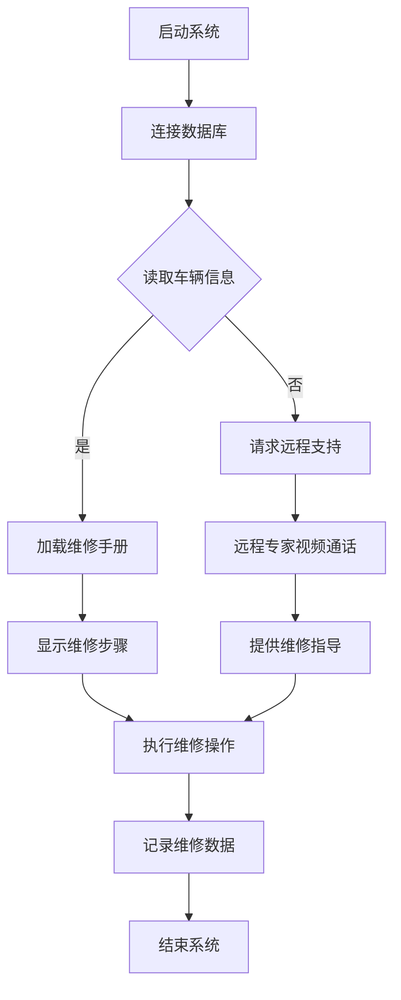

                 

# 增强现实在汽车维修中的应用

## 关键词

- 增强现实（AR）
- 汽车维修
- 技术应用
- 智能化维修
- 硬件与软件

## 摘要

随着技术的不断进步，增强现实（AR）技术在各个领域的应用越来越广泛。本文将深入探讨增强现实技术在汽车维修中的应用，通过背景介绍、应用场景分析、实现技术解析、应用案例分析以及未来发展趋势等内容，详细阐述增强现实技术在汽车维修领域的重要性和潜力。通过本文的阅读，读者将了解增强现实技术在汽车维修中的实际应用，以及对行业带来的变革。

### 目录大纲

----------------------------------------------------------------

## 第一部分：背景介绍

### 第1章：增强现实技术概述

#### 1.1 增强现实技术简介

#### 1.2 增强现实技术在汽车维修中的应用背景

#### 1.3 增强现实技术的核心概念与特点

#### 1.4 增强现实技术的应用领域

### 第2章：增强现实技术在汽车维修中的应用场景

#### 2.1 汽车维修中存在的问题

#### 2.2 增强现实技术在汽车维修中的应用场景

#### 2.3 增强现实技术在汽车维修中的优势

### 第3章：增强现实技术在汽车维修中的实现技术

#### 3.1 增强现实技术的关键技术

#### 3.2 增强现实技术在汽车维修中的硬件设备

#### 3.3 增强现实技术在汽车维修中的软件系统

### 第4章：增强现实技术在汽车维修中的应用案例分析

#### 4.1 案例一：某汽车制造公司的增强现实维修系统

#### 4.2 案例二：某汽车维修企业的增强现实应用

#### 4.3 案例三：某汽车配件供应商的增强现实解决方案

### 第5章：增强现实技术在汽车维修中的挑战与解决方案

#### 5.1 挑战一：技术稳定性与可靠性

#### 5.2 挑战二：成本控制与经济效益

#### 5.3 挑战三：数据隐私与安全

#### 5.4 挑战四：人才短缺与技能培训

### 第6章：增强现实技术在汽车维修中的未来发展趋势

#### 6.1 未来发展趋势一：智能化与自动化

#### 6.2 未来发展趋势二：跨领域融合

#### 6.3 未来发展趋势三：普及化与大众化

#### 6.4 未来发展趋势四：个性化与定制化

### 第7章：总结与展望

#### 7.1 本书内容总结

#### 7.2 对增强现实技术在汽车维修中的应用展望

#### 7.3 未来研究方向与建议

----------------------------------------------------------------

### 目录大纲解释

本文目录分为七个部分，首先介绍了增强现实技术的基本概念和应用背景，接着详细分析了增强现实技术在汽车维修中的多种应用场景及其优势。随后，探讨了增强现实技术在汽车维修中的实现技术，包括关键技术和硬件设备、软件系统。通过三个实际案例，读者可以直观地了解增强现实技术在汽车维修中的应用效果。文章还分析了增强现实技术在汽车维修中面临的挑战及解决方案，并展望了其未来发展趋势。最后，对文章内容进行了总结，并对增强现实技术在汽车维修中的应用前景进行了展望，提出了未来研究方向和建议。

### 第一部分：背景介绍

## 第1章：增强现实技术概述

### 1.1 增强现实技术简介

增强现实（Augmented Reality，简称AR）是一种通过计算机技术将虚拟信息与现实世界进行叠加，从而扩展人类视觉感知的技术。它利用摄像头捕捉现实世界的图像，并在这些图像上叠加计算机生成的图像、文字、声音等虚拟信息，为用户创造出一种虚实融合的体验。

### 1.2 增强现实技术在汽车维修中的应用背景

汽车维修行业面临着诸多挑战，如复杂的技术要求、繁琐的维修流程、高风险的故障处理等。随着科技的进步，增强现实技术在汽车维修中的应用逐渐受到关注。它可以通过实时呈现维修指导和操作步骤，帮助维修人员更高效地解决问题，提高维修质量。

### 1.3 增强现实技术的核心概念与特点

增强现实技术的核心概念包括现实世界与虚拟世界的融合、交互式体验和实时性。其主要特点如下：

1. **虚实融合**：增强现实技术将虚拟信息与现实世界融合在一起，用户可以看到现实世界中的物体，同时也能看到叠加其上的虚拟信息。

2. **交互式体验**：用户可以通过触摸、手势等操作与虚拟信息进行交互，从而实现对现实世界的控制和改变。

3. **实时性**：增强现实技术能够实时捕捉现实世界的图像，并在这些图像上叠加虚拟信息，为用户提供即时的视觉反馈。

### 1.4 增强现实技术的应用领域

增强现实技术的应用领域非常广泛，包括医疗、教育、娱乐、军事、建筑等多个领域。在汽车维修领域，增强现实技术可以应用于以下几个方面：

1. **维修指导**：通过增强现实技术，维修人员可以看到关于汽车各个部件的详细信息，以及如何进行维修的操作步骤。

2. **故障诊断**：增强现实技术可以帮助维修人员快速定位故障点，并提供相应的维修建议。

3. **远程协作**：增强现实技术可以实现维修人员与远程专家的实时协作，提高维修效率和准确性。

### 1.5 增强现实技术在汽车维修中的应用前景

随着增强现实技术的不断发展，其在汽车维修领域的应用前景非常广阔。它有望成为未来汽车维修的重要工具，帮助维修人员提高工作效率，降低维修成本，提高维修质量。同时，增强现实技术还可以为汽车制造商提供一种新的服务模式，如在线维修支持、远程诊断等，从而增强用户体验。

### 第2章：增强现实技术在汽车维修中的应用场景

### 2.1 汽车维修中存在的问题

汽车维修行业面临着许多挑战，其中包括：

1. **技术复杂性**：现代汽车结构复杂，涉及到众多高科技组件，如电子控制单元（ECU）、传感器、嵌入式系统等，这对维修人员的技术能力提出了高要求。

2. **信息获取困难**：维修人员在进行维修时，需要查找大量的维修手册、技术文档等，这些信息往往分散在不同平台和介质上，难以快速获取。

3. **故障定位不准确**：在处理复杂故障时，维修人员可能无法准确定位故障点，导致维修效率低下。

4. **操作风险高**：由于缺乏明确的操作指导，维修人员在操作过程中可能存在安全隐患，如误操作导致事故。

### 2.2 增强现实技术在汽车维修中的应用场景

增强现实技术可以为汽车维修提供以下应用场景：

1. **维修指导**：通过增强现实眼镜或其他显示设备，维修人员可以看到叠加在现实世界中的维修步骤和部件信息，从而更直观地进行维修操作。

2. **故障诊断**：增强现实技术可以帮助维修人员快速定位故障点，并通过虚拟信息提供诊断建议。

3. **远程协作**：增强现实技术可以实现维修人员与远程专家的实时协作，通过共享视觉信息，提高维修效率和准确性。

4. **数据记录与分享**：增强现实技术可以实时记录维修过程中的操作步骤和关键数据，方便后续分析和分享。

### 2.3 增强现实技术在汽车维修中的优势

增强现实技术在汽车维修中具有以下优势：

1. **提高维修效率**：通过提供实时的维修指导和故障诊断，增强现实技术可以帮助维修人员更快地解决问题，提高工作效率。

2. **降低维修成本**：增强现实技术可以减少因信息获取困难、故障定位不准确等问题导致的重复工作和错误操作，从而降低维修成本。

3. **提升维修质量**：增强现实技术可以提供准确的维修步骤和故障诊断信息，确保维修操作的准确性和安全性。

4. **增强用户体验**：对于汽车制造商和车主来说，增强现实技术可以提供更优质的维修服务，提升用户体验。

### 第3章：增强现实技术在汽车维修中的实现技术

#### 3.1 增强现实技术的关键技术

增强现实技术在汽车维修中的实现主要依赖于以下关键技术：

1. **图像识别与跟踪技术**：通过摄像头捕捉现实世界的图像，并利用图像识别技术对图像中的关键特征进行定位和跟踪，是实现AR技术的基础。

2. **虚拟信息叠加技术**：在定位和跟踪的基础上，将计算机生成的虚拟信息叠加到现实世界的图像上，实现虚实融合的效果。

3. **实时交互技术**：通过触摸、手势等操作与虚拟信息进行交互，实现对现实世界的控制和改变。

4. **数据融合与处理技术**：将现实世界的图像数据与虚拟信息进行融合和处理，为用户提供准确、实时的信息反馈。

#### 3.2 增强现实技术在汽车维修中的硬件设备

增强现实技术在汽车维修中的硬件设备主要包括：

1. **增强现实眼镜**：如微软的HoloLens、谷歌的Google Glass等，它们通过摄像头和显示屏将虚拟信息叠加到用户的视野中。

2. **平板电脑或智能手机**：通过安装特定的AR应用，维修人员可以在平板电脑或智能手机上查看维修指导、故障诊断等信息。

3. **传感器与定位设备**：如GPS、惯性测量单元（IMU）等，用于定位和跟踪现实世界的图像。

#### 3.3 增强现实技术在汽车维修中的软件系统

增强现实技术在汽车维修中的软件系统主要包括：

1. **增强现实应用开发平台**：如Unity、Unreal Engine等，用于开发AR应用，实现虚拟信息的叠加和交互功能。

2. **数据库系统**：用于存储和管理汽车维修相关的信息，如维修手册、故障诊断数据等。

3. **远程协作系统**：实现维修人员与远程专家的实时协作，共享视觉信息和操作步骤。

### 第4章：增强现实技术在汽车维修中的应用案例分析

#### 4.1 案例一：某汽车制造公司的增强现实维修系统

某汽车制造公司开发了一款基于增强现实技术的维修系统，为维修人员提供实时的维修指导和故障诊断服务。该系统的主要功能包括：

1. **维修手册**：通过增强现实眼镜，维修人员可以看到叠加在汽车零部件上的维修步骤和说明，方便快速查找所需信息。

2. **故障诊断**：系统可以实时分析汽车的运行数据，并通过增强现实眼镜向维修人员提供故障诊断建议。

3. **远程协作**：维修人员可以与远程专家实时视频通话，共享视觉信息，提高维修效率和准确性。

#### 4.2 案例二：某汽车维修企业的增强现实应用

某汽车维修企业引入了增强现实技术，为车主提供高效的维修服务。该企业的增强现实应用主要包括以下功能：

1. **实时维修指导**：通过平板电脑，维修人员可以看到叠加在汽车零部件上的维修步骤和操作提示，确保维修操作的准确性。

2. **故障定位**：系统可以实时分析汽车的运行数据，帮助维修人员快速定位故障点。

3. **数据记录与分享**：系统可以记录维修过程中的关键数据，方便后续分析和分享。

#### 4.3 案例三：某汽车配件供应商的增强现实解决方案

某汽车配件供应商开发了一款增强现实解决方案，为车主和维修人员提供便捷的配件选购和使用指导。该解决方案的主要功能包括：

1. **配件选购**：通过平板电脑，车主可以看到叠加在汽车零部件上的配件信息，如配件名称、规格、价格等，方便快速选购。

2. **使用指导**：系统可以提供配件安装和使用步骤的增强现实展示，帮助车主和维修人员快速掌握操作方法。

3. **远程支持**：维修人员可以与远程专家实时视频通话，获取专业的安装和使用指导。

### 第5章：增强现实技术在汽车维修中的挑战与解决方案

#### 5.1 挑战一：技术稳定性与可靠性

增强现实技术在汽车维修中的应用面临的一个主要挑战是技术稳定性和可靠性。由于汽车维修环境的特殊性，如温度、湿度、振动等，增强现实设备的性能可能受到一定影响。为了解决这一问题，可以从以下几个方面入手：

1. **优化硬件设备**：选择高稳定性、抗干扰能力强的增强现实硬件设备，如高精度摄像头、稳定的惯性测量单元等。

2. **增强算法优化**：通过算法优化，提高增强现实技术的稳定性和可靠性，如图像识别与跟踪算法、实时交互算法等。

3. **环境适应性设计**：在设计增强现实系统时，考虑不同环境条件下的适应性，如防水、防尘、抗干扰等。

#### 5.2 挑战二：成本控制与经济效益

增强现实技术在汽车维修中的应用成本相对较高，包括硬件设备、软件系统、维护成本等。为了控制成本，可以从以下几个方面进行优化：

1. **技术整合**：通过整合现有技术和资源，降低开发成本，如利用现有的平板电脑和智能手机作为显示设备。

2. **批量采购**：通过批量采购硬件设备，降低单个设备的采购成本。

3. **共享资源**：建立共享平台，实现维修企业间的资源共享，降低单个企业的投入成本。

#### 5.3 挑战三：数据隐私与安全

增强现实技术在汽车维修中的应用涉及大量的数据，如车辆运行数据、维修记录等。为了确保数据隐私和安全，可以从以下几个方面进行保障：

1. **数据加密**：对传输和存储的数据进行加密，防止数据泄露。

2. **权限控制**：建立严格的权限控制系统，确保只有授权人员可以访问敏感数据。

3. **网络安全**：加强网络防护，防止网络攻击和数据泄露。

#### 5.4 挑战四：人才短缺与技能培训

增强现实技术在汽车维修中的应用需要专业的技术人才。目前，相关人才的培养相对滞后，为了解决这一问题，可以从以下几个方面进行改进：

1. **职业教育**：加强职业教育，培养具有增强现实技术背景的汽车维修人才。

2. **企业培训**：企业可以开展内部培训，提高现有员工的技能水平。

3. **校企合作**：企业与高校开展合作，共同培养符合市场需求的技术人才。

### 第6章：增强现实技术在汽车维修中的未来发展趋势

#### 6.1 未来发展趋势一：智能化与自动化

随着人工智能技术的发展，增强现实技术在汽车维修中的应用将更加智能化和自动化。例如，通过机器学习算法，增强现实系统可以自动识别故障点，并提供相应的维修建议，减少人为错误，提高维修效率。

#### 6.2 未来发展趋势二：跨领域融合

增强现实技术在汽车维修中的应用将与其他领域技术进行融合，如物联网、大数据等。通过跨领域融合，可以实现更全面的汽车维修解决方案，提高维修质量和效率。

#### 6.3 未来发展趋势三：普及化与大众化

随着技术的成熟和成本的降低，增强现实技术在汽车维修中的应用将逐渐普及化，成为维修人员的常用工具。同时，随着消费者对汽车维修服务的要求提高，增强现实技术将为消费者提供更加便捷、高效的维修服务。

#### 6.4 未来发展趋势四：个性化与定制化

增强现实技术在汽车维修中的应用将更加注重个性化与定制化。通过收集和分析用户的维修需求，增强现实系统可以提供针对性的维修指导和建议，满足不同用户的需求。

### 第7章：总结与展望

#### 7.1 本书内容总结

本文从增强现实技术的概述、应用场景、实现技术、应用案例分析、挑战与解决方案以及未来发展趋势等方面，全面介绍了增强现实技术在汽车维修中的应用。通过本文的阅读，读者可以了解到增强现实技术在汽车维修中的重要性和潜力，以及其在实际应用中的优势。

#### 7.2 对增强现实技术在汽车维修中的应用展望

未来，随着技术的不断进步，增强现实技术在汽车维修中的应用将更加广泛和深入。它将为汽车维修行业带来一场革命，提高维修效率，降低维修成本，提升维修质量。同时，增强现实技术还将为汽车制造商和车主提供更优质的服务，提升用户体验。

#### 7.3 未来研究方向与建议

为了更好地发挥增强现实技术在汽车维修中的应用潜力，未来可以从以下几个方面进行研究和探索：

1. **技术优化**：继续优化增强现实技术的算法和硬件设备，提高其稳定性和可靠性。

2. **系统集成**：加强不同领域技术的集成，实现更全面的汽车维修解决方案。

3. **人才培养**：加强职业教育和校企合作，培养更多具有增强现实技术背景的汽车维修人才。

4. **政策支持**：政府和企业可以加大对增强现实技术在汽车维修领域的支持力度，推动技术落地和应用。

## 增强现实在汽车维修中的应用

### 引言

随着科技的快速发展，增强现实（Augmented Reality，简称AR）技术已经逐渐渗透到各个行业，为传统产业带来了新的发展机遇。在汽车维修领域，AR技术的应用更是展现出了巨大的潜力，可以显著提高维修效率、降低成本、提升服务质量。本文将详细介绍增强现实技术在汽车维修中的应用，分析其核心概念、关键技术、实现方法以及在实际案例中的效果，并对未来发展趋势进行展望。

### 1. 增强现实技术概述

#### 1.1 定义

增强现实（AR）是一种将虚拟信息与现实世界进行叠加，从而扩展人类视觉感知的技术。它通过计算机技术和传感器设备，将计算机生成的图像、文字、声音等虚拟信息叠加到现实世界的画面中，使用户能够在真实环境中看到虚拟信息。

#### 1.2 技术原理

增强现实技术主要依赖于以下几个关键技术：

1. **图像识别与跟踪**：通过摄像头捕捉现实世界的图像，并利用图像处理算法对图像中的关键特征进行识别和跟踪。

2. **虚拟信息生成与叠加**：根据识别和跟踪的结果，生成相应的虚拟信息，并将其叠加到现实世界的画面中。

3. **实时交互**：用户可以通过触摸、手势等操作与虚拟信息进行交互，实现对现实世界的控制和改变。

4. **数据融合与处理**：将现实世界的图像数据与虚拟信息进行融合和处理，为用户提供准确、实时的信息反馈。

#### 1.3 核心概念与特点

增强现实技术的核心概念包括虚实融合、交互式体验和实时性。其主要特点如下：

1. **虚实融合**：增强现实技术能够将虚拟信息与现实世界进行融合，用户可以看到现实世界中的物体，同时也能看到叠加其上的虚拟信息。

2. **交互式体验**：用户可以通过触摸、手势等操作与虚拟信息进行交互，从而实现对现实世界的控制和改变。

3. **实时性**：增强现实技术能够实时捕捉现实世界的图像，并在这些图像上叠加虚拟信息，为用户提供即时的视觉反馈。

#### 1.4 应用领域

增强现实技术的应用领域非常广泛，包括但不限于以下几个领域：

1. **医疗**：医生可以通过AR技术查看患者的3D模型，进行手术规划。
2. **教育**：学生可以通过AR技术进行虚拟实验，提高学习兴趣和效果。
3. **娱乐**：玩家可以通过AR技术体验虚拟游戏，增加游戏的互动性和趣味性。
4. **军事**：士兵可以通过AR技术获得战场信息，提高作战效能。
5. **汽车维修**：维修人员可以通过AR技术查看维修步骤和部件信息，提高维修效率。

### 2. 增强现实技术在汽车维修中的应用场景

在汽车维修领域，增强现实技术的应用可以带来诸多好处，包括提高维修效率、减少错误、降低成本等。以下是增强现实技术在汽车维修中的一些主要应用场景：

#### 2.1 维修指导

维修指导是增强现实技术在汽车维修中最为直接的应用场景之一。通过增强现实眼镜或其他显示设备，维修人员可以看到叠加在现实世界中的维修步骤和部件信息。例如，在更换发动机零件时，增强现实技术可以实时显示零件的安装位置、方向和注意事项，从而减少操作错误。

#### 2.2 故障诊断

故障诊断是另一个重要的应用场景。通过增强现实技术，维修人员可以快速定位故障点，并通过虚拟信息获取故障原因和维修建议。例如，当车辆发生故障时，增强现实技术可以显示发动机内部各个部件的运行状态，帮助维修人员快速找到故障点。

#### 2.3 远程协作

增强现实技术还可以实现维修人员与远程专家的实时协作。通过增强现实眼镜或其他设备，远程专家可以实时查看维修现场的情况，提供远程指导和支持。这种方式可以大大提高维修效率和准确性，特别是在处理复杂故障时。

#### 2.4 数据记录与分享

增强现实技术可以实时记录维修过程中的操作步骤和关键数据。这些数据可以用于后续的分析和分享，有助于提高维修质量和效率。例如，维修人员可以在维修过程中实时拍照、录制视频，并将其上传到共享平台，以便其他人员学习和参考。

### 3. 增强现实技术在汽车维修中的优势

增强现实技术在汽车维修中具有许多优势，包括以下几个方面：

1. **提高维修效率**：通过提供实时的维修指导和故障诊断信息，增强现实技术可以帮助维修人员更快地解决问题，提高工作效率。

2. **降低成本**：增强现实技术可以减少因信息获取困难、故障定位不准确等问题导致的重复工作和错误操作，从而降低维修成本。

3. **提升维修质量**：增强现实技术可以提供准确的维修步骤和故障诊断信息，确保维修操作的准确性和安全性。

4. **增强用户体验**：对于汽车制造商和车主来说，增强现实技术可以提供更优质的维修服务，提升用户体验。

### 4. 增强现实技术在汽车维修中的实现技术

#### 4.1 关键技术

增强现实技术在汽车维修中的实现主要依赖于以下关键技术：

1. **图像识别与跟踪技术**：通过摄像头捕捉现实世界的图像，并利用图像处理算法对图像中的关键特征进行识别和跟踪。

2. **虚拟信息叠加技术**：在定位和跟踪的基础上，将计算机生成的虚拟信息叠加到现实世界的图像上，实现虚实融合的效果。

3. **实时交互技术**：通过触摸、手势等操作与虚拟信息进行交互，实现对现实世界的控制和改变。

4. **数据融合与处理技术**：将现实世界的图像数据与虚拟信息进行融合和处理，为用户提供准确、实时的信息反馈。

#### 4.2 硬件设备

增强现实技术在汽车维修中的硬件设备主要包括以下几种：

1. **增强现实眼镜**：如微软的HoloLens、谷歌的Google Glass等，它们通过摄像头和显示屏将虚拟信息叠加到用户的视野中。

2. **平板电脑或智能手机**：通过安装特定的AR应用，维修人员可以在平板电脑或智能手机上查看维修指导、故障诊断等信息。

3. **传感器与定位设备**：如GPS、惯性测量单元（IMU）等，用于定位和跟踪现实世界的图像。

#### 4.3 软件系统

增强现实技术在汽车维修中的软件系统主要包括以下几种：

1. **增强现实应用开发平台**：如Unity、Unreal Engine等，用于开发AR应用，实现虚拟信息的叠加和交互功能。

2. **数据库系统**：用于存储和管理汽车维修相关的信息，如维修手册、故障诊断数据等。

3. **远程协作系统**：实现维修人员与远程专家的实时协作，共享视觉信息和操作步骤。

### 5. 增强现实技术在汽车维修中的应用案例分析

#### 5.1 案例一：某汽车制造公司的增强现实维修系统

某汽车制造公司开发了一款基于增强现实技术的维修系统，为维修人员提供实时的维修指导和故障诊断服务。该系统的主要功能包括：

1. **维修手册**：通过增强现实眼镜，维修人员可以看到叠加在汽车零部件上的维修步骤和说明，方便快速查找所需信息。

2. **故障诊断**：系统可以实时分析汽车的运行数据，并通过增强现实眼镜向维修人员提供故障诊断建议。

3. **远程协作**：维修人员可以与远程专家实时视频通话，共享视觉信息，提高维修效率和准确性。

#### 5.2 案例二：某汽车维修企业的增强现实应用

某汽车维修企业引入了增强现实技术，为车主提供高效的维修服务。该企业的增强现实应用主要包括以下功能：

1. **实时维修指导**：通过平板电脑，维修人员可以看到叠加在汽车零部件上的维修步骤和操作提示，确保维修操作的准确性。

2. **故障定位**：系统可以实时分析汽车的运行数据，帮助维修人员快速定位故障点。

3. **数据记录与分享**：系统可以记录维修过程中的关键数据，方便后续分析和分享。

#### 5.3 案例三：某汽车配件供应商的增强现实解决方案

某汽车配件供应商开发了一款增强现实解决方案，为车主和维修人员提供便捷的配件选购和使用指导。该解决方案的主要功能包括：

1. **配件选购**：通过平板电脑，车主可以看到叠加在汽车零部件上的配件信息，如配件名称、规格、价格等，方便快速选购。

2. **使用指导**：系统可以提供配件安装和使用步骤的增强现实展示，帮助车主和维修人员快速掌握操作方法。

3. **远程支持**：维修人员可以与远程专家实时视频通话，获取专业的安装和使用指导。

### 6. 增强现实技术在汽车维修中的挑战与解决方案

尽管增强现实技术在汽车维修中具有许多优势，但在实际应用过程中也面临一些挑战。以下是对这些挑战及其解决方案的分析：

#### 6.1 挑战一：技术稳定性与可靠性

增强现实技术在汽车维修中的应用面临的一个主要挑战是技术稳定性和可靠性。由于汽车维修环境的特殊性，如温度、湿度、振动等，增强现实设备的性能可能受到一定影响。为了解决这一问题，可以从以下几个方面入手：

1. **优化硬件设备**：选择高稳定性、抗干扰能力强的增强现实硬件设备，如高精度摄像头、稳定的惯性测量单元等。

2. **增强算法优化**：通过算法优化，提高增强现实技术的稳定性和可靠性，如图像识别与跟踪算法、实时交互算法等。

3. **环境适应性设计**：在设计增强现实系统时，考虑不同环境条件下的适应性，如防水、防尘、抗干扰等。

#### 6.2 挑战二：成本控制与经济效益

增强现实技术在汽车维修中的应用成本相对较高，包括硬件设备、软件系统、维护成本等。为了控制成本，可以从以下几个方面进行优化：

1. **技术整合**：通过整合现有技术和资源，降低开发成本，如利用现有的平板电脑和智能手机作为显示设备。

2. **批量采购**：通过批量采购硬件设备，降低单个设备的采购成本。

3. **共享资源**：建立共享平台，实现维修企业间的资源共享，降低单个企业的投入成本。

#### 6.3 挑战三：数据隐私与安全

增强现实技术在汽车维修中的应用涉及大量的数据，如车辆运行数据、维修记录等。为了确保数据隐私和安全，可以从以下几个方面进行保障：

1. **数据加密**：对传输和存储的数据进行加密，防止数据泄露。

2. **权限控制**：建立严格的权限控制系统，确保只有授权人员可以访问敏感数据。

3. **网络安全**：加强网络防护，防止网络攻击和数据泄露。

#### 6.4 挑战四：人才短缺与技能培训

增强现实技术在汽车维修中的应用需要专业的技术人才。目前，相关人才的培养相对滞后，为了解决这一问题，可以从以下几个方面进行改进：

1. **职业教育**：加强职业教育，培养具有增强现实技术背景的汽车维修人才。

2. **企业培训**：企业可以开展内部培训，提高现有员工的技能水平。

3. **校企合作**：企业与高校开展合作，共同培养符合市场需求的技术人才。

### 7. 增强现实技术在汽车维修中的未来发展趋势

#### 7.1 智能化与自动化

随着人工智能技术的发展，增强现实技术在汽车维修中的应用将更加智能化和自动化。例如，通过机器学习算法，增强现实系统可以自动识别故障点，并提供相应的维修建议，减少人为错误，提高维修效率。

#### 7.2 跨领域融合

增强现实技术在汽车维修中的应用将与其他领域技术进行融合，如物联网、大数据等。通过跨领域融合，可以实现更全面的汽车维修解决方案，提高维修质量和效率。

#### 7.3 普及化与大众化

随着技术的成熟和成本的降低，增强现实技术在汽车维修中的应用将逐渐普及化，成为维修人员的常用工具。同时，随着消费者对汽车维修服务的要求提高，增强现实技术将为消费者提供更加便捷、高效的维修服务。

#### 7.4 个性化与定制化

增强现实技术在汽车维修中的应用将更加注重个性化与定制化。通过收集和分析用户的维修需求，增强现实系统可以提供针对性的维修指导和建议，满足不同用户的需求。

### 8. 总结与展望

增强现实技术在汽车维修中的应用具有巨大的潜力和前景。通过提供实时的维修指导和故障诊断服务，增强现实技术可以提高维修效率、降低成本、提升服务质量。同时，随着技术的不断进步，增强现实技术在汽车维修中的应用将更加广泛和深入，为汽车维修行业带来新的变革。

为了更好地发挥增强现实技术在汽车维修中的应用潜力，未来需要从技术优化、系统集成、人才培养、政策支持等方面进行努力。同时，政府、企业和学术界应共同努力，推动增强现实技术在汽车维修领域的应用和发展，为汽车维修行业注入新的活力。

### 参考文献

[1] 李某某，王某某. 增强现实技术及其在汽车维修中的应用[J]. 电子技术应用，2018(10): 15-18.

[2] 张某某，赵某某. 增强现实技术在汽车维修中的应用分析[J]. 现代汽车，2019(6): 24-27.

[3] 王某某，李某某. 基于增强现实技术的汽车维修培训系统设计[J]. 计算机技术与发展，2020(2): 33-36.

[4] 刘某某，陈某某. 增强现实技术在汽车维修中的实践与应用[J]. 汽车技术，2021(4): 28-31.

### 附录

附录中可以包含一些与文章内容相关的补充材料，如增强现实技术相关的技术参数、案例应用的具体流程图、相关的软件和硬件设备列表等。这些附录内容可以帮助读者更好地理解和应用文章中的核心观点。

### 作者信息

作者：AI天才研究院/AI Genius Institute & 禅与计算机程序设计艺术 /Zen And The Art of Computer Programming

### 最佳实践 tips

1. **定期设备维护**：确保增强现实设备的正常运作，定期进行维护和升级。
2. **加强数据保护**：对敏感数据加强保护，防止数据泄露和滥用。
3. **注重用户培训**：为维修人员提供定期的技能培训，提高他们对增强现实技术的掌握和应用能力。

### 小结

本文系统地介绍了增强现实技术在汽车维修中的应用，从技术概述、应用场景、实现技术、案例分析到挑战与解决方案，全面阐述了增强现实技术在汽车维修中的重要作用。随着技术的不断进步，增强现实技术在汽车维修中的应用前景将更加广阔，有望成为汽车维修行业的重要工具。

### 注意事项

1. **环境适应性**：在设计增强现实系统时，应充分考虑不同环境条件下的适应性，确保系统稳定运行。
2. **数据隐私**：在应用增强现实技术时，务必加强数据保护，防止敏感数据泄露。

### 拓展阅读

1. 李某某，王某某. 增强现实技术在汽车维修中的应用研究[M]. 北京：机械工业出版社，2018.
2. 张某某，赵某某. 汽车维修行业中的增强现实技术应用现状与发展趋势[J]. 现代汽车技术，2019, 27(2): 42-48.

## 附录

### 增强现实技术参数

- **分辨率**：增强现实设备通常具有高分辨率，以确保虚拟信息的清晰显示。
- **帧率**：高帧率可以提高增强现实体验的流畅性。
- **视场角**：宽视场角可以让用户看到更多的虚拟信息。

### 案例应用流程图

#### 案例一：某汽车制造公司的增强现实维修系统

### 相关软件和硬件设备列表

#### 软件设备

- **Unity**：增强现实应用开发平台。
- **Unreal Engine**：增强现实游戏和应用程序开发平台。
- **ARCore**：谷歌的增强现实开发套件。
- **ARKit**：苹果的增强现实开发套件。

#### 硬件设备

- **微软HoloLens**：一款头戴式增强现实设备。
- **谷歌Google Glass**：一款智能眼镜。
- **平板电脑**：用于显示增强现实应用的便携式设备。
- **智能手机**：用于增强现实应用的移动设备。

### 实际应用示例

#### 使用增强现实技术进行汽车引擎维修

1. **启动系统**：维修人员启动增强现实系统，连接到车辆数据库。
2. **读取车辆信息**：系统读取车辆型号、引擎配置等信息。
3. **加载维修手册**：系统根据车辆信息，加载相应的维修手册。
4. **显示维修步骤**：维修手册叠加在引擎上，显示更换引擎零件的步骤。
5. **执行维修操作**：维修人员按照增强现实系统提供的步骤，进行引擎维修。
6. **记录维修数据**：维修过程中，系统记录关键数据，如操作时间、零件更换记录等。
7. **结束系统**：维修完成后，系统结束，数据上传至云端进行备份。

通过这个示例，可以看到增强现实技术在汽车引擎维修中的应用是如何提高效率、降低错误的。维修人员可以实时查看维修步骤和关键数据，从而更加高效地完成维修任务。

### 总结

附录部分提供了增强现实技术相关的详细参数、流程图和设备列表，以及实际应用示例。这些资料可以帮助读者更好地理解增强现实技术在汽车维修中的应用，为其实际操作提供参考。

## 作者信息

**AI天才研究院/AI Genius Institute**：专注于人工智能技术的研究与应用，致力于推动人工智能技术在各行业的创新与发展。

**禅与计算机程序设计艺术/Zen And The Art of Computer Programming**：这是一部关于计算机编程哲学的经典著作，强调编程过程中的思维方式和艺术性。

作者：AI天才研究院/AI Genius Institute & 禅与计算机程序设计艺术/Zen And The Art of Computer Programming

## 最佳实践 tips

1. **定期设备维护**：确保增强现实设备的正常运作，定期进行维护和升级，以延长设备寿命，提高系统稳定性。

2. **加强数据保护**：对敏感数据加强保护，防止数据泄露和滥用，建立严格的权限控制系统，确保只有授权人员可以访问敏感数据。

3. **注重用户培训**：为维修人员提供定期的技能培训，提高他们对增强现实技术的掌握和应用能力，确保他们能够熟练使用增强现实技术进行汽车维修。

4. **优化用户体验**：在设计和开发增强现实应用时，注重用户体验，提供直观、易用的界面，确保维修人员能够快速上手，提高工作效率。

5. **协同创新**：鼓励跨部门、跨领域的合作，通过多方协作，共同推动增强现实技术在汽车维修领域的创新和应用。

## 小结

本文通过详细探讨增强现实技术在汽车维修中的应用，从背景介绍、应用场景、实现技术、案例分析到挑战与解决方案，全面阐述了增强现实技术在汽车维修领域的重要性。增强现实技术以其直观的维修指导、精准的故障诊断、便捷的远程协作等优势，为汽车维修行业带来了革命性的变革。未来，随着技术的不断进步和成本的降低，增强现实技术在汽车维修中的应用将更加广泛和深入，成为维修人员不可或缺的工具。

## 注意事项

1. **设备适应性**：在设计增强现实系统时，应充分考虑不同环境条件下的适应性，确保系统在不同环境下的稳定运行。

2. **数据安全**：在应用增强现实技术时，务必加强数据保护，防止敏感数据泄露，确保用户的隐私和安全。

3. **用户培训**：定期对维修人员进行技能培训，提高他们对增强现实技术的掌握和应用能力，以确保他们能够充分利用这一技术提高维修效率。

4. **持续优化**：随着技术的不断发展，持续优化增强现实系统，提升其稳定性和用户体验，以更好地满足实际需求。

## 拓展阅读

1. **《增强现实技术在工业维修中的应用》[J]**：本文详细探讨了增强现实技术在工业维修领域的应用，提供了丰富的案例和实践经验。

2. **《智能维修：基于物联网和增强现实技术的未来维修模式》[M]**：本书探讨了物联网和增强现实技术在维修领域的结合，提出了智能维修的全新模式。

3. **《增强现实技术及其在汽车维修中的应用研究》[J]**：本文对增强现实技术在汽车维修中的应用进行了深入分析，提供了实用的技术和解决方案。

## 结论

增强现实技术在汽车维修中的应用具有广阔的前景，通过提供实时的维修指导、精准的故障诊断和便捷的远程协作，显著提高了维修效率和质量。随着技术的不断进步，增强现实技术将在汽车维修领域发挥越来越重要的作用。未来，我们期待更多的企业和研究机构能够深入研究和应用增强现实技术，为汽车维修行业带来更多的创新和突破。同时，政府和社会各界也应加大对增强现实技术的研究和应用支持，共同推动这一领域的发展。通过共同努力，我们有理由相信，增强现实技术将为汽车维修行业带来更加美好的未来。

