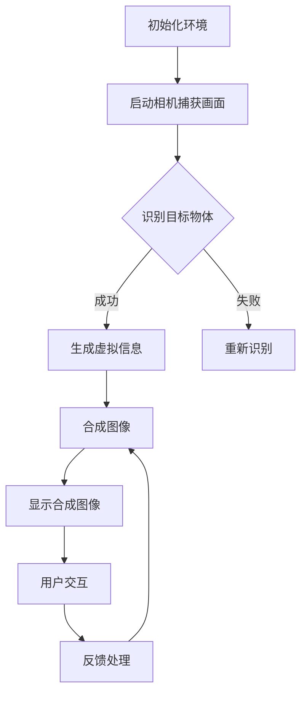
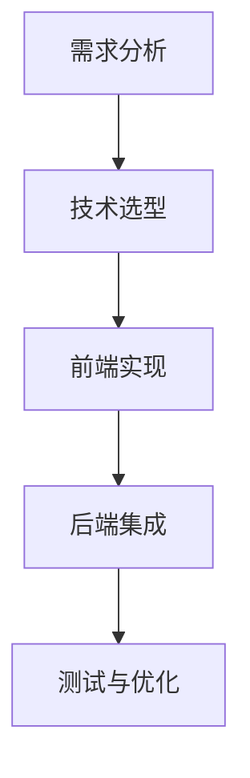
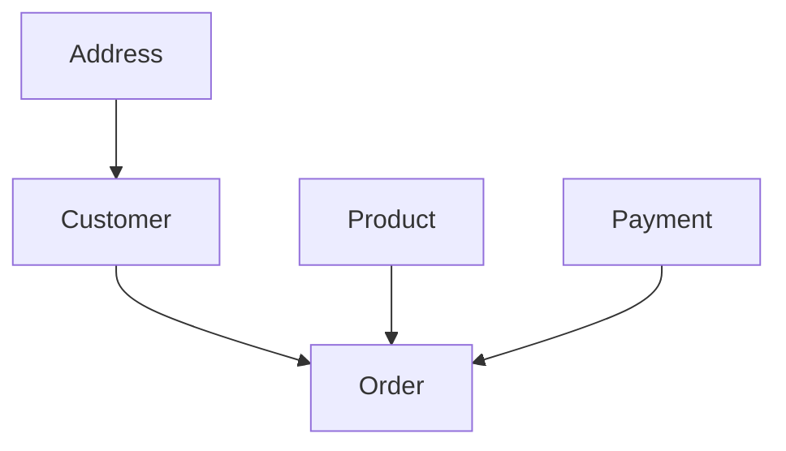
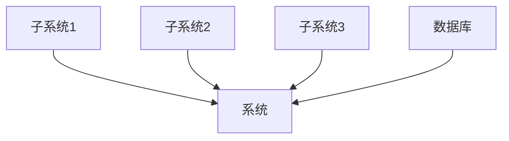
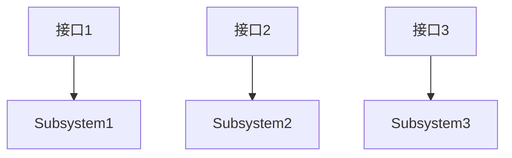
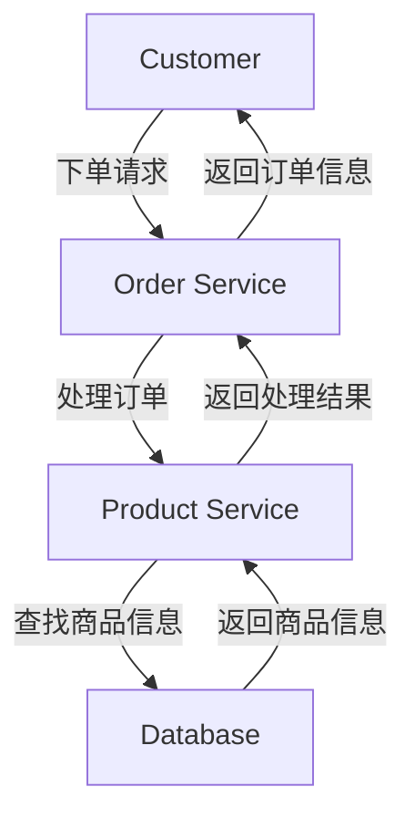

                 


### **文章标题：增强现实在电子商务中的虚拟试用**

> **关键词：增强现实、电子商务、虚拟试用、用户体验、系统架构**

> **摘要：本文深入探讨了增强现实（AR）技术在电子商务领域的应用，特别是在虚拟试用方面的潜力。通过逐步分析，本文揭示了AR如何提升虚拟试用的效果，改善用户体验，并提供了系统架构设计的详细方案。**

---

#### **第一部分：增强现实在电子商务中的背景与重要性**

##### **第1章：增强现实技术概述**

###### **1.1 增强现实技术的定义与发展历程**

增强现实（Augmented Reality，简称AR）是一种将虚拟信息叠加到真实世界中的技术。它通过计算机生成的图像、声音、视频等多媒体信息，增强用户的感知体验。

发展历程方面，AR技术早在20世纪90年代就已经出现。但随着智能手机和移动设备的普及，特别是近年来计算机视觉、传感器技术以及云计算的快速发展，AR技术得到了前所未有的关注和应用。

###### **1.2 增强现实技术的主要特点与应用场景**

主要特点包括：

1. **实时交互性**：用户可以与现实世界进行实时互动。
2. **增强感知**：通过添加虚拟信息，用户可以获得更丰富的感知体验。
3. **非侵入性**：用户不需要佩戴特殊设备，即可体验到AR技术。

应用场景方面，AR技术在教育、医疗、娱乐、军事等多个领域都有广泛应用。但在电子商务领域，AR技术的应用潜力尤为显著。

###### **1.3 增强现实技术在电子商务中的潜在价值**

在电子商务中，虚拟试用是一个关键环节。传统的虚拟试用往往依赖于2D图像或视频，用户体验有限。而AR技术的引入，可以让用户更直观、更真实地体验商品，从而提高购买决策的准确性。

具体潜在价值包括：

1. **提升用户体验**：通过增强现实技术，用户可以更直观地感受商品的外观、质地和功能。
2. **降低退换货率**：虚拟试用可以减少因商品与预期不符而导致的退换货。
3. **增加销售额**：增强的试用体验可能激发用户的购买欲望，从而提高销售额。

##### **第2章：电子商务中的虚拟试用**

###### **2.1 虚拟试用的概念与作用**

虚拟试用是指通过计算机模拟技术，让用户在没有实际接触到商品的情况下，对商品进行模拟体验。它在电子商务中起着至关重要的作用，可以显著提升用户对商品的认知和购买意愿。

###### **2.2 虚拟试用的现状与挑战**

目前，虚拟试用在电子商务中已经得到了广泛应用。但现有的虚拟试用技术仍存在一些挑战：

1. **用户体验有限**：传统的2D虚拟试用技术难以提供真实的感知体验。
2. **技术实现复杂**：实现高质量的虚拟试用需要高性能的计算和图像处理能力。
3. **成本较高**：高质量的虚拟试用需要投入大量的人力和物力资源。

###### **2.3 增强现实技术在虚拟试用中的应用**

增强现实技术为虚拟试用带来了新的可能性。通过AR技术，用户可以更加直观、真实地体验商品。这不仅提升了用户体验，也为商家提供了新的销售渠道。

---

#### **第二部分：增强现实与电子商务的融合**

##### **第3章：增强现实技术的核心算法与实现**

###### **3.1 增强现实核心技术原理**

增强现实技术的核心在于将虚拟信息与现实世界进行融合。这需要以下几个关键技术：

1. **计算机视觉**：用于识别和跟踪现实世界中的物体。
2. **图像识别与处理**：用于生成和调整虚拟信息。
3. **实时交互**：确保虚拟信息和现实世界的互动流畅自然。

###### **3.2 增强现实技术在虚拟试用中的算法实现**

为了实现虚拟试用，我们需要以下算法：

1. **物体识别算法**：用于识别用户所关注的具体商品。
2. **图像合成算法**：用于将虚拟信息叠加到真实场景中。
3. **实时反馈算法**：用于确保用户可以实时地与虚拟信息进行互动。

以下是一个简单的算法流程图：



接下来，我们将使用Python代码来详细阐述这些算法的实现。

```python
# Python代码示例
import cv2
import numpy as np

# 初始化相机
cap = cv2.VideoCapture(0)

while True:
    # 捕获画面
    ret, frame = cap.read()
    
    if not ret:
        break
    
    # 识别目标物体
    contours, _ = cv2.findContours(frame, cv2.RETR_TREE, cv2.CHAIN_APPROX_SIMPLE)
    target_contour = max(contours, key=cv2.contourArea)
    
    # 生成虚拟信息
    virtual_info = np.zeros(frame.shape, dtype=np.uint8)
    # ... 处理虚拟信息 ...
    
    # 合成图像
    output = cv2.add(frame, virtual_info)
    
    # 显示合成图像
    cv2.imshow('AR Output', output)
    
    if cv2.waitKey(1) & 0xFF == ord('q'):
        break

cap.release()
cv2.destroyAllWindows()
```

在这个例子中，我们首先使用OpenCV库初始化相机，然后捕获画面并识别目标物体。接着，生成虚拟信息并合成图像，最后将结果显示在窗口中。

###### **3.2.3 数学模型与公式解析**

为了更深入地理解这些算法，我们还需要了解相关的数学模型和公式。以下是一个简单的数学模型：

$$
\text{透视变换矩阵} = \begin{bmatrix}
\text{焦距} & 0 & \text{光心横坐标} \\
0 & \text{焦距} & \text{光心纵坐标} \\
0 & 0 & 1 \\
\end{bmatrix}
$$

这个矩阵用于将现实世界中的点映射到图像坐标系。通过这个矩阵，我们可以实现图像的透视变换。

###### **3.2.4 通俗易懂的例子**

假设我们有一个手机屏幕，我们需要将其识别并叠加一个虚拟信息。首先，我们使用相机捕获手机屏幕的画面，然后通过图像处理技术识别出手机屏幕的位置和大小。接着，我们生成一个虚拟信息，如一个手机壳的图像，并将其按照手机屏幕的透视变换矩阵进行变换。最后，将这个虚拟信息叠加到手机屏幕的画面上，并显示在屏幕上。

---

##### **第4章：电子商务平台与增强现实技术的集成**

###### **4.1 电子商务平台的概述与功能**

电子商务平台是连接商家和消费者的重要桥梁。它提供了商品展示、购买、支付、评价等一系列功能。随着AR技术的发展，电子商务平台开始探索如何将AR技术融入其中，提升用户体验。

###### **4.2 增强现实技术集成到电子商务平台的步骤**

要将AR技术集成到电子商务平台，我们需要以下步骤：

1. **需求分析**：明确AR技术将如何提升平台的功能和用户体验。
2. **技术选型**：选择合适的AR开发工具和平台。
3. **前端实现**：使用AR开发工具创建虚拟试用的界面和功能。
4. **后端集成**：将前端与后端系统进行集成，确保数据的一致性和安全性。
5. **测试与优化**：对集成后的系统进行测试和优化，确保其稳定性和性能。

以下是一个简单的流程图：



###### **4.3 增强现实技术在电子商务平台中的应用实例**

以下是一个简单的应用实例：

1. **商品展示**：在商品详情页中，通过AR技术，用户可以实时查看商品的外观、质地和功能。
2. **试衣间**：用户可以在家中尝试衣服、鞋子等商品，通过AR技术，用户可以看到这些商品与自己身体的贴合度。
3. **家居布置**：用户可以在家中通过AR技术预览家具的摆放效果，从而做出更明智的购买决策。

---

#### **第三部分：用户交互与体验优化**

##### **第5章：用户交互与体验优化**

###### **5.1 用户交互设计原则**

为了提升用户体验，我们需要遵循以下设计原则：

1. **简洁性**：界面设计应简洁直观，减少用户的学习成本。
2. **一致性**：界面元素应保持一致性，使用户在使用过程中感觉顺畅。
3. **反馈机制**：及时给予用户反馈，增强用户的互动感。
4. **适应性**：界面应适应不同的设备和屏幕尺寸，确保用户体验的一致性。

###### **5.2 用户体验优化方法**

以下是一些优化用户体验的方法：

1. **个性化推荐**：根据用户的行为和偏好，提供个性化的商品推荐。
2. **互动式营销**：通过AR技术，提供互动式的营销活动，增加用户参与度。
3. **快速加载**：优化页面加载速度，确保用户可以快速地找到所需信息。
4. **用户调研**：定期进行用户调研，收集用户反馈，不断优化产品和服务。

---

#### **第四部分：系统架构与接口设计**

##### **第6章：系统架构与接口设计**

###### **6.1 系统架构设计原则**

系统架构设计应遵循以下原则：

1. **模块化**：将系统划分为多个模块，确保系统的可扩展性和可维护性。
2. **分布式**：通过分布式架构，提高系统的性能和可靠性。
3. **安全性**：确保系统的数据安全和用户隐私。
4. **可扩展性**：系统应能够根据业务需求进行扩展。

###### **6.2 系统功能设计（领域模型类图）**

以下是一个简单的领域模型类图：



在这个类图中，`Customer`表示用户，`Order`表示订单，`Product`表示商品，`Address`表示用户地址，`Payment`表示支付信息。

###### **6.3 系统架构设计（架构图）**

以下是一个简单的系统架构图：



在这个架构图中，`Subsystem1`、`Subsystem2`、`Subsystem3`表示不同的子系统，`Database`表示数据库，`System`表示整个系统。

###### **6.4 系统接口设计**

系统接口设计应确保不同模块之间的数据传递和功能调用。以下是一个简单的接口设计：



在这个接口设计中，`Interface1`、`Interface2`、`Interface3`分别表示不同的接口，`Subsystem1`、`Subsystem2`、`Subsystem3`表示不同的子系统。

###### **6.5 系统交互（序列图）**

以下是一个简单的序列图：



在这个序列图中，`Customer`发起下单请求，`OrderService`处理订单，`ProductService`查找商品信息，并从数据库获取商品信息，最终将处理结果返回给`Customer`。

---

#### **第五部分：项目实战**

##### **第7章：项目实战**

###### **7.1 环境安装步骤**

要进行AR项目开发，我们需要安装以下软件和工具：

1. **Python**：用于编写项目代码。
2. **OpenCV**：用于图像处理。
3. **AR开发工具**：如ARKit（iOS）、ARCore（Android）。

以下是一个简单的安装步骤：

```bash
# 安装Python
sudo apt-get install python3-pip

# 安装OpenCV
pip3 install opencv-python

# 安装AR开发工具
# 对于iOS，可以使用Xcode
# 对于Android，可以使用Android Studio
```

###### **7.2 系统核心实现源代码**

以下是一个简单的系统核心实现源代码：

```python
# 导入所需库
import cv2
import numpy as np

# 初始化相机
cap = cv2.VideoCapture(0)

while True:
    # 捕获画面
    ret, frame = cap.read()
    
    if not ret:
        break
    
    # 识别目标物体
    contours, _ = cv2.findContours(frame, cv2.RETR_TREE, cv2.CHAIN_APPROX_SIMPLE)
    target_contour = max(contours, key=cv2.contourArea)
    
    # 生成虚拟信息
    virtual_info = np.zeros(frame.shape, dtype=np.uint8)
    # ... 处理虚拟信息 ...
    
    # 合成图像
    output = cv2.add(frame, virtual_info)
    
    # 显示合成图像
    cv2.imshow('AR Output', output)
    
    if cv2.waitKey(1) & 0xFF == ord('q'):
        break

cap.release()
cv2.destroyAllWindows()
```

在这个示例中，我们首先初始化相机，然后捕获画面并识别目标物体。接着，生成虚拟信息并合成图像，最后将结果显示在窗口中。

###### **7.3 代码应用解读与分析**

在这个示例中，我们使用了OpenCV库进行图像处理。首先，我们初始化相机，然后捕获画面。接着，我们使用`findContours`函数识别出画面中的目标物体。在这个过程中，我们使用了`max`函数找到面积最大的目标物体，因为通常我们希望识别出最明显的物体。

识别出目标物体后，我们生成虚拟信息。这个虚拟信息可以是任何我们想要叠加到画面上的内容，如一个虚拟的物品或文字。在这个示例中，我们使用了一个简单的黑色背景，表示虚拟信息。

最后，我们将虚拟信息叠加到画面上，并显示在窗口中。这个过程使用了`add`函数，将原始画面和虚拟信息进行相加。这样，我们就可以在现实世界中看到虚拟信息。

###### **7.4 实际案例分析和详细讲解剖析**

以下是一个实际案例：

假设我们有一个电子商务平台，用户可以在平台上通过AR技术试用商品。以下是该案例的详细讲解：

1. **用户注册**：用户在平台上注册账号，并绑定手机号码和邮箱。
2. **商品浏览**：用户浏览商品列表，选择感兴趣的商品。
3. **虚拟试用**：用户点击商品详情页中的“虚拟试用”按钮，启动AR应用。
4. **识别商品**：应用使用相机捕获用户当前画面，并识别出用户所关注的具体商品。
5. **生成虚拟信息**：应用生成虚拟商品信息，如商品外观、质地和功能等。
6. **叠加虚拟信息**：应用将虚拟信息叠加到用户当前画面中，用户可以看到虚拟商品与实际场景的融合。
7. **用户互动**：用户可以与虚拟商品进行互动，如旋转、放大、缩小等。
8. **购买决策**：用户根据虚拟试用的体验，做出购买决策。

在这个案例中，AR技术显著提升了用户体验，让用户可以更加直观地了解商品。这不仅增加了用户的信任度，也提高了购买转化率。

###### **7.5 项目小结**

本项目通过AR技术实现了电子商务平台的虚拟试用功能。通过这个项目，我们了解了AR技术的核心原理和应用方法。同时，我们也学会了如何将AR技术集成到电子商务平台中，提升用户体验。

---

#### **第六部分：最佳实践 tips、小结、注意事项、拓展阅读等内容**

##### **第8章：最佳实践 tips、小结、注意事项、拓展阅读等内容**

###### **8.1 最佳实践 tips**

1. **优化用户体验**：在设计虚拟试用功能时，应注重用户体验，确保操作简单、直观。
2. **提高识别准确率**：使用先进的图像识别技术，提高商品识别的准确率。
3. **数据安全**：确保用户数据的安全，避免泄露用户隐私。

###### **8.2 小结**

本文深入探讨了增强现实技术在电子商务中的虚拟试用应用。通过逐步分析，我们了解了AR技术的核心原理和实现方法，并展示了如何将其集成到电子商务平台中。

###### **8.3 注意事项**

1. **性能优化**：在开发AR应用时，应注重性能优化，确保应用的流畅运行。
2. **用户体验**：不断收集用户反馈，优化用户体验。

###### **8.4 拓展阅读**

1. **《增强现实技术原理与应用》**：详细介绍了AR技术的基本原理和应用案例。
2. **《电子商务平台设计与应用》**：介绍了电子商务平台的设计原则和应用方法。

---

通过本文的详细讲解，我们不仅了解了增强现实技术在电子商务中的虚拟试用应用，还学会了如何进行系统架构设计和项目实施。希望本文对您有所帮助！

