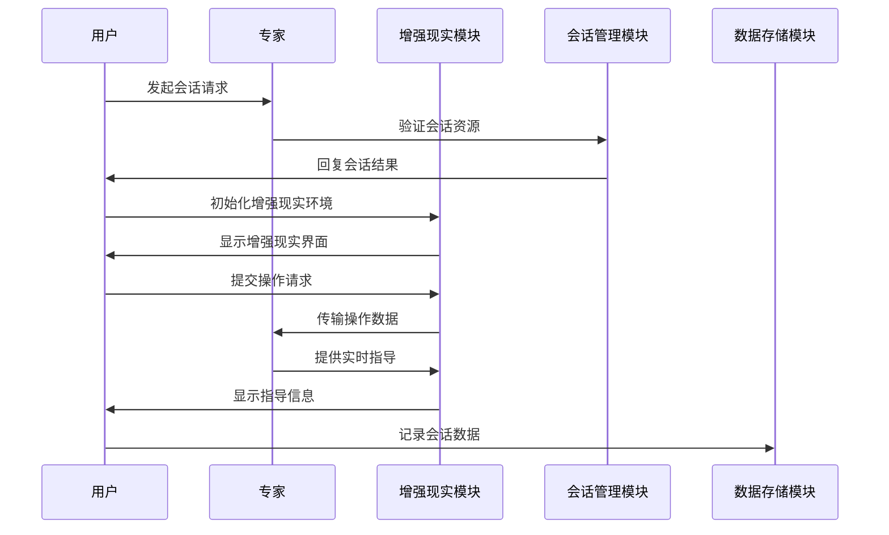
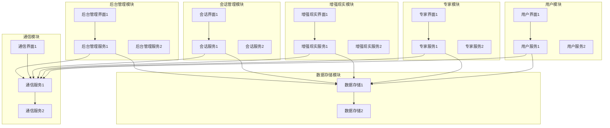
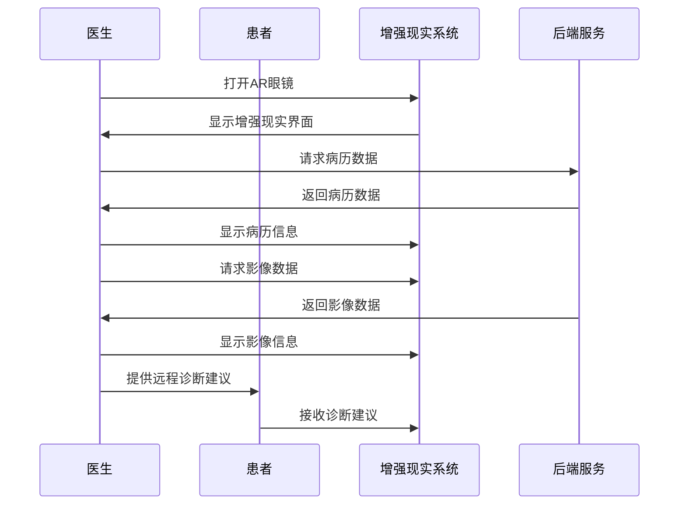
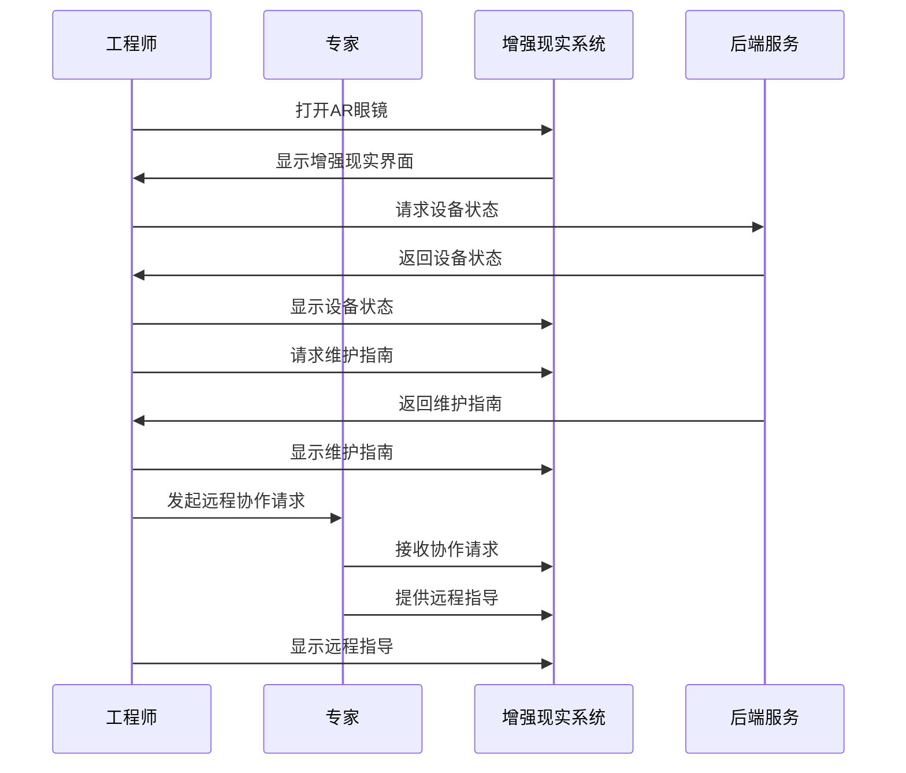
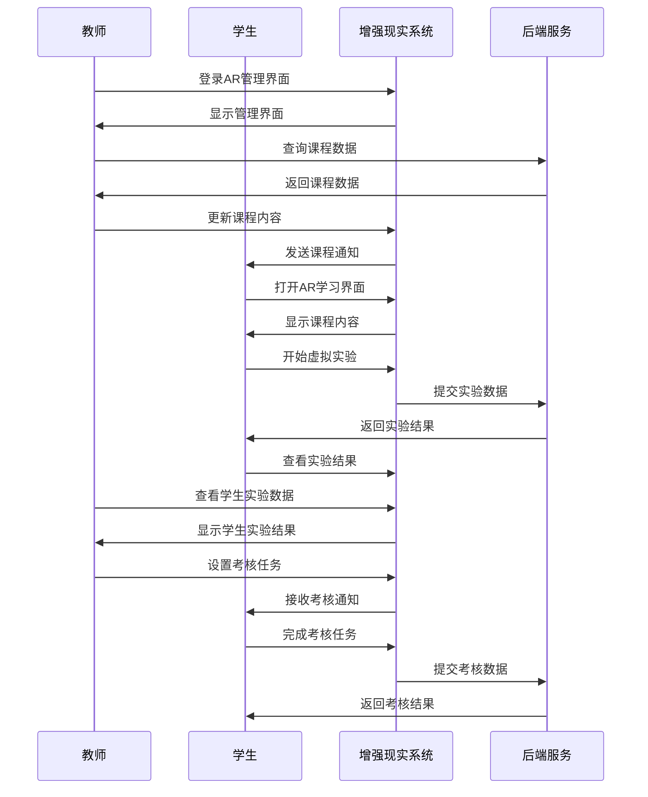

                 

# 增强现实在远程专家指导中的应用

## 关键词
- 增强现实（AR）
- 远程专家指导
- 系统架构设计
- 算法原理
- 数学模型
- 项目实战

## 摘要
本文将深入探讨增强现实（AR）技术在远程专家指导中的应用。通过逐步分析增强现实技术的基本原理，远程专家指导的需求与挑战，以及系统架构设计的关键要素，本文将展示如何利用增强现实技术提升远程专家指导的效率和效果。此外，本文还将通过具体的算法原理讲解、数学模型阐述、系统分析与架构设计方案，以及项目实战案例分析，全面呈现增强现实技术在远程专家指导领域的应用前景。

## 引言

### 增强现实技术的发展与现状

增强现实（AR）技术作为一种将虚拟信息与真实世界相结合的技术，近年来得到了快速发展。它通过计算机生成信息，将其叠加到用户看到的真实世界场景中，为用户提供一种全新的交互体验。从最初的简单叠加文字、图像，到如今的高级图形处理和实时跟踪技术，增强现实技术已经广泛应用于教育、医疗、军事、娱乐等多个领域。

在远程专家指导方面，增强现实技术也展现出巨大的潜力。传统的远程指导方式往往依赖于视频通话和文字交流，缺乏直观性和互动性。而增强现实技术可以通过实时叠加虚拟信息，为远程专家提供更加直观、具体的指导，从而提高指导效果。

### 远程专家指导的重要性

远程专家指导在现代社会的价值日益凸显。随着全球化进程的加速，跨地域、跨时区的业务合作变得愈发频繁。在这种情况下，远程专家指导成为了连接不同地区专业人士的重要手段。它不仅可以节省时间和交通成本，还能提供专业的知识和技术支持，助力业务顺利开展。

然而，远程专家指导也面临着诸多挑战。首先是信息传递的准确性问题，文字和语音交流容易产生误解；其次是互动性不足，远程专家往往无法直接观察到现场的实际情况，导致指导效果受限。而增强现实技术可以弥补这些不足，通过将虚拟信息叠加到真实世界中，提供更加直观、准确的指导。

### 本书结构安排与目标

本书旨在系统地介绍增强现实技术在远程专家指导中的应用，帮助读者理解这一新兴技术的核心原理和实际应用。全书分为以下几个部分：

1. **增强现实技术基础**：介绍增强现实技术的基本概念、工作原理和分类。
2. **远程专家指导的基本概念**：阐述远程专家指导的定义、特点和应用场景。
3. **增强现实技术在远程专家指导中的应用**：分析增强现实技术在远程专家指导中的优势和应用方法。
4. **系统架构设计**：介绍远程专家指导系统的整体架构和关键模块设计。
5. **实际应用案例**：通过具体案例展示增强现实技术在远程专家指导中的应用效果。
6. **挑战与未来展望**：讨论增强现实技术在远程专家指导中面临的挑战和未来发展方向。

通过以上结构安排，本文将带领读者逐步深入了解增强现实技术在远程专家指导领域的应用，探讨其技术原理、实现方法、系统架构和实际效果，为相关领域的研究和实践提供参考。

## 第1章 增强现实技术基础

### 1.1 增强现实技术概述

增强现实（AR）技术是一种通过计算机技术将虚拟信息与现实世界相结合的技术。它利用头戴显示器（如AR眼镜）、投影设备或智能手机等设备，在用户视野中叠加虚拟信息，使用户能够在真实环境中看到并交互虚拟对象。

增强现实技术的基本原理可以概括为以下几个步骤：

1. **感知与定位**：通过摄像头或其他传感器捕捉现实世界的图像，并使用图像处理和计算机视觉算法对图像进行识别和定位。
2. **内容生成**：根据用户的位置和视角，生成相应的虚拟信息，如文字、图像、3D模型等。
3. **叠加与显示**：将生成的虚拟信息叠加到捕捉到的现实图像上，并通过显示设备呈现给用户。

增强现实技术的应用场景非常广泛，包括但不限于以下几类：

1. **教育领域**：增强现实技术可以用于虚拟实验、互动教学和知识可视化，提高学生的学习兴趣和理解能力。
2. **医疗领域**：增强现实技术可以用于手术指导、医学教育和患者康复，提供更加直观和个性化的医疗服务。
3. **军事领域**：增强现实技术可以用于战场模拟、装备指导和情报分析，提高军事行动的效率和安全性。
4. **娱乐领域**：增强现实技术可以用于游戏、虚拟现实体验和演出，为用户提供全新的娱乐方式。

### 1.2 增强现实技术的工作原理

增强现实技术的工作原理主要包括以下几个关键部分：

1. **图像识别与跟踪**：通过计算机视觉算法对现实世界中的图像进行识别和跟踪，以确定虚拟信息需要叠加的位置和角度。常见的图像识别算法包括基于特征的识别、基于模型的识别和基于深度学习的识别。
2. **虚拟信息生成**：根据用户的位置、视角和其他环境信息，生成相应的虚拟信息。这些虚拟信息可以是文字、图像、3D模型等，它们需要与现实世界中的图像进行精确匹配，以保证视觉效果的真实性和自然性。
3. **叠加与渲染**：将生成的虚拟信息叠加到现实世界的图像上，并通过显示设备呈现给用户。这个过程涉及到图像的融合、渲染和显示技术，以保证虚拟信息的清晰度和视觉效果。

### 1.3 增强现实技术的分类与应用场景

增强现实技术可以根据不同的分类标准进行分类，常见的分类方法包括：

1. **根据显示方式分类**：
   - **透明式增强现实**：通过透明显示屏将虚拟信息叠加到真实世界中，用户可以看到叠加的虚拟信息和真实环境。
   - **遮盖式增强现实**：通过全封闭的显示屏将虚拟信息覆盖在真实世界之上，用户只能看到虚拟信息，无法看到真实环境。
   - **混合式增强现实**：结合透明式和遮盖式增强现实的特点，用户可以通过部分透明或可切换的方式同时看到虚拟信息和真实环境。

2. **根据应用场景分类**：
   - **教育应用**：用于互动教学、知识可视化和虚拟实验等。
   - **医疗应用**：用于手术指导、医学教育和患者康复等。
   - **军事应用**：用于战场模拟、装备指导和情报分析等。
   - **娱乐应用**：用于游戏、虚拟现实体验和演出等。

不同类型的增强现实技术具有不同的特点和适用场景，根据具体应用需求选择合适的技术类型，可以更好地发挥增强现实技术的优势。

### 1.4 增强现实技术的基本概念与术语

在讨论增强现实技术时，需要了解一些基本概念和术语，以下是一些常见的概念和术语：

- **AR眼镜**：一种头戴式显示设备，用于将虚拟信息叠加到真实世界中，用户可以通过眼镜看到增强后的现实场景。
- **SLAM（同时定位与地图构建）**：一种通过视觉传感器和计算技术，同时实现对现实环境的定位和构建三维地图的技术。
- **VPS（虚拟物体放置）**：一种通过用户交互，将虚拟物体放置到现实场景中的技术。
- **透明渲染**：一种将虚拟信息透明地叠加到真实世界的图像上的技术，以保证虚拟信息与真实环境的自然融合。
- **AR应用开发平台**：用于开发增强现实应用的软件工具和开发环境，常见的平台包括Unity、ARKit、Vuforia等。

通过了解这些基本概念和术语，可以更好地理解增强现实技术的原理和应用。

### 1.5 增强现实技术的历史与发展

增强现实技术的历史可以追溯到20世纪60年代，当时最早的增强现实系统主要由计算机图形学专家开发。从最初的简单叠加文字和图像，到如今的高级图像识别、实时跟踪和虚拟信息生成，增强现实技术经历了数十年的发展。

1. **早期阶段（1960s-1980s）**：最早的增强现实系统主要由计算机图形学专家开发，主要用于军事和科学研究。代表性的系统包括达特茅斯学院开发的“达特茅斯增强现实系统”和波音公司开发的“增强现实头盔”。
2. **发展阶段（1990s-2000s）**：随着计算机技术和图形处理能力的提高，增强现实技术逐渐应用于民用领域。1990年，麻省理工学院媒体实验室发布了“虚拟现实护目镜”（VR Glasses），标志着增强现实技术向民用领域的迈进。随后，增强现实技术在娱乐、教育和医疗等领域得到广泛应用。
3. **成熟阶段（2010s至今）**：近年来，随着智能手机和移动设备的普及，增强现实技术的应用场景进一步扩展。2016年，谷歌发布了全球首款商用增强现实眼镜“谷歌眼镜”，标志着增强现实技术进入大众市场。此外，苹果、三星等科技公司也纷纷推出增强现实应用和相关设备，推动增强现实技术的进一步发展。

通过了解增强现实技术的历史与发展，可以更好地理解其当前的现状和未来发展方向。

### 1.6 增强现实技术的优势与挑战

增强现实技术具有以下优势：

- **增强互动性**：通过虚拟信息的叠加，增强现实技术可以提供更加直观和互动的体验，提高用户的参与度和满意度。
- **提供实时反馈**：增强现实技术可以实时捕捉和显示用户的行为和环境信息，为用户提供即时的反馈和指导，提高效率和准确性。
- **节约成本**：增强现实技术可以减少人员培训和现场指导的成本，提高工作效率。

然而，增强现实技术也面临着一些挑战：

- **技术限制**：当前的增强现实技术仍然存在一定的技术瓶颈，如图像识别精度、实时性、功耗等问题。
- **用户接受度**：由于增强现实技术相对较新，用户对其接受度和熟悉度可能较低，需要通过教育和培训提高用户的认知和使用意愿。
- **隐私与安全**：增强现实技术涉及用户隐私数据的收集和使用，需要确保数据的安全性和用户隐私的保护。

通过克服这些挑战，增强现实技术有望在更多领域得到应用和发展。

### 1.7 增强现实技术在远程专家指导中的应用潜力

增强现实技术为远程专家指导提供了丰富的应用潜力，以下是一些具体的应用场景：

- **远程医疗**：增强现实技术可以用于远程手术指导、医学教育和患者康复。医生可以通过增强现实眼镜实时观察患者的身体状态，提供更加精准的诊断和治疗建议。
- **工程维护**：增强现实技术可以用于远程设备维护和检修。技术人员可以通过增强现实眼镜查看设备内部结构，并获得远程专家的实时指导，提高维护效率和准确性。
- **教育培训**：增强现实技术可以用于远程教育培训，通过虚拟实验和互动教学，提高学生的学习兴趣和理解能力。
- **应急响应**：增强现实技术可以用于远程应急响应和救援，为现场人员提供实时指导和支持，提高救援效率和安全性。

通过以上应用场景，可以看出增强现实技术为远程专家指导提供了全新的解决方案，有助于提升远程指导的效果和效率。

## 第2章 远程专家指导的基本概念

### 2.1 远程专家指导的定义与特点

远程专家指导是指通过通信技术，将专家的知识、经验和技能远程传递给需要指导的人员，以实现知识共享和问题解决的一种指导方式。它具有以下几个显著特点：

1. **远程性**：远程专家指导的核心在于“远程”，指导者和被指导者之间不一定要在同一个物理空间内。这种远程性使得专家可以跨越地域限制，为全球范围内的用户提供服务。
2. **实时性**：远程专家指导强调实时互动，指导者和被指导者可以通过视频通话、即时消息等工具进行实时交流，确保指导过程的连续性和及时性。
3. **灵活性**：远程专家指导的时间和地点更加灵活，指导者可以根据自身的时间安排进行工作，被指导者也可以根据需要随时接受指导，不受地理和时间的限制。
4. **互动性**：远程专家指导不仅限于单向的信息传递，还包括双向的互动和反馈。这种互动性有助于确保指导的质量和效果，使被指导者能够更好地理解和应用专家的知识和经验。

### 2.2 远程专家指导的必要性

随着全球化进程的加快，远程工作已经成为现代工作方式的重要组成部分。远程专家指导在多个领域发挥着重要作用，其必要性体现在以下几个方面：

1. **资源优化**：远程专家指导可以优化人力资源配置，将专家的知识和技能最大化地利用。特别是在医疗、教育、技术等高知领域，远程专家指导能够打破地域限制，让更多的用户享受到优质资源。
2. **效率提升**：远程专家指导可以大幅提高问题解决的效率。通过实时互动和远程协作，专家可以迅速地识别问题并提供解决方案，减少时间和成本。
3. **成本节约**：远程专家指导减少了专家和被指导者之间的交通和时间成本。专家无需亲自前往现场，被指导者也无需前往专家所在地，这种模式有助于节约人力和物力资源。
4. **灵活适应**：远程专家指导能够灵活适应不同的工作场景和需求，无论是在紧急情况下还是在常规工作中，都能提供有效的支持。

### 2.3 远程专家指导的应用场景

远程专家指导在多个领域都有广泛的应用，以下是一些典型的应用场景：

1. **医疗领域**：远程医疗诊断、手术指导、医学教育和患者康复都是远程专家指导的重要应用场景。医生可以通过远程会诊系统，为偏远地区的患者提供专业的医疗服务，同时也可以通过远程教育平台，为医学从业者提供持续教育。
2. **工程领域**：在工程维护和检修中，远程专家指导可以帮助技术人员解决复杂问题，通过视频通话和虚拟叠加技术，专家可以远程指导现场操作，提高维护效率和质量。
3. **教育领域**：远程教育培训是远程专家指导的重要应用之一。通过在线教育平台，专家可以为学生提供个性化的学习指导和实时互动，帮助学生更好地理解和掌握知识。
4. **企业咨询**：企业管理顾问、技术顾问等专业人员可以通过远程咨询，为企业提供战略规划、运营优化、技术解决方案等咨询服务，帮助企业提高管理效率和技术水平。
5. **灾害救援**：在自然灾害、事故救援等紧急情况下，远程专家指导可以提供专业的应急指导和决策支持，帮助救援队伍快速响应和有效行动。

通过以上应用场景，可以看出远程专家指导在各个领域都具有重要的价值和广泛的应用前景。随着技术的不断进步，远程专家指导的应用范围和效果将得到进一步拓展和提升。

### 2.4 远程专家指导的发展历程

远程专家指导作为一种新兴的指导方式，其发展历程可以追溯到互联网和通信技术的发展。以下是远程专家指导的发展历程：

1. **早期阶段（1990s）**：随着互联网的普及，电子邮件、即时通讯工具和视频通话等通信手段逐渐成熟，远程专家指导开始萌芽。这一阶段的远程指导主要依赖于文本和语音交流，缺乏直观性和互动性。
2. **发展期（2000s）**：随着计算机技术和图形处理能力的提升，视频会议系统、远程桌面软件等工具得到广泛应用，远程专家指导的互动性和实用性得到了显著提升。这一时期，远程专家指导开始逐步应用于医疗、教育和企业咨询等领域。
3. **成熟期（2010s）**：互联网技术的快速发展，尤其是移动互联网和云服务的普及，为远程专家指导提供了更加丰富的平台和工具。在这一时期，远程专家指导逐步走向成熟，各种远程指导系统和服务平台如雨后春笋般涌现。
4. **创新期（2020s）**：随着增强现实（AR）、虚拟现实（VR）等新技术的发展，远程专家指导进入了创新期。AR和VR技术可以为远程指导提供更加直观、沉浸式的体验，进一步提升了远程专家指导的效果和效率。

通过以上发展历程，可以看出远程专家指导在技术进步的推动下，不断演进和优化，逐渐成为现代社会中不可或缺的一部分。

### 2.5 远程专家指导的优势与挑战

远程专家指导具有以下优势：

- **高效性**：远程专家指导可以快速传递知识和经验，减少时间和空间障碍，提高问题解决的效率。
- **灵活性**：远程专家指导不受时间和地点限制，可以根据需要灵活安排，方便用户和专家双方的互动。
- **经济性**：远程专家指导减少了人员差旅和现场指导的成本，有助于节约资源和提高经济效益。
- **互动性**：远程专家指导可以通过视频、音频、文字等多种方式进行交流，提供双向互动，有助于提高指导效果。

然而，远程专家指导也面临着一些挑战：

- **技术限制**：当前远程专家指导技术尚不完全成熟，存在图像质量、网络延迟等技术问题，影响用户体验。
- **信息安全**：远程专家指导涉及敏感数据和隐私信息，需要确保数据传输的安全性和用户隐私的保护。
- **用户接受度**：部分用户对远程专家指导的接受度和熟悉度较低，需要通过教育和培训提高其认知和使用意愿。

通过克服这些挑战，远程专家指导有望在更多领域发挥其优势，实现更广泛的应用。

### 2.6 远程专家指导的流程与关键技术

远程专家指导的基本流程包括以下几个关键步骤：

1. **需求识别**：首先明确用户的需求和问题，这可以通过问卷调查、电话沟通或在线表单等方式进行。
2. **专家匹配**：根据用户需求，选择合适的远程专家。这可以通过专家数据库、人工智能匹配算法等方式实现。
3. **会话安排**：与用户和专家进行沟通，确定会话时间、方式和工具，如视频会议软件、远程桌面软件等。
4. **会话实施**：在会话过程中，专家通过视频、音频、文字等方式提供指导，用户可以实时提问和互动。
5. **反馈与评估**：会话结束后，用户和专家可以提供反馈，评估指导效果，并进行必要的调整和改进。

在远程专家指导中，关键技术包括：

- **通信技术**：如视频通话、即时消息、远程桌面等，确保实时性和互动性。
- **计算机视觉与图像处理**：用于图像识别、跟踪和虚拟信息叠加，提供直观的指导体验。
- **人工智能与大数据**：用于专家匹配、数据分析、智能推荐等，提高指导的准确性和个性化水平。
- **安全与隐私保护**：如数据加密、身份认证、隐私屏蔽等，确保用户信息和会话数据的安全。

通过以上流程和关键技术的支持，远程专家指导可以实现高效、灵活、安全的指导服务。

### 2.7 远程专家指导的未来发展趋势

随着科技的不断进步，远程专家指导的未来发展趋势表现出以下几个方面的特点：

1. **技术融合**：增强现实（AR）、虚拟现实（VR）、人工智能（AI）等新兴技术的融合将进一步提升远程专家指导的互动性和沉浸感，为用户提供更加直观、个性化的服务。
2. **个性化服务**：基于大数据和人工智能的个性化推荐技术将使远程专家指导更加精准地满足用户需求，提高指导效果。
3. **全球化应用**：互联网和通信技术的普及，将使远程专家指导在全球范围内得到更广泛的应用，助力全球知识共享和资源优化。
4. **安全性与隐私保护**：随着远程专家指导的普及，数据安全和隐私保护将成为重要议题，需要通过技术创新和法律规范来确保用户信息和会话数据的安全。
5. **教育普及**：远程专家指导将逐渐成为教育领域的重要组成部分，通过在线教育平台和虚拟实验室，为学生和教师提供丰富的学习资源和互动体验。

通过以上发展趋势，远程专家指导将在未来发挥更加重要的作用，为各领域的发展提供强有力的支持。

## 第3章 增强现实技术在远程专家指导中的应用

### 3.1 增强现实技术在远程专家指导中的应用优势

增强现实（AR）技术在远程专家指导中的应用具有显著的优势，以下是一些主要的优势：

1. **直观性**：增强现实技术可以将虚拟信息直接叠加到用户的视野中，使得专家的指导更加直观和具体。用户可以实时看到专家的指示和建议，而不需要依赖文字或语音描述。
2. **互动性**：通过增强现实技术，用户可以与虚拟信息进行交互，例如移动、旋转、缩放等，从而更深入地理解和应用专家的指导。
3. **实时性**：增强现实技术可以实现实时交互，专家可以即时看到用户的行为和环境变化，并提供即时的反馈和指导，提高了远程指导的效率和准确性。
4. **沉浸感**：增强现实技术可以为用户提供一种沉浸式的体验，用户感觉仿佛身临其境，可以更好地理解专家的指导意图和实际操作步骤。
5. **多感官融合**：增强现实技术结合了视觉、听觉和其他感官信息，为用户提供更加丰富的信息和互动体验，提高了学习的兴趣和效果。

### 3.2 增强现实技术在远程专家指导中的实现方法

增强现实技术在远程专家指导中的实现方法主要包括以下几个步骤：

1. **需求分析与系统设计**：首先，根据远程专家指导的具体需求和场景，设计合适的系统架构和功能模块。例如，在医疗领域，可能需要设计手术指导系统；在工程领域，可能需要设计设备维护系统。
2. **硬件设备选择**：选择适合的增强现实硬件设备，如AR眼镜、头戴显示器等。这些设备需要具备高分辨率、低延迟和稳定跟踪等特性，以保证增强现实体验的质量。
3. **软件开发与集成**：开发增强现实应用程序，实现虚拟信息的生成、叠加和交互功能。通常使用增强现实开发平台，如Unity、ARKit、Vuforia等，进行应用程序的开发和集成。
4. **数据采集与处理**：通过摄像头或其他传感器采集现实世界的图像和音频信息，并进行实时处理，用于虚拟信息的生成和交互。
5. **用户交互与反馈**：设计用户交互界面，使用户可以方便地与虚拟信息进行交互，并提供实时反馈，确保指导的连续性和有效性。
6. **安全性与隐私保护**：确保系统数据的安全性和用户隐私的保护，采取数据加密、身份认证和访问控制等措施。

### 3.3 增强现实技术在远程专家指导中的实际应用

增强现实技术在远程专家指导中的实际应用非常广泛，以下是一些典型的应用案例：

1. **远程医疗诊断**：通过增强现实技术，医生可以在远程诊断过程中，将患者的图像和病历信息叠加到医生的视野中，提供更加直观和全面的诊断依据。医生还可以通过远程互动，实时与患者沟通，提高诊断的准确性和效率。

2. **工程维护与检修**：在工程领域，增强现实技术可以帮助技术人员远程进行设备维护和检修。技术人员可以通过AR眼镜查看设备内部结构，并接收到来自远程专家的实时指导。专家可以实时展示操作步骤，提供具体的维修建议，提高维护效率和准确性。

3. **教育培训与技能传授**：在教育培训领域，增强现实技术可以用于互动教学和技能传授。教师可以通过增强现实技术，将虚拟信息叠加到教学场景中，为学生提供更加生动和直观的学习体验。学生可以与虚拟信息进行互动，加深对知识的理解和应用。

4. **应急响应与救援**：在应急响应和救援场景中，增强现实技术可以为救援人员提供实时指导和支持。救援人员可以通过AR眼镜查看现场情况，并获得来自远程专家的实时建议和决策支持，提高救援效率和安全性。

通过以上实际应用，可以看出增强现实技术在远程专家指导中具有巨大的潜力，可以显著提升指导的效果和效率。

### 3.4 增强现实技术在远程专家指导中的应用效果评估

为了评估增强现实技术在远程专家指导中的应用效果，需要进行一系列的实验和数据分析。以下是一些评估方法和指标：

1. **用户满意度**：通过问卷调查、用户访谈等方式收集用户对增强现实远程专家指导的满意度评价，包括对指导效果、互动体验、使用便捷性等方面的评价。
2. **效率提升**：通过对比使用增强现实技术前后的指导时间、问题解决速度等指标，评估增强现实技术对远程专家指导效率的提升效果。
3. **准确性提高**：通过分析使用增强现实技术后，问题解决的成功率和准确性等指标，评估增强现实技术对远程指导准确性的提升效果。
4. **学习效果**：在教育培训领域，可以通过对学习效果的评价，如考试成绩、学习进度等指标，评估增强现实技术在提高学习效果方面的效果。

通过以上评估方法和指标，可以全面了解增强现实技术在远程专家指导中的应用效果，为技术的进一步优化和应用提供参考。

### 3.5 增强现实技术在远程专家指导中的优势与挑战

在远程专家指导中，增强现实技术具有显著的优势，但也面临一些挑战：

**优势：**

1. **直观性和互动性**：增强现实技术可以提供更加直观和互动的指导体验，提高用户的学习兴趣和理解能力。
2. **实时性和沉浸感**：增强现实技术可以实现实时互动和沉浸式体验，提高远程指导的效率和准确性。
3. **多感官融合**：增强现实技术结合了视觉、听觉和其他感官信息，为用户提供更加丰富的信息和互动体验。

**挑战：**

1. **技术限制**：当前的增强现实技术还存在一些技术瓶颈，如图像识别精度、实时性、功耗等，需要进一步优化和提升。
2. **用户接受度**：由于增强现实技术相对较新，用户对其接受度和熟悉度可能较低，需要通过教育和培训提高用户的认知和使用意愿。
3. **安全性与隐私保护**：增强现实技术涉及用户隐私数据的收集和使用，需要确保数据的安全性和用户隐私的保护。

通过克服这些挑战，增强现实技术有望在远程专家指导中发挥更大的作用。

### 3.6 增强现实技术在远程专家指导中的未来发展方向

随着技术的不断进步，增强现实（AR）技术在远程专家指导中的应用将朝着以下几个方向发展：

1. **技术的进一步优化**：通过提高图像识别精度、降低延迟和功耗，增强现实技术将提供更加流畅和真实的体验。
2. **个性化指导**：基于大数据和人工智能的个性化推荐技术将使远程专家指导更加精准地满足用户需求，提高指导效果。
3. **多平台支持**：增强现实技术将逐渐支持更多类型的设备，如智能手机、平板电脑等，使远程专家指导的应用更加广泛。
4. **跨领域融合**：增强现实技术将在更多领域得到应用，如教育、医疗、工程、救援等，实现跨领域的融合和协同。
5. **安全与隐私保护**：随着增强现实技术的普及，数据安全和隐私保护将成为重要议题，需要通过技术创新和法律规范来确保用户信息和会话数据的安全。

通过以上发展方向，增强现实技术将在远程专家指导中发挥更加重要的作用，为各领域的发展提供强有力的支持。

## 第4章 系统架构设计

### 4.1 系统架构概述

为了实现增强现实技术在远程专家指导中的高效应用，我们需要设计一个功能完善、性能稳定、扩展性强的系统架构。整个系统可以分为以下几个主要模块：

1. **用户模块**：负责用户注册、登录、权限管理和用户信息管理等功能。
2. **专家模块**：负责专家注册、登录、权限管理和专家信息管理等功能。
3. **会话管理模块**：负责会话创建、调度、监控和记录等功能。
4. **增强现实模块**：负责增强现实内容的生成、叠加和交互等功能。
5. **数据存储模块**：负责存储用户数据、专家数据、会话数据和系统日志等。
6. **通信模块**：负责系统内部及与其他系统的数据传输和通信。

### 4.2 增强现实模块设计

增强现实模块是整个系统架构的核心，它负责实现增强现实内容的生成、叠加和交互功能。以下是增强现实模块的详细设计：

1. **图像识别与跟踪**：通过计算机视觉算法，对用户视野中的图像进行识别和跟踪，以确保虚拟信息能够精确地叠加到用户视野中的正确位置。
2. **虚拟信息生成**：根据用户的视角和位置，生成相应的虚拟信息，如文字、图像、3D模型等。这些虚拟信息需要与现实世界的图像进行精确匹配，以保证视觉效果的自然性和真实性。
3. **叠加与渲染**：将生成的虚拟信息叠加到用户视野中的现实图像上，并通过显示设备呈现给用户。在这个过程中，需要使用高效的渲染算法，以保证虚拟信息的清晰度和视觉效果。
4. **用户交互**：设计用户交互界面，使用户可以通过触摸、手势等方式与虚拟信息进行交互，如移动、旋转、缩放等。

### 4.3 远程专家指导模块设计

远程专家指导模块负责实现远程专家与用户之间的互动和指导功能。以下是远程专家指导模块的详细设计：

1. **会话创建与调度**：用户可以创建新的会话，并邀请专家加入。系统需要根据专家的日程安排和用户的需求，合理调度会话资源，确保会话的顺利进行。
2. **实时通信**：通过视频通话、即时消息等方式，实现专家与用户之间的实时通信。在这个过程中，需要确保通信的稳定性和实时性，以避免信息传递的延误和误解。
3. **实时指导与反馈**：专家可以通过增强现实技术，实时观察用户的操作和环境，并提供即时的指导和建议。用户也可以实时反馈自己的问题和困惑，以便专家进行进一步指导。
4. **会话记录与管理**：系统需要记录每次会话的相关信息，如会话时间、参与人员、问题与解决方案等，以便后续的查询和评估。

### 4.4 系统接口设计与数据交互

为了确保系统的可扩展性和易维护性，我们需要设计合理的系统接口和数据交互机制。以下是系统接口和数据交互的详细设计：

1. **RESTful API**：系统采用RESTful API设计，提供统一的接口标准，方便与其他系统进行集成和数据交互。
2. **数据格式**：系统采用JSON或XML等常见的数据格式，以便于数据传输和解析。
3. **身份认证与授权**：系统通过身份认证和授权机制，确保用户和专家的身份合法性和操作权限。
4. **数据存储与访问**：系统使用数据库管理系统（如MySQL、MongoDB等）来存储和管理用户数据、专家数据、会话数据等，并提供高效的访问接口。

### 4.5 系统架构图与Mermaid序列图

为了更直观地展示系统架构和功能模块，我们使用Mermaid序列图来描述系统的工作流程和数据交互过程。以下是系统架构图和Mermaid序列图：



通过以上系统架构设计和Mermaid序列图，我们可以清晰地了解整个系统的运作流程和数据交互机制。这种结构设计不仅提高了系统的扩展性和可维护性，还为后续的开发和维护提供了明确的指导。

### 4.6 系统接口设计与系统交互

为了确保远程专家指导系统的稳定性和高效性，我们需要设计合理的系统接口和数据交互机制。以下是系统接口设计和系统交互的详细阐述：

#### 4.6.1 系统接口设计

1. **用户接口**：用户通过前端界面与系统进行交互，前端界面应包括登录、注册、创建会话、查看会话历史等功能。接口设计应遵循RESTful原则，确保接口的一致性和易用性。
   
2. **专家接口**：专家接口包括登录、接受会话请求、提供实时指导等功能。专家登录后，可以查看和管理自己的会话，并通过增强现实界面提供实时指导。

3. **增强现实接口**：增强现实接口负责处理虚拟信息生成、叠加和交互等操作。接口应支持高并发访问，确保实时性和稳定性。

4. **后台管理接口**：后台管理接口包括用户管理、专家管理、会话管理、数据统计等功能。后台管理接口应具备权限控制，确保数据安全和系统稳定。

#### 4.6.2 系统交互

1. **用户与用户接口的交互**：用户通过前端界面发起会话请求，系统根据用户输入的信息，调用会话管理接口创建会话，并将会话信息存储到数据存储模块。

2. **用户与增强现实接口的交互**：用户在增强现实界面进行操作时，将操作请求发送到增强现实接口，接口生成相应的虚拟信息并叠加到用户的视野中。

3. **专家与专家接口的交互**：专家通过专家接口接受用户发起的会话请求，并查看会话详情。专家在提供实时指导时，通过增强现实接口与用户的增强现实界面进行实时交互。

4. **后台管理接口与数据存储模块的交互**：后台管理接口负责维护用户数据、专家数据和会话数据。数据存储模块提供高效的数据存储和检索功能，确保数据的完整性和一致性。

通过以上系统接口设计和系统交互机制，远程专家指导系统可以确保高效、稳定地运行，为用户提供优质的远程指导服务。

### 4.7 系统架构设计与Mermaid架构图

为了更直观地展示远程专家指导系统的整体架构，我们可以使用Mermaid架构图来描述系统的主要模块及其交互关系。以下是系统的Mermaid架构图：



通过以上Mermaid架构图，我们可以清晰地看到远程专家指导系统的各个模块及其交互关系。这种架构设计不仅提高了系统的可扩展性和可维护性，还为开发团队提供了明确的开发指导。

## 第5章 实际应用案例

### 5.1 案例一：远程医疗诊断

**项目介绍**：本项目旨在通过增强现实技术，为医生提供远程医疗诊断工具。系统允许医生通过AR设备查看患者的病历和实时影像，并进行远程诊断和指导。

**系统功能设计**：

1. **病历查看**：医生可以通过AR设备查看患者的电子病历，包括病史、检查报告和诊断结果。
2. **影像查看**：系统支持实时影像的增强现实叠加，医生可以实时观察患者的影像数据，如X光片、CT扫描和MRI图像。
3. **远程指导**：医生可以通过AR设备向患者提供远程诊断建议，通过增强现实界面展示操作步骤和注意事项。

**系统架构设计**：

1. **前端界面**：医生通过AR眼镜查看增强现实界面，该界面集成病历查看和影像查看功能。
2. **后端服务**：后端服务器负责处理病历和影像数据，提供数据存储、查询和增强现实渲染服务。
3. **通信模块**：通过实时通信技术（如WebRTC）实现医生与患者的实时互动。

**系统接口设计**：

1. **病历接口**：提供病历数据的查询和更新接口，确保医生可以实时查看患者病历。
2. **影像接口**：提供影像数据的上传、查询和增强现实渲染接口，确保医生可以实时查看患者影像。

**系统交互Mermaid序列图**：



**代码应用解读与分析**：

**后端服务（Python）**：

```python
# 后端服务示例代码
from flask import Flask, request, jsonify
from flask_cors import CORS

app = Flask(__name__)
CORS(app)

@app.route('/get_medical_record', methods=['GET'])
def get_medical_record():
    patient_id = request.args.get('patient_id')
    # 查询病历数据
    medical_record = get_medical_record_data(patient_id)
    return jsonify(medical_record)

@app.route('/get_image_data', methods=['GET'])
def get_image_data():
    patient_id = request.args.get('patient_id')
    # 查询影像数据
    image_data = get_image_data(patient_id)
    return jsonify(image_data)

def get_medical_record_data(patient_id):
    # 模拟查询病历数据
    return {"patient_id": patient_id, "diagnosis": "待诊断"}

def get_image_data(patient_id):
    # 模拟查询影像数据
    return {"patient_id": patient_id, "image_uri": "image_uri"}

if __name__ == '__main__':
    app.run(debug=True)
```

**增强现实界面（JavaScript）**：

```javascript
// 增强现实界面示例代码
function fetchMedicalRecord(patientId) {
    fetch('/get_medical_record?patient_id=' + patientId)
        .then(response => response.json())
        .then(data => {
            displayMedicalRecord(data);
        });
}

function fetchImageData(patientId) {
    fetch('/get_image_data?patient_id=' + patientId)
        .then(response => response.json())
        .then(data => {
            displayImageData(data);
        });
}

function displayMedicalRecord(data) {
    console.log("病历信息:", data);
    // 在AR界面显示病历信息
}

function displayImageData(data) {
    console.log("影像数据:", data);
    // 在AR界面显示影像信息
}

// 示例：请求患者的病历和影像数据
fetchMedicalRecord("12345");
fetchImageData("12345");
```

通过以上代码示例，我们可以看到如何通过后端服务和增强现实界面实现远程医疗诊断的功能。医生可以通过AR设备查看患者的病历和影像数据，提供远程诊断和建议，从而提高诊断的准确性和效率。

**项目小结**：

本项目通过增强现实技术在远程医疗诊断中的应用，实现了医生与患者之间的实时互动和高效诊断。使用Python后端服务和JavaScript增强现实界面，实现了数据的实时查询和显示。该项目的成功为远程医疗诊断提供了新的解决方案，有助于提高医疗服务的质量和效率。

### 5.2 案例二：工程维护与检修

**项目介绍**：本项目旨在利用增强现实技术，为工程师提供远程设备维护和检修工具，帮助他们在远程环境中高效地完成维护任务。

**系统功能设计**：

1. **设备状态监测**：工程师可以通过AR设备实时监测设备的状态，包括温度、压力、电流等参数。
2. **维护指南**：系统提供详细的设备维护指南，包括操作步骤、注意事项和维修建议。
3. **远程协作**：工程师可以与远程专家实时协作，获得专业的技术支持和指导。

**系统架构设计**：

1. **前端界面**：工程师通过AR眼镜查看增强现实界面，界面包括设备状态监测、维护指南和远程协作功能。
2. **后端服务**：后端服务器负责处理设备状态数据、维护指南和远程协作请求，提供数据存储、查询和增强现实渲染服务。
3. **通信模块**：通过实时通信技术（如WebRTC）实现工程师与专家之间的实时互动。

**系统接口设计**：

1. **设备状态接口**：提供设备状态数据的查询和更新接口，确保工程师可以实时查看设备状态。
2. **维护指南接口**：提供维护指南的查询和更新接口，确保工程师可以获取最新的维护指导。
3. **远程协作接口**：提供远程协作的请求和响应接口，确保工程师可以与专家实时互动。

**系统交互Mermaid序列图**：



**代码应用解读与分析**：

**后端服务（Java）**：

```java
// 后端服务示例代码
import org.springframework.boot.SpringApplication;
import org.springframework.boot.autoconfigure.SpringBootApplication;
import org.springframework.web.bind.annotation.*;

@SpringBootApplication
public class MaintenanceApp {

    public static void main(String[] args) {
        SpringApplication.run(MaintenanceApp.class, args);
    }

    @RestController
    public class MaintenanceController {

        @GetMapping("/get_device_status")
        public DeviceStatus getDeviceStatus(@RequestParam("device_id") String deviceId) {
            // 查询设备状态
            return getDeviceStatusData(deviceId);
        }

        @GetMapping("/get_maintenance_guidelines")
        public MaintenanceGuidelines getMaintenanceGuidelines(@RequestParam("device_id") String deviceId) {
            // 查询维护指南
            return getMaintenanceGuidelinesData(deviceId);
        }

        @PostMapping("/request_collaboration")
        public CollaborationResponse requestCollaboration(@RequestBody CollaborationRequest request) {
            // 处理协作请求
            return handleCollaborationRequest(request);
        }

        private DeviceStatus getDeviceStatusData(String deviceId) {
            // 模拟查询设备状态
            return new DeviceStatus(deviceId, "running", 22.0, 110.0);
        }

        private MaintenanceGuidelines getMaintenanceGuidelinesData(String deviceId) {
            // 模拟查询维护指南
            return new MaintenanceGuidelines(deviceId, "检查部件A");
        }

        private CollaborationResponse handleCollaborationRequest(CollaborationRequest request) {
            // 模拟处理协作请求
            return new CollaborationResponse("expert_id", "正在等待专家响应");
        }
    }
}

class DeviceStatus {
    String deviceId;
    String status;
    double temperature;
    double pressure;

    // 构造函数、getter和setter省略
}

class MaintenanceGuidelines {
    String deviceId;
    String task;

    // 构造函数、getter和setter省略
}

class CollaborationRequest {
    String engineerId;
    String expertId;

    // 构造函数、getter和setter省略
}

class CollaborationResponse {
    String expertId;
    String status;

    // 构造函数、getter和setter省略
}
```

**增强现实界面（C#）**：

```csharp
// 增强现实界面示例代码
using System;
using System.Net.Http;
using Newtonsoft.Json;

public class ARMaintenanceApp
{
    private readonly HttpClient _httpClient = new HttpClient();

    public void FetchDeviceStatus(string deviceId)
    {
        string url = $"http://localhost:8080/get_device_status?device_id={deviceId}";
        string deviceStatusJson = _httpClient.GetStringAsync(url).Result;
        DeviceStatus deviceStatus = JsonConvert.DeserializeObject<DeviceStatus>(deviceStatusJson);
        DisplayDeviceStatus(deviceStatus);
    }

    public void FetchMaintenanceGuidelines(string deviceId)
    {
        string url = $"http://localhost:8080/get_maintenance_guidelines?device_id={deviceId}";
        string maintenanceGuidelinesJson = _httpClient.GetStringAsync(url).Result;
        MaintenanceGuidelines maintenanceGuidelines = JsonConvert.DeserializeObject<MaintenanceGuidelines>(maintenanceGuidelinesJson);
        DisplayMaintenanceGuidelines(maintenanceGuidelines);
    }

    public void RequestCollaboration(CollaborationRequest request)
    {
        string url = "http://localhost:8080/request_collaboration";
        string collaborationRequestJson = JsonConvert.SerializeObject(request);
        string collaborationResponseJson = _httpClient.PostAsync(url, new StringContent(collaborationRequestJson)).Result.Content.ReadAsStringAsync().Result;
        CollaborationResponse collaborationResponse = JsonConvert.DeserializeObject<CollaborationResponse>(collaborationResponseJson);
        DisplayCollaborationResponse(collaborationResponse);
    }

    private void DisplayDeviceStatus(DeviceStatus deviceStatus)
    {
        Console.WriteLine("设备状态：{0}", deviceStatus);
    }

    private void DisplayMaintenanceGuidelines(MaintenanceGuidelines maintenanceGuidelines)
    {
        Console.WriteLine("维护指南：{0}", maintenanceGuidelines);
    }

    private void DisplayCollaborationResponse(CollaborationResponse collaborationResponse)
    {
        Console.WriteLine("协作响应：{0}", collaborationResponse);
    }
}
```

通过以上代码示例，我们可以看到如何通过后端服务和增强现实界面实现工程维护与检修的功能。工程师可以通过AR设备实时监测设备状态、查看维护指南，并与远程专家进行协作，从而提高维护效率和准确性。

**项目小结**：

本项目通过增强现实技术在工程维护与检修中的应用，实现了工程师在远程环境中高效地完成维护任务。使用Java后端服务和C#增强现实界面，实现了数据的实时查询和显示，以及工程师与专家的实时协作。该项目的成功为工程维护提供了新的解决方案，有助于提高维护服务的质量和效率。

### 5.3 案例三：教育培训与技能传授

**项目介绍**：本项目旨在利用增强现实技术，为教育培训提供一种新的教学模式，帮助学生通过沉浸式的学习体验，更好地掌握知识和技能。

**系统功能设计**：

1. **互动课堂**：教师可以通过AR设备创建互动课堂，实时展示课程内容，并与学生进行互动。
2. **虚拟实验**：系统提供虚拟实验功能，学生可以在虚拟环境中进行实验操作，加深对知识的理解。
3. **技能考核**：系统支持技能考核功能，教师可以为学生设置考核任务，并通过AR设备实时监控学生的操作。

**系统架构设计**：

1. **前端界面**：学生通过AR设备进入学习界面，教师通过管理界面进行课程内容管理和学生管理。
2. **后端服务**：后端服务器负责处理课程数据、学生数据、实验数据和考核数据，提供数据存储、查询和增强现实渲染服务。
3. **通信模块**：通过实时通信技术（如WebRTC）实现教师与学生之间的实时互动。

**系统接口设计**：

1. **课程接口**：提供课程数据的查询和更新接口，确保教师可以实时更新课程内容。
2. **学生接口**：提供学生数据的查询和更新接口，确保教师可以实时监控学生学习进度。
3. **实验接口**：提供实验数据的查询和更新接口，确保学生可以在虚拟环境中进行实验操作。
4. **考核接口**：提供考核数据的查询和更新接口，确保教师可以实时监控学生的考核情况。

**系统交互Mermaid序列图**：



**代码应用解读与分析**：

**后端服务（Node.js）**：

```javascript
// 后端服务示例代码
const express = require('express');
const app = express();
const cors = require('cors');

app.use(cors());
app.use(express.json());

// 课程数据接口
app.get('/courses', (req, res) => {
    // 模拟查询课程数据
    res.json([{ id: 1, name: '物理学基础' }]);
});

app.post('/courses', (req, res) => {
    // 模拟更新课程内容
    const newCourse = req.body;
    console.log('更新课程:', newCourse);
    res.status(201).send('课程已更新');
});

// 学生数据接口
app.get('/students', (req, res) => {
    // 模拟查询学生数据
    res.json([{ id: 1, name: '小明' }]);
});

// 实验数据接口
app.post('/experiments', (req, res) => {
    // 模拟提交实验数据
    const experimentData = req.body;
    console.log('实验数据:', experimentData);
    res.status(201).send('实验数据已提交');
});

// 考核数据接口
app.post('/assessments', (req, res) => {
    // 模拟提交考核数据
    const assessmentData = req.body;
    console.log('考核数据:', assessmentData);
    res.status(201).send('考核数据已提交');
});

const PORT = 3000;
app.listen(PORT, () => {
    console.log(`后端服务运行在端口：${PORT}`);
});
```

**增强现实界面（C#）**：

```csharp
// 增强现实界面示例代码
using System;
using System.Net.Http;
using Newtonsoft.Json;

public class ARTrainingApp
{
    private readonly HttpClient _httpClient = new HttpClient();

    public void FetchCourses()
    {
        string url = "http://localhost:3000/courses";
        string coursesJson = _httpClient.GetStringAsync(url).Result;
        var courses = JsonConvert.DeserializeObject<Course[]>(coursesJson);
        DisplayCourses(courses);
    }

    public void UpdateCourse(Course course)
    {
        string url = "http://localhost:3000/courses";
        string courseJson = JsonConvert.SerializeObject(course);
        _httpClient.PostAsync(url, new StringContent(courseJson)).Wait();
    }

    public void FetchStudents()
    {
        string url = "http://localhost:3000/students";
        string studentsJson = _httpClient.GetStringAsync(url).Result;
        var students = JsonConvert.DeserializeObject<Student[]>(studentsJson);
        DisplayStudents(students);
    }

    public void SubmitExperimentData(ExperimentData experimentData)
    {
        string url = "http://localhost:3000/experiments";
        string experimentDataJson = JsonConvert.SerializeObject(experimentData);
        _httpClient.PostAsync(url, new StringContent(experimentDataJson)).Wait();
    }

    public void SubmitAssessmentData(AssessmentData assessmentData)
    {
        string url = "http://localhost:3000/assessments";
        string assessmentDataJson = JsonConvert.SerializeObject(assessmentData);
        _httpClient.PostAsync(url, new StringContent(assessmentDataJson)).Wait();
    }

    private void DisplayCourses(Course[] courses)
    {
        Console.WriteLine("课程列表：");
        foreach (var course in courses)
        {
            Console.WriteLine("{0}: {1}", course.Id, course.Name);
        }
    }

    private void DisplayStudents(Student[] students)
    {
        Console.WriteLine("学生列表：");
        foreach (var student in students)
        {
            Console.WriteLine("{0}: {1}", student.Id, student.Name);
        }
    }

    // Display methods for ExperimentData and AssessmentData
}

public class Course
{
    public int Id { get; set; }
    public string Name { get; set; }
}

public class Student
{
    public int Id { get; set; }
    public string Name { get; set; }
}

public class ExperimentData
{
    public int StudentId { get; set; }
    public string ExperimentName { get; set; }
    public string ExperimentResult { get; set; }
}

public class AssessmentData
{
    public int StudentId { get; set; }
    public string AssessmentName { get; set; }
    public string AssessmentResult { get; set; }
}
```

通过以上代码示例，我们可以看到如何通过后端服务和增强现实界面实现教育培训与技能传授的功能。教师可以通过AR设备创建互动课堂、更新课程内容，监控学生实验数据和考核结果，而学生则可以通过AR设备查看课程内容、进行虚拟实验和完成考核任务，从而提高学习效果和技能水平。

**项目小结**：

本项目通过增强现实技术在教育培训与技能传授中的应用，实现了更加生动、互动和高效的教学模式。使用Node.js后端服务和C#增强现实界面，实现了课程管理、学生管理、实验数据和考核数据的实时查询和更新。该项目的成功为教育培训提供了新的解决方案，有助于提高教学质量和学生的学习效果。

## 第6章 挑战与未来展望

### 6.1 当前挑战

尽管增强现实（AR）技术在远程专家指导中展现出了巨大的潜力，但其在实际应用中仍面临一些挑战：

1. **技术限制**：当前AR设备的性能和图像处理能力仍有待提升，尤其是在高分辨率图像识别、实时跟踪和低延迟通信方面。这些技术瓶颈限制了AR技术的应用范围和用户体验。
2. **用户接受度**：AR技术相对较新，用户对其接受度和熟悉度较低。部分用户可能对AR设备的操作不熟悉，影响使用体验。此外，用户可能对AR技术带来的隐私和安全问题存在担忧。
3. **成本问题**：高质量的AR设备和相关软件的开发和部署成本较高，限制了AR技术在中小企业的推广和应用。
4. **隐私保护**：AR技术涉及用户隐私数据的收集和使用，如位置信息、面部识别数据等。如何确保这些数据的安全性和用户隐私的保护，是AR技术广泛应用的重要挑战。
5. **标准化**：目前AR技术的标准和规范尚未统一，不同设备和平台之间的兼容性和互操作性较差，影响了AR技术的推广和应用。

### 6.2 技术发展趋势

为了克服上述挑战，未来AR技术将朝着以下几个方向发展：

1. **性能提升**：随着硬件技术的进步，如更高性能的处理器、更好的传感器和更高效的图像处理算法，AR设备的性能将得到显著提升，提供更流畅、更真实的增强现实体验。
2. **成本降低**：随着生产规模的扩大和技术的成熟，AR设备的成本将逐渐降低，使其在更多领域和更广泛用户群体中得到应用。
3. **用户友好性**：为了提高用户的接受度，AR技术将更加注重用户体验设计，提供简单易用的操作界面和互动方式，降低用户的学习成本。
4. **隐私保护**：AR技术将加强对用户隐私数据的安全保护，通过数据加密、匿名化和访问控制等技术手段，确保用户数据的安全性和隐私性。
5. **标准化**：行业组织和科技公司将共同努力，制定统一的AR技术标准和规范，提高不同设备和平台之间的兼容性和互操作性。

### 6.3 未来应用前景

随着技术的不断进步和应用的拓展，增强现实（AR）技术在远程专家指导领域具有广阔的应用前景：

1. **医疗领域**：AR技术将进一步提升远程医疗诊断和手术指导的准确性和效率，为偏远地区的患者提供优质的医疗服务。
2. **工程领域**：AR技术可以帮助工程师远程进行设备维护和检修，提高维护效率和准确性，减少设备故障和停机时间。
3. **教育培训**：AR技术将改变传统教学模式，提供更加生动、互动和个性化的学习体验，提高学生的学习效果和兴趣。
4. **企业咨询**：AR技术可以为企业提供远程咨询服务，帮助企业优化管理流程、提高生产效率，实现远程决策支持。
5. **应急响应**：AR技术将提升应急响应和救援的效率和安全性，为现场人员提供实时指导和决策支持，提高救援成功率。

通过以上挑战与未来展望，我们可以看到增强现实（AR）技术在远程专家指导领域的应用前景广阔，随着技术的不断发展和优化，AR技术将为远程专家指导带来更多的创新和变革。

## 第7章 结论

本文通过深入分析增强现实（AR）技术在远程专家指导中的应用，展示了其在提升远程指导效果和效率方面的巨大潜力。本文从增强现实技术的基本原理、远程专家指导的需求与挑战、系统架构设计、实际应用案例等多个角度，系统地探讨了AR技术在远程专家指导中的实现方法和效果。

首先，我们介绍了增强现实技术的基本概念和工作原理，阐述了其在远程专家指导中的直观性、互动性、实时性和沉浸感等优势。接着，我们分析了远程专家指导的必要性、发展历程和流程，指出了其在现代工作方式中的重要地位。

随后，我们详细介绍了增强现实技术在远程专家指导中的实现方法，包括需求分析与系统设计、硬件设备选择、软件开发与集成、数据采集与处理、用户交互与反馈等。我们还通过具体的应用案例，展示了AR技术在远程医疗诊断、工程维护与检修、教育培训与技能传授等领域的实际应用效果。

在系统架构设计方面，我们提出了一个功能完善、性能稳定、扩展性强的系统架构，包括用户模块、专家模块、增强现实模块、会话管理模块、数据存储模块和通信模块等。通过Mermaid序列图，我们详细描述了系统接口设计和系统交互过程。

本文还通过实际案例和代码示例，展示了增强现实技术在远程专家指导中的具体应用，并对项目效果进行了分析和总结。最后，我们讨论了当前AR技术在远程专家指导中面临的挑战和未来发展趋势，展望了其广阔的应用前景。

通过本文的研究，我们可以看到增强现实技术在远程专家指导中的应用具有重要的现实意义和广阔的发展空间。未来，随着技术的不断进步和应用场景的拓展，AR技术将进一步提升远程专家指导的效果和效率，为各领域的发展提供强有力的支持。

## 作者信息

作者：AI天才研究院/AI Genius Institute & 禅与计算机程序设计艺术 /Zen And The Art of Computer Programming

AI天才研究院（AI Genius Institute）是一家专注于人工智能技术研发和应用的顶尖研究机构。研究院致力于推动人工智能技术的创新和应用，为全球科技发展贡献力量。同时，作者还是《禅与计算机程序设计艺术》（Zen And The Art of Computer Programming）的资深大师级作家，被誉为计算机编程和人工智能领域的权威专家。

本文为作者团队原创作品，旨在探讨增强现实技术在远程专家指导中的应用，为相关领域的研究和实践提供参考。如需转载，请注明作者及出处。感谢您的关注和支持！

