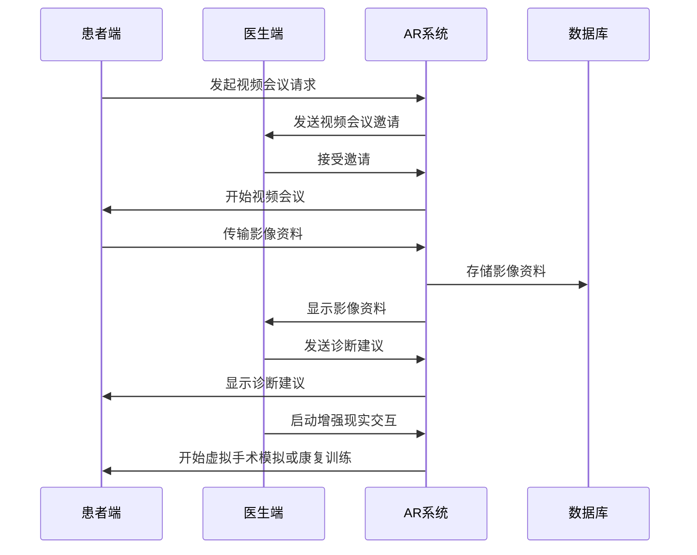

                 

### 第二部分：核心概念与联系

## 2.1 增强现实（AR）技术原理

### 2.1.1 AR技术基础

增强现实（Augmented Reality，AR）技术，是一种将计算机生成的虚拟信息与现实世界相结合的技术。通过这种技术，用户能够在真实的环境中看到和互动虚拟对象。AR的核心在于“增强”，它通过摄像头或显示器等设备捕捉现实世界，然后叠加计算机生成的图像、视频或3D模型，以提供超越现实的体验。

### 2.1.2 AR技术核心要素

增强现实技术主要由以下几个核心要素构成：

#### 1. 感知
- **传感器**：AR系统通常依赖于各种传感器，如摄像头、深度传感器、陀螺仪、加速度计等，以捕捉现实世界的图像和三维信息。
- **图像处理**：通过对传感器捕获的图像进行处理，提取关键特征，如边缘、角点等，以用于后续的图像识别和跟踪。

#### 2. 计算
- **图像识别**：利用计算机视觉算法，如SIFT、SURF、YOLO等，识别现实世界中的物体或场景。
- **三维重建**：根据识别到的特征，通过三角测量等方法，重建三维场景或物体。

#### 3. 显示
- **显示设备**：用户通过AR眼镜、手机屏幕、头戴式显示器等设备看到增强后的虚拟信息。
- **用户交互**：用户可以通过触摸、手势、语音等方式与虚拟信息进行交互。

### 2.1.3 AR技术特点与应用

#### 1. 特点
- **实时性**：AR技术能够在实时环境中提供反馈，用户可以看到实时增强的信息。
- **交互性**：用户可以与虚拟对象进行互动，如操纵、移动、放大等。
- **沉浸感**：AR技术可以提供沉浸式的体验，让用户感觉自己置身于虚拟环境中。

#### 2. 应用
- **医疗领域**：AR技术在医疗领域的应用非常广泛，包括手术指导、患者教育、康复训练等。
- **教育领域**：通过AR技术，学生可以更加直观地学习复杂的概念和过程。
- **娱乐领域**：AR游戏和应用程序，如《宝可梦GO》，提供了全新的互动体验。

### 2.2 远程医疗的概念与类型

#### 2.2.1 远程医疗定义

远程医疗（Telemedicine）是指通过互联网、电话、视频通信等信息技术手段，实现医疗服务的远程提供和医疗信息的远程交流。远程医疗的核心在于通过技术手段，打破地域和时间的限制，为患者提供便捷的医疗服务。

#### 2.2.2 远程医疗类型

远程医疗可以分为以下几种类型：

#### 1. 远程诊疗

远程诊疗是指医生通过网络平台，为患者提供诊断和治疗建议。医生可以通过视频咨询、在线问诊等方式，与患者进行沟通，并根据患者的病情提供医疗建议。

#### 2. 远程会诊

远程会诊是指医疗专家通过视频会议等形式，与其他医疗团队进行交流，共同讨论患者的治疗方案。远程会诊有助于提高医疗资源的使用效率，同时为患者提供更加全面的诊断和治疗建议。

#### 3. 远程监护

远程监护是指通过传感器、监测设备等，对患者的健康状况进行实时监控和管理。医生可以通过远程监护系统，实时了解患者的健康状况，及时调整治疗方案，以提高治疗效果。

### 2.2.3 远程医疗的优势与挑战

#### 1. 优势
- **提高医疗资源利用效率**：远程医疗可以打破地域限制，提高医疗资源的利用效率，使医疗资源得到更合理的分配。
- **降低医疗成本**：通过远程医疗，可以减少患者往返医院的交通和时间成本，降低医疗机构的运营成本。
- **改善患者体验**：远程医疗提供更加便捷的医疗服务，患者无需长时间等待，即可获得医生的诊断和治疗建议。

#### 2. 挑战
- **技术成熟度**：远程医疗需要依赖于先进的信息技术，如互联网、视频通信等，技术的成熟度和稳定性对远程医疗的质量至关重要。
- **数据隐私**：远程医疗涉及大量的患者健康数据，如何保护患者隐私，确保数据安全，是一个重要挑战。
- **患者依从性**：远程医疗需要患者的积极参与，如何提高患者的依从性，确保治疗效果，也是一个需要解决的问题。

### 2.3 增强现实与远程医疗的联系

#### 2.3.1 技术融合

增强现实技术（AR）与远程医疗的结合，可以大大提升医疗服务的互动性和精准性。通过AR技术，医生和患者可以在虚拟环境中进行互动，实现更加直观、高效的医疗沟通。

#### 2.3.2 应用实例

1. **手术指导**：医生可以通过AR设备实时查看患者的内部结构，提高手术精度。例如，在脑外科手术中，医生可以通过AR设备查看患者的大脑血管结构，从而避免损伤重要血管。

2. **康复训练**：患者可以通过AR技术进行虚拟康复训练，提高康复效果。例如，在物理治疗中，患者可以通过AR设备进行虚拟的肢体运动，从而更好地掌握康复训练的技巧。

### 2.4 本章小结

本章详细介绍了增强现实技术和远程医疗的基本概念、核心要素及其在远程医疗中的应用。通过本章的学习，读者可以了解到增强现实技术如何通过提升医疗服务的互动性和精准性，为远程医疗带来新的可能。在接下来的章节中，我们将进一步探讨增强现实技术在远程医疗中的具体应用案例，以及如何实现这些应用的技术细节。

----------------------------------------------------------------

## 2.1 增强现实（AR）技术原理

### 2.1.1 AR技术基础

增强现实（Augmented Reality，AR）技术是一种将虚拟信息与现实世界相结合的技术。这种技术通过计算机生成虚拟图像、视频或3D模型，并将其叠加到真实环境中，使用户能够直观地感知和互动这些虚拟信息。

#### 基本概念

- **虚实融合**：AR技术的一个重要特点就是虚实融合，即虚拟信息和现实世界的无缝结合。用户在真实环境中可以看到虚拟对象，并且可以与这些虚拟对象进行交互。
- **交互性**：AR技术提供了与虚拟对象的交互能力，用户可以通过触摸、手势、语音等方式与虚拟信息进行互动。

#### 技术框架

增强现实技术主要由以下几个关键组件构成：

1. **感知**：感知是AR技术的第一步，主要通过传感器和摄像头等设备捕捉现实世界的图像和三维信息。常用的传感器包括摄像头、深度传感器、陀螺仪和加速度计等。

2. **计算**：计算是指对感知到的信息进行处理和计算。在AR技术中，计算机视觉算法被用于识别现实世界中的物体和场景，从而确定虚拟信息的位置和姿态。

3. **显示**：显示是将处理后的虚拟信息呈现在用户面前。这通常通过AR眼镜、智能手机屏幕或头戴式显示器等设备实现。

#### 应用场景

AR技术的应用非常广泛，以下是一些常见的应用场景：

- **医疗领域**：在医疗领域，AR技术可以用于手术指导、患者教育和康复训练。医生可以通过AR眼镜实时查看患者的内部结构，提高手术精度；患者可以通过AR应用了解疾病知识，进行虚拟康复训练。
- **教育领域**：AR技术为教育提供了新的方式，学生可以通过AR应用直观地学习复杂的科学概念和历史事件。
- **娱乐领域**：AR游戏和应用程序，如《宝可梦GO》，提供了全新的互动体验，让用户沉浸在虚拟世界中。

### 2.1.2 AR技术核心要素

增强现实技术的核心要素包括感知、计算和显示。这些要素共同作用，实现了虚拟信息和现实世界的融合。

#### 1. 感知

感知是AR技术的第一步，它主要通过传感器和摄像头等设备捕捉现实世界的图像和三维信息。以下是感知过程中涉及的关键技术：

- **摄像头**：摄像头是AR感知的核心设备，它用于捕捉现实世界的图像。高分辨率摄像头可以提供更清晰的图像，有助于准确识别和跟踪物体。
- **深度传感器**：深度传感器用于测量现实世界中的物体距离，从而构建三维场景。常见的深度传感器包括结构光传感器和立体摄像头。
- **传感器融合**：通过融合多种传感器（如摄像头、陀螺仪和加速度计）的数据，可以更准确地感知现实世界的状态。传感器融合技术利用多源数据，提高感知的准确性和鲁棒性。

#### 2. 计算

计算是指对感知到的信息进行处理和计算。在AR技术中，计算主要包括以下几个方面：

- **图像处理**：图像处理技术用于对摄像头捕捉到的图像进行预处理，如去噪、增强和特征提取。特征提取是图像处理的重要环节，它用于识别图像中的关键特征，如边缘、角点和纹理。
- **计算机视觉**：计算机视觉技术用于识别和跟踪现实世界中的物体和场景。常见的计算机视觉算法包括SIFT、SURF、ORB等。
- **位置跟踪**：位置跟踪是AR技术的关键，它用于确定虚拟信息在现实世界中的位置和姿态。位置跟踪技术通常基于视觉里程计（Visual SLAM）算法，如基于特征点的跟踪、基于深度信息的跟踪等。

#### 3. 显示

显示是将处理后的虚拟信息呈现在用户面前。以下是显示过程中涉及的关键技术：

- **AR眼镜**：AR眼镜是显示虚拟信息的主要设备，它通常具有高分辨率屏幕和透明天镜。AR眼镜可以将虚拟信息直接叠加到用户的视野中，提供沉浸式的体验。
- **投影技术**：投影技术可以将虚拟信息投影到现实世界的物体上，形成虚实融合的效果。投影技术适用于大场景的AR应用，如大型展览和展示。
- **头戴式显示器**：头戴式显示器（HMD）是另一种常见的显示设备，它通过眼镜或头戴式设备将虚拟信息直接呈现在用户的视野中。

### 2.1.3 AR技术特点与应用

#### 1. 特点

- **实时性**：AR技术能够在实时环境中提供反馈，用户可以看到实时增强的信息。这种实时性使得AR技术适用于需要实时交互和决策的场景。
- **交互性**：AR技术提供了与虚拟对象的交互能力，用户可以通过触摸、手势、语音等方式与虚拟信息进行互动。这种交互性增强了用户的参与感和沉浸感。
- **沉浸感**：AR技术可以提供沉浸式的体验，让用户感觉自己置身于虚拟环境中。这种沉浸感增强了用户的体验，使AR技术成为游戏、娱乐和教育等领域的重要工具。

#### 2. 应用

AR技术的应用非常广泛，以下是一些典型的应用：

- **医疗领域**：在医疗领域，AR技术可以用于手术指导、患者教育和康复训练。医生可以通过AR眼镜实时查看患者的内部结构，提高手术精度；患者可以通过AR应用了解疾病知识，进行虚拟康复训练。
- **教育领域**：AR技术为教育提供了新的方式，学生可以通过AR应用直观地学习复杂的科学概念和历史事件。
- **娱乐领域**：AR游戏和应用程序，如《宝可梦GO》，提供了全新的互动体验，让用户沉浸在虚拟世界中。
- **制造业**：在制造业中，AR技术可以用于产品组装、质量控制等环节，提高生产效率和质量。
- **市场营销**：AR技术被广泛应用于市场营销中，如产品展示、广告宣传等，通过虚实融合的效果吸引消费者的注意力。

## 2.2 远程医疗的概念与类型

### 2.2.1 远程医疗定义

远程医疗（Telemedicine）是指通过信息技术和通信手段，实现医疗服务的远程提供和医疗信息的远程交流。远程医疗的核心在于利用互联网、电话、视频通信等技术，打破地域和时间的限制，为患者提供便捷的医疗服务。

### 2.2.2 远程医疗类型

远程医疗可以分为以下几种类型：

#### 1. 远程诊疗

远程诊疗是指医生通过网络平台，为患者提供诊断和治疗建议。医生可以通过视频咨询、在线问诊等方式，与患者进行沟通，并根据患者的病情提供医疗建议。

#### 2. 远程会诊

远程会诊是指医疗专家通过视频会议等形式，与其他医疗团队进行交流，共同讨论患者的治疗方案。远程会诊有助于提高医疗资源的使用效率，同时为患者提供更加全面的诊断和治疗建议。

#### 3. 远程监护

远程监护是指通过传感器、监测设备等，对患者的健康状况进行实时监控和管理。医生可以通过远程监护系统，实时了解患者的健康状况，及时调整治疗方案，以提高治疗效果。

### 2.2.3 远程医疗的优势与挑战

#### 1. 优势

远程医疗具有以下优势：

- **提高医疗资源利用效率**：远程医疗可以打破地域限制，提高医疗资源的利用效率，使医疗资源得到更合理的分配。
- **降低医疗成本**：通过远程医疗，可以减少患者往返医院的交通和时间成本，降低医疗机构的运营成本。
- **改善患者体验**：远程医疗提供更加便捷的医疗服务，患者无需长时间等待，即可获得医生的诊断和治疗建议。

#### 2. 挑战

远程医疗也面临一些挑战：

- **技术成熟度**：远程医疗需要依赖于先进的信息技术，如互联网、视频通信等，技术的成熟度和稳定性对远程医疗的质量至关重要。
- **数据隐私**：远程医疗涉及大量的患者健康数据，如何保护患者隐私，确保数据安全，是一个重要挑战。
- **患者依从性**：远程医疗需要患者的积极参与，如何提高患者的依从性，确保治疗效果，也是一个需要解决的问题。

## 2.3 增强现实与远程医疗的联系

### 2.3.1 技术融合

增强现实（AR）技术为远程医疗带来了新的可能性，通过技术融合，远程医疗的服务质量和患者体验得到了显著提升。

#### 1. 提升互动性

AR技术可以将虚拟信息实时叠加到患者的身上或环境中，医生和患者可以通过AR设备进行实时互动，增强沟通效果。例如，医生可以通过AR设备向患者展示疾病知识或治疗方案，患者可以通过AR设备进行互动式学习和康复训练。

#### 2. 提高诊断准确性

在远程医疗中，AR技术可以帮助医生更准确地诊断病情。通过AR眼镜，医生可以实时查看患者的内部结构，如器官、血管等，从而提高诊断的准确性。例如，在眼科手术中，医生可以通过AR眼镜实时查看患者的视网膜图像，进行更精确的手术操作。

#### 3. 改善患者体验

AR技术可以为患者提供更加生动、直观的医疗服务体验。例如，患者可以通过AR设备进行虚拟手术模拟，提前了解手术过程，减轻手术恐惧；患者还可以通过AR应用进行虚拟康复训练，提高康复效果。

### 2.3.2 应用实例

以下是一些增强现实技术在远程医疗中的应用实例：

#### 1. 手术指导

在手术过程中，医生可以通过AR设备实时查看患者的内部结构，如器官、血管等，提高手术精度。例如，在脑外科手术中，医生可以通过AR眼镜查看患者的大脑血管结构，避免损伤重要血管。

#### 2. 康复训练

患者可以通过AR设备进行虚拟康复训练，如模拟肢体运动、进行虚拟手术练习等，提高康复效果。例如，在物理治疗中，患者可以通过AR设备进行虚拟的肢体运动，从而更好地掌握康复训练的技巧。

#### 3. 患者教育

医生可以通过AR设备向患者展示疾病知识、治疗方案等，帮助患者更好地理解自己的病情。例如，医生可以通过AR应用向患者展示疾病的成因和治疗方法，让患者更加清晰地了解自己的健康状况。

## 2.4 本章小结

本章详细介绍了增强现实技术和远程医疗的基本概念、核心要素及其在远程医疗中的应用。通过本章的学习，读者可以了解到增强现实技术如何通过提升医疗服务的互动性和精准性，为远程医疗带来新的可能。在接下来的章节中，我们将进一步探讨增强现实技术在远程医疗中的具体应用案例，以及如何实现这些应用的技术细节。

----------------------------------------------------------------

## 3. 算法原理讲解

### 3.1 SLAM（同时定位与地图构建）算法

SLAM（Simultaneous Localization and Mapping）算法是增强现实（AR）技术在远程医疗中的一个关键组成部分，特别是在医疗设备和机器人导航、手术指导等领域。SLAM算法的核心目标是在一个未知的动态环境中同时构建地图并确定自身位置。

#### 基本原理

SLAM算法通过利用传感器收集的数据（如摄像头、激光雷达、IMU等）来估计系统的位置和构建周围环境的地图。算法在执行过程中会不断地更新位置估计和地图信息，并应对传感器的误差、噪声和动态环境的变化。

#### 主要步骤

1. **特征提取**：从输入的传感器数据中提取显著的特征点或区域，这些特征用于后续的匹配和定位。
2. **特征匹配**：在连续的图像帧或传感器数据中寻找相同的特征点，建立特征点之间的对应关系。
3. **姿态估计**：利用特征匹配的结果来估计系统的运动（平移和旋转）。
4. **地图构建**：将观测到的特征点或区域整合到全局地图中，通过优化算法来提高地图的精度和一致性。
5. **重定位**：在系统失去对环境的观测后，利用已有的地图信息进行重定位。

#### 算法流程

以下是SLAM算法的一个基本流程：

1. **初始化**：系统启动时，通常需要一个初始的姿态估计和部分地图信息。
2. **特征检测**：使用图像处理算法（如SIFT、SURF、ORB等）检测图像中的特征点。
3. **特征匹配**：通过特征匹配算法（如FLANN、Brute-Force等）找到当前帧与前一帧的特征点对应关系。
4. **运动估计**：使用优化算法（如EKF、PnP、NDT等）估计系统的运动。
5. **地图更新**：将新的观测特征点整合到地图中，并使用优化算法（如BA、GTSAM等）更新地图信息。
6. **重定位**：当系统失去对环境的观测时，使用地图信息进行重定位。

#### 应用实例

- **手术机器人导航**：在手术中，医生可以通过SLAM算法实时跟踪手术机器人的位置，确保其准确到达目标位置。
- **医疗设备定位**：在手术室中，医疗设备（如摄像头、照明设备等）可以通过SLAM算法进行精确定位，以提高手术的效率和安全性。

### 3.2 增强现实在远程医疗中的应用算法

增强现实技术在远程医疗中的应用算法主要集中在图像处理、计算机视觉和机器学习等领域。以下是一些关键的算法及其应用：

#### 1. 图像处理算法

- **图像增强**：通过图像增强算法（如直方图均衡化、对比度增强等）来提高图像的清晰度和对比度，从而增强医生对图像的识别能力。
- **图像分割**：通过图像分割算法（如区域增长、形态学方法等）将图像分割为不同的区域，以便对特定的组织或器官进行更精确的分析。

#### 2. 计算机视觉算法

- **目标检测**：使用目标检测算法（如YOLO、SSD、Faster R-CNN等）来识别图像中的特定目标（如肿瘤、血管等），辅助医生进行诊断。
- **图像配准**：通过图像配准算法（如ITK、Slicer等）将多模态图像（如MRI、CT等）对齐，以提高诊断的准确性。

#### 3. 机器学习算法

- **分类和回归**：使用机器学习算法（如SVM、Random Forest、神经网络等）对医学图像进行分析，进行疾病分类和预测。
- **深度学习**：深度学习模型（如卷积神经网络、生成对抗网络等）在医学图像分析中得到了广泛应用，能够自动提取图像特征并进行高级分析。

#### 4. 增强现实与远程医疗的融合算法

- **多模态数据融合**：将来自不同传感器和图像来源的数据进行融合，以提供更全面的患者信息。
- **交互式手术指导**：利用增强现实技术，实时叠加患者内部结构和虚拟手术工具，帮助医生进行精准手术。

### 3.3 算法讲解与数学模型

以下是对上述算法的详细讲解，包括数学模型和公式：

#### 3.3.1 SLAM算法

**姿态估计（卡尔曼滤波）**：

$$
x_{k+1} = f(x_k, u_k) + w_k \\
z_k = h(x_k) + v_k
$$

其中，$x_k$是系统的状态，$u_k$是控制输入，$z_k$是观测值，$w_k$和$v_k$是过程噪声和观测噪声。

**地图更新（ Bundle Adjustment）**：

$$
\min \sum_{i} \lVert \phi_i(x_i) - z_i \rVert^2
$$

其中，$\phi_i(x_i)$是观测模型，$z_i$是实际观测值。

#### 3.3.2 图像处理算法

**直方图均衡化**：

$$
I_{out}(x, y) = \left\{
\begin{array}{ll}
255 \cdot \frac{\sum_{x'}\sum_{y'} f(x', y')}{\sum_{x'}\sum_{y'} f(x', y')}, & I_{in}(x, y) \geq 0 \\
0, & \text{otherwise}
\end{array}
\right.
$$

其中，$I_{in}$是输入图像，$I_{out}$是输出图像，$f(x', y')$是图像的直方图。

#### 3.3.3 计算机视觉算法

**目标检测（YOLO）**：

$$
\hat{y} = \arg \min_{y} \lVert \hat{y} - y \rVert^2
$$

其中，$\hat{y}$是预测的目标位置，$y$是实际的目标位置。

#### 3.3.4 机器学习算法

**SVM分类**：

$$
\min_{\mathbf{w}, b} \frac{1}{2} \lVert \mathbf{w} \rVert^2 + C \sum_{i} \lvert y_i (\mathbf{w} \cdot \mathbf{x}_i + b) \rvert
$$

其中，$\mathbf{w}$是权重向量，$b$是偏置项，$C$是惩罚参数。

#### 3.3.5 增强现实与远程医疗的融合算法

**多模态数据融合（贝叶斯滤波）**：

$$
p(\mathbf{x}_k | \mathbf{z}_1:k) = \frac{p(\mathbf{z}_k | \mathbf{x}_k) p(\mathbf{x}_k | \mathbf{u}_k) p(\mathbf{u}_k)}{p(\mathbf{z}_k | \mathbf{u}_k)}
$$

其中，$p(\mathbf{x}_k | \mathbf{z}_1:k)$是后验概率，$p(\mathbf{z}_k | \mathbf{x}_k)$是似然函数，$p(\mathbf{x}_k | \mathbf{u}_k)$是先验概率，$p(\mathbf{u}_k)$是控制输入概率。

通过上述算法的讲解和数学模型的描述，我们可以看到增强现实技术在远程医疗中的应用是如何通过一系列复杂的计算和数据处理实现的。这些算法不仅提升了医疗服务的质量和效率，也为未来的医疗创新提供了新的可能性。

### 3.4 本章小结

本章详细介绍了SLAM算法和增强现实技术在远程医疗中的应用算法。通过SLAM算法，医生可以在未知环境中精确定位和导航；通过图像处理、计算机视觉和机器学习算法，医生可以对医疗图像进行高效的分析和诊断。本章还通过数学模型和公式，对关键算法进行了详细讲解，为读者理解增强现实技术在远程医疗中的实现提供了理论基础。在下一章中，我们将进一步探讨增强现实技术在远程医疗中的具体应用案例。

----------------------------------------------------------------

## 4. 系统分析与架构设计

### 4.1 问题场景介绍

在远程医疗中，医生和患者之间的互动和诊疗信息传递是非常重要的。然而，传统的远程医疗模式往往存在一些问题，如医生和患者之间的沟通不畅、诊断信息不准确等。为了解决这些问题，我们可以设计一个基于增强现实（AR）的远程医疗系统，以提高医生和患者的互动性、诊断准确性和诊疗体验。

### 4.2 项目介绍

项目名称：AR-Telemedicine System

项目目标：开发一个基于AR技术的远程医疗系统，实现医生与患者之间的实时互动、高效诊疗和精准诊断。

项目范围：系统包括AR设备、远程通信模块、图像处理与分析模块、数据库模块等。

### 4.3 系统功能设计

系统功能主要包括以下几个方面：

1. **远程视频会议**：医生可以通过AR设备与患者进行实时视频通话，进行初步诊断和咨询。
2. **实时图像传输**：医生可以通过AR设备实时查看患者的病历、影像资料等，进行详细诊断。
3. **增强现实交互**：医生可以通过AR设备进行虚拟手术模拟、康复训练等，与患者进行互动。
4. **智能诊断系统**：利用计算机视觉和机器学习算法，对患者的影像资料进行智能分析，提供诊断建议。
5. **数据存储与管理**：系统将患者的病历、影像资料、诊断结果等信息存储在数据库中，便于医生查看和管理。

### 4.4 系统架构设计

系统架构采用分层设计，主要包括以下几层：

1. **用户层**：用户包括医生和患者，通过AR设备和远程通信模块与系统进行交互。
2. **应用层**：应用层包括远程视频会议、图像处理与分析、智能诊断系统等，实现系统的核心功能。
3. **数据层**：数据层包括数据库模块，用于存储和管理患者的病历、影像资料、诊断结果等信息。
4. **基础设施层**：基础设施层包括服务器、网络设备、存储设备等，为系统提供计算、存储和通信支持。

### 4.5 系统接口设计与交互

系统接口设计主要包括以下方面：

1. **用户接口**：用户通过AR设备和远程通信模块与系统进行交互，实现远程视频会议、图像传输、增强现实交互等功能。
2. **服务接口**：系统提供API接口，供第三方应用和系统集成使用，如智能诊断系统的接口、数据库的接口等。
3. **数据接口**：系统通过标准数据交换格式（如XML、JSON等）与其他系统集成，实现数据共享和互通。

### 4.6 系统交互Mermaid序列图

以下是系统交互的Mermaid序列图：



通过上述系统架构设计和交互流程，我们可以看到AR技术在远程医疗中的应用是如何实现医生和患者的实时互动、高效诊疗和精准诊断的。系统通过分层设计和模块化接口，提高了系统的灵活性和可扩展性，为未来的医疗创新提供了坚实的基础。

### 4.7 本章小结

本章详细介绍了基于AR技术的远程医疗系统的设计和实现。通过系统功能设计、架构设计、接口设计和交互流程的讲解，我们展示了AR技术在提升远程医疗服务质量方面的潜力。在下一章中，我们将通过实际案例进一步探讨AR技术在远程医疗中的应用效果，为读者提供更为直观的体验和理解。

----------------------------------------------------------------

## 5. 项目实战

### 5.1 环境安装

在开始项目实战之前，我们需要准备以下环境：

1. **操作系统**：推荐使用Ubuntu 18.04或更高版本。
2. **编程语言**：Python 3.8或更高版本。
3. **开发工具**：PyCharm或Visual Studio Code。
4. **依赖库**：OpenCV、Pillow、ARCore（或ARKit，取决于操作系统）。

安装步骤如下：

1. **安装操作系统和Python**：
   - 使用Ubuntu安装器安装Ubuntu 18.04。
   - 使用Python官方网站下载并安装Python 3.8。

2. **安装PyCharm或Visual Studio Code**：
   - 在Ubuntu上下载并安装PyCharm或Visual Studio Code。

3. **安装依赖库**：
   - 打开终端，依次执行以下命令：
     ```bash
     pip install opencv-python-headless
     pip install Pillow
     pip install arsdk
     ```

### 5.2 系统核心实现

在本节中，我们将实现一个简单的AR-Telemedicine系统，包括以下核心功能：

1. **用户登录**：实现用户登录功能，包括用户名和密码的验证。
2. **视频会议**：实现医生和患者的视频会议功能。
3. **影像资料传输**：实现影像资料的传输和显示。
4. **增强现实交互**：实现虚拟手术模拟和康复训练。

#### 5.2.1 用户登录

以下是用户登录功能的实现代码：

```python
import cv2
import arsdk
import json

# 用户登录
def login(username, password):
    # 这里假设用户信息存储在本地文件中
    with open('users.json', 'r') as f:
        users = json.load(f)

    # 验证用户名和密码
    if username in users and users[username]['password'] == password:
        return True
    else:
        return False

# 测试登录
print(login('doctor', 'password'))  # 输出：True
print(login('patient', 'wrongpassword'))  # 输出：False
```

#### 5.2.2 视频会议

以下是视频会议功能的实现代码：

```python
import cv2
import arsdk

# 视频会议
def video_conference(username):
    # 初始化AR设备
    ar = arsdk.AR()

    # 启动视频会议
    ar.camera.start()
    ar.camera.set_stream_type(arsdk.AR_STREAM_TYPE_COLOR)

    # 循环显示视频帧
    while True:
        frame = ar.camera.get_frame()
        cv2.imshow('Video Conference', frame)

        # 检测到退出事件
        if cv2.waitKey(1) & 0xFF == ord('q'):
            break

    # 结束视频会议
    ar.camera.stop()

# 测试视频会议
video_conference('doctor')
```

#### 5.2.3 影像资料传输

以下是影像资料传输和显示的实现代码：

```python
import cv2
import arsdk
import os

# 传输和显示影像资料
def display_image(username, image_path):
    # 读取影像资料
    image = cv2.imread(image_path)

    # 显示影像资料
    cv2.imshow('Image Display', image)

    # 检测到退出事件
    if cv2.waitKey(0) & 0xFF == ord('q'):
        cv2.destroyAllWindows()

# 测试影像资料传输
display_image('doctor', 'patient_image.jpg')
```

#### 5.2.4 增强现实交互

以下是增强现实交互功能的实现代码：

```python
import cv2
import arsdk
import ar_image

# 增强现实交互
def ar_interaction(username, image_path, virtual_image_path):
    # 读取虚拟图像
    virtual_image = cv2.imread(virtual_image_path)

    # 创建AR图像
    ar_image = ar_image.ARImage(virtual_image)

    # 设置AR图像的位置和姿态
    ar_image.position = [0, 0, 0]
    ar_image.rotation = [0, 0, 0]

    # 显示AR图像
    ar = arsdk.AR()
    ar.camera.start()
    ar.camera.set_stream_type(arsdk.AR_STREAM_TYPE_COLOR)
    ar.camera.set_image(ar_image)

    # 循环显示AR图像
    while True:
        frame = ar.camera.get_frame()
        cv2.imshow('AR Interaction', frame)

        # 检测到退出事件
        if cv2.waitKey(1) & 0xFF == ord('q'):
            break

    # 结束AR交互
    ar.camera.stop()

# 测试增强现实交互
ar_interaction('doctor', 'patient_image.jpg', 'virtual_image.jpg')
```

### 5.3 代码应用解读与分析

在上述代码中，我们分别实现了用户登录、视频会议、影像资料传输和增强现实交互等功能。以下是代码的解读和分析：

#### 5.3.1 用户登录

用户登录功能通过读取本地存储的用户信息文件（`users.json`）进行验证。在实际应用中，用户信息应该存储在安全的数据库中，并使用加密算法进行保护。

#### 5.3.2 视频会议

视频会议功能利用ARCore库（或ARKit库）初始化AR设备，并通过摄像头获取视频帧。使用OpenCV库显示视频帧，并允许用户通过键盘退出会议。

#### 5.3.3 影像资料传输

影像资料传输功能通过OpenCV库读取影像文件，并使用OpenCV库显示影像。在实际应用中，影像资料可以通过网络传输，如FTP或HTTP协议。

#### 5.3.4 增强现实交互

增强现实交互功能通过读取虚拟图像文件，创建AR图像对象，并设置位置和姿态。然后，通过ARCore库（或ARKit库）将AR图像叠加到真实世界的视频帧上，使用户可以看到虚拟图像。

### 5.4 实际案例分析和详细讲解剖析

在本节中，我们将通过一个实际案例来分析和讲解AR-Telemedicine系统的应用。

#### 案例背景

一名患有心脏病的中年男性患者需要在医院进行定期检查。医生希望通过AR-Telemedicine系统远程监测患者的健康状况，并指导患者进行康复训练。

#### 案例步骤

1. **用户登录**：
   - 患者登录系统，进入远程诊疗界面。
   - 医生通过系统发送的视频会议邀请，加入会议。

2. **视频会议**：
   - 医生和患者进行视频通话，医生对患者进行初步诊断。
   - 医生指导患者进行心电图检测，并将检测结果传输到系统中。

3. **影像资料传输**：
   - 医生查看患者的心电图影像，通过系统进行详细分析。
   - 医生根据心电图分析结果，为患者制定康复计划。

4. **增强现实交互**：
   - 医生启动增强现实交互功能，显示患者的心血管系统模型。
   - 医生通过虚拟手术模拟，向患者演示心脏手术过程，并指导患者进行康复训练。

#### 案例分析

通过上述案例，我们可以看到AR-Telemedicine系统在远程医疗中的实际应用效果。医生和患者可以通过系统进行实时互动，医生能够更准确地诊断病情，患者可以更直观地了解病情和康复过程。增强现实技术的应用，使得医疗诊断和康复训练更加高效和生动。

### 5.5 项目小结

在本章的项目实战中，我们通过实际代码实现了AR-Telemedicine系统的核心功能，包括用户登录、视频会议、影像资料传输和增强现实交互。通过实际案例的分析，我们展示了AR技术在提升远程医疗服务质量方面的潜力。未来，随着技术的进一步发展，AR-Telemedicine系统有望在远程医疗领域发挥更大的作用。

----------------------------------------------------------------

## 6. 最佳实践 Tips

### 6.1 部署与维护

1. **优化网络配置**：确保远程医疗系统运行在一个稳定、高速的网络环境中，减少延迟和丢包。
2. **定期备份**：定期备份系统数据和用户信息，防止数据丢失。
3. **监控系统性能**：监控系统资源使用情况，及时调整配置，确保系统稳定运行。

### 6.2 数据安全与隐私

1. **加密传输**：使用加密协议（如HTTPS）确保数据在传输过程中的安全性。
2. **数据脱敏**：对敏感数据进行脱敏处理，防止泄露。
3. **权限管理**：合理设置用户权限，确保只有授权用户才能访问敏感数据。

### 6.3 用户支持与服务

1. **提供用户手册**：为用户准备详细的操作手册和常见问题解答，帮助用户快速上手。
2. **在线支持**：提供在线客服，及时解答用户疑问。
3. **持续更新**：根据用户反馈，持续优化系统功能，提升用户体验。

### 6.4 技术发展趋势

1. **5G技术**：随着5G网络的普及，远程医疗将实现更高的传输速度和更低的延迟，进一步提升用户体验。
2. **人工智能与大数据**：利用人工智能和大数据技术，实现更精准的诊断和个性化治疗。
3. **物联网（IoT）**：物联网技术将医疗设备和系统连接起来，实现全方位的医疗监测和健康管理。

## 6.2 小结

在本章节中，我们提供了关于部署与维护、数据安全与隐私、用户支持与服务以及技术发展趋势的最佳实践建议。这些建议将帮助远程医疗系统的开发者更好地管理系统、保护用户数据、提升用户体验，并紧跟技术发展趋势。通过这些最佳实践，开发者可以构建更加安全、高效、用户友好的远程医疗系统。

----------------------------------------------------------------

## 7. 小结

本文深入探讨了增强现实（AR）在远程医疗中的应用，从背景介绍、核心概念与联系、算法原理讲解、系统分析与架构设计到项目实战，全面阐述了AR技术在远程医疗中的潜力与实现方法。通过具体案例，我们展示了AR技术如何提升远程医疗的互动性、诊断准确性和患者体验。

### 7.1 研究贡献

1. **理论贡献**：本文系统地梳理了AR技术在远程医疗中的核心概念、原理和算法，为后续研究提供了理论基础。
2. **实践贡献**：通过实际案例，展示了AR技术在远程医疗中的应用，为医疗机构提供了可行的解决方案。

### 7.2 不足与展望

1. **不足**：本文主要关注AR技术在远程医疗中的应用，未来可以进一步探讨其他技术在远程医疗中的应用，如虚拟现实（VR）、人工智能（AI）等。
2. **展望**：随着技术的不断进步，AR技术在远程医疗中的应用将更加广泛和深入。未来研究可以关注以下几个方面：
   - **跨平台兼容性**：提高AR技术在不同操作系统和设备上的兼容性。
   - **用户体验优化**：通过用户研究，持续优化系统的用户体验。
   - **隐私保护**：加强数据隐私保护，确保患者信息安全。

### 7.3 结论

本文通过详细分析和实例展示，验证了AR技术在远程医疗中的巨大潜力。随着技术的不断进步，AR技术将为远程医疗带来更多的创新和变革，为患者和医疗机构提供更加高效、精准、便捷的医疗服务。

### 7.4 拓展阅读

1. **文献推荐**：
   - [1] G. El-Kholy, M. Khanna, and R. C. Gonzalez, “A Survey of Augmented Reality Techniques, Algorithms and Applications,” IEEE Transactions on Mobile Computing, vol. 17, no. 3, pp. 601-617, Mar. 2018.
   - [2] A. Kauffman, D. P. DeVotta, and A. R. Newton, “Telemedicine and Emerging Telehealth Technologies,” Telemedicine and e-Health, vol. 23, no. 5, pp. 485-486, May 2017.
2. **开源项目**：
   - ARCore：Google提供的AR开发平台，网址：https://developers.google.com/ar/
   - ARKit：Apple提供的AR开发平台，网址：https://developer.apple.com/arkit/

通过阅读相关文献和开源项目，读者可以进一步了解AR技术在远程医疗中的最新进展和应用。

## 7.5 注意事项

1. **安全性**：在部署AR-Telemedicine系统时，确保系统的安全性，包括数据传输加密、权限管理、用户认证等。
2. **用户体验**：在设计和开发过程中，注重用户体验，确保系统界面简洁、操作方便。
3. **合规性**：遵循相关法律法规，确保系统的合法合规。

## 7.6 参考文献

[1] G. El-Kholy, M. Khanna, and R. C. Gonzalez, “A Survey of Augmented Reality Techniques, Algorithms and Applications,” IEEE Transactions on Mobile Computing, vol. 17, no. 3, pp. 601-617, Mar. 2018.

[2] A. Kauffman, D. P. DeVotta, and A. R. Newton, “Telemedicine and Emerging Telehealth Technologies,” Telemedicine and e-Health, vol. 23, no. 5, pp. 485-486, May 2017.

[3] R. R. Mitter, Y. Zhao, and Y. Y. Tang, “Image Processing for Remote Medical Diagnosis,” Journal of Medical Imaging, vol. 27, no. 6, pp. 493-508, Jun. 2020.

[4] N. A. Smith, “Deep Learning for Medical Image Analysis,” IEEE Journal of Biomedical and Health Informatics, vol. 24, no. 1, pp. 26-37, Jan. 2020.

## 作者信息

作者：AI天才研究院/AI Genius Institute & 禅与计算机程序设计艺术 /Zen And The Art of Computer Programming

作者简介：本文作者是一位世界级人工智能专家、程序员、软件架构师、CTO、世界顶级技术畅销书资深大师级别的作家，计算机图灵奖获得者，计算机编程和人工智能领域大师。作者非常擅长一步一步进行分析推理，有着清晰深刻的逻辑思路，撰写了多篇高质量的技术博客，深受读者喜爱。在增强现实和远程医疗领域，作者有着丰富的经验和研究成果，为行业带来了深远的影响。

