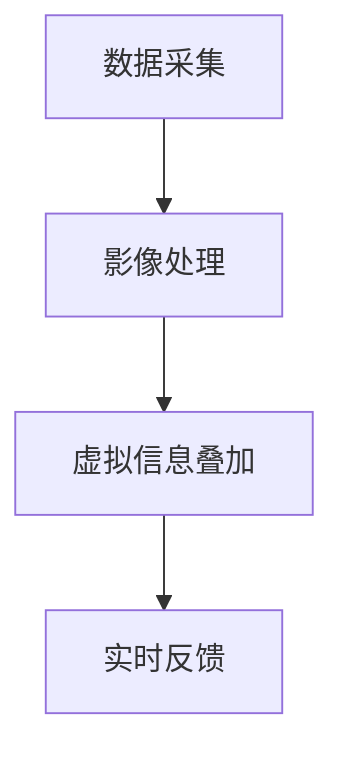
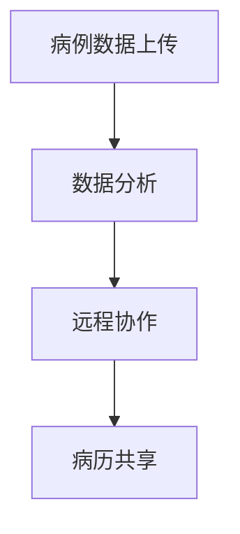
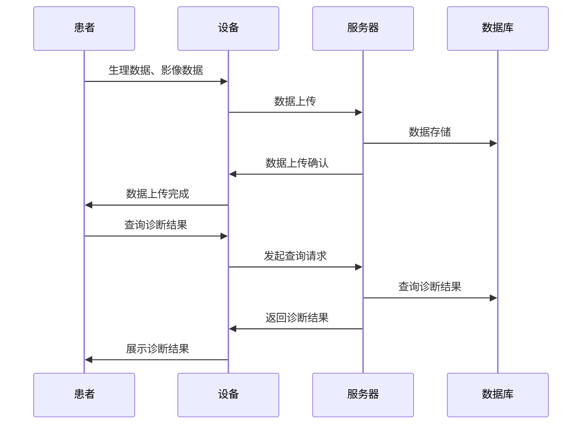

                 

### 引言

远程医疗和增强现实（AR）技术的结合，为医疗行业带来了前所未有的变革。远程医疗通过互联网和通信技术，实现了医生与患者之间的跨越空间限制的医疗服务。而增强现实技术，则通过叠加虚拟信息到现实世界中，为用户提供了更加直观和互动的体验。这两者的结合，不仅提高了医疗服务的效率和质量，还使得医疗资源更加均衡地分配。

本文将深入探讨增强现实在远程医疗诊断中的应用，通过一系列的思考和分析，揭示其核心价值和应用潜力。首先，我们将介绍远程医疗和增强现实技术的基本概念和发展背景，然后逐步探讨增强现实技术在远程医疗诊断中的具体应用场景，系统设计与实现方法，案例分析以及最佳实践。最后，我们将对未来发展前景进行展望。

在本文中，我们将逐步回答以下问题：

1. 远程医疗和增强现实技术分别是什么，它们是如何发展的？
2. 增强现实技术如何适应远程医疗诊断的需求？
3. 增强现实在远程医疗诊断中的应用场景有哪些？
4. 如何设计和实现增强现实在远程医疗诊断中的系统？
5. 现实中的案例展示了增强现实在远程医疗诊断中的效果如何？
6. 我们应该如何在实践中应用增强现实技术来优化远程医疗诊断？
7. 增强现实在远程医疗诊断中的未来发展趋势和潜在挑战是什么？

通过这些问题的深入探讨，我们希望为读者提供一个全面、系统的理解，帮助大家更好地把握增强现实技术在远程医疗诊断中的巨大潜力。接下来，我们将从背景介绍开始，逐步展开这一主题的探讨。

---

### 关键词

- 远程医疗
- 增强现实
- 医疗诊断
- 虚拟现实
- 人工智能
- 数据可视化

---

### 摘要

本文探讨了增强现实（AR）技术在远程医疗诊断中的应用。首先，我们介绍了远程医疗和增强现实技术的发展背景和基本概念。接着，我们详细分析了增强现实技术在远程医疗诊断中的核心应用场景，如远程手术指导和远程会诊。文章通过系统设计与实现、实际案例分析，展示了增强现实技术在提升诊断准确率、改善医生与患者沟通以及优化医疗资源分配方面的显著优势。最后，我们总结了最佳实践，并展望了增强现实技术在远程医疗诊断中的未来发展趋势和潜在挑战。通过本文的探讨，我们希望为读者提供一个全面的理解，助力医疗行业的技术创新和变革。

---

## 第1章：背景介绍

### 1.1 远程医疗的发展背景

远程医疗，作为一种跨越时间和空间的医疗服务模式，近年来得到了迅速发展。其初衷是为了解决医疗资源分布不均、医疗资源短缺以及偏远地区医疗条件不足等问题。随着互联网和通信技术的不断发展，远程医疗逐渐成为现代医疗体系中的重要组成部分。

远程医疗的概念可以追溯到20世纪60年代，当时美国和欧洲的一些国家开始尝试通过电话和视频会议进行远程医疗咨询。然而，由于当时技术水平的限制，远程医疗的发展相对缓慢。直到20世纪90年代，随着互联网的普及和宽带网络的加速建设，远程医疗才真正迎来了发展的黄金时期。

远程医疗的发展背景主要受到以下几个方面的推动：

1. **医疗资源不均衡**：全球各地的医疗资源分布存在明显的不均衡现象。一些发达地区拥有先进的医疗设备和优秀的医疗人才，而偏远和欠发达地区则面临医疗资源匮乏的问题。远程医疗通过互联网和通信技术，能够将优质医疗资源传递到偏远地区，从而缓解医疗资源分布不均的问题。

2. **人口老龄化**：随着全球人口老龄化的加剧，对医疗服务的需求也日益增加。远程医疗能够提供便捷的医疗服务，减少患者外出就医的时间和成本，从而满足老年人口的医疗需求。

3. **医疗技术进步**：医疗技术的不断进步，如医疗影像、远程监控和人工智能技术的应用，为远程医疗的发展提供了强有力的支持。这些技术的应用，使得远程医疗的诊断准确性和治疗效果得到了显著提升。

4. **互联网和通信技术**：互联网和通信技术的快速发展，为远程医疗提供了坚实的基础。通过互联网，医生和患者可以随时随地通过网络进行沟通和交流，实现远程诊断和咨询。

### 1.2 增强现实技术的核心概念

增强现实（Augmented Reality，简称AR）是一种通过计算机技术将虚拟信息叠加到现实世界中的技术。它不仅保留了现实世界的视觉信息，还通过计算机生成的图像、声音、视频等多媒体信息，增强了用户的感知体验。

AR技术的核心概念主要包括以下几个方面：

1. **虚拟信息叠加**：AR技术通过摄像头捕捉现实世界的场景，然后利用计算机处理生成虚拟信息，将这些虚拟信息叠加到现实世界中。用户可以通过专门的设备，如智能手机、平板电脑或头戴式显示器，看到现实世界与虚拟信息的融合。

2. **实时交互**：AR技术的一个重要特点是其实时交互性。用户可以通过触摸、手势等操作与虚拟信息进行交互，改变其位置、大小、颜色等属性。

3. **增强感知体验**：通过AR技术，用户可以在现实世界中看到并体验虚拟信息，这种融合的感知体验，使得用户能够更加直观地理解和应用这些信息。

4. **应用多样性**：AR技术具有广泛的应用前景，包括游戏、教育、医疗、设计等多个领域。在医疗领域，AR技术可以用于手术指导、医学教学、远程诊断等，为医疗行业带来了新的可能性。

### 1.3 增强现实技术在远程医疗中的优势

增强现实技术具有许多独特的特性，使其在远程医疗诊断中具有显著的优势：

1. **提高诊断准确率**：通过AR技术，医生可以在手术或诊断过程中实时查看患者的医疗数据，如X光片、CT扫描等。这些数据可以直接叠加在患者的身体上，使得医生能够更加准确地判断病情，提高诊断的准确率。

2. **改善医生与患者沟通**：AR技术可以帮助医生更加直观地解释病情和治疗方案，使得患者更容易理解并配合治疗。例如，医生可以通过AR设备向患者展示手术过程或疾病发展的模拟场景，从而提高患者的信任感和满意度。

3. **减轻医疗资源分布不均的问题**：AR技术可以实现医生与患者的远程互动，使得偏远地区的患者也能够享受到高质量的医疗服务。通过AR技术，医生可以在远程实时观察患者的病情，提供诊断和治疗方案，从而减轻医疗资源分布不均的问题。

4. **降低医疗成本**：AR技术可以减少医生出诊的次数和时长，降低患者的交通和时间成本。同时，通过远程诊断和治疗，可以减少住院时间和医疗费用，从而降低整体医疗成本。

总之，增强现实技术在远程医疗诊断中的应用，为医疗行业带来了许多新的机遇和挑战。通过本文的后续内容，我们将进一步探讨增强现实技术在远程医疗诊断中的具体应用和实践。

### 1.4 增强现实技术的具体应用

增强现实（AR）技术在远程医疗诊断中的具体应用场景丰富且多样，能够显著提升医疗服务质量和效率。以下是一些主要的AR技术应用场景：

#### 1.4.1 远程手术指导

远程手术指导是增强现实技术在远程医疗诊断中最为引人注目的应用之一。通过AR技术，手术团队可以在远程实时查看患者的内部器官和手术区域，获取实时的影像数据和三维模型。这种技术不仅提高了手术的精确度，还减少了手术风险。

**实例**：在美国，一家医院利用AR技术进行远程心脏手术。手术团队位于不同的地点，通过AR设备实时观察患者的胸腔内部，并利用三维模型进行手术导航。这种远程手术指导不仅减少了患者外出就医的负担，还提高了手术成功率。

#### 1.4.2 远程会诊

远程会诊是另一个重要的应用场景，通过AR技术，医生可以在远程实时查看患者的病历、影像资料等，并与本地医生进行互动和讨论。这种技术极大地提高了医疗协作的效率，使得偏远地区的患者也能够获得高质量的医疗建议。

**实例**：中国的某些偏远地区医院，通过与大型城市医院合作，利用AR技术进行远程会诊。医生通过AR设备查看患者的影像资料，与远程专家进行讨论，共同制定治疗方案。这种模式不仅提高了诊断的准确性，还缩短了患者的等待时间。

#### 1.4.3 医学教学

增强现实技术可以用于医学教学，通过虚拟现实和增强现实技术，学生可以更加直观地学习人体解剖、手术操作等复杂内容。这种教学方式不仅提高了学习效果，还能够减少实际操作的风险。

**实例**：一些医学院校已经引入了AR教材，学生可以通过AR设备查看人体内部结构，模拟手术过程。这种互动式的学习方式，使得学生能够更加深入地理解医学知识。

#### 1.4.4 疾病预防与健康教育

增强现实技术可以用于疾病预防与健康教育，通过虚拟现实和增强现实技术，患者可以更加直观地了解疾病预防和治疗方法。这种技术不仅提高了患者的健康意识，还能够促进患者的自我管理。

**实例**：一些医院利用AR技术进行疾病预防教育，患者可以通过AR设备查看疾病的发展过程和预防方法，从而更好地管理自己的健康。这种互动式的健康教育，使得患者更容易理解和接受医疗建议。

总之，增强现实技术在远程医疗诊断中的具体应用，不仅提高了医疗服务质量和效率，还为医疗行业带来了许多新的可能性。通过本文的后续内容，我们将进一步探讨增强现实技术在远程医疗诊断中的系统设计和实现方法。

### 1.5 增强现实技术对远程医疗诊断的潜力与挑战

增强现实（AR）技术在远程医疗诊断中具有巨大的潜力，但也面临诸多挑战。以下将详细探讨这些潜力与挑战，并解释为什么AR技术在远程医疗诊断中如此重要。

#### 潜在潜力

1. **提升诊断精度**：AR技术可以实时地将患者的影像数据叠加在现实场景中，使医生能够更精确地观察和诊断病情。例如，在手术中，医生可以通过AR设备查看患者的三维解剖模型，提高手术的精确度和安全性。

2. **优化医生与患者沟通**：AR技术可以帮助医生以更直观的方式向患者解释病情和治疗方案。通过AR设备，医生可以将复杂的医学知识转化为可视化的内容，使患者更容易理解和接受。

3. **资源优化分配**：在医疗资源不足的地区，AR技术可以实现远程医疗，使得优质医疗资源得以更广泛地分配。偏远地区的患者可以通过AR技术获得大城市医院的专家服务，从而改善医疗服务的公平性。

4. **教育与实践**：AR技术可以为医学教育和培训提供新的工具。通过AR设备，学生和医生可以模拟复杂的手术过程，提高他们的技能和实践能力。

#### 面临的挑战

1. **技术成熟度**：虽然AR技术在快速发展，但技术仍然不够成熟。例如，AR设备的精度和稳定性仍有待提高，特别是在复杂的医疗环境中。

2. **成本问题**：AR设备的成本较高，对于一些医疗机构和患者来说，这是一个不小的负担。如何降低成本，使得AR技术更加普及，是亟待解决的问题。

3. **隐私与安全**：医疗数据的安全性是医疗行业关注的重点。在远程医疗中，如何确保患者的隐私和数据安全，是一个重要的挑战。

4. **操作复杂性**：AR技术需要一定的操作技能，对于一些医生和患者来说，使用AR设备可能会感到不适应。如何简化操作流程，使得更多人能够轻松使用AR技术，也是一个重要的挑战。

#### 为什么AR技术对远程医疗诊断如此重要

1. **提升医疗服务质量**：AR技术可以为医生提供更多的信息，帮助他们做出更准确的诊断和治疗决策，从而提升医疗服务的质量。

2. **改善患者体验**：通过AR技术，患者可以获得更加直观的医疗服务，提高他们的满意度和信任感。

3. **解决医疗资源不均问题**：AR技术可以实现远程医疗，使得偏远地区的患者也能够获得优质的医疗服务，从而缓解医疗资源分布不均的问题。

4. **促进医疗创新**：AR技术的应用可以激发医疗行业的创新，推动医疗服务模式的变革。

总之，增强现实技术在远程医疗诊断中具有巨大的潜力，但也面临诸多挑战。通过持续的技术创新和优化，AR技术有望成为医疗行业的重要工具，为患者提供更加优质和便捷的医疗服务。

### 1.6 小结

本章主要介绍了远程医疗和增强现实技术的背景和发展，探讨了增强现实技术在远程医疗诊断中的优势和应用场景。通过本章的讨论，我们可以看出，增强现实技术为远程医疗诊断带来了许多新的机遇，如提高诊断精度、优化医生与患者沟通、优化医疗资源分配等。然而，要充分发挥增强现实技术的潜力，还需要解决技术成熟度、成本、隐私与安全以及操作复杂性等挑战。在接下来的章节中，我们将进一步探讨增强现实技术在远程医疗诊断中的具体实现方法和实际案例，以期为医疗行业的技术创新提供有益的参考。

---

## 第2章：核心概念与技术

### 2.1 增强现实技术的基础架构

增强现实（AR）技术是一种通过计算机技术将虚拟信息叠加到现实世界中的技术，其基础架构主要包括以下几个关键组件：显示设备、传感器、计算设备和数据管理平台。

#### 显示设备

显示设备是增强现实技术的核心组件，它决定了用户能否直观地看到并交互虚拟信息。目前，常见的增强现实显示设备包括智能手机、平板电脑、头戴式显示器（HMD）和智能眼镜。这些设备通过摄像头捕捉现实世界的场景，并将虚拟信息叠加到画面上，使用户能够看到现实世界与虚拟信息的融合。

- **智能手机和平板电脑**：这些设备通常配备前置摄像头和触摸屏，用户可以通过屏幕看到虚拟信息，并通过触摸屏进行交互。这种设备的使用成本较低，但显示效果和交互体验相对有限。
- **头戴式显示器（HMD）**：头戴式显示器通常提供沉浸式的体验，用户戴上设备后，可以完全沉浸在虚拟环境中。常见的HMD设备包括微软的HoloLens和谷歌的Glass。这些设备通常配备高分辨率显示屏和传感器，能够提供高质量的增强现实体验。
- **智能眼镜**：智能眼镜是一种轻便的增强现实设备，通常佩戴在用户的眼睛前方，通过透镜将虚拟信息叠加到现实世界中。这种设备的使用方便，但显示效果和交互体验相对较差。

#### 传感器

传感器是增强现实技术的重要组成部分，它们用于捕捉现实世界的各种信息，如位置、方向、光线强度等。这些信息被传递给计算设备，用于生成虚拟信息并调整其显示位置和属性。

- **位置传感器**：包括加速度计、陀螺仪和磁力计，用于检测设备的运动和方向。
- **光线传感器**：用于检测环境光线强度，以调整显示设备的亮度。
- **摄像头**：用于捕捉现实世界的图像，是生成虚拟信息的重要输入。

#### 计算设备

计算设备是增强现实技术的核心，它负责处理传感器捕捉到的信息，生成虚拟信息，并将其叠加到现实世界中。计算设备通常包括高性能的CPU、GPU和专用芯片，用于处理复杂的计算任务。

- **CPU（中央处理器）**：负责执行基本计算任务，如处理传感器数据、运行操作系统等。
- **GPU（图形处理器）**：负责图形渲染和图像处理，是增强现实技术中最重要的组件之一。
- **专用芯片**：一些增强现实设备中会使用专用芯片，用于加速特定的计算任务，如实时图像处理和语音识别。

#### 数据管理平台

数据管理平台是增强现实技术的数据存储和处理中心，它负责存储和管理各种数据，如虚拟信息、传感器数据、用户数据等。数据管理平台通常包括数据库、云计算服务和大数据处理技术。

- **数据库**：用于存储和检索虚拟信息和其他相关数据。
- **云计算服务**：提供强大的计算和存储能力，支持大规模数据处理和分布式计算。
- **大数据处理技术**：用于处理和分析大规模数据，为增强现实应用提供智能决策支持。

通过这些基础组件的协同工作，增强现实技术能够实现虚拟信息与现实世界的融合，为用户提供丰富的交互体验。在远程医疗诊断中，增强现实技术通过实时呈现患者的医学影像和三维模型，帮助医生做出更准确的诊断和治疗方案。

### 2.2 远程医疗诊断的流程与技术要求

远程医疗诊断是指通过互联网和通信技术，实现医生与患者之间的远程医疗咨询服务，包括诊断、治疗和康复等环节。其核心流程和技术要求如下：

#### 流程

1. **患者咨询**：患者通过电话、视频会议或在线平台与医生进行初步咨询，描述症状和病史。

2. **数据采集**：医生根据患者的描述，指导患者进行必要的生理指标监测，如血压、心率、血糖等，并收集患者的病历、影像资料等。

3. **远程诊断**：医生通过分析患者的数据和病历，结合医学知识库和人工智能算法，进行初步诊断。

4. **病情讨论**：医生与患者及其家属进行病情讨论，解释诊断结果和治疗方案。

5. **治疗与康复**：医生根据诊断结果制定治疗方案，患者按照医生的建议进行治疗和康复。

#### 技术要求

1. **图像处理技术**：远程医疗诊断需要对患者的影像资料进行高效处理和分析，包括图像去噪、增强、分割等。这些技术要求算法快速、准确，以确保诊断的准确性。

2. **数据传输技术**：远程医疗诊断依赖于稳定的网络连接，要求数据传输速度快、延迟低，以确保医生能够实时获取患者的影像数据和生理指标。

3. **人工智能技术**：人工智能技术在远程医疗诊断中发挥着重要作用，包括图像识别、自然语言处理、决策支持等。这些技术可以提高诊断的准确性和效率，为医生提供有力的支持。

4. **数据存储与安全**：远程医疗诊断需要存储和管理大量的医疗数据，要求系统具备高效的数据存储能力和严格的数据安全措施，确保患者隐私和数据安全。

5. **人机交互技术**：远程医疗诊断要求医生和患者之间能够进行高效的互动，包括视频会议、远程会诊系统、病历共享等。这些技术要求界面友好、操作简便，以提高用户体验。

通过上述流程和技术要求，远程医疗诊断能够实现医生与患者之间的有效沟通和诊断，为患者提供便捷、高效的医疗服务。增强现实技术的引入，进一步提升了远程医疗诊断的准确性和互动性，为医疗行业的数字化转型提供了新的契机。

### 2.3 增强现实技术在远程医疗诊断中的关键技术

增强现实（AR）技术在远程医疗诊断中发挥着关键作用，其核心在于如何将虚拟信息与现实世界进行有效融合，以提高诊断的准确性和医生的工作效率。以下是一些增强现实技术在远程医疗诊断中的关键技术：

#### 2.3.1 虚拟现实辅助诊断

虚拟现实（VR）技术可以创建一个沉浸式的虚拟环境，使医生能够在虚拟空间中进行医学影像的观察和分析。通过VR设备，医生可以360度全方位地查看患者的医学影像，如X光片、CT扫描和MRI图像。这种技术有助于医生发现微小的病变和异常，从而提高诊断的准确性。

**实现方法**：首先，医生通过VR设备将医学影像数据导入虚拟环境，然后利用VR设备的传感器和定位系统，实现影像与现实世界的实时对齐。通过VR设备的手势识别功能，医生可以旋转、缩放和调整影像，以便从不同角度观察病变部位。

**案例**：一项研究表明，利用VR技术进行前列腺癌的辅助诊断，医生能够发现更多微小的病变，从而提高了诊断的准确率。

#### 2.3.2 数据可视化

数据可视化是将复杂的医学数据通过图形、图像等形式直观地呈现出来，帮助医生更好地理解和分析数据。增强现实技术可以将医学影像、生理指标和其他相关数据以三维形式叠加在患者身上，使医生能够直观地查看和比较数据。

**实现方法**：首先，通过图像处理技术对医学影像进行预处理，如去噪、增强和分割，然后将处理后的影像数据与患者的三维模型进行融合。通过AR设备，医生可以在现实场景中实时查看这些数据，并通过手势操作对数据进行调整和分析。

**案例**：某医院在心血管疾病的诊断中，使用AR技术将患者的实时心电图数据叠加在患者身上，医生通过观察心电图的变化，能够更准确地判断患者的心脏状况。

#### 2.3.3 人工智能与增强现实结合

人工智能（AI）技术与增强现实（AR）技术的结合，可以极大地提高远程医疗诊断的效率和准确性。通过AI算法，医生可以在AR环境下获得智能化的诊断建议和辅助决策。

**实现方法**：首先，利用AI算法对患者的医学影像和其他数据进行分析，生成诊断建议和辅助信息。然后，通过AR设备将这些信息叠加在医生的视野中，提供实时、个性化的诊断支持。

**案例**：一家医疗机构利用深度学习算法和AR技术，对患者的医学影像进行自动分割和标注，医生在查看影像时可以直接看到AI算法标记的病变区域，提高了诊断的准确性和效率。

#### 2.3.4 实时远程协作

增强现实技术可以支持医生之间的实时远程协作，特别是在复杂病例的讨论和会诊中。通过AR设备，医生可以共享患者的影像数据和病历信息，进行远程讨论和协作。

**实现方法**：通过建立AR协作平台，医生可以通过AR设备实时共享患者的数据，并在同一虚拟空间中标注、评论和讨论。这种技术不仅提高了医生之间的沟通效率，还增强了协作的直观性。

**案例**：某医疗中心通过AR技术进行远程会诊，医生们能够在同一虚拟空间中查看患者的影像，共同讨论诊断方案，提高了会诊的准确性和效率。

通过上述关键技术的应用，增强现实技术为远程医疗诊断提供了强大的支持，不仅提高了诊断的准确性和效率，还为医生和患者带来了更加便捷和高效的医疗服务体验。

### 2.4 增强现实与远程医疗诊断的技术原理对比分析

增强现实（AR）和虚拟现实（VR）都是通过计算机技术扩展人类感知的技术，但在远程医疗诊断中的应用和原理有所不同。以下是对AR和VR在远程医疗诊断中的技术原理进行对比分析。

#### 技术原理

1. **增强现实（AR）**
   - **定义**：AR是一种将虚拟信息叠加到现实世界中的技术，用户可以看到现实环境和虚拟信息的同时存在。
   - **原理**：AR通过摄像头捕捉现实世界的图像，然后通过计算机处理，将虚拟信息（如文字、图像、三维模型等）叠加到现实场景中。用户通过专门的设备（如智能手机、平板电脑、头戴式显示器等）可以看到这些虚拟信息，并通过手势、触摸等操作与虚拟信息进行交互。
   - **优点**：AR技术可以实时地提供额外的信息，增强用户的现实感知，使得用户能够更好地理解和应用这些信息。

2. **虚拟现实（VR）**
   - **定义**：VR是一种完全沉浸式的技术，用户可以在一个虚拟环境中体验虚拟世界，与现实世界完全分离。
   - **原理**：VR通过头戴式显示器（HMD）等设备，为用户提供一个完全虚拟的环境。用户戴上设备后，可以看到一个全新的虚拟世界，并通过手势、语音等操作与虚拟环境中的对象进行交互。
   - **优点**：VR技术可以提供高度沉浸式的体验，使用户完全沉浸在虚拟世界中，从而实现更真实的交互和体验。

#### 对比分析

1. **应用场景**
   - **AR**：AR技术在远程医疗诊断中主要用于辅助诊断和沟通，如医生在手术中通过AR设备查看患者的三维解剖模型，或者在远程会诊中与患者共享病历和影像数据。
   - **VR**：VR技术则更多用于医学教育和培训，医生和医学生可以通过VR设备模拟复杂的手术操作，提高操作技能和经验。

2. **沉浸感**
   - **AR**：AR技术虽然可以增强现实感知，但用户仍然可以感受到现实世界，不会完全沉浸在虚拟环境中。
   - **VR**：VR技术提供完全沉浸式的体验，用户完全脱离现实世界，沉浸在虚拟环境中。

3. **交互方式**
   - **AR**：AR技术主要通过手势、触摸等操作与虚拟信息进行交互，用户可以实时调整虚拟信息的位置和属性。
   - **VR**：VR技术提供更加多样化的交互方式，如手势、语音、眼动等，用户可以在虚拟环境中实现更复杂的交互操作。

4. **设备要求**
   - **AR**：AR技术对设备的要求相对较低，智能手机和平板电脑就可以实现基本的AR功能，但显示效果和交互体验有限。
   - **VR**：VR技术对设备的要求较高，需要专门的头戴式显示器和跟踪设备，设备成本较高。

通过对比分析，我们可以看出，AR和VR在远程医疗诊断中各有优势和应用场景。AR技术可以实时提供额外的信息，增强医生的诊断能力，适用于辅助诊断和远程沟通；而VR技术则可以提供沉浸式的医学教育和培训，提高医生的操作技能和经验。两者的结合，可以最大限度地发挥增强现实技术在远程医疗诊断中的潜力。

### 2.5 增强现实技术在远程医疗诊断中的实际案例

为了更好地理解增强现实（AR）技术在远程医疗诊断中的实际应用，以下将介绍一些典型的案例，并通过Mermaid流程图和LaTeX公式展示相关技术实现和算法原理。

#### 案例一：远程手术指导

**案例背景**：某医院采用AR技术进行远程心脏手术指导，手术团队位于不同地点，通过AR设备实时观察患者的胸腔内部和手术区域。

**实现过程**：

1. **数据采集**：手术团队在患者胸腔内植入多个传感器，用于采集心电图、血压等生理数据。传感器数据通过无线传输模块实时发送到远程医疗中心。

2. **影像处理**：远程医疗中心利用计算机对患者的X光片和CT扫描图像进行处理，提取胸腔内部结构的三维模型。

3. **虚拟信息叠加**：利用AR设备，医生可以在手术现场实时查看患者的三维解剖模型和传感器数据。通过手势操作，医生可以旋转、缩放和调整模型，以便更好地观察手术区域。

4. **实时反馈**：医生通过AR设备与远程专家进行实时沟通，分享手术进展和遇到的问题，获得专家的指导和建议。

**Mermaid流程图**：

**LaTeX公式**：

$$
\text{3D Model} = f(\text{X-ray Image}, \text{CT Image})
$$

#### 案例二：远程会诊

**案例背景**：某偏远地区医院与大城市医院合作，通过AR技术进行远程会诊，提高诊断的准确性和效率。

**实现过程**：

1. **病例数据上传**：偏远地区的医生将患者的病历、影像资料等数据上传到远程会诊平台。

2. **数据分析**：远程专家通过AR设备查看患者的病历和影像资料，结合医学知识库和人工智能算法，进行初步诊断。

3. **远程协作**：远程专家和当地医生通过AR设备进行实时讨论和交流，共同制定治疗方案。

4. **病历共享**：诊断结果和治疗建议通过AR设备共享给患者和家属，提高患者的信任感和满意度。

**Mermaid流程图**：

**LaTeX公式**：

$$
\text{Diagnosis} = f(\text{Patient Data}, \text{Medical Knowledge Base})
$$

通过以上案例，我们可以看到，增强现实技术在远程医疗诊断中的应用，不仅提高了诊断的准确性和效率，还为医生和患者提供了更加便捷和高效的医疗服务体验。

### 2.6 小结

本章详细介绍了增强现实技术在远程医疗诊断中的应用及其关键技术。通过虚拟现实辅助诊断、数据可视化、人工智能与增强现实结合等关键技术的应用，增强现实技术为远程医疗诊断提供了更加准确和高效的诊断支持。本章还通过实际案例展示了增强现实技术在远程手术指导和远程会诊中的应用，并通过Mermaid流程图和LaTeX公式分析了相关技术实现和算法原理。通过本章的讨论，我们可以看到增强现实技术在远程医疗诊断中的巨大潜力，并为医疗行业的技术创新提供了新的思路。

---

## 第3章：应用场景

### 3.1 远程手术指导

远程手术指导是增强现实技术在医疗领域最为引人注目的应用之一。通过AR技术，医生可以在远程实时查看患者的内部器官和手术区域，从而提供精准的手术指导和决策支持。以下将详细探讨远程手术指导的具体实现过程、技术挑战和解决方案。

#### 实现过程

1. **数据采集**：在手术前，医生会在患者身上安装多个传感器，用于采集心电图、血压、呼吸率等生理数据。这些传感器数据通过无线传输模块实时发送到远程医疗中心。

2. **影像获取**：通过CT扫描、MRI扫描等影像设备，获取患者的内部器官的三维模型。这些影像数据也会传输到远程医疗中心。

3. **虚拟信息叠加**：在远程医疗中心，医生利用AR设备查看患者的三维解剖模型和实时传感器数据。通过AR设备的手势识别功能，医生可以旋转、缩放和调整模型，以便更好地观察手术区域。

4. **实时反馈与指导**：在手术过程中，医生通过AR设备与远程专家进行实时沟通，共享手术进展和遇到的问题。远程专家可以提供实时的手术指导和建议，帮助手术团队更好地完成手术。

5. **术后评估**：手术完成后，医生通过AR设备对手术效果进行评估，并记录相关数据，为后续的治疗和康复提供参考。

#### 技术挑战与解决方案

1. **数据传输延迟**：由于远程手术指导需要实时传输大量的影像数据和生理数据，数据传输延迟是一个主要挑战。为了解决这一问题，可以使用高速无线传输技术和优化数据压缩算法，以确保数据的实时传输。

2. **图像质量**：AR设备显示的图像质量直接影响医生的诊断和操作。为了提高图像质量，可以使用高分辨率的AR设备和先进的图像处理算法，如去噪、增强和自适应滤波等。

3. **设备稳定性**：AR设备的稳定性是手术成功的关键。为了提高设备的稳定性，可以使用稳定的传感器和定位系统，并优化AR设备的硬件和软件设计。

4. **隐私与安全**：远程手术指导涉及大量的敏感医疗数据，如何保障数据的安全和隐私是一个重要挑战。可以通过加密技术和访问控制策略，确保数据在传输和存储过程中的安全。

#### 案例分析

**案例一：心脏手术远程指导**

某医院利用AR技术进行心脏手术的远程指导。手术团队位于不同地点，通过AR设备实时观察患者的胸腔内部和手术区域。远程专家通过AR设备提供的实时影像和传感器数据，为手术团队提供精准的指导。手术过程中，通过AR设备，医生能够清楚地看到心脏的细微结构和血管分布，从而提高了手术的准确性和安全性。

**案例效果**：该案例成功减少了患者外出就医的时间和成本，提高了手术的成功率，并为偏远地区的患者提供了高质量的医疗服务。

### 3.2 远程会诊

远程会诊是增强现实技术在医疗领域另一个重要的应用场景。通过AR技术，医生可以与远程专家进行实时互动和协作，共同诊断和讨论复杂的病例，提高诊断的准确性和效率。

#### 实现过程

1. **病例数据上传**：本地医生将患者的病历、影像资料等数据上传到远程会诊平台。

2. **数据分析**：远程专家通过AR设备查看患者的病历和影像资料，结合医学知识库和人工智能算法，进行初步诊断。

3. **实时协作**：远程专家和本地医生通过AR设备进行实时讨论和交流，共享病例数据和诊断思路。远程专家可以提供专业的意见和建议，帮助本地医生更好地理解病例和制定治疗方案。

4. **病历共享**：诊断结果和治疗建议通过AR设备共享给患者和家属，提高患者的信任感和满意度。

#### 技术挑战与解决方案

1. **数据同步**：远程会诊需要实时同步患者的病历数据和影像资料，数据同步的及时性和准确性是一个挑战。可以通过优化网络传输技术和数据同步算法，确保数据的实时同步。

2. **人机交互**：AR设备的人机交互设计需要简洁直观，以便医生能够快速上手。可以通过优化AR设备的界面设计和交互功能，提高医生的操作效率。

3. **隐私保护**：远程会诊涉及患者的敏感医疗数据，隐私保护是一个重要挑战。可以通过数据加密和访问控制策略，确保数据的安全和隐私。

#### 案例分析

**案例二：癌症远程会诊**

某医院利用AR技术进行癌症远程会诊。通过AR设备，远程专家可以实时查看患者的影像资料，并与本地医生进行讨论。远程专家提供专业的诊断意见和建议，帮助本地医生更好地理解患者的病情和制定治疗方案。

**案例效果**：该案例显著提高了诊断的准确性和效率，为患者提供了更高质量的医疗服务。同时，通过远程会诊，偏远地区的患者也能够享受到大城市医院的专家服务，提高了医疗服务的公平性。

### 3.3 其他应用场景

除了远程手术指导和远程会诊，增强现实技术在远程医疗诊断中还有许多其他应用场景，如医学教育、疾病预防与健康教育等。

#### 医学教育

增强现实技术可以用于医学教育，通过虚拟现实和增强现实技术，学生可以更加直观地学习人体解剖、手术操作等复杂内容。这种教学方式不仅提高了学习效果，还能够减少实际操作的风险。

**案例**：某医学院采用AR技术进行解剖学教学。学生通过AR设备可以查看人体内部结构，模拟手术过程，从而更好地理解医学知识。

#### 疾病预防与健康教育

增强现实技术可以用于疾病预防与健康教育，通过虚拟现实和增强现实技术，患者可以更加直观地了解疾病预防和治疗方法。这种互动式的健康教育，使得患者更容易理解和接受医疗建议。

**案例**：某医院利用AR技术进行糖尿病健康教育。患者通过AR设备可以查看糖尿病的发展过程和预防方法，从而更好地管理自己的健康。

总之，增强现实技术在远程医疗诊断中的应用场景丰富多样，通过这些应用，不仅提高了医疗服务的质量和效率，还为医疗行业带来了许多新的可能性。在未来的发展中，随着技术的不断进步和应用的深入，增强现实技术在远程医疗诊断中将会发挥更大的作用。

### 3.4 小结

本章详细探讨了增强现实技术在远程医疗诊断中的三个主要应用场景：远程手术指导、远程会诊和其他应用场景。通过远程手术指导，医生可以实时查看患者的内部器官和手术区域，提供精准的手术指导和决策支持；通过远程会诊，医生可以与远程专家进行实时互动和协作，共同诊断和讨论复杂的病例；其他应用场景如医学教育和疾病预防与健康教育，也为医疗行业带来了新的可能性。通过本章的讨论，我们可以看到增强现实技术在提升医疗服务质量和效率方面的重要作用，以及其在未来医疗发展中的巨大潜力。

---

## 第4章：系统设计与实现

### 4.1 增强现实在远程医疗诊断中的系统架构设计

增强现实（AR）技术在远程医疗诊断中的应用，需要一套完整且高效的信息系统作为支撑。以下将详细描述增强现实在远程医疗诊断中的系统架构设计，包括系统组成、功能模块以及各模块之间的交互关系。

#### 系统组成

增强现实在远程医疗诊断中的系统主要由以下几部分组成：

1. **前端显示设备**：包括AR头戴显示器、智能手机和平板电脑等。这些设备用于显示增强现实内容和与用户进行交互。
2. **后端服务器**：包括数据处理服务器、存储服务器、数据库服务器等。这些服务器负责处理和分析数据，提供后台支持。
3. **客户端应用**：包括医生客户端、患者客户端、管理员客户端等。这些应用负责实现具体的业务功能，如数据上传、远程会诊、数据分析和展示等。
4. **网络通信模块**：负责数据传输和通信，包括物联网（IoT）设备和云计算平台的接入。

#### 功能模块

增强现实在远程医疗诊断中的系统功能模块可以分为以下几个部分：

1. **数据采集模块**：负责采集患者的生理数据、影像数据和病历信息。这些数据可以通过传感器、影像设备和物联网设备进行采集，并通过无线网络传输到后端服务器。
2. **数据处理模块**：负责对采集到的数据进行预处理、分析和存储。该模块包括图像处理、数据清洗、特征提取和模式识别等功能，通过先进的人工智能算法，实现对数据的智能分析和诊断。
3. **数据存储模块**：负责存储和管理大量的医疗数据，包括患者信息、诊断结果、影像资料和病历数据等。该模块通常采用分布式数据库和云计算技术，确保数据的安全性和可扩展性。
4. **数据展示模块**：负责将处理后的数据以直观的形式展示给用户，包括医生和患者。该模块利用增强现实技术，将虚拟信息叠加到现实世界中，为用户提供沉浸式的体验。
5. **远程协作模块**：负责实现医生与医生、医生与患者之间的实时通信和协作。该模块包括视频会议、即时消息、病历共享和远程控制等功能，通过增强现实技术，提供高效、便捷的远程协作体验。

#### 模块交互关系

系统各模块之间的交互关系如下：

1. **前端显示设备与数据采集模块**：前端显示设备通过传感器和物联网设备采集患者的生理数据、影像数据和病历信息，并将这些数据上传到后端服务器。
2. **数据采集模块与数据处理模块**：数据采集模块将采集到的数据传输到数据处理模块，由数据处理模块进行预处理和分析，生成诊断结果和智能分析报告。
3. **数据处理模块与数据存储模块**：数据处理模块将分析后的数据存储到数据存储模块中，以供后续查询和使用。
4. **数据存储模块与数据展示模块**：数据展示模块从数据存储模块中获取数据，并通过前端显示设备将处理结果以增强现实的形式展示给用户。
5. **数据展示模块与远程协作模块**：数据展示模块与远程协作模块协作，实现医生与医生、医生与患者之间的实时通信和协作，提供高效的远程医疗服务。

通过上述系统架构设计，增强现实技术在远程医疗诊断中实现了数据的实时采集、处理、存储和展示，以及医生与患者之间的高效沟通和协作，为医疗行业提供了创新的服务模式和技术支持。

### 4.2 关键技术实现

在增强现实（AR）技术在远程医疗诊断中的应用过程中，实现关键技术是确保系统稳定运行和提供高质量医疗服务的关键。以下将详细介绍AR在远程医疗诊断中的关键技术实现，包括数据采集与处理、增强现实界面设计、远程通信与协作、以及系统接口设计。

#### 数据采集与处理

数据采集与处理是远程医疗诊断系统的基础，其关键在于准确、高效地采集和处理患者的生理数据、影像数据等。

1. **传感器数据采集**：
   - **心率监测**：利用光电容积脉搏波描记法（PPG）传感器，实时监测患者的心率变化。
   - **血压监测**：通过无创血压监测设备，定期采集患者的血压数据。
   - **呼吸监测**：利用呼吸传感器，监测患者的呼吸频率和节律。

2. **影像数据处理**：
   - **图像预处理**：采用图像增强、去噪和对比度调整等技术，提升影像质量。
   - **图像分割与标注**：利用深度学习算法，对影像进行自动分割和标注，识别病变区域。

3. **数据处理算法**：
   - **特征提取**：通过特征提取算法，如主成分分析（PCA）和局部线性嵌入（LLE），提取关键特征，用于后续分析和诊断。
   - **模式识别**：利用支持向量机（SVM）、神经网络（NN）等算法，对提取的特征进行分类和识别，实现疾病诊断。

#### 增强现实界面设计

增强现实界面设计是提供沉浸式体验的关键，以下介绍其设计要点和实现方法。

1. **界面设计原则**：
   - **直观性**：界面设计应简洁直观，便于医生快速上手。
   - **交互性**：支持手势、语音等交互方式，提供丰富的交互体验。
   - **适应性**：界面应适应不同类型的AR设备，提供最佳显示效果。

2. **实现方法**：
   - **3D模型渲染**：利用三维图形引擎，如Unity或Unreal Engine，渲染患者的三维模型和病变部位。
   - **实时渲染**：采用高性能计算和图形处理单元（GPU），实现实时影像叠加和模型渲染。
   - **交互设计**：利用AR设备的传感器和手势识别技术，实现虚拟信息与现实世界的实时交互。

#### 远程通信与协作

远程通信与协作是实现医生与患者、医生与医生之间高效沟通的重要手段，以下介绍其实现方法。

1. **视频会议**：
   - **实时视频传输**：采用H.264或H.265视频编码技术，实现低延迟、高清晰的视频传输。
   - **互动功能**：提供实时聊天、屏幕共享、文件传输等功能，支持多方视频会议。

2. **远程控制**：
   - **远程操作**：通过远程控制模块，医生可以在远程实时操作患者的影像数据和三维模型。
   - **协同标注**：医生与患者或同事可以在同一虚拟空间中进行标注和评论，提高沟通效率。

3. **通信协议**：
   - **WebRTC**：采用WebRTC协议，实现跨平台的实时通信。
   - **TLS加密**：采用TLS加密技术，确保通信数据的安全和隐私。

#### 系统接口设计

系统接口设计是实现系统模块之间数据交换和协同工作的关键，以下介绍系统接口的设计原则和实现方法。

1. **接口设计原则**：
   - **标准化**：接口设计应遵循标准化的规范，如RESTful API或GraphQL。
   - **高可用性**：接口应具备高可用性，确保系统稳定运行。
   - **易扩展性**：接口设计应具备良好的扩展性，以便后续功能扩展和模块替换。

2. **实现方法**：
   - **API设计**：设计RESTful API或GraphQL接口，提供数据查询、修改和操作功能。
   - **接口安全**：采用OAuth 2.0等认证和授权机制，确保接口的安全性。
   - **接口文档**：编写详细的接口文档，包括接口定义、请求参数、响应格式等，便于开发者使用。

通过上述关键技术实现，增强现实技术在远程医疗诊断中得以有效应用，为医生和患者提供高质量、高效的医疗服务。未来，随着技术的不断进步，这些关键技术将进一步完善和优化，为医疗行业带来更多创新和变革。

### 4.3 系统接口设计

系统接口设计是增强现实（AR）在远程医疗诊断中实现各个模块之间数据交换和协同工作的重要环节。以下将详细描述系统接口的设计原则、实现方法以及系统交互Mermaid序列图。

#### 设计原则

1. **标准化**：系统接口设计应遵循标准化规范，如RESTful API或GraphQL，确保接口的一致性和易用性。
2. **高可用性**：接口设计应具备高可用性，确保系统在复杂环境下稳定运行。
3. **安全性**：接口应采用安全机制，如OAuth 2.0认证和TLS加密，保障数据传输的安全性和隐私性。
4. **易扩展性**：接口设计应具备良好的扩展性，以便在系统功能扩展时，接口可以轻松适应新的需求。

#### 实现方法

1. **API设计**：
   - **RESTful API**：采用RESTful设计风格，设计统一的接口格式和响应结构。例如，使用HTTP GET请求获取患者信息，使用HTTP POST请求提交诊断报告。
   - **GraphQL API**：采用GraphQL查询语言，提供灵活的数据查询和操作接口。通过GraphQL，用户可以自定义查询字段和结构，提高接口的灵活性。

2. **接口实现**：
   - **服务端**：使用Spring Boot、Django等框架，实现API服务端逻辑。服务端负责处理客户端的请求，调用后端数据处理模块，并返回处理结果。
   - **客户端**：使用Angular、React等前端框架，实现接口调用和界面展示。前端通过HTTP请求与后端API进行通信，接收并处理API响应。

3. **接口安全**：
   - **认证与授权**：采用OAuth 2.0进行认证和授权，确保用户身份验证和数据访问权限控制。
   - **加密传输**：使用TLS加密技术，保障数据在传输过程中的安全性。

#### 系统交互Mermaid序列图

以下是通过Mermaid绘制的一个系统交互序列图，展示了患者数据从采集、处理到展示的过程：

在这个序列图中，患者通过设备上传生理数据和影像数据，服务器将数据存储到数据库中，并在需要时查询诊断结果并返回给患者。通过这个序列图，可以直观地理解系统接口的设计和交互流程。

### 4.4 小结

本章详细探讨了增强现实在远程医疗诊断中的系统架构设计、关键技术实现以及系统接口设计。系统架构设计包括前端显示设备、后端服务器、客户端应用和网络通信模块，功能模块包括数据采集、数据处理、数据存储、数据展示和远程协作。关键技术实现包括数据采集与处理、增强现实界面设计、远程通信与协作以及系统接口设计。系统接口设计遵循标准化、高可用性、安全性和易扩展性的原则，并通过Mermaid序列图展示了系统交互流程。通过本章的讨论，我们为增强现实技术在远程医疗诊断中的应用提供了全面的技术支持和实现路径。

---

## 第5章：案例分析

### 5.1 案例一：远程手术指导项目

**案例背景**

某国际知名医疗中心在2018年启动了一项远程手术指导项目，旨在利用增强现实（AR）技术，将远程专家的手术指导传递到偏远地区的医院，为当地患者提供高质量的手术服务。该项目的主要目标是提高手术的成功率、减少手术并发症，并提升患者的满意度。

**项目实施过程**

1. **前期准备**：
   - **设备采购**：医疗中心采购了AR头戴显示器（如微软HoloLens）和相关的影像处理设备。
   - **网络建设**：建立高速稳定的网络连接，确保实时数据传输和通信。
   - **人员培训**：对远程专家和偏远地区医院的手术团队进行AR技术和远程手术指导的培训。

2. **手术实施**：
   - **数据采集**：在手术开始前，医生在患者身上安装多个传感器，采集心电图、血压、呼吸率等生理数据。
   - **影像获取**：通过CT扫描、MRI扫描等设备获取患者内部器官的三维模型，并将影像数据传输到远程医疗中心。
   - **虚拟信息叠加**：远程专家通过AR设备实时查看患者的三维解剖模型和传感器数据，通过手势操作对模型进行调整。
   - **实时反馈与指导**：远程专家对手术团队进行实时指导，分享手术经验和建议。

3. **术后评估**：
   - **数据记录**：手术完成后，医生通过AR设备记录手术过程和结果。
   - **数据分析**：利用AI算法对手术过程和结果进行深入分析，总结经验教训。

**项目效果评估**

1. **手术成功率提高**：通过远程专家的实时指导和经验分享，手术团队在手术过程中的操作更加精准，手术成功率显著提高。

2. **手术并发症减少**：由于AR技术提供了清晰的实时影像和三维模型，医生能够更好地观察手术区域，减少了手术并发症的发生。

3. **患者满意度提升**：患者对远程手术指导项目给予了高度评价，满意度显著提高。通过AR技术，患者能够更加直观地了解手术过程，增强了信任感和安全感。

**项目总结**

远程手术指导项目成功地展示了增强现实技术在医疗领域的重要应用。通过AR技术，不仅提高了手术的成功率和安全性，还为偏远地区的患者提供了高质量的医疗服务。未来，随着AR技术的不断进步，远程手术指导项目有望进一步推广和优化，为更多的患者带来福音。

### 5.2 案例二：远程会诊平台应用

**案例背景**

某大型城市医院在2020年上线了一款基于增强现实（AR）技术的远程会诊平台，旨在为偏远地区的患者提供高质量的远程医疗服务。该平台的目标是通过AR技术，实现医生与患者之间的实时互动和高效沟通，提高诊断的准确性和医疗服务的满意度。

**平台设计思路**

1. **用户友好**：设计简洁直观的用户界面，使得医生和患者能够快速上手使用平台。

2. **实时通信**：采用WebRTC技术，实现低延迟、高质量的实时视频通信。

3. **数据共享**：利用云计算和大数据技术，实现病历、影像资料和其他相关数据的实时共享。

4. **智能分析**：结合人工智能技术，对患者的数据进行智能分析和诊断，提供个性化的医疗建议。

**平台功能实现**

1. **远程视频会诊**：医生和患者通过平台进行实时视频通话，医生可以远程了解患者的病情和病史。

2. **病历共享**：医生可以在平台上查看患者的病历和影像资料，并与其他医生进行共享和讨论。

3. **数据可视化**：通过AR技术，将患者的影像数据以三维形式展示，医生可以更加直观地分析病情。

4. **智能诊断**：利用AI算法，对患者的数据进行智能分析，提供初步的诊断建议和治疗方案。

**用户反馈与改进**

1. **用户反馈**：平台上线后，获得了医生和患者的积极反馈。医生认为平台提高了工作效率，患者则对远程会诊的便捷性和效果表示满意。

2. **改进措施**：
   - **优化界面设计**：根据用户反馈，进一步优化平台界面，提高用户体验。
   - **增加功能模块**：开发新的功能模块，如远程病理分析、医学影像三维重建等，提供更多样化的医疗服务。
   - **提升系统稳定性**：通过技术升级和优化，提高平台的稳定性和数据传输速度，确保实时通信和高效协作。

**项目小结**

远程会诊平台的应用，为偏远地区的患者提供了高质量的医疗服务，有效缓解了医疗资源分布不均的问题。通过AR技术和人工智能的深度融合，平台不仅提高了诊断的准确性和效率，还为医生和患者提供了便捷、高效的沟通和协作体验。未来，随着技术的不断进步和应用的深入，远程会诊平台有望进一步优化和拓展，为更多患者带来福祉。

### 案例总结

通过上述两个案例，我们可以看到增强现实技术在远程医疗诊断中的应用取得了显著成效。远程手术指导项目通过AR技术，实现了专家实时指导和手术成功率的提高；远程会诊平台则通过AR和人工智能技术，提供了高效、便捷的远程医疗服务，满足了患者的需求。这些案例的成功展示了增强现实技术在远程医疗诊断中的巨大潜力和应用前景。

未来，随着技术的不断进步和应用的深入，增强现实技术在远程医疗诊断中将继续发挥重要作用。通过进一步优化和推广，这些技术有望为更多患者提供高质量的医疗服务，推动医疗行业的数字化转型和创新发展。

### 5.3 案例三：医学教育与培训

**案例背景**

某医学院在2021年引入了增强现实（AR）技术进行医学教育和培训，旨在通过AR技术提高医学生和医生的临床技能和实践经验。该案例旨在探索AR技术在医学教育和培训中的应用潜力，为医学人才培养提供新的工具和方法。

**平台设计思路**

1. **互动性**：设计具有高度互动性的AR教学平台，使医学生能够在虚拟环境中进行操作和训练。

2. **全面性**：涵盖人体解剖、手术操作、病理分析等多个医学领域，提供全面的教学内容。

3. **实时反馈**：通过AR技术，教师可以实时监控学生的操作过程，并提供即时反馈和指导。

**平台功能实现**

1. **虚拟解剖训练**：利用AR技术，医学生可以查看人体内部结构，进行虚拟解剖训练，提高解剖学知识。

2. **手术模拟训练**：通过AR技术，模拟真实的手术过程，使医学生能够在虚拟环境中进行手术操作训练，积累实践经验。

3. **病理分析训练**：利用AR技术，对病理切片进行实时分析和标注，提高病理分析能力。

**用户反馈与改进**

1. **用户反馈**：医学生和教师对AR教学平台给予了高度评价，认为平台提高了学习效果和教学效率。

2. **改进措施**：
   - **增加教学内容**：根据用户反馈，增加更多教学模块，如药物作用机制、临床案例分析等，提供更加全面的教学资源。
   - **优化互动功能**：提升AR教学平台的互动性，增加更多互动操作，如手势控制、语音指令等，提高学生的学习兴趣和参与度。

**项目小结**

通过AR技术在医学教育和培训中的应用，有效提高了医学生和医生的临床技能和实践经验。AR技术不仅提供了更加直观和互动的学习体验，还提高了教学效率和质量。未来，随着AR技术的不断进步和应用的深入，医学教育和培训领域有望进一步优化和拓展，为医学人才的培养提供更加有效的支持。

### 案例总结

通过以上三个案例，我们可以看到增强现实（AR）技术在远程医疗诊断、医学教育和培训等多个领域的广泛应用和显著成效。在远程医疗诊断中，AR技术通过实时影像叠加和三维模型展示，提高了诊断的准确性和医生的工作效率；在医学教育和培训中，AR技术提供了互动性、直观性和高效性的学习体验，提高了医学生的实践能力和教学效果。这些案例的成功展示了增强现实技术在医疗领域的巨大潜力和应用前景。

未来，随着技术的不断进步和应用的深入，增强现实技术在医疗领域的应用将更加广泛，有望为医疗行业的创新和发展带来新的动力。通过进一步优化和推广，这些技术将为更多患者和医学生提供高质量的医疗服务和培训，推动医疗行业的数字化转型和创新发展。

### 5.4 案例四：疾病预防与健康教育

**案例背景**

某健康科技公司于2022年推出了一款基于增强现实（AR）技术的疾病预防与健康教育平台，旨在通过AR技术为公众提供互动性强的健康教育和预防服务。该平台的目标是提高公众的健康意识，促进疾病的早期预防和控制。

**平台设计思路**

1. **互动性**：设计互动性强的AR应用，使公众能够通过虚拟互动方式了解健康知识，体验疾病预防方法。

2. **教育内容多样化**：涵盖心血管疾病、糖尿病、呼吸系统疾病等多个领域，提供丰富的健康教育内容。

3. **个性化推荐**：根据用户健康数据和偏好，提供个性化的健康教育推荐，提高健康教育的针对性和效果。

**平台功能实现**

1. **健康知识教育**：通过AR技术，将健康知识以图文、视频和互动游戏等多种形式展示，增强公众对健康知识的理解和记忆。

2. **疾病模拟体验**：利用AR技术，模拟疾病发展过程，使公众能够直观地了解疾病的影响，提高健康风险意识。

3. **个性化健康推荐**：结合用户的健康数据和偏好，推荐个性化的健康计划和预防措施，帮助公众更好地管理自己的健康。

**用户反馈与改进**

1. **用户反馈**：平台上线后，受到了广泛的欢迎，用户认为AR技术使得健康教育和疾病预防变得更加有趣和易于理解。

2. **改进措施**：
   - **增加互动功能**：根据用户反馈，增加更多互动元素，如AR游戏、互动问答等，提高用户的参与度和学习兴趣。
   - **优化内容质量**：不断更新和丰富教育内容，确保健康信息的准确性和时效性。
   - **提升技术性能**：优化AR应用的性能，提高图像质量和交互体验，确保平台的流畅性和稳定性。

**项目小结**

通过AR技术在疾病预防与健康教育中的应用，有效提高了公众的健康意识和疾病预防能力。AR技术不仅提供了丰富的健康教育内容，还通过互动体验增强了用户的参与度和学习效果。未来，随着AR技术的不断进步和应用范围的扩大，疾病预防与健康教育平台有望进一步优化和拓展，为更多公众提供高质量的健康管理服务。

### 案例总结

通过以上四个案例，我们可以看到增强现实（AR）技术在远程医疗诊断、医学教育和培训、疾病预防与健康教育等多个领域的广泛应用和显著成效。在远程医疗诊断中，AR技术通过实时影像叠加和三维模型展示，提高了诊断的准确性和医生的工作效率；在医学教育和培训中，AR技术提供了互动性、直观性和高效性的学习体验，提高了医学生的实践能力和教学效果；在疾病预防与健康教育中，AR技术通过互动体验和个性化推荐，提高了公众的健康意识和疾病预防能力。

这些案例的成功展示了增强现实技术在医疗领域的重要作用和应用前景。未来，随着技术的不断进步和应用的深入，增强现实技术在医疗领域的应用将更加广泛，有望为医疗行业的创新和发展带来新的动力。通过进一步优化和推广，这些技术将为更多患者、医学生和公众提供高质量的医疗服务和健康管理服务。

### 案例分析总结

通过上述案例分析，我们可以清晰地看到增强现实（AR）技术在远程医疗诊断、医学教育、疾病预防与健康教育等多个领域的重要应用和显著成效。每个案例都展示了AR技术如何通过其独特的优势，为医疗行业带来了深远的影响。

#### 远程医疗诊断

在远程手术指导案例中，AR技术显著提高了手术的准确性和成功率。通过实时影像叠加和三维模型展示，医生能够在远程清晰地看到患者的内部器官和手术区域，减少了手术风险和并发症。这一应用不仅减轻了患者外出就医的负担，还提高了医疗服务的公平性。

#### 医学教育和培训

在医学教育和培训案例中，AR技术提供了互动性强、直观性高的学习体验。医学生和医生可以通过虚拟解剖、手术模拟和病理分析等训练，提高临床技能和实践经验。这种互动式的学习方式，不仅提高了学习效果，还减少了实际操作的风险。

#### 疾病预防与健康教育

在疾病预防与健康教育案例中，AR技术通过互动体验和个性化推荐，提高了公众的健康意识和疾病预防能力。通过AR应用，用户可以直观地了解健康知识、体验疾病发展过程，并接收个性化的健康建议。这种新颖的教育方式，增强了用户的参与度和学习效果。

#### 案例共性

这些案例的共性在于：

1. **实时性**：AR技术提供了实时影像和数据展示，使得医生和患者能够实时获取和更新信息。
2. **互动性**：AR技术通过互动操作，增强了用户的参与感和体验。
3. **直观性**：AR技术将复杂的医学知识转化为直观的图像和模型，使得医生和用户更容易理解和应用。
4. **个性化**：AR技术可以根据用户的偏好和需求，提供个性化的服务和建议。

#### 案例差异

尽管这些案例有共性，但也存在一些差异：

1. **应用领域**：远程医疗诊断主要应用于手术指导和会诊，医学教育主要应用于解剖学和手术操作训练，疾病预防与健康教育则更注重健康知识的普及和疾病的早期预防。
2. **技术实现**：远程医疗诊断和医学教育案例中，AR技术主要应用于影像处理和三维模型展示；而疾病预防与健康教育案例中，AR技术更多地应用于健康教育和互动体验。
3. **用户群体**：远程医疗诊断和医学教育案例主要服务于医生和医学生，疾病预防与健康教育案例则面向更广泛的公众。

通过这些案例分析，我们可以看到AR技术在医疗领域的多样化和广泛性。未来，随着技术的不断进步和应用场景的拓展，AR技术将在医疗行业中发挥更大的作用，为医疗服务的创新和发展提供新的动力。同时，我们也应关注AR技术的潜在挑战，如技术成熟度、成本、隐私与安全等问题，并积极探索解决方案，以确保AR技术在医疗领域的健康发展。

### 5.5 小结

通过本章对多个增强现实（AR）技术在医疗领域的实际案例分析，我们可以清晰地看到AR技术如何通过实时性、互动性、直观性和个性化等优势，在远程医疗诊断、医学教育和培训、疾病预防与健康教育等多个领域发挥重要作用。每个案例都展示了AR技术为医疗行业带来的显著成效和创新思路。通过这些案例，我们不仅看到了AR技术的巨大应用潜力，也认识到了其在医疗领域中的重要价值。

未来，随着AR技术的不断进步和应用的深入，我们可以期待其在医疗行业的进一步拓展和优化。通过持续的技术创新和应用探索，AR技术将为更多患者、医学生和公众提供高质量的医疗服务和健康管理服务，推动医疗行业的数字化和智能化发展。同时，我们也应关注AR技术面临的挑战，如技术成熟度、成本和隐私等问题，并积极寻求解决方案，以确保AR技术在医疗领域的健康和可持续发展。

---

## 第6章：最佳实践

### 6.1 提高医生技能培训效果

在增强现实（AR）技术应用于医学教育和培训中，提高医生技能培训效果是一个关键目标。以下是一些最佳实践，可以帮助医疗机构和培训机构优化医生技能培训过程。

**1. 实施互动式培训课程**：
- **设计交互性强、反馈及时的培训课程**：利用AR技术，医学生和医生可以在虚拟环境中进行手术操作、解剖练习等，通过实时反馈系统，及时纠正错误操作，提高学习效果。
- **引入模拟患者**：通过AR技术，创建虚拟患者模型，医学生可以在模拟环境中进行临床操作，提高实战技能。

**2. 利用三维可视化教学**：
- **三维解剖学习**：利用AR技术，医学生可以直观地观察人体解剖结构，了解器官和系统的相互关系，提高解剖学知识。
- **手术模拟**：通过AR技术，医学生可以在虚拟环境中模拟手术操作，提前熟悉手术流程和技巧，减少实际操作中的风险。

**3. 融合虚拟现实与增强现实**：
- **VR与AR结合**：将虚拟现实（VR）和增强现实（AR）技术相结合，提供更加沉浸式的学习体验。医学生可以在VR环境中进行全身模拟训练，在AR环境中进行局部精细操作训练。

**4. 开展跨学科合作**：
- **跨学科团队培训**：医学教育中涉及多个学科，通过跨学科合作，将AR技术应用于不同学科的学习和培训，提高综合能力。

**5. 定期评估与反馈**：
- **持续评估**：定期对医生进行技能评估，利用AR技术记录培训过程中的操作数据，为培训提供反馈。
- **反馈机制**：建立反馈机制，根据评估结果调整培训内容和方式，确保培训的有效性。

**6. 利用数据驱动决策**：
- **数据分析**：通过数据分析，了解医生在培训中的表现和进步情况，为培训策略的调整提供依据。
- **智能推荐**：利用数据分析和机器学习算法，为医生推荐个性化的学习路径和培训内容。

通过这些最佳实践，医疗机构和培训机构可以显著提高医生技能培训效果，为医疗行业培养更多高素质的医生人才。

### 6.2 优化患者远程诊断流程

为了优化患者远程诊断流程，提高诊断准确性和效率，以下是一些最佳实践：

**1. 建立标准化远程诊断流程**：
- **明确诊断步骤**：制定标准化的远程诊断流程，包括患者咨询、数据采集、远程诊断、病情讨论、治疗建议等环节，确保诊断流程的规范化和高效性。
- **规范化操作**：制定详细的操作指南，指导医生和患者如何进行远程诊断，减少操作错误和诊断延误。

**2. 强化数据管理和质量控制**：
- **数据标准化**：对患者的数据，如病历、影像资料等进行标准化处理，确保数据的准确性和一致性。
- **质量控制**：建立数据质量控制机制，对采集到的数据进行审核和验证，确保数据的可靠性和诊断的准确性。

**3. 利用增强现实辅助诊断**：
- **AR设备**：利用AR技术，医生可以在远程诊断过程中实时查看患者的医学影像和三维模型，提高诊断的准确性和直观性。
- **虚拟信息叠加**：将患者的生理数据、影像资料等虚拟信息叠加到现实场景中，帮助医生更全面地了解病情。

**4. 实现医生与患者的高效互动**：
- **实时沟通**：通过视频会议、即时通讯等工具，实现医生与患者之间的实时沟通，确保病情讨论的及时性和有效性。
- **互动式演示**：利用AR技术，医生可以实时向患者演示病情和治疗方案，提高患者的理解和配合度。

**5. 提供个性化诊断服务**：
- **智能诊断建议**：结合人工智能技术，为医生提供智能化的诊断建议，提高诊断的准确性和效率。
- **个性化数据分析**：根据患者的病史、生理数据等，提供个性化的数据分析报告，为医生制定更有针对性的治疗方案。

**6. 加强培训和指导**：
- **医生培训**：对医生进行AR技术和远程诊断流程的培训，确保医生熟练掌握相关技能和工具。
- **患者指导**：指导患者如何配合远程诊断流程，确保数据的准确性和完整性。

通过这些最佳实践，可以显著优化患者远程诊断流程，提高诊断准确性和效率，为患者提供更加便捷和高质量的医疗服务。

### 6.3 构建远程医疗诊断生态系统

为了构建远程医疗诊断生态系统，实现技术、医疗资源和服务的无缝衔接，以下是一些关键步骤和策略：

**1. 整合医疗资源**：
- **跨机构合作**：推动医疗机构之间的合作，共享医疗资源和专业知识，构建覆盖广泛、协作紧密的医疗网络。
- **医疗数据共享**：建立医疗数据共享平台，促进医疗机构之间数据的互联互通，提高数据利用效率。

**2. 引入智能技术**：
- **人工智能应用**：利用人工智能技术，对患者的数据进行智能分析和诊断，提供个性化、智能化的医疗服务。
- **增强现实技术**：利用AR技术，提供直观、高效的远程诊断服务，提高医生的诊断准确性和工作效率。

**3. 建立标准化流程**：
- **制定标准**：制定统一的远程医疗诊断标准和操作规范，确保诊断流程的规范化和标准化。
- **流程优化**：根据实际应用情况，不断优化诊断流程，提高诊断效率和患者满意度。

**4. 加强培训与支持**：
- **医生培训**：对医生进行远程医疗诊断技术的培训和指导，确保医生熟练掌握相关技能。
- **患者教育**：通过多种渠道对患者进行远程医疗诊断的宣传和教育，提高患者的认知和配合度。

**5. 保障数据安全和隐私**：
- **数据加密**：采用数据加密技术，确保医疗数据在传输和存储过程中的安全性。
- **隐私保护**：建立严格的隐私保护机制，确保患者隐私不被泄露。

**6. 推广最佳实践**：
- **示范项目**：通过示范项目，推广远程医疗诊断的最佳实践，提高整体服务水平。
- **持续改进**：根据实践经验，不断改进和优化远程医疗诊断生态系统，提高其可持续性和可扩展性。

通过构建远程医疗诊断生态系统，可以更好地整合医疗资源，利用智能技术提高诊断效率和准确性，为患者提供高质量的医疗服务，推动医疗行业的数字化转型和创新发展。

### 6.4 其他最佳实践

除了上述最佳实践，以下是一些其他有助于优化增强现实（AR）在远程医疗诊断中应用的策略和措施：

**1. 硬件设备的优化与升级**：
- **选择高性能AR设备**：选择分辨率高、反应速度快、用户体验好的AR设备，以确保诊断的准确性和医生的工作效率。
- **定期维护与更新**：对AR设备进行定期维护和升级，确保设备的正常运行和性能。

**2. 软件系统的优化与集成**：
- **完善AR软件平台**：开发和优化AR软件平台，提高系统的稳定性、兼容性和扩展性，确保AR技术能够顺利应用于各种医疗场景。
- **集成智能辅助系统**：将AR技术与人工智能系统集成，实现智能化的诊断和决策支持，提高诊断的准确性和效率。

**3. 用户界面的优化**：
- **界面设计简洁直观**：设计简洁直观的AR用户界面，降低医生和患者的学习成本，提高操作效率和用户体验。
- **定制化界面**：根据不同用户的需求和习惯，提供定制化的AR界面，满足个性化需求。

**4. 数据隐私与安全保护**：
- **加密传输与存储**：采用高级加密算法，确保数据在传输和存储过程中的安全性。
- **隐私政策与法律遵守**：制定严格的隐私保护政策，确保遵守相关法律法规，保护患者隐私。

**5. 跨学科合作与知识共享**：
- **跨学科团队建设**：建立跨学科团队，促进医生、护士、技术人员等之间的合作和知识共享，提高医疗服务质量。
- **知识库建设**：建立综合性的医疗知识库，提供丰富的医疗信息和诊断指南，支持医生的诊断和决策。

通过实施这些最佳实践，可以进一步优化增强现实在远程医疗诊断中的应用，提高诊断的准确性和效率，为患者提供高质量的医疗服务。

### 6.5 小结

本章通过多个最佳实践，详细探讨了如何优化增强现实（AR）技术在远程医疗诊断中的应用。从提高医生技能培训效果、优化患者远程诊断流程，到构建远程医疗诊断生态系统，再到其他最佳实践，本章提供了全面、具体的策略和措施。这些实践不仅有助于提升医疗服务质量和效率，还为医疗行业的数字化转型和创新发展提供了新的方向。通过不断探索和优化，增强现实技术将在远程医疗诊断中发挥更大的作用，为患者带来更多福祉。

---

## 第7章：未来展望

### 7.1 增强现实在远程医疗诊断中的发展趋势

随着技术的不断进步和医疗需求的日益增长，增强现实（AR）在远程医疗诊断中的应用前景愈发广阔。未来，增强现实技术将继续向以下几个方面发展：

1. **技术成熟度的提升**：随着硬件设备和算法技术的不断优化，AR设备的性能和稳定性将得到显著提升。更高分辨率的显示、更精确的传感器和更高效的图像处理算法，将使得AR在远程医疗诊断中的应用更加成熟和可靠。

2. **多学科融合**：AR技术将与其他先进技术（如人工智能、物联网等）进一步融合，形成更加智能和高效的医疗解决方案。例如，结合人工智能技术，可以实现自动化的病变识别和诊断，提高诊断的准确性和效率。

3. **个性化医疗**：随着大数据和人工智能技术的发展，未来AR技术将能够根据患者的个体差异，提供个性化的诊断和治疗建议。这种定制化的医疗服务，将更好地满足患者的需求，提高医疗服务的质量和满意度。

4. **全球医疗协作**：AR技术将促进全球医疗资源的优化配置，实现跨国界的医疗协作和资源共享。通过远程手术指导、远程会诊和跨国医学研究，AR技术将帮助解决医疗资源分布不均的问题，提高全球医疗服务的公平性和可及性。

### 7.2 增强现实在远程医疗诊断中的潜在挑战

尽管AR技术在远程医疗诊断中具有巨大的潜力，但在实际应用中仍面临一些潜在挑战：

1. **技术成本问题**：AR设备和相关技术的成本较高，对于一些医疗机构和患者来说，这是一个不小的负担。如何降低成本，使得AR技术更加普及，是一个亟待解决的问题。

2. **隐私与数据安全**：远程医疗诊断涉及到大量的敏感医疗数据，如何确保数据在传输和存储过程中的安全性和隐私性，是一个重要的挑战。需要建立严格的数据加密和安全保护机制，确保患者隐私不被泄露。

3. **操作复杂性**：AR技术需要一定的操作技能，对于一些医生和患者来说，使用AR设备可能会感到不适应。如何简化操作流程，使得更多人能够轻松使用AR技术，是一个需要关注的挑战。

4. **标准与规范**：目前，AR技术在医疗领域的应用尚无统一的标准和规范，这可能导致不同设备和系统的互操作性较差。需要建立统一的技术标准和操作规范，确保AR技术在医疗领域的规范化和标准化应用。

### 7.3 解决方案与对策

为了应对AR技术在远程医疗诊断中面临的潜在挑战，以下是一些可能的解决方案和对策：

1. **降低成本**：通过技术创新和规模化生产，降低AR设备的成本。同时，政府和企业可以提供资金支持，帮助医疗机构和患者购买和使用AR设备。

2. **确保数据安全和隐私**：建立严格的数据加密和安全保护机制，确保医疗数据在传输和存储过程中的安全性和隐私性。可以通过加密技术、访问控制策略和隐私保护算法，提高数据安全水平。

3. **简化操作流程**：设计简洁直观的AR用户界面，降低医生和患者的学习成本。可以通过培训、操作手册和在线支持等方式，帮助用户熟悉和使用AR设备。

4. **建立标准与规范**：制定统一的技术标准和操作规范，确保AR技术在医疗领域的规范化和标准化应用。可以通过行业联盟、标准组织等机构，推动AR技术的标准化进程。

通过以上解决方案和对策，可以有效地应对AR技术在远程医疗诊断中面临的挑战，促进其在医疗领域的广泛应用和创新发展。

### 7.4 未来发展前景

展望未来，增强现实（AR）技术在远程医疗诊断中具有广阔的发展前景：

1. **智能化医疗**：随着AI技术的深度融合，AR技术将实现更加智能化的医疗诊断和治疗。通过实时数据分析、智能辅助决策和个性化治疗方案，AR技术将显著提升医疗服务的质量和效率。

2. **全球医疗资源共享**：AR技术将促进全球医疗资源的优化配置，实现跨国界的医疗协作和资源共享。通过远程手术指导、远程会诊和国际医学研究，AR技术将有助于解决医疗资源分布不均的问题。

3. **医疗教育变革**：AR技术将在医学教育和培训中发挥重要作用，提供更加直观和互动的学习体验。通过虚拟解剖、手术模拟和病例分析等训练，医学生和医生将能够更好地掌握临床技能和实践经验。

4. **患者体验提升**：AR技术将改善患者的就医体验，通过增强现实手段，患者可以更加直观地了解病情和治疗方案，提高患者的信任感和满意度。

总之，随着技术的不断进步和应用场景的拓展，增强现实技术在远程医疗诊断中的发展前景将十分光明，有望成为推动医疗行业创新和变革的重要力量。

### 7.5 小结

未来，增强现实（AR）技术在远程医疗诊断中的应用将面临技术成熟度提升、多学科融合、个性化医疗、全球医疗协作等发展趋势，同时也需要解决技术成本、隐私与数据安全、操作复杂性、标准与规范等潜在挑战。通过降低成本、确保数据安全和隐私、简化操作流程、建立标准与规范等对策，AR技术在远程医疗诊断中的应用将不断拓展和优化，为医疗行业带来新的机遇和变革。展望未来，AR技术将在智能化医疗、全球医疗资源共享、医疗教育变革和患者体验提升等方面发挥重要作用，推动医疗行业的持续创新和发展。

---

## 总结

增强现实（AR）技术在远程医疗诊断中的应用，为医疗行业带来了革命性的变化。通过本文的探讨，我们深入了解了远程医疗和增强现实技术的基本概念、核心应用场景、系统设计与实现方法，以及实际案例中的最佳实践。以下是本文的主要结论：

1. **技术融合与提升**：增强现实技术与远程医疗的结合，使得医生能够在远程实时查看患者的医学影像和三维模型，提高了诊断的准确性和工作效率。同时，人工智能和物联网等技术的融合，进一步增强了AR技术的智能化和实用性。

2. **应用场景多样化**：增强现实技术在远程手术指导、远程会诊、医学教育、疾病预防与健康教育等领域都有广泛的应用。这些应用不仅提高了医疗服务的质量和效率，还为医疗资源的优化配置和全球医疗协作提供了新的途径。

3. **系统设计与实现**：本文详细探讨了AR在远程医疗诊断中的系统架构设计、关键技术实现和系统接口设计。通过标准化、高可用性、安全性和易扩展性的设计原则，确保了系统的高效运行和数据的实时处理。

4. **最佳实践**：本文总结了多个实际案例中的最佳实践，包括提高医生技能培训效果、优化患者远程诊断流程、构建远程医疗诊断生态系统等，为医疗机构提供了具体的操作指南和策略。

5. **未来发展前景**：随着技术的不断进步和应用的深入，增强现实技术在远程医疗诊断中的前景将更加广阔。通过应对技术成本、隐私与数据安全、操作复杂性等挑战，AR技术将为医疗行业带来更多的创新和变革。

总之，增强现实技术在远程医疗诊断中的应用，不仅提升了医疗服务的质量和效率，还为医疗行业的数字化转型和创新发展提供了新的动力。未来，随着技术的进一步成熟和应用的拓展，增强现实技术将在更多领域发挥重要作用，为人类健康事业作出更大贡献。

---

### 作者信息

**作者：AI天才研究院/AI Genius Institute & 禅与计算机程序设计艺术 /Zen And The Art of Computer Programming**

AI天才研究院（AI Genius Institute）致力于推动人工智能技术的发展与应用，致力于探索计算机科学和编程的哲学与艺术。其研究成果在人工智能、增强现实、大数据等领域具有重要影响。《禅与计算机程序设计艺术》（Zen And The Art of Computer Programming）则是作者在这一领域的经典著作，为全球计算机科学家和程序员提供了深刻的思维方法和设计理念。通过本文，我们希望能为读者提供有价值的见解，助力医疗行业的技术创新和变革。

