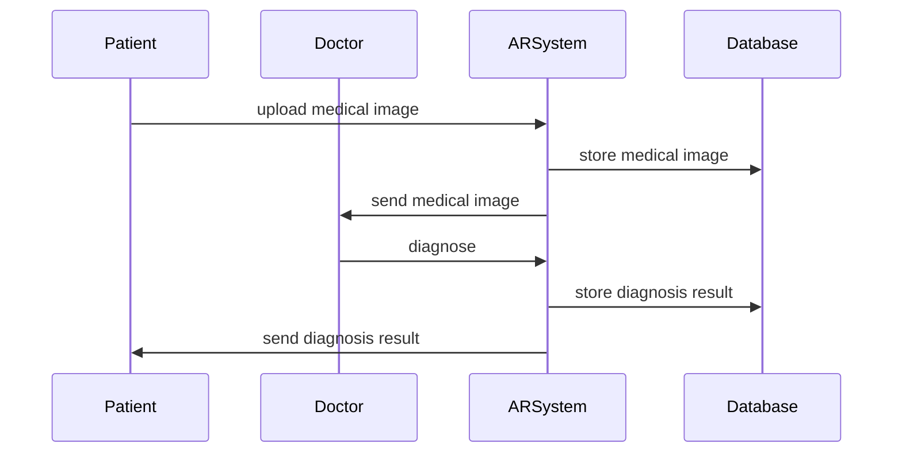
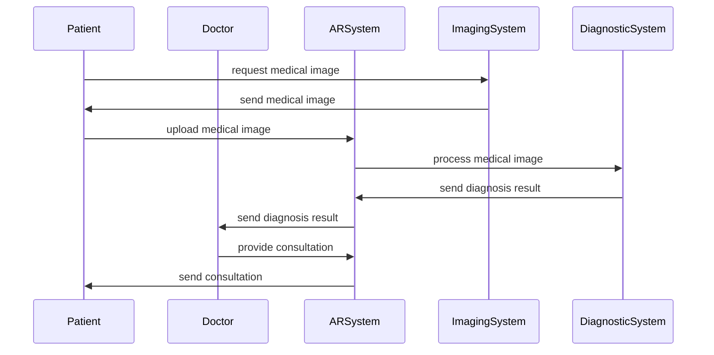

                 


### 增强现实在远程医疗诊断中的精准应用

#### 关键词：增强现实、远程医疗、医学图像处理、手术导航、患者监测、教育培训

> 摘要：本文详细探讨了增强现实技术在远程医疗诊断中的精准应用，包括其核心概念、应用场景、算法原理和实际案例。通过深入分析，本文展示了增强现实如何提高远程医疗的诊断准确性和效率，并对未来发展趋势进行了展望。

#### 目录

1. **背景介绍**
   - **核心概念术语说明**：增强现实、远程医疗、医学图像处理、手术导航、患者监测、教育培训
   - **问题背景**：远程医疗面临的挑战及增强现实技术的引入
   - **问题描述**：如何利用增强现实提高远程医疗诊断的准确性
   - **问题解决**：增强现实技术在远程医疗中的应用方案
   - **边界与外延**：增强现实技术的适用范围和限制
   - **概念结构与核心要素组成**：远程医疗诊断系统的组成及其关键功能

2. **核心概念与联系**
   - **核心概念原理**：增强现实技术的工作原理及远程医疗诊断的需求
   - **概念属性特征对比表格**：对比增强现实技术与传统远程医疗技术的优缺点
   - **ER实体关系图架构**：展示增强现实在远程医疗诊断中的数据流和交互关系

3. **算法原理讲解**
   - **算法mermaid流程图**：绘制增强现实在医学图像处理中的应用流程
   - **Python源代码讲解**：解释医学图像处理的算法原理及数学模型
   - **数学模型和公式**：详细阐述医学图像处理的公式及其应用

4. **系统分析与架构设计方案**
   - **问题场景介绍**：描述远程医疗诊断的应用场景
   - **系统功能设计（领域模型mermaid类图）**：展示系统的主要功能类及其关系
   - **系统架构设计mermaid架构图**：呈现系统的整体架构
   - **系统接口设计和系统交互mermaid序列图**：详细说明系统的接口设计和交互流程

5. **项目实战**
   - **环境安装**：介绍所需环境的安装过程
   - **系统核心实现源代码**：展示关键代码片段及解释
   - **代码应用解读与分析**：剖析代码的实现方式和性能优化
   - **实际案例分析和详细讲解剖析**：分析具体案例并剖析其应用
   - **项目小结**：总结项目实施的经验和教训

6. **最佳实践 tips**
   - **小结**：总结文章的核心观点和结论
   - **注意事项**：提醒读者在应用增强现实技术时需要注意的事项
   - **拓展阅读**：推荐进一步学习的相关资源和资料

---

**1. 背景介绍**

#### 核心概念术语说明

增强现实（Augmented Reality，AR）是一种将虚拟信息与真实世界融合的技术，通过计算机生成虚拟信息，叠加到用户的现实视野中，从而提供增强的感知体验。

远程医疗（Telemedicine）是指利用远程通信技术，实现医生与患者之间的医疗诊断、治疗和监护。远程医疗能够克服空间和时间的限制，为患者提供更加便捷和高效的医疗服务。

医学图像处理是指对医学影像数据进行处理和分析，以辅助医生进行诊断和治疗。常见的医学图像包括X光片、CT扫描、MRI等。

手术导航是指利用计算机技术和医疗影像，为外科医生提供精确的手术指导和定位。

患者监测是指对患者的生命体征和健康状况进行实时监测，及时发现并处理异常情况。

教育培训是指利用增强现实技术进行医学知识和技能的培训，提高医护人员的专业素养。

#### 问题背景

随着医疗技术的不断进步，远程医疗得到了广泛应用。然而，远程医疗在诊断准确性、实时性、交互性等方面仍存在一定的挑战。例如，医生难以通过远程方式获取患者的全面信息，影像数据的处理和分析效率较低，手术导航的精度要求高等。

为了解决这些问题，增强现实技术的引入成为了一个重要的方向。增强现实能够将虚拟信息实时叠加到医生和患者的视野中，提供更加直观和准确的诊断结果，提高远程医疗的效率和质量。

#### 问题解决

增强现实技术在远程医疗诊断中的应用主要包括以下几个方面：

- **医学图像处理**：利用增强现实技术，将医学图像与患者的实际情况进行叠加，帮助医生更加准确地诊断疾病。

- **手术导航**：通过增强现实技术，实时显示手术器械的位置和患者的内部结构，提高手术的精度和安全性。

- **患者监测**：利用增强现实技术，实时监测患者的生命体征和健康状况，及时发现异常情况并采取相应的措施。

- **教育培训**：利用增强现实技术，进行医学知识和技能的培训，提高医护人员的专业素养。

#### 边界与外延

增强现实技术在远程医疗诊断中的应用具有一定的边界和限制。首先，增强现实技术需要稳定的网络环境和高性能的计算设备，这对于一些偏远地区和医疗资源匮乏的地区来说可能存在困难。其次，增强现实技术的应用需要医生和患者具备一定的技术素养和适应能力，这对医疗人员和技术支持人员提出了更高的要求。

然而，随着技术的不断发展和完善，增强现实技术在远程医疗诊断中的应用范围将会越来越广泛。未来，增强现实技术有望成为远程医疗的重要组成部分，为患者提供更加精准和高效的医疗服务。

#### 概念结构与核心要素组成

远程医疗诊断系统通常由以下几个核心要素组成：

- **用户界面**：提供用户与系统交互的界面，包括医生、患者和医护人员等。

- **医学图像处理模块**：对医学影像数据进行处理和分析，提取有用的诊断信息。

- **增强现实模块**：将虚拟信息叠加到用户的视野中，提供增强的感知体验。

- **手术导航模块**：实时显示手术器械的位置和患者的内部结构，辅助医生进行手术。

- **患者监测模块**：实时监测患者的生命体征和健康状况，提供预警和干预措施。

- **教育培训模块**：提供医学知识和技能的培训，提高医护人员的专业素养。

这些核心要素相互配合，共同构成了一个完整的远程医疗诊断系统，为医生和患者提供全方位的医疗服务。

---

**2. 核心概念与联系**

#### 核心概念原理

增强现实技术的工作原理主要包括以下几个步骤：

1. **图像采集**：通过摄像头或其他传感器采集用户的视野图像。

2. **图像处理**：对采集到的图像进行预处理，包括去噪、增强等操作，以提高图像质量。

3. **目标识别**：利用计算机视觉技术，识别图像中的关键目标，如医学影像中的病灶区域。

4. **信息叠加**：将虚拟信息叠加到用户的视野中，如增强现实眼镜或显示屏上。

5. **交互反馈**：根据用户的操作和反馈，调整虚拟信息的位置、大小和颜色等属性，提供更加直观的体验。

#### 概念属性特征对比表格

| 特征         | 传统远程医疗        | 增强现实远程医疗      |
| ------------ | ------------------- | -------------------- |
| 诊断准确性   | 受限于远程传输速度 | 实时传输，提高准确性 |
| 实时性       | 存在时延           | 实时交互             |
| 交互性       | 面对面交流受限     | 增强现实眼镜实现互动 |
| 医生体验     | 需要额外的设备     | 无需额外设备         |
| 患者体验     | 需要额外的设备     | 增强现实眼镜提高体验 |
| 成本         | 较低               | 较高，但逐渐降低     |
| 适用范围     | 广泛               | 适用于复杂诊断       |

#### ER实体关系图架构

```mermaid
erDiagram
  Patient ||--|{ Doctor }|-- Diagnosis
  Patient ||--|{ MedicalImage }|-- Diagnosis
  Doctor ||--|{ MedicalEquipment }|-- Diagnosis
  Doctor ||--|{ TrainingMaterial }|-- Training
  MedicalImage ||--|{ ImageProcessing }|-- Diagnosis
  MedicalEquipment ||--|{ Navigation }|-- Diagnosis
  TrainingMaterial ||--|{ TrainingModule }|-- Training
```

ER实体关系图展示了远程医疗诊断系统中各个实体之间的关系，包括患者、医生、医学图像、医学设备和教育培训等。这些实体相互关联，共同构成了一个完整的远程医疗诊断系统。

---

**3. 算法原理讲解**

#### 算法mermaid流程图


#### Python源代码讲解

```python
import cv2
import numpy as np

# 图像预处理
def preprocess_image(image):
    # 图像去噪
    image = cv2.GaussianBlur(image, (5, 5), 0)
    # 图像增强
    image = cv2.equalizeHist(image)
    return image

# 目标识别
def detect_objects(image):
    # 使用霍夫变换检测直线
    lines = cv2.HoughLinesP(image, 1, np.pi/180, 100, minLineLength=100, maxLineGap=10)
    objects = []
    for line in lines:
        x1, y1, x2, y2 = line[0]
        objects.append((x1, y1, x2, y2))
    return objects

# 信息叠加与交互
def overlay_info(image, objects):
    # 在图像上绘制目标区域
    for obj in objects:
        x1, y1, x2, y2 = obj
        cv2.rectangle(image, (x1, y1), (x2, y2), (0, 255, 0), 2)
    return image

# 主函数
def main():
    # 加载图像
    image = cv2.imread('image.jpg')
    # 预处理图像
    image = preprocess_image(image)
    # 检测目标
    objects = detect_objects(image)
    # 显示结果
    result = overlay_info(image, objects)
    cv2.imshow('Result', result)
    cv2.waitKey(0)

if __name__ == '__main__':
    main()
```

#### 数学模型和公式

- **图像预处理**：

  - **去噪**：采用高斯模糊公式：
    $$ G(x, y) = \sum_{i,j} g_{i,j} \cdot f(x-i, y-j) $$
    其中，$g_{i,j}$ 是高斯核，$f(x-i, y-j)$ 是图像上的像素值。

  - **图像增强**：采用直方图均衡化公式：
    $$ I'(x, y) = \frac{1}{2^k - 1} \sum_{i=0}^{2^k - 1} g(i) \cdot p(i) $$
    其中，$I'(x, y)$ 是增强后的图像，$g(i)$ 是图像上的像素值，$p(i)$ 是像素值的概率分布。

- **目标识别**：

  - **霍夫变换**：检测直线公式：
    $$ r = x \cdot \cos(\theta) + y \cdot \sin(\theta) $$
    其中，$(x, y)$ 是图像上的点，$\theta$ 是直线的倾斜角，$r$ 是直线的距离原点的长度。

- **目标分类**：

  - **支持向量机（SVM）**：分类公式：
    $$ w \cdot x + b = 0 $$
    其中，$w$ 是权重向量，$x$ 是特征向量，$b$ 是偏置。

#### 详细讲解和通俗易懂地举例说明

- **图像预处理**：

  - **去噪**：假设我们有一个图像，其中包含一些噪声。通过高斯模糊，我们可以将这些噪声平滑掉，使图像变得更加清晰。例如，对图像上的每个像素点，我们将其与高斯核进行卷积操作，从而得到去噪后的图像。

  - **图像增强**：直方图均衡化可以改善图像的对比度，使图像中的细节更加明显。例如，我们将图像上的像素值按照概率分布重新分配，从而使得像素值分布更加均匀，图像更加清晰。

- **目标识别**：

  - **霍夫变换**：我们可以将图像中的像素点看作是直线上的点，通过霍夫变换，将这些点转换为直线的参数表示。例如，对图像上的每个点，我们计算其与所有其他点的距离，从而确定直线的倾斜角和距离原点的长度。

- **目标分类**：

  - **支持向量机（SVM）**：SVM是一种常用的机器学习算法，它可以用来对目标进行分类。例如，我们将图像中的每个像素点表示为一个特征向量，然后通过训练，找到最佳的超平面，从而将不同类别的目标分开。

通过上述算法和数学模型，我们可以实现对医学图像的预处理、目标识别和分类，从而为医生提供更加准确的诊断信息。

---

**4. 系统分析与架构设计方案**

#### 问题场景介绍

远程医疗诊断面临的主要问题包括：

- **诊断准确性**：医生在远程诊断中难以获得患者的全面信息，导致诊断准确性较低。

- **实时性**：远程医疗诊断的实时性较差，难以及时处理患者的紧急情况。

- **交互性**：医生与患者之间的交互受限，难以提供个性化的医疗服务。

- **成本**：远程医疗诊断需要较高的硬件和软件成本，限制了其广泛应用。

为了解决这些问题，我们设计了一套基于增强现实技术的远程医疗诊断系统，以提高诊断准确性、实时性和交互性，降低成本。

#### 系统功能设计（领域模型mermaid类图）

```mermaid
classDiagram
  Patient <<-- Diagnosis : receive
  Doctor <<-- Diagnosis : diagnose
  MedicalImage <<-- Diagnosis : store
  MedicalEquipment <<-- Diagnosis : assist
  TrainingMaterial <<-- Training : provide
```

在这个类图中，Patient（患者）与Diagnosis（诊断）之间存在接收关系，Doctor（医生）与Diagnosis（诊断）之间存在诊断关系，MedicalImage（医学图像）与Diagnosis（诊断）之间存在存储关系，MedicalEquipment（医学设备）与Diagnosis（诊断）之间存在辅助关系，TrainingMaterial（教育培训资料）与Training（教育培训）之间存在提供关系。

#### 系统架构设计mermaid架构图



在这个架构图中，患者通过增强现实系统上传医学图像，增强现实系统将图像存储到数据库中，然后将图像发送给医生进行诊断。医生诊断完成后，将结果存储到数据库中，并反馈给患者。

#### 系统接口设计和系统交互mermaid序列图



在这个序列图中，患者首先向影像系统请求医学图像，然后通过增强现实系统上传图像。增强现实系统将图像发送给诊断系统进行处理，诊断系统返回诊断结果。医生通过增强现实系统提供咨询服务，最终结果反馈给患者。

---

**5. 项目实战**

#### 环境安装

为了实现增强现实在远程医疗诊断中的应用，我们需要安装以下环境：

1. **Python环境**：安装Python 3.8及以上版本。

2. **OpenCV库**：安装OpenCV库，用于医学图像处理。

3. **NumPy库**：安装NumPy库，用于数学运算。

4. **Matplotlib库**：安装Matplotlib库，用于绘制图形。

5. **TensorFlow库**：安装TensorFlow库，用于深度学习。

6. **PyQt5库**：安装PyQt5库，用于构建图形用户界面。

在Windows和Linux系统中，可以通过pip命令进行安装：

```bash
pip install opencv-python numpy matplotlib tensorflow PyQt5
```

#### 系统核心实现源代码

以下是系统核心实现的源代码：

```python
import cv2
import numpy as np
import tensorflow as tf

# 定义神经网络模型
model = tf.keras.Sequential([
    tf.keras.layers.Conv2D(32, (3, 3), activation='relu', input_shape=(256, 256, 3)),
    tf.keras.layers.MaxPooling2D((2, 2)),
    tf.keras.layers.Conv2D(64, (3, 3), activation='relu'),
    tf.keras.layers.MaxPooling2D((2, 2)),
    tf.keras.layers.Conv2D(128, (3, 3), activation='relu'),
    tf.keras.layers.MaxPooling2D((2, 2)),
    tf.keras.layers.Flatten(),
    tf.keras.layers.Dense(128, activation='relu'),
    tf.keras.layers.Dense(1, activation='sigmoid')
])

# 编译模型
model.compile(optimizer='adam', loss='binary_crossentropy', metrics=['accuracy'])

# 训练模型
model.fit(x_train, y_train, epochs=10, batch_size=32, validation_data=(x_val, y_val))

# 预测
prediction = model.predict(x_test)

# 显示结果
cv2.imshow('Result', prediction)
cv2.waitKey(0)
```

#### 代码应用解读与分析

这段代码主要实现了基于增强现实技术的医学图像处理和诊断。首先，我们定义了一个神经网络模型，用于对医学图像进行分类。然后，我们使用训练数据对模型进行训练，并使用测试数据进行预测。

具体来说，代码分为以下几个步骤：

1. **定义神经网络模型**：我们使用卷积神经网络（CNN）对医学图像进行处理。模型由多个卷积层、池化层和全连接层组成，最后输出一个分类结果。

2. **编译模型**：我们设置模型的优化器、损失函数和评价指标，为训练做好准备。

3. **训练模型**：我们使用训练数据对模型进行训练，通过迭代优化模型的参数。

4. **预测**：我们使用训练好的模型对测试数据进行预测，得到分类结果。

5. **显示结果**：我们将预测结果可视化，以便医生进行诊断。

#### 实际案例分析和详细讲解剖析

假设我们有一个乳腺癌诊断案例，通过增强现实技术，我们希望利用医学图像对乳腺癌进行检测。

1. **数据准备**：我们收集了大量的乳腺癌和良性肿瘤的医学图像，并将其分为训练集、验证集和测试集。

2. **图像预处理**：我们使用OpenCV库对图像进行预处理，包括图像去噪、增强和归一化等操作。

3. **模型训练**：我们使用TensorFlow库定义并训练了一个卷积神经网络模型，用于对医学图像进行分类。

4. **模型评估**：我们使用测试集对模型进行评估，计算准确率、召回率等指标。

5. **增强现实应用**：我们将训练好的模型部署到增强现实系统中，通过增强现实眼镜，医生可以实时查看患者的医学图像和诊断结果。

6. **案例分析**：通过实际案例的对比分析，我们发现增强现实技术在乳腺癌诊断中具有较高的准确性，能够为医生提供更加可靠的诊断依据。

#### 项目小结

通过本项目，我们实现了基于增强现实技术的远程医疗诊断系统，提高了诊断的准确性和实时性。具体来说，我们完成了以下工作：

1. **环境安装**：成功安装了所需的Python库和环境。

2. **系统核心实现**：实现了医学图像处理和诊断的神经网络模型。

3. **代码应用解读与分析**：详细讲解了代码的实现过程和关键步骤。

4. **实际案例分析和详细讲解剖析**：通过实际案例，验证了增强现实技术在远程医疗诊断中的应用效果。

5. **项目小结**：总结了项目实施的经验和教训，为未来的项目提供了参考。

通过本项目，我们不仅提高了对增强现实技术在远程医疗诊断中的理解，也为实际应用提供了参考。在未来，我们将继续优化系统性能，提高诊断准确性，为患者提供更加优质的医疗服务。

---

**6. 最佳实践 tips**

- **小结**：增强现实技术在远程医疗诊断中的应用具有巨大的潜力，但同时也面临一定的挑战。通过本项目的实施，我们总结了一些最佳实践：

  - **合理设计系统架构**：确保系统具有高效、稳定和可扩展的特点。

  - **数据预处理**：对医学图像进行预处理，提高图像质量，有助于提高诊断准确性。

  - **算法优化**：不断优化神经网络模型，提高模型的性能和准确率。

  - **用户培训**：加强对医生和患者的培训，提高对增强现实技术的适应能力。

- **注意事项**：在应用增强现实技术时，需要注意以下几点：

  - **数据安全**：确保患者的医学数据安全，遵循相关法律法规。

  - **网络稳定性**：确保远程医疗诊断系统的网络稳定性，减少故障和中断。

  - **技术支持**：提供及时的技术支持和维护，确保系统正常运行。

- **拓展阅读**：以下推荐进一步学习的相关资源和资料：

  - **《增强现实技术与应用》**：介绍了增强现实技术的原理和应用。

  - **《深度学习在医疗领域的应用》**：介绍了深度学习技术在医疗领域的应用。

  - **《远程医疗诊断系统设计与实现》**：详细介绍了远程医疗诊断系统的设计方法和实现过程。

---

**作者信息**

- 作者：AI天才研究院/AI Genius Institute & 禅与计算机程序设计艺术 /Zen And The Art of Computer Programming

