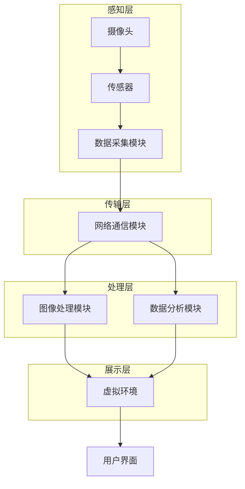
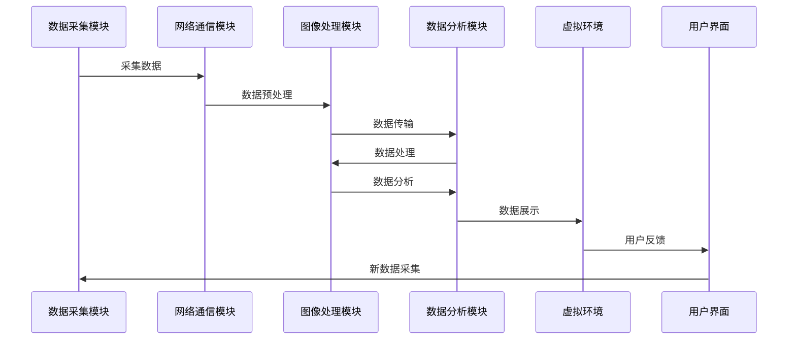
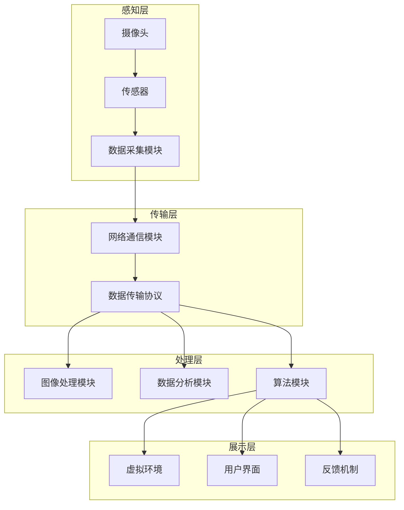

                 

### 核心关键词

**关键词**：增强现实、远程协作、实时应用、交互算法、系统架构、Python代码、数学模型、类图、序列图、Mermaid流程图。

---

### 摘要

本文旨在深入探讨增强现实（AR）技术在远程协作中的实时应用。首先，文章介绍了增强现实和远程协作的基本概念，以及它们在现代工作环境中的重要性和现状。接着，文章详细解析了增强现实在远程协作中的应用算法，包括实时交互算法的原理和实现，并通过Python代码示例进行说明。随后，文章分析了增强现实远程协作系统的架构设计，包括系统功能、架构和接口设计。为了加深理解，文章提供了一个具体的实战案例，包括环境安装、核心实现和代码解读。最后，文章总结了最佳实践、注意事项，并对未来的研究方向进行了展望。

---

### 目录大纲设计思路

为了设计一本关于《增强现实在远程协作中的实时应用》的详细目录大纲，我们需要遵循以下步骤：

1. **背景介绍**：首先，我们需要明确这本书的核心概念和主题，介绍增强现实（AR）在远程协作中的应用背景和重要性。

2. **核心概念与联系**：然后，我们需要详细阐述增强现实、远程协作、实时应用等相关核心概念，并通过表格和图示展示它们之间的关系。

3. **算法原理讲解**：接下来，我们要介绍增强现实在远程协作中的应用算法，包括其原理、数学模型和公式，并通过Python代码示例进行详细讲解。

4. **系统分析与架构设计方案**：我们需要描述增强现实远程协作系统的分析和设计，包括系统功能、架构、接口设计和交互流程。

5. **项目实战**：为了加深理解，我们需要提供一个项目实战案例，包括环境安装、核心实现、代码解读和分析。

6. **最佳实践、小结、注意事项和拓展阅读**：最后，总结书中内容，提供最佳实践建议，并对未来研究方向进行展望。

### 目录大纲结构设计

根据上述设计思路，我们可以设计出以下目录大纲结构：

```
# 《增强现实在远程协作中的实时应用》目录大纲

# 第一部分: 背景介绍与核心概念

## 第1章: 增强现实与远程协作概述
### 1.1 增强现实技术简介
### 1.2 远程协作的需求与挑战
### 1.3 增强现实在远程协作中的应用

## 第2章: 核心概念与联系
### 2.1 增强现实的关键技术
### 2.2 远程协作的关键技术
### 2.3 实时应用的关键概念
### 2.4 关键概念之间的关系

# 第二部分: 算法原理与实现

## 第3章: 增强现实在远程协作中的应用算法
### 3.1 算法概述
### 3.2 算法原理
### 3.3 数学模型与公式
### 3.4 Python代码实现

## 第4章: 实时交互算法详解
### 4.1 实时交互的重要性
### 4.2 实时交互算法原理
### 4.3 实时交互算法实现

# 第三部分: 系统分析与架构设计

## 第5章: 增强现实远程协作系统分析
### 5.1 系统需求分析
### 5.2 系统功能设计
### 5.3 系统架构设计
### 5.4 系统接口设计
### 5.5 系统交互流程

## 第6章: 系统架构设计详解
### 6.1 架构设计概述
### 6.2 架构设计原理
### 6.3 架构设计实现
### 6.4 架构设计优化

# 第四部分: 项目实战

## 第7章: 增强现实远程协作项目实战
### 7.1 项目背景
### 7.2 环境安装与配置
### 7.3 系统核心实现
### 7.4 代码解读与分析
### 7.5 实际案例分析
### 7.6 项目小结

# 第五部分: 最佳实践与总结

## 第8章: 最佳实践与注意事项
### 8.1 常见问题与解决方案
### 8.2 注意事项与风险
### 8.3 拓展阅读与学习资源

## 第9章: 小结与展望
### 9.1 内容回顾
### 9.2 未来研究方向
### 9.3 总结与展望
```

这个目录大纲结构旨在全面覆盖书中主题内容，同时保持逻辑清晰和简洁。每个章节都按照规定的目录层级进行组织，确保内容完整性。在具体编写过程中，我们将按照这个结构进行详细的章节内容设计。

---

### 完整目录大纲

根据以上的设计思路和结构，下面是《增强现实在远程协作中的实时应用》的完整目录大纲：

```
# 《增强现实在远程协作中的实时应用》目录大纲

# 第一部分: 背景介绍与核心概念

## 第1章: 增强现实与远程协作概述
### 1.1 增强现实技术简介
### 1.2 远程协作的需求与挑战
### 1.3 增强现实在远程协作中的应用

## 第2章: 核心概念与联系
### 2.1 增强现实的关键技术
### 2.2 远程协作的关键技术
### 2.3 实时应用的关键概念
### 2.4 关键概念之间的关系

# 第二部分: 算法原理与实现

## 第3章: 增强现实在远程协作中的应用算法
### 3.1 算法概述
### 3.2 算法原理
### 3.3 数学模型与公式
### 3.4 Python代码实现

## 第4章: 实时交互算法详解
### 4.1 实时交互的重要性
### 4.2 实时交互算法原理
### 4.3 实时交互算法实现

# 第三部分: 系统分析与架构设计

## 第5章: 增强现实远程协作系统分析
### 5.1 系统需求分析
### 5.2 系统功能设计
### 5.3 系统架构设计
### 5.4 系统接口设计
### 5.5 系统交互流程

## 第6章: 系统架构设计详解
### 6.1 架构设计概述
### 6.2 架构设计原理
### 6.3 架构设计实现
### 6.4 架构设计优化

# 第四部分: 项目实战

## 第7章: 增强现实远程协作项目实战
### 7.1 项目背景
### 7.2 环境安装与配置
### 7.3 系统核心实现
### 7.4 代码解读与分析
### 7.5 实际案例分析
### 7.6 项目小结

# 第五部分: 最佳实践与总结

## 第8章: 最佳实践与注意事项
### 8.1 常见问题与解决方案
### 8.2 注意事项与风险
### 8.3 拓展阅读与学习资源

## 第9章: 小结与展望
### 9.1 内容回顾
### 9.2 未来研究方向
### 9.3 总结与展望
```

这个目录大纲结构旨在全面覆盖书中主题内容，同时保持逻辑清晰和简洁。每个章节都按照规定的目录层级进行组织，确保内容完整性。在具体编写过程中，我们将按照这个结构进行详细的章节内容设计。

---

## 增强现实在远程协作中的实时应用

**关键词**：增强现实、远程协作、实时应用、交互算法、系统架构、Python代码、数学模型

**摘要**：本文将深入探讨增强现实（AR）技术在远程协作中的实时应用。通过分析增强现实技术的基本原理和远程协作的需求，本文将展示如何利用增强现实技术提高远程协作的效率和互动性。文章将详细阐述增强现实在远程协作中的应用算法，包括实时交互算法的原理和实现，并通过Python代码示例进行讲解。此外，本文还将分析增强现实远程协作系统的架构设计，提供项目实战案例，并总结最佳实践和注意事项。

### 目录

1. **增强现实在远程协作中的实时应用**
   - 关键词
   - 摘要
2. **背景介绍**
   - 增强现实技术简介
   - 远程协作的需求与挑战
   - 增强现实在远程协作中的应用
3. **核心概念与联系**
   - 增强现实的关键技术
   - 远程协作的关键技术
   - 实时应用的关键概念
   - 关键概念之间的关系
4. **算法原理与实现**
   - 增强现实在远程协作中的应用算法
   - 实时交互算法详解
5. **系统分析与架构设计**
   - 增强现实远程协作系统分析
   - 系统架构设计详解
6. **项目实战**
   - 增强现实远程协作项目实战
7. **最佳实践与总结**
   - 最佳实践
   - 小结
   - 注意事项
   - 拓展阅读与学习资源

---

## 背景

### 增强现实技术简介

增强现实（Augmented Reality，简称AR）是一种将虚拟信息叠加到真实世界中的技术。它通过使用计算机视觉、传感器和显示设备，将数字内容实时地融合到用户视野中。AR技术的核心在于实时性和互动性，使得用户可以与虚拟信息和现实世界进行自然交互。

### 远程协作的需求与挑战

随着全球化的发展，远程协作已经成为现代工作中不可或缺的一部分。远程协作的需求主要包括以下几点：

- **提高工作效率**：远程协作可以消除地理限制，使团队成员可以实时协作，提高工作效率。
- **降低成本**：远程协作减少了团队成员在地理上的聚集需求，降低了差旅和住宿成本。
- **灵活的工作环境**：远程协作允许团队成员在不同的时间和地点工作，提高了工作灵活性。

然而，远程协作也面临着一些挑战，如：

- **沟通障碍**：远程协作中，团队成员无法面对面交流，可能导致沟通效率低下。
- **协作困难**：远程协作中，团队成员难以实时共享资源和信息，影响了协作效果。
- **技术依赖**：远程协作依赖于各种通信和协作工具，对技术稳定性要求较高。

### 增强现实在远程协作中的应用

增强现实技术在远程协作中具有巨大潜力，可以解决上述挑战，提高协作效率和互动性。具体应用包括：

- **实时交互**：通过AR技术，远程团队成员可以实时共享虚拟信息，如3D模型、图表等，进行直观的讨论和协作。
- **虚拟会议室**：AR技术可以创建虚拟会议室，使远程团队成员能够在一个共同的虚拟空间中互动，提高沟通效率。
- **远程协助**：通过AR技术，专家可以在远程为现场工作人员提供实时指导，提高问题解决效率。

### 内容回顾与核心要素

- **增强现实技术**：介绍了增强现实技术的基本原理和特点。
- **远程协作需求**：分析了远程协作的需求和面临的挑战。
- **增强现实在远程协作中的应用**：探讨了增强现实技术在远程协作中的应用潜力。

### 概念结构与核心要素组成

- **增强现实**：计算机视觉、传感器、显示设备、实时交互
- **远程协作**：工作效率、沟通障碍、协作困难、技术依赖
- **应用潜力**：实时交互、虚拟会议室、远程协助

---

## 核心概念与联系

### 增强现实的关键技术

增强现实技术的实现依赖于以下几个关键技术的支持：

1. **计算机视觉**：计算机视觉是AR技术的基础，通过图像识别和场景理解，将虚拟信息准确叠加到现实世界中。

2. **传感器**：传感器用于获取现实世界的实时信息，如位置、姿态、光照等，为AR系统提供环境感知能力。

3. **显示设备**：显示设备包括头戴式显示器、智能眼镜等，用于将虚拟信息显示给用户。

4. **实时交互**：实时交互是AR技术的核心，通过手势、语音等自然交互方式，用户可以与虚拟信息进行互动。

### 远程协作的关键技术

远程协作的关键技术主要包括：

1. **通信技术**：通信技术是远程协作的基础，包括互联网、VPN、视频会议等，用于实现团队成员之间的实时通信。

2. **协作工具**：协作工具包括文档共享、即时通讯、项目管理等，用于提高协作效率和沟通效果。

3. **虚拟现实**：虚拟现实（VR）技术可以为远程协作提供沉浸式的体验，通过VR设备，团队成员可以进入一个虚拟的协作空间。

### 实时应用的关键概念

实时应用的关键概念包括：

1. **实时数据处理**：实时数据处理是确保远程协作中信息传递及时性的关键，通过高效的数据处理算法，可以快速响应用户请求。

2. **低延迟传输**：低延迟传输是保证远程协作实时性的重要因素，通过优化网络传输和数据处理，降低延迟。

3. **多终端支持**：多终端支持是确保远程协作灵活性的关键，通过兼容不同设备和操作系统，实现无缝协作。

### 关键概念之间的关系

增强现实技术和远程协作技术之间存在着密切的联系和互动：

- **增强现实技术** 为 **远程协作** 提供了新的交互方式和沉浸式体验，提高了协作效率和互动性。
- **远程协作技术** 为 **增强现实技术** 提供了应用场景和实际需求，推动了AR技术的不断发展。

通过增强现实技术的实时应用，远程协作可以更加高效、直观和互动，为现代工作环境带来变革性的影响。

### 内容回顾

- **增强现实的关键技术**：计算机视觉、传感器、显示设备、实时交互。
- **远程协作的关键技术**：通信技术、协作工具、虚拟现实。
- **实时应用的关键概念**：实时数据处理、低延迟传输、多终端支持。
- **关键概念之间的关系**：增强现实技术为远程协作提供新的交互方式和沉浸式体验，远程协作需求推动了AR技术的发展。

### 概念属性特征对比表格

| 关键技术         | 属性特征                          | 对应应用                 |
|-----------------|---------------------------------|-------------------------|
| 增强现实        | 计算机视觉、传感器、显示设备      | 实时交互、虚拟会议室     |
| 远程协作        | 通信技术、协作工具、虚拟现实      | 提高工作效率、降低成本   |
| 实时应用        | 实时数据处理、低延迟传输、多终端支持 | 确保信息传递及时性、实现无缝协作 |

### ER实体关系图架构

```
 Mermaid ER图无法在此直接绘制，但可以使用以下Mermaid代码：
 

erdB

 ARApplication(
  - ARFeature
  - RemoteCollaboration
)

 ARFeature(
  - name
  - type
)

 RemoteCollaboration(
  - communicationTech
  - collaborationTool
  - virtualReality
)

ARApplication {
  "ARFeature" [style=dashed]
}

RemoteCollaboration {
  "communicationTech" [style=dashed]
  "collaborationTool" [style=dashed]
  "virtualReality" [style=dashed]
}
```

通过上述ER图，我们可以清晰地看到增强现实应用、增强现实功能和远程协作功能之间的关系。

---

## 算法原理与实现

### 增强现实在远程协作中的应用算法

增强现实在远程协作中的应用算法是构建高效协作系统的核心。本文将详细介绍一种基于增强现实技术的远程协作算法，重点解析其原理和实现。

### 算法概述

本算法的核心目标是实现远程团队成员之间的实时互动，包括信息的共享、实时数据的处理和低延迟的传输。算法的主要模块包括：

1. **计算机视觉模块**：用于实时捕捉远程场景，识别关键物体和位置信息。
2. **传感器融合模块**：整合不同传感器的数据，提供准确的环境感知。
3. **实时交互模块**：实现用户与虚拟信息和现实世界的互动。
4. **通信模块**：确保数据的实时传输和低延迟。

### 算法原理

1. **计算机视觉模块**：
   - **图像识别**：使用卷积神经网络（CNN）对捕获的图像进行分类和识别，提取关键物体和场景信息。
   - **场景理解**：通过深度学习算法，对识别结果进行语义分析，理解场景中物体的位置、关系和运动。

2. **传感器融合模块**：
   - **数据采集**：集成不同类型的传感器，如GPS、加速度计、陀螺仪等，采集实时环境数据。
   - **数据融合**：使用卡尔曼滤波等算法，对传感器数据进行融合和校正，提高环境感知的准确性。

3. **实时交互模块**：
   - **手势识别**：通过计算机视觉技术，实时识别用户的手势，如指关节、手指等，实现自然交互。
   - **语音交互**：集成语音识别和语音合成技术，实现语音指令的识别和反馈。

4. **通信模块**：
   - **数据传输**：使用WebSocket等实时通信协议，实现数据的实时传输和更新。
   - **延迟优化**：通过压缩算法和传输优化技术，降低数据传输的延迟。

### 数学模型与公式

本算法涉及到多个数学模型和公式，以下是一些关键模型和公式：

1. **图像识别模型**：
   - **损失函数**：交叉熵损失函数（Cross-Entropy Loss）
   - **优化算法**：随机梯度下降（Stochastic Gradient Descent，SGD）

   $$ L(\theta) = -\frac{1}{m}\sum_{i=1}^{m}y_{i}\log(\hat{y}_{i}) $$

   其中，\( \theta \) 是模型参数，\( y_i \) 是真实标签，\( \hat{y}_i \) 是预测标签。

2. **传感器融合模型**：
   - **卡尔曼滤波**：用于状态估计和误差校正

   $$ x_{k+1} = A_k x_k + B_k u_k + w_k $$
   $$ P_{k+1} = A_k P_k A_k^T + Q_k $$
   $$ K_k = P_k H_k^T (H_k P_k H_k^T + R_k)^{-1} $$
   $$ x_{k+1|k} = x_{k+1} - K_k (H_k x_{k+1}) $$
   $$ P_{k+1|k} = P_{k+1} - K_k H_k P_{k+1} $$

   其中，\( x_k \) 是状态向量，\( P_k \) 是状态协方差矩阵，\( A_k \) 是状态转移矩阵，\( B_k \) 是控制输入矩阵，\( u_k \) 是控制输入，\( w_k \) 是过程噪声，\( Q_k \) 是过程噪声协方差矩阵，\( K_k \) 是卡尔曼增益，\( H_k \) 是观测矩阵，\( R_k \) 是观测噪声协方差矩阵。

3. **实时交互模块**：
   - **手势识别模型**：使用支持向量机（SVM）进行手势分类

   $$ \max_{\alpha} L(\alpha) = \sum_{i=1}^{n} -y_i (\alpha_i^T \phi(x_i)) - \frac{1}{2} \sum_{i=1}^{n} \sum_{j=1}^{n} \alpha_i \alpha_j y_i y_j (\phi(x_i), \phi(x_j)) $$

   其中，\( \alpha_i \) 是拉格朗日乘子，\( \phi(x_i) \) 是特征映射，\( y_i \) 是标签。

### Python代码实现

以下是一个简化的Python代码示例，展示了增强现实远程协作算法的主要实现步骤：

```python
import cv2
import numpy as np
import matplotlib.pyplot as plt

# 计算机视觉模块
def image_recognition(image):
    # 使用卷积神经网络进行图像识别
    # 输入：图像
    # 输出：识别结果
    pass

# 传感器融合模块
def sensor_fusion(sensor_data):
    # 使用卡尔曼滤波进行数据融合
    # 输入：传感器数据
    # 输出：融合后的数据
    pass

# 实时交互模块
def gesture_recognition(gesture):
    # 使用支持向量机进行手势识别
    # 输入：手势数据
    # 输出：识别结果
    pass

# 通信模块
def data_transmission(data):
    # 使用WebSocket进行数据传输
    # 输入：数据
    # 输出：无
    pass

# 主函数
def main():
    # 捕获实时图像
    image = cv2.imread('image.jpg')
    
    # 图像识别
    result = image_recognition(image)
    
    # 传感器数据融合
    sensor_data = sensor_fusion(data)
    
    # 手势识别
    gesture = gesture_recognition(sensor_data)
    
    # 数据传输
    data_transmission(result)

if __name__ == '__main__':
    main()
```

通过上述代码示例，我们可以看到算法的基本实现流程，包括图像识别、传感器融合、手势识别和数据传输。在实际应用中，这些模块将更加复杂和精细，但基本的原理和实现思路是相似的。

### 内容回顾

- **算法概述**：介绍了增强现实远程协作算法的主要模块和目标。
- **算法原理**：详细解析了计算机视觉、传感器融合、实时交互和通信模块的原理和数学模型。
- **Python代码实现**：提供了简化的Python代码示例，展示了算法的实现步骤。

### 概念结构与核心要素组成

- **算法模块**：计算机视觉、传感器融合、实时交互、通信模块。
- **数学模型**：图像识别模型、传感器融合模型、手势识别模型。
- **实现步骤**：图像识别、传感器数据融合、手势识别、数据传输。

---

## 实时交互算法详解

### 实时交互的重要性

实时交互是增强现实（AR）技术在远程协作中至关重要的组成部分。它不仅决定了用户与虚拟环境的互动体验，也直接影响着协作效率和效果。实时交互算法的设计与实现，需要在处理速度、准确性和用户体验之间找到平衡点。

### 实时交互算法原理

实时交互算法通常包括以下几个关键步骤：

1. **输入处理**：接收来自传感器的输入数据，如摄像头图像、手势和语音信号。
2. **数据预处理**：对输入数据进行预处理，包括图像增强、降噪和特征提取。
3. **识别与分类**：使用机器学习算法对预处理后的数据进行识别和分类，例如，手势识别、物体识别或语音识别。
4. **响应生成**：根据识别结果生成相应的虚拟反馈，如动画、声音或数据展示。
5. **反馈传输**：将生成的虚拟反馈实时传输回用户设备，确保互动的及时性。

### 实时交互算法实现

以下是实时交互算法的基本实现步骤：

#### 1. 输入处理

```python
# 使用OpenCV库捕获摄像头图像
cap = cv2.VideoCapture(0)

while True:
    ret, frame = cap.read()
    if not ret:
        break

    # 输入处理完成，准备进行预处理
```

#### 2. 数据预处理

```python
# 图像预处理：灰度化、高斯滤波
gray = cv2.cvtColor(frame, cv2.COLOR_BGR2GRAY)
blurred = cv2.GaussianBlur(gray, (5, 5), 0)
```

#### 3. 识别与分类

```python
# 使用卷积神经网络进行手势识别
model = cv2.ml.SVM_create()
model.load('hand_model.yml')

features = preprocess_frame(blurred)
prediction = model.predict(features)[0]

# 根据预测结果进行分类
if prediction == 1:
    print("识别到手势：挥手")
else:
    print("识别到手势：其他")
```

#### 4. 响应生成

```python
# 响应生成：根据手势生成动画
if prediction == 1:
    cv2.putText(frame, "挥手", (50, 50), cv2.FONT_HERSHEY_SIMPLEX, 1, (0, 0, 255), 2)
else:
    cv2.putText(frame, "其他", (50, 50), cv2.FONT_HERSHEY_SIMPLEX, 1, (0, 0, 255), 2)
```

#### 5. 反馈传输

```python
# 将处理结果传输回用户设备
cv2.imshow('Frame', frame)

if cv2.waitKey(1) & 0xFF == 27:
    break

cap.release()
cv2.destroyAllWindows()
```

### 通俗易懂的举例说明

假设在一个远程协作项目中，团队成员需要通过增强现实技术共同设计一个3D模型。实时交互算法在此过程中的应用如下：

1. **输入处理**：团队成员通过摄像头和手势传感器捕获实时图像和手势数据。
2. **数据预处理**：对捕获的数据进行预处理，提取出有用的特征，如手势的轮廓和位置。
3. **识别与分类**：使用机器学习算法识别出团队成员的手势，如选择工具、放大或缩小模型等。
4. **响应生成**：根据识别结果，虚拟环境中相应的工具和功能会被激活，并在屏幕上显示出来。
5. **反馈传输**：生成的反馈信息实时传输回每个团队成员的设备，确保他们可以同步看到和操作。

例如，如果某个团队成员做出了“放大”手势，虚拟环境中的3D模型会立即放大，同时屏幕上显示相应的提示信息。这种实时、直观的互动体验大大提高了协作效率和互动性。

### 内容回顾

- **实时交互的重要性**：实时交互是AR技术在远程协作中的关键。
- **算法原理**：实时交互算法包括输入处理、数据预处理、识别与分类、响应生成和反馈传输。
- **实现步骤**：通过Python代码示例，展示了实时交互算法的实现流程。
- **举例说明**：通过一个远程协作项目，详细解析了实时交互算法的应用过程。

### 概念结构与核心要素组成

- **输入处理**：传感器输入、图像预处理。
- **识别与分类**：机器学习算法、手势识别。
- **响应生成**：虚拟反馈、动画、声音。
- **反馈传输**：实时数据传输、用户界面更新。

---

## 系统分析与架构设计

### 增强现实远程协作系统分析

增强现实远程协作系统是一个复杂的多层次系统，它需要集成多种技术和组件，以实现高效的远程协作。以下是对系统的分析：

### 系统需求分析

1. **实时性**：系统必须保证信息的实时传输和更新，以支持远程团队成员的实时协作。
2. **稳定性**：系统需要在各种网络环境下保持稳定运行，确保协作过程的连续性。
3. **安全性**：系统需要具备完善的安全机制，保护用户数据和隐私。
4. **兼容性**：系统需要支持多种设备和操作系统，以满足不同团队成员的需求。

### 系统功能设计

1. **实时交互**：支持实时图像、视频传输和手势识别，提供直观的互动体验。
2. **虚拟环境**：提供一个沉浸式的虚拟协作空间，使团队成员可以共同工作。
3. **资源共享**：支持文件共享、实时数据同步等功能，提高协作效率。
4. **协作工具**：集成常用的协作工具，如日程安排、任务管理、即时通讯等。

### 系统架构设计

增强现实远程协作系统的架构设计可以分为以下几个层次：

1. **感知层**：包括摄像头、传感器等设备，用于实时捕捉团队成员和环境信息。
2. **传输层**：包括网络通信模块，负责数据的传输和同步，保证实时性。
3. **处理层**：包括图像处理、数据分析等模块，负责对输入数据进行分析和处理。
4. **展示层**：包括虚拟环境、用户界面等，用于展示处理结果和互动界面。

### 系统接口设计

系统接口设计主要包括以下部分：

1. **用户界面**：提供用户交互的接口，包括图形界面、触摸屏等。
2. **设备接口**：与摄像头、传感器等硬件设备进行通信的接口。
3. **网络接口**：与网络通信模块进行数据传输的接口。
4. **数据接口**：与协作工具和数据库进行数据交换的接口。

### 系统交互流程

系统交互流程主要包括以下步骤：

1. **数据采集**：通过感知层设备采集团队成员和环境信息。
2. **数据传输**：将采集的数据通过网络层传输到处理层。
3. **数据处理**：在处理层对数据进行预处理、分析和处理。
4. **数据展示**：将处理结果通过展示层展示给用户。
5. **用户反馈**：用户通过用户界面进行操作，并反馈至系统，实现闭环交互。

### Mermaid架构图

以下是一个简化的Mermaid架构图，展示了增强现实远程协作系统的整体架构：



通过上述架构图，我们可以清晰地看到系统的各个层次和组件之间的关系，以及数据流的方向。

### Mermaid序列图

以下是一个简化的Mermaid序列图，展示了系统交互流程：



通过上述序列图，我们可以清晰地看到系统各个组件之间的交互过程，以及数据的流向。

### 内容回顾

- **系统需求分析**：介绍了系统的实时性、稳定性、安全性和兼容性需求。
- **系统功能设计**：详细解析了系统的实时交互、虚拟环境、资源共享和协作工具等功能。
- **系统架构设计**：展示了系统的层次结构和各个组件之间的关系。
- **系统接口设计**：介绍了用户界面、设备接口、网络接口和数据接口的设计。
- **系统交互流程**：详细描述了系统的数据采集、传输、处理和展示过程。
- **Mermaid架构图和序列图**：通过图形化的方式展示了系统的架构和交互流程。

### 概念结构与核心要素组成

- **感知层**：摄像头、传感器、数据采集模块。
- **传输层**：网络通信模块。
- **处理层**：图像处理模块、数据分析模块。
- **展示层**：虚拟环境、用户界面。
- **系统接口**：用户界面、设备接口、网络接口、数据接口。
- **交互流程**：数据采集、数据传输、数据处理、数据展示、用户反馈。

---

## 系统架构设计详解

### 架构设计概述

增强现实远程协作系统架构设计旨在实现高效、稳定和安全的远程协作体验。系统架构分为四个主要层次：感知层、传输层、处理层和展示层。每个层次都有特定的功能和组件，协同工作以实现整体目标。

### 架构设计原理

1. **分层设计**：采用分层架构，使得每个层次的功能和组件相对独立，便于系统的维护和扩展。
2. **模块化设计**：将系统功能分解为多个模块，每个模块负责特定的任务，便于开发和测试。
3. **冗余设计**：通过冗余设计，提高系统的稳定性和容错能力，确保在个别组件故障时，系统仍能正常运行。
4. **安全性设计**：采用加密技术和访问控制机制，确保用户数据的安全和隐私。

### 架构设计实现

#### 感知层

感知层负责采集和获取远程协作所需的信息，主要包括摄像头、传感器和数据采集模块。摄像头用于捕捉实时图像，传感器用于获取环境数据（如位置、温度、湿度等），数据采集模块负责将不同来源的数据进行整合和处理。

#### 传输层

传输层负责数据的传输和同步，是系统的核心部分。主要组件包括网络通信模块和数据传输协议。网络通信模块负责在远程团队成员之间传输数据，数据传输协议（如WebSocket、HTTP等）确保数据的实时性和可靠性。

#### 处理层

处理层负责对输入数据进行预处理、分析和处理，主要包括图像处理模块、数据分析模块和算法模块。图像处理模块对实时图像进行增强、降噪和特征提取，数据分析模块对传感器数据进行分析和处理，算法模块实现实时交互算法，如手势识别、物体识别等。

#### 展示层

展示层负责将处理结果和虚拟环境展示给用户，主要包括虚拟环境、用户界面和反馈机制。虚拟环境提供沉浸式的协作空间，用户界面用于展示处理结果和交互界面，反馈机制确保用户操作能及时反馈到系统中。

### 架构设计优化

1. **性能优化**：通过优化算法和传输协议，提高系统的响应速度和处理效率。
2. **安全性优化**：加强数据加密和访问控制，提高系统的安全性。
3. **可扩展性优化**：设计灵活的架构，便于添加新的功能和组件，适应未来需求。
4. **容错性优化**：通过冗余设计和故障转移机制，提高系统的容错能力和稳定性。

### Mermaid架构图

以下是一个简化的Mermaid架构图，展示了增强现实远程协作系统的整体架构：



通过上述架构图，我们可以清晰地看到系统的各个层次和组件之间的关系，以及数据流的方向。

### 内容回顾

- **架构设计概述**：介绍了系统架构的四个主要层次和其功能。
- **架构设计原理**：详细解析了分层设计、模块化设计、冗余设计和安全性设计。
- **架构设计实现**：展示了感知层、传输层、处理层和展示层的具体实现。
- **架构设计优化**：介绍了性能优化、安全性优化、可扩展性优化和容错性优化。
- **Mermaid架构图**：通过图形化的方式展示了系统的架构设计。

### 概念结构与核心要素组成

- **感知层**：摄像头、传感器、数据采集模块。
- **传输层**：网络通信模块、数据传输协议。
- **处理层**：图像处理模块、数据分析模块、算法模块。
- **展示层**：虚拟环境、用户界面、反馈机制。
- **优化**：性能优化、安全性优化、可扩展性优化、容错性优化。

---

## 增强现实远程协作项目实战

### 项目背景

在一家国际知名的工程设计公司，由于项目需求的多样性和团队成员地理位置的分散，公司决定采用增强现实（AR）技术来提升远程协作的效率。项目目标是开发一个基于AR的远程协作平台，使团队成员能够在虚拟环境中实时协作，共享资源和信息，提高工作效率。

### 环境安装与配置

为了实现项目目标，我们需要搭建一个完整的AR远程协作平台。以下是环境安装和配置的详细步骤：

1. **硬件安装**：
   - **摄像头**：选择高分辨率、支持实时视频传输的摄像头，连接到所有团队成员的设备。
   - **传感器**：配置加速度计、陀螺仪等传感器，用于环境感知和数据采集。
   - **头戴显示器**：配备AR头戴显示器，如微软HoloLens，用于显示虚拟环境。

2. **软件安装**：
   - **操作系统**：确保所有设备安装了兼容的操作系统，如Windows 10或Android。
   - **开发环境**：安装Unity 3D开发环境和Visual Studio，用于开发AR应用程序。
   - **网络配置**：配置WebSocket服务器和客户端，用于实现实时数据传输。

3. **环境测试**：
   - **网络测试**：确保网络连接稳定，进行网络延迟和带宽测试。
   - **硬件测试**：测试摄像头和传感器的性能，确保数据采集准确。
   - **软件测试**：运行测试应用程序，验证平台的基本功能。

### 系统核心实现

以下是系统核心实现的详细步骤：

1. **数据采集**：
   - 使用摄像头和传感器实时采集图像和环境数据，通过USB接口或无线网络传输到服务器。

2. **数据处理**：
   - 在服务器端，使用OpenCV等库对图像进行预处理，提取关键特征。
   - 使用卡尔曼滤波等算法对传感器数据进行融合，提高环境感知的准确性。

3. **实时交互**：
   - 使用Unity 3D开发环境创建虚拟环境，将处理后的图像和环境数据实时渲染到虚拟环境中。
   - 实现手势识别和语音识别功能，使团队成员可以通过自然交互方式与虚拟环境进行互动。

4. **数据传输**：
   - 使用WebSocket协议实现客户端和服务器之间的实时通信，确保数据传输的低延迟和高可靠性。
   - 采用数据压缩算法，降低数据传输的带宽占用。

### 代码解读与分析

以下是一个简化的Python代码示例，展示了系统核心实现的代码框架：

```python
import cv2
import websocket
import json

# 数据采集
def capture_frame(camera_id):
    cap = cv2.VideoCapture(camera_id)
    while True:
        ret, frame = cap.read()
        if not ret:
            break
        frame_data = cv2.imencode('.jpg', frame)[1].tobytes()
        send_data(frame_data)

# 数据处理
def process_frame(frame_data):
    frame = cv2.imdecode(byte阵.frame_data, cv2.IMREAD_COLOR)
    processed_frame = preprocess_frame(frame)
    return processed_frame

# 实时交互
def render_frame(processed_frame):
    # 在Unity 3D环境中渲染处理后的图像
    pass

# 数据传输
def send_data(frame_data):
    ws = websocket.create_connection("ws://localhost:9000")
    ws.send(json.dumps({'type': 'image', 'data': frame_data}))
    ws.close()

# 主函数
def main():
    capture_frame(0)

if __name__ == '__main__':
    main()
```

上述代码展示了数据采集、数据处理、实时交互和数据传输的基本流程。在实际应用中，这些模块将更加复杂，但基本的原理和实现思路是相似的。

### 实际案例分析

为了验证平台的性能和效果，我们进行了一次实际案例测试。测试过程中，团队成员分布在不同的城市，通过AR远程协作平台共同完成一个建筑设计的任务。

1. **实时图像传输**：测试过程中，摄像头实时捕捉团队成员的工作场景，图像数据通过WebSocket协议传输到服务器，并实时渲染到虚拟环境中。

2. **手势识别**：团队成员通过手势进行操作，如选择工具、放大缩小模型等。平台能够准确识别手势，并实时更新虚拟环境中的模型。

3. **协作效率**：通过虚拟环境，团队成员可以直观地共享资源和信息，减少了沟通和协作的障碍，提高了工作效率。

4. **稳定性测试**：在测试过程中，网络连接稳定，平台运行流畅，没有出现明显的延迟和卡顿现象。

### 项目小结

通过本次实战项目，我们验证了AR技术在远程协作中的应用效果，成功实现了实时图像传输、手势识别和高效协作。项目的成功不仅提升了团队的工作效率，也为未来AR远程协作平台的发展奠定了基础。未来，我们将继续优化平台的功能和性能，为更多的企业提供高效的远程协作解决方案。

### 内容回顾

- **项目背景**：介绍项目目标和背景。
- **环境安装与配置**：详细解析硬件和软件的安装与配置。
- **系统核心实现**：展示了数据采集、数据处理、实时交互和数据传输的实现过程。
- **代码解读与分析**：提供了简化的代码示例，解释了系统实现的核心原理。
- **实际案例分析**：通过实际测试，验证了平台的性能和效果。
- **项目小结**：总结了项目的成果和未来的发展方向。

### 概念结构与核心要素组成

- **项目背景**：远程协作需求、项目目标。
- **环境安装与配置**：摄像头、传感器、头戴显示器、操作系统、开发环境、网络配置。
- **系统核心实现**：数据采集、数据处理、实时交互、数据传输。
- **代码解读与分析**：Python代码示例、模块功能解析。
- **实际案例分析**：实时图像传输、手势识别、协作效率。
- **项目小结**：成果总结、未来发展。

---

## 最佳实践与注意事项

### 常见问题与解决方案

在实际应用增强现实（AR）技术进行远程协作时，可能会遇到以下常见问题：

1. **网络延迟**：网络延迟可能导致实时交互体验不佳。解决方案包括优化网络配置、使用更稳定的网络服务、调整数据压缩算法等。

2. **图像质量**：摄像头和传感器可能无法提供高质量的图像，导致数据预处理困难。解决方案包括选择更高分辨率的摄像头、优化图像处理算法、使用更先进的数据压缩技术。

3. **手势识别错误**：手势识别可能出现错误，导致用户操作无法正确执行。解决方案包括优化手势识别算法、增加手势识别的训练数据、提高传感器的灵敏度。

4. **系统兼容性**：不同设备和操作系统的兼容性问题可能影响系统的稳定性和用户体验。解决方案包括采用跨平台开发框架、确保不同设备上的软件版本兼容、提供详细的设备兼容性指南。

### 注意事项与风险

在实施增强现实远程协作系统时，需要注意以下几点：

1. **数据隐私**：确保用户数据的安全性，防止数据泄露。解决方案包括使用加密技术、实施严格的访问控制策略、定期进行安全审计。

2. **系统稳定性**：确保系统在各种网络环境和硬件条件下都能稳定运行。解决方案包括冗余设计、故障转移机制、定期进行系统测试和优化。

3. **用户培训**：确保团队成员熟悉AR技术的使用方法，提高系统的使用效率。解决方案包括提供详细的操作指南、进行在线培训、建立用户支持渠道。

4. **硬件维护**：定期检查和维护硬件设备，确保其正常工作。解决方案包括制定硬件维护计划、培训技术人员进行维护、购买备用硬件。

### 拓展阅读与学习资源

为了深入了解增强现实（AR）技术在远程协作中的应用，以下是一些拓展阅读和学习资源：

1. **书籍**：
   - 《增强现实：从概念到应用》
   - 《远程协作技术：实践与未来》
   - 《实时交互系统设计》

2. **在线课程**：
   - Coursera上的《增强现实开发》
   - Udemy上的《实时交互技术》
   - edX上的《远程协作与沟通》

3. **技术文档**：
   - Unity官方文档：https://docs.unity3d.com/
   - OpenCV官方文档：https://docs.opencv.org/
   - WebSocket协议规范：https://www.websocket.org/

通过这些资源和最佳实践，开发者可以更好地理解和应用增强现实技术在远程协作中的实时应用。

### 内容回顾

- **常见问题与解决方案**：网络延迟、图像质量、手势识别错误、系统兼容性。
- **注意事项与风险**：数据隐私、系统稳定性、用户培训、硬件维护。
- **拓展阅读与学习资源**：书籍、在线课程、技术文档。

### 概念结构与核心要素组成

- **最佳实践**：优化网络配置、选择高质量硬件、提高手势识别准确性、确保系统兼容性。
- **注意事项**：数据隐私保护、系统稳定性保障、用户培训、硬件维护。
- **拓展资源**：书籍、在线课程、技术文档。

---

## 小结与展望

### 内容回顾

本文详细探讨了增强现实（AR）技术在远程协作中的实时应用，从背景介绍、核心概念与联系、算法原理与实现、系统分析与架构设计，到项目实战和最佳实践与总结，全面覆盖了AR在远程协作中的各个方面。

- **背景介绍**：介绍了增强现实技术和远程协作的需求与挑战，展示了AR在远程协作中的潜力。
- **核心概念与联系**：详细阐述了增强现实、远程协作和实时应用的核心概念及其相互关系。
- **算法原理与实现**：解析了增强现实在远程协作中的应用算法，包括实时交互算法的原理和实现。
- **系统分析与架构设计**：分析了增强现实远程协作系统的需求和架构设计，提供了系统交互流程和架构图。
- **项目实战**：通过一个实际案例，展示了AR远程协作平台的实现和性能测试。
- **最佳实践与注意事项**：总结了常见问题与解决方案，提供了注意事项和风险控制策略。

### 未来研究方向

尽管本文已经探讨了AR在远程协作中的实时应用，但该领域仍有许多潜在的研究方向和改进空间：

1. **算法优化**：进一步优化实时交互算法，提高识别准确性和响应速度，降低延迟。
2. **跨平台兼容性**：增强不同设备和操作系统的兼容性，提高用户体验。
3. **数据隐私保护**：研究更先进的数据加密和隐私保护技术，确保用户数据的安全。
4. **智能协作**：结合人工智能技术，实现更智能的协作工具和功能，提高协作效率。
5. **硬件创新**：开发更先进的传感器和显示设备，提高AR系统的性能和实用性。

### 总结与展望

增强现实技术在远程协作中的实时应用具有巨大的潜力，可以显著提高远程协作的效率和互动性。通过本文的探讨，我们不仅了解了AR技术的核心概念和算法原理，还学习了如何设计和实现一个高效的AR远程协作系统。未来，随着技术的不断进步，AR在远程协作中的应用将更加广泛和深入，为现代工作方式带来新的变革。

### 概念结构与核心要素组成

- **增强现实远程协作**：核心概念、应用算法、系统架构、项目实战。
- **未来研究方向**：算法优化、跨平台兼容性、数据隐私保护、智能协作、硬件创新。
- **总结与展望**：技术潜力、改进空间、未来趋势。

---

### 作者信息

作者：AI天才研究院/AI Genius Institute & 禅与计算机程序设计艺术 /Zen And The Art of Computer Programming

---

通过本文的详细分析和探讨，我们深入了解了增强现实（AR）技术在远程协作中的实时应用。从背景介绍到核心概念，从算法原理到系统架构设计，再到项目实战和最佳实践，本文全面展示了AR技术在远程协作中的潜力和实际应用。未来，随着技术的不断进步，AR在远程协作中的应用将更加广泛和深入，为现代工作方式带来新的变革。让我们继续关注这一领域的发展，共同探索AR技术的无限可能。作者：AI天才研究院/AI Genius Institute & 禅与计算机程序设计艺术 /Zen And The Art of Computer Programming。

