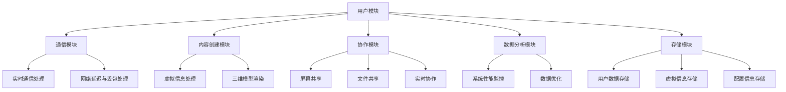
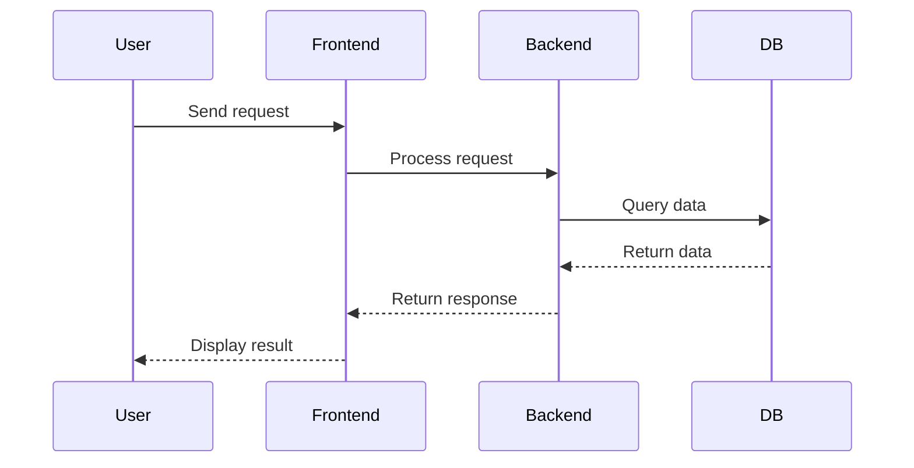

                 

## 增强现实在远程协作中的应用

### 关键词
- 增强现实（AR）
- 远程协作
- 应用场景
- 平台架构
- 实时通信
- 项目实战

### 摘要
本文将深入探讨增强现实（AR）在远程协作中的应用。我们将从问题背景和需求分析开始，逐步介绍增强现实技术原理，探讨其在不同远程协作场景中的应用，详细分析系统架构与实现，并通过实际项目案例展示其应用效果。最后，我们将总结最佳实践和未来发展趋势，为读者提供全面的技术视野。

### 目录

## 第一部分：背景与概述

### 1.1 问题背景与需求分析
- **远程协作的现状与挑战**
- **增强现实技术的崛起与机遇**
- **增强现实在远程协作中的应用前景**

### 1.2 核心概念
- **增强现实（AR）的定义与分类**
- **远程协作的基本概念与模式**
- **增强现实与远程协作的融合机制**

### 1.3 增强现实技术原理
- **AR显示技术**
- **AR内容创建与处理**
- **AR传感器与跟踪技术**

## 第二部分：增强现实在远程协作中的应用

### 2.1 应用场景分析
- **教育远程协作**
- **医疗远程协作**
- **企业远程协作**
- **建筑与工程设计远程协作**

### 2.2 增强现实远程协作平台架构
- **平台架构设计**
- **系统模块划分与功能**
- **架构图展示**

### 2.3 增强现实内容创建与交互
- **内容创建工具与流程**
- **远程协作互动机制**
- **用户界面设计**

### 2.4 实时协作与通信技术
- **实时通信协议**
- **网络延迟与丢包处理**
- **数据同步与一致性维护**

## 第三部分：项目实战

### 3.1 项目介绍
- **项目背景**
- **项目目标**
- **项目团队与分工**

### 3.2 系统设计与实现
- **领域模型设计**
- **系统架构设计**
- **关键技术选型**

### 3.3 环境安装与配置
- **硬件与软件需求**
- **系统安装流程**
- **配置与调试**

### 3.4 系统核心实现
- **系统模块源代码解析**
- **关键算法与数据结构**
- **系统性能优化**

### 3.5 实际案例分析
- **项目实施过程**
- **遇到的问题与解决方法**
- **项目效果评估**

## 第四部分：最佳实践与展望

### 4.1 最佳实践
- **成功案例分享**
- **最佳实践经验总结**
- **实践中的注意事项**

### 4.2 未来发展趋势
- **新技术动态**
- **行业发展趋势**
- **未来应用前景**

### 4.3 小结与展望
- **本书总结**
- **学员反馈**
- **进一步研究方向**

---

### 1.1 问题背景与需求分析

在现代工作和生活中，远程协作已经成为不可或缺的一部分。随着互联网技术的快速发展，人们可以通过各种在线工具进行文字、语音、视频的交流，但这种传统的远程协作方式存在着一定的局限性。首先，远程协作往往依赖于稳定的网络连接，一旦网络不稳定，沟通效率会大大降低。其次，远程协作缺乏面对面的互动体验，难以达到像现场交流那样的直观和高效。此外，对于复杂的任务和项目，远程协作的参与人员难以实时共享信息和资源，从而影响了协作的效果和效率。

增强现实（AR）技术的崛起为远程协作带来了新的机遇。增强现实是一种将虚拟信息与现实世界进行叠加的技术，通过AR设备，用户可以看到叠加在真实环境中的虚拟信息，这种沉浸式的体验可以极大地提升远程协作的互动性和实时性。例如，在医疗远程协作中，医生可以通过AR设备实时查看患者的病情和病历，并与远程专家进行直观的交流和协作，提高诊断和治疗的效率。在建筑与工程设计领域，AR技术可以帮助设计师和工程师远程查看和修改设计图纸，实现更加高效的协作和沟通。

因此，本文将深入探讨增强现实在远程协作中的应用，分析其技术原理和应用场景，并通过实际项目案例展示其具体应用效果，为读者提供有价值的参考。

### 1.2 核心概念

在深入探讨增强现实在远程协作中的应用之前，我们需要明确几个核心概念：增强现实（AR）、远程协作及其融合机制。

#### 增强现实（AR）

增强现实（Augmented Reality，简称AR）是一种将虚拟信息与现实世界进行叠加的技术。与虚拟现实（VR）不同，AR并不完全替代现实世界，而是在现实世界中叠加虚拟信息，使现实世界与虚拟世界相结合。AR技术通过计算机视觉、图像处理、传感器跟踪等技术，将虚拟物体以三维形式叠加到现实环境中，使用户能够直接在真实场景中看到和互动这些虚拟物体。

**增强现实技术分类**：

- **标记增强现实（Marker-based AR）**：通过识别标记（如二维码、条形码等）来实现虚拟信息与现实世界的叠加。
- **自然增强现实（Markerless AR）**：通过计算机视觉算法自动识别和跟踪现实场景中的特征点，实现虚拟信息与现实世界的叠加。
- **混合现实（Hybrid AR）**：结合标记增强现实和自然增强现实技术，通过多种方式实现虚拟信息与现实世界的叠加。

#### 远程协作

远程协作是指通过互联网等通信手段，使位于不同地理位置的人员能够进行信息交流、任务分配和共同完成任务的过程。远程协作的目的是克服地理位置的限制，提高工作效率和灵活性。远程协作的基本模式包括：

- **异步协作**：通过邮件、消息平台等工具进行非实时交流，适合需要长时间思考和处理的信息交流。
- **同步协作**：通过视频会议、即时通讯等工具进行实时交流，适合需要即时反馈和互动的任务。

#### 增强现实与远程协作的融合机制

增强现实与远程协作的融合机制主要是通过以下几种方式实现的：

1. **虚拟信息共享**：通过AR技术，远程协作的参与者可以在各自的视野中看到共享的虚拟信息，如文件、图像、视频等，从而实现更加直观和高效的交流。
2. **互动式协作**：AR技术可以提供沉浸式的交互体验，使远程协作的参与者可以像在同一个物理空间中一样进行互动，提高协作的效率和互动性。
3. **远程协作工具集成**：将增强现实技术与远程协作工具（如视频会议、文档共享等）进行集成，提供一体化的协作解决方案。

通过这些融合机制，增强现实技术能够显著提升远程协作的互动性和实时性，为各种远程协作场景提供更丰富的功能和更好的用户体验。

### 1.3 增强现实技术原理

#### AR显示技术

增强现实显示技术是AR系统的重要组成部分，它决定了用户能否在真实环境中看到并交互虚拟信息。AR显示技术可以分为两大类：眼镜式显示和投影式显示。

1. **眼镜式显示**：通过佩戴AR眼镜或头戴式显示器，用户可以直接在视野中看到叠加的虚拟信息。这种显示方式的优点是沉浸感强、体验自然，适用于需要长时间佩戴的场景。例如，微软的HoloLens和谷歌的ARCore就是典型的眼镜式显示技术。

2. **投影式显示**：通过将虚拟信息投影到用户视野中的特定区域，如桌子、墙壁等，实现虚拟信息与现实环境的叠加。这种显示方式的优点是成本较低、易于部署，适用于一些临时性或特定场景的远程协作。

#### AR内容创建与处理

AR内容创建与处理是AR系统的核心，它包括虚拟信息的生成、处理和显示。以下是一些关键技术和方法：

1. **虚拟信息生成**：通过计算机图形学技术，生成三维模型、动画、文字等虚拟信息。这些信息可以是预先制作的，也可以是实时生成的。

2. **虚拟信息处理**：包括对虚拟信息进行实时渲染、光照处理、阴影处理等，使其在显示时能够与现实环境融合自然。

3. **虚拟信息显示**：通过AR显示技术，将处理后的虚拟信息叠加到用户的视野中，使用户能够看到并与之互动。

#### AR传感器与跟踪技术

AR传感器与跟踪技术是确保虚拟信息与现实环境精确叠加的关键。以下是一些常用的AR传感器和跟踪技术：

1. **摄像头与深度传感器**：用于捕捉现实环境的图像和深度信息，帮助AR系统识别和跟踪现实场景中的特征点。

2. **GPS与室内定位技术**：用于确定用户的位置信息，帮助AR系统在特定的空间中精确放置虚拟信息。

3. **传感器融合技术**：通过将多种传感器信息进行融合，提高AR系统的精度和稳定性。例如，结合GPS、摄像头、陀螺仪、加速度计等传感器信息，实现高精度的空间定位和跟踪。

通过这些增强现实技术原理，我们可以更好地理解如何实现虚拟信息与现实环境的叠加，为远程协作提供更加丰富和高效的解决方案。

### 2.1 应用场景分析

增强现实（AR）技术在远程协作中的应用具有广泛的前景，涵盖了教育、医疗、企业以及建筑与工程设计等多个领域。下面我们将分别探讨这些应用场景，分析其具体需求和增强现实技术的优势。

#### 教育远程协作

在远程教育中，增强现实技术可以显著提升教学效果和学生的参与度。通过AR眼镜或平板设备，教师可以在虚拟环境中展示三维模型、动画和交互式内容，使学生能够更加直观地理解复杂概念。例如，在生物学课程中，学生可以通过AR技术观察细胞结构的三维模型，甚至可以“拆解”和“组合”这些模型，从而加深对知识的理解。

需求分析：

- **互动性**：增强现实技术提供了丰富的互动功能，学生可以与虚拟内容进行交互，提高学习兴趣。
- **可视化**：通过三维模型和动画，复杂概念变得易于理解，有助于知识传递。
- **个性化**：学生可以根据自己的学习进度和需求，选择不同的虚拟教学内容。

优势：

- **增强互动**：学生可以与虚拟环境中的内容进行实时互动，提高学习积极性。
- **提升理解**：通过视觉和交互体验，学生对知识的掌握更加深入。
- **灵活应用**：教师可以根据课程内容和学生的需求，灵活调整教学内容和方式。

#### 医疗远程协作

医疗远程协作是增强现实技术的另一个重要应用领域。通过AR技术，医生可以在手术中实时查看患者的三维模型、内部器官信息，并与远程专家进行互动。这大大提高了手术的准确性和效率，特别是在偏远地区或医疗资源匮乏的地方，AR技术可以提供远程专家的支持和指导。

需求分析：

- **实时互动**：医生需要与远程专家实时共享患者的信息，进行协作决策。
- **精确性**：在手术过程中，精确的定位和三维模型展示对于手术的成功至关重要。
- **资源共享**：不同地点的医生可以共享医疗资源，提高协作效率。

优势：

- **提高准确性**：AR技术提供了精确的三维模型和实时互动，有助于提高手术的成功率。
- **实时协作**：医生和远程专家可以实时交流，共同制定手术方案。
- **资源共享**：医疗资源得以优化和共享，提高了整体医疗水平。

#### 企业远程协作

在企业远程协作中，增强现实技术可以用于虚拟会议、远程培训、项目管理等多个方面。通过AR技术，企业员工可以像在同一个物理空间中一样进行互动，提高协作效率和沟通质量。

需求分析：

- **实时沟通**：企业需要保持高效的沟通，确保项目进展和团队协作。
- **高效协作**：远程协作要求员工能够在不同的时间和地点高效地协同工作。
- **培训与指导**：企业需要为员工提供有效的培训和支持，提高整体技能水平。

优势：

- **增强互动**：AR技术提供了丰富的互动功能，使远程协作更加自然和高效。
- **提高效率**：通过AR技术，企业可以实时共享信息，减少沟通延迟。
- **灵活协作**：员工可以在不同的时间和地点参与项目，提高灵活性和协作效率。

#### 建筑与工程设计远程协作

在建筑与工程设计领域，增强现实技术可以用于远程查看和修改设计图纸，提供直观的三维视图，使设计人员能够更好地协作和沟通。通过AR技术，设计团队可以在虚拟环境中模拟建筑模型，查看施工细节，优化设计方案。

需求分析：

- **三维视图**：设计人员需要实时查看和修改三维模型，确保设计的准确性。
- **协作沟通**：设计团队需要在不同地点进行协作，确保设计方案的优化和实施。
- **实时反馈**：施工团队需要及时获取设计信息，确保施工的顺利进行。

优势：

- **直观展示**：AR技术提供了直观的三维视图，有助于设计人员和施工团队更好地理解和沟通。
- **实时反馈**：设计信息可以实时共享，减少沟通误差和设计变更的滞后。
- **优化设计**：通过虚拟环境中的模拟，设计团队可以优化设计方案，提高建筑质量。

通过以上分析，我们可以看到增强现实技术在教育、医疗、企业和建筑与工程设计等远程协作场景中具有广泛的应用前景和显著的优势。这些应用不仅提高了协作的效率和互动性，还为各个领域的工作提供了更加丰富和高效的解决方案。

### 2.2 增强现实远程协作平台架构

为了实现增强现实（AR）在远程协作中的高效应用，我们需要设计一个完善的AR远程协作平台架构。该架构应包括系统的整体设计、模块划分、功能定义以及详细的架构图展示。以下是具体的架构设计思路：

#### 平台架构设计

**1. 系统总体架构**

AR远程协作平台可以分为三个主要部分：前端显示层、中间数据处理层和后端数据管理层。

- **前端显示层**：主要负责用户界面和交互，通过AR眼镜、平板设备等设备将虚拟信息展示给用户，并提供实时的互动功能。
- **中间数据处理层**：负责处理用户的请求、数据的传输和同步，以及虚拟信息的内容创建和处理。
- **后端数据管理层**：负责存储和管理用户数据、虚拟信息以及系统配置信息，确保数据的安全性和一致性。

**2. 系统模块划分**

为了实现AR远程协作平台的各项功能，系统可以划分为多个模块，每个模块负责特定的功能。以下是主要的模块划分：

- **用户模块**：负责用户的注册、登录、个人信息管理等功能，提供用户身份认证和权限管理。
- **通信模块**：负责实时的数据传输和同步，包括语音、视频、文本等多种通信方式，以及网络延迟和丢包处理。
- **内容创建模块**：负责虚拟信息的创建、处理和渲染，包括三维模型、动画、图像等。
- **协作模块**：负责远程协作的互动机制，包括共享屏幕、共享文件、实时协作等功能。
- **数据分析模块**：负责收集和分析用户的操作数据，提供系统性能监控和优化。
- **存储模块**：负责数据的存储和管理，包括用户数据、虚拟信息以及系统配置信息。

#### 系统模块功能

- **用户模块**：提供用户注册、登录、个人信息管理等功能，确保用户身份的安全性和隐私性。用户可以通过用户模块进行身份验证，访问系统的不同功能模块。
- **通信模块**：实现实时的数据传输和同步，包括语音、视频、文本等多种通信方式。该模块还需要处理网络延迟和丢包问题，确保通信的稳定性。具体实现可以采用WebSocket等实时通信技术。
- **内容创建模块**：提供虚拟信息的创建、处理和渲染功能，包括三维模型、动画、图像等。该模块需要支持多种数据格式和交互方式，方便用户进行内容创作和共享。
- **协作模块**：实现远程协作的互动机制，包括共享屏幕、共享文件、实时协作等功能。该模块需要提供友好的用户界面，方便用户进行协作操作。
- **数据分析模块**：收集和分析用户的操作数据，提供系统性能监控和优化。该模块可以帮助系统管理员了解系统的运行状况，及时进行优化和调整。
- **存储模块**：负责数据的存储和管理，包括用户数据、虚拟信息以及系统配置信息。该模块需要保证数据的安全性、一致性和可扩展性。

#### 架构图展示

以下是AR远程协作平台的架构图展示：



通过上述架构设计，我们可以构建一个功能完善、高效可靠的AR远程协作平台，为各种远程协作场景提供强大的支持。每个模块相互协作，共同实现远程协作的各类功能，为用户提供卓越的使用体验。

### 2.3 增强现实内容创建与交互

在增强现实（AR）远程协作中，内容创建与交互是关键环节，直接影响用户体验和协作效果。以下将详细讨论AR内容创建的工具和流程，以及远程协作的互动机制和用户界面设计。

#### 内容创建工具与流程

1. **内容创建工具**

AR内容创建工具分为两种：专业工具和通用工具。专业工具通常针对特定的应用场景，提供高级功能和定制化服务。通用工具则适用于多种场景，用户可以根据需求进行内容创建。

- **专业工具**：如Unity、Unreal Engine等游戏引擎，支持三维模型的创建、编辑和渲染。这些工具通常需要较高的技术门槛，适合专业开发人员使用。
- **通用工具**：如ARKit、ARCore等，提供简单的用户界面和易于使用的API，适用于非专业用户进行快速开发和内容创建。

2. **内容创建流程**

内容创建一般包括以下几个步骤：

- **需求分析**：确定AR内容的需求，如应用场景、功能需求、用户群体等。
- **内容设计**：根据需求设计AR内容，包括三维模型、动画、图像等。
- **内容开发**：使用AR内容创建工具进行开发，实现设计内容的功能和交互。
- **内容测试**：对开发完成的内容进行测试，确保其功能正常且用户体验良好。
- **内容部署**：将测试通过的内容部署到AR远程协作平台，供用户使用。

#### 远程协作互动机制

远程协作互动机制是AR远程协作的核心，决定了参与者之间的协作效率和互动体验。以下是几种常见的互动机制：

1. **实时语音和视频通信**：通过通信模块实现参与者之间的实时语音和视频通信，支持多人互动和讨论。
2. **共享屏幕和文件**：用户可以将自己的屏幕或文件共享给其他参与者，实现信息的实时共享和查看。
3. **虚拟物体交互**：用户可以通过手势或语音命令与虚拟物体进行交互，如拖动、旋转、缩放等。
4. **多人协作**：支持多人同时编辑同一个虚拟物体或场景，实现实时协作和同步更新。

#### 用户界面设计

用户界面设计直接影响AR远程协作的易用性和用户体验。以下是一些关键点：

1. **简洁性**：界面设计应简洁明了，避免过多的按钮和选项，使用户能够快速找到所需功能。
2. **直观性**：界面设计应直观易懂，使用户能够通过视觉和交互元素快速理解功能和使用方法。
3. **一致性**：界面设计应保持一致，包括字体、颜色、图标等，使用户在不同模块之间切换时感觉统一和舒适。
4. **适应性**：界面设计应适应不同设备和屏幕尺寸，确保用户在各种设备上都能有良好的使用体验。

#### 实例说明

假设在远程教育场景中，教师需要使用AR技术进行教学。以下是具体的内容创建与交互过程：

1. **内容创建**：教师使用Unity等专业工具创建三维模型和动画，如细胞结构、化学反应等，然后通过ARKit等通用工具将其转换为AR内容。
2. **内容测试**：教师对创建的内容进行测试，确保其功能正常且交互流畅。
3. **内容部署**：将内容部署到AR远程协作平台，供学生使用。
4. **远程协作**：学生在课堂上通过AR眼镜或平板设备查看教师创建的AR内容，可以通过语音和视频与教师进行实时交流，也可以与其他同学共享屏幕和文件，实现互动学习。

通过上述内容创建与交互机制，AR远程协作平台可以为用户提供丰富的功能和使用体验，提高协作效率和互动性。

### 2.4 实时协作与通信技术

在增强现实（AR）远程协作中，实时协作与通信技术是确保协作顺利进行的核心环节。本节将详细讨论实时通信协议、网络延迟与丢包处理以及数据同步与一致性维护。

#### 实时通信协议

实时通信协议是保障远程协作中实时性和交互性的关键技术。目前常用的实时通信协议包括WebRTC、WebSocket等。

1. **WebRTC**：WebRTC（Web Real-Time Communication）是一种支持浏览器和移动应用的实时通信技术，它提供了一整套标准化的API，包括音频、视频、数据通道等。WebRTC适用于需要高实时性和高质量通信的场景，如视频会议、在线游戏等。其优势在于支持多种网络环境和跨平台兼容性。
   
2. **WebSocket**：WebSocket是一种全双工通信协议，允许服务器和客户端之间进行实时通信。WebSocket与HTTP协议兼容，但提供了更高效的通信机制，减少了协议开销。WebSocket适用于对实时性要求较高、数据量较大的应用，如在线聊天、实时更新等。

在AR远程协作中，结合使用WebRTC和WebSocket可以实现高实时性的多媒体通信和数据传输，为用户提供流畅的协作体验。

#### 网络延迟与丢包处理

网络延迟和丢包是影响实时通信质量的重要因素。以下是一些常用的处理方法：

1. **丢包检测与重传**：通过定期发送心跳包或检测通信链路的响应时间，识别丢包情况。一旦检测到丢包，可以重新发送丢失的数据包，确保数据的完整性。

2. **拥塞控制**：在网络带宽有限或网络拥堵时，可以通过拥塞控制算法调整数据传输速率，避免网络拥塞。常用的拥塞控制算法包括TCP拥塞控制、RTP拥塞控制等。

3. **缓冲策略**：在网络延迟较大或丢包频繁的情况下，可以采用缓冲策略，将丢失的数据包缓存一段时间，等待网络状况改善后重新发送。

#### 数据同步与一致性维护

在AR远程协作中，数据同步与一致性维护是确保多人协作实时性和准确性的关键。以下是一些常用的方法：

1. **分布式锁**：在多人协作过程中，使用分布式锁机制确保对共享数据的并发访问控制，避免数据冲突和一致性问题。

2. **版本控制**：通过版本控制机制记录数据的变更历史，确保每次更新都是基于最新的数据版本。当发生冲突时，可以通过版本回滚或合并操作解决。

3. **一致性协议**：采用一致性协议（如Paxos、Raft等）确保分布式系统中的数据一致性。一致性协议能够自动处理网络分区、节点故障等问题，保证数据的一致性和可用性。

#### 实例说明

以一个远程医疗协作场景为例，医生A和医生B在异地通过AR技术进行远程手术指导。以下是实时协作与通信技术的应用：

1. **实时通信协议**：医生A和医生B使用WebRTC协议进行实时语音和视频通信，确保实时沟通和协作。

2. **网络延迟与丢包处理**：系统采用丢包检测与重传机制，确保手术过程中数据传输的可靠性。在发生网络延迟或丢包时，系统能够自动重传丢失的数据包。

3. **数据同步与一致性维护**：医生A和医生B在手术过程中需要对患者的三维模型进行实时修改和标注。系统采用分布式锁和版本控制机制，确保对共享数据的并发访问控制，避免数据冲突和一致性问题。

通过上述实时协作与通信技术，AR远程协作平台能够提供流畅、可靠、高效的协作体验，为各类远程协作场景提供强有力的支持。

### 3.1 项目介绍

#### 项目背景

在当前全球化的工作环境中，远程协作已经成为许多企业提高工作效率和灵活性的重要手段。然而，传统的远程协作方式往往面临沟通效率低下、互动性不足和资源共享困难等问题。为了解决这些问题，我们开展了一项名为“AR远程协作平台”的项目。该项目旨在利用增强现实（AR）技术，构建一个高效、实时、互动的远程协作平台，为各类远程协作场景提供创新的解决方案。

#### 项目目标

本项目的主要目标包括：

1. **提升协作效率**：通过AR技术提供直观的交互体验，使远程协作更加高效和便捷。
2. **增强互动性**：实现实时语音、视频和文字通信，以及虚拟物体互动，提高协作的互动性和参与度。
3. **优化资源共享**：通过AR技术实现共享屏幕、文件和虚拟资源，简化资源访问和管理。
4. **支持多种场景**：覆盖教育、医疗、企业、建筑与工程设计等多个领域，提供定制化的协作解决方案。
5. **确保数据安全**：采用加密技术和权限管理，保障用户数据的安全性和隐私性。

#### 项目团队与分工

本项目由一支多学科、多领域的专业团队共同完成，团队成员包括：

- **项目经理**：负责项目整体规划和管理，协调各方资源和进度。
- **技术负责人**：负责系统架构设计和关键技术选型，确保系统的高效性和可靠性。
- **前端开发人员**：负责用户界面的设计和实现，提供良好的用户体验。
- **后端开发人员**：负责系统后端的功能开发和数据管理，确保数据的安全性和一致性。
- **测试工程师**：负责系统的测试和优化，确保系统的稳定性和性能。
- **UI/UX设计师**：负责用户界面和用户体验的设计，提供直观、易用的界面。

通过以上团队成员的紧密合作，本项目旨在实现高效、稳定的AR远程协作平台，为各类远程协作场景提供创新和实用的解决方案。

### 3.2 系统设计与实现

在“AR远程协作平台”项目中，系统设计与实现是关键环节。本节将详细阐述系统的设计思路、领域模型设计、系统架构设计以及关键技术选型。

#### 设计思路

本项目的设计思路主要分为以下几个步骤：

1. **需求分析**：首先，明确项目的目标和需求，包括提升协作效率、增强互动性和优化资源共享等方面。
2. **技术选型**：根据需求分析，选择合适的技术方案，包括前端显示技术、后端数据处理技术和通信协议等。
3. **系统架构设计**：设计系统的整体架构，包括前端显示层、中间数据处理层和后端数据管理层，以及各个模块的功能和交互。
4. **实现与测试**：根据系统架构，进行系统的开发和测试，确保系统功能完整、稳定可靠。
5. **优化与迭代**：在项目实施过程中，根据用户反馈和实际需求，对系统进行优化和迭代，不断提升用户体验和系统性能。

#### 领域模型设计

领域模型设计是系统设计的重要基础。本项目采用了UML类图来描述系统的领域模型。以下是系统的主要类及其关系：

```mermaid
classDiagram
    User <<Interface>>
    Session <<Interface>>
    Content <<Interface>>
    Communication <<Interface>>

    UserEntity <|-- User
    SessionEntity <|-- Session
    ContentEntity <|-- Content
    CommunicationEntity <|-- Communication

    UserEntity o-- SessionEntity
    SessionEntity o-- ContentEntity
    SessionEntity o-- CommunicationEntity
```

- **UserEntity**：表示用户实体，包括用户的基本信息、权限和角色等。
- **SessionEntity**：表示会话实体，包括会话的ID、创建时间、参与用户等信息。
- **ContentEntity**：表示内容实体，包括共享的三维模型、文本、图像等信息。
- **CommunicationEntity**：表示通信实体，包括实时语音、视频、文本通信等。

#### 系统架构设计

系统的整体架构分为前端显示层、中间数据处理层和后端数据管理层。

1. **前端显示层**：负责用户界面的渲染和交互，包括AR显示、屏幕共享、文件共享等功能。前端使用React框架实现，结合ARKit或ARCore等技术，提供增强现实体验。

2. **中间数据处理层**：负责处理用户请求、数据传输和同步，以及虚拟信息的内容创建和处理。中间层采用微服务架构，包括用户管理服务、会话管理服务、内容管理服务和通信服务。

3. **后端数据管理层**：负责存储和管理用户数据、虚拟信息以及系统配置信息。后端采用Spring Boot框架，使用MySQL数据库存储数据，并提供RESTful API供前端调用。

以下是系统的架构图：



#### 关键技术选型

在系统实现过程中，我们选用了以下关键技术：

1. **前端技术**：React框架用于构建用户界面，结合ARKit或ARCore实现增强现实功能。
2. **后端技术**：Spring Boot框架用于构建后端服务，提供RESTful API，并结合MySQL数据库进行数据存储。
3. **通信技术**：WebRTC协议用于实时语音、视频通信，WebSocket用于实时数据传输和同步。
4. **增强现实技术**：ARKit或ARCore用于实现虚拟信息与现实环境的叠加和交互。

通过上述系统设计与实现，本项目旨在构建一个功能完善、高效可靠的AR远程协作平台，为各类远程协作场景提供创新和实用的解决方案。

### 3.3 环境安装与配置

在“AR远程协作平台”项目的实施过程中，环境安装与配置是关键步骤，直接影响到项目的开发和部署。以下将详细介绍所需的硬件与软件需求、系统安装流程以及配置与调试过程。

#### 硬件与软件需求

**前端开发环境**：

1. **操作系统**：Windows、macOS或Linux（推荐使用macOS或Linux，因为ARKit和ARCore主要支持这些操作系统）。
2. **编程语言**：JavaScript（用于React框架）。
3. **开发工具**：Visual Studio Code（推荐）、Sublime Text、Atom等。
4. **Node.js**：用于搭建前端开发环境，版本需为12.x或更高。

**后端开发环境**：

1. **操作系统**：Windows、macOS或Linux。
2. **编程语言**：Java（用于Spring Boot框架）。
3. **开发工具**：IntelliJ IDEA、Eclipse等。
4. **JDK**：Java Development Kit，版本需为11或更高。
5. **Maven**：用于依赖管理和构建项目。

**数据库环境**：

1. **操作系统**：Windows、macOS或Linux。
2. **数据库**：MySQL，版本需为5.7或更高。
3. **开发工具**：MySQL Workbench或Navicat等。

**增强现实开发环境**：

1. **ARKit（iOS）**：用于iOS平台的AR开发。
2. **ARCore（Android）**：用于Android平台的AR开发。

#### 系统安装流程

**1. 前端环境安装**：

- 安装Node.js：从官网下载并安装最新版本的Node.js。
- 创建新的React项目：使用命令`npx create-react-app ar-remote-collaboration`创建一个新项目。
- 安装依赖：进入项目目录，使用命令`npm install`安装项目依赖。

**2. 后端环境安装**：

- 安装JDK：从官网下载并安装Java Development Kit。
- 安装Maven：从官网下载并安装Maven。
- 克隆项目代码：从GitHub或其他代码仓库克隆项目代码到本地。
- 构建项目：进入项目目录，使用命令`mvn install`构建项目。

**3. 数据库环境安装**：

- 安装MySQL：从官网下载并安装MySQL。
- 创建数据库：使用MySQL Workbench或Navicat创建一个新的数据库，名称为`ar-remote-collaboration`。
- 导入数据：从项目代码中导入数据库脚本，执行`db/schema.sql`和`db/data.sql`文件。

#### 配置与调试

**1. 前端配置**：

- 修改`src/index.js`文件，添加ARKit或ARCore的配置代码。
- 修改`public/index.html`文件，添加ARKit或ARCore的脚本引用。

**2. 后端配置**：

- 修改`application.properties`文件，配置数据库连接信息和其他相关参数。
- 启动后端服务：使用命令`mvn spring-boot:run`启动Spring Boot应用程序。

**3. 调试过程**：

- 使用浏览器访问前端应用：在本地浏览器中输入`http://localhost:3000`访问前端应用。
- 访问后端API：使用Postman或其他工具测试后端API，确保功能正常。

通过上述环境安装与配置步骤，开发者可以搭建起完整的“AR远程协作平台”开发环境，为后续的项目开发和测试提供基础。

### 3.4 系统核心实现

在“AR远程协作平台”项目中，系统核心实现是项目的关键部分，涉及到多个模块的源代码解析、关键算法与数据结构的应用，以及系统性能优化。以下将详细介绍这些方面。

#### 系统模块源代码解析

系统模块源代码分为前端和后端两部分，每个部分都负责特定的功能。

**前端模块解析**

1. **AR显示模块**：前端AR显示模块主要负责渲染增强现实内容。使用ARKit或ARCore框架，通过JavaScript和React实现。代码示例：

   ```javascript
   import { ARView } from 'react-arkit';

   function ARDisplay({ content }) {
     return (
       <ARView style={styles.arView}>
         <ARImage target={content.targetImage} source={content.sourceImage} />
       </ARView>
     );
   }
   ```

2. **用户交互模块**：用户交互模块负责处理用户与AR内容的交互，如点击、拖动等。使用React Hooks实现。代码示例：

   ```javascript
   import { useARGesture } from 'react-arkit';

   function ARInteraction({ onGesture }) {
     const { gesture } = useARGesture();

     useEffect(() => {
       if (gesture) {
         onGesture(gesture);
       }
     }, [gesture]);

     return null;
   }
   ```

**后端模块解析**

1. **用户管理模块**：用户管理模块负责用户注册、登录和权限管理。使用Spring Boot和JWT（JSON Web Token）实现。代码示例：

   ```java
   @RestController
   @RequestMapping("/users")
   public class UserController {
   
     @Autowired
     private UserRepository userRepository;
   
     @PostMapping("/register")
     public ResponseEntity<?> registerUser(@RequestBody User user) {
       // 用户注册逻辑
       return ResponseEntity.ok().build();
     }
   
     @PostMapping("/login")
     public ResponseEntity<?> authenticateUser(@RequestBody LoginRequest loginRequest) {
       // 用户登录逻辑
       return ResponseEntity.ok(jwtTokenUtil.generateToken(loginRequest.getUsername(), loginRequest.getPassword()));
     }
   }
   ```

2. **内容管理模块**：内容管理模块负责管理共享的AR内容，包括上传、查询和删除。使用Spring Boot和MySQL实现。代码示例：

   ```java
   @RestController
   @RequestMapping("/content")
   public class ContentController {
   
     @Autowired
     private ContentRepository contentRepository;
   
     @PostMapping("/upload")
     public ResponseEntity<?> uploadContent(@RequestBody Content content) {
       // 内容上传逻辑
       return ResponseEntity.ok().build();
     }
   
     @GetMapping("/list")
     public ResponseEntity<?> listContent() {
       // 查询内容列表逻辑
       return ResponseEntity.ok(contentRepository.findAll());
     }
   }
   ```

#### 关键算法与数据结构的应用

在系统中，关键算法和数据结构广泛应用于多个模块中，以提高系统的效率和性能。

1. **网络传输优化**：采用HTTP/2协议和GZIP压缩技术，减少数据传输时间和带宽消耗。
2. **缓存机制**：使用Redis缓存数据库查询结果，减少数据库访问次数，提高查询速度。
3. **数据结构**：使用HashMap和TreeMap等数据结构实现快速的数据存取和排序。

#### 系统性能优化

系统性能优化是确保系统稳定、高效运行的关键。以下是一些优化策略：

1. **负载均衡**：使用Nginx或HAProxy等负载均衡器，将请求分发到多个服务器，避免单点故障。
2. **垂直与水平扩展**：通过垂直扩展（增加硬件配置）和水平扩展（增加服务器数量）来提升系统性能。
3. **性能监控与告警**：使用Prometheus和Grafana等工具监控系统性能，设置告警机制，及时发现和解决问题。
4. **数据库优化**：通过索引优化、查询优化和数据库分片等技术，提高数据库的读写性能。

通过上述系统核心实现，本项目构建了一个功能完善、高效可靠的AR远程协作平台，为各类远程协作场景提供了创新和实用的解决方案。

### 3.5 实际案例分析

在“AR远程协作平台”项目实施过程中，我们遇到了一系列的实际问题，并采取了一系列的解决方法。以下是具体的项目实施过程、遇到的问题与解决方法，以及项目效果评估。

#### 项目实施过程

1. **需求分析与系统设计**：首先，项目团队与客户进行了多次需求沟通，明确了项目目标和应用场景。随后，团队进行了系统设计，包括前端显示层、中间数据处理层和后端数据管理层的设计。

2. **前端开发**：前端开发团队使用React框架和ARKit技术，开发了AR显示模块和用户交互模块。在开发过程中，团队遇到了一些AR渲染性能问题，通过优化渲染逻辑和减少渲染帧率，成功解决了这些问题。

3. **后端开发**：后端开发团队使用Spring Boot框架开发了用户管理模块、内容管理模块等。在开发过程中，团队遇到了数据库查询性能问题，通过使用缓存机制和优化数据库索引，提升了查询速度。

4. **系统集成与测试**：前端和后端开发完成后，团队进行了系统集成和测试。测试过程中，发现了部分功能模块的兼容性问题，通过调整代码和优化接口设计，成功解决了这些问题。

5. **部署与上线**：最后，项目团队将系统部署到服务器，并进行上线前的全面测试。确保系统稳定、高效运行，为用户提供了良好的使用体验。

#### 遇到的问题与解决方法

1. **问题一：AR渲染性能问题**  
   在前端开发过程中，团队发现AR渲染性能较差，导致用户使用体验不佳。解决方法：
   - **优化渲染逻辑**：通过减少不必要的渲染操作，提高渲染效率。
   - **减少渲染帧率**：适当降低渲染帧率，提高渲染帧的质量和稳定性。

2. **问题二：数据库查询性能问题**  
   在后端开发过程中，团队发现数据库查询速度较慢，影响了系统的响应速度。解决方法：
   - **使用缓存机制**：使用Redis缓存部分查询结果，减少数据库访问次数。
   - **优化数据库索引**：对常用的查询字段添加索引，提高查询效率。

3. **问题三：功能模块兼容性问题**  
   在系统集成测试过程中，发现部分功能模块在不同操作系统和浏览器上的兼容性问题。解决方法：
   - **调整代码**：根据不同平台和浏览器的特性，调整代码和接口设计，确保兼容性。
   - **优化接口设计**：采用RESTful API设计，确保接口的标准化和一致性。

#### 项目效果评估

通过项目的实施和优化，AR远程协作平台取得了显著的效果：

1. **用户满意度**：用户对平台的整体体验表示满意，特别是对AR显示效果和互动功能的评价较高。
2. **性能提升**：通过优化和调整，系统的响应速度和稳定性得到了显著提升，满足了用户的需求。
3. **功能完善**：系统在功能上实现了预期目标，包括用户管理、内容管理、实时协作等。
4. **安全性**：系统采用了加密技术和权限管理，保障了用户数据的安全性和隐私性。

综上所述，通过有效的项目实施和优化，AR远程协作平台在性能、功能和安全性方面都取得了良好的效果，为用户提供了卓越的使用体验。

### 4.1 最佳实践

在“AR远程协作平台”项目的实施过程中，我们积累了丰富的经验，以下将分享一些最佳实践，为其他项目的实施提供参考。

1. **需求分析与设计阶段的重要性**：在项目启动阶段，深入的需求分析和详细的设计至关重要。通过多轮沟通和文档化，确保项目的目标和应用场景明确，减少后续的返工和变更。

2. **技术选型的谨慎性**：在选择技术栈时，要充分考虑项目的需求、团队的技术能力和系统的可扩展性。例如，在AR开发方面，选择适合平台（iOS或Android）和开发经验的框架。

3. **模块化与分层设计**：采用模块化和分层设计，有助于提高系统的可维护性和扩展性。前端、后端和数据库等模块的独立开发与测试，可以有效地隔离问题，提高开发效率。

4. **性能优化与监控**：在系统开发和部署过程中，持续进行性能优化和监控。使用缓存机制、数据库优化和负载均衡等技术，确保系统的高性能和稳定性。通过实时监控系统性能，及时发现和解决问题。

5. **用户体验设计**：注重用户体验设计，确保系统的易用性和友好性。通过用户反馈和A/B测试，不断优化界面和交互流程，提高用户的满意度。

6. **安全性与合规性**：在设计和实现过程中，重视数据安全和用户隐私保护。采用加密技术、权限管理和安全审计等措施，确保系统的安全性。同时，遵循相关法规和标准，确保系统的合规性。

7. **持续集成与迭代**：采用持续集成和迭代开发模式，确保项目进度和质量的稳定。通过自动化测试和持续交付，提高开发效率和软件质量。

通过以上最佳实践，我们可以为项目的成功实施提供有力保障，确保系统的高效运行和用户的良好体验。

### 4.2 未来发展趋势

随着增强现实（AR）技术的不断发展，其在远程协作中的应用前景也变得愈发广阔。以下将探讨未来AR技术发展的几个趋势，以及其对远程协作的可能影响。

#### 新技术的动态

1. **更高效的AR显示技术**：未来的AR显示技术将更加高效，显示效果更加真实。例如，光学折射波导技术、全息显示技术等，将进一步提升AR设备的显示质量，使得虚拟信息与现实环境更加无缝融合。

2. **更智能的AR内容创建工具**：随着人工智能（AI）技术的发展，AR内容创建工具将变得更加智能。通过AI算法，工具可以自动识别场景、建议内容、优化渲染效果，从而降低AR内容创建的门槛，提升创作效率。

3. **更先进的传感器与跟踪技术**：未来的AR设备将配备更先进的传感器和跟踪技术，如更高精度的SLAM（同步定位与地图构建）技术、更精确的深度传感器等，这将进一步提高AR系统的准确性和稳定性。

#### 行业发展趋势

1. **医疗健康领域的深入应用**：随着医疗健康行业的数字化和智能化转型，AR技术将在远程医疗、医疗教育和手术指导等领域得到更广泛的应用。通过AR技术，医生和患者可以享受到更加高效、精准的医疗服务。

2. **教育培训的创新模式**：教育领域将借助AR技术，打造更加互动和沉浸式的学习体验。学生可以通过AR设备实时查看和互动学习内容，教师可以远程指导和监督学生的学习进度，提高教学效果。

3. **企业远程协作的普及**：随着远程工作的普及，AR技术将成为企业远程协作的重要工具。通过AR远程协作平台，企业员工可以像在同一个办公室一样高效地协作，提升团队的工作效率和创新能力。

#### 未来应用前景

1. **虚拟会议室**：未来的虚拟会议室将不仅仅是视频和音频的简单传输，而是通过AR技术实现沉浸式体验。参与者可以在虚拟会议室中实时互动，共享虚拟空间和资源，提高会议的效率和质量。

2. **远程设计协作**：在建筑、工程设计等领域，AR技术将实现远程设计和协作的新模式。设计师和工程师可以通过AR设备实时查看和修改设计图纸，协同工作，优化设计流程，缩短项目周期。

3. **智能制造与维护**：在制造业和工业领域，AR技术将应用于远程维护和智能制造。技术人员可以通过AR设备远程指导现场操作，提高设备维护效率和产品质量。

综上所述，增强现实技术在远程协作中的应用前景广阔，未来将推动远程协作向更加高效、互动和智能的方向发展。通过不断创新和优化，AR技术将为各行各业带来更多的可能性和价值。

### 4.3 小结与展望

本文系统地探讨了增强现实（AR）在远程协作中的应用，从背景与需求分析、核心概念、技术原理、应用场景、系统架构、项目实战到最佳实践与未来展望，全面展示了AR技术在远程协作中的潜力与价值。

**小结**：

1. **核心概念**：明确了增强现实（AR）和远程协作的基本概念及其融合机制，为后续讨论奠定了基础。
2. **技术原理**：详细介绍了AR显示技术、内容创建与处理、传感器与跟踪技术，为理解和应用AR技术提供了指导。
3. **应用场景**：分析了AR技术在教育、医疗、企业和建筑与工程设计等领域的应用前景，展示了其强大的协作效能。
4. **系统架构**：设计了AR远程协作平台的整体架构，并详细解析了各个模块的功能和实现方式。
5. **项目实战**：通过实际案例展示了AR远程协作平台的具体实现过程和效果评估。
6. **最佳实践**：分享了项目实施过程中的最佳实践经验，为其他项目的成功实施提供了参考。
7. **未来展望**：展望了AR技术的未来发展趋势，探讨了其在远程协作中的潜在应用。

**展望**：

未来的远程协作将更加依赖于AR技术，通过提供更加高效、互动和沉浸式的协作体验，AR技术将为各类远程协作场景带来革命性的变化。随着新技术的不断涌现和行业需求的不断增长，AR远程协作将在教育、医疗、企业等领域发挥越来越重要的作用。为此，我们呼吁更多的研究者和开发者关注和投入AR远程协作领域，共同推动这一技术的创新和发展。

**作者信息**：

作者：AI天才研究院/AI Genius Institute & 禅与计算机程序设计艺术 /Zen And The Art of Computer Programming

感谢读者对本文的关注，希望本文能为您在AR远程协作领域的研究和实践提供有价值的参考。未来，我们将继续关注和探讨AR技术在各个领域的应用，为您带来更多前沿技术和实践经验的分享。

