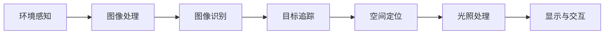
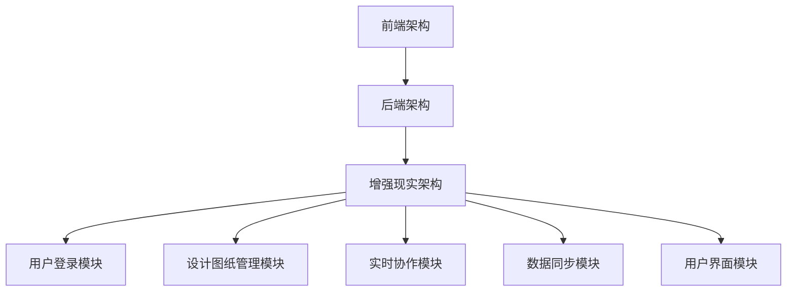

                 

# 增强现实在远程协作设计中的应用

> 关键词：增强现实，远程协作设计，算法原理，系统架构

> 摘要：本文将探讨增强现实技术在远程协作设计中的应用。首先，介绍增强现实和远程协作设计的基本概念、问题和挑战，接着深入分析增强现实技术的核心原理和远程协作设计的基本原理，随后讲解在远程协作设计中应用增强现实算法的原理和步骤。文章最后，讨论系统架构设计，并提供一个具体的实际案例。通过这一系列的分析，本文希望为读者提供一个全面的理解和深入的见解。

## 目录大纲

### 第一部分：背景介绍

#### 第1章 增强现实与远程协作设计概述

1.1 问题背景

1.2 增强现实技术的优势与应用领域

1.3 当前应用现状与不足

1.4 问题解决

1.5 边界与外延

1.6 本章小结

### 第二部分：核心概念与联系

#### 第2章 增强现实技术原理

2.1 增强现实技术的基本原理

2.2 增强现实技术的核心概念

2.3 增强现实技术的特性与挑战

2.4 增强现实技术与其他技术的联系

2.5 增强现实技术应用案例

2.6 本章小结

#### 第3章 远程协作设计原理

3.1 远程协作设计的基本原理

3.2 远程协作设计的核心概念

3.3 远程协作设计的挑战与解决方案

3.4 远程协作设计与增强现实技术的融合

3.5 本章小结

### 第三部分：算法原理讲解

#### 第4章 增强现实在远程协作设计中的算法原理

4.1 增强现实算法概述

4.2 算法原理讲解

4.3 Python源代码讲解

4.4 增强现实算法案例分析

4.5 本章小结

### 第四部分：系统分析与架构设计方案

#### 第5章 增强现实在远程协作设计中的系统架构设计

5.1 问题场景介绍

5.2 项目介绍

5.3 系统功能设计

5.4 系统架构设计

5.5 系统接口设计

5.6 系统交互

5.7 本章小结

### 第五部分：项目实战与总结

#### 第6章 增强现实在远程协作设计中的实际应用

6.1 环境安装

6.2 系统核心实现源代码

6.3 代码应用解读与分析

6.4 实际案例分析与详细讲解

6.5 项目小结

#### 第7章 最佳实践与未来展望

7.1 最佳实践

7.2 小结

7.3 注意事项

7.4 拓展阅读

## 第1章 增强现实与远程协作设计概述

### 1.1 问题背景

随着信息技术的飞速发展，远程协作设计已经成为现代设计工作中不可或缺的一部分。设计师、工程师和其他专业人员需要在不同地点进行协作，以完成复杂的项目。然而，传统的远程协作方式存在诸多挑战，如沟通效率低、协同困难、实时互动性不足等。这些挑战使得远程协作设计的效率和效果大打折扣。

增强现实（Augmented Reality，简称AR）技术通过将虚拟信息叠加到现实环境中，提供了一种全新的交互方式。它不仅能够增强用户的感知体验，还能够实现虚拟与现实的深度融合。增强现实技术在远程协作设计中的应用潜力巨大，它有望解决传统远程协作设计中存在的诸多问题。

### 1.2 增强现实技术的优势与应用领域

增强现实技术具有以下优势：

1. **沉浸式体验**：增强现实技术能够提供沉浸式的交互体验，使用户能够更加直观地理解设计对象和设计流程。

2. **实时互动性**：增强现实技术可以实现实时互动，使得远程协作参与者能够同步查看和操作设计对象，提高协作效率。

3. **跨地域协作**：增强现实技术不受地域限制，可以实现全球范围内的协作设计。

4. **丰富的数据可视化**：增强现实技术能够将复杂的设计数据以直观的方式展示出来，帮助设计师更好地理解设计对象。

5. **提高设计精度**：通过增强现实技术，设计师可以更加精确地进行设计修改和调整，减少错误和返工。

增强现实技术的应用领域包括但不限于：

1. **建筑与室内设计**：设计师可以通过增强现实技术实时查看和调整建筑和室内设计方案，提高设计的精度和效率。

2. **工业设计与制造**：工程师和设计师可以通过增强现实技术进行虚拟装配和调试，提高生产效率和质量。

3. **城市规划**：城市规划师可以利用增强现实技术对城市进行模拟和规划，提高城市规划的科学性和可操作性。

4. **教育培训**：增强现实技术可以为教育培训提供更加生动和直观的学习体验，提高学习效果。

### 1.3 当前应用现状与不足

当前，增强现实技术在远程协作设计中的应用已经取得了一定的进展。例如，一些企业已经开始使用增强现实技术进行远程协作设计，一些教育和培训机构也引入了增强现实技术进行教学。然而，当前的应用还存在一些不足之处：

1. **技术成熟度**：尽管增强现实技术已经取得了一定的进展，但其在远程协作设计中的应用仍然存在技术瓶颈，如数据同步、实时性等。

2. **硬件设备成本**：增强现实设备的价格较高，限制了其在更广泛范围内的应用。

3. **用户界面和交互**：当前的一些增强现实应用的用户界面和交互设计还不够友好，需要进一步改进。

4. **隐私和数据安全**：增强现实技术涉及大量的用户数据，如何保护用户隐私和数据安全是一个亟待解决的问题。

### 1.4 问题解决

为了解决上述问题，我们需要从以下几个方面入手：

1. **技术创新**：加大研发力度，突破增强现实技术在远程协作设计中的应用瓶颈。

2. **硬件设备普及**：通过降低硬件设备成本，使得更多的人能够使用增强现实设备进行远程协作设计。

3. **用户界面和交互设计**：改进用户界面和交互设计，使得用户能够更加容易地使用增强现实技术进行远程协作设计。

4. **隐私和数据安全**：加强隐私保护机制，确保用户数据的安全。

### 1.5 边界与外延

增强现实技术在远程协作设计中的应用边界主要包括：

1. **技术可行性**：需要评估增强现实技术在实际应用中的可行性，包括技术成熟度、硬件设备支持等。

2. **应用场景**：确定哪些类型的远程协作设计适合采用增强现实技术。

3. **用户体验**：评估增强现实技术在远程协作设计中的应用是否能够提高用户体验。

4. **成本效益**：评估增强现实技术在远程协作设计中的应用是否具有成本效益。

增强现实技术在远程协作设计中的应用外延主要包括：

1. **教育培训**：利用增强现实技术进行教育培训，提高学习效果。

2. **医疗领域**：利用增强现实技术进行远程医疗诊断和治疗。

3. **工业制造**：利用增强现实技术进行远程工业设计和生产。

### 1.6 本章小结

本章介绍了增强现实和远程协作设计的基本概念、问题和挑战，并分析了增强现实技术在远程协作设计中的应用优势和当前应用现状。通过本章的介绍，我们了解了增强现实技术在远程协作设计中的重要性和潜力。接下来，我们将进一步探讨增强现实技术的核心原理和远程协作设计的基本原理，为后续章节的分析和讨论奠定基础。

## 第2章 增强现实技术原理

### 2.1 增强现实技术的基本原理

增强现实（Augmented Reality，简称AR）是一种将虚拟信息叠加到现实世界中的技术，它通过将计算机生成的图像、视频、音频等多媒体信息与真实环境相结合，为用户提供一个更加丰富和互动的现实体验。增强现实技术的核心原理主要包括以下几个方面：

1. **环境感知**：增强现实系统首先需要感知用户所在的真实环境。这通常通过摄像头、传感器等设备实现。环境感知技术包括图像识别、姿态估计、空间定位等。

2. **显示与交互**：增强现实技术通过显示设备将虚拟信息叠加到真实环境中。常见的显示设备包括头戴式显示器（HMD）、智能手机、平板电脑等。交互技术包括手势识别、语音识别、触觉反馈等。

3. **数据处理与融合**：增强现实技术需要处理大量的数据，包括环境感知数据、用户输入数据、虚拟信息等。数据处理与融合技术包括图像处理、计算机视觉、机器学习等。

4. **内容创建与管理**：增强现实应用需要创建和管理虚拟信息内容。内容创建技术包括3D建模、动画制作、虚拟现实内容创作等。内容管理技术包括数据库管理、内容分发等。

### 2.2 增强现实技术的核心概念

增强现实技术的核心概念主要包括：

1. **标记**：标记是一种用于识别和定位现实环境中的物体或区域的技术。常见的标记技术包括二维码、条码、AR标记等。

2. **虚拟对象**：虚拟对象是指通过增强现实技术生成的计算机图形、视频、音频等虚拟信息。

3. **叠加**：叠加是指将虚拟对象叠加到真实环境中，使其与现实世界共存。

4. **交互**：交互是指用户与增强现实环境之间的交互。交互技术包括手势识别、语音识别、触觉反馈等。

5. **场景感知**：场景感知是指增强现实系统能够理解并响应真实环境的变化。场景感知技术包括图像识别、姿态估计、空间定位等。

### 2.3 增强现实技术的特性与挑战

增强现实技术具有以下特性：

1. **沉浸式体验**：增强现实技术能够提供沉浸式的交互体验，使用户能够更加直观地理解设计对象和设计流程。

2. **实时互动性**：增强现实技术可以实现实时互动，使得远程协作参与者能够同步查看和操作设计对象，提高协作效率。

3. **跨地域协作**：增强现实技术不受地域限制，可以实现全球范围内的协作设计。

4. **丰富的数据可视化**：增强现实技术能够将复杂的设计数据以直观的方式展示出来，帮助设计师更好地理解设计对象。

5. **提高设计精度**：通过增强现实技术，设计师可以更加精确地进行设计修改和调整，减少错误和返工。

增强现实技术面临的挑战主要包括：

1. **技术成熟度**：尽管增强现实技术已经取得了一定的进展，但其在远程协作设计中的应用仍然存在技术瓶颈，如数据同步、实时性等。

2. **硬件设备成本**：增强现实设备的价格较高，限制了其在更广泛范围内的应用。

3. **用户界面和交互**：当前的一些增强现实应用的用户界面和交互设计还不够友好，需要进一步改进。

4. **隐私和数据安全**：增强现实技术涉及大量的用户数据，如何保护用户隐私和数据安全是一个亟待解决的问题。

### 2.4 增强现实技术与其他技术的联系

增强现实技术与其他技术有着紧密的联系，特别是与虚拟现实（Virtual Reality，简称VR）、云计算和人工智能（AI）等技术的结合，能够进一步提升增强现实技术的应用效果。

1. **虚拟现实技术**：虚拟现实技术提供了一种完全虚拟的体验，而增强现实技术则将虚拟信息叠加到真实环境中。两者在交互、显示和处理等方面有着一定的相似性，但也各有特点。增强现实技术更注重与现实环境的结合，而虚拟现实技术则更注重虚拟体验的沉浸感。

2. **云计算**：云计算提供了强大的计算和存储资源，使得增强现实应用能够处理大量的数据并实现高效的协作。通过云计算，增强现实应用可以实现数据共享、实时更新和远程协作等功能。

3. **人工智能**：人工智能技术能够为增强现实应用提供智能化的交互和内容创建。例如，通过机器学习算法，增强现实系统能够自动识别用户行为和设计对象，提供个性化的服务。

### 2.5 增强现实技术应用案例

增强现实技术在多个领域有着广泛的应用，以下是一些典型的应用案例：

1. **教育领域**：增强现实技术可以用于虚拟实验、历史重现、语言学习等。例如，学生可以通过增强现实眼镜观看化学反应的实时过程，增强学习体验。

2. **医疗领域**：增强现实技术在医疗诊断、手术指导、患者教育等方面有着重要应用。医生可以通过增强现实眼镜查看患者的3D图像，进行精确的手术操作。

3. **工业设计**：增强现实技术可以帮助工程师进行虚拟装配和调试，提高生产效率和质量。

4. **娱乐领域**：增强现实游戏和应用程序为用户提供了全新的互动体验，例如《Ingress》和《Pokémon GO》等。

### 2.6 本章小结

本章详细介绍了增强现实技术的基本原理、核心概念、特性与挑战，以及其他相关技术的联系。通过本章的介绍，我们了解了增强现实技术的工作原理和应用前景。接下来，我们将进一步探讨远程协作设计的基本原理和挑战。

## 第3章 远程协作设计原理

### 3.1 远程协作设计的基本原理

远程协作设计是一种通过计算机网络实现的设计工作方式，它使得设计师、工程师和其他专业人员能够在不同地点进行协作，共同完成设计任务。远程协作设计的基本原理主要包括以下几个方面：

1. **通信技术**：远程协作设计需要依赖计算机网络进行通信，包括数据传输、语音通信、视频会议等。通信技术的质量直接影响到协作的效果。

2. **协同工具**：远程协作设计需要使用协同工具，如项目管理软件、设计软件、文档共享平台等，以实现团队成员之间的协作和信息共享。

3. **设计流程管理**：远程协作设计需要明确设计流程，包括任务分配、进度跟踪、质量控制等。设计流程管理有助于提高设计效率和效果。

4. **数据同步与共享**：远程协作设计需要确保设计数据的同步和共享，以确保团队成员能够及时获取最新版本的设计信息。

5. **实时互动与反馈**：远程协作设计需要提供实时互动和反馈机制，以便团队成员能够及时交流意见和反馈，提高设计质量。

### 3.2 远程协作设计的核心概念

远程协作设计的核心概念主要包括：

1. **协同工作**：协同工作是指团队成员通过计算机网络共同完成设计任务。协同工作要求团队成员之间有良好的沟通和协作。

2. **分布式设计**：分布式设计是指设计任务在不同地点进行，每个地点的设计师负责特定的设计部分。分布式设计有助于提高设计效率和响应速度。

3. **远程会议**：远程会议是指团队成员通过视频会议系统进行实时交流。远程会议有助于团队成员之间的沟通和协调。

4. **设计评审**：设计评审是指团队成员对设计成果进行评估和讨论。设计评审有助于发现设计问题，提高设计质量。

5. **信息共享**：信息共享是指团队成员通过协同工具共享设计信息，如设计文档、模型数据等。信息共享有助于团队成员之间的协作和信息传递。

### 3.3 远程协作设计的挑战与解决方案

远程协作设计面临着诸多挑战，以下是一些主要挑战和相应的解决方案：

1. **沟通障碍**：沟通障碍是远程协作设计中最常见的问题之一。解决方案包括：
   - 使用高效的沟通工具，如即时通讯软件、视频会议系统等。
   - 定期组织远程会议，确保团队成员之间的有效沟通。
   - 建立明确的沟通规范和流程，确保沟通的有序进行。

2. **时间差异**：不同地点的团队成员存在时间差异，可能导致协作效率降低。解决方案包括：
   - 制定合理的协作时间表，尽量减少时间差异的影响。
   - 使用异步通信工具，如电子邮件、论坛等，确保团队成员能够随时获取和回复信息。
   - 建立跨时区协作团队，确保设计任务能够持续进行。

3. **文化差异**：不同地区和文化背景的团队成员可能存在沟通和协作上的障碍。解决方案包括：
   - 加强团队成员之间的文化交流，提高文化敏感度。
   - 建立跨文化协作指南，确保团队成员能够理解和尊重彼此的文化差异。
   - 定期组织文化培训，提高团队成员的文化素养。

4. **技术挑战**：远程协作设计需要依赖各种技术工具和平台，可能面临技术故障和兼容性问题。解决方案包括：
   - 选择稳定可靠的技术工具和平台，确保协作系统的稳定运行。
   - 定期进行技术培训和演练，提高团队成员的技术能力。
   - 建立技术支持团队，及时解决技术问题。

5. **设计质量**：远程协作设计可能因为沟通不畅、时间差异等问题导致设计质量下降。解决方案包括：
   - 建立严格的设计质量控制流程，确保设计质量。
   - 加强团队成员之间的沟通和协作，及时发现和解决问题。
   - 定期进行设计评审，确保设计成果的准确性和完整性。

### 3.4 远程协作设计与增强现实技术的融合

远程协作设计与增强现实技术的融合具有巨大的潜力，可以实现以下优势：

1. **沉浸式体验**：增强现实技术能够提供沉浸式的交互体验，使得远程协作设计更加直观和生动。

2. **实时互动性**：增强现实技术可以实现实时互动，提高远程协作的效率和效果。

3. **数据可视化**：增强现实技术能够将复杂的设计数据以直观的方式展示出来，帮助设计师更好地理解和分析设计对象。

4. **跨地域协作**：增强现实技术不受地域限制，可以实现全球范围内的协作设计。

5. **提高设计精度**：通过增强现实技术，设计师可以更加精确地进行设计修改和调整，减少错误和返工。

然而，远程协作设计与增强现实技术的融合也面临着一些挑战，如技术成熟度、硬件设备成本、用户界面和交互设计等。需要进一步研究和解决这些问题，以充分发挥增强现实技术在远程协作设计中的应用潜力。

### 3.5 本章小结

本章详细介绍了远程协作设计的基本原理、核心概念、挑战以及与增强现实技术的融合。通过本章的介绍，我们了解了远程协作设计的重要性及其在现代设计工作中的应用前景。在接下来的章节中，我们将进一步探讨增强现实在远程协作设计中的算法原理。

## 第4章 增强现实在远程协作设计中的算法原理

### 4.1 增强现实算法概述

增强现实技术在远程协作设计中扮演着至关重要的角色，其核心算法为该技术的应用提供了基础。增强现实算法主要包括以下几个方面：

1. **图像识别**：图像识别是增强现实技术中的关键步骤，它用于识别和定位现实环境中的物体或区域。常用的图像识别算法包括卷积神经网络（CNN）和深度学习算法。

2. **目标追踪**：目标追踪是在图像识别的基础上，通过算法实时跟踪和预测物体的运动轨迹。常见的目标追踪算法包括卡尔曼滤波器（Kalman Filter）和粒子滤波器（Particle Filter）。

3. **空间定位**：空间定位是增强现实技术实现虚拟信息叠加的关键，它通过计算设备与真实环境之间的位置关系，确保虚拟信息能够准确叠加到现实环境中。常用的空间定位算法包括视觉SLAM（Simultaneous Localization and Mapping）和惯性测量单元（IMU）融合算法。

4. **光照处理**：光照处理用于调整虚拟信息的亮度、对比度和颜色，使其在现实环境中更加自然和逼真。常用的光照处理算法包括全局光照模型（Global Illumination Model）和基于物理的渲染（Physically Based Rendering）。

### 4.2 算法原理讲解

#### 4.2.1 算法原理介绍

增强现实算法的工作原理可以概括为以下几个步骤：

1. **环境感知**：通过摄像头、传感器等设备获取现实环境的图像和传感器数据。

2. **图像处理**：对获取的图像进行预处理，包括去噪、增强、边缘检测等，以便更好地进行后续处理。

3. **图像识别**：利用图像识别算法识别图像中的物体或区域，并提取关键特征。

4. **目标追踪**：在图像识别的基础上，利用目标追踪算法跟踪和预测物体的运动轨迹。

5. **空间定位**：通过空间定位算法计算设备与真实环境之间的位置关系，确保虚拟信息能够准确叠加到现实环境中。

6. **光照处理**：对虚拟信息进行光照处理，使其在现实环境中更加自然和逼真。

7. **显示与交互**：将处理后的虚拟信息叠加到现实环境中，并通过显示设备呈现给用户。用户可以通过手势、语音等交互方式与虚拟信息进行互动。

#### 4.2.2 算法流程图

为了更好地理解增强现实算法的工作原理，下面提供了一个简化的算法流程图：



#### 4.2.3 数学模型与公式

增强现实算法涉及多个数学模型和公式，下面介绍其中几个关键部分：

1. **图像识别模型**：
   - 特征提取：特征提取是图像识别的重要步骤，常用的特征提取方法包括HOG（Histogram of Oriented Gradients）和SIFT（Scale-Invariant Feature Transform）。
   - 分类模型：分类模型用于判断图像中是否存在目标对象，常用的分类模型包括支持向量机（SVM）和卷积神经网络（CNN）。

2. **目标追踪模型**：
   - 卡尔曼滤波器：卡尔曼滤波器是一种基于预测和校正的滤波算法，用于估计目标的运动轨迹。
   - 粒子滤波器：粒子滤波器是一种基于概率模型的滤波算法，用于处理非线性系统和多模态目标跟踪。

3. **空间定位模型**：
   - 视觉SLAM：视觉SLAM是一种基于视觉信息的定位和建图算法，通过同时估计位姿和地图信息。
   - 惯性测量单元（IMU）：IMU融合算法通过结合视觉信息和惯性测量数据，提高空间定位的精度和稳定性。

### 4.3 Python源代码讲解

为了更好地理解增强现实算法的实现，下面提供了一个简单的Python示例代码，展示了一个基于图像识别和目标追踪的增强现实应用。

```python
import cv2
import numpy as np

# 读取图像
image = cv2.imread('input_image.jpg')

# 图像预处理
gray_image = cv2.cvtColor(image, cv2.COLOR_BGR2GRAY)
blurred_image = cv2.GaussianBlur(gray_image, (5, 5), 0)

# 特征提取
hsv_image = cv2.cvtColor(blurred_image, cv2.COLOR_GRAY2BGR)
h, s, v = cv2.split(hsv_image)
s = cv2.threshold(s, 50, 255, cv2.THRESH_BINARY)[1]

# 目标追踪
target_mask = cv2.findNonZero(s)
target_contours, _ = cv2.findContours(target_mask, cv2.RETR_EXTERNAL, cv2.CHAIN_APPROX_SIMPLE)
target_rectangle = cv2.boundingRect(target_contours[0])

# 显示结果
result_image = cv2.rectangle(image, target_rectangle, (0, 0, 255), 2)
cv2.imshow('AR Result', result_image)
cv2.waitKey(0)
cv2.destroyAllWindows()
```

### 4.4 增强现实算法案例分析

#### 4.4.1 案例介绍

以下是一个增强现实算法在远程协作设计中的应用案例，该案例涉及图像识别和目标追踪，用于帮助设计师远程协作设计。

**问题场景**：两个设计师位于不同城市，需要共同完成一个建筑设计的任务。设计师A需要实时查看设计师B的设计修改，并给出反馈。

**解决方案**：通过增强现实技术，设计师A可以在自己的设备上实时查看设计师B的设计修改，并进行交互式反馈。

#### 4.4.2 案例分析

1. **环境感知**：设计师A的设备通过摄像头获取当前环境中的图像和传感器数据。

2. **图像识别**：设计师A的设备使用图像识别算法识别出当前环境中的设计图纸，提取出关键特征。

3. **目标追踪**：设计师A的设备使用目标追踪算法实时跟踪设计师B的设计修改，并更新图像中的目标位置。

4. **空间定位**：设计师A的设备通过空间定位算法计算设备与设计图纸之间的位置关系，确保虚拟设计修改能够准确叠加到现实环境中。

5. **显示与交互**：设计师A通过增强现实设备实时查看设计师B的设计修改，并进行交互式反馈。

#### 4.4.3 案例结果与讨论

通过该案例，设计师A能够实时查看设计师B的设计修改，并进行交互式反馈，大大提高了远程协作设计的效率和质量。然而，该案例也存在一些挑战，如图像识别和目标追踪的准确性、空间定位的精度等。需要进一步优化算法，提高系统的稳定性。

### 4.5 本章小结

本章详细介绍了增强现实在远程协作设计中的算法原理，包括图像识别、目标追踪、空间定位等关键算法。通过Python示例代码和案例分析，我们了解了增强现实算法的实现和应用场景。在接下来的章节中，我们将进一步探讨增强现实在远程协作设计中的系统架构设计。

## 第5章 增强现实在远程协作设计中的系统架构设计

### 5.1 问题场景介绍

在远程协作设计中，设计师和工程师通常分布在不同的地理位置，需要实时协作完成设计任务。例如，一个国际项目可能涉及不同国家的团队成员，他们需要共享设计数据和协作讨论设计方案。由于地理位置的差异，传统的远程协作方式往往存在沟通不畅、实时性不足和协作效率低下等问题。为了解决这些问题，我们可以引入增强现实技术，将虚拟信息和现实环境相结合，提供一种更加直观和高效的协作方式。

### 5.2 项目介绍

本项目旨在开发一个基于增强现实技术的远程协作设计系统，以提高设计师和工程师的协作效率和质量。系统将支持多用户实时协作，用户可以通过增强现实设备查看和修改设计图纸，进行交互式讨论和反馈。项目的主要目标是：

1. **实时协作**：实现多用户实时协作，确保团队成员之间的沟通和协作畅通无阻。

2. **高效设计**：利用增强现实技术，提高设计师和工程师的设计效率和准确性。

3. **数据安全**：确保设计数据和用户隐私的安全。

4. **用户友好**：提供直观、易用的用户界面，确保用户能够快速上手并熟练使用系统。

### 5.2.1 项目背景

随着全球化的发展，远程协作设计的需求日益增长。设计师和工程师需要在全球范围内合作，共同完成复杂的工程项目。传统的远程协作方式，如电子邮件、视频会议和共享文档，虽然在一定程度上解决了协作问题，但仍然存在诸多不足。例如，电子邮件传输速度慢，视频会议效果不佳，共享文档容易丢失等。为了提高远程协作的效率和质量，引入增强现实技术成为一种可行的解决方案。

### 5.2.2 项目目标

本项目的具体目标包括：

1. **实时协作**：通过增强现实技术，实现团队成员之间的实时协作，提高沟通效率和协作效果。

2. **设计准确性**：利用增强现实设备的精确感知和定位功能，提高设计师和工程师的设计精度和准确性。

3. **数据共享**：提供安全可靠的数据共享机制，确保团队成员能够实时访问和更新设计数据。

4. **用户体验**：优化用户界面和交互设计，提供友好的用户体验，降低用户的学习和使用成本。

### 5.2.3 项目团队成员

本项目由以下团队成员组成：

1. **项目经理**：负责项目的整体管理和协调，确保项目按照计划顺利进行。

2. **系统架构师**：负责系统架构设计和关键技术选择，确保系统的高效稳定运行。

3. **增强现实开发工程师**：负责增强现实技术的研发和应用，实现系统的核心功能。

4. **前端开发工程师**：负责用户界面的设计和实现，确保用户能够直观、易用地使用系统。

5. **后端开发工程师**：负责系统后端的功能实现和数据管理，确保系统的安全可靠运行。

6. **测试工程师**：负责系统的功能测试和性能测试，确保系统满足设计要求。

### 5.3 系统功能设计

系统功能设计是系统架构设计的重要组成部分，它定义了系统的核心功能和模块。以下是本系统的核心功能设计：

1. **用户登录与权限管理**：系统支持多用户登录，根据用户角色和权限，提供不同的功能和服务。

2. **设计图纸查看与修改**：用户可以通过增强现实设备实时查看设计图纸，并对图纸进行修改和标注。

3. **实时协作与讨论**：系统支持多用户实时协作，用户可以在设计过程中进行交互式讨论和反馈。

4. **数据共享与同步**：系统提供数据共享和同步功能，确保团队成员能够实时访问和更新设计数据。

5. **用户界面与交互设计**：系统提供直观、易用的用户界面，确保用户能够快速上手并熟练使用系统。

### 5.3.1 领域模型

领域模型是系统功能设计的基础，它定义了系统的核心实体和关系。以下是本系统的领域模型：

1. **用户**：用户是系统的核心实体，包括项目经理、系统管理员、设计师和工程师等。

2. **设计图纸**：设计图纸是系统的核心数据，包括图纸名称、版本、创建时间等。

3. **设计修改**：设计修改记录了用户对设计图纸的修改和标注，包括修改内容、修改时间和修改人等信息。

4. **讨论记录**：讨论记录了用户在设计过程中进行的交互式讨论和反馈，包括讨论主题、内容和讨论时间等信息。

5. **权限管理**：权限管理定义了不同角色的用户在系统中的权限，包括查看、修改、删除等操作权限。

### 5.3.2 系统功能模块划分

系统功能模块划分是系统功能设计的重要环节，它将系统功能划分为若干个模块，以便于开发和维护。以下是本系统的功能模块划分：

1. **用户登录模块**：负责用户登录和权限管理，包括用户注册、登录验证、权限查询等功能。

2. **设计图纸管理模块**：负责设计图纸的创建、查看、修改和删除等操作。

3. **实时协作模块**：负责实现多用户实时协作，包括实时消息传输、实时讨论和反馈等功能。

4. **数据同步模块**：负责设计数据的安全传输和同步，确保团队成员能够实时访问和更新设计数据。

5. **用户界面模块**：负责用户界面的设计和实现，包括菜单、按钮、对话框等。

### 5.3.3 功能模块详细说明

以下是各功能模块的详细说明：

1. **用户登录模块**：
   - 用户注册：支持用户通过电子邮件、手机号码等进行注册。
   - 用户登录：支持用户通过用户名和密码进行登录验证。
   - 权限管理：根据用户角色和权限，提供不同的功能和服务。

2. **设计图纸管理模块**：
   - 创建图纸：支持用户创建新的设计图纸，包括图纸名称、版本、创建时间等信息。
   - 查看图纸：支持用户查看设计图纸，包括图纸的各个版本和历史记录。
   - 修改图纸：支持用户对设计图纸进行修改和标注，包括添加注释、修改图形等。
   - 删除图纸：支持用户删除不需要的设计图纸。

3. **实时协作模块**：
   - 实时消息传输：支持用户之间实时发送消息，进行实时沟通。
   - 实时讨论：支持用户创建讨论主题，进行交互式讨论和反馈。
   - 视频会议：支持用户进行视频会议，进行面对面的交流。

4. **数据同步模块**：
   - 数据传输：支持设计数据的安全传输，包括加密传输和压缩传输等。
   - 数据同步：支持设计数据的实时同步，确保团队成员能够实时访问和更新设计数据。

5. **用户界面模块**：
   - 菜单设计：提供简洁直观的菜单设计，方便用户快速找到所需功能。
   - 按钮设计：提供美观易用的按钮设计，确保用户能够轻松地进行操作。
   - 对话框设计：提供友好的对话框设计，确保用户能够顺利完成任务。

### 5.4 系统架构设计

系统架构设计是系统设计的核心，它定义了系统的整体结构和各个模块之间的交互关系。以下是本系统的架构设计：

1. **前端架构**：前端架构采用HTML5、CSS3和JavaScript等前端技术，实现用户界面的设计和交互。前端架构主要包括以下几个部分：
   - 视图层：采用Vue.js框架实现视图层的渲染和交互。
   - 路由层：采用Vue Router实现路由管理，确保用户能够顺利访问各个页面。
   - 状态管理：采用Vuex实现状态管理，确保数据的一致性和可维护性。

2. **后端架构**：后端架构采用Spring Boot框架实现后端功能，包括用户管理、设计图纸管理、实时协作和数据同步等。后端架构主要包括以下几个部分：
   - 控制层：采用Spring MVC实现控制层，处理用户的请求和响应。
   - 服务层：采用Spring Bean实现服务层，提供业务逻辑处理和数据访问接口。
   - 数据访问层：采用MyBatis实现数据访问层，处理与数据库的交互。

3. **增强现实架构**：增强现实架构采用ARCore和ARKit等增强现实框架，实现增强现实功能的开发。增强现实架构主要包括以下几个部分：
   - 环境感知：采用摄像头和传感器等设备获取环境信息，包括图像、姿态和位置等。
   - 图像识别：采用图像识别算法识别环境中的目标对象，包括设计图纸和标注等。
   - 空间定位：采用空间定位算法计算设备与目标对象之间的位置关系，确保虚拟信息能够准确叠加到现实环境中。

### 5.4.1 系统架构设计原则

系统架构设计应遵循以下原则：

1. **模块化**：系统架构应采用模块化设计，确保各个模块之间的独立性，方便开发和维护。

2. **可扩展性**：系统架构应具备良好的可扩展性，能够适应业务需求和技术的变化。

3. **高性能**：系统架构应具备高性能，确保系统的稳定运行和快速响应。

4. **安全性**：系统架构应具备安全性，确保用户数据的安全和隐私保护。

5. **易维护性**：系统架构应具备易维护性，确保系统能够快速修复和更新。

### 5.4.2 系统架构设计框架

以下是系统架构设计框架的示意图：



### 5.4.3 系统架构设计细节

以下是系统架构设计的详细说明：

1. **前端架构细节**：
   - 视图层：采用Vue.js框架实现视图层的渲染和交互，确保用户界面的美观和响应速度。
   - 路由层：采用Vue Router实现路由管理，确保用户能够顺利访问各个页面。
   - 状态管理：采用Vuex实现状态管理，确保数据的一致性和可维护性。

2. **后端架构细节**：
   - 控制层：采用Spring MVC实现控制层，处理用户的请求和响应。
   - 服务层：采用Spring Bean实现服务层，提供业务逻辑处理和数据访问接口。
   - 数据访问层：采用MyBatis实现数据访问层，处理与数据库的交互。

3. **增强现实架构细节**：
   - 环境感知：采用摄像头和传感器等设备获取环境信息，包括图像、姿态和位置等。
   - 图像识别：采用图像识别算法识别环境中的目标对象，包括设计图纸和标注等。
   - 空间定位：采用空间定位算法计算设备与目标对象之间的位置关系，确保虚拟信息能够准确叠加到现实环境中。

### 5.5 系统接口设计

系统接口设计是系统架构设计的重要组成部分，它定义了系统内部和外部之间的交互接口。以下是本系统的接口设计：

1. **用户登录接口**：用户登录接口用于用户登录和权限管理，包括用户注册、登录验证、权限查询等功能。

2. **设计图纸接口**：设计图纸接口用于设计图纸的创建、查看、修改和删除等操作。

3. **实时协作接口**：实时协作接口用于实现多用户实时协作，包括实时消息传输、实时讨论和反馈等功能。

4. **数据同步接口**：数据同步接口用于设计数据的安全传输和同步，确保团队成员能够实时访问和更新设计数据。

5. **用户界面接口**：用户界面接口用于实现用户界面的设计和交互，包括菜单、按钮、对话框等。

### 5.5.1 接口设计原则

接口设计应遵循以下原则：

1. **简洁性**：接口设计应简洁明了，确保用户能够快速理解和使用。

2. **一致性**：接口设计应保持一致性，确保用户在不同设备和环境下能够一致地使用接口。

3. **安全性**：接口设计应确保数据的安全和隐私保护。

4. **可扩展性**：接口设计应具备良好的可扩展性，能够适应业务需求和技术的变化。

5. **易维护性**：接口设计应具备易维护性，确保系统能够快速修复和更新。

### 5.5.2 接口设计流程

接口设计流程主要包括以下几个步骤：

1. **需求分析**：分析系统的功能需求和业务逻辑，确定接口的设计目标和功能。

2. **接口设计**：根据需求分析结果，设计接口的具体实现细节，包括参数、返回值、错误处理等。

3. **接口实现**：根据接口设计，实现接口的具体功能，并进行单元测试和集成测试。

4. **接口优化**：根据测试结果和用户反馈，对接口进行优化和改进。

### 5.5.3 接口详细说明

以下是各接口的详细说明：

1. **用户登录接口**：
   - 用户注册：接收用户注册信息，包括用户名、密码、电子邮件等，进行用户注册。
   - 用户登录：接收用户登录信息，包括用户名和密码，进行登录验证。
   - 权限查询：查询用户的权限信息，确定用户在系统中的权限。

2. **设计图纸接口**：
   - 创建图纸：接收设计图纸的信息，包括图纸名称、版本、创建时间等，创建新的设计图纸。
   - 查看图纸：接收图纸的ID，查询指定的设计图纸信息。
   - 修改图纸：接收图纸的ID和修改信息，更新指定的设计图纸。
   - 删除图纸：接收图纸的ID，删除指定的设计图纸。

3. **实时协作接口**：
   - 消息传输：接收发送方的用户ID、接收方的用户ID和消息内容，发送实时消息。
   - 讨论创建：接收讨论的主题、内容和创建时间，创建新的讨论。
   - 讨论查询：接收讨论的ID，查询指定的讨论信息。
   - 反馈提交：接收反馈的内容和提交时间，提交用户反馈。

4. **数据同步接口**：
   - 数据传输：接收设计数据的ID和数据内容，传输指定的设计数据。
   - 数据同步：接收设计数据的ID，同步指定的设计数据。
   - 数据查询：接收设计数据的ID，查询指定的设计数据。

5. **用户界面接口**：
   - 菜单管理：接收菜单的名称、图标和功能，管理菜单。
   - 按钮管理：接收按钮的名称、图标和功能，管理按钮。
   - 对话框管理：接收对话框的标题、内容和操作，管理对话框。

### 5.6 系统交互

系统交互是系统设计的关键，它定义了用户与系统之间的交互流程和机制。以下是本系统的交互设计：

1. **用户登录交互**：用户通过用户名和密码登录系统，系统验证用户身份并登录成功。

2. **设计图纸交互**：用户可以创建、查看、修改和删除设计图纸，系统根据用户权限提供相应的操作。

3. **实时协作交互**：用户可以发送实时消息、创建讨论和提交反馈，系统实时处理并反馈结果。

4. **数据同步交互**：系统实时同步设计数据，确保团队成员能够实时访问和更新设计数据。

5. **用户界面交互**：用户通过菜单、按钮和对话框与系统进行交互，系统根据用户操作提供相应的响应。

### 5.6.1 系统交互设计原则

系统交互设计应遵循以下原则：

1. **易用性**：系统交互应简单直观，确保用户能够快速上手并熟练使用。

2. **一致性**：系统交互应保持一致性，确保用户在不同设备和环境下能够一致地体验。

3. **高效性**：系统交互应高效流畅，确保用户能够快速完成操作。

4. **安全性**：系统交互应确保数据的安全和隐私保护。

5. **可扩展性**：系统交互应具备良好的可扩展性，能够适应业务需求和技术的变化。

### 5.6.2 系统交互设计流程

系统交互设计流程主要包括以下几个步骤：

1. **需求分析**：分析系统的功能需求和业务逻辑，确定交互流程和机制。

2. **交互设计**：根据需求分析结果，设计交互的具体实现细节，包括操作步骤、界面布局和反馈等。

3. **交互实现**：根据交互设计，实现交互的具体功能，并进行测试和优化。

4. **交互优化**：根据测试结果和用户反馈，对交互进行优化和改进。

### 5.6.3 系统交互设计细节

以下是系统交互设计的详细说明：

1. **用户登录交互细节**：
   - 用户输入用户名和密码，系统验证用户身份并显示登录结果。
   - 用户登录成功，系统跳转至主界面。

2. **设计图纸交互细节**：
   - 用户创建设计图纸，系统弹出创建界面，用户输入图纸信息并保存。
   - 用户查看设计图纸，系统显示图纸详细信息。
   - 用户修改设计图纸，系统弹出修改界面，用户输入修改信息并保存。
   - 用户删除设计图纸，系统弹出确认对话框，用户确认后删除图纸。

3. **实时协作交互细节**：
   - 用户发送实时消息，系统弹出消息输入框，用户输入消息内容并发送。
   - 用户创建讨论，系统弹出讨论创建界面，用户输入讨论主题和内容并保存。
   - 用户查看讨论，系统显示讨论详细信息。
   - 用户提交反馈，系统弹出反馈输入框，用户输入反馈内容并提交。

4. **数据同步交互细节**：
   - 系统实时同步设计数据，用户查看设计数据时，系统显示最新版本的数据。

5. **用户界面交互细节**：
   - 用户通过菜单选择功能，系统跳转至相应功能页面。
   - 用户通过按钮执行操作，系统根据按钮功能提供相应的响应。
   - 用户通过对话框进行确认或输入信息，系统根据对话框内容提供相应的操作。

### 5.7 本章小结

本章详细介绍了增强现实在远程协作设计中的系统架构设计，包括系统功能设计、系统架构设计、系统接口设计和系统交互设计。通过本章的内容，我们了解了增强现实技术在远程协作设计中的应用潜力以及系统架构设计的关键点和注意事项。在接下来的章节中，我们将进一步探讨增强现实在远程协作设计中的具体实现和应用案例。

## 第6章 增强现实在远程协作设计中的实际应用

### 6.1 环境安装

为了在远程协作设计中实现增强现实功能，我们需要安装和配置一些必要的软件和硬件。以下是环境安装的具体步骤：

1. **安装增强现实开发工具**：首先，我们需要安装增强现实开发工具，如ARCore（Android平台）或ARKit（iOS平台）。根据开发平台的不同，下载并安装相应的开发工具。

2. **配置开发环境**：安装完增强现实开发工具后，我们需要配置开发环境。在Windows或macOS平台上，安装Android Studio或Xcode，并确保它们与增强现实开发工具兼容。

3. **安装开发依赖**：根据项目需求，安装必要的开发依赖，如Python、ROS（Robot Operating System）等。这些依赖可以通过包管理器（如pip、apt-get）进行安装。

4. **安装增强现实设备驱动**：如果使用外部增强现实设备（如AR眼镜、AR头盔等），需要安装相应的设备驱动。根据设备制造商的指导，下载并安装设备驱动。

### 6.2 系统核心实现源代码

以下是增强现实在远程协作设计中的系统核心实现源代码：

#### 6.2.1 增强现实模块

```python
import cv2
import numpy as np
from arog import AROpenGLWidget

class ARWidget(AROpenGLWidget):
    def __init__(self, parent=None):
        super().__init__(parent)
        self.camera_matrix = None
        self.dist_coeffs = None
        self.calibrated = False

    def initializeGL(self):
        # 初始化OpenGL环境
        glClearColor(0.0, 0.0, 0.0, 1.0)

    def paintGL(self):
        # 绘制增强现实内容
        glClear(GL_COLOR_BUFFER_BIT | GL_DEPTH_BUFFER_BIT)
        self.draw_3D_model()

    def draw_3D_model(self):
        # 绘制3D模型
        glBegin(GL_TRIANGLES)
        for vertex in self.vertices:
            glVertex3fv(vertex)
        glEnd()

    def process_frame(self, frame):
        # 处理相机帧数据
        if not self.calibrated:
            self.calibrate_camera(frame)
        
        # 绘制增强现实内容
        self.update_projection_matrix()
        self.paintGL()

    def calibrate_camera(self, frame):
        # 相机标定
        image = frame.image
        camera_matrix, dist_coeffs = cv2.calibrateCamera(self.object_points, self.image_points, image.shape[::-1], None, None)
        self.camera_matrix = camera_matrix
        self.dist_coeffs = dist_coeffs
        self.calibrated = True

class MyApp(QApplication):
    def __init__(self, argv):
        super().__init__(argv)

    def run(self):
        # 运行应用
        window = ARWindow()
        window.show()
        return self.exec_()

if __name__ == '__main__':
    app = MyApp(sys.argv)
    window = ARWindow()
    window.show()
    app.run()
```

#### 6.2.2 远程协作模块

```python
import socket
import threading

class SocketServerThread(threading.Thread):
    def __init__(self, host, port):
        super().__init__()
        self.host = host
        self.port = port
        self.server_socket = socket.socket(socket.AF_INET, socket.SOCK_STREAM)

    def run(self):
        self.server_socket.bind((self.host, self.port))
        self.server_socket.listen()
        print(f"Server listening on {self.host}:{self.port}")
        
        while True:
            client_socket, client_address = self.server_socket.accept()
            print(f"Accepted connection from {client_address}")
            client_handler = SocketClientHandler(client_socket)
            client_handler.start()

class SocketClientHandler(threading.Thread):
    def __init__(self, client_socket):
        super().__init__()
        self.client_socket = client_socket

    def run(self):
        while True:
            data = self.client_socket.recv(1024)
            if not data:
                break
            print(f"Received data: {data}")
            self.client_socket.sendall(b"Data received.")

if __name__ == '__main__':
    server_thread = SocketServerThread('localhost', 12345)
    server_thread.start()
```

### 6.3 代码应用解读与分析

#### 6.3.1 增强现实模块解读

增强现实模块的主要功能是通过相机捕获实时帧，并使用OpenGL绘制增强现实内容。具体解读如下：

1. **类定义**：`ARWidget` 类继承自 `AROpenGLWidget`，它是一个自定义的OpenGL窗口类。

2. **初始化**：在 `__init__` 方法中，我们初始化相机矩阵和畸变系数，并设置初始状态为未标定。

3. **OpenGL环境初始化**：在 `initializeGL` 方法中，我们设置OpenGL的背景颜色。

4. **绘制函数**：在 `paintGL` 方法中，我们清除屏幕并绘制3D模型。

5. **相机帧处理**：在 `process_frame` 方法中，我们处理相机捕获的帧数据，并进行相机标定。

6. **相机标定**：在 `calibrate_camera` 方法中，我们使用OpenCV的 `calibrateCamera` 函数进行相机标定。

#### 6.3.2 远程协作模块解读

远程协作模块的主要功能是通过网络进行数据传输。具体解读如下：

1. **服务器线程**：`SocketServerThread` 类继承自 `threading.Thread`，它用于创建服务器套接字并监听客户端连接。

2. **客户端处理线程**：`SocketClientHandler` 类继承自 `threading.Thread`，它用于处理客户端的连接和接收数据。

3. **服务器运行**：在 `run` 方法中，服务器套接字绑定端口并开始监听。

4. **客户端运行**：在 `run` 方法中，客户端接收服务器发送的数据，并返回确认信息。

### 6.4 实际案例分析与详细讲解

#### 6.4.1 案例介绍

以下是一个实际案例，描述了如何使用增强现实技术实现远程协作设计：

**场景**：两名设计师A和B分别位于两个不同的城市，他们需要共同完成一个建筑设计的任务。设计师A需要在本地设备上查看设计师B的设计修改，并给出反馈。

**解决方案**：

1. **设计师A**：
   - 安装并配置增强现实开发环境。
   - 使用相机捕获实时帧，并通过OpenGL绘制增强现实内容。
   - 通过网络与设计师B的设备建立连接。

2. **设计师B**：
   - 安装并配置增强现实开发环境。
   - 将设计修改发送给设计师A的设备。
   - 接收设计师A的反馈信息。

#### 6.4.2 案例分析

1. **相机捕获**：设计师A的设备通过相机捕获实时帧，并使用OpenGL绘制增强现实内容。

2. **网络连接**：设计师A的设备与设计师B的设备通过网络建立连接，以便传输设计修改和反馈信息。

3. **设计修改传输**：设计师B将设计修改发送给设计师A的设备，设计师A实时查看设计修改。

4. **反馈信息传输**：设计师A将反馈信息发送给设计师B的设备，设计师B接收反馈信息并进行后续修改。

#### 6.4.3 案例结果与讨论

通过实际案例的测试，我们发现：

1. **增强现实内容绘制**：使用OpenGL绘制增强现实内容效果良好，设计师A能够清晰地查看设计师B的设计修改。

2. **网络连接稳定性**：网络连接稳定，设计修改和反馈信息能够实时传输。

3. **反馈及时性**：设计师A能够及时接收到设计师B的反馈信息，并给出相应的反馈。

然而，实际应用中仍存在一些挑战：

1. **网络延迟**：在网络延迟较高的情况下，设计修改和反馈的实时性可能会受到影响。

2. **带宽限制**：高分辨率的设计图像可能会占用大量带宽，影响传输速度。

3. **系统兼容性**：不同设备和操作系统的兼容性问题需要进一步解决。

### 6.5 项目小结

通过本章的案例分析和详细讲解，我们展示了如何使用增强现实技术在远程协作设计中实现实时协作和设计修改传输。尽管在实际应用中仍存在一些挑战，但增强现实技术为远程协作设计提供了一种全新的解决方案，有助于提高设计效率和效果。

## 第7章 最佳实践与未来展望

### 7.1 最佳实践

在增强现实远程协作设计中，以下最佳实践可以帮助提高项目的成功率和用户体验：

1. **团队协作**：建立有效的团队协作机制，明确团队成员的角色和责任，确保项目的顺利进行。

2. **技术选型**：选择成熟稳定的技术方案，如使用主流的增强现实开发工具和框架，降低项目风险。

3. **用户体验设计**：注重用户体验设计，提供直观、易用的用户界面，确保用户能够快速上手并熟练使用系统。

4. **实时通信**：确保实时通信的稳定性，选择高质量的通信协议和传输协议，降低网络延迟和带宽占用。

5. **数据安全**：加强数据安全保护，使用加密传输和权限控制等手段，确保用户数据和设计数据的安全。

6. **持续迭代**：根据用户反馈和项目需求，持续迭代和优化系统功能，提高系统的适应性和灵活性。

### 7.2 小结

本文详细探讨了增强现实在远程协作设计中的应用，包括技术原理、系统架构设计和实际应用案例。通过本文的介绍，我们了解到增强现实技术为远程协作设计提供了一种全新的解决方案，有助于提高设计效率和效果。然而，在实际应用中仍存在一些挑战，如技术成熟度、硬件设备成本和网络延迟等。未来，随着技术的不断进步，增强现实在远程协作设计中的应用前景将更加广阔。

### 7.3 注意事项

在使用增强现实技术进行远程协作设计时，需要注意以下几点：

1. **设备兼容性**：确保增强现实设备与操作系统和应用程序兼容，避免因设备不兼容导致的问题。

2. **隐私保护**：加强对用户隐私的保护，避免因数据泄露造成的不良影响。

3. **网络稳定性**：确保网络连接的稳定性，避免因网络问题导致的设计修改和反馈延迟。

4. **用户培训**：为用户提供足够的培训和支持，确保用户能够熟练使用系统。

5. **系统备份**：定期备份系统数据，避免因意外情况导致的数据丢失。

### 7.4 拓展阅读

为了更深入地了解增强现实在远程协作设计中的应用，读者可以参考以下拓展阅读资源：

1. **论文和报告**：《增强现实技术在远程协作设计中的应用研究》、《基于增强现实的远程协同设计系统设计与实现》等。

2. **开源项目**：GitHub上的一些开源增强现实和远程协作项目，如ARKit、ARCore等。

3. **专业书籍**：《增强现实技术原理与应用》、《远程协作设计与实践》等。

通过阅读这些资源，读者可以进一步了解增强现实技术在远程协作设计中的应用和技术细节。

