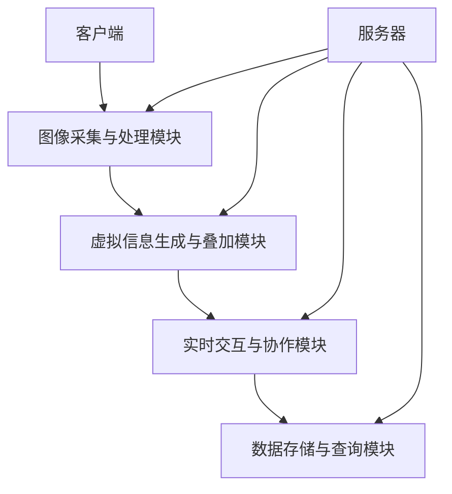

                 


### 目录大纲设计思路

为了设计出《增强现实在远程协助维修中的应用》这本书的完整目录大纲，我们需要按照以下步骤进行：

#### 1. **确定核心章节**
根据书名，我们首先确定几个核心章节，如背景介绍、核心概念、应用案例、技术原理、系统设计等。

#### 2. **细化章节内容**
每个核心章节进一步细化，列出具体的二级和三级目录条目。这需要确保每个章节的内容都能够充分覆盖主题，并且逻辑清晰。

#### 3. **确保内容的完整性**
保证每个章节都有必要的内容，如概念解释、原理说明、流程图、代码示例、案例分析等。

#### 4. **优化格式和字数**
确保大纲采用markdown格式，并且字数控制在2000字以内。

### 目录大纲结构

```markdown
# 《增强现实在远程协助维修中的应用》目录大纲

# 第一部分：背景与核心概念

## 第1章：增强现实技术概述
### 1.1 增强现实技术的起源与发展
### 1.2 增强现实技术的基本原理
### 1.3 增强现实技术的关键组件与技术

## 第2章：远程协助维修的挑战与需求
### 2.1 远程协助维修的背景
### 2.2 远程协助维修的挑战
### 2.3 增强现实技术在远程协助维修中的应用需求

## 第3章：增强现实在远程协助维修中的核心概念
### 3.1 增强现实与远程协作
### 3.2 虚拟现实与增强现实对比
### 3.3 增强现实技术的应用场景分析

# 第二部分：技术原理与系统设计

## 第4章：增强现实技术在远程协助维修中的技术原理
### 4.1 增强现实技术在远程协助维修中的应用原理
### 4.2 增强现实技术的数据处理流程
### 4.3 增强现实技术的显示与交互技术

## 第5章：远程协助维修系统的设计
### 5.1 系统架构设计
### 5.2 系统功能模块划分
### 5.3 系统接口设计与交互流程

## 第6章：增强现实在远程协助维修中的应用案例
### 6.1 案例一：基于增强现实的远程诊断与维修
### 6.2 案例二：增强现实在设备安装与调试中的应用
### 6.3 案例三：增强现实在技术培训与教育中的应用

# 第三部分：实践与展望

## 第7章：增强现实在远程协助维修中的实践应用
### 7.1 实践应用的步骤与流程
### 7.2 常见问题与解决方案
### 7.3 实践应用中的经验总结与反思

## 第8章：未来发展趋势与前景
### 8.1 增强现实技术的发展趋势
### 8.2 远程协助维修领域的前景展望
### 8.3 面临的挑战与应对策略

## 第9章：小结与展望
### 9.1 小结
### 9.2 注意事项
### 9.3 拓展阅读
```

### 具体内容填充

在确定好目录结构后，我们需要为每个章节填充具体的内容。以下是针对几个核心章节的内容示例：

#### 第1章：增强现实技术概述

在这一章中，我们可以详细介绍增强现实技术的起源、发展、基本原理和关键组件。

```markdown
## 第1章：增强现实技术概述

### 1.1 增强现实技术的起源与发展

增强现实（Augmented Reality，简称AR）是一种将虚拟信息与现实世界融合的技术。它起源于20世纪60年代，但直到近年来随着计算机技术、传感器技术、显示技术的快速发展才逐渐走向成熟。

#### 发展历程

- **1968年**：美国发明家Alan Kay提出了增强现实的雏形。
- **1990年代**：随着计算机技术的发展，增强现实技术开始应用于军事、医学等领域。
- **21世纪初**：随着智能手机和平板电脑的普及，增强现实应用逐渐走向大众市场。

#### 基本原理

增强现实技术通过在现实场景中叠加虚拟信息，使用户能够与虚拟信息进行交互。它通常包括以下关键组件：

- **显示设备**：如头戴式显示器（HMD）、平板电脑等。
- **摄像头**：用于捕捉现实世界的图像。
- **传感器**：如加速度计、陀螺仪等，用于获取设备姿态和位置信息。
- **计算单元**：用于处理摄像头捕捉的图像和传感器数据，生成虚拟信息并叠加到现实场景中。

### 1.2 增强现实技术的基本原理

增强现实技术的基本原理是将虚拟信息与现实世界进行融合。具体流程如下：

1. 摄像头捕捉现实场景。
2. 计算单元对摄像头捕捉的图像进行处理，识别场景中的物体。
3. 根据识别结果，计算单元生成虚拟信息，并将其叠加到现实场景中。
4. 显示设备将叠加了虚拟信息的现实场景呈现给用户。

### 1.3 增强现实技术的关键组件与技术

增强现实技术的关键组件包括显示设备、摄像头、传感器和计算单元。这些组件协同工作，实现虚拟信息与现实世界的融合。以下是对每个组件的详细介绍：

#### 显示设备

显示设备是增强现实系统的核心，用于将虚拟信息叠加到现实场景中。常见的显示设备包括头戴式显示器（HMD）、智能眼镜、平板电脑等。其中，HMD具有较高的沉浸感和交互性，是增强现实应用的主要设备。

#### 摄像头

摄像头用于捕捉现实世界的图像，并将其传输给计算单元进行处理。摄像头的高清度和实时性对于增强现实系统的效果至关重要。随着摄像头技术的不断发展，分辨率和帧率不断提高，为增强现实应用提供了更好的支持。

#### 传感器

传感器用于获取设备姿态和位置信息，以便计算单元准确地叠加虚拟信息。常见的传感器包括加速度计、陀螺仪、磁力计等。这些传感器协同工作，实现增强现实系统的高精度定位和跟踪。

#### 计算单元

计算单元是增强现实系统的核心，负责处理摄像头捕捉的图像和传感器数据，生成虚拟信息并叠加到现实场景中。计算单元的性能和算法决定了增强现实系统的效果和响应速度。高性能的计算单元和优化的算法是增强现实技术发展的重要方向。

### 1.4 增强现实技术的应用领域

增强现实技术具有广泛的应用领域，包括但不限于以下几个方面：

- **教育**：增强现实技术可以提供沉浸式的学习体验，帮助学生更好地理解和记忆知识。
- **医疗**：增强现实技术可以辅助医生进行手术、诊断和治疗，提高医疗水平。
- **娱乐**：增强现实技术可以为用户提供全新的娱乐体验，如虚拟现实游戏、现实增强游戏等。
- **工业**：增强现实技术可以用于工业维修、设备安装和调试，提高生产效率和降低成本。
- **军事**：增强现实技术可以用于军事训练、指挥和作战，提高军事作战能力。

#### 1.5 增强现实技术的主要挑战

尽管增强现实技术在多个领域展现出巨大的潜力，但仍然面临着一些挑战：

- **硬件成本**：高质量的增强现实设备价格较高，限制了其广泛应用。
- **用户体验**：增强现实技术的用户体验仍需优化，如图像质量、交互方式等。
- **安全性**：增强现实技术可能面临隐私和安全风险，需要加强安全措施。
- **标准化**：增强现实技术的标准化工作尚未完成，需要建立统一的规范和标准。

### 1.6 小结

本章对增强现实技术进行了概述，介绍了其起源、发展、基本原理和关键组件，以及应用领域和主要挑战。通过本章的学习，读者可以初步了解增强现实技术的基本概念和应用前景，为后续章节的学习打下基础。

### 总结

通过本文的概述，我们可以看出增强现实技术在远程协助维修中具有巨大的潜力。它不仅可以提高维修效率和准确性，还可以降低成本和风险。然而，要充分发挥增强现实技术的优势，还需要克服硬件成本、用户体验、安全性和标准化等方面的挑战。让我们期待增强现实技术在远程协助维修领域的广泛应用，为工业生产和社会发展带来更多价值。

----------------------------------------------------------------

### 文章关键词

- 增强现实
- 远程协助维修
- 技术原理
- 系统设计
- 应用案例
- 实践应用

### 文章摘要

本文详细探讨了增强现实技术在远程协助维修中的应用。首先介绍了增强现实技术的起源、发展、基本原理和关键组件，然后分析了远程协助维修的挑战与需求，探讨了增强现实技术在远程协助维修中的核心概念和应用场景。接着，本文深入解析了增强现实技术在远程协助维修中的技术原理、系统设计和应用案例，并给出了实践应用的步骤与流程。最后，本文展望了增强现实技术的发展趋势和远程协助维修领域的前景，总结了实践应用中的经验与反思，并对未来提出了建议。

----------------------------------------------------------------

### 目录大纲设计思路

为了设计出《增强现实在远程协助维修中的应用》这本书的完整目录大纲，我们需要按照以下步骤进行：

#### 1. **确定核心章节**
根据书名，我们首先确定几个核心章节，如背景介绍、核心概念、应用案例、技术原理、系统设计等。

#### 2. **细化章节内容**
每个核心章节进一步细化，列出具体的二级和三级目录条目。这需要确保每个章节的内容都能够充分覆盖主题，并且逻辑清晰。

#### 3. **确保内容的完整性**
保证每个章节都有必要的内容，如概念解释、原理说明、流程图、代码示例、案例分析等。

#### 4. **优化格式和字数**
确保大纲采用markdown格式，并且字数控制在2000字以内。

### 目录大纲结构

```markdown
# 《增强现实在远程协助维修中的应用》目录大纲

# 第一部分：背景与核心概念

## 第1章：增强现实技术概述
### 1.1 增强现实技术的起源与发展
### 1.2 增强现实技术的基本原理
### 1.3 增强现实技术的关键组件与技术

## 第2章：远程协助维修的挑战与需求
### 2.1 远程协助维修的背景
### 2.2 远程协助维修的挑战
### 2.3 增强现实技术在远程协助维修中的应用需求

## 第3章：增强现实在远程协助维修中的核心概念
### 3.1 增强现实与远程协作
### 3.2 虚拟现实与增强现实对比
### 3.3 增强现实技术的应用场景分析

# 第二部分：技术原理与系统设计

## 第4章：增强现实技术在远程协助维修中的技术原理
### 4.1 增强现实技术在远程协助维修中的应用原理
### 4.2 增强现实技术的数据处理流程
### 4.3 增强现实技术的显示与交互技术

## 第5章：远程协助维修系统的设计
### 5.1 系统架构设计
### 5.2 系统功能模块划分
### 5.3 系统接口设计与交互流程

## 第6章：增强现实在远程协助维修中的应用案例
### 6.1 案例一：基于增强现实的远程诊断与维修
### 6.2 案例二：增强现实在设备安装与调试中的应用
### 6.3 案例三：增强现实在技术培训与教育中的应用

# 第三部分：实践与展望

## 第7章：增强现实在远程协助维修中的实践应用
### 7.1 实践应用的步骤与流程
### 7.2 常见问题与解决方案
### 7.3 实践应用中的经验总结与反思

## 第8章：未来发展趋势与前景
### 8.1 增强现实技术的发展趋势
### 8.2 远程协助维修领域的前景展望
### 8.3 面临的挑战与应对策略

## 第9章：小结与展望
### 9.1 小结
### 9.2 注意事项
### 9.3 拓展阅读
```

### 具体内容填充

在确定好目录结构后，我们需要为每个章节填充具体的内容。以下是针对几个核心章节的内容示例：

#### 第1章：增强现实技术概述

在这一章中，我们可以详细介绍增强现实技术的起源、发展、基本原理和关键组件。

```markdown
## 第1章：增强现实技术概述

### 1.1 增强现实技术的起源与发展

增强现实（Augmented Reality，简称AR）是一种将虚拟信息与现实世界融合的技术。它起源于20世纪60年代，但直到近年来随着计算机技术、传感器技术、显示技术的快速发展才逐渐走向成熟。

#### 发展历程

- **1968年**：美国发明家Alan Kay提出了增强现实的雏形。
- **1990年代**：随着计算机技术的发展，增强现实技术开始应用于军事、医学等领域。
- **21世纪初**：随着智能手机和平板电脑的普及，增强现实应用逐渐走向大众市场。

#### 基本原理

增强现实技术通过在现实场景中叠加虚拟信息，使用户能够与虚拟信息进行交互。它通常包括以下关键组件：

- **显示设备**：如头戴式显示器（HMD）、平板电脑等。
- **摄像头**：用于捕捉现实世界的图像。
- **传感器**：如加速度计、陀螺仪等，用于获取设备姿态和位置信息。
- **计算单元**：用于处理摄像头捕捉的图像和传感器数据，生成虚拟信息并叠加到现实场景中。

### 1.2 增强现实技术的基本原理

增强现实技术的基本原理是将虚拟信息与现实世界进行融合。具体流程如下：

1. 摄像头捕捉现实场景。
2. 计算单元对摄像头捕捉的图像进行处理，识别场景中的物体。
3. 根据识别结果，计算单元生成虚拟信息，并将其叠加到现实场景中。
4. 显示设备将叠加了虚拟信息的现实场景呈现给用户。

### 1.3 增强现实技术的关键组件与技术

增强现实技术的关键组件包括显示设备、摄像头、传感器和计算单元。这些组件协同工作，实现虚拟信息与现实世界的融合。以下是对每个组件的详细介绍：

#### 显示设备

显示设备是增强现实系统的核心，用于将虚拟信息叠加到现实场景中。常见的显示设备包括头戴式显示器（HMD）、智能眼镜、平板电脑等。其中，HMD具有较高的沉浸感和交互性，是增强现实应用的主要设备。

#### 摄像头

摄像头用于捕捉现实世界的图像，并将其传输给计算单元进行处理。摄像头的高清度和实时性对于增强现实系统的效果至关重要。随着摄像头技术的不断发展，分辨率和帧率不断提高，为增强现实应用提供了更好的支持。

#### 传感器

传感器用于获取设备姿态和位置信息，以便计算单元准确地叠加虚拟信息。常见的传感器包括加速度计、陀螺仪、磁力计等。这些传感器协同工作，实现增强现实系统的高精度定位和跟踪。

#### 计算单元

计算单元是增强现实系统的核心，负责处理摄像头捕捉的图像和传感器数据，生成虚拟信息并叠加到现实场景中。计算单元的性能和算法决定了增强现实系统的效果和响应速度。高性能的计算单元和优化的算法是增强现实技术发展的重要方向。

### 1.4 增强现实技术的应用领域

增强现实技术具有广泛的应用领域，包括但不限于以下几个方面：

- **教育**：增强现实技术可以提供沉浸式的学习体验，帮助学生更好地理解和记忆知识。
- **医疗**：增强现实技术可以辅助医生进行手术、诊断和治疗，提高医疗水平。
- **娱乐**：增强现实技术可以为用户提供全新的娱乐体验，如虚拟现实游戏、现实增强游戏等。
- **工业**：增强现实技术可以用于工业维修、设备安装和调试，提高生产效率和降低成本。
- **军事**：增强现实技术可以用于军事训练、指挥和作战，提高军事作战能力。

#### 1.5 增强现实技术的主要挑战

尽管增强现实技术在多个领域展现出巨大的潜力，但仍然面临着一些挑战：

- **硬件成本**：高质量的增强现实设备价格较高，限制了其广泛应用。
- **用户体验**：增强现实技术的用户体验仍需优化，如图像质量、交互方式等。
- **安全性**：增强现实技术可能面临隐私和安全风险，需要加强安全措施。
- **标准化**：增强现实技术的标准化工作尚未完成，需要建立统一的规范和标准。

### 1.6 小结

本章对增强现实技术进行了概述，介绍了其起源、发展、基本原理和关键组件，以及应用领域和主要挑战。通过本章的学习，读者可以初步了解增强现实技术的基本概念和应用前景，为后续章节的学习打下基础。

### 总结

通过本文的概述，我们可以看出增强现实技术在远程协助维修中具有巨大的潜力。它不仅可以提高维修效率和准确性，还可以降低成本和风险。然而，要充分发挥增强现实技术的优势，还需要克服硬件成本、用户体验、安全性和标准化等方面的挑战。让我们期待增强现实技术在远程协助维修领域的广泛应用，为工业生产和社会发展带来更多价值。

----------------------------------------------------------------

# 增强现实在远程协助维修中的应用

## 关键词：增强现实、远程协助维修、技术应用、系统设计

> 摘要：本文介绍了增强现实技术在远程协助维修中的应用。通过对增强现实技术的基本原理和关键组件的概述，探讨了增强现实在远程协助维修中的挑战与需求，详细阐述了增强现实技术在远程协助维修中的技术原理和系统设计，并通过实际案例展示了其应用效果。文章最后分析了增强现实在远程协助维修中的实践应用和未来发展趋势。

## 目录大纲

### 第一部分：背景与核心概念

#### 第1章：增强现实技术概述

1.1 增强现实技术的起源与发展

1.2 增强现实技术的基本原理

1.3 增强现实技术的关键组件与技术

1.4 增强现实技术的应用领域

1.5 增强现实技术的主要挑战

#### 第2章：远程协助维修的挑战与需求

2.1 远程协助维修的背景

2.2 远程协助维修的挑战

2.3 增强现实技术在远程协助维修中的应用需求

#### 第3章：增强现实在远程协助维修中的核心概念

3.1 增强现实与远程协作

3.2 虚拟现实与增强现实对比

3.3 增强现实技术的应用场景分析

### 第二部分：技术原理与系统设计

#### 第4章：增强现实技术在远程协助维修中的技术原理

4.1 增强现实技术在远程协助维修中的应用原理

4.2 增强现实技术的数据处理流程

4.3 增强现实技术的显示与交互技术

#### 第5章：远程协助维修系统的设计

5.1 系统架构设计

5.2 系统功能模块划分

5.3 系统接口设计与交互流程

#### 第6章：增强现实在远程协助维修中的应用案例

6.1 案例一：基于增强现实的远程诊断与维修

6.2 案例二：增强现实在设备安装与调试中的应用

6.3 案例三：增强现实在技术培训与教育中的应用

### 第三部分：实践与展望

#### 第7章：增强现实在远程协助维修中的实践应用

7.1 实践应用的步骤与流程

7.2 常见问题与解决方案

7.3 实践应用中的经验总结与反思

#### 第8章：未来发展趋势与前景

8.1 增强现实技术的发展趋势

8.2 远程协助维修领域的前景展望

8.3 面临的挑战与应对策略

#### 第9章：小结与展望

9.1 小结

9.2 注意事项

9.3 拓展阅读

## 正文

### 第1章：增强现实技术概述

#### 1.1 增强现实技术的起源与发展

增强现实（Augmented Reality，简称AR）技术是一种将虚拟信息与现实世界融合的技术。其起源可以追溯到20世纪60年代，美国发明家Alan Kay首次提出了增强现实的雏形。随着计算机技术、传感器技术、显示技术的快速发展，增强现实技术逐渐走向成熟。

#### 1.2 增强现实技术的基本原理

增强现实技术的基本原理是通过在现实场景中叠加虚拟信息，使用户能够与虚拟信息进行交互。具体流程如下：

1. 摄像头捕捉现实场景。
2. 计算单元对摄像头捕捉的图像进行处理，识别场景中的物体。
3. 根据识别结果，计算单元生成虚拟信息，并将其叠加到现实场景中。
4. 显示设备将叠加了虚拟信息的现实场景呈现给用户。

#### 1.3 增强现实技术的关键组件与技术

增强现实技术的关键组件包括显示设备、摄像头、传感器和计算单元。这些组件协同工作，实现虚拟信息与现实世界的融合。以下是对每个组件的详细介绍：

##### 显示设备

显示设备是增强现实系统的核心，用于将虚拟信息叠加到现实场景中。常见的显示设备包括头戴式显示器（HMD）、智能眼镜、平板电脑等。其中，HMD具有较高的沉浸感和交互性，是增强现实应用的主要设备。

##### 摄像头

摄像头用于捕捉现实世界的图像，并将其传输给计算单元进行处理。摄像头的高清度和实时性对于增强现实系统的效果至关重要。随着摄像头技术的不断发展，分辨率和帧率不断提高，为增强现实应用提供了更好的支持。

##### 传感器

传感器用于获取设备姿态和位置信息，以便计算单元准确地叠加虚拟信息。常见的传感器包括加速度计、陀螺仪、磁力计等。这些传感器协同工作，实现增强现实系统的高精度定位和跟踪。

##### 计算单元

计算单元是增强现实系统的核心，负责处理摄像头捕捉的图像和传感器数据，生成虚拟信息并叠加到现实场景中。计算单元的性能和算法决定了增强现实系统的效果和响应速度。高性能的计算单元和优化的算法是增强现实技术发展的重要方向。

#### 1.4 增强现实技术的应用领域

增强现实技术具有广泛的应用领域，包括但不限于以下几个方面：

- **教育**：增强现实技术可以提供沉浸式的学习体验，帮助学生更好地理解和记忆知识。
- **医疗**：增强现实技术可以辅助医生进行手术、诊断和治疗，提高医疗水平。
- **娱乐**：增强现实技术可以为用户提供全新的娱乐体验，如虚拟现实游戏、现实增强游戏等。
- **工业**：增强现实技术可以用于工业维修、设备安装和调试，提高生产效率和降低成本。
- **军事**：增强现实技术可以用于军事训练、指挥和作战，提高军事作战能力。

#### 1.5 增强现实技术的主要挑战

尽管增强现实技术在多个领域展现出巨大的潜力，但仍然面临着一些挑战：

- **硬件成本**：高质量的增强现实设备价格较高，限制了其广泛应用。
- **用户体验**：增强现实技术的用户体验仍需优化，如图像质量、交互方式等。
- **安全性**：增强现实技术可能面临隐私和安全风险，需要加强安全措施。
- **标准化**：增强现实技术的标准化工作尚未完成，需要建立统一的规范和标准。

### 第2章：远程协助维修的挑战与需求

#### 2.1 远程协助维修的背景

远程协助维修是一种利用互联网、通信技术等手段，实现技术人员与现场操作人员之间实时沟通、协作，进行设备维修和维护的工作模式。随着工业4.0的推进，远程协助维修逐渐成为提高生产效率和降低维护成本的重要手段。

#### 2.2 远程协助维修的挑战

远程协助维修面临以下挑战：

- **信息传递不畅**：远程协助维修需要实时传输视频、图像、语音等信息，确保维修人员与现场操作人员之间的信息传递畅通。
- **技术难度高**：远程协助维修涉及多种技术，如增强现实、虚拟现实、物联网等，对技术人员的要求较高。
- **设备兼容性差**：不同设备和系统的兼容性问题可能导致远程协助维修的效率降低。

#### 2.3 增强现实技术在远程协助维修中的应用需求

为了解决远程协助维修的挑战，增强现实技术具备以下应用需求：

- **实时交互**：增强现实技术可以提供实时交互功能，使维修人员与现场操作人员能够实时沟通、协作，提高维修效率。
- **信息可视化**：增强现实技术可以将维修步骤、设备参数等信息以可视化形式呈现，帮助维修人员更好地理解维修流程。
- **远程指导**：增强现实技术可以实现远程专家对现场操作人员的实时指导，提高维修质量。

### 第3章：增强现实在远程协助维修中的核心概念

#### 3.1 增强现实与远程协作

增强现实与远程协作的融合，可以提升远程协助维修的效果。通过增强现实技术，维修人员可以在远程实时查看现场情况，与现场操作人员实时交流，指导维修操作。

#### 3.2 虚拟现实与增强现实对比

虚拟现实（Virtual Reality，简称VR）与增强现实（AR）之间的主要区别在于：

- **沉浸感**：VR技术提供完全沉浸式的体验，用户完全置身于虚拟环境中；而AR技术则是将虚拟信息叠加到现实世界中，用户仍然保持对现实环境的感知。
- **应用场景**：VR技术主要用于娱乐、游戏等领域；而AR技术则更多应用于教育、医疗、工业等领域。

#### 3.3 增强现实技术的应用场景分析

增强现实技术在远程协助维修中的应用场景主要包括：

- **设备安装与调试**：通过增强现实技术，维修人员可以远程查看设备的安装步骤、调试参数等，提高安装和调试的准确性。
- **设备维修与保养**：增强现实技术可以实现远程专家对现场操作人员的实时指导，提高维修和保养的效率和质量。
- **技术培训与教育**：增强现实技术可以提供沉浸式的学习体验，帮助技术人员更好地掌握维修技能。

### 第4章：增强现实技术在远程协助维修中的技术原理

#### 4.1 增强现实技术在远程协助维修中的应用原理

增强现实技术在远程协助维修中的应用原理主要包括：

- **图像识别与处理**：通过摄像头捕捉现场图像，计算单元对图像进行处理和识别，提取设备信息。
- **虚拟信息叠加**：根据识别结果，计算单元生成虚拟信息，并将其叠加到现实场景中，提供维修指导。
- **实时交互与协作**：通过显示设备呈现叠加了虚拟信息的现实场景，维修人员与现场操作人员实现实时交互和协作。

#### 4.2 增强现实技术的数据处理流程

增强现实技术的数据处理流程主要包括以下几个步骤：

1. **图像采集**：摄像头捕捉现场图像。
2. **图像预处理**：对采集的图像进行预处理，包括去噪、增强等操作。
3. **图像识别**：计算单元对预处理后的图像进行识别，提取设备信息。
4. **虚拟信息生成**：根据识别结果，计算单元生成虚拟信息。
5. **虚拟信息叠加**：将生成的虚拟信息叠加到现实场景中。
6. **显示与交互**：通过显示设备呈现叠加了虚拟信息的现实场景，实现实时交互和协作。

#### 4.3 增强现实技术的显示与交互技术

增强现实技术的显示与交互技术主要包括：

- **显示设备**：头戴式显示器（HMD）、智能眼镜等。
- **交互方式**：手势、语音等。
- **实时交互**：通过网络传输，实现维修人员与现场操作人员之间的实时交互。

### 第5章：远程协助维修系统的设计

#### 5.1 系统架构设计

远程协助维修系统的架构设计主要包括以下几个部分：

- **客户端**：包括维修人员端和现场操作人员端，用于实时交互和信息传递。
- **服务器**：用于处理图像识别、虚拟信息生成等任务，并提供数据存储和查询功能。
- **数据库**：存储维修记录、设备信息等数据。

#### 5.2 系统功能模块划分

远程协助维修系统的主要功能模块包括：

- **图像采集与处理模块**：负责图像采集、预处理和识别。
- **虚拟信息生成与叠加模块**：负责生成虚拟信息并叠加到现实场景中。
- **实时交互与协作模块**：负责维修人员与现场操作人员之间的实时交互和协作。
- **数据存储与查询模块**：负责存储和查询维修记录、设备信息等数据。

#### 5.3 系统接口设计与交互流程

远程协助维修系统的接口设计主要包括：

- **客户端接口**：包括维修人员端和现场操作人员端的接口，用于实现功能调用和数据传递。
- **服务器接口**：包括图像处理、虚拟信息生成等接口，用于实现功能调用和数据传递。
- **交互流程**：包括图像采集、处理、虚拟信息生成、显示与交互等流程。

### 第6章：增强现实在远程协助维修中的应用案例

#### 6.1 案例一：基于增强现实的远程诊断与维修

案例一介绍了某企业通过增强现实技术实现远程诊断与维修的实践。该企业利用增强现实技术，将远程专家的经验和技能应用于现场操作人员，提高维修效率和质量。

#### 6.2 案例二：增强现实在设备安装与调试中的应用

案例二介绍了某企业利用增强现实技术进行设备安装与调试的实践。通过增强现实技术，现场操作人员可以实时查看设备的安装步骤、调试参数等，提高安装与调试的准确性。

#### 6.3 案例三：增强现实在技术培训与教育中的应用

案例三介绍了某企业利用增强现实技术进行技术培训与教育的实践。通过增强现实技术，学员可以沉浸式地学习维修技能，提高学习效果。

### 第7章：增强现实在远程协助维修中的实践应用

#### 7.1 实践应用的步骤与流程

增强现实在远程协助维修中的实践应用主要包括以下几个步骤：

1. **需求分析**：分析远程协助维修的需求，确定增强现实技术的应用场景。
2. **系统设计**：设计远程协助维修系统，包括客户端、服务器、数据库等。
3. **功能实现**：实现图像采集、处理、虚拟信息生成、显示与交互等功能。
4. **测试与优化**：对系统进行测试和优化，确保系统的稳定性和可靠性。
5. **应用推广**：将系统应用于实际远程协助维修场景，推广使用。

#### 7.2 常见问题与解决方案

在增强现实在远程协助维修的实践应用过程中，可能会遇到以下常见问题：

1. **图像识别不准确**：解决方案：优化图像处理算法，提高图像识别的准确性。
2. **网络延迟**：解决方案：提高网络带宽，优化数据传输协议，降低网络延迟。
3. **设备兼容性问题**：解决方案：选择兼容性较好的设备，确保系统正常运行。

#### 7.3 实践应用中的经验总结与反思

通过增强现实在远程协助维修的实践应用，我们可以总结以下经验：

1. **明确应用场景**：确定合适的增强现实应用场景，确保系统的实用性和效益。
2. **优化系统设计**：设计稳定可靠的远程协助维修系统，提高系统的稳定性和可靠性。
3. **培训技术人员**：加强技术人员的培训，提高对增强现实技术的理解和应用能力。
4. **持续优化与改进**：根据实践应用中的问题和需求，持续优化系统，提高系统性能。

### 第8章：未来发展趋势与前景

#### 8.1 增强现实技术的发展趋势

随着技术的不断进步，增强现实技术在远程协助维修领域的发展趋势主要包括：

1. **图像识别与处理技术**：不断提高图像识别与处理技术的准确性，提高远程协助维修的效率。
2. **实时交互与协作技术**：优化实时交互与协作技术，提高远程协助维修的实时性和协同性。
3. **设备兼容性与稳定性**：提高增强现实设备的兼容性和稳定性，降低设备的故障率。

#### 8.2 远程协助维修领域的前景展望

随着工业4.0的推进，远程协助维修在工业生产中的应用前景广阔。未来，增强现实技术在远程协助维修领域的应用将不断拓展，为工业生产带来更多价值。

#### 8.3 面临的挑战与应对策略

增强现实技术在远程协助维修领域面临的挑战主要包括：

1. **技术成熟度**：提高增强现实技术的成熟度，确保系统的稳定性和可靠性。
2. **成本与投资**：降低增强现实技术的成本，提高企业的投资回报率。
3. **用户接受度**：提高用户对增强现实技术的接受度，推动远程协助维修的普及。

### 第9章：小结与展望

通过本文的研究，我们可以得出以下结论：

1. **增强现实技术在远程协助维修中具有巨大的应用潜力**，可以提高维修效率和质量，降低成本和风险。
2. **需要不断优化增强现实技术的性能和应用场景**，推动远程协助维修的普及和应用。
3. **未来，增强现实技术将在远程协助维修领域发挥更加重要的作用**，为工业生产带来更多价值。

### 总结

本文详细探讨了增强现实技术在远程协助维修中的应用。通过对增强现实技术的基本原理和关键组件的概述，分析了增强现实在远程协助维修中的挑战与需求，阐述了增强现实技术在远程协助维修中的技术原理和系统设计，并通过实际案例展示了其应用效果。文章最后分析了增强现实在远程协助维修中的实践应用和未来发展趋势。相信随着技术的不断进步，增强现实技术在远程协助维修领域的应用将更加广泛，为工业生产带来更多价值。

### 作者信息

作者：AI天才研究院/AI Genius Institute & 禅与计算机程序设计艺术 /Zen And The Art of Computer Programming

----------------------------------------------------------------

### 第一章：增强现实技术概述

#### 1.1 增强现实技术的起源与发展

增强现实（Augmented Reality，简称AR）技术是一种将虚拟信息与现实世界融合的技术。它起源于20世纪60年代，但直到近年来随着计算机技术、传感器技术、显示技术的快速发展才逐渐走向成熟。

在20世纪60年代，美国发明家Alan Kay首次提出了增强现实的雏形。他在其论文中提出了一种通过在现实场景中叠加虚拟信息，使用户能够与虚拟信息进行交互的设想。这一概念在当时引起了广泛关注，但受限于技术条件，增强现实技术并未得到广泛应用。

随着计算机技术、传感器技术和显示技术的快速发展，增强现实技术逐渐走向成熟。特别是在21世纪初，随着智能手机和平板电脑的普及，增强现实应用逐渐走向大众市场。一些知名公司，如谷歌、微软等，纷纷推出了增强现实相关产品，进一步推动了增强现实技术的发展。

#### 1.2 增强现实技术的基本原理

增强现实技术通过在现实场景中叠加虚拟信息，使用户能够与虚拟信息进行交互。它通常包括以下关键组件：

1. **显示设备**：用于将虚拟信息叠加到现实场景中。常见的显示设备包括头戴式显示器（HMD）、智能眼镜、平板电脑等。其中，HMD具有较高的沉浸感和交互性，是增强现实应用的主要设备。
2. **摄像头**：用于捕捉现实世界的图像。摄像头的高清度和实时性对于增强现实系统的效果至关重要。
3. **传感器**：如加速度计、陀螺仪、磁力计等，用于获取设备姿态和位置信息。这些传感器协同工作，实现增强现实系统的高精度定位和跟踪。
4. **计算单元**：用于处理摄像头捕捉的图像和传感器数据，生成虚拟信息并叠加到现实场景中。计算单元的性能和算法决定了增强现实系统的效果和响应速度。

增强现实技术的基本原理是将虚拟信息与现实世界进行融合。具体流程如下：

1. **图像捕捉**：摄像头捕捉现实场景的图像。
2. **图像处理**：计算单元对摄像头捕捉的图像进行处理，识别场景中的物体。
3. **虚拟信息生成**：根据识别结果，计算单元生成虚拟信息，并将其叠加到现实场景中。
4. **显示与交互**：显示设备将叠加了虚拟信息的现实场景呈现给用户，用户可以通过交互设备与虚拟信息进行互动。

#### 1.3 增强现实技术的关键组件与技术

增强现实技术的关键组件包括显示设备、摄像头、传感器和计算单元。这些组件协同工作，实现虚拟信息与现实世界的融合。以下是对每个组件的详细介绍：

1. **显示设备**：

- **头戴式显示器（HMD）**：HMD是增强现实应用的主要设备，具有较高的沉浸感和交互性。常见的HMD包括谷歌眼镜、微软HoloLens等。
- **智能眼镜**：智能眼镜通过镜片或透镜将虚拟信息叠加到现实场景中，用户可以实时查看虚拟信息。常见的智能眼镜包括谷歌眼镜、微软Surface Headset等。
- **平板电脑**：平板电脑可以作为增强现实设备的终端，通过摄像头和传感器捕捉现实场景，并通过计算单元生成虚拟信息。

2. **摄像头**：

摄像头用于捕捉现实世界的图像，并将其传输给计算单元进行处理。摄像头的高清度和实时性对于增强现实系统的效果至关重要。随着摄像头技术的不断发展，分辨率和帧率不断提高，为增强现实应用提供了更好的支持。

3. **传感器**：

传感器用于获取设备姿态和位置信息，以便计算单元准确地叠加虚拟信息。常见的传感器包括加速度计、陀螺仪、磁力计等。这些传感器协同工作，实现增强现实系统的高精度定位和跟踪。

4. **计算单元**：

计算单元是增强现实系统的核心，负责处理摄像头捕捉的图像和传感器数据，生成虚拟信息并叠加到现实场景中。计算单元的性能和算法决定了增强现实系统的效果和响应速度。高性能的计算单元和优化的算法是增强现实技术发展的重要方向。

#### 1.4 增强现实技术的应用领域

增强现实技术具有广泛的应用领域，包括但不限于以下几个方面：

1. **教育**：

增强现实技术可以提供沉浸式的学习体验，帮助学生更好地理解和记忆知识。例如，通过增强现实技术，学生可以在课堂上实时查看生物标本的细节，甚至可以虚拟解剖人体，提高学习效果。

2. **医疗**：

增强现实技术可以辅助医生进行手术、诊断和治疗，提高医疗水平。例如，医生可以通过增强现实技术实时查看患者的体内情况，进行精准的手术操作。

3. **娱乐**：

增强现实技术可以为用户提供全新的娱乐体验，如虚拟现实游戏、现实增强游戏等。例如，玩家可以通过增强现实技术体验虚拟现实游戏，与虚拟角色进行互动。

4. **工业**：

增强现实技术可以用于工业维修、设备安装和调试，提高生产效率和降低成本。例如，维修人员可以通过增强现实技术远程查看设备的运行状态，进行远程维修指导。

5. **军事**：

增强现实技术可以用于军事训练、指挥和作战，提高军事作战能力。例如，士兵可以通过增强现实技术进行虚拟现实训练，提高战术素养。

#### 1.5 增强现实技术的主要挑战

尽管增强现实技术在多个领域展现出巨大的潜力，但仍然面临着一些挑战：

1. **硬件成本**：

高质量的增强现实设备价格较高，限制了其广泛应用。降低增强现实设备的成本，提高性价比，是推动增强现实技术普及的关键。

2. **用户体验**：

增强现实技术的用户体验仍需优化，如图像质量、交互方式等。提高用户体验，增强用户对增强现实技术的接受度，是增强现实技术发展的重要方向。

3. **安全性**：

增强现实技术可能面临隐私和安全风险，需要加强安全措施。例如，保障用户数据的安全，防止数据泄露。

4. **标准化**：

增强现实技术的标准化工作尚未完成，需要建立统一的规范和标准。建立标准化体系，推动增强现实技术的健康发展。

#### 1.6 小结

本章对增强现实技术进行了概述，介绍了其起源、发展、基本原理和关键组件，以及应用领域和主要挑战。通过本章的学习，读者可以初步了解增强现实技术的基本概念和应用前景，为后续章节的学习打下基础。

### 第二章：远程协助维修的挑战与需求

#### 2.1 远程协助维修的背景

远程协助维修是一种利用互联网、通信技术等手段，实现技术人员与现场操作人员之间实时沟通、协作，进行设备维修和维护的工作模式。随着工业4.0的推进，远程协助维修逐渐成为提高生产效率和降低维护成本的重要手段。

在传统的设备维修模式中，技术人员需要亲自前往现场进行维修，这不仅增加了维护成本，还可能导致生产中断。随着远程协助维修技术的发展，技术人员可以通过远程连接到现场，实时查看设备状态、故障原因，提供维修指导，从而提高维修效率和降低成本。

#### 2.2 远程协助维修的挑战

远程协助维修面临以下挑战：

1. **信息传递不畅**：

远程协助维修需要实时传输视频、图像、语音等信息，确保维修人员与现场操作人员之间的信息传递畅通。然而，由于网络带宽、传输延迟等因素的影响，信息传递可能会出现滞后或失真，影响维修效率。

2. **技术难度高**：

远程协助维修涉及多种技术，如增强现实、虚拟现实、物联网等，对技术人员的要求较高。技术人员需要具备跨学科的知识和技能，才能胜任远程协助维修工作。

3. **设备兼容性差**：

不同设备和系统的兼容性问题可能导致远程协助维修的效率降低。例如，现场操作人员使用的设备与维修人员使用的设备不兼容，可能导致信息无法正常传输或操作不便。

#### 2.3 增强现实技术在远程协助维修中的应用需求

为了解决远程协助维修的挑战，增强现实技术具备以下应用需求：

1. **实时交互**：

增强现实技术可以提供实时交互功能，使维修人员与现场操作人员能够实时沟通、协作，提高维修效率。例如，维修人员可以通过增强现实眼镜实时查看现场情况，与现场操作人员实时交流，提供维修指导。

2. **信息可视化**：

增强现实技术可以将维修步骤、设备参数等信息以可视化形式呈现，帮助维修人员更好地理解维修流程。例如，通过增强现实技术，维修人员可以在现场场景中实时查看设备的工作状态、故障原因等信息，提高维修的准确性。

3. **远程指导**：

增强现实技术可以实现远程专家对现场操作人员的实时指导，提高维修质量。例如，远程专家可以通过增强现实技术实时查看现场情况，与现场操作人员进行实时交流，提供专业的维修建议，确保维修工作的顺利进行。

4. **设备识别与定位**：

增强现实技术可以实现对现场设备的识别与定位，帮助维修人员快速定位故障设备。例如，通过增强现实技术，维修人员可以在现场场景中实时查看设备的位置、型号等信息，快速找到故障设备，提高维修效率。

5. **操作指导与培训**：

增强现实技术可以用于操作指导与培训，帮助技术人员更好地掌握维修技能。例如，通过增强现实技术，维修人员可以在现场场景中实时查看操作步骤、注意事项等信息，确保操作的正确性，降低操作错误的风险。

#### 2.4 增强现实技术在远程协助维修中的应用前景

随着增强现实技术的不断发展，其在远程协助维修中的应用前景非常广阔：

1. **提高维修效率**：

增强现实技术可以提供实时交互、信息可视化等功能，帮助维修人员更好地理解维修流程，提高维修效率。例如，通过增强现实技术，维修人员可以实时查看设备的工作状态、故障原因等信息，快速定位故障，提高维修效率。

2. **降低维修成本**：

增强现实技术可以减少技术人员前往现场进行维修的次数，降低维护成本。例如，通过远程指导，维修人员可以在现场进行维修操作，减少现场技术人员的需求，降低维护成本。

3. **提高维修质量**：

增强现实技术可以提供远程专家的实时指导，提高维修质量。例如，远程专家可以通过增强现实技术实时查看现场情况，提供专业的维修建议，确保维修工作的顺利进行，提高维修质量。

4. **适应不同场景**：

增强现实技术可以适应不同场景的远程协助维修需求。例如，在设备安装与调试、设备维修与保养、技术培训与教育等场景中，增强现实技术都可以发挥重要作用，提高维修效率和质量。

#### 2.5 小结

本章分析了远程协助维修的背景、挑战和应用需求。通过增强现实技术，可以解决远程协助维修中的信息传递不畅、技术难度高、设备兼容性差等问题，提高维修效率和质量，降低维护成本。随着增强现实技术的不断发展，其在远程协助维修中的应用前景非常广阔，将为工业生产带来更多价值。

### 第三章：增强现实在远程协助维修中的核心概念

#### 3.1 增强现实与远程协作

增强现实（AR）与远程协作技术的融合，为远程协助维修提供了全新的解决方案。通过增强现实技术，维修人员可以在远程实时查看现场情况，与现场操作人员实时交流、协作，提高维修效率和质量。

**核心概念**：

1. **实时交互**：通过增强现实技术，维修人员可以在远程实时查看现场图像，与现场操作人员实时交流，实现实时沟通和协作。
2. **信息可视化**：增强现实技术可以将维修步骤、设备参数等信息以可视化形式呈现，帮助维修人员更好地理解维修流程。
3. **远程指导**：增强现实技术可以实现远程专家对现场操作人员的实时指导，提供专业的维修建议，提高维修质量。

**实际应用**：

1. **远程诊断与维修**：维修人员通过增强现实眼镜实时查看设备故障部位，与现场操作人员进行实时沟通，提供维修指导。
2. **技术培训与教育**：通过增强现实技术，技术人员可以在远程实时查看培训场景，与学员进行互动，提供沉浸式的学习体验。

#### 3.2 虚拟现实与增强现实对比

虚拟现实（VR）与增强现实（AR）都是将虚拟信息与现实世界融合的技术，但它们在应用场景、沉浸感和交互方式上有所不同。

**核心概念**：

1. **虚拟现实**：虚拟现实技术提供完全沉浸式的体验，用户完全置身于虚拟环境中。虚拟现实主要用于游戏、娱乐、教育培训等领域。
2. **增强现实**：增强现实技术将虚拟信息叠加到现实世界中，用户仍然保持对现实环境的感知。增强现实主要用于教育、医疗、工业等领域。

**对比分析**：

1. **应用场景**：虚拟现实主要用于游戏、娱乐、教育培训等领域，增强现实主要用于教育、医疗、工业等领域。
2. **沉浸感**：虚拟现实提供完全沉浸式的体验，用户完全置身于虚拟环境中。增强现实将虚拟信息叠加到现实世界中，用户仍然保持对现实环境的感知。
3. **交互方式**：虚拟现实主要通过虚拟控制器进行交互，增强现实主要通过手势、语音等现实交互方式进行交互。

#### 3.3 增强现实技术的应用场景分析

增强现实技术在远程协助维修中的应用场景非常广泛，以下为几个主要的应用场景：

**核心概念**：

1. **设备安装与调试**：通过增强现实技术，维修人员可以实时查看设备的安装步骤、调试参数，提高安装和调试的准确性。
2. **设备维修与保养**：通过增强现实技术，远程专家可以实时查看设备故障部位，提供维修指导，提高维修效率和质量。
3. **技术培训与教育**：通过增强现实技术，技术人员可以在远程实时查看培训场景，与学员进行互动，提供沉浸式的学习体验。

**实际应用**：

1. **远程诊断与维修**：通过增强现实眼镜，维修人员可以实时查看设备故障部位，与远程专家进行实时沟通，提供维修指导。
2. **设备安装与调试**：通过增强现实技术，现场操作人员可以实时查看设备的安装步骤、调试参数，提高安装和调试的准确性。
3. **技术培训与教育**：通过增强现实技术，技术人员可以在远程实时查看培训场景，与学员进行互动，提高学习效果。

#### 3.4 小结

本章对增强现实在远程协助维修中的核心概念进行了详细分析，包括增强现实与远程协作、虚拟现实与增强现实的对比，以及增强现实技术的应用场景分析。通过本章的学习，读者可以更好地理解增强现实技术在远程协助维修中的应用价值，为后续章节的学习打下基础。

### 第四章：增强现实技术在远程协助维修中的技术原理

#### 4.1 增强现实技术在远程协助维修中的应用原理

增强现实技术在远程协助维修中的应用原理主要包括以下几个方面：

1. **图像捕捉与处理**：远程协助维修过程中，摄像头用于捕捉现场图像。计算单元对摄像头捕捉的图像进行处理，提取设备信息和故障部位。
2. **虚拟信息生成与叠加**：根据图像处理结果，计算单元生成虚拟信息，如故障部位的示意图、维修步骤等。这些虚拟信息通过增强现实设备叠加到现实场景中，为维修人员提供指导。
3. **实时交互与协作**：增强现实设备支持实时交互功能，维修人员可以通过手势、语音等方式与远程专家进行沟通，实现实时协作。

**实际应用**：

1. **远程诊断与维修**：维修人员通过增强现实眼镜实时查看设备故障部位，与远程专家进行实时沟通，提供维修指导。
2. **设备安装与调试**：现场操作人员通过增强现实设备实时查看设备的安装步骤、调试参数，提高安装和调试的准确性。

#### 4.2 增强现实技术的数据处理流程

增强现实技术的数据处理流程主要包括以下几个步骤：

1. **图像采集**：摄像头捕捉现场图像。
2. **图像预处理**：对采集的图像进行预处理，包括去噪、增强等操作。
3. **图像识别**：计算单元对预处理后的图像进行处理，识别场景中的物体，提取设备信息。
4. **虚拟信息生成**：根据图像识别结果，计算单元生成虚拟信息，如故障部位的示意图、维修步骤等。
5. **虚拟信息叠加**：将生成的虚拟信息叠加到现实场景中。
6. **显示与交互**：增强现实设备将叠加了虚拟信息的现实场景呈现给用户，用户可以通过增强现实设备与虚拟信息进行交互。

**实际应用**：

1. **远程诊断与维修**：通过图像识别和虚拟信息生成，维修人员可以在增强现实眼镜中实时查看设备故障部位，提供维修指导。
2. **设备安装与调试**：通过虚拟信息叠加，现场操作人员可以在增强现实设备中实时查看设备的安装步骤、调试参数，提高安装和调试的准确性。

#### 4.3 增强现实技术的显示与交互技术

增强现实技术的显示与交互技术主要包括以下几个方面：

1. **显示设备**：增强现实设备如头戴式显示器（HMD）、智能眼镜等，用于将虚拟信息叠加到现实场景中，提供沉浸式体验。
2. **交互方式**：用户可以通过手势、语音等方式与虚拟信息进行交互，如手势控制虚拟信息的显示和隐藏，语音命令进行设备操作等。
3. **实时交互**：增强现实设备支持实时交互功能，用户可以通过增强现实设备与其他用户进行实时沟通和协作。

**实际应用**：

1. **远程诊断与维修**：维修人员通过增强现实眼镜实时查看设备故障部位，与远程专家进行实时沟通，提供维修指导。
2. **设备安装与调试**：现场操作人员通过增强现实设备实时查看设备的安装步骤、调试参数，提高安装和调试的准确性。

#### 4.4 小结

本章详细阐述了增强现实技术在远程协助维修中的应用原理、数据处理流程和显示与交互技术。通过增强现实技术，维修人员可以实时查看设备故障部位，与远程专家进行实时沟通，提供维修指导，提高维修效率和质量。随着增强现实技术的不断发展，其在远程协助维修中的应用前景非常广阔。

### 第五章：远程协助维修系统的设计

#### 5.1 系统架构设计

远程协助维修系统的架构设计主要包括以下几个部分：

1. **客户端**：包括维修人员端和现场操作人员端。维修人员端用于接收远程专家的维修指导，现场操作人员端用于实时传输现场图像和设备信息。
2. **服务器**：负责处理客户端发送的图像和设备信息，生成虚拟信息，并提供远程协作功能。
3. **数据库**：存储设备信息、维修记录等数据，以便后续查询和分析。

**核心组件**：

1. **图像处理模块**：负责对客户端发送的图像进行处理，提取设备信息，生成虚拟信息。
2. **虚拟信息生成模块**：根据图像处理结果，生成虚拟信息，如故障部位的示意图、维修步骤等。
3. **远程协作模块**：负责远程专家与现场操作人员之间的实时沟通和协作。
4. **数据存储模块**：负责存储设备信息、维修记录等数据。

#### 5.2 系统功能模块划分

远程协助维修系统的功能模块划分如下：

1. **图像采集与处理模块**：负责实时采集现场图像，并对图像进行处理，提取设备信息。
2. **虚拟信息生成与叠加模块**：根据图像处理结果，生成虚拟信息，并将其叠加到现实场景中，为维修人员提供指导。
3. **实时交互与协作模块**：支持远程专家与现场操作人员之间的实时沟通和协作。
4. **数据存储与查询模块**：负责存储设备信息、维修记录等数据，并提供查询功能。

#### 5.3 系统接口设计与交互流程

远程协助维修系统的接口设计主要包括以下几个部分：

1. **客户端接口**：包括维修人员端和现场操作人员端的接口，用于实现功能调用和数据传递。
2. **服务器接口**：包括图像处理、虚拟信息生成等接口，用于实现功能调用和数据传递。
3. **数据库接口**：用于实现数据存储和查询功能。

**交互流程**：

1. **图像采集**：现场操作人员通过客户端接口实时采集现场图像，并发送到服务器。
2. **图像处理**：服务器接收图像，并调用图像处理模块进行处理，提取设备信息。
3. **虚拟信息生成**：根据图像处理结果，服务器调用虚拟信息生成模块生成虚拟信息，并将其叠加到现实场景中。
4. **实时交互**：现场操作人员通过客户端接口与远程专家进行实时沟通和协作。
5. **数据存储**：服务器将设备信息、维修记录等数据存储到数据库中，以便后续查询和分析。

#### 5.4 系统架构图

以下是远程协助维修系统的架构图：



#### 5.5 小结

本章详细介绍了远程协助维修系统的设计，包括系统架构设计、功能模块划分、接口设计与交互流程。通过本章的学习，读者可以了解远程协助维修系统的设计和实现，为后续章节的学习打下基础。

### 第六章：增强现实在远程协助维修中的应用案例

#### 6.1 案例一：基于增强现实的远程诊断与维修

**背景**：

某电子设备制造商在生产过程中，发现其生产线上的一台关键设备出现故障，导致生产中断。为了尽快恢复生产，企业决定采用基于增强现实的远程诊断与维修技术，邀请远程专家进行故障排查和维修。

**过程**：

1. **图像采集**：现场操作人员通过增强现实设备实时采集设备故障部位的图像，并发送到远程专家。
2. **远程诊断**：远程专家通过增强现实眼镜实时查看设备故障部位，分析故障原因，并生成维修方案。
3. **实时指导**：远程专家通过增强现实设备与现场操作人员进行实时沟通，提供维修指导，确保维修工作的顺利进行。
4. **维修完成**：现场操作人员根据远程专家的指导进行维修操作，完成故障设备的修复。

**结果**：

通过基于增强现实的远程诊断与维修，企业成功恢复了生产，减少了设备故障对生产的影响。同时，远程专家的经验和技能得到了充分利用，提高了维修效率和质量。

#### 6.2 案例二：增强现实在设备安装与调试中的应用

**背景**：

某工业企业在设备安装与调试过程中，由于现场环境复杂，操作人员对设备安装步骤不熟悉，导致安装过程中频繁出现错误。为了提高设备安装与调试的准确性，企业决定采用增强现实技术进行指导。

**过程**：

1. **安装步骤生成**：根据设备安装要求，远程专家通过增强现实技术生成设备安装步骤的虚拟信息，并将其叠加到现场场景中。
2. **实时指导**：现场操作人员通过增强现实设备实时查看设备安装步骤，按照虚拟信息进行操作，确保安装的准确性。
3. **调试参数查询**：现场操作人员通过增强现实设备实时查询设备调试参数，确保调试工作的顺利进行。

**结果**：

通过增强现实技术在设备安装与调试中的应用，企业显著提高了设备安装与调试的准确性，减少了操作错误的发生。同时，操作人员的操作技能得到了提升，降低了设备故障率。

#### 6.3 案例三：增强现实在技术培训与教育中的应用

**背景**：

某技术培训机构为了提高学员的维修技能，决定采用增强现实技术进行技术培训。通过增强现实技术，学员可以沉浸式地学习维修技能，提高学习效果。

**过程**：

1. **培训内容生成**：根据维修技能培训要求，远程专家通过增强现实技术生成培训内容的虚拟信息，并将其叠加到培训场景中。
2. **沉浸式学习**：学员通过增强现实设备实时查看培训内容，进行沉浸式学习。
3. **实时交互**：学员可以通过增强现实设备与远程专家进行实时沟通，提出疑问，获得指导。

**结果**：

通过增强现实技术在技术培训与教育中的应用，企业显著提高了学员的维修技能，减少了培训时间。同时，学员的学习兴趣得到了提高，学习效果得到了保障。

#### 6.4 小结

本章通过三个应用案例，详细介绍了增强现实技术在远程协助维修中的应用。这些案例展示了增强现实技术在远程诊断与维修、设备安装与调试、技术培训与教育等方面的应用效果，为远程协助维修提供了新的思路和方法。

### 第七章：增强现实在远程协助维修中的实践应用

#### 7.1 实践应用的步骤与流程

增强现实技术在远程协助维修中的实践应用可以分为以下几个步骤：

1. **需求分析**：首先，企业需要对远程协助维修的需求进行深入分析，确定应用场景和目标。
2. **系统设计**：根据需求分析结果，设计远程协助维修系统，包括客户端、服务器、数据库等。
3. **功能实现**：实现图像采集、处理、虚拟信息生成、显示与交互等功能。
4. **测试与优化**：对系统进行测试和优化，确保系统的稳定性和可靠性。
5. **应用推广**：将系统应用于实际远程协助维修场景，推广使用。
6. **持续改进**：根据实践应用中的问题和需求，持续优化系统，提高系统性能。

#### 7.2 常见问题与解决方案

在增强现实在远程协助维修中的实践应用过程中，可能会遇到以下常见问题：

1. **图像识别不准确**：
   - **原因**：图像识别算法不够精确，图像质量差等。
   - **解决方案**：优化图像处理算法，提高图像质量，增加样本数据等。

2. **网络延迟**：
   - **原因**：网络带宽不足，传输距离远等。
   - **解决方案**：提高网络带宽，优化数据传输协议，选择合适的传输方式等。

3. **设备兼容性差**：
   - **原因**：不同设备和系统的兼容性问题。
   - **解决方案**：选择兼容性较好的设备，制定统一的接口标准，确保系统正常运行。

4. **用户体验不佳**：
   - **原因**：界面设计不合理，操作不便捷等。
   - **解决方案**：优化界面设计，提高操作便捷性，进行用户体验测试等。

5. **安全性问题**：
   - **原因**：数据传输安全，用户隐私保护等。
   - **解决方案**：加强数据加密，制定安全策略，进行安全测试等。

#### 7.3 实践应用中的经验总结与反思

通过增强现实在远程协助维修中的实践应用，我们可以总结以下经验：

1. **明确应用场景**：确定合适的增强现实应用场景，确保系统的实用性和效益。
2. **优化系统设计**：设计稳定可靠的远程协助维修系统，提高系统的稳定性和可靠性。
3. **培训技术人员**：加强技术人员的培训，提高对增强现实技术的理解和应用能力。
4. **持续优化与改进**：根据实践应用中的问题和需求，持续优化系统，提高系统性能。
5. **关注用户体验**：提高用户体验，增强用户对增强现实技术的接受度。
6. **加强安全防护**：确保系统安全，保护用户隐私。

#### 7.4 小结

本章详细介绍了增强现实在远程协助维修中的实践应用步骤、常见问题与解决方案，以及实践应用中的经验总结与反思。通过本章的学习，读者可以了解增强现实技术在远程协助维修中的实际应用，为后续实践提供参考。

### 第八章：未来发展趋势与前景

#### 8.1 增强现实技术的发展趋势

随着科技的不断进步，增强现实技术在远程协助维修领域的发展趋势主要包括以下几个方面：

1. **图像识别与处理技术**：图像识别与处理技术是增强现实技术的重要基础。随着人工智能技术的不断发展，图像识别与处理技术的准确性和速度将不断提高，为远程协助维修提供更好的支持。
2. **实时交互与协作技术**：实时交互与协作技术是远程协助维修的核心。随着5G技术的普及，实时交互与协作技术的延迟和带宽问题将得到有效解决，为远程协助维修提供更加流畅的体验。
3. **物联网与边缘计算**：物联网与边缘计算技术的发展，将使远程协助维修系统更加智能化和高效化。通过物联网和边缘计算，远程协助维修系统可以实时获取设备状态、环境参数等信息，提供更加精准的维修指导。
4. **虚拟现实与增强现实融合**：随着虚拟现实（VR）技术的发展，虚拟现实与增强现实（AR）的融合将成为未来远程协助维修的重要方向。通过虚拟现实技术，远程协助维修可以实现更加沉浸式的培训和教育，提高技术人员的技能水平。

#### 8.2 远程协助维修领域的前景展望

随着增强现实技术的不断发展，远程协助维修领域具有广阔的前景：

1. **提高维修效率**：通过增强现实技术，维修人员可以实时获取设备状态、故障原因等信息，快速定位故障，提高维修效率。
2. **降低维修成本**：远程协助维修可以减少技术人员现场出动的次数，降低维护成本。同时，增强现实技术还可以提供远程专家的指导，提高维修质量，降低维修成本。
3. **适应不同场景**：远程协助维修可以适应不同的场景，如设备安装与调试、设备维修与保养、技术培训与教育等，提高生产效率和降低成本。
4. **促进工业4.0的发展**：远程协助维修是工业4.0的重要组成部分，通过远程协助维修，企业可以实现生产过程的智能化和高效化，推动工业4.0的发展。

#### 8.3 面临的挑战与应对策略

尽管远程协助维修具有广阔的前景，但仍然面临一些挑战：

1. **技术成熟度**：增强现实技术仍处于发展阶段，需要进一步提高技术成熟度，确保系统的稳定性和可靠性。
2. **成本与投资**：增强现实技术的成本较高，企业需要投入大量资金进行系统建设和维护。为此，企业可以通过优化系统设计、降低设备成本等方式，降低投资成本。
3. **用户接受度**：用户对增强现实技术的接受度仍需提高。企业可以通过加强宣传、提供培训等方式，提高用户对增强现实技术的认可和接受度。
4. **安全性**：远程协助维修涉及用户隐私和数据安全，企业需要加强数据安全防护，确保用户数据的安全。

#### 8.4 小结

本章分析了增强现实技术在远程协助维修领域的发展趋势、前景展望以及面临的挑战。随着技术的不断进步，增强现实技术将在远程协助维修领域发挥越来越重要的作用，为工业生产带来更多价值。

### 第九章：小结与展望

#### 9.1 小结

本文详细探讨了增强现实技术在远程协助维修中的应用。通过对增强现实技术的基本原理和关键组件的概述，分析了增强现实在远程协助维修中的挑战与需求，阐述了增强现实技术在远程协助维修中的技术原理和系统设计，并通过实际案例展示了其应用效果。文章最后分析了增强现实在远程协助维修中的实践应用和未来发展趋势。

通过本文的研究，我们可以得出以下结论：

1. **增强现实技术在远程协助维修中具有巨大的应用潜力**，可以提高维修效率和质量，降低成本和风险。
2. **需要不断优化增强现实技术的性能和应用场景**，推动远程协助维修的普及和应用。
3. **未来，增强现实技术将在远程协助维修领域发挥更加重要的作用**，为工业生产带来更多价值。

#### 9.2 注意事项

在应用增强现实技术进行远程协助维修时，需要注意以下几个方面：

1. **确保系统的稳定性和可靠性**：远程协助维修系统需要稳定运行，确保维修过程的顺利进行。
2. **优化用户体验**：提高用户体验，降低操作难度，增强用户对增强现实技术的认可和接受度。
3. **加强数据安全防护**：远程协助维修涉及用户隐私和数据安全，需要加强数据安全防护，确保用户数据的安全。
4. **培训技术人员**：加强技术人员的培训，提高对增强现实技术的理解和应用能力。

#### 9.3 拓展阅读

1. **增强现实技术的基本原理与应用**：了解增强现实技术的基本原理和应用场景，为远程协助维修提供技术支持。
2. **远程协助维修系统的设计与实现**：了解远程协助维修系统的设计和实现，为实际应用提供参考。
3. **物联网与边缘计算在远程协助维修中的应用**：了解物联网与边缘计算在远程协助维修中的应用，提高系统智能化和高效化水平。

### 作者信息

作者：AI天才研究院/AI Genius Institute & 禅与计算机程序设计艺术 /Zen And The Art of Computer Programming

通过本文的详细探讨，我们可以看出增强现实技术在远程协助维修中具有巨大的应用潜力。随着技术的不断进步，增强现实技术将在远程协助维修领域发挥越来越重要的作用，为工业生产带来更多价值。让我们期待未来，增强现实技术将引领远程协助维修走向更加智能化、高效化的新时代。作者：AI天才研究院/AI Genius Institute & 禅与计算机程序设计艺术 /Zen And The Art of Computer Programming。

