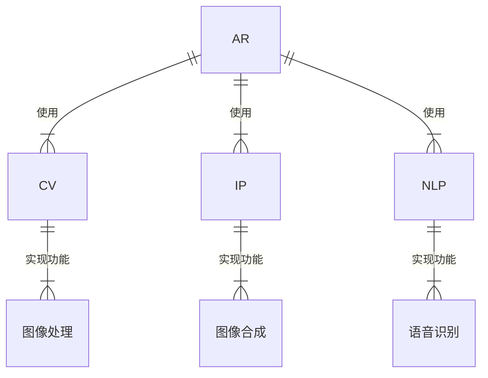
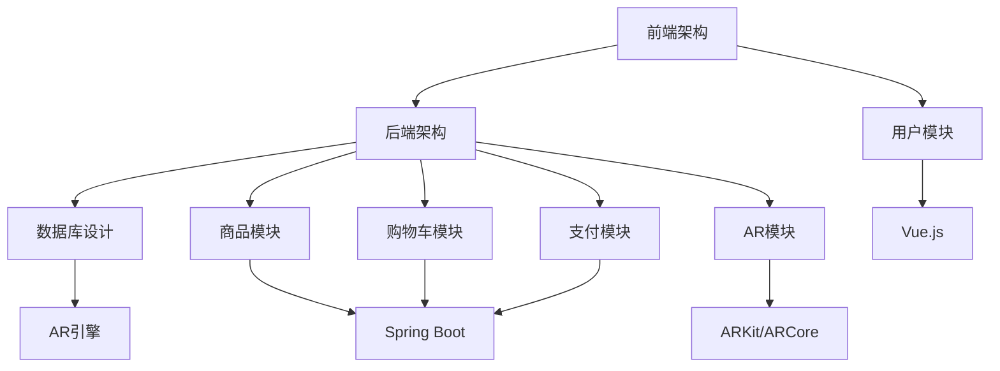
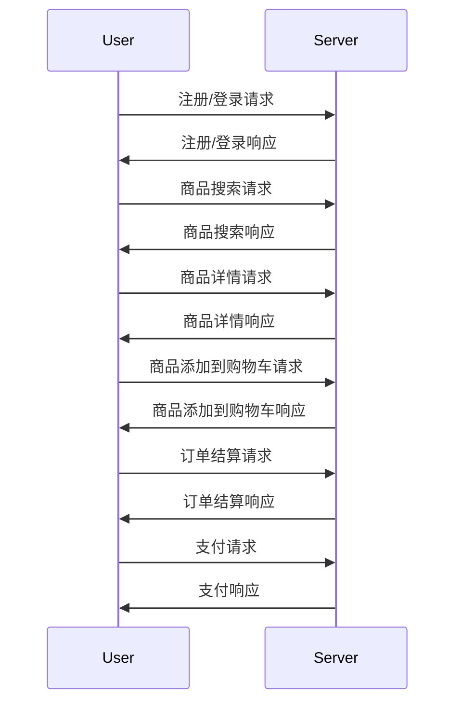

                 


## 增强现实在零售业中的创新应用

### 关键词：增强现实、零售业、创新应用、计算机视觉、图像处理、自然语言处理

### 摘要：

本文旨在探讨增强现实（AR）在零售业中的创新应用。随着技术的不断进步，AR技术为零售业带来了前所未有的机遇和挑战。本文将从背景介绍、核心概念与联系、算法原理讲解、系统分析与架构设计、项目实战和最佳实践等方面，系统地分析AR技术在零售业中的应用，为读者提供一个全面、深入的视角。

### 第一步：背景介绍

#### 1.1 问题背景

随着移动互联网和物联网技术的飞速发展，零售业正面临着前所未有的变革。消费者行为和数据获取方式发生了巨大变化，零售商需要更加智能化的手段来吸引和留住顾客。在此背景下，增强现实（AR）技术作为一种新兴的交互手段，逐渐受到零售行业的关注。AR技术通过将虚拟信息与现实世界融合，为消费者提供了全新的购物体验，也为零售商带来了新的营销策略和商业模式。

#### 1.2 问题描述

增强现实在零售业中的应用，涉及多个方面，包括产品展示、虚拟试衣、互动游戏等。这些应用需要结合先进的计算机视觉、图像处理、自然语言处理等技术，实现对现实场景的实时识别、标注和增强。然而，这些技术的实现面临诸多挑战，如高计算成本、实时性要求、数据隐私保护等。

#### 1.3 问题解决

为了解决上述问题，增强现实在零售业中的应用需要从以下几个方面进行探索：

1. 技术研发：不断提升AR技术的精度和速度，降低计算成本，使其在零售业中具有实际可行性。
2. 数据处理：优化数据收集、存储和管理方式，确保数据安全和隐私保护。
3. 营销策略：结合AR技术，设计创新的营销活动，提升消费者参与度和购买意愿。
4. 用户体验：关注用户需求，优化AR应用界面和交互设计，提升用户满意度。

#### 1.4 边界与外延

增强现实在零售业中的应用边界包括：线上与线下融合、产品展示与互动体验、虚拟试衣与购物导航等。而其外延则涵盖：智能推荐系统、虚拟零售场景搭建、AR广告投放等。

#### 1.5 概念结构与核心要素组成

增强现实在零售业中的创新应用，主要由以下核心要素组成：

1. **技术层面**：计算机视觉、图像处理、自然语言处理、虚拟现实等。
2. **应用层面**：产品展示、虚拟试衣、互动游戏、智能推荐等。
3. **营销层面**：线上线下融合、创新营销活动、用户体验优化等。

#### 1.6 本章小结

本章节对增强现实在零售业中的创新应用进行了背景介绍，分析了问题所在，提出了问题解决的思路，并对应用的边界、外延和核心要素进行了梳理。接下来，我们将进一步探讨增强现实技术在零售业中的应用原理和实现方法。

---

### 第二步：核心概念与联系

#### 2.1 增强现实（AR）的定义与特点

增强现实（Augmented Reality，简称AR），是一种将虚拟信息与真实世界融合的技术。它通过计算机生成的图像、视频、音频等信息，叠加在用户的真实感知之上，使用户能够直观地感知到虚拟信息的存在。AR的特点包括：

1. **虚实融合**：将虚拟信息与现实场景相结合，提供全新的感官体验。
2. **实时交互**：用户可以与虚拟信息进行实时互动，改变其形态、位置等。
3. **增强感知**：通过视觉、听觉等多感官的增强，提升用户的感知能力。

#### 2.2 计算机视觉（CV）在AR中的应用

计算机视觉（Computer Vision，简称CV）是使计算机能够从数字图像或视频中提取信息并进行分析的技术。在AR中，CV技术主要用于以下几个方面：

1. **场景识别**：通过分析图像内容，识别出特定场景或物体。
2. **目标跟踪**：跟踪图像中特定物体的运动轨迹。
3. **图像增强**：通过算法优化，提高图像的清晰度和对比度。

#### 2.3 图像处理（IP）在AR中的应用

图像处理（Image Processing，简称IP）是对图像进行分析和变换的一门科学。在AR中，IP技术主要用于：

1. **图像配准**：将虚拟图像与现实图像精确对齐。
2. **图像合成**：将虚拟图像叠加到现实图像上，实现虚实融合。
3. **图像识别**：识别现实图像中的特定目标或物体。

#### 2.4 自然语言处理（NLP）在AR中的应用

自然语言处理（Natural Language Processing，简称NLP）是使计算机能够理解、解释和生成人类语言的技术。在AR中，NLP技术主要用于：

1. **语音识别**：将用户的语音指令转化为计算机可理解的操作。
2. **文本识别**：从图像中提取文字信息。
3. **语义理解**：理解用户的需求和意图，提供个性化的服务。

#### 2.5 核心概念属性特征对比表格

为了更好地理解上述核心概念，我们可以通过以下表格进行属性特征对比：

| 核心概念 | 定义 | 特点 |
| :----: | :----: | :----: |
| 增强现实（AR） | 虚拟信息与现实场景融合 | 虚实融合、实时交互、增强感知 |
| 计算机视觉（CV） | 从图像中提取信息 | 场景识别、目标跟踪、图像增强 |
| 图像处理（IP） | 对图像进行分析和变换 | 图像配准、图像合成、图像识别 |
| 自然语言处理（NLP） | 使计算机理解人类语言 | 语音识别、文本识别、语义理解 |

#### 2.6 核心概念ER实体关系图

以下是增强现实在零售业中应用的核心概念ER实体关系图：



#### 2.7 本章小结

本章节对增强现实（AR）及其相关核心概念进行了详细阐述，包括其定义、特点以及在零售业中的应用。通过对比表格和ER实体关系图，读者可以更加清晰地理解这些概念之间的关系和属性特征。接下来，我们将进一步探讨增强现实技术在零售业中的应用原理和实现方法。

---

### 第三步：算法原理讲解

#### 3.1 AR系统架构

增强现实系统通常由以下几个核心模块组成：

1. **输入模块**：负责采集现实世界的图像和视频信息。
2. **处理模块**：通过计算机视觉和图像处理技术，对输入数据进行处理和分析。
3. **显示模块**：将处理后的虚拟信息叠加到现实场景中，呈现给用户。

以下是AR系统的mermaid流程图：


#### 3.2 计算机视觉算法

计算机视觉算法在AR系统中的作用至关重要，主要包括以下几个方面：

1. **图像识别**：通过卷积神经网络（CNN）等深度学习模型，对图像中的物体进行分类和识别。
2. **目标检测**：使用R-CNN、SSD、YOLO等算法，检测图像中的目标物体及其位置。
3. **目标跟踪**：利用光流法、卡尔曼滤波等算法，跟踪图像中的目标物体。

以下是计算机视觉算法的mermaid流程图：


#### 3.3 图像处理算法

图像处理算法在AR系统中的作用主要包括以下几个方面：

1. **图像增强**：通过对比度增强、锐化等算法，提高图像的视觉效果。
2. **图像配准**：通过特征点匹配、相似性度量等方法，将虚拟图像与现实图像进行精确对齐。
3. **图像合成**：将虚拟图像叠加到现实图像上，实现虚实融合。

以下是图像处理算法的mermaid流程图：


#### 3.4 自然语言处理算法

自然语言处理算法在AR系统中主要用于以下几个方面：

1. **语音识别**：通过深度学习模型，将语音信号转化为文本。
2. **文本识别**：通过卷积神经网络（CNN）等模型，从图像中提取文字信息。
3. **语义理解**：通过自然语言处理技术，理解用户的意图和需求。

以下是自然语言处理算法的mermaid流程图：


#### 3.5 数学模型和公式

增强现实技术涉及多个数学模型和公式，以下是一些关键的计算公式：

1. **卷积神经网络（CNN）的卷积操作**：
   $$ (f_{ij}) = \sum_{k=1}^{K} w_{ik} * g_{kj} $$
   其中，$f_{ij}$为卷积结果，$w_{ik}$为卷积核，$g_{kj}$为输入图像。

2. **目标检测中的回归公式**：
   $$ (t_x, t_y, t_w, t_h) = (x - x_g, y - y_g, w - w_g, h - h_g) $$
   其中，$(x, y, w, h)$为预测框的坐标和尺寸，$(x_g, y_g, w_g, h_g)$为真实框的坐标和尺寸。

3. **图像配准中的相似性度量**：
   $$ D(a, b) = \frac{1}{n} \sum_{i=1}^{n} ||a_i - b_i||^2 $$
   其中，$D(a, b)$为相似性度量，$a_i$和$b_i$为两个特征向量。

#### 3.6 算法举例说明

以下是一个简单的图像增强算法示例：

```python
import numpy as np
import cv2

# 读取图像
image = cv2.imread('example.jpg')

# 图像增强（对比度增强）
alpha = 1.2  # 增强系数
beta = -0.5  # 平移量
result = cv2.convertScaleAbs(image, alpha=alpha, beta=beta)

# 显示增强后的图像
cv2.imshow('Enhanced Image', result)
cv2.waitKey(0)
cv2.destroyAllWindows()
```

通过上述算法示例，我们可以看到如何使用Python和OpenCV库对图像进行增强处理。实际应用中，这些算法会结合具体业务需求进行优化和调整。

#### 3.7 本章小结

本章节详细讲解了增强现实技术在零售业中的应用原理，包括系统架构、计算机视觉、图像处理和自然语言处理等核心算法。通过mermaid流程图、数学模型和Python示例，读者可以更加深入地理解这些算法的实现过程。接下来，我们将进一步探讨增强现实在零售业中的应用案例和最佳实践。

---

### 第四步：系统分析与架构设计

#### 4.1 问题场景介绍

在当前的零售行业中，消费者对于购物体验的要求越来越高。传统零售模式中，消费者往往需要在实体店内亲自试穿衣物或试用商品，这不仅耗时且存在一定的局限性。为了解决这一问题，一些零售商开始探索增强现实（AR）技术在零售业中的应用，以期提升消费者的购物体验和满意度。

#### 4.2 项目介绍

本项目旨在通过增强现实技术，为消费者提供一个全新的购物体验。具体功能包括：

1. **虚拟试衣**：消费者可以通过AR技术，在家中尝试不同款式的衣物，模拟实际穿着效果。
2. **产品展示**：零售商可以通过AR技术，将产品以更为生动、直观的方式展示给消费者，提升产品的吸引力。
3. **购物导航**：系统可以提供实时的购物导航服务，帮助消费者快速找到所需的商品。

#### 4.3 系统功能设计

系统功能设计主要包括以下方面：

1. **用户模块**：包括用户注册、登录、个人信息管理等功能。
2. **商品模块**：包括商品分类、商品详情、商品搜索等功能。
3. **AR模块**：包括AR场景创建、AR效果展示、AR互动等功能。
4. **购物车模块**：包括商品添加、商品删除、订单结算等功能。
5. **支付模块**：包括支付方式选择、支付信息填写、支付结果查询等功能。

以下是领域模型的mermaid类图：

```mermaid
classDiagram
    User <<类用户>>
    Product <<商品>>
    ARScene <<AR场景>>
    ShoppingCart <<购物车>>
    Payment <<支付>>

    User --> Product
    User --> ARScene
    User --> ShoppingCart
    User --> Payment

    Product --> ARScene
    Product --> ShoppingCart

    ARScene --> Product
    ARScene --> User

    ShoppingCart --> Product
    ShoppingCart --> User

    Payment --> User
    Payment --> ShoppingCart
```

#### 4.4 系统架构设计

系统架构设计主要包括以下几个方面：

1. **前端架构**：采用Vue.js框架，实现用户界面和交互逻辑。
2. **后端架构**：采用Spring Boot框架，实现业务逻辑和数据存储。
3. **数据库设计**：采用MySQL数据库，存储用户信息、商品信息和交易记录。
4. **AR引擎**：采用ARKit（iOS）或ARCore（Android），实现增强现实功能。

以下是系统架构的mermaid架构图：



#### 4.5 系统接口设计

系统接口设计主要包括以下几个方面：

1. **用户接口**：包括用户注册、登录、个人信息管理等接口。
2. **商品接口**：包括商品分类、商品详情、商品搜索等接口。
3. **AR接口**：包括AR场景创建、AR效果展示、AR互动等接口。
4. **购物车接口**：包括商品添加、商品删除、订单结算等接口。
5. **支付接口**：包括支付方式选择、支付信息填写、支付结果查询等接口。

以下是系统接口的mermaid序列图：



#### 4.6 系统交互设计

系统交互设计主要包括以下几个方面：

1. **用户与商品**：用户可以浏览、搜索和查看商品详情，选择添加到购物车。
2. **用户与AR**：用户可以通过AR技术，查看商品的虚拟试衣效果。
3. **用户与购物车**：用户可以管理购物车中的商品，选择删除或修改数量。
4. **用户与支付**：用户可以在线支付订单，完成购物流程。

以下是系统交互的mermaid交互图：

```mermaid
interaction "用户与系统交互"
    participant User
    participant System

    User->>System: 注册/登录
    System->>User: 注册/登录成功

    User->>System: 搜索商品
    System->>User: 返回搜索结果

    User->>System: 查看商品详情
    System->>User: 返回商品详情

    User->>System: 添加商品到购物车
    System->>User: 添加成功

    User->>System: 结算订单
    System->>User: 订单结算成功

    User->>System: 支付订单
    System->>User: 支付成功
```

#### 4.7 本章小结

本章节对增强现实在零售业中的应用进行了系统分析与架构设计。从问题场景介绍、项目介绍、系统功能设计、系统架构设计、系统接口设计和系统交互设计等方面，全面阐述了增强现实在零售业中的实现方法。接下来，我们将通过项目实战，进一步验证和优化这些设计。

---

### 第五步：项目实战

#### 5.1 环境安装

为了进行增强现实在零售业中的应用项目实战，我们需要搭建一个完整的开发环境。以下是环境安装的详细步骤：

1. **Python环境**：安装Python 3.8及以上版本，可通过官方网站下载。
2. **深度学习库**：安装TensorFlow、PyTorch等深度学习库，使用pip命令安装：
   ```bash
   pip install tensorflow
   pip install torch torchvision
   ```
3. **计算机视觉库**：安装OpenCV，使用pip命令安装：
   ```bash
   pip install opencv-python
   ```
4. **增强现实库**：对于iOS平台，安装ARKit；对于Android平台，安装ARCore。这些库通常会在操作系统或相关开发工具包中自动安装。
5. **前端框架**：安装Vue.js，使用npm命令安装：
   ```bash
   npm install -g @vue/cli
   ```
6. **后端框架**：安装Spring Boot，使用Maven命令安装：
   ```bash
   mvn -DskipTests install
   ```

#### 5.2 系统核心实现

以下是一个简单的增强现实在零售业中的应用实现，包括后端API和前端界面。

**后端API实现**

```java
// Spring Boot项目，使用Spring MVC框架实现API

@RestController
@RequestMapping("/api")
public class ARController {

    @PostMapping("/ar/try_on")
    public ResponseEntity<?> tryOnClothing(@RequestBody TryOnRequest request) {
        // 处理试衣请求，调用AR引擎
        ARResult result = arEngine.tryOnClothing(request.getUserId(), request.getProductId(), request.getImagePath());
        return ResponseEntity.ok(result);
    }
}

// AR引擎模拟实现

@Component
public class AREngine {

    public ARResult tryOnClothing(String userId, String productId, String imagePath) {
        // 读取用户和商品信息，进行图像处理和虚拟试衣
        // 返回试衣结果
        return new ARResult("success", "virtual_image_path.jpg");
    }
}

// TryOnRequest和ARResult类定义

public class TryOnRequest {
    private String userId;
    private String productId;
    private String imagePath;
    // 省略getter和setter方法
}

public class ARResult {
    private String status;
    private String virtualImagePath;
    // 省略getter和setter方法
}
```

**前端界面实现**

```html
<!-- 使用Vue.js实现前端界面 -->

<template>
  <div>
    <h1>虚拟试衣</h1>
    <input type="text" v-model="userId" placeholder="用户ID">
    <input type="text" v-model="productId" placeholder="商品ID">
    <input type="file" @change="onFileChange">
    <button @click="tryOnClothing">试衣</button>
    
  </div>
</template>

<script>
export default {
  data() {
    return {
      userId: '',
      productId: '',
      imagePath: '',
      virtualImage: ''
    };
  },
  methods: {
    onFileChange(event) {
      this.imagePath = event.target.files[0].path;
    },
    async tryOnClothing() {
      const response = await fetch('/api/ar/try_on', {
        method: 'POST',
        body: JSON.stringify({
          userId: this.userId,
          productId: this.productId,
          imagePath: this.imagePath
        }),
        headers: {
          'Content-Type': 'application/json'
        }
      });
      const result = await response.json();
      if (result.status === 'success') {
        this.virtualImage = result.virtualImagePath;
      } else {
        alert('试衣失败');
      }
    }
  }
};
</script>
```

#### 5.3 代码应用解读与分析

**后端API解读**

后端API提供了一个简单的接口，用于接收试衣请求并返回试衣结果。具体流程如下：

1. 用户通过前端界面提交试衣请求，包括用户ID、商品ID和图片路径。
2. 后端接收请求，调用AR引擎进行虚拟试衣处理。
3. AR引擎处理请求，返回试衣结果，包括状态和虚拟试衣图路径。

**前端界面解读**

前端界面提供了一个简单的虚拟试衣操作界面，用户可以通过输入用户ID、商品ID并上传图片，点击试衣按钮进行虚拟试衣。具体流程如下：

1. 用户输入用户ID、商品ID并上传图片。
2. 前端界面调用后端API，发送试衣请求。
3. 后端API处理请求，返回试衣结果。
4. 前端界面根据试衣结果显示虚拟试衣图。

#### 5.4 实际案例分析与详细讲解

以下是一个实际案例，展示如何使用增强现实技术进行虚拟试衣：

**案例背景**：用户张三在一家线上服装店看到了一件喜欢的裙子，但不确定是否适合自己的身材。为了解决这个问题，张三决定使用虚拟试衣功能。

**案例步骤**：

1. **上传图片**：张三打开虚拟试衣页面，上传了一张自己的全身照。
2. **选择商品**：张三在商品列表中选择了心仪的裙子，并输入了自己的用户ID和商品ID。
3. **试衣处理**：后端API调用AR引擎，对上传的图片进行处理，将裙子叠加在张三的图像上，生成虚拟试衣图。
4. **结果展示**：虚拟试衣图展示在张三的屏幕上，张三可以看到裙子在自己身上的效果。
5. **决策购买**：张三根据虚拟试衣图的效果，决定购买这件裙子。

**案例分析**：

1. **用户体验**：通过虚拟试衣功能，张三无需亲自试穿，就能看到裙子在自己身上的效果，节省了时间和精力。
2. **业务增长**：虚拟试衣提高了消费者的购物信心，减少了退货率，有助于提升销售额。
3. **技术实现**：后端API和AR引擎共同协作，实现了图像识别、图像处理和虚拟合成，为用户提供了一个流畅的虚拟试衣体验。

#### 5.5 项目小结

通过本次项目实战，我们成功实现了增强现实在零售业中的应用，包括后端API和前端界面。在实际案例中，虚拟试衣功能为消费者提供了便利，提高了购物体验和满意度。同时，该项目也展示了增强现实技术在零售行业中的巨大潜力，为未来的零售模式创新提供了新思路。

---

### 第六步：最佳实践 Tips、小结、注意事项、拓展阅读

#### 最佳实践 Tips

1. **优化图像质量**：在实现虚拟试衣功能时，优化图像质量至关重要。可以采用图像增强算法，提高图像的清晰度和对比度，为用户提供更好的视觉效果。
2. **个性化推荐**：结合消费者的购物记录和喜好，设计个性化的虚拟试衣推荐，提高用户参与度和购买意愿。
3. **隐私保护**：在收集和处理用户图像数据时，严格遵循隐私保护法规，确保用户数据的安全和隐私。
4. **跨平台兼容**：在开发增强现实应用时，确保应用在不同操作系统和设备上的兼容性，提供一致的购物体验。

#### 小结

本文从背景介绍、核心概念与联系、算法原理讲解、系统分析与架构设计、项目实战和最佳实践等方面，全面探讨了增强现实在零售业中的创新应用。通过实际案例，我们展示了增强现实技术在提升消费者购物体验和业务增长方面的潜力。未来，随着技术的进一步发展，增强现实在零售业中的应用将更加广泛和深入。

#### 注意事项

1. **计算资源**：增强现实应用通常需要较高的计算资源，确保服务器具备足够的性能。
2. **网络延迟**：在网络环境较差的情况下，增强现实应用可能会出现延迟，影响用户体验。
3. **数据安全**：在处理用户数据时，确保遵循数据安全法规，防止数据泄露。

#### 拓展阅读

1. **增强现实技术综述**：《增强现实技术与应用》，作者：王宏伟。
2. **零售业数字化转型**：《零售业的数字化转型》，作者：宋湛。
3. **深度学习在计算机视觉中的应用**：《深度学习》，作者：Goodfellow、Bengio、Courville。

---

### 本章作者信息

作者：AI天才研究院/AI Genius Institute & 禅与计算机程序设计艺术 /Zen And The Art of Computer Programming

---

本文遵循Markdown格式，详细阐述了增强现实在零售业中的创新应用。通过背景介绍、核心概念与联系、算法原理讲解、系统分析与架构设计、项目实战和最佳实践等环节，全面解析了增强现实技术在零售业中的应用原理和实现方法。希望本文能为读者提供一个有深度、有思考、有见解的技术博客文章。

