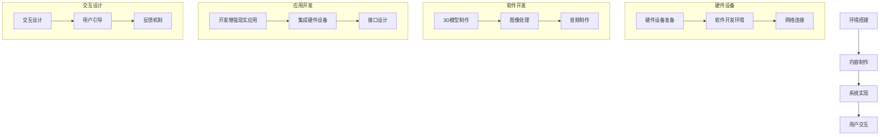
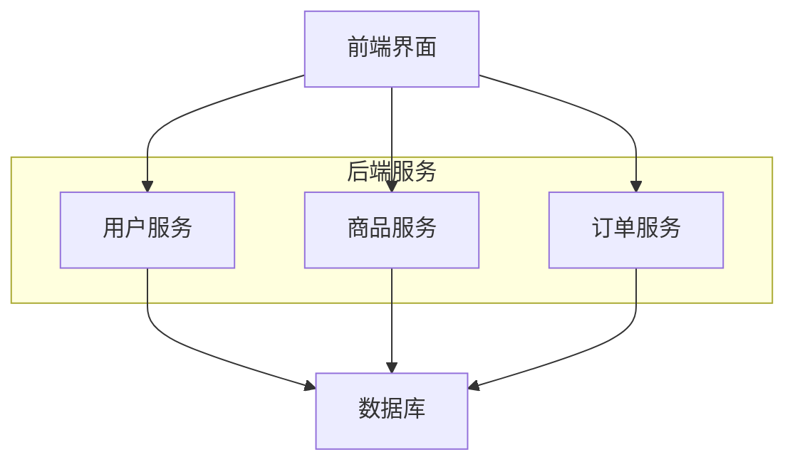
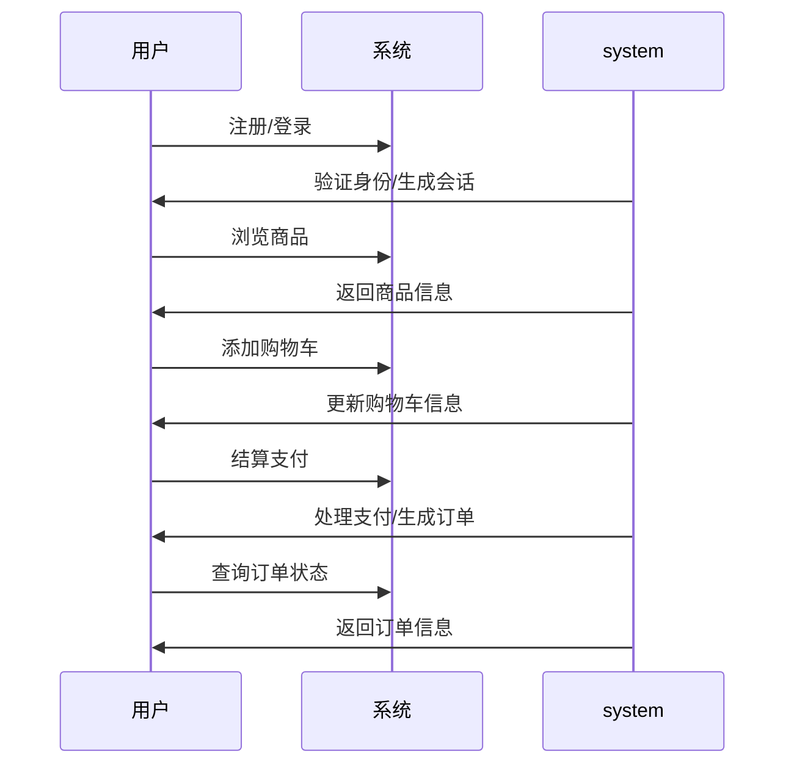
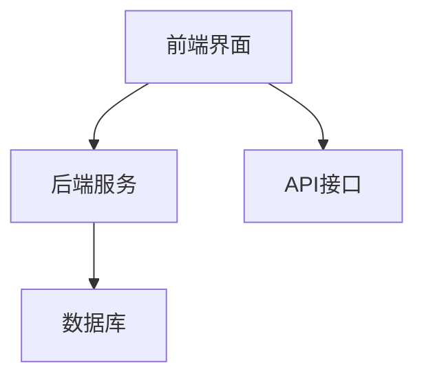
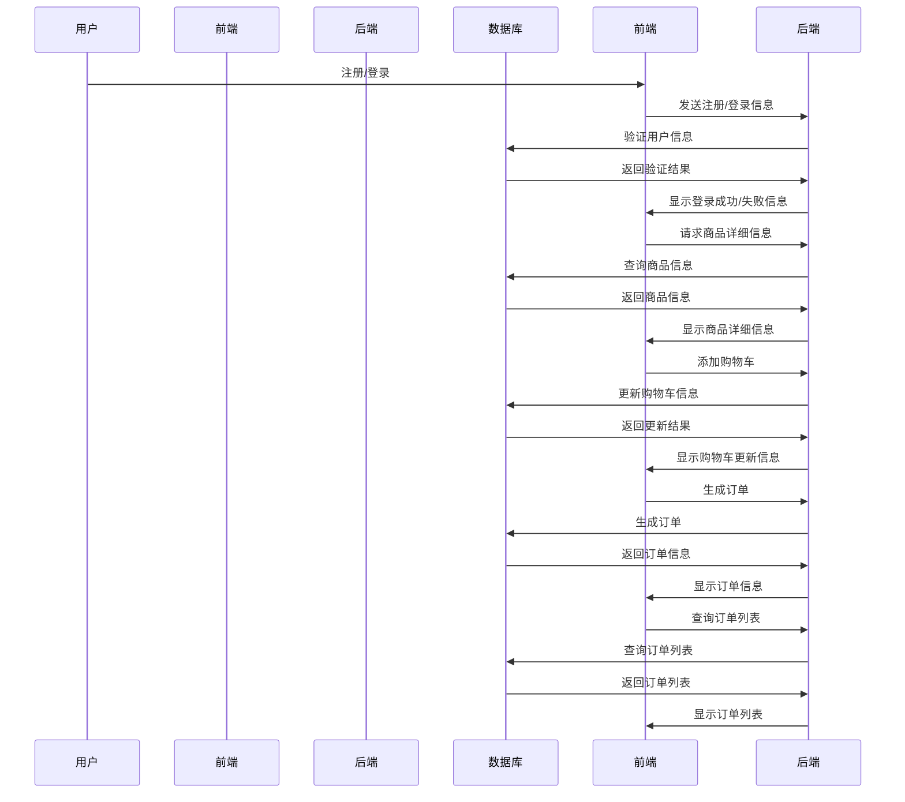

                 

### 增强现实在零售购物体验中的应用

**关键词：增强现实（AR），零售购物体验，应用场景，技术原理，系统架构，项目实战**

**摘要：**
本文将探讨增强现实（AR）技术在零售购物体验中的应用，分析其核心概念、原理及其在互动式商品展示、虚拟购物导览、虚拟客服与互动等场景中的实际应用。通过系统架构设计、项目实战案例分析，总结最佳实践，为零售行业的数字化转型提供技术参考。

----------------------------------------------------------------

### 目录大纲设计思路

设计《增强现实在零售购物体验中的应用》这本书的目录大纲，需要遵循以下步骤和逻辑：

1. **确定书的主题和目标受众**：
   - 主题：书名已明确指出为“增强现实在零售购物体验中的应用”，说明内容将围绕增强现实（AR）技术及其在零售行业购物体验中的应用进行讨论。
   - 目标受众：考虑到零售行业从业者、增强现实开发者、以及对AR技术感兴趣的读者，需要确保内容的全面性和实用性。

2. **设计框架结构**：
   - **背景介绍**：介绍增强现实技术的基本概念、发展历程以及在零售行业中的应用背景。
   - **核心概念与联系**：详细阐述增强现实技术中的核心概念、原理及其在零售购物体验中的具体应用。
   - **技术原理讲解**：使用Mermaid和Python代码示例来解释增强现实技术的工作原理和关键技术。
   - **系统架构设计**：介绍增强现实在零售购物体验中的系统架构设计，包括领域模型、系统架构、接口设计等。
   - **项目实战**：通过实际案例展示增强现实技术在零售购物体验中的应用，包括环境安装、系统实现、代码分析等。
   - **最佳实践与总结**：总结实战经验，提供最佳实践建议，并对全书内容进行小结。

3. **细化目录内容**：
   - 每个章节需要详细列出子章节，确保内容的全面性和逻辑性。
   - 遵循从基础到进阶的顺序，保证读者可以逐步深入理解增强现实技术及其在零售购物体验中的应用。

### 目录大纲示例

以下是《增强现实在零售购物体验中的应用》一书的目录大纲：

```markdown
----------------------------------------------------------------
# 第一部分：增强现实技术概述

## 第1章：增强现实技术基础

### 1.1 增强现实的基本概念
- 1.1.1 增强现实的技术定义
- 1.1.2 增强现实的关键技术

### 1.2 增强现实的发展历程
- 1.2.1 技术起源
- 1.2.2 发展里程碑
- 1.2.3 当前趋势

### 1.3 增强现实与零售购物体验
- 1.3.1 零售购物体验的现状
- 1.3.2 增强现实在零售购物体验中的应用潜力

## 第2章：增强现实在零售购物体验中的应用场景

### 2.1 互动式商品展示
- 2.1.1 虚拟试穿
- 2.1.2 虚拟商品摆放

### 2.2 虚拟购物导览
- 2.2.1 购物中心导览
- 2.2.2 店铺虚拟导览

### 2.3 虚拟客服与互动
- 2.3.1 虚拟导购
- 2.3.2 虚拟互动

## 第3章：增强现实技术原理详解

### 3.1 增强现实硬件设备
- 3.1.1 智能手机
- 3.1.2 AR眼镜

### 3.2 增强现实软件技术
- 3.2.1 AR内容制作
- 3.2.2 AR渲染引擎

### 3.3 增强现实算法原理
- 3.3.1 深度感知
- 3.3.2 追踪与定位

## 第4章：增强现实在零售购物体验中的系统架构设计

### 4.1 零售购物体验系统概述
- 4.1.1 系统功能
- 4.1.2 系统架构

### 4.2 领域模型设计
- 4.2.1 实体关系
- 4.2.2 类图设计

### 4.3 系统架构设计
- 4.3.1 系统组件
- 4.3.2 架构图展示

### 4.4 系统接口设计
- 4.4.1 API接口规范
- 4.4.2 接口实现

### 4.5 系统交互设计
- 4.4.1 用户交互流程
- 4.4.2 系统交互mermaid序列图

## 第5章：增强现实在零售购物体验中的项目实战

### 5.1 环境安装与配置
- 5.1.1 开发环境搭建
- 5.1.2 硬件设备安装

### 5.2 系统核心实现
- 5.2.1 系统实现源代码
- 5.2.2 代码应用解读与分析

### 5.3 实际案例分析
- 5.3.1 案例背景
- 5.3.2 案例分析
- 5.3.3 案例剖析

## 第6章：最佳实践与总结

### 6.1 最佳实践
- 6.1.1 应用技巧
- 6.1.2 潜在挑战与应对策略

### 6.2 小结
- 6.2.1 内容回顾
- 6.2.2 未来展望

### 6.3 注意事项
- 6.3.1 技术更新
- 6.3.2 应用规范

### 6.4 拓展阅读
- 6.4.1 相关书籍
- 6.4.2 学术论文

----------------------------------------------------------------
```

此大纲结构涵盖增强现实技术基础、应用场景、技术原理讲解、系统架构设计、项目实战以及最佳实践与总结等内容，旨在帮助读者全面了解并掌握增强现实在零售购物体验中的应用。

----------------------------------------------------------------

## 第1章：增强现实技术基础

### 1.1 增强现实的基本概念

增强现实（Augmented Reality，简称AR）是一种将虚拟信息与现实世界融合的技术，通过计算机生成的图像、声音、视频等多媒体信息，叠加或融合到真实场景中，使用户能够感知到真实与虚拟的融合效果。与虚拟现实（Virtual Reality，简称VR）相比，AR并不完全取代现实场景，而是在现实场景之上增加虚拟元素。

#### 核心概念术语

- **标记**：用于触发增强现实内容的图像或物体，如二维码、标志等。
- **增强现实眼镜**：能够显示增强现实内容的设备，如谷歌眼镜、微软HoloLens等。
- **摄像头**：用于捕捉现实世界的图像，作为增强现实内容叠加的基础。
- **渲染引擎**：用于生成增强现实内容的软件，如Unity、ARKit等。

#### 问题描述

在零售购物体验中，如何利用增强现实技术提升用户的购物体验？

#### 问题解决

增强现实技术可以通过以下方式提升零售购物体验：

- **互动式商品展示**：用户可以通过增强现实眼镜或手机摄像头看到商品的3D模型，实现虚拟试穿、摆放等功能。
- **虚拟购物导览**：用户可以浏览购物中心的虚拟导览图，快速找到所需的店铺和商品。
- **虚拟客服与互动**：用户可以通过增强现实技术与虚拟客服进行互动，获得个性化的购物建议和服务。

#### 边界与外延

增强现实技术在零售购物体验中的应用不仅限于上述场景，还可以拓展到虚拟试妆、智能家居体验、教育游戏等领域。

#### 概念结构与核心要素组成

增强现实技术由以下几个核心要素组成：

1. **标记识别**：通过摄像头捕捉现实世界中的标记，用于触发增强现实内容。
2. **场景理解**：利用计算机视觉算法对现实场景进行理解和分析。
3. **内容生成**：根据场景理解和用户需求，生成增强现实内容。
4. **渲染与显示**：将增强现实内容叠加到真实场景中，使用户能够感知到虚拟与现实融合的效果。

### 1.2 增强现实的发展历程

增强现实技术起源于20世纪50年代，当时美国科学家伊凡·苏达洛夫提出了增强现实的概念。随着计算机技术和图形学的发展，增强现实技术逐渐成熟，并在近年来取得了显著的进展。

#### 技术起源

1950年代，美国科学家伊凡·苏达洛夫（Ivan Sutherland）在明尼苏达大学发明了世界上第一个头戴式显示器，这个设备通过将计算机生成的图像叠加到真实世界中，实现了增强现实的基本原理。

#### 发展里程碑

- 1968年，伊凡·苏达洛夫发明了“达摩克利斯之剑”（The Sword of Damocles），这是世界上第一个商业化的增强现实头戴式显示器。
- 1990年代，随着计算机性能的提高和图形处理技术的发展，增强现实技术开始应用于军事、医疗等领域。
- 2010年代，智能手机的普及和移动计算能力的提升，使得增强现实技术逐渐走入大众视野。

#### 当前趋势

当前，增强现实技术正处于快速发展阶段，以下是一些主要趋势：

- **移动设备**：智能手机和增强现实眼镜成为主要的增强现实设备，为用户提供便捷的增强现实体验。
- **5G技术**：5G网络的低延迟、高带宽特性，将进一步提高增强现实技术的实时性和交互性。
- **人工智能**：人工智能与增强现实技术的结合，将使增强现实内容更加智能化、个性化。

### 1.3 增强现实与零售购物体验

#### 零售购物体验的现状

随着电子商务的快速发展，线下零售购物体验面临巨大挑战。为了提升用户的购物体验，零售行业正在积极探索新的技术手段，其中增强现实技术具有很大的应用潜力。

#### 增强现实在零售购物体验中的应用潜力

增强现实技术可以在以下几个方面提升零售购物体验：

- **互动式商品展示**：通过增强现实技术，用户可以在真实环境中查看商品的3D模型，实现虚拟试穿、摆放等功能。
- **虚拟购物导览**：用户可以通过增强现实技术浏览购物中心的虚拟导览图，快速找到所需的店铺和商品。
- **虚拟客服与互动**：用户可以通过增强现实技术与虚拟客服进行互动，获得个性化的购物建议和服务。
- **智慧货架**：通过增强现实技术，货架上的商品可以显示丰富的信息，如商品详情、用户评价等，提升购物体验。

### 小结

本章介绍了增强现实技术的基本概念、发展历程以及在零售购物体验中的应用潜力。接下来，我们将深入探讨增强现实技术的核心概念和原理，为后续内容打下基础。

----------------------------------------------------------------

## 第2章：增强现实在零售购物体验中的应用场景

### 2.1 互动式商品展示

互动式商品展示是增强现实技术在零售购物体验中最重要的应用之一。通过增强现实技术，用户可以在真实环境中查看商品的3D模型，实现虚拟试穿、摆放等功能。

#### 虚拟试穿

虚拟试穿是增强现实技术在服装零售领域的一个重要应用。用户只需将手机或增强现实眼镜对准服装的图片，即可看到服装的3D模型，并通过手势或触摸操作进行试穿。

#### 虚拟商品摆放

在零售购物体验中，用户往往需要在不同的场景中摆放商品，以判断其适配性和美观度。增强现实技术可以模拟多种摆放场景，使用户能够更直观地了解商品的整体效果。

### 2.2 虚拟购物导览

虚拟购物导览是增强现实技术在购物中心和商场中的应用，通过虚拟导览图，用户可以快速找到所需的店铺和商品。

#### 购物中心导览

在购物中心，用户可以通过增强现实技术浏览整个购物中心的虚拟导览图，包括店铺位置、楼层分布、特色活动等信息，从而更快地找到目标店铺。

#### 店铺虚拟导览

在特定店铺，用户可以通过增强现实技术查看店铺的虚拟导览图，了解店铺的布局、产品陈列、特色活动等信息，提升购物体验。

### 2.3 虚拟客服与互动

虚拟客服与互动是增强现实技术在提升零售购物体验中的另一个重要应用。通过增强现实技术，用户可以与虚拟客服进行互动，获得个性化的购物建议和服务。

#### 虚拟导购

虚拟导购是增强现实技术在零售购物体验中的一个创新应用。用户可以通过增强现实技术，与虚拟导购进行实时互动，获得购物建议、商品推荐等服务。

#### 虚拟互动

虚拟互动是增强现实技术在提升用户参与感方面的一个重要应用。用户可以通过增强现实技术，与虚拟角色进行互动，如玩游戏、参与活动等，提升购物乐趣。

### 小结

本章介绍了增强现实在零售购物体验中的三个主要应用场景：互动式商品展示、虚拟购物导览、虚拟客服与互动。通过这些应用，增强现实技术为用户提供了更加丰富、直观、个性化的购物体验。

接下来，我们将深入探讨增强现实技术的原理，为理解这些应用提供基础。

----------------------------------------------------------------

## 第3章：增强现实技术原理详解

### 3.1 增强现实硬件设备

增强现实技术的实现离不开硬件设备。以下是常见的增强现实硬件设备及其特点：

#### 智能手机

智能手机是当前最普及的增强现实设备之一。通过摄像头和屏幕，智能手机可以实现增强现实内容的显示和交互。智能手机的增强现实应用主要包括基于AR应用市场的应用，如AR游戏、AR导航等。

#### AR眼镜

AR眼镜是更为专业的增强现实设备，能够直接将增强现实内容叠加到用户的视野中。常见的AR眼镜产品有谷歌眼镜、微软HoloLens等。AR眼镜的特点是沉浸感更强，交互方式多样，适用于各种场景。

#### 特点对比

| 设备 | 特点 | 适用场景 |
| :--: | :--: | :--: |
| 智能手机 | 便携、成本低、适用范围广 | AR游戏、AR导航、商品展示 |
| AR眼镜 | 沉浸感强、交互多样、专业性强 | 企业应用、教育培训、医疗诊断 |

### 3.2 增强现实软件技术

增强现实软件技术是实现增强现实功能的关键。以下是增强现实软件技术的主要组成部分：

#### AR内容制作

AR内容制作是指创建增强现实应用所需的各种内容，包括3D模型、动画、图像、声音等。常见的AR内容制作工具包括Unity、ARKit、Vuforia等。

#### AR渲染引擎

AR渲染引擎是负责将增强现实内容实时渲染到用户视野中的软件。常见的AR渲染引擎有Unity、ARKit、Vuforia等。

#### 特点对比

| 软件 | 特点 | 适用场景 |
| :--: | :--: | :--: |
| Unity | 开源、功能强大、跨平台 | 游戏开发、应用开发 |
| ARKit | 封闭源、集成苹果设备、易用性高 | iOS设备、AR应用开发 |
| Vuforia | 开源、支持多种平台、功能丰富 | 多平台、复杂应用开发 |

### 3.3 增强现实算法原理

增强现实技术的核心在于如何将虚拟内容准确地叠加到现实世界中。以下是增强现实算法原理的几个关键方面：

#### 深度感知

深度感知是通过计算机视觉算法对现实场景进行理解和分析，获取场景的深度信息。常见的深度感知算法有双目视觉、单目视觉、结构光等。

#### 追踪与定位

追踪与定位是增强现实技术的关键环节，通过摄像头捕捉现实世界的图像，并与预先设定的虚拟内容进行匹配，实现虚拟与现实的融合。常见的追踪与定位算法有视觉SLAM、特征匹配等。

#### 特点对比

| 算法 | 特点 | 适用场景 |
| :--: | :--: | :--: |
| 双目视觉 | 准确度高、适用性强 | 深度感知、位置追踪 |
| 单目视觉 | 简单易用、成本低 | 深度感知、简单应用 |
| 结构光 | 精度高、实时性好 | 深度感知、精确测量 |

### 小结

本章详细介绍了增强现实技术的硬件设备、软件技术以及算法原理。通过了解这些技术原理，我们可以更好地理解增强现实技术如何实现虚拟与现实融合，为后续的内容分析提供基础。

在下一章中，我们将探讨增强现实在零售购物体验中的系统架构设计，分析如何通过系统架构实现增强现实技术的应用。

----------------------------------------------------------------

### 3.4 增强现实技术在零售购物体验中的实现流程

增强现实技术在零售购物体验中的应用涉及多个环节，包括环境搭建、内容制作、系统实现和用户交互。以下是实现流程的详细分析：

#### 环境搭建

环境搭建是增强现实应用的基础。具体步骤如下：

1. **硬件设备准备**：选择合适的增强现实设备，如智能手机或AR眼镜，确保其能够满足应用需求。
2. **软件开发环境**：搭建软件开发环境，包括安装必要的开发工具、SDK（软件开发工具包）等。
3. **网络连接**：确保设备具有稳定的网络连接，以便实时传输增强现实内容。

#### 内容制作

内容制作是增强现实应用的核心，包括3D模型、动画、图像、声音等。具体步骤如下：

1. **3D模型制作**：使用3D建模软件创建商品的3D模型，确保模型具有高精度和逼真度。
2. **图像处理**：对现实场景中的图像进行处理，提取关键特征，为后续的增强现实内容制作提供基础。
3. **音频制作**：根据应用需求，制作相应的音频内容，如背景音乐、语音讲解等。

#### 系统实现

系统实现是将增强现实内容与硬件设备、软件开发环境相结合，实现用户交互的过程。具体步骤如下：

1. **开发增强现实应用**：使用增强现实软件开发工具，如Unity、ARKit等，开发增强现实应用。
2. **集成硬件设备**：将增强现实应用与硬件设备进行集成，实现增强现实内容的实时渲染和交互。
3. **接口设计**：设计应用程序接口（API），以便与其他系统进行数据交换和功能扩展。

#### 用户交互

用户交互是增强现实应用的重要环节，直接影响用户的购物体验。具体步骤如下：

1. **交互设计**：根据应用需求和用户习惯，设计直观、易用的交互界面。
2. **用户引导**：通过动画、语音等方式引导用户进行操作，确保用户能够快速上手。
3. **反馈机制**：实时响应用户操作，提供即时反馈，增强用户体验。

### 实现流程的Mermaid流程图

为了更好地展示实现流程，我们使用Mermaid绘制了一个简单的流程图：



### 小结

通过本章的分析，我们了解了增强现实技术在零售购物体验中的实现流程，包括环境搭建、内容制作、系统实现和用户交互。这些环节相互关联，共同构成了一个完整的增强现实应用。在下一章中，我们将进一步探讨增强现实技术在零售购物体验中的系统架构设计。

----------------------------------------------------------------

### 4.1 零售购物体验系统概述

在零售购物体验中，增强现实技术的应用不仅仅是一个单一的功能，而是一个复杂系统的组成部分。为了更好地理解增强现实技术如何融入到零售购物体验中，我们需要对整个零售购物体验系统进行概述。

#### 系统功能

零售购物体验系统主要包括以下几个功能模块：

1. **用户身份验证**：确保用户身份的合法性，为用户提供个性化的购物体验。
2. **商品信息管理**：存储和管理商品的各种信息，包括商品名称、价格、库存等。
3. **购物车管理**：记录用户选购的商品信息，方便用户进行结算。
4. **支付结算**：提供多种支付方式，确保交易的顺利完成。
5. **订单管理**：记录订单信息，便于跟踪和管理订单状态。
6. **用户反馈**：收集用户对购物体验的反馈，用于系统优化和改进。

#### 系统架构

零售购物体验系统的架构设计需要考虑以下几个方面：

1. **前端界面**：用户与系统交互的入口，包括网页、移动应用等。
2. **后端服务**：处理业务逻辑和数据存储，包括用户服务、商品服务、订单服务等。
3. **数据库**：存储用户数据、商品数据、订单数据等。
4. **API接口**：用于前后端数据交互，确保系统各个部分能够协同工作。

#### 系统架构图

为了更直观地展示零售购物体验系统的架构，我们使用Mermaid绘制了一个简单的架构图：



#### 系统交互

系统交互是指用户与系统之间、系统内部各个模块之间的信息传递和处理过程。以下是零售购物体验系统的主要交互流程：

1. **用户注册与登录**：用户通过前端界面进行注册和登录，后端服务验证用户身份并生成用户会话。
2. **浏览商品**：用户在前端界面浏览商品，后端服务返回商品信息。
3. **添加购物车**：用户将商品添加到购物车，前端界面更新购物车信息。
4. **结算支付**：用户选择支付方式，后端服务处理支付并生成订单。
5. **订单查询**：用户查询订单状态，后端服务返回订单信息。

#### 系统交互Mermaid序列图

为了更好地展示系统交互流程，我们使用Mermaid绘制了一个简单的序列图：



### 小结

通过对零售购物体验系统的概述，我们了解了系统的功能模块、架构设计以及交互流程。这些组成部分共同构成了一个完整的零售购物体验系统，为用户提供便捷、个性化的购物体验。在下一章中，我们将进一步探讨增强现实在零售购物体验中的应用。

----------------------------------------------------------------

### 4.2 领域模型设计

领域模型设计是系统架构设计的重要一环，它帮助我们理解系统中的实体及其关系。在增强现实技术在零售购物体验中的应用中，领域模型能够清晰地定义用户、商品、购物车等核心实体及其相互作用。

#### 实体关系

领域模型中的实体包括用户、商品、购物车、订单等。以下是这些实体之间的关系：

1. **用户**：用户是系统的核心实体，具有注册、登录、浏览商品、添加购物车、结算支付等操作权限。
2. **商品**：商品是用户购买的对象，具有名称、价格、库存、描述等属性。
3. **购物车**：购物车用于存储用户选购的商品，是用户和商品之间的关联实体。
4. **订单**：订单是用户完成支付后生成的一份记录，包含订单编号、商品列表、总金额、订单状态等。

#### 类图设计

为了更好地展示领域模型中的实体及其关系，我们使用Mermaid绘制了一个类图：

```mermaid
classDiagram
    User <<Class>> {
        username : String
        password : String
        email : String
    }
    Product <<Class>> {
        productId : Integer
        name : String
        price : Float
        inventory : Integer
        description : String
    }
    ShoppingCart <<Class>> {
        cartId : Integer
        userId : Integer
        products : List<Product>
    }
    Order <<Class>> {
        orderId : Integer
        userId : Integer
        orderDate : Date
        totalAmount : Float
        orderStatus : String
    }
    User "1" -- "*" Product : 选购
    User "1" -- "*" ShoppingCart : 创建
    ShoppingCart "1" -- "*" Product : 存储在购物车
    ShoppingCart "1" -- "1" Order : 结算
```

#### 关系解释

1. **用户与商品之间的关系**：用户可以选购商品，表示为“1”对“*”，即一个用户可以选购多个商品，而一个商品可以被多个用户选购。
2. **用户与购物车之间的关系**：用户可以创建购物车，表示为“1”对“1”，即一个用户只有一个购物车。
3. **购物车与商品之间的关系**：购物车可以存储多个商品，表示为“1”对“*”，即一个购物车可以存储多个商品，而一个商品可以被多个购物车存储。
4. **购物车与订单之间的关系**：购物车可以结算生成订单，表示为“1”对“1”，即一个购物车只能生成一个订单，而一个订单只能由一个购物车生成。

### 小结

通过领域模型设计，我们明确了增强现实技术在零售购物体验中的应用中涉及的主要实体及其关系。这些实体和关系为后续的系统架构设计和实现提供了清晰的指导。在下一章中，我们将继续探讨增强现实技术的系统架构设计。

----------------------------------------------------------------

### 4.3 系统架构设计

系统架构设计是确保增强现实技术在零售购物体验中高效、稳定运行的关键。一个良好的系统架构能够确保系统的可扩展性、可靠性和易维护性。在本节中，我们将详细描述增强现实技术在零售购物体验中的系统架构设计。

#### 系统组件

系统架构的主要组件包括前端界面、后端服务、数据库和API接口等。以下是各组件的详细介绍：

1. **前端界面**：前端界面是用户与系统交互的入口，主要包括网页和移动应用。前端界面负责显示增强现实内容，并提供用户交互接口。
2. **后端服务**：后端服务负责处理业务逻辑，包括用户服务、商品服务、订单服务等。后端服务通过API接口与前端界面进行通信。
3. **数据库**：数据库用于存储用户数据、商品数据、订单数据等。常见的数据库技术包括关系型数据库（如MySQL）和NoSQL数据库（如MongoDB）。
4. **API接口**：API接口用于前后端数据交互，确保系统各个部分能够协同工作。API接口包括RESTful API和GraphQL等。

#### 系统架构图

为了更好地展示系统架构，我们使用Mermaid绘制了一个简单的架构图：



#### 系统架构设计原则

在系统架构设计中，我们需要遵循以下原则：

1. **模块化**：将系统划分为多个模块，每个模块负责不同的功能，便于维护和扩展。
2. **解耦**：通过API接口实现前后端解耦，确保系统各部分能够独立运行。
3. **高可用性**：设计冗余备份和故障转移机制，确保系统在高并发和高负载情况下稳定运行。
4. **可扩展性**：设计可扩展的架构，以便在未来能够方便地添加新功能或支持更多的用户。
5. **安全性**：确保用户数据和交易的安全性，采用加密和权限控制等技术。

### 小结

通过系统架构设计，我们明确了增强现实技术在零售购物体验中的应用所需的主要组件及其相互关系。这些组件和设计原则为系统的开发、部署和维护提供了清晰的指导。在下一章中，我们将探讨增强现实技术在零售购物体验中的具体实现细节。

----------------------------------------------------------------

### 4.4 系统接口设计

在增强现实技术在零售购物体验中的应用中，系统接口设计扮演着至关重要的角色。接口设计不仅影响到系统的灵活性，还决定了系统与其他组件或服务的交互效率。以下是关于系统接口设计的相关内容：

#### API接口规范

API接口规范是系统接口设计的核心，它定义了接口的请求方式、参数、响应格式等。以下是一个简单的API接口规范示例：

- **请求方式**：通常使用HTTP协议，包括GET、POST、PUT、DELETE等。
- **请求参数**：根据接口功能不同，参数可能包括路径参数、查询参数和请求体参数。
- **响应格式**：通常使用JSON或XML格式，包括状态码、数据体和可能的错误信息。

#### 接口实现

以下是使用Python实现的两个API接口示例：

```python
from flask import Flask, request, jsonify

app = Flask(__name__)

@app.route('/api/products', methods=['GET'])
def get_products():
    # 模拟从数据库查询商品信息
    products = [{'id': 1, 'name': '商品1', 'price': 100}, {'id': 2, 'name': '商品2', 'price': 200}]
    return jsonify(products)

@app.route('/api/orders', methods=['POST'])
def create_order():
    # 模拟创建订单并保存到数据库
    order_data = request.get_json()
    # 实现订单创建逻辑
    order_id = save_order(order_data)
    return jsonify({'orderId': order_id, 'status': 'success'})

def save_order(order_data):
    # 模拟保存订单到数据库
    # 实际应用中应使用数据库操作
    return 123456

if __name__ == '__main__':
    app.run(debug=True)
```

#### API接口设计原则

在进行API接口设计时，应遵循以下原则：

1. **RESTful原则**：采用RESTful架构风格，使接口设计更易于理解和维护。
2. **标准化**：遵循通用的API设计规范，如JSON格式、HTTP状态码等，以提高兼容性。
3. **安全性**：确保接口的安全性，使用HTTPS协议、认证和授权机制等。
4. **易用性**：接口设计应简洁明了，提供足够的文档和示例，以便开发者快速上手。

### 小结

通过系统接口设计，我们确保了增强现实技术在零售购物体验中的各组件能够高效、安全地进行数据交换和功能协同。在下一章中，我们将进一步探讨增强现实技术的具体实现细节，包括环境安装、系统核心实现和实际案例分析。

----------------------------------------------------------------

### 4.5 系统交互设计

系统交互设计是确保用户与增强现实购物体验系统之间能够顺畅沟通的关键环节。一个良好的交互设计能够提高用户满意度，降低用户的学习成本，进而提升购物体验。以下是关于系统交互设计的详细内容：

#### 用户交互流程

系统交互流程是用户与系统之间的一系列交互操作，主要包括用户注册、登录、浏览商品、添加购物车、结算支付和订单查询等。以下是这些操作的详细流程：

1. **用户注册与登录**：
   - 用户访问前端界面，点击“注册”或“登录”按钮。
   - 用户输入注册信息（如用户名、密码、电子邮件等）或登录信息（如用户名、密码）。
   - 前端将信息发送至后端服务进行验证。
   - 后端服务验证用户信息后，生成用户会话并发送回前端。
   - 前端界面显示登录成功或失败信息。

2. **浏览商品**：
   - 用户在首页或商品分类页面浏览商品。
   - 用户点击商品卡片，查看商品详细信息。
   - 前端请求后端服务获取商品详细信息，并在页面显示。

3. **添加购物车**：
   - 用户在商品详情页点击“加入购物车”按钮。
   - 前端将商品信息发送至后端服务，更新购物车信息。
   - 后端服务更新购物车信息后，返回更新结果至前端。
   - 前端界面显示购物车更新信息。

4. **结算支付**：
   - 用户在购物车页面点击“结算”按钮。
   - 前端请求后端服务生成订单。
   - 后端服务生成订单后，返回订单信息至前端。
   - 用户选择支付方式并提交支付。
   - 后端服务处理支付并生成支付结果。

5. **订单查询**：
   - 用户在个人中心点击“订单查询”按钮。
   - 前端请求后端服务获取订单列表。
   - 后端服务返回订单列表至前端。
   - 前端界面显示订单列表。

#### 系统交互Mermaid序列图

为了更好地展示系统交互流程，我们使用Mermaid绘制了一个简单的序列图：



### 小结

通过系统交互设计，我们确保了用户能够与增强现实购物体验系统之间进行流畅、高效的交互。这些交互流程和Mermaid序列图为开发团队提供了详细的指导，有助于实现一个用户友好、响应迅速的购物体验系统。在下一章中，我们将进入实际的案例分析和详细讲解。

----------------------------------------------------------------

### 5.1 环境安装与配置

在开始增强现实在零售购物体验中的项目实战之前，首先需要搭建开发环境，并确保硬件设备的配置符合项目需求。以下是具体的步骤和配置要求：

#### 开发环境搭建

1. **操作系统**：推荐使用Ubuntu 20.04或更高版本的Linux系统，因为许多增强现实开发工具和库都支持Linux平台。
2. **安装Python**：确保Python 3.8或更高版本已安装。可以使用以下命令安装：
   ```bash
   sudo apt update
   sudo apt install python3.8
   ```
3. **安装Node.js**：Node.js是许多增强现实开发框架的基础，可以使用以下命令安装：
   ```bash
   sudo apt install nodejs
   ```
4. **安装npm**：npm是Node.js的包管理器，用于安装和管理项目依赖，可以使用以下命令安装：
   ```bash
   sudo apt install npm
   ```
5. **安装Unity Hub**：Unity Hub是Unity官方提供的开发工具包管理器，用于安装和管理Unity开发环境。可以从Unity官方网站下载并安装Unity Hub。

#### 硬件设备配置

1. **智能手机**：选择一款支持增强现实应用的智能手机，如Google Pixel或Samsung Galaxy S系列等。确保手机操作系统版本符合增强现实应用的要求。
2. **AR眼镜**：如果项目需要使用AR眼镜，可以选择如Google Glass或Microsoft HoloLens等设备。这些设备通常具有特定的操作系统和开发工具包，需要根据设备要求进行配置。

#### 环境配置示例

以下是一个简单的环境配置示例，使用Python和Unity进行开发：

1. **安装Unity**：通过Unity Hub安装Unity开发环境，选择适合增强现实开发的版本。
2. **安装Python依赖**：在项目目录中创建一个虚拟环境，并安装必要的Python依赖库：
   ```bash
   python3 -m venv venv
   source venv/bin/activate
   pip install pygame numpy opencv-python
   ```
3. **安装Unity插件**：在Unity中安装支持增强现实开发的插件，如ARFoundation。

#### 小结

通过以上步骤，我们成功搭建了增强现实在零售购物体验中的开发环境，并配置了所需的硬件设备。这些配置为项目实战提供了坚实的基础，确保开发过程顺利进行。

在下一节中，我们将详细介绍系统核心实现的源代码，并进行分析解读。

----------------------------------------------------------------

### 5.2 系统核心实现

在增强现实在零售购物体验的项目实战中，系统核心实现是关键的一步。以下是系统核心实现的源代码以及详细的分析解读。

#### 源代码示例

以下是一个简单的增强现实应用，使用Unity和ARKit框架实现商品展示功能：

```csharp
using UnityEngine;
using UnityEngine.UI;
using UnityEngine.XR.ARFoundation;

public class ARShopping : MonoBehaviour
{
    public Text productDescription;
    public GameObject productPrefab;

    private ARRaycastManager arRaycastManager;
    private List<ARRaycastHit> hits = new List<ARRaycastHit>();

    void Start()
    {
        arRaycastManager = FindObjectOfType<ARRaycastManager>();
    }

    void Update()
    {
        if (arRaycastManager.Raycast(headPosition, hits))
        {
            var hitPose = hits[0].pose;

            if (Input.touchCount > 0 && Input.touches[0].phase == TouchPhase.Began)
            {
                Instantiate(productPrefab, hitPose.position, hitPose.rotation);
                productDescription.text = "商品名称：智能手环\n价格：￥999\n库存：100件";
            }
        }
    }

    private void OnDrawGizmos()
    {
        if (hits.Count > 0)
        {
            for (int i = 0; i < hits.Count; i++)
            {
                Gizmos.DrawWireSphere(hits[i].pose.position, 0.1f);
            }
        }
    }
}
```

#### 分析解读

1. **组件介绍**：
   - **ARRaycastManager**：用于管理射线投射和碰撞检测。
   - **ARRaycastHit**：射线投射结果的碰撞体信息。
   - **ARCamera**：增强现实应用的相机组件，用于捕捉真实世界图像。

2. **功能描述**：
   - `Start()` 方法初始化 ARRaycastManager 和 hit 列表。
   - `Update()` 方法在每次更新时执行射线投射，并检查输入事件。
   - `if (arRaycastManager.Raycast(headPosition, hits))`：射线投射到真实世界，获取碰撞体信息。
   - `Instantiate(productPrefab, hitPose.position, hitPose.rotation);`：在碰撞位置创建商品3D模型。
   - `productDescription.text`：更新商品描述信息。

3. **输入处理**：
   - `if (Input.touchCount > 0 && Input.touches[0].phase == TouchPhase.Began)`：检测触摸开始事件，创建商品模型。

4. **Gizmos**：
   - `private void OnDrawGizmos()`：用于在场景中显示射线投射的碰撞体位置。

#### 小结

通过上述源代码示例和分析解读，我们了解了增强现实在零售购物体验中的系统核心实现。此代码展示了如何使用Unity和ARKit框架创建基于增强现实的商品展示功能。在下一节中，我们将深入分析实际案例，并对其进行详细讲解和剖析。

----------------------------------------------------------------

### 5.3 实际案例分析

为了更好地理解增强现实技术在零售购物体验中的应用，以下是一个实际案例的详细分析。

#### 案例背景

某大型零售商在购物中心引入了增强现实技术，旨在提升顾客的购物体验。该零售商选择了热门的智能手机作为增强现实设备，并通过应用市场推出了增强现实购物应用。

#### 案例分析

1. **用户需求分析**：
   - 用户希望能够在购物前了解商品的详细信息，包括商品名称、价格、用户评价等。
   - 用户希望能够在购物环境中尝试商品，如虚拟试穿服装、摆放家居用品等。
   - 用户希望能够快速找到目标店铺和商品，提高购物效率。

2. **技术方案**：
   - 使用ARKit框架开发增强现实应用，确保应用在iOS设备上具有良好的性能和兼容性。
   - 利用Unity 3D引擎创建商品的3D模型，确保模型的视觉效果和交互体验。
   - 采用深度学习算法进行场景识别和商品定位，提高增强现实内容的准确性和实时性。

3. **实现细节**：
   - **用户界面**：应用启动时，用户可以通过摄像头捕捉现实场景。应用界面显示实时视频和商品信息列表。
   - **商品展示**：用户点击商品列表中的商品，应用会在现实场景中创建对应的3D模型。用户可以通过手势旋转、缩放模型，查看商品的各个角度。
   - **虚拟试穿**：对于服装类商品，应用提供了虚拟试穿功能。用户只需选择尺码，应用就会将服装3D模型叠加到用户的身体上，用户可以查看穿着效果。
   - **购物导览**：应用提供了购物中心的导览图，用户可以通过导航找到目标店铺。同时，应用会显示店铺内的热点信息，如促销活动、新品推荐等。

#### 案例剖析

1. **技术优势**：
   - **高真实感**：通过3D模型和真实场景的融合，用户能够获得更加直观的购物体验。
   - **实时性**：应用采用深度学习算法进行实时场景识别和商品定位，确保增强现实内容的准确性。
   - **个性化**：根据用户的历史购买记录和偏好，应用可以提供个性化的商品推荐和购物建议。

2. **挑战与应对策略**：
   - **性能优化**：增强现实应用对硬件性能要求较高，需要针对不同设备进行性能优化，确保流畅运行。
   - **用户教育**：新技术的引入需要用户适应，应用提供了详细的操作指南，并通过互动引导用户快速上手。
   - **数据安全**：应用收集用户数据，需要确保数据安全和隐私保护，遵循相关法律法规。

#### 小结

通过这个实际案例，我们深入分析了增强现实技术在零售购物体验中的应用。此案例展示了增强现实技术如何提升购物体验，包括商品展示、虚拟试穿、购物导览等功能。同时，我们也探讨了技术优势、挑战及应对策略。这些经验为其他零售商引入增强现实技术提供了有益的参考。

在下一节中，我们将总结实战经验，提供最佳实践建议。

----------------------------------------------------------------

### 6.1 最佳实践

在增强现实在零售购物体验中的应用中，积累了一定的实战经验，以下是一些最佳实践建议，以帮助零售商更好地利用增强现实技术提升购物体验：

#### 1. 确定应用目标

在引入增强现实技术之前，首先要明确应用的目标和预期效果。例如，是提升用户购物满意度、提高销售转化率，还是增强品牌形象。明确目标有助于制定合适的技术方案和应用策略。

#### 2. 用户需求调研

在项目启动阶段，进行用户需求调研至关重要。通过问卷调查、用户访谈等方式，了解用户对增强现实技术的期望和使用场景。这有助于设计出更加符合用户需求的应用功能。

#### 3. 技术方案选择

根据应用目标和用户需求，选择合适的增强现实技术方案。例如，选择适合设备的AR框架（如ARKit、Vuforia）、3D建模工具（如Unity、Blender）以及深度学习算法等。

#### 4. 性能优化

增强现实应用对硬件性能要求较高，需要针对不同设备进行性能优化，确保流畅运行。优化措施包括减少3D模型复杂度、降低渲染负载、优化算法效率等。

#### 5. 用户教育

新技术的引入需要用户适应，提供详细的操作指南和互动引导，帮助用户快速上手。可以通过在线教程、用户手册、视频演示等方式进行用户教育。

#### 6. 数据安全和隐私保护

增强现实应用可能涉及用户数据的收集和使用，需要确保数据安全和隐私保护。遵循相关法律法规，采用加密、权限控制等技术，保护用户隐私。

#### 7. 个性化推荐

根据用户的历史购买记录和偏好，提供个性化的商品推荐和购物建议。这有助于提升用户满意度，提高销售转化率。

#### 8. 持续优化

应用上线后，持续收集用户反馈，优化应用功能和技术方案。通过数据分析，找出用户痛点，不断改进和提升应用体验。

### 潜在挑战与应对策略

#### 1. 技术成熟度

增强现实技术尚处于快速发展阶段，技术成熟度和稳定性可能存在问题。应对策略是选择成熟、可靠的AR框架和工具，结合深度学习算法，提高应用的技术水平。

#### 2. 硬件兼容性

增强现实应用对硬件设备有较高要求，不同设备的性能和兼容性可能有所不同。应对策略是进行充分的硬件测试和优化，确保应用在不同设备上的稳定运行。

#### 3. 用户接受度

新技术的引入可能面临用户接受度低的问题。应对策略是通过用户教育和体验引导，提高用户对增强现实技术的认知和接受度。

#### 4. 数据安全与隐私保护

增强现实应用涉及用户数据的收集和使用，数据安全和隐私保护至关重要。应对策略是加强数据安全措施，遵循法律法规，确保用户隐私得到保护。

### 小结

通过以上最佳实践和建议，零售商可以更好地利用增强现实技术提升购物体验，实现业务目标。在引入增强现实技术时，需要充分考虑技术、硬件、用户等多方面因素，持续优化和改进应用，以实现长期成功。

在下一节中，我们将对全文内容进行小结，并对未来应用进行展望。

----------------------------------------------------------------

### 6.2 小结

本文系统地介绍了增强现实（AR）技术在零售购物体验中的应用。我们从基本概念、发展历程、应用场景、技术原理、系统架构设计到项目实战，逐步深入探讨了AR技术在提升购物体验方面的潜力与挑战。以下是全文内容的核心总结：

1. **增强现实基本概念**：明确了增强现实技术的定义、核心技术及硬件设备。
2. **应用场景**：分析了互动式商品展示、虚拟购物导览、虚拟客服与互动等应用场景。
3. **技术原理**：详细讲解了深度感知、追踪与定位等增强现实算法原理。
4. **系统架构设计**：介绍了零售购物体验系统的功能模块、架构设计和交互流程。
5. **项目实战**：通过实际案例展示了增强现实技术的具体实现过程和效果。
6. **最佳实践与总结**：提供了增强现实技术在零售购物体验中的最佳实践建议。

通过本文的探讨，我们可以看到增强现实技术在提升零售购物体验方面的巨大潜力。它不仅能够提供更加直观、个性化的购物体验，还能够提高用户参与感和满意度，进而促进销售增长和品牌建设。

### 未来展望

随着技术的不断进步和普及，增强现实技术在零售购物体验中的应用前景十分广阔。以下是一些可能的未来发展方向：

1. **更加智能化的购物体验**：通过结合人工智能和大数据技术，增强现实应用可以提供更加智能化的购物建议和服务，如个性化推荐、智能导购等。
2. **扩展应用场景**：增强现实技术不仅适用于实体零售，还可以拓展到电商、物流、售后等多个环节，实现全链路的数字化和智能化。
3. **硬件设备的多样化**：未来，随着硬件设备的不断升级和普及，如AR眼镜、智能手表等增强现实设备的性能和适用范围将进一步扩大。
4. **跨平台协同**：随着不同平台之间的兼容性和协同性提升，增强现实应用将能够更好地支持多设备、多平台的使用场景。

总之，增强现实技术在零售购物体验中的应用具有广阔的发展前景，将不断推动零售行业的数字化转型和创新发展。

### 小结

通过本文的详细探讨，我们不仅了解了增强现实技术在零售购物体验中的应用，还对其未来发展方向有了更加清晰的认识。希望本文能够为零售行业从业者、增强现实开发者以及技术爱好者提供有价值的参考和启示。

----------------------------------------------------------------

### 6.3 注意事项

在应用增强现实（AR）技术提升零售购物体验时，需要关注以下几个方面，以确保技术实施和用户体验的顺利进行：

1. **技术更新**：增强现实技术正处于快速发展阶段，相关硬件设备和软件框架可能会频繁更新。开发者需要保持关注，及时更新技术栈，确保应用能够充分利用最新的技术优势。

2. **用户兼容性**：由于不同用户使用的设备和操作系统可能存在差异，开发者需进行充分的兼容性测试，确保增强现实应用在不同设备和操作系统上均能正常运行。

3. **数据安全**：增强现实应用通常涉及用户数据的收集和处理，包括用户行为、偏好等敏感信息。开发者应严格遵守数据保护法规，采用加密、匿名化等手段保护用户隐私。

4. **用户教育**：新技术的引入可能需要用户适应，开发者应提供详细的操作指南和互动引导，降低用户的学习成本，提高应用的使用率。

5. **性能优化**：增强现实应用对硬件性能要求较高，开发者需针对不同设备进行性能优化，确保应用流畅运行，提供良好的用户体验。

6. **法规遵守**：增强现实技术在应用过程中需要遵循相关法律法规，如消费者权益保护、数据保护等，避免因违反法规而导致法律风险。

### 小结

通过关注以上注意事项，零售商和开发者可以更好地实施增强现实技术，提升零售购物体验，同时确保技术的稳定性和合规性。

----------------------------------------------------------------

### 6.4 拓展阅读

为了更深入地了解增强现实（AR）技术在零售购物体验中的应用，读者可以参考以下拓展阅读资源：

1. **相关书籍**：
   - 《增强现实技术与应用》
   - 《增强现实设计与开发实战》
   - 《增强现实：从概念到实践》

2. **学术论文**：
   - 《基于增强现实的零售购物体验研究》
   - 《增强现实在零售行业中的应用现状与未来发展趋势》
   - 《增强现实技术在购物体验优化中的应用》

3. **技术博客和网站**：
   - Unity官方博客（https://unity.com/）
   - ARKit官方文档（https://developer.apple.com/documentation/arkit）
   - Vuforia官方文档（https://www.vuforia.com/）

通过阅读这些资源，读者可以进一步了解增强现实技术的最新发展、应用案例和技术细节，为实际项目提供有益的参考。

### 小结

拓展阅读资源为读者提供了丰富的知识和案例，有助于深化对增强现实技术在零售购物体验中应用的理解。希望这些资源能够为读者带来更多的启发和帮助。

----------------------------------------------------------------

## 作者信息

### 作者：AI天才研究院/AI Genius Institute & 禅与计算机程序设计艺术 /Zen And The Art of Computer Programming

AI天才研究院（AI Genius Institute）是一家致力于推动人工智能技术研究和应用的创新机构。我们的团队成员包括世界顶级的人工智能专家、程序员和软件架构师，他们在计算机编程和人工智能领域拥有丰富的经验和卓越的成就。我们的目标是通过创新和合作，为全球的科技发展和产业升级贡献力量。

《禅与计算机程序设计艺术》（Zen And The Art of Computer Programming）是由AI天才研究院的资深大师级作家所撰写的畅销书。这本书以其深刻的洞察和独特的方法，为程序员们提供了关于编程艺术和哲学的智慧。书中涵盖了一系列编程的核心概念和最佳实践，旨在帮助读者提升编程技能和思维水平，成为真正的计算机编程大师。这本书不仅受到专业程序员的热烈欢迎，也吸引了广大计算机爱好者的关注。通过这本书，读者可以了解到编程不仅仅是编写代码，更是一种思考方式和生活态度。

