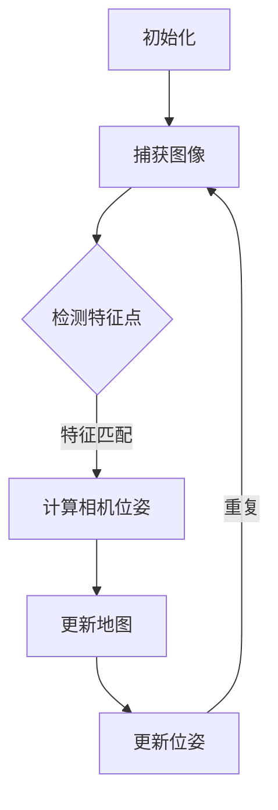
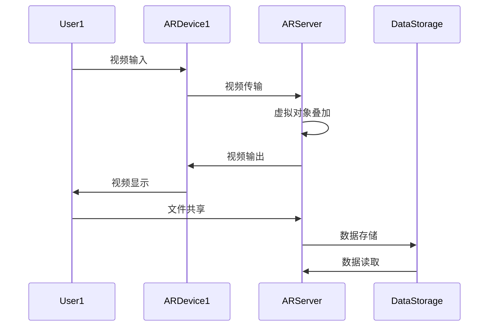

                 

### 增强现实技术在远程协作中的应用前景

#### 关键词：
- 增强现实技术（AR）
- 远程协作
- 应用场景
- 技术优势
- 挑战与解决方案

#### 摘要：
本文旨在探讨增强现实技术（AR）在远程协作中的应用前景。随着全球远程工作趋势的加剧，AR技术为提升远程协作效率、增强沟通体验提供了新的可能性。文章将详细介绍AR技术的基本原理，分析其在教育、医疗和企业远程协作中的实际应用，并探讨其面临的技术挑战和潜在解决方案。通过本文，读者可以全面了解AR技术在远程协作中的潜力和应用前景。

---

## 第一部分：背景介绍

### 第1章：增强现实技术概述

#### 1.1 增强现实技术的发展背景

增强现实技术（Augmented Reality，简称AR）是一种通过计算机技术将虚拟信息叠加到真实环境中的技术。自20世纪90年代以来，AR技术经历了快速的发展。早期的AR研究主要集中在实验室环境中，主要用于军事、医学等领域。随着计算机处理能力、图像识别技术和移动设备的普及，AR技术逐渐走向大众市场。

近年来，AR技术的应用场景不断扩展，涵盖了娱乐、教育、医疗、制造等多个领域。在远程协作方面，AR技术的潜力逐渐显现。通过AR设备，远程协作的参与者可以直观地共享信息和资源，增强沟通和协作效果。AR技术的兴起也得益于以下几个重要因素：

1. **智能手机和移动设备的普及**：随着智能手机和移动设备的性能提升，AR应用变得更加便捷和普及。
2. **物联网技术的发展**：物联网设备（如智能眼镜、平板电脑等）为AR提供了更多的交互方式和应用场景。
3. **计算机视觉技术的进步**：计算机视觉技术的进步使得AR系统可以更精确地识别和跟踪真实环境中的物体，提高了AR体验的逼真度。

#### 1.2 技术突破与产业应用

在技术突破方面，AR技术的发展主要表现在以下几个方面：

1. **实时图像处理**：AR系统可以实时捕捉和处理图像，将虚拟信息准确地叠加到真实环境中。
2. **手势识别和自然交互**：通过手势识别和自然交互技术，用户可以更直观地与AR系统进行交互，提高了使用体验。
3. **增强的3D建模和渲染**：先进的3D建模和渲染技术使得AR生成的虚拟信息更加逼真，增强了用户的沉浸感。

在产业应用方面，AR技术已经取得了显著的成果。以下是一些典型的应用案例：

1. **教育**：AR技术可以提供互动式的教学体验，增强学生的学习兴趣和参与度。
2. **医疗**：AR技术可以辅助医生进行手术指导，提高手术的精确度和成功率。
3. **零售**：AR技术可以提供虚拟试衣、产品展示等功能，提升消费者的购物体验。

#### 1.3 远程协作的现状与需求

随着远程工作的普及，远程协作的需求日益增长。然而，传统的远程协作方式（如视频会议、电子邮件等）在沟通效率和体验方面存在一定的局限。例如：

1. **沟通效率低**：传统的远程协作方式往往依赖于文本和语音，缺乏直观的视觉信息，导致沟通效率低下。
2. **协作体验差**：远程协作的参与者在地理上分散，缺乏面对面的互动，导致协作体验较差。
3. **信息共享难**：远程协作中，参与者需要共享大量的信息，但传统的协作工具往往难以满足这一需求。

AR技术的出现为解决这些问题提供了新的思路。通过AR设备，远程协作的参与者可以直观地共享信息和资源，增强沟通和协作效果。具体来说，AR技术可以提供以下优势：

1. **增强的沟通体验**：AR技术可以将虚拟信息和真实环境相结合，提供更加直观和生动的沟通方式。
2. **提升协作效率**：AR技术可以帮助远程协作的参与者更快速地理解和处理信息，提高协作效率。
3. **改善协作体验**：AR技术可以模拟面对面的互动，减少地理距离对协作体验的影响。

### 第2章：远程协作中的AR应用场景

#### 2.1 教育远程协作

在远程教育领域，AR技术可以提供丰富的互动式学习体验，提高学生的学习效果。以下是一些典型的应用场景：

1. **互动教学**：教师可以通过AR设备向学生展示三维模型、动画等教学内容，增强学生的理解和记忆。
2. **虚拟实验**：学生可以在虚拟环境中进行实验，避免了实际实验的复杂性和风险，提高了实验的可重复性和可控性。
3. **课堂互动**：学生可以通过AR设备与教师和其他同学进行实时互动，增强了课堂的互动性和参与感。

#### 2.2 医疗远程协作

在医疗领域，AR技术可以辅助医生进行远程诊断和手术指导，提高医疗服务的质量和效率。以下是一些典型的应用场景：

1. **远程诊断**：医生可以通过AR设备查看患者的实时图像和数据，提供远程诊断和建议。
2. **手术指导**：医生可以通过AR设备查看患者的三维结构图像，辅助进行手术操作，提高手术的精确度和成功率。
3. **患者教育**：医生可以通过AR设备向患者解释病情和治疗方案，增强患者的理解和配合。

#### 2.3 企业远程协作

在企业远程协作中，AR技术可以提供更加直观和高效的沟通和协作工具，提高企业的运营效率。以下是一些典型的应用场景：

1. **远程会议**：AR技术可以提供三维虚拟会议室，使远程会议更加生动和逼真，增强参会者的参与感。
2. **项目协作**：团队成员可以通过AR设备共享项目资料、讨论方案和进行实时协作，提高了项目的执行效率。
3. **培训与指导**：企业可以通过AR技术进行远程培训，提供互动式的学习体验，提高员工的专业技能。

## 第二部分：核心概念与联系

### 第3章：增强现实技术原理

#### 3.1 AR技术的基本原理

增强现实技术（AR）的核心原理是将虚拟信息叠加到真实环境中，从而在用户眼前呈现出一个虚实结合的场景。要实现这一目标，AR系统通常需要以下几个关键组成部分：

1. **摄像头**：用于捕捉真实环境中的图像。
2. **显示设备**：将虚拟信息叠加到真实环境中，通常是头戴式显示器或智能手机屏幕。
3. **处理器**：用于处理图像和计算虚拟信息的位置和大小。
4. **传感器**：用于检测用户的位置、姿态和移动，辅助AR系统的定位和跟踪。

#### 3.2 AR技术在远程协作中的核心概念

在远程协作中，AR技术主要涉及以下几个核心概念：

1. **虚拟对象与真实环境的融合**：AR技术可以将虚拟对象叠加到真实环境中，使远程协作的参与者能够直观地看到和操作这些对象，从而增强协作效果。
2. **远程协作的增强**：AR技术可以提供更多的信息交互和互动方式，如手势识别、语音交互等，从而提高远程协作的效率和体验。
3. **实时交互**：AR技术可以实时捕捉和处理用户和环境的互动信息，为远程协作提供实时的反馈和互动。

### 第4章：AR在远程协作中的应用

#### 4.1 AR增强的远程会议

AR技术可以为远程会议提供更加生动和逼真的沟通体验。以下是一个具体的例子：

**案例**：一家跨国公司的远程会议使用AR技术来增强沟通效果。在会议中，参与者通过头戴式显示器看到三维虚拟会议室，会议室中设置了不同国家的团队成员。团队成员可以通过手势和语音与会议室中的虚拟人互动，如提问、回答问题和讨论方案。这种互动方式不仅增强了参与者的参与感，还提高了沟通的效率。

#### 4.2 远程协作中的虚拟现实

虚拟现实（VR）与AR技术的结合可以提供更加沉浸式的远程协作体验。以下是一个具体的例子：

**案例**：一家咨询公司在项目协作中使用了AR/VR混合技术。团队成员通过VR设备进入一个虚拟会议室，会议室中设置了项目的各个阶段和任务。团队成员可以在虚拟会议室中实时讨论和协作，如修改文档、更新项目进度和分配任务。虚拟会议室中的三维模型和实时数据帮助团队成员更好地理解和处理项目信息，提高了协作效率。

### 第5章：常见AR算法介绍

在AR系统中，算法的作用至关重要。以下介绍几种常见的AR算法：

#### 5.1 SLAM（Simultaneous Localization and Mapping）

SLAM是一种同时定位与建图的算法，用于在未知环境中实时构建地图并确定自身位置。SLAM算法在AR系统中用于实时跟踪和定位虚拟对象。以下是SLAM算法的mermaid流程图：



#### 5.2 计算机视觉算法

计算机视觉算法用于识别和跟踪真实环境中的物体，如人脸识别、物体识别和手势识别等。以下是一个简单的Python代码示例，用于实现人脸识别：

```python
import cv2

# 加载预训练的人脸识别模型
face_cascade = cv2.CascadeClassifier('haarcascade_frontalface_default.xml')

# 读取图像
img = cv2.imread('face.jpg')

# 转为灰度图像
gray = cv2.cvtColor(img, cv2.COLOR_BGR2GRAY)

# 检测人脸
faces = face_cascade.detectMultiScale(gray, scaleFactor=1.1, minNeighbors=5, minSize=(30, 30), flags=cv2.CASCADE_SCALE_IMAGE)

# 在图像上绘制人脸框
for (x, y, w, h) in faces:
    cv2.rectangle(img, (x, y), (x+w, y+h), (255, 0, 0), 2)

# 显示图像
cv2.imshow('Face Detection', img)
cv2.waitKey(0)
cv2.destroyAllWindows()
```

### 第6章：增强现实中的数学模型

在AR系统中，数学模型用于计算和渲染虚拟信息。以下是一个常见的数学模型——坐标变换：

#### 6.1 坐标变换

坐标变换用于将虚拟信息从世界坐标系转换为视图坐标系，以便在显示设备上渲染。以下是坐标变换的数学模型：

$$
\begin{aligned}
x' &= \frac{x \cdot f_x + c_x \cdot c}{z \cdot c_z + c_x} \\
y' &= \frac{y \cdot f_y + c_y \cdot c}{z \cdot c_z + c_y} \\
z' &= \frac{z \cdot c}{z \cdot c_z + c}
\end{aligned}
$$

其中，$(x, y, z)$为世界坐标系中的坐标，$(x', y', z')$为视图坐标系中的坐标，$f_x$和$f_y$分别为水平方向和垂直方向的焦距，$c_x$和$c_y$分别为水平和垂直方向的偏移量，$c_z$为深度偏移量，$c$为常数。

### 第7章：远程协作AR系统架构设计

#### 7.1 系统功能设计

远程协作AR系统需要实现以下主要功能：

1. **实时视频传输**：确保远程协作的参与者能够实时看到对方的视频图像。
2. **虚拟对象叠加**：将虚拟对象叠加到真实环境中，以增强远程协作的效果。
3. **交互功能**：提供手势识别、语音交互等交互方式，以方便用户操作虚拟对象。
4. **信息共享**：支持文档、图像、视频等信息的共享，以提高协作效率。
5. **安全与隐私**：确保数据传输的安全性和用户隐私的保护。

以下是一个领域模型的mermaid类图：

```mermaid
classDiagram
    Participant <<类>> User
    Device <<类>> ARDevice
    System <<类>> ARSystem
    Resource <<类>> Resource
    Conference <<类>> RemoteConference

    User --|大于|> ARDevice
    ARDevice --|大于|> ARSystem
    ARSystem --|大于|> RemoteConference
    RemoteConference --|大于|> Resource
```

#### 7.2 系统架构设计

远程协作AR系统的架构设计需要考虑以下几个方面：

1. **前端显示**：使用头戴式显示器或智能手机屏幕作为显示设备，提供直观的视觉体验。
2. **后端处理**：包括实时视频传输、虚拟对象叠加和交互功能的处理，通常使用服务器和云计算平台来实现。
3. **数据存储**：用于存储用户信息、虚拟对象和会议记录等数据，确保数据的安全性和可追溯性。
4. **安全与隐私保护**：包括数据加密、访问控制等安全措施，以保护用户隐私和数据安全。

以下是一个系统架构图的mermaid图：



### 第8章：远程协作AR项目实施

#### 8.1 项目背景与目标

本项目的目标是开发一款基于增强现实技术的远程协作平台，旨在提高远程会议和协作的效率和体验。项目主要目标包括：

1. **实时视频传输**：实现高质量的视频传输，确保远程协作的参与者能够实时看到对方的视频图像。
2. **虚拟对象叠加**：将虚拟对象（如三维模型、动画等）叠加到真实环境中，增强远程协作的效果。
3. **交互功能**：提供手势识别、语音交互等交互方式，方便用户操作虚拟对象。
4. **信息共享**：支持文档、图像、视频等信息的共享，提高协作效率。

#### 8.2 环境安装与配置

项目开发环境如下：

1. **操作系统**：Windows 10或以上版本
2. **编程语言**：Python 3.8或以上版本
3. **开发工具**：PyCharm
4. **依赖库**：OpenCV、NumPy、PyQt5等

在开发环境中，需要安装以下依赖库：

```bash
pip install opencv-python numpy PyQt5
```

#### 8.3 系统核心实现

系统核心实现主要包括以下几个方面：

1. **视频传输**：使用OpenCV库实现实时视频捕捉和传输。
2. **虚拟对象叠加**：使用OpenGL库实现虚拟对象的叠加和渲染。
3. **交互功能**：使用PyQt5库实现手势识别和语音交互。

以下是一个简单的Python代码示例，用于实现实时视频捕捉和传输：

```python
import cv2
import numpy as np

# 初始化摄像头
cap = cv2.VideoCapture(0)

# 循环捕捉视频帧
while True:
    # 捕获一帧图像
    ret, frame = cap.read()

    # 将图像转换为灰度图像
    gray = cv2.cvtColor(frame, cv2.COLOR_BGR2GRAY)

    # 显示图像
    cv2.imshow('Video', frame)

    # 按下'q'键退出
    if cv2.waitKey(1) & 0xFF == ord('q'):
        break

# 释放摄像头资源
cap.release()
cv2.destroyAllWindows()
```

#### 8.4 案例分析与总结

在本案例中，我们开发了一个基于AR技术的远程协作平台。该平台实现了实时视频传输、虚拟对象叠加和交互功能。在实际应用中，该平台可以用于远程会议、项目协作等场景，显著提高了协作效率和体验。

通过本案例，我们可以总结出以下几点：

1. **实时视频传输**：使用OpenCV库可以轻松实现实时视频捕捉和传输。
2. **虚拟对象叠加**：OpenGL库提供了丰富的3D渲染功能，可以方便地实现虚拟对象叠加。
3. **交互功能**：使用PyQt5库可以实现手势识别和语音交互，增强了用户的使用体验。

然而，项目也面临一些挑战，如视频传输的质量和稳定性、虚拟对象的实时渲染性能等。在未来的工作中，我们将继续优化和改进系统，以满足更多的应用需求。

### 第9章：最佳实践与注意事项

#### 9.1 最佳实践

1. **优化视频传输质量**：采用高效的视频编码算法和优化网络传输策略，提高视频传输的质量和稳定性。
2. **提升虚拟对象渲染性能**：使用GPU加速虚拟对象的渲染，提高渲染速度和性能。
3. **增强交互体验**：结合多种交互方式（如手势、语音等），提供更加直观和自然的交互体验。
4. **保障数据安全**：采用数据加密、访问控制等安全措施，确保数据的安全性和用户隐私的保护。

#### 9.2 注意事项

1. **兼容性问题**：在开发过程中，需要考虑不同设备和操作系统的兼容性问题，确保系统能够在不同环境中正常运行。
2. **性能优化**：针对不同场景和应用需求，对系统进行性能优化，提高系统的响应速度和处理能力。
3. **用户体验**：关注用户的使用体验，不断收集用户反馈，优化系统界面和交互设计。

### 第10章：拓展阅读

#### 10.1 相关书籍推荐

1. **《增强现实技术原理与应用》**：详细介绍了增强现实技术的原理、应用和发展趋势。
2. **《虚拟现实技术与应用》**：介绍了虚拟现实技术的原理、应用和发展趋势，包括与增强现实技术的结合。

#### 10.2 学术论文推荐

1. **“Augmented Reality for Remote Collaboration: A Survey”**：对AR在远程协作中的应用进行了全面的综述。
2. **“An Overview of Augmented Reality Technologies for Remote Collaboration”**：对AR在远程协作中的应用进行了详细介绍。

#### 10.3 在线资源与工具

1. **AR开发平台**：如Unity、Unreal Engine等，提供丰富的AR开发工具和资源。
2. **AR开发框架**：如ARKit、ARCore等，为开发者提供便捷的AR开发解决方案。

---

### 作者信息

**作者：AI天才研究院/AI Genius Institute & 禅与计算机程序设计艺术 /Zen And The Art of Computer Programming**

---

### 结论

增强现实技术在远程协作中的应用前景广阔。通过本文的探讨，我们可以看到AR技术为远程协作带来的诸多优势和潜在应用场景。在未来，随着技术的不断进步和应用的深入，AR技术将进一步提升远程协作的效率和体验，为全球协作带来新的可能性。

