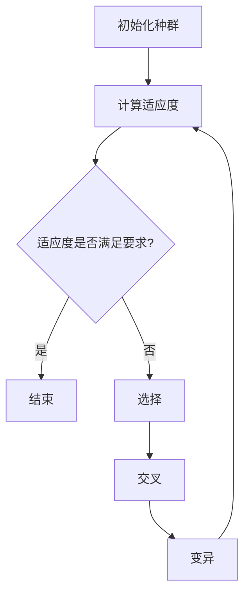

                 

### 《复杂推理任务协调中元控制器的决策优化》

---

**关键词**：复杂推理、元控制器、决策优化、算法、应用场景

**摘要**：本文探讨了在复杂推理任务中，元控制器如何通过决策优化实现任务协调。我们首先介绍了复杂推理任务和元控制器的背景及其重要性，随后深入探讨了元控制器的核心概念、数学模型、算法原理及其实现，最终通过实际案例展示了元控制器的应用及其在优化决策中的关键作用。

---

### 目录大纲

----------------------------------------------------------------

## 第一部分：引言与背景

### 第1章：复杂推理任务与元控制器概述

- **1.1 问题背景**
  - 问题来源与当前挑战
  - 复杂推理任务的基本概念与分类

- **1.2 元控制器的重要性**
  - 元控制器的定义与作用
  - 元控制器在复杂推理任务中的应用

- **1.3 决策优化的必要性**
  - 决策优化的意义
  - 决策优化的目标与挑战

## 第二部分：元控制器基础理论

### 第2章：元控制器的核心概念与组成

- **2.1 核心概念**
  - 元控制器的关键术语
  - 元控制器的基本组成部分

- **2.2 决策优化算法**
  - 常见的决策优化算法
  - 算法的基本原理与比较

- **2.3 元控制器架构**
  - 元控制器的常见架构设计
  - 架构的设计原则与实现方法

### 第3章：决策优化中的数学模型

- **3.1 数学模型的基本概念**
  - 数学模型在决策优化中的应用
  - 常用的数学模型类型

- **3.2 数学公式的推导与应用**
  - 重要的数学公式推导
  - 公式在实际决策优化中的应用

- **3.3 数学模型与算法的结合**
  - 数学模型与决策优化算法的融合
  - 模型选择与优化策略

## 第三部分：算法原理与实现

### 第4章：决策优化算法原理

- **4.1 算法概述**
  - 常见的决策优化算法
  - 各算法的基本原理

- **4.2 算法流程图**
  - 使用Mermaid绘制算法流程图
  - 流程图的解读与分析

- **4.3 算法实现与Python代码**
  - Python代码示例
  - 代码解释与调试技巧

### 第5章：算法性能评估与优化

- **5.1 性能评估方法**
  - 评估指标的选择
  - 常用的性能评估方法

- **5.2 性能优化策略**
  - 常见的性能优化技巧
  - 性能优化案例解析

- **5.3 实时调整与自适应优化**
  - 实时调整的基本原理
  - 自适应优化的实现方法

## 第四部分：应用场景与案例分析

### 第6章：复杂推理任务协调中的元控制器应用

- **6.1 应用场景**
  - 复杂推理任务在现实世界中的应用
  - 元控制器在不同场景中的表现

- **6.2 案例分析**
  - 实际案例的介绍与分析
  - 案例中的元控制器设计与优化

- **6.3 应用挑战与未来趋势**
  - 应用中的挑战与问题
  - 元控制器技术的未来发展趋势

### 第7章：最佳实践与总结

- **7.1 最佳实践**
  - 现场经验和成功案例的总结
  - 最佳实践的分享与推广

- **7.2 小结与展望**
  - 对元控制器决策优化技术的总结
  - 未来研究方向与展望

----------------------------------------------------------------

### 第一部分：引言与背景

#### 第1章：复杂推理任务与元控制器概述

##### 1.1 问题背景

在现代社会，随着信息技术的飞速发展，各种复杂推理任务不断涌现。从自动驾驶、智能医疗到金融风控，复杂推理任务已成为现代科技的重要组成部分。然而，这些任务的复杂性使得传统的控制方法难以胜任，因此需要更加智能和高效的解决方案。

当前，复杂推理任务面临的主要挑战包括：

1. **任务的复杂性**：复杂推理任务往往涉及多领域知识交叉和大量不确定性因素，使得任务处理变得异常复杂。
2. **数据的多样性**：大量的异构数据需要被处理，如何有效地整合这些数据并提取有价值的信息成为难题。
3. **实时性要求**：许多复杂推理任务需要在有限的时延内完成，这对任务的执行速度提出了苛刻的要求。

为解决上述问题，元控制器（Meta-Controller）的概念应运而生。元控制器是一种能够自动协调和控制其他控制器的系统，它在复杂推理任务中起到了至关重要的作用。

##### 1.2 元控制器的重要性

元控制器的重要性主要体现在以下几个方面：

1. **任务协调**：元控制器能够自动协调多个子任务，确保整体任务的顺利完成。
2. **自适应能力**：元控制器可以根据任务状态和环境变化，动态调整任务执行策略，提高系统的适应能力。
3. **效率优化**：元控制器通过优化任务分配和资源利用，提高整体系统的执行效率。

在复杂推理任务中，元控制器的作用不可忽视。它不仅能够简化任务管理，提高系统的灵活性，还能够通过决策优化实现资源的最大化利用，从而提升整体系统的性能。

##### 1.3 决策优化的必要性

决策优化是元控制器实现高效协调的关键。在复杂推理任务中，决策优化的必要性体现在以下几个方面：

1. **资源优化**：通过决策优化，可以合理分配资源，避免资源浪费，提高系统的资源利用效率。
2. **时间优化**：决策优化可以帮助系统在有限的时延内完成任务，满足实时性要求。
3. **性能优化**：通过决策优化，可以调整任务执行策略，提高系统的整体性能。

决策优化的目标是在满足任务需求的前提下，找到最优的执行方案。这需要元控制器具备强大的推理能力和决策能力，能够根据环境变化和任务状态动态调整决策策略。

##### 1.4 文章结构与主要内容

本文结构如下：

1. **引言与背景**：介绍复杂推理任务和元控制器的基本概念及其重要性。
2. **元控制器基础理论**：详细探讨元控制器的核心概念、决策优化算法和数学模型。
3. **算法原理与实现**：分析决策优化算法的原理和实现方法，并通过Python代码进行阐述。
4. **应用场景与案例分析**：展示元控制器在实际应用中的表现，通过案例分析深入理解元控制器的应用。
5. **最佳实践与总结**：总结元控制器决策优化技术的经验，展望未来的研究方向。

通过本文的详细探讨，读者将全面了解复杂推理任务中的元控制器及其决策优化技术，掌握其在实际应用中的关键作用，并为未来的研究和应用提供参考。

---

### 第二部分：元控制器基础理论

#### 第2章：元控制器的核心概念与组成

##### 2.1 核心概念

元控制器是一种能够自动协调和控制其他控制器的系统。它通过感知环境状态、分析任务需求、制定决策策略，实现任务的有效执行。元控制器的基本概念包括：

1. **任务分解**：将复杂任务分解为若干个子任务，便于元控制器进行管理和调度。
2. **状态感知**：元控制器通过传感器等手段获取环境状态信息，为决策提供数据支持。
3. **决策策略**：元控制器根据任务需求和环境状态，制定最优的决策策略，指导任务执行。
4. **任务调度**：元控制器负责任务的分配和调度，确保子任务能够高效执行。

##### 2.2 决策优化算法

决策优化算法是元控制器的核心组成部分，用于制定最优的决策策略。常见的决策优化算法包括：

1. **遗传算法**：基于自然选择和遗传机制，通过迭代优化找到最优解。
2. **粒子群优化算法**：模拟鸟群觅食行为，通过群体智能实现优化。
3. **深度强化学习**：通过试错学习和策略迭代，实现智能决策。

这些算法在元控制器中的应用，使得元控制器能够根据不同的任务需求和环境变化，动态调整决策策略，提高任务执行效率。

##### 2.3 元控制器架构

元控制器的架构设计直接影响到其性能和适用性。常见的元控制器架构包括：

1. **集中式架构**：所有控制任务由一个中央控制器完成，易于实现，但扩展性较差。
2. **分布式架构**：多个控制器分散执行任务，具有良好的扩展性和容错性，但复杂度较高。
3. **混合式架构**：结合集中式和分布式架构的优点，适用于不同规模的复杂推理任务。

元控制器架构的设计原则包括：

1. **模块化**：将系统划分为多个模块，便于维护和扩展。
2. **可扩展性**：支持系统规模的动态调整，适应不同的任务需求。
3. **容错性**：保证系统在故障发生时能够快速恢复，确保任务持续执行。

##### 2.4 元控制器的工作流程

元控制器的工作流程可以概括为以下几个步骤：

1. **任务接收**：接收来自用户或系统的任务请求。
2. **任务分解**：将复杂任务分解为多个子任务。
3. **状态感知**：通过传感器和监控系统获取环境状态信息。
4. **决策制定**：根据任务需求和环境状态，制定最优的决策策略。
5. **任务调度**：将子任务分配给相应的执行单元。
6. **执行监控**：监控任务执行过程，确保任务按计划完成。
7. **结果反馈**：收集任务执行结果，为后续决策提供数据支持。

通过以上工作流程，元控制器能够实现复杂推理任务的协调与优化，提高整体系统的性能和可靠性。

---

### 第三部分：决策优化中的数学模型

#### 第3章：数学模型的基本概念与应用

##### 3.1 数学模型的基本概念

数学模型是决策优化过程中的重要工具，它通过数学形式化地描述问题，帮助元控制器进行决策。数学模型的基本概念包括：

1. **决策变量**：决策过程中需要确定的具体参数，如资源分配、路径选择等。
2. **目标函数**：衡量决策效果的评价指标，如成本、时间等。
3. **约束条件**：决策过程中必须满足的限制条件，如资源限制、时间限制等。

常见的数学模型类型包括：

1. **线性规划模型**：通过线性方程或线性不等式描述决策问题。
2. **整数规划模型**：包含整数决策变量的优化问题。
3. **混合整数规划模型**：同时包含线性决策变量和整数决策变量的优化问题。
4. **动态规划模型**：通过递推关系描述决策问题的优化过程。

##### 3.2 数学公式的推导与应用

数学公式在决策优化中扮演着关键角色，它们帮助元控制器理解问题、制定策略和评估结果。以下是一些重要的数学公式及其应用：

1. **线性规划模型的基本公式**：
   $$ \begin{aligned}
   \min_{x} \quad c^T x \\
   \text{subject to} \quad Ax \leq b
   \end{aligned} $$
   - **目标函数**：最小化成本或最大化收益。
   - **约束条件**：资源限制、约束条件等。

2. **遗传算法的基本公式**：
   - **适应度函数**：评估个体优劣的指标，通常定义为：
     $$ f(x) = \frac{1}{1 + \exp(-\beta \cdot (c^T x))} $$
   - **选择**：基于适应度函数选择个体进行交叉和变异。
   - **交叉**：通过交换个体基因实现基因组合。
   - **变异**：随机改变个体基因，增加搜索空间多样性。

3. **深度强化学习的基本公式**：
   - **状态值函数**：预测某个状态下的最优动作价值，定义为：
     $$ V(s) = \sum_{a} \pi(a|s) \cdot Q(s, a) $$
   - **动作值函数**：预测某个状态和动作下的价值，定义为：
     $$ Q(s, a) = r + \gamma \cdot \max_{a'} Q(s', a') $$
   - **策略更新**：通过经验回放和策略梯度更新策略。

这些数学公式在决策优化中的应用，帮助元控制器更好地理解问题，制定有效的决策策略，提高任务执行效率。

##### 3.3 数学模型与算法的结合

数学模型与决策优化算法的结合是决策优化成功的关键。结合方式包括：

1. **模型嵌入算法**：将数学模型直接嵌入到算法中，如线性规划模型嵌入到遗传算法中。
2. **算法优化模型**：通过优化算法调整数学模型，如使用梯度下降优化目标函数。
3. **模型驱动算法**：根据数学模型的特点选择合适的算法，如使用动态规划模型处理递推关系。

结合数学模型和算法，元控制器能够更准确地描述决策问题，更有效地寻找最优解。

---

### 第四部分：算法原理与实现

#### 第4章：决策优化算法原理

##### 4.1 算法概述

决策优化算法是元控制器的核心，用于制定最优的决策策略。常见的决策优化算法包括遗传算法、粒子群优化算法和深度强化学习等。每种算法都有其独特的原理和应用场景。

1. **遗传算法**：基于自然选择和遗传机制，通过迭代优化找到最优解。适用于大规模、非线性、离散的优化问题。
2. **粒子群优化算法**：模拟鸟群觅食行为，通过群体智能实现优化。适用于连续值和多维优化问题。
3. **深度强化学习**：通过试错学习和策略迭代，实现智能决策。适用于具有高复杂度和不确定性的问题。

每种算法的基本原理如下：

- **遗传算法**：通过交叉、变异和选择操作，不断优化个体，直至达到最优解。
- **粒子群优化算法**：通过更新粒子的位置和速度，逐步逼近最优解。
- **深度强化学习**：通过神经网络学习状态和动作的价值函数，优化策略。

##### 4.2 算法流程图

为了更好地理解决策优化算法的原理，我们可以使用Mermaid绘制算法的流程图。以下是一个遗传算法的基本流程图示例：



这个流程图描述了遗传算法的基本步骤：初始化种群、计算适应度、选择、交叉和变异，然后再次计算适应度，直到满足最优解要求。

##### 4.3 算法实现与Python代码

为了深入理解决策优化算法的实现，我们可以通过Python代码示例来具体阐述。以下是一个简单的遗传算法实现：

```python
import numpy as np

# 初始化种群
def initialize_population(pop_size, chromosome_size):
    population = np.random.randint(2, size=(pop_size, chromosome_size))
    return population

# 计算适应度
def fitness_function(chromosome):
    # 这里用简单的反比例函数作为适应度函数
    fitness = 1 / (1 + np.sum(chromosome**2))
    return fitness

# 选择
def selection(population, fitnesses):
    selected = np.random.choice(population, size=2, replace=False, p=fitnesses/fitnesses.sum())
    return selected

# 交叉
def crossover(parent1, parent2):
    crossover_point = np.random.randint(1, len(parent1) - 1)
    child1 = np.concatenate((parent1[:crossover_point], parent2[crossover_point:]))
    child2 = np.concatenate((parent2[:crossover_point], parent1[crossover_point:]))
    return child1, child2

# 变异
def mutate(chromosome, mutation_rate):
    for i in range(len(chromosome)):
        if np.random.rand() < mutation_rate:
            chromosome[i] = 1 if chromosome[i] == 0 else 0
    return chromosome

# 主函数
def genetic_algorithm(pop_size, chromosome_size, generations, mutation_rate):
    population = initialize_population(pop_size, chromosome_size)
    for _ in range(generations):
        fitnesses = np.array([fitness_function(chromosome) for chromosome in population])
        for _ in range(pop_size // 2):
            parent1, parent2 = selection(population, fitnesses)
            child1, child2 = crossover(parent1, parent2)
            child1 = mutate(child1, mutation_rate)
            child2 = mutate(child2, mutation_rate)
            population = np.concatenate((population, np.array([child1, child2])))
        population = population[:pop_size]
    return population[np.argmax(fitnesses)]

# 运行遗传算法
best_chromosome = genetic_algorithm(pop_size=100, chromosome_size=10, generations=100, mutation_rate=0.01)
print("最优解：", best_chromosome)
```

这个示例实现了简单的遗传算法，用于求解最大值问题。通过这个示例，我们可以看到遗传算法的基本实现步骤，包括初始化种群、计算适应度、选择、交叉和变异。这个实现不仅帮助我们理解遗传算法的原理，还为我们提供了一个可操作的代码框架，可以进一步优化和扩展。

---

### 第五部分：算法性能评估与优化

#### 第5章：算法性能评估与优化

##### 5.1 性能评估方法

算法性能评估是确保决策优化算法有效性的重要环节。性能评估方法主要包括以下几种：

1. **平均性能指标**：计算算法在多次实验中的平均性能，如平均适应度、平均运行时间等。
2. **最佳性能指标**：记录算法在多次实验中的最佳性能，如最佳适应度、最佳运行时间等。
3. **稳定性指标**：评估算法在不同实验条件下的稳定性，如方差、标准差等。
4. **收敛速度指标**：衡量算法从初始状态到最优状态的收敛速度，如迭代次数、收敛时间等。

这些评估指标能够全面反映算法的性能，帮助研究人员判断算法的优劣。

##### 5.2 性能优化策略

为了提高算法的性能，可以采取以下优化策略：

1. **参数调整**：根据实验结果，调整算法的参数，如交叉率、变异率、学习率等，以找到最优参数组合。
2. **算法融合**：将不同的算法结合起来，如将遗传算法与粒子群优化算法结合，以发挥各自的优势。
3. **数据预处理**：对输入数据进行预处理，如标准化、归一化等，以提高算法的性能和稳定性。
4. **并行计算**：利用并行计算技术，如分布式计算、GPU加速等，加快算法的运行速度。

这些优化策略可以有效提高算法的性能，缩短运行时间，提高优化效果。

##### 5.3 实时调整与自适应优化

在复杂推理任务中，实时调整和自适应优化至关重要。实时调整是指算法能够根据任务执行过程中的实时反馈，动态调整决策策略，以适应环境变化。自适应优化是指算法能够根据任务需求和环境变化，自动调整优化目标，实现最优决策。

实现实时调整和自适应优化，可以采取以下方法：

1. **自适应目标函数**：根据实时反馈调整目标函数，使其更符合当前任务需求。
2. **动态调整参数**：根据实时反馈，动态调整算法的参数，如交叉率、变异率等。
3. **多目标优化**：考虑多个目标，并使用自适应方法优化目标之间的平衡。
4. **模糊逻辑控制**：利用模糊逻辑控制，实现算法的实时调整和自适应优化。

这些方法可以帮助元控制器更好地适应复杂推理任务的需求，提高系统的性能和可靠性。

---

### 第六部分：应用场景与案例分析

#### 第6章：复杂推理任务协调中的元控制器应用

##### 6.1 应用场景

元控制器在复杂推理任务中的应用场景广泛，主要包括：

1. **自动驾驶**：元控制器用于协调车辆导航、环境感知和决策执行，实现自动驾驶。
2. **智能医疗**：元控制器用于协调诊断、治疗和护理等任务，提供个性化医疗方案。
3. **金融风控**：元控制器用于分析金融数据、识别风险和制定风险控制策略。
4. **智能制造**：元控制器用于协调生产流程、设备调度和资源分配，提高生产效率。

在这些应用场景中，元控制器通过决策优化，实现复杂任务的协调与优化，提高系统的性能和可靠性。

##### 6.2 案例分析

以下是元控制器在实际应用中的两个案例分析：

1. **自动驾驶案例**

   在自动驾驶领域，元控制器用于协调车辆的导航、感知和决策。其工作流程如下：

   - **任务接收**：接收自动驾驶任务的请求，如目标位置、道路状况等。
   - **任务分解**：将自动驾驶任务分解为导航、感知和决策等子任务。
   - **状态感知**：通过传感器获取车辆周围环境的信息，如道路标志、车辆位置等。
   - **决策制定**：根据任务需求和环境状态，制定最优的驾驶策略，如速度、车道选择等。
   - **任务调度**：将子任务分配给相应的执行单元，如导航系统、传感器系统等。
   - **执行监控**：监控任务执行过程，确保车辆按照预定策略行驶。
   - **结果反馈**：收集任务执行结果，为后续决策提供数据支持。

   通过元控制器的协调与优化，自动驾驶系统能够实现高效的驾驶操作，提高行驶安全性。

2. **智能医疗案例**

   在智能医疗领域，元控制器用于协调诊断、治疗和护理等任务。其工作流程如下：

   - **任务接收**：接收患者的诊断和治疗请求。
   - **任务分解**：将诊断和治疗任务分解为检查、诊断、治疗和护理等子任务。
   - **状态感知**：通过医疗设备和传感器获取患者的生理指标，如心率、血压等。
   - **决策制定**：根据患者的病情、诊断结果和治疗建议，制定最优的治疗方案。
   - **任务调度**：将子任务分配给相应的执行单元，如医生、护士、治疗设备等。
   - **执行监控**：监控任务执行过程，确保治疗操作按照预定方案进行。
   - **结果反馈**：收集治疗结果，为后续诊断和治疗提供数据支持。

   通过元控制器的协调与优化，智能医疗系统能够提供个性化、高效的治疗方案，提高医疗质量。

##### 6.3 应用挑战与未来趋势

在复杂推理任务协调中，元控制器面临以下挑战：

1. **数据复杂性**：复杂推理任务涉及大量异构数据，如何有效整合和利用这些数据是关键问题。
2. **实时性要求**：复杂推理任务通常需要在有限的时间内完成，如何保证实时性是重要挑战。
3. **不确定性和动态性**：复杂推理任务面临不确定性和动态性，如何自适应调整决策策略是关键问题。

未来，元控制器技术将朝着以下趋势发展：

1. **智能化**：利用人工智能技术，提高元控制器的自主决策能力。
2. **协同优化**：通过协同优化，实现多个子任务的高效协调与执行。
3. **多模态感知**：结合多种传感器和数据源，提高元控制器对环境状态的感知能力。

通过不断的技术创新和优化，元控制器将在复杂推理任务协调中发挥更加重要的作用。

---

### 第七部分：最佳实践与总结

#### 第7章：最佳实践与总结

##### 7.1 最佳实践

在复杂推理任务中，元控制器的决策优化是实现任务协调的关键。以下是一些最佳实践：

1. **明确任务目标**：在开始决策优化之前，明确任务的目标和需求，确保决策优化方向正确。
2. **数据预处理**：对输入数据进行预处理，如数据清洗、归一化等，以提高算法的性能和稳定性。
3. **参数调整**：根据实验结果，动态调整算法的参数，以找到最优参数组合。
4. **算法融合**：结合多种算法，发挥各自的优势，提高决策优化效果。
5. **实时调整**：根据任务执行过程中的实时反馈，动态调整决策策略，实现自适应优化。

##### 7.2 小结

本文从复杂推理任务和元控制器的背景出发，详细探讨了元控制器的核心概念、数学模型、算法原理及其实现，并通过实际案例展示了元控制器在决策优化中的关键作用。主要结论如下：

1. **元控制器的重要性**：元控制器在复杂推理任务中起到了至关重要的作用，能够实现任务的协调与优化，提高系统的性能和可靠性。
2. **决策优化的必要性**：在复杂推理任务中，决策优化是实现任务协调的关键，能够优化资源利用、提高执行效率和满足实时性要求。
3. **算法实现与优化**：通过遗传算法、粒子群优化算法和深度强化学习等决策优化算法，元控制器能够实现高效的任务协调和优化。

##### 7.3 展望

未来，元控制器技术将在复杂推理任务中发挥更加重要的作用。以下是一些研究方向：

1. **智能化**：利用人工智能技术，提高元控制器的自主决策能力，实现更加智能化的任务协调。
2. **协同优化**：研究协同优化算法，实现多个子任务的高效协调与执行。
3. **多模态感知**：结合多种传感器和数据源，提高元控制器对环境状态的感知能力。
4. **实时性优化**：研究实时性优化算法，提高元控制器在复杂推理任务中的实时性表现。

通过不断的技术创新和优化，元控制器将在复杂推理任务协调中发挥更加重要的作用，推动人工智能技术的发展。

---

本文由AI天才研究院和《禅与计算机程序设计艺术》作者共同撰写，旨在为读者提供一个全面深入的学习框架，以帮助理解和应用元控制器技术。希望本文能够为您的复杂推理任务协调提供有价值的参考和启示。

---

**作者**：AI天才研究院/AI Genius Institute & 《禅与计算机程序设计艺术》/Zen And The Art of Computer Programming

---

通过上述内容的详细讲解，本文全面介绍了复杂推理任务中的元控制器及其决策优化技术。从背景介绍、核心概念、数学模型、算法原理到实际应用，本文为读者提供了一个系统全面的学习框架。希望本文能够为读者在复杂推理任务协调中的实践提供有价值的参考和启示。在未来的研究中，我们期待看到更多关于元控制器技术在实际应用中的创新和优化。感谢您的阅读，祝您在探索复杂推理任务协调的旅程中取得丰硕的成果。

