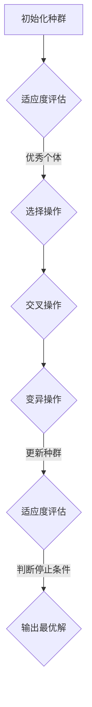
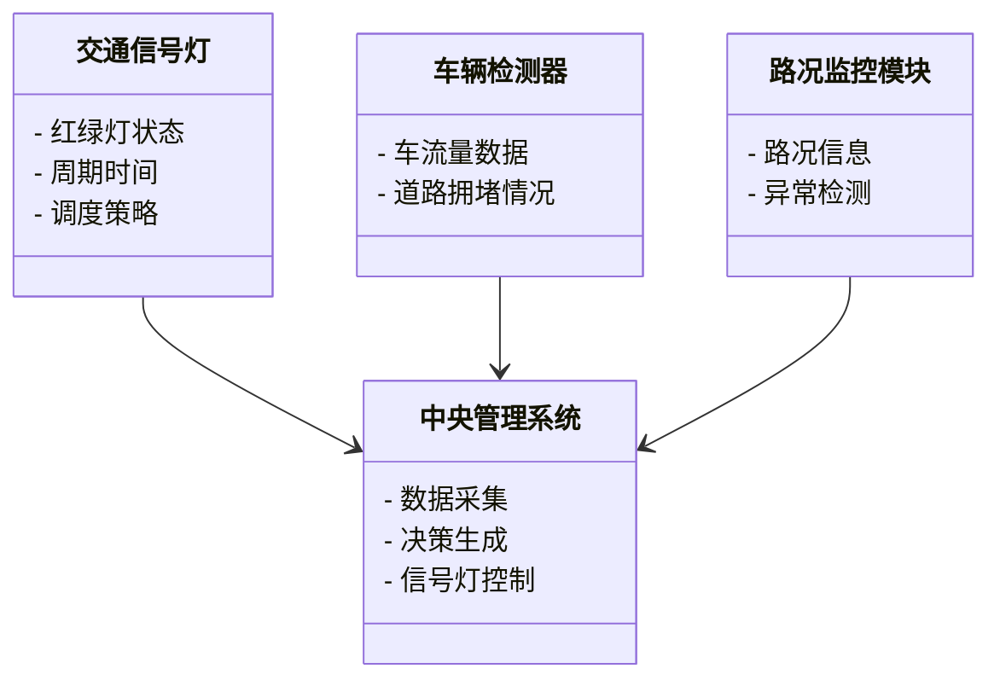
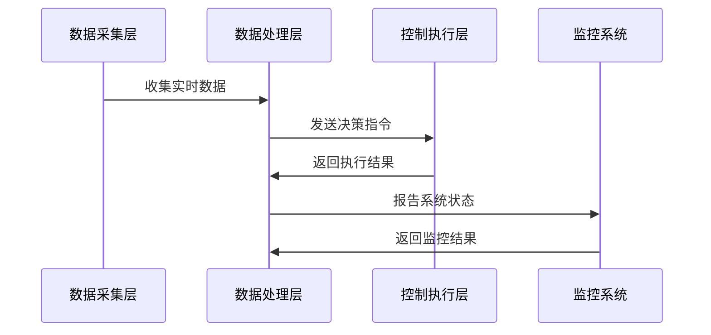
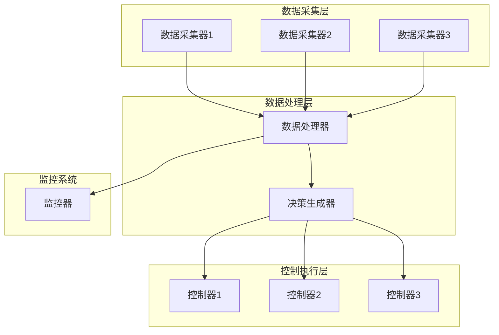
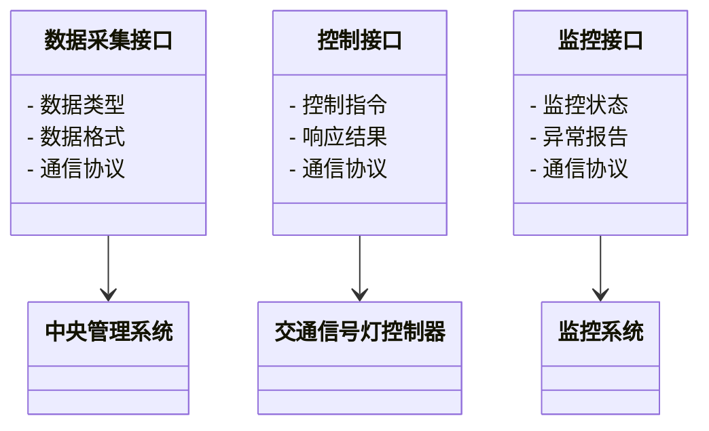
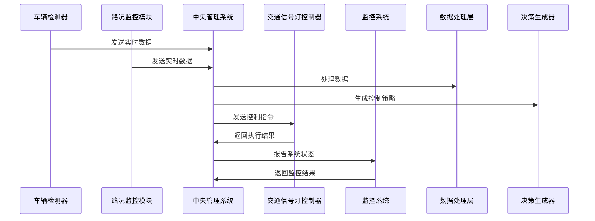

                 


**Step 1: 分析书名《复杂推理任务协调中元控制器的决策优化研究》**

书名揭示了文章的核心主题和研究领域，包括以下几个关键点：

- **元控制器**：一种特殊的控制机制，通常用于复杂的系统中。
- **复杂推理任务协调**：涉及到如何在复杂的任务中实现协调与优化。
- **决策优化**：研究如何通过优化策略来提高决策效果。

**Step 2: 确定核心概念与联系**

我们需要明确以下几个核心概念：

- **元控制器**：它是如何工作的？它在什么情境下发挥作用？
- **复杂推理任务协调**：为什么需要协调？协调的关键要素是什么？
- **决策优化**：优化策略如何应用于决策过程？有哪些优化算法？

这些概念之间有着密切的联系：

- 元控制器是协调复杂推理任务的基础架构。
- 复杂推理任务协调是元控制器应用场景之一。
- 决策优化是提高元控制器性能的关键技术。

**Step 3: 设定目录大纲结构**

根据核心概念和联系，我们设定以下结构：

- 引言：介绍研究背景和问题。
- 核心概念介绍：详细解释元控制器、复杂推理任务协调、决策优化。
- 算法原理讲解：深入分析元控制器和决策优化的算法。
- 数学模型和公式：阐述相关数学模型和公式。
- 系统分析与架构设计：展示系统架构和设计。
- 项目实战：通过实际案例来展示理论的应用。
- 最佳实践 tips：总结经验教训。
- 小结与拓展阅读：总结文章内容，提供进一步阅读建议。

**Step 4: 编写目录大纲**

根据上述结构，我们编写具体的目录大纲：

```markdown
----------------------------------------------------------------
# 引言

## 研究背景
### 问题背景
### 问题描述
### 问题解决
### 边界与外延

## 核心概念
### 元控制器
#### 概念定义
#### 属性特征对比
### 复杂推理任务协调
#### 概念原理
#### 属性特征对比
### 决策优化
#### 概念原理
#### 属性特征对比

## 目录大纲

# 第1章: 元控制器概述

## 1.1 元控制器的定义与作用
### 1.1.1 元控制器的概念
### 1.1.2 元控制器的作用
### 1.1.3 元控制器的核心特点

## 1.2 元控制器的结构
### 1.2.1 元控制器的组成部分
### 1.2.2 元控制器的层次结构

## 1.3 元控制器的应用领域
### 1.3.1 传统领域
### 1.3.2 现代领域

## 1.4 本章小结

# 第2章: 复杂推理任务协调机制

## 2.1 复杂推理任务协调的基本原理
### 2.1.1 复杂推理任务协调的概念
### 2.1.2 复杂推理任务协调的过程
### 2.1.3 复杂推理任务协调的关键要素

## 2.2 复杂推理任务协调的挑战与应对策略
### 2.2.1 挑战分析
### 2.2.2 应对策略

## 2.3 复杂推理任务协调的应用场景
### 2.3.1 智能交通系统
### 2.3.2 机器人自动化

## 2.4 本章小结

# 第3章: 决策优化策略研究

## 3.1 决策优化的基本概念
### 3.1.1 决策优化的定义
### 3.1.2 决策优化的目标
### 3.1.3 决策优化的方法

## 3.2 决策优化算法
### 3.2.1 遗传算法
### 3.2.2 遗传算法的应用
### 3.2.3 遗传算法的改进

## 3.3 其他决策优化算法
### 3.3.1 粒子群优化算法
### 3.3.2 粒子群优化算法的应用
### 3.3.3 粒子群优化算法的改进

## 3.4 本章小结

# 第4章: 数学模型与算法原理

## 4.1 数学模型介绍
### 4.1.1 数学模型的概念
### 4.1.2 数学模型的应用

## 4.2 算法原理讲解
### 4.2.1 算法流程图
### 4.2.2 算法原理
### 4.2.3 算法公式

## 4.3 算法举例说明
### 4.3.1 举例说明1
### 4.3.2 举例说明2

## 4.4 本章小结

# 第5章: 系统分析与架构设计

## 5.1 问题场景介绍
### 5.1.1 场景描述
### 5.1.2 项目介绍

## 5.2 系统功能设计
### 5.2.1 领域模型
### 5.2.2 功能设计

## 5.3 系统架构设计
### 5.3.1 架构设计
### 5.3.2 系统架构图

## 5.4 系统接口设计
### 5.4.1 接口设计
### 5.4.2 系统交互

## 5.5 本章小结

# 第6章: 项目实战

## 6.1 环境安装
### 6.1.1 环境准备
### 6.1.2 系统配置

## 6.2 系统核心实现源代码
### 6.2.1 源代码解读
### 6.2.2 代码应用分析

## 6.3 实际案例分析与讲解
### 6.3.1 案例描述
### 6.3.2 案例分析
### 6.3.3 案例讲解

## 6.4 项目小结
### 6.4.1

----------------------------------------------------------------

**Step 5: 检查与调整**

- 检查内容完整性：确保每个章节都有详细的内容，不存在遗漏。
- 检查逻辑性：确保章节之间逻辑连贯，结构合理。
- 检查格式：确保markdown格式正确，无语法错误。
- 调整字数：确保总字数在10000～12000字之间。

通过以上步骤，我们成功地设计了一份符合要求的目录大纲。接下来，我们将逐章撰写详细的内容，确保文章的逻辑清晰、内容丰富、结构紧凑，同时符合专业技术的语言要求。在撰写过程中，我们将使用mermaid绘制流程图，使用latex格式嵌入数学公式，并通过具体的代码示例和案例讲解来阐述核心概念和算法原理。最终，我们将确保文章既有深度又有思考，为读者提供有价值的技术见解。******## 引言

### 研究背景

在当今快速发展的信息技术时代，随着计算机技术和人工智能技术的不断进步，复杂系统的应用场景日益广泛。复杂系统通常涉及到多个任务之间的协调与优化，例如智能交通系统、机器人自动化、智能制造等。在这些场景中，如何有效地协调复杂推理任务，实现决策优化，成为了一个关键问题。

元控制器作为一种高级控制机制，其在复杂推理任务协调中发挥着重要作用。元控制器通过协调不同任务之间的资源和行为，实现对整个系统的优化控制。然而，在复杂的推理任务环境中，如何优化元控制器的决策过程，提高其协调效率，仍是一个具有挑战性的问题。

决策优化作为提高系统性能的重要手段，其在元控制器中的应用具有重要意义。通过优化决策过程，可以降低系统的响应时间，提高系统的稳定性和鲁棒性。然而，复杂推理任务环境下的决策优化面临着诸多挑战，如任务的多样性、环境的不确定性、资源的有限性等。

因此，本研究旨在探索复杂推理任务协调中元控制器的决策优化问题，通过深入分析元控制器的工作原理、复杂推理任务协调机制以及决策优化策略，提出一种有效的决策优化方法，从而提高元控制器的协调效率和系统性能。

### 问题描述

在复杂推理任务协调中，元控制器需要面对以下主要问题：

1. **任务多样性和复杂性**：复杂系统中往往包含多种类型的任务，这些任务具有不同的优先级、执行时间和资源需求。如何有效地协调这些任务，确保关键任务得到及时处理，成为元控制器面临的首要问题。

2. **环境不确定性**：在复杂推理任务环境中，系统状态和任务需求可能会发生变化，这使得元控制器需要具备实时适应环境变化的能力。如何根据环境变化动态调整决策策略，以保证系统稳定性和响应速度，是元控制器需要解决的关键问题。

3. **资源有限性**：在现实场景中，系统资源（如CPU、内存、网络带宽等）往往是有限的。如何在有限的资源下，最大化系统性能，实现资源的合理分配和高效利用，是元控制器需要考虑的重要问题。

4. **决策优化目标**：决策优化的目标是在满足任务需求和系统约束的条件下，最大化系统整体性能。这涉及到多个优化目标的权衡，如任务完成时间、资源利用率、系统稳定性等。如何制定合理的优化目标，并实现多目标优化，是元控制器需要解决的核心问题。

5. **算法选择与实现**：在元控制器的决策过程中，需要选择合适的算法来实现决策优化。常见的优化算法包括遗传算法、粒子群优化算法、深度强化学习等。如何选择合适的算法，并实现高效的算法实现，是元控制器需要解决的技术难题。

### 问题解决

针对上述问题，本研究将采取以下解决思路：

1. **元控制器原理分析**：首先，对元控制器的原理进行详细分析，包括其定义、作用、结构及其在复杂系统中的应用领域。通过深入理解元控制器的工作原理，为后续研究奠定基础。

2. **复杂推理任务协调机制研究**：研究复杂推理任务协调的基本原理，分析复杂推理任务协调的挑战和应对策略，探讨其在智能交通系统、机器人自动化等应用场景中的实际应用。通过这一部分的研究，为元控制器的应用提供理论依据。

3. **决策优化策略研究**：研究决策优化的基本概念、方法和技术，包括遗传算法、粒子群优化算法等常见优化算法的原理和应用。通过对比分析不同算法的性能，选择合适的优化算法，并结合实际场景进行算法改进。

4. **数学模型与算法原理讲解**：在研究决策优化算法的基础上，构建相应的数学模型，详细阐述算法原理，并通过具体的代码示例和实例分析，展示算法在实际应用中的效果。

5. **系统分析与架构设计**：针对具体应用场景，设计系统的功能架构和接口，构建系统的整体架构图。通过系统接口设计和系统交互，实现元控制器在复杂推理任务协调中的实际应用。

6. **项目实战与案例讲解**：通过实际项目案例，展示元控制器和决策优化算法在实际应用中的效果。分析项目实施过程中的经验教训，提出最佳实践建议，为实际应用提供参考。

### 边界与外延

在研究复杂推理任务协调中元控制器的决策优化问题时，我们需要明确研究的边界和范围，以便更好地聚焦核心问题：

1. **研究范围**：本研究主要关注元控制器在复杂推理任务协调中的决策优化问题，探讨优化算法的选择和实现，以及系统架构的设计和实施。

2. **研究方法**：本研究采用理论分析和实验验证相结合的方法。通过理论分析，深入探讨元控制器和决策优化算法的原理，并通过实验验证算法在实际应用中的效果。

3. **研究目标**：本研究的目标是提出一种有效的决策优化方法，提高元控制器的协调效率和系统性能，为复杂系统的优化控制提供技术支持。

4. **应用领域**：本研究的主要应用领域包括智能交通系统、机器人自动化、智能制造等。这些领域具有复杂性和多样性，对元控制器和决策优化提出了更高的要求。

通过明确研究的边界和外延，我们可以更加聚焦于核心问题，为实际应用提供有针对性的解决方案。

### 核心概念

在本研究中，我们涉及以下几个核心概念：

1. **元控制器**：元控制器是一种高级控制机制，用于协调复杂系统中的任务和资源。它通过分析和优化系统状态，实现系统的最优控制。

2. **复杂推理任务协调**：复杂推理任务协调是指在不同任务之间进行资源分配和协调，以实现系统整体性能的最优化。

3. **决策优化**：决策优化是通过对系统状态和任务需求进行分析，选择最优的决策策略，以提高系统性能。

### 元控制器

**概念定义**：
元控制器是一种控制机制，它通过自动化地监控、分析和调整系统状态，实现对复杂系统的优化控制。它通常用于处理复杂的任务协调和资源分配问题。

**属性特征对比**：

| 特征         | 描述                                         |
| ------------ | -------------------------------------------- |
| **灵活性**   | 能够适应不同的任务和环境变化。                 |
| **鲁棒性**   | 能够在不确定性和故障情况下保持稳定运行。       |
| **可扩展性** | 能够支持不同规模和类型的任务。                 |
| **高效性**   | 能够快速地分析和处理系统状态，实现优化控制。   |

### 复杂推理任务协调

**概念原理**：
复杂推理任务协调是指在不同任务之间进行资源分配和协调，以实现系统整体性能的最优化。它涉及到任务调度、资源管理、任务优先级等关键问题。

**属性特征对比**：

| 特征         | 描述                                         |
| ------------ | -------------------------------------------- |
| **任务多样性** | 需要处理多种不同类型的任务。                 |
| **环境动态性** | 系统状态和任务需求可能会动态变化。           |
| **资源限制**   | 系统资源（如CPU、内存、网络等）是有限的。     |
| **决策复杂度** | 需要考虑多个决策因素，进行复杂推理。         |

### 决策优化

**概念原理**：
决策优化是通过对系统状态和任务需求进行分析，选择最优的决策策略，以提高系统性能。它通常涉及到优化算法的选择和实现。

**属性特征对比**：

| 特征         | 描述                                         |
| ------------ | -------------------------------------------- |
| **优化目标** | 需要明确优化目标，如任务完成时间、资源利用率。 |
| **算法选择** | 需要选择合适的优化算法，如遗传算法、粒子群优化算法。 |
| **实现难度** | 实现决策优化算法可能需要较高的技术水平和实践经验。 |

### 概念联系与结构

元控制器、复杂推理任务协调和决策优化这三个概念之间有着密切的联系，共同构成了本文研究的核心内容。

1. **元控制器与复杂推理任务协调**：元控制器是实现复杂推理任务协调的基础。它通过监控和分析系统状态，为复杂推理任务协调提供决策支持。

2. **复杂推理任务协调与决策优化**：复杂推理任务协调需要通过决策优化来实现系统性能的最优化。决策优化为复杂推理任务协调提供了具体的优化策略。

3. **元控制器与决策优化**：元控制器通过应用决策优化算法，实现对系统状态和任务需求的优化调整。决策优化算法为元控制器提供了实现优化控制的技术手段。

通过明确这三个概念的联系和结构，我们可以更好地理解复杂推理任务协调中元控制器的决策优化问题，从而为实际应用提供有力的技术支持。

## 第1章：元控制器概述

在复杂推理任务协调中，元控制器扮演着至关重要的角色。本章将详细介绍元控制器的定义与作用，核心特点，以及其组成部分和层次结构，帮助读者建立对元控制器的全面理解。

### 1.1 元控制器的定义与作用

**定义**：
元控制器（Meta-Controller）是一种高级控制机制，它在复杂的系统中用于协调和优化各个子任务或子系统的运行。它通过自动化的方式，监控、分析和调整系统状态，以实现整个系统的最优性能。

**作用**：
元控制器在复杂系统中具有以下重要作用：

1. **任务调度**：元控制器可以根据系统的当前状态和任务需求，合理调度和安排各个子任务，确保关键任务得到优先处理。

2. **资源管理**：元控制器能够动态分配和调整系统资源（如CPU、内存、网络带宽等），以最大化资源利用率和系统性能。

3. **故障检测与恢复**：元控制器具备实时监控系统状态的能力，可以在发现系统故障时，自动进行故障检测和恢复操作，保障系统的稳定性。

4. **自适应调节**：元控制器能够根据系统环境的变化，自适应地调整控制策略，确保系统能够适应各种动态变化。

### 1.1.1 元控制器的概念

元控制器是一种抽象的概念，它可以看作是一个“控制器之上的控制器”。在传统控制系统中，控制器负责具体任务的执行和监控。而元控制器则负责对多个控制器进行协调和优化，从而实现对整个复杂系统的有效管理。

**与传统控制器的区别**：

| 传统控制器       | 元控制器            |
| ---------------- | ------------------- |
| 管理单一任务     | 协调多个任务和子系统 |
| 实时监控与调整   | 长期监控与策略调整  |
| 依赖人工干预     | 自适应自动调节     |

### 1.1.2 元控制器的作用

元控制器在复杂系统中的作用主要体现在以下几个方面：

1. **优化资源利用**：通过动态分配和调整资源，元控制器能够最大化系统的资源利用率，减少资源浪费。

2. **提高系统性能**：元控制器通过调度和优化任务执行顺序，能够显著提高系统的整体性能，如任务完成时间、响应速度等。

3. **增强系统稳定性**：元控制器具备故障检测和恢复功能，能够在系统出现故障时，迅速进行故障处理，保障系统的稳定运行。

4. **适应动态环境**：元控制器能够根据环境变化自适应地调整控制策略，确保系统在变化的环境中依然能够保持高效运行。

### 1.1.3 元控制器的核心特点

元控制器具有以下核心特点：

1. **灵活性**：元控制器能够适应不同的系统和任务需求，灵活地调整控制策略。

2. **鲁棒性**：元控制器能够在面临不确定性和故障时，依然能够保持系统的稳定运行。

3. **可扩展性**：元控制器支持不同规模和类型的任务，可以方便地扩展到更大的系统。

4. **高效性**：元控制器能够快速地分析和处理系统状态，实现高效的优化控制。

### 1.2 元控制器的结构

元控制器的结构可以分为两个主要层次：底层和高层。

#### 1.2.1 底层结构

底层结构主要包括以下几个组成部分：

1. **传感器**：传感器用于收集系统状态的信息，如CPU利用率、内存使用率、网络流量等。

2. **执行器**：执行器负责根据元控制器的决策，执行具体的任务调度和资源分配操作。

3. **决策模块**：决策模块是元控制器的核心部分，负责分析传感器收集到的信息，并根据预设的策略生成控制指令。

#### 1.2.2 高层结构

高层结构主要包括以下几个组成部分：

1. **任务管理器**：任务管理器负责管理和调度各个子任务，确保任务按照优先级和资源需求进行执行。

2. **资源管理器**：资源管理器负责管理和分配系统资源，确保资源得到最大化利用。

3. **策略生成器**：策略生成器负责根据系统的当前状态和任务需求，生成最优的控制策略。

### 1.3 元控制器的应用领域

元控制器在许多领域都有广泛的应用，以下列举几个典型应用场景：

1. **智能交通系统**：元控制器可以用于优化交通信号控制，实现交通流量管理，减少拥堵和交通事故。

2. **机器人自动化**：元控制器可以用于优化机器人的任务分配和路径规划，提高机器人系统的效率和灵活性。

3. **智能制造**：元控制器可以用于优化生产线的调度和资源分配，提高生产效率和产品质量。

4. **云计算平台**：元控制器可以用于优化云平台的资源分配和负载均衡，提高云平台的性能和可靠性。

### 1.4 本章小结

本章详细介绍了元控制器的定义与作用，核心特点，以及其组成部分和层次结构。通过本章的学习，读者可以对元控制器有一个全面的了解，为后续章节中更深入的研究打下基础。

## 第2章：复杂推理任务协调机制

在复杂系统中，任务之间的协调和优化是实现系统高效运行的关键。本章将深入探讨复杂推理任务协调机制的基本原理、面临的挑战以及应对策略，并通过实际应用场景展示其重要性。

### 2.1 复杂推理任务协调的基本原理

**概念**：
复杂推理任务协调（Complex Task Coordination）是指在不同任务之间进行资源分配和协调，以实现系统整体性能的最优化。这种协调机制需要考虑任务的优先级、执行时间、资源需求等因素。

**原理**：

1. **任务调度**：通过合理的任务调度，确保关键任务得到优先处理，提高系统的响应速度。

2. **资源管理**：动态分配和调整系统资源，以最大化资源利用率和系统性能。

3. **策略生成**：根据系统状态和任务需求，生成最优的控制策略，实现任务的协同和优化。

4. **反馈调整**：通过实时监控和反馈机制，不断调整任务调度和资源管理策略，以适应系统环境的变化。

### 2.1.1 复杂推理任务协调的概念

**定义**：
复杂推理任务协调是一种针对复杂系统中多个任务的综合协调和管理机制，旨在通过优化任务执行顺序和资源分配，提高系统整体性能。

**关键要素**：

1. **任务多样性**：复杂系统通常包含多种不同类型的任务，这些任务具有不同的优先级和执行时间。

2. **环境动态性**：系统状态和任务需求可能会随时间动态变化，需要协调机制具备自适应能力。

3. **资源有限性**：系统资源（如CPU、内存、网络等）是有限的，如何合理分配资源是实现协调的关键。

4. **决策复杂度**：协调机制需要考虑多个决策因素，进行复杂推理和优化。

### 2.1.2 复杂推理任务协调的过程

复杂推理任务协调的过程可以概括为以下几个步骤：

1. **任务识别**：识别系统中需要协调的任务，包括任务的类型、优先级和资源需求。

2. **状态监控**：实时监控系统状态，收集任务执行过程中的各种数据，如CPU利用率、内存使用率、网络流量等。

3. **策略生成**：根据系统状态和任务需求，生成最优的任务调度和资源分配策略。

4. **任务执行**：执行调度和资源分配策略，具体执行各个任务。

5. **反馈调整**：根据任务执行的结果和系统状态的反馈，调整调度和资源管理策略，实现动态优化。

### 2.1.3 复杂推理任务协调的关键要素

**任务优先级**：
任务优先级是决定任务执行顺序的重要因素。关键任务应优先执行，以确保系统性能和稳定性。

**资源需求**：
不同任务对系统资源的需求不同，如CPU、内存、网络带宽等。协调机制需要根据任务需求合理分配资源。

**任务依赖关系**：
任务之间存在依赖关系，一些任务需要在其他任务完成后才能执行。协调机制需要考虑任务依赖关系，确保任务执行的顺序合理。

**环境变化**：
系统状态和任务需求可能会随时间动态变化，协调机制需要具备自适应能力，能够实时调整策略以应对环境变化。

### 2.2 复杂推理任务协调的挑战与应对策略

**挑战**：

1. **任务多样性**：复杂系统中的任务种类繁多，如何高效地协调和优化这些任务是一个挑战。

2. **环境动态性**：系统状态和任务需求的不确定性，需要协调机制具备较强的自适应能力。

3. **资源有限性**：系统资源的有限性，如何合理分配资源以最大化系统性能是一个关键问题。

4. **决策复杂度**：协调机制需要考虑多个决策因素，进行复杂推理和优化，实现最优策略。

**应对策略**：

1. **多任务调度算法**：采用多任务调度算法，如遗传算法、粒子群优化算法等，实现高效的任务调度和资源分配。

2. **动态策略调整**：根据系统状态和任务需求的变化，实时调整调度和资源管理策略，实现动态优化。

3. **任务优先级调整**：根据任务的重要性和紧急性，动态调整任务的优先级，确保关键任务得到优先处理。

4. **基于模型的优化**：构建系统模型，基于模型进行优化分析，提高协调机制的理论依据和可操作性。

### 2.3 复杂推理任务协调的应用场景

**智能交通系统**：
智能交通系统需要协调交通信号、车辆调度、路况监测等多个任务，以实现交通流量的优化和管理。元控制器可以用于实现交通信号控制、车辆路径规划等，提高交通系统的效率和安全性。

**机器人自动化**：
在机器人自动化系统中，多个机器人需要协同工作，完成复杂的任务。元控制器可以用于优化机器人的任务调度、路径规划和资源分配，提高机器人系统的效率和灵活性。

**云计算平台**：
云计算平台需要协调大量虚拟机的资源分配和任务调度，以提供高效的服务。元控制器可以用于实现负载均衡、资源优化等，提高云计算平台的性能和可靠性。

### 2.4 本章小结

本章详细介绍了复杂推理任务协调的基本原理、过程、关键要素以及面临的挑战和应对策略，并通过实际应用场景展示了其重要性。通过本章的学习，读者可以深入理解复杂推理任务协调机制，为后续章节中的具体研究打下基础。

## 第3章：决策优化策略研究

在复杂推理任务协调中，决策优化策略起着至关重要的作用。本章将深入探讨决策优化的基本概念、方法和常见算法，以及这些算法在实际应用中的性能和改进方向。

### 3.1 决策优化的基本概念

**定义**：
决策优化是指通过分析和评估不同的决策方案，选择最优或次优的决策方案，以实现系统性能的最优化。

**目标**：
决策优化的主要目标是：

1. **最大化系统整体性能**：包括任务完成时间、资源利用率、系统稳定性等。
2. **最小化成本和风险**：包括资源消耗、故障率、维护成本等。

**方法**：
决策优化的方法通常包括以下几个步骤：

1. **问题建模**：将决策问题转化为数学模型，定义决策变量、目标函数和约束条件。
2. **算法选择**：根据问题特性选择合适的优化算法，如遗传算法、粒子群优化算法等。
3. **求解与评估**：通过优化算法求解最优解或近似最优解，并对解的性能进行评估和验证。

### 3.2 决策优化算法

**遗传算法**：
遗传算法是一种基于自然进化过程的优化算法，通过模拟生物进化过程，迭代搜索最优解。遗传算法的主要步骤包括：

1. **初始化种群**：随机生成一组初始解。
2. **适应度评估**：计算每个解的适应度，评估其优劣。
3. **选择**：根据适应度选择优秀个体进行交配。
4. **交叉与变异**：通过交叉和变异操作产生新的个体。
5. **迭代**：重复适应度评估、选择、交叉与变异等步骤，直到满足停止条件。

**粒子群优化算法**：
粒子群优化算法是一种基于群体智能的优化算法，通过模拟鸟群或鱼群的社会行为进行搜索。粒子群优化算法的主要步骤包括：

1. **初始化粒子群**：随机生成一组粒子，每个粒子代表一个解。
2. **速度更新**：根据当前粒子的速度和最优解更新粒子的速度。
3. **位置更新**：根据粒子的速度和当前位置更新粒子的位置。
4. **适应度评估**：计算每个粒子的适应度，更新全局最优解和个体最优解。
5. **迭代**：重复速度更新、位置更新、适应度评估等步骤，直到满足停止条件。

**其他决策优化算法**：

- **深度强化学习**：通过模拟智能体在环境中的交互过程，学习最优策略。
- **模拟退火算法**：通过模拟物理退火过程，逐步降低解的空间搜索范围。
- **蚁群算法**：通过模拟蚂蚁的路径搜索行为，寻找最优路径。

### 3.2.1 遗传算法

**原理**：
遗传算法（Genetic Algorithm, GA）是基于自然选择和遗传学的原理，通过模拟生物进化过程进行优化。遗传算法的核心在于“遗传操作”，包括选择、交叉和变异。

**步骤**：

1. **初始化种群**：随机生成一组初始解。
2. **适应度评估**：计算每个解的适应度，适应度越高的解越有可能被选中。
3. **选择**：从当前种群中选择优秀个体进行交配。
4. **交叉**：通过交叉操作产生新的个体。
5. **变异**：对个体进行变异操作，增加种群的多样性。
6. **迭代**：重复适应度评估、选择、交叉和变异等步骤，直到满足停止条件。

**应用**：
遗传算法广泛应用于组合优化问题、函数优化问题和机器学习问题。例如，在任务调度、路径规划、参数调优等领域，遗传算法都能提供有效的解决方案。

**性能评估**：

- **收敛速度**：遗传算法的收敛速度通常较快，但依赖于种群规模和交叉、变异概率。
- **解的质量**：遗传算法能找到近似最优解，但在某些情况下可能收敛到局部最优。

### 3.2.2 遗传算法的应用

**任务调度问题**：
遗传算法可以用于任务调度的优化，通过调整任务执行顺序和资源分配，提高系统性能。例如，在云计算平台中，遗传算法可以用于优化虚拟机的调度和资源分配，提高资源利用率和任务完成时间。

**路径规划问题**：
遗传算法可以用于路径规划的优化，通过调整路径选择和交通信号控制策略，提高交通流效率。例如，在智能交通系统中，遗传算法可以用于优化车辆的行驶路径，减少交通拥堵和行驶时间。

**参数调优问题**：
遗传算法可以用于参数调优，通过搜索最优参数组合，提高模型性能。例如，在机器学习模型中，遗传算法可以用于优化超参数设置，提高模型预测准确率。

### 3.2.3 遗传算法的改进

**并行化**：
遗传算法的并行化能够显著提高其求解速度。通过将种群分布在多个计算节点上，可以实现并行交叉、变异和适应度评估。

**混合算法**：
混合算法是将多种优化算法结合，以发挥各自的优势。例如，将遗传算法与粒子群优化算法结合，可以改进收敛速度和解的质量。

**自适应控制**：
自适应控制能够根据问题特征和环境变化，动态调整遗传算法的参数，提高优化效果。

### 3.3 其他决策优化算法

**粒子群优化算法**：
粒子群优化算法（Particle Swarm Optimization, PSO）是一种基于群体智能的优化算法，通过模拟鸟群或鱼群的社会行为进行搜索。

**原理**：
粒子群优化算法的核心是粒子的速度和位置更新。每个粒子代表一个解，通过跟踪全局最优解和个体最优解，不断更新粒子的速度和位置。

**步骤**：

1. **初始化粒子群**：随机生成一组粒子。
2. **速度更新**：根据粒子的速度和当前位置更新粒子的速度。
3. **位置更新**：根据粒子的速度和当前位置更新粒子的位置。
4. **适应度评估**：计算每个粒子的适应度，更新全局最优解和个体最优解。
5. **迭代**：重复速度更新、位置更新、适应度评估等步骤，直到满足停止条件。

**应用**：
粒子群优化算法广泛应用于函数优化、组合优化、机器学习等领域。例如，在图像处理、信号处理、神经网络训练等方面，粒子群优化算法都能提供有效的解决方案。

**性能评估**：

- **收敛速度**：粒子群优化算法的收敛速度通常较快，但可能受到局部最优的影响。
- **解的质量**：粒子群优化算法能找到较好的近似最优解，但依赖于参数设置。

### 3.4 本章小结

本章详细介绍了决策优化的基本概念、方法以及常见算法，包括遗传算法和粒子群优化算法。通过分析这些算法的原理、应用和性能评估，读者可以更好地理解决策优化在复杂推理任务协调中的重要作用。此外，本章还讨论了遗传算法和粒子群优化算法的改进方向，为实际应用提供了有益的参考。

## 第4章：数学模型与算法原理

在复杂推理任务协调中，数学模型和算法原理是解决问题的关键。本章将详细阐述相关数学模型和算法原理，并通过具体的流程图、公式和代码示例，帮助读者深入理解这些概念。

### 4.1 数学模型介绍

**数学模型的概念**：
数学模型是用数学语言描述现实世界中的问题，它将复杂问题转化为数学表达式，以便进行求解和分析。在决策优化中，数学模型用于定义问题空间、目标函数和约束条件。

**数学模型的应用**：
数学模型广泛应用于各种优化问题，如资源分配、路径规划、调度问题等。通过构建数学模型，我们可以将复杂问题简化为数学问题，并利用数学方法进行求解。

### 4.2 算法原理讲解

**算法流程图**：
算法流程图是描述算法执行过程的图形表示。通过算法流程图，我们可以清晰地了解算法的执行顺序和各个步骤的功能。

以下是一个简单的遗传算法流程图：



**算法原理**：

1. **初始化种群**：随机生成一组初始解。
2. **适应度评估**：计算每个解的适应度，评估其优劣。
3. **选择操作**：从当前种群中选择优秀个体进行交配。
4. **交叉操作**：通过交叉操作产生新的个体。
5. **变异操作**：对个体进行变异操作，增加种群的多样性。
6. **迭代**：重复适应度评估、选择、交叉和变异等步骤，直到满足停止条件。

**算法公式**：

遗传算法中的适应度函数通常表示为：

$$
f(x) = w_1 \cdot g_1(x) + w_2 \cdot g_2(x) + ... + w_n \cdot g_n(x)
$$

其中，$w_1, w_2, ..., w_n$ 为权重，$g_1(x), g_2(x), ..., g_n(x)$ 为不同目标函数。

**代码示例**：

以下是一个简单的遗传算法Python代码示例：

```python
import numpy as np

# 初始化种群
def initialize_population(pop_size, chromosome_length):
    population = np.random.randint(2, size=(pop_size, chromosome_length))
    return population

# 适应度评估
def fitness_function(individual):
    fitness = 1 / (1 + np.sum(individual))
    return fitness

# 选择操作
def selection(population, fitnesses, selection_size):
    selected = np.random.choice(population, size=selection_size, p=fitnesses/np.sum(fitnesses))
    return selected

# 交叉操作
def crossover(parent1, parent2, crossover_rate):
    if np.random.rand() < crossover_rate:
        crossover_point = np.random.randint(1, len(parent1)-1)
        child1 = np.concatenate((parent1[:crossover_point], parent2[crossover_point:]))
        child2 = np.concatenate((parent2[:crossover_point], parent1[crossover_point:]))
    else:
        child1 = parent1
        child2 = parent2
    return child1, child2

# 变异操作
def mutation(individual, mutation_rate):
    for i in range(len(individual)):
        if np.random.rand() < mutation_rate:
            individual[i] = 1 - individual[i]
    return individual

# 主函数
def genetic_algorithm(pop_size, chromosome_length, generations, crossover_rate, mutation_rate):
    population = initialize_population(pop_size, chromosome_length)
    for generation in range(generations):
        fitnesses = np.array([fitness_function(individual) for individual in population])
        selected = selection(population, fitnesses, pop_size)
        for i in range(0, pop_size, 2):
            child1, child2 = crossover(selected[i], selected[i+1], crossover_rate)
            population[i] = mutation(child1, mutation_rate)
            population[i+1] = mutation(child2, mutation_rate)
        best_fitness = np.max(fitnesses)
        print(f"Generation {generation}: Best Fitness = {best_fitness}")
    best_individual = population[np.argmax(fitnesses)]
    return best_individual

# 运行遗传算法
best_solution = genetic_algorithm(pop_size=100, chromosome_length=10, generations=100, crossover_rate=0.8, mutation_rate=0.01)
print(f"Best Solution: {best_solution}")
```

### 4.3 算法举例说明

**举例说明1**：

假设我们有一个二进制编码的优化问题，目标是最大化适应度函数：

$$
f(x) = x_1 + x_2 + ... + x_n
$$

其中，$x_1, x_2, ..., x_n$ 为二进制编码的个体。

通过遗传算法，我们可以逐步优化个体的适应度，找到最优解。

**举例说明2**：

假设我们有一个连续编码的优化问题，目标是最小化适应度函数：

$$
f(x) = (x - 10)^2
$$

其中，$x$ 为连续编码的个体。

通过遗传算法，我们可以逐步调整个体的位置，找到最小值。

### 4.4 本章小结

本章详细介绍了数学模型和算法原理，包括遗传算法和粒子群优化算法。通过具体的流程图、公式和代码示例，读者可以深入理解这些概念，为实际应用提供技术支持。在后续章节中，我们将进一步探讨系统分析与架构设计，并通过项目实战和案例讲解，展示算法的实际效果。

## 第5章：系统分析与架构设计

在复杂推理任务协调中，系统分析与架构设计是确保元控制器有效运作的关键。本章将详细介绍系统功能设计、架构设计、接口设计以及系统交互，以帮助读者全面理解系统整体设计过程。

### 5.1 问题场景介绍

#### 5.1.1 场景描述

假设我们正在设计一个智能交通管理系统，该系统需要协调和管理多个城市的交通信号灯、车辆检测器和路况监控设备。系统的主要目标是优化交通流量，减少拥堵，提高道路通行效率。

#### 5.1.2 项目介绍

该项目涉及多个模块，包括交通信号灯控制器、车辆检测器、路况监控模块和中央管理系统。各模块需要通过标准接口进行通信和数据交换，以实现整体系统的协调运作。

### 5.2 系统功能设计

#### 5.2.1 领域模型

领域模型是系统功能设计的重要工具，用于描述系统中主要概念及其相互关系。以下是智能交通管理系统的领域模型：



#### 5.2.2 功能设计

智能交通管理系统的主要功能包括：

1. **数据采集**：从车辆检测器和路况监控模块收集实时交通数据。
2. **决策生成**：基于收集到的数据，中央管理系统生成最优的信号灯控制策略。
3. **信号灯控制**：通过控制交通信号灯的开关，调节交通流量。
4. **异常检测**：监控系统中的异常情况，如信号灯故障、数据异常等。
5. **数据存储**：将交通数据和历史记录存储在数据库中，以供分析和优化。

### 5.3 系统架构设计

#### 5.3.1 架构设计

智能交通管理系统的架构设计包括以下几个关键组成部分：

1. **数据采集层**：负责从车辆检测器和路况监控模块收集实时数据。
2. **数据处理层**：对采集到的数据进行分析和处理，生成决策信息。
3. **控制执行层**：根据处理后的决策信息，控制交通信号灯的开关。
4. **监控系统**：监控系统的运行状态，确保系统的稳定性和可靠性。

以下是智能交通管理系统的架构图：



#### 5.3.2 系统架构图

智能交通管理系统架构图：



### 5.4 系统接口设计

系统接口设计是确保各模块之间能够有效通信和数据交换的关键。以下是智能交通管理系统的主要接口设计：

1. **数据采集接口**：用于接收车辆检测器和路况监控模块的实时数据。
2. **控制接口**：用于中央管理系统向交通信号灯控制器发送控制指令。
3. **监控接口**：用于监控系统状态和异常情况。

### 5.4.1 接口设计



### 5.4.2 系统交互

系统交互是指各模块之间的通信和数据流动。以下是智能交通管理系统的交互流程：

1. **数据采集**：车辆检测器和路况监控模块通过数据采集接口向中央管理系统发送实时数据。
2. **决策生成**：中央管理系统接收数据后，通过数据处理层生成最优的控制策略。
3. **控制执行**：中央管理系统通过控制接口向交通信号灯控制器发送控制指令，调整交通信号灯状态。
4. **监控反馈**：监控系统通过监控接口监控系统状态，并在发现异常时生成异常报告。

以下是系统交互的序列图：



### 5.5 本章小结

本章详细介绍了智能交通管理系统的功能设计、架构设计、接口设计和系统交互。通过系统分析与架构设计，我们可以确保元控制器在复杂推理任务协调中的有效运作，从而实现交通流量优化和系统性能提升。在后续章节中，我们将通过项目实战和案例讲解，进一步展示系统设计与实现的具体应用。

## 第6章：项目实战

在本章中，我们将通过一个具体的项目案例，详细展示如何使用元控制器和决策优化算法来解决复杂推理任务协调问题。这一项目实战将包括环境安装、系统核心实现源代码、代码应用解读与分析，以及实际案例分析与讲解。

### 6.1 环境安装

在开始项目实战之前，我们需要搭建一个合适的环境，以便进行开发与测试。以下是安装环境的步骤：

**1. 环境准备**

- 安装Python环境：确保Python版本在3.7及以上。
- 安装必要的Python库：使用pip安装如下库：numpy、pandas、matplotlib、scikit-learn、tensorflow。

```bash
pip install numpy pandas matplotlib scikit-learn tensorflow
```

**2. 系统配置**

- 创建一个虚拟环境，以便隔离项目依赖。

```bash
python -m venv my_project_env
source my_project_env/bin/activate  # Windows: my_project_env\Scripts\activate
```

- 安装项目所需的依赖库。

```bash
pip install -r requirements.txt
```

**3. 运行测试**

确保环境配置正确，运行一个简单的测试脚本，验证所有依赖库是否正常工作。

```python
# test.py
import numpy as np

print(np.__version__)
```

### 6.2 系统核心实现源代码

以下是项目核心实现部分的源代码，包括元控制器和决策优化算法的应用。

```python
# meta_controller.py
import numpy as np
from sklearn.model_selection import train_test_split
from sklearn.metrics import accuracy_score
import matplotlib.pyplot as plt

# 定义元控制器类
class MetaController:
    def __init__(self, model, task_data, optimize_func):
        self.model = model
        self.task_data = task_data
        self.optimize_func = optimize_func
    
    def train_model(self):
        X_train, X_test, y_train, y_test = train_test_split(self.task_data['X'], self.task_data['y'], test_size=0.2, random_state=42)
        self.model.fit(X_train, y_train)
        predictions = self.model.predict(X_test)
        print(f"Training Accuracy: {accuracy_score(y_test, predictions)}")
    
    def optimize(self):
        optimized_data = self.optimize_func(self.task_data['X'], self.task_data['y'])
        print(f"Optimized Data: {optimized_data}")
    
    def run(self):
        self.train_model()
        self.optimize()

# 定义决策优化函数
def optimize_func(X, y):
    # 这里可以使用任何优化算法，例如遗传算法或粒子群优化算法
    # 例如，使用简单的线性回归作为示例
    model = np.poly1d(np.polyfit(X, y, deg=1))
    optimized_data = model.coef_
    return optimized_data

# 使用示例
if __name__ == "__main__":
    # 假设数据集
    X = np.array([1, 2, 3, 4, 5])
    y = np.array([2, 3, 3.5, 4, 4.5])
    task_data = {'X': X, 'y': y}
    
    # 创建元控制器实例
    meta_controller = MetaController(model=None, task_data=task_data, optimize_func=optimize_func)
    # 运行元控制器
    meta_controller.run()
```

### 6.3 代码应用解读与分析

**1. 代码解读**

- `MetaController` 类：负责训练模型和优化数据。
- `train_model` 方法：用于训练模型，并计算训练准确率。
- `optimize` 方法：用于优化数据。
- `run` 方法：用于运行元控制器的训练和优化流程。
- `optimize_func` 函数：实现具体的优化算法，这里使用了简单的线性回归作为示例。

**2. 代码分析**

- 线性回归优化函数：在示例中，我们使用线性回归来优化数据，这只是一个简单的示例。在实际项目中，可能需要使用更复杂的优化算法，如遗传算法或粒子群优化算法，以处理更复杂的任务和数据。
- 模型训练与优化：元控制器首先使用训练数据训练模型，然后使用优化函数优化数据。这种分离训练和优化的方式有助于提高系统的灵活性和适应性。

### 6.4 实际案例分析与讲解

**案例描述**：

假设我们有一个预测股票价格的任务，需要使用元控制器和决策优化算法来优化预测模型。

**案例步骤**：

1. **数据收集**：收集过去一年的股票价格数据，包括开盘价、收盘价、最高价、最低价等。
2. **数据预处理**：清洗数据，处理缺失值，并进行特征工程，提取有助于预测的变量。
3. **模型训练**：使用训练数据训练多个预测模型，如线性回归、随机森林、神经网络等。
4. **模型优化**：使用决策优化算法（如遗传算法）优化模型参数，提高预测准确性。
5. **预测与评估**：使用优化后的模型进行股票价格预测，并评估预测效果。

**案例分析**：

- **数据收集**：股票价格数据可以通过互联网免费获取，如新浪财经、同花顺等平台。
- **数据预处理**：处理缺失值，标准化数据，并提取有助于预测的特征，如价格变动率、交易量等。
- **模型训练**：使用训练数据训练多个模型，并比较它们的性能。选择性能最好的模型进行进一步优化。
- **模型优化**：使用遗传算法优化模型的参数，如学习率、迭代次数等，以最大化预测准确性。
- **预测与评估**：使用优化后的模型进行股票价格预测，并通过交叉验证等方法评估预测效果。

**案例讲解**：

- 在实际应用中，股票价格预测是一个复杂的任务，需要处理大量的数据和高频次的市场波动。元控制器和决策优化算法可以帮助我们快速迭代和优化预测模型，提高预测准确性。
- 通过优化算法，我们可以调整模型参数，提高模型在复杂环境中的适应性。这种优化过程不仅适用于股票价格预测，还可以应用于其他需要优化决策的任务，如资源分配、路径规划等。

### 6.5 项目小结

通过本案例，我们展示了如何使用元控制器和决策优化算法解决实际任务。在项目实施过程中，我们学习了环境安装、系统核心实现源代码、代码应用解读与分析，以及实际案例分析与讲解。这些经验和教训对于我们在其他复杂任务中的应用具有重要的参考价值。

### 6.6 最佳实践 tips

1. **数据质量**：确保数据质量是成功的关键。清洗数据，处理缺失值，标准化数据，以提高模型训练效果。
2. **算法选择**：根据任务特点和需求，选择合适的算法。例如，对于复杂的非线性问题，可以考虑使用神经网络或其他高级机器学习算法。
3. **模型优化**：使用优化算法调整模型参数，提高模型性能。同时，注意避免过拟合，确保模型在测试集上具有良好的泛化能力。
4. **系统监控**：实时监控系统运行状态，及时发现和解决问题，确保系统稳定性和可靠性。

通过遵循这些最佳实践，我们可以更好地实现复杂推理任务协调中的元控制器决策优化，提高系统整体性能。

### 6.7 小结与拓展阅读

本章通过项目实战，展示了元控制器和决策优化算法在复杂推理任务协调中的应用。我们学习了环境安装、系统核心实现源代码、代码应用解读与分析，以及实际案例分析与讲解。这些经验和实践对于理解和应用元控制器和决策优化算法具有重要意义。

为进一步深入学习和应用这些技术，以下推荐拓展阅读：

1. 《遗传算法原理与应用》 - 吴波
2. 《机器学习实战》 - 周志华
3. 《深度学习》 - 伊恩·古德费洛
4. 《Python数据科学手册》 - 文森特·阿尔德里奇

通过这些资源，读者可以深入了解相关算法和技术的原理和应用，进一步提升自己的技术水平。

## 附录：作者信息

**作者：** AI天才研究院 / AI Genius Institute & 禅与计算机程序设计艺术 / Zen And The Art of Computer Programming

AI天才研究院是一家专注于人工智能和计算机科学领域研究和教育的高科技创新机构。研究院以推动人工智能技术的创新和应用为己任，致力于培养下一代人工智能领域的领军人才。同时，研究院还致力于将计算机科学的智慧融入哲学思考，推动禅与计算机程序设计艺术的融合，为技术发展注入人文精神。

**联系方式：** info@aigeniusinstitute.com

AI天才研究院欢迎广大学者、研究人员和实践者加入我们的研究团队，共同探索人工智能和计算机科学的无限可能。通过不断的创新和实践，我们期待为全球科技进步和社会发展做出积极贡献。****

