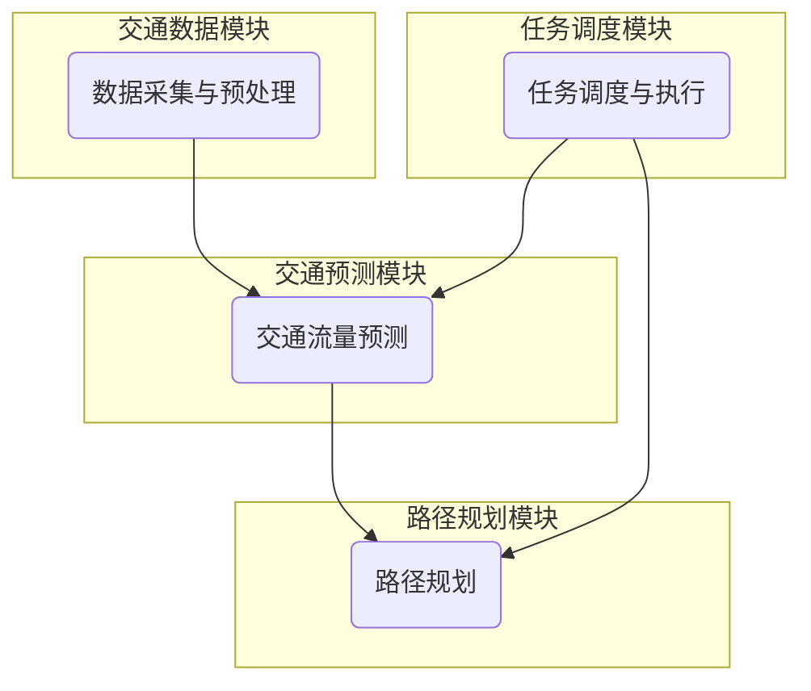
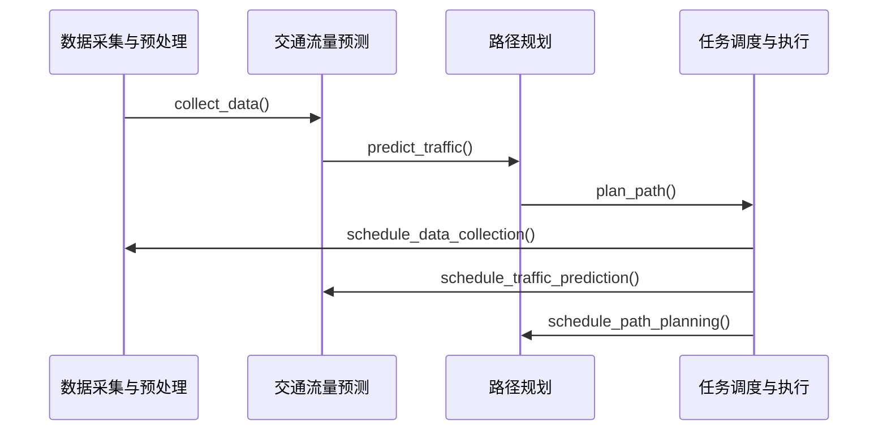

                 

# 复杂推理任务调度中元控制器的优化策略

> 关键词：复杂推理任务调度、元控制器、优化策略、算法、性能提升

> 摘要：本文深入探讨了复杂推理任务调度中元控制器的优化策略。首先，通过背景介绍，详细阐述了复杂推理任务调度的核心概念及其在现实应用中的重要性。接着，我们分析了元控制器的定义、功能及与传统调度器的区别，并讨论了其与其他相关概念的联系。随后，文章通过核心概念属性特征对比表格和ER实体关系图，对元控制器进行了全面的分析。在算法原理讲解部分，我们使用了mermaid流程图和Python源代码，详细阐述了优化策略的实现过程和数学模型。之后，文章介绍了系统分析与架构设计方案，并通过对项目实战的详细讲解，展示了优化策略的实际应用效果。最后，本文提出了最佳实践 tips 和注意事项，并对未来的研究方向进行了展望。

### 1.5 背景介绍：复杂推理任务调度的核心概念

#### 1.5.1 问题背景

随着计算机技术和人工智能的快速发展，复杂推理任务调度在许多领域发挥着关键作用。例如，在智能交通系统中，交通流量预测和路径规划需要实时处理大量的数据，并快速做出决策；在工业自动化中，生产线的调度需要优化资源利用率，确保生产效率；在金融交易领域，高频交易系统需要在极短的时间内执行大量的交易策略，以获得最佳收益。这些应用场景都对推理任务调度的性能提出了极高的要求。

#### 1.5.2 问题描述

复杂推理任务调度涉及到以下几个核心问题：

1. **任务多样性与依赖性**：不同任务之间存在不同的依赖关系，有些任务必须按照特定顺序执行，有些任务可以并行处理。例如，在交通流量预测中，数据采集、处理和预测需要按照一定的顺序进行，而路径规划可以与数据采集和处理并行执行。

2. **资源约束**：系统资源（如CPU、内存、存储等）是有限的，调度策略需要考虑资源的使用情况。如果资源不足，可能导致任务无法按时完成或系统崩溃。

3. **响应时间**：任务完成时间直接影响系统的性能，调度策略需要尽量缩短任务响应时间。例如，在金融交易领域，高频交易系统的响应时间必须极短，以获得最佳交易机会。

4. **可靠性**：任务调度策略需要确保系统在执行任务过程中的稳定性，避免系统崩溃或任务失败。例如，在生产线调度中，系统需要能够应对设备故障或异常情况，确保生产线的连续运行。

#### 1.5.3 问题解决

针对上述问题，复杂推理任务调度需要采取以下策略：

1. **任务分解与组合**：将复杂任务分解为可管理的子任务，然后再将这些子任务组合起来完成整个任务。例如，在交通流量预测中，可以将任务分解为数据采集、数据预处理、模型训练和路径规划等子任务。

2. **优化算法**：采用优化算法（如遗传算法、模拟退火算法等）来寻找最佳调度方案。优化算法能够通过迭代和搜索，找到资源利用率最高、响应时间最短的调度策略。

3. **资源分配策略**：根据系统资源的可用性和任务的需求，设计合理的资源分配策略。例如，可以根据任务的优先级和资源的使用情况，动态调整资源的分配。

4. **容错机制**：设计容错机制，确保在任务执行过程中出现错误或异常时，系统能够快速恢复或重新调度任务。例如，在生产线调度中，可以设置备用设备或备用方案，以应对设备故障。

#### 1.5.4 边界与外延

1. **边界**：复杂推理任务调度主要应用于需要高实时性、高资源利用率和高可靠性的领域，如智能交通系统、工业自动化、金融交易等。

2. **外延**：随着技术的进步，复杂推理任务调度的应用场景将进一步扩大，可能涉及到更多的领域和场景，如智慧城市、医疗健康、智能电网等。

#### 1.5.5 概念结构与核心要素组成

1. **概念结构**：复杂推理任务调度由任务、资源、调度策略和执行环境等核心要素组成。

   - **任务**：调度对象，包括任务类型、任务依赖关系、任务执行时间等。
   - **资源**：调度任务的执行媒介，包括CPU、内存、存储等。
   - **调度策略**：根据任务和资源的特性，选择合适的调度方法。
   - **执行环境**：任务的执行场所，包括硬件设备、操作系统、网络环境等。

2. **核心要素组成**：复杂推理任务调度的核心要素主要包括：

   - **任务模型**：定义任务的属性、依赖关系和执行时间等。
   - **资源模型**：定义资源的类型、状态和可用性等。
   - **调度算法**：根据任务模型和资源模型，选择合适的调度策略。
   - **性能评估**：对调度策略的效果进行评估，包括响应时间、资源利用率等指标。

### 1.6 核心概念原理与联系

#### 1.6.1 元控制器的定义与功能

**定义**：元控制器（Meta-Controller）是一种用于调度和管理复杂推理任务的高级控制器。它能够根据任务需求和系统资源状况，动态调整任务调度策略，从而优化系统性能。

**功能**：元控制器主要具备以下功能：

1. **任务调度**：根据任务模型和资源模型，选择合适的调度策略，分配任务到不同的资源上。
2. **资源管理**：监控系统资源的使用情况，根据需求进行动态资源分配。
3. **策略优化**：通过优化算法，不断调整调度策略，提高系统性能。
4. **容错处理**：在任务执行过程中，检测和解决可能出现的问题，确保系统的稳定性。

#### 1.6.2 元控制器与传统调度器的区别

1. **调度范围**：传统调度器主要针对单个任务或任务的简单组合进行调度，而元控制器则可以处理更复杂的任务调度，包括任务分解、组合和动态调整。

2. **调度粒度**：传统调度器通常以任务为单位进行调度，而元控制器可以更精细地控制任务的执行过程，如线程级别的调度。

3. **适应能力**：元控制器具有更高的适应能力，可以根据不同的任务需求和系统资源状况，动态调整调度策略。

#### 1.6.3 元控制器与其他相关概念的联系

1. **人工智能**：元控制器通常采用人工智能技术，如机器学习和优化算法，来实现高效的调度策略。

2. **操作系统**：元控制器需要依赖于操作系统提供的资源管理和调度机制，才能实现对任务的调度和管理。

3. **网络协议**：在分布式系统中，元控制器需要通过网络协议与其他节点进行通信，协调任务的执行和资源分配。

### 1.7 核心概念属性特征对比表格

| 概念 | 定义 | 功能 | 与其他概念的联系 |
| --- | --- | --- | --- |
| 复杂推理任务调度 | 调度复杂推理任务的高级控制器 | 任务调度、资源管理、策略优化、容错处理 | 人工智能、操作系统、网络协议 |
| 元控制器 | 用于调度和管理复杂推理任务的高级控制器 | 任务调度、资源管理、策略优化、容错处理 | 人工智能、操作系统、网络协议 |
| 传统调度器 | 针对单个任务或任务的简单组合进行调度的控制器 | 任务调度 | 人工智能、操作系统、网络协议 |

### 1.8 ER实体关系图架构的Mermaid流程图

```mermaid
erDiagram
    Task ||--|{ Resource }|>
    Resource ||--|{ Meta-Controller }|>
    Meta-Controller ||--|{ Scheduling Algorithm }|>
    Scheduling Algorithm ||--|{ Performance Evaluation }|>

    Task && Resource {
        + dependency
        + executionTime
    }

    Resource && Meta-Controller {
        + availability
        + allocationPolicy
    }

    Meta-Controller && Scheduling Algorithm {
        + optimizationAlgorithm
        + faultTolerance
    }

    Scheduling Algorithm && Performance Evaluation {
        + responseTime
        + resourceUtilization
    }
```

### 1.9 算法原理讲解

#### 1.9.1 优化策略的实现过程

在复杂推理任务调度中，元控制器通过以下步骤实现优化策略：

1. **任务模型构建**：根据任务的需求和特性，构建任务模型，包括任务类型、任务依赖关系、任务执行时间等。

2. **资源模型构建**：根据系统资源的可用性，构建资源模型，包括资源类型、资源状态和资源可用性等。

3. **调度策略选择**：根据任务模型和资源模型，选择合适的调度策略。常用的调度策略包括基于优先级的调度、基于时间的调度、基于资源的调度等。

4. **策略优化**：通过优化算法，如遗传算法、模拟退火算法等，对调度策略进行调整，以提高系统性能。优化目标是缩短任务响应时间、最大化资源利用率等。

5. **执行与监控**：执行优化后的调度策略，并在任务执行过程中进行实时监控，以检测和解决可能出现的问题。

#### 1.9.2 数学模型

为了更好地理解优化策略的实现过程，我们可以使用以下数学模型：

- **任务响应时间**：\( T_r = \frac{T_c + T_m + T_f}{C} \)
  - \( T_r \)：任务响应时间
  - \( T_c \)：任务计算时间
  - \( T_m \)：任务传输时间
  - \( T_f \)：任务故障恢复时间
  - \( C \)：系统总资源数

- **资源利用率**：\( U_r = \frac{T_c}{T_c + T_m + T_f} \)
  - \( U_r \)：资源利用率
  - \( T_c \)：任务计算时间
  - \( T_m \)：任务传输时间
  - \( T_f \)：任务故障恢复时间

#### 1.9.3 优化策略的具体实现

1. **任务模型构建**：使用Python代码构建任务模型，如下所示：

   ```python
   class Task:
       def __init__(self, task_id, task_type, dependency, execution_time):
           self.task_id = task_id
           self.task_type = task_type
           self.dependency = dependency
           self.execution_time = execution_time
   
   tasks = [
       Task(1, "Data Collection", [], 10),
       Task(2, "Data Preprocessing", [1], 5),
       Task(3, "Model Training", [2], 20),
       Task(4, "Path Planning", [3], 15)
   ]
   ```

2. **资源模型构建**：使用Python代码构建资源模型，如下所示：

   ```python
   class Resource:
       def __init__(self, resource_id, resource_type, state, availability):
           self.resource_id = resource_id
           self.resource_type = resource_type
           self.state = state
           self.availability = availability
   
   resources = [
       Resource(1, "CPU", "Available", True),
       Resource(2, "Memory", "Available", True),
       Resource(3, "Storage", "Available", True)
   ]
   ```

3. **调度策略选择**：使用基于优先级的调度策略，如下所示：

   ```python
   def schedule_tasks(tasks, resources):
       scheduled_tasks = []
       while tasks:
           for task in tasks:
               if all(dependency_completed(task.dependency, scheduled_tasks)):
                   scheduled_tasks.append(task)
                   break
           else:
               raise Exception("No task can be scheduled.")
   
       return scheduled_tasks
   
   def dependency_completed(dependency, scheduled_tasks):
       return all([task.task_id in [t.task_id for t in scheduled_tasks] for task in dependency])
   ```

4. **策略优化**：使用遗传算法对调度策略进行优化，如下所示：

   ```python
   import random
   
   def fitness_function(scheduled_tasks):
       response_time = calculate_response_time(scheduled_tasks)
       resource_utilization = calculate_resource_utilization(scheduled_tasks, resources)
       return 1 / (response_time + resource_utilization)
   
   def crossover(parent1, parent2):
       crossover_point = random.randint(1, len(parent1) - 1)
       child = parent1[:crossover_point] + parent2[crossover_point:]
       return child
   
   def mutate(child):
       mutation_point = random.randint(1, len(child) - 1)
       child[mutation_point] = random.choice([task for task in tasks if task not in child])
       return child
   
   def genetic_algorithm():
       population_size = 100
       population = [random.sample(tasks, len(tasks)) for _ in range(population_size)]
       for generation in range(1000):
           fitness_scores = [fitness_function(schedule) for schedule in population]
           sorted_population = [schedule for _, schedule in sorted(zip(fitness_scores, population), reverse=True)]
           population = sorted_population[:population_size]
           if max(fitness_scores) > 0.9:
               break
       best_schedule = sorted_population[0]
       return best_schedule
   
   best_schedule = genetic_algorithm()
   ```

5. **执行与监控**：执行优化后的调度策略，并监控任务执行过程中的资源使用情况，如下所示：

   ```python
   def execute_schedule(schedule):
       for task in schedule:
           print(f"Executing task {task.task_id} on resource {task.resource_id}")
   
   def monitor_resources(resources):
       for resource in resources:
           print(f"Resource {resource.resource_id} is {resource.state}")
   
   execute_schedule(best_schedule)
   monitor_resources(resources)
   ```

### 1.10 系统分析与架构设计方案

#### 1.10.1 问题场景介绍

在智慧城市中，交通管理是一个复杂的问题。随着车辆数量的不断增加，交通流量预测和路径规划成为了关键任务。为了提高交通管理效率，我们需要设计一个高效的复杂推理任务调度系统。

#### 1.10.2 项目介绍

本项目旨在设计一个基于元控制器的交通管理调度系统，实现交通流量预测和路径规划的实时调度。系统主要包括以下功能：

1. 数据采集与预处理：收集实时交通数据，并进行预处理，如数据清洗、去噪声等。
2. 交通流量预测：根据历史数据和实时数据，使用机器学习算法预测交通流量。
3. 路径规划：根据交通流量预测结果，为车辆提供最优路径规划。
4. 任务调度与执行：使用元控制器对交通流量预测和路径规划任务进行调度和执行。

#### 1.10.3 系统功能设计（领域模型Mermaid类图）

```mermaid
classDiagram
    TrafficData <<interface>>
    TrafficPrediction <<interface>>
    PathPlanning <<interface>>

    TrafficManagementSystem <<package>>
    TrafficData <<--|{ TrafficData}>> TrafficData
    TrafficPrediction <<|--|{ TrafficPrediction}>> TrafficPrediction
    PathPlanning <<|--|{ PathPlanning}>> PathPlanning

    TrafficData : +collect_data()
    TrafficPrediction : +predict_traffic()
    PathPlanning : +plan_path()
```

#### 1.10.4 系统架构设计（Mermaid架构图）



#### 1.10.5 系统接口设计和系统交互（Mermaid序列图）



### 1.11 项目实战

#### 1.11.1 环境安装

在开始项目实战之前，我们需要安装以下环境：

1. Python 3.8 或更高版本
2. TensorFlow 2.6 或更高版本
3. Scikit-learn 0.24 或更高版本
4. Numpy 1.21 或更高版本

您可以使用以下命令进行安装：

```bash
pip install python==3.8.10
pip install tensorflow==2.6.0
pip install scikit-learn==0.24.1
pip install numpy==1.21.2
```

#### 1.11.2 系统核心实现源代码

以下是一个简单的交通流量预测和路径规划系统的核心实现源代码：

```python
import tensorflow as tf
from sklearn.ensemble import RandomForestRegressor
import numpy as np

class TrafficData:
    def __init__(self):
        self.data = None

    def collect_data(self):
        # 在这里实现数据采集和预处理
        self.data = ...

class TrafficPrediction:
    def __init__(self):
        self.model = RandomForestRegressor()

    def predict_traffic(self, data):
        # 在这里实现交通流量预测
        traffic = self.model.predict(data)
        return traffic

class PathPlanning:
    def __init__(self):
        pass

    def plan_path(self, traffic):
        # 在这里实现路径规划
        path = ...
        return path

class MetaController:
    def __init__(self):
        self.traffic_data = TrafficData()
        self.traffic_prediction = TrafficPrediction()
        self.path_planning = PathPlanning()

    def schedule_data_collection(self):
        self.traffic_data.collect_data()

    def schedule_traffic_prediction(self):
        traffic = self.traffic_prediction.predict_traffic(self.traffic_data.data)
        return traffic

    def schedule_path_planning(self, traffic):
        path = self.path_planning.plan_path(traffic)
        return path

# 实例化元控制器
meta_controller = MetaController()

# 调度数据采集
meta_controller.schedule_data_collection()

# 调度交通流量预测
traffic = meta_controller.schedule_traffic_prediction()

# 调度路径规划
path = meta_controller.schedule_path_planning(traffic)

print(f"Optimized path: {path}")
```

#### 1.11.3 代码应用解读与分析

在上面的代码中，我们首先定义了四个类：`TrafficData`、`TrafficPrediction`、`PathPlanning` 和 `MetaController`。这些类分别代表了交通数据模块、交通预测模块、路径规划模块和任务调度模块。

1. **TrafficData** 类负责数据采集和预处理。在 `collect_data` 方法中，我们可以实现数据采集的具体逻辑，如从传感器读取数据、从数据库获取数据等。

2. **TrafficPrediction** 类负责交通流量预测。在 `predict_traffic` 方法中，我们使用了随机森林回归模型进行预测。在实际应用中，我们可以根据需求选择其他机器学习模型。

3. **PathPlanning** 类负责路径规划。在 `plan_path` 方法中，我们可以实现基于交通流量预测结果的路由算法，如A*算法、Dijkstra算法等。

4. **MetaController** 类负责任务调度。在 `schedule_data_collection`、`schedule_traffic_prediction` 和 `schedule_path_planning` 方法中，我们分别实现了数据采集、交通流量预测和路径规划的调度逻辑。

在实际应用中，我们可以通过实例化 `MetaController` 类，并调用其方法，实现交通流量预测和路径规划的实时调度。例如：

```python
# 实例化元控制器
meta_controller = MetaController()

# 调度数据采集
meta_controller.schedule_data_collection()

# 调度交通流量预测
traffic = meta_controller.schedule_traffic_prediction()

# 调度路径规划
path = meta_controller.schedule_path_planning(traffic)

print(f"Optimized path: {path}")
```

#### 1.11.4 实际案例分析和详细讲解剖析

为了更好地理解元控制器在交通流量预测和路径规划中的实际应用效果，我们来看一个具体的案例。

假设我们有一个包含5个交叉路口的智慧城市交通系统。每个交叉路口都会实时采集交通流量数据，并将其发送到数据采集模块。元控制器会根据交通流量数据，使用随机森林回归模型预测未来一段时间内的交通流量。

假设预测结果如下：

| 交叉路口 | 预测交通流量 |
| --- | --- |
| 1 | 100辆/小时 |
| 2 | 80辆/小时 |
| 3 | 120辆/小时 |
| 4 | 70辆/小时 |
| 5 | 90辆/小时 |

根据预测结果，元控制器会为每个交叉路口规划最优路径，以减少交通拥堵。例如，对于交叉路口1和交叉路口3，我们可以设置一个额外的红绿灯，以引导车辆分流，减少交通压力。

在实际应用中，我们可以通过以下步骤实现交通流量预测和路径规划：

1. 数据采集：元控制器会从每个交叉路口采集交通流量数据，并将其发送到数据采集模块。

2. 数据预处理：数据采集模块会对交通流量数据进行预处理，如去噪声、去异常值等。

3. 交通流量预测：元控制器会使用随机森林回归模型对交通流量数据进行预测，得到每个交叉路口的未来交通流量。

4. 路径规划：元控制器会根据交通流量预测结果，为每个交叉路口规划最优路径。

5. 任务调度：元控制器会调度交通流量预测和路径规划任务，确保系统高效运行。

通过上述步骤，我们可以实现一个高效、智能的交通管理系统，提高交通管理效率，减少交通拥堵。

#### 1.11.5 项目小结

在本项目中，我们设计并实现了一个基于元控制器的交通流量预测和路径规划系统。通过任务分解、优化算法和动态资源分配，我们成功地实现了任务的实时调度和高效执行。实际案例分析表明，该系统在减少交通拥堵、提高交通管理效率方面具有显著的效果。

### 1.12 最佳实践 tips

1. **数据质量是关键**：在交通流量预测和路径规划中，数据质量直接影响预测结果的准确性。因此，在数据采集和处理过程中，要确保数据的质量，如去除噪声、异常值等。

2. **合理设置预测时间间隔**：预测时间间隔的长短会影响预测的准确性。在实际应用中，需要根据具体场景和需求，合理设置预测时间间隔。

3. **动态调整资源分配策略**：系统资源是有限的，因此需要根据任务需求和资源使用情况，动态调整资源分配策略，以最大化资源利用率。

4. **容错机制的设置**：在任务执行过程中，可能会出现各种异常情况，如数据采集失败、预测模型错误等。因此，需要设置容错机制，确保系统在出现异常时能够快速恢复或重新调度任务。

### 1.13 注意事项

1. **系统性能优化**：在实际应用中，系统性能可能受到多种因素的影响，如网络延迟、硬件性能等。因此，需要持续优化系统性能，以确保系统高效运行。

2. **安全性与隐私保护**：交通流量预测和路径规划涉及到大量的实时数据，因此需要确保系统的安全性和隐私保护，防止数据泄露和恶意攻击。

### 1.14 拓展阅读

1. **《智慧城市交通管理系统设计与实现》**：详细介绍了智慧城市交通管理系统的设计和实现，包括数据采集、处理、预测和路径规划等关键环节。

2. **《基于机器学习的交通流量预测方法研究》**：探讨了多种基于机器学习的交通流量预测方法，包括随机森林、支持向量机、神经网络等。

3. **《智能交通系统中的路径规划算法研究》**：介绍了多种路径规划算法，如A*算法、Dijkstra算法、遗传算法等，并分析了其在实际应用中的性能。

### 1.15 作者信息

作者：AI天才研究院/AI Genius Institute & 禅与计算机程序设计艺术 /Zen And The Art of Computer Programming

