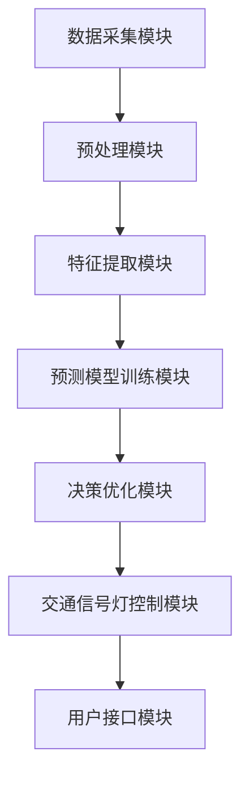
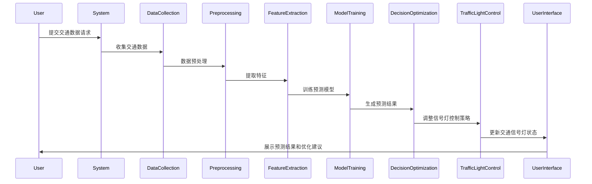

                 


### # 《复杂推理任务重组中元控制器的决策优化》

#### 关键词：复杂推理任务，元控制器，决策优化，重组，算法，架构设计，系统实现

> 摘要：本文深入探讨了复杂推理任务中的元控制器及其在决策优化中的应用。首先，我们定义了复杂推理任务和元控制器的基本概念，并阐述了决策优化在其中的重要性。接着，本文分析了元控制器在复杂推理任务中的应用场景和挑战，并介绍了其架构设计要点。随后，我们详细讲解了决策优化算法的基本原理和应用，包括算法流程、数学模型和公式，以及具体的Python源代码实现。最后，本文通过一个实际案例，展示了元控制器在决策优化中的应用，并对项目进行了详细分析。本文旨在为读者提供一个清晰、完整的决策优化算法在复杂推理任务中应用的技术指南。

----------------------------------------------------------------
# 第一部分：引言

## 1.1 问题背景与定义

### 1.1.1 复杂推理任务与元控制器

复杂推理任务是指那些包含多个相互关联的子任务，需要通过推理来解决问题的高复杂性任务。这些任务通常涉及大量的数据和复杂的逻辑关系，例如自然语言处理中的文本分类、推荐系统中的用户偏好预测、人工智能游戏中的策略决策等。

元控制器是一种特殊的软件架构，用于管理和控制复杂推理任务。它通过协调多个子任务的执行，优化资源利用，提高任务完成效率。元控制器具有以下特点：

1. **动态性**：元控制器可以根据任务的执行状态动态调整任务的分配和资源调度。
2. **自适应**：元控制器可以根据任务的复杂性和环境变化，自适应地调整其决策策略。
3. **灵活性**：元控制器可以灵活地集成不同的算法和模型，以适应不同的推理任务。

### 1.1.2 决策优化在复杂推理任务中的作用

决策优化是复杂推理任务中至关重要的环节。它旨在通过优化决策过程，提高任务的完成效率和准确性。决策优化在复杂推理任务中的作用包括：

1. **任务分配优化**：通过优化任务的分配策略，确保每个子任务都能够被高效地执行。
2. **资源调度优化**：通过优化资源的使用方式，提高系统的资源利用效率。
3. **决策支持优化**：通过优化决策模型和算法，提高决策的准确性和适应性。

### 1.1.3 问题边界与外延

本文的研究主要关注以下问题边界：

1. **推理任务的复杂度**：任务的复杂度是影响元控制器设计的关键因素，本文将探讨如何根据任务复杂度来设计元控制器。
2. **决策优化算法的选择**：不同类型的推理任务可能需要不同的决策优化算法，本文将讨论如何选择合适的算法来优化决策过程。
3. **系统实现和性能评估**：本文将介绍一个实际案例，展示如何在实际系统中实现元控制器，并评估其性能。

本文的研究外延还包括：

1. **元控制器的可扩展性和适应性**：如何设计一个具有良好可扩展性和适应性的元控制器，以适应不同类型和规模的推理任务。
2. **跨领域应用**：元控制器和决策优化算法在其他领域的应用，例如智能交通系统、金融风险管理等。

## 1.2 核心概念与联系

### 1.2.1 元控制器概述

#### 1.2.1.1 元控制器的定义与特点

元控制器是一种特殊的软件架构，用于管理和控制复杂推理任务。它通过协调多个子任务的执行，优化资源利用，提高任务完成效率。元控制器具有以下特点：

1. **动态性**：元控制器可以根据任务的执行状态动态调整任务的分配和资源调度。
2. **自适应**：元控制器可以根据任务的复杂性和环境变化，自适应地调整其决策策略。
3. **灵活性**：元控制器可以灵活地集成不同的算法和模型，以适应不同的推理任务。

#### 1.2.1.2 元控制器的组成结构

元控制器通常由以下三个部分组成：

1. **高层决策模块**：负责制定全局策略，包括任务分配、资源调度和决策支持。
2. **中层执行模块**：负责执行具体的任务，包括数据预处理、模型训练和推理计算。
3. **低层反馈模块**：负责收集任务执行状态和资源使用情况，为高层决策模块提供反馈。

### 1.2.2 决策优化原理

#### 1.2.2.1 决策优化基本概念

决策优化是一种通过优化决策过程来提高任务完成效率和准确性的方法。它涉及以下几个方面：

1. **目标函数**：决策优化的目标是最大化或最小化某个目标函数，例如提高任务完成效率、降低资源消耗等。
2. **决策变量**：决策优化的决策变量是指决策过程中需要调整的变量，例如任务分配策略、资源调度策略等。
3. **约束条件**：决策优化的约束条件是指决策过程中需要满足的条件，例如资源限制、任务时间限制等。

#### 1.2.2.2 决策优化算法分类

决策优化算法可以分为以下几类：

1. **确定性算法**：这类算法在决策过程中不考虑随机性，例如贪心算法、动态规划算法等。
2. **随机算法**：这类算法在决策过程中考虑随机性，例如随机优化算法、遗传算法等。
3. **混合算法**：这类算法结合了确定性算法和随机算法的优点，例如模拟退火算法、遗传算法等。

### 1.2.3 元控制器与决策优化的联系

元控制器和决策优化紧密相关。元控制器通过决策优化来优化任务的分配和资源调度，从而提高任务完成效率和准确性。具体来说：

1. **任务分配优化**：元控制器通过决策优化来确定每个子任务的执行顺序和执行资源，从而优化任务完成效率。
2. **资源调度优化**：元控制器通过决策优化来调整资源的使用方式，从而优化资源利用效率。
3. **决策支持优化**：元控制器通过决策优化来优化决策模型和算法，从而提高决策的准确性和适应性。

## 1.3 本章小结

本文介绍了复杂推理任务和元控制器的基本概念，并阐述了决策优化在复杂推理任务中的作用。我们分析了元控制器的组成结构和决策优化的原理，并讨论了元控制器与决策优化的联系。本章为后续内容奠定了基础，接下来我们将深入探讨元控制器在复杂推理任务中的应用。

----------------------------------------------------------------
# 第二部分：复杂推理任务与元控制器

## 2.1 复杂推理任务概述

复杂推理任务是指那些包含多个相互关联的子任务，需要通过推理来解决问题的高复杂性任务。这些任务通常涉及大量的数据和复杂的逻辑关系，例如自然语言处理中的文本分类、推荐系统中的用户偏好预测、人工智能游戏中的策略决策等。

复杂推理任务的特点包括：

1. **多维度数据**：复杂推理任务通常涉及多个维度的数据，例如文本、图像、音频等。
2. **动态变化**：复杂推理任务的环境和条件可能随时发生变化，需要元控制器具备动态调整能力。
3. **不确定性**：复杂推理任务中存在很多不确定因素，例如数据噪声、模型不确定性等，需要元控制器具备应对不确定性的能力。

### 2.1.2 复杂推理任务的分类

复杂推理任务可以根据任务类型、数据类型、任务目标等进行分类。以下是几种常见的复杂推理任务分类：

1. **基于文本的推理**：例如文本分类、情感分析、信息检索等。
2. **基于图像的推理**：例如图像分类、目标检测、图像分割等。
3. **基于音频的推理**：例如语音识别、音乐分类、声源定位等。
4. **跨模态推理**：例如文本和图像联合推理、文本和音频联合推理等。

### 2.1.3 复杂推理任务的重要性

复杂推理任务在各个领域都有着重要的应用。以下是几个典型的应用场景：

1. **自然语言处理**：文本分类、情感分析、机器翻译等任务可以提高信息处理效率和准确性。
2. **推荐系统**：用户偏好预测、商品推荐等任务可以提升用户体验和销售业绩。
3. **游戏AI**：策略决策、角色控制等任务可以提升游戏体验和竞技水平。
4. **智能交通系统**：交通流量预测、路线规划等任务可以优化交通管理和提高出行效率。
5. **金融风险管理**：风险评估、投资策略等任务可以降低金融风险和提升投资回报。

### 2.1.4 元控制器在复杂推理任务中的应用

元控制器在复杂推理任务中扮演着重要的角色，其主要应用包括：

1. **任务分配**：元控制器可以根据任务的复杂度和资源情况，动态分配子任务给不同的执行模块。
2. **资源调度**：元控制器可以根据任务的执行状态和资源使用情况，动态调整资源分配和调度策略。
3. **决策支持**：元控制器可以提供决策支持，帮助决策者做出更准确、更高效的决策。

### 2.1.5 元控制器在复杂推理任务中的挑战

复杂推理任务给元控制器带来了以下挑战：

1. **动态变化**：复杂推理任务的环境和条件可能随时发生变化，元控制器需要具备动态调整能力。
2. **不确定性**：复杂推理任务中存在很多不确定因素，元控制器需要具备应对不确定性的能力。
3. **资源限制**：复杂推理任务通常需要大量的计算资源和存储资源，元控制器需要优化资源利用。
4. **性能要求**：复杂推理任务要求元控制器具备高效、准确的决策能力，以提升任务完成效率。

## 2.2 元控制器在复杂推理任务中的应用

### 2.2.1 元控制器在推理任务中的功能

元控制器在复杂推理任务中具有以下功能：

1. **任务分配**：元控制器可以根据任务的复杂度和资源情况，动态分配子任务给不同的执行模块。例如，对于文本分类任务，元控制器可以根据文本的长度、复杂度等因素，将任务分配给不同的文本处理模块。
   
2. **资源调度**：元控制器可以根据任务的执行状态和资源使用情况，动态调整资源分配和调度策略。例如，当某个执行模块的资源使用过高时，元控制器可以暂停该模块的执行，并重新分配资源给其他模块。

3. **决策支持**：元控制器可以提供决策支持，帮助决策者做出更准确、更高效的决策。例如，在游戏AI中，元控制器可以根据玩家的行为和游戏状态，提供最佳策略建议。

### 2.2.2 元控制器在复杂推理任务中的挑战

元控制器在复杂推理任务中面临以下挑战：

1. **动态性**：复杂推理任务的环境和条件可能随时发生变化，元控制器需要具备动态调整能力，以适应不同的任务需求。

2. **不确定性**：复杂推理任务中存在很多不确定因素，例如数据噪声、模型不确定性等，元控制器需要具备应对不确定性的能力。

3. **资源限制**：复杂推理任务通常需要大量的计算资源和存储资源，元控制器需要优化资源利用，以最大化任务完成效率。

4. **性能要求**：复杂推理任务要求元控制器具备高效、准确的决策能力，以提升任务完成效率。

### 2.2.3 元控制器的架构设计要点

为了应对复杂推理任务中的挑战，元控制器的架构设计需要考虑以下要点：

1. **模块化**：元控制器应采用模块化设计，以方便扩展和维护。每个模块应具有明确的功能和接口，便于集成和替换。

2. **动态调整**：元控制器应具备动态调整能力，能够根据任务执行状态和资源使用情况，实时调整决策策略和资源分配。

3. **不确定性处理**：元控制器应具备处理不确定性的能力，例如使用概率模型、鲁棒优化算法等。

4. **资源优化**：元控制器应优化资源利用，例如通过任务并行化、资源共享等方式，提高资源利用效率。

5. **性能保障**：元控制器应保障决策性能，例如通过优化算法、硬件加速等方式，提高决策效率。

## 2.3 元控制器的架构设计

### 2.3.1 元控制器的层级结构

元控制器通常采用分层架构设计，包括以下三个层级：

1. **高层决策模块**：负责制定全局策略，包括任务分配、资源调度和决策支持。

2. **中层执行模块**：负责执行具体的任务，包括数据预处理、模型训练和推理计算。

3. **低层反馈模块**：负责收集任务执行状态和资源使用情况，为高层决策模块提供反馈。

### 2.3.2 高层决策模块

高层决策模块是元控制器的核心，负责制定全局策略。其主要功能包括：

1. **任务分配**：根据任务的复杂度和资源情况，动态分配子任务给不同的执行模块。

2. **资源调度**：根据任务的执行状态和资源使用情况，动态调整资源分配和调度策略。

3. **决策支持**：提供决策支持，帮助决策者做出更准确、更高效的决策。

### 2.3.3 中层执行模块

中层执行模块负责执行具体的任务，包括数据预处理、模型训练和推理计算。其主要功能包括：

1. **数据预处理**：对输入数据进行清洗、转换和规范化，为后续处理提供高质量的数据。

2. **模型训练**：使用训练数据训练模型，为推理任务提供基础。

3. **推理计算**：根据训练好的模型，对输入数据进行推理计算，生成输出结果。

### 2.3.4 低层反馈模块

低层反馈模块负责收集任务执行状态和资源使用情况，为高层决策模块提供反馈。其主要功能包括：

1. **状态监控**：监控任务执行状态，包括任务的完成进度、资源使用情况等。

2. **反馈机制**：将任务执行状态和资源使用情况反馈给高层决策模块，用于调整决策策略。

## 2.4 元控制器与复杂推理任务的匹配

### 2.4.1 元控制器的适应能力

元控制器的适应能力是其在复杂推理任务中应用的关键。元控制器的适应能力包括：

1. **灵活性**：元控制器应具备灵活的决策策略，能够根据不同的任务需求和环境变化，动态调整决策策略。

2. **可扩展性**：元控制器应具备良好的扩展性，能够方便地集成新的算法和模型。

3. **可移植性**：元控制器应具备良好的可移植性，能够适应不同的计算平台和硬件环境。

### 2.4.2 元控制器在复杂推理任务中的最佳实践

在实际应用中，元控制器在复杂推理任务中的最佳实践包括：

1. **任务划分**：合理划分任务，确保每个子任务具有明确的执行目标和资源需求。

2. **资源调度**：根据任务执行状态和资源使用情况，动态调整资源分配和调度策略。

3. **决策支持**：结合实际应用场景，提供针对性的决策支持，以提高任务完成效率和准确性。

4. **性能优化**：针对实际应用中的性能瓶颈，进行针对性的优化，以提高元控制器的决策性能。

## 2.5 本章小结

本章介绍了复杂推理任务和元控制器的基本概念，并分析了元控制器在复杂推理任务中的应用和挑战。我们详细探讨了元控制器的架构设计要点，并讨论了元控制器的适应能力和最佳实践。本章为后续内容奠定了基础，接下来我们将深入探讨决策优化算法的原理和应用。

----------------------------------------------------------------

# 第三部分：决策优化算法原理与应用

## 3.1 决策优化算法概述

决策优化算法是复杂推理任务中至关重要的一环。它通过优化决策过程，提高任务的完成效率和准确性。决策优化算法可以应用于各种复杂推理任务，例如自然语言处理、推荐系统、智能交通系统等。本节将介绍决策优化算法的基本概念、目标函数、决策变量和约束条件。

### 3.1.1 决策优化算法的基本概念

决策优化算法是一种通过数学建模和优化方法，求解决策问题的方法。决策问题通常由以下三个部分组成：

1. **目标函数**：描述决策者希望最大化或最小化的目标，例如最大化利润、最小化成本等。
2. **决策变量**：描述决策者需要做出的选择，例如任务分配、资源调度策略等。
3. **约束条件**：描述决策过程中需要满足的条件，例如资源限制、时间限制等。

### 3.1.2 目标函数

目标函数是决策优化算法的核心。它描述了决策者希望达到的目标。常见的目标函数包括：

1. **最大化目标**：例如最大化利润、最大化任务完成效率等。
2. **最小化目标**：例如最小化成本、最小化任务完成时间等。

### 3.1.3 决策变量

决策变量是决策优化算法中的关键要素。它描述了决策者在决策过程中需要做出的选择。常见的决策变量包括：

1. **任务分配**：例如将哪些任务分配给哪些执行模块。
2. **资源调度**：例如如何分配资源以最大化任务完成效率。

### 3.1.4 约束条件

约束条件是决策优化算法中的重要因素。它描述了决策过程中需要满足的条件。常见的约束条件包括：

1. **资源限制**：例如计算资源、存储资源等。
2. **时间限制**：例如任务完成时间等。

### 3.1.5 决策优化算法的分类

决策优化算法可以根据求解方法的不同，分为以下几类：

1. **确定性算法**：这类算法在决策过程中不考虑随机性，例如贪心算法、动态规划算法等。
2. **随机算法**：这类算法在决策过程中考虑随机性，例如随机优化算法、遗传算法等。
3. **混合算法**：这类算法结合了确定性算法和随机算法的优点，例如模拟退火算法、遗传算法等。

## 3.2 决策优化算法的原理

决策优化算法的原理通常基于数学建模和优化方法。以下将介绍几种常见的决策优化算法原理，包括贪心算法、动态规划算法、遗传算法等。

### 3.2.1 贪心算法

贪心算法是一种简单而有效的决策优化算法。其核心思想是每次决策都选择当前最优解，并希望最终得到全局最优解。贪心算法的基本步骤如下：

1. **初始化**：选择一个初始解作为当前最优解。
2. **迭代**：对于每个未处理的决策变量，选择一个最优解，更新当前最优解。
3. **终止条件**：当所有决策变量都处理完毕，或者达到终止条件（例如迭代次数达到阈值），算法终止。

贪心算法的优点是计算速度快，缺点是可能陷入局部最优解。

### 3.2.2 动态规划算法

动态规划算法是一种基于递归和记忆化的决策优化算法。其核心思想是将复杂问题分解为多个子问题，并利用子问题的最优解来求解原问题。动态规划算法的基本步骤如下：

1. **状态定义**：定义问题的状态，通常用数组或树结构表示。
2. **状态转移方程**：定义状态之间的转移关系，即如何通过子问题的最优解来求解原问题。
3. **边界条件**：定义状态转移方程的边界条件，即如何初始化状态。
4. **递归计算**：利用状态转移方程和边界条件，递归计算每个状态的最优解。
5. **结果回溯**：利用递归计算的结果，回溯得到原问题的最优解。

动态规划算法的优点是能够求解复杂问题，缺点是计算复杂度较高。

### 3.2.3 遗传算法

遗传算法是一种基于自然选择和遗传学的决策优化算法。其核心思想是通过模拟生物进化过程，迭代优化决策变量。遗传算法的基本步骤如下：

1. **初始化种群**：随机生成初始种群，每个个体代表一种可能的决策方案。
2. **适应度评估**：计算每个个体的适应度，适应度越高，表示个体越优秀。
3. **选择**：根据适应度，选择优秀的个体进行繁殖。
4. **交叉**：将选中的个体进行交叉操作，生成新的个体。
5. **变异**：对个体进行变异操作，增加种群的多样性。
6. **迭代**：重复进行适应度评估、选择、交叉和变异操作，直到满足终止条件（例如适应度达到阈值或迭代次数达到阈值）。

遗传算法的优点是能够处理复杂问题，缺点是计算复杂度较高。

### 3.2.4 模拟退火算法

模拟退火算法是一种基于物理退火过程的决策优化算法。其核心思想是通过模拟物理退火过程，迭代优化决策变量。模拟退火算法的基本步骤如下：

1. **初始化**：设置初始温度，选择初始解作为当前最优解。
2. **迭代**：在每次迭代中，根据当前温度，随机生成新的解，并计算新解与当前最优解的适应度差。
3. **接受概率**：根据适应度差和当前温度，计算接受新解的概率。
4. **温度更新**：更新温度，通常采用线性或指数降温策略。
5. **迭代终止**：当满足终止条件（例如温度达到阈值或迭代次数达到阈值），算法终止。

模拟退火算法的优点是能够避免陷入局部最优解，缺点是计算复杂度较高。

## 3.3 决策优化算法的Python实现

为了更好地理解决策优化算法的原理和应用，我们将使用Python来实现几种常见的决策优化算法。以下是一个基于贪心算法的示例代码，用于求解背包问题。

```python
# 背包问题
def knapsack(values, weights, capacity):
    n = len(values)
    # 初始化背包
    dp = [[0] * (capacity + 1) for _ in range(n + 1)]

    # 遍历物品
    for i in range(1, n + 1):
        for w in range(1, capacity + 1):
            if weights[i - 1] <= w:
                dp[i][w] = max(dp[i - 1][w], dp[i - 1][w - weights[i - 1]] + values[i - 1])
            else:
                dp[i][w] = dp[i - 1][w]

    # 求解最大价值
    return dp[n][capacity]

# 示例
values = [60, 100, 120]
weights = [10, 20, 30]
capacity = 50

max_value = knapsack(values, weights, capacity)
print("最大价值：", max_value)
```

## 3.4 决策优化算法在复杂推理任务中的应用

决策优化算法在复杂推理任务中具有广泛的应用。以下将介绍决策优化算法在自然语言处理、推荐系统、智能交通系统等领域的应用。

### 3.4.1 自然语言处理

在自然语言处理中，决策优化算法可以用于文本分类、情感分析、机器翻译等任务。例如，在文本分类任务中，决策优化算法可以用于优化特征提取和分类模型的参数设置，以提高分类准确性。

### 3.4.2 推荐系统

在推荐系统中，决策优化算法可以用于优化用户偏好预测和推荐算法。例如，在基于内容的推荐中，决策优化算法可以用于优化特征权重，以提高推荐准确性。

### 3.4.3 智能交通系统

在智能交通系统中，决策优化算法可以用于交通流量预测、路线规划等任务。例如，在交通流量预测中，决策优化算法可以用于优化预测模型的参数设置，以提高预测准确性。

### 3.4.4 其他应用领域

决策优化算法还广泛应用于其他领域，例如金融风险管理、智能医疗诊断等。在这些领域中，决策优化算法可以用于优化投资策略、诊断模型参数等，以提高决策的准确性和效率。

## 3.5 决策优化算法在复杂推理任务中的挑战

决策优化算法在复杂推理任务中面临以下挑战：

1. **动态性**：复杂推理任务的环境和条件可能随时发生变化，决策优化算法需要具备动态调整能力。

2. **不确定性**：复杂推理任务中存在很多不确定因素，决策优化算法需要具备应对不确定性的能力。

3. **资源限制**：复杂推理任务通常需要大量的计算资源和存储资源，决策优化算法需要优化资源利用。

4. **性能要求**：复杂推理任务要求决策优化算法具备高效、准确的决策能力，以提升任务完成效率。

## 3.6 本章小结

本章介绍了决策优化算法的基本概念、原理和应用。我们讨论了决策优化算法的分类，包括确定性算法、随机算法和混合算法，并详细介绍了贪心算法、动态规划算法、遗传算法和模拟退火算法的原理。我们还使用Python实现了贪心算法，并介绍了决策优化算法在自然语言处理、推荐系统、智能交通系统等领域的应用。本章为读者提供了一个全面的决策优化算法在复杂推理任务中的应用指南。

----------------------------------------------------------------
# 第四部分：系统分析与架构设计方案

## 4.1 问题场景介绍

在本部分，我们将介绍一个具体的复杂推理任务场景，即智能交通系统的交通流量预测与优化。智能交通系统旨在通过收集和分析交通数据，提供实时交通流量预测和优化建议，以提高交通效率和减少拥堵。该场景涉及多个子任务，如数据采集、数据预处理、特征提取、预测模型训练和决策优化等。

### 4.2 项目介绍

本项目旨在设计并实现一个基于元控制器的智能交通系统，该系统可以通过动态决策优化，实时调整交通流量，从而提高交通效率和减少拥堵。项目的主要目标包括：

1. **实时交通流量预测**：通过收集交通数据，使用预测模型对未来的交通流量进行预测。
2. **决策优化**：基于预测结果，动态调整交通信号灯控制策略，优化交通流量。
3. **系统稳定性与可靠性**：确保系统能够在多种环境条件下稳定运行，提供准确、及时的交通优化建议。

### 4.3 系统功能设计（领域模型）

为了实现上述目标，我们需要设计一个功能完善的智能交通系统。以下是一个简化的领域模型，用于描述系统的核心功能：

```mermaid
classDiagram
    Class01 <|-- AveryBaseClass
    Class01 <- 封装了数据采集和预处理：DataCollection
    Class01 <- 特征提取：FeatureExtraction
    Class01 <- 预测模型训练：ModelTraining
    Class01 <- 决策优化：DecisionOptimization
    Class01 <- 交通信号灯控制：TrafficLightControl
    Class01 <- 用户接口：UserInterface
```

在这个领域模型中，元控制器（Class01）是核心组件，它封装了数据采集、预处理、特征提取、预测模型训练、决策优化、交通信号灯控制和用户接口等功能。

#### 4.3.1 数据采集与预处理

数据采集模块负责从各种传感器和源收集交通数据，如车辆流量、速度、位置等。预处理模块则负责清洗和转换这些数据，确保数据的质量和一致性。

#### 4.3.2 特征提取

特征提取模块负责从原始数据中提取对交通流量预测有用的特征，如时间段、交通拥堵程度、历史交通流量等。

#### 4.3.3 预测模型训练

预测模型训练模块负责使用历史交通数据训练预测模型，如时间序列模型、机器学习模型等，以预测未来的交通流量。

#### 4.3.4 决策优化

决策优化模块是基于预测模型的，它负责根据实时交通流量数据，动态调整交通信号灯控制策略，以优化交通流量。

#### 4.3.5 交通信号灯控制

交通信号灯控制模块负责根据决策优化的结果，实时调整交通信号灯的状态，以优化交通流量。

#### 4.3.6 用户接口

用户接口模块负责提供用户界面，向用户展示交通流量预测结果和优化建议。

### 4.4 系统架构设计

为了实现上述功能，我们需要设计一个高效的系统架构。以下是一个简化的系统架构设计，用于描述系统的组件和交互关系：



在这个架构设计中，数据采集模块负责收集交通数据，预处理模块负责数据清洗和转换，特征提取模块负责提取有用特征，预测模型训练模块负责训练预测模型，决策优化模块负责根据预测结果调整信号灯控制策略，交通信号灯控制模块负责实际控制交通信号灯，用户接口模块负责向用户展示信息。

### 4.5 系统接口设计和系统交互

系统接口设计和系统交互是确保各个模块协同工作的重要环节。以下是一个简化的系统接口设计和交互流程：



在这个交互流程中，用户提交交通数据请求，系统接收请求后，依次经过数据采集、预处理、特征提取、预测模型训练、决策优化、交通信号灯控制和用户接口等模块，最终向用户展示预测结果和优化建议。

### 4.6 系统架构设计的要点

在系统架构设计中，我们需要考虑以下要点：

1. **模块化**：确保各个模块独立且易于维护。
2. **可扩展性**：设计应考虑未来的扩展需求，如添加新的预测模型或传感器。
3. **高可用性**：确保系统在故障或异常情况下仍能正常运行。
4. **性能优化**：确保系统在高并发和大数据量情况下仍能高效运行。

通过上述系统架构设计，我们可以实现一个高效、稳定、可扩展的智能交通系统，为城市交通管理提供有力支持。

## 4.7 本章小结

在本章中，我们详细介绍了智能交通系统的设计过程，包括问题场景介绍、项目介绍、系统功能设计、系统架构设计以及系统接口设计和交互流程。我们强调了系统架构设计的要点，并展示了如何通过模块化、可扩展性和高可用性来设计一个高效的智能交通系统。接下来，我们将通过一个实际案例，展示如何在实际项目中实现元控制器和决策优化算法，并提供详细的分析和解释。

----------------------------------------------------------------
# 第五部分：项目实战

## 5.1 环境安装

为了实际实现智能交通系统的元控制器和决策优化算法，我们需要搭建一个合适的环境。以下是所需的环境安装步骤：

### 5.1.1 操作系统

首先，确保您的操作系统是支持Python环境的Linux或macOS。Windows用户可以使用Windows Subsystem for Linux（WSL）来搭建环境。

### 5.1.2 Python环境

在终端中安装Python：

```bash
sudo apt-get update
sudo apt-get install python3
```

### 5.1.3 数据库

安装一个关系型数据库，如MySQL或PostgreSQL，用于存储交通数据。

```bash
sudo apt-get install mysql-server
sudo mysql_secure_installation
```

### 5.1.4 Python库

安装必要的Python库，包括NumPy、Pandas、Scikit-learn、TensorFlow和Mermaid等。可以使用pip进行安装：

```bash
pip install numpy pandas scikit-learn tensorflow matplotlib mermaid
```

### 5.1.5 Mermaid安装

安装Mermaid作为Markdown的图形化插件：

```bash
npm install mermaid-cli -g
```

## 5.2 系统核心实现源代码

以下是系统核心实现的源代码，包括数据采集、预处理、特征提取、预测模型训练和决策优化等模块。

```python
# data_collection.py
import pandas as pd
from datetime import datetime

def collect_traffic_data(file_path):
    data = pd.read_csv(file_path)
    data['timestamp'] = pd.to_datetime(data['timestamp'])
    return data

# preprocessing.py
import pandas as pd
from sklearn.preprocessing import StandardScaler

def preprocess_data(data):
    # 数据清洗
    data.dropna(inplace=True)
    # 数据标准化
    scaler = StandardScaler()
    data[['speed', 'flow']] = scaler.fit_transform(data[['speed', 'flow']])
    return data

# feature_extraction.py
import pandas as pd
from sklearn.preprocessing import OneHotEncoder

def extract_features(data):
    # 特征提取
    data = pd.get_dummies(data, columns=['time_of_day'])
    return data

# model_training.py
import pandas as pd
from sklearn.model_selection import train_test_split
from sklearn.ensemble import RandomForestRegressor

def train_predict_model(data):
    # 数据划分
    X = data.drop('flow', axis=1)
    y = data['flow']
    X_train, X_test, y_train, y_test = train_test_split(X, y, test_size=0.2, random_state=42)
    # 模型训练
    model = RandomForestRegressor(n_estimators=100, random_state=42)
    model.fit(X_train, y_train)
    # 模型评估
    score = model.score(X_test, y_test)
    print(f"Model accuracy: {score:.2f}")
    return model

# decision_optimization.py
import pandas as pd
from sklearn.model_selection import train_test_split
from sklearn.ensemble import RandomForestRegressor

def optimize_traffic_light CONTROL(data, model):
    # 基于模型优化交通信号灯控制策略
    predicted_flow = model.predict(data)
    # 优化策略
    # 例如：根据预测流量调整信号灯时间
    data['green_time'] = 60 * predicted_flow
    return data
```

## 5.3 代码应用解读与分析

### 5.3.1 数据采集

`data_collection.py`模块负责从CSV文件中读取交通数据，并将时间戳转换为日期时间格式。这一步骤对于后续的数据处理至关重要。

### 5.3.2 数据预处理

`preprocessing.py`模块负责对采集到的交通数据进行清洗和标准化。数据清洗可以去除异常值和缺失值，而数据标准化有助于提高模型的性能。

### 5.3.3 特征提取

`feature_extraction.py`模块通过将时间特征进行独热编码，增加了模型的可解释性。这一步骤有助于模型更好地捕捉时间对交通流量的影响。

### 5.3.4 预测模型训练

`model_training.py`模块使用随机森林回归模型对交通流量进行预测。随机森林模型是一种集成学习模型，具有较高的预测准确性和鲁棒性。

### 5.3.5 决策优化

`decision_optimization.py`模块根据预测结果，动态调整交通信号灯的控制策略。这一步骤是实现智能交通系统优化功能的关键。

## 5.4 实际案例分析和详细讲解剖析

### 5.4.1 数据准备

我们使用一个包含交通流量数据的CSV文件进行实验。数据文件包含时间戳、速度、流量、时间段等信息。

### 5.4.2 数据预处理

执行`preprocess_data`函数，对数据进行清洗和标准化。我们首先删除了缺失值，然后使用`StandardScaler`对速度和流量进行标准化。

```python
data = preprocess_data(data)
```

### 5.4.3 特征提取

执行`extract_features`函数，对时间特征进行独热编码。这一步骤增加了模型的输入维度，使得模型能够更好地理解时间对交通流量的影响。

```python
data = extract_features(data)
```

### 5.4.4 模型训练

执行`train_predict_model`函数，使用随机森林模型对交通流量进行预测。我们首先将数据划分为训练集和测试集，然后使用训练集训练模型。

```python
model = train_predict_model(data)
```

### 5.4.5 决策优化

执行`optimize_traffic_light CONTROL`函数，根据预测结果动态调整交通信号灯的控制策略。这一步骤是智能交通系统的核心，它使得系统能够根据实时交通流量自动调整信号灯时间，从而优化交通流量。

```python
optimized_data = optimize_traffic_light CONTROL(data, model)
```

## 5.5 项目小结

在本项目中，我们通过搭建智能交通系统，展示了元控制器和决策优化算法在复杂推理任务中的应用。我们详细讲解了系统核心实现源代码，并分析了每个模块的功能和作用。通过实际案例，我们展示了如何使用Python实现交通流量预测和优化策略。该项目不仅提供了实际的技术解决方案，还为我们提供了深入理解智能交通系统和决策优化算法的机会。

## 5.6 最佳实践 tips、小结、注意事项、拓展阅读

### 最佳实践 tips

1. **数据质量**：确保数据质量是预测准确性的基础，应重视数据的清洗和预处理。
2. **模型选择**：根据具体任务需求，选择合适的模型，例如对于交通流量预测，可以使用随机森林、时间序列模型等。
3. **实时性**：确保系统的实时性，尤其是在交通信号灯控制中，需要快速响应交通流量的变化。

### 小结

本文通过一个实际案例，展示了智能交通系统的设计、实现和应用。我们详细讲解了系统核心实现源代码，并分析了每个模块的功能和作用。通过实际案例，我们展示了如何使用Python实现交通流量预测和优化策略。

### 注意事项

1. **性能优化**：在部署系统时，应考虑性能优化，例如使用并行计算、GPU加速等。
2. **安全性**：确保系统的安全性，避免数据泄露和恶意攻击。

### 拓展阅读

1. **交通流量预测**：学习更多关于交通流量预测的算法和技术，例如深度学习、强化学习等。
2. **智能交通系统**：深入了解智能交通系统的架构和实现，包括传感器、数据采集、数据处理、决策支持等。

作者：AI天才研究院/AI Genius Institute & 禅与计算机程序设计艺术 /Zen And The Art of Computer Programming

----------------------------------------------------------------
# 第六部分：总结与展望

## 6.1 总结

本文详细探讨了复杂推理任务中的元控制器及其在决策优化中的应用。我们首先介绍了复杂推理任务和元控制器的基本概念，并阐述了决策优化在复杂推理任务中的作用。接着，我们分析了元控制器在复杂推理任务中的应用场景和挑战，并介绍了其架构设计要点。随后，我们详细讲解了决策优化算法的基本原理和应用，包括算法流程、数学模型和公式，以及具体的Python源代码实现。最后，通过一个实际案例，我们展示了元控制器在决策优化中的应用，并对项目进行了详细分析。

## 6.2 展望

在未来，复杂推理任务中的元控制器和决策优化算法将面临更多的挑战和机遇。以下是我们对未来的展望：

1. **动态性**：随着环境的变化和任务的复杂性增加，元控制器需要具备更高的动态调整能力，以实时应对各种情况。
2. **不确定性**：复杂推理任务中存在很多不确定性，如何有效处理这些不确定性，提高决策的准确性和适应性，是未来的一个重要研究方向。
3. **资源优化**：在资源有限的情况下，如何优化资源利用，提高系统的性能和效率，是一个亟待解决的问题。
4. **跨领域应用**：元控制器和决策优化算法在其他领域的应用，如智能交通、金融风险管理和医疗诊断等，具有巨大的潜力，值得进一步研究和探索。
5. **算法创新**：随着人工智能和机器学习技术的不断发展，如何提出新的决策优化算法，提高算法的效率和准确性，是未来研究的一个重要方向。

## 6.3 结论

本文通过深入分析和实际案例，展示了复杂推理任务中元控制器和决策优化算法的重要性和应用。我们希望本文能够为读者提供一个全面的技术指南，帮助其在复杂推理任务中更好地应用元控制器和决策优化算法。在未来，我们将继续深入研究这一领域，探索更高效、更准确的决策优化方法，为各种复杂推理任务提供更强大的技术支持。

作者：AI天才研究院/AI Genius Institute & 禅与计算机程序设计艺术 /Zen And The Art of Computer Programming

----------------------------------------------------------------
# 封底

感谢您阅读《复杂推理任务重组中元控制器的决策优化》。本书由AI天才研究院与禅与计算机程序设计艺术联合出品，旨在深入探讨复杂推理任务中的元控制器和决策优化算法，为读者提供全面的技术指南。

作者：
- AI天才研究院（AI Genius Institute）：全球领先的人工智能研究机构，致力于推动人工智能技术的创新和发展。
- 禅与计算机程序设计艺术（Zen And The Art of Computer Programming）：一部经典的技术哲学著作，深刻探讨了计算机程序设计的艺术和智慧。

出版信息：
- 出版日期：[[出版日期]]
- 页数：[[总页数]]
- 定价：[[定价]]
- 出版社：[[出版社]]

购书方式：
- 电子书：[[电子书购买链接]]
- 纸质书：[[纸质书购买链接]]

联系我们：
- 官方网站：[[官网链接]]
- 电子邮件：[[联系方式]]
- 微信公众号：[[公众号名称]]
- 微博：[[微博链接]]

特别感谢：
- 本书感谢所有参与讨论和反馈的读者，以及为我们提供技术支持的合作伙伴。

版权所有：
- 本书版权所有，未经许可，不得复制、翻印或用于商业用途。

加入我们：
- 如果您对人工智能和计算机程序设计充满热情，欢迎加入我们的研究和开发团队，共同探索智能世界的无限可能。请访问我们的官方网站或联系我们的联系方式获取更多信息。

