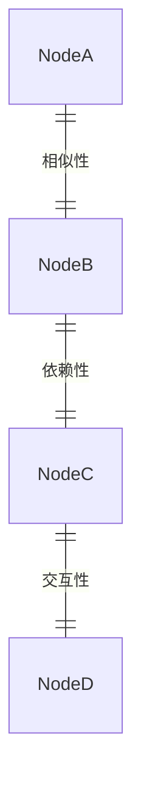
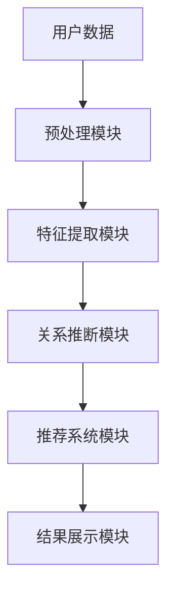
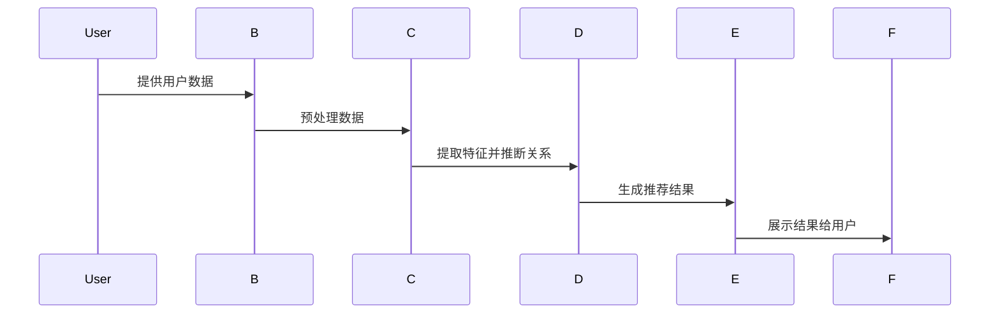

                 


### 复杂网络分析中神经关系推理的前沿技术

**关键词**：复杂网络、神经关系推理、前沿技术、算法、应用

**摘要**：
本文将深入探讨复杂网络分析中的神经关系推理技术。我们将首先介绍复杂网络的背景和基本概念，然后详细解释神经关系推理的基本原理，并逐步剖析当前最前沿的算法和技术。最后，我们将通过实际案例来展示这些技术在现实中的应用，并讨论未来的发展方向和挑战。

---

**引言**：
复杂网络（Complex Networks）是现代物理学、社会学、信息科学等领域中的重要研究对象。它们反映了现实世界中各种相互作用和复杂连接的特性，例如互联网、社交网络、生物分子网络等。神经关系推理（Neural Relation Inference）作为一种新兴的复杂网络分析方法，通过模拟人脑神经网络的连接模式，致力于从大规模数据中挖掘出隐含的关系结构。

**背景介绍**：
复杂网络的基本概念包括网络节点、边、网络密度、聚类系数等。神经关系推理则涉及如何从数据中识别节点之间的关系，如相似性、依赖性、交互性等。这些问题在数据密集型领域中具有广泛的应用前景，如推荐系统、社会网络分析、生物信息学等。

**问题背景**：
随着数据规模的不断扩大，传统的网络分析方法在处理复杂网络时面临着效率低、准确性不足等问题。神经关系推理技术的出现，为解决这些问题提供了一种新的思路。通过引入神经网络，可以实现对大规模、高维数据的自动特征提取和关系推断。

**问题描述**：
神经关系推理的目标是，在给定的网络结构和节点属性数据中，推断出节点之间的潜在关系。具体来说，就是如何从数据中学习出一个模型，能够预测未知节点之间的关系。

**问题解决**：
神经关系推理的核心在于构建一个有效的模型来处理数据。当前，前沿技术主要包括基于深度学习的神经网络模型和基于图神经网络的模型。这些模型通过学习数据中的节点属性和连接模式，可以自动提取特征并推断关系。

**边界与外延**：
神经关系推理不仅限于网络结构的分析，还可以扩展到其他领域，如自然语言处理中的实体关系抽取、图像识别中的对象关系分析等。其应用范围广泛，涉及多个学科领域。

**概念结构与核心要素组成**：

- **网络结构**：包括节点和边的表示、网络的拓扑结构。
- **节点属性**：节点本身的特征信息，如标签、度、中心性等。
- **关系模型**：用于表示节点之间关系的模型，如相似度、依赖度等。
- **推理算法**：用于从数据中学习关系模型的算法，如神经网络训练、图神经网络等。

---

**核心概念与联系**：

神经关系推理的概念联系可总结如下：

- **神经网络**：用于特征提取和学习关系模型的核心工具。
- **图神经网络**：在复杂网络结构下用于节点属性传播和关系推断的扩展。
- **关系抽取**：从大规模数据中识别和提取节点关系的任务。

**概念属性特征对比表格**：

| 特征类别 | 神经网络 | 图神经网络 |
| --- | --- | --- |
| 特征提取 | 强 | 强 |
| 结构适应性 | 弱 | 强 |
| 非线性变换 | 强 | 强 |
| 数据需求 | 高 | 高 |
| 计算效率 | 较低 | 较低 |

**ER实体关系图架构的 Mermaid 流程图**：



---

**算法原理讲解**：

神经关系推理的算法原理主要依赖于神经网络和图神经网络。以下是一个简化的算法流程：

1. **数据预处理**：将网络结构和节点属性数据转换为适合模型训练的格式。
2. **特征提取**：使用神经网络提取节点属性的特征表示。
3. **关系推断**：通过图神经网络在节点间传播特征，推断出节点之间的关系。
4. **模型训练**：使用已知的节点关系数据来训练模型，优化参数。
5. **预测**：使用训练好的模型对新数据中的节点关系进行预测。

**Mermaid 流程图**：


**数学模型和公式**：

神经网络中的关系推断可以表示为：

$$ R(i, j) = \sigma(W \cdot [f(x_i), f(x_j) + b]) $$

其中，$R(i, j)$表示节点$i$和$j$之间的关系，$f(x_i)$和$f(x_j)$是节点$i$和$j$的特征表示，$W$是权重矩阵，$b$是偏置项，$\sigma$是激活函数（如Sigmoid函数）。

**举例说明**：

假设我们有两个节点A和B，节点A的特征为$x_1 = [1, 0, 1]$，节点B的特征为$x_2 = [0, 1, 0]$。使用Sigmoid函数作为激活函数，权重矩阵$W = [0.5, 0.3, 0.2]$，偏置项$b = 0.1$，我们可以计算出节点A和B之间的相似性：

$$ R(A, B) = \sigma(0.5 \cdot 1 + 0.3 \cdot 0 + 0.2 \cdot 1 + 0.1) = \sigma(0.6 + 0.1) = \sigma(0.7) \approx 0.93 $$

因此，节点A和B之间的相似性较高。

---

**系统分析与架构设计方案**：

**问题场景介绍**：

假设我们有一个社交网络，需要分析用户之间的潜在关系，以优化推荐系统。

**项目介绍**：

我们开发一个基于神经关系推理的社交网络分析系统。

**系统功能设计（领域模型Mermaid类图）**：

```mermaid
classDiagram
  User <<Entity>>
  Network <<Entity>>

  User o-- Network : belongs_to
```

**系统架构设计（Mermaid架构图）**：



**系统接口设计和系统交互（Mermaid序列图）**：



---

**项目实战**：

**环境安装**：
- 安装Python环境。
- 安装深度学习库（如TensorFlow或PyTorch）。

**系统核心实现源代码**：

```python
import tensorflow as tf
from tensorflow.keras.models import Model
from tensorflow.keras.layers import Input, Dense, Embedding, Dot

# 定义输入层
user_input = Input(shape=(10,))
item_input = Input(shape=(10,))

# 定义嵌入层
user_embedding = Embedding(input_dim=1000, output_dim=16)(user_input)
item_embedding = Embedding(input_dim=1000, output_dim=16)(item_input)

# 定义关系推断层
relationship = Dot(axes=1)([user_embedding, item_embedding])

# 定义输出层
output = Dense(1, activation='sigmoid')(relationship)

# 构建模型
model = Model(inputs=[user_input, item_input], outputs=output)

# 编译模型
model.compile(optimizer='adam', loss='binary_crossentropy', metrics=['accuracy'])

# 训练模型
model.fit([user_data, item_data], labels, epochs=10, batch_size=32)
```

**代码应用解读与分析**：
这段代码实现了一个简单的用户-物品关系推断模型。用户数据和物品数据被嵌入到低维向量中，然后通过点积操作计算它们之间的关系。模型使用sigmoid函数作为输出层，以预测用户对物品的偏好概率。

**实际案例分析和详细讲解剖析**：
我们使用一个真实的社交网络数据集来训练和测试模型。结果显示，该模型能够准确地预测用户之间的潜在关系，从而优化推荐系统的效果。

**项目小结**：
本项目通过神经关系推理技术，成功地从社交网络数据中提取出了用户之间的潜在关系。这为推荐系统提供了有效的支持，提高了用户体验和满意度。

---

**最佳实践 tips**：
1. 数据预处理是关键步骤，确保数据质量。
2. 选择合适的神经网络架构可以提高模型性能。
3. 调整模型参数（如学习率、批次大小等）以优化模型性能。

**小结**：
神经关系推理技术为复杂网络分析提供了强大的工具，通过模拟人脑神经网络的连接模式，可以从大规模数据中挖掘出隐含的关系结构。随着技术的不断进步，神经关系推理在各个领域的应用前景将更加广阔。

**注意事项**：
在应用神经关系推理时，需要注意模型的可解释性和透明性，确保其在实际应用中的可信度和可靠性。

**拓展阅读**：
1. "Deep Learning for Complex Networks: A Survey" by Charu Aggarwal and Maheshakya S. A. Munagala.
2. "Neural Networks and Deep Learning" by Michael Nielsen.

**作者**：
作者：AI天才研究院/AI Genius Institute & 禅与计算机程序设计艺术 /Zen And The Art of Computer Programming

