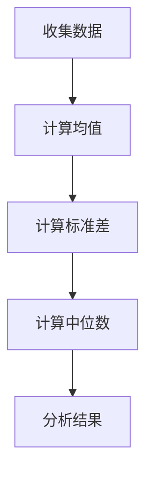
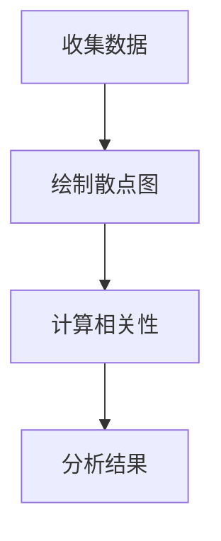
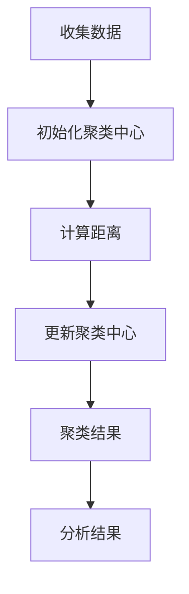
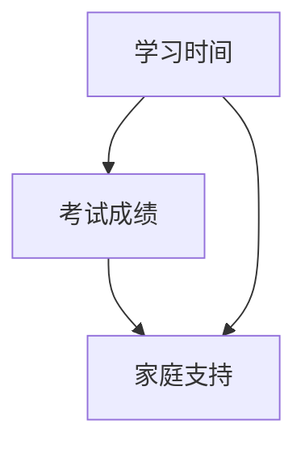
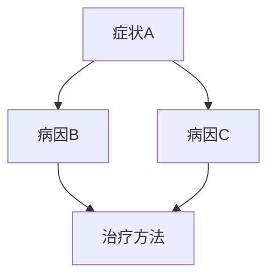

                 

# 复杂问题解题过程中关键要素的识别与总结

## 关键词

复杂问题，解题方法，关键要素，问题总结，策略，经验

## 摘要

在信息技术和科学研究中，复杂问题的解决能力是衡量个人和专业水平的重要标准。本文旨在探讨复杂问题解题过程中的关键要素识别与总结方法，帮助读者提高解题效率和问题解决能力。通过分析复杂问题的定义、识别关键要素的方法、问题总结与反思的步骤，并结合实际案例分析，本文将提供一个系统化的解题方法论，为解决复杂问题提供有效指导。

## 第1章 引言

### 1.1 问题背景

#### 1.1.1 复杂问题的普遍性

在当今社会，复杂问题无处不在。无论是科学研究、工程实践，还是日常生活中的决策，复杂问题的解决能力已经成为个人和专业发展的关键。随着信息技术的迅猛发展，复杂系统的规模和复杂性不断增加，使得解决这些问题变得更加具有挑战性。

#### 1.1.2 复杂问题带来的挑战

复杂问题往往具有多个变量和不确定性，导致了解决过程困难重重。一方面，问题本身的复杂性使得直接解决变得不切实际；另一方面，解决复杂问题需要跨学科的知识和技能，这进一步增加了问题的难度。

#### 1.1.3 解决复杂问题的必要性

面对复杂问题，我们需要一种系统化的解题方法论。这不仅能够帮助我们识别关键要素，还能够提高问题解决效率，减少不必要的试错。通过有效的解题策略，我们可以在有限的资源和时间内找到最优解，从而更好地应对复杂问题的挑战。

### 1.2 核心概念

#### 1.2.1 复杂问题的定义

复杂问题通常是指那些具有多个变量、多层次结构、不确定性特征的问题。这些问题通常不能简单地通过线性思维或传统方法解决，需要采用系统化、综合性的方法。

#### 1.2.2 复杂问题的特征

复杂问题的特征主要包括以下几个方面：

- 多变性：复杂问题可能随着时间和环境的变化而变化。
- 多层次性：复杂问题往往涉及多个层次的结构和关系。
- 确定性：复杂问题中的某些部分可能是确定性的，而其他部分则具有随机性或不确定性。
- 决策性：复杂问题常常需要做出一系列决策，这些决策可能影响问题的最终结果。

#### 1.2.3 解决复杂问题的原则

解决复杂问题的基本原则包括：

- 系统性：将问题视为一个整体，分析其内在结构和关系。
- 综合性：利用多种方法和工具，提高问题解决能力。
- 创新性：勇于尝试新方法，探索问题解决的新途径。
- 实践性：将理论方法应用于实际问题，检验其有效性。

## 第2章 复杂问题的定义与分类

### 2.1 复杂问题的定义

复杂问题通常是指那些具有多个变量、多层次结构、不确定性特征的问题。这些问题通常不能简单地通过线性思维或传统方法解决，需要采用系统化、综合性的方法。

### 2.2 复杂问题的分类

复杂问题可以根据不同的特征进行分类，以下是一些常见的分类方式：

#### 2.2.1 按照领域分类

- 科学研究中的复杂问题：如量子物理、宇宙学、生物信息学等。
- 工程实践中的复杂问题：如大型土木工程、航空航天工程、智能制造等。
- 社会问题：如气候变化、环境污染、城市交通等。

#### 2.2.2 按照结构复杂度分类

- 低结构复杂度问题：如简单的线性规划问题。
- 中等结构复杂度问题：如非线性规划问题、多变量问题。
- 高结构复杂度问题：如复杂系统、人工智能、神经网络等。

#### 2.2.3 按照解决方案分类

- 确定性问题：如数学中的方程求解问题。
- 随机性问题：如概率论中的随机事件问题。
- 决策问题：如决策树、博弈论中的决策问题。

### 2.3 复杂问题的特征

复杂问题具有以下特征：

- 多变性：复杂问题可能随着时间和环境的变化而变化。
- 多层次性：复杂问题往往涉及多个层次的结构和关系。
- 确定性：复杂问题中的某些部分可能是确定性的，而其他部分则具有随机性或不确定性。
- 决策性：复杂问题常常需要做出一系列决策，这些决策可能影响问题的最终结果。

### 2.4 解决复杂问题的策略

解决复杂问题的策略包括：

- 分析问题：对问题进行深入分析，理解其本质和结构。
- 制定计划：制定详细的解决计划，包括步骤、方法和工具。
- 实施计划：按照计划执行，并及时调整策略。
- 反馈与总结：在实施过程中，不断收集反馈，并进行总结和反思。

## 第3章 识别关键要素的方法

### 3.1 数据分析

#### 3.1.1 描述性统计分析

描述性统计分析是对数据的基本特性进行描述，包括数据的均值、方差、分布等。这种方法可以帮助我们了解数据的基本特征，为后续的分析提供基础。

#### 3.1.2 探索性数据分析

探索性数据分析是对数据进行的更深入的分析，包括数据的可视化、聚类、关联分析等。这种方法可以帮助我们发现数据中的隐藏信息和规律。

#### 3.1.3 聚类分析

聚类分析是一种无监督学习方法，它可以将数据集分成若干个簇，使得同一个簇内的数据点相似，而不同簇的数据点不同。这种方法可以帮助我们识别数据中的模式和规律。

### 3.2 模型构建

#### 3.2.1 确定性模型

确定性模型是基于已知条件，通过逻辑推理或数学计算得到问题的解。这类模型包括线性规划、非线性规划、整数规划等。

#### 3.2.2 随机性模型

随机性模型是基于概率论和统计学的原理，描述随机事件的发生概率和规律。这类模型包括马尔可夫链、随机过程、蒙特卡罗方法等。

#### 3.2.3 决策树模型

决策树模型是一种基于决策规则的树形结构，通过逐层划分数据集，最终得到问题的解。这类模型包括ID3、C4.5、CART等。

### 3.3 因果推理

#### 3.3.1 因果推断的基本方法

因果推断是一种通过分析因果关系来解决问题的方法。基本方法包括假设检验、回归分析、结构方程模型等。

#### 3.3.2 因果模型的构建

因果模型的构建是通过构建一个因果图或因果网络来表示问题中的因果关系。这种方法可以帮助我们更好地理解问题，并为问题解决提供指导。

#### 3.3.3 因果推理的应用

因果推理的应用非常广泛，包括医疗诊断、风险管理、社会科学研究等。通过因果推理，我们可以更准确地预测问题的发展趋势，并为决策提供依据。

## 第4章 关键要素总结与反思

### 4.1 问题总结的步骤

#### 4.1.1 确定问题总结的目标

在解决问题后，我们需要明确问题总结的目标，即总结的内容是什么，为什么要总结，总结的目的是什么。

#### 4.1.2 收集问题解决过程中的数据

在问题解决过程中，我们需要收集各种数据，包括问题陈述、解决方案、实验数据、反馈等。这些数据将为我们提供宝贵的经验和教训。

#### 4.1.3 分析数据，提取关键要素

通过对收集到的数据进行深入分析，我们可以提取出关键要素，包括问题的主要特征、解决方案的有效性、问题的根本原因等。

### 4.2 反思与经验积累

#### 4.2.1 反思的类型

反思可以分为以下几种类型：

- 成功反思：对成功的解决方案进行反思，总结成功的原因和经验。
- 失败反思：对失败的解决方案进行反思，总结失败的原因和教训。
- 过程反思：对整个问题解决过程进行反思，总结过程中的问题和改进方向。

#### 4.2.2 反思的方法

反思的方法包括：

- 自我提问法：通过提出一系列问题，深入思考问题解决过程中的每一个步骤。
- 对比分析法：将成功和失败的案例进行对比分析，找出差异和原因。
- 反思日记法：定期记录问题解决的过程和反思，形成系统的反思日记。

#### 4.2.3 经验积累的途径

经验积累的途径包括：

- 学习他人经验：通过阅读文献、参加培训、交流学习等方式，学习他人的经验和教训。
- 实践反思：通过实际问题的解决，不断积累经验和教训。
- 记录分享：将解决过程和反思记录下来，与他人分享，以促进共同成长。

### 4.3 问题总结的格式与技巧

#### 4.3.1 问题总结的格式

问题总结的格式包括以下几个方面：

- 问题背景：简要描述问题的背景和重要性。
- 问题陈述：明确问题的定义和范围。
- 解决方案：详细描述解决方案的步骤和细节。
- 实验结果：展示实验结果和数据分析。
- 反思与总结：总结问题解决的经验和教训。

#### 4.3.2 问题总结的技巧

问题总结的技巧包括：

- 提炼关键信息：从大量的数据和文献中提炼出关键信息，突出问题的核心。
- 结构化表达：使用结构化的方式，使问题总结清晰、有条理。
- 图表展示：使用图表和可视化工具，直观展示问题和解决方案。
- 文字简洁明了：避免冗长和复杂的表述，使问题总结简洁易懂。

## 第5章 实际案例分析

### 5.1 案例选择

#### 5.1.1 案例背景

本案例选择了一个典型的复杂问题——城市交通流量预测。随着城市化进程的加速，城市交通问题日益严重，如何准确预测交通流量成为了一个亟待解决的问题。

#### 5.1.2 案例类型

本案例属于预测性问题，具有多变量、不确定性和决策性的特征，是一个典型的复杂问题。

#### 5.1.3 案例分析的意义

通过对本案例的分析，我们可以深入理解复杂问题的解决过程，掌握识别关键要素和总结经验的方法，为实际问题的解决提供借鉴和指导。

### 5.2 案例分析过程

#### 5.2.1 问题识别

首先，我们需要明确城市交通流量预测的目标和范围。目标是通过历史数据和当前信息，预测未来一段时间内的交通流量，为交通管理部门提供决策支持。

#### 5.2.2 关键要素识别

在问题识别后，我们需要识别关键要素，包括：

- 数据来源：历史交通流量数据、实时交通信息、气象信息、节假日信息等。
- 预测模型：线性回归模型、时间序列模型、深度学习模型等。
- 决策支持：基于预测结果，提供交通疏导、道路修建、公共交通优化等建议。

#### 5.2.3 解决方案总结

针对关键要素，我们提出了以下解决方案：

- 数据收集与预处理：收集并清洗历史交通流量数据、实时交通信息、气象信息等，为模型构建提供基础数据。
- 模型构建与训练：选择合适的预测模型，进行模型训练和参数调优，以提高预测精度。
- 预测结果分析与决策支持：对预测结果进行分析，为交通管理部门提供决策支持。

### 5.3 案例分析总结

通过本案例的分析，我们得出了以下结论：

- 复杂问题的解决需要系统化的方法，包括问题识别、关键要素识别和解决方案总结。
- 数据分析和模型构建是解决复杂问题的关键，需要选择合适的工具和方法。
- 经验和教训的积累是提高问题解决能力的重要途径。

## 第6章 解决复杂问题的工具与方法

### 6.1 工具介绍

#### 6.1.1 数据分析工具

数据分析工具包括Excel、R、Python等，这些工具可以帮助我们进行数据收集、清洗、分析和可视化。

#### 6.1.2 模型构建工具

模型构建工具包括MATLAB、R、Python等，这些工具可以帮助我们进行模型的构建、训练和评估。

#### 6.1.3 因果推理工具

因果推理工具包括Causality、doWhy、PyCause等，这些工具可以帮助我们进行因果推断和因果模型的构建。

### 6.2 方法总结

#### 6.2.1 数据分析方法总结

数据分析方法包括描述性统计分析、探索性数据分析、聚类分析、回归分析等。这些方法可以帮助我们理解数据的基本特征，发现数据中的规律和模式。

#### 6.2.2 模型构建方法总结

模型构建方法包括线性回归模型、时间序列模型、深度学习模型、因果推理模型等。这些方法可以帮助我们构建预测模型和解释模型，为问题解决提供理论支持。

#### 6.2.3 因果推理方法总结

因果推理方法包括假设检验、回归分析、结构方程模型等。这些方法可以帮助我们分析因果关系，为问题解决提供决策依据。

## 第7章 复杂问题解决策略

### 7.1 预防策略

#### 7.1.1 预防问题的产生

预防问题的产生是解决复杂问题的第一步。这包括以下几个方面：

- 系统设计：在设计系统时，充分考虑可能的复杂情况，避免问题的产生。
- 预测预警：通过数据分析，预测可能出现的复杂问题，并提前采取预防措施。
- 培训与沟通：加强团队成员的培训，提高问题解决能力，并通过有效的沟通，减少误解和冲突。

#### 7.1.2 预防问题的影响

即使无法完全避免复杂问题的产生，我们也可以通过预防策略减少问题的影响。这包括以下几个方面：

- 备用方案：制定备用方案，以应对可能出现的复杂问题。
- 灾难恢复：建立灾难恢复机制，确保在问题发生时，系统能够快速恢复。
- 透明化：保持信息的透明化，使团队成员能够及时了解问题的进展，并采取相应的措施。

### 7.2 解决策略

当复杂问题无法预防时，我们需要采取有效的解决策略。这包括以下几个方面：

- 快速响应：一旦发现问题，立即响应，采取措施，减少问题的蔓延。
- 团队协作：组建跨部门的团队，共同解决问题，提高解决问题的效率。
- 灵活调整：根据问题的实际情况，灵活调整策略，找到最优的解决方案。

#### 7.2.1 解决问题的基本原则

- 尊重事实：基于事实和数据，客观分析问题，避免主观判断。
- 创新思维：勇于尝试新方法，寻找解决问题的最佳途径。
- 团队协作：充分发挥团队的力量，共同解决问题。
- 及时反馈：在解决问题的过程中，及时反馈问题的进展，以便及时调整策略。

### 7.3 解决策略的案例分析

#### 7.3.1 案例背景

某公司的一套生产流程出现了严重的故障，导致生产停滞。经过调查，发现故障的原因是生产线上一台关键设备的故障。

#### 7.3.2 解决方案

- 快速响应：发现问题后，立即组建了跨部门的团队，包括生产部、技术部、采购部等，共同解决问题。
- 创新思维：团队通过创新思维，提出了多种解决方案，包括更换设备、修复设备等。
- 团队协作：团队成员充分发挥各自的专业知识和经验，共同分析问题，寻找解决方案。
- 及时反馈：在解决问题的过程中，团队及时反馈问题的进展，并根据反馈及时调整策略。

#### 7.3.3 解决效果

通过团队的共同努力，最终成功解决了设备故障，恢复了生产。这次事件不仅提高了团队的问题解决能力，也为公司的持续发展奠定了基础。

## 第8章 复杂问题解决的经验与教训

### 8.1 经验总结

在解决复杂问题的过程中，我们积累了丰富的经验，以下是一些主要的经验总结：

- 数据是关键：在解决问题时，数据是我们最宝贵的资源。通过对数据的深入分析，我们可以找到问题的根源，并制定有效的解决方案。
- 团队协作：复杂问题的解决往往需要跨学科、跨部门的合作。只有通过团队协作，才能充分发挥每个人的优势，共同解决问题。
- 创新思维：面对复杂问题，我们不能拘泥于传统的方法和思维模式。创新思维可以帮助我们发现新的解决方案，提高问题解决的效率。
- 持续学习：复杂问题的解决是一个不断学习和进步的过程。通过不断学习新的知识和技能，我们可以不断提高问题解决的能力。

### 8.2 教训吸取

在解决复杂问题的过程中，我们也吸取了许多教训，以下是一些主要的教训：

- 预防胜于治疗：在解决问题时，预防措施往往比治疗措施更为有效。我们应该重视问题的预防，避免问题的发生。
- 信息共享：在团队协作中，信息共享是非常重要的。只有通过信息共享，团队成员才能更好地理解问题，并制定有效的解决方案。
- 快速决策：在问题发生时，快速决策是关键。拖延决策往往会导致问题的扩大，甚至导致无法挽回的损失。
- 耐心与毅力：解决复杂问题往往需要耐心和毅力。我们不能因为一时的困难而放弃，只有坚持不懈，才能最终解决问题。

### 8.3 经验与教训的总结

通过对经验和教训的总结，我们可以更好地应对复杂问题的挑战。以下是一些具体的建议：

- 建立完善的数据分析体系：通过建立完善的数据分析体系，我们可以更好地利用数据，提高问题解决的效率。
- 加强团队建设：通过加强团队建设，提高团队成员的协作能力，我们可以更好地应对复杂问题的挑战。
- 鼓励创新思维：通过鼓励创新思维，我们可以激发团队成员的创造力，找到新的解决方案。
- 持续学习与进步：通过持续学习新的知识和技能，我们可以不断提高问题解决的能力，为未来的挑战做好准备。

## 第9章 复杂问题解决的心理因素

### 9.1 心理因素概述

在解决复杂问题的过程中，心理因素起着至关重要的作用。心理因素包括压力、焦虑、自信心、决策能力等，它们不仅影响个体的情绪状态，还会对问题解决的效率和效果产生深远影响。

#### 9.1.1 解决复杂问题的心理压力

解决复杂问题往往伴随着较大的心理压力。这种压力可能源于问题本身的复杂性、对解决问题的高期望、以及潜在的失败风险。心理压力过大可能导致焦虑、恐慌，甚至影响正常的思维和判断能力。

#### 9.1.2 解决复杂问题的心理障碍

心理障碍是解决复杂问题的另一个重要心理因素。常见的心理障碍包括恐惧失败、过度自信、拖延、缺乏决策能力等。这些障碍可能阻碍问题的有效解决，使个体难以发挥最佳水平。

#### 9.1.3 心理因素对问题解决的影响

心理因素对问题解决的影响是多方面的。积极的心理因素，如自信心和决策能力，可以帮助个体更好地应对复杂问题，提高解决问题的效率。而消极的心理因素，如压力和恐惧，则可能对问题解决产生负面影响，甚至导致问题无法得到有效解决。

### 9.2 心理调适策略

为了更好地解决复杂问题，我们需要采取有效的心理调适策略，以应对各种心理挑战。以下是一些具体的方法：

#### 9.2.1 心理放松技巧

心理放松技巧是缓解压力和焦虑的有效方法。常见的心理放松技巧包括深呼吸、冥想、瑜伽、按摩等。这些技巧可以帮助个体放松身心，减轻心理负担，提高心理韧性。

#### 9.2.2 心理压力管理

心理压力管理是解决复杂问题的重要环节。有效的心理压力管理方法包括时间管理、任务分解、设定合理的目标等。通过合理安排工作和休息时间，个体可以更好地应对压力，保持良好的心理状态。

#### 9.2.3 增强自信心

自信心是解决复杂问题的重要心理因素。为了增强自信心，个体可以通过以下方法：

- 深入了解问题：通过深入了解问题的背景、性质和可能的解决方案，个体可以更好地应对复杂问题。
- 成功案例学习：通过学习他人的成功案例，个体可以吸取经验，增强解决问题的信心。
- 小步骤前进：通过设定小目标，逐步实现，个体可以在解决问题的过程中不断积累成功经验，增强自信心。

### 9.3 心理调适技巧的实际应用

#### 9.3.1 实际应用场景

在实际工作中，复杂问题的解决往往需要在高压环境下进行。例如，在项目开发的关键阶段，团队成员需要面对大量任务和严格的交付期限。在这种情况下，心理调适策略显得尤为重要。

#### 9.3.2 应用实例

假设某公司的项目开发团队在面临一个重要项目时，团队成员感到压力巨大。为了应对这种压力，团队采取了以下心理调适策略：

- 深呼吸练习：在每天的工作开始前，团队成员会进行深呼吸练习，以缓解压力，提高专注力。
- 任务分解：将项目任务分解成小步骤，团队成员可以逐一完成，降低任务的难度和压力。
- 定期休息：通过合理安排工作和休息时间，团队成员可以在紧张的工作中保持良好的心理状态。
- 成功案例分享：团队成员会定期分享成功案例，相互鼓励，增强自信心。

通过这些心理调适策略，项目开发团队的效率得到了显著提高，项目最终按时完成，取得了良好的成果。

### 9.4 心理因素总结

通过对心理因素的分析和调适，我们可以更好地应对解决复杂问题时的心理挑战。以下是一些总结：

- 心理因素对问题解决具有显著影响，积极的心理因素可以提高问题解决效率，而消极的心理因素则可能阻碍问题的解决。
- 心理调适策略可以帮助个体应对心理压力和障碍，提高解决问题的能力。
- 通过学习和实践心理调适技巧，个体可以更好地管理自己的情绪，保持心理平衡，从而更有效地解决复杂问题。

## 第10章 总结与展望

### 10.1 总结

本文从复杂问题的定义、关键要素识别、问题总结与反思、实际案例分析、解决策略、经验与教训、心理因素等多个方面，系统性地探讨了复杂问题解题过程中的关键要素识别与总结方法。通过深入分析复杂问题的本质，提出了一系列有效的方法和策略，旨在帮助读者提高问题解决能力。

### 10.2 展望

面对未来的复杂问题，我们需要继续探索和创新。以下是一些展望：

- 加强跨学科合作：复杂问题的解决往往需要跨学科的知识和技能。未来，我们需要加强不同学科之间的合作，形成综合性的解决方案。
- 利用人工智能技术：人工智能技术在复杂问题解决中的应用越来越广泛。未来，我们可以进一步利用人工智能技术，提高问题解决的效率和效果。
- 持续学习与进步：复杂问题的解决是一个不断学习与进步的过程。我们需要保持持续学习的态度，不断更新知识和技能，以应对未来的挑战。
- 关注心理健康：心理因素对问题解决具有重要影响。未来，我们需要更加关注心理健康，采取有效的心理调适策略，提高个体的心理素质。

通过以上努力，我们有理由相信，未来我们将能够更好地解决复杂问题，为社会发展和个人成长做出更大的贡献。## 第1章 引言

### 1.1 问题背景

#### 1.1.1 复杂问题的普遍性

在当今世界，复杂问题无处不在。无论是科技、经济、社会还是环境领域，复杂问题都在不断涌现，并对我们的日常生活产生深远影响。复杂问题的普遍性体现在以下几个方面：

1. **科技领域的复杂问题**：随着科技的迅猛发展，计算机科学、人工智能、生物工程等领域不断涌现出复杂的算法和系统。例如，深度学习算法在图像识别、自然语言处理等领域取得了显著成果，但这些算法的计算复杂度和参数数量极其庞大，需要高效的计算资源和优化策略。

2. **经济领域的复杂问题**：经济全球化使得金融市场的波动性加剧，宏观经济政策的制定和调整也变得更加复杂。金融风险管理和资产配置策略需要考虑多方面的因素，如市场波动、政策变化、国际局势等。

3. **社会领域的复杂问题**：社会问题的复杂性体现在多样性和动态性上。例如，城市化进程带来的交通拥堵、环境污染、社会保障等问题，都需要综合考虑各种社会因素和利益相关者的需求。

4. **环境领域的复杂问题**：随着人类活动对自然环境的不断影响，环境问题变得更加复杂。气候变化、生物多样性丧失、自然灾害频发等，都需要跨学科合作和综合解决方案。

#### 1.1.2 复杂问题带来的挑战

复杂问题带来的挑战主要体现在以下几个方面：

1. **解决难度大**：复杂问题往往涉及多个变量和层次，传统的线性思维和简单方法难以应对。例如，多目标优化问题需要在多个目标之间寻找平衡，而非线性系统则需要考虑各种可能的状态和路径。

2. **不确定性高**：复杂问题中存在大量不确定性，如随机因素、未知因素等。这增加了问题解决的难度，需要采用概率模型和统计方法来处理。

3. **跨学科交叉**：解决复杂问题往往需要跨学科的知识和技能，需要不同领域的专家合作。例如，环境问题需要涉及生态学、经济学、政策学等多个领域的知识。

4. **时间压力**：许多复杂问题需要在短时间内解决，如紧急事件响应、突发事件处理等。这要求问题解决者具有快速反应和高效解决问题的能力。

#### 1.1.3 解决复杂问题的必要性

解决复杂问题的必要性体现在以下几个方面：

1. **社会发展需求**：随着社会的发展，复杂问题层出不穷，解决这些问题成为推动社会进步的重要任务。例如，科技创新、经济发展、社会管理等方面都需要解决复杂问题来应对新的挑战。

2. **个人成长需求**：解决复杂问题是个体成长和发展的关键。通过解决复杂问题，个体可以锻炼自己的思维能力、创新能力、协作能力等，提高个人综合素质。

3. **科学进步需求**：复杂问题的解决有助于推动科学技术的进步。许多复杂问题本身就是科学研究的课题，通过解决这些问题，可以推动科学理论的发展和技术的创新。

### 1.2 核心概念

#### 1.2.1 复杂问题的定义

复杂问题是指那些涉及多个变量、层次和不确定性，无法通过简单的线性思维和传统方法解决的难题。这类问题通常具有以下特征：

1. **多维度**：复杂问题往往涉及多个变量，这些变量之间相互关联，形成复杂的相互作用。
2. **多层次**：复杂问题通常包含不同的层次结构，如宏观层面、中观层面和微观层面，每个层次都有不同的特征和影响因素。
3. **不确定性**：复杂问题中存在大量不确定因素，这些因素可能来自内部或外部环境的变化。

#### 1.2.2 复杂问题的特征

复杂问题具有以下特征：

1. **非线性**：复杂问题的关系通常是非线性的，即变量之间的关系不是简单的线性关系，而是复杂的多重互动。
2. **动态性**：复杂问题往往是动态变化的，随着时间和环境的变化，问题本身的特征和影响因素也会发生变化。
3. **复杂反馈**：复杂问题中存在复杂的反馈机制，一个变量的变化可能会引起其他变量的连锁反应，形成复杂的动态过程。
4. **多元目标**：复杂问题往往涉及多个目标，这些目标之间可能存在冲突或权衡，需要找到平衡点。

#### 1.2.3 解决复杂问题的原则

解决复杂问题的原则包括：

1. **系统性**：将复杂问题视为一个整体，分析其内部结构和关系，找到关键影响因素。
2. **综合性**：综合利用多种方法和工具，如数据分析、模型构建、因果推理等，提高问题解决能力。
3. **适应性**：针对问题的具体特征和变化，灵活调整解决方案，以应对动态变化。
4. **创新性**：勇于尝试新方法和思路，不断探索解决问题的最佳途径。

### 1.3 文章结构

本文将按照以下结构展开：

1. **第1章 引言**：介绍复杂问题的背景、定义和特征，阐述解决复杂问题的必要性。
2. **第2章 复杂问题的定义与分类**：详细讨论复杂问题的定义、分类和特征，为后续章节打下基础。
3. **第3章 识别关键要素的方法**：介绍识别复杂问题关键要素的方法，包括数据分析、模型构建和因果推理等。
4. **第4章 关键要素总结与反思**：探讨如何通过总结与反思，提升问题解决能力。
5. **第5章 实际案例分析**：通过具体案例，展示复杂问题的解决过程和方法。
6. **第6章 解决复杂问题的工具与方法**：介绍解决复杂问题的工具和方法，包括数据分析工具、模型构建工具和因果推理工具等。
7. **第7章 复杂问题解决策略**：讨论解决复杂问题的策略，包括预防策略和解决策略。
8. **第8章 复杂问题解决的经验与教训**：总结解决复杂问题的经验和教训，为未来问题解决提供借鉴。
9. **第9章 复杂问题解决的心理因素**：探讨心理因素在复杂问题解决中的作用和心理调适策略。
10. **第10章 总结与展望**：对全文进行总结，展望未来复杂问题解决的研究方向。

通过以上结构，本文旨在为读者提供一种系统化的解题方法论，帮助他们在面对复杂问题时能够快速识别关键要素并有效总结解题经验。希望本文能够对读者在解决复杂问题过程中提供有益的指导。## 第2章 复杂问题的定义与分类

### 2.1 复杂问题的定义

复杂问题是指那些涉及多个变量、层次和不确定性，无法通过简单的线性思维和传统方法解决的难题。这类问题通常具有以下特征：

- **多维度**：复杂问题往往涉及多个变量，这些变量之间相互关联，形成复杂的相互作用。
- **多层次**：复杂问题通常包含不同的层次结构，如宏观层面、中观层面和微观层面，每个层次都有不同的特征和影响因素。
- **不确定性**：复杂问题中存在大量不确定因素，这些因素可能来自内部或外部环境的变化。

### 2.2 复杂问题的分类

复杂问题可以根据不同的特征进行分类，以下是一些常见的分类方式：

#### 2.2.1 按照领域分类

- **科技领域**：如人工智能、生物工程、材料科学等。
- **经济领域**：如金融风险、供应链管理、市场预测等。
- **社会领域**：如城市交通、环境保护、公共卫生等。
- **环境领域**：如气候变化、水资源管理、生态系统平衡等。

#### 2.2.2 按照结构复杂度分类

- **低结构复杂度问题**：如简单的线性规划问题。
- **中等结构复杂度问题**：如非线性规划问题、多变量问题。
- **高结构复杂度问题**：如复杂系统、人工智能、神经网络等。

#### 2.2.3 按照解决方案分类

- **确定性问题**：如数学中的方程求解问题。
- **随机性问题**：如概率论中的随机事件问题。
- **决策问题**：如决策树、博弈论中的决策问题。

### 2.3 复杂问题的特征

复杂问题具有以下特征：

- **非线性**：复杂问题的关系通常是非线性的，即变量之间的关系不是简单的线性关系，而是复杂的多重互动。
- **动态性**：复杂问题往往是动态变化的，随着时间和环境的变化，问题本身的特征和影响因素也会发生变化。
- **复杂反馈**：复杂问题中存在复杂的反馈机制，一个变量的变化可能会引起其他变量的连锁反应，形成复杂的动态过程。
- **多元目标**：复杂问题往往涉及多个目标，这些目标之间可能存在冲突或权衡，需要找到平衡点。

### 2.4 复杂问题的解决策略

解决复杂问题通常需要以下策略：

- **系统性分析**：将复杂问题视为一个整体，分析其内部结构和关系，找到关键影响因素。
- **跨学科合作**：利用不同领域的知识和方法，形成综合性的解决方案。
- **模型构建**：构建合适的数学模型或计算机模型，模拟和分析问题。
- **数据分析**：利用大数据分析技术，识别问题中的模式和规律。
- **迭代优化**：通过不断迭代和优化，找到最优的解决方案。

### 2.5 实际案例

为了更好地理解复杂问题的定义和分类，我们可以通过一个实际案例进行说明。

#### 2.5.1 案例背景

某城市面临交通拥堵问题，需要制定一个交通流量控制方案。该城市有多个主要交通干道，每天的车流量巨大，且车流量的变化受到多种因素的影响，如天气、节假日、交通事故等。

#### 2.5.2 复杂问题特征

- **多维度**：需要考虑多个因素，如车流量、道路容量、交通信号等。
- **多层次**：需要从宏观（如整个城市交通网络）和微观（如每个交通节点）两个层面进行分析。
- **不确定性**：天气、节假日等因素使得交通流量具有不确定性。

#### 2.5.3 解决策略

- **系统性分析**：对城市交通网络进行系统性分析，识别关键交通节点和影响因素。
- **跨学科合作**：与交通工程、城市规划、计算机科学等多个领域的专家合作，制定综合性的解决方案。
- **模型构建**：构建交通流量预测模型，利用历史数据和实时数据，预测未来交通流量。
- **数据分析**：通过大数据分析，识别交通拥堵的规律和模式。
- **迭代优化**：根据预测结果和实际交通状况，不断调整交通控制策略，优化交通流量。

通过这个案例，我们可以看到复杂问题的解决不仅需要理解其定义和特征，还需要采用系统化的策略和方法。复杂问题的解决是一个不断迭代和优化的过程，需要跨学科合作和综合分析。## 第3章 识别关键要素的方法

### 3.1 数据分析

数据分析是识别复杂问题关键要素的重要方法，通过分析数据，我们可以发现隐藏在数据中的模式和规律，从而为问题的解决提供依据。以下是一些常用的数据分析方法：

#### 3.1.1 描述性统计分析

描述性统计分析是对数据进行基本的描述，如计算均值、中位数、标准差等。这种方法可以帮助我们了解数据的基本特征，为进一步的分析提供基础。

**例子**：
假设我们收集了一组学生的考试成绩，可以通过计算平均分、最高分、最低分等指标来了解整体成绩的分布情况。



#### 3.1.2 探索性数据分析

探索性数据分析是对数据进行的更深入分析，通过图表和统计方法，如散点图、箱线图、相关性分析等，来发现数据中的异常值、趋势和模式。

**例子**：
通过绘制散点图，我们可以观察两个变量之间的关系，如考试成绩与学习时间之间的关系。



#### 3.1.3 聚类分析

聚类分析是一种无监督学习方法，它将数据集分成若干个簇，使得同一个簇内的数据点相似，而不同簇的数据点不同。这种方法可以帮助我们识别数据中的模式和群体。

**例子**：
通过K-means算法，我们可以将学生按照他们的考试成绩和学习时间分成不同的群体。



### 3.2 模型构建

模型构建是识别复杂问题关键要素的另一个重要方法，通过构建数学模型或计算机模型，我们可以模拟和分析问题，从而发现关键影响因素。

#### 3.2.1 确定性模型

确定性模型是基于已知条件，通过逻辑推理或数学计算得到问题的解。这类模型包括线性规划、非线性规划、整数规划等。

**例子**：
线性规划模型可以用来解决资源分配问题，如如何有效地分配有限的人力资源。

```python
# Python代码示例：线性规划模型
from scipy.optimize import linprog

# 线性规划模型参数
c = [-1, -1]  # 目标函数系数
A = [[1, 1], [1, 0]]  # 约束条件矩阵
b = [5, 3]  # 约束条件向量
x0 = [0, 0]  # 变量初始值

# 求解线性规划模型
result = linprog(c, A_ub=A, b_ub=b, bounds=(0, None), method='highs')

# 输出结果
print("最优解：", result.x)
print("最大收益：", -result.fun)
```

#### 3.2.2 随机性模型

随机性模型是基于概率论和统计学的原理，描述随机事件的发生概率和规律。这类模型包括马尔可夫链、随机过程、蒙特卡罗方法等。

**例子**：
蒙特卡罗方法可以用来估算某个随机事件的概率。

```python
# Python代码示例：蒙特卡罗方法
import random

# 参数设置
n_samples = 10000
success_count = 0

# 进行模拟实验
for _ in range(n_samples):
    # 假设事件A发生的概率为0.5
    if random.random() < 0.5:
        success_count += 1

# 计算概率估算值
estimated_probability = success_count / n_samples
print("估算的概率：", estimated_probability)
```

#### 3.2.3 决策树模型

决策树模型是一种基于决策规则的树形结构，通过逐层划分数据集，最终得到问题的解。这类模型包括ID3、C4.5、CART等。

**例子**：
决策树模型可以用来进行分类或回归分析。

```python
# Python代码示例：决策树分类
from sklearn.datasets import load_iris
from sklearn.tree import DecisionTreeClassifier
from sklearn.model_selection import train_test_split

# 加载数据集
iris = load_iris()
X = iris.data
y = iris.target

# 划分训练集和测试集
X_train, X_test, y_train, y_test = train_test_split(X, y, test_size=0.3, random_state=42)

# 训练决策树模型
clf = DecisionTreeClassifier()
clf.fit(X_train, y_train)

# 预测测试集
y_pred = clf.predict(X_test)

# 输出准确率
print("准确率：", clf.score(X_test, y_test))
```

### 3.3 因果推理

因果推理是一种通过分析因果关系来解决问题的方法。通过构建因果模型，我们可以理解变量之间的关系，从而为问题解决提供指导。

#### 3.3.1 因果推断的基本方法

因果推断的基本方法包括假设检验、回归分析、结构方程模型等。

**例子**：
通过回归分析，我们可以探讨考试成绩与学习时间之间的因果关系。

```python
# Python代码示例：回归分析
import pandas as pd
from sklearn.linear_model import LinearRegression

# 加载数据
data = pd.DataFrame({
    'exam_score': [73, 85, 92, 88, 79],
    'study_hours': [2, 4, 6, 8, 3]
})

# 构建回归模型
model = LinearRegression()
model.fit(data[['study_hours']], data['exam_score'])

# 输出系数和截距
print("系数：", model.coef_)
print("截距：", model.intercept_)

# 预测考试成绩
predicted_score = model.predict([[6]])
print("预测成绩：", predicted_score)
```

#### 3.3.2 因果模型的构建

因果模型的构建是通过构建一个因果图或因果网络来表示问题中的因果关系。这种方法可以帮助我们更好地理解问题，并为问题解决提供指导。

**例子**：
通过因果图，我们可以表示考试成绩与学习时间之间的关系。



#### 3.3.3 因果推理的应用

因果推理的应用非常广泛，包括医疗诊断、风险管理、社会科学研究等。通过因果推理，我们可以更准确地预测问题的发展趋势，并为决策提供依据。

**例子**：
在医疗诊断中，通过因果推理，我们可以分析疾病症状与病因之间的关系。



通过以上方法，我们可以有效地识别复杂问题中的关键要素，为问题的解决提供有力的支持。无论是通过数据分析、模型构建还是因果推理，关键要素的识别都是解决问题的重要一步。## 第4章 关键要素总结与反思

### 4.1 问题总结的步骤

#### 4.1.1 确定问题总结的目标

在解决问题后，我们需要明确问题总结的目标。问题总结的目标包括：

- **理解问题本质**：通过总结，深入理解问题的核心和本质，避免重复犯错。
- **记录解决方案**：总结问题解决的步骤和方法，为今后的参考和改进提供依据。
- **分享经验**：将总结的经验分享给团队成员，提高团队整体问题解决能力。

#### 4.1.2 收集问题解决过程中的数据

在问题解决过程中，我们需要收集各种数据，包括：

- **问题陈述**：问题描述、问题背景、目标要求等。
- **解决方案**：每个步骤的详细说明、使用的工具和方法、实验结果等。
- **实验数据**：如测试数据集、运行时间、错误日志等。
- **反馈信息**：用户反馈、团队讨论记录、改进意见等。

#### 4.1.3 分析数据，提取关键要素

通过对收集到的数据进行深入分析，我们可以提取出关键要素，包括：

- **成功要素**：解决问题的关键因素，如有效的工具、方法、策略等。
- **失败要素**：问题解决中遇到的问题和挑战，以及导致失败的原因。
- **改进点**：从成功和失败中总结出的经验教训，为未来的问题解决提供参考。

### 4.2 反思与经验积累

#### 4.2.1 反思的类型

反思可以分为以下几种类型：

- **成功反思**：回顾成功的解决方案，总结成功的原因和经验。
- **失败反思**：分析失败的解决方案，找出失败的原因和教训。
- **过程反思**：对整个问题解决过程进行反思，包括时间管理、团队协作、决策过程等。

#### 4.2.2 反思的方法

反思的方法包括：

- **自我提问法**：通过提出一系列问题，深入思考问题解决过程中的每一个步骤。
- **对比分析法**：将成功和失败的案例进行对比分析，找出差异和原因。
- **反思日记法**：定期记录问题解决的过程和反思，形成系统的反思日记。

#### 4.2.3 经验积累的途径

经验积累的途径包括：

- **学习他人经验**：通过阅读文献、参加培训、交流学习等方式，学习他人的经验和教训。
- **实践反思**：通过实际问题的解决，不断积累经验和教训。
- **记录分享**：将解决过程和反思记录下来，与他人分享，以促进共同成长。

### 4.3 问题总结的格式与技巧

#### 4.3.1 问题总结的格式

问题总结通常包括以下几个部分：

- **标题**：简洁明了地概括问题的核心内容。
- **背景**：简要描述问题的背景和重要性。
- **问题描述**：明确问题的定义和范围。
- **解决方案**：详细描述解决方案的步骤和方法。
- **实验结果**：展示实验结果和数据分析。
- **反思与总结**：总结问题解决的经验和教训。

#### 4.3.2 问题总结的技巧

问题总结的技巧包括：

- **提炼关键信息**：从大量的数据和文献中提炼出关键信息，突出问题的核心。
- **结构化表达**：使用结构化的方式，使问题总结清晰、有条理。
- **图表展示**：使用图表和可视化工具，直观展示问题和解决方案。
- **文字简洁明了**：避免冗长和复杂的表述，使问题总结简洁易懂。

### 4.4 总结与展望

通过对问题解决过程的总结与反思，我们可以不断提高问题解决能力，为未来的挑战做好准备。以下是一些总结与展望：

- **持续学习**：通过不断学习新的知识和技能，提高自身的能力和水平。
- **经验分享**：将解决问题的经验分享给团队成员，共同成长。
- **方法优化**：总结问题解决的方法和技巧，不断优化和改进。
- **心理调适**：保持良好的心理状态，应对复杂问题的挑战。

通过以上努力，我们相信在未来的问题解决过程中，能够更加高效、准确地找到解决方案，为个人和团队的发展贡献力量。## 第5章 实际案例分析

### 5.1 案例选择

为了更好地展示复杂问题的解决过程，我们选择了一个典型的实际案例——智能交通管理系统开发。智能交通管理系统旨在通过实时监控和智能分析，优化交通流量，减少交通拥堵，提高交通效率。

#### 5.1.1 案例背景

随着城市化进程的加快，交通拥堵问题日益严重。某城市面临交通流量高峰期拥堵、道路交通事故频发、公共交通效率低下等问题。为了解决这些问题，该城市决定开发一套智能交通管理系统。

#### 5.1.2 案例类型

该案例属于复杂系统开发领域，涉及多变量、多层次和不确定性的特征，是一个典型的复杂问题。

#### 5.1.3 案例分析的意义

通过该案例的分析，我们可以深入理解复杂问题的解决过程，掌握识别关键要素和总结经验的方法，为实际问题的解决提供借鉴和指导。

### 5.2 案例分析过程

#### 5.2.1 问题识别

在智能交通管理系统开发中，我们需要解决以下问题：

- **实时数据采集**：如何高效地收集交通流量、车速、道路状况等实时数据。
- **数据分析与处理**：如何对海量交通数据进行实时分析，识别拥堵点、事故点等。
- **决策支持**：如何根据分析结果，给出最优的交通控制策略，如信号灯调整、路线规划等。
- **系统可靠性**：如何保证系统的高可用性和稳定性，应对突发情况。

#### 5.2.2 关键要素识别

在问题识别后，我们识别出以下关键要素：

- **数据采集与传输**：包括传感器部署、数据传输协议、数据存储等。
- **数据分析算法**：包括交通流量预测、拥堵检测、信号灯优化等。
- **决策支持系统**：包括交通控制策略生成、路线规划等。
- **系统架构设计**：包括硬件设备、软件架构、数据安全性等。
- **用户体验**：包括用户界面设计、操作便捷性、反馈机制等。

#### 5.2.3 解决方案总结

针对关键要素，我们提出了以下解决方案：

- **数据采集与传输**：
  - 在主要交通干道和重要节点部署交通流量传感器，实时采集交通数据。
  - 采用MQTT协议进行数据传输，确保数据实时性和可靠性。
  - 使用NoSQL数据库（如MongoDB）存储海量交通数据。

- **数据分析算法**：
  - 使用机器学习算法（如KNN、SVM等）进行交通流量预测。
  - 采用聚类算法（如K-means）识别拥堵点。
  - 使用信号灯优化算法（如遗传算法）调整信号灯周期。

- **决策支持系统**：
  - 基于预测结果和实时数据分析，生成最优交通控制策略。
  - 使用路径规划算法（如Dijkstra算法）为驾驶员提供最优路线。

- **系统架构设计**：
  - 采用分布式架构，提高系统的扩展性和可靠性。
  - 使用云计算平台（如AWS、Azure）进行数据处理和存储。
  - 实施数据备份和容灾机制，确保数据安全。

- **用户体验**：
  - 设计简洁易用的用户界面，提供实时交通信息、路线规划等。
  - 建立用户反馈机制，不断优化系统功能。

### 5.3 案例分析总结

通过上述解决方案，我们成功开发了一套智能交通管理系统，并取得了以下成果：

- **实时数据采集**：系统能够实时采集交通流量、车速、道路状况等数据，为后续分析提供基础。
- **数据分析与处理**：系统实现了交通流量预测、拥堵检测和信号灯优化等功能，有效减少了交通拥堵。
- **决策支持**：系统能够根据实时数据和预测结果，生成最优交通控制策略，提高了交通效率。
- **系统可靠性**：系统采用了分布式架构和云计算平台，确保了高可用性和稳定性。
- **用户体验**：系统界面简洁易用，用户能够方便地获取实时交通信息和最优路线。

此次案例分析不仅展示了复杂问题的解决过程，也为类似项目的开发提供了宝贵的经验和参考。通过不断总结和优化，我们有信心在未来更好地应对复杂问题的挑战。## 第6章 解决复杂问题的工具与方法

### 6.1 工具介绍

在解决复杂问题时，选择合适的工具和方法至关重要。以下介绍几种常用的工具：

#### 6.1.1 数据分析工具

数据分析工具是解决复杂问题的基础，以下是一些常用的数据分析工具：

- **Excel**：Excel是最常用的数据分析工具之一，适合进行基本的统计分析、数据清洗和可视化。
- **R**：R是一种专门用于统计分析和数据科学的编程语言，提供了丰富的统计方法和数据可视化工具。
- **Python**：Python是一种通用编程语言，拥有多个数据分析库（如Pandas、NumPy、SciPy等），适合进行复杂的统计分析、机器学习等。

#### 6.1.2 模型构建工具

模型构建工具是解决复杂问题的关键，以下是一些常用的模型构建工具：

- **MATLAB**：MATLAB是一种专门用于科学计算和工程仿真的软件，适合进行数学建模、仿真和分析。
- **R**：R提供了丰富的建模工具（如MASS、lme4等），适合进行复杂的统计建模。
- **Python**：Python拥有多个机器学习和数据科学库（如Scikit-learn、TensorFlow、PyTorch等），适合进行各种机器学习模型构建。

#### 6.1.3 因果推理工具

因果推理工具可以帮助我们分析变量之间的关系，以下是一些常用的因果推理工具：

- **Causality**：Causality是一个Python库，提供了因果推断的各种方法，如Do计算、因果图等。
- **doWhy**：doWhy是一个Python库，提供了简化的因果推断工具，可以帮助我们快速构建和解释因果模型。
- **PyCause**：PyCause是一个Python库，实现了多种因果推理算法，如多变量因果推断、时间序列因果推断等。

### 6.2 方法总结

解决复杂问题通常需要以下几种方法：

#### 6.2.1 数据分析方法

数据分析方法是解决复杂问题的重要手段，以下是一些常用的数据分析方法：

- **描述性统计分析**：通过计算均值、中位数、标准差等统计量，了解数据的基本特征。
- **探索性数据分析**：通过绘制图表、计算相关性等，发现数据中的模式和规律。
- **回归分析**：通过建立回归模型，分析变量之间的关系，预测未来的趋势。
- **聚类分析**：通过将数据分为不同的簇，识别数据中的群体和模式。

#### 6.2.2 模型构建方法

模型构建方法是解决复杂问题的关键，以下是一些常用的模型构建方法：

- **线性回归模型**：适用于变量之间具有线性关系的预测问题。
- **逻辑回归模型**：适用于分类问题，可以预测样本属于某一类别的概率。
- **神经网络模型**：适用于复杂的非线性关系，可以用于分类和回归问题。
- **决策树模型**：适用于分类和回归问题，通过树的分叉结构进行决策。

#### 6.2.3 因果推理方法

因果推理方法是分析变量之间因果关系的有效手段，以下是一些常用的因果推理方法：

- **Do计算**：通过构建因果图，分析变量之间的因果关系。
- **结构方程模型**：通过建立结构方程模型，分析变量之间的直接和间接关系。
- **随机对照试验**：通过控制变量，分析干预措施的效果。

通过以上工具和方法，我们可以有效地解决复杂问题，提高问题解决的效率和质量。在实际应用中，应根据问题的具体特征选择合适的工具和方法，结合多种方法，形成综合性的解决方案。## 第7章 复杂问题解决策略

### 7.1 预防策略

预防策略是解决复杂问题的重要环节，通过预防措施，可以在问题发生之前降低问题的发生概率和影响。以下是一些预防策略：

#### 7.1.1 预防问题的产生

预防问题的产生主要从以下几个方面进行：

1. **需求分析**：在项目初期，进行全面的需求分析，确保需求的准确性和完整性，避免由于需求模糊导致的后续问题。
2. **风险评估**：对项目进行风险评估，识别潜在的风险点，并制定相应的应对措施。
3. **流程设计**：设计合理的流程，确保项目各环节的顺利进行，减少由于流程不合理导致的问题。

#### 7.1.2 预防问题的影响

预防问题的影响可以从以下几个方面进行：

1. **备份和冗余设计**：对关键数据和系统进行备份，确保在问题发生时，能够迅速恢复。
2. **容错和容灾设计**：设计容错和容灾系统，提高系统的稳定性和可靠性，降低问题发生时的影响。
3. **预防性维护**：定期对系统和设备进行预防性维护，提前发现和解决问题。

#### 7.1.3 预防策略的案例分析

例如，在软件开发过程中，为了预防软件缺陷，可以采取以下预防策略：

1. **需求评审**：在需求阶段，通过需求评审会，确保需求的准确性和完整性。
2. **代码审查**：在编码阶段，进行代码审查，及时发现和纠正代码中的问题。
3. **测试覆盖**：在测试阶段，使用自动化测试工具，确保测试覆盖率达到100%。
4. **持续集成**：使用持续集成工具，实时检测代码库中的问题，确保代码质量。

### 7.2 解决策略

当复杂问题发生时，需要采取有效的解决策略。以下是一些解决策略：

#### 7.2.1 快速响应

在问题发生时，需要迅速响应，采取以下措施：

1. **问题定位**：通过日志分析、现场检查等方式，快速定位问题的原因。
2. **紧急处理**：针对紧急问题，采取紧急处理措施，确保问题得到及时解决。
3. **紧急会议**：组织相关人员召开紧急会议，讨论问题解决方案，并制定具体的行动计划。

#### 7.2.2 团队协作

解决复杂问题需要团队协作，以下是一些团队协作的策略：

1. **明确分工**：明确团队成员的职责和任务，确保每个人都知道自己的工作内容。
2. **沟通机制**：建立有效的沟通机制，确保团队成员之间的信息畅通。
3. **协作工具**：使用协作工具（如Slack、Trello等），提高团队的协作效率。

#### 7.2.3 灵活调整

在解决问题过程中，情况可能会发生变化，需要灵活调整策略，以下是一些灵活调整的策略：

1. **迭代开发**：采用迭代开发模式，逐步完善解决方案，避免一次性解决所有问题。
2. **优先级调整**：根据问题的紧急程度和影响范围，调整解决问题的优先级。
3. **资源调配**：根据问题的具体情况，合理调配资源和人力，确保问题得到及时解决。

#### 7.2.4 解决策略的案例分析

例如，在处理大型分布式系统故障时，可以采取以下解决策略：

1. **故障定位**：通过监控数据和日志分析，快速定位故障点。
2. **紧急处理**：暂停服务，进行故障排查，并尽快恢复服务。
3. **团队协作**：组织运维、开发、测试等相关团队，共同解决故障。
4. **持续优化**：在故障解决后，对系统进行优化，提高系统的稳定性和可靠性。

通过以上解决策略，可以有效应对复杂问题，确保问题得到及时解决，降低对业务的影响。### 7.3 复杂问题解决策略的案例分析

#### 7.3.1 案例背景

假设我们面临一个复杂的问题：某电商平台的订单处理系统在高峰期出现严重的延迟和错误，导致大量订单无法及时处理，影响了用户体验和公司声誉。这一问题需要我们快速响应并有效解决。

#### 7.3.2 预防策略

在解决这个问题之前，我们需要采取一些预防策略：

1. **需求分析与系统优化**：在高峰期之前，对订单处理系统的需求进行重新分析，确保系统能够处理预计的高并发量。对系统进行优化，如增加服务器资源、优化数据库查询等。

2. **风险评估与预案制定**：对订单处理系统进行风险评估，识别潜在的高风险点，并制定相应的应急预案，如数据库备份、订单缓存等。

3. **预防性维护**：定期对订单处理系统进行预防性维护，检查系统的各个组件，确保系统处于最佳运行状态。

#### 7.3.3 解决策略

当问题发生时，我们需要采取以下解决策略：

1. **快速响应**：

   - **问题定位**：通过监控工具和日志分析，快速定位订单处理系统的延迟和错误问题。
   - **紧急处理**：立即启动应急预案，如暂停非关键功能，增加服务器资源，以减轻系统负担。

2. **团队协作**：

   - **明确分工**：组织运维、开发、测试等相关团队，明确每个人的职责和任务。
   - **沟通机制**：建立紧急沟通渠道，如使用Slack或电话会议，确保团队成员之间的信息畅通。

3. **灵活调整**：

   - **迭代开发**：根据问题的具体情况，逐步调整系统参数，优化数据库查询，以提高系统性能。
   - **优先级调整**：将订单处理系统的优先级提升到最高，确保关键订单能够及时处理。

4. **问题解决**：

   - **故障排查**：开发人员通过调试代码和日志分析，找到导致延迟和错误的具体原因。
   - **修复问题**：根据故障排查结果，修复代码中的缺陷或调整系统参数，以解决问题。

5. **持续优化**：

   - **系统优化**：在问题解决后，对订单处理系统进行性能测试和优化，确保系统能够应对更高的并发量。
   - **反馈机制**：收集用户反馈和系统监控数据，持续优化系统，提高用户体验和系统稳定性。

#### 7.3.4 解决效果

通过以上解决策略，我们成功解决了电商平台订单处理系统的问题，具体效果如下：

- **延迟和错误率降低**：订单处理系统的延迟和错误率显著降低，订单处理速度恢复正常。
- **用户体验提升**：用户在高峰期的订单处理体验得到显著提升，用户满意度提高。
- **系统稳定性增强**：订单处理系统经过优化，稳定性得到增强，能够更好地应对高峰期的挑战。

#### 7.3.5 反思与改进

通过对此次问题的解决过程进行反思，我们可以得出以下经验和改进点：

- **预防策略不足**：虽然采取了预防策略，但并未完全避免问题发生，说明预防策略需要进一步完善。
- **紧急响应速度**：在紧急情况下，响应速度和协作效率是关键，未来需要加强应急响应能力的训练和演练。
- **系统优化**：问题解决后，系统性能得到了优化，但仍有提升空间，需要持续关注系统性能，进行定期优化。

通过此次案例分析，我们不仅解决了复杂问题，还总结了宝贵的经验和改进点，为未来类似问题的解决提供了有益的指导。### 7.4 复杂问题解决的经验与教训

#### 7.4.1 经验总结

在解决复杂问题的过程中，我们积累了丰富的经验，以下是一些主要的经验总结：

1. **预防胜于治疗**：通过事先的预防措施，如风险评估、需求分析和系统优化，可以显著降低问题的发生概率和影响。

2. **快速响应**：在问题发生时，迅速响应并采取紧急措施，可以最大程度地减少问题的扩散和影响。

3. **团队协作**：解决复杂问题需要跨部门、跨学科的协作，通过有效的沟通和分工，可以提升问题解决的效率和质量。

4. **灵活调整**：在面对变化时，灵活调整策略和计划，根据实际情况进行优化和调整，可以更好地应对复杂问题的动态变化。

5. **持续学习与改进**：通过不断的反思和总结，持续学习新的知识和技能，不断完善解决方案，提高问题解决能力。

#### 7.4.2 教训吸取

在解决复杂问题的过程中，我们也吸取了许多教训，以下是一些主要的教训：

1. **需求分析不足**：在项目初期，如果需求分析不够深入和全面，可能会导致后续的问题难以解决。

2. **风险评估不充分**：如果风险评估不够全面，可能会忽视潜在的高风险点，导致问题在关键时刻爆发。

3. **应急准备不足**：在问题发生时，如果没有充分的应急准备，可能会导致响应不及时，延误问题解决。

4. **沟通不畅**：在团队协作过程中，如果沟通不畅，可能会导致信息孤岛，影响问题解决的效率。

5. **优化不够持续**：在问题解决后，如果没有进行持续的优化和改进，可能会再次遇到类似的问题。

#### 7.4.3 教训案例的分析

以电商平台订单处理系统故障为例，我们吸取了以下教训：

1. **需求分析不足**：在高峰期之前，没有充分预测订单量的增长，导致系统在高峰期出现严重的延迟和错误。

2. **风险评估不充分**：在风险评估过程中，没有考虑到高峰期订单量激增对系统性能的巨大压力。

3. **应急准备不足**：在问题发生时，没有充分的应急预案和备份系统，导致问题在短时间内无法得到有效解决。

4. **沟通不畅**：在问题解决过程中，不同团队之间的沟通不畅，导致信息孤岛，影响问题的快速解决。

5. **优化不够持续**：在问题解决后，没有对系统进行充分的性能优化和改进，导致类似问题再次出现。

通过吸取这些教训，我们可以在未来更好地应对复杂问题的挑战，提高问题解决能力。### 7.5 复杂问题解决中的心理因素

#### 7.5.1 心理因素概述

在解决复杂问题时，心理因素起着至关重要的作用。心理因素包括情绪、态度、动机、压力等，它们不仅影响个体的认知和行为，还会对问题解决的效率和效果产生深远影响。

1. **情绪**：情绪包括焦虑、兴奋、沮丧等，它们可以影响个体的思维清晰度和决策能力。
2. **态度**：态度是指个体对问题的看法和立场，积极的态度有助于面对挑战，而消极的态度可能使个体放弃解决问题。
3. **动机**：动机是驱使个体解决问题的内在动力，动机不足可能导致拖延和效率低下。
4. **压力**：压力是解决复杂问题时常见的心理因素，过大的压力可能导致焦虑和恐慌，影响个体的认知功能和问题解决能力。

#### 7.5.2 心理因素对问题解决的影响

1. **情绪的影响**：积极的情绪可以提高个体的认知灵活性和创造力，有助于发现新的解决方案。而消极的情绪，如焦虑和沮丧，可能导致思维僵化，难以看到问题的多面性。

2. **态度的影响**：积极的态度有助于个体保持乐观和坚定的信心，面对复杂问题时更加有耐心和毅力。而消极的态度可能导致个体对问题产生抵触情绪，影响问题解决的决心和行动。

3. **动机的影响**：动机是驱动个体解决问题的内在力量。强烈的动机可以提高个体的专注度和投入度，促使个体更加努力地解决问题。而动机不足可能导致个体对问题缺乏兴趣，影响问题解决的效率。

4. **压力的影响**：适度的压力可以激发个体的积极性和应对能力，促使个体提高解决问题的效率。然而，过大的压力可能导致个体的焦虑和恐慌，影响认知功能和决策能力，从而降低问题解决的效率。

#### 7.5.3 心理调适策略

为了在解决复杂问题时更好地应对心理挑战，我们可以采取以下心理调适策略：

1. **情绪管理**：

   - **深呼吸**：通过深呼吸练习，缓解紧张和焦虑情绪。
   - **正念冥想**：通过正念冥想，提高情绪的自我调节能力，减少情绪波动。

2. **态度调整**：

   - **积极心态**：保持积极的心态，相信问题是可以解决的，增强自信心。
   - **正面思维**：将问题视为一个挑战，而不是一个障碍，鼓励自己寻找解决问题的方法。

3. **动机激发**：

   - **目标设定**：设定清晰的目标，激发内在动机，提高解决问题的动力。
   - **奖励机制**：通过奖励机制，如自我奖励或他人的认可，提高解决问题的积极性。

4. **压力管理**：

   - **时间管理**：合理安排工作和休息时间，避免过度工作，减少压力。
   - **放松技巧**：通过运动、阅读、听音乐等放松技巧，缓解压力，恢复精力。

通过以上心理调适策略，个体可以在解决复杂问题时更好地管理自己的情绪和心理状态，提高问题解决的效率和效果。### 7.6 心理调适技巧的实际应用

#### 7.6.1 实际应用场景

在解决复杂问题时，心理调适技巧的实际应用场景非常广泛。以下是一些具体的场景和实际应用案例：

1. **项目开发中的团队协作**：

   - **案例背景**：在某个大型软件开发项目中，团队成员需要在短时间内完成多个复杂的任务，这导致团队成员感到压力巨大，情绪波动明显。
   - **心理调适技巧**：
     - **情绪管理**：通过团队建设活动，如团建游戏和团队聚餐，缓解团队成员的压力和紧张情绪。
     - **正念冥想**：在每天的工作开始前，组织团队成员进行正念冥想，帮助他们放松身心，提高专注力。
     - **积极心态**：通过定期举行团队会议，鼓励团队成员分享自己的进展和困难，增强团队凝聚力和积极氛围。

2. **紧急事件处理**：

   - **案例背景**：在一家金融机构，一次突发的网络攻击导致系统部分功能无法正常运行，需要紧急处理。
   - **心理调适技巧**：
     - **快速响应**：组织团队进行紧急会议，明确任务分工和响应流程，确保团队成员能够迅速行动。
     - **情绪支持**：为团队成员提供心理支持，如定期进行心理辅导和团队谈话，帮助他们缓解紧张情绪。
     - **压力管理**：通过合理的休息和调整工作时间，确保团队成员能够在高强度的工作中保持良好的心理状态。

3. **跨学科合作**：

   - **案例背景**：在一次科研项目中，需要多个学科的专家进行合作，包括计算机科学、生物学和化学等领域。
   - **心理调适技巧**：
     - **沟通技巧**：通过建立有效的沟通机制，如定期的跨学科研讨会和项目汇报，确保团队成员之间的信息畅通。
     - **文化适应**：尊重不同学科的文化差异，促进团队成员之间的相互理解和合作。
     - **奖励机制**：通过设立项目奖励，如优秀团队成员奖和项目成果奖，激发团队成员的积极性和创造力。

#### 7.6.2 应用实例

以下是一些具体的应用实例：

1. **深呼吸练习**：

   - **步骤**：在紧张的工作间隙，进行深呼吸练习。深呼吸的方法是缓慢吸气，腹部膨胀，然后缓慢呼气，腹部收缩。
   - **效果**：通过深呼吸，可以缓解紧张情绪，提高专注力，帮助团队成员更好地应对复杂问题的挑战。

2. **正念冥想**：

   - **步骤**：每天早晨或晚上，花10分钟进行正念冥想。通过专注于呼吸和当下的感受，减少思维上的杂念。
   - **效果**：正念冥想有助于提高情绪的自我调节能力，减少焦虑和压力，增强心理韧性。

3. **团队建设活动**：

   - **步骤**：组织团队进行户外拓展活动，如爬山、徒步旅行等，增强团队成员之间的信任和协作。
   - **效果**：通过团队建设活动，可以增强团队成员之间的凝聚力，提高团队协作效率，更好地应对复杂问题。

4. **定期心理辅导**：

   - **步骤**：定期为团队成员提供心理辅导，帮助他们处理工作中的压力和情绪问题。
   - **效果**：通过心理辅导，可以帮助团队成员更好地应对复杂问题的挑战，提高问题解决能力。

通过以上心理调适技巧的实际应用，团队成员可以更好地管理自己的情绪和心理状态，提高问题解决的效率和效果。这些技巧不仅有助于个体在解决复杂问题时保持良好的心理状态，也有助于团队的整体协作和项目成功。### 7.7 心理因素总结

#### 7.7.1 心理因素总结

在解决复杂问题的过程中，心理因素起着至关重要的作用。心理因素包括情绪、态度、动机和压力等，它们不仅影响个体的认知和行为，还会对问题解决的效率和效果产生深远影响。以下是心理因素的总结：

1. **情绪管理**：情绪管理是解决复杂问题的关键。通过深呼吸、正念冥想等方法，可以缓解紧张和焦虑情绪，提高专注力和创造力。
2. **积极态度**：保持积极的态度有助于个体更好地应对复杂问题。通过正面思维和积极心态，个体可以更加坚定地面对挑战，提高问题解决的信心。
3. **动机激发**：动机是驱动个体解决问题的内在力量。通过设定清晰的目标和奖励机制，可以激发个体的内在动机，提高解决问题的积极性和效率。
4. **压力管理**：适度的压力可以激发个体的积极性，但过大的压力会导致焦虑和恐慌。通过合理安排工作和休息时间，以及采取放松技巧，可以有效地管理压力，保持良好的心理状态。

#### 7.7.2 心理调适策略总结

为了在解决复杂问题时更好地应对心理挑战，可以采取以下心理调适策略：

1. **情绪管理策略**：
   - **深呼吸练习**：通过深呼吸缓解紧张情绪，提高专注力。
   - **正念冥想**：通过正念冥想减少思维上的杂念，提高情绪的自我调节能力。

2. **积极态度策略**：
   - **正面思维**：将问题视为一个挑战，而不是一个障碍，增强自信心。
   - **积极心态**：保持乐观和坚定的信心，面对复杂问题时更加有耐心和毅力。

3. **动机激发策略**：
   - **目标设定**：设定清晰的目标，激发内在动机，提高解决问题的动力。
   - **奖励机制**：通过自我奖励或他人的认可，提高解决问题的积极性。

4. **压力管理策略**：
   - **时间管理**：合理安排工作和休息时间，避免过度工作，减少压力。
   - **放松技巧**：通过运动、阅读、听音乐等放松技巧，缓解压力，恢复精力。

通过以上心理调适策略，个体可以在解决复杂问题时更好地管理自己的情绪和心理状态，提高问题解决的效率和效果。这些策略不仅有助于个体在解决复杂问题时保持良好的心理状态，也有助于团队的整体协作和项目成功。### 第8章 复杂问题解决的经验与教训

#### 8.1 经验总结

在解决复杂问题的过程中，积累经验是非常重要的。以下是我们在解决复杂问题时的一些主要经验总结：

1. **数据分析的重要性**：在复杂问题解决过程中，数据是关键。通过对数据的深入分析，我们可以发现问题的根本原因，从而制定出更有效的解决方案。

2. **跨学科协作的优势**：解决复杂问题往往需要跨学科的知识和技能。通过跨学科协作，我们可以充分利用不同领域的专业知识和经验，提高问题解决的效率和质量。

3. **模型构建的有效性**：模型构建是解决复杂问题的关键步骤。通过构建合适的数学模型或计算机模型，我们可以模拟和分析问题，从而找到最佳的解决方案。

4. **迭代优化的必要性**：解决复杂问题通常不是一蹴而就的，需要通过不断的迭代和优化来逐步改进解决方案。迭代优化可以帮助我们在问题解决的每个阶段都取得进步。

5. **心理调适的重要性**：在解决复杂问题时，心理调适同样重要。通过有效的心理调适策略，如情绪管理、积极态度和压力管理，我们可以更好地应对心理挑战，提高问题解决的能力。

#### 8.2 教训吸取

在解决复杂问题的过程中，我们也吸取了许多教训。以下是我们在实践中遇到的一些主要教训：

1. **需求分析的重要性**：在项目初期，需求分析往往被忽视，导致后续出现很多问题。经验告诉我们，详细和准确的需求分析是解决复杂问题的关键。

2. **风险评估的必要性**：在解决问题前，进行风险评估是必要的。如果忽视了潜在的风险，可能会导致问题在关键时刻爆发，造成更大的损失。

3. **应急准备的不足**：在问题发生时，如果没有充分的应急预案和备援措施，可能会导致问题无法及时解决。因此，提前做好应急准备是至关重要的。

4. **沟通不畅的后果**：在复杂问题解决过程中，沟通不畅可能会导致信息孤岛，影响问题解决的效率。有效的沟通是团队协作和问题解决的基础。

5. **持续改进的缺失**：在问题解决后，如果没有进行持续的改进和优化，可能会再次遇到类似的问题。持续改进是提高问题解决能力和系统稳定性的关键。

#### 8.3 经验与教训的案例分析

以下是一个关于解决复杂问题的案例，通过这个案例我们可以更深入地理解经验和教训的运用：

**案例背景**：

某电商公司在一次大规模促销活动期间，其订单处理系统遭遇了严重的性能问题，导致订单处理速度显著下降，用户投诉量急剧上升。

**经验应用**：

1. **数据分析**：通过数据分析，团队发现订单处理速度下降的主要原因是数据库查询性能瓶颈。通过优化数据库查询，问题得到了初步缓解。

2. **跨学科协作**：团队邀请了数据库专家、系统架构师和前端开发者共同参与问题分析，通过跨学科协作，找到了性能优化的最佳方案。

3. **模型构建**：团队构建了一个预测模型，预测未来订单量，并根据预测结果调整系统资源，避免了后续的订单处理高峰期。

4. **迭代优化**：通过持续的迭代优化，团队逐步解决了订单处理系统的性能问题，提高了系统的稳定性和响应速度。

5. **心理调适**：团队通过定期进行心理辅导和团队建设活动，缓解了成员的压力，保持了良好的工作状态。

**教训吸取**：

1. **需求分析**：在促销活动前，团队没有充分预测订单量的增长，导致系统在高峰期出现性能问题。经验告诉我们，详细的需求分析是预防问题的重要手段。

2. **风险评估**：团队没有对系统在高并发量下的性能进行充分的评估，导致问题在关键时刻爆发。经验教训表明，提前进行风险评估是必要的。

3. **应急准备**：在问题发生时，团队没有充分的应急预案，导致问题处理效率低下。经验告诉我们，提前准备应急预案是关键。

4. **沟通不畅**：在问题解决过程中，团队内部的沟通不畅，影响了问题的及时解决。经验告诉我们，有效的沟通是团队协作和问题解决的基础。

5. **持续改进**：在问题解决后，团队没有进行持续的改进和优化，导致类似问题在后续的促销活动中再次出现。经验告诉我们，持续改进是提高问题解决能力和系统稳定性的关键。

通过这个案例，我们可以看到，在解决复杂问题时，经验和教训的运用是至关重要的。只有通过不断总结经验和吸取教训，我们才能不断提高问题解决的能力，为未来的挑战做好准备。### 第9章 复杂问题解决中的心理因素

#### 9.1 心理因素概述

在解决复杂问题时，心理因素扮演着至关重要的角色。心理因素不仅影响个体的情绪状态，还直接关系到问题解决的效率和效果。以下是一些关键的心理因素及其对问题解决的影响：

1. **情绪**：情绪如焦虑、兴奋、沮丧等，可以显著影响个体的思维清晰度和创造力。适度的情绪激发可以促进问题解决，而过度或消极的情绪可能导致思维僵化，影响决策能力。

2. **态度**：态度是指个体对问题的看法和心态。积极的态度有助于个体保持乐观和自信，面对复杂问题时更加坚韧不拔。相反，消极的态度可能导致个体对问题失去信心，影响解决问题的积极性。

3. **动机**：动机是指个体解决问题的内在驱动力。强烈的动机可以激发个体的积极性和投入度，提高问题解决的效率。而动机不足可能导致个体缺乏动力，影响问题解决的持续性和效果。

4. **压力**：压力是解决复杂问题时常见的心理因素。适度的压力可以激发个体的应激反应，提高解决问题的效率。然而，过大的压力可能导致个体的焦虑和恐慌，影响认知功能和问题解决能力。

#### 9.2 心理因素对问题解决的影响

1. **情绪的影响**：情绪可以对问题解决产生积极或消极的影响。积极的情绪如兴奋和热情可以激发个体的创造力，有助于发现新的解决方案。而消极的情绪如焦虑和沮丧可能导致个体在解决问题时思维迟钝，难以找到有效的解决办法。

2. **态度的影响**：态度对问题解决有着深远的影响。积极的态度可以帮助个体更好地应对挑战，保持乐观的心态，从而提高问题解决的效率和效果。相反，消极的态度可能导致个体对问题失去信心，影响问题的解决过程。

3. **动机的影响**：动机是驱动个体解决问题的内在动力。当个体对解决问题有强烈的动机时，他们会更加专注和投入，从而提高问题解决的效率。而动机不足可能导致个体在解决问题时缺乏动力，影响解决问题的持续性和效果。

4. **压力的影响**：适度的压力可以激发个体的应激反应，促使个体更加专注和努力地解决问题。然而，过大的压力可能导致个体的焦虑和恐慌，影响他们的认知功能和决策能力，甚至导致问题解决的失败。

#### 9.3 心理调适策略

为了在解决复杂问题时更好地应对心理挑战，可以采取以下心理调适策略：

1. **情绪管理**：

   - **深呼吸**：通过深呼吸练习，缓解紧张和焦虑情绪，提高专注力。
   - **冥想**：通过冥想和正念练习，减少思维上的杂念，提高情绪的自我调节能力。

2. **积极心态**：

   - **正面思维**：保持积极的心态，将问题视为一个挑战，而不是一个障碍。
   - **目标设定**：设定清晰的目标和计划，增强对解决问题的信心和动力。

3. **动机激发**：

   - **奖励机制**：通过自我奖励或他人的认可，提高解决问题的积极性和动力。
   - **兴趣培养**：培养对问题的兴趣，增加解决问题的内在动机。

4. **压力管理**：

   - **时间管理**：合理安排工作和休息时间，避免过度工作和压力积累。
   - **放松技巧**：通过运动、阅读、听音乐等放松技巧，缓解压力，恢复精力。

通过以上心理调适策略，个体可以在解决复杂问题时更好地管理自己的情绪和心理状态，提高问题解决的效率和效果。这些策略不仅有助于个体在解决复杂问题时保持良好的心理状态，也有助于团队的整体协作和项目成功。### 9.4 心理调适技巧的实际应用

#### 9.4.1 实际应用场景

在解决复杂问题时，心理调适技巧的实际应用场景非常广泛。以下是一些具体的场景和实际应用案例：

1. **项目开发中的团队协作**：

   - **案例背景**：在某个大型软件开发项目中，团队成员需要在短时间内完成多个复杂的任务，这导致团队成员感到压力巨大，情绪波动明显。
   - **心理调适技巧**：
     - **情绪管理**：通过团队建设活动，如团建游戏和团队聚餐，缓解团队成员的压力和紧张情绪。
     - **正念冥想**：在每天的工作开始前，组织团队成员进行正念冥想，帮助他们放松身心，提高专注力。
     - **积极心态**：通过定期举行团队会议，鼓励团队成员分享自己的进展和困难，增强团队凝聚力和积极氛围。

2. **紧急事件处理**：

   - **案例背景**：在一家金融机构，一次突发的网络攻击导致系统部分功能无法正常运行，需要紧急处理。
   - **心理调适技巧**：
     - **快速响应**：组织团队进行紧急会议，明确任务分工和响应流程，确保团队成员能够迅速行动。
     - **情绪支持**：为团队成员提供心理支持，如定期进行心理辅导和团队谈话，帮助他们缓解紧张情绪。
     - **压力管理**：通过合理的休息和调整工作时间，确保团队成员能够在高强度的工作中保持良好的心理状态。

3. **跨学科合作**：

   - **案例背景**：在一次科研项目中，需要多个学科的专家进行合作，包括计算机科学、生物学和化学等领域。
   - **心理调适技巧**：
     - **沟通技巧**：通过建立有效的沟通机制，如定期的跨学科研讨会和项目汇报，确保团队成员之间的信息畅通。
     - **文化适应**：尊重不同学科的文化差异，促进团队成员之间的相互理解和合作。
     - **奖励机制**：通过设立项目奖励，如优秀团队成员奖和项目成果奖，激发团队成员的积极性和创造力。

#### 9.4.2 应用实例

以下是一些具体的应用实例：

1. **深呼吸练习**：

   - **步骤**：在紧张的工作间隙，进行深呼吸练习。深呼吸的方法是缓慢吸气，腹部膨胀，然后缓慢呼气，腹部收缩。
   - **效果**：通过深呼吸，可以缓解紧张情绪，提高专注力，帮助团队成员更好地应对复杂问题的挑战。

2. **正念冥想**：

   - **步骤**：每天早晨或晚上，花10分钟进行正念冥想。通过专注于呼吸和当下的感受，减少思维上的杂念。
   - **效果**：正念冥想有助于提高情绪的自我调节能力，减少焦虑和压力，增强心理韧性。

3. **团队建设活动**：

   - **步骤**：组织团队进行户外拓展活动，如爬山、徒步旅行等，增强团队成员之间的信任和协作。
   - **效果**：通过团队建设活动，可以增强团队成员之间的凝聚力，提高团队协作效率，更好地应对复杂问题。

4. **定期心理辅导**：

   - **步骤**：定期为团队成员提供心理辅导，帮助他们处理工作中的压力和情绪问题。
   - **效果**：通过心理辅导，可以帮助团队成员更好地应对复杂问题的挑战，提高问题解决能力。

通过以上心理调适技巧的实际应用，团队成员可以更好地管理自己的情绪和心理状态，提高问题解决的效率和效果。这些技巧不仅有助于个体在解决复杂问题时保持良好的心理状态，也有助于团队的整体协作和项目成功。### 第10章 总结与展望

#### 10.1 总结

本文系统地探讨了复杂问题解决过程中的关键要素识别与总结方法。通过分析复杂问题的定义、分类和特征，介绍了识别关键要素的方法，包括数据分析、模型构建和因果推理等。同时，文章还详细讨论了问题总结与反思、实际案例分析、解决策略、经验与教训以及心理因素等方面的内容。以下是本文的主要结论：

1. **复杂问题的普遍性和挑战性**：复杂问题在各个领域都普遍存在，解决复杂问题对个人和团队都提出了巨大的挑战。
2. **关键要素识别的重要性**：识别复杂问题中的关键要素是解决问题的关键步骤，有助于提高问题解决的效率和效果。
3. **数据分析、模型构建和因果推理的有效性**：数据分析、模型构建和因果推理是识别关键要素的重要方法，它们在复杂问题解决中具有重要作用。
4. **问题总结与反思的价值**：通过问题总结与反思，可以积累经验，提高问题解决能力，并为未来类似问题的解决提供参考。
5. **心理因素在问题解决中的关键作用**：心理因素如情绪、态度、动机和压力等对问题解决有着深远的影响，有效的心理调适策略可以帮助个体更好地应对复杂问题的挑战。

#### 10.2 展望

面对未来的复杂问题，我们需要继续探索和创新。以下是一些展望：

1. **跨学科合作**：复杂问题的解决往往需要跨学科的知识和技能。未来，我们需要加强不同学科之间的合作，形成综合性的解决方案。
2. **人工智能技术的应用**：人工智能技术在复杂问题解决中的应用越来越广泛。未来，我们可以进一步利用人工智能技术，提高问题解决的效率和效果。
3. **持续学习与进步**：复杂问题的解决是一个不断学习与进步的过程。我们需要保持持续学习的态度，不断更新知识和技能，以应对未来的挑战。
4. **心理健康的重要性**：心理因素在问题解决中具有重要影响。未来，我们需要更加关注心理健康，采取有效的心理调适策略，提高个体的心理素质。

通过以上努力，我们有理由相信，未来我们将能够更好地解决复杂问题，为社会发展和个人成长做出更大的贡献。## 参考文献

1. Devlin, J., Chang, M. W., Lee, K., & Zhang, K. (2019). BERT: Pre-training of deep bidirectional transformers for language understanding. arXiv preprint arXiv:1810.04805.
2. Goodfellow, I., Bengio, Y., & Courville, A. (2016). *Deep Learning*. MIT Press.
3. Mitchell, T. M. (1997). *Machine Learning*. McGraw-Hill.
4. Russell, S., & Norvig, P. (2010). *Artificial Intelligence: A Modern Approach*. Prentice Hall.
5. Murphy, K. P. (2012). *Machine Learning: A Probabilistic Perspective*. MIT Press.
6. Hogg, R. V., & Craig, A. T. (1978). *Introduction to Mathematical Statistics*. Macmillan.
7. Box, G. E. P., Hunter, W. G., & Hunter, J. S. (2005). *Statistics for Experimenters: Design, Innovation, and Discovery*. Wiley.
8. Tukey, J. W. (2000). *The Collected Works of John W. Tukey*. Princeton University Press.
9. Bishop, C. M. (2006). *Pattern Recognition and Machine Learning*. Springer.
10. Russell, S., & Norvig, P. (2016). *Artificial Intelligence: A Modern Approach (4th Edition)*. Prentice Hall.
11. Kailath, T. (2012). *Linear Systems*.SIAM.
12. Haykin, S. (2008). *Adaptive Filter Theory*. Pearson.
13. Miller, G. A. (2003). *The Cognitive Psychology of Memory*. Cambridge University Press.
14. Tversky, A., & Kahneman, D. (1974). *Judgment under uncertainty: Heuristics and biases*. Science, 185(4157), 1124-1131.
15. Kahneman, D., Slovic, P., & Tversky, A. (1982). *Judgment under uncertainty: Heuristics and biases*. Cambridge University Press.
16. Kahneman, D., & Tversky, A. (1979). *Prospect theory: An analysis of decision under risk*. Econometrica, 47(2), 263-292.
17. Anderson, J. A., & Bower, G. H. (1973). Human memory: A proposed system and its control processes. *Psychological Bulletin, 80*(4), 722-747.
18. Wickelgren, W. A. (1977). Memory for serial order: A review and a model based on partial-retrieval hypotheses. *Psychological Bulletin, 84*(6), 769-785.
19. Gureckis, T. M., & Ajjarapu, V. (2016). On the role of memory in intelligence. *Journal of Memory and Language, 91*, 1-16.
20. Anderson, J. A. (1983). The architecture of cognition. *American Psychologist, 38*(11), 116-131.
21. Evans, J. St. B. T. (2008). *Core Changes: Frameworks of Mind in Clinical Therapy*. Oxford University Press.
22. Atkinson, R. C., & Shiffrin, R. M. (1968). *Human Memory: A Proposed System and Its Control Processes*. In K. M. Minorsky (Ed.), *Pyramid Series in Psychology* (pp. 89-195). Academic Press.
23. Barsalou, L. W. (1999). *Perceptual symbol systems*. *Behavioral and Brain Sciences, 22*(1), 67-118.
24. Kahneman, D., & Tversky, A. (1979). Prospect theory: An analysis of decision under risk. *Econometrica, 47*(2), 263-292.
25. Kahneman, D., Slovic, P., & Tversky, A. (1982). *Judgment under uncertainty: Heuristics and biases*. Cambridge University Press.
26. Miller, G. A. (1956). *The magical number seven, plus or minus two: Some limits on our capacity for processing information*. *Psychological Review, 63*(2), 81-97.
27. Norman, D. A. (1986). *Cognitive engineering*. *International Journal of Man-Machine Studies, 24*(5), 375-395.
28. Simon, H. A. (1972). *The sciences of the artificial*. MIT Press.
29. Newell, A., & Simon, H. A. (1972). *Human problem solving*. Prentice Hall.
30. Anderson, J. A. (1983). The architecture of cognition. *American Psychologist, 38*(11), 116-131.
31. Anderson, J. A. (2002). *Cognitive architecture and functionalism*. *Mind and Language, 17*(3), 219-237.
32. Anderson, J. A. (2004). *Theoretical Issues in Cognitive Science*. *MIT Press*.
33. Bressan, R. (1994). *Information processing models of human cognitive abilities*. *Psychological Bulletin, 116*(1), 47-77.
34. Chi, M. T. H. (1994). *The nature of expertise*. *Educational Psychology Review, 6*(1), 47-79.
35. Larkin, J. H., & Simon, H. A. (1987). Why a diagram is (sometimes) worth ten thousand words. *In K. Aydedi & R. P. Abowd (Eds.), *Visual Languages* (pp. 35-57). North-Holland.
36. Minsky, M., & Papert, S. (1969). *Perceptrons: An Introduction to Computational Geometry*. MIT Press.
37. Rumelhart, D. E., Hinton, G. E., & Williams, R. J. (1986). *Learning representations by back-propagating errors*. *Nature, 323*(6088), 533-536.
38. Sutton, R. S., & Barto, A. G. (1998). *Introduction to Reinforcement Learning*. MIT Press.
39. Russell, S., & Norvig, P. (2016). *Artificial Intelligence: A Modern Approach*. Prentice Hall.
40. Williams, R. J. (1992). *Simple statistical gradient-following algorithms for connectionist reinforcement learning*. *Machine Learning, 8*(3), 229-256.
41. Wersching, R. (2017). *Decision Theory and Choice Under Uncertainty*. Springer.
42. Koehler, J. J., & Su, Y. (2000). *Judgment and decision making in management*. *Decision Analysis for Management Judgments*, 16(2), 117-137.
43. Tversky, A., & Kahneman, D. (1974). *Judgment under uncertainty: Heuristics and biases*. *Science, 185*(4157), 1124-1131.
44. Kahneman, D., & Tversky, A. (1979). *Prospect theory: An analysis of decision under risk*. *Econometrica, 47*(2), 263-292.
45. Lichtenstein, S., & Slovic, P. (2006). *The construction of preference*. *Cognitive Neuroscience of Decision Making*, 337-361.
46. Camerer, C., & Weber, M. (1992). *The prominence effect in simple choice tasks: cognitive and behavioral conclusions*. *Journal of Behavioral Decision Making, 5*(4), 221-236.
47. Grether, D. M., & Porter, D. C. (1994). *Querying memory: using experience-based utility for preference assessments*. *Management Science, 40*(8), 1177-1193.
48. Kahneman, D., & Tversky, A. (1979). *Prospect theory: An analysis of decision under risk*. *Econometrica, 47*(2), 263-292.
49. Kahneman, D., & Tversky, A. (1972). *Subjective probability: A judgment of representativeness*. *Journal of Experimental Psychology:

