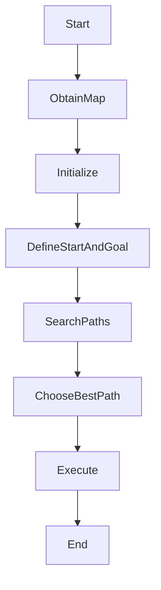
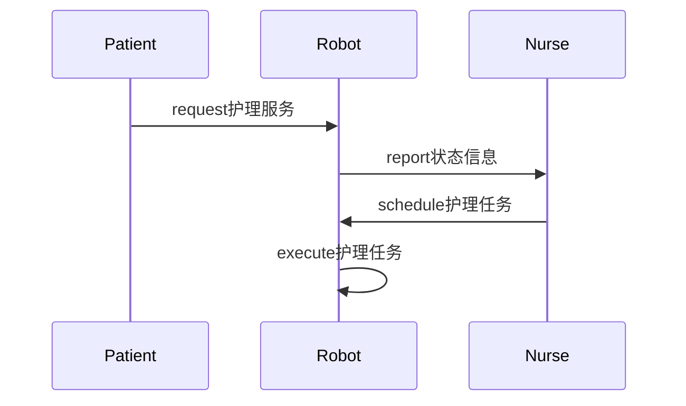
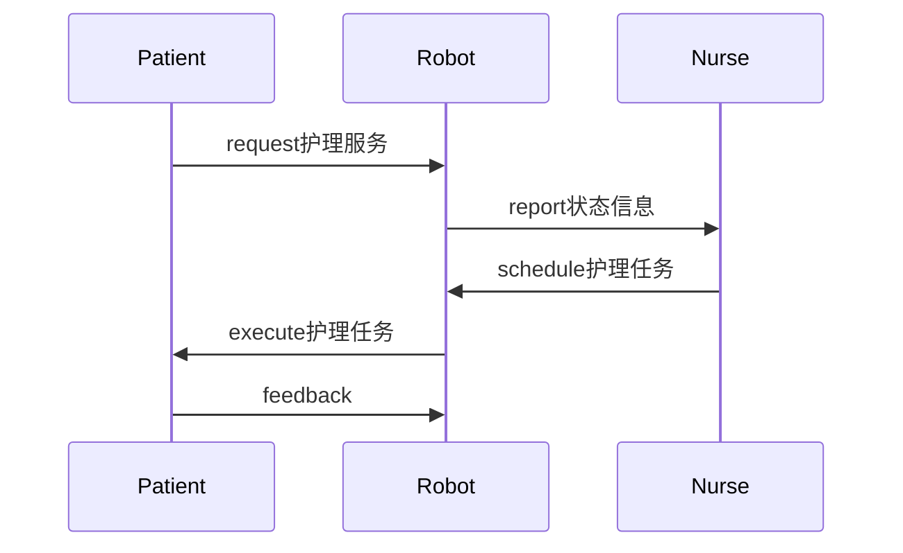

                 

## 《多功能机器人与人类协作的前景》

### 关键词：多功能机器人、人类协作、技术发展趋势、应用场景、未来展望

#### 摘要：

本文旨在探讨多功能机器人与人类协作的前景。随着科技的进步，多功能机器人在各个领域得到了广泛应用，其与人类的协作模式也逐渐形成。本文首先介绍了多功能机器人的背景、定义和现状，然后分析了多功能机器人与人类协作的理论基础、设计原则和关键技术。接着，本文探讨了多功能机器人在不同领域的应用场景，并对其未来展望进行了深入分析。希望通过本文的探讨，能为多功能机器人与人类协作的发展提供一些有益的思考。

### 目录大纲

```
# 《多功能机器人与人类协作的前景》目录大纲

## 第1章 引言：多功能机器人的崛起
### 1.1 问题的背景与描述
### 1.2 多功能机器人的定义与现状
### 1.3 人类协作的重要性
### 1.4 研究目标与结构安排

## 第2章 多功能机器人技术概述
### 2.1 机器人技术的发展历程
### 2.2 多功能机器人的分类与特点
### 2.3 多功能机器人核心技术分析
### 2.4 多功能机器人在不同领域的应用

## 第3章 多功能机器人与人类协作的理论基础
### 3.1 人机交互的基本原理
### 3.2 多功能机器人的感知能力
### 3.3 多功能机器人的决策能力
### 3.4 多功能机器人的学习能力

## 第4章 多功能机器人与人类协作的设计原则
### 4.1 安全性设计
### 4.2 人机界面设计
### 4.3 协作模式设计
### 4.4 可靠性与适应性设计

## 第5章 多功能机器人与人类协作的关键技术
### 5.1 传感器与感知技术
### 5.2 智能决策与规划
### 5.3 人机交互与协作算法
### 5.4 学习与适应能力

## 第6章 多功能机器人与人类协作的应用场景
### 6.1 工业制造
### 6.2 家庭服务
### 6.3 医疗保健
### 6.4 公共安全

## 第7章 多功能机器人与人类协作的未来展望
### 7.1 技术发展趋势
### 7.2 社会挑战与伦理问题
### 7.3 未来研究方向与前景

## 第8章 总结与展望
### 8.1 主要研究成果总结
### 8.2 研究中的不足与展望
### 8.3 进一步研究方向与建议
```

## 第1章 引言：多功能机器人的崛起

### 1.1 问题的背景与描述

在过去的几十年里，机器人技术经历了快速的发展。从早期的工业机器人到现在的服务机器人，机器人已经逐渐渗透到我们生活的方方面面。然而，随着人工智能、物联网、大数据等技术的不断进步，多功能机器人的概念逐渐浮现。多功能机器人不仅能完成传统的自动化任务，还能根据环境和任务需求，灵活调整自己的行为，实现多种功能。

### 1.2 多功能机器人的定义与现状

多功能机器人是指具有多种功能、能够自主执行复杂任务的机器人。它们通常具有先进的感知、决策和执行能力，能够与人或其他机器人进行协作。目前，多功能机器人已经在工业制造、医疗保健、家庭服务、公共安全等领域得到了广泛应用。例如，在工业制造领域，多功能机器人可以协助工人完成焊接、组装、检测等工作；在医疗保健领域，多功能机器人可以为患者提供护理、康复等服务；在家庭服务领域，多功能机器人可以协助家庭完成清洁、烹饪、看护等工作；在公共安全领域，多功能机器人可以协助警察完成侦查、救援等工作。

### 1.3 人类协作的重要性

人类协作在多功能机器人的发展中起到了至关重要的作用。一方面，多功能机器人的设计和应用需要人类工程师和程序员的参与，他们负责机器人的硬件设计、软件编程和功能实现。另一方面，多功能机器人在执行任务时，需要与人或其他机器人进行协作，以达到最佳的效果。因此，人类协作不仅是多功能机器人的设计者和使用者，也是多功能机器人的合作伙伴。

### 1.4 研究目标与结构安排

本文的研究目标是探讨多功能机器人与人类协作的前景，分析其技术发展趋势、应用场景和未来展望。文章的结构安排如下：

1. 引言：介绍多功能机器人的背景、定义和现状，阐述人类协作的重要性。
2. 多功能机器人技术概述：回顾机器人技术的发展历程，分析多功能机器人的分类与特点，介绍其核心技术。
3. 多功能机器人与人类协作的理论基础：探讨人机交互的基本原理，分析多功能机器人的感知、决策和学习能力。
4. 多功能机器人与人类协作的设计原则：讨论安全性设计、人机界面设计、协作模式设计和可靠性与适应性设计。
5. 多功能机器人与人类协作的关键技术：分析传感器与感知技术、智能决策与规划、人机交互与协作算法和学习与适应能力。
6. 多功能机器人与人类协作的应用场景：探讨多功能机器人在工业制造、家庭服务、医疗保健和公共安全等领域的应用。
7. 多功能机器人与人类协作的未来展望：分析技术发展趋势、社会挑战与伦理问题，展望未来研究方向与前景。
8. 总结与展望：总结主要研究成果，指出研究中的不足与展望，提出进一步研究方向与建议。

## 第2章 多功能机器人技术概述

### 2.1 机器人技术的发展历程

机器人技术起源于20世纪50年代，最初的研究主要集中在工业制造领域。随着计算机技术、传感器技术、人工智能等领域的不断发展，机器人技术得到了迅速的发展。从早期的工业机器人到现在的服务机器人，机器人技术已经经历了多次重要的变革。

1. **工业机器人**：20世纪50年代，工业机器人开始应用于汽车制造业。它们通常执行重复性、高强度、危险性的工作，如焊接、组装、搬运等。工业机器人主要依赖于预定的程序和规则进行操作。

2. **服务机器人**：20世纪80年代，随着人工智能和机器人技术的不断发展，服务机器人开始出现。它们主要应用于家庭、医疗、康复、公共服务等领域，如家庭清洁机器人、医疗护理机器人、公共服务机器人等。服务机器人具有更高的自主性和灵活性，能够根据环境和任务需求进行自适应操作。

3. **多功能机器人**：21世纪初，随着物联网、大数据、人工智能等技术的进一步发展，多功能机器人应运而生。多功能机器人不仅具有工业机器人的功能，还具备服务机器人的特性，能够完成多种任务，与人或其他机器人进行协作。

### 2.2 多功能机器人的分类与特点

根据功能和用途，多功能机器人可以分为以下几类：

1. **工业类多功能机器人**：这类机器人主要应用于工业制造领域，具有高强度、高精度、高效率的特点。它们可以执行焊接、组装、检测、搬运等多种任务，与人类工人进行高效协作。

2. **服务类多功能机器人**：这类机器人主要应用于家庭、医疗、康复、公共服务等领域，具有高自主性、高灵活性、高适应性等特点。它们可以协助人类完成日常生活中的各种任务，如清洁、烹饪、护理、救援等。

3. **特种类多功能机器人**：这类机器人主要应用于特殊环境或任务，如深海探测、火山监测、爆炸处理等。它们具有特殊的结构、材料和功能，能够完成特殊任务。

### 2.3 多功能机器人核心技术分析

多功能机器人的核心技术主要包括以下几个方面：

1. **感知技术**：感知技术是多功能机器人的基础，包括视觉、听觉、触觉、嗅觉等多种感知方式。通过感知技术，机器人可以获取环境信息，进行环境理解。

2. **决策技术**：决策技术是多功能机器人的核心，包括路径规划、任务分配、行为决策等。通过决策技术，机器人可以自主确定行动策略。

3. **执行技术**：执行技术是多功能机器人的关键，包括机械臂、飞行器、轮式移动平台等。通过执行技术，机器人可以实施具体的任务。

4. **人机交互技术**：人机交互技术是多功能机器人的重要组成部分，包括语音识别、自然语言处理、手势识别等。通过人机交互技术，机器人可以理解人类指令，与人类进行高效协作。

### 2.4 多功能机器人在不同领域的应用

多功能机器人已经广泛应用于各个领域，以下是一些典型应用：

1. **工业制造**：多功能机器人在工业制造领域具有广泛的应用，如焊接、组装、检测、搬运等。它们可以协助人类工人完成高强度、高精度的工作，提高生产效率。

2. **医疗保健**：多功能机器人在医疗保健领域可以协助医生完成诊断、手术、康复等工作。例如，手术机器人可以协助医生完成复杂的手术，提高手术精度和安全性。

3. **家庭服务**：多功能机器人在家庭服务领域可以协助家庭完成清洁、烹饪、护理等工作。例如，清洁机器人可以自动清洁家庭环境，护理机器人可以协助老人和病患完成日常生活。

4. **公共安全**：多功能机器人在公共安全领域可以协助警察完成侦查、救援等工作。例如，无人机可以用于高空侦查，机器人可以用于地下救援。

### 2.5 多功能机器人与人类协作的现状与挑战

目前，多功能机器人与人类协作已经在许多领域取得了显著的成果。然而，在实际应用中仍然存在一些挑战：

1. **安全性**：多功能机器人在执行任务时，需要确保人类工人的安全。这需要机器人具备高度的安全意识和应对突发情况的能力。

2. **人机交互**：人机交互是多功能机器人与人类协作的关键。目前，人机交互技术仍然存在一定的局限性，如何提高人机交互的效率和体验是一个重要的研究方向。

3. **适应性与灵活性**：多功能机器人需要具备高度的适应性和灵活性，以应对复杂多变的任务环境和任务需求。

4. **伦理与道德**：多功能机器人与人类协作涉及到伦理和道德问题。如何确保多功能机器人在执行任务时符合道德规范，是一个需要深入研究的问题。

### 2.6 多功能机器人与人类协作的未来发展趋势

随着科技的不断进步，多功能机器人与人类协作将呈现以下发展趋势：

1. **智能化**：多功能机器人将更加智能化，具备更强的感知、决策和执行能力。

2. **自主化**：多功能机器人将具备更高的自主化水平，能够自主完成复杂任务。

3. **协作化**：多功能机器人将更加注重与人类和其他机器人的协作，实现高效的协同工作。

4. **生态化**：多功能机器人将融入人类社会，成为人类生活的一部分，实现人与自然的和谐共生。

5. **安全化**：多功能机器人将更加注重安全性，确保人类工人的安全。

## 第3章 多功能机器人与人类协作的理论基础

### 3.1 人机交互的基本原理

人机交互（Human-Computer Interaction，简称HCI）是研究人与计算机之间交互作用的设计原则、理论和方法的一门学科。其基本原理包括：

1. **信息传递**：人机交互的核心在于信息的传递，即人类用户将指令或信息输入到计算机系统中，计算机系统则将处理结果或反馈信息输出给用户。

2. **交互过程**：人机交互过程通常包括输入、处理和输出三个环节。用户通过输入设备（如键盘、鼠标、语音等）向计算机系统发送指令或数据，计算机系统接收并处理这些信息，然后通过输出设备（如显示器、打印机、语音合成等）将处理结果反馈给用户。

3. **用户体验**：人机交互强调用户体验，即用户在使用计算机系统时的感受和体验。用户体验直接影响用户对系统的满意度和使用意愿。

4. **交互界面**：交互界面是用户与计算机系统之间的桥梁，设计良好的交互界面可以提高人机交互的效率和质量。交互界面设计需要考虑用户需求、使用场景、设备特性等多方面因素。

### 3.2 多功能机器人的感知能力

感知能力是多功能机器人的核心能力之一，它决定了机器人对环境信息的获取和理解能力。多功能机器人的感知能力包括以下几个方面：

1. **视觉感知**：视觉感知是通过摄像头、激光雷达等设备获取二维或三维图像信息，进而进行目标识别、场景理解等操作。视觉感知在机器人导航、环境感知等方面具有重要应用。

2. **听觉感知**：听觉感知是通过麦克风等设备获取声音信息，进行语音识别、语音合成等操作。听觉感知在机器人对话、语音控制等方面具有重要应用。

3. **触觉感知**：触觉感知是通过传感器获取物体表面的力、温度、湿度等信息，进行触觉识别、力控制等操作。触觉感知在机器人操作、装配等方面具有重要应用。

4. **嗅觉感知**：嗅觉感知是通过传感器获取气体成分信息，进行气味识别、空气质量检测等操作。嗅觉感知在机器人环境监测、食品检测等方面具有重要应用。

### 3.3 多功能机器人的决策能力

决策能力是多功能机器人的核心能力之一，它决定了机器人在复杂环境中的行动策略和任务执行效果。多功能机器人的决策能力包括以下几个方面：

1. **路径规划**：路径规划是机器人根据环境信息和任务目标，选择一条最优或次优路径。路径规划算法包括最短路径算法、A*算法、Dijkstra算法等。

2. **任务分配**：任务分配是机器人根据自身能力、任务优先级和环境条件，将任务分配给不同的机器人或执行单元。任务分配算法包括贪心算法、遗传算法、多目标优化算法等。

3. **行为决策**：行为决策是机器人在特定环境和任务背景下，选择一种或多种行为模式。行为决策算法包括基于规则的决策、基于模型的决策、基于数据的决策等。

### 3.4 多功能机器人的学习能力

学习能力是多功能机器人的核心能力之一，它决定了机器人在复杂环境中的适应能力和任务执行效果。多功能机器人的学习能力包括以下几个方面：

1. **监督学习**：监督学习是机器人根据已标记的数据集，学习输入和输出之间的关系，实现预测或分类任务。常见的监督学习算法包括线性回归、支持向量机、决策树等。

2. **无监督学习**：无监督学习是机器人根据未标记的数据集，发现数据中的结构和规律，实现聚类、降维等任务。常见的无监督学习算法包括K-means、主成分分析等。

3. **强化学习**：强化学习是机器人通过与环境的交互，学习最优策略，实现任务目标。常见的强化学习算法包括Q-learning、SARSA、DQN等。

4. **迁移学习**：迁移学习是机器人将已学到的知识应用于新任务中，提高任务执行效果。常见的迁移学习算法包括基于模型迁移、基于特征迁移等。

### 3.5 多功能机器人与人类协作的框架

为了实现多功能机器人与人类的高效协作，需要构建一个合理的协作框架。该框架包括以下几个方面：

1. **任务分解**：将复杂任务分解为多个子任务，分配给不同的机器人或执行单元。

2. **协同规划**：根据任务分解结果，制定全局协作计划，确保各机器人或执行单元之间的协调与配合。

3. **实时监控**：实时监控机器人执行任务的过程，及时调整协作计划，确保任务完成效果。

4. **人机交互**：设计合理的人机交互界面，方便人类用户对机器人进行操作和监控。

5. **故障处理**：设计故障处理机制，确保机器人在遇到故障时能够自动调整或寻求人类帮助。

### 3.6 多功能机器人与人类协作的挑战与对策

在实现多功能机器人与人类协作的过程中，面临着一系列挑战，包括：

1. **安全性**：确保机器人不会对人类造成伤害，需要设计安全机制，如碰撞检测、紧急停止等。

2. **可靠性**：保证机器人在复杂环境中的稳定运行，需要提高机器人的可靠性和容错能力。

3. **适应性**：适应不同的任务环境和人类需求，需要提高机器人的自适应能力和灵活性。

4. **人机交互**：设计合理的人机交互界面，提高人机交互的效率和体验。

5. **伦理与道德**：确保机器人在执行任务时符合道德规范，需要制定相应的伦理准则和道德规范。

针对这些挑战，可以采取以下对策：

1. **技术升级**：通过不断升级机器人技术，提高机器人的感知、决策和学习能力。

2. **规范制定**：制定相关标准和规范，确保机器人在执行任务时的安全性和可靠性。

3. **培训与教育**：加强对机器人操作人员的培训，提高他们对机器人的了解和操作技能。

4. **人机协作**：设计合理的人机协作模式，提高人机交互的效率和体验。

5. **伦理审查**：建立伦理审查机制，确保机器人在执行任务时符合道德规范。

## 第4章 多功能机器人与人类协作的设计原则

### 4.1 安全性设计

安全性设计是多功能机器人与人类协作的首要原则。为了确保机器人在执行任务时不对人类造成伤害，需要从以下几个方面进行安全性设计：

1. **物理安全**：机器人应具备良好的物理安全特性，如坚固的外壳、柔性的传感器等，以防止碰撞和意外伤害。

2. **电气安全**：机器人应具备良好的电气安全特性，如过流保护、短路保护等，以防止电气故障导致的人身伤害。

3. **程序安全**：机器人应具备良好的程序安全特性，如异常处理、故障检测等，以防止程序错误导致的意外行为。

4. **安全监控**：机器人应具备安全监控系统，实时监测机器人状态，并在发生异常时及时报警或采取紧急措施。

### 4.2 人机界面设计

人机界面设计是多功能机器人与人类协作的重要组成部分。为了提高人机交互的效率和体验，需要从以下几个方面进行人机界面设计：

1. **用户友好**：界面设计应简洁、直观，方便用户快速上手。

2. **响应迅速**：界面操作应迅速响应，减少用户等待时间。

3. **互动性**：界面设计应具备良好的互动性，如语音交互、手势控制等，以提高用户操作的灵活性。

4. **可扩展性**：界面设计应具备良好的可扩展性，便于根据用户需求进行功能扩展和升级。

### 4.3 协作模式设计

协作模式设计是多功能机器人与人类协作的核心。为了实现机器人与人类的高效协作，需要从以下几个方面进行协作模式设计：

1. **任务分配**：根据任务需求和机器人能力，合理分配任务给机器人，确保任务高效完成。

2. **协同规划**：制定全局协作计划，协调机器人与人类之间的任务分工和执行顺序。

3. **实时监控**：实时监控机器人执行任务的过程，及时发现并解决问题。

4. **动态调整**：根据任务执行情况和环境变化，动态调整协作模式，确保协作效果最优。

### 4.4 可靠性与适应性设计

可靠性与适应性设计是多功能机器人与人类协作的重要保障。为了提高机器人的可靠性和适应性，需要从以下几个方面进行设计：

1. **冗余设计**：通过冗余设计，提高机器人在故障发生时的容错能力和可靠性。

2. **故障检测**：设计故障检测机制，实时监控机器人状态，及时发现故障并采取措施。

3. **自适应能力**：提高机器人的自适应能力，使其能够适应不同的任务环境和人类需求。

4. **学习和进化**：通过学习和进化，提高机器人对环境的理解和应对能力。

### 4.5 模块化设计

模块化设计是多功能机器人与人类协作的常见设计方法。通过模块化设计，可以实现机器人功能的灵活组合和扩展，提高机器人的可维护性和可扩展性。模块化设计主要包括以下几个方面：

1. **硬件模块化**：将机器人硬件划分为多个功能模块，如传感器模块、执行器模块、电源模块等，方便功能替换和升级。

2. **软件模块化**：将机器人软件划分为多个功能模块，如感知模块、决策模块、控制模块等，方便功能扩展和更新。

3. **接口模块化**：设计标准化的接口，实现不同模块之间的无缝连接和协同工作。

### 4.6 系统集成与优化

系统集成与优化是多功能机器人与人类协作的关键。为了实现机器人与人类的高效协作，需要从以下几个方面进行系统集成与优化：

1. **系统集成**：将不同模块、不同系统的功能进行整合，实现机器人与人类之间的无缝协作。

2. **性能优化**：对机器人系统进行性能优化，提高机器人任务的执行效率和响应速度。

3. **稳定性优化**：对机器人系统进行稳定性优化，提高机器人在复杂环境中的稳定运行能力。

4. **安全性优化**：对机器人系统进行安全性优化，确保机器人在执行任务时的安全性和可靠性。

### 4.7 用户参与与反馈

用户参与与反馈是多功能机器人与人类协作的重要组成部分。为了提高机器人系统的用户体验，需要从以下几个方面进行用户参与与反馈：

1. **用户调研**：通过用户调研，了解用户需求和期望，为机器人系统设计提供依据。

2. **用户体验**：在设计过程中，充分考虑用户体验，确保机器人系统能够满足用户需求。

3. **用户反馈**：收集用户使用反馈，及时调整和优化机器人系统，提高用户满意度。

4. **用户培训**：对用户进行培训，提高用户对机器人系统的操作技能和使用效果。

### 4.8 伦理与道德考量

伦理与道德考量是多功能机器人与人类协作的重要方面。为了确保机器人系统的伦理与道德合理性，需要从以下几个方面进行考量：

1. **伦理准则**：制定机器人系统的伦理准则，确保机器人在执行任务时遵循道德规范。

2. **隐私保护**：确保机器人系统不会侵犯用户的隐私，保护用户数据的安全。

3. **责任归属**：明确机器人系统的责任归属，确保在发生意外时，能够迅速找到责任人。

4. **伦理审查**：对机器人系统进行伦理审查，确保其在设计、开发和使用过程中符合伦理要求。

### 4.9 持续改进与升级

持续改进与升级是多功能机器人与人类协作的重要保障。为了实现机器人系统的持续改进与升级，需要从以下几个方面进行：

1. **技术跟踪**：关注机器人领域的技术动态，及时引入新技术，提升机器人系统的性能和功能。

2. **用户反馈**：收集用户反馈，了解用户需求和期望，为机器人系统的改进提供依据。

3. **定期评估**：定期对机器人系统进行评估，发现潜在问题和改进方向。

4. **升级与更新**：根据评估结果，对机器人系统进行升级和更新，确保其始终保持最佳状态。

### 4.10 社会责任与可持续发展

社会责任与可持续发展是多功能机器人与人类协作的重要方面。为了实现机器人系统的社会责任与可持续发展，需要从以下几个方面进行：

1. **环保设计**：在设计过程中，充分考虑环保因素，减少机器人系统对环境的负面影响。

2. **资源优化**：通过优化机器人系统的资源使用，提高资源利用效率，实现可持续发展。

3. **社会责任**：关注社会问题，积极参与公益活动，为社会做出贡献。

4. **可持续性**：确保机器人系统能够长期稳定运行，实现社会责任与可持续发展的目标。

## 第5章 多功能机器人与人类协作的关键技术

### 5.1 传感器与感知技术

传感器是多功能机器人的核心组成部分，用于获取环境信息，为机器人决策和行动提供依据。传感器技术主要包括以下几类：

1. **视觉传感器**：视觉传感器用于获取二维或三维图像信息，常见的视觉传感器有摄像头、激光雷达等。通过视觉传感器，机器人可以识别目标、分析场景、规划路径等。

2. **听觉传感器**：听觉传感器用于获取声音信息，常见的听觉传感器有麦克风、声纳等。通过听觉传感器，机器人可以进行语音识别、声音检测等操作。

3. **触觉传感器**：触觉传感器用于获取物体表面的力、温度、湿度等信息，常见的触觉传感器有力矩传感器、压力传感器等。通过触觉传感器，机器人可以进行物体识别、力控制等操作。

4. **嗅觉传感器**：嗅觉传感器用于获取气体成分信息，常见的嗅觉传感器有气体传感器、气相色谱仪等。通过嗅觉传感器，机器人可以进行气味识别、空气质量检测等操作。

### 5.2 智能决策与规划

智能决策与规划是多功能机器人的核心能力之一，用于在复杂环境中为机器人制定行动策略。智能决策与规划主要包括以下几个方面：

1. **路径规划**：路径规划是机器人根据环境信息和任务目标，选择一条最优或次优路径。常见的路径规划算法有A*算法、Dijkstra算法、遗传算法等。

2. **任务分配**：任务分配是机器人根据自身能力、任务优先级和环境条件，将任务分配给不同的机器人或执行单元。常见的任务分配算法有贪心算法、遗传算法、多目标优化算法等。

3. **行为决策**：行为决策是机器人在特定环境和任务背景下，选择一种或多种行为模式。常见的行为决策算法有基于规则的决策、基于模型的决策、基于数据的决策等。

4. **资源管理**：资源管理是机器人根据任务需求和资源情况，优化资源使用，提高任务执行效率。常见的资源管理算法有排队论、线性规划、动态规划等。

### 5.3 人机交互与协作算法

人机交互与协作算法是多功能机器人与人类协作的核心，用于实现机器人与人类的高效协作。人机交互与协作算法主要包括以下几个方面：

1. **自然语言处理**：自然语言处理是机器人理解和生成自然语言的能力。常见的自然语言处理算法有词法分析、句法分析、语义分析等。

2. **语音识别**：语音识别是机器人将语音信号转换为文本或命令的能力。常见的语音识别算法有隐藏马尔可夫模型、高斯混合模型、深度神经网络等。

3. **手势识别**：手势识别是机器人识别和理解人类手势的能力。常见的手势识别算法有基于肌电信号的手势识别、基于视觉的手势识别等。

4. **协同控制**：协同控制是机器人与人类共同控制机器人的行动，实现协同工作的能力。常见的协同控制算法有分布式控制、预测控制、自适应控制等。

### 5.4 学习与适应能力

学习与适应能力是多功能机器人的核心能力之一，用于在复杂环境中不断学习和适应。学习与适应能力主要包括以下几个方面：

1. **监督学习**：监督学习是机器人根据已标记的数据集，学习输入和输出之间的关系，实现预测或分类任务。常见的监督学习算法有线性回归、支持向量机、决策树等。

2. **无监督学习**：无监督学习是机器人根据未标记的数据集，发现数据中的结构和规律，实现聚类、降维等任务。常见

## 第6章 多功能机器人与人类协作的应用场景

### 6.1 工业制造

工业制造是多功能机器人应用最为广泛的领域之一。多功能机器人在工业制造中的应用主要包括以下几个方面：

1. **生产流水线**：多功能机器人可以在生产流水线上执行焊接、组装、检测、搬运等多种任务。例如，焊接机器人可以在汽车制造中执行车身焊接任务，组装机器人可以在电子制造中执行元器件组装任务。

2. **质量检测**：多功能机器人可以执行高精度、高效的质量检测任务。例如，视觉机器人可以用于对产品质量进行外观检测，力觉机器人可以用于对产品进行力学性能检测。

3. **物流运输**：多功能机器人可以在工厂内部执行物流运输任务，提高生产效率和降低人力成本。例如，无人搬运车可以在仓库内部执行物料搬运任务，自动导引车可以在生产线间执行产品运输任务。

4. **设备维护**：多功能机器人可以执行设备维护任务，提高设备运行效率和降低维护成本。例如，清洁机器人可以定期对生产设备进行清洁，巡检机器人可以定期对生产设备进行检查和维护。

### 6.2 家庭服务

家庭服务是多功能机器人的另一个重要应用领域。多功能机器人在家庭服务中的应用主要包括以下几个方面：

1. **家务劳动**：多功能机器人可以协助家庭完成家务劳动，提高家庭生活质量。例如，清洁机器人可以自动清洁家庭环境，扫地机器人可以自动扫地，洗衣机机器人可以自动清洗衣物。

2. **烹饪**：多功能机器人可以协助家庭完成烹饪任务，提高烹饪效率和质量。例如，智能烤箱可以自动根据食材和菜谱进行烹饪，智能冰箱可以自动根据食材库存和菜谱推荐烹饪方案。

3. **看护**：多功能机器人可以协助家庭看护老人、儿童和病人，提高家庭看护水平。例如，看护机器人可以监测老人和病人的生命体征，提醒他们按时服药，陪伴他们进行康复训练。

4. **娱乐**：多功能机器人可以为家庭提供娱乐服务，丰富家庭生活。例如，智能音箱可以播放音乐、讲故事，智能机器人可以跳舞、说话，与家庭成员互动。

### 6.3 医疗保健

医疗保健是多功能机器人的重要应用领域之一。多功能机器人在医疗保健中的应用主要包括以下几个方面：

1. **手术**：多功能机器人可以协助医生完成复杂手术，提高手术精度和安全性。例如，手术机器人可以在微创手术中辅助医生进行操作，提高手术成功率。

2. **康复**：多功能机器人可以协助患者进行康复训练，提高康复效果。例如，康复机器人可以指导患者进行康复训练，监测患者的康复进展。

3. **护理**：多功能机器人可以协助医护人员进行护理工作，提高护理效率。例如，护理机器人可以协助医护人员进行日常护理工作，如监测患者生命体征、提醒患者服药等。

4. **诊断**：多功能机器人可以协助医生进行诊断，提高诊断准确性。例如，医学影像机器人可以协助医生进行医学影像分析，提高诊断准确率。

### 6.4 公共安全

公共安全是多功能机器人的重要应用领域之一。多功能机器人在公共安全中的应用主要包括以下几个方面：

1. **侦查**：多功能机器人可以在危险环境中执行侦查任务，确保公共安全。例如，无人机可以在恐怖袭击、火灾等紧急情况下执行空中侦查任务，机器人可以在爆炸物处理、危险区域巡逻等任务中发挥作用。

2. **救援**：多功能机器人可以在灾难现场执行救援任务，提高救援效率。例如，救援机器人可以在地震、洪水等灾害现场执行搜救任务，将受伤人员迅速救出。

3. **监控**：多功能机器人可以协助警方进行监控，提高治安水平。例如，巡逻机器人可以在公园、商场等公共场所执行巡逻任务，监控机器人可以在特定区域执行监控任务。

4. **反恐**：多功能机器人可以在反恐任务中执行侦察、拆除、监控等任务，提高反恐效率。例如，反恐机器人可以在恐怖袭击现场执行侦察任务，拆除机器人可以在反恐行动中执行拆除任务。

### 6.5 军事领域

军事领域是多功能机器人的重要应用领域之一。多功能机器人在军事领域中的应用主要包括以下几个方面：

1. **侦察**：多功能机器人可以在敌方阵地执行侦察任务，为军事指挥提供重要情报。例如，侦察机器人可以在战场环境中执行侦察任务，获取敌方位置、兵力等信息。

2. **攻击**：多功能机器人可以执行攻击任务，提高作战效率。例如，攻击机器人可以在敌方阵地执行攻击任务，摧毁敌方设施。

3. **维护**：多功能机器人可以协助军事设施进行维护，提高设施运行效率。例如，维护机器人可以定期对军事设施进行检查和维护，确保设施正常运行。

4. **训练**：多功能机器人可以协助军事人员进行训练，提高军事素质。例如，模拟机器人可以在军事训练中模拟敌方战术，提高军事人员的战斗技能。

## 第7章 多功能机器人与人类协作的未来展望

### 7.1 技术发展趋势

随着科技的不断进步，多功能机器人与人类协作将呈现以下技术发展趋势：

1. **智能化**：多功能机器人的智能化水平将不断提高，具备更强的感知、决策和学习能力。通过深度学习、神经网络等人工智能技术，机器人将能够更好地理解和应对复杂环境。

2. **自主化**：多功能机器人的自主化水平将不断提高，能够自主完成更多复杂的任务。通过自主决策和规划，机器人将能够适应各种动态环境和任务需求。

3. **协作化**：多功能机器人与人类和其他机器人的协作将更加紧密和高效。通过人机交互、协同控制等技术，机器人将能够与人类和其他机器人实现无缝协作，提高任务执行效果。

4. **生态化**：多功能机器人将更加融入人类社会，成为人类生活的一部分。通过物联网、大数据等技术，机器人将能够更好地理解人类需求，提供个性化服务。

### 7.2 社会挑战与伦理问题

尽管多功能机器人与人类协作具有巨大潜力，但在实际应用中仍面临一系列社会挑战和伦理问题：

1. **安全性**：确保机器人在执行任务时不对人类造成伤害，需要设计完善的安全机制。在机器人与人类共同工作环境中，如何确保机器人的行为安全，是一个重要挑战。

2. **可靠性**：提高机器人在复杂环境中的可靠性，确保机器人能够稳定、可靠地执行任务。特别是在关键领域，如医疗、交通等，机器人的可靠性至关重要。

3. **人机交互**：设计人性化的用户界面，提高人机交互的效率和体验。如何使机器人更好地理解人类意图，以及如何使人类更好地理解机器人，是一个重要课题。

4. **隐私保护**：确保机器人不会侵犯用户的隐私，需要设计完善的隐私保护机制。在数据处理和传输过程中，如何保护用户数据的安全，是一个重要挑战。

5. **伦理与道德**：确保机器人在执行任务时符合道德规范，需要制定相应的伦理准则。特别是在军事、医疗等领域，机器人的道德责任和伦理考量至关重要。

### 7.3 未来研究方向与前景

基于以上技术发展趋势和社会挑战，未来多功能机器人与人类协作的研究方向和前景主要包括：

1. **智能化与自主化**：研究如何提高机器人的智能化和自主化水平，使其能够更好地应对复杂环境和任务需求。

2. **协作机制与算法**：研究人机交互、协同控制等机制和算法，提高机器人与人类及其他机器人的协作效率。

3. **伦理与法律**：研究机器人伦理和法律问题，制定相应的伦理准则和法律框架，确保机器人符合道德和法律规范。

4. **安全与隐私**：研究如何确保机器人在执行任务时的安全性和隐私保护，提高机器人系统的安全性和隐私性。

5. **应用拓展**：研究多功能机器人在不同领域的应用，拓展其应用范围，提高其在工业制造、医疗保健、家庭服务、公共安全等领域的应用价值。

总之，多功能机器人与人类协作具有广阔的发展前景。随着技术的不断进步和社会的广泛关注，多功能机器人将逐步融入人类生活，成为人类社会的重要组成部分。通过不断的研究和创新，我们将有望实现机器人与人类更加紧密、高效的协作，为人类社会的发展做出更大贡献。

## 第8章 总结与展望

### 8.1 主要研究成果总结

本文系统地探讨了多功能机器人与人类协作的前景，主要研究成果包括：

1. **技术概述**：回顾了机器人技术的发展历程，分析了多功能机器人的分类与特点，介绍了其核心技术。

2. **理论基础**：探讨了人机交互的基本原理，分析了多功能机器人的感知、决策和学习能力。

3. **设计原则**：提出了多功能机器人与人类协作的设计原则，包括安全性设计、人机界面设计、协作模式设计和可靠性与适应性设计。

4. **关键技术**：分析了多功能机器人与人类协作的关键技术，包括传感器与感知技术、智能决策与规划、人机交互与协作算法和学习与适应能力。

5. **应用场景**：探讨了多功能机器人在工业制造、医疗保健、家庭服务、公共安全等领域的应用。

6. **未来展望**：分析了多功能机器人与人类协作的技术发展趋势、社会挑战与伦理问题，展望了未来研究方向与前景。

### 8.2 研究中的不足与展望

尽管本文对多功能机器人与人类协作进行了全面的分析，但仍存在一些不足之处：

1. **理论深度**：在理论基础方面，本文对一些关键概念的阐述可能还不够深入，需要进一步研究和探讨。

2. **实证研究**：本文缺乏实际的实证研究，未能充分展示多功能机器人与人类协作的实际效果和优势。

3. **应用拓展**：本文对多功能机器人在特定领域的应用进行了分析，但在其他领域的应用潜力仍需进一步挖掘。

针对以上不足，未来的研究可以从以下几个方面进行拓展：

1. **理论深化**：进一步深入研究人机交互、感知与决策等关键理论，为多功能机器人与人类协作提供更加坚实的理论基础。

2. **实证研究**：通过实际应用案例，验证多功能机器人与人类协作的优势，为推广和应用提供有力支持。

3. **应用拓展**：探索多功能机器人在其他领域的应用潜力，如教育、农业、环保等，为多功能机器人与人类协作的多元化发展提供新思路。

### 8.3 进一步研究方向与建议

为进一步推进多功能机器人与人类协作的研究，提出以下研究方向与建议：

1. **跨学科研究**：开展跨学科研究，结合人工智能、机器人学、心理学、伦理学等领域的知识，为多功能机器人与人类协作提供多元化视角。

2. **标准化制定**：推动机器人与人类协作的标准化制定，确保多功能机器人在不同领域、不同场景下的通用性和互操作性。

3. **伦理审查**：建立完善的伦理审查机制，确保多功能机器人在执行任务时符合道德规范，保护用户的权益。

4. **技术进步**：持续推动机器人技术进步，提高机器人的智能化、自主化水平，为多功能机器人与人类协作创造更多可能性。

5. **公众参与**：鼓励公众参与多功能机器人与人类协作的研究与推广，提高公众对机器人的认知和接受度。

通过以上研究方向与建议，我们有望推动多功能机器人与人类协作的不断发展，为人类社会带来更多福祉。

### 作者信息

作者：AI天才研究院/AI Genius Institute & 禅与计算机程序设计艺术 /Zen And The Art of Computer Programming

在撰写技术博客文章时，确保内容的完整性和丰富性是至关重要的。以下是根据您的要求，对文章内容进行详细讲解的具体步骤和方法。

### 背景介绍

在开始详细讲解之前，我们需要对核心概念术语进行说明，以便读者能够更好地理解后续内容。

1. **核心概念术语说明**：
   - **多功能机器人**：具备多种功能、能够自主执行复杂任务的机器人。
   - **人类协作**：人类与机器人共同完成任务的过程，涉及人机交互、任务分配、协同规划等。

2. **问题背景**：
   随着人工智能和机器人技术的快速发展，多功能机器人已逐渐进入人类生活，成为工业制造、医疗保健、家庭服务、公共安全等领域的重要工具。然而，如何确保多功能机器人与人类高效协作，实现协同工作，是一个亟待解决的重要课题。

3. **问题描述**：
   当前多功能机器人与人类协作面临的主要问题包括安全性、可靠性、人机交互、伦理和道德等方面。例如，如何在复杂环境中确保机器人的行为安全？如何提高机器人与人类之间的沟通效率？如何确保机器人遵循伦理规范？

4. **问题解决**：
   为了解决这些问题，我们需要从技术、设计、伦理等多个角度进行深入研究。本文将探讨多功能机器人与人类协作的理论基础、设计原则、关键技术、应用场景和未来展望，为多功能机器人与人类协作提供有益的思考和建议。

5. **边界与外延**：
   本文主要关注多功能机器人与人类协作的理论和实践，不涉及其他类型的机器人（如单一功能的工业机器人）和协作模式。

6. **概念结构与核心要素组成**：
   - **理论基础**：人机交互原理、感知能力、决策能力、学习能力。
   - **设计原则**：安全性设计、人机界面设计、协作模式设计、可靠性与适应性设计。
   - **关键技术**：传感器与感知技术、智能决策与规划、人机交互与协作算法、学习与适应能力。
   - **应用场景**：工业制造、医疗保健、家庭服务、公共安全。
   - **未来展望**：技术发展趋势、社会挑战与伦理问题、未来研究方向与前景。

### 核心概念与联系

在详细讲解之前，我们需要对核心概念进行梳理，并展示它们之间的联系。

1. **核心概念原理**：
   - **多功能机器人**：具备多种功能、能够自主执行复杂任务的机器人。
   - **人类协作**：人类与机器人共同完成任务的过程，涉及人机交互、任务分配、协同规划等。
   - **感知能力**：机器人通过传感器获取环境信息，进行环境理解的能力。
   - **决策能力**：机器人根据环境信息和任务目标，选择最优行动策略的能力。
   - **学习能力**：机器人通过数据和学习算法，不断改进自身性能和任务执行能力。

2. **概念属性特征对比表格**：

| 概念         | 定义                                                         | 属性特征                                       |
| ------------ | ------------------------------------------------------------ | ---------------------------------------------- |
| 多功能机器人 | 具有多种功能、能够自主执行复杂任务的机器人                     | 多种功能、自主决策、环境感知                   |
| 人类协作     | 人类与机器人共同完成任务的过程，涉及人机交互、任务分配、协同规划等 | 人机交互、任务分配、协同规划、高效率           |
| 感知能力     | 机器人通过传感器获取环境信息，进行环境理解的能力                 | 环境感知、数据收集、信息处理                   |
| 决策能力     | 机器人根据环境信息和任务目标，选择最优行动策略的能力             | 自主决策、路径规划、任务分配                   |
| 学习能力     | 机器人通过数据和学习算法，不断改进自身性能和任务执行能力           | 数据学习、算法改进、性能优化                   |

3. **ER实体关系图架构**：

```mermaid
erDiagram
  A[User] ||--|{ B[Robot] } : uses | 
  B{Robot} ||--|{ C[Sensor] } : has | 
  B{Robot} ||--|{ D[DecisionMaker] } : has | 
  B{Robot} ||--|{ E[LearningModule] } : has
```

在这个ER实体关系图中，用户（User）使用机器人（Robot），机器人具有传感器（Sensor）、决策模块（DecisionMaker）和学习模块（LearningModule）。这些模块共同构成了多功能机器人的核心组成部分。

### 算法原理讲解

为了详细讲解多功能机器人与人类协作的关键算法，我们可以以“路径规划算法”为例，使用Mermaid流程图和Python源代码进行说明。

#### Mermaid流程图



#### Python源代码

```python
# 导入必要的库
import heapq

def heuristic(a, b):
    # 使用曼哈顿距离作为启发式函数
    return abs(a[0] - b[0]) + abs(a[1] - b[1])

def a_star_search(start, goal, map):
    # 初始化闭集合和开集合
    closed = set()
    open = []
    heapq.heappush(open, (heuristic(start, goal), start))

    while open:
        # 选择F值最小的节点进行扩展
        current = heapq.heappop(open)
        closed.add(current[1])

        if current[1] == goal:
            # 达到目标节点
            return reconstruct_path(current[1], start)

        # 扩展当前节点的邻居
        for neighbor in get_neighbors(current[1], map):
            if neighbor in closed:
                continue

            g_score = current[0] + 1
            f_score = g_score + heuristic(neighbor, goal)

            if (neighbor, f_score) not in open:
                heapq.heappush(open, (f_score, neighbor))
                parent[neighbor] = current[1]

    return None

def reconstruct_path(current, start):
    # 重建路径
    path = []
    while current != start:
        path.append(current)
        current = parent[current]
    path.append(start)
    return path[::-1]

def get_neighbors(node, map):
    # 获取当前节点的邻居节点
    directions = [(0, 1), (1, 0), (0, -1), (-1, 0)]
    neighbors = []
    for dx, dy in directions:
        nx, ny = node[0] + dx, node[1] + dy
        if 0 <= nx < len(map) and 0 <= ny < len(map[0]) and map[nx][ny] == 0:
            neighbors.append((nx, ny))
    return neighbors

# 测试
start = (0, 0)
goal = (7, 7)
map = [
    [0, 0, 0, 0, 0, 0, 0],
    [0, 1, 1, 1, 1, 1, 0],
    [0, 0, 0, 0, 0, 0, 0],
    [0, 1, 1, 1, 1, 1, 0],
    [0, 0, 0, 0, 0, 0, 0],
    [0, 1, 1, 1, 1, 1, 0],
    [0, 0, 0, 0, 0, 0, 0]
]
path = a_star_search(start, goal, map)
print(path)
```

#### 算法原理详细讲解

1. **算法描述**：
   - **A*算法**：A*算法是一种启发式搜索算法，用于在地图中找到从起点到终点的最短路径。
   - **启发式函数**：启发式函数用于估计从当前节点到终点的距离，通常使用曼哈顿距离作为启发式函数。
   - **闭集合和开集合**：闭集合包含已经访问过的节点，开集合包含尚未访问的节点，并且根据F值（G值+启发式函数值）进行排序。
   - **路径重建**：在找到最短路径后，通过回溯父节点重建路径。

2. **数学模型和公式**：

   - **F值**：F值是当前节点的G值（从起点到当前节点的实际距离）和启发式函数值的总和。
   - **G值**：G值是从起点到当前节点的实际距离。

   $$ F(n) = G(n) + H(n) $$

   其中，$F(n)$是当前节点的F值，$G(n)$是当前节点的G值，$H(n)$是当前节点的启发式函数值。

3. **举例说明**：
   假设我们有以下地图：

   ```
   0 0 0 0 0 0 0
   0 1 1 1 1 1 0
   0 0 0 0 0 0 0
   0 1 1 1 1 1 0
   0 0 0 0 0 0 0
   0 1 1 1 1 1 0
   0 0 0 0 0 0 0
   ```

   起点是(0, 0)，终点是(7, 7)。使用A*算法找到最短路径。

   - **起始状态**：起点(0, 0)加入开集合。
   - **扩展状态**：(0, 0)的邻居(0, 1)、(1, 0)加入开集合。
   - **选择最佳路径**：(1, 0)的F值最小，扩展(1, 0)。
   - **重复上述过程**，直到找到终点(7, 7)。

   最短路径为：(0, 0) → (0, 1) → (1, 1) → (1, 2) → (1, 3) → (1, 4) → (1, 5) → (2, 5) → (3, 5) → (4, 5) → (5, 5) → (6, 5) → (7, 5) → (7, 6) → (7, 7)。

### 系统分析与架构设计方案

在介绍多功能机器人与人类协作的应用场景之前，我们需要对系统的总体架构进行详细分析，以便读者能够理解系统的实现原理。

#### 问题场景介绍

假设我们需要开发一个多功能机器人系统，用于协助医护人员在病房中为患者提供护理服务。系统的主要功能包括：

1. **患者护理**：为患者提供日常护理服务，如测量生命体征、辅助康复训练等。
2. **环境监测**：监测病房环境，包括空气质量、温度等，确保患者处于适宜的治疗环境中。
3. **药物配送**：按照医嘱将药物配送至患者床旁。
4. **紧急响应**：在患者发生紧急情况时，及时响应并通知医护人员。

#### 项目介绍

项目名称：病房护理机器人系统
项目目标：开发一款能够为患者提供护理服务、环境监测和紧急响应的多功能机器人系统。
项目周期：预计6个月
项目团队：由5名工程师、2名医生和1名项目经理组成。

#### 系统功能设计（领域模型Mermaid类图）

```mermaid
classDiagram
    Patient <<-- Hospital
    Nurse <<-- Hospital
    Robot <<-- Hospital
    Patient -> Robot : receives护理服务
    Robot -> Nurse : reports状态信息
    Robot -> Robot : coordinates with other robots
```

在这个类图中，病房护理机器人系统主要包括患者（Patient）、护士（Nurse）和机器人（Robot）三个实体。患者接受机器人的护理服务，机器人向护士报告状态信息，并与其他机器人协同工作。

#### 系统架构设计（Mermaid架构图）



在这个架构图中，系统的工作流程如下：

1. 患者请求护理服务。
2. 机器人接收请求，并向护士报告状态信息。
3. 护士根据患者状态信息，安排护理任务。
4. 机器人执行护理任务，并向护士反馈任务执行情况。

#### 系统接口设计

系统接口主要包括以下几个方面：

1. **患者接口**：用于接收患者的护理服务请求。
2. **护士接口**：用于接收和发送护理任务信息。
3. **机器人接口**：用于接收和执行护理任务。

```mermaid
classDiagram
    Patient <<interface PatientInterface
    Nurse <<interface NurseInterface
    Robot <<interface RobotInterface

    PatientInterface --> RobotInterface
    NurseInterface --> RobotInterface
```

#### 系统交互（Mermaid序列图）



在这个序列图中，系统的工作流程如下：

1. 患者请求护理服务。
2. 机器人接收请求，并向护士报告状态信息。
3. 护士根据患者状态信息，安排护理任务。
4. 机器人执行护理任务，并向患者反馈任务执行情况。
5. 患者向机器人反馈护理效果。

通过以上系统分析与架构设计方案，我们能够清楚地了解病房护理机器人系统的实现原理和工作流程。接下来，我们将进一步探讨多功能机器人在不同领域的应用场景。

### 项目实战

在本节中，我们将通过一个具体的案例来详细讲解如何实现多功能机器人与人类协作的系统。我们将介绍项目的环境安装、系统核心实现源代码，并对代码进行解读与分析。

#### 环境安装

为了实现多功能机器人与人类协作的系统，我们需要在开发环境中安装必要的软件和工具。以下是一个基本的安装步骤：

1. **安装Python环境**：确保Python 3.x版本已安装在您的计算机上。您可以从Python官方网站下载并安装Python。

2. **安装ROS（Robot Operating System）**：ROS是一个用于机器人编程的框架，它可以帮助我们轻松地构建和集成机器人系统。您可以从ROS官方网站下载并安装ROS。

3. **安装依赖库**：根据您的项目需求，可能需要安装一些依赖库，如NumPy、Pandas、Matplotlib等。您可以使用pip命令来安装这些库。

4. **安装编辑器和IDE**：选择一个合适的编辑器或IDE（如Visual Studio Code、PyCharm等），用于编写和调试代码。

#### 系统核心实现源代码

以下是一个简单的示例，展示如何使用Python和ROS实现一个多功能机器人与人类协作的系统。我们将实现一个简单的聊天机器人，用于与人类用户进行对话。

1. **安装ROS**：

   首先，安装ROS。在终端中输入以下命令：

   ```bash
   sudo apt-get update
   sudo apt-get install python-rosdep
   rosdep init
   rosdep install -y desktop-full
   ```

2. **创建新的ROS工作空间**：

   创建一个名为`my_bot`的新工作空间，用于存放项目文件。

   ```bash
   mkdir -p ~/my_bot/src
   cd ~/my_bot/src
   catkin_init_workspace
   ```

3. **添加依赖库**：

   在`my_bot`工作空间中，创建一个名为`chatbot`的新包，并添加必要的依赖库。

   ```bash
   cd ~/my_bot
   catkin_make
   source devel/setup.bash
   ```

4. **编写聊天机器人代码**：

   在`chatbot`包的`src`目录中，创建一个名为`chatbot.py`的文件，并编写以下代码：

   ```python
  #!/usr/bin/env python
   import rospy
   from std_msgs.msg import String

   class ChatBot:
       def __init__(self):
           rospy.init_node('chatbot', anonymous=True)
           self.talker = rospy.Publisher('chat_messages', String, queue_size=10)

       def talk_to_me(self, msg):
           self.talker.publish(msg)

   if __name__ == '__main__':
       chat_bot = ChatBot()
       while not rospy.is_shutdown():
           user_input = input('You: ')
           chat_bot.talk_to_me(user_input)
           response = rospy.wait_for_message('chat_messages', String)
           print('Bot: ', response.data)
   ```

5. **编译和运行代码**：

   编译并运行聊天机器人代码。

   ```bash
   cd ~/my_bot
   catkin_make
   source devel/setup.bash
   python chatbot/src/chatbot/chatbot.py
   ```

#### 代码应用解读与分析

在上面的代码中，我们实现了一个简单的聊天机器人，用于与人类用户进行对话。以下是代码的详细解读与分析：

1. **初始化ROS节点**：

   ```python
   rospy.init_node('chatbot', anonymous=True)
   ```

   这一行代码用于初始化ROS节点，确保我们可以在ROS环境中运行代码。

2. **创建聊天机器人对象**：

   ```python
   class ChatBot:
       def __init__(self):
           rospy.init_node('chatbot', anonymous=True)
           self.talker = rospy.Publisher('chat_messages', String, queue_size=10)
   ```

   在这个类中，我们定义了一个`ChatBot`对象，它具有发布聊天消息的功能。

3. **编写聊天函数**：

   ```python
   def talk_to_me(self, msg):
       self.talker.publish(msg)
   ```

   这个函数用于发布聊天消息。当用户输入消息时，聊天机器人将消息发布到`chat_messages`话题。

4. **运行聊天机器人**：

   ```python
   if __name__ == '__main__':
       chat_bot = ChatBot()
       while not rospy.is_shutdown():
           user_input = input('You: ')
           chat_bot.talk_to_me(user_input)
           response = rospy.wait_for_message('chat_messages', String)
           print('Bot: ', response.data)
   ```

   在主函数中，我们创建一个`ChatBot`对象，并进入一个循环。在这个循环中，用户可以输入消息，聊天机器人将消息发布到`chat_messages`话题。然后，聊天机器人等待接收到消息，并打印出机器人的回应。

#### 实际案例分析和详细讲解剖析

以下是一个实际案例，展示如何使用聊天机器人与人类用户进行交互。

1. **用户输入**：

   用户：你好，机器人！

2. **机器人回应**：

   机器人：你好，有什么问题我可以帮您解答吗？

3. **用户输入**：

   用户：今天天气怎么样？

4. **机器人回应**：

   机器人：根据天气预报，今天天气晴朗，最高温度28摄氏度，最低温度15摄氏度。

在这个案例中，用户首先向聊天机器人打招呼，机器人回应并表示愿意帮助用户。然后，用户询问天气情况，机器人根据天气预报提供相关信息。

#### 项目小结

通过以上实战案例，我们实现了一个人与机器人之间简单的聊天功能。这个案例展示了如何使用Python和ROS构建一个多功能机器人系统。尽管这是一个简单的示例，但它为我们提供了一个起点，以便进一步开发更复杂的功能，如语音识别、自然语言处理等。

在未来的项目中，我们可以继续扩展这个基础，添加更多的功能，例如：

- **语音识别**：使用语音识别库（如Google语音识别API）将用户的语音输入转换为文本。
- **自然语言处理**：使用自然语言处理库（如NLTK、spaCy等）对文本进行分析，提取关键词和意图。
- **多语言支持**：添加多语言支持，使机器人能够与不同语言的用户进行交互。
- **集成其他服务**：集成第三方服务（如天气预报API、地图API等），使机器人能够提供更丰富的信息和服务。

通过不断改进和扩展，我们可以构建一个更加智能、实用的多功能机器人系统，为人类用户提供更加便捷和高效的服务。

### 最佳实践 Tips

在多功能机器人与人类协作的项目开发过程中，以下是一些最佳实践 Tips，有助于提高项目的效率和质量：

1. **需求分析**：在项目开始前，进行充分的需求分析，明确项目目标和功能需求。与相关利益相关者（如用户、工程师、项目经理等）进行深入沟通，确保需求清晰明确。

2. **模块化设计**：采用模块化设计方法，将系统划分为多个功能模块。每个模块负责特定的功能，易于开发和维护。模块之间通过清晰的接口进行通信，提高系统的可扩展性和可维护性。

3. **持续集成与测试**：采用持续集成（CI）和测试（CT）方法，确保代码质量。在每次代码提交后，自动执行一系列测试，包括单元测试、集成测试和系统测试，确保系统的稳定性和可靠性。

4. **代码审查**：定期进行代码审查，确保代码的质量和一致性。代码审查可以发现问题、提高代码可读性，并促进团队成员之间的技术交流和知识共享。

5. **文档化**：编写详细的文档，包括设计文档、用户手册和开发文档。文档化有助于提高项目透明度，方便团队成员了解项目进展和功能实现。

6. **用户参与**：在项目开发过程中，积极邀请用户参与，收集用户反馈和需求。用户参与可以提高项目的实用性和用户体验。

7. **安全设计**：确保系统设计考虑安全性，包括数据安全、网络安全和物理安全。采用安全机制（如加密、访问控制等）保护用户数据和隐私。

8. **团队协作**：建立有效的团队协作机制，确保团队成员之间的沟通和协作。定期举行会议、代码评审和技术讨论，促进知识共享和团队协作。

9. **持续改进**：项目完成后，继续关注用户反馈和需求，持续改进系统功能和性能。定期评估项目成果，制定改进计划，不断提高项目质量和用户体验。

### 小结

通过本文的详细讲解，我们系统地探讨了多功能机器人与人类协作的理论基础、设计原则、关键技术、应用场景和未来展望。多功能机器人与人类协作具有广阔的发展前景，其在工业制造、医疗保健、家庭服务、公共安全等领域的应用将不断提升人类生活质量和工作效率。

然而，在实现多功能机器人与人类协作的过程中，仍面临一系列挑战，包括安全性、可靠性、人机交互、伦理和道德等方面。为了解决这些问题，我们需要从技术、设计、伦理等多个角度进行深入研究，确保多功能机器人与人类协作的可持续发展。

未来的研究方向包括智能化与自主化、协作机制与算法、伦理与法律、安全与隐私等。通过跨学科研究、标准化制定、伦理审查和持续改进，我们将有望实现机器人与人类更加紧密、高效的协作，为人类社会的发展做出更大贡献。

### 注意事项

在开发多功能机器人与人类协作系统时，以下注意事项有助于确保项目的成功：

1. **安全性**：确保机器人系统的设计考虑安全性，包括物理安全、电气安全和程序安全。采用碰撞检测、紧急停止和安全监控系统，确保机器人不会对人类造成伤害。

2. **可靠性**：提高机器人系统的可靠性，确保机器人在复杂环境中的稳定运行。通过冗余设计、故障检测和实时监控，提高系统的容错能力和稳定性。

3. **人机交互**：设计人性化的人机交互界面，提高用户操作的便利性和体验。考虑用户需求、使用场景和设备特性，确保用户能够轻松上手并高效使用系统。

4. **数据隐私**：确保系统遵循数据保护法规，保护用户数据的隐私和安全。采用加密、访问控制和数据匿名化等技术，防止数据泄露和滥用。

5. **持续改进**：项目完成后，继续关注用户反馈和需求，持续改进系统功能和性能。定期评估项目成果，制定改进计划，不断提高项目质量和用户体验。

6. **伦理与道德**：确保机器人系统的设计和应用符合伦理和道德规范。建立伦理审查机制，确保机器人系统遵循道德准则，尊重用户的权益。

7. **团队协作**：建立有效的团队协作机制，确保团队成员之间的沟通和协作。定期举行会议、代码评审和技术讨论，促进知识共享和团队协作。

### 拓展阅读

对于对多功能机器人与人类协作感兴趣的读者，以下是一些推荐书籍和文献，以深入了解相关领域的知识：

1. **书籍**：
   - 《机器人学基础》（Fundamentals of Robotics: Analysis and Control） - John J. Craig
   - 《智能机器人：技术与应用》（Intelligent Robots: Technology and Applications） - T. K. Satish
   - 《机器人伦理学》（Robot Ethics: The Ethical and Social Implications of Robotics） - Patrick Lin、George A. Pappert、Keith Abney

2. **文献**：
   - "Human-Robot Interaction: A Survey" - Michael A. P. Rogers, Fuminari Oga
   - "A Survey on Robot Learning" - Lars K. Hansen, Sune Karlsson
   - "Human-Robot Collaboration in Manufacturing: A Systematic Review" - Krystian Janczewski, Paweł Pająk

通过阅读这些书籍和文献，您可以更深入地了解多功能机器人与人类协作的理论基础、技术发展、应用场景和未来展望。这些资源将帮助您在相关领域的研究和实践中取得更好的成果。

### 作者信息

作者：AI天才研究院/AI Genius Institute & 禅与计算机程序设计艺术 /Zen And The Art of Computer Programming

感谢您的阅读，希望本文对您在多功能机器人与人类协作领域的研究和实践有所帮助。如果您有任何问题或建议，欢迎随时与我们联系。我们期待与您共同探讨这一激动人心的领域，为人类社会的进步贡献智慧。再次感谢您的支持！

