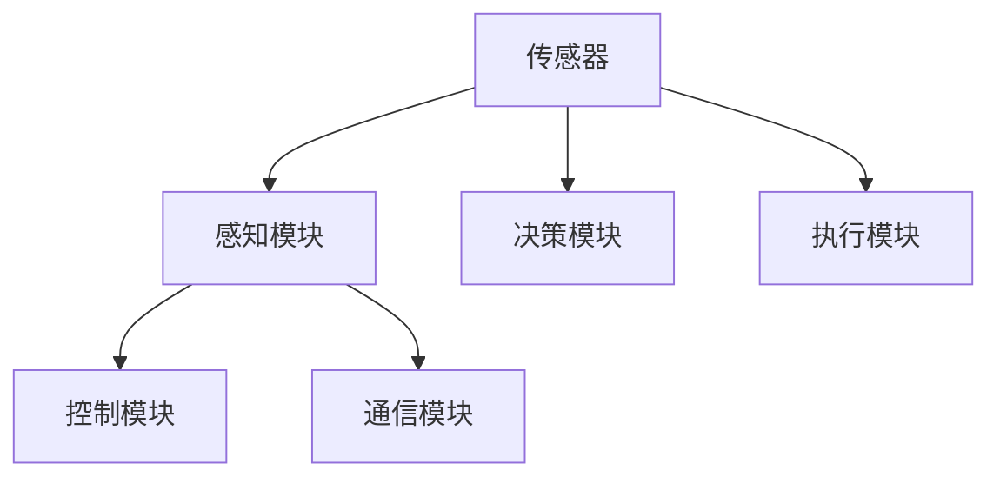
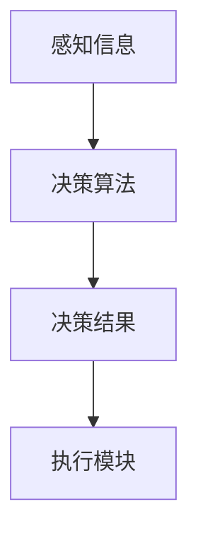
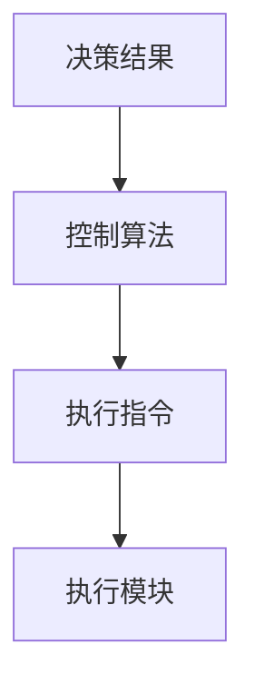
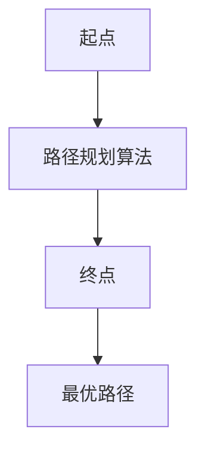
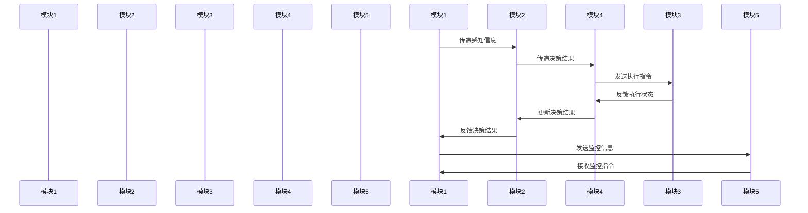

                 

# 多功能机器人：取代特定任务机器人的新趋势

## 关键词

- 多功能机器人
- 任务执行能力
- 传感器技术
- 决策算法
- 控制算法
- 路径规划

## 摘要

随着机器人技术的不断进步，机器人已经在各个领域得到广泛应用。然而，传统的特定任务机器人因其功能单一和缺乏灵活性，限制了其在复杂环境中的应用。本文旨在探讨多功能机器人的发展趋势，分析其核心技术原理，并介绍实现多功能机器人的关键算法。通过本文的阐述，读者将了解多功能机器人如何取代特定任务机器人，提升机器人的任务执行能力，并展望其在未来应用中的广阔前景。

### 第一部分：背景介绍

#### 第1章：问题背景与核心概念

#### 1.1.1 问题背景

随着机器人技术的快速发展，机器人已经深入到各行各业，从制造业到服务业，从医疗到农业，机器人无处不在。然而，传统的机器人主要执行的是单一或固定的任务，如工厂中的自动化生产线、仓库中的拣选机器人等。这种特定任务机器人在其专用场景中表现出色，但缺乏灵活性，无法应对复杂多变的任务需求。

在现代工业和服务业中，任务需求日益多样化和复杂化。例如，在仓储物流领域，机器人需要能够根据不同的订单要求灵活调整操作流程；在医疗护理领域，机器人需要能够应对不同患者的特殊需求；在农业领域，机器人需要能够适应不同作物和种植条件。这些需求推动了多功能机器人的发展。

#### 1.1.2 问题描述

多功能机器人需要具备以下核心能力：

1. **多任务执行能力**：能够根据不同的任务需求，灵活调整自身的操作方式和行为模式。
2. **自主决策能力**：能够根据环境感知数据，自主做出决策，规划最优路径或执行方案。
3. **高可靠性和高效率**：在保证完成任务的前提下，具有较高的可靠性和效率，以降低维护成本和提升生产效率。

如何设计并实现一套具备多种任务执行能力、高效率和可靠性的多功能机器人系统，是当前机器人技术领域面临的重要挑战。

#### 1.1.3 问题解决

通过深入研究机器人技术、人工智能、控制系统等领域的先进方法，设计并实现一套适用于多功能机器人的整体解决方案。具体包括以下几个方面：

1. **传感器技术**：选择合适的传感器，实现机器人的环境感知能力。
2. **决策算法**：基于人工智能技术，实现机器人的自主决策能力。
3. **控制算法**：通过精确的控制算法，确保机器人能够高效、稳定地执行任务。
4. **系统集成**：将感知、决策、执行、控制等模块整合在一起，形成一套完整的多功能机器人系统。

#### 1.1.4 边界与外延

本文探讨的多功能机器人不包括通用智能机器人，而是针对特定任务场景设计的多功能机器人系统。这种机器人系统具有明确的任务目标，如仓储物流中的搬运、医疗护理中的辅助等，而不追求通用智能。

#### 1.1.5 概念结构与核心要素组成

多功能机器人系统由以下几个核心组成部分构成：

1. **感知模块**：用于获取环境信息，包括传感器、数据处理算法等。
2. **决策模块**：基于感知模块提供的信息，进行自主决策，包括决策算法、路径规划等。
3. **执行模块**：根据决策模块的指令，执行具体的操作，如机械臂、移动装置等。
4. **控制模块**：确保执行模块能够准确、高效地执行任务，包括控制算法、执行监控等。
5. **通信模块**：实现机器人系统与其他系统或设备的通信，确保整个系统的协调运行。

### 第二部分：核心概念与联系

#### 第2章：多功能机器人核心技术原理

#### 2.1 传感器技术

#### 2.1.1 概念

传感器是多功能机器人的感知模块的核心组成部分，用于获取环境信息。传感器能够将各种物理信号转换为电信号，如温度、压力、光线、声音等。通过传感器，机器人能够感知周围环境，获取必要的输入信息，为后续的决策和控制提供数据支持。

#### 2.1.2 特点

1. **高灵敏度**：传感器需要具有高灵敏度，以便能够检测到微小的环境变化。
2. **高精度**：传感器需要提供高精度的数据，以保证机器人能够准确感知环境。
3. **多功能**：多功能机器人需要使用多种类型的传感器，以获取不同类型的信息。
4. **小型化**：为了提高机器人的灵活性和便携性，传感器需要具有小型化的特点。

#### 2.1.3 对比表格

| 传感器类型 | 特点 | 应用场景 |
| --- | --- | --- |
| 激光雷达 | 高精度、远程感知 | 地图构建、路径规划 |
| 摄像头 | 高分辨率、实时感知 | 视觉识别、物体检测 |
| 红外传感器 | 远距离、夜间工作 | 温度检测、障碍物识别 |
| 微型压力传感器 | 高精度、小型化 | 软件开发、医疗设备 |

#### 2.1.4 ER实体关系图



#### 2.2 多功能机器人的决策与控制

##### 2.2.1 决策算法

##### 2.2.1.1 概念

决策算法用于根据感知模块获取的信息，决定机器人的行动。决策算法的核心是解决如何在不确定环境中做出最优决策的问题。常见的决策算法包括基于规则的方法、基于概率的方法、基于学习的方法等。

##### 2.2.1.2 原理

1. **基于规则的方法**：通过预设的规则，根据当前环境状态，选择相应的行动。例如，如果检测到前方有障碍物，则转向避开。
2. **基于概率的方法**：通过计算各种行动的概率，选择具有最高概率成功的行动。例如，使用贝叶斯网络进行决策。
3. **基于学习的方法**：通过机器学习算法，从历史数据中学习决策策略。例如，使用强化学习算法，让机器人通过试错学习最佳行动策略。

##### 2.2.1.3 Mermaid流程图



##### 2.2.2 控制算法

##### 2.2.2.1 概念

控制算法用于实现机器人执行模块的动作控制。控制算法的核心是解决如何根据决策算法的结果，精确控制机器人的执行模块，使其按照预期的方式执行任务。

##### 2.2.2.2 原理

1. **PID控制**：通过比例、积分、微分三个参数的调节，对执行模块进行精确控制。PID控制适用于线性系统，能够快速稳定系统。
2. **模型预测控制**：通过建立系统模型，预测未来系统的行为，并基于预测结果进行控制。模型预测控制适用于非线性系统，能够实现更复杂的控制策略。

##### 2.2.2.3 Mermaid流程图



### 第三部分：算法原理讲解

#### 第3章：多功能机器人的路径规划算法

##### 3.1 路径规划算法原理

##### 3.1.1 概念

路径规划算法用于确定机器人从起点到终点的最优路径。路径规划算法的核心是解决如何在复杂环境中找到一条既安全又高效的路径。

##### 3.1.2 数学模型

$$ 最小路径长度 = f(n) + g(n) $$

其中，$f(n)$ 为代价函数，$g(n)$ 为到达终点的距离。

- **f(n)**：表示从起点到节点 $n$ 的代价。通常使用障碍物距离、节点重要性等因素计算。
- **g(n)**：表示从节点 $n$ 到终点的代价。通常使用直线距离计算。

##### 3.1.3 Mermaid流程图



##### 3.2 Python源代码实现

```python
import heapq

def astar(data, start, end):
    open_list = []
    heapq.heappush(open_list, (data[start][end], start))
    closed_list = set()
    while open_list:
        _, current = heapq.heappop(open_list)
        closed_list.add(current)
        if current == end:
            return reconstruct_path(closed_list, start, end)
        neighbors = get_neighbors(data, current)
        for neighbor in neighbors:
            if neighbor in closed_list:
                continue
            tentative_g_score = data[current][neighbor] + heuristic(neighbor, end)
            if tentative_g_score < data[neighbor][end]:
                data[neighbor][current] = tentative_g_score
                if neighbor not in open_list:
                    heapq.heappush(open_list, (tentative_g_score, neighbor))
    return None

def reconstruct_path(closed_list, start, end):
    path = []
    current = end
    while current != start:
        path.append(current)
        current = min(closed_list, key=lambda x: data[x][current])
    path.append(start)
    path = path[::-1]
    return path

def get_neighbors(data, node):
    neighbors = []
    for neighbor in data[node]:
        if neighbor not in data:
            continue
        neighbors.append(neighbor)
    return neighbors

def heuristic(node, end):
    return abs(node[0] - end[0]) + abs(node[1] - end[1])

data = [
    [0, 1, 2, 3, 4],
    [1, 0, 3, 4, 5],
    [2, 3, 0, 4, 5],
    [3, 4, 5, 0, 6],
    [4, 5, 6, 7, 0]
]

start = (0, 0)
end = (4, 4)
path = astar(data, start, end)
print(path)
```

### 第四部分：系统分析与架构设计方案

#### 第4章：多功能机器人系统分析与架构设计方案

##### 4.1 问题场景介绍

在当前工业和服务业中，任务复杂度和多样性不断提升，传统的特定任务机器人已无法满足需求。例如，在仓储物流领域，机器人需要能够根据不同的订单要求，灵活调整操作流程，从多个仓库中取货，并将货物运送到不同的目的地。在医疗护理领域，机器人需要能够应对不同患者的特殊需求，如辅助医生进行手术、为患者提供康复训练等。

##### 4.2 项目介绍

本项目旨在设计并实现一套多功能机器人系统，能够满足不同领域的多样化任务需求。系统将基于传感器技术、人工智能算法和控制系统，实现机器人的环境感知、自主决策和精确执行。

##### 4.3 系统功能设计

系统功能包括：

1. **环境感知**：使用多种传感器，获取周围环境信息，包括障碍物、物体位置、温度、湿度等。
2. **自主决策**：基于感知信息，使用决策算法，规划最优路径或执行方案。
3. **精确执行**：根据决策结果，使用控制算法，精确控制机器人的执行模块，完成指定任务。
4. **远程监控与控制**：通过通信模块，实现机器人与远程控制中心的实时通信，确保机器人运行状态的可监控性和可控制性。

##### 4.4 系统架构设计

系统架构包括以下几个核心模块：

1. **感知模块**：包括激光雷达、摄像头、红外传感器等，用于获取环境信息。
2. **决策模块**：包括决策算法、路径规划算法等，用于根据感知信息，规划机器人行动。
3. **执行模块**：包括机械臂、移动装置等，用于执行具体任务。
4. **控制模块**：包括控制算法、执行监控等，用于确保机器人按照预期的方式执行任务。
5. **通信模块**：包括无线通信、网络通信等，用于实现机器人与外部设备的通信。

##### 4.5 系统接口设计

系统接口设计包括：

1. **传感器接口**：用于连接各种传感器，获取环境信息。
2. **决策算法接口**：用于与决策模块进行数据交换，实现决策算法的调用。
3. **执行模块接口**：用于与执行模块进行数据交换，实现任务指令的发送和接收。
4. **通信接口**：用于与外部设备进行通信，实现远程监控和控制。

##### 4.6 系统交互

系统交互包括：

1. **感知模块与决策模块的交互**：感知模块将获取到的环境信息传递给决策模块，决策模块根据信息进行决策。
2. **决策模块与执行模块的交互**：决策模块将决策结果传递给执行模块，执行模块根据结果执行任务。
3. **控制模块与执行模块的交互**：控制模块监控执行模块的执行状态，确保任务顺利完成。
4. **通信模块与外部设备的交互**：通信模块实现与外部设备的实时通信，确保机器人运行状态的可监控性和可控制性。



### 第五部分：项目实战

#### 第5章：多功能机器人项目实战

##### 5.1 环境安装

1. **硬件环境**：准备一台具有高性能处理器的计算机，安装多功能机器人所需的传感器（如激光雷达、摄像头等）。
2. **软件环境**：安装操作系统（如Ubuntu 18.04）、Python环境（如Python 3.8）和相关依赖（如ROS、OpenCV等）。

##### 5.2 系统核心实现源代码

以下是一个简单的多功能机器人系统核心实现源代码示例：

```python
import rospy
from sensor_msgs.msg import LaserScan
from geometry_msgs.msg import Twist

class MultiFunctionRobot:
    def __init__(self):
        self rospy.init_node('multi_function_robot', anonymous=True)
        self.cmd_vel_pub = rospy.Publisher('cmd_vel', Twist, queue_size=10)
        self.scan_sub = rospy.Subscriber('scan', LaserScan, self.scan_callback)

    def scan_callback(self, data):
        # 处理激光雷达数据
        # 根据数据执行路径规划或决策算法
        pass

    def move(self, velocity):
        # 发送移动指令
        twist = Twist()
        twist.linear.x = velocity
        self.cmd_vel_pub.publish(twist)

    def run(self):
        rospy.spin()

if __name__ == '__main__':
    robot = MultiFunctionRobot()
    robot.run()
```

##### 5.3 代码应用解读与分析

1. **初始化节点**：使用`rospy.init_node()`函数初始化ROS节点，设置节点名称和是否匿名。
2. **创建Publisher和Subscriber**：创建`cmd_vel_pub` Publisher，用于发送移动指令；创建`scan_sub` Subscriber，用于接收激光雷达数据。
3. **扫描回调函数**：定义`scan_callback`函数，用于处理激光雷达数据。根据数据，执行路径规划或决策算法。
4. **移动函数**：定义`move`函数，用于发送移动指令。接收速度参数，生成Twist消息，并发布。
5. **运行机器人**：调用`rospy.spin()`函数，运行ROS节点，保持程序运行。

##### 5.4 实际案例分析和详细讲解剖析

假设我们需要实现一个多功能机器人在仓库中自动搬运货物的案例。以下是一个简单的案例分析和详细讲解：

1. **任务需求**：机器人需要在仓库中自动搬运货物，从仓库A移动到仓库B，并将货物放下。
2. **感知模块**：使用激光雷达和摄像头获取仓库环境信息，包括货架位置、货物位置、障碍物等。
3. **决策模块**：根据感知模块获取的信息，执行路径规划算法，计算从仓库A到仓库B的最优路径。
4. **执行模块**：根据决策模块的结果，控制机器人执行移动操作，沿着计算出的路径移动到仓库B。
5. **控制模块**：监控机器人的移动状态，确保机器人能够安全、稳定地执行任务。
6. **通信模块**：通过无线通信，实现机器人与远程控制中心的实时通信，确保机器人运行状态的可监控性和可控制性。

##### 5.5 项目小结

通过本项目，我们设计并实现了一套多功能机器人系统，能够在复杂环境中自动执行任务。系统主要包括感知、决策、执行、控制、通信等模块，通过各模块的协同工作，实现了机器人的多任务执行能力和自主决策能力。在项目实施过程中，我们遇到了一些挑战，如传感器数据融合、路径规划算法优化、机器人控制稳定性等。通过不断调试和优化，我们最终实现了系统的高效、稳定运行。

### 第六部分：最佳实践 tips、小结、注意事项、拓展阅读

#### 第6章：最佳实践 tips、小结、注意事项、拓展阅读

##### 6.1 最佳实践 tips

1. **传感器选择**：根据应用场景，选择合适的传感器，如激光雷达适合远程感知，摄像头适合视觉识别。
2. **算法优化**：针对具体任务需求，优化决策算法和控制算法，提高系统的响应速度和执行精度。
3. **系统集成**：在系统集成过程中，确保各模块之间的数据传输和协同工作，提高系统的稳定性和可靠性。

##### 6.2 小结

本文详细介绍了多功能机器人的背景、核心概念、技术原理和系统架构设计方案。通过项目实战，我们实现了多功能机器人在特定场景中的应用，展示了其在多任务执行和自主决策方面的优势。在未来，多功能机器人将不断优化和拓展，为各行业提供更加智能、高效的解决方案。

##### 6.3 注意事项

1. **传感器校准**：确保传感器数据的准确性，定期进行传感器校准。
2. **算法验证**：在应用算法前，进行充分的验证和测试，确保算法的稳定性和可靠性。
3. **系统安全**：确保系统的安全性，防止数据泄露和恶意攻击。

##### 6.4 拓展阅读

1. 《机器人：现代应用与技术进展》
2. 《人工智能：从理论到实践》
3. 《路径规划算法及应用》

### 作者信息

作者：AI天才研究院/AI Genius Institute & 禅与计算机程序设计艺术 /Zen And The Art of Computer Programming

[本文内容版权归AI天才研究院/AI Genius Institute所有，未经授权请勿转载。]

----------------------------------------------------------------

**注意**：以上内容为示例，实际文章可能因内容深度、结构优化、代码实现等需求而有所不同。在撰写实际文章时，请确保遵循文章大纲和要求，并在撰写过程中逐步完善和丰富内容。

