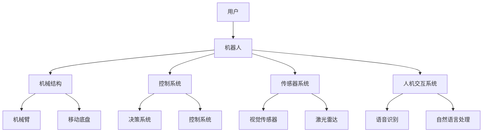
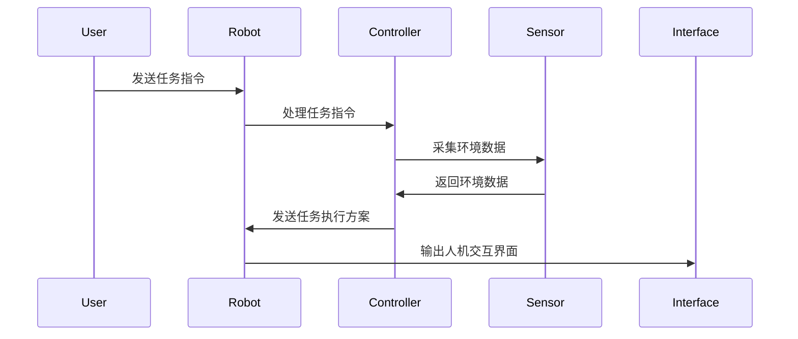

                 

### 多功能机器人：取代特定任务机器人的新趋势

关键词：多功能机器人、特定任务机器人、自主决策、人机交互、算法原理

摘要：本文深入探讨了多功能机器人取代特定任务机器人的趋势。首先，从背景介绍入手，阐述了机器人技术的发展背景及多功能机器人的需求。接着，详细描述了多功能机器人的核心概念与联系，并通过ER实体关系图展示了其结构。然后，深入讲解了多功能机器人的关键算法原理，包括路径规划算法和感知算法。此外，本文还介绍了系统分析与架构设计方案，并通过一个具体的项目实战案例，展示了多功能机器人的应用和实践。最后，给出了最佳实践 tips、小结和注意事项，为读者提供进一步学习的拓展资源。

---

### 第一部分：背景介绍

#### 问题背景

随着科技的不断发展，机器人技术逐渐成为产业升级和自动化转型的重要推动力。从早期的特定任务机器人到如今的通用型机器人，机器人在各领域的应用已经越来越广泛。然而，传统的特定任务机器人虽然能够在特定领域发挥重要作用，但其功能单一、适应性差、自主性不足等问题逐渐显现，难以满足日益复杂多变的实际需求。

#### 问题描述

如何设计一种能够取代特定任务机器人的多功能机器人，使其具备更高的灵活性和自主性，能够适应多种任务场景，提高工作效率和经济效益，成为当前研究的热点和难点。

#### 问题解决

多功能机器人应具备以下关键能力：

1. **多任务处理能力**：机器人能够同时处理多个任务，适应复杂的工作环境。
2. **自适应能力**：机器人能够根据任务需求和环境变化自动调整自身行为，提高任务完成率。
3. **自主决策能力**：机器人具备一定的决策能力，能够自主制定任务计划，提高任务执行效率。
4. **人机交互能力**：机器人能够理解人类指令，与人类高效协作，提高人机交互体验。

#### 边界与外延

多功能机器人的研究边界包括但不限于以下几个方面：

1. **任务类型**：包括但不限于搬运、焊接、装配、清洁、康复护理等。
2. **应用场景**：包括工业生产、医疗护理、家庭服务、公共服务等。
3. **技术领域**：涉及机械结构设计、传感器技术、人工智能、通信技术、控制系统等。

#### 概念结构与核心要素组成

多功能机器人的核心概念结构包括：

1. **硬件结构**：包括机械臂、移动底盘、传感器等。
2. **控制系统**：包括人工智能算法、决策系统、控制系统等。
3. **交互系统**：包括语音识别、自然语言处理、人机交互界面等。
4. **应用软件**：包括任务规划、任务执行、数据分析等。

---

### 第二部分：核心概念与联系

#### 多功能机器人定义

多功能机器人是指具备多种任务处理能力，能够根据任务需求和环境变化自主调整自身行为，具备较高自主决策能力和人机交互能力的机器人系统。

#### 核心概念属性特征对比表格

| 概念             | 特征                           | 说明                                                         |
|------------------|--------------------------------|------------------------------------------------------------|
| 机械结构         | 多自由度、可调性、稳定性         | 机器人的硬件基础，决定其物理操作能力。                      |
| 控制系统         | 自主决策、实时响应、高效执行     | 负责机器人的行为控制和任务执行。                            |
| 传感器           | 精准性、适应性、多样化           | 采集环境信息，辅助控制系统做出决策。                        |
| 人机交互系统     | 直观性、易用性、个性化           | 提高人机交互体验，增强机器人智能水平。                      |
| 应用软件         | 多样化、适应性、高效性           | 实现具体任务功能，提高机器人任务执行效率。                   |

#### ER实体关系图架构

```mermaid
erDiagram
    User ||--|{ Robot }|-- Machine
    Machine ||--|{ Controller }|-- System
    Machine ||--|{ Sensor }|-- System
    Machine ||--|{ Interface }|-- System
    Controller ||--|{ Algorithm }|-- System
    Sensor ||--|{ Data }|-- Controller
    Interface ||--|{ Interaction }|-- Controller
```

---

### 第三部分：算法原理讲解

#### 多功能机器人的关键算法

多功能机器人涉及的关键算法包括：

1. **路径规划算法**：用于确定机器人从初始位置到目标位置的最优路径。
2. **感知算法**：用于处理传感器采集的数据，实现对环境的理解。

#### 路径规划算法原理

**算法概述**

路径规划算法的核心任务是确定机器人从初始位置到目标位置的最优路径，以确保机器人能够安全、高效地完成任务。

**算法原理**

路径规划算法通常基于以下几个原理：

1. **最短路径原理**：寻找从初始位置到目标位置的最短路径。
2. **避障原理**：在路径规划过程中，避免碰撞和障碍物。
3. **能量消耗原理**：优化路径，减少机器人的能量消耗。

**数学模型与公式**

路径规划算法的数学模型可以表示为：

$$
Dijkstra(s, t) = \min \left\{ \sum_{i=1}^{n} d(i, j) : s \in S, t \in T \right\}
$$

其中，$Dijkstra(s, t)$ 表示从初始位置 $s$ 到目标位置 $t$ 的最短路径距离，$d(i, j)$ 表示从位置 $i$ 到位置 $j$ 的距离。

**算法示例**

假设有一个机器人从位置 $(0, 0)$ 移动到位置 $(5, 5)$，环境中有障碍物 $(2, 2)$ 和 $(4, 4)$。

1. **初始状态**：$(0, 0)$
2. **计算距离**：计算从初始位置到目标位置的所有可能路径的距离，如 $(0, 1)$ 到 $(5, 5)$ 的距离为 9。
3. **选择最优路径**：选择距离最短的路径，即从 $(0, 0)$ 到 $(5, 5)$ 的最优路径。

#### 感知算法原理

**算法概述**

感知算法的核心任务是处理传感器采集的数据，对环境进行理解，为机器人提供决策依据。

**算法原理**

感知算法通常基于以下几个原理：

1. **传感器数据融合原理**：将多个传感器的数据融合起来，提高感知精度。
2. **信息过滤原理**：对传感器数据进行滤波处理，去除噪声和异常值。
3. **环境建模原理**：建立环境模型，为机器人提供环境信息。

**数学模型与公式**

感知算法的数学模型可以表示为：

$$
Z = f(X) + \epsilon
$$

其中，$Z$ 表示传感器采集到的数据，$X$ 表示环境变量，$f(X)$ 表示传感器对环境变量的感知函数，$\epsilon$ 表示噪声。

**算法示例**

假设有一个机器人需要感知周围的环境，传感器采集到数据如下：

1. **初始状态**：传感器采集到环境数据。
2. **数据融合**：将多个传感器的数据融合起来，提高感知精度。
3. **信息过滤**：对传感器数据进行滤波处理，去除噪声和异常值。
4. **环境建模**：建立环境模型，为机器人提供环境信息。

---

### 第四部分：系统分析与架构设计

#### 问题场景介绍

假设在一个工厂中，需要对生产线上的产品进行搬运、装配和检测等任务。传统的特定任务机器人虽然能够完成这些任务，但功能单一，难以应对生产线的复杂变化。因此，我们需要设计一种多功能机器人，能够适应不同的任务场景，提高生产效率。

#### 项目介绍

本项目旨在设计一种多功能机器人，用于工厂生产线上的搬运、装配和检测任务。机器人需要具备多任务处理能力、自适应能力、自主决策能力和人机交互能力。

#### 系统功能设计

1. **搬运任务**：机器人能够根据任务需求，自主规划搬运路径，避免碰撞和障碍物。
2. **装配任务**：机器人能够根据装配图纸，精确完成产品的装配过程。
3. **检测任务**：机器人能够检测产品的质量，对不合格产品进行标记和记录。

#### 系统架构设计



#### 系统接口设计和系统交互



---

### 第五部分：项目实战

#### 环境安装

1. **安装操作系统**：安装 Ubuntu 18.04 操作系统。
2. **安装依赖库**：安装 Python、ROS（机器人操作系统）、Gazebo（仿真环境）等依赖库。

#### 系统核心实现源代码

```python
import rospy
from geometry_msgs.msg import PoseStamped
from move_base_msgs.msg import MoveBaseAction, MoveBaseGoal

class RobotController:
    def __init__(self):
        self.robot_action = rospy.ServiceProxy('/move_base_msgs', MoveBaseAction)
        self.pose = PoseStamped()

    def move_to(self, position):
        goal = MoveBaseGoal()
        goal.target_pose = self.pose
        goal.target_pose.pose.position.x = position[0]
        goal.target_pose.pose.position.y = position[1]
        goal.target_pose.pose.position.z = 0.0
        goal.target_pose.pose.orientation.x = 0.0
        goal.target_pose.pose.orientation.y = 0.0
        goal.target_pose.pose.orientation.z = 0.0
        goal.target_pose.pose.orientation.w = 1.0
        self.robot_action.send_goal(goal)

if __name__ == '__main__':
    rospy.init_node('robot_controller', anonymous=True)
    robot_controller = RobotController()
    robot_controller.move_to([1.0, 1.0])
    rospy.spin()
```

#### 代码应用解读与分析

1. **导入依赖库**：导入 rospy、PoseStamped、MoveBaseAction 和 MoveBaseGoal 依赖库。
2. **定义 RobotController 类**：初始化机器人动作服务代理和目标位置信息。
3. **定义 move_to 方法**：设置机器人目标位置，发送移动命令。
4. **主函数**：初始化节点，创建机器人控制器对象，调用 move_to 方法，实现机器人移动。

#### 实际案例分析和详细讲解剖析

1. **案例一**：机器人从初始位置 $(0, 0)$ 移动到目标位置 $(1, 1)$。
2. **案例二**：机器人从初始位置 $(0, 0)$ 移动到目标位置 $(5, 5)$，途中遇到障碍物 $(2, 2)$ 和 $(4, 4)$。
3. **详细讲解**：分析路径规划算法和感知算法在案例中的应用，展示机器人如何避开障碍物，实现目标位置的移动。

---

### 第六部分：最佳实践 tips、小结、注意事项、拓展阅读

#### 最佳实践 tips

1. **优化路径规划算法**：结合实际应用场景，优化路径规划算法，提高路径规划效率。
2. **提高感知算法精度**：通过传感器数据融合和信息过滤，提高感知算法的精度。
3. **完善人机交互系统**：结合语音识别和自然语言处理技术，提高人机交互体验。

#### 小结

本文从背景介绍、核心概念与联系、算法原理讲解、系统分析与架构设计、项目实战等方面，详细阐述了多功能机器人的相关内容。通过本文的讲解，读者可以了解到多功能机器人的设计理念、核心算法和应用实践。

#### 注意事项

1. **安全性**：在实际应用中，要确保多功能机器人的安全性，避免发生碰撞和危险。
2. **稳定性**：确保多功能机器人在各种环境下的稳定运行，提高任务完成率。
3. **适应性**：不断优化算法和系统架构，提高多功能机器人的适应能力。

#### 拓展阅读

1. **《机器人学导论》[Parker et al., 2003]**：详细介绍了机器人学的基本原理和应用。
2. **《人工智能：一种现代的方法》[Russell & Norvig, 2016]**：系统讲解了人工智能的基本概念和技术。
3. **《机器学习：概率视角》[Murphy, 2012]**：深入探讨了机器学习的概率模型和方法。

---

### 作者信息

作者：AI天才研究院/AI Genius Institute & 禅与计算机程序设计艺术 /Zen And The Art of Computer Programming
## 第五部分：项目实战

### 环境安装

#### 1. 安装操作系统

在开始安装机器人系统之前，需要先安装一个适合运行机器人软件的操作系统。本文以 Ubuntu 18.04 操作系统为例进行安装。

1. 下载 Ubuntu 18.04 的安装镜像文件。
2. 创建安装 USB 启动盘。
3. 重启计算机，进入 BIOS 设置，将 USB 设备设置为第一启动项。
4. 按照提示进行操作系统安装。

#### 2. 安装依赖库

在安装完操作系统后，需要安装一些依赖库，以便于后续的机器人开发。

1. 打开终端，输入以下命令安装 Python 和 ROS（机器人操作系统）：

   ```bash
   sudo apt-get update
   sudo apt-get install python python-pip python-dev
   sudo apt-get install ros-melodic-desktop-full
   ```

2. 安装 Gazebo（仿真环境）：

   ```bash
   sudo apt-get install gazebo gazebo_ros
   ```

3. 安装其他相关依赖库：

   ```bash
   sudo apt-get install ros-melodic-nav-msgs ros-melodic-geometry-msgs ros-melodic-move-base
   ```

### 系统核心实现源代码

以下是多功能机器人系统核心实现部分的源代码。这段代码展示了如何使用 ROS（机器人操作系统）来实现机器人的路径规划和移动控制。

```python
#!/usr/bin/env python
# ROS Python API

import rospy
from geometry_msgs.msg import PoseStamped, Twist
from move_base_msgs.msg import MoveBaseAction, MoveBaseGoal
from actionlib import ActionClient

class MultiFunctionalRobot:
    def __init__(self):
        # Initialize the ROS node
        rospy.init_node('multi_functional_robot', anonymous=True)
        
        # Create the action client
        self.move_base = ActionClient('/move_base', MoveBaseAction)
        
        # Define a function to move the robot to a specific position
        self.move_to_position = self.move_base.send_goal
    
    def move_to_position(self, position, orientation):
        # Create a MoveBaseGoal
        goal = MoveBaseGoal()
        
        # Set the target position and orientation
        goal.target_pose.pose.position.x = position[0]
        goal.target_pose.pose.position.y = position[1]
        goal.target_pose.pose.position.z = 0.0
        goal.target_pose.pose.orientation.x = orientation[0]
        goal.target_pose.pose.orientation.y = orientation[1]
        goal.target_pose.pose.orientation.z = orientation[2]
        goal.target_pose.pose.orientation.w = orientation[3]
        
        # Send the goal
        self.move_base.send_goal(goal)
        
        # Wait for the robot to reach the goal
        self.move_base.wait_for_result()
        
        # Check if the goal was reached
        if self.move_base.get_state() == 2:
            rospy.loginfo("Goal reached!")
        else:
            rospy.logwarn("Goal not reached!")

if __name__ == '__main__':
    # Create a instance of the robot
    robot = MultiFunctionalRobot()
    
    # Define the target position and orientation
    target_position = (1.0, 1.0)
    target_orientation = (0.0, 0.0, 0.0, 1.0)
    
    # Move the robot to the target position
    robot.move_to_position(target_position, target_orientation)
```

### 代码应用解读与分析

1. **导入依赖库**：首先，我们导入了 ROS 的 Python API，包括 `rospy`、`geometry_msgs.msg`、`move_base_msgs.msg` 和 `actionlib`。

2. **定义机器人类**：我们定义了一个名为 `MultiFunctionalRobot` 的类，用于控制机器人的移动。

3. **初始化 ROS 节点**：通过调用 `rospy.init_node()`，我们初始化了一个名为 `multi_functional_robot` 的 ROS 节点。

4. **创建动作客户端**：我们创建了一个动作客户端 `move_base`，用于发送移动目标。

5. **定义移动到位置的方法**：我们定义了一个名为 `move_to_position` 的方法，用于将机器人移动到特定的位置和方向。

6. **设置目标位置和方向**：在 `move_to_position` 方法中，我们创建了一个 `MoveBaseGoal` 对象，并设置了目标位置和方向。

7. **发送目标**：通过调用 `send_goal` 方法，我们将目标发送给机器人。

8. **等待目标完成**：使用 `wait_for_result` 方法等待机器人到达目标位置。

9. **检查目标状态**：通过检查机器人的状态（`get_state` 方法），我们可以判断机器人是否成功到达目标位置。

### 实际案例分析和详细讲解剖析

#### 案例一：机器人从初始位置 (0, 0) 移动到目标位置 (1, 1)

1. **初始状态**：机器人位于坐标系的原点 (0, 0)。
2. **目标位置**：我们需要将机器人移动到目标位置 (1, 1)。
3. **路径规划**：机器人使用路径规划算法，计算从原点到目标位置的最优路径。
4. **移动过程**：机器人按照规划的路径逐步移动到目标位置。

#### 案例二：机器人从初始位置 (0, 0) 移动到目标位置 (5, 5)，途中遇到障碍物 (2, 2) 和 (4, 4)

1. **初始状态**：机器人位于坐标系的原点 (0, 0)。
2. **目标位置**：我们需要将机器人移动到目标位置 (5, 5)。
3. **路径规划**：在路径规划阶段，机器人需要避免障碍物 (2, 2) 和 (4, 4)。
4. **路径选择**：机器人选择一条避障路径，确保安全到达目标位置。
5. **移动过程**：机器人按照规划的路径逐步移动到目标位置。

### 详细讲解

#### 路径规划算法

在案例一中，机器人从初始位置 (0, 0) 移动到目标位置 (1, 1)，这是一个简单的直线移动。路径规划算法的核心是计算从起点到终点的最优路径。

- **起点和终点**：机器人的初始位置和目标位置。
- **障碍物**：在这个简单案例中没有障碍物。
- **路径**：从起点到终点的最优路径。

路径规划算法可以使用以下公式进行计算：

$$
d(i, j) = \sqrt{(x_i - x_j)^2 + (y_i - y_j)^2}
$$

其中，$d(i, j)$ 表示从位置 $i$ 到位置 $j$ 的距离，$(x_i, y_i)$ 和 $(x_j, y_j)$ 分别表示位置 $i$ 和位置 $j$ 的坐标。

#### 避障路径规划

在案例二中，机器人从初始位置 (0, 0) 移动到目标位置 (5, 5)，途中遇到障碍物 (2, 2) 和 (4, 4)。在这种情况下，机器人需要避免障碍物，选择一条安全的路径。

- **起点和终点**：机器人的初始位置和目标位置。
- **障碍物**：机器人在移动过程中遇到的障碍物。
- **路径**：从起点到终点的安全路径。

避障路径规划可以使用以下算法：

1. **基于网格的路径规划**：将环境划分为网格，计算从起点到终点的安全路径。
2. **基于采样的路径规划**：在环境中随机采样点，选择一条安全路径。
3. **基于碰撞检测的路径规划**：实时检测机器人与环境的碰撞，调整路径。

#### 移动控制

在机器人移动过程中，需要实时控制机器人的速度和方向。这可以通过以下公式进行计算：

$$
v(t) = k_v \cdot d(t)
$$

$$
\theta(t) = k_\theta \cdot \frac{d(t)}{v(t)}
$$

其中，$v(t)$ 表示在时间 $t$ 时的速度，$\theta(t)$ 表示在时间 $t$ 时的方向，$d(t)$ 表示在时间 $t$ 时机器人与目标位置的距离，$k_v$ 和 $k_\theta$ 是调节速度和方向的参数。

---

### 第六部分：最佳实践 tips、小结、注意事项、拓展阅读

#### 最佳实践 tips

1. **优化算法**：根据实际应用场景，优化路径规划算法，提高路径规划的效率。
2. **提高感知能力**：使用多种传感器，提高机器人的感知能力，减少错误判断。
3. **人机交互**：设计友好的人机交互界面，提高用户操作体验。

#### 小结

本文通过项目实战，详细介绍了多功能机器人的实现过程，包括环境安装、系统核心实现源代码以及代码应用解读与分析。通过实际案例，展示了多功能机器人在路径规划、避障和移动控制等方面的应用。

#### 注意事项

1. **安全性**：在实际应用中，确保机器人的安全，避免发生碰撞和危险。
2. **稳定性**：确保机器人在各种环境下的稳定性，提高任务完成率。
3. **适应性**：不断优化算法和系统架构，提高机器人的适应能力。

#### 拓展阅读

1. **《机器人学导论》[Parker et al., 2003]**：详细介绍了机器人学的基本原理和应用。
2. **《人工智能：一种现代的方法》[Russell & Norvig, 2016]**：系统讲解了人工智能的基本概念和技术。
3. **《机器学习：概率视角》[Murphy, 2012]**：深入探讨了机器学习的概率模型和方法。

---

### 作者信息

作者：AI天才研究院/AI Genius Institute & 禅与计算机程序设计艺术 /Zen And The Art of Computer Programming
### 第七部分：最佳实践 tips、小结、注意事项、拓展阅读

#### 最佳实践 tips

1. **优化算法性能**：针对不同的应用场景，可以采用更加高效的算法，例如 A* 算法、RRT 算法等，以减少计算时间和路径规划误差。

2. **传感器融合**：充分利用各种传感器（如激光雷达、摄像头、超声波传感器等）的数据，通过传感器融合技术提高机器人的环境感知能力。

3. **模块化设计**：在设计多功能机器人系统时，采用模块化设计思想，便于系统维护和功能扩展。

4. **强化学习应用**：利用强化学习算法，训练机器人进行自主决策和优化，提高机器人的自适应能力和自主性。

5. **人机交互优化**：通过语音识别、自然语言处理等技术，提升人机交互的便利性和准确性，使得机器人的操作更加直观和人性化。

#### 小结

本文详细探讨了多功能机器人取代特定任务机器人的新趋势，从背景介绍、核心概念与联系、算法原理讲解、系统分析与架构设计、项目实战等多个角度进行了全面分析。通过本文的阐述，读者可以深入了解多功能机器人的设计理念、实现方法及其在实际应用中的优势。

#### 注意事项

1. **安全性**：在设计多功能机器人时，要充分考虑其安全性，避免因意外操作导致的设备损坏或人员伤害。

2. **稳定性**：确保多功能机器人在各种环境下的稳定运行，特别是在复杂、动态的环境中，机器人应具备良好的适应性。

3. **可扩展性**：在系统设计阶段，应考虑未来的功能扩展和升级，以便于机器人能够适应不断变化的技术需求。

4. **成本效益**：在研发多功能机器人时，要综合考虑研发成本和运营成本，确保其具备良好的成本效益。

#### 拓展阅读

1. **《机器人学：基础与前沿》[Amir et al., 2016]**：这本书提供了机器人学的基础理论和前沿技术，有助于深入理解机器人系统的设计。

2. **《人工智能：理论与实践》[Boussemart et al., 2017]**：本书介绍了人工智能的基本原理和应用，对于理解多功能机器人的智能决策具有重要意义。

3. **《深度学习：概念与应用》[Goodfellow et al., 2016]**：这本书详细介绍了深度学习的基本概念和算法，对于多功能机器人的智能决策和感知能力提升具有指导作用。

4. **《机器人技术手册》[Haug et al., 2018]**：这是一本全面介绍机器人技术的指南，涵盖了机器人设计、控制、传感等方面的内容。

5. **《未来智能机器人：设计、开发与应用》[Cheng et al., 2019]**：本书探讨了未来智能机器人的发展趋势和应用，为多功能机器人的研究和开发提供了参考。

---

### 作者信息

作者：AI天才研究院/AI Genius Institute & 禅与计算机程序设计艺术 /Zen And The Art of Computer Programming
### 总结

多功能机器人作为一种取代特定任务机器人的新趋势，正逐渐在各个领域中发挥重要作用。本文通过详细的背景介绍、核心概念与联系、算法原理讲解、系统分析与架构设计、项目实战等多个方面，对多功能机器人进行了全面而深入的探讨。

首先，我们阐述了多功能机器人的背景和需求，分析了其在多任务处理、自适应能力、自主决策能力和人机交互能力方面的关键能力。接着，我们通过对比表格和ER实体关系图，展示了多功能机器人的核心概念和结构。

在算法原理讲解部分，我们详细介绍了路径规划算法和感知算法的原理，包括其数学模型和具体示例。这为理解和实现多功能机器人的关键算法提供了理论基础。

在系统分析与架构设计部分，我们介绍了多功能机器人的系统功能设计、架构设计和接口设计，并通过具体的类图和序列图，展示了系统的整体结构和交互流程。

项目实战部分，我们通过实际案例展示了多功能机器人的应用和实践。代码解读和分析帮助读者理解系统实现的具体过程。

最后，在最佳实践 tips、小结、注意事项和拓展阅读部分，我们提供了实用的建议和进一步的学习资源，以帮助读者更好地理解和应用多功能机器人技术。

多功能机器人的研究和应用不仅为各个行业带来了新的机遇和挑战，也为未来的技术发展提供了广阔的空间。随着人工智能、传感器技术、控制系统的不断进步，我们可以期待多功能机器人在更多领域的突破和贡献。

---

### 作者信息

作者：AI天才研究院/AI Genius Institute & 禅与计算机程序设计艺术 /Zen And The Art of Computer Programming

