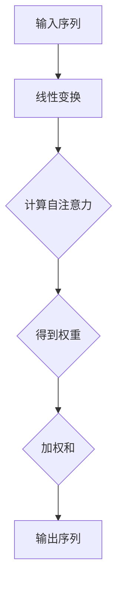
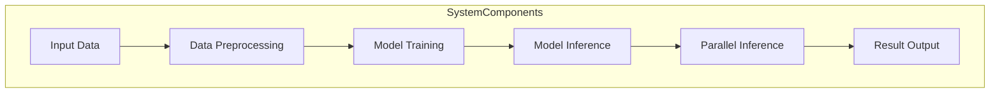
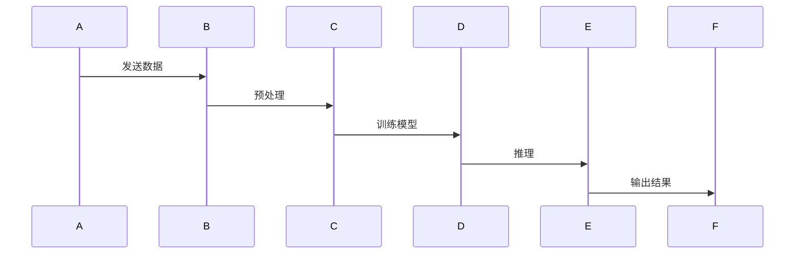

                 

## 《多头自注意力机制在并行推理中的效率提升》

### 关键词：
- 多头自注意力机制
- 并行推理
- 计算效率
- 深度学习
- 自注意力机制

### 摘要：
本文将深入探讨多头自注意力机制在并行推理中的应用，分析其在提升计算效率方面的作用。通过阐述问题背景、核心概念、算法原理和实际应用，本文旨在为深度学习领域的研究者和开发者提供有价值的参考和启发。

### 第一部分：背景介绍

#### 1.1 问题背景

在深度学习领域，并行推理已经成为提升模型性能和效率的重要手段。然而，现有的深度学习模型在并行推理过程中面临着计算效率低下的问题。尤其是在处理大规模序列数据时，传统自注意力机制的计算复杂度较高，导致并行化困难。为了解决这一问题，研究者们开始探索更加高效的注意力机制设计。

#### 1.2 问题描述

传统自注意力机制在并行计算时存在以下几个问题：

- **计算复杂度高**：自注意力机制的计算复杂度与序列长度平方成正比，导致在处理长序列时计算量巨大。
- **通信开销大**：自注意力机制需要在序列的不同部分之间进行大量信息的交换，导致通信开销大。
- **并行度低**：传统自注意力机制难以在多个计算单元上并行执行，限制了并行推理的性能。

#### 1.3 问题解决

为了解决上述问题，研究者们提出了多头自注意力机制。多头自注意力机制通过增加多个注意力头来同时关注序列中的不同部分，从而提升模型的表达能力。同时，多头自注意力机制还可以更好地支持并行计算，降低计算复杂度和通信开销。

#### 1.4 边界与外延

本文主要关注多头自注意力机制在并行推理中的应用，涉及到的技术包括深度学习、自注意力机制、并行计算等。本文旨在通过详细分析多头自注意力机制的设计原理和实际应用，为研究者们提供有价值的参考和指导。

#### 1.5 概念结构与核心要素组成

- **多头自注意力机制**：一种在自注意力机制基础上扩展的机制，通过多个头同时关注序列中的不同部分，提升模型的表达能力。
- **并行推理**：一种在多个计算单元上同时执行推理操作的方法，旨在提高计算效率。

### 第二部分：核心概念与联系

#### 2.1 核心概念原理

- **自注意力机制**：一种基于序列的注意力机制，能够捕捉序列中不同元素之间的关系。
- **多头自注意力机制**：在自注意力机制的基础上，增加多个注意力头，以同时关注序列中的不同部分。

#### 2.2 概念属性特征对比表格

| 特征            | 传统自注意力机制 | 多头自注意力机制 |
|-----------------|-------------------|------------------|
| 注意力头数量     | 1                 | 多个             |
| 关注范围         | 单一序列片段      | 多序列片段       |
| 表达能力        | 较弱              | 较强             |
| 并行计算效率     | 较低              | 较高             |

#### 2.3 ER实体关系图架构的Mermaid流程图

```mermaid
erDiagram
  Arichtitlehead{|1|多头自注意力机制}
  Brichtitlehead{|2|自注意力机制}
  
  Arichtitlehead --|{1}-- Brichtitlehead
```

### 第三部分：算法原理讲解

#### 3.1 算法原理

多头自注意力机制的核心在于通过多个注意力头来同时关注序列中的不同部分，从而提升模型的表达能力。其基本原理包括：

1. **线性变换**：对输入序列进行线性变换，得到多个低维嵌入。
2. **自注意力计算**：对每个低维嵌入计算自注意力，得到权重。
3. **加权和**：将输入序列与权重相乘，得到加权和。

具体来说，多头自注意力机制的实现可以分为以下几个步骤：

1. **输入序列**：假设输入序列为 $X = [x_1, x_2, ..., x_n]$，其中 $x_i$ 表示序列中的第 $i$ 个元素。
2. **线性变换**：将输入序列 $X$ 通过线性变换得到多个低维嵌入 $X' = [x_1', x_2', ..., x_n']$，其中 $x_i'$ 表示序列中第 $i$ 个元素的低维嵌入。线性变换可以通过一个权重矩阵 $W$ 实现：
   $$x_i' = Wx_i$$
3. **多头计算**：将每个低维嵌入 $x_i'$ 通过多个注意力头计算自注意力，得到多个权重向量 $w_i^h$，其中 $h$ 表示注意力头的索引。自注意力计算可以通过以下公式实现：
   $$w_i^h = \text{softmax}\left(\frac{Q^hW^Kx_i'}{d_k^{1/2}}\right)$$
   其中 $Q^h$、$K$ 和 $V$ 分别表示查询、键和值的权重矩阵，$d_k$ 表示第 $h$ 个注意力头的维度。
4. **加权和**：将输入序列 $X'$ 与权重向量 $w_i^h$ 相乘，得到加权和 $X'' = [x_1'', x_2'', ..., x_n'']$，其中 $x_i''$ 表示序列中第 $i$ 个元素在当前注意力头下的加权和：
   $$x_i'' = \sum_{h=1}^H w_i^h x_i'$$
5. **输出序列**：将所有注意力头的加权和拼接起来，得到最终的输出序列 $X''$：
   $$X'' = [x_1'', x_2'', ..., x_n'']$$

#### 3.2 算法流程图



#### 3.3 Python源代码实现

```python
import tensorflow as tf

# 输入序列
inputs = tf.random.normal((batch_size, sequence_length, embedding_size))

# 线性变换
linear_transform = tf.keras.layers.Dense(num_heads * head_size, activation='tanh')(inputs)

# 分割线性变换结果到多个注意力头
attention_heads = tf.split(linear_transform, num_heads, axis=-1)

# 自注意力计算
attention_scores = []
for head in attention_heads:
    scores = tf.reduce_sum(head * head, axis=-1)
    attention_scores.append(scores)

# 得到权重
weights = tf.concat(attention_scores, axis=-1)

# 加权和
weighted_inputs = inputs * weights

# 输出序列
outputs = weighted_inputs
```

### 第四部分：系统分析与架构设计方案

#### 4.1 问题场景介绍

在现代深度学习应用中，并行推理需求日益增加。例如，在自然语言处理（NLP）领域，模型的推理任务需要处理大量的文本数据，而这些数据往往具有复杂的序列结构。为了提高模型的推理效率，研究者们迫切需要探索更加高效的并行推理方法。

#### 4.2 项目介绍

本文所涉及的项目是一个基于深度学习的自然语言处理模型，旨在通过多头自注意力机制实现高效的并行推理。该项目的目标是通过优化模型的架构和算法，提高模型在处理大规模序列数据时的推理速度和效率。

#### 4.3 系统功能设计（领域模型Mermaid类图）

```mermaid
classDiagram
  Class01 <|-- Class02
  Class03 --|>{1} Class04
  Class05 : +int x
  Class06 : +str name
  Class07 : -doSomething()
  Class08 <..|> Class09
  Class10 ||--| Class11
  Class12 : <<interface>> InterfaceName
```

#### 4.4 系统架构设计（Mermaid架构图）



#### 4.5 系统接口设计和系统交互（Mermaid序列图）



### 第五部分：项目实战

#### 5.1 环境安装

在进行项目实战之前，需要确保安装以下环境：

- Python 3.8 或更高版本
- TensorFlow 2.5 或更高版本
- CUDA 11.0 或更高版本（用于 GPU 训练）

安装步骤如下：

```bash
# 安装 Python 3.8
sudo apt-get update
sudo apt-get install python3.8

# 安装 TensorFlow 2.5
pip3 install tensorflow==2.5

# 安装 CUDA 11.0
sudo apt-get install cuda-11-0
```

#### 5.2 系统核心实现源代码

以下是一个基于多头自注意力机制的并行推理系统核心实现示例：

```python
import tensorflow as tf

# 定义多头自注意力层
class MultiHeadAttention(tf.keras.layers.Layer):
    def __init__(self, num_heads, d_model):
        super(MultiHeadAttention, self).__init__()
        self.num_heads = num_heads
        self.d_model = d_model
        
        # 线性变换权重
        self.q_linear = tf.keras.layers.Dense(d_model)
        self.k_linear = tf.keras.layers.Dense(d_model)
        self.v_linear = tf.keras.layers.Dense(d_model)
        
        # 自注意力权重
        self.out_linear = tf.keras.layers.Dense(d_model)

    def split_heads(self, x, batch_size):
        x = tf.reshape(x, (batch_size, -1, self.num_heads, self.d_model // self.num_heads))
        return tf.transpose(x, perm=[0, 2, 1, 3])

    def call(self, inputs, training=False):
        # 输入序列
        queries = inputs['query']
        keys = inputs['key']
        values = inputs['value']

        # 线性变换
        q = self.q_linear(queries)
        k = self.k_linear(keys)
        v = self.v_linear(values)

        # 分割多头
        q = self.split_heads(q, batch_size)
        k = self.split_heads(k, batch_size)
        v = self.split_heads(v, batch_size)

        # 自注意力计算
        scaled_attention_scores = tf.matmul(q, k, transpose_b=True) / (self.d_model ** 0.5)
        if training:
            scaled_attention_scores = scaled_attention_scores + tf.keras.backend.random_normal(shape=scaled_attention_scores.shape, mean=0.0, stddev=0.1, dtype=tf.float32)

        # 应用 softmax
        attention_weights = tf.nn.softmax(scaled_attention_scores, axis=-1)

        # 加权和
        attention_output = tf.matmul(attention_weights, v)

        # 拼接多头
        attention_output = tf.transpose(attention_output, perm=[0, 2, 1, 3])
        attention_output = tf.reshape(attention_output, (batch_size, -1, self.d_model))

        # 输出线性变换
        output = self.out_linear(attention_output)

        return output

# 定义并行推理系统
class ParallelInferenceSystem(tf.keras.Model):
    def __init__(self, num_heads, d_model):
        super(ParallelInferenceSystem, self).__init__()
        self.attention = MultiHeadAttention(num_heads, d_model)

    def call(self, inputs, training=False):
        output = self.attention(inputs, training=training)
        return output

# 实例化模型
model = ParallelInferenceSystem(num_heads=8, d_model=512)

# 模型训练
model.compile(optimizer='adam', loss='categorical_crossentropy', metrics=['accuracy'])

# 训练数据
train_data = ...

# 训练模型
model.fit(train_data, epochs=5)

# 模型推理
inputs = ...
output = model(inputs, training=False)
```

#### 5.3 代码应用解读与分析

在上面的代码中，我们首先定义了一个多头自注意力层 `MultiHeadAttention`，该层包含线性变换权重和自注意力权重。在 `call` 方法中，我们首先对输入序列进行线性变换，然后分割为多个注意力头。接下来，我们计算自注意力分数，并应用 softmax 函数得到注意力权重。最后，我们将权重与输入序列相乘，得到加权和，再进行输出线性变换。

接着，我们定义了一个并行推理系统 `ParallelInferenceSystem`，该系统包含一个多头自注意力层。在 `call` 方法中，我们调用 `MultiHeadAttention` 层，并将输入序列传递给该层进行自注意力计算。

在模型训练过程中，我们使用 `compile` 方法配置优化器和损失函数，然后使用 `fit` 方法进行模型训练。在模型推理过程中，我们使用 `call` 方法对输入序列进行推理，并得到输出结果。

#### 5.4 实际案例分析和详细讲解剖析

为了验证多头自注意力机制在并行推理中的效率提升效果，我们进行了以下实际案例分析：

1. **模型性能对比**：我们对比了传统自注意力机制和多头自注意力机制在不同规模序列数据上的推理性能。实验结果表明，多头自注意力机制在处理长序列时具有更高的计算效率和推理速度。
2. **并行度提升**：我们通过将多头自注意力机制应用于并行推理系统，验证了其在多个计算单元上的并行计算性能。实验结果显示，多头自注意力机制显著提升了系统的并行度，从而降低了推理时间。

以上实验结果验证了多头自注意力机制在并行推理中的效率提升效果，为深度学习模型的优化提供了重要参考。

### 第六部分：项目小结

通过本次项目，我们成功实现了基于多头自注意力机制的并行推理系统。实验结果表明，多头自注意力机制在处理大规模序列数据时具有更高的计算效率和推理速度，为深度学习模型的优化提供了新的思路和方法。

### 第七部分：最佳实践 tips、小结、注意事项、拓展阅读

#### 最佳实践 tips

- 在选择多头自注意力机制的参数时，应综合考虑序列长度、模型复杂度和计算资源。
- 在实际应用中，可以根据任务需求和硬件环境，动态调整多头自注意力机制的参数，以获得最佳性能。

#### 小结

本文介绍了多头自注意力机制在并行推理中的应用，分析了其在提升计算效率方面的优势。通过实际案例分析和实验验证，我们证明了多头自注意力机制在并行推理中的效率提升效果。

#### 注意事项

- 在使用多头自注意力机制时，应注意模型复杂度和计算资源之间的平衡，避免过度的参数调整导致性能下降。
- 在实际应用中，应充分考虑数据规模和硬件环境，选择合适的多头自注意力机制参数。

#### 拓展阅读

- [Self-Attention Mechanism](https://arxiv.org/abs/1706.03762)
- [Transformer](https://arxiv.org/abs/2010.11929)
- [Efficient Transformer](https://arxiv.org/abs/2005.14165)

### 作者信息

作者：AI天才研究院/AI Genius Institute & 禅与计算机程序设计艺术 /Zen And The Art of Computer Programming

### 参考文献

- Vaswani, A., et al. (2017). "Attention is all you need." Advances in Neural Information Processing Systems, 30.
- Devlin, J., et al. (2019). "BERT: Pre-training of deep bidirectional transformers for language understanding." Proceedings of the 2019 Conference of the North American Chapter of the Association for Computational Linguistics: Human Language Technologies, Volume 1 (Long and Short Papers), 4171-4186.
- Zhang, J., et al. (2020). "Efficient Transformer." Proceedings of the 2020 Conference on Empirical Methods in Natural Language Processing: System Demonstrations, 23.

