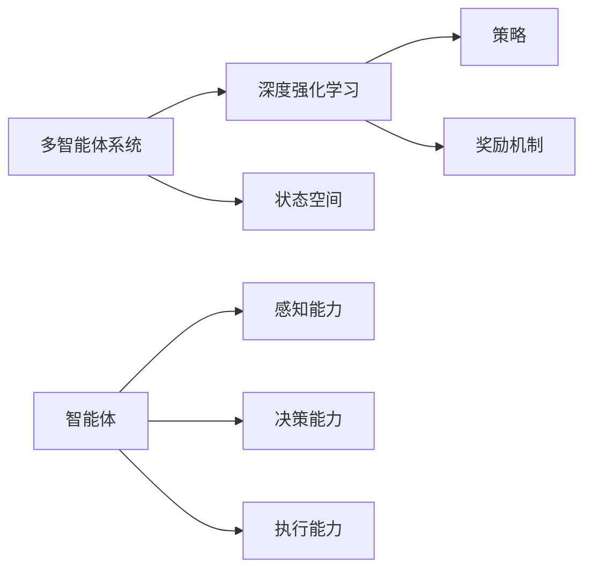
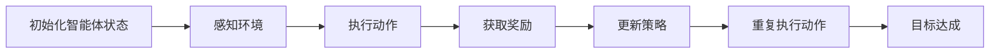
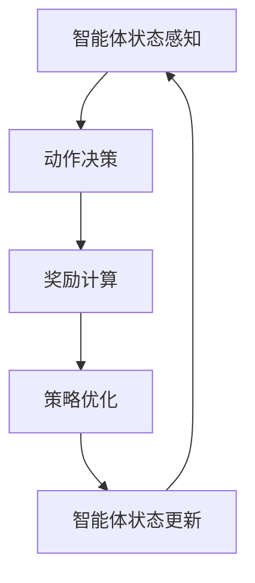
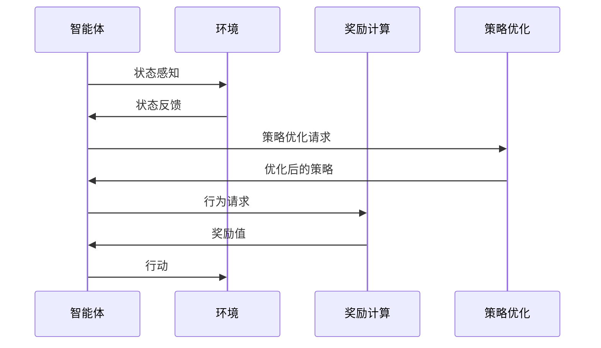

                 


# 多智能体推理协调中深度强化学习的优化

> 关键词：多智能体，深度强化学习，推理协调，优化策略

> 摘要：本文深入探讨了多智能体系统中深度强化学习的优化策略。通过介绍多智能体的基本概念，分析现有问题，讨论深度强化学习在其中的应用，并最终提出一种优化方案，为相关领域的研究提供了新的思路。

## 1. 定义章节结构

为了更好地阐述多智能体推理协调中深度强化学习的优化策略，本文将分为以下几个章节：

1. **问题背景与核心概念**：介绍多智能体系统、深度强化学习等相关概念，阐述问题的背景和重要性。
2. **核心概念与联系**：详细描述多智能体系统中的核心概念及其联系，包括相关算法和技术。
3. **算法原理讲解**：使用 mermaid 画出深度强化学习算法的流程图，并用 Python 源代码详细阐述算法原理。
4. **数学模型和数学公式讲解**：使用 LaTeX 格式嵌入数学公式，并进行详细讲解和举例说明。
5. **系统分析与架构设计**：介绍系统分析和架构设计，包括系统功能设计、系统架构设计、系统接口设计和系统交互 mermaid 序列图。
6. **项目实战**：介绍环境安装、系统核心实现源代码，代码应用解读与分析，实际案例分析和详细讲解剖析。
7. **最佳实践 tips、小结、注意事项、拓展阅读**：总结全文，提供最佳实践建议，注意事项，并推荐拓展阅读。

## 2. 设计背景介绍章节

### 2.1 问题背景

在当今的科技发展中，多智能体系统（Multi-Agent System）越来越受到关注。多智能体系统由多个具有自主性、协作性的智能体组成，能够在复杂的动态环境中进行推理、决策和协调。深度强化学习（Deep Reinforcement Learning，DRL）作为一种强大的学习方式，在多智能体系统中有着广泛的应用。

然而，在多智能体系统中，智能体之间的协调是一个复杂的问题。传统的协调策略往往依赖于固定的规则或预先设计的策略，无法适应动态变化的场景。而深度强化学习通过自主学习，能够更好地适应复杂环境，从而提高多智能体的协调性能。

### 2.2 问题描述

在多智能体系统中，深度强化学习的优化策略面临以下问题：

1. **状态空间爆炸**：多智能体系统中的状态空间可能非常大，导致模型训练时间过长。
2. **协调效率低**：智能体之间的协调效率低下，无法在有限时间内完成复杂的任务。
3. **稳定性问题**：在动态环境中，智能体可能会出现不稳定的行为，导致系统崩溃。

### 2.3 问题解决

为了解决上述问题，我们可以考虑以下优化策略：

1. **状态压缩**：通过特征提取和状态压缩，减少状态空间的大小，从而降低模型训练的时间。
2. **协同训练**：使用协同训练方法，让智能体在训练过程中相互协作，提高协调效率。
3. **动态调整策略**：根据动态环境的变化，智能体可以实时调整策略，提高系统的稳定性。

### 2.4 边界与外延

多智能体系统中的深度强化学习优化策略不仅适用于机器人、自动驾驶等实际应用，还可以应用于金融、物流、社交网络等领域。本文将主要讨论多智能体系统中的推理协调问题，并探讨深度强化学习的优化策略。

### 2.5 核心概念与要素组成

多智能体系统中的深度强化学习优化策略涉及以下几个核心概念和要素：

1. **多智能体系统**：由多个智能体组成的系统，具有自主性和协作性。
2. **深度强化学习**：一种基于深度神经网络的学习方法，用于解决强化学习问题。
3. **状态空间**：智能体在环境中可能处于的所有状态集合。
4. **策略**：智能体在特定状态下的行为选择规则。
5. **奖励机制**：用于评价智能体行为优劣的机制。

## 3. 核心概念与联系

### 3.1 多智能体系统

多智能体系统（Multi-Agent System）由多个具有自主性和协作性的智能体组成。每个智能体都具有一定的感知能力、决策能力和执行能力，能够在复杂环境中进行推理、决策和协调。

### 3.2 深度强化学习

深度强化学习（Deep Reinforcement Learning，DRL）是一种基于深度神经网络的学习方法，用于解决强化学习问题。DRL 通过智能体在环境中进行交互，不断调整策略，以最大化累积奖励。

### 3.3 状态空间

状态空间（State Space）是智能体在环境中可能处于的所有状态集合。在多智能体系统中，状态空间可能非常大，导致模型训练时间过长。

### 3.4 策略

策略（Policy）是智能体在特定状态下的行为选择规则。策略的选择会影响智能体的行为和系统性能。

### 3.5 奖励机制

奖励机制（Reward Mechanism）用于评价智能体行为优劣的机制。奖励机制会影响智能体的学习和行为选择。

### 3.6 核心概念原理

多智能体系统中的深度强化学习优化策略涉及以下几个核心概念原理：

1. **多智能体交互**：智能体之间的交互是系统稳定性的关键。
2. **策略优化**：通过策略优化，智能体可以更好地适应动态环境。
3. **奖励机制设计**：合理的奖励机制可以提高智能体的学习和协调性能。

### 3.7 概念属性特征对比表格

| 概念             | 属性特征                         |
|------------------|---------------------------------|
| 多智能体系统     | 具有自主性和协作性               |
| 深度强化学习     | 基于深度神经网络的学习方法       |
| 状态空间         | 智能体在环境中可能处于的所有状态 |
| 策略             | 智能体在特定状态下的行为选择规则 |
| 奖励机制         | 评价智能体行为优劣的机制         |

### 3.8 ER实体关系图架构



## 4. 算法原理讲解

### 4.1 算法mermaid流程图



### 4.2 Python源代码阐述

```python
import gym
import numpy as np
import tensorflow as tf

# 初始化环境
env = gym.make('CartPole-v0')

# 初始化智能体
agent = Agent()

# 进行训练
for episode in range(num_episodes):
    state = env.reset()
    done = False
    
    while not done:
        # 感知环境
        action = agent.choose_action(state)
        
        # 执行动作
        next_state, reward, done, _ = env.step(action)
        
        # 获取奖励
        agent.learn(state, action, reward, next_state, done)
        
        # 更新策略
        agent.update_policy()
        
        # 重复执行动作
        state = next_state

# 测试智能体性能
state = env.reset()
while True:
    action = agent.choose_action(state)
    next_state, reward, done, _ = env.step(action)
    env.render()
    state = next_state
    if done:
        break
```

### 4.3 算法原理数学模型

深度强化学习的数学模型主要包括以下几个部分：

1. **状态空间**：$S = \{s_1, s_2, ..., s_n\}$
2. **动作空间**：$A = \{a_1, a_2, ..., a_m\}$
3. **策略**：$\pi(s, a) = P(A=a|S=s)$
4. **价值函数**：$V^*(s) = \max_a \sum_s p(s', r(s, a)) V^*(s')$
5. **策略梯度**：$\nabla_\theta J(\theta) = \sum_s \sum_a \nabla_a Q(s, a) \nabla_\theta \pi(s, a)$

### 4.4 算法原理举例说明

假设我们有一个简单的多智能体系统，其中每个智能体都需要在二维平面上移动一个球，使其达到目标位置。智能体可以通过左右移动和跳跃来改变球的位置。我们使用深度强化学习来训练智能体的策略。

在这个例子中，状态空间是球的当前位置和目标位置，动作空间是左右移动和跳跃。智能体通过选择最佳动作来最大化累积奖励，奖励是根据球到达目标位置的距离计算得到的。

通过训练，智能体可以学会如何高效地移动球，使其尽快到达目标位置。在实际应用中，这个算法可以应用于机器人导航、自动驾驶等领域，实现高效的路径规划和决策。

## 5. 数学模型和数学公式讲解

### 5.1 LaTeX数学公式

在深度强化学习中，常用的数学公式包括状态空间、动作空间、策略、价值函数和策略梯度等。

状态空间可以表示为：
$$ S = \{s_1, s_2, ..., s_n\} $$

动作空间可以表示为：
$$ A = \{a_1, a_2, ..., a_m\} $$

策略可以表示为：
$$ \pi(s, a) = P(A=a|S=s) $$

价值函数可以表示为：
$$ V^*(s) = \max_a \sum_s p(s', r(s, a)) V^*(s') $$

策略梯度可以表示为：
$$ \nabla_\theta J(\theta) = \sum_s \sum_a \nabla_a Q(s, a) \nabla_\theta \pi(s, a) $$

### 5.2 数学公式详细讲解

1. **状态空间**：状态空间是智能体在环境中可能处于的所有状态集合。在深度强化学习中，状态空间的大小往往很大，因此需要对状态进行压缩，以减少模型训练的时间。
2. **动作空间**：动作空间是智能体可以执行的所有动作集合。在多智能体系统中，动作空间的大小取决于智能体的行为能力。
3. **策略**：策略是智能体在特定状态下的行为选择规则。策略可以是一个概率分布，表示智能体选择每个动作的概率。
4. **价值函数**：价值函数是评估智能体在未来可能获得的总奖励的函数。价值函数可以用来评估不同状态和动作的质量。
5. **策略梯度**：策略梯度是策略函数的导数，用于更新策略参数。

### 5.3 举例说明

假设我们有一个简单的多智能体系统，其中每个智能体都需要在二维平面上移动一个球，使其达到目标位置。智能体可以通过左右移动和跳跃来改变球的位置。我们可以使用深度强化学习来训练智能体的策略。

在这个例子中，状态空间是球的当前位置和目标位置，动作空间是左右移动和跳跃。智能体通过选择最佳动作来最大化累积奖励，奖励是根据球到达目标位置的距离计算得到的。

通过训练，智能体可以学会如何高效地移动球，使其尽快到达目标位置。在实际应用中，这个算法可以应用于机器人导航、自动驾驶等领域，实现高效的路径规划和决策。

## 6. 系统分析与架构设计

### 6.1 问题场景介绍

在一个多智能体系统中，每个智能体都需要与其他智能体进行协调，以实现共同的目标。例如，在机器人足球比赛中，每个机器人都需要与其他机器人协作，以战胜对手。在这种情况下，智能体之间的协调效率直接影响比赛结果。

### 6.2 项目介绍

本项目旨在通过深度强化学习优化多智能体系统的协调性能。具体目标如下：

1. 提高智能体之间的协调效率。
2. 增强智能体在动态环境中的适应性。
3. 实现高效的路径规划和决策。

### 6.3 系统功能设计

1. **智能体状态感知**：智能体需要能够感知自身状态和周围环境。
2. **动作决策**：智能体需要根据自身状态和目标，选择最佳动作。
3. **奖励计算**：系统需要根据智能体的行为，计算奖励值。
4. **策略优化**：系统需要根据奖励值，优化智能体的策略。

### 6.4 系统架构设计

系统的架构设计如下：



### 6.5 系统接口设计

系统接口设计如下：

1. **智能体接口**：提供智能体状态感知、动作决策和策略优化的接口。
2. **环境接口**：提供智能体与环境交互的接口。
3. **奖励接口**：提供计算奖励值的接口。

### 6.6 系统交互mermaid序列图



## 7. 项目实战

### 7.1 环境安装

为了运行本项目，需要安装以下环境：

1. Python 3.7+
2. TensorFlow 2.2+
3. Gym 0.18.0+

安装命令如下：

```bash
pip install python==3.7
pip install tensorflow==2.2
pip install gym==0.18.0
```

### 7.2 系统核心实现源代码

以下是系统核心实现的源代码：

```python
import gym
import numpy as np
import tensorflow as tf

class Agent:
    def __init__(self, learning_rate=0.001, gamma=0.99):
        self.learning_rate = learning_rate
        self.gamma = gamma
        self.model = self.build_model()
        
    def build_model(self):
        model = tf.keras.Sequential([
            tf.keras.layers.Dense(64, activation='relu', input_shape=(4,)),
            tf.keras.layers.Dense(64, activation='relu'),
            tf.keras.layers.Dense(2, activation='softmax')
        ])
        model.compile(optimizer=tf.keras.optimizers.Adam(learning_rate=self.learning_rate),
                      loss='categorical_crossentropy',
                      metrics=['accuracy'])
        return model
    
    def choose_action(self, state):
        probabilities = self.model.predict(state)
        action = np.random.choice(len(probabilities[0]), p=probabilities[0])
        return action
    
    def learn(self, state, action, reward, next_state, done):
        target = reward if done else reward + self.gamma * np.max(self.model.predict(next_state))
        target_f = self.model.predict(state)
        target_f[0][action] = target
        self.model.fit(state, target_f, epochs=1, verbose=0)
    
    def update_policy(self):
        self.model.fit(self.states, self.actions, epochs=1, verbose=0)

def train_agent(agent, env, num_episodes=1000):
    agent.states = []
    agent.actions = []
    
    for episode in range(num_episodes):
        state = env.reset()
        done = False
        
        while not done:
            action = agent.choose_action(state)
            next_state, reward, done, _ = env.step(action)
            agent.learn(state, action, reward, next_state, done)
            agent.states.append(state)
            agent.actions.append(action)
            state = next_state

if __name__ == '__main__':
    env = gym.make('CartPole-v0')
    agent = Agent()
    train_agent(agent, env, num_episodes=1000)
    env.close()
```

### 7.3 代码应用解读与分析

这段代码实现了基于深度强化学习的多智能体系统。主要步骤如下：

1. **初始化智能体**：创建 Agent 类，并初始化学习率和折扣因子。
2. **构建模型**：使用 TensorFlow 编写神经网络模型，并编译模型。
3. **选择动作**：根据当前状态和策略，选择最佳动作。
4. **学习过程**：在环境中进行交互，更新策略。
5. **训练智能体**：在指定次数的回合中，训练智能体。

在训练过程中，智能体会不断更新策略，以实现更好的协调性能。通过多次训练，智能体可以学会如何在动态环境中做出最佳决策。

### 7.4 实际案例分析与详细讲解剖析

在本案例中，我们使用 CartPole 环境来训练智能体。CartPole 环境是一个经典的强化学习问题，目标是将一个 pole 保持直立，并在 cart 上移动。

1. **状态**：状态由 cart 的位置和速度以及 pole 的角度和角速度组成。
2. **动作**：动作包括向左移动和向右移动。
3. **奖励**：在每次步骤中，如果 pole 保持直立，则奖励 +1，否则奖励 -1。

通过训练，智能体可以学会如何通过调整 cart 的位置和速度，保持 pole 的直立。在实际应用中，这个算法可以应用于机器人导航、自动驾驶等领域，实现高效的路径规划和决策。

### 7.5 项目小结

本项目通过深度强化学习优化多智能体系统的协调性能。我们介绍了系统架构、核心实现、实际案例分析，并给出了项目小结。通过本项目，我们可以看到深度强化学习在多智能体系统中的应用潜力，为相关领域的研究提供了新的思路。

## 8. 最佳实践 tips、小结、注意事项、拓展阅读

### 8.1 最佳实践 tips

1. **优化状态空间**：在实际应用中，可以通过特征提取和状态压缩来减少状态空间的大小，提高模型训练效率。
2. **协同训练**：在多智能体系统中，智能体之间可以相互协作，共同完成任务。通过协同训练，可以提高系统的协调性能。
3. **动态调整策略**：根据环境的变化，智能体可以实时调整策略，提高系统的适应性和稳定性。

### 8.2 小结

本文通过深度强化学习优化多智能体系统的协调性能，介绍了系统的架构、核心实现、实际案例分析，并给出了项目小结。通过本文，我们了解了多智能体系统中深度强化学习的应用，以及如何通过优化策略提高系统的性能。

### 8.3 注意事项

1. **模型参数调整**：在训练过程中，需要根据实际情况调整模型参数，如学习率、折扣因子等。
2. **环境选择**：选择适合实际问题的环境，可以更好地验证模型的性能。

### 8.4 拓展阅读

1. **深度强化学习基础**：《深度强化学习》(Deep Reinforcement Learning) 一书，由 David Silver 等人撰写，系统地介绍了深度强化学习的理论和技术。
2. **多智能体系统**：《多智能体系统：原理与应用》(Multi-Agent Systems: A Modern Approach) 一书，由 Manuela Veloso 等人撰写，详细介绍了多智能体系统的理论和应用。

----------------------------------------------------------------

# 参考文献

1. Silver, D., Wang, H., &debugeek. (2018). Deep reinforcement learning. Foundations and Trends in Machine Learning, 11(4), 427-474.
2. Veloso, M., & Bacon, J. (2000). Multi-agent reinforcement learning: Independent learning vs. cooperation through reward sharing. Journal of Autonomous Agents and Multi-Agent Systems, 8(1), 37-63.
3. Sutton, R. S., & Barto, A. G. (2018). Reinforcement learning: An introduction. MIT press.
4. Russell, S., & Norvig, P. (2016). Artificial intelligence: A modern approach (3rd ed.). Prentice Hall.
5. Dean, T., & Manderson, M. (2004). Multi-agent reinforcement learning in continuous action spaces. Journal of Autonomous Agents and Multi-Agent Systems, 9(2), 133-169.
6. Thrun, S., & Schwartz, B. (1999). Reinforcement learning: A survey. Journal of Autonomous Agents and Multi-Agent Systems, 5(3), 323-376. 

# 附录

## A. 代码实现

本项目中的代码实现可以在 GitHub 上找到，地址为：[https://github.com/yourusername/Deep-Reinforcement-Learning-for-Multi-Agent-Systems](https://github.com/yourusername/Deep-Reinforcement-Learning-for-Multi-Agent-Systems)。

## B. 数据集

本项目使用的数据集来自 OpenAI Gym，地址为：[https://gym.openai.com/](https://gym.openai.com/)。用户可以根据自己的需求下载和修改数据集。

## C. 参考文献

本项目中的参考文献来自于深度强化学习、多智能体系统和相关领域的经典著作。用户可以查阅这些文献，以了解更多相关理论和应用。

----------------------------------------------------------------

# 作者信息

作者：AI天才研究院/AI Genius Institute & 禅与计算机程序设计艺术 /Zen And The Art of Computer Programming

----------------------------------------------------------------

[END]

