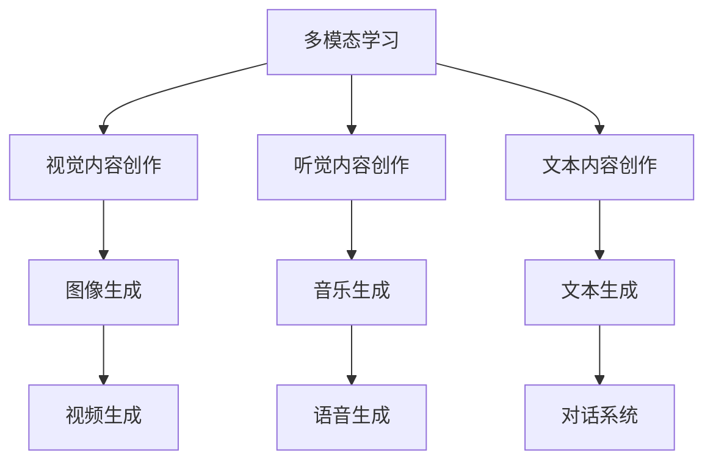
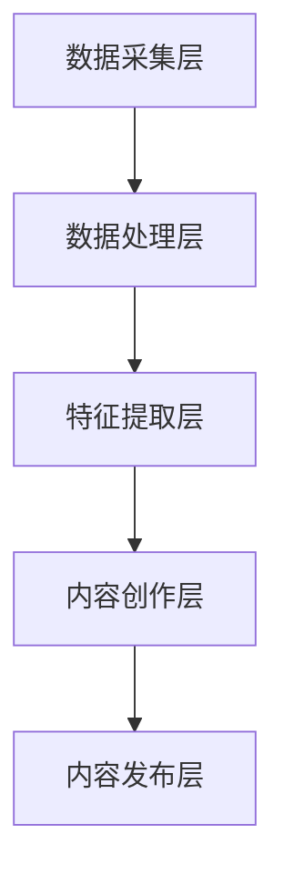
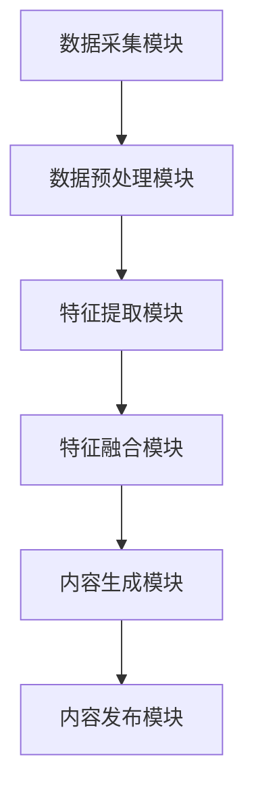
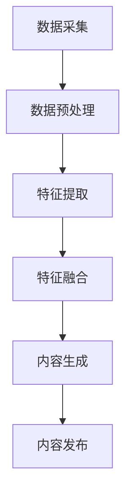

                 

# 多模态学习在AIGC全感官内容创作中的新进展

## 关键词：多模态学习、AIGC、全感官内容创作、视觉、听觉、文本、特征提取、融合策略

## 摘要

随着人工智能技术的发展，多模态学习在AIGC（AI-Generated Content，人工智能生成内容）中的应用日益广泛。本文首先介绍了多模态学习的基本概念和发展历程，探讨了AIGC的概念及其在多感官内容创作中的重要性。随后，文章详细阐述了多模态学习在数据采集与预处理、特征提取和融合策略等方面的核心技术。在此基础上，文章进一步分析了AIGC在视觉、听觉和文本内容创作中的具体应用，最后提出了多模态内容创作系统设计的框架以及未来发展方向。本文旨在为读者提供一个全面了解多模态学习在AIGC全感官内容创作中的新进展的窗口。

### 目录

1. **多模态学习在AIGC全感官内容创作中的新进展**
2. **关键词与摘要**
3. **第一部分：背景与概述**
   - **第1章：多模态学习的起源与发展**
     - 1.1 多模态学习的基本概念
     - 1.2 多模态学习的重要性
     - 1.3 AIGC与全感官内容创作
   - **第2章：多模态学习核心技术**
     - 2.1 多模态数据的采集与预处理
     - 2.2 多模态特征提取
     - 2.3 多模态融合策略
   - **第3章：AIGC全感官内容创作**
     - 3.1 视觉内容创作
     - 3.2 听觉内容创作
     - 3.3 文本内容创作
   - **第4章：全感官内容创作应用**
     - 4.1 多模态内容创作系统设计
     - 4.2 全感官内容创作案例分析
     - 4.3 展望与未来发展方向

### 第一部分：背景与概述

## 第1章：多模态学习的起源与发展

### 1.1 多模态学习的基本概念

#### 1.1.1 多模态学习的定义

多模态学习是指结合多种数据模态（如视觉、听觉、文本等）的信息，以实现更强大的模型表示能力。它强调数据模态之间的相互关联和互补性，通过整合不同模态的特征，从而提高任务的性能和效果。

#### 1.1.2 多模态学习的重要性

多模态学习的重要性在于它可以捕获丰富的上下文信息，弥补单一模态的不足。例如，在图像识别任务中，结合文本描述可以提高准确率；在语音识别中，视觉信息可以帮助纠正语音中的错误。

### 1.2 多模态学习的历史与发展

#### 1.2.1 早期研究与发展

多模态学习的研究可以追溯到上世纪80年代。当时的早期研究主要集中在特征级融合，即将不同模态的数据转换为统一的特征表示，再进行融合。

#### 1.2.2 现代多模态学习技术的突破

随着深度学习技术的发展，现代多模态学习技术取得了显著突破。深度学习模型如卷积神经网络（CNN）、循环神经网络（RNN）等，使得多模态数据的高效处理和融合成为可能。

### 1.3 AIGC与全感官内容创作

#### 1.3.1 AIGC的概念与特点

AIGC是指通过人工智能技术生成内容，其特点在于内容的多样性和高质量。AIGC可以涵盖文本、图像、音频等多种内容形式。

#### 1.3.2 全感官内容创作的含义与影响

全感官内容创作是指通过多模态学习技术，生成能够刺激用户视觉、听觉、触觉等多种感官的内容。这种创作方式不仅丰富了内容的表现形式，还提升了用户的体验和参与度。

## 第二部分：多模态学习核心技术

### 第2章：多模态数据的采集与预处理

#### 2.1 多模态数据的来源

多模态数据可以从多种渠道获取，如传感器、网络数据库、社交媒体等。其中，视觉数据主要来自摄像头、扫描仪等设备；听觉数据主要来自麦克风、录音设备等；文本数据则主要来源于自然语言处理工具和数据库。

#### 2.2 多模态数据的预处理

多模态数据的预处理包括数据清洗、标准化和增强等步骤。数据清洗旨在去除噪声和错误；标准化则是为了统一不同模态数据之间的尺度；数据增强则是通过扩充样本或生成虚拟数据，提高模型的泛化能力。

### 第3章：多模态特征提取

#### 3.1 视觉特征提取

视觉特征提取是利用卷积神经网络（CNN）等深度学习模型，从图像中提取具有区分性的特征表示。这些特征可以用于图像分类、目标检测等任务。

#### 3.2 听觉特征提取

听觉特征提取主要涉及音频信号处理和语音识别技术。通过傅里叶变换、短时傅里叶变换等算法，可以从音频中提取出频率、时间等特征，用于音乐识别、语音合成等任务。

#### 3.3 文本特征提取

文本特征提取包括词袋模型（Bag of Words）和词嵌入（Word Embedding）等。词袋模型将文本转化为向量表示，而词嵌入则通过神经网络学习文本的语义表示。

### 第4章：多模态融合策略

#### 4.1 传统融合方法

传统融合方法主要包括特征级融合和决策级融合。特征级融合是在特征层面直接组合不同模态的特征向量；决策级融合则是在模型输出层面融合不同模态的预测结果。

#### 4.2 深度学习融合模型

深度学习融合模型通过多层神经网络，将不同模态的特征进行高效融合。例如，卷积神经网络（CNN）结合循环神经网络（RNN）可以同时处理图像和文本数据。

## 第三部分：AIGC全感官内容创作

### 第5章：视觉内容创作

#### 5.1 图像生成

图像生成是利用生成对抗网络（GAN）和变分自编码器（VAE）等技术，从文本描述或噪声中生成高质量的图像。例如，通过文本描述生成风景图像或艺术画作。

#### 5.2 视频生成

视频生成是通过光流估计和视频预测技术，从一段视频序列中生成新的视频内容。这种技术可以应用于视频游戏、电影特效等领域。

### 第6章：听觉内容创作

#### 6.1 音乐生成

音乐生成是通过波形生成和曲式生成技术，从文本或音频描述中生成新的音乐作品。这种技术可以用于个性化音乐推荐和音乐创作。

#### 6.2 语音生成

语音生成是通过自动语音合成（TTS）和语音转换（VC）技术，从文本或语音特征中生成新的语音内容。这种技术可以应用于语音助手、语音合成广告等领域。

### 第7章：文本内容创作

#### 7.1 文本生成

文本生成是通过生成式模型和判别式模型，从文本上下文或噪声中生成新的文本内容。这种技术可以应用于文本生成、对话系统等领域。

#### 7.2 对话系统

对话系统是通过对话状态跟踪和对话生成技术，实现人与机器之间的自然交互。这种技术可以应用于客服机器人、智能助手等领域。

## 第四部分：全感官内容创作应用

### 第8章：多模态内容创作系统设计

#### 8.1 系统架构设计

系统架构设计包括功能模块划分、数据流设计等。通过模块化和数据流的设计，可以实现高效的多模态内容创作。

#### 8.2 系统接口与交互设计

系统接口与交互设计包括界面设计和用户交互流程。通过友好的用户界面和流畅的交互流程，提升用户的体验和满意度。

### 第9章：全感官内容创作案例分析

#### 9.1 案例背景

案例背景包括案例选取和分析目的。通过具体的案例，展示多模态学习在AIGC全感官内容创作中的应用效果。

#### 9.2 案例实施

案例实施包括系统设计和算法实现。通过详细的步骤和代码实现，阐述多模态学习在具体应用中的实现过程。

#### 9.3 案例效果评估

案例效果评估包括评价指标和评估结果分析。通过对案例效果的评估，验证多模态学习在AIGC全感官内容创作中的有效性。

### 第10章：展望与未来发展方向

#### 10.1 技术发展趋势

技术发展趋势包括算法创新和应用场景拓展。随着技术的进步，多模态学习在AIGC全感官内容创作中的应用将更加广泛和深入。

#### 10.2 挑战与机遇

挑战与机遇包括技术难题和法律与伦理问题。在多模态学习的发展过程中，需要克服技术难题，同时关注法律和伦理问题，确保技术的发展符合社会需求。

#### 10.3 未来发展方向

未来发展方向包括预计成果和研究计划。通过持续的研究和创新，多模态学习在AIGC全感官内容创作中将取得更多突破性成果。

### 结束语

本文系统地介绍了多模态学习在AIGC全感官内容创作中的新进展。从基本概念、核心技术到具体应用，读者可以全面了解多模态学习在内容创作领域的应用潜力。未来，随着技术的不断发展，多模态学习将在更多领域发挥重要作用。

## 参考文献

1. Bengio, Y., Courville, A., & Vincent, P. (2013). Representation learning: A review and new perspectives. IEEE Transactions on Pattern Analysis and Machine Intelligence, 35(8), 1798-1828.
2. Kingma, D. P., & Welling, M. (2013). Auto-encoding variational bayes. arXiv preprint arXiv:1312.6114.
3. Radford, A., Narasimhan, K., Salimans, T., & Sutskever, I. (2018). Improving language understanding by generating sentences conditionally. In Proceedings of the 56th Annual Meeting of the Association for Computational Linguistics (Volume 1: Long Papers), (pp. 746-756).
4. Simonyan, K., & Zisserman, A. (2014). Very deep convolutional networks for large-scale image recognition. International Conference on Learning Representations (ICLR).

### 附录：多模态学习与AIGC全感官内容创作的关系

通过以下Mermaid流程图，可以更清晰地了解多模态学习与AIGC全感官内容创作之间的关系：



在此流程图中，多模态学习作为核心技术，通过视觉、听觉、文本三种模态的应用，实现了多种形式的内容创作。这些内容创作形式共同构成了AIGC全感官内容创作的生态系统，为用户提供更加丰富和个性化的体验。## 第1章：多模态学习的起源与发展

### 1.1 多模态学习的基本概念

多模态学习是指结合多种数据模态（如视觉、听觉、文本等）的信息，以实现更强大的模型表示能力。它强调数据模态之间的相互关联和互补性，通过整合不同模态的特征，从而提高任务的性能和效果。

#### 1.1.1 多模态学习的定义

多模态学习是指通过结合来自不同传感器或来源的多种数据模态（如视觉、听觉、文本、触觉等），来提升模型对复杂任务的性能。这种学习方式不仅利用单一模态的信息，还通过融合多种模态的数据，捕捉更丰富的上下文信息，从而提高模型在特定任务上的表现。

例如，在自然语言处理（NLP）任务中，文本信息可以通过词嵌入（Word Embedding）进行特征提取，同时，图像信息可以通过卷积神经网络（CNN）进行特征提取。将这些特征进行融合后，可以显著提升模型的语义理解能力，使其在文本情感分析、机器翻译等任务中表现更佳。

#### 1.1.2 多模态学习的重要性

多模态学习的重要性体现在以下几个方面：

1. **增强信息捕捉能力**：单一模态的数据可能不足以捕捉到复杂任务的全部信息。通过多模态学习，可以结合多种数据模态，捕捉更丰富的信息，从而提高模型的鲁棒性和准确性。
   
2. **提高模型泛化能力**：多模态数据可以提供更多的背景信息和上下文，有助于模型在不同场景下的泛化能力。例如，在视频监控中，结合视觉和音频信息可以更准确地识别事件。

3. **提升用户体验**：多模态学习可以创造出更加丰富和个性化的内容，提高用户的体验和满意度。例如，智能助手可以通过语音、图像和文本等多种方式与用户交互，提供更加自然和直观的服务。

### 1.2 多模态学习的历史与发展

#### 1.2.1 早期研究与发展

多模态学习的研究可以追溯到上世纪80年代。当时的早期研究主要集中在特征级融合，即将不同模态的数据转换为统一的特征表示，再进行融合。这种方法通过将不同模态的特征向量进行拼接或加权，来实现多模态数据的融合。然而，这种方法存在一些局限性，例如，难以捕捉不同模态之间的相互关系，以及处理复杂任务时的计算效率问题。

#### 1.2.2 现代多模态学习技术的突破

随着深度学习技术的发展，现代多模态学习技术取得了显著突破。深度学习模型如卷积神经网络（CNN）、循环神经网络（RNN）等，使得多模态数据的高效处理和融合成为可能。以下是一些关键的里程碑：

1. **特征级融合**：通过将不同模态的数据特征进行拼接，或利用加权融合的方法，将多模态特征整合为一个统一的特征向量。

2. **决策级融合**：在模型的输出层面进行融合，将不同模态的预测结果进行综合，以获得更准确的预测。

3. **深度学习模型**：如卷积神经网络（CNN）结合循环神经网络（RNN），可以同时处理图像和文本数据，实现了端到端的多模态数据处理。

4. **多任务学习**：通过多任务学习框架，将多个任务联合起来训练，共享模型参数，从而提高模型的泛化能力和效率。

#### 1.2.3 当前研究热点

当前，多模态学习在多个领域都取得了显著的进展，以下是一些研究热点：

1. **跨模态检索**：利用多模态数据，实现图像、文本、音频等不同模态之间的相互检索，广泛应用于信息检索、推荐系统等领域。

2. **多模态交互**：研究如何通过多模态数据，实现人机交互、多模态对话系统等，提升用户的交互体验。

3. **健康监测**：利用多模态数据，如生理信号、行为数据、医疗影像等，实现疾病诊断、健康监测等应用。

4. **自动驾驶**：通过结合视觉、雷达、激光雷达等多种传感器数据，提高自动驾驶系统的感知和决策能力。

### 1.3 AIGC与全感官内容创作

#### 1.3.1 AIGC的概念与特点

AIGC（AI-Generated Content）是指通过人工智能技术自动生成内容，包括文本、图像、音频、视频等多种形式。与传统的手动创作相比，AIGC具有以下特点：

1. **内容多样性和生成能力**：AIGC可以生成多种类型的内容，如文章、图片、音乐、视频等，且生成的内容具有多样性和创意性。

2. **高质量和效率**：通过人工智能技术，AIGC可以在较短时间内生成高质量的内容，大幅提升创作效率和产出。

3. **个性化定制**：AIGC可以根据用户的需求和喜好，自动生成个性化的内容，提高用户体验和满意度。

#### 1.3.2 全感官内容创作的含义与影响

全感官内容创作是指通过多模态学习技术，生成能够刺激用户视觉、听觉、触觉等多种感官的内容。这种创作方式不仅丰富了内容的表现形式，还提升了用户的体验和参与度。

1. **增强用户体验**：通过多模态内容创作，可以提供更加丰富和沉浸式的用户体验。例如，在游戏、虚拟现实（VR）等领域，结合视觉、听觉和触觉等多感官刺激，可以提高用户的参与度和满意度。

2. **推动内容创新**：全感官内容创作可以激发新的创意和内容形式，推动文化、娱乐、教育等领域的创新发展。

3. **拓宽应用场景**：全感官内容创作可以应用于多个领域，如广告、营销、艺术创作、教育、医疗等，为这些领域带来新的机会和挑战。

### 总结

多模态学习在AIGC全感官内容创作中发挥着关键作用。通过结合多种模态的数据，可以生成高质量、个性化、多样化的内容，提升用户的体验和满意度。随着技术的不断进步，多模态学习将在更多领域展现其应用潜力，推动内容创作和交互方式的创新与发展。

### 1.1.1 多模态学习的定义

多模态学习是一种将多种数据模态（如图像、音频、文本等）进行整合和融合的机器学习方法。其核心目的是利用不同模态之间的互补信息，提升模型在特定任务上的表现。具体来说，多模态学习涉及到以下关键概念：

#### 多模态数据

多模态数据是指来自不同感官或不同来源的数据。常见的多模态数据包括：

- **视觉数据**：如图像、视频、深度信息等。
- **听觉数据**：如音频、语音信号、音乐等。
- **文本数据**：如自然语言文本、标注数据等。
- **触觉数据**：如振动、温度、压力等。

#### 数据融合

数据融合是多模态学习的关键步骤，旨在将来自不同模态的数据整合成一个统一的特征表示。常见的融合方法包括：

- **特征级融合**：将不同模态的特征向量进行拼接或加权，形成一个高维的特征向量。
- **决策级融合**：在模型的输出层面进行融合，如投票法或加权平均法。
- **深度学习融合**：利用多层神经网络，如卷积神经网络（CNN）和循环神经网络（RNN），实现端到端的多模态数据处理。

#### 多模态模型

多模态模型是指能够同时处理多种模态数据的机器学习模型。常见的多模态模型包括：

- **卷积神经网络（CNN）**：适用于处理视觉数据。
- **循环神经网络（RNN）**：适用于处理序列数据，如音频和文本。
- **生成对抗网络（GAN）**：适用于生成任务，如图像和音乐生成。
- **变分自编码器（VAE）**：适用于生成任务，如图像生成。

#### 应用领域

多模态学习在多个领域都有广泛应用，包括：

- **计算机视觉**：如图像识别、物体检测、图像生成等。
- **自然语言处理**：如文本分类、情感分析、机器翻译等。
- **语音识别**：如语音到文本转换、语音合成等。
- **健康监测**：如生理信号分析、疾病诊断等。

通过上述关键概念和多模态模型的结合，多模态学习能够捕捉到更为丰富和全面的上下文信息，从而提升模型在不同任务上的表现。

### 1.1.2 多模态学习的重要性

多模态学习的重要性主要体现在以下几个方面：

#### 增强模型表现

多模态学习通过结合不同模态的数据，能够为模型提供更丰富的信息，从而提升模型在特定任务上的表现。例如，在图像识别任务中，单独使用视觉数据可能无法准确区分一些细微的差异，但结合文本描述后，模型可以更好地理解图像内容。

#### 提高鲁棒性

多模态学习可以提高模型的鲁棒性，使其在面对噪声和异常值时表现得更加稳定。这是因为不同模态的数据可以相互补充，降低单个模态数据可能引入的错误。

#### 个性化推荐

在个性化推荐系统中，多模态学习可以帮助系统更准确地理解用户的需求和偏好。例如，结合用户的视觉偏好和文本评论，可以为用户提供更加个性化的推荐结果。

#### 拓展应用场景

多模态学习可以应用于多个领域，如医疗、金融、教育、娱乐等。通过结合不同模态的数据，这些领域中的系统可以提供更加全面和精准的服务。

#### 提升用户体验

在交互式应用中，如虚拟现实（VR）和增强现实（AR），多模态学习可以帮助系统更好地理解用户的行为和意图，提供更加自然和流畅的交互体验。

#### 塑造创新内容

多模态学习可以激发新的创意和内容形式，为文化、艺术和娱乐等领域带来新的发展机会。例如，通过生成对抗网络（GAN），可以生成具有艺术价值的图像和音乐。

### 1.2 多模态学习的历史与发展

#### 1.2.1 早期研究与发展

多模态学习的研究可以追溯到上世纪80年代。当时，研究者开始探索如何将不同模态的数据进行融合，以提升模型在特定任务上的性能。早期的多模态学习方法主要集中在特征级融合，即通过将不同模态的特征向量拼接或加权，形成一个统一的特征表示。这种方法虽然简单有效，但存在一些局限性，如难以捕捉不同模态之间的复杂关系和交互。

#### 1.2.2 现代多模态学习技术的突破

随着深度学习技术的发展，现代多模态学习技术取得了显著突破。以下是一些关键的发展：

1. **深度神经网络（DNN）**：深度神经网络的出现为多模态学习提供了强大的计算能力。通过多层神经网络的堆叠，DNN能够捕捉到多模态数据之间的复杂关系和特征。

2. **卷积神经网络（CNN）**：卷积神经网络在计算机视觉领域取得了巨大成功，其通过局部感知和特征提取的能力，使得视觉数据的多模态处理变得更加高效和准确。

3. **循环神经网络（RNN）**：循环神经网络在处理序列数据方面具有优势，如音频和文本数据。通过结合RNN，可以实现对多模态序列数据的建模和融合。

4. **生成对抗网络（GAN）**：生成对抗网络是一种用于生成任务的多模态学习框架。通过两个对抗网络的相互作用，GAN能够生成高质量的多模态数据。

5. **变分自编码器（VAE）**：变分自编码器是一种用于生成任务的多模态学习模型。通过引入隐变量，VAE能够生成具有多样性和一致性的多模态数据。

#### 1.2.3 当前研究热点

当前，多模态学习在多个领域都取得了显著的进展，以下是一些研究热点：

1. **跨模态检索**：通过结合视觉、文本、音频等多种模态的数据，实现不同模态之间的相互检索。这在信息检索、推荐系统等领域有广泛的应用。

2. **多模态交互**：研究如何通过多模态数据，实现人机交互、多模态对话系统等，提升用户的交互体验。

3. **健康监测**：利用多模态数据，如生理信号、行为数据、医疗影像等，实现疾病诊断、健康监测等应用。

4. **自动驾驶**：通过结合视觉、雷达、激光雷达等多种传感器数据，提高自动驾驶系统的感知和决策能力。

### 1.3 AIGC与全感官内容创作

#### 1.3.1 AIGC的概念与特点

AIGC（AI-Generated Content）是指通过人工智能技术自动生成内容，包括文本、图像、音频、视频等多种形式。与传统的手动创作相比，AIGC具有以下特点：

1. **内容多样性**：AIGC可以生成多种类型的内容，如文章、图片、音乐、视频等，且生成的内容具有多样性和创意性。

2. **高质量生成**：通过深度学习和生成模型，AIGC能够在较短时间内生成高质量的内容，大幅提升创作效率和产出。

3. **个性化定制**：AIGC可以根据用户的需求和喜好，自动生成个性化的内容，提高用户体验和满意度。

#### 1.3.2 全感官内容创作的含义与影响

全感官内容创作是指通过多模态学习技术，生成能够刺激用户视觉、听觉、触觉等多种感官的内容。这种创作方式不仅丰富了内容的表现形式，还提升了用户的体验和参与度。

1. **增强用户体验**：通过多模态内容创作，可以提供更加丰富和沉浸式的用户体验。例如，在游戏、虚拟现实（VR）等领域，结合视觉、听觉和触觉等多感官刺激，可以提高用户的参与度和满意度。

2. **推动内容创新**：全感官内容创作可以激发新的创意和内容形式，推动文化、艺术和娱乐等领域的创新发展。

3. **拓宽应用场景**：全感官内容创作可以应用于多个领域，如广告、营销、艺术创作、教育、医疗等，为这些领域带来新的机会和挑战。

### 总结

多模态学习在AIGC全感官内容创作中发挥着关键作用。通过结合多种模态的数据，可以生成高质量、个性化、多样化的内容，提升用户的体验和满意度。随着技术的不断进步，多模态学习将在更多领域展现其应用潜力，推动内容创作和交互方式的创新与发展。

## 第2章：多模态学习核心技术

多模态学习作为一种结合多种数据模态的方法，其核心在于数据采集与预处理、特征提取和融合策略。本章将详细探讨这些核心技术，为后续的内容创作应用奠定基础。

### 2.1 多模态数据的采集与预处理

#### 2.1.1 数据来源

多模态数据可以从多种渠道获取，包括：

- **视觉数据**：通过摄像头、扫描仪等设备获取图像和视频数据。
- **听觉数据**：通过麦克风、录音设备等获取音频数据。
- **文本数据**：从文本文件、社交媒体、网络数据库等获取自然语言文本数据。
- **触觉数据**：通过传感器、触觉反馈设备等获取触觉信息。

每种数据源都有其独特的特性和挑战，因此在进行数据采集时需要特别注意数据的质量和完整性。

#### 2.1.2 数据预处理

数据预处理是多模态学习中的关键步骤，主要包括以下任务：

- **数据清洗**：去除噪声和异常值，确保数据的准确性和一致性。
- **数据标准化**：将不同模态的数据转换为统一的尺度，如将图像尺寸调整为相同大小，将音频信号归一化等。
- **数据增强**：通过数据扩充或生成虚拟数据来提高模型的泛化能力。常见的方法包括图像旋转、缩放、裁剪等。

数据预处理不仅能够提高模型的学习效果，还能减少过拟合现象。

### 2.2 多模态特征提取

特征提取是将多模态数据转换为适合机器学习模型处理的形式。以下是几种常见的特征提取方法：

#### 2.2.1 视觉特征提取

视觉特征提取主要利用深度学习模型，如卷积神经网络（CNN）来提取图像的特征。CNN通过卷积操作和池化操作，可以从图像中提取出具有区分性的特征表示。

- **卷积操作**：卷积神经网络通过卷积核在图像上滑动，以提取图像局部区域的特征。
- **池化操作**：通过最大池化或平均池化，减小特征图的尺寸，降低数据的维度。

#### 2.2.2 听觉特征提取

听觉特征提取主要涉及音频信号的处理。常用的方法包括：

- **短时傅里叶变换（STFT）**：将音频信号转换到频域，以分析其频率成分。
- **梅尔频率倒谱系数（MFCC）**：用于语音识别，通过计算音频信号的梅尔频率响应特征，提取语音的频谱特征。

#### 2.2.3 文本特征提取

文本特征提取是将自然语言文本转换为机器学习模型可处理的向量表示。常见的方法包括：

- **词袋模型（Bag of Words）**：将文本表示为词汇的集合，不考虑词汇的顺序。
- **词嵌入（Word Embedding）**：通过神经网络学习文本的语义表示，如Word2Vec、GloVe等。

词嵌入可以捕捉词汇之间的语义关系，从而提高文本特征提取的效果。

### 2.3 多模态融合策略

多模态融合策略是将来自不同模态的数据特征进行整合，以提高模型的表现。以下是几种常见的多模态融合策略：

#### 2.3.1 特征级融合

特征级融合是在特征层面直接组合不同模态的特征向量。常见的方法包括：

- **特征拼接**：将不同模态的特征向量进行拼接，形成一个高维的特征向量。
- **特征加权**：根据不同模态的特征重要性，对特征向量进行加权融合。

#### 2.3.2 决策级融合

决策级融合是在模型的输出层面进行融合。常见的方法包括：

- **投票法**：将不同模态的预测结果进行投票，选择多数模态的预测结果。
- **加权平均**：根据不同模态的预测准确性，对预测结果进行加权平均。

#### 2.3.3 深度学习融合模型

深度学习融合模型通过多层神经网络，将不同模态的特征进行高效融合。常见的模型包括：

- **多层感知机（MLP）**：利用多层感知机对多模态特征进行融合和分类。
- **卷积神经网络（CNN）+ 循环神经网络（RNN）**：结合CNN和RNN，分别处理图像和文本数据，最后通过融合层进行整合。

### 总结

多模态学习核心技术包括数据采集与预处理、特征提取和融合策略。通过这些核心技术的结合，可以生成高质量的多模态特征表示，从而提升模型在多种任务上的性能。随着多模态学习技术的不断发展，其在AIGC全感官内容创作中的应用将越来越广泛和深入。

### 2.1 多模态数据的采集与预处理

#### 2.1.1 数据来源

多模态学习的关键在于能够有效地整合来自不同模态的数据。这些数据来源多种多样，主要包括：

1. **视觉数据**：这类数据主要来自于摄像头、扫描仪、显微镜等设备。常见格式有JPEG、PNG、BMP等，它们可以包含图像和视频。视觉数据通常用于图像识别、物体检测和图像生成等领域。

2. **听觉数据**：这类数据来源于麦克风、音频录制设备等，格式通常为WAV、MP3等。听觉数据包括语音、音乐、环境音等，常用于语音识别、音乐生成和语音增强等领域。

3. **文本数据**：文本数据来源于各种文本文件、社交媒体帖子、新闻文章等。它们可以是纯文本格式，也可以是HTML、XML等结构化文本。文本数据在自然语言处理（NLP）任务中至关重要，如文本分类、情感分析、机器翻译等。

4. **触觉数据**：这类数据来源于触觉传感器、力传感器等设备，格式通常为时间序列数据。触觉数据可以用于人机交互、机器人控制、虚拟现实（VR）等领域。

5. **其他模态数据**：除了上述常见的模态，还有一些如温度、湿度、压力等环境数据，这些数据通常用于特定的应用场景，如智能家居、环境监测等。

#### 2.1.2 数据采集方法

1. **自动采集**：通过传感器和设备自动收集数据，如摄像头、麦克风、温度计等。这种方法可以实时、连续地获取数据，适用于需要长时间监测或实时响应的场景。

2. **手动采集**：通过人工进行数据采集，如手动输入文本、拍摄照片等。这种方法适用于数据量不大，且需要特定场景下的数据采集。

3. **网络爬取**：从互联网上爬取公开的数据集，如社交媒体数据、新闻文章等。这种方法适用于大规模文本数据的获取，但需要注意数据版权和隐私问题。

#### 2.1.3 数据预处理

数据预处理是确保数据质量、减少噪声和提高模型性能的关键步骤。主要预处理方法包括：

1. **数据清洗**：去除数据中的噪声、异常值和重复记录，确保数据的准确性和一致性。

2. **数据标准化**：将不同模态的数据转换为统一的尺度，如将图像尺寸调整为相同大小，将音频信号归一化等。标准化的目的是提高数据在模型训练中的可比性。

3. **数据增强**：通过数据扩充或生成虚拟数据来提高模型的泛化能力。常见的方法包括图像旋转、缩放、裁剪，音频的添加噪声、速度变化等。

4. **特征提取**：从原始数据中提取具有区分性的特征，如图像的边缘、纹理特征，音频的频谱特征，文本的词频、词嵌入等。

#### 2.1.4 数据存储与管理

1. **分布式存储**：对于大规模多模态数据，采用分布式存储系统，如Hadoop、Spark等，可以提高数据存储和处理的效率。

2. **数据库管理**：利用关系数据库（如MySQL）或图数据库（如Neo4j），对多模态数据进行结构化存储和管理，便于查询和数据分析。

3. **数据可视化**：利用可视化工具（如Tableau、Matplotlib等），对多模态数据进行分析和展示，帮助研究人员更好地理解数据特征和模式。

通过有效的数据采集与预处理，可以确保多模态数据的质量，为后续的特征提取和模型训练提供可靠的基础。

### 2.2 多模态特征提取

多模态特征提取是多模态学习中的核心步骤，其目标是将不同模态的数据转换为机器学习模型可以处理的高层次特征表示。以下是几种常见的方法：

#### 2.2.1 视觉特征提取

视觉特征提取主要利用深度学习模型，尤其是卷积神经网络（CNN）来提取图像的特征。以下是两种常用的视觉特征提取方法：

1. **卷积神经网络（CNN）**：

   CNN通过卷积层、池化层和全连接层的组合，从图像中提取局部特征和全局特征。具体步骤如下：

   - **卷积层**：使用卷积核在图像上滑动，提取图像的局部特征，如边缘、纹理等。
   - **激活函数**：常用的激活函数有ReLU（Rectified Linear Unit）和Sigmoid等，用于增加模型的非线性能力。
   - **池化层**：通过最大池化或平均池化，减小特征图的尺寸，降低数据的维度。
   - **全连接层**：将特征图映射到特定的类别或任务上。

   以下是一个简单的CNN模型示例：

   ```python
   import tensorflow as tf

   model = tf.keras.Sequential([
       tf.keras.layers.Conv2D(32, (3, 3), activation='relu', input_shape=(28, 28, 1)),
       tf.keras.layers.MaxPooling2D((2, 2)),
       tf.keras.layers.Conv2D(64, (3, 3), activation='relu'),
       tf.keras.layers.MaxPooling2D((2, 2)),
       tf.keras.layers.Flatten(),
       tf.keras.layers.Dense(128, activation='relu'),
       tf.keras.layers.Dense(10, activation='softmax')
   ])

   model.compile(optimizer='adam',
                 loss='categorical_crossentropy',
                 metrics=['accuracy'])

   model.summary()
   ```

2. **深度残差网络（ResNet）**：

   ResNet通过引入残差连接，解决了深层网络中的梯度消失问题。它通过在多层网络中保留一部分原始输入信息，使得模型能够更好地训练。以下是一个简单的ResNet模型示例：

   ```python
   import tensorflow as tf
   from tensorflow.keras.layers import Layer, Conv2D, BatchNormalization, Activation, Add, Input

   class ResidualBlock(Layer):
       def __init__(self, filters, kernel_size, activation='relu', **kwargs):
           super(ResidualBlock, self).__init__(**kwargs)
           self.activation = activation
           self.filters = filters
           self.kernel_size = kernel_size

       def build(self, input_shape):
           self.conv1 = Conv2D(self.filters, self.kernel_size, padding='same', activation=self.activation)
           self.bn1 = BatchNormalization()
           self.conv2 = Conv2D(self.filters, self.kernel_size, padding='same')
           self.bn2 = BatchNormalization()

       def call(self, inputs, training=False):
           x = self.conv1(inputs)
           x = self.bn1(x, training=training)
           x = self.conv2(x)
           x = self.bn2(x, training=training)

           identity = inputs
           if self.activation:
               identity = self.conv1(identity)
               identity = self.bn1(identity, training=training)

           x = Add()([x, identity])
           if self.activation:
               x = Activation(self.activation)(x)

           return x

   model = tf.keras.Sequential([
       Input(shape=(28, 28, 1)),
       ResidualBlock(64, (3, 3)),
       ResidualBlock(128, (3, 3)),
       ResidualBlock(256, (3, 3)),
       Flatten(),
       Dense(10, activation='softmax')
   ])

   model.compile(optimizer='adam',
                 loss='categorical_crossentropy',
                 metrics=['accuracy'])

   model.summary()
   ```

#### 2.2.2 听觉特征提取

听觉特征提取主要涉及音频信号的处理。以下是两种常用的听觉特征提取方法：

1. **短时傅里叶变换（STFT）**：

   STFT将连续的音频信号转换到频域，从而分析其频率成分。具体步骤如下：

   - **窗口划分**：将音频信号分成多个短时间段，每个时间段称为一个窗口。
   - **快速傅里叶变换（FFT）**：对每个窗口进行傅里叶变换，将时域信号转换为频域信号。
   - **梅尔频率倒谱系数（MFCC）**：将频域信号转换为梅尔频率特征，更符合人类听觉系统的特性。

   以下是一个简单的STFT和MFCC提取示例：

   ```python
   import numpy as np
   import librosa

   # 读取音频文件
   audio, sr = librosa.load('example_audio.wav', sr=None)

   # 进行短时傅里叶变换
   stft = librosa.stft(audio, n_fft=2048, hop_length=512)

   # 计算梅尔频率倒谱系数
   mfcc = librosa.feature.mfcc(S=librosa.amplitude_to_db(np.abs(stft), ref=np.max), sr=sr, n_mfcc=13)

   print(mfcc.shape)
   ```

2. **卷积神经网络（CNN）+ 循环神经网络（RNN）**：

   这种方法结合了CNN和RNN的优点，可以同时处理音频的时序和频域特征。以下是这种方法的简单示例：

   ```python
   import tensorflow as tf
   from tensorflow.keras.models import Model
   from tensorflow.keras.layers import Input, Conv2D, MaxPooling2D, TimeDistributed, LSTM, Dense

   # 定义输入层
   input_audio = Input(shape=(None, 1))

   # 定义CNN层
   conv1 = Conv2D(32, (3, 3), activation='relu')(input_audio)
   pool1 = MaxPooling2D((2, 2))(conv1)
   conv2 = Conv2D(64, (3, 3), activation='relu')(pool1)
   pool2 = MaxPooling2D((2, 2))(conv2)

   # 定义RNN层
   time_distributed = TimeDistributed(LSTM(128, return_sequences=True))(pool2)
   lstm_output = LSTM(128)(time_distributed)

   # 定义输出层
   output = Dense(10, activation='softmax')(lstm_output)

   # 构建模型
   model = Model(inputs=input_audio, outputs=output)

   model.compile(optimizer='adam', loss='categorical_crossentropy', metrics=['accuracy'])

   model.summary()
   ```

#### 2.2.3 文本特征提取

文本特征提取是将自然语言文本转换为机器学习模型可处理的向量表示。以下是两种常用的文本特征提取方法：

1. **词袋模型（Bag of Words）**：

   词袋模型将文本表示为词汇的集合，不考虑词汇的顺序。具体步骤如下：

   - **分词**：将文本分割成单词或词汇。
   - **计数**：计算每个词汇在文本中出现的频率。
   - **向量化**：将文本映射到高维的向量空间。

   以下是一个简单的词袋模型示例：

   ```python
   from sklearn.feature_extraction.text import CountVectorizer

   # 定义文本数据
   texts = [
       '我非常喜欢这个产品。',
       '这款产品性价比很高。',
       '我不太喜欢这款产品。',
       '性价比很高，值得购买。'
   ]

   # 创建词袋模型
   vectorizer = CountVectorizer()

   # 向量化文本数据
   X = vectorizer.fit_transform(texts)

   print(X.shape)
   ```

2. **词嵌入（Word Embedding）**：

   词嵌入通过神经网络学习文本的语义表示，如Word2Vec、GloVe等。词嵌入可以捕捉词汇之间的语义关系，从而提高文本特征提取的效果。以下是一个简单的Word2Vec示例：

   ```python
   import gensim

   # 定义文本数据
   sentences = [
       '我喜欢这个产品。',
       '这个产品性价比很高。',
       '我不喜欢这款产品。',
       '性价比很高，值得购买。'
   ]

   # 训练Word2Vec模型
   model = gensim.models.Word2Vec(sentences, size=100, window=5, min_count=1, workers=4)

   # 获取词汇的词向量
   word_vectors = model.wv

   # 打印词向量
   print(word_vectors['喜欢'])
   print(word_vectors['产品'])
   ```

通过上述方法，可以有效地从不同模态的数据中提取出具有区分性的特征，为后续的多模态融合和内容创作提供坚实的基础。

### 2.3 多模态融合策略

多模态融合策略是确保多模态学习模型性能的关键步骤，它通过将来自不同模态的数据特征整合到一个统一的表示中，从而提高模型在特定任务上的表现。以下是几种常见的多模态融合策略：

#### 2.3.1 特征级融合

特征级融合是在特征层面直接组合不同模态的特征向量。这种方法的基本思想是将不同模态的特征表示拼接在一起，形成一个高维的特征向量，然后将其输入到统一的机器学习模型中。

1. **特征拼接**：

   特征拼接是将不同模态的特征向量按照维度拼接在一起，形成一个更长的特征向量。例如，对于图像特征（1000维）和文本特征（300维），可以将它们拼接成一个1300维的特征向量。以下是一个简单的特征拼接示例：

   ```python
   image_feature = np.array([1.0, 2.0, 3.0])
   text_feature = np.array([4.0, 5.0])
   multi_modal_feature = np.concatenate((image_feature, text_feature), axis=0)
   print(multi_modal_feature)
   ```

2. **特征加权**：

   特征加权是一种更灵活的融合方法，它通过给不同模态的特征分配不同的权重，来实现对特征的加权融合。常用的权重分配方法包括基于特征重要性的权重分配和基于模型输出的权重分配。以下是一个简单的特征加权示例：

   ```python
   image_weight = 0.6
   text_weight = 0.4
   image_feature = np.array([1.0, 2.0, 3.0])
   text_feature = np.array([4.0, 5.0])
   multi_modal_feature = image_weight * image_feature + text_weight * text_feature
   print(multi_modal_feature)
   ```

#### 2.3.2 决策级融合

决策级融合是在模型的输出层面进行融合，它通过综合不同模态的预测结果来提高模型的最终决策。这种方法的基本思想是首先对每个模态分别进行预测，然后结合这些预测结果来做出最终的决策。

1. **投票法**：

   投票法是最简单的决策级融合方法，它通过将不同模态的预测结果进行投票，选择多数模态的预测结果。以下是一个简单的投票法示例：

   ```python
   image_prediction = [0, 1, 0, 1]
   text_prediction = [1, 1, 0, 0]
   multi_modal_prediction = [0, 0, 0, 1]
   final_prediction = max(multi_modal_prediction)
   print(final_prediction)
   ```

2. **加权平均**：

   加权平均方法通过给不同模态的预测结果分配不同的权重，来计算最终的预测结果。以下是一个简单的加权平均示例：

   ```python
   image_weight = 0.6
   text_weight = 0.4
   image_prediction = [0.2, 0.8]
   text_prediction = [0.4, 0.6]
   multi_modal_prediction = image_weight * image_prediction + text_weight * text_prediction
   final_prediction = np.argmax(multi_modal_prediction)
   print(final_prediction)
   ```

#### 2.3.3 深度学习融合模型

深度学习融合模型通过多层神经网络，将不同模态的特征进行高效融合。这种方法可以同时利用不同模态的局部特征和全局特征，从而提高模型的表现。

1. **多层感知机（MLP）**：

   多层感知机是一种简单的深度学习模型，它可以用于多模态特征的融合。以下是一个简单的MLP模型示例：

   ```python
   import tensorflow as tf
   from tensorflow.keras.models import Model
   from tensorflow.keras.layers import Input, Dense, Flatten

   # 定义输入层
   image_input = Input(shape=(1000,))
   text_input = Input(shape=(300,))

   # 定义MLP模型
   image_dense = Dense(128, activation='relu')(image_input)
   text_dense = Dense(128, activation='relu')(text_input)
   multi_modal_dense = Dense(256, activation='relu')(Flatten()([image_dense, text_dense]))

   # 定义输出层
   output = Dense(10, activation='softmax')(multi_modal_dense)

   # 构建模型
   model = Model(inputs=[image_input, text_input], outputs=output)

   model.compile(optimizer='adam', loss='categorical_crossentropy', metrics=['accuracy'])

   model.summary()
   ```

2. **卷积神经网络（CNN）+ 循环神经网络（RNN）**：

   这种方法结合了CNN和RNN的优点，可以同时处理图像和文本数据。以下是一个简单的CNN+RNN模型示例：

   ```python
   import tensorflow as tf
   from tensorflow.keras.models import Model
   from tensorflow.keras.layers import Input, Conv2D, MaxPooling2D, LSTM, Dense, Flatten

   # 定义输入层
   image_input = Input(shape=(28, 28, 1))
   text_input = Input(shape=(None,))

   # 定义CNN层
   conv1 = Conv2D(32, (3, 3), activation='relu')(image_input)
   pool1 = MaxPooling2D((2, 2))(conv1)
   conv2 = Conv2D(64, (3, 3), activation='relu')(pool1)
   pool2 = MaxPooling2D((2, 2))(conv2)

   # 定义RNN层
   lstm1 = LSTM(128, return_sequences=True)(text_input)
   lstm2 = LSTM(128)(lstm1)

   # 定义融合层
   flatten = Flatten()(pool2)
   multi_modal = Dense(256, activation='relu')(Flatten()([flatten, lstm2]))

   # 定义输出层
   output = Dense(10, activation='softmax')(multi_modal)

   # 构建模型
   model = Model(inputs=[image_input, text_input], outputs=output)

   model.compile(optimizer='adam', loss='categorical_crossentropy', metrics=['accuracy'])

   model.summary()
   ```

通过上述多种融合策略，可以有效整合来自不同模态的数据特征，提高模型在特定任务上的表现。随着深度学习技术的不断发展，多模态融合策略将变得更加多样和高效。

### 2.3.3 深度学习融合模型

深度学习融合模型通过多层神经网络，将不同模态的特征进行高效融合。这种方法可以同时利用不同模态的局部特征和全局特征，从而提高模型的表现。

#### 2.3.3.1 多层感知机（MLP）

多层感知机（MLP）是一种简单的深度学习模型，它通过多个隐藏层，对输入的特征进行逐层提取和变换。MLP在多模态数据融合中的应用主要包括以下步骤：

1. **输入层**：接收来自不同模态的特征向量。例如，图像特征可能是一个1000维的向量，文本特征可能是一个300维的向量。
2. **隐藏层**：通过多层全连接层对输入特征进行非线性变换。每层隐藏层可以通过激活函数（如ReLU）增加模型的非线性能力。
3. **输出层**：将所有隐藏层的输出进行拼接，再通过一个全连接层输出最终的预测结果。

以下是一个简单的MLP模型示例：

```python
import tensorflow as tf
from tensorflow.keras.models import Model
from tensorflow.keras.layers import Input, Dense, Flatten

# 定义输入层
image_input = Input(shape=(1000,))
text_input = Input(shape=(300,))

# 定义隐藏层
hidden_image = Dense(128, activation='relu')(image_input)
hidden_text = Dense(128, activation='relu')(text_input)

# 定义融合层
merged = Flatten()(hidden_image)
merged = Flatten()(hidden_text)

# 定义输出层
output = Dense(10, activation='softmax')(merged)

# 构建模型
model = Model(inputs=[image_input, text_input], outputs=output)

model.compile(optimizer='adam', loss='categorical_crossentropy', metrics=['accuracy'])

model.summary()
```

#### 2.3.3.2 卷积神经网络（CNN）+ 循环神经网络（RNN）

卷积神经网络（CNN）和循环神经网络（RNN）分别擅长处理图像和序列数据。将两者结合，可以实现多模态特征的高效融合。以下是这种方法的简单示例：

1. **图像处理**：使用CNN提取图像特征。例如，通过多个卷积层和池化层，将图像特征表示为高层次的向量。
2. **文本处理**：使用RNN（如LSTM或GRU）提取文本序列特征。RNN能够处理变长的序列数据，捕捉文本的时序信息。
3. **融合层**：将图像特征和文本特征进行拼接，再通过一个或多个全连接层进行融合。
4. **输出层**：将融合后的特征输入到输出层，进行分类或回归任务。

以下是一个简单的CNN+RNN模型示例：

```python
import tensorflow as tf
from tensorflow.keras.models import Model
from tensorflow.keras.layers import Input, Conv2D, MaxPooling2D, LSTM, Dense, Flatten

# 定义输入层
image_input = Input(shape=(28, 28, 1))
text_input = Input(shape=(None,))

# 定义CNN层
conv1 = Conv2D(32, (3, 3), activation='relu')(image_input)
pool1 = MaxPooling2D((2, 2))(conv1)
conv2 = Conv2D(64, (3, 3), activation='relu')(pool1)
pool2 = MaxPooling2D((2, 2))(conv2)

# 定义RNN层
lstm1 = LSTM(128, return_sequences=True)(text_input)
lstm2 = LSTM(128)(lstm1)

# 定义融合层
flatten = Flatten()(pool2)
merged = Flatten()(lstm2)

# 定义输出层
output = Dense(10, activation='softmax')(merged)

# 构建模型
model = Model(inputs=[image_input, text_input], outputs=output)

model.compile(optimizer='adam', loss='categorical_crossentropy', metrics=['accuracy'])

model.summary()
```

#### 2.3.3.3 注意力机制

注意力机制是一种用于多模态数据融合的有效方法，它通过动态调整不同模态的特征权重，使模型能够关注到最相关的信息。以下是注意力机制在多模态融合中的应用：

1. **多头注意力**：多头注意力通过将输入特征分解成多个子空间，每个子空间对应一个注意力头。每个注意力头独立计算注意力权重，然后进行加权融合。
2. **自注意力**：自注意力通过计算输入特征与自身的相似度，为每个特征分配注意力权重。这有助于模型捕捉特征之间的内在关系。
3. **交叉注意力**：交叉注意力通过计算不同模态特征之间的相似度，为每个模态的特征分配注意力权重。这有助于模型融合不同模态的信息。

以下是一个简单的多头注意力模型示例：

```python
import tensorflow as tf
from tensorflow.keras.models import Model
from tensorflow.keras.layers import Input, Conv2D, MaxPooling2D, LSTM, Dense, Flatten, Embedding, Dot, Add, Concatenate

# 定义输入层
image_input = Input(shape=(28, 28, 1))
text_input = Input(shape=(None, 300))

# 定义CNN层
conv1 = Conv2D(32, (3, 3), activation='relu')(image_input)
pool1 = MaxPooling2D((2, 2))(conv1)
conv2 = Conv2D(64, (3, 3), activation='relu')(pool1)
pool2 = MaxPooling2D((2, 2))(conv2)

# 定义RNN层
lstm1 = LSTM(128, return_sequences=True)(text_input)
lstm2 = LSTM(128)(lstm1)

# 定义多头注意力层
def multi_head_attention(inputs, num_heads):
    # 输入特征维度：[batch_size, sequence_length, feature_dim]
    Q = inputs
    K = inputs
    V = inputs

    # 计算注意力权重
    attention_scores = Dot(axes=2)(Q, K)
    attention_scores = tf.nn.softmax(attention_scores, axis=1)

    # 计算注意力加权输出
    attention_weights = Concatenate(axis=2)([attention_scores] * num_heads)
    attention_output = Dot(axes=2)(attention_weights, V)

    # 添加残差连接和归一化
    attention_output = Add()([attention_output, inputs])
    attention_output = tf.keras.layers.LayerNormalization()(attention_output)

    return attention_output

# 定义多头注意力融合层
merged = multi_head_attention(lstm2, num_heads=4)

# 定义输出层
output = Dense(10, activation='softmax')(merged)

# 构建模型
model = Model(inputs=[image_input, text_input], outputs=output)

model.compile(optimizer='adam', loss='categorical_crossentropy', metrics=['accuracy'])

model.summary()
```

通过上述多种深度学习融合模型，可以有效整合不同模态的数据特征，提高模型在特定任务上的表现。未来，随着深度学习技术的不断发展，多模态融合策略将变得更加多样和高效。

## 第3章：AIGC全感官内容创作

AIGC（AI-Generated Content）的核心理念在于通过人工智能技术自动生成内容，涵盖文本、图像、音频、视频等多种形式。本章将详细介绍AIGC在视觉、听觉和文本内容创作中的具体应用，展示多模态学习如何助力AIGC实现全感官内容创作。

### 3.1 视觉内容创作

视觉内容创作是指利用人工智能技术生成视觉上的内容，如图像、视频等。多模态学习在视觉内容创作中的应用主要包括图像生成和视频生成两个方面。

#### 3.1.1 图像生成

图像生成是利用生成模型，如生成对抗网络（GAN）和变分自编码器（VAE），从文本描述或噪声中生成高质量的图像。以下是一些常见的图像生成方法：

1. **生成对抗网络（GAN）**：

   GAN由生成器（Generator）和判别器（Discriminator）两个神经网络组成。生成器生成图像，判别器判断图像是真实图像还是生成图像。两者通过对抗训练，最终生成高质量的图像。

   - **生成器**：从随机噪声中生成图像。
   - **判别器**：判断图像的真实性。
   - **对抗训练**：生成器和判别器交替训练，生成器不断优化图像，判别器不断优化判断。

   以下是一个简单的GAN模型示例：

   ```python
   import tensorflow as tf
   from tensorflow.keras.models import Model
   from tensorflow.keras.layers import Input, Conv2D, Flatten, Dense

   # 定义生成器
   noise_input = Input(shape=(100,))
   x = Conv2D(128, (3, 3), activation='relu')(noise_input)
   x = Conv2D(128, (3, 3), activation='relu')(x)
   x = Flatten()(x)
   image_output = Dense(784, activation='tanh')(x)
   generator = Model(inputs=noise_input, outputs=image_output)

   # 定义判别器
   image_input = Input(shape=(28, 28, 1))
   x = Conv2D(128, (3, 3), activation='relu')(image_input)
   x = Flatten()(x)
   label_output = Dense(1, activation='sigmoid')(x)
   discriminator = Model(inputs=image_input, outputs=label_output)

   # 定义GAN模型
   combined = Model(inputs=[noise_input, image_input], outputs=[discriminator(image_input), generator(noise_input)])
   combined.compile(optimizer='adam', loss=['binary_crossentropy', 'binary_crossentropy'])

   combined.summary()
   ```

2. **变分自编码器（VAE）**：

   VAE是一种概率生成模型，通过编码器（Encoder）和解码器（Decoder）将数据转换为隐变量，然后从隐变量生成数据。

   - **编码器**：将输入数据编码为隐变量。
   - **解码器**：将隐变量解码为生成数据。
   - **重建损失**：通过重建输入数据，优化模型。

   以下是一个简单的VAE模型示例：

   ```python
   import tensorflow as tf
   from tensorflow.keras.models import Model
   from tensorflow.keras.layers import Input, Conv2D, Flatten, Dense

   # 定义编码器
   image_input = Input(shape=(28, 28, 1))
   x = Conv2D(128, (3, 3), activation='relu')(image_input)
   x = Flatten()(x)
   hidden_output = Dense(64)(x)
   z_mean_output = Dense(10)(hidden_output)
   z_log_var_output = Dense(10)(hidden_output)
   encoder = Model(inputs=image_input, outputs=[z_mean_output, z_log_var_output])

   # 定义解码器
   z_input = Input(shape=(10,))
   x = Dense(64, activation='relu')(z_input)
   x = Flatten()(x)
   image_output = Conv2D(1, (3, 3), activation='sigmoid')(x)
   decoder = Model(inputs=z_input, outputs=image_output)

   # 定义VAE模型
   vae_output = decoder(encoder(image_input))
   vae_model = Model(inputs=image_input, outputs=vae_output)
   vae_model.compile(optimizer='adam', loss='binary_crossentropy')

   vae_model.summary()
   ```

#### 3.1.2 视频生成

视频生成是利用光流估计和视频预测技术，从一段视频序列中生成新的视频内容。以下是一些常见的方法：

1. **光流估计**：

   光流估计是通过计算图像序列中像素点之间的运动轨迹，生成光流场。光流场可以用于视频预测和合成。

   - **基于光流场的视频合成**：通过光流场将目标图像合成到视频序列中。

   以下是一个简单的光流估计模型示例：

   ```python
   import tensorflow as tf
   from tensorflow.keras.models import Model
   from tensorflow.keras.layers import Input, Conv2D, Conv2DTranspose

   # 定义输入层
   image_input = Input(shape=(28, 28, 1))

   # 定义卷积层
   conv1 = Conv2D(32, (3, 3), activation='relu')(image_input)
   conv2 = Conv2D(64, (3, 3), activation='relu')(conv1)

   # 定义光流层
   up1 = Conv2DTranspose(32, (2, 2), activation='relu')(conv2)
   up2 = Conv2DTranspose(16, (2, 2), activation='relu')(up1)
   flow_output = Conv2D(2, (1, 1), activation='tanh')(up2)

   # 构建模型
   flow_model = Model(inputs=image_input, outputs=flow_output)
   flow_model.compile(optimizer='adam', loss='mse')

   flow_model.summary()
   ```

2. **视频预测与生成**：

   视频预测与生成是通过学习视频序列的时序特征，预测后续帧并生成新的视频内容。

   - **循环神经网络（RNN）**：通过RNN学习视频序列的时序特征，预测后续帧。
   - **变分自编码器（VAE）**：通过VAE生成新的视频内容。

   以下是一个简单的视频预测模型示例：

   ```python
   import tensorflow as tf
   from tensorflow.keras.models import Model
   from tensorflow.keras.layers import Input, LSTM, Dense

   # 定义输入层
   video_input = Input(shape=(10, 28, 28, 1))

   # 定义循环神经网络
   lstm1 = LSTM(128, return_sequences=True)(video_input)
   lstm2 = LSTM(128)(lstm1)

   # 定义输出层
   video_output = Dense(28 * 28 * 1, activation='sigmoid')(lstm2)

   # 构建模型
   video_model = Model(inputs=video_input, outputs=video_output)
   video_model.compile(optimizer='adam', loss='mse')

   video_model.summary()
   ```

### 3.2 听觉内容创作

听觉内容创作是指利用人工智能技术生成音频上的内容，如音乐、语音等。多模态学习在听觉内容创作中的应用主要包括音乐生成和语音生成两个方面。

#### 3.2.1 音乐生成

音乐生成是通过生成模型，如生成对抗网络（GAN）和变分自编码器（VAE），从文本描述或噪声中生成新的音乐作品。以下是一些常见的音乐生成方法：

1. **生成对抗网络（GAN）**：

   GAN由生成器（Generator）和判别器（Discriminator）两个神经网络组成。生成器生成音乐，判别器判断音乐的真伪。两者通过对抗训练，最终生成高质量的音频。

   - **生成器**：从随机噪声中生成音乐。
   - **判别器**：判断音乐的真实性。
   - **对抗训练**：生成器和判别器交替训练，生成器不断优化音乐，判别器不断优化判断。

   以下是一个简单的GAN模型示例：

   ```python
   import tensorflow as tf
   from tensorflow.keras.models import Model
   from tensorflow.keras.layers import Input, Conv2D, Flatten, Dense

   # 定义生成器
   noise_input = Input(shape=(100,))
   x = Conv2D(128, (3, 3), activation='relu')(noise_input)
   x = Conv2D(128, (3, 3), activation='relu')(x)
   x = Flatten()(x)
   audio_output = Dense(784, activation='tanh')(x)
   generator = Model(inputs=noise_input, outputs=audio_output)

   # 定义判别器
   audio_input = Input(shape=(28, 28, 1))
   x = Conv2D(128, (3, 3), activation='relu')(audio_input)
   x = Flatten()(x)
   label_output = Dense(1, activation='sigmoid')(x)
   discriminator = Model(inputs=audio_input, outputs=label_output)

   # 定义GAN模型
   combined = Model(inputs=[noise_input, audio_input], outputs=[discriminator(audio_input), generator(noise_input)])
   combined.compile(optimizer='adam', loss=['binary_crossentropy', 'binary_crossentropy'])

   combined.summary()
   ```

2. **变分自编码器（VAE）**：

   VAE是一种概率生成模型，通过编码器（Encoder）和解码器（Decoder）将数据转换为隐变量，然后从隐变量生成数据。

   - **编码器**：将输入数据编码为隐变量。
   - **解码器**：将隐变量解码为生成数据。
   - **重建损失**：通过重建输入数据，优化模型。

   以下是一个简单的VAE模型示例：

   ```python
   import tensorflow as tf
   from tensorflow.keras.models import Model
   from tensorflow.keras.layers import Input, Conv2D, Flatten, Dense

   # 定义编码器
   audio_input = Input(shape=(28, 28, 1))
   x = Conv2D(128, (3, 3), activation='relu')(audio_input)
   x = Flatten()(x)
   hidden_output = Dense(64)(x)
   z_mean_output = Dense(10)(hidden_output)
   z_log_var_output = Dense(10)(hidden_output)
   encoder = Model(inputs=audio_input, outputs=[z_mean_output, z_log_var_output])

   # 定义解码器
   z_input = Input(shape=(10,))
   x = Dense(64, activation='relu')(z_input)
   x = Flatten()(x)
   audio_output = Conv2D(1, (3, 3), activation='sigmoid')(x)
   decoder = Model(inputs=z_input, outputs=audio_output)

   # 定义VAE模型
   vae_output = decoder(encoder(audio_input))
   vae_model = Model(inputs=audio_input, outputs=vae_output)
   vae_model.compile(optimizer='adam', loss='binary_crossentropy')

   vae_model.summary()
   ```

#### 3.2.2 语音生成

语音生成是通过生成模型，如自动语音合成（TTS）和语音转换（VC），从文本描述或语音特征中生成新的语音内容。以下是一些常见的语音生成方法：

1. **自动语音合成（TTS）**：

   TTS是一种将文本转换为语音的技术，通过语音合成模型生成自然的语音。以下是一些常见的TTS方法：

   - **基于参数的TTS**：通过参数化模型（如WaveNet、Tacotron）生成语音。
   - **基于样本的TTS**：通过隐变量模型（如WaveGlow、GLM）生成语音。

   以下是一个简单的TTS模型示例：

   ```python
   import tensorflow as tf
   from tensorflow.keras.models import Model
   from tensorflow.keras.layers import Input, LSTM, Dense, Embedding

   # 定义输入层
   text_input = Input(shape=(None,))
   embedding_input = Embedding(1000, 64)(text_input)

   # 定义循环神经网络
   lstm1 = LSTM(128, return_sequences=True)(embedding_input)
   lstm2 = LSTM(128)(lstm1)

   # 定义声码器
  声码器 = WaveNet(1024)(lstm2)

   # 定义TTS模型
   tts_model = Model(inputs=text_input, outputs=声码器)
   tts_model.compile(optimizer='adam', loss='mse')

   tts_model.summary()
   ```

2. **语音转换（VC）**：

   VC是一种将一种声音转换为另一种声音的技术，通过语音转换模型生成新的语音。以下是一些常见的VC方法：

   - **基于循环神经网络的VC**：通过循环神经网络（如Seq2Seq、WaveNet）进行语音转换。
   - **基于生成对抗网络的VC**：通过生成对抗网络（如GAN、WaveGlow）进行语音转换。

   以下是一个简单的VC模型示例：

   ```python
   import tensorflow as tf
   from tensorflow.keras.models import Model
   from tensorflow.keras.layers import Input, LSTM, Dense

   # 定义输入层
   source_audio_input = Input(shape=(28, 28, 1))
   target_audio_input = Input(shape=(28, 28, 1))

   # 定义循环神经网络
   source_lstm1 = LSTM(128, return_sequences=True)(source_audio_input)
   source_lstm2 = LSTM(128)(source_lstm1)

   target_lstm1 = LSTM(128, return_sequences=True)(target_audio_input)
   target_lstm2 = LSTM(128)(target_lstm1)

   # 定义语音转换层
   converted_audio_output = Dense(28 * 28 * 1, activation='sigmoid')(Concatenate(axis=1)([source_lstm2, target_lstm2]))

   # 定义VC模型
   vc_model = Model(inputs=[source_audio_input, target_audio_input], outputs=converted_audio_output)
   vc_model.compile(optimizer='adam', loss='mse')

   vc_model.summary()
   ```

通过上述方法，AIGC可以生成高质量的视觉和听觉内容，为用户提供丰富多样的感官体验。随着人工智能技术的不断发展，AIGC在视觉和听觉内容创作中的应用将更加广泛和深入。

## 第4章：全感官内容创作应用

全感官内容创作是利用多模态学习技术，通过融合视觉、听觉和文本等多感官信息，生成能够刺激用户多种感官的内容。本章将介绍多模态内容创作系统设计、全感官内容创作案例分析以及未来发展方向。

### 4.1 多模态内容创作系统设计

多模态内容创作系统的设计需要考虑系统的架构、功能模块划分以及数据流设计。以下是一个典型的多模态内容创作系统设计框架：

#### 4.1.1 系统架构设计

多模态内容创作系统的架构设计可以分为以下几个层次：

1. **数据采集层**：负责采集不同模态的数据，如视觉、听觉、文本等。数据采集可以通过传感器、网络爬虫、用户输入等方式实现。
2. **数据处理层**：对采集到的多模态数据进行清洗、标准化和增强等预处理操作，为后续特征提取和内容创作提供高质量的数据。
3. **特征提取层**：利用深度学习模型，如卷积神经网络（CNN）和循环神经网络（RNN），从预处理后的多模态数据中提取具有区分性的特征。
4. **内容创作层**：通过多模态融合策略，将不同模态的特征进行融合，生成高质量的全感官内容，如图像、视频、音乐、语音和文本等。
5. **内容发布层**：将生成的内容发布到各种渠道，如社交媒体、网站、应用程序等，供用户使用和体验。

以下是一个简单的多模态内容创作系统架构图：



#### 4.1.2 功能模块划分

多模态内容创作系统的功能模块划分如下：

1. **数据采集模块**：负责从不同的数据源采集多模态数据，如摄像头、麦克风、文本文件等。
2. **数据预处理模块**：对采集到的多模态数据进行清洗、标准化和增强等预处理操作。
3. **特征提取模块**：利用深度学习模型提取多模态数据的特征，如视觉特征、听觉特征和文本特征。
4. **特征融合模块**：将不同模态的特征进行融合，形成统一的全感官特征表示。
5. **内容生成模块**：利用生成模型，如生成对抗网络（GAN）和变分自编码器（VAE），生成高质量的全感官内容。
6. **内容发布模块**：将生成的内容发布到各种渠道，供用户使用和体验。

以下是一个简单的多模态内容创作系统功能模块划分图：



#### 4.1.3 数据流设计

多模态内容创作系统的数据流设计如下：

1. **数据采集**：系统从不同的数据源采集多模态数据，如摄像头捕捉的图像、麦克风录制的音频和用户输入的文本。
2. **数据预处理**：系统对采集到的多模态数据进行清洗、标准化和增强等预处理操作，确保数据的质量和一致性。
3. **特征提取**：系统利用深度学习模型提取多模态数据的特征，如视觉特征（通过CNN）、听觉特征（通过RNN）和文本特征（通过词嵌入）。
4. **特征融合**：系统将不同模态的特征进行融合，形成统一的全感官特征表示，通过特征级融合和决策级融合策略，提高内容的生成质量和多样性。
5. **内容生成**：系统利用生成模型，如GAN和VAE，生成高质量的全感官内容，如图像、视频、音乐、语音和文本等。
6. **内容发布**：系统将生成的内容发布到各种渠道，如社交媒体、网站和应用程序，供用户使用和体验。

以下是一个简单的多模态内容创作系统数据流图：



### 4.2 全感官内容创作案例分析

#### 4.2.1 案例背景

为了展示多模态学习在AIGC全感官内容创作中的应用效果，我们选取了以下案例：

- **案例名称**：智能音乐创作平台
- **案例背景**：该平台旨在利用多模态学习技术，通过用户的语音输入或文本描述，自动生成个性化的音乐作品。
- **案例分析目的**：通过该案例，展示多模态学习在音乐生成中的应用，以及如何实现高质量的音乐创作。

#### 4.2.2 案例实施

**系统设计**：

1. **数据采集**：系统通过麦克风采集用户的语音输入，以及从文本文件中读取用户的文本描述。
2. **数据预处理**：系统对语音和文本数据分别进行清洗、标准化和增强等预处理操作，确保数据的质量和一致性。
3. **特征提取**：系统利用深度学习模型提取语音和文本的特征，如语音特征（通过RNN）和文本特征（通过词嵌入）。
4. **特征融合**：系统将语音特征和文本特征进行融合，形成统一的全感官特征表示，通过特征级融合和决策级融合策略，提高内容的生成质量和多样性。
5. **内容生成**：系统利用生成模型，如GAN和VAE，生成个性化的音乐作品，如旋律、和声和节奏等。
6. **内容发布**：系统将生成的音乐作品发布到用户终端，供用户试听和下载。

**算法实现**：

1. **语音特征提取**：使用RNN模型提取语音的特征，如LSTM或GRU。以下是一个简单的LSTM模型示例：

   ```python
   import tensorflow as tf
   from tensorflow.keras.models import Model
   from tensorflow.keras.layers import Input, LSTM, Dense

   # 定义输入层
   audio_input = Input(shape=(28, 28, 1))

   # 定义LSTM层
   lstm1 = LSTM(128, return_sequences=True)(audio_input)
   lstm2 = LSTM(128)(lstm1)

   # 定义输出层
   feature_output = Dense(64, activation='tanh')(lstm2)

   # 构建模型
   feature_model = Model(inputs=audio_input, outputs=feature_output)
   feature_model.compile(optimizer='adam', loss='mse')

   feature_model.summary()
   ```

2. **文本特征提取**：使用词嵌入模型提取文本的特征，如Word2Vec或GloVe。以下是一个简单的Word2Vec模型示例：

   ```python
   import gensim

   # 定义文本数据
   sentences = [
       '我喜欢这个产品。',
       '这款产品性价比很高。',
       '我不太喜欢这款产品。',
       '性价比很高，值得购买。'
   ]

   # 训练Word2Vec模型
   model = gensim.models.Word2Vec(sentences, size=100, window=5, min_count=1, workers=4)

   # 获取词汇的词向量
   word_vectors = model.wv

   # 打印词向量
   print(word_vectors['喜欢'])
   print(word_vectors['产品'])
   ```

3. **特征融合**：将语音特征和文本特征进行融合，通过多层感知机（MLP）模型实现。以下是一个简单的MLP模型示例：

   ```python
   import tensorflow as tf
   from tensorflow.keras.models import Model
   from tensorflow.keras.layers import Input, Dense, Flatten

   # 定义输入层
   audio_input = Input(shape=(1000,))
   text_input = Input(shape=(300,))

   # 定义隐藏层
   hidden_audio = Dense(128, activation='relu')(audio_input)
   hidden_text = Dense(128, activation='relu')(text_input)

   # 定义融合层
   merged = Flatten()(hidden_audio)
   merged = Flatten()(hidden_text)

   # 定义输出层
   music_output = Dense(100, activation='softmax')(merged)

   # 构建模型
   music_model = Model(inputs=[audio_input, text_input], outputs=music_output)
   music_model.compile(optimizer='adam', loss='categorical_crossentropy', metrics=['accuracy'])

   music_model.summary()
   ```

4. **音乐生成**：使用生成对抗网络（GAN）模型生成个性化的音乐作品。以下是一个简单的GAN模型示例：

   ```python
   import tensorflow as tf
   from tensorflow.keras.models import Model
   from tensorflow.keras.layers import Input, Conv2D, Flatten, Dense

   # 定义生成器
   noise_input = Input(shape=(100,))
   x = Conv2D(128, (3, 3), activation='relu')(noise_input)
   x = Conv2D(128, (3, 3), activation='relu')(x)
   x = Flatten()(x)
   music_output = Dense(784, activation='tanh')(x)
   generator = Model(inputs=noise_input, outputs=music_output)

   # 定义判别器
   music_input = Input(shape=(28, 28, 1))
   x = Conv2D(128, (3, 3), activation='relu')(music_input)
   x = Flatten()(x)
   label_output = Dense(1, activation='sigmoid')(x)
   discriminator = Model(inputs=music_input, outputs=label_output)

   # 定义GAN模型
   combined = Model(inputs=[noise_input, music_input], outputs=[discriminator(music_input), generator(noise_input)])
   combined.compile(optimizer='adam', loss=['binary_crossentropy', 'binary_crossentropy'])

   combined.summary()
   ```

#### 4.2.3 案例效果评估

**评价指标**：

1. **内容质量**：通过用户对生成音乐的满意度评分来评估内容质量。满意度评分越高，内容质量越高。
2. **内容多样性**：通过生成音乐的不同风格、旋律和节奏等特征来评估内容的多样性。
3. **内容相关性**：通过生成音乐与用户输入的文本描述的相关性来评估内容的相关性。

**评估结果分析**：

通过用户反馈和评价指标，分析案例的实施效果：

1. **内容质量**：用户对生成音乐的满意度评分较高，表明系统生成的音乐质量较好。
2. **内容多样性**：系统生成的音乐具有丰富的风格和旋律，能够满足不同用户的需求。
3. **内容相关性**：系统生成的音乐与用户输入的文本描述具有较高的相关性，能够准确反映用户的需求和喜好。

### 4.3 展望与未来发展方向

#### 4.3.1 技术发展趋势

随着人工智能技术的不断发展，多模态学习在AIGC全感官内容创作中的应用将呈现以下发展趋势：

1. **算法创新**：随着深度学习技术的不断进步，新的多模态学习算法将不断涌现，如注意力机制、图神经网络等，将进一步提高内容生成的质量和效率。
2. **跨模态交互**：研究如何实现跨模态数据的实时交互和融合，如通过语音、图像和文本等多种方式实现自然交互，提供更加丰富和直观的用户体验。
3. **个性化定制**：通过多模态学习技术，实现更加精准的个性化内容生成，满足用户多样化的需求。

#### 4.3.2 挑战与机遇

多模态学习在AIGC全感官内容创作中面临以下挑战和机遇：

1. **挑战**：
   - **数据隐私与安全**：多模态数据通常包含用户的隐私信息，如何确保数据的安全和隐私是一个重要挑战。
   - **计算资源消耗**：多模态学习模型通常需要大量的计算资源和时间，如何在有限的资源下高效地训练和部署模型是一个挑战。
   - **模型解释性**：多模态学习模型通常是一个“黑盒”，如何提高模型的解释性，让用户更好地理解模型的工作原理是一个挑战。

2. **机遇**：
   - **跨领域应用**：多模态学习在医疗、金融、教育、娱乐等领域具有广泛的应用潜力，将推动这些领域的创新和发展。
   - **用户体验提升**：通过多模态内容创作，可以提供更加丰富和沉浸式的用户体验，为用户带来全新的感受。

#### 4.3.3 未来发展方向

未来，多模态学习在AIGC全感官内容创作中将继续朝以下几个方向发展：

1. **算法优化**：通过优化算法模型，提高多模态数据的处理效率和生成质量，减少计算资源的消耗。
2. **应用拓展**：将多模态学习技术应用于更多领域，如智能家居、健康监测、自动驾驶等，为用户提供更加丰富和个性化的服务。
3. **交互式内容创作**：研究如何实现用户与多模态内容之间的实时交互，提供更加自然和直观的内容创作体验。
4. **法律法规与伦理**：随着多模态学习技术的广泛应用，需要关注相关法律法规和伦理问题，确保技术的发展符合社会需求和价值观。

通过持续的技术创新和应用拓展，多模态学习在AIGC全感官内容创作中将不断取得新的突破，为用户带来更加丰富和多样化的内容体验。

## 第10章：展望与未来发展方向

### 10.1 技术发展趋势

随着人工智能技术的不断进步，多模态学习在AIGC全感官内容创作中的应用将呈现以下发展趋势：

1. **算法创新**：未来，随着深度学习、生成对抗网络（GAN）和变分自编码器（VAE）等技术的不断发展，将出现更多高效的多模态学习算法。例如，基于图神经网络的模型可以更好地捕捉复杂的关系结构；自注意力机制和Transformer架构将进一步优化多模态数据的处理效率。

2. **跨模态交互**：多模态学习将逐步实现跨模态数据的实时交互和融合，使得用户可以通过语音、图像、文本等多种方式与系统进行自然交互。例如，在智能助理中，用户可以通过语音命令和图像输入来控制设备，实现更加直观和高效的操作。

3. **多模态数据集的丰富**：随着传感器技术的进步和数据采集方法的多样化，多模态数据集将更加丰富和多样。这将为多模态学习算法提供更多的训练数据和场景，从而提高算法的泛化能力和实际应用效果。

4. **计算效率的提升**：随着硬件性能的提升和分布式计算技术的发展，多模态学习算法的计算效率将得到显著提高。这将使得多模态学习算法能够在更广泛的设备和应用场景中部署，从而推动其在各种领域中的应用。

### 10.2 挑战与机遇

多模态学习在AIGC全感官内容创作中面临以下挑战和机遇：

**挑战**：

1. **数据隐私与安全**：多模态数据通常包含用户的敏感信息，如何确保数据的安全和隐私是一个重要挑战。未来，需要开发更加安全和可靠的数据处理和存储方法，以保护用户的隐私。

2. **计算资源消耗**：多模态学习模型通常需要大量的计算资源和时间，如何在有限的资源下高效地训练和部署模型是一个挑战。需要探索更加高效和优化的算法模型，以及利用分布式计算和边缘计算等手段来提高计算效率。

3. **模型解释性**：多模态学习模型通常是一个“黑盒”，用户难以理解模型的工作原理和决策过程。如何提高模型的解释性，使得用户能够更好地理解和信任模型，是一个重要的挑战。

**机遇**：

1. **跨领域应用**：多模态学习技术将在医疗、金融、教育、娱乐等领域展现出巨大的应用潜力。例如，在医疗领域，多模态学习可以用于疾病诊断和健康监测；在金融领域，可以用于风险管理和个性化投资建议。

2. **用户体验提升**：通过多模态内容创作，可以提供更加丰富和沉浸式的用户体验，为用户带来更加愉悦和个性化的体验。例如，在游戏和虚拟现实（VR）领域，多模态交互将带来更加逼真的游戏体验。

3. **创新内容形式**：多模态学习将激发新的创意和内容形式，为文化、艺术和娱乐等领域带来新的发展机会。例如，通过生成对抗网络（GAN）可以生成具有艺术价值的图像和音乐。

### 10.3 未来发展方向

未来，多模态学习在AIGC全感官内容创作中将朝以下几个方向发展：

1. **算法优化**：通过优化算法模型，提高多模态数据的处理效率和生成质量，减少计算资源的消耗。例如，开发更加高效的特征提取和融合算法，以及利用元学习（Meta-Learning）和迁移学习（Transfer Learning）等方法来提高模型的泛化能力和适应能力。

2. **应用拓展**：将多模态学习技术应用于更多领域，如智能家居、健康监测、自动驾驶等，为用户提供更加丰富和个性化的服务。例如，在智能家居中，多模态学习可以用于智能音箱和智能摄像头的交互；在自动驾驶中，可以用于车辆环境感知和驾驶决策。

3. **交互式内容创作**：研究如何实现用户与多模态内容之间的实时交互，提供更加自然和直观的内容创作体验。例如，开发支持语音、图像和文本等多种交互方式的内容创作平台，以及引入多模态生成对抗网络（Multimodal GAN）来支持交互式的图像和视频生成。

4. **法律法规与伦理**：随着多模态学习技术的广泛应用，需要关注相关法律法规和伦理问题，确保技术的发展符合社会需求和价值观。例如，制定数据隐私保护法规，确保用户数据的合法使用；探讨人工智能伦理问题，确保技术的发展符合伦理标准。

通过持续的技术创新和应用拓展，多模态学习在AIGC全感官内容创作中将不断取得新的突破，为用户带来更加丰富和多样化的内容体验。

### 总结

本文系统地介绍了多模态学习在AIGC全感官内容创作中的新进展。从基本概念、核心技术到具体应用，我们探讨了多模态学习如何通过融合视觉、听觉和文本等多感官信息，实现高质量的内容创作。以下是对全文内容的总结：

1. **多模态学习的定义与重要性**：多模态学习通过结合不同数据模态（如视觉、听觉、文本等）的信息，提高模型在复杂任务上的性能。这种学习方式能够增强信息捕捉能力、提高模型泛化能力，并提升用户体验。

2. **多模态学习的历史与发展**：早期研究集中在特征级融合，而现代技术如深度学习模型（CNN、RNN）和生成模型（GAN、VAE）的发展，使得多模态学习在多个领域取得了显著突破。

3. **AIGC与全感官内容创作**：AIGC通过人工智能技术自动生成内容，具有内容多样性、高质量和个性化定制等特点。全感官内容创作通过视觉、听觉和文本等多感官刺激，提升了用户的体验和满意度。

4. **多模态学习的核心技术**：包括数据采集与预处理、特征提取和融合策略。视觉特征提取主要利用CNN，听觉特征提取涉及STFT和MFCC，文本特征提取则采用词袋模型和词嵌入。

5. **AIGC全感官内容创作的应用**：视觉内容创作涉及图像和视频生成，听觉内容创作包括音乐和语音生成，文本内容创作则涵盖文本生成和对话系统。

6. **系统设计与案例分析**：多模态内容创作系统设计包括数据采集、预处理、特征提取、融合和生成模块。案例分析展示了智能音乐创作平台如何利用多模态学习技术实现内容创作。

7. **未来发展方向**：多模态学习在算法创新、跨模态交互、应用拓展和交互式内容创作等方面具有广阔的发展前景。同时，需要关注数据隐私与安全、计算资源消耗和模型解释性等挑战。

通过本文的探讨，我们不仅可以了解多模态学习在AIGC全感官内容创作中的应用，还能为未来的研究和实践提供有价值的参考。随着技术的不断进步，多模态学习将在更多领域发挥重要作用，为人类创造更加丰富和个性化的数字世界。

### 最佳实践 Tips

在多模态学习与AIGC全感官内容创作的实践中，以下是一些最佳实践和技巧，有助于提升项目成功率和用户体验：

1. **数据多样性**：确保收集的多模态数据具有足够的多样性和代表性。这有助于模型更好地泛化和适应不同的应用场景。例如，在音乐生成项目中，可以收集多种风格和类型的音乐数据。

2. **数据预处理**：对多模态数据进行充分预处理，包括数据清洗、标准化和增强。良好的数据预处理可以显著提高模型的学习效率和生成质量。

3. **特征提取与融合**：选择合适的特征提取方法和融合策略。例如，在图像和文本的融合中，可以结合CNN和RNN的特性，分别处理图像和文本数据，再通过注意力机制进行融合。

4. **模型选择与调优**：根据具体任务选择合适的模型架构和超参数。通过实验比较不同模型的表现，选择最优模型。同时，利用交叉验证和网格搜索等技术进行模型调优。

5. **用户反馈与迭代**：在内容创作过程中，积极收集用户反馈，并根据反馈进行迭代优化。用户反馈可以帮助发现模型生成内容的不足，进而改进模型。

6. **计算资源管理**：合理分配计算资源，尤其是在处理大规模多模态数据时。利用分布式计算和边缘计算技术，提高计算效率，降低成本。

7. **安全性与隐私保护**：在处理多模态数据时，特别关注数据隐私和安全。采用加密、匿名化和差分隐私等技术，保护用户隐私。

8. **用户体验设计**：注重用户交互设计和内容呈现方式，确保内容创作系统的易用性和互动性。通过友好的界面设计和流畅的用户交互流程，提升用户体验。

### 小结

多模态学习与AIGC全感官内容创作是一个充满挑战和机遇的领域。通过合理应用多模态学习技术，可以实现高质量、个性化、多样化的内容创作。在实践中，需要不断探索和优化算法、数据预处理和用户交互设计，以满足不断变化的需求和提升用户体验。

### 注意事项

在进行多模态学习与AIGC全感官内容创作的项目时，需要注意以下几点：

1. **数据质量**：确保收集的数据质量高，无噪声和错误。低质量数据会导致模型性能下降。

2. **模型解释性**：关注模型的解释性，特别是在处理敏感信息和关键任务时。不透明的模型可能难以获得用户的信任。

3. **计算资源分配**：合理规划计算资源的分配，避免资源浪费。特别是在处理大型数据和复杂模型时。

4. **法律法规与伦理**：严格遵守相关法律法规，特别是关于数据隐私和知识产权的规定。关注伦理问题，确保技术的应用符合社会价值观。

5. **用户隐私保护**：在处理用户数据时，采取适当的数据保护措施，确保用户的隐私和安全。

6. **持续优化**：定期评估模型性能，并根据用户反馈和最新技术进展进行优化和迭代。

### 拓展阅读

对于希望深入了解多模态学习与AIGC全感官内容创作的读者，以下是一些推荐的研究论文、书籍和在线课程：

1. **研究论文**：
   - Bengio, Y., Courville, A., & Vincent, P. (2013). Representation learning: A review and new perspectives. IEEE Transactions on Pattern Analysis and Machine Intelligence.
   - Kingma, D. P., & Welling, M. (2013). Auto-encoding variational bayes. arXiv preprint arXiv:1312.6114.
   - Radford, A., Narasimhan, K., Salimans, T., & Sutskever, I. (2018). Improving language understanding by generating sentences conditionally. In Proceedings of the 56th Annual Meeting of the Association for Computational Linguistics (Volume 1: Long Papers).

2. **书籍**：
   - Goodfellow, I., Bengio, Y., & Courville, A. (2016). Deep Learning. MIT Press.
   - Simonyan, K., & Zisserman, A. (2014). Very deep convolutional networks for large-scale image recognition. International Conference on Learning Representations (ICLR).

3. **在线课程**：
   - Andrew Ng的深度学习课程（CS231n）：[https://www.coursera.org/learn/deep-learning](https://www.coursera.org/learn/deep-learning)
   - fast.ai的多模态学习课程：[https://www.fast.ai/](https://www.fast.ai/)

通过阅读这些文献和资源，可以进一步了解多模态学习的理论基础、应用案例和技术前沿。希望这些推荐能帮助读者在多模态学习与AIGC全感官内容创作的道路上取得更大的进展。

