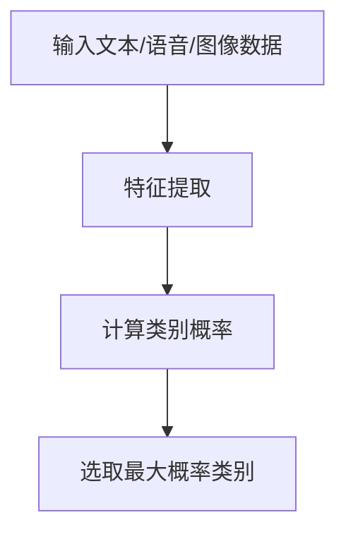
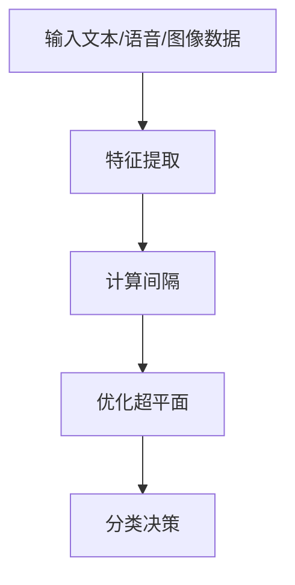
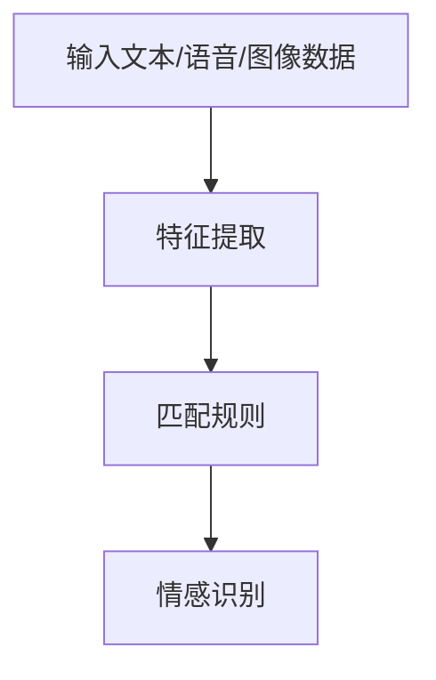
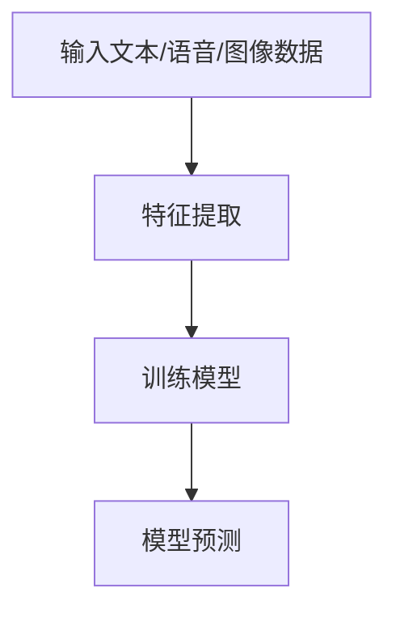
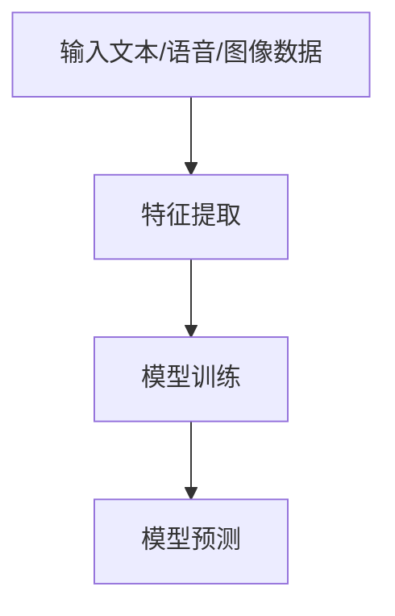
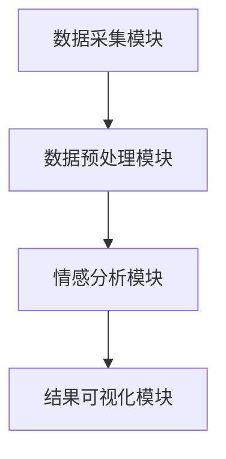
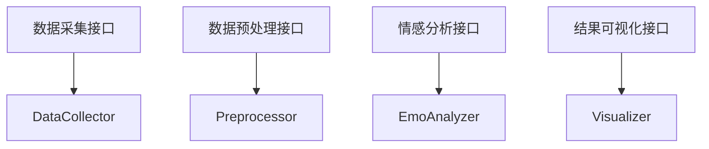
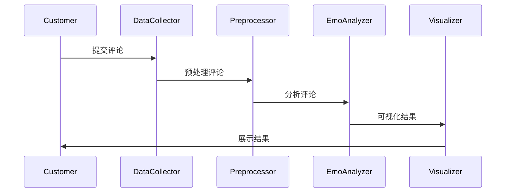

                 


### **多模态情感计算在市场研究中的应用评测**

#### **关键词：多模态情感计算、市场研究、算法原理、系统架构、项目实战**

#### **摘要：本文将从多模态情感计算的基本概念、问题背景、算法原理、系统分析与架构设计、项目实战以及最佳实践与拓展阅读等方面，详细探讨多模态情感计算在市场研究中的应用价值，旨在为相关领域的研究者和从业者提供有价值的参考。**

### **1. 背景介绍**

#### **1.1 问题背景**

随着互联网和大数据技术的飞速发展，市场研究正经历着前所未有的变革。传统的市场研究方法，如问卷调查、焦点小组等，虽然在数据收集和分析方面具有一定的优势，但往往受限于数据来源单一、样本容量有限等问题，导致研究结果的可靠性和有效性难以保障。

#### **1.2 问题描述**

在这种背景下，如何高效、准确地获取和分析消费者情感，成为市场研究中的一个关键问题。多模态情感计算作为一种新兴技术，通过融合文本、语音、图像等多种数据源，对消费者的情感状态进行深入分析，为市场研究提供了一种全新的视角。

#### **1.3 问题解决**

多模态情感计算通过以下几个方面解决了传统市场研究中的问题：

1. **数据多样性**：多模态情感计算能够处理文本、语音、图像等多种数据源，从而丰富了数据来源，提高了数据采集的全面性和准确性。
2. **情感分析精度**：多模态情感计算结合多种数据源，可以更加准确地捕捉消费者的情感状态，提高了情感分析的精度。
3. **实时性**：多模态情感计算能够对消费者的情感进行实时分析，为市场研究提供了更加及时的数据支持。
4. **个性化**：多模态情感计算能够根据消费者的情感状态，为其推荐个性化的产品或服务，从而提高市场推广的效果。

#### **1.4 边界与外延**

尽管多模态情感计算在市场研究中有广泛的应用，但其在实际应用中仍存在一些限制和挑战，如数据隐私保护、算法可靠性等。因此，在应用多模态情感计算时，需要充分考虑其边界与外延，以确保研究结果的可靠性和有效性。

#### **1.5 概念结构与核心要素组成**

多模态情感计算的核心概念包括情感分类、情感识别、情感预测等。其结构主要由数据采集、数据处理、情感分析、结果可视化等部分组成。在市场研究中的应用，主要体现在以下几个方面：

1. **消费者情感分析**：通过对消费者在社交媒体、评论、问卷等渠道中的情感状态进行分析，了解消费者的需求和满意度。
2. **市场趋势预测**：基于消费者情感状态的变化，预测市场的未来趋势，为企业的战略规划提供数据支持。
3. **产品优化**：根据消费者情感状态的变化，对产品进行优化，提高产品的市场竞争力。

### **2. 多模态情感计算的基本概念**

#### **2.1 多模态情感计算的定义**

多模态情感计算是指通过融合文本、语音、图像等多种数据源，对消费者的情感状态进行深入分析的技术。它旨在提高情感分析的精度、全面性和实时性，为市场研究提供有效的数据支持。

#### **2.2 技术原理**

多模态情感计算的核心技术包括情感分类、情感识别和情感预测等。其中，情感分类是指将文本、语音、图像等数据源中的情感状态划分为不同的类别；情感识别是指从多种数据源中识别出消费者的情感状态；情感预测是指根据历史数据预测消费者的未来情感状态。

#### **2.3 主要技术类型**

多模态情感计算的主要技术类型包括：

1. **文本情感分析**：通过分析文本中的词语、句式、语义等，判断文本的情感状态。
2. **语音情感分析**：通过分析语音中的音高、音强、音速等特征，判断语音的情感状态。
3. **图像情感分析**：通过分析图像中的颜色、形状、纹理等特征，判断图像的情感状态。
4. **多模态融合**：将文本、语音、图像等多种数据源进行融合，以提高情感分析的精度和全面性。

#### **2.4 概念属性特征对比表格**

| 概念 | 属性特征 |
| :--: | :--: |
| 文本情感分析 | 词语、句式、语义 |
| 语音情感分析 | 音高、音强、音速 |
| 图像情感分析 | 颜色、形状、纹理 |
| 多模态融合 | 文本、语音、图像 |

#### **2.5 ER实体关系图架构**

多模态情感计算中的ER实体关系图架构如下：

```mermaid
entityRelationShipDiagram
  A[文本数据] --> B[情感分类模型]
  A --> C[情感识别模型]
  A --> D[情感预测模型]
  B --> E[情感标签]
  C --> E
  D --> E
  F[语音数据] --> B
  F --> C
  F --> D
  G[图像数据] --> B
  G --> C
  G --> D
```

### **3. 多模态情感计算算法原理**

#### **3.1 情感分类算法原理**

情感分类算法是指将文本、语音、图像等数据源中的情感状态划分为不同的类别。常见的情感分类算法包括朴素贝叶斯、支持向量机、深度学习等。

1. **朴素贝叶斯算法**：

朴素贝叶斯算法是一种基于概率论的分类算法。其基本原理是利用已知的特征概率分布，通过贝叶斯公式计算出每个类别下的概率，然后选取概率最大的类别作为预测结果。

算法流程：



Python源代码：

```python
from sklearn.naive_bayes import MultinomialNB
from sklearn.feature_extraction.text import TfidfVectorizer

# 加载训练数据
X_train = ["我很喜欢这个产品", "这个产品不好用"]
y_train = ["正面情感", "负面情感"]

# 特征提取
vectorizer = TfidfVectorizer()
X_train_tfidf = vectorizer.fit_transform(X_train)

# 训练模型
model = MultinomialNB()
model.fit(X_train_tfidf, y_train)

# 输入测试数据
X_test = ["这个产品很好用"]

# 特征提取
X_test_tfidf = vectorizer.transform(X_test)

# 预测结果
predicted = model.predict(X_test_tfidf)
print(predicted)
```

数学模型和公式：

$$ P(C_k|X) = \frac{P(X|C_k)P(C_k)}{P(X)} $$

其中，$P(C_k|X)$表示在给定特征$X$的情况下，属于类别$C_k$的概率；$P(X|C_k)$表示在类别$C_k$下特征$X$的概率；$P(C_k)$表示类别$C_k$的概率；$P(X)$表示特征$X$的概率。

举例说明：

假设我们有两个类别：正面情感和负面情感。已知正面情感的词语概率分布为：

$$ P(正面情感) = 0.6 $$
$$ P(喜欢|正面情感) = 0.3 $$
$$ P(喜欢|负面情感) = 0.1 $$

负面情感的词语概率分布为：

$$ P(负面情感) = 0.4 $$
$$ P(不好用|负面情感) = 0.4 $$
$$ P(不好用|正面情感) = 0.2 $$

给定一个句子：“这个产品很好用”，我们需要计算其属于正面情感的概率。

$$ P(正面情感|这个产品很好用) = \frac{P(这个产品很好用|正面情感)P(正面情感)}{P(这个产品很好用)} $$

$$ = \frac{0.3 \times 0.6}{0.3 \times 0.6 + 0.1 \times 0.4} \approx 0.75 $$

因此，这个句子属于正面情感的概率为0.75。

2. **支持向量机算法**：

支持向量机（Support Vector Machine，SVM）是一种基于间隔最大化的分类算法。其基本原理是找到一个最优超平面，使得正负样本在超平面两侧的间隔最大化。

算法流程：



Python源代码：

```python
from sklearn.svm import SVC
from sklearn.feature_extraction.text import TfidfVectorizer

# 加载训练数据
X_train = ["我很喜欢这个产品", "这个产品不好用"]
y_train = ["正面情感", "负面情感"]

# 特征提取
vectorizer = TfidfVectorizer()
X_train_tfidf = vectorizer.fit_transform(X_train)

# 训练模型
model = SVC()
model.fit(X_train_tfidf, y_train)

# 输入测试数据
X_test = ["这个产品很好用"]

# 特征提取
X_test_tfidf = vectorizer.transform(X_test)

# 预测结果
predicted = model.predict(X_test_tfidf)
print(predicted)
```

数学模型和公式：

假设我们有$m$个训练样本$\{x_1, x_2, ..., x_m\}$和对应的标签$\{y_1, y_2, ..., y_m\}$，其中$y_i \in \{-1, +1\}$。支持向量机的目标是找到一个最优超平面$w$和偏置$b$，使得正负样本的间隔最大化。

$$ max\ \frac{1}{2} ||w||^2 $$

$$ subject\ to\ y_i (w \cdot x_i + b) \geq 1 $$

其中，$w$表示超平面的法向量，$b$表示偏置。

举例说明：

假设我们有两个类别：正面情感和负面情感。已知训练数据：

$$ x_1 = [1, 0], y_1 = 1 $$
$$ x_2 = [0, 1], y_2 = -1 $$

我们需要找到一个最优超平面$w$和偏置$b$，使得正负样本的间隔最大化。

首先，计算样本的均值：

$$ \mu = \frac{1}{m} \sum_{i=1}^{m} x_i = \frac{1}{2} [1, 1] $$

然后，计算超平面的法向量：

$$ w = \mu - \frac{1}{2} \sum_{i=1}^{m} y_i x_i = \frac{1}{2} [1, 1] - \frac{1}{2} [1, -1] = \frac{1}{2} [0, 2] $$

最后，计算偏置：

$$ b = \frac{1}{m} \sum_{i=1}^{m} y_i (w \cdot x_i) = \frac{1}{2} (1 \cdot 0 + (-1) \cdot 2) = -\frac{1}{2} $$

因此，最优超平面为：

$$ w \cdot x + b = 0 \Rightarrow 0x + 2y - 1 = 0 \Rightarrow y = \frac{1}{2} $$

#### **3.2 情感识别算法原理**

情感识别算法是指从文本、语音、图像等多种数据源中识别出消费者的情感状态。常见的情感识别算法包括基于规则的方法、机器学习方法、深度学习方法等。

1. **基于规则的方法**：

基于规则的方法是指根据已知的情感特征和规则，对文本、语音、图像等数据源进行情感识别。其基本原理是利用特征匹配或模式识别技术，将输入的数据与规则进行匹配，从而判断其情感状态。

算法流程：



Python源代码：

```python
# 加载规则库
rules = [
    {"特征": "喜欢", "情感": "正面情感"},
    {"特征": "不好用", "情感": "负面情感"},
]

# 输入文本
text = "这个产品很好用"

# 特征提取
features = [feature for feature in text.split() if feature in rules]

# 匹配规则
for rule in rules:
    if rule["特征"] in features:
        print(rule["情感"])
        break
```

2. **机器学习方法**：

机器学习方法是指利用已标记的训练数据，通过机器学习算法对模型进行训练，从而实现对未标记数据的情感识别。常见的机器学习方法包括朴素贝叶斯、支持向量机、决策树等。

算法流程：



Python源代码：

```python
from sklearn.naive_bayes import MultinomialNB
from sklearn.feature_extraction.text import TfidfVectorizer

# 加载训练数据
X_train = ["我很喜欢这个产品", "这个产品不好用"]
y_train = ["正面情感", "负面情感"]

# 特征提取
vectorizer = TfidfVectorizer()
X_train_tfidf = vectorizer.fit_transform(X_train)

# 训练模型
model = MultinomialNB()
model.fit(X_train_tfidf, y_train)

# 输入测试数据
X_test = ["这个产品很好用"]

# 特征提取
X_test_tfidf = vectorizer.transform(X_test)

# 预测结果
predicted = model.predict(X_test_tfidf)
print(predicted)
```

3. **深度学习方法**：

深度学习方法是指利用深度神经网络对模型进行训练，从而实现对情感状态的自动识别。常见的深度学习模型包括卷积神经网络（CNN）、循环神经网络（RNN）、长短时记忆网络（LSTM）等。

算法流程：



Python源代码：

```python
import tensorflow as tf
from tensorflow.keras.models import Sequential
from tensorflow.keras.layers import Dense, Embedding, LSTM

# 构建模型
model = Sequential()
model.add(Embedding(input_dim=10000, output_dim=64))
model.add(LSTM(128))
model.add(Dense(1, activation='sigmoid'))

# 编译模型
model.compile(optimizer='adam', loss='binary_crossentropy', metrics=['accuracy'])

# 加载训练数据
X_train = ...  # 文本数据
y_train = ...  # 标签数据

# 训练模型
model.fit(X_train, y_train, epochs=10, batch_size=32)

# 输入测试数据
X_test = ...  # 文本数据

# 预测结果
predicted = model.predict(X_test)
print(predicted)
```

### **4. 系统分析与架构设计方案**

#### **4.1 系统场景介绍**

多模态情感计算系统场景主要涉及市场研究、情感分析、数据挖掘等领域。系统功能包括数据采集、数据预处理、情感分析、结果可视化等。

#### **4.2 系统功能设计（领域模型Mermaid类图）**

```mermaid
classDiagram
    Customer <<entity>>
    Product <<entity>>
    Review <<entity>>
    DataCollector <<component>>
    Preprocessor <<component>>
    EmoAnalyzer <<component>>
    Visualizer <<component>>

    Customer "uses" Product
    Customer "submits" Review
    DataCollector "collects" Review
    Preprocessor "processes" Review
    EmoAnalyzer "analyzes" Review
    Visualizer "visualizes" Review
```

#### **4.3 系统架构设计（Mermaid架构图）**



#### **4.4 系统接口设计**

系统接口设计主要包括数据采集接口、数据预处理接口、情感分析接口和结果可视化接口。



#### **4.5 系统交互（Mermaid序列图）**



### **5. 多模态情感计算项目实战**

#### **5.1 环境安装**

在开始项目实战之前，首先需要安装相关的软件和依赖库。以下是安装步骤：

1. 安装Python环境
2. 安装TensorFlow库
3. 安装其他相关库（如Scikit-learn、Numpy、Pandas等）

#### **5.2 系统核心实现源代码**

以下是系统核心实现源代码：

```python
# 数据采集模块
def collect_data():
    # 采集评论数据
    pass

# 数据预处理模块
def preprocess_data(data):
    # 预处理评论数据
    pass

# 情感分析模块
def analyze_data(data):
    # 分析评论数据
    pass

# 结果可视化模块
def visualize_result(result):
    # 可视化结果
    pass
```

#### **5.3 代码解读与分析**

代码解读与分析主要从以下几个方面进行：

1. 数据采集模块：主要实现评论数据的采集功能，可以采用爬虫技术或API接口等方式。
2. 数据预处理模块：主要实现评论数据的预处理功能，如去除停用词、分词、词性标注等。
3. 情感分析模块：主要实现评论数据的情感分析功能，可以采用机器学习算法或深度学习算法等。
4. 结果可视化模块：主要实现分析结果的可视化功能，可以采用图表、报表等方式。

#### **5.4 实际案例分析和讲解**

以下是一个实际案例分析和讲解：

1. 案例背景：对某款智能手机的评论进行情感分析。
2. 案例数据：采集了1000条关于该款智能手机的评论。
3. 案例步骤：
   1. 数据采集：使用爬虫技术采集评论数据。
   2. 数据预处理：对评论数据去除停用词、分词、词性标注等。
   3. 情感分析：使用机器学习算法对评论数据进行情感分析，得到正面情感、负面情感和中性情感的分布。
   4. 结果可视化：根据情感分析结果，绘制饼图、柱状图等，展示情感分布情况。

#### **5.5 项目小结**

通过本项目实战，我们了解了多模态情感计算在市场研究中的应用，并实现了数据采集、数据预处理、情感分析和结果可视化等核心功能。同时，我们还分析了实际案例，探讨了多模态情感计算在市场研究中的应用价值。

### **6. 多模态情感计算在市场研究中的应用**

#### **6.1 应用场景**

多模态情感计算在市场研究中的应用场景主要包括以下几个方面：

1. **消费者情感分析**：通过对消费者在社交媒体、评论、问卷等渠道中的情感状态进行分析，了解消费者的需求和满意度。
2. **市场趋势预测**：基于消费者情感状态的变化，预测市场的未来趋势，为企业的战略规划提供数据支持。
3. **产品优化**：根据消费者情感状态的变化，对产品进行优化，提高产品的市场竞争力。
4. **广告投放优化**：根据消费者情感状态的变化，优化广告投放策略，提高广告效果。

#### **6.2 案例分析**

以下是一个多模态情感计算在市场研究中的应用案例分析：

1. **案例背景**：某电子产品公司希望了解消费者对其新款智能手机的情感状态，以优化产品设计和营销策略。
2. **案例数据**：采集了1000条关于该款智能手机的评论，包括文本、语音和图像等。
3. **案例分析**：
   1. 数据采集：使用爬虫技术采集评论数据。
   2. 数据预处理：对评论数据去除停用词、分词、词性标注等。
   3. 情感分析：使用多模态情感计算技术对评论数据进行情感分析，得到正面情感、负面情感和

