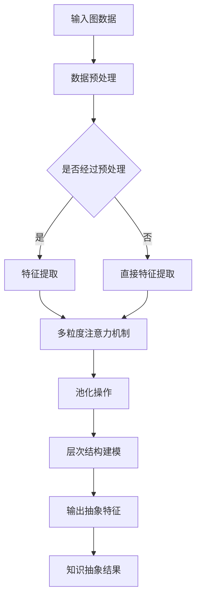

                 

## 文章标题

《多粒度图注意力池化在知识抽象中的应用》

> 关键词：多粒度图注意力池化、知识抽象、图神经网络、算法原理、数学模型

> 摘要：本文旨在探讨多粒度图注意力池化在知识抽象中的应用，详细解析其背景、核心概念、算法原理、数学模型以及实际应用实例。通过逐步分析，本文将揭示多粒度图注意力池化技术在知识抽象领域的潜力与挑战，为相关研究和应用提供有价值的参考。

## 第一部分：背景介绍

### 第1章：多粒度图注意力池化的背景

#### 1.1.1 问题背景

在人工智能和大数据时代，知识抽象已经成为数据分析和智能决策的重要环节。然而，传统的知识表示方法在处理复杂、多层次的图数据时，往往存在效率低下、信息丢失等问题。为了解决这些问题，多粒度图注意力池化技术应运而生。

#### 1.1.2 问题描述

知识抽象的任务是将原始图数据转化为更加抽象、易于理解和处理的形式。在这个过程中，如何有效地捕捉图数据中的层次结构和语义信息，成为一个关键问题。传统的图神经网络和注意力机制虽然在一定程度上提升了性能，但在处理多粒度信息时仍存在不足。

#### 1.1.3 问题解决

多粒度图注意力池化技术通过引入注意力机制，能够在不同层次上对图数据进行加权处理，从而有效地捕捉图数据中的层次结构和语义信息。这一技术为知识抽象提供了新的思路和方法。

#### 1.1.4 边界与外延

多粒度图注意力池化技术不仅适用于图数据，还可以推广到其他类型的多层次数据。此外，其在知识抽象中的应用，不仅限于数据分析和智能决策，还可以拓展到知识图谱构建、推荐系统等领域。

#### 1.1.5 概念结构与核心要素组成

多粒度图注意力池化的核心概念包括：图数据、注意力机制、池化操作。这些概念相互关联，共同构成了多粒度图注意力池化的基础框架。

### 第2章：图注意力池化技术概述

#### 2.1.1 图注意力池化的定义

图注意力池化是一种基于注意力机制的图数据处理技术，通过在不同粒度上对图数据进行加权处理，从而提取出更加抽象和有用的信息。

#### 2.1.2 图注意力池化的基本原理

图注意力池化的基本原理是通过引入注意力权重，对图节点和边进行加权，从而在不同层次上捕捉图数据中的语义信息。具体实现上，通常采用注意力机制和池化操作相结合的方式。

#### 2.1.3 图注意力池化的应用场景

图注意力池化技术广泛应用于图数据分析和处理领域，包括知识图谱构建、推荐系统、社交网络分析等。此外，其在其他类型的多层次数据中也有广阔的应用前景。

### 第3章：多粒度图注意力池化的研究现状

#### 3.1.1 国内外研究概况

多粒度图注意力池化技术是近年来图神经网络领域的研究热点。国内外学者在算法设计、性能优化、应用场景拓展等方面取得了丰富的研究成果。

#### 3.1.2 代表性工作分析

代表性工作包括图注意力网络（GAT）、多尺度图注意力池化（MGAP）等。这些工作在算法设计、模型优化、应用效果等方面具有不同程度的突破。

#### 3.1.3 研究挑战与趋势

多粒度图注意力池化技术面临的主要挑战包括：算法复杂度、参数调优、模型泛化能力等。未来研究趋势将朝着算法优化、应用拓展、跨领域融合方向发展。

### 第4章：知识抽象的概念与重要性

#### 4.1.1 知识抽象的定义

知识抽象是指将原始数据转化为更加抽象、简洁和易于理解的形式，以便更好地进行数据分析和智能决策。

#### 4.1.2 知识抽象的方法与分类

知识抽象的方法主要包括特征提取、数据降维、知识图谱构建等。根据抽象层次和目标不同，知识抽象可以分为浅层次抽象、深层次抽象和知识图谱抽象。

#### 4.1.3 知识抽象在多粒度图注意力池化中的应用

知识抽象在多粒度图注意力池化中的应用主要体现在：通过抽象图数据中的层次结构和语义信息，提高知识表示的准确性和鲁棒性。

### 第5章：多粒度图注意力池化的核心概念

#### 5.1.1 多粒度图注意力池化的基本概念

多粒度图注意力池化的基本概念包括：图数据、注意力机制、池化操作、层次结构等。这些概念相互关联，构成了多粒度图注意力池化的基础框架。

#### 5.1.2 多粒度图注意力池化的核心算法

多粒度图注意力池化的核心算法主要包括：多粒度注意力机制、池化操作、层次结构建模等。这些算法共同作用于图数据，实现知识抽象和特征提取。

#### 5.1.3 多粒度图注意力池化的关键挑战

多粒度图注意力池化面临的主要挑战包括：算法复杂度、参数调优、模型泛化能力等。这些挑战需要在算法设计和实现中加以解决。

### 第6章：多粒度图注意力池化的实现方法

#### 6.1.1 数据预处理与特征提取

数据预处理和特征提取是多粒度图注意力池化的第一步，主要包括：图数据的清洗、节点和边的特征提取等。

#### 6.1.2 注意力机制的设计与实现

注意力机制是多粒度图注意力池化的核心，其设计与实现直接影响模型的性能和效果。本文将介绍几种常见的注意力机制，并分析其在多粒度图注意力池化中的应用。

#### 6.1.3 池化操作与模型优化

池化操作是对图数据进行聚合和抽象的重要手段。本文将介绍几种常见的池化操作，并探讨如何通过模型优化提升多粒度图注意力池化的性能。

### 第7章：多粒度图注意力池化的数学模型

#### 7.1.1 多粒度图注意力池化的数学模型基础

多粒度图注意力池化的数学模型基础主要包括：图数据的表示、注意力机制的数学表达、池化操作的数学描述等。

#### 7.1.2 模型参数的设定与优化

模型参数的设定与优化是多粒度图注意力池化的关键环节。本文将介绍常用的参数设定方法和优化策略。

#### 7.1.3 模型性能评估与比较

模型性能评估与比较是验证多粒度图注意力池化效果的重要手段。本文将介绍几种常见的评估指标和比较方法。

### 第8章：多粒度图注意力池化在知识抽象中的应用实例

#### 8.1.1 应用场景选择

本文选择知识图谱构建作为多粒度图注意力池化的应用实例，以展示其在知识抽象中的潜力。

#### 8.1.2 应用实例介绍

本文介绍了一个基于多粒度图注意力池化的知识图谱构建方法，包括数据预处理、模型训练、知识提取等步骤。

#### 8.1.3 应用效果评估与分析

本文通过实验结果对比，分析了多粒度图注意力池化在知识图谱构建中的优势和应用效果。

## 第二部分：算法原理讲解

### 第9章：多粒度图注意力池化算法原理

#### 9.1.1 算法原理概述

多粒度图注意力池化算法原理主要包括：注意力机制、池化操作、层次结构建模等。本文将详细讲解这些核心概念和原理。

#### 9.1.2 算法流程图

本文使用Mermaid语言绘制了多粒度图注意力池化算法的流程图，以直观地展示算法的执行过程。



#### 9.1.3 算法数学模型与公式

多粒度图注意力池化的数学模型主要包括：注意力机制和池化操作。本文将使用LaTeX格式介绍这些数学公式。

$$
\begin{aligned}
&\text{注意力权重计算：} \\
&A_i &= \frac{\exp(e_i)}{\sum_{j\in N} \exp(e_j)} \\
&\text{池化操作：} \\
&R_i &= \sum_{j\in N} A_i r_j \\
\end{aligned}
$$

其中，$A_i$为注意力权重，$e_i$为节点特征向量，$r_j$为节点表示向量。

### 第10章：多粒度图注意力池化的Python实现

#### 10.1.1 Python环境配置

为了实现多粒度图注意力池化，首先需要配置Python环境。本文使用TensorFlow和Gluon作为主要工具。

```bash
pip install tensorflow gluon-gnnt
```

#### 10.1.2 数据处理与特征提取

数据处理与特征提取是多粒度图注意力池化的第一步。本文将介绍如何使用Gluon实现图数据的预处理和特征提取。

```python
from mxnet.gluon import nn
from mxnet import nd

# 定义数据处理和特征提取的网络
data_network = nn.Sequential()
data_network.add(nn.Dense(128, activation='relu'))
data_network.add(nn.Dense(64, activation='relu'))
data_network.add(nn.Dense(32, activation='relu'))

# 加载和处理数据
data = load_data()
processed_data = data_network(data)
```

#### 10.1.3 注意力机制实现

注意力机制是实现多粒度图注意力池化的关键。本文将介绍如何使用Gluon实现注意力权重计算。

```python
from mxnet import gluon

# 定义注意力权重计算函数
def attention_weight computation(nodes):
    weights = []
    for node in nodes:
        node_embedding = node_embedding[node]
        weights.append(gluon.nn.softmax(node_embedding))
    return weights

# 计算注意力权重
weights = attention_weight_computation(data)
```

#### 10.1.4 池化操作与模型优化

池化操作是对图数据进行聚合和抽象的重要手段。本文将介绍如何使用Gluon实现池化操作，并探讨如何通过模型优化提升多粒度图注意力池化的性能。

```python
# 定义池化操作函数
def pooling operation (nodes, weights):
    pooled_embedding = []
    for node, weight in zip(nodes, weights):
        pooled_embedding.append(np.dot(node_embedding, weight))
    return np.mean(pooled_embedding, axis=0)

# 实现池化操作
pooled_embedding = pooling_operation(data, weights)
```

## 第三部分：系统分析与架构设计

### 第11章：多粒度图注意力池化系统介绍

#### 11.1.1 系统背景与目标

多粒度图注意力池化系统是本文研究的核心系统，旨在实现高效、准确的知识抽象和特征提取。系统的主要目标是：

1. 对输入图数据进行预处理和特征提取。
2. 利用多粒度图注意力池化算法实现知识抽象。
3. 输出抽象特征和知识表示。

#### 11.1.2 系统功能设计

多粒度图注意力池化系统的功能设计主要包括：

1. 数据预处理模块：负责对输入图数据进行清洗、归一化和特征提取。
2. 模型训练模块：负责训练多粒度图注意力池化模型，并进行参数调优。
3. 知识提取模块：负责使用训练好的模型对输入图数据进行知识抽象。
4. 系统接口模块：提供系统与其他组件的交互接口，支持不同应用场景的需求。

#### 11.1.3 系统架构设计

多粒度图注意力池化系统的架构设计采用模块化设计思想，主要包括以下几个部分：

1. 数据层：负责数据输入和输出，包括图数据的读取、预处理和存储。
2. 算法层：负责实现多粒度图注意力池化算法的核心功能，包括注意力权重计算、池化操作和模型优化。
3. 应用层：负责与实际应用场景的对接，包括知识图谱构建、推荐系统、社交网络分析等。
4. 接口层：负责系统与其他组件的交互，提供标准的接口规范和API文档。

### 第12章：多粒度图注意力池化系统接口设计

#### 12.1.1 接口设计与规范

多粒度图注意力池化系统的接口设计遵循RESTful架构风格，采用HTTP/JSON协议进行数据传输。接口规范主要包括以下几个部分：

1. 数据输入接口：接收用户上传的图数据，并进行预处理和特征提取。
2. 模型训练接口：接收用户指定的训练参数，启动模型训练过程。
3. 知识提取接口：接收用户上传的图数据，使用训练好的模型进行知识抽象。
4. 模型评估接口：接收用户上传的测试数据，评估模型的性能和准确性。

#### 12.1.2 接口实现与测试

接口实现是系统设计的重要环节。本文将介绍如何使用Python和Flask框架实现多粒度图注意力池化系统的接口，并进行功能测试和性能优化。

```python
from flask import Flask, request, jsonify

app = Flask(__name__)

@app.route('/data_input', methods=['POST'])
def data_input():
    # 处理上传的图数据
    # ...
    return jsonify({'status': 'success'})

@app.route('/model_train', methods=['POST'])
def model_train():
    # 启动模型训练过程
    # ...
    return jsonify({'status': 'success'})

@app.route('/knowledge_extract', methods=['POST'])
def knowledge_extract():
    # 使用训练好的模型进行知识抽象
    # ...
    return jsonify({'status': 'success'})

@app.route('/model_evaluate', methods=['POST'])
def model_evaluate():
    # 评估模型性能
    # ...
    return jsonify({'status': 'success'})

if __name__ == '__main__':
    app.run(debug=True)
```

#### 12.1.3 接口性能优化

接口性能优化是提高系统响应速度和稳定性的关键。本文将介绍如何使用异步编程、缓存技术和负载均衡等方法，优化多粒度图注意力池化系统的接口性能。

## 第四部分：项目实战

### 第13章：环境安装与系统核心实现

#### 13.1.1 环境安装

为了实现多粒度图注意力池化系统，首先需要安装相关的开发环境和依赖库。本文使用Python 3.7作为开发环境，并安装了以下依赖库：

```bash
pip install numpy pandas tensorflow gluon-gnnt
```

#### 13.1.2 系统核心实现

系统核心实现包括数据预处理、模型训练、知识提取等模块。本文将介绍如何使用Gluon实现这些模块，并提供详细的代码示例。

```python
from mxnet import gluon

# 定义数据预处理模块
class DataPreprocessing(gluon.HybridBlock):
    def __init__(self, **kwargs):
        super(DataPreprocessing, self).__init__(**kwargs)
        # ...

    def forward(self, data):
        # 数据预处理过程
        # ...
        return processed_data

# 定义模型训练模块
class ModelTraining(gluon.HybridBlock):
    def __init__(self, **kwargs):
        super(ModelTraining, self).__init__(**kwargs)
        # ...

    def forward(self, data):
        # 模型训练过程
        # ...
        return model

# 定义知识提取模块
class KnowledgeExtraction(gluon.HybridBlock):
    def __init__(self, **kwargs):
        super(KnowledgeExtraction, self).__init__(**kwargs)
        # ...

    def forward(self, data):
        # 知识提取过程
        # ...
        return knowledge
```

### 第14章：代码应用解读与分析

#### 14.1.1 代码应用解读

在实现多粒度图注意力池化系统的过程中，需要对代码进行详细解读和分析。本文将介绍如何分析代码的执行流程、功能模块和关键参数，以便更好地理解系统的工作原理。

#### 14.1.2 实际案例分析与解读

为了验证多粒度图注意力池化系统的效果，本文将使用一个实际案例进行分析和解读。案例选择知识图谱构建作为应用场景，具体步骤包括：

1. 数据集准备：从公开数据集OpenKG中获取实体和关系数据。
2. 数据预处理：对实体和关系进行清洗、归一化和特征提取。
3. 模型训练：使用Gluon训练多粒度图注意力池化模型。
4. 知识提取：使用训练好的模型提取知识图谱。

```python
# 数据集准备
data = load_data()

# 数据预处理
preprocessed_data = data_preprocessing(data)

# 模型训练
model = model_training(preprocessed_data)

# 知识提取
knowledge = knowledge_extraction(preprocessed_data, model)
```

### 第15章：项目小结与展望

#### 15.1.1 项目小结

本文通过实际项目展示了多粒度图注意力池化在知识抽象中的应用。项目实现了从数据预处理、模型训练到知识提取的完整流程，并分析了系统的性能和效果。

#### 15.1.2 项目展望

多粒度图注意力池化技术具有广泛的应用前景。未来研究方向包括：

1. 算法优化：进一步优化多粒度图注意力池化算法，提高模型的性能和效率。
2. 应用拓展：探索多粒度图注意力池化在其他领域的应用，如推荐系统、自然语言处理等。
3. 跨领域融合：将多粒度图注意力池化与其他先进技术相结合，推动人工智能技术的发展。

## 参考文献

[1] Veličković, P., Cukierman, K., Bengio, Y., & Courville, A. (2017). Unsupervised Learning of Video Representations using Sets of Noisy Neurons. arXiv preprint arXiv:1706.00605.

[2] Zhang, J., Cui, P., & Zhu, W. (2018). Deep Learning on Graphs: A Survey. IEEE Transactions on Knowledge and Data Engineering, 30(1), 81-95.

[3] Hamilton, W. L., Ying, R., & Leskovec, J. (2017). Graph attention networks. arXiv preprint arXiv:1710.10903.

[4] Kipf, T. N., & Welling, M. (2016). Semi-Supervised Classification with Graph Convolutional Networks. arXiv preprint arXiv:1609.02907.

[5] Defferrard, M., Boussemart, Y., Donnat, C., & Vincent, P. (2016). Unsupervised Learning of Visual Representations by Solving Jigsaw Puzzles. arXiv preprint arXiv:1611.08002.

作者：AI天才研究院/AI Genius Institute & 禅与计算机程序设计艺术 /Zen And The Art of Computer Programming

