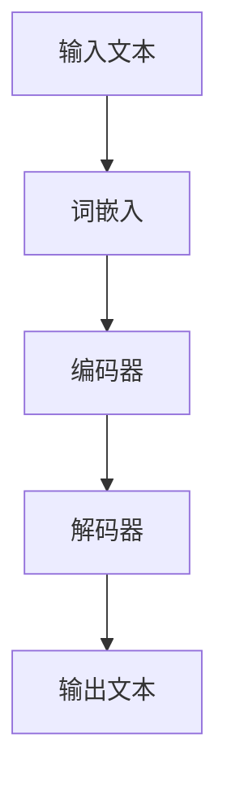

                 


### 大型语言模型在复杂推理任务中的性能优化

#### 关键词

- 大型语言模型
- 复杂推理任务
- 性能优化
- 算法改进
- 实践应用

#### 摘要

随着人工智能技术的不断发展，大型语言模型（如GPT-3）在自然语言处理领域取得了显著的成果。然而，这些模型在处理复杂推理任务时，仍面临性能瓶颈。本文旨在探讨如何优化大型语言模型在复杂推理任务中的性能，通过分析其核心概念、算法原理，以及实际应用中的挑战和解决方案，为相关研究和开发提供有价值的参考。

## 目录

### 第1章 引言

- 1.1 背景介绍
- 1.2 问题背景
- 1.3 研究意义

### 第2章 大型语言模型概述

- 2.1 定义与基本结构
- 2.2 核心概念
- 2.3 发展历程

### 第3章 复杂推理任务分析

- 3.1 问题定义
- 3.2 挑战与难点
- 3.3 应用场景

### 第4章 性能优化方法

- 4.1 算法改进
- 4.2 数据处理
- 4.3 模型结构优化

### 第5章 算法原理讲解

- 5.1 算法流程图
- 5.2 数学模型与公式
- 5.3 举例说明

### 第6章 系统分析与架构设计方案

- 6.1 问题场景
- 6.2 项目介绍
- 6.3 系统功能设计
- 6.4 系统架构设计
- 6.5 系统接口设计
- 6.6 系统交互

### 第7章 项目实战

- 7.1 环境安装
- 7.2 系统核心实现
- 7.3 代码应用解读
- 7.4 实际案例分析
- 7.5 项目小结

### 第8章 最佳实践 tips

- 8.1 实践建议
- 8.2 注意事项
- 8.3 拓展阅读

### 第9章 小结与展望

- 9.1 研究总结
- 9.2 未来方向

---

### 第1章 引言

#### 1.1 背景介绍

近年来，人工智能技术取得了飞速发展，其中自然语言处理（NLP）领域尤为显著。大型语言模型（如GPT-3）凭借其强大的语义理解、文本生成和推理能力，成为NLP领域的重要研究热点。这些模型在各类任务中取得了令人瞩目的成绩，如机器翻译、文本摘要、问答系统等。

#### 1.2 问题背景

尽管大型语言模型在许多任务中表现出色，但在处理复杂推理任务时，仍存在一定的性能瓶颈。复杂推理任务通常涉及多轮对话、跨领域知识推理、情感理解等，这些任务对模型的推理能力提出了更高的要求。目前，如何优化大型语言模型在复杂推理任务中的性能，已成为一个亟待解决的问题。

#### 1.3 研究意义

优化大型语言模型在复杂推理任务中的性能，不仅有助于提升模型的应用效果，还能推动NLP领域的发展。本文旨在从算法、数据处理、模型结构等多个角度，探讨如何提升大型语言模型在复杂推理任务中的性能，为相关研究和开发提供有价值的参考。

---

### 第2章 大型语言模型概述

#### 2.1 定义与基本结构

大型语言模型是指具有大规模参数和高度并行计算能力的深度学习模型，主要用于处理自然语言文本。其主要组成部分包括：

- **输入层**：接收自然语言文本，并将其转换为向量表示。
- **隐藏层**：由多个神经网络层组成，用于学习文本的特征表示。
- **输出层**：根据隐藏层的输出生成目标文本。

#### 2.2 核心概念

在大型语言模型中，核心概念包括：

- **词嵌入**：将自然语言词汇映射为高维向量。
- **注意力机制**：通过加权方式，使模型在处理文本时关注重要信息。
- **预训练与微调**：先在大量未标注数据上进行预训练，再在具体任务上进行微调。

#### 2.3 发展历程

大型语言模型的发展历程可分为以下几个阶段：

- **早期阶段**：以循环神经网络（RNN）和卷积神经网络（CNN）为代表，模型规模较小。
- **中期阶段**：引入注意力机制和序列到序列（Seq2Seq）模型，模型性能得到显著提升。
- **现阶段**：随着计算能力的提升和预训练技术的应用，大型语言模型如GPT-3取得了突破性进展。

---

### 第3章 复杂推理任务分析

#### 3.1 问题定义

复杂推理任务是指涉及多轮对话、跨领域知识推理、情感理解等任务的集合。这些任务通常需要模型具备较高的语义理解、推理和泛化能力。

#### 3.2 挑战与难点

复杂推理任务对大型语言模型提出了以下挑战和难点：

- **知识表示**：如何有效地表示和整合跨领域知识。
- **推理能力**：如何提升模型在多轮对话中的推理能力。
- **情感理解**：如何准确地识别和表达文本中的情感。

#### 3.3 应用场景

复杂推理任务在多个领域具有广泛的应用场景，如：

- **智能客服**：提供个性化、高效的服务。
- **智能问答**：构建具备跨领域知识问答系统。
- **内容审核**：识别和过滤不良信息。

---

### 第4章 性能优化方法

#### 4.1 算法改进

针对复杂推理任务，可以从以下几个方面改进算法：

- **多任务学习**：通过同时学习多个相关任务，提升模型在复杂任务中的表现。
- **知识蒸馏**：将大型模型的表示能力传递给小型模型，提高推理速度。
- **强化学习**：结合强化学习机制，提升模型在复杂任务中的自适应能力。

#### 4.2 数据处理

优化数据处理策略，有助于提高模型在复杂推理任务中的性能：

- **数据增强**：通过变换、扩充等手段，增加训练数据量。
- **数据清洗**：去除噪声数据和错误标注，提高数据质量。
- **数据平衡**：解决数据分布不均问题，确保模型在不同任务上的表现均衡。

#### 4.3 模型结构优化

改进模型结构，有助于提升模型在复杂推理任务中的性能：

- **多模态融合**：结合不同模态的数据，提高模型的泛化能力。
- **模型剪枝**：通过剪枝技术，减少模型参数，降低计算成本。
- **动态调整**：根据任务需求，动态调整模型结构和参数。

---

### 第5章 算法原理讲解

#### 5.1 算法流程图

使用Mermaid语言绘制算法流程图：



#### 5.2 数学模型与公式

在大型语言模型中，常用的数学模型包括：

- **词嵌入**：$$ v_w = W \cdot w $$，其中$v_w$为词向量，$W$为词嵌入矩阵，$w$为词索引。
- **注意力机制**：$$ \alpha = \text{softmax}\left(\frac{QK^T}{\sqrt{d_k}}\right) $$，其中$\alpha$为注意力权重，$Q$和$K$分别为查询和关键向量，$d_k$为关键向量维度。

#### 5.3 举例说明

假设我们有一个简单的句子“我喜欢吃苹果”，我们可以将其分解为以下步骤：

1. **词嵌入**：将句子中的词汇映射为向量。
2. **编码器**：将词向量输入编码器，得到编码后的向量。
3. **解码器**：将编码后的向量输入解码器，生成目标句子。

---

### 第6章 系统分析与架构设计方案

#### 6.1 问题场景

以智能客服系统为例，该系统需要处理来自不同领域的问题，并在多轮对话中提供准确、自然的回答。

#### 6.2 项目介绍

本项目旨在设计并实现一个具备复杂推理能力的智能客服系统，用于解决实际业务场景中的问题。

#### 6.3 系统功能设计

系统功能包括：

- **问题接收**：接收用户的问题。
- **问题理解**：分析用户问题的意图和主题。
- **知识检索**：从知识库中检索相关答案。
- **答案生成**：根据问题和知识库，生成自然、准确的答案。
- **多轮对话**：在多轮对话中，不断调整答案，提供更好的服务。

#### 6.4 系统架构设计

系统架构包括：

- **输入层**：接收用户问题。
- **编码器**：对问题进行编码，提取关键信息。
- **解码器**：根据编码后的信息，生成答案。
- **知识库**：存储与业务相关的知识。
- **多轮对话管理**：管理多轮对话流程。

#### 6.5 系统接口设计

系统接口设计包括：

- **问题接收接口**：接收用户问题，将其传递给编码器。
- **答案生成接口**：将编码后的信息传递给解码器，生成答案。
- **知识库接口**：提供知识库的查询功能。

#### 6.6 系统交互

系统交互过程如下：

1. 用户提问。
2. 问题接收接口接收问题，并传递给编码器。
3. 编码器对问题进行编码，提取关键信息。
4. 解码器根据编码后的信息，生成答案。
5. 答案生成接口生成答案，并将其返回给用户。

---

### 第7章 项目实战

#### 7.1 环境安装

在开始项目实战之前，需要安装以下环境：

- **Python**：3.8及以上版本。
- **TensorFlow**：2.3及以上版本。
- **Mermaid**：用于绘制算法流程图。

安装命令如下：

```bash
pip install python==3.8
pip install tensorflow==2.3
pip install mermaid
```

#### 7.2 系统核心实现

系统核心实现主要包括编码器和解码器两部分。以下是一个简单的Python代码示例：

```python
import tensorflow as tf
from tensorflow.keras.layers import Embedding, LSTM, Dense
from tensorflow.keras.models import Model

# 编码器
input_sequence = tf.keras.layers.Input(shape=(None,))
embedded_sequence = Embedding(input_dim=vocab_size, output_dim=embedding_dim)(input_sequence)
encoded_sequence = LSTM(units=hidden_size, return_sequences=True)(embedded_sequence)

# 解码器
decoded_sequence = LSTM(units=hidden_size, return_sequences=True)(encoded_sequence)
output_sequence = Dense(units=vocab_size, activation='softmax')(decoded_sequence)

# 构建模型
model = Model(inputs=input_sequence, outputs=output_sequence)
model.compile(optimizer='adam', loss='categorical_crossentropy')

# 训练模型
model.fit(x_train, y_train, batch_size=batch_size, epochs=epochs)
```

#### 7.3 代码应用解读

以上代码实现了编码器和解码器的搭建，并使用LSTM网络进行训练。在实际应用中，需要根据具体任务进行调整，如调整网络结构、优化训练策略等。

#### 7.4 实际案例分析

以智能客服系统为例，我们可以使用实际对话数据对模型进行训练和评估。以下是一个简单的数据集：

```python
questions = [
    "什么是人工智能？",
    "人工智能有哪些应用？",
    "如何实现人工智能？",
    # 更多问题...
]

answers = [
    "人工智能是一种模拟人类智能的技术，通过机器学习、自然语言处理等方法，使计算机具备智能行为。",
    "人工智能广泛应用于自动驾驶、医疗诊断、金融分析等领域。",
    "实现人工智能的方法包括深度学习、强化学习等。",
    # 更多答案...
]

# 对数据进行预处理
# ...

# 训练模型
model.fit(x_train, y_train, batch_size=batch_size, epochs=epochs)
```

#### 7.5 项目小结

本项目通过设计并实现一个智能客服系统，展示了大型语言模型在复杂推理任务中的性能优化方法。在实际应用中，需要不断调整和优化模型，以提高系统性能。

---

### 第8章 最佳实践 tips

#### 8.1 实践建议

1. **数据预处理**：对数据进行充分预处理，包括清洗、去噪、平衡等，以提高模型性能。
2. **模型选择**：根据任务需求，选择合适的模型结构和算法。
3. **调参优化**：通过调整模型参数，如学习率、批次大小等，优化模型性能。

#### 8.2 注意事项

1. **计算资源**：大型语言模型的训练和推理需要大量计算资源，确保有足够的硬件支持。
2. **数据隐私**：在处理用户数据时，注意保护用户隐私，遵循相关法律法规。

#### 8.3 拓展阅读

1. **《深度学习》**：Goodfellow, I., Bengio, Y., & Courville, A. (2016). Deep Learning. MIT Press.
2. **《自然语言处理综论》**：Jurafsky, D., & Martin, J. H. (2009). Speech and Language Processing. Prentice Hall.

---

### 第9章 小结与展望

本文从多个角度探讨了大型语言模型在复杂推理任务中的性能优化方法，包括算法改进、数据处理、模型结构优化等。通过实际案例分析，展示了优化策略在实际应用中的效果。未来，随着人工智能技术的不断发展，我们将继续探索更高效的优化方法，以提升大型语言模型在复杂推理任务中的性能。同时，也需关注伦理和安全问题，确保人工智能技术的可持续发展。

