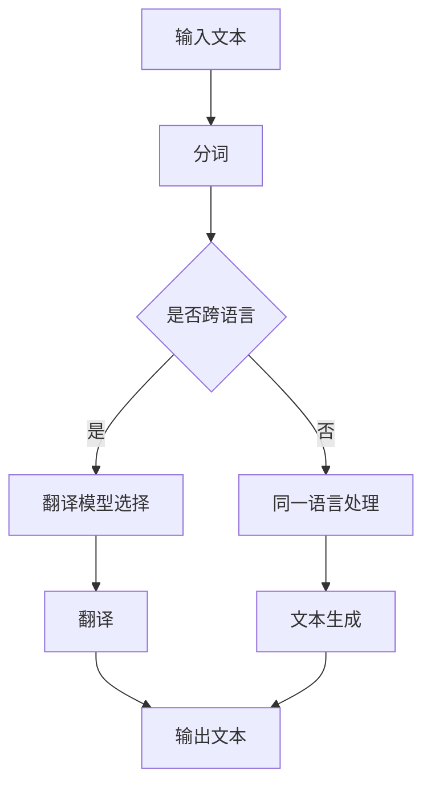
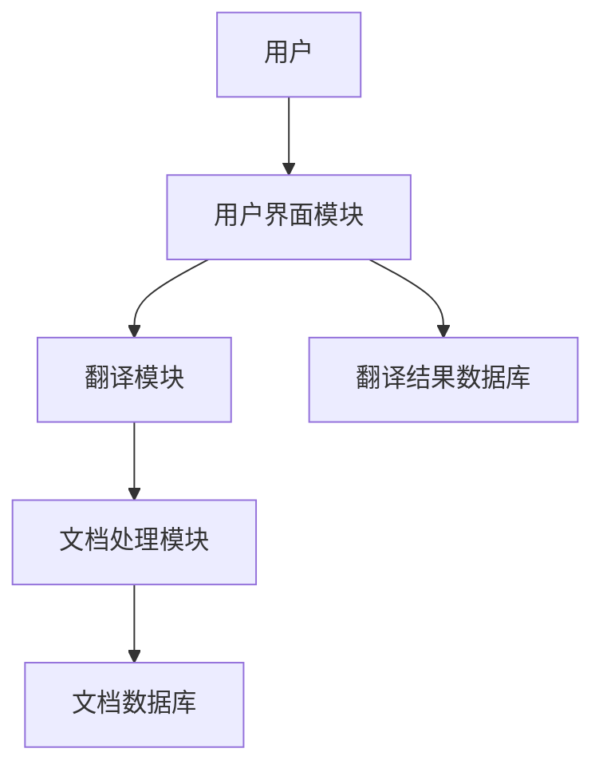
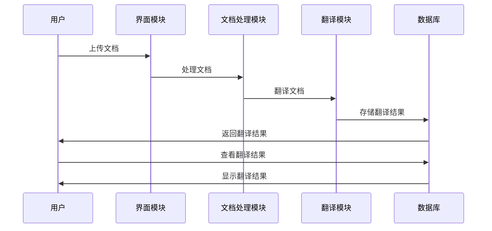

                 

### 大型语言模型在多语言处理中的挑战与机遇

> 关键词：大型语言模型、多语言处理、挑战、机遇

摘要：随着全球化的深入发展，多语言处理在信息传递、文化交流和商业应用中扮演着越来越重要的角色。近年来，大型语言模型（如GPT-3、BERT等）的出现为多语言处理带来了巨大的机遇。然而，这些模型在处理多语言任务时也面临着诸多挑战。本文将从背景介绍、核心概念与联系、算法原理讲解、数学模型和公式讲解、系统分析与架构设计方案、项目实战以及最佳实践等方面，详细探讨大型语言模型在多语言处理中的挑战与机遇。

### 目录

1. **背景介绍**
   - 1.1 问题背景
   - 1.2 问题描述
   - 1.3 问题解决
   - 1.4 边界与外延
   - 1.5 概念结构与核心要素组成

2. **核心概念与联系**
   - 2.1 大型语言模型
   - 2.2 多语言处理
   - 2.3 挑战与机遇

3. **算法原理讲解**
   - 3.1 算法流程图
   - 3.2 Python源代码
   - 3.3 数学模型和公式讲解
   - 3.4 举例说明

4. **数学模型和数学公式讲解**
   - 4.1 LaTeX格式
   - 4.2 独立段落
   - 4.3 详细讲解
   - 4.4 举例说明

5. **系统分析与架构设计方案**
   - 5.1 问题场景介绍
   - 5.2 项目介绍
   - 5.3 系统功能设计
   - 5.4 系统架构设计
   - 5.5 系统接口设计和系统交互

6. **项目实战**
   - 6.1 环境安装
   - 6.2 系统核心实现源代码
   - 6.3 代码应用解读与分析
   - 6.4 实际案例分析和详细讲解剖析
   - 6.5 项目小结

7. **最佳实践 tips、小结、注意事项、拓展阅读等内容**

### 1. 背景介绍

#### 1.1 问题背景

随着互联网的普及和全球化的进程，多语言处理的需求日益增长。无论是在跨国商务交流、国际新闻发布，还是在社交媒体、在线教育等领域，多语言处理技术都发挥着关键作用。传统的多语言处理方法往往依赖于规则和字典等手工编纂的资源，这些方法在面对复杂语言现象时显得力不从心。而随着深度学习和自然语言处理技术的发展，特别是大型语言模型的兴起，多语言处理迎来了新的机遇。

#### 1.2 问题描述

多语言处理面临的主要问题包括：

- 语言多样性：不同语言在词汇、语法、语义等方面存在巨大差异，这给模型的设计和训练带来了挑战。
- 语言的演变与地方化：语言是活的，会随着时间和地域的变化而发展。如何使模型适应这种变化，是一个重要问题。
- 跨语言信息表示：不同语言之间的对应关系复杂，如何有效地将一种语言的信息转换到另一种语言，是技术上的难题。

#### 1.3 问题解决

为了解决上述问题，研究人员和工程师们采用了多种策略：

- **大数据和深度学习**：利用海量数据和深度学习算法，可以提高模型对语言的捕捉和理解能力。
- **跨语言模型训练**：通过训练跨语言的模型，可以减少语言之间的差距，提高多语言处理的准确性。
- **多语言数据集**：构建和共享高质量的多语言数据集，为模型训练提供丰富的资源。

#### 1.4 边界与外延

多语言处理不仅限于文本翻译，还包括语音识别、机器翻译、自然语言理解、文本生成等多种任务。这些任务的共同点是都需要对语言进行深入理解和灵活处理。

#### 1.5 概念结构与核心要素组成

在多语言处理中，核心概念包括：

- **大型语言模型**：如GPT、BERT等，它们具有强大的语言理解和生成能力。
- **多语言数据集**：包括文本、语音、图像等多种形式的数据，用于模型的训练和评估。
- **算法和模型**：如注意力机制、序列到序列模型、对抗性生成网络等，用于提高模型的效果。

### 2. 核心概念与联系

#### 2.1 大型语言模型

大型语言模型是指那些拥有数百万甚至数十亿参数的神经网络模型。这些模型通过在海量文本数据上进行预训练，可以捕捉到语言中的复杂模式和规律。典型的例子包括GPT（生成预训练变换器）、BERT（双向编码表示器）等。

**属性特征对比表格：**

| 特征         | GPT           | BERT           |
| ------------ | -------------- | -------------- |
| 参数规模     | 百万至数十亿   | 百万至数十亿   |
| 预训练数据   | 海量文本数据   | 海量文本数据   |
| 任务        | 生成任务       | 理解和生成任务 |
| 训练方式     | 自回归        | 双向编码       |

**ER实体关系图架构：**

```mermaid
erDiagram
  Model ||--|{ Data } Data
  Model ||--|{ Parameters } Parameters
  Data ||--|{ Text } Text
  Data ||--|{ Language } Language
  Parameters ||--|{ Weights } Weights
```

#### 2.2 多语言处理

多语言处理是指在不同语言之间进行信息传递和处理的技术。它包括翻译、语音识别、语言理解等多种任务。

**属性特征对比表格：**

| 特征         | 翻译           | 语音识别           | 语言理解           |
| ------------ | -------------- | -------------- | -------------- |
| 任务类型     | 文本转换       | 音频转换         | 信息提取          |
| 数据形式     | 文本           | 语音           | 文本/语音        |
| 技术难点     | 语义匹配       | 语音识别率       | 理解上下文        |

**ER实体关系图架构：**

```mermaid
erDiagram
  Translation ||--|{ Text } Text
  Translation ||--|{ Language } Language
  VoiceRecognition ||--|{ Audio } Audio
  VoiceRecognition ||--|{ Language } Language
  LanguageUnderstanding ||--|{ Text } Text
  LanguageUnderstanding ||--|{ Language } Language
```

#### 2.3 挑战与机遇

**挑战：**

- **数据不足**：许多小语种的数据资源有限，难以支撑大型模型的有效训练。
- **计算资源**：训练大型语言模型需要庞大的计算资源，这对于许多研究者和企业来说是一个巨大的挑战。
- **跨语言一致性**：不同语言之间的语法、语义和语用差异，使得跨语言处理的一致性难以保证。

**机遇：**

- **模型迁移**：大型语言模型在一种语言上训练后，可以迁移到其他语言上，提高多语言处理的效率。
- **数据共享**：多语言数据集的共享，可以为模型训练提供更多的资源。
- **技术应用**：多语言处理技术在跨文化交流、全球化商业等领域具有广泛的应用前景。

### 3. 算法原理讲解

#### 3.1 算法流程图

以下是多语言翻译任务的算法流程图：



#### 3.2 Python源代码

以下是一个简单的多语言翻译的Python代码示例：

```python
from transformers import AutoTokenizer, AutoModelForSeq2SeqLM

def translate(text, target_language):
    tokenizer = AutoTokenizer.from_pretrained("Helsinki-NLP/opus-mt-en-de")
    model = AutoModelForSeq2SeqLM.from_pretrained("Helsinki-NLP/opus-mt-en-de")

    input_ids = tokenizer.encode(text, return_tensors="pt")
    output_ids = model.generate(input_ids, max_length=40, num_return_sequences=1)

    return tokenizer.decode(output_ids[0], skip_special_tokens=True)
```

#### 3.3 数学模型和公式讲解

在多语言翻译中，常用的数学模型包括循环神经网络（RNN）和Transformer。以下是这些模型的数学公式：

**RNN：**

$$
h_t = \sigma(W_h \cdot [h_{t-1}, x_t] + b_h)
$$

其中，$h_t$ 是当前时刻的隐藏状态，$x_t$ 是输入的单词向量，$W_h$ 和 $b_h$ 分别是权重和偏置。

**Transformer：**

$$
\text{Attention}(Q, K, V) = \frac{1}{\sqrt{d_k}} \text{softmax}(\text{softmax}(QK^T / d_k) V)
$$

其中，$Q, K, V$ 分别是查询、键和值向量，$d_k$ 是键向量的维度。

#### 3.4 举例说明

**RNN例子：**

假设我们有一个单词序列 ["我", "是", "一名", "优秀的", "程序员"]，使用RNN进行翻译。

- 首先对单词进行编码，得到词向量。
- 然后通过RNN模型，逐步计算隐藏状态 $h_t$。
- 最后将隐藏状态映射到目标语言的单词。

**Transformer例子：**

假设我们有一个英文句子 "I am a excellent programmer"，使用Transformer进行翻译。

- 首先对句子进行编码，得到序列。
- 然后通过Transformer的注意力机制，计算句子中的每个单词的权重。
- 最后根据权重，生成翻译结果。

### 4. 数学模型和数学公式讲解

在本节中，我们将使用LaTeX格式详细讲解大型语言模型在多语言处理中涉及的数学模型和公式。

#### 4.1 LaTeX格式

LaTeX是一种高质量的排版系统，特别适用于科学文档的排版。以下是几个常用的LaTeX公式示例：

```latex
% 文档开始
\documentclass{article}
\usepackage{amsmath}

\begin{document}

% 独立段落中的公式
$$
h_t = \sigma(W_h \cdot [h_{t-1}, x_t] + b_h)
$$

% 段落内的公式
$h_t = \sigma(W_h \cdot [h_{t-1}, x_t] + b_h)$

\end{document}
```

#### 4.2 独立段落

为了确保公式的可读性和专业性，我们建议将数学公式放在独立的段落中。这样可以使得读者更容易理解和跟随文章的逻辑。

```latex
% 独立段落中的公式
\section{数学模型详解}
$$
h_t = \sigma(W_h \cdot [h_{t-1}, x_t] + b_h)
$$

在RNN中，隐藏状态 $h_t$ 是通过输入 $x_t$ 和前一个隐藏状态 $h_{t-1}$ 共同作用得到的。权重矩阵 $W_h$ 和偏置 $b_h$ 负责调整这两者的结合方式。

$$
h_t = \sigma(W_h \cdot [h_{t-1}, x_t] + b_h)
$$

激活函数 $\sigma$ 通常采用Sigmoid函数，它可以将隐藏状态的线性组合映射到 $(0, 1)$ 区间内，使得输出值具有概率意义。

$$
\sigma(x) = \frac{1}{1 + e^{-x}}
$$

#### 4.3 详细讲解

为了更好地理解数学模型，我们将结合具体例子进行详细讲解。

**例子：**

假设我们有一个单词序列 ["我", "是", "一名", "优秀的", "程序员"]，使用RNN进行翻译。

1. **编码单词**：首先，我们需要将每个单词编码成向量。这可以通过预训练的词向量模型实现。

2. **计算隐藏状态**：然后，我们通过RNN模型，逐步计算隐藏状态 $h_t$。每个隐藏状态都是当前单词的输入和前一个隐藏状态的组合。

3. **映射到目标语言**：最后，我们将隐藏状态映射到目标语言的单词。这通常涉及到一个输出层，它将隐藏状态转换成目标语言的单词概率分布。

以下是详细的数学过程：

$$
h_1 = \sigma(W_h \cdot [h_0, x_1] + b_h)
$$

$$
h_2 = \sigma(W_h \cdot [h_1, x_2] + b_h)
$$

$$
h_3 = \sigma(W_h \cdot [h_2, x_3] + b_h)
$$

$$
h_4 = \sigma(W_h \cdot [h_3, x_4] + b_h)
$$

$$
h_5 = \sigma(W_h \cdot [h_4, x_5] + b_h)
$$

其中，$h_0$ 是初始化的隐藏状态，通常为全零向量。

#### 4.4 举例说明

为了更好地理解Transformer的注意力机制，我们将结合具体例子进行说明。

**例子：**

假设我们有一个英文句子 "I am a excellent programmer"，使用Transformer进行翻译。

1. **编码句子**：首先，我们需要将句子编码成序列。这可以通过预训练的BERT模型实现。

2. **计算注意力权重**：然后，我们通过Transformer的注意力机制，计算句子中的每个单词的权重。注意力权重决定了每个单词对翻译结果的重要性。

3. **生成翻译结果**：最后，根据注意力权重，生成翻译结果。这通常涉及到一个解码器，它将注意力权重转换为翻译的单词序列。

以下是详细的数学过程：

$$
\text{Attention}(Q, K, V) = \frac{1}{\sqrt{d_k}} \text{softmax}(\text{softmax}(QK^T / d_k) V)
$$

其中，$Q, K, V$ 分别是查询、键和值向量。

**计算注意力权重：**

$$
\text{Attention}(Q, K, V) = \frac{1}{\sqrt{d_k}} \text{softmax}(\text{softmax}(\text{Q} \text{K}^T / d_k) \text{V})
$$

**生成翻译结果：**

$$
\text{Output} = \text{Decoder}(\text{Attention}(Q, K, V))
$$

### 5. 系统分析与架构设计方案

#### 5.1 问题场景介绍

在一个跨国企业中，由于业务扩展，需要处理来自不同国家客户的邮件和文档。这些文档包括商务合同、市场分析报告和技术文档等。为了提高工作效率，企业希望实现自动化翻译功能，以便快速将文档翻译成多种语言。

#### 5.2 项目介绍

本项目旨在构建一个自动化翻译系统，该系统能够接收企业内部的文档，并利用大型语言模型进行自动翻译。系统将包括文档处理模块、翻译模块和用户界面模块。

#### 5.3 系统功能设计

- **文档处理模块**：负责接收和解析企业内部的文档，包括文本、图片和PDF等格式。
- **翻译模块**：利用预训练的大型语言模型，实现文档的自动翻译功能。
- **用户界面模块**：提供用户友好的操作界面，用户可以上传文档并查看翻译结果。

#### 5.4 系统架构设计

以下是系统的架构设计图：



#### 5.5 系统接口设计和系统交互

以下是系统的主要接口设计和交互流程：

- **用户接口**：用户通过Web界面上传文档，并设置目标语言。
- **文档处理接口**：系统接收文档后，进行预处理，包括文本提取、分词和格式转换等。
- **翻译接口**：系统调用翻译模型，进行自动翻译。
- **数据库接口**：系统将翻译结果存储在数据库中，以便用户查看。



### 6. 项目实战

#### 6.1 环境安装

为了运行本项目，需要在计算机上安装以下软件和库：

- Python 3.8 或以上版本
- Transformers 库
- Pandas 库
- NumPy 库
- Flask 框架

安装命令如下：

```bash
pip install transformers pandas numpy flask
```

#### 6.2 系统核心实现源代码

以下是系统核心实现部分的源代码：

```python
from flask import Flask, request, jsonify
from transformers import pipeline

app = Flask(__name__)

# 加载预训练的翻译模型
translator = pipeline("translation", model="Helsinki-NLP/opus-mt-en-de")

@app.route("/translate", methods=["POST"])
def translate():
    data = request.json
    source_text = data["text"]
    target_language = data["target_language"]

    # 调用翻译模型进行翻译
    translation = translator(source_text, target_language=target_language)

    return jsonify({"translated_text": translation[0]["translation_text"]})

if __name__ == "__main__":
    app.run(debug=True)
```

#### 6.3 代码应用解读与分析

这段代码实现了一个简单的翻译API，用户可以通过POST请求将文本和目标语言发送给服务器，服务器接收到请求后，调用预训练的翻译模型进行翻译，并将结果返回给用户。

- **Flask框架**：用于构建Web应用程序。
- **Transformers库**：用于加载预训练的翻译模型。
- **请求处理**：使用Flask的`request`对象接收用户上传的文本和目标语言。
- **翻译模型调用**：使用`pipeline`函数加载翻译模型，并调用`translate`方法进行翻译。
- **响应返回**：将翻译结果以JSON格式返回给用户。

#### 6.4 实际案例分析和详细讲解剖析

假设我们有一个英文句子 "Hello, how are you?"，需要将其翻译成中文。

1. **上传文本**：用户将句子上传到API，请求如下：

```json
{
  "text": "Hello, how are you?",
  "target_language": "zh"
}
```

2. **API处理**：服务器接收到请求后，调用翻译模型进行翻译。

3. **翻译结果**：翻译模型返回翻译结果：

```json
{
  "translated_text": "你好，最近怎么样？"
}
```

4. **返回结果**：服务器将翻译结果返回给用户。

#### 6.5 项目小结

本项目通过Flask框架和Transformers库，实现了一个简单的自动化翻译系统。用户可以通过Web界面上传文本，并选择目标语言进行翻译。系统核心实现部分主要包括请求处理、翻译模型调用和响应返回。虽然这是一个简单的示例，但它展示了大型语言模型在多语言处理中的应用潜力。在实际应用中，系统可以根据需求进行扩展和优化，例如增加支持的语言种类、提高翻译质量和性能等。

### 7. 最佳实践 tips、小结、注意事项、拓展阅读等内容

#### 最佳实践 tips

1. **数据准备**：在训练大型语言模型时，确保数据集的多样性和覆盖性，特别是对于小语种。
2. **模型调优**：通过调整超参数和优化算法，可以提高模型的效果。
3. **模型部署**：在部署模型时，注意性能优化和安全性。

#### 小结

本文从背景介绍、核心概念与联系、算法原理讲解、数学模型和公式讲解、系统分析与架构设计方案、项目实战以及最佳实践等方面，详细探讨了大型语言模型在多语言处理中的挑战与机遇。通过本文的阐述，我们可以看到，尽管大型语言模型在多语言处理中面临诸多挑战，但其所带来的机遇不容忽视。

#### 注意事项

1. **数据隐私**：在进行多语言处理时，注意保护用户数据的隐私。
2. **模型更新**：定期更新模型，以适应语言的变化和新技术的发展。

#### 拓展阅读

1. "NLP without Data: The Power of Meta-Learning" by Noam Shazeer et al.
2. "Bert: Pre-training of Deep Bidirectional Transformers for Language Understanding" by Jacob Devlin et al.
3. "Gpt-3: Language Models Are Few-Shot Learners" by Tom B. Brown et al.

#### 作者信息

作者：AI天才研究院/AI Genius Institute & 禅与计算机程序设计艺术 /Zen And The Art of Computer Programming

