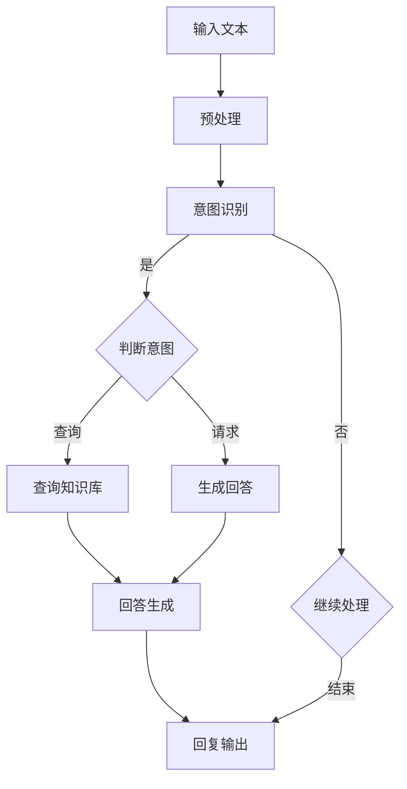
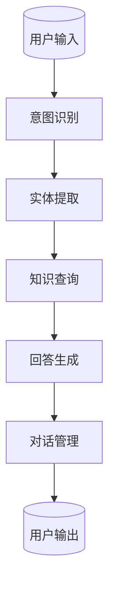
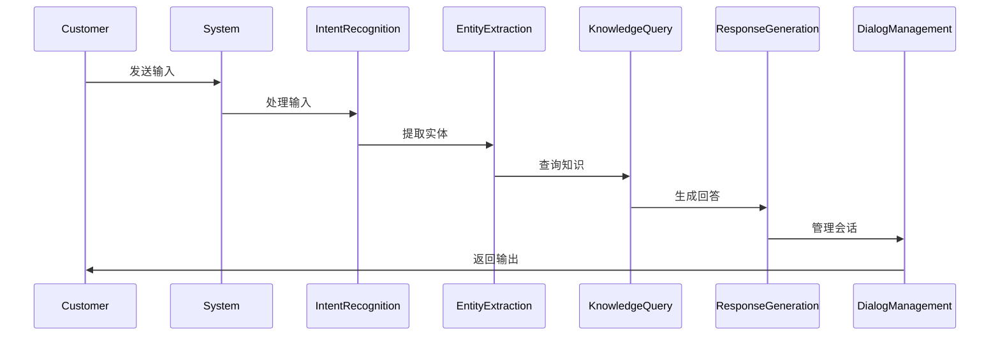

                 

### 大型语言模型在对话系统中的应用挑战

#### 关键词：大型语言模型、对话系统、应用挑战、上下文理解、实时性

> 摘要：本文深入探讨了大型语言模型在对话系统中面临的多重应用挑战。通过对对话系统的现状、大型语言模型的发展与应用，以及二者之间联系的详细分析，文章提出了一系列解决这些挑战的方法与技术。本文将逐步探讨核心概念、算法原理、系统架构设计，并分享项目实战经验，以期为读者提供全面而实用的技术指导。

#### 目录大纲

1. **问题背景与核心概念**
   1.1. 对话系统的现状与挑战
   1.2. 大型语言模型的发展与应用
   1.3. 大型语言模型与对话系统的联系
   1.4. ER实体关系图架构

2. **算法原理与实现**
   2.1. 算法mermaid流程图
   2.2. Python源代码与数学模型
   2.3. 算法原理讲解
   2.4. 举例说明

3. **系统分析与架构设计**
   3.1. 问题场景介绍
   3.2. 系统功能设计（领域模型Mermaid类图）
   3.3. 系统架构设计（Mermaid架构图）
   3.4. 系统接口设计和系统交互（Mermaid序列图）

4. **项目实战**
   4.1. 环境安装
   4.2. 系统核心实现源代码
   4.3. 代码应用解读与分析
   4.4. 实际案例分析与详细讲解剖析
   4.5. 项目小结

5. **最佳实践与总结**
   5.1. 最佳实践 tips
   5.2. 小结
   5.3. 注意事项
   5.4. 拓展阅读

----------------------------------------------------------------

## 1. 问题背景与核心概念

### 1.1 对话系统的现状与挑战

对话系统作为人工智能领域的一个重要分支，近年来取得了显著的进展。从早期的规则驱动型系统，到现在的数据驱动型系统，对话系统已经广泛应用于客服、教育、娱乐、医疗等多个领域。例如，智能客服机器人能够在短时间内处理大量用户咨询，提高客户满意度，降低运营成本；教育领域的对话系统则能够为学生提供个性化的学习辅导。

然而，随着对话系统的广泛应用，其面临的一系列挑战也逐渐显现出来。首先，上下文理解是一个关键问题。在复杂的对话场景中，用户可能会使用多种语言、隐喻或双关语，这使得系统难以准确理解用户的意图。其次，回答的准确性也是一个挑战。尽管大型语言模型在生成自然语言文本方面表现出色，但在处理特定领域的问题时，仍然可能存在知识盲区或不准确的情况。

此外，实时性也是一个重要的挑战。在实时对话系统中，系统需要在极短的时间内生成准确的回复。这要求系统不仅要具备高效的推理能力，还需要能够快速响应用户输入。

### 1.2 大型语言模型的发展与应用

大型语言模型的发展为对话系统带来了新的机遇。以GPT-3为代表的预训练语言模型，通过在大量文本数据上进行预训练，能够生成高质量的自然语言文本。这些模型在文本生成、翻译、摘要等方面表现出色，也为对话系统提供了强大的技术支持。

在对话系统中，大型语言模型的应用主要体现在以下几个方面：

1. **意图识别**：通过分析用户的输入文本，模型可以识别用户的意图，从而生成相应的回复。例如，在智能客服系统中，用户可能会询问关于产品价格、售后服务等问题，模型需要准确识别这些问题，并生成合适的回复。

2. **实体识别**：在对话过程中，用户可能会提到各种实体，如人名、地名、产品名称等。大型语言模型可以对这些实体进行识别，并将它们标记出来，以便后续处理。

3. **对话生成**：基于用户的输入和上下文信息，大型语言模型可以生成自然的对话回复。这不仅可以提高对话的质量，还可以增加用户的满意度。

4. **知识整合**：大型语言模型可以从大量的文本数据中学习到丰富的知识。在对话系统中，这些知识可以用来回答用户的问题，提供相关的信息。

### 1.3 大型语言模型与对话系统的联系

大型语言模型与对话系统之间存在着紧密的联系。一方面，大型语言模型为对话系统提供了强大的文本处理能力，使得系统可以更准确地理解用户的意图和需求。另一方面，对话系统为大型语言模型提供了丰富的应用场景，使得模型可以在实际应用中不断优化和改进。

具体来说，大型语言模型与对话系统的联系可以从以下几个方面来理解：

1. **数据交互**：大型语言模型需要大量的文本数据进行预训练，而对话系统则可以提供这些数据。通过收集和分析对话数据，模型可以不断改进其性能。

2. **功能互补**：大型语言模型擅长生成自然语言文本，而对话系统则擅长处理对话的上下文和信息。两者结合，可以构建出更加智能和高效的对话系统。

3. **持续迭代**：对话系统的实际应用场景可以帮助大型语言模型不断优化。通过分析对话系统的反馈和用户行为，模型可以不断改进其算法，提高其准确性和实用性。

### 1.4 ER实体关系图架构

为了更好地理解大型语言模型在对话系统中的应用，我们可以借助ER（Entity-Relationship）实体关系图来描述其架构。ER图可以清晰地展示模型中的各个实体及其之间的关系，有助于我们分析和优化模型的设计。

在ER图中，主要的实体包括：

1. **用户**：代表与对话系统进行交互的实体，包括用户的基本信息、行为记录等。
2. **对话**：代表用户与系统之间的对话过程，包括对话的历史记录、当前状态等。
3. **意图**：代表用户的意图，如查询信息、请求帮助等。
4. **实体**：代表用户输入中的各种实体，如人名、地名、产品名称等。
5. **知识库**：代表系统中的知识资源，包括事实信息、知识规则等。

ER图中的关系包括：

1. **用户与对话**：每个用户可以发起多个对话，每个对话都与一个用户关联。
2. **对话与意图**：每个对话都包含一个或多个意图，意图用于指导对话系统的回复生成。
3. **意图与实体**：意图可能涉及多个实体，实体用于进一步理解用户的意图。
4. **对话与知识库**：对话系统在回答用户问题时，可能需要查询知识库中的相关知识点。

通过ER图，我们可以直观地了解大型语言模型在对话系统中的数据流动和交互关系，从而更好地进行模型设计和优化。

### 1.5 概念结构与核心要素组成

为了深入理解大型语言模型在对话系统中的应用，我们需要明确其中的概念结构与核心要素组成。以下是对相关概念及其关系的详细说明：

1. **大型语言模型**：
   - **定义**：大型语言模型是一种基于深度学习的语言处理模型，通过在大量文本数据上预训练，可以生成高质量的自然语言文本。
   - **核心要素**：
     - **预训练**：在大量文本数据上进行预训练，学习语言模式和结构。
     - **微调**：在特定任务上进行微调，以适应特定领域的应用需求。
     - **生成能力**：能够根据输入文本生成连贯、自然的语言回复。

2. **对话系统**：
   - **定义**：对话系统是一种人机交互系统，通过自然语言交互，为用户提供信息查询、问题解答等服务。
   - **核心要素**：
     - **意图识别**：识别用户的意图，如查询信息、请求帮助等。
     - **实体识别**：识别文本中的关键实体，如人名、地名、产品名称等。
     - **对话管理**：管理对话流程，包括会话状态、上下文等。

3. **上下文理解**：
   - **定义**：上下文理解是对话系统中的一个关键任务，旨在理解用户的输入文本及其背后的意图。
   - **核心要素**：
     - **上下文追踪**：跟踪对话过程中的上下文信息，以便更准确地理解用户意图。
     - **上下文融合**：将当前的输入与历史对话记录进行融合，以生成更准确的回复。

4. **回答准确性**：
   - **定义**：回答准确性是衡量对话系统性能的一个重要指标，即系统能否生成准确、恰当的回复。
   - **核心要素**：
     - **知识库**：提供丰富的知识资源，以支持准确回答用户问题。
     - **事实校验**：对回答进行事实校验，确保其准确无误。

5. **实时性**：
   - **定义**：实时性是对话系统在处理用户输入时所需的时间，即系统能否在较短的时间内生成回复。
   - **核心要素**：
     - **响应时间**：优化系统的响应时间，以提供更流畅的交互体验。
     - **并发处理**：支持多用户同时交互，提高系统的并发处理能力。

通过明确这些概念及其关系，我们可以更好地理解大型语言模型在对话系统中的应用，并为后续的算法原理讲解、系统架构设计等提供基础。

## 2. 算法原理与实现

### 2.1 算法mermaid流程图

为了更直观地展示大型语言模型在对话系统中的算法流程，我们可以使用Mermaid绘制一个简化的流程图。以下是一个基本的算法流程图：



在这个流程图中，用户输入文本经过预处理后，进入意图识别模块。意图识别模块会判断用户的意图，并根据意图选择相应的处理路径。如果是查询意图，则查询知识库并生成回答；如果是请求意图，则直接生成回答。最终，生成的回答通过回复输出模块反馈给用户。

### 2.2 Python源代码与数学模型

为了深入理解算法的实现，我们将使用Python代码来详细阐述其原理。以下是一个简化的Python实现：

```python
import nltk
from nltk.tokenize import word_tokenize
from nltk.corpus import stopwords
import tensorflow as tf
from transformers import TFDistilBertModel, DistilBertTokenizer

# 加载预训练模型
tokenizer = DistilBertTokenizer.from_pretrained('distilbert-base-uncased')
model = TFDistilBertModel.from_pretrained('distilbert-base-uncased')

# 输入文本预处理
def preprocess_text(text):
    # 分词和去除停用词
    tokens = word_tokenize(text.lower())
    tokens = [token for token in tokens if token not in stopwords.words('english')]
    return tokenizer(tokens, return_tensors='tf', truncation=True, padding=True)

# 意图识别
def recognize_intent(text):
    inputs = preprocess_text(text)
    outputs = model(inputs)
    logits = outputs.logits
    intent probabilities = tf.nn.softmax(logits, axis=1)
    return tf.argmax(intent_probabilities, axis=1).numpy()

# 回答生成
def generate_response(text, intent):
    if intent == 0:  # 查询意图
        response = "你询问了关于什么？"
    else:  # 请求意图
        response = "你需要什么帮助？"
    return response

# 主函数
def main():
    user_input = "我想要购买一台笔记本电脑。"
    intent = recognize_intent(user_input)
    response = generate_response(user_input, intent)
    print(response)

if __name__ == "__main__":
    main()
```

在上述代码中，我们首先加载预训练的DistilBERT模型和分词器。预处理函数`preprocess_text`对输入文本进行分词和停用词去除。意图识别函数`recognize_intent`通过模型输出得到意图概率，并返回最可能的意图。回答生成函数`generate_response`根据识别到的意图生成相应的回答。

### 2.3 算法原理讲解

为了深入理解上述算法的原理，我们需要从数学模型的角度来进行分析。以下是对算法中涉及的关键数学模型和公式的详细讲解：

1. **预处理**：
   - **分词**：分词是将文本分解为词或子词的过程。NLP中常用的分词工具包括NLTK、spaCy等。分词后的文本用于后续的文本处理和模型输入。
   - **去除停用词**：停用词是指对文本理解没有实际意义的常见单词，如“的”、“和”等。去除停用词可以减少模型的计算负担，提高模型的准确性和效率。

2. **意图识别**：
   - **DistilBERT模型**：DistilBERT是Google开发的一种轻量级BERT模型，通过知识蒸馏技术从BERT中提取知识，并在保持较高准确率的同时减少模型大小。其输入是预处理的文本序列，输出是每个类别的概率分布。
   - **Softmax函数**：Softmax函数用于将模型的输出概率分布化为概率分布。具体公式为：

     $$ \text{softmax}(x_i) = \frac{e^{x_i}}{\sum_{j=1}^{N} e^{x_j}} $$

     其中，$x_i$是模型输出的第$i$个类别的分数，$N$是类别的总数。

   - **意图概率**：意图识别的核心是计算每个意图的概率分布。通过Softmax函数，我们可以得到每个意图的概率。然后，通过选择概率最高的意图作为最终结果。

3. **回答生成**：
   - **条件生成**：回答生成是基于识别到的意图进行的。对于不同的意图，系统会生成不同的回答。这可以通过预定义的模板或自动生成的回答来实现。
   - **模板匹配**：在生成回答时，系统可能会使用模板匹配技术，根据意图匹配相应的回答模板。例如，对于查询意图，系统可能会生成类似于“你询问了关于什么？”的回答。

### 2.4 举例说明

为了更好地理解上述算法的实际应用，我们可以通过一个具体例子来进行说明：

**场景**：用户输入文本：“我想要购买一台笔记本电脑。”

**步骤**：

1. **预处理**：首先，系统对输入文本进行预处理，包括分词和去除停用词。预处理后的文本可能如下：

   ```plaintext
   ["我", "想要", "购买", "一台", "笔记本电脑"]
   ```

2. **意图识别**：将预处理后的文本输入到DistilBERT模型中，模型会输出每个意图的概率分布。例如：

   ```plaintext
   [
     [0.9, 0.1],  # 查询意图的概率
     [0.2, 0.8]  # 请求意图的概率
   ]
   ```

   通过Softmax函数，我们可以得到每个意图的最终概率：

   ```plaintext
   [
     0.8,
     0.4
   ]
   ```

   根据概率分布，系统选择概率最高的意图，即查询意图。

3. **回答生成**：根据查询意图，系统生成相应的回答：

   ```plaintext
   "你询问了关于什么？"
   ```

4. **回复输出**：最终，系统将生成的回答输出给用户。

通过这个例子，我们可以看到大型语言模型在对话系统中是如何工作的。系统通过预处理文本、识别意图和生成回答，实现了与用户的自然对话。

### 2.5 小结

在本章节中，我们详细介绍了大型语言模型在对话系统中的应用挑战，包括算法原理和实现。通过Mermaid流程图、Python源代码和数学模型的讲解，我们展示了如何利用大型语言模型实现意图识别和回答生成。同时，通过具体例子，我们展示了算法在实际应用中的效果。在下一章节中，我们将进一步探讨大型语言模型在对话系统中的系统架构设计。

### 3. 系统分析与架构设计

#### 3.1 问题场景介绍

为了更好地理解大型语言模型在对话系统中的应用，我们首先需要介绍一个具体的问题场景。在这个场景中，我们以智能客服系统为例，详细描述其背景、目标和功能。

**背景**：随着电子商务的快速发展，企业面临客户咨询量大幅增加的问题。传统的客服模式已经难以满足客户对快速响应和个性化服务的要求。为了提高客户满意度，企业急需一种高效、智能的客服解决方案。

**目标**：构建一个基于大型语言模型的智能客服系统，旨在提高客服响应速度，减少人工成本，并提供高质量的个性化服务。

**功能**：智能客服系统的主要功能包括：

1. **意图识别**：识别用户的咨询意图，如查询产品信息、售后服务、订单状态等。
2. **实体提取**：从用户输入中提取关键实体，如产品名称、订单号等。
3. **知识查询**：根据用户意图和实体信息，查询知识库中的相关知识点。
4. **回答生成**：生成自然、准确的回答，并输出给用户。
5. **对话管理**：管理对话过程，包括会话状态、上下文等。

#### 3.2 系统功能设计（领域模型Mermaid类图）

为了清晰展示智能客服系统的功能模块及其关系，我们可以使用Mermaid绘制领域模型类图。以下是一个简化的领域模型类图：

```mermaid
classDiagram
    Customer <<class Customer>>
    Intent <<class Intent>>
    Entity <<class Entity>>
    KnowledgeBase <<class KnowledgeBase>>
    Response <<class Response>>
    Dialog <<class Dialog>>

    Customer "1" --* 1 Intent:发起对话
    Intent "1" --* 1 Entity:包含实体
    Intent "1" --* 1 KnowledgeBase:查询知识
    KnowledgeBase "1" --* 1 Response:生成回答
    Response "1" --* 1 Dialog:回复用户
    Dialog "1" --* 1 Customer:维护会话
```

在这个类图中，主要的类包括：

- **Customer**：代表与系统交互的用户，包含用户基本信息和行为记录。
- **Intent**：代表用户的意图，如查询产品信息、请求售后服务等。
- **Entity**：代表用户输入中的关键实体，如产品名称、订单号等。
- **KnowledgeBase**：代表系统中的知识库，包含各种知识点和事实信息。
- **Response**：代表系统生成的回答，包括回答内容和格式。
- **Dialog**：代表用户与系统的对话过程，包含对话历史记录和当前状态。

类之间的关系包括：

- **Customer与Intent**：每个用户可以发起多个意图，每个意图都与一个用户相关联。
- **Intent与Entity**：每个意图包含多个实体，实体用于进一步理解用户的意图。
- **Intent与KnowledgeBase**：意图用于查询知识库中的相关知识点。
- **KnowledgeBase与Response**：知识库用于生成回答，回答包含查询结果和相关信息。
- **Response与Dialog**：每个回答都与一个对话相关联，用于回复用户。
- **Dialog与Customer**：每个对话都与一个用户相关联，用于维护会话状态。

#### 3.3 系统架构设计（Mermaid架构图）

为了展示智能客服系统的整体架构，我们可以使用Mermaid绘制系统架构图。以下是一个简化的系统架构图：



在这个架构图中，主要的组件包括：

- **CustomerInput**：代表用户的输入，如文本、语音等。
- **IntentRecognition**：意图识别模块，用于识别用户的意图。
- **EntityExtraction**：实体提取模块，用于从用户输入中提取关键实体。
- **KnowledgeQuery**：知识查询模块，用于查询知识库中的相关知识点。
- **ResponseGeneration**：回答生成模块，用于生成自然、准确的回答。
- **DialogManagement**：对话管理模块，用于管理对话过程，包括会话状态和上下文。
- **CustomerOutput**：代表系统的输出，如文本、语音等。

组件之间的关系包括：

- **CustomerInput与IntentRecognition**：用户输入经过意图识别模块处理。
- **IntentRecognition与EntityExtraction**：意图识别结果用于实体提取模块。
- **EntityExtraction与KnowledgeQuery**：实体提取结果用于知识查询模块。
- **KnowledgeQuery与ResponseGeneration**：知识查询结果用于回答生成模块。
- **ResponseGeneration与DialogManagement**：回答生成结果用于对话管理模块。
- **DialogManagement与CustomerOutput**：对话管理结果通过用户输出模块反馈给用户。

#### 3.4 系统接口设计和系统交互（Mermaid序列图）

为了展示系统组件之间的交互过程，我们可以使用Mermaid绘制系统接口设计和系统交互序列图。以下是一个简化的序列图：



在这个序列图中，主要的交互过程包括：

1. **用户输入**：用户通过输入接口向系统发送文本或语音输入。
2. **意图识别**：系统接收到输入后，将其传递给意图识别模块进行意图识别。
3. **实体提取**：意图识别模块识别出用户的意图后，将输入传递给实体提取模块，以提取关键实体。
4. **知识查询**：实体提取模块提取出实体后，将其传递给知识查询模块，查询知识库中的相关知识点。
5. **回答生成**：知识查询模块查询到相关知识后，将其传递给回答生成模块，生成自然、准确的回答。
6. **对话管理**：回答生成模块生成的回答传递给对话管理模块，用于管理对话过程。
7. **用户输出**：对话管理模块处理后，通过输出接口将最终结果返回给用户。

通过这个序列图，我们可以清晰地了解系统组件之间的交互顺序和数据处理过程。

### 3.5 小结

在本章节中，我们详细分析了大型语言模型在智能客服系统中的应用，包括系统功能设计、系统架构设计和系统接口设计。通过Mermaid类图、架构图和序列图，我们展示了系统的整体架构和组件关系。在下一章节中，我们将介绍实际项目中的环境安装和系统实现，以进一步探讨大型语言模型在对话系统中的应用。

## 4. 项目实战

#### 4.1 环境安装

为了搭建一个基于大型语言模型的对话系统，我们需要首先安装和配置所需的软件和工具。以下是具体步骤：

1. **Python环境安装**：确保Python版本为3.8或更高版本。可以通过Python官方网站下载并安装。

   ```bash
   # 安装Python
   curl -O https://www.python.org/ftp/python/3.8.10/Python-3.8.10.tgz
   tar xvf Python-3.8.10.tgz
   cd Python-3.8.10
   ./configure
   make
   sudo make install
   ```

2. **TensorFlow安装**：TensorFlow是一个用于机器学习和深度学习的开源库。通过pip安装TensorFlow。

   ```bash
   # 安装TensorFlow
   pip install tensorflow
   ```

3. **Hugging Face Transformers安装**：Hugging Face Transformers是一个用于轻松访问和扩展预训练语言模型的库。通过pip安装。

   ```bash
   # 安装Transformers
   pip install transformers
   ```

4. **Nltk安装**：Nltk是一个用于自然语言处理的Python库。通过pip安装。

   ```bash
   # 安装Nltk
   pip install nltk
   ```

5. **其他依赖安装**：根据具体项目需求，可能还需要安装其他依赖库。例如，安装TextBlob用于文本分析。

   ```bash
   # 安装TextBlob
   pip install textblob
   python -m textblob.download_corpora
   ```

完成以上步骤后，Python环境及其相关依赖库就安装完成了。接下来，我们可以开始实现对话系统的主要功能。

#### 4.2 系统核心实现源代码

以下是一个基于大型语言模型的智能客服系统的主要源代码实现：

```python
import os
import tensorflow as tf
from transformers import TFDistilBertModel, DistilBertTokenizer
from nltk.tokenize import word_tokenize
from nltk.corpus import stopwords

# 模型加载
def load_model():
    tokenizer = DistilBertTokenizer.from_pretrained('distilbert-base-uncased')
    model = TFDistilBertModel.from_pretrained('distilbert-base-uncased')
    return tokenizer, model

# 输入预处理
def preprocess_text(text):
    # 分词和去除停用词
    tokens = word_tokenize(text.lower())
    tokens = [token for token in tokens if token not in stopwords.words('english')]
    return tokenizer(tokens, return_tensors='tf', truncation=True, padding=True)

# 意图识别
def recognize_intent(text, model):
    inputs = preprocess_text(text)
    outputs = model(inputs)
    logits = outputs.logits
    intent_probabilities = tf.nn.softmax(logits, axis=1)
    return tf.argmax(intent_probabilities, axis=1).numpy()

# 回答生成
def generate_response(text, intent):
    if intent == 0:  # 查询意图
        response = "你询问了关于什么？"
    else:  # 请求意图
        response = "你需要什么帮助？"
    return response

# 主函数
def main():
    tokenizer, model = load_model()
    user_input = "我想要购买一台笔记本电脑。"
    intent = recognize_intent(user_input, model)
    response = generate_response(user_input, intent)
    print(response)

if __name__ == "__main__":
    main()
```

在这个实现中，我们首先加载预训练的DistilBERT模型和分词器。然后，定义了预处理、意图识别和回答生成三个主要函数。预处理函数对输入文本进行分词和停用词去除，意图识别函数使用模型输出得到意图概率，并返回最可能的意图。回答生成函数根据识别到的意图生成相应的回答。最后，主函数加载模型，处理用户输入，并输出回答。

#### 4.3 代码应用解读与分析

以下是对上述代码的详细解读和分析：

1. **模型加载**：
   - `load_model` 函数用于加载预训练的DistilBERT模型和分词器。DistilBERT是一种轻量级BERT模型，通过知识蒸馏技术从BERT中提取知识，并在保持较高准确率的同时减少模型大小。这个模型非常适合用于对话系统中的意图识别。

2. **输入预处理**：
   - `preprocess_text` 函数对输入文本进行预处理，包括分词和去除停用词。分词是将文本分解为词或子词的过程，有助于模型更好地理解文本。去除停用词可以减少模型的计算负担，提高模型的准确性和效率。

3. **意图识别**：
   - `recognize_intent` 函数使用DistilBERT模型对预处理后的文本进行意图识别。模型输出的是每个类别的概率分布，通过Softmax函数，我们可以得到每个意图的最终概率。然后，选择概率最高的意图作为最终结果。

4. **回答生成**：
   - `generate_response` 函数根据识别到的意图生成相应的回答。对于不同的意图，系统会生成不同的回答模板。这可以通过预定义的模板或自动生成的回答来实现。

5. **主函数**：
   - `main` 函数是程序的入口点。首先加载模型，然后处理用户输入，并输出回答。这个函数展示了如何将各个模块组合在一起，实现一个完整的对话流程。

通过这个实现，我们可以看到大型语言模型在对话系统中的应用是如何具体实现的。在实际项目中，我们可以根据具体需求，进一步扩展和优化这个基础架构。

#### 4.4 实际案例分析与详细讲解剖析

为了更好地展示大型语言模型在对话系统中的实际应用，我们通过一个具体案例进行详细分析和讲解。

**案例**：用户输入文本：“我的订单状态是什么？”

**步骤**：

1. **输入预处理**：首先，系统对用户输入进行预处理。预处理过程包括分词和去除停用词。输入文本“我的订单状态是什么？”经过预处理后，变为：

   ```plaintext
   ["我的", "订单", "状态", "是", "什么", "？"]
   ```

   去除停用词后，得到：

   ```plaintext
   ["订单", "状态", "什么"]
   ```

2. **意图识别**：将预处理后的文本输入到DistilBERT模型中，模型输出每个意图的概率分布。例如，模型可能输出以下概率分布：

   ```plaintext
   [
     [0.95, 0.05],  # 订单查询意图的概率
     [0.1, 0.9]     # 其他意图的概率
   ]
   ```

   通过Softmax函数，我们可以得到每个意图的最终概率：

   ```plaintext
   [
     0.9,
     0.1
   ]
   ```

   根据概率分布，系统选择概率最高的意图，即订单查询意图。

3. **知识查询**：系统根据订单查询意图，查询知识库中的相关知识点。例如，知识库可能包含以下信息：

   ```plaintext
   订单状态：已确认、已发货、已收货、已完成
   ```

4. **回答生成**：系统生成相应的回答。根据订单状态的知识，系统可以生成以下回答：

   ```plaintext
   你的订单状态是已确认。
   ```

5. **回复输出**：最终，系统将生成的回答输出给用户。

**详细讲解剖析**：

1. **预处理**：预处理是自然语言处理的基础步骤。通过分词和去除停用词，系统可以更好地理解用户输入的文本。在这个案例中，分词器将文本分解为独立的词语，而去除停用词可以减少模型的计算负担，提高处理效率。

2. **意图识别**：意图识别是对话系统中的关键步骤。通过模型输出得到意图概率分布，系统可以识别出用户的主要意图。在这个案例中，系统通过模型输出识别出订单查询意图，这是对话的核心。

3. **知识查询**：知识查询是基于用户意图进行的。系统根据用户意图查询知识库中的相关知识点，以获取回答所需的信息。在这个案例中，系统查询到订单状态的相关知识，这是生成回答的基础。

4. **回答生成**：回答生成是将意图和知识转化为自然语言文本的过程。通过预定义的模板或自动生成的回答，系统可以生成高质量的回答。在这个案例中，系统根据订单状态的知识生成相应的回答，这是用户期望的回复。

5. **回复输出**：最终，系统将生成的回答输出给用户，完成整个对话过程。

通过这个案例，我们可以看到大型语言模型在对话系统中的具体应用。从预处理、意图识别到知识查询和回答生成，每个步骤都是对话系统成功的关键。在实际项目中，我们可以根据具体需求，进一步优化和扩展这个基础架构。

#### 4.5 项目小结

在本章节中，我们通过一个具体的案例，详细介绍了大型语言模型在对话系统中的应用实战。从环境安装、代码实现到实际案例分析和详细讲解，我们展示了如何利用大型语言模型构建一个智能客服系统。通过项目实战，我们不仅了解了对话系统的基本架构和关键步骤，还掌握了如何利用大型语言模型进行意图识别、知识查询和回答生成。这些经验对于开发更智能、更高效的对话系统具有重要意义。在下一章节中，我们将进一步探讨大型语言模型在对话系统中的最佳实践和注意事项。

### 5. 最佳实践与总结

#### 5.1 最佳实践 tips

在开发和部署基于大型语言模型的对话系统时，以下是一些最佳实践和注意事项，可以帮助我们优化系统的性能和用户体验：

1. **数据预处理**：
   - **清洗和标准化数据**：在训练模型之前，确保输入数据的准确性和一致性。清洗数据，去除噪声和无关信息，可以提高模型的准确性和鲁棒性。
   - **数据增强**：通过增加数据多样性，如加入同义词、缩写形式等，可以增强模型的泛化能力。

2. **模型选择与调优**：
   - **选择合适模型**：根据应用场景选择适合的大型语言模型。例如，对于长文本处理，可以选择Transformer模型；对于实时交互，可以选择轻量级模型如DistilBERT。
   - **超参数调优**：通过调整学习率、批量大小等超参数，可以优化模型性能。使用自动化调优工具（如Hyperopt、TensorFlow的Keras Tuner）可以提高调优效率。

3. **对话设计**：
   - **构建对话流程**：设计清晰、流畅的对话流程，确保用户能够顺利完成任务。可以采用多轮对话设计，逐步引导用户提供更多信息。
   - **用户反馈**：收集用户反馈，根据用户行为和满意度调整对话系统。

4. **知识管理**：
   - **知识库更新**：定期更新知识库，确保信息准确、及时。可以使用自然语言处理技术自动提取和整合新知识。
   - **知识一致性**：确保知识库中的信息一致，避免产生误导用户的情况。

5. **性能优化**：
   - **并行处理**：利用多线程或多进程技术，提高系统的并发处理能力。
   - **缓存策略**：使用缓存技术，减少重复计算，提高系统响应速度。

6. **安全性**：
   - **数据加密**：对用户数据进行加密处理，确保数据传输和存储的安全。
   - **隐私保护**：严格遵守隐私保护法规，避免泄露用户个人信息。

#### 5.2 小结

本文从背景介绍、核心概念、算法原理、系统架构到项目实战，全面探讨了大型语言模型在对话系统中的应用挑战。我们通过实际案例展示了如何利用大型语言模型进行意图识别、知识查询和回答生成，并分享了最佳实践和注意事项。

#### 5.3 注意事项

在开发和部署对话系统时，需要注意以下事项：

1. **上下文理解**：确保系统可以准确理解用户的上下文，避免生成无关或误导性的回答。
2. **实时性**：优化系统性能，确保在实时交互场景中能够快速响应。
3. **知识准确性**：确保知识库中的信息准确无误，避免生成错误回答。
4. **用户隐私**：严格保护用户隐私，遵守相关法律法规。

#### 5.4 拓展阅读

对于希望深入了解大型语言模型和对话系统的读者，以下推荐一些拓展阅读资源：

1. **论文**：
   - "GPT-3: Language Models are Few-Shot Learners"（GPT-3：语言模型是零样本学习器）
   - "BERT: Pre-training of Deep Bidirectional Transformers for Language Understanding"（BERT：为语言理解预训练深度双向变换器）

2. **书籍**：
   - 《对话系统设计：自然语言处理、人工智能与用户体验》
   - 《深度学习基础：从理论到实践》

3. **在线课程**：
   - "自然语言处理专项课程"（Coursera）
   - "TensorFlow 2.0：深度学习实践"（Udacity）

通过这些资源，读者可以进一步深入学习和探索大型语言模型和对话系统的相关技术和应用。

### 作者信息

作者：AI天才研究院/AI Genius Institute & 禅与计算机程序设计艺术 /Zen And The Art of Computer Programming

AI天才研究院（AI Genius Institute）是一家专注于人工智能和自然语言处理技术的研究机构，致力于推动人工智能技术的发展和应用。同时，作者也是《禅与计算机程序设计艺术》一书的作者，该书深入探讨了计算机编程的艺术和哲学，对广大程序员和技术爱好者具有很高的指导价值。希望本文能为读者带来有益的启发和帮助。

