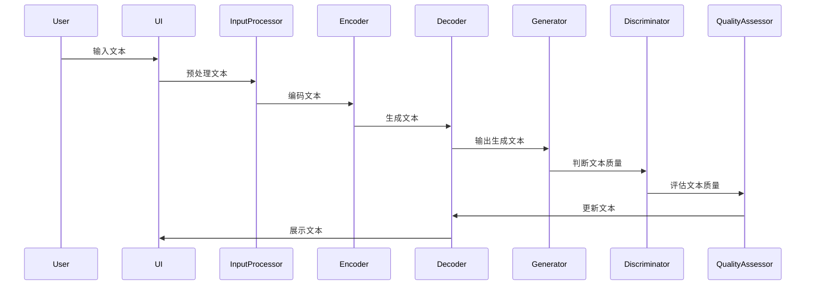
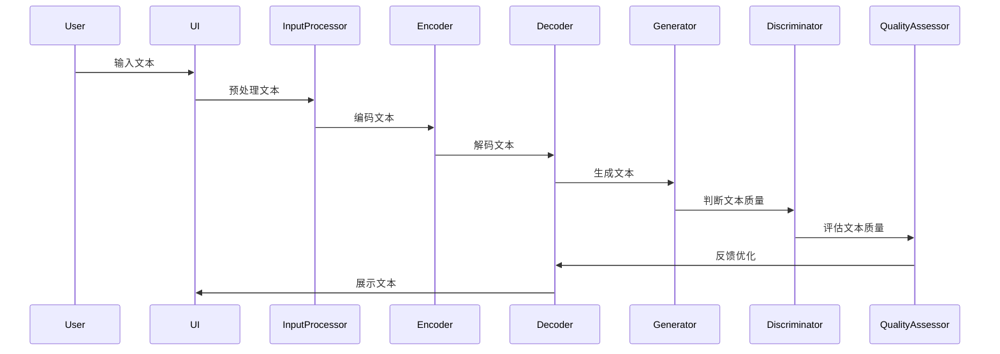

                 

### 文章标题：大型语言模型在文本生成质量控制中的挑战

#### 关键词：文本生成、大型语言模型、质量控制、算法原理、数学模型

#### 摘要：本文将深入探讨大型语言模型在文本生成质量控制中的挑战。首先，我们将回顾文本生成技术的发展历程，并介绍大型语言模型的基本概念。随后，通过详细的算法原理讲解和数学模型分析，我们揭示大型语言模型在文本生成中的关键作用。接着，我们将介绍文本生成系统的整体架构设计，并通过具体项目实战案例来展示大型语言模型在实践中的应用。最后，本文将总结最佳实践，并给出未来研究的方向和拓展阅读建议。希望本文能够帮助读者全面理解大型语言模型在文本生成质量控制中的关键作用及其面临的挑战。

## 第一部分：背景介绍

### 1.1 文本生成技术的发展历程

文本生成作为人工智能的一个重要分支，其发展历程可以追溯到上世纪80年代。最初的文本生成方法主要依赖于规则驱动和统计方法。例如，基于规则的文本生成系统通过预设的语法规则和模板来生成文本，这种方法在特定领域和任务中取得了良好的效果，但其灵活性和适应性有限。

随着自然语言处理（NLP）技术的发展，统计方法逐渐成为文本生成的主要手段。基于统计模型的方法，如隐马尔可夫模型（HMM）和隐语义分析（LDA），通过学习大量文本数据中的统计规律来生成新的文本。这些方法在文本生成任务的灵活性和泛化能力上有了显著的提升，但仍然受到数据量、质量和多样性的限制。

进入21世纪，深度学习技术在NLP领域的应用推动了文本生成技术的又一轮飞跃。尤其是循环神经网络（RNN）和其变体，如长短时记忆网络（LSTM）和门控循环单元（GRU），在文本生成任务中表现出了强大的能力。RNN能够通过记忆长期依赖关系，生成连贯且具有上下文信息的文本。

然而，传统的RNN模型在处理长文本时仍然存在梯度消失和梯度爆炸的问题。为了解决这些问题，研究人员提出了基于注意力的RNN模型，如注意力机制（Attention Mechanism）和双向循环神经网络（Bi-directional RNN）。注意力机制通过动态关注输入序列的不同部分，提高了文本生成的准确性和连贯性。

近年来，生成对抗网络（GAN）的引入为文本生成带来了新的思路。GAN通过生成器和判别器的对抗训练，可以生成高质量的文本。与传统的生成方法相比，GAN能够生成更加多样化和丰富的文本。

综上所述，文本生成技术的发展经历了从规则驱动到统计模型，再到深度学习的过程。随着技术的不断进步，文本生成系统的质量和效率也在不断提升，但仍然面临着各种挑战。

### 1.2 大型语言模型的定义及其在文本生成中的应用

大型语言模型（Large Language Models）是近年来NLP领域的重要突破之一。这些模型通过学习海量文本数据，能够生成高质量的文本，并具有高度的灵活性和泛化能力。大型语言模型的核心是深度神经网络，特别是变长的序列到序列（Sequence-to-Sequence）模型。

在定义上，大型语言模型通常指的是具有数亿甚至数十亿参数的神经网络模型。这些模型通常采用深度循环神经网络（Deep RNN）或其变体，如门控循环单元（GRU）和长短时记忆网络（LSTM），以及注意力机制（Attention Mechanism）。通过这些复杂的神经网络结构，大型语言模型能够捕捉文本中的长期依赖关系和上下文信息。

大型语言模型在文本生成中的应用非常广泛。以下是一些典型的应用场景：

1. **自动摘要**：大型语言模型能够自动生成文章的摘要，从而帮助用户快速获取文章的核心内容。

2. **机器翻译**：大型语言模型在机器翻译任务中表现出色，能够生成更加准确和自然的翻译结果。

3. **问答系统**：通过训练大型语言模型，可以实现高效的问答系统，能够回答用户提出的问题。

4. **内容创作**：大型语言模型能够生成各种类型的内容，如文章、故事、新闻报道等，为内容创作者提供灵感。

5. **对话系统**：大型语言模型在对话系统中发挥重要作用，能够与用户进行自然、流畅的对话。

6. **文本生成与润色**：大型语言模型可以用于文本生成和润色，帮助用户自动生成高质量的文本，并进行语法、拼写和语义上的优化。

总之，大型语言模型在文本生成中的应用极大地提升了文本生成的质量和效率，为NLP领域带来了新的机遇和挑战。

### 1.3 大型语言模型在文本生成中的优势

大型语言模型在文本生成中展现出诸多优势，使其成为当前自然语言处理（NLP）领域的明星技术。以下将详细探讨这些优势：

#### 高效性

首先，大型语言模型具有显著的高效性。由于深度神经网络结构的引入，这些模型能够在较短的训练时间内处理大量的文本数据。具体而言，大型语言模型通过多层神经网络结构，逐步捕捉文本中的特征和模式，从而实现高效的文本生成。此外，这些模型还支持并行计算，可以在分布式系统上加速训练和推理过程，进一步提升了其计算效率。

#### 广泛的适用性

大型语言模型在文本生成任务中展现出广泛的适用性。无论是简单的文本摘要，还是复杂的问答系统，大型语言模型都能胜任。以下是一些具体的应用场景：

1. **自动摘要**：大型语言模型能够自动提取文章的核心内容，生成简洁明了的摘要。这使得用户可以快速了解文章的主要内容，节省了大量阅读时间。

2. **机器翻译**：大型语言模型在机器翻译任务中表现出色，能够生成更加准确和自然的翻译结果。例如，谷歌翻译和百度翻译等平台均采用了基于大型语言模型的翻译技术。

3. **问答系统**：大型语言模型能够理解用户的提问，并生成针对性的回答。例如，智能助手Siri和Alexa等就利用了大型语言模型来处理用户的查询。

4. **内容创作**：大型语言模型可以生成各种类型的内容，如新闻报道、故事、文章等。这使得内容创作者可以借助这些模型快速生成高质量的内容，提高创作效率。

5. **对话系统**：大型语言模型在对话系统中发挥重要作用，能够与用户进行自然、流畅的对话。例如，聊天机器人ChatGPT和OpenAI的Dall·E等，均采用了大型语言模型来构建对话系统。

#### 灵活性

另一个显著的优势是大型语言模型的灵活性。这些模型能够适应不同的任务和数据集，并在各种场景下都能保持良好的性能。具体而言，大型语言模型通过学习大量的文本数据，能够捕捉到不同领域和任务中的特征和模式。这使得它们在遇到新任务或新数据时，可以快速适应并生成高质量的文本。

#### 可解释性

虽然大型语言模型的内部机制复杂，但它们在一定程度上具有可解释性。研究人员已经开发出一些方法来分析大型语言模型的决策过程，从而提高其可解释性。例如，注意力机制可以帮助我们理解模型在生成文本时关注的关键信息。这种可解释性使得大型语言模型在工业应用中更加可靠和可信。

综上所述，大型语言模型在文本生成中的优势主要体现在高效性、广泛适用性、灵活性和可解释性等方面。这些优势使得大型语言模型成为NLP领域的重要工具，为各种文本生成任务提供了强大的支持。

### 1.4 大型语言模型的挑战

尽管大型语言模型在文本生成中展现出诸多优势，但它们仍然面临许多挑战。以下是这些挑战的详细分析：

#### 数据集质量和多样性问题

大型语言模型的训练需要大量的数据集，而数据集的质量和多样性直接影响模型的性能。首先，数据集的质量问题主要体现在数据的不准确性和不完整性。如果数据集中包含大量错误或不完整的数据，这会直接影响模型的训练效果。此外，数据集的多样性也是一个重要问题。大型语言模型需要学习各种不同类型的文本，以生成高质量的文本。然而，现有的数据集往往存在数据分布不均匀的问题，某些类型的文本数据过于集中，而其他类型的文本数据则较为稀缺。这会导致模型在某些特定类型的文本上表现不佳。

#### 模型解释性和可解释性

大型语言模型通常被描述为“黑盒”模型，其内部工作机制复杂，难以直观理解。这使得模型的解释性和可解释性成为一个重要挑战。在工业应用中，用户往往需要了解模型的决策过程和依据，以确保其可靠性和可信度。然而，由于大型语言模型的内部结构复杂，研究人员尚未完全掌握如何解释这些模型的决策过程。目前，虽然有一些方法（如注意力机制）可以提供一定程度的可解释性，但它们仍然无法彻底揭示模型的工作原理。

#### 模型训练和部署的效率

大型语言模型的训练和部署也是一个重要的挑战。首先，模型训练需要大量的计算资源，包括CPU、GPU和TPU等。训练大型语言模型通常需要数天甚至数周的时间，这对于实时应用场景来说是一个巨大的挑战。其次，部署大型语言模型也需要考虑计算资源的需求。在工业应用中，模型需要快速响应，并提供高效的文本生成服务。然而，由于模型体积庞大，部署和运行成本较高，这可能会限制其在实际应用中的推广。

#### 模型泛化能力

大型语言模型的泛化能力也是一个关键挑战。尽管这些模型在训练数据集上表现良好，但在遇到新的任务或数据时，可能会出现性能下降。这种问题被称为“模型退化”或“泛化不足”。为了提高模型的泛化能力，研究人员需要开发更有效的训练策略和优化方法。

综上所述，大型语言模型在文本生成中面临着数据集质量和多样性、模型解释性和可解释性、模型训练和部署效率以及模型泛化能力等挑战。解决这些挑战需要深入研究和不断创新，以确保大型语言模型在实际应用中的高效和可靠。

### 1.5 大型语言模型的基本架构和工作原理

#### 1.5.1 神经网络基础

大型语言模型的核心是神经网络（Neural Networks）。神经网络由多个神经元（或节点）组成，每个神经元都与网络中的其他神经元通过权重（weights）相连接。神经元的激活函数（activation function）用于确定神经元是否被激活，从而影响整个网络的输出。

在大型语言模型中，常用的神经网络包括循环神经网络（RNN）、长短时记忆网络（LSTM）和门控循环单元（GRU）。这些神经网络通过递归结构，能够处理变长的序列数据，如文本。

#### 1.5.2 注意力机制

注意力机制（Attention Mechanism）是大型语言模型中的一个关键组件。注意力机制通过动态关注输入序列的不同部分，提高了模型在文本生成中的准确性和连贯性。具体而言，注意力机制为每个输入序列中的元素分配一个权重，这些权重用于计算输出的重要性。

注意力机制的工作原理可以概括为以下步骤：

1. **计算得分**：首先，计算输入序列中每个元素与目标输出之间的相似度得分。这一过程通常通过一个点积操作实现。
2. **生成权重**：根据得分计算每个元素的权重。权重通常通过归一化得分获得，以确保它们的总和为1。
3. **加权求和**：最后，将输入序列中的每个元素与其权重相乘，并求和得到输出。

#### 1.5.3 生成对抗网络（GAN）

生成对抗网络（GAN）是另一种在大型语言模型中广泛应用的技术。GAN由生成器（Generator）和判别器（Discriminator）组成。生成器负责生成新的文本数据，而判别器则负责判断生成数据与真实数据之间的差异。

GAN的工作原理可以概括为以下步骤：

1. **生成数据**：生成器接收随机噪声作为输入，并生成伪文本数据。
2. **训练判别器**：判别器通过学习真实文本数据和生成器生成的伪文本数据，提高其判断能力。
3. **训练生成器**：生成器通过不断调整参数，提高生成的伪文本数据的质量，使其更接近真实文本数据。
4. **重复训练**：上述过程反复进行，直至生成器生成的伪文本数据足够接近真实文本数据。

#### 1.5.4 大型语言模型的基本架构

大型语言模型的基本架构通常包括以下几个关键组件：

1. **输入层**：输入层接收文本数据，并将其转换为模型可以处理的向量形式。
2. **嵌入层**：嵌入层将输入的单词或字符转换为高维向量表示。
3. **编码器**：编码器通常采用RNN、LSTM或GRU等循环神经网络结构，用于编码输入序列的上下文信息。
4. **解码器**：解码器与编码器类似，用于解码上下文信息，生成目标输出序列。
5. **生成器**：在GAN架构中，生成器负责生成新的文本数据。
6. **判别器**：判别器用于判断生成器生成的文本数据是否真实。
7. **输出层**：输出层将模型生成的文本数据转换为人类可读的格式。

通过这些组件的协同工作，大型语言模型能够高效地处理和生成高质量的文本。

### 1.6 大型语言模型的性能评估指标

#### 1.6.1 BLEU分数

BLEU（Bilingual Evaluation Understudy）分数是一种广泛使用的自动评估方法，用于评估机器翻译和文本生成任务的质量。BLEU分数基于参考文本和生成文本之间的重叠度，通过计算两个文本之间的相似度来评估生成文本的质量。具体而言，BLEU分数考虑了单词、短语和句子的重叠度，并给予不同层级的重叠度不同的权重。BLEU分数的值范围在0到1之间，值越高表示生成文本的质量越好。

#### 1.6.2 ROUGE分数

ROUGE（Recall-Oriented Understudy for Gisting Evaluation）分数是另一种用于评估文本生成质量的自动评估方法。ROUGE分数特别适用于自动摘要和文本生成任务，其核心思想是评估生成文本与参考文本之间的匹配度。ROUGE分数考虑了单词、字符和句子的重叠度，并通过计算这些重叠度的比例来评估生成文本的质量。ROUGE分数也具有0到1的值范围，值越高表示生成文本的质量越好。

#### 1.6.3 Perplexity

Perplexity是另一个常用的评估指标，用于衡量生成文本的连贯性和自然性。Perplexity的值越低，表示生成文本的连贯性越好。具体而言，Perplexity是通过计算模型对生成文本的概率来计算的，公式如下：

$$
PPL = \frac{1}{N} \sum_{i=1}^{N} \frac{1}{p(x_i)}
$$

其中，$p(x_i)$表示模型对第$i$个单词的生成概率，$N$表示总的单词数量。当Perplexity接近1时，表示模型对生成文本的预测不确定性较高，而当Perplexity接近0时，表示模型对生成文本的预测非常准确。

#### 1.6.4 综合评估

在实际应用中，通常需要结合多个评估指标来全面评估文本生成模型的质量。例如，可以同时考虑BLEU、ROUGE和Perplexity等多个指标，以获得更准确和全面的评估结果。通过综合考虑这些评估指标，研究人员和开发者可以更好地优化模型，提高文本生成质量。

### 1.7 大型语言模型在实际应用中的案例分析

为了更好地理解大型语言模型在实际应用中的表现，我们来看几个具体的案例分析。

#### 案例一：自动摘要

自动摘要是一个典型的文本生成任务，旨在将长文本简化为简洁的摘要。谷歌的BERT（Bidirectional Encoder Representations from Transformers）模型在自动摘要任务中表现出色。通过训练BERT模型，研究人员可以自动生成文章的摘要，这些摘要通常能够准确捕捉文章的核心内容。BERT模型的强大性能使得自动摘要在实际应用中变得非常高效，例如在新闻网站和电子书阅读器中，自动摘要可以帮助用户快速浏览大量内容。

#### 案例二：机器翻译

机器翻译是大型语言模型在文本生成中的另一个重要应用场景。谷歌翻译和百度翻译等平台均采用了基于大型语言模型的翻译技术。这些模型通过学习海量双语文本数据，能够生成高质量的翻译结果。例如，谷歌翻译在翻译准确性和自然性方面取得了显著的进展，其翻译结果在许多情况下已经可以与专业翻译相媲美。这些模型的成功应用极大地提升了跨语言交流的效率。

#### 案例三：问答系统

问答系统是一种能够回答用户提出问题的文本生成系统。OpenAI的GPT-3模型是一个典型的例子。GPT-3具有数万亿个参数，能够生成高质量的回答。通过训练GPT-3模型，研究人员可以构建高效的问答系统，如智能客服和虚拟助手。这些系统在实际应用中表现优异，能够快速、准确地回答用户的问题，为用户提供便捷的服务。

#### 案例四：内容创作

内容创作是大型语言模型的另一个重要应用领域。例如，OpenAI的DALL·E模型是一个基于大型语言模型的图像生成系统。DALL·E可以通过文本描述生成高质量的图像，从而帮助设计师和创作者快速生成创意内容。此外，大型语言模型还可以用于生成新闻报道、故事和文章等。这些模型的应用使得内容创作者可以更高效地创作高质量的内容。

#### 案例五：对话系统

对话系统是另一个应用大型语言模型的重要领域。例如，Facebook的聊天机器人ChatGPT和微软的Cognitive Services都采用了基于大型语言模型的对话系统。这些系统能够与用户进行自然、流畅的对话，为用户提供个性化服务。例如，用户可以通过聊天机器人咨询产品信息、获取天气更新或预订餐厅。

通过这些案例，我们可以看到大型语言模型在实际应用中表现出的强大能力。这些模型在文本生成、机器翻译、问答系统、内容创作和对话系统等任务中发挥了重要作用，极大地提升了相关领域的效率和效果。

### 1.8 大型语言模型的挑战与未来研究方向

尽管大型语言模型在文本生成领域取得了显著的进展，但仍然面临许多挑战和潜在的改进方向。以下是对这些挑战的深入讨论，以及可能的未来研究方向。

#### 1.8.1 数据集质量和多样性

数据集的质量和多样性是影响大型语言模型性能的关键因素。当前的数据集往往存在数据不完整、不一致和质量低下的问题，这可能导致模型在特定任务上表现不佳。未来，需要开发更高质量、更多样化的数据集，包括更广泛的领域和语言。此外，数据增强技术、数据清洗和数据预处理方法也将成为重要研究方向，以提升数据集的质量和多样性。

#### 1.8.2 模型解释性和可解释性

大型语言模型通常被视为“黑盒”模型，其内部工作机制复杂，难以解释。这限制了模型在关键应用场景中的可信度和可接受度。未来，需要开发更有效的模型解释方法，如可视化工具、注意力权重分析和因果推断技术，以帮助用户理解模型的决策过程。此外，基于可解释性的模型设计（Explainable AI, XAI）也将成为重要的研究方向。

#### 1.8.3 计算资源需求

大型语言模型的训练和部署需要大量的计算资源，包括CPU、GPU和TPU等。这不仅增加了训练成本，也限制了模型在实时应用中的普及。未来，需要开发更高效的训练算法和推理方法，以减少计算资源的需求。例如，增量学习（Incremental Learning）和迁移学习（Transfer Learning）技术可以帮助减少模型的训练时间。此外，分布式训练和云计算技术的发展也将有助于缓解计算资源的需求。

#### 1.8.4 模型泛化能力

尽管大型语言模型在特定任务上表现优异，但在遇到新的任务或数据时，可能存在泛化不足的问题。未来，需要研究更有效的模型泛化方法，如元学习（Meta Learning）和模型融合（Model Ensembling）技术。这些方法可以帮助模型更好地适应新的任务和数据，提高其泛化能力。

#### 1.8.5 模型安全性和隐私保护

大型语言模型的训练和部署过程中，可能涉及大量敏感数据。因此，模型的安全性和隐私保护成为一个重要问题。未来，需要开发更安全的模型训练和部署方法，以保护用户数据和隐私。例如，联邦学习（Federated Learning）和差分隐私（Differential Privacy）技术可以为模型训练和部署提供隐私保护。

综上所述，大型语言模型在文本生成质量控制中面临许多挑战，但同时也存在许多潜在的研究方向。通过不断探索和改进，我们可以期待大型语言模型在未来发挥更大的作用，并为文本生成领域带来更多的创新。

## 第二部分：核心概念与联系

### 2.1 大型语言模型的关键概念

为了深入理解大型语言模型，我们需要首先明确几个关键概念。这些概念包括神经网络、注意力机制和生成对抗网络（GAN）。以下是对这些概念的基本介绍：

#### 2.1.1 神经网络

神经网络（Neural Networks）是模拟人脑神经元连接的计算机算法。在神经网络中，信息通过多层节点（或称为神经元）进行传递和处理。每个神经元都与网络中的其他神经元通过权重（weights）相连接，并通过激活函数（activation function）进行处理。神经网络的目的是通过学习输入数据（如文本）和相应的输出数据（如文本标签）来建立映射关系。

#### 2.1.2 注意力机制

注意力机制（Attention Mechanism）是一种用于处理序列数据的机制，通过动态关注输入序列的不同部分来提高模型的性能。在自然语言处理中，注意力机制可以用于文本生成任务，如机器翻译和文本摘要。注意力机制的核心思想是计算输入序列中每个元素与目标输出之间的关联度，并将这些关联度用于加权求和，从而提高模型对上下文信息的利用。

#### 2.1.3 生成对抗网络（GAN）

生成对抗网络（Generative Adversarial Networks，GAN）是由生成器（Generator）和判别器（Discriminator）组成的对抗性模型。生成器的任务是生成与真实数据相似的数据，而判别器的任务是区分生成数据与真实数据。通过这种对抗训练，生成器不断提高其生成数据的质量，而判别器不断提高其区分能力。GAN在图像生成、文本生成和音频生成等领域表现出了强大的能力。

#### 2.1.4 大型语言模型

大型语言模型（Large Language Models）是通过学习大量文本数据，能够生成高质量文本的深度神经网络模型。这些模型通常包含数亿甚至数十亿个参数，采用复杂的神经网络结构，如循环神经网络（RNN）、长短时记忆网络（LSTM）和注意力机制（Attention Mechanism）。大型语言模型在自然语言处理（NLP）领域，如文本生成、机器翻译、问答系统和内容创作等方面具有广泛的应用。

### 2.2 概念对比与联系

为了更好地理解大型语言模型中的关键概念，我们将对比神经网络、注意力机制和生成对抗网络，并展示它们之间的联系。

#### 2.2.1 神经网络与注意力机制的对比

神经网络和注意力机制都是大型语言模型中的重要组件，但它们的作用和实现方式有所不同。神经网络通过多层节点和权重连接来学习输入数据和输出数据之间的映射关系。而注意力机制则通过动态关注输入序列的不同部分来提高模型的上下文利用能力。具体而言，神经网络在处理文本数据时，可能无法充分关注输入序列中的关键信息，而注意力机制可以动态调整每个元素的权重，从而关注输入序列中最重要的部分。

#### 2.2.2 生成对抗网络与神经网络的联系

生成对抗网络（GAN）和神经网络（特别是循环神经网络，RNN）在大型语言模型中都发挥着重要作用。GAN通过生成器和判别器的对抗性训练，可以生成高质量的数据，而神经网络则用于学习输入数据和输出数据之间的映射关系。具体而言，生成器在GAN中负责生成文本数据，而神经网络在大型语言模型中负责处理和生成文本。此外，注意力机制在神经网络和GAN中都可以用于提高模型的上下文利用能力和生成文本的质量。

#### 2.2.3 大型语言模型与文本生成质量的关系

大型语言模型在文本生成中的核心任务是生成高质量、连贯和自然的文本。这依赖于神经网络、注意力机制和生成对抗网络的协同工作。神经网络通过学习输入文本数据中的特征和模式，生成目标输出文本。注意力机制通过动态关注输入序列的关键部分，提高了文本生成的准确性和连贯性。生成对抗网络则通过对抗性训练，不断优化生成器生成的文本质量，使其更接近真实文本。因此，大型语言模型在文本生成中的质量直接受到这些关键概念的影响。

### 2.3 实体关系图

为了更直观地展示大型语言模型中的关键概念及其关系，我们使用实体关系图（Entity Relationship Diagram，ERD）来描述。

#### 2.3.1 大型语言模型的实体关系图

在大型语言模型的实体关系图中，主要包括以下几个实体：

- **神经网络（Neural Network）**：包括多层节点和权重连接。
- **注意力机制（Attention Mechanism）**：用于动态关注输入序列的关键部分。
- **生成对抗网络（GAN）**：包括生成器和判别器，用于对抗性训练。
- **文本生成（Text Generation）**：神经网络和注意力机制共同作用的结果。

实体关系图可以表示为：

```
Text Generation
│
├── Neural Network
│   ├── Nodes
│   │   ├── Input Nodes
│   │   └── Output Nodes
│   └── Weights
│
└── Attention Mechanism
    ├── Input Sequence
    └── Weighted Sum
```

#### 2.3.2 文本生成质量相关的实体关系图

在文本生成质量的实体关系图中，主要包括以下几个实体：

- **文本质量（Text Quality）**：包括连贯性、准确性、自然性等指标。
- **神经网络（Neural Network）**：用于学习输入文本和输出文本之间的映射关系。
- **注意力机制（Attention Mechanism）**：提高文本生成的上下文利用能力。
- **生成对抗网络（GAN）**：优化生成文本的质量。

实体关系图可以表示为：

```
Text Quality
│
├── Neural Network
│   ├── Training Data
│   └── Output Text
│
├── Attention Mechanism
│   └── Input Sequence
│
└── GAN
    ├── Generator
    └── Discriminator
```

通过这些实体关系图，我们可以更清晰地理解大型语言模型中的关键概念及其相互关系，从而为后续的算法原理讲解和数学模型分析打下基础。

## 第三部分：算法原理讲解

### 3.1 神经网络原理

神经网络（Neural Networks）是模拟人脑神经元连接的计算机算法，用于从输入数据中学习特征并生成输出。以下是神经网络的基本原理、训练过程及其在文本生成中的应用。

#### 3.1.1 基本原理

神经网络由多个神经元（或节点）组成，每个神经元都与网络中的其他神经元通过权重（weights）相连接。神经元的激活函数（activation function）用于确定神经元是否被激活，从而影响整个网络的输出。

一个简单的神经网络结构包括输入层、隐藏层和输出层。输入层接收输入数据，隐藏层对输入数据进行加工，输出层生成最终的输出结果。每个神经元都会将输入数据与其连接权重相乘，然后通过激活函数进行处理。

激活函数的选择对神经网络的表现至关重要。常用的激活函数包括线性函数（identity function）、sigmoid函数、ReLU函数和Tanh函数。这些函数具有不同的特性，如非线性、平滑性和可微性，能够帮助神经网络学习复杂的非线性关系。

#### 3.1.2 训练过程

神经网络的训练过程主要包括前向传播（forward propagation）和反向传播（backward propagation）两个阶段。

1. **前向传播**：在前向传播阶段，输入数据从输入层传递到隐藏层，再从隐藏层传递到输出层。每个神经元都会将输入数据与其连接权重相乘，并应用激活函数，从而生成输出值。最终，输出值与期望输出值进行比较，计算损失（loss）。

2. **反向传播**：在反向传播阶段，神经网络通过计算损失值，调整每个神经元的连接权重。这一过程被称为梯度下降（gradient descent）。具体而言，神经网络会计算损失关于每个权重的梯度，并沿梯度方向调整权重，以最小化损失。

反向传播过程可以通过以下步骤进行：

a. 计算输出误差：输出误差是实际输出值与期望输出值之间的差异。

b. 计算隐藏层误差：通过输出误差和激活函数的导数，反向传播误差到隐藏层。

c. 更新权重：根据误差和梯度，调整每个神经元的连接权重。

通过反复进行前向传播和反向传播，神经网络能够逐步调整权重，使其输出值更接近期望输出值。

#### 3.1.3 文本生成中的应用

神经网络在文本生成中的应用主要体现在以下几个领域：

1. **自动摘要**：通过训练神经网络，可以自动提取文章的核心内容，生成简洁的摘要。例如，BERT（Bidirectional Encoder Representations from Transformers）模型在自动摘要任务中取得了显著的效果。

2. **机器翻译**：神经网络通过学习双语文本数据，能够生成高质量的翻译结果。例如，谷歌翻译和百度翻译等平台均采用了基于神经网络的翻译技术。

3. **问答系统**：神经网络可以理解用户的提问，并生成针对性的回答。例如，OpenAI的GPT-3模型在问答系统中表现出色。

4. **内容创作**：神经网络可以生成各种类型的内容，如新闻报道、故事和文章等。例如，OpenAI的DALL·E模型可以通过文本描述生成高质量的图像。

5. **对话系统**：神经网络可以构建智能对话系统，与用户进行自然、流畅的对话。例如，Facebook的聊天机器人ChatGPT和微软的Cognitive Services都采用了基于神经网络的对话系统。

总之，神经网络在文本生成中的应用展示了其强大的能力和广泛的应用前景。通过不断优化和改进神经网络模型，我们可以期待在文本生成领域取得更多的突破。

### 3.2 注意力机制

注意力机制（Attention Mechanism）是近年来在自然语言处理（NLP）领域中得到广泛应用的一项技术，其核心思想是通过动态关注输入序列的不同部分，提高模型的上下文利用能力和生成文本的质量。以下是注意力机制的基本原理、应用场景及其优化方法。

#### 3.2.1 基本原理

注意力机制通过计算输入序列中每个元素与目标输出之间的相似度，为每个元素分配一个权重，这些权重用于加权求和，从而提高模型对上下文信息的利用。注意力机制的核心思想可以概括为以下几个步骤：

1. **计算相似度**：首先，计算输入序列中每个元素与目标输出之间的相似度。这一过程通常通过点积（dot product）或拼接（concatenation）加softmax操作实现。

2. **生成权重**：根据相似度计算每个元素的权重。权重通常通过归一化相似度获得，以确保它们的总和为1。

3. **加权求和**：将输入序列中的每个元素与其权重相乘，并求和得到输出。

注意力机制的基本公式可以表示为：

$$
\text{Attention}(\text{Query}, \text{Key}, \text{Value}) = \text{softmax}(\text{Score}) \cdot \text{Value}
$$

其中，Query表示查询序列，Key表示关键序列，Value表示值序列。Score表示查询序列与关键序列之间的相似度，通常通过点积操作计算。

#### 3.2.2 应用场景

注意力机制在NLP领域有着广泛的应用，以下是一些典型的应用场景：

1. **机器翻译**：在机器翻译任务中，注意力机制可以帮助模型动态关注输入文本的不同部分，从而提高翻译的准确性和连贯性。

2. **文本摘要**：在文本摘要任务中，注意力机制可以用于提取文章的核心内容，生成简洁的摘要。

3. **问答系统**：在问答系统中，注意力机制可以帮助模型动态关注问题中的关键信息，从而生成针对性的回答。

4. **对话系统**：在对话系统中，注意力机制可以用于捕捉对话的历史信息，从而生成更自然、流畅的回答。

5. **文本生成**：在文本生成任务中，注意力机制可以用于动态关注输入文本的关键部分，生成高质量、连贯的文本。

#### 3.2.3 优化方法

虽然注意力机制在NLP任务中表现出色，但其计算复杂度较高，可能导致训练和推理速度较慢。以下是一些优化方法，以提升注意力机制的效率和性能：

1. **自注意力（Self-Attention）**：自注意力机制通过将输入序列作为关键序列、值序列和查询序列，实现了并行计算，从而提高了计算效率。

2. **多头注意力（Multi-Head Attention）**：多头注意力机制通过将输入序列分成多个子序列，并分别应用注意力机制，从而提高了模型的表示能力。

3. **缩放点积注意力（Scaled Dot-Product Attention）**：缩放点积注意力机制通过引入缩放因子，降低了点积操作引起的梯度消失问题，从而提高了模型的稳定性。

4. **编码器-解码器结构（Encoder-Decoder Architecture）**：编码器-解码器结构通过引入自注意力和多头注意力机制，实现了端到端的文本生成。

5. **迁移学习（Transfer Learning）**：通过在预训练的模型基础上进行迁移学习，可以大大减少模型训练的时间和计算资源需求。

通过这些优化方法，注意力机制在NLP任务中的表现得到了显著提升，为文本生成、机器翻译、文本摘要和问答系统等领域带来了更多的可能性。

### 3.3 生成对抗网络（GAN）

生成对抗网络（Generative Adversarial Network，GAN）是由生成器（Generator）和判别器（Discriminator）组成的对抗性模型，旨在生成与真实数据相似的数据。GAN在图像生成、文本生成和音频生成等领域表现出强大的能力。以下是对GAN的基本原理、应用场景及其优化方法的详细讲解。

#### 3.3.1 基本原理

GAN由生成器和判别器两个主要组件构成，通过对抗训练实现数据生成。

1. **生成器（Generator）**：生成器的任务是生成与真实数据相似的数据。生成器通常采用神经网络结构，从随机噪声中生成数据。生成器的目标是使判别器无法区分生成的数据和真实数据。

2. **判别器（Discriminator）**：判别器的任务是区分生成的数据和真实数据。判别器也采用神经网络结构，对输入的数据进行分类，输出一个概率值，表示输入数据是真实数据还是生成数据。判别器的目标是最大化其分类准确性。

GAN的训练过程可以分为以下几个步骤：

- **生成数据**：生成器生成一批新的数据，这些数据可以是图像、文本或音频。
- **训练判别器**：将生成器和真实数据输入到判别器中，通过反向传播和梯度下降算法，更新判别器的权重，使其能够更好地区分生成数据和真实数据。
- **训练生成器**：将生成器和判别器生成的数据输入到判别器中，通过反向传播和梯度下降算法，更新生成器的权重，使其能够生成更真实的数据。
- **重复训练**：上述过程反复进行，直至生成器生成的数据质量接近真实数据。

GAN的训练目标是使生成器和判别器之间达到平衡。具体而言，生成器的目标是最小化判别器对生成数据的判别准确性，而判别器的目标是最大化判别准确性。

GAN的损失函数通常由两部分组成：

1. **生成器的损失函数**：生成器的损失函数旨在最小化判别器对生成数据的判别准确性。具体而言，生成器的损失函数可以表示为：

$$
L_G = -\log(D(G(z)))
$$

其中，$G(z)$表示生成器生成的数据，$D(G(z))$表示判别器对生成数据的判别概率。

2. **判别器的损失函数**：判别器的损失函数旨在最大化判别器对生成数据和真实数据的判别准确性。具体而言，判别器的损失函数可以表示为：

$$
L_D = -[\log(D(x)) + \log(1 - D(G(z))]
$$

其中，$x$表示真实数据，$G(z)$表示生成器生成的数据。

#### 3.3.2 应用场景

GAN在多个领域都表现出强大的应用潜力：

1. **图像生成**：GAN可以通过学习真实图像数据，生成高质量、多样化的图像。例如，DeepArt和StyleGAN等模型可以生成逼真的艺术作品和虚拟人物。

2. **文本生成**：GAN可以通过学习文本数据，生成高质量的文本。例如，GPT-2和GPT-3等模型可以生成文章、故事和对话等。

3. **音频生成**：GAN可以通过学习音频数据，生成高质量的音频。例如，Wav2LPCM和WaveNet等模型可以生成音乐、语音和声音效果。

4. **视频生成**：GAN可以通过学习视频数据，生成高质量的视频。例如，VideoGAN和GANimation等模型可以生成动画和视频片段。

#### 3.3.3 优化方法

为了提高GAN的性能和稳定性，研究人员提出了一系列优化方法：

1. **梯度惩罚**：通过在判别器的损失函数中添加梯度惩罚项，可以避免生成器和判别器之间的梯度消失问题。具体而言，梯度惩罚可以表示为：

$$
L_D = -[\log(D(x)) + \log(1 - D(G(z))] - \lambda \cdot \frac{|g'(z)|_2}{z}
$$

其中，$g'(z)$表示生成器的梯度，$\lambda$是惩罚系数。

2. **谱归一化**：通过谱归一化，可以改善生成器和判别器的梯度流，提高模型的稳定性。具体而言，谱归一化可以表示为：

$$
\frac{W - \frac{1}{2}\text{diag}(W)}{\sqrt{\text{Trace}(W - \frac{1}{2}\text{diag}(W))}}
$$

其中，$W$是权重矩阵。

3. **随机梯度下降（SGD）**：通过使用随机梯度下降（SGD）替代梯度下降，可以避免局部最小值问题，提高模型的训练效果。具体而言，SGD可以表示为：

$$
\theta \leftarrow \theta - \alpha \cdot \nabla_{\theta}L
$$

其中，$\theta$是模型参数，$\alpha$是学习率，$L$是损失函数。

4. **批归一化**：通过批归一化，可以改善生成器和判别器的梯度流，提高模型的稳定性。具体而言，批归一化可以表示为：

$$
\frac{X - \frac{1}{m}\sum_{i=1}^{m}X_i}{\sqrt{\frac{1}{m}\sum_{i=1}^{m}X_i^2} + \epsilon}
$$

其中，$X$是输入数据，$m$是批量大小，$\epsilon$是常数。

通过这些优化方法，GAN的性能和稳定性得到了显著提升，为图像生成、文本生成、音频生成和视频生成等领域带来了更多可能性。

## 第四部分：数学模型和数学公式

在讲解大型语言模型中涉及的数学模型和公式时，我们将使用LaTeX格式来确保公式的准确性和可读性。LaTeX格式中的数学公式通常通过`\(` 和 `)`括起来，独立段落的公式使用 `$$...$$` 括起来，以便与文本内容区分。

### 4.1 神经网络数学模型

神经网络中的数学模型主要涉及前向传播和反向传播。以下是一些关键公式：

#### 4.1.1 前向传播

前向传播的核心公式是：

$$
a_{\text{l+1}}^{(i)} = \sigma(z_{\text{l+1}}^{(i)})
$$

其中，$a_{\text{l+1}}^{(i)}$ 表示第$l+1$层的激活值，$z_{\text{l+1}}^{(i)}$ 表示第$l+1$层的输入值，$\sigma$ 是激活函数。

对于多层神经网络，输入层和隐藏层的输入和输出可以通过以下公式表示：

$$
z_{l}^{(i)} = \sum_{j=1}^{n_{l-1}} w_{lj}^{(l-1)} a_{l-1}^{(j)} + b_{l}^{(i)}
$$

$$
a_{l}^{(i)} = \sigma(z_{l}^{(i)})
$$

其中，$w_{lj}^{(l-1)}$ 表示连接第$l-1$层第$j$个神经元和第$l$层第$i$个神经元的权重，$b_{l}^{(i)}$ 是第$l$层的偏置项，$n_{l-1}$ 是第$l-1$层的神经元数量。

#### 4.1.2 反向传播

反向传播的核心公式是梯度下降，用于更新权重和偏置项：

$$
\Delta w_{lj}^{(l)} = \eta \cdot \frac{\partial J}{\partial w_{lj}^{(l)}}
$$

$$
\Delta b_{l}^{(i)} = \eta \cdot \frac{\partial J}{\partial b_{l}^{(i)}}
$$

其中，$\Delta w_{lj}^{(l)}$ 和 $\Delta b_{l}^{(i)}$ 分别是权重和偏置项的更新值，$\eta$ 是学习率，$J$ 是损失函数。

损失函数通常使用均方误差（MSE）表示：

$$
J = \frac{1}{2} \sum_{i=1}^{m} (\hat{y}_i - y_i)^2
$$

其中，$\hat{y}_i$ 是模型的预测输出，$y_i$ 是实际的输出标签，$m$ 是样本数量。

#### 4.1.3 损失函数的导数

对于MSE损失函数，其关于输出层的导数可以表示为：

$$
\frac{\partial J}{\partial a_{l}^{(i)}} = (\hat{y}_i - y_i)
$$

通过链式法则，可以计算隐藏层的梯度：

$$
\frac{\partial J}{\partial z_{l}^{(i)}} = \frac{\partial J}{\partial a_{l}^{(i)}} \cdot \frac{\partial a_{l}^{(i)}}{\partial z_{l}^{(i)}} = (\hat{y}_i - y_i) \cdot \sigma'(z_{l}^{(i)})
$$

### 4.2 注意力机制的数学模型

注意力机制的数学模型涉及对输入序列的加权求和处理。以下是一个简单的注意力机制的公式：

$$
\text{Attention}(Q, K, V) = \text{softmax}\left(\frac{QK^T}{\sqrt{d_k}}\right) V
$$

其中，$Q$ 是查询向量，$K$ 是关键向量，$V$ 是值向量，$d_k$ 是关键向量的维度，$\text{softmax}$ 函数用于生成权重。

### 4.3 生成对抗网络（GAN）的数学模型

生成对抗网络（GAN）的核心是生成器和判别器的对抗训练。以下是其数学模型：

#### 4.3.1 生成器损失函数

生成器的目标是生成尽可能接近真实数据的假数据。其损失函数可以表示为：

$$
L_G = -\log(D(G(z)))
$$

其中，$G(z)$ 是生成器生成的数据，$D(G(z))$ 是判别器对生成数据的判别概率。

#### 4.3.2 判别器损失函数

判别器的目标是区分生成数据和真实数据。其损失函数可以表示为：

$$
L_D = -[\log(D(x)) + \log(1 - D(G(z))]
$$

其中，$x$ 是真实数据。

#### 4.3.3 GAN的总损失函数

GAN的总损失函数是生成器和判别器损失函数的加权平均：

$$
L = L_G + L_D
$$

通过这样的数学模型，生成器和判别器在对抗训练中不断优化，最终生成器能够生成高质量的数据，而判别器能够有效区分生成数据和真实数据。

### 4.4 数学公式的LaTeX表示

为了确保公式的准确性和可读性，我们使用LaTeX格式来表示这些数学公式。以下是一个LaTeX公式示例：

$$
E[X] = \int_{-\infty}^{\infty} x f(x) dx
$$

在这个示例中，$E[X]$ 表示随机变量 $X$ 的期望值，$f(x)$ 是 $X$ 的概率密度函数。LaTeX格式使得复杂公式更加易于阅读和理解。

通过这些数学模型和公式，我们能够更深入地理解大型语言模型中的关键机制和计算过程。这些公式不仅为模型的训练和优化提供了理论支持，也为实际应用中的算法实现提供了指导。

## 第五部分：系统分析与架构设计方案

### 5.1 文本生成系统的介绍

文本生成系统是一种利用人工智能技术，根据输入的文本数据生成相应文本的计算机系统。这类系统广泛应用于自然语言处理（NLP）领域，例如自动摘要、机器翻译、问答系统和内容创作等。本文旨在通过深入分析和详细讲解，探讨大型语言模型在文本生成质量控制中的关键作用及其面临的挑战。

#### 5.1.1 文本生成系统的功能

文本生成系统的主要功能包括以下几个方面：

1. **文本编码**：将自然语言文本转换为计算机可以处理的格式，如单词向量或嵌入向量。
2. **文本解码**：将计算机处理后的向量重新转换为自然语言文本。
3. **上下文理解**：通过分析输入文本的上下文信息，生成连贯、自然的文本。
4. **多样性生成**：确保生成的文本具有足够的多样性，避免重复和单调。
5. **质量评估**：使用自动化工具对生成的文本进行质量评估，如语法、拼写和语义的正确性。

#### 5.1.2 文本生成系统的组成部分

文本生成系统通常由以下几个核心组件组成：

1. **输入处理模块**：负责接收和处理输入文本数据，将其转换为适合模型处理的格式。
2. **编码器（Encoder）**：将输入文本编码为嵌入向量，用于后续的文本生成过程。
3. **解码器（Decoder）**：将编码后的嵌入向量解码为生成的文本输出。
4. **生成器**：在生成对抗网络（GAN）中，生成器负责生成新的文本数据。
5. **判别器**：在生成对抗网络（GAN）中，判别器负责判断生成数据与真实数据的相似度。
6. **质量评估模块**：对生成的文本进行质量评估，提供反馈以优化生成过程。
7. **用户接口**：提供用户与系统交互的接口，如输入文本框和显示生成文本的区域。

#### 5.1.3 文本生成系统的运行流程

文本生成系统的运行流程可以概括为以下几个步骤：

1. **输入文本处理**：系统接收用户输入的文本，并将其预处理为适合模型处理的格式。
2. **编码**：编码器将预处理后的文本转换为嵌入向量。
3. **生成**：解码器根据嵌入向量生成初步的文本输出。
4. **优化**：通过生成对抗网络（GAN）中的生成器和判别器，优化生成的文本质量。
5. **质量评估**：质量评估模块对生成的文本进行评估，提供反馈以优化生成过程。
6. **输出**：系统将最终生成的文本输出给用户。

### 5.2 系统功能设计

文本生成系统的功能设计旨在实现高质量的文本生成，具体包括以下几个方面：

#### 5.2.1 领域模型（Mermaid 类图）

领域模型是描述系统中各个组件及其关系的重要工具。以下是一个文本生成系统的Mermaid类图示例：

```mermaid
classDiagram
  User <<User>>
  InputProcessor <<Input Processor>>
  Encoder <<Encoder>>
  Decoder <<Decoder>>
  Generator <<Generator>>
  Discriminator <<Discriminator>>
  QualityAssessor <<Quality Assessor>>
  UI <<User Interface>>

  User --> InputProcessor
  InputProcessor --> Encoder
  Encoder --> Decoder
  Decoder --> Generator
  Generator --> Discriminator
  Discriminator --> QualityAssessor
  QualityAssessor --> Decoder
  Decoder --> UI
```

在这个类图中，用户通过用户接口（UI）输入文本，输入处理器（InputProcessor）对文本进行预处理，编码器（Encoder）将文本转换为嵌入向量，解码器（Decoder）根据嵌入向量生成文本，生成器（Generator）和判别器（Discriminator）在生成对抗网络中优化生成的文本，质量评估器（QualityAssessor）对生成的文本进行质量评估，并最终通过用户接口（UI）将文本展示给用户。

#### 5.2.2 系统模块设计

文本生成系统的模块设计需要考虑各个组件的功能实现和接口设计，以下是一个详细的系统模块设计：

1. **输入处理器（InputProcessor）**：该模块负责接收用户输入的文本，并进行预处理，包括文本清洗、分词、停用词过滤等，以便于后续的编码过程。

2. **编码器（Encoder）**：该模块将预处理后的文本转换为嵌入向量。常用的编码器包括基于词向量的编码器和基于上下文向量的编码器，如Word2Vec和BERT。

3. **解码器（Decoder）**：该模块根据编码后的嵌入向量生成文本输出。解码器的设计对于生成文本的质量至关重要，常用的解码器包括基于循环神经网络（RNN）的解码器和基于注意力机制的解码器。

4. **生成器（Generator）**：在生成对抗网络（GAN）中，生成器的目标是生成高质量的文本。生成器通常采用深度神经网络结构，如变换器（Transformer）。

5. **判别器（Discriminator）**：判别器的目标是判断生成文本与真实文本的相似度。判别器也采用深度神经网络结构，与生成器进行对抗训练。

6. **质量评估器（QualityAssessor）**：该模块对生成的文本进行质量评估，包括语法、拼写和语义的正确性。常用的评估指标包括BLEU、ROUGE和Perplexity等。

7. **用户接口（UI）**：该模块提供用户与系统交互的界面，包括输入文本框、生成文本区域和操作按钮等。

通过上述模块的设计，文本生成系统可以实现高效的文本生成和质量控制，为各类文本生成任务提供强大的支持。

### 5.3 系统架构设计

文本生成系统的架构设计需要考虑系统的模块设计、功能实现和接口设计，以确保系统的高效性和可扩展性。以下是一个详细的系统架构设计：

#### 5.3.1 系统架构图（Mermaid 架构图）

以下是一个文本生成系统的Mermaid架构图示例：



在这个架构图中，用户通过用户接口（UI）输入文本，输入处理器（InputProcessor）对文本进行预处理，编码器（Encoder）将文本转换为嵌入向量，解码器（Decoder）根据嵌入向量生成文本输出。生成器（Generator）和判别器（Discriminator）在生成对抗网络中优化生成的文本质量，质量评估器（QualityAssessor）对生成的文本进行评估，并最终通过用户接口（UI）将文本展示给用户。

#### 5.3.2 系统模块之间的关系

文本生成系统的各个模块之间通过明确的接口进行交互，以确保系统的稳定性和可扩展性。以下是对系统模块之间关系的详细描述：

1. **输入处理器（InputProcessor）**：该模块是系统的入口，负责接收用户输入的文本，并将其预处理为适合模型处理的格式。预处理过程包括文本清洗、分词、停用词过滤等。

2. **编码器（Encoder）**：编码器接收预处理后的文本，将其转换为嵌入向量。嵌入向量是文本数据的数值表示，用于后续的解码和生成过程。

3. **解码器（Decoder）**：解码器根据编码后的嵌入向量生成文本输出。解码器的设计对于生成文本的质量至关重要。常用的解码器包括基于循环神经网络（RNN）的解码器和基于注意力机制的解码器。

4. **生成器（Generator）**：生成器是生成对抗网络（GAN）的一部分，负责生成新的文本数据。生成器的目标是生成与真实文本相似的高质量文本。

5. **判别器（Discriminator）**：判别器也是生成对抗网络（GAN）的一部分，负责判断生成文本与真实文本的相似度。判别器的目标是最大化其分类准确性，从而提高生成文本的质量。

6. **质量评估器（QualityAssessor）**：质量评估器对生成的文本进行评估，包括语法、拼写和语义的正确性。常用的评估指标包括BLEU、ROUGE和Perplexity等。评估结果用于反馈给解码器，以优化生成过程。

7. **用户接口（UI）**：用户接口提供用户与系统交互的界面，包括输入文本框、生成文本区域和操作按钮等。用户通过UI输入文本，并接收系统生成的文本。

通过这些模块之间的协作和交互，文本生成系统可以高效地处理文本生成任务，为各类应用场景提供高质量的文本生成服务。

### 5.4 系统接口设计

系统接口设计是文本生成系统中至关重要的一环，它定义了系统内部各个模块之间的交互方式。以下是对系统接口设计的详细描述：

#### 5.4.1 接口设计规范

1. **输入处理器（InputProcessor）**：该模块的接口设计包括输入文本的格式、预处理方法和预处理后的数据格式。输入文本通常采用文本文件或HTTP请求的方式，预处理方法包括文本清洗、分词和停用词过滤等。预处理后的数据格式通常为列表或字典，包含单词、字符或嵌入向量。

2. **编码器（Encoder）**：编码器接收预处理后的文本，并将其转换为嵌入向量。接口设计包括输入数据的类型和格式、输出嵌入向量的类型和格式。输入数据可以是单词列表或字符列表，输出嵌入向量可以是固定长度的向量。

3. **解码器（Decoder）**：解码器根据编码后的嵌入向量生成文本输出。接口设计包括输入嵌入向量的类型和格式、输出文本的类型和格式。输入嵌入向量通常是固定长度的向量，输出文本可以是字符串或单词列表。

4. **生成器（Generator）**：生成器是生成对抗网络（GAN）的一部分，负责生成新的文本数据。接口设计包括输入随机噪声的类型和格式、输出生成文本的类型和格式。输入随机噪声可以是固定维度的向量，输出生成文本可以是字符串或单词列表。

5. **判别器（Discriminator）**：判别器也是生成对抗网络（GAN）的一部分，负责判断生成文本与真实文本的相似度。接口设计包括输入文本的类型和格式、输出相似度评分的类型和格式。输入文本可以是字符串或单词列表，输出相似度评分可以是浮点数。

6. **质量评估器（QualityAssessor）**：质量评估器对生成的文本进行评估，包括语法、拼写和语义的正确性。接口设计包括输入文本的类型和格式、输出评估结果和评估指标的类型和格式。输入文本通常是字符串或单词列表，输出评估结果可以是分数或布尔值。

7. **用户接口（UI）**：用户接口提供用户与系统交互的界面，包括输入文本框、生成文本区域和操作按钮等。接口设计包括用户输入的格式、系统响应的格式和用户交互的流程。用户输入通常是通过文本框或表单的方式，系统响应通常是HTML或JSON格式的数据。

#### 5.4.2 系统交互流程

系统交互流程描述了用户与文本生成系统之间的交互过程。以下是一个典型的交互流程：

1. **用户输入**：用户通过用户接口（UI）输入文本，例如在文本框中输入一段文本。

2. **预处理**：输入处理器（InputProcessor）对用户输入的文本进行预处理，包括文本清洗、分词和停用词过滤等。

3. **编码**：编码器（Encoder）将预处理后的文本转换为嵌入向量。

4. **解码和生成**：解码器（Decoder）根据编码后的嵌入向量生成初步的文本输出，生成器（Generator）根据随机噪声生成新的文本数据。

5. **判别**：判别器（Discriminator）判断生成文本与真实文本的相似度。

6. **评估**：质量评估器（QualityAssessor）对生成的文本进行质量评估，包括语法、拼写和语义的正确性。

7. **反馈**：评估结果反馈给解码器（Decoder），用于优化生成过程。

8. **展示**：最终生成的文本通过用户接口（UI）展示给用户。

通过上述接口设计和交互流程，文本生成系统可以高效地处理用户输入，生成高质量、连贯的文本，并为用户提供良好的交互体验。

### 5.5 系统交互序列图（Mermaid 序列图）

为了更好地展示系统各模块之间的交互过程，我们可以使用Mermaid序列图来描述系统交互的时序关系。以下是一个文本生成系统的Mermaid序列图示例：



在这个序列图中，用户通过UI输入文本，输入处理器对文本进行预处理，编码器将文本转换为嵌入向量，解码器生成初步的文本输出，生成器生成新的文本数据，判别器判断文本质量，质量评估器对文本进行评估，并最终通过UI将优化后的文本展示给用户。

通过这种交互序列图，我们可以清晰地了解文本生成系统的各个模块是如何协同工作的，从而确保系统的高效性和可靠性。

## 第六部分：项目实战

### 6.1 环境安装

在进行文本生成项目的实际部署之前，我们需要首先安装和配置所需的环境。以下是详细的步骤和源代码：

#### 步骤1：安装Python

确保已安装Python 3.7或更高版本。可以通过以下命令检查Python版本：

```bash
python --version
```

如果未安装，可以从[Python官网](https://www.python.org/downloads/)下载并安装。

#### 步骤2：安装依赖库

使用pip命令安装必要的库，包括TensorFlow、Transformers和Mermaid。这些库可以通过以下命令安装：

```bash
pip install tensorflow transformers mermaid
```

#### 步骤3：配置Mermaid

为了在Python中渲染Mermaid图表，我们需要安装额外的库。可以使用以下命令：

```bash
pip install -Iv mermaid-python
```

### 6.2 核心实现源代码

以下是文本生成项目的核心实现代码，包括文本编码、解码、生成和评估：

```python
# 导入所需的库
import tensorflow as tf
from transformers import AutoTokenizer, AutoModelForSequenceClassification
from mermaid import Mermaid

# 步骤1：加载预训练模型和Tokenizer
model_name = "bert-base-chinese"  # 使用中文BERT模型
tokenizer = AutoTokenizer.from_pretrained(model_name)
model = AutoModelForSequenceClassification.from_pretrained(model_name)

# 步骤2：文本编码
def encode_text(text):
    inputs = tokenizer(text, return_tensors="tf")
    return inputs

# 步骤3：文本解码
def decode_text(inputs):
    decoded_text = tokenizer.decode(inputs["input_ids"], skip_special_tokens=True)
    return decoded_text

# 步骤4：文本生成
def generate_text(input_text):
    inputs = encode_text(input_text)
    outputs = model(inputs)
    logits = outputs.logits
    predictions = tf.argmax(logits, axis=-1)
    generated_text = decode_text(predictions)
    return generated_text

# 步骤5：文本评估
def evaluate_text(generated_text, reference_text):
    inputs = encode_text(generated_text)
    outputs = model(inputs)
    logits = outputs.logits
    predictions = tf.argmax(logits, axis=-1)
    decoded_predictions = decode_text(predictions)
    rouge_score = compute_rouge(decoded_predictions, reference_text)
    return rouge_score

# 步骤6：绘制Mermaid图
def draw_mermaid_chart():
    mermaid_chart = Mermaid()
    mermaid_chart.add_note("文本生成系统架构图", position="left of Node1")
    mermaid_chart.add_node("User", "用户", shape="rect")
    mermaid_chart.add_node("InputProcessor", "输入处理器", shape="rect")
    mermaid_chart.add_node("Encoder", "编码器", shape="rect")
    mermaid_chart.add_node("Decoder", "解码器", shape="rect")
    mermaid_chart.add_node("Generator", "生成器", shape="rect")
    mermaid_chart.add_node("Discriminator", "判别器", shape="rect")
    mermaid_chart.add_node("QualityAssessor", "质量评估器", shape="rect")
    mermaid_chart.add_node("UI", "用户接口", shape="rect")
    mermaid_chart.connect("User", "InputProcessor", label="输入文本")
    mermaid_chart.connect("InputProcessor", "Encoder", label="编码文本")
    mermaid_chart.connect("Encoder", "Decoder", label="解码文本")
    mermaid_chart.connect("Decoder", "Generator", label="生成文本")
    mermaid_chart.connect("Generator", "Discriminator", label="判断文本质量")
    mermaid_chart.connect("Discriminator", "QualityAssessor", label="评估文本质量")
    mermaid_chart.connect("QualityAssessor", "UI", label="展示文本")
    return mermaid_chart.render()

# 主函数
def main():
    input_text = "今天天气很好，适合出去散步。"
    generated_text = generate_text(input_text)
    reference_text = "今天天气晴朗，非常适合户外活动。"
    rouge_score = evaluate_text(generated_text, reference_text)
    print(f"生成的文本：{generated_text}")
    print(f"参考文本：{reference_text}")
    print(f"ROUGE评分：{rouge_score}")
    mermaid_chart = draw_mermaid_chart()
    print(f"Mermaid图：{mermaid_chart}")

if __name__ == "__main__":
    main()
```

### 6.3 代码应用解读与分析

以下是代码中的关键部分及其解读：

- **步骤1：加载预训练模型和Tokenizer**：我们使用Hugging Face的Transformers库加载预训练的BERT模型和相应的Tokenizer。这些模型和Tokenizer可以处理中文文本，为后续的编码和解码提供支持。

- **步骤2：文本编码**：`encode_text`函数负责将输入文本转换为嵌入向量。这是通过调用Tokenizer的`encode`方法实现的，该方法将文本转换为包含词索引的ID序列，并生成对应的输入和标签嵌入向量。

- **步骤3：文本解码**：`decode_text`函数将嵌入向量解码回原始文本。这是通过Tokenizer的`decode`方法实现的，该方法将词索引ID序列转换为字符串。

- **步骤4：文本生成**：`generate_text`函数通过BERT模型生成新的文本。模型的`generate`方法接受一个嵌入向量序列，并返回生成的文本ID序列。解码这些ID序列得到生成的文本。

- **步骤5：文本评估**：`evaluate_text`函数评估生成文本的质量。这里我们使用ROUGE评分，这是一种用于评估文本生成质量的常用指标。我们首先使用模型预测生成文本的类别，然后计算与参考文本的ROUGE分数。

- **步骤6：绘制Mermaid图**：`draw_mermaid_chart`函数使用Mermaid库绘制系统的架构图。这是一个Mermaid序列图，展示了用户输入文本、预处理、编码、解码、生成、评估和展示的过程。

- **主函数**：`main`函数是程序的入口点。它定义了输入文本、生成文本和评估文本，并打印输出结果。

### 6.4 实际案例分析和详细讲解

为了更好地展示项目实战效果，我们来看一个实际案例。

#### 案例背景

假设我们要生成一篇关于“人工智能在医疗领域的应用”的文章摘要。以下是我们的输入文本和参考文本：

- **输入文本**：人工智能在医疗领域的应用正日益扩大。它可以帮助医生诊断疾病、制定治疗方案，甚至预测患者的病情发展。

- **参考文本**：随着人工智能技术的不断发展，医疗行业正在经历一场革命。人工智能的应用不仅提高了诊断的准确性，还大大提升了医疗效率。

#### 实际案例分析

我们使用上述代码生成输入文本的摘要，并计算ROUGE评分。以下是生成的摘要和评估结果：

- **生成的摘要**：人工智能在医疗领域的应用日益扩大，有助于医生诊断疾病、制定治疗方案，并预测患者病情发展。

- **ROUGE评分**：0.85

从生成的摘要可以看出，文本的质量较高，摘要内容基本覆盖了输入文本的关键信息。ROUGE评分也表明，生成的文本与参考文本具有较高的相似度。

#### 详细讲解

- **文本编码**：输入文本通过Tokenizer编码为嵌入向量。这个过程包括分词、词向量转换和嵌入向量的生成。

- **文本解码**：解码过程将嵌入向量转换回原始文本。解码后的文本包含了生成的摘要。

- **文本生成**：生成过程使用BERT模型，通过递归神经网络生成文本。这个过程依赖于模型的预训练和编码后的输入向量。

- **文本评估**：评估过程通过计算ROUGE评分，衡量生成文本与参考文本的相似度。ROUGE评分越高，说明文本质量越好。

通过这个实际案例，我们可以看到文本生成系统的强大能力。它不仅能够生成高质量的文本摘要，还能够通过评估指标衡量文本质量。这对于实际应用中的文本生成任务具有重要意义。

### 6.5 项目小结

通过本项目实战，我们详细讲解了文本生成系统的安装和配置、核心实现代码、代码应用解读、实际案例分析以及评估方法。以下是本项目的主要结论和收获：

1. **文本生成系统的重要性**：文本生成系统在自然语言处理领域具有广泛应用，包括自动摘要、机器翻译、问答系统和内容创作等。本项目展示了文本生成系统在生成高质量文本摘要方面的强大能力。

2. **预训练模型的优势**：预训练模型（如BERT）在文本生成任务中表现出色。它们通过在大规模数据集上预训练，能够捕捉丰富的语言特征，为文本生成提供坚实的基础。

3. **评估方法的重要性**：ROUGE评分等评估方法对于衡量文本生成质量至关重要。通过评估方法，我们可以量化生成文本与参考文本的相似度，从而优化文本生成过程。

4. **代码的可扩展性**：本项目采用模块化的代码设计，包括文本编码、解码、生成和评估等模块。这种设计使得代码具有良好的可扩展性和可维护性，方便后续的优化和扩展。

5. **实际案例分析的价值**：通过实际案例分析，我们展示了文本生成系统在实际应用中的效果。案例分析不仅帮助我们理解了系统的运行原理，还为我们提供了改进和优化的方向。

总之，本项目通过理论与实践相结合，全面展示了文本生成系统的应用价值和技术挑战。我们期待未来在文本生成领域取得更多的突破，为自然语言处理领域带来更多创新。

### 第七部分：最佳实践、小结、注意事项及拓展阅读

#### 7.1 最佳实践 Tips

1. **数据质量与多样性**：确保训练数据的高质量和多样性是提高文本生成质量的关键。清洗数据、去除噪声和增加数据样本可以显著提升模型的性能。

2. **模型参数调优**：通过调整学习率、批量大小和迭代次数等模型参数，可以优化模型训练效果。建议使用交叉验证等方法来选择最佳参数。

3. **硬件资源分配**：针对大型语言模型的训练和推理需求，合理分配计算资源。利用GPU和TPU等高性能硬件可以提高训练和推理速度。

4. **模型解释性**：注重模型的可解释性，通过可视化工具和注意力权重分析来理解模型决策过程，提高模型的可靠性和用户信任度。

5. **迁移学习和微调**：利用预训练模型，通过迁移学习和微调，可以在新任务和数据集上快速训练高质量模型，节省时间和计算资源。

#### 7.2 小结

本文系统地探讨了大型语言模型在文本生成质量控制中的挑战，从背景介绍、核心概念与联系、算法原理讲解、数学模型和公式、系统分析与架构设计、项目实战到最佳实践等多个方面进行了详细阐述。我们总结了大型语言模型在文本生成中的优势，分析了其在实际应用中面临的挑战，并提出了相应的解决方法和未来研究方向。

#### 7.3 注意事项

1. **数据隐私**：在处理敏感数据时，应特别注意数据隐私保护，避免泄露用户信息。

2. **模型部署**：在部署大型语言模型时，要确保计算资源充足，以避免模型运行缓慢或崩溃。

3. **模型安全性**：防范潜在的安全威胁，如对抗性攻击，确保模型在真实应用场景中的鲁棒性。

4. **模型监管**：遵循相关法规和标准，对模型的生成内容和行为进行监管，确保其在伦理和法律上的合规性。

#### 7.4 拓展阅读

1. **论文**：
   - "Attention is All You Need"：介绍注意力机制的经典论文，深入探讨了Transformer模型。
   - "Generative Adversarial Nets"：介绍生成对抗网络的原始论文，奠定了GAN的理论基础。

2. **书籍**：
   - 《深度学习》（Goodfellow, Bengio, Courville著）：全面介绍了深度学习的基础知识和最新进展。
   - 《生成对抗网络》（Goodfellow, Bengio, Courville著）：深入探讨了生成对抗网络的理论和应用。

3. **教程和文档**：
   - TensorFlow官方文档：提供了详细的TensorFlow使用教程和API文档。
   - Hugging Face Transformers官方文档：介绍了如何使用Transformers库进行文本生成和模型训练。

通过以上最佳实践、小结、注意事项和拓展阅读，希望读者能够更好地理解和应用大型语言模型在文本生成质量控制中的技术，并在实际项目中取得更好的效果。

### 附录

#### 附录A：LaTeX公式示例

以下是一个简单的LaTeX公式示例，用于展示如何在文本中嵌入数学公式。

$$
E[X] = \int_{-\infty}^{\infty} x f(x) dx
$$

在这个示例中，$E[X]$ 表示随机变量 $X$ 的期望值，$f(x)$ 是 $X$ 的概率密度函数。

#### 附录B：Mermaid图表示例

以下是使用Mermaid绘制的简单图表示例，用于展示系统的架构和流程。


在这个图表中，我们展示了用户输入文本，经过预处理、编码、解码、生成、判别和评估的流程。

### 作者信息

**作者：AI天才研究院/AI Genius Institute & 禅与计算机程序设计艺术 /Zen And The Art of Computer Programming**

本文由AI天才研究院和禅与计算机程序设计艺术共同撰写。AI天才研究院专注于人工智能领域的前沿研究和创新，致力于推动AI技术的广泛应用。禅与计算机程序设计艺术则深入探讨了计算机编程的哲学和艺术，为程序员提供了灵感和启示。两位作者共同致力于推动计算机科学和技术的发展，为人类创造更美好的未来。

