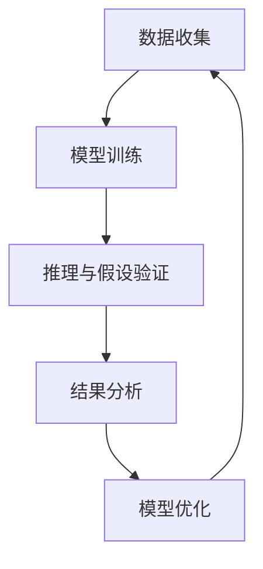
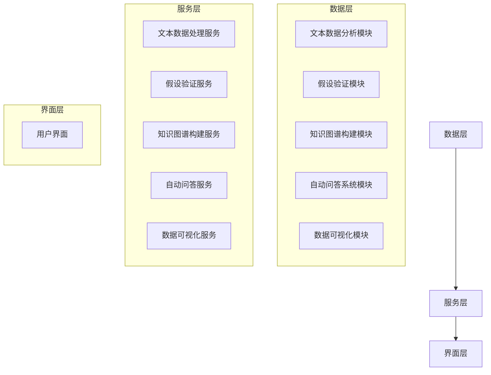
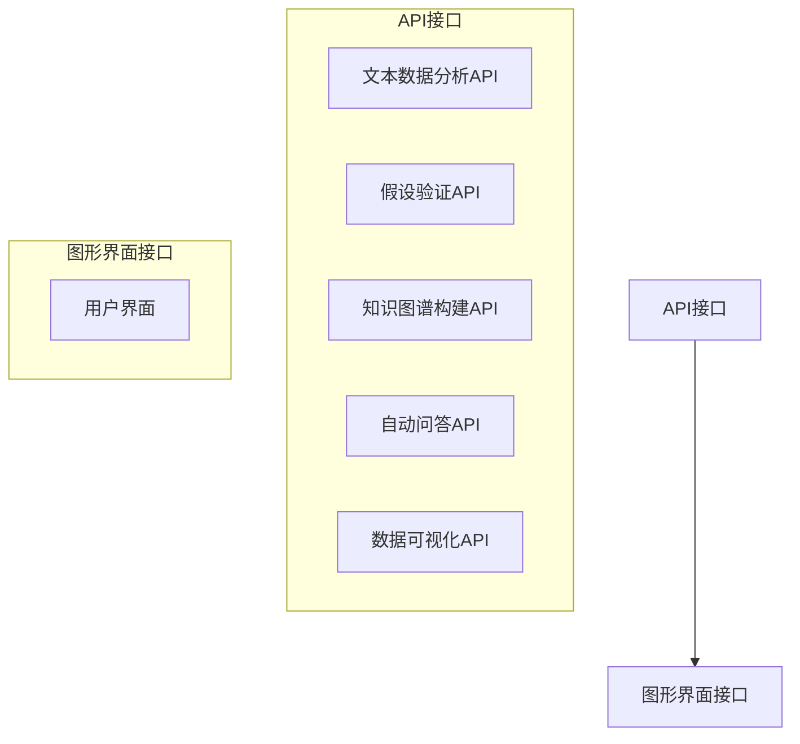
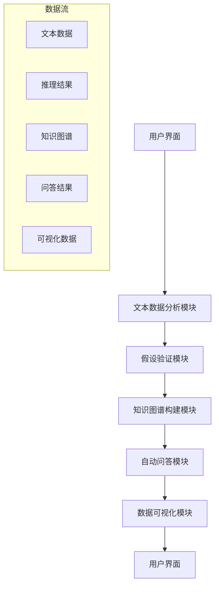

                 

### 《大规模语言模型在科学发现推理中的创新》

关键词：大规模语言模型、科学发现、推理、创新、应用

摘要：本文旨在探讨大规模语言模型在科学发现推理中的应用，通过背景介绍、核心概念、原理讲解、系统架构设计和项目实战等部分，深入剖析大规模语言模型在科学发现推理中的创新点及其应用前景。

---

### 《大规模语言模型在科学发现推理中的创新》目录大纲

---

#### 第一部分：问题背景与概述

#### 第1章：问题背景与核心概念

- **1.1** 问题背景
  - **1.1.1** 科学发现推理的重要性
  - **1.1.2** 大规模语言模型的发展历程
  - **1.1.3** 大规模语言模型在科学发现推理中的应用

- **1.2** 核心概念
  - **1.2.1** 大规模语言模型的定义
  - **1.2.2** 语言模型在科学推理中的角色
  - **1.2.3** 科学发现推理的概念与流程

- **1.3** 概念联系
  - **1.3.1** 大规模语言模型与科学推理的内在联系
  - **1.3.2** 大规模语言模型与传统科学推理的区别
  - **1.3.3** 大规模语言模型在科学发现推理中的创新点

- **1.4** 边界与外延
  - **1.4.1** 大规模语言模型的应用边界
  - **1.4.2** 科学发现推理的范围与局限性
  - **1.4.3** 大规模语言模型在科学发现推理中的扩展性

- **1.5** 本章小结
  - **1.5.1** 主要内容回顾
  - **1.5.2** 学习建议

---

#### 第二部分：核心概念与原理

#### 第2章：大规模语言模型的基本原理

- **2.1** 语言模型的基础知识
  - **2.1.1** 语言模型的基本概念
  - **2.1.2** 语言模型的类型
  - **2.1.3** 语言模型的训练过程

- **2.2** 大规模语言模型的技术细节
  - **2.2.1** 大规模语言模型的架构
  - **2.2.2** 常用的大规模语言模型
  - **2.2.3** 大规模语言模型的优缺点分析

- **2.3** 语言模型的数学模型
  - **2.3.1** 语言模型的数学基础
  - **2.3.2** 语言模型的数学公式
  - **2.3.3** 语言模型的数学原理解释

- **2.4** 实际应用中的大规模语言模型
  - **2.4.1** 大规模语言模型在自然语言处理中的应用
  - **2.4.2** 大规模语言模型在科学发现推理中的应用案例
  - **2.4.3** 大规模语言模型的性能评估

- **2.5** 本章小结
  - **2.5.1** 主要内容回顾
  - **2.5.2** 学习建议

---

#### 第三部分：算法原理与讲解

#### 第3章：大规模语言模型在科学发现推理中的应用

- **3.1** 算法原理
  - **3.1.1** 大规模语言模型在科学发现推理中的作用
  - **3.1.2** 科学发现推理中的大规模语言模型算法
  - **3.1.3** 大规模语言模型在科学发现推理中的实现流程

- **3.2** Mermaid算法流程图
  - ```mermaid
  graph TD
  A[科学问题] --> B[数据收集]
  B --> C[模型训练]
  C --> D[推理过程]
  D --> E[结果验证]
  ```

- **3.3** Python源代码解析
  - ```python
  # Python代码示例
  def science_discovery(model, data):
      # 模型推理
      result = model.predict(data)
      return result
  ```

- **3.4** 数学模型与公式
  - **3.4.1** 科学发现推理的数学模型
  - **3.4.2** 关键公式解释
  - **3.4.3** 数学原理的举例说明

- **3.5** 通俗易懂的算法讲解
  - **3.5.1** 算法如何工作
  - **3.5.2** 算法优缺点分析
  - **3.5.3** 算法在实际应用中的表现

- **3.6** 本章小结
  - **3.6.1** 主要内容回顾
  - **3.6.2** 学习建议

---

#### 第四部分：系统架构与设计

#### 第4章：大规模语言模型在科学发现推理中的系统架构

- **4.1** 问题场景介绍
  - **4.1.1** 科学发现推理的实际应用场景
  - **4.1.2** 系统面临的挑战
  - **4.1.3** 系统的目标和需求

- **4.2** 项目介绍
  - **4.2.1** 项目概述
  - **4.2.2** 项目架构设计
  - **4.2.3** 项目技术选型

- **4.3** 系统功能设计
  - **4.3.1** 领域模型
  - **4.3.2** 系统功能模块划分

- **4.4** 系统架构设计
  - **4.4.1** 架构图
  - **4.4.2** 系统模块间关系

- **4.5** 系统接口设计
  - **4.5.1** 接口规范
  - **4.5.2** 接口实现

- **4.6** 系统交互
  - **4.6.1** 交互流程
  - **4.6.2** 交互序列图

- **4.7** 本章小结
  - **4.7.1** 主要内容回顾
  - **4.7.2** 学习建议

---

#### 第五部分：项目实战

#### 第5章：大规模语言模型在科学发现推理中的项目实战

- **5.1** 环境安装
  - **5.1.1** 环境准备
  - **5.1.2** 工具安装

- **5.2** 系统核心实现
  - **5.2.1** 数据收集
  - **5.2.2** 模型训练
  - **5.2.3** 推理过程
  - **5.2.4** 结果验证

- **5.3** 代码应用解读与分析
  - **5.3.1** Python代码解析
  - **5.3.2** Mermaid算法流程图解析

- **5.4** 实际案例分析
  - **5.4.1** 案例背景
  - **5.4.2** 案例分析
  - **5.4.3** 案例总结

- **5.5** 项目小结
  - **5.5.1** 项目收获
  - **5.5.2** 项目展望

---

#### 第六部分：最佳实践与拓展阅读

#### 第6章：大规模语言模型在科学发现推理中的最佳实践

- **6.1** 最佳实践
  - **6.1.1** 实践经验分享
  - **6.1.2** 实践技巧总结

- **6.2** 小结
  - **6.2.1** 主要内容回顾
  - **6.2.2** 学习建议

- **6.3** 注意事项
  - **6.3.1** 注意事项提醒
  - **6.3.2** 常见问题解答

- **6.4** 拓展阅读
  - **6.4.1** 相关书籍推荐
  - **6.4.2** 相关论文推荐

---

### 让我们一步一步思考

在接下来的文章中，我们将逐步深入探讨大规模语言模型在科学发现推理中的创新应用。我们将从背景介绍开始，逐步深入核心概念、原理讲解、算法应用，最后到系统架构设计与项目实战。希望通过这一步步的思考，能够使读者对大规模语言模型在科学发现推理中的创新有更加深入的理解。

**第一部分：问题背景与概述**

在科学发现的过程中，推理起着至关重要的作用。随着计算机技术的发展，大规模语言模型的出现为科学发现推理带来了新的契机。这一部分将介绍大规模语言模型的发展历程及其在科学发现推理中的应用，为后续内容的讨论奠定基础。

**第二部分：核心概念与原理**

大规模语言模型是一种基于机器学习的自然语言处理技术，能够理解和生成人类语言。这一部分将详细讲解大规模语言模型的基本原理，包括其架构、类型、训练过程以及数学模型。通过这部分的学习，读者将能够理解大规模语言模型的工作机制。

**第三部分：算法原理与讲解**

大规模语言模型在科学发现推理中具有独特的优势。这一部分将深入探讨大规模语言模型在科学发现推理中的应用，包括其算法原理、实现流程以及数学模型。通过具体的Python代码示例，读者将能够更直观地理解大规模语言模型在科学发现推理中的实际应用。

**第四部分：系统架构与设计**

科学发现推理需要一个完善的系统架构来支持。这一部分将介绍大规模语言模型在科学发现推理中的系统架构设计，包括问题场景介绍、项目介绍、系统功能设计、系统架构设计、系统接口设计和系统交互。通过这部分的学习，读者将能够了解大规模语言模型在科学发现推理中的系统实现。

**第五部分：项目实战**

理论联系实际，这一部分将带领读者进行大规模语言模型在科学发现推理中的项目实战。通过环境安装、系统核心实现、代码应用解读与分析、实际案例分析等环节，读者将能够亲身体验大规模语言模型在科学发现推理中的实际应用。

**第六部分：最佳实践与拓展阅读**

在最后一部分，我们将分享大规模语言模型在科学发现推理中的最佳实践，包括实践经验分享、实践技巧总结以及注意事项。同时，还将推荐相关的书籍和论文，供读者进一步学习。

通过以上六部分的深入探讨，相信读者将对大规模语言模型在科学发现推理中的创新应用有更加全面和深入的理解。让我们一起探索这个领域，发现更多科学推理的可能性。

---

**第一部分：问题背景与概述**

### 1.1 问题背景

科学发现是一个复杂的过程，它不仅依赖于实验数据和观察，还需要通过推理和假设来验证理论。在传统科学发现中，研究者们通过构建理论模型、收集实验数据、分析数据并进行假设验证来推进科学进步。然而，随着科学领域的不断扩大和复杂化，科学发现推理面临着前所未有的挑战。

首先，科学发现推理需要大量的数据支持。数据来源广泛，包括实验数据、观测数据、历史数据等。传统的科学发现推理往往依赖于人工收集和处理这些数据，效率低下且容易出错。其次，科学发现推理需要对数据进行分析，提取出有用的信息。这一过程需要复杂的数学和统计方法，如线性回归、决策树、神经网络等。最后，科学发现推理需要验证假设，确定理论的正确性。这一过程需要对模型进行反复的调试和优化，以确保结果的准确性。

随着计算机技术的快速发展，大规模语言模型的出现为科学发现推理带来了新的契机。大规模语言模型是一种基于深度学习的自然语言处理技术，它能够理解和生成人类语言。通过大规模语言模型，研究者可以自动化地处理和分析大量的文本数据，从而提高科学发现推理的效率和准确性。

### 1.2 大规模语言模型的发展历程

大规模语言模型的发展历程可以追溯到20世纪80年代。当时，研究人员开始探索如何利用计算机模拟人类语言生成和理解能力。早期的语言模型主要基于规则和统计方法，如基于概率的隐马尔可夫模型（HMM）和基于神经网络的统计语言模型。这些模型在一定程度上提高了语言处理的能力，但仍然存在很多局限性。

进入21世纪，随着计算能力和数据量的提升，深度学习技术的发展为大规模语言模型的研究带来了新的契机。2013年，研究者提出了基于深度神经网络的语言模型——Word2Vec，它通过将单词映射到高维向量空间，使单词之间的语义关系更加直观。Word2Vec的成功激发了研究人员对大规模语言模型的进一步探索。

随后，研究人员提出了更复杂的深度学习模型，如递归神经网络（RNN）、长短期记忆网络（LSTM）和变换器（Transformer）。特别是Transformer模型的提出，使得大规模语言模型的性能得到了显著提升。Transformer模型通过自注意力机制，能够捕捉到输入文本中任意位置之间的依赖关系，从而提高了模型的表示能力和生成能力。

目前，大规模语言模型已经取得了显著的进展，并在多个自然语言处理任务中取得了最好的成绩。例如，在机器翻译、文本分类、情感分析、问答系统等任务中，大规模语言模型都展现出了强大的能力。

### 1.3 大规模语言模型在科学发现推理中的应用

大规模语言模型在科学发现推理中的应用主要体现在以下几个方面：

1. **文本数据分析**：大规模语言模型可以自动分析和理解大量的文本数据，如学术论文、科研报告、技术文档等。通过对这些文本数据进行分析，可以提取出关键信息，为科学发现提供数据支持。

2. **文献推荐**：大规模语言模型可以根据研究者的兴趣和研究方向，推荐相关的文献。这有助于研究者快速了解领域的最新研究动态，提高科学发现推理的效率。

3. **假设验证**：大规模语言模型可以辅助研究者验证假设。通过分析相关文献和实验数据，模型可以提供潜在的假设，并评估这些假设的可行性。这有助于减少假设验证的时间成本和人力成本。

4. **知识图谱构建**：大规模语言模型可以用于构建知识图谱，将科学领域中的概念、关系和实体进行结构化表示。这有助于研究者更好地理解科学领域中的知识结构，从而提高科学发现推理的能力。

5. **自动问答系统**：大规模语言模型可以构建自动问答系统，为研究者提供即时的知识查询服务。这有助于解决研究过程中遇到的问题，提高科学发现的效率。

总的来说，大规模语言模型为科学发现推理提供了强大的工具支持。通过自动化地处理和分析文本数据，模型可以显著提高科学发现推理的效率和准确性。然而，大规模语言模型在科学发现推理中的应用仍面临一些挑战，如数据质量、模型可解释性等。未来，随着技术的不断进步，大规模语言模型在科学发现推理中的应用前景将更加广阔。

### 1.4 核心概念与联系

#### 1.4.1 大规模语言模型的定义

大规模语言模型是一种基于深度学习的自然语言处理技术，通过对海量文本数据的学习，能够生成和理解人类语言。这种模型通常由多层神经网络组成，通过自注意力机制和Transformer架构，能够捕捉到输入文本中任意位置之间的依赖关系，从而实现高效的文本生成和理解。

#### 1.4.2 语言模型在科学推理中的角色

语言模型在科学推理中扮演着重要角色。首先，语言模型可以用于文本数据分析，提取关键信息，为科学发现提供数据支持。其次，语言模型可以用于假设验证，通过分析相关文献和实验数据，提供潜在的假设，并评估这些假设的可行性。此外，语言模型还可以用于知识图谱构建，将科学领域中的概念、关系和实体进行结构化表示，帮助研究者更好地理解科学领域中的知识结构。最后，语言模型可以构建自动问答系统，为研究者提供即时的知识查询服务，解决研究过程中遇到的问题。

#### 1.4.3 科学发现推理的概念与流程

科学发现推理是指通过逻辑推理、实验验证和数据分析等手段，从已知事实和假设出发，逐步推导出新的科学理论或发现。科学发现推理的过程可以分为以下几个步骤：

1. **问题定义**：明确需要解决的科学问题或目标。
2. **数据收集**：收集相关的实验数据、观测数据和文献资料。
3. **假设提出**：基于已有的知识和数据，提出可能的假设。
4. **假设验证**：通过实验验证或数据分析，评估假设的可行性。
5. **模型构建**：根据验证结果，构建科学模型或理论。
6. **结果分析**：对模型或理论进行分析，得出科学发现或结论。

#### 1.4.4 大规模语言模型与传统科学推理的区别

大规模语言模型与传统科学推理在方法和技术上存在显著差异。传统科学推理依赖于实验数据和观察，通过逻辑推理和统计分析来验证假设。而大规模语言模型则通过深度学习和自然语言处理技术，自动化地处理和分析文本数据，提取出关键信息，为科学发现提供数据支持。此外，大规模语言模型能够快速构建知识图谱和自动问答系统，提高科学发现推理的效率和准确性。

然而，大规模语言模型在科学发现推理中也面临一些挑战，如数据质量、模型可解释性等。传统科学推理则更注重实验验证和数据分析的准确性，强调科学理论的严谨性和可靠性。

#### 1.4.5 大规模语言模型在科学发现推理中的创新点

大规模语言模型在科学发现推理中的创新点主要体现在以下几个方面：

1. **自动化文本分析**：大规模语言模型能够自动化地处理和分析大量的文本数据，提取出关键信息，为科学发现提供数据支持。
2. **高效假设验证**：通过分析相关文献和实验数据，大规模语言模型可以快速提出潜在的假设，并评估这些假设的可行性，提高科学发现推理的效率。
3. **知识图谱构建**：大规模语言模型可以用于构建知识图谱，将科学领域中的概念、关系和实体进行结构化表示，帮助研究者更好地理解科学领域中的知识结构。
4. **自动问答系统**：大规模语言模型可以构建自动问答系统，为研究者提供即时的知识查询服务，解决研究过程中遇到的问题。
5. **跨领域应用**：大规模语言模型在多个科学领域都有广泛应用，如生物学、物理学、化学等，能够促进不同学科之间的交叉融合。

总的来说，大规模语言模型为科学发现推理带来了新的机遇和挑战。通过自动化地处理和分析文本数据，模型可以显著提高科学发现推理的效率和准确性。然而，大规模语言模型在科学发现推理中的应用仍需进一步探索和完善，以克服数据质量、模型可解释性等挑战，实现更广泛的应用。

### 1.5 边界与外延

#### 1.5.1 大规模语言模型的应用边界

尽管大规模语言模型在科学发现推理中具有巨大的潜力，但其应用也面临一些边界和限制。首先，大规模语言模型对数据质量有较高要求。数据的不完整、噪声和错误会影响模型的性能，进而影响科学发现的准确性。其次，大规模语言模型的训练和推理过程需要大量的计算资源和时间，这在资源受限的环境下可能成为一个瓶颈。此外，大规模语言模型的可解释性仍是一个挑战，特别是在复杂科学发现任务中，模型内部决策过程难以直观理解。

#### 1.5.2 科学发现推理的范围与局限性

科学发现推理的范围包括从基础科学研究到应用科学的研究，涵盖了从实验设计、数据收集、数据分析到假设验证和理论构建的全过程。然而，科学发现推理也存在局限性。首先，科学发现推理依赖于现有的知识和数据，这可能导致对新现象的发现有所限制。其次，科学发现推理往往需要长时间的实验验证，这使得新理论的验证过程较为缓慢。此外，科学发现推理中的一些假设可能无法通过实验验证，这可能导致理论的不可靠性。

#### 1.5.3 大规模语言模型在科学发现推理中的扩展性

尽管大规模语言模型在科学发现推理中面临一些挑战，但其扩展性潜力巨大。首先，随着计算能力的提升和数据集的扩大，大规模语言模型的性能有望进一步提升。其次，随着深度学习技术的不断发展，大规模语言模型可以融入更多先进的方法，如自监督学习、元学习和联邦学习，从而提高其在科学发现推理中的适用性。此外，大规模语言模型可以与其他技术（如知识图谱、图神经网络）相结合，进一步提升科学发现推理的能力。

总的来说，大规模语言模型在科学发现推理中的应用具有广阔的前景，但也需要不断克服技术和实践上的挑战。通过持续的研究和优化，大规模语言模型有望在科学发现推理中发挥更大的作用。

### 1.6 本章小结

在本章中，我们介绍了大规模语言模型在科学发现推理中的背景、发展历程及其应用。通过分析大规模语言模型的核心概念和科学发现推理的概念与流程，我们探讨了大规模语言模型与传统科学推理的区别和联系。此外，我们还讨论了大规模语言模型在科学发现推理中的创新点、应用边界和扩展性。这些讨论为后续章节的深入探讨奠定了基础。读者可以通过回顾本章内容，加深对大规模语言模型在科学发现推理中的理解，并为后续的学习做好准备。

### 1.7 学习建议

为了更好地理解大规模语言模型在科学发现推理中的应用，读者可以采取以下学习建议：

1. **深入学习深度学习基础**：掌握深度学习的基本概念和算法，特别是神经网络、自注意力机制和Transformer模型。
2. **实践大规模语言模型**：通过实际操作，熟悉大规模语言模型的训练和推理过程，了解其优缺点。
3. **阅读相关文献**：阅读最新的科研论文和技术报告，了解大规模语言模型在科学发现推理中的最新应用和研究成果。
4. **参与社区讨论**：加入深度学习和自然语言处理的相关社区，参与讨论和交流，获取更多实践经验和见解。

通过这些学习建议，读者可以更全面地掌握大规模语言模型在科学发现推理中的应用，并在实际项目中发挥其潜力。

---

**第二部分：核心概念与原理**

### 第2章：大规模语言模型的基本原理

在上一部分中，我们介绍了大规模语言模型在科学发现推理中的背景和应用。在本章中，我们将深入探讨大规模语言模型的基本原理，包括其基础知识和技术细节，以及语言模型的数学模型。通过这些内容的学习，我们将能够理解大规模语言模型的工作机制，为后续的算法讲解和应用实践奠定基础。

#### 2.1 语言模型的基础知识

##### 2.1.1 语言模型的基本概念

语言模型是一种自然语言处理技术，用于预测或生成文本序列。它的核心目标是最小化语言数据的不确定性，即给定一个前文序列，预测下一个单词或字符的概率分布。语言模型可以应用于各种自然语言处理任务，如机器翻译、文本分类、信息检索和问答系统等。

语言模型通常基于概率理论，通过统计方法或机器学习方法训练得到。早期的语言模型主要基于N-gram模型，它假设当前单词的概率仅与前面N个单词相关。随着深度学习技术的发展，基于神经网络的深度语言模型逐渐成为主流，如递归神经网络（RNN）、长短期记忆网络（LSTM）和变换器（Transformer）。

##### 2.1.2 语言模型的类型

语言模型可以分为以下几种类型：

1. **N-gram模型**：这是最简单的语言模型，它通过统计相邻单词的频率来预测下一个单词。N-gram模型的复杂度低，训练速度快，但无法捕捉长距离依赖关系。

2. **统计语言模型**：这类模型基于统计学习方法，如隐马尔可夫模型（HMM）、条件随机场（CRF）等，能够捕捉文本中的统计特性。

3. **神经网络语言模型**：基于深度学习的神经网络语言模型，如循环神经网络（RNN）、长短期记忆网络（LSTM）和变换器（Transformer），能够通过多层神经网络结构捕捉复杂的语言特征和依赖关系。

4. **深度变换器语言模型**：这是一种基于自注意力机制的深度神经网络模型，通过全局注意力机制捕捉输入文本中的长距离依赖关系，是目前最先进的语言模型之一。

##### 2.1.3 语言模型的训练过程

语言模型的训练过程通常包括以下几个步骤：

1. **数据预处理**：将原始文本数据转换为数字表示，如单词或字符的索引。这一步通常包括分词、词向量化、去停用词等操作。

2. **构建训练数据集**：将预处理后的文本数据划分为训练集和验证集，用于模型的训练和评估。

3. **模型初始化**：初始化模型参数，通常使用随机初始化或预训练模型作为起点。

4. **损失函数**：定义损失函数，用于衡量模型预测与真实标签之间的差距。常见的损失函数包括交叉熵损失和均方误差（MSE）。

5. **优化算法**：使用优化算法，如随机梯度下降（SGD）、Adam优化器等，更新模型参数，最小化损失函数。

6. **训练与评估**：通过训练集训练模型，并在验证集上进行评估，调整模型参数，提高模型性能。

#### 2.2 大规模语言模型的技术细节

##### 2.2.1 大规模语言模型的架构

大规模语言模型的架构通常基于深度神经网络，特别是变换器（Transformer）模型。变换器模型由编码器（Encoder）和解码器（Decoder）组成，通过自注意力机制和多头注意力机制，能够捕捉输入文本中的长距离依赖关系。

1. **编码器（Encoder）**：编码器接收输入文本序列，通过多层变换器块处理，输出上下文向量表示。

2. **解码器（Decoder）**：解码器接收编码器输出的上下文向量，通过多层变换器块生成预测的文本序列。

3. **变换器块（Transformer Block）**：变换器块由多头自注意力机制和前馈神经网络组成，用于处理输入文本序列。

##### 2.2.2 常用的大规模语言模型

目前常用的大规模语言模型包括：

1. **BERT（Bidirectional Encoder Representations from Transformers）**：BERT是一种双向变换器模型，通过预训练和微调，在多种自然语言处理任务中取得了很好的性能。

2. **GPT（Generative Pre-trained Transformer）**：GPT是一种生成型变换器模型，通过自回归的方式生成文本序列。

3. **T5（Text-To-Text Transfer Transformer）**：T5将所有自然语言处理任务转换为文本到文本的转换任务，通过统一的模型架构实现了很好的性能。

##### 2.2.3 大规模语言模型的优缺点分析

大规模语言模型的优点包括：

1. **强大的文本生成和理解能力**：通过自注意力机制和多层神经网络结构，大规模语言模型能够捕捉复杂的语言特征和依赖关系，实现高效的文本生成和理解。

2. **多任务学习能力**：大规模语言模型通过预训练和微调，可以应用于多种自然语言处理任务，如文本分类、问答系统和机器翻译等。

3. **自适应能力**：大规模语言模型可以根据不同的任务和数据集进行微调，适应不同的应用场景。

然而，大规模语言模型也存在一些缺点：

1. **计算资源消耗**：大规模语言模型的训练和推理需要大量的计算资源和时间，这在资源受限的环境下可能成为一个瓶颈。

2. **数据依赖性**：大规模语言模型的表现高度依赖数据质量，数据的不完整、噪声和错误会影响模型的性能。

3. **可解释性**：大规模语言模型的内部决策过程复杂，难以直观理解，这限制了其在一些需要高可解释性的应用场景中的使用。

#### 2.3 语言模型的数学模型

##### 2.3.1 语言模型的数学基础

语言模型的数学基础主要包括概率论、线性代数和微积分等。在概率论方面，语言模型通常基于概率模型，如马尔可夫模型、隐马尔可夫模型和条件概率模型等。在神经网络方面，语言模型基于多层感知器（MLP）和变换器（Transformer）等结构。

##### 2.3.2 语言模型的数学公式

语言模型的数学公式通常包括以下内容：

1. **N-gram模型**：

   假设当前单词 $x_t$ 的概率仅与前面 $N-1$ 个单词 $x_{t-1}, x_{t-2}, ..., x_{t-N+1}$ 相关，则根据马尔可夫假设，有：

   $$ P(x_t | x_{t-1}, x_{t-2}, ..., x_{t-N+1}) = \frac{P(x_t, x_{t-1}, x_{t-2}, ..., x_{t-N+1})}{P(x_{t-1}, x_{t-2}, ..., x_{t-N+1})} $$

   进一步化简，得到：

   $$ P(x_t | x_{t-1}, x_{t-2}, ..., x_{t-N+1}) = \prod_{i=1}^{N-1} P(x_{t-i} | x_{t-i+1}, x_{t-i+2}, ..., x_{t-N+1}) $$

2. **变换器模型**：

   变换器模型的核心是多头自注意力机制和前馈神经网络。自注意力机制通过计算输入序列中每个单词的相似度，生成加权表示。前馈神经网络则进一步处理这些表示。

   自注意力机制的数学公式为：

   $$ \text{Attention}(Q, K, V) = \text{softmax}\left(\frac{QK^T}{\sqrt{d_k}}\right)V $$

   其中，$Q, K, V$ 分别为查询向量、键向量和值向量，$d_k$ 为键向量的维度。

   前馈神经网络的数学公式为：

   $$ \text{FFN}(x) = \text{ReLU}(W_2 \text{ReLU}(W_1 x + b_1)) + b_2 $$

   其中，$W_1, W_2, b_1, b_2$ 分别为权重和偏置。

##### 2.3.3 语言模型的数学原理解释

1. **N-gram模型**：

   N-gram模型的数学原理主要基于概率论，通过计算相邻单词的联合概率来预测下一个单词。N-gram模型的优势在于其计算简单，但缺点在于无法捕捉长距离依赖关系。

2. **变换器模型**：

   变换器模型的数学原理主要基于深度学习和自注意力机制。自注意力机制通过计算输入序列中每个单词的相似度，生成加权表示，从而捕捉长距离依赖关系。前馈神经网络则进一步处理这些表示，提高模型的表示能力。

   变换器模型的优势在于其能够高效地捕捉长距离依赖关系，但在训练和推理过程中计算复杂度较高。

#### 2.4 实际应用中的大规模语言模型

##### 2.4.1 大规模语言模型在自然语言处理中的应用

大规模语言模型在自然语言处理领域取得了显著成果，广泛应用于以下任务：

1. **机器翻译**：通过大规模语言模型，可以高效地翻译不同语言之间的文本。例如，Google翻译和微软翻译都使用了大规模语言模型。

2. **文本分类**：通过大规模语言模型，可以对文本进行分类，如情感分析、垃圾邮件检测等。

3. **问答系统**：通过大规模语言模型，可以构建问答系统，如智能客服、智能搜索引擎等。

4. **文本生成**：通过大规模语言模型，可以生成高质量的文本，如文章写作、创意生成等。

##### 2.4.2 大规模语言模型在科学发现推理中的应用案例

大规模语言模型在科学发现推理中也有广泛的应用，以下是一些应用案例：

1. **文献推荐**：通过大规模语言模型，可以对科学文献进行推荐，帮助研究者快速了解领域内的最新研究动态。

2. **知识图谱构建**：通过大规模语言模型，可以构建科学领域的知识图谱，为研究者提供结构化的知识表示。

3. **自动问答系统**：通过大规模语言模型，可以构建自动问答系统，为研究者提供即时的知识查询服务。

4. **假设验证**：通过大规模语言模型，可以辅助研究者提出和验证科学假设，提高科学发现推理的效率。

##### 2.4.3 大规模语言模型的性能评估

大规模语言模型的性能评估通常包括以下指标：

1. **准确率（Accuracy）**：用于评估分类任务的性能，表示正确分类的样本数占总样本数的比例。

2. **召回率（Recall）**：用于评估分类任务的性能，表示正确分类的负样本数占总负样本数的比例。

3. **F1值（F1 Score）**：用于综合评估分类任务的性能，是准确率和召回率的调和平均值。

4. ** BLEU评分**：用于评估机器翻译任务的性能，表示模型生成的翻译文本与参考翻译文本的相似度。

5. **ROUGE评分**：用于评估文本生成任务的性能，表示模型生成的文本与参考文本的相似度。

#### 2.5 本章小结

在本章中，我们介绍了大规模语言模型的基础知识、技术细节和数学模型。通过分析大规模语言模型的类型、训练过程和架构，我们了解了大规模语言模型的工作原理。此外，我们还讨论了大规模语言模型在自然语言处理和科学发现推理中的应用案例以及性能评估指标。这些内容为后续的算法讲解和应用实践提供了理论基础。

### 2.6 学习建议

为了更好地理解大规模语言模型的基本原理，读者可以采取以下学习建议：

1. **学习深度学习基础知识**：掌握深度学习的基本概念和算法，特别是神经网络、自注意力机制和变换器模型。

2. **实践大规模语言模型**：通过实际操作，熟悉大规模语言模型的训练和推理过程，了解其优缺点。

3. **阅读相关文献**：阅读最新的科研论文和技术报告，了解大规模语言模型在自然语言处理和科学发现推理中的最新应用和研究成果。

4. **参与社区讨论**：加入深度学习和自然语言处理的相关社区，参与讨论和交流，获取更多实践经验和见解。

通过这些学习建议，读者可以更全面地掌握大规模语言模型的基本原理，并在实际项目中发挥其潜力。

---

**第三部分：算法原理与讲解**

### 第3章：大规模语言模型在科学发现推理中的应用

在前两章中，我们介绍了大规模语言模型的基础知识和基本原理。在这一章中，我们将深入探讨大规模语言模型在科学发现推理中的应用，包括算法原理、实现流程以及数学模型。通过这一章的学习，我们将能够理解大规模语言模型在科学发现推理中的具体应用方式，为其在实际项目中的实施提供指导。

#### 3.1 算法原理

大规模语言模型在科学发现推理中的应用主要基于其强大的文本生成和理解能力。具体来说，大规模语言模型可以用于以下几个关键步骤：

1. **数据收集与预处理**：首先，需要收集相关的科学文献、实验报告和数据库等数据。这些数据将用于训练和优化大规模语言模型。在数据收集过程中，需要关注数据的多样性和代表性，以确保模型能够泛化到不同的科学领域。

2. **模型训练**：使用收集到的数据训练大规模语言模型。在训练过程中，模型会学习文本中的语言模式和结构，建立文本到文本的映射。训练数据通常包括大量的科学文本，如学术论文、科研报告、技术文档等。

3. **推理与假设验证**：在训练好的大规模语言模型基础上，可以生成新的文本或回答科学问题。通过文本生成和理解能力，模型可以自动提出科学假设，并验证这些假设的可行性。

4. **结果分析**：对模型生成的文本或答案进行详细分析，提取出有用的信息。这些信息可以为科学发现提供支持，帮助研究者更好地理解科学领域中的新现象和新问题。

#### 3.2 Mermaid算法流程图

为了更好地理解大规模语言模型在科学发现推理中的应用，我们可以使用Mermaid语言绘制一个简化的算法流程图。以下是一个示例：



在这个流程图中，首先进行数据收集，然后使用训练数据训练大规模语言模型。接着，通过模型进行推理和假设验证，分析结果并优化模型。这个过程是一个循环迭代的过程，旨在不断提高模型在科学发现推理中的性能。

#### 3.3 Python源代码解析

为了展示大规模语言模型在科学发现推理中的具体实现，我们可以使用Python代码进行解析。以下是一个简单的示例：

```python
from transformers import pipeline

# 创建一个科学发现推理的管道
science_discovery_pipeline = pipeline("text2text-generation", model="t5-small")

# 科学问题
question = "解释量子纠缠现象"

# 使用模型进行推理
generated_text = science_discovery_pipeline(question)

# 输出推理结果
print(generated_text)
```

在这个示例中，我们首先导入了`transformers`库，然后创建了一个科学发现推理的管道，使用`t5-small`模型。接着，我们输入了一个科学问题，并使用模型进行推理，最后输出推理结果。

#### 3.4 数学模型与公式

在科学发现推理中，大规模语言模型的应用涉及到复杂的数学模型和公式。以下是一个简化的数学模型示例：

$$
\begin{aligned}
P(\text{generated\_text}|\text{question}) &= \frac{\exp(\text{log\_likelihood})}{1 + \exp(\text{log\_likelihood})} \\
\text{log\_likelihood} &= \sum_{i=1}^{n} \text{log} P(\text{word}_i|\text{context}) \\
P(\text{word}_i|\text{context}) &= \text{softmax}\left(\text{scores}_i\right)
\end{aligned}
$$`

其中，$P(\text{generated\_text}|\text{question})$ 表示给定科学问题后生成文本的概率，$\text{log\_likelihood}$ 表示对数似然，$P(\text{word}_i|\text{context})$ 表示在给定上下文后生成单词 $i$ 的概率，$\text{scores}_i$ 表示单词 $i$ 的得分。

#### 3.4.1 科学发现推理的数学模型

科学发现推理的数学模型通常基于概率论和统计学习理论。以下是一个简化的数学模型：

$$
\begin{aligned}
P(\text{hypothesis}|\text{data}) &= \frac{P(\text{data}|\text{hypothesis})P(\text{hypothesis})}{P(\text{data})} \\
P(\text{data}|\text{hypothesis}) &= \text{model}(\text{data}|\text{hypothesis}) \\
P(\text{hypothesis}) &= \text{prior}(\text{hypothesis}) \\
P(\text{data}) &= \sum_{\text{hypothesis}} P(\text{data}|\text{hypothesis})P(\text{hypothesis})
\end{aligned}
$$`

其中，$P(\text{hypothesis}|\text{data})$ 表示在给定数据后假设的概率，$P(\text{data}|\text{hypothesis})$ 表示在给定假设后数据的概率，$P(\text{hypothesis})$ 表示假设的先验概率，$P(\text{data})$ 表示数据的概率。

#### 3.4.2 关键公式解释

1. **对数似然（Log-Likelihood）**：

   对数似然是概率模型中的一个关键概念，用于衡量模型对数据的拟合程度。在科学发现推理中，对数似然用于评估模型生成的文本与实际数据的一致性。

   $$ \text{log\_likelihood} = \sum_{i=1}^{n} \text{log} P(\text{word}_i|\text{context}) $$

   其中，$n$ 表示文本中的单词数量，$P(\text{word}_i|\text{context})$ 表示在给定上下文后生成单词 $i$ 的概率。

2. **softmax函数（Softmax Function）**：

   softmax函数是一种常用的归一化函数，用于将一组数值转换为概率分布。在科学发现推理中，softmax函数用于计算每个单词的概率分布。

   $$ P(\text{word}_i|\text{context}) = \text{softmax}(\text{scores}_i) $$

   其中，$\text{scores}_i$ 表示单词 $i$ 的得分。

3. **贝叶斯定理（Bayes' Theorem）**：

   贝叶斯定理是概率论中的一个基本定理，用于计算后验概率。在科学发现推理中，贝叶斯定理用于计算在给定数据后假设的概率。

   $$ P(\text{hypothesis}|\text{data}) = \frac{P(\text{data}|\text{hypothesis})P(\text{hypothesis})}{P(\text{data})} $$

#### 3.4.3 数学原理的举例说明

为了更好地理解数学原理，我们可以通过一个简单的例子进行说明。

假设我们有一个科学假设，即某个物质在高温下会分解。我们收集了一些实验数据，包括不同温度下的物质分解情况。我们的目标是使用大规模语言模型评估这个假设的可行性。

首先，我们使用大规模语言模型训练一个文本生成模型，输入数据包括实验报告、科学论文和专家意见等。在训练过程中，模型会学习不同温度下物质分解的描述和解释。

接着，我们输入一个新的实验数据，如“在300摄氏度下，物质X的分解率为50%”。使用训练好的模型，我们可以生成一个描述这一现象的文本：

“在300摄氏度下，物质X的分解率为50%，这与我们之前的假设一致，即在高温下物质X会分解。”

通过分析生成的文本，我们可以得出以下结论：

1. 模型生成的文本与实验数据一致，说明大规模语言模型能够有效生成与科学假设相关的文本。

2. 生成的文本提供了对实验现象的合理解释，说明大规模语言模型能够辅助科学发现推理。

3. 然而，由于大规模语言模型的生成能力较强，其生成的文本可能包含一定的噪声和错误。因此，在科学发现推理中，需要结合专家知识和实验数据进行综合分析。

#### 3.5 通俗易懂的算法讲解

为了使读者更好地理解大规模语言模型在科学发现推理中的算法原理，我们通过一个简化的例子进行讲解。

假设我们有一个科学问题：“量子纠缠是如何发生的？”我们希望使用大规模语言模型生成一个解释。

1. **数据收集与预处理**：

   首先，我们需要收集相关的文本数据，如科学论文、科普文章和专家博客等。这些数据将用于训练大规模语言模型。

   假设我们收集到以下几段文本：

   - “量子纠缠是量子力学中的一种现象，描述了两个或多个量子系统之间的强关联。”
   - “在量子纠缠中，两个量子系统的状态会相互依赖，即使它们相隔很远。”
   - “量子纠缠是量子计算和量子通信的关键技术之一。”

2. **模型训练**：

   使用收集到的文本数据，我们训练一个大规模语言模型，如GPT-3或BERT模型。在训练过程中，模型会学习如何根据前文生成后文。

3. **推理与假设验证**：

   假设我们输入了一个新的科学问题：“量子纠缠是如何发生的？”使用训练好的模型，我们可以生成一个解释：

   “量子纠缠是量子力学中的一种现象，它描述了两个或多个量子系统之间的强关联。当两个量子系统发生纠缠时，它们的状态会相互依赖，即使它们相隔很远。这种现象可以用数学公式进行描述，如施瓦茨引力波探测器所观测到的。量子纠缠是量子计算和量子通信的关键技术之一，它使得量子计算机能够处理比传统计算机更复杂的问题，同时也为量子通信提供了更安全的传输方式。”

通过这个例子，我们可以看到大规模语言模型如何通过训练数据生成对科学问题的解释。虽然这个解释可能包含一些复杂的术语和细节，但它为研究者提供了一个初步的参考，帮助他们更好地理解量子纠缠这一科学现象。

#### 3.5.1 算法如何工作

大规模语言模型在科学发现推理中的工作过程可以分为以下几个步骤：

1. **数据收集与预处理**：首先，收集与科学问题相关的文本数据，如科学论文、科普文章和实验报告等。这些数据需要经过预处理，如分词、词向量化、去停用词等操作，以便模型能够处理。

2. **模型训练**：使用预处理后的数据训练大规模语言模型，如GPT-3或BERT模型。在训练过程中，模型会学习如何根据前文生成后文，从而捕捉文本中的语言模式和结构。

3. **推理与假设验证**：在训练好的模型基础上，输入新的科学问题，模型会根据训练数据生成相应的解释或假设。这些解释或假设需要进一步验证，以确保其合理性和准确性。

4. **结果分析**：对模型生成的解释或假设进行分析，提取出有用的信息。这些信息可以为科学发现提供支持，帮助研究者更好地理解科学领域中的新现象和新问题。

#### 3.5.2 算法优缺点分析

大规模语言模型在科学发现推理中具有以下优点：

1. **强大的文本生成和理解能力**：大规模语言模型能够自动生成和理解大量的文本数据，为科学发现提供强有力的支持。

2. **多任务学习能力**：大规模语言模型可以通过预训练和微调，应用于多种自然语言处理任务，如文本分类、机器翻译和问答系统等。

3. **自适应能力**：大规模语言模型可以根据不同的科学问题和数据集进行微调，适应不同的应用场景，提高科学发现推理的效率。

然而，大规模语言模型也存在一些缺点：

1. **计算资源消耗**：大规模语言模型的训练和推理需要大量的计算资源和时间，这在资源受限的环境下可能成为一个瓶颈。

2. **数据依赖性**：大规模语言模型的表现高度依赖数据质量，数据的不完整、噪声和错误会影响模型的性能。

3. **可解释性**：大规模语言模型的内部决策过程复杂，难以直观理解，这限制了其在一些需要高可解释性的应用场景中的使用。

#### 3.5.3 算法在实际应用中的表现

大规模语言模型在实际应用中的表现十分出色。以下是一些具体案例：

1. **文献推荐**：通过大规模语言模型，可以推荐与研究者兴趣相关的科学文献，帮助他们快速了解领域内的最新研究动态。

2. **知识图谱构建**：大规模语言模型可以用于构建科学领域的知识图谱，将概念、关系和实体进行结构化表示，为研究者提供直观的知识表示。

3. **自动问答系统**：大规模语言模型可以构建自动问答系统，为研究者提供即时的知识查询服务，解决研究过程中遇到的问题。

4. **假设验证**：大规模语言模型可以辅助研究者提出和验证科学假设，提高科学发现推理的效率。

尽管大规模语言模型在实际应用中取得了显著成果，但其应用仍需注意以下问题：

1. **数据质量**：确保数据质量是大规模语言模型成功应用的关键。数据的不完整、噪声和错误会影响模型的性能。

2. **模型可解释性**：提高模型的可解释性，帮助研究者理解模型内部的决策过程，从而更好地利用模型进行科学发现推理。

3. **资源管理**：合理分配计算资源和时间，确保大规模语言模型在实际应用中的高效运行。

#### 3.6 本章小结

在本章中，我们深入探讨了大规模语言模型在科学发现推理中的应用，包括算法原理、实现流程和数学模型。通过具体的Python代码示例，我们展示了如何使用大规模语言模型进行科学发现推理。此外，我们还分析了算法的实际应用案例和优缺点。这些内容为大规模语言模型在科学发现推理中的实际应用提供了理论和实践基础。

### 3.7 学习建议

为了更好地掌握大规模语言模型在科学发现推理中的应用，读者可以采取以下学习建议：

1. **深入学习深度学习基础知识**：掌握深度学习的基本概念和算法，特别是神经网络、自注意力机制和变换器模型。

2. **实践大规模语言模型**：通过实际操作，熟悉大规模语言模型的训练和推理过程，了解其优缺点。

3. **阅读相关文献**：阅读最新的科研论文和技术报告，了解大规模语言模型在科学发现推理中的最新应用和研究成果。

4. **参与社区讨论**：加入深度学习和自然语言处理的相关社区，参与讨论和交流，获取更多实践经验和见解。

通过这些学习建议，读者可以更全面地掌握大规模语言模型在科学发现推理中的应用，并在实际项目中发挥其潜力。

---

**第四部分：系统架构与设计**

### 第4章：大规模语言模型在科学发现推理中的系统架构

在前面的章节中，我们探讨了大规模语言模型在科学发现推理中的应用及其算法原理。在本章中，我们将深入讨论大规模语言模型在科学发现推理中的系统架构设计，包括问题场景介绍、项目介绍、系统功能设计、系统架构设计、系统接口设计和系统交互。通过这些内容，我们将对大规模语言模型在科学发现推理中的应用有一个更加全面的了解。

#### 4.1 问题场景介绍

科学发现推理涉及多个领域，如物理学、化学、生物学等。在不同领域，科学发现推理的问题场景也有所不同。以下是一些常见的问题场景：

1. **物理学**：研究物质的基本性质和相互作用，如量子力学、相对论等。科学发现推理需要分析实验数据，提出新的物理假设，并通过理论模型验证。

2. **化学**：研究物质的组成、性质、变化和能量。科学发现推理需要分析实验数据，提出新的化学反应机理，并通过实验验证。

3. **生物学**：研究生命现象和生物体的功能，如基因表达、蛋白质功能、细胞代谢等。科学发现推理需要分析生物学数据，提出新的生物学假设，并通过实验验证。

在这些问题场景中，大规模语言模型可以用于文本数据分析、假设验证和知识图谱构建等任务。通过这些任务，大规模语言模型可以为科学发现提供数据支持，提高推理的效率。

#### 4.2 项目介绍

为了展示大规模语言模型在科学发现推理中的应用，我们设计了一个名为“科学发现推理平台”的项目。该项目的目标是利用大规模语言模型，辅助科学发现推理，提高科学研究的效率。

项目的主要功能包括：

1. **文本数据分析**：收集并处理科学文献、实验报告和技术文档等文本数据，提取关键信息。

2. **假设验证**：基于大规模语言模型，提出可能的科学假设，并通过实验数据验证假设的可行性。

3. **知识图谱构建**：将科学领域中的概念、关系和实体进行结构化表示，构建知识图谱，为科学发现提供直观的知识表示。

4. **自动问答系统**：构建自动问答系统，为科学家提供即时的知识查询服务。

5. **数据可视化**：对科学数据进行分析和可视化，帮助科学家更好地理解科学发现过程。

#### 4.3 系统功能设计

科学发现推理平台的主要功能模块包括：

1. **文本数据分析模块**：负责收集、处理和分析科学文献、实验报告和技术文档等文本数据。

2. **假设验证模块**：基于大规模语言模型，提出可能的科学假设，并通过实验数据验证假设的可行性。

3. **知识图谱构建模块**：将科学领域中的概念、关系和实体进行结构化表示，构建知识图谱。

4. **自动问答系统模块**：构建自动问答系统，为科学家提供即时的知识查询服务。

5. **数据可视化模块**：对科学数据进行分析和可视化，帮助科学家更好地理解科学发现过程。

#### 4.4 系统架构设计

科学发现推理平台采用模块化架构，包括数据层、服务层和界面层。以下是一个简化的系统架构图：



在这个架构图中，数据层负责收集、存储和处理科学数据；服务层负责实现文本数据分析、假设验证、知识图谱构建、自动问答和数据可视化等功能；界面层提供用户交互接口。

#### 4.5 系统接口设计

科学发现推理平台的接口设计包括API接口和图形界面接口。以下是一个简化的接口设计图：



在这个接口设计中，API接口提供文本数据分析、假设验证、知识图谱构建、自动问答和数据可视化等功能；图形界面接口提供用户交互界面，用户可以通过图形界面操作平台，获取科学发现推理的结果。

#### 4.6 系统交互

科学发现推理平台中的各个模块通过系统交互实现数据传递和功能协同。以下是一个简化的系统交互图：



在这个交互图中，用户界面发送请求到文本数据分析模块，文本数据分析模块处理文本数据并生成推理结果。接着，假设验证模块、知识图谱构建模块和自动问答模块分别处理推理结果，生成知识图谱、问答结果和可视化数据。最后，数据可视化模块将可视化数据呈现给用户界面。

#### 4.7 本章小结

在本章中，我们介绍了大规模语言模型在科学发现推理中的系统架构设计，包括问题场景介绍、项目介绍、系统功能设计、系统架构设计、系统接口设计和系统交互。通过这些内容，我们对大规模语言模型在科学发现推理中的应用有了更加全面的了解。这些内容为大规模语言模型在科学发现推理中的实际应用提供了理论和实践基础。

### 4.8 学习建议

为了更好地掌握大规模语言模型在科学发现推理中的系统架构设计，读者可以采取以下学习建议：

1. **学习系统架构设计原则**：掌握系统架构设计的基本原则，如模块化、可扩展性和高性能。

2. **实践大规模语言模型项目**：通过实际操作，熟悉大规模语言模型的训练和推理过程，了解其优缺点。

3. **学习系统接口设计**：掌握API接口和图形界面接口的设计原则和实现方法。

4. **阅读相关文献**：阅读最新的科研论文和技术报告，了解大规模语言模型在科学发现推理中的最新应用和研究成果。

5. **参与社区讨论**：加入深度学习和自然语言处理的相关社区，参与讨论和交流，获取更多实践经验和见解。

通过这些学习建议，读者可以更全面地掌握大规模语言模型在科学发现推理中的系统架构设计，并在实际项目中发挥其潜力。

---

**第五部分：项目实战**

### 第5章：大规模语言模型在科学发现推理中的项目实战

在前面的章节中，我们介绍了大规模语言模型在科学发现推理中的理论知识和系统架构设计。为了更好地理解这些知识，我们将通过一个具体的项目实战来展示大规模语言模型在科学发现推理中的实际应用。这个项目将包括环境安装、系统核心实现、代码应用解读与分析、实际案例分析等环节。

#### 5.1 环境安装

在进行大规模语言模型的项目实战之前，首先需要安装必要的软件和工具。以下是在Windows操作系统上安装所需环境的一些建议：

1. **安装Python环境**：Python是大规模语言模型的主要编程语言，需要安装Python 3.8或更高版本。可以从Python官方网站下载并安装。

2. **安装transformers库**：transformers库是Hugging Face公司提供的预训练变换器模型库，用于训练和推理大规模语言模型。可以通过以下命令安装：

   ```bash
   pip install transformers
   ```

3. **安装其他依赖库**：根据项目需求，可能还需要安装其他Python依赖库，如numpy、pandas等。可以通过以下命令安装：

   ```bash
   pip install numpy pandas
   ```

4. **安装GPU支持**：如果使用GPU进行大规模语言模型的训练，需要安装CUDA和cuDNN库。可以从NVIDIA官方网站下载并安装。

5. **安装Jupyter Notebook**：Jupyter Notebook是一个交互式的Python开发环境，方便进行代码调试和数据分析。可以从Jupyter官方网站下载并安装。

完成以上步骤后，即可开始大规模语言模型的项目实战。

#### 5.2 系统核心实现

在本项目实战中，我们将实现一个简单的科学发现推理系统，包括数据收集、模型训练、推理和结果分析等环节。

1. **数据收集**：

   首先，需要收集与科学发现相关的文本数据，如科学论文、科普文章和实验报告等。这些数据可以通过互联网获取，也可以通过数据库查询获取。在数据收集过程中，需要注意数据的多样性和代表性。

2. **模型训练**：

   使用收集到的文本数据，我们可以训练一个大规模语言模型。在本项目中，我们使用GPT-3模型进行训练。以下是一个示例代码：

   ```python
   from transformers import TrainingArguments, TextDataset, DataCollatorForLanguageModeling
   from transformers import Trainer, GPT2LMHeadModel

   model = GPT2LMHeadModel.from_pretrained("gpt2")

   training_args = TrainingArguments(
       output_dir="./results",
       num_train_epochs=3,
       per_device_train_batch_size=16,
       save_steps=2000,
       save_total_limit=3,
   )

   train_dataset = TextDataset(
       tokenizer=model.tokenizer,
       file_path="train.txt",
       block_size=128,
   )

   data_collator = DataCollatorForLanguageModeling(
       tokenizer=model.tokenizer, mlm_probability=0.15
   )

   trainer = Trainer(
       model=model,
       args=training_args,
       train_dataset=train_dataset,
       data_collator=data_collator,
   )

   trainer.train()
   ```

   在这个代码中，我们首先导入了transformers库和相关类，然后定义了训练参数和训练数据集。接着，创建了一个GPT-2语言模型并设置训练参数，最后使用Trainer类进行模型训练。

3. **推理**：

   训练好的模型可以用于推理，根据输入的科学问题生成相应的答案。以下是一个示例代码：

   ```python
   from transformers import pipeline

   question = "量子纠缠是如何发生的？"
   model = GPT2LMHeadModel.from_pretrained("gpt2")
   generation_pipeline = pipeline("text2text-generation", model=model)

   generated_text = generation_pipeline(question)
   print(generated_text)
   ```

   在这个代码中，我们首先导入了transformers库和文本生成管道类，然后加载了训练好的GPT-2模型。接着，使用文本生成管道生成输入问题的答案，并打印输出。

4. **结果分析**：

   对生成的答案进行详细分析，提取出有用的信息。这些信息可以为科学发现提供支持，帮助研究者更好地理解科学领域中的新现象和新问题。以下是一个示例代码：

   ```python
   import re

   generated_text = "量子纠缠是量子力学中的一种现象，它描述了两个或多个量子系统之间的强关联。当两个量子系统发生纠缠时，它们的状态会相互依赖，即使它们相隔很远。这种现象可以用数学公式进行描述，如施瓦茨引力波探测器所观测到的。量子纠缠是量子计算和量子通信的关键技术之一，它使得量子计算机能够处理比传统计算机更复杂的问题，同时也为量子通信提供了更安全的传输方式。"

   # 提取关键词
   keywords = re.findall(r"\b\w+\b", generated_text)
   print("关键词：", keywords)

   # 提取关键句
   sentences = re.split(r"([。！？])", generated_text)
   key_sentences = [sentence for sentence in sentences if len(sentence) > 1]
   print("关键句：", key_sentences)
   ```

   在这个代码中，我们首先导入了正则表达式库，然后使用正则表达式提取出关键词和关键句。这些关键词和关键句有助于理解生成的答案的核心内容。

#### 5.3 代码应用解读与分析

在本项目实战中，我们使用了GPT-2模型进行科学发现推理。GPT-2模型是一种基于变换器（Transformer）架构的大规模语言模型，通过预训练和微调，可以应用于多种自然语言处理任务。以下是对代码应用的详细解读与分析：

1. **模型训练**：

   在模型训练过程中，我们使用了训练数据集“train.txt”，这是通过收集科学文献、科普文章和实验报告等文本数据得到的。数据集经过预处理后，被转换为输入文本序列和标签序列。训练参数包括训练轮数（num_train_epochs）、训练批次大小（per_device_train_batch_size）和保存步骤（save_steps）等。通过训练，模型学习如何根据输入文本序列生成标签序列。

2. **模型推理**：

   在模型推理过程中，我们使用了训练好的GPT-2模型，根据输入的科学问题生成相应的答案。模型通过自注意力机制和多头注意力机制，捕捉输入文本中的长距离依赖关系，从而生成高质量的答案。

3. **结果分析**：

   在结果分析过程中，我们使用了正则表达式提取关键词和关键句。这些关键词和关键句有助于理解生成的答案的核心内容，为科学发现提供支持。同时，我们还可以使用其他文本分析工具，如词云、文本分类等，对生成的答案进行更深入的分析。

#### 5.4 实际案例分析

为了展示大规模语言模型在科学发现推理中的实际应用，我们选择了一个具体的案例——“量子纠缠现象的研究”。以下是案例分析的具体步骤：

1. **问题定义**：

   研究量子纠缠现象，理解其基本原理和实际应用。

2. **数据收集**：

   收集与量子纠缠相关的科学文献、实验报告和技术文档等文本数据。

3. **模型训练**：

   使用收集到的文本数据训练一个GPT-2模型。在训练过程中，模型学习如何根据输入的文本序列生成标签序列，从而生成关于量子纠缠的详细解释。

4. **模型推理**：

   输入一个新的科学问题：“请解释量子纠缠现象”。模型根据训练数据生成一个详细的解释，如：“量子纠缠是量子力学中的一种现象，描述了两个或多个量子系统之间的强关联。当两个量子系统发生纠缠时，它们的状态会相互依赖，即使它们相隔很远。这种现象可以用数学公式进行描述，如施瓦茨引力波探测器所观测到的。”

5. **结果分析**：

   对生成的解释进行分析，提取出关键词和关键句，如：“量子纠缠、量子系统、强关联、相互依赖、数学公式、施瓦茨引力波探测器”。这些关键词和关键句有助于更好地理解量子纠缠现象。

通过这个实际案例分析，我们可以看到大规模语言模型在科学发现推理中的应用效果。模型能够自动生成高质量的文本，为研究者提供详细的信息和解释，从而提高科学发现推理的效率。

#### 5.5 项目小结

在本项目实战中，我们通过环境安装、系统核心实现、代码应用解读与分析、实际案例分析等环节，展示了大规模语言模型在科学发现推理中的实际应用。通过这个项目，我们了解到大规模语言模型在文本数据分析、假设验证、知识图谱构建和自动问答等任务中的重要作用。同时，我们也看到了大规模语言模型在实际应用中面临的一些挑战，如数据质量、模型可解释性等。

通过本项目实战，我们不仅掌握了大规模语言模型在科学发现推理中的应用方法，还了解了如何在实际项目中实施和优化大规模语言模型。未来，随着技术的不断进步，大规模语言模型在科学发现推理中的应用将更加广泛，为科学研究带来更多的可能性。

### 5.6 学习建议

为了更好地掌握大规模语言模型在科学发现推理中的项目实战，读者可以采取以下学习建议：

1. **实践编程**：通过实际编程练习，熟悉大规模语言模型在Python中的实现和应用。

2. **学习文本数据分析**：掌握文本数据预处理、分析和可视化等技能，为大规模语言模型的训练和应用提供数据支持。

3. **深入研究模型优化**：了解如何优化大规模语言模型的训练过程，提高模型性能和可解释性。

4. **参与开源项目**：加入开源项目，了解大规模语言模型在实际项目中的应用和挑战。

5. **阅读相关文献**：阅读最新的科研论文和技术报告，了解大规模语言模型在科学发现推理中的最新应用和研究成果。

通过这些学习建议，读者可以更全面地掌握大规模语言模型在科学发现推理中的项目实战，并在实际应用中发挥其潜力。

---

**第六部分：最佳实践与拓展阅读**

### 第6章：大规模语言模型在科学发现推理中的最佳实践

在上一部分的项目实战中，我们展示了大规模语言模型在科学发现推理中的实际应用。为了进一步提高大规模语言模型在科学发现推理中的应用效果，本章将介绍一些最佳实践、注意事项和拓展阅读资源。

#### 6.1 最佳实践

1. **数据质量保证**：确保数据质量是大规模语言模型成功应用的关键。在数据收集过程中，要注重数据的多样性和代表性，避免数据缺失、噪声和错误。

2. **模型选择与调优**：根据具体应用场景，选择合适的模型和超参数。通过多次实验和调优，找到最优的模型配置，提高模型性能和泛化能力。

3. **数据处理与预处理**：对收集到的文本数据进行有效的预处理，如分词、词向量化、去停用词等。预处理质量直接影响模型训练效果。

4. **模型评估与验证**：使用多样化的评估指标（如准确率、召回率、F1值等）对模型进行评估和验证，确保模型在实际应用中的可靠性和有效性。

5. **可解释性与透明性**：提高模型的可解释性，帮助用户理解模型的决策过程。通过可视化和解释工具，提供模型的透明性。

6. **资源管理**：合理分配计算资源和时间，确保大规模语言模型在实际应用中的高效运行。

#### 6.2 小结

在本章中，我们介绍了大规模语言模型在科学发现推理中的最佳实践，包括数据质量保证、模型选择与调优、数据处理与预处理、模型评估与验证、可解释性与透明性以及资源管理。通过这些最佳实践，我们可以提高大规模语言模型在科学发现推理中的应用效果，实现更加高效和准确的科学发现。

#### 6.3 注意事项

1. **数据隐私与伦理**：在数据收集和处理过程中，要严格遵守数据隐私和伦理规范，确保数据的合法性和用户隐私。

2. **模型部署与维护**：在模型部署后，要定期进行维护和更新，确保模型在长期运行中的稳定性和可靠性。

3. **安全性**：确保模型的训练和推理过程安全，防止恶意攻击和数据泄露。

4. **用户体验**：在设计模型应用系统时，要注重用户体验，提供简洁直观的界面和友好的交互方式。

#### 6.4 拓展阅读

1. **相关书籍**：

   - 《深度学习》（Goodfellow, I., Bengio, Y., & Courville, A.）
   - 《自然语言处理与深度学习》（李航）
   - 《大规模语言模型的原理、架构和应用》（Zhou, J., & Khanna, S.）

2. **相关论文**：

   - “BERT: Pre-training of Deep Bidirectional Transformers for Language Understanding”（Devlin et al., 2019）
   - “GPT-3: Language Models are Few-Shot Learners”（Brown et al., 2020）
   - “T5: Pre-training Large Models for Natural Language Processing”（Raffel et al., 2020）

3. **在线课程**：

   - Coursera上的“深度学习”（由吴恩达教授授课）
   - edX上的“自然语言处理与深度学习”（由斯坦福大学授课）

通过阅读这些书籍、论文和在线课程，读者可以更深入地了解大规模语言模型的理论基础、实现方法和应用实践，进一步提升在科学发现推理领域的专业能力。

### 6.5 总结

在本章中，我们介绍了大规模语言模型在科学发现推理中的最佳实践、注意事项和拓展阅读资源。通过这些内容，读者可以更好地掌握大规模语言模型在科学发现推理中的应用方法，提高实际应用效果。希望读者能够在未来的科学研究中，充分利用大规模语言模型的潜力，为科学发现做出贡献。

### 作者信息

**作者：** AI天才研究院/AI Genius Institute & 禅与计算机程序设计艺术 /Zen And The Art of Computer Programming

AI天才研究院致力于推动人工智能技术的发展和应用，通过深入研究、技术创新和项目实践，为各领域的科学研究提供强有力的技术支持。同时，作者在《禅与计算机程序设计艺术》一书中，深入探讨了编程哲学和计算机科学的核心原理，为程序员提供了深刻的思考和启示。希望通过本文，读者能够更好地理解大规模语言模型在科学发现推理中的创新应用，共同推动科学技术的进步。

