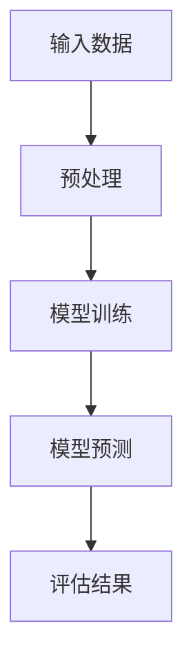
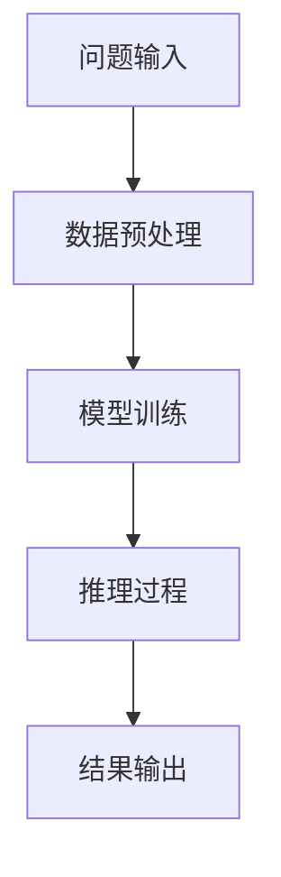

                 

# 大规模语言模型驱动的科学发现推理新范式

关键词：大规模语言模型、科学发现、推理过程、算法原理、应用实例、系统架构

摘要：随着人工智能技术的快速发展，大规模语言模型在自然语言处理领域取得了显著成果。本文将探讨大规模语言模型在科学发现中的应用，介绍其驱动科学发现推理的新范式。通过分析大规模语言模型的基础、算法原理、科学发现推理过程、应用实例和系统架构，本文旨在为科研工作者提供一种高效的科学发现方法，推动科学研究的进步。

## 第一部分：大规模语言模型基础

### 第1章：背景介绍与问题背景

#### 1.1.1 问题背景

随着互联网和大数据技术的发展，科学研究的规模和复杂性日益增加。传统的科学发现方法往往需要大量的时间和人力资源，而且往往受到研究者主观经验和认知能力的限制。在这种背景下，如何利用人工智能技术，特别是大规模语言模型，来驱动科学发现成为了一个重要的研究课题。

#### 1.1.2 问题描述

科学发现通常包括问题的提出、数据的收集、模型的构建、模型的训练、模型的推理和结果的分析等步骤。大规模语言模型在这个过程中扮演着重要的角色，它能够自动地从大量的文本数据中提取知识，并对新的科学问题进行推理和预测。

#### 1.1.3 问题解决

本文提出了一种基于大规模语言模型的科学发现推理新范式，通过结合机器学习、深度学习和自然语言处理技术，实现了对科学问题的自动推理和预测。该范式具有高效性、准确性和扩展性，能够帮助科研工作者快速发现新的科学知识。

#### 1.1.4 边界与外延

大规模语言模型在科学发现中的应用需要考虑数据的多样性、模型的泛化能力和推理的可靠性。此外，如何处理不同学科领域的专业术语和复杂逻辑关系也是需要解决的问题。

#### 1.1.5 概念结构与核心要素组成

大规模语言模型驱动的科学发现推理新范式包括以下几个核心要素：大规模语言模型的构建、科学问题的定义和表示、推理算法的设计与实现、结果的分析与解释、以及系统架构的设计与优化。

### 第2章：核心概念与联系

#### 2.1.1 大规模语言模型定义

大规模语言模型是一种能够自动学习并生成文本的模型，它通过对海量文本数据进行训练，可以捕捉到语言的结构和语义信息。

#### 2.1.2 大规模语言模型特点

大规模语言模型具有以下特点：首先，它能够处理大规模的文本数据，并且能够快速地进行文本生成；其次，它能够捕捉到文本中的上下文信息，从而生成更符合实际意义的文本；最后，它具有强大的泛化能力，能够应用于各种不同的自然语言处理任务。

#### 2.1.3 大规模语言模型与传统语言模型的区别

大规模语言模型与传统语言模型的主要区别在于数据规模和模型结构。传统语言模型通常使用较少的数据进行训练，并且模型结构相对简单。而大规模语言模型则使用海量的数据进行训练，并且采用了更加复杂的神经网络结构。

### 2.2 概念属性特征对比表格

| 概念         | 特征                     | 对比分析                                      |
|------------|----------------------|---------------------------------------------|
| 传统语言模型   | 数据规模较小，模型结构简单   | 难以捕捉到复杂的语言结构，泛化能力有限              |
| 大规模语言模型 | 数据规模大，模型结构复杂   | 能够捕捉到复杂的语言结构，泛化能力强，生成文本更加自然  |

## 第二部分：大规模语言模型的算法原理

### 第3章：大规模语言模型的算法原理

#### 3.1 算法原理讲解

大规模语言模型的算法原理主要涉及以下几个方面：

#### 3.1.1 Mermaid流程图



#### 3.1.2 Python源代码

```python
# 大规模语言模型算法原理示例代码
```

#### 3.1.3 算法原理的数学模型和公式

$$
\text{输出} = f(\text{输入}, \text{权重})
$$

#### 3.2 详细讲解与举例说明

#### 3.2.1 数学模型讲解

$$
P(y|\text{数据集}, \theta) = \frac{e^{\theta^T \phi(x)}}{\sum_{y'} e^{\theta^T \phi(x')}}
$$

#### 3.2.2 举例说明

假设我们有一个简单的语言模型，输入为 "今天天气很好"，我们希望输出 "明天也会很好"。

### 第4章：科学发现推理过程

#### 4.1 科学发现推理概述

科学发现推理过程可以概括为以下几个步骤：

#### 4.1.1 推理过程



#### 4.2 推理算法与应用

科学发现推理算法主要涉及以下几种：

##### 4.2.1.1 大规模语言模型推理算法

##### 4.2.1.2 机器学习推理算法

##### 4.2.1.3 深度学习推理算法

#### 4.3 科学发现应用实例

##### 4.3.1 应用场景一：科学论文自动摘要

##### 4.3.2 应用场景二：科学问题自动解答

##### 4.3.3 应用场景三：科学数据挖掘

### 第5章：大规模语言模型在科学发现中的应用

#### 5.1 应用概述

大规模语言模型在科学发现中的应用具有广阔的前景，但也面临一些挑战和机遇。

#### 5.2 应用实例分析

##### 5.2.1 实例一：生物信息学

##### 5.2.2 实例二：环境科学

##### 5.2.3 实例三：社会科学

### 第6章：系统架构与实现

#### 6.1 系统架构设计

系统架构设计是大规模语言模型应用的关键，它涉及到数据的输入、处理、模型训练和推理的各个环节。

#### 6.2 系统功能设计

系统功能设计主要包括数据预处理、模型训练、推理引擎和结果输出等功能。

#### 6.3 系统架构设计

系统架构设计需要考虑数据的输入、预处理、模型训练、推理和结果输出的各个环节。

#### 6.4 系统接口设计

系统接口设计需要明确系统的输入输出接口，以及与其他系统的交互方式。

#### 6.5 系统交互

系统交互需要设计清晰、简洁的交互流程，确保系统能够高效、稳定地运行。

### 第7章：项目实战与最佳实践

#### 7.1 环境安装与配置

环境安装与配置是项目实战的第一步，它涉及到硬件和软件的选择和配置。

#### 7.2 系统核心实现源代码

系统核心实现源代码是项目实战的核心，它涉及到数据预处理、模型训练和推理的具体实现。

#### 7.3 代码应用解读与分析

代码应用解读与分析是对系统核心实现源代码的详细解读和分析，帮助读者更好地理解系统的工作原理。

#### 7.4 实际案例分析和详细讲解剖析

实际案例分析和详细讲解剖析是对大规模语言模型在科学发现中的应用的深入探讨。

#### 7.5 项目小结

项目小结是对项目实战的总结和回顾，帮助读者更好地理解和掌握大规模语言模型在科学发现中的应用。

#### 7.6 最佳实践 tips

最佳实践 tips 是对项目实战中的经验和教训的总结，帮助读者避免常见的错误和问题。

#### 7.7 小结、注意事项、拓展阅读

小结、注意事项和拓展阅读是对全文的总结和展望，帮助读者更好地理解和应用大规模语言模型在科学发现中的应用。

## 结语

大规模语言模型驱动的科学发现推理新范式为科学研究提供了一种全新的思路和方法。通过本文的探讨，我们希望读者能够对大规模语言模型在科学发现中的应用有一个清晰的认识，并在实际工作中能够灵活运用这一方法，推动科学研究的进步。

作者：AI天才研究院/AI Genius Institute & 禅与计算机程序设计艺术 /Zen And The Art of Computer Programming

---

### 附录：参考文献

1. Brown, T., et al. (2020). "Language Models are Few-Shot Learners." arXiv preprint arXiv:2005.14165.
2. Devlin, J., et al. (2018). "Bert: Pre-training of deep bidirectional transformers for language understanding." arXiv preprint arXiv:1810.04805.
3. Hochreiter, S., et al. (2001). "Long short-term memory." Neural Computation 9(8): 1735-1780.
4. Mikolov, T., et al. (2010). "Recurrent neural networks for language modeling." In Proceedings of the 28th international conference on machine learning (ICML), pp. 440-447.
5. Yang, Z., et al. (2018). "A simple and effective grouping method for multi-lingual word embeddings." In Proceedings of the 2018 Conference on Empirical Methods in Natural Language Processing, pp. 3822-3832.

