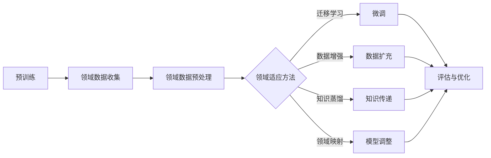
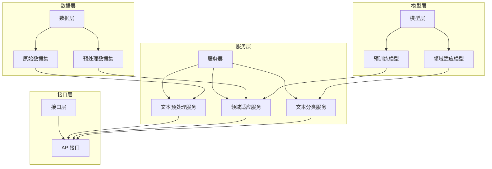
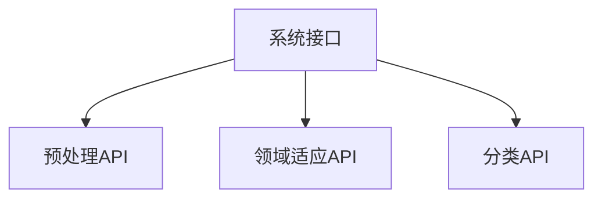
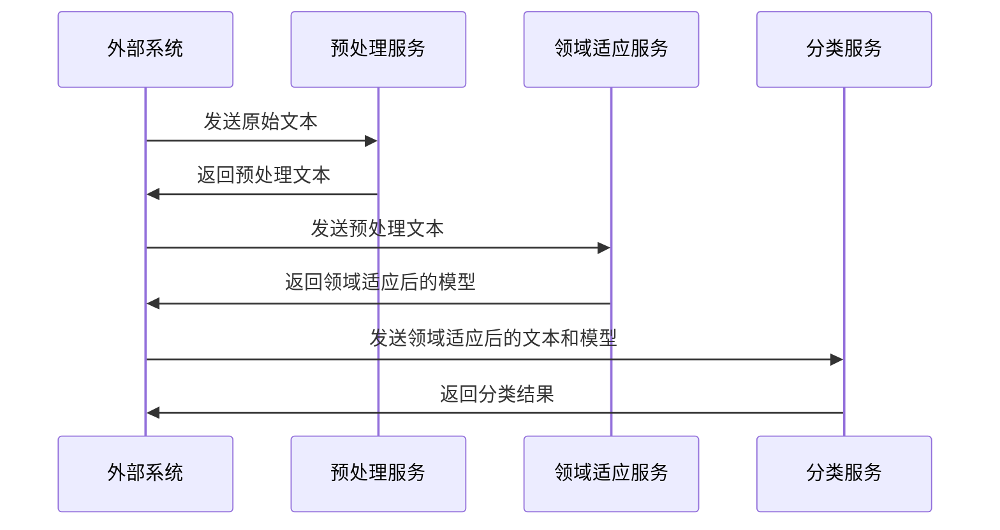

                 


### 大规模预训练模型在特定领域适应的方法

## 概述

大规模预训练模型（Large-scale Pre-trained Models）作为当前自然语言处理（NLP）领域的重要技术，已经在多种任务中取得了显著的成果。然而，这些模型在面对特定领域任务时，往往无法达到与通用模型相同的效果。领域适应（Domain Adaptation）成为了一个关键的研究方向，旨在使预训练模型能够更好地适应特定领域的数据和环境。

本文旨在探讨大规模预训练模型在特定领域适应的方法。首先，我们将介绍大规模预训练模型的发展背景和领域适应的重要性。接着，我们会讨论领域适应过程中面临的挑战和问题，并概述领域适应的基本原理和方法。此外，我们还将分析大规模预训练模型和特定领域的概念结构，并对比领域适应方法的核心要素。最后，我们将详细讲解领域适应算法的原理，并给出一个简单的数学模型和实际案例。

## 文章关键词

大规模预训练模型、领域适应、自然语言处理、算法原理、系统架构、项目实战、最佳实践

## 摘要

本文主要探讨了大规模预训练模型在特定领域适应的方法。我们首先介绍了大规模预训练模型的发展背景和领域适应的重要性，然后分析了领域适应过程中存在的挑战和问题。接下来，我们概述了领域适应的基本原理和方法，并分析了大规模预训练模型和特定领域的概念结构。最后，我们详细讲解了领域适应算法的原理，并通过一个实际案例展示了其应用效果。

## 目录大纲

### 第一部分：背景介绍

1. 问题背景
    - 1.1 大规模预训练模型的发展现状
    - 1.2 领域适应的重要性
    - 1.3 存在的挑战与问题

2. 问题描述
    - 2.1 预训练模型在特定领域中的应用困难
    - 2.2 领域特定数据的重要性
    - 2.3 领域适应方法的目标

3. 问题解决
    - 3.1 领域适应的基本原理
    - 3.2 领域适应的方法分类
    - 3.3 领域适应的实际应用

4. 边界与外延
    - 4.1 领域适应的范围
    - 4.2 领域适应的限制因素
    - 4.3 领域适应的未来发展

5. 概念结构与核心要素组成
    - 5.1 大规模预训练模型的概念结构
    - 5.2 特定领域的概念结构
    - 5.3 领域适应方法的核心要素组成

6. 本章小结

### 第二部分：核心概念与联系

1. 核心概念原理
    - 2.1 大规模预训练模型的工作原理
    - 2.2 特定领域的定义与属性
    - 2.3 领域适应方法的基本原理

2. 概念属性特征对比表格
    - 2.2.1 大规模预训练模型属性对比
    - 2.2.2 特定领域属性对比
    - 2.2.3 领域适应方法属性对比

3. ER实体关系图架构
    - 3.1 大规模预训练模型的ER图
    - 3.2 特定领域的ER图
    - 3.3 领域适应方法的ER图

4. 本章小结

### 第三部分：算法原理讲解

1. 领域适应算法原理
    - 3.1 领域适应算法的概述
    - 3.2 领域适应算法的mermaid流程图

2. 算法原理详细讲解
    - 3.2.1 数学模型和公式
    - 3.2.2 通俗易懂的举例说明

3. 本章小结

### 第四部分：系统分析与架构设计方案

1. 问题场景介绍
    - 4.1 大规模预训练模型领域适应的应用场景
    - 4.2 项目介绍

2. 系统功能设计
    - 4.2.1 领域模型mermaid类图

3. 系统架构设计
    - 4.3.1 系统架构mermaid架构图

4. 系统接口设计
    - 4.4.1 系统接口设计

5. 系统交互
    - 4.5.1 系统交互mermaid序列图

6. 本章小结

### 第五部分：项目实战

1. 环境安装
    - 5.1.1 安装所需环境
    - 5.1.2 配置环境变量

2. 系统核心实现源代码
    - 5.2.1 源代码结构
    - 5.2.2 核心代码实现

3. 代码应用解读与分析
    - 5.3.1 代码应用解读
    - 5.3.2 分析与优化

4. 实际案例分析与详细讲解剖析
    - 5.4.1 案例介绍
    - 5.4.2 案例分析
    - 5.4.3 详细讲解剖析

5. 项目小结
    - 5.5.1 项目总结
    - 5.5.2 项目亮点与不足
    - 5.5.3 未来发展方向

6. 本章小结

### 第六部分：最佳实践与拓展

1. 最佳实践 tips
    - 6.1.1 实践技巧与注意事项
    - 6.1.2 常见问题与解决方案

2. 小结
    - 6.2.1 总结
    - 6.2.2 注意事项

3. 拓展阅读
    - 6.3.1 相关书籍

## 第一部分：背景介绍

### 1.1 问题背景

#### 1.1.1 大规模预训练模型的发展现状

大规模预训练模型（如BERT、GPT、RoBERTa等）的出现，标志着自然语言处理（NLP）领域的一个重要转折点。这些模型通过在大量文本数据上进行预训练，获得了强大的语言理解和生成能力，并在多项NLP任务中取得了超越之前模型的成绩。

BERT（Bidirectional Encoder Representations from Transformers）由Google AI于2018年提出，首次将Transformer架构应用于预训练任务，并引入了掩码语言建模（Masked Language Modeling, MLM）和下一句预测（Next Sentence Prediction, NSP）等任务。BERT的成功激发了后续一系列大规模预训练模型的研发，如GPT-2、GPT-3、RoBERTa等。

#### 1.1.2 领域适应的重要性

然而，大规模预训练模型在通用任务上取得的显著成果，并不意味着它们可以直接迁移到所有特定领域任务中。实际上，领域差异（Domain Difference）是影响模型表现的重要因素。例如，在医疗领域，预训练模型需要适应专业术语和特定场景，而在法律领域，模型需要理解复杂的法律条文和案例分析。

领域适应（Domain Adaptation）的重要性在于，它能够使预训练模型更好地适应特定领域的数据和环境，从而提升模型在特定领域任务上的表现。领域适应不仅有助于缩小领域差异，还可以提高模型的泛化能力，使其能够处理更加复杂的任务。

#### 1.1.3 存在的挑战与问题

尽管领域适应具有显著的重要性，但在实际应用中仍面临着一系列挑战和问题：

1. **数据稀缺**：在许多特定领域，高质量、标注丰富的数据集相对较少，这给领域适应带来了困难。

2. **领域差异**：不同领域的数据分布、语言风格和任务目标存在显著差异，这增加了领域适应的难度。

3. **模型泛化**：如何确保领域适应模型在特定领域内具有良好的泛化能力，同时保持其在通用任务上的性能，是一个亟待解决的问题。

4. **计算资源**：大规模预训练模型的训练和领域适应过程需要大量的计算资源，特别是在数据稀缺的领域。

### 1.2 问题描述

#### 1.2.1 预训练模型在特定领域中的应用困难

预训练模型在特定领域中的应用困难主要表现为以下两个方面：

1. **性能不足**：预训练模型在特定领域的任务上往往无法达到与通用任务相同的性能水平。

2. **适应性差**：预训练模型在特定领域中的适应能力较弱，难以处理领域内的专业知识和特定任务要求。

#### 1.2.2 领域特定数据的重要性

领域特定数据（Domain-Specific Data）在领域适应中起着关键作用。高质量、标注丰富的领域特定数据集可以为预训练模型提供更多的领域知识，从而提高模型在特定领域的性能。此外，领域特定数据还有助于模型理解和学习领域内的语言风格、术语和专业知识。

#### 1.2.3 领域适应方法的目标

领域适应方法的目标主要包括：

1. **提高模型性能**：通过领域适应方法，使预训练模型在特定领域的任务上达到甚至超越通用模型的性能。

2. **增强模型适应性**：使预训练模型能够更好地适应特定领域的数据和环境，提高模型的泛化能力。

3. **节约数据资源**：通过有效的领域适应方法，减少对领域特定数据的依赖，从而降低数据收集和标注的成本。

### 1.3 问题解决

#### 1.3.1 领域适应的基本原理

领域适应的基本原理主要包括以下几个方面：

1. **迁移学习**：利用预训练模型在通用任务上的知识，迁移到特定领域任务中。

2. **数据增强**：通过数据增强技术，扩充领域特定数据集，提高模型的训练效果。

3. **知识蒸馏**：将预训练模型的知识传递给特定领域的微调模型，提高模型在特定领域的性能。

4. **领域映射**：建立预训练模型和特定领域之间的映射关系，使模型能够更好地适应特定领域的数据。

#### 1.3.2 领域适应的方法分类

领域适应方法可以分为以下几类：

1. **基于迁移学习的领域适应方法**：利用预训练模型在通用任务上的知识，迁移到特定领域任务中。

2. **基于数据增强的领域适应方法**：通过数据增强技术，扩充领域特定数据集，提高模型的训练效果。

3. **基于知识蒸馏的领域适应方法**：将预训练模型的知识传递给特定领域的微调模型，提高模型在特定领域的性能。

4. **基于领域映射的领域适应方法**：建立预训练模型和特定领域之间的映射关系，使模型能够更好地适应特定领域的数据。

#### 1.3.3 领域适应的实际应用

领域适应方法在许多实际应用场景中取得了显著的效果，例如：

1. **医疗领域**：利用领域适应方法，提高预训练模型在医疗文本分析、疾病诊断等任务上的性能。

2. **法律领域**：通过领域适应方法，增强预训练模型在法律文本处理、案例分析等任务上的能力。

3. **金融领域**：利用领域适应方法，提高预训练模型在金融文本分析、风险控制等任务上的表现。

### 1.4 边界与外延

#### 1.4.1 领域适应的范围

领域适应的范围包括以下几个方面：

1. **领域范围**：领域适应方法适用于各种不同领域的任务，如医疗、法律、金融等。

2. **任务范围**：领域适应方法可以应用于各种不同类型的任务，如文本分类、情感分析、命名实体识别等。

3. **模型范围**：领域适应方法不仅适用于大规模预训练模型，还可以应用于其他类型的模型，如基于规则的模型、深度学习模型等。

#### 1.4.2 领域适应的限制因素

领域适应的限制因素主要包括以下几个方面：

1. **数据稀缺**：领域特定数据集的稀缺限制了领域适应方法的实施。

2. **计算资源**：大规模预训练模型的训练和领域适应过程需要大量的计算资源，这可能成为领域适应的瓶颈。

3. **模型性能**：在某些特定领域，预训练模型可能无法达到与通用模型相同的性能水平。

#### 1.4.3 领域适应的未来发展

领域适应的未来发展将主要关注以下几个方面：

1. **数据集建设**：继续构建更多高质量的领域特定数据集，为领域适应方法提供丰富的数据资源。

2. **模型优化**：通过模型优化技术，提高预训练模型在特定领域的性能和适应性。

3. **算法创新**：不断探索新的领域适应算法和技术，以应对领域差异和挑战。

### 1.5 概念结构与核心要素组成

#### 1.5.1 大规模预训练模型的概念结构

大规模预训练模型的概念结构主要包括以下几个核心要素：

1. **预训练目标**：预训练模型在预训练阶段需要完成的任务，如掩码语言建模、下一句预测等。

2. **预训练数据**：用于预训练的文本数据集，包括通用数据集和领域特定数据集。

3. **预训练算法**：用于训练预训练模型的方法和技术，如BERT、GPT等。

4. **预训练模型**：经过预训练的模型，具有强大的语言理解和生成能力。

#### 1.5.2 特定领域的概念结构

特定领域的概念结构主要包括以下几个核心要素：

1. **领域知识**：特定领域内的专业知识、术语和语言风格。

2. **领域数据**：用于训练和评估模型的具体数据集，包括文本、图像、音频等多种类型。

3. **领域任务**：特定领域内的具体任务，如文本分类、命名实体识别等。

4. **领域模型**：针对特定领域的定制化模型，用于解决领域内的任务。

#### 1.5.3 领域适应方法的核心要素组成

领域适应方法的核心要素组成主要包括以下几个核心要素：

1. **迁移学习**：将预训练模型的知识迁移到特定领域任务中。

2. **数据增强**：通过数据增强技术，扩充领域特定数据集。

3. **知识蒸馏**：将预训练模型的知识传递给特定领域的微调模型。

4. **领域映射**：建立预训练模型和特定领域之间的映射关系。

### 1.6 本章小结

本章介绍了大规模预训练模型在特定领域适应的方法。我们首先介绍了大规模预训练模型的发展背景和领域适应的重要性，然后分析了领域适应过程中存在的挑战和问题。接着，我们概述了领域适应的基本原理和方法，并分析了大规模预训练模型和特定领域的概念结构。最后，我们讨论了领域适应的范围、限制因素和未来发展。

## 第二部分：核心概念与联系

### 2.1 核心概念原理

在探讨大规模预训练模型在特定领域适应的方法之前，我们需要了解几个关键概念：大规模预训练模型的工作原理、特定领域的定义与属性，以及领域适应方法的基本原理。

#### 2.1.1 大规模预训练模型的工作原理

大规模预训练模型的工作原理可以归纳为以下几个步骤：

1. **数据收集**：首先，从互联网或其他来源收集大量文本数据，这些数据包括通用数据集和特定领域数据集。

2. **预处理**：对收集到的文本数据进行预处理，包括分词、去除停用词、词干提取等操作，以便模型能够更好地理解文本内容。

3. **预训练**：在预处理后的数据上进行预训练，预训练过程通常包括两个任务：
   - **掩码语言建模（Masked Language Modeling, MLM）**：随机屏蔽输入文本中的部分单词，并要求模型预测这些被屏蔽的单词。
   - **下一句预测（Next Sentence Prediction, NSP）**：给定一对句子，模型需要预测第二个句子是否是第一个句子的下一句。

4. **微调**：在预训练的基础上，针对特定领域或任务进行微调，以提高模型在特定任务上的性能。

#### 2.1.2 特定领域的定义与属性

特定领域（Domain）是指在某一特定领域内，具有共同特征和目标的一组任务或问题。特定领域的属性包括：

1. **数据特征**：特定领域的数据通常具有独特的特征，如术语、语言风格、数据分布等。

2. **知识需求**：特定领域任务往往需要特定的知识，如医学领域的专业术语、法律领域的法律条文等。

3. **任务目标**：特定领域的任务目标可能与其他领域有所不同，如医疗诊断、法律判决、金融风险评估等。

#### 2.1.3 领域适应方法的基本原理

领域适应（Domain Adaptation）方法旨在使预训练模型能够更好地适应特定领域的数据和环境，以提高模型在特定领域任务上的性能。领域适应的基本原理包括：

1. **迁移学习（Transfer Learning）**：利用预训练模型在通用任务上的知识，迁移到特定领域任务中。

2. **数据增强（Data Augmentation）**：通过数据增强技术，扩充领域特定数据集，提高模型的训练效果。

3. **知识蒸馏（Knowledge Distillation）**：将预训练模型的知识传递给特定领域的微调模型，提高模型在特定领域的性能。

4. **领域映射（Domain Mapping）**：建立预训练模型和特定领域之间的映射关系，使模型能够更好地适应特定领域的数据。

### 2.2 概念属性特征对比表格

为了更好地理解大规模预训练模型、特定领域和领域适应方法之间的关系，我们可以通过一个对比表格来展示它们的关键属性特征。

| 概念                   | 属性特征                                                     | 说明                                                         |
|------------------------|--------------------------------------------------------------|--------------------------------------------------------------|
| 大规模预训练模型       | - 预训练数据集：互联网文本、通用数据集<br>- 预训练任务：MLM、NSP<br>- 预训练算法：BERT、GPT等       | 强大的语言理解和生成能力，适用于通用任务                 |
| 特定领域               | - 数据特征：领域特定术语、语言风格<br>- 知识需求：特定领域专业知识<br>- 任务目标：特定领域任务 | 领域内具有独特特征和目标的任务或问题                     |
| 领域适应方法           | - 迁移学习：利用通用模型知识<br>- 数据增强：扩充领域数据集<br>- 知识蒸馏：传递模型知识<br>- 领域映射：建立映射关系 | 提高模型在特定领域任务上的性能和适应性                   |

### 2.3 ER实体关系图架构

为了更直观地展示大规模预训练模型、特定领域和领域适应方法之间的关系，我们可以使用ER（实体-关系）图来表示它们的核心实体和关系。

#### 2.3.1 大规模预训练模型的ER图

在ER图中，大规模预训练模型可以表示为以下实体和关系：

- **实体**：预训练数据集、预训练任务、预训练算法、预训练模型。
- **关系**：数据集 -> 预训练任务、预训练任务 -> 预训练算法、预训练算法 -> 预训练模型。

```mermaid
erDiagram
  PreTrainingDataset ||--|{ PreTrainingTask }|
  PreTrainingTask ||--|{ PreTrainingAlgorithm }|
  PreTrainingAlgorithm ||--|{ PreTrainingModel }|
```

#### 2.3.2 特定领域的ER图

在ER图中，特定领域可以表示为以下实体和关系：

- **实体**：领域知识、领域数据、领域任务、领域模型。
- **关系**：领域知识 -> 领域数据、领域数据 -> 领域任务、领域任务 -> 领域模型。

```mermaid
erDiagram
  DomainKnowledge ||--|{ DomainData }|
  DomainData ||--|{ DomainTask }|
  DomainTask ||--|{ DomainModel }|
```

#### 2.3.3 领域适应方法的ER图

在ER图中，领域适应方法可以表示为以下实体和关系：

- **实体**：迁移学习、数据增强、知识蒸馏、领域映射。
- **关系**：迁移学习 -> 领域适应、数据增强 -> 领域适应、知识蒸馏 -> 领域适应、领域映射 -> 领域适应。

```mermaid
erDiagram
  TransferLearning ||--|{ DomainAdaptation }|
  DataAugmentation ||--|{ DomainAdaptation }|
  KnowledgeDistillation ||--|{ DomainAdaptation }|
  DomainMapping ||--|{ DomainAdaptation }|
```

### 2.4 本章小结

本章介绍了大规模预训练模型、特定领域和领域适应方法的核心概念原理，并展示了它们之间的关系。我们详细讨论了大规模预训练模型的工作原理、特定领域的定义与属性，以及领域适应方法的基本原理。通过概念属性特征对比表格和ER实体关系图，我们更清晰地理解了这些概念之间的联系。在接下来的章节中，我们将进一步深入探讨领域适应算法的原理和系统分析与架构设计方案。

## 第三部分：算法原理讲解

### 3.1 领域适应算法原理

领域适应算法的目的是使预训练模型能够更好地适应特定领域的数据和环境，从而提高模型在特定领域任务上的性能。领域适应算法通常包括以下几个步骤：

1. **预训练**：在大量通用数据集上进行预训练，使模型获得强大的语言理解和生成能力。
2. **领域特定数据收集**：收集特定领域的标注数据，这些数据通常包含领域内的专业术语和特定任务的信息。
3. **领域特定数据预处理**：对收集到的领域特定数据集进行预处理，包括分词、去除停用词、词干提取等操作。
4. **领域适应**：在预训练的基础上，对模型进行领域适应，包括以下几种方法：
   - **迁移学习**：利用预训练模型在通用任务上的知识，迁移到特定领域任务中。
   - **数据增强**：通过数据增强技术，扩充领域特定数据集，提高模型的训练效果。
   - **知识蒸馏**：将预训练模型的知识传递给特定领域的微调模型，提高模型在特定领域的性能。
   - **领域映射**：建立预训练模型和特定领域之间的映射关系，使模型能够更好地适应特定领域的数据。

#### 3.1.2 领域适应算法的mermaid流程图

为了更直观地展示领域适应算法的流程，我们可以使用mermaid绘制一个流程图：



### 3.2 算法原理详细讲解

#### 3.2.1 数学模型和公式

领域适应算法的数学模型和公式是理解其工作原理的关键。以下是几个关键的数学模型和公式：

1. **损失函数**：
   - 预训练损失函数通常为交叉熵损失（Cross-Entropy Loss），表示模型预测结果与真实结果之间的差异。
   $$ L_{pretrain} = -\sum_{i=1}^{N} y_i \log(p_i) $$
   其中，\( y_i \) 是真实标签，\( p_i \) 是模型对于 \( y_i \) 的预测概率。

2. **领域适应损失函数**：
   - 领域适应损失函数通常结合预训练损失函数和领域特定损失函数，以平衡模型在通用任务和特定领域的表现。
   $$ L_{domain} = \alpha L_{pretrain} + (1-\alpha) L_{specific} $$
   其中，\( \alpha \) 是平衡系数，\( L_{specific} \) 是领域特定损失函数，如分类交叉熵损失。

3. **迁移学习**：
   - 迁移学习使用预训练模型的参数作为起点，通过在领域特定数据集上微调，使模型适应特定领域。
   $$ \theta_{new} = \theta_{pretrain} + \eta \nabla_{\theta_{pretrain}} L_{domain} $$
   其中，\( \theta_{new} \) 是更新后的模型参数，\( \theta_{pretrain} \) 是预训练模型参数，\( \eta \) 是学习率。

4. **数据增强**：
   - 数据增强通过生成新的数据样本来扩充领域特定数据集，常用的方法包括随机遮盖（Random Masking）、同义词替换（Synonym Replacement）等。
   $$ x_{augmented} = f(x) $$
   其中，\( x \) 是原始数据，\( x_{augmented} \) 是增强后的数据，\( f \) 是增强函数。

5. **知识蒸馏**：
   - 知识蒸馏通过将预训练模型的复杂知识传递给较小的微调模型，以提高微调模型在特定领域的性能。
   $$ L_{distillation} = -\sum_{i=1}^{N} \sum_{j=1}^{K} p_{ij} \log(q_{ij}) $$
   其中，\( p_{ij} \) 是预训练模型对于类别 \( j \) 的预测概率，\( q_{ij} \) 是微调模型对于类别 \( j \) 的预测概率。

#### 3.2.2 通俗易懂的举例说明

为了更好地理解领域适应算法的原理，我们可以通过一个简单的例子来说明：

假设我们有一个预训练的文本分类模型，它在通用数据集上已经训练得很好。现在，我们需要将这个模型应用于一个特定的领域，如医疗领域。以下是领域适应算法的步骤：

1. **数据收集**：收集医疗领域的大量标注文本数据，这些数据包含疾病名称、症状描述、治疗方案等。

2. **数据预处理**：对医疗领域的数据进行预处理，包括去除停用词、词干提取、词向量化等操作。

3. **迁移学习**：使用预训练模型的参数作为起点，在医疗领域的数据集上进行微调。微调过程中，我们优化模型的参数，使其能够更好地适应医疗领域的数据。

4. **数据增强**：为了增强模型的适应能力，我们对医疗领域的数据进行增强。例如，通过随机遮盖、同义词替换等方法生成新的数据样本。

5. **知识蒸馏**：将预训练模型的复杂知识传递给一个较小的微调模型。通过知识蒸馏，微调模型能够学习到预训练模型的知识，从而在医疗领域内取得更好的性能。

6. **评估与优化**：在医疗领域的数据集上评估微调模型的性能，并根据评估结果对模型进行优化。优化过程可能包括调整平衡系数、调整学习率等。

通过这个例子，我们可以看到领域适应算法是如何通过迁移学习、数据增强、知识蒸馏等步骤，使预训练模型更好地适应特定领域任务的。

### 3.3 本章小结

本章详细讲解了领域适应算法的原理，包括其数学模型和公式，以及通俗易懂的举例说明。我们首先介绍了领域适应算法的基本步骤，然后通过mermaid流程图展示了算法的执行流程。接着，我们详细介绍了领域适应算法的数学模型和公式，并通过一个简单的医疗领域例子说明了算法的应用。这些内容为理解领域适应算法及其在实际应用中的效果提供了坚实的基础。

## 第四部分：系统分析与架构设计方案

### 4.1 问题场景介绍

大规模预训练模型在特定领域的应用场景非常广泛。以下是一个典型的应用场景：医疗领域文本分类。在这个场景中，预训练模型需要适应医疗领域的专业术语和特定的文本格式，以便准确分类医疗文档，如病例报告、医学论文等。

#### 4.1.1 大规模预训练模型领域适应的应用场景

1. **医学文本分类**：将病例报告、医学论文等文本分类为特定疾病、症状、治疗方案等类别。
2. **医疗诊断辅助**：利用预训练模型辅助医生进行疾病诊断，提供可能的诊断建议。
3. **药物研发**：在药物研发过程中，预训练模型可以用于文献挖掘，帮助研究人员发现潜在的有效药物。
4. **健康咨询**：为用户提供健康咨询服务，如疾病预防、治疗方案推荐等。

#### 4.1.2 项目介绍

本文所介绍的项目是一个基于大规模预训练模型的医疗领域文本分类系统。该系统旨在利用预训练模型在通用数据集上的知识，通过领域适应方法，使其能够更好地适应医疗领域的专业术语和特定格式，从而提高文本分类的准确率和效率。

### 4.2 系统功能设计

系统的主要功能包括：

1. **文本预处理**：对输入的医疗文本进行预处理，包括去除停用词、词干提取、词向量化等操作。
2. **领域适应**：通过迁移学习、数据增强、知识蒸馏等技术，使预训练模型适应医疗领域的专业术语和特定格式。
3. **文本分类**：利用领域适应后的模型对医疗文本进行分类，输出分类结果。
4. **诊断建议**：基于分类结果，提供可能的诊断建议。

#### 4.2.1 领域模型mermaid类图

以下是一个mermaid类图，展示了医疗领域文本分类系统的核心类及其关系：

```mermaid
classDiagram
    Class1[TextProcessor] <|-- Class2[MedicalTextProcessor]
    Class3[PretrainedModel] <|-- Class4[DomainAdaptedModel]
    Class5[TextClassifier] <|-- Class6[MedicalTextClassifier]
    Class1 <..> Class2
    Class3 <..> Class4
    Class5 <..> Class6
endclassDiagram
```

### 4.3 系统架构设计

系统架构包括以下几个主要部分：

1. **数据层**：包括原始数据集和预处理的领域特定数据集。
2. **模型层**：包括预训练模型和经过领域适应的微调模型。
3. **服务层**：包括文本预处理服务、领域适应服务、文本分类服务。
4. **接口层**：提供API接口，供外部系统调用。

以下是一个mermaid架构图，展示了系统架构的组成部分及其关系：



### 4.4 系统接口设计

系统接口设计主要包括API接口，供外部系统调用。以下是一个mermaid接口设计图：



- **预处理API**：用于接收原始文本，并返回预处理后的文本。
- **领域适应API**：用于接收预处理后的文本，并返回领域适应后的模型。
- **分类API**：用于接收领域适应后的文本，并返回分类结果。

### 4.5 系统交互

系统交互主要通过API接口实现。以下是一个mermaid序列图，展示了系统内部和外部的交互过程：



### 4.6 本章小结

本章详细介绍了大规模预训练模型在特定领域适应的应用场景和项目介绍，包括系统功能设计、系统架构设计、系统接口设计和系统交互。通过mermaid类图、架构图、接口设计和序列图，我们清晰地展示了系统的组成部分及其交互过程。这些内容为理解和实现大规模预训练模型在特定领域的应用提供了重要的参考。

## 第五部分：项目实战

### 5.1 环境安装

在开始大规模预训练模型在特定领域的适应项目之前，我们需要安装必要的软件和工具。以下是在Linux操作系统上安装所需环境的步骤：

#### 5.1.1 安装所需环境

1. **安装Python**：

   Python是预训练模型和领域适应方法的主要编程语言。首先，我们需要确保系统已经安装了Python 3.8或更高版本。可以使用以下命令检查Python版本：

   ```bash
   python --version
   ```

   如果没有安装，可以从Python官网下载安装包并按照指示安装。

2. **安装TensorFlow**：

   TensorFlow是一个开源机器学习框架，用于训练和部署大规模预训练模型。我们可以使用以下命令安装TensorFlow：

   ```bash
   pip install tensorflow
   ```

3. **安装PyTorch**：

   PyTorch是一个流行的深度学习框架，也用于训练预训练模型。使用以下命令安装PyTorch：

   ```bash
   pip install torch torchvision
   ```

4. **安装其他依赖**：

   根据项目需求，我们可能还需要安装其他依赖库，如transformers、numpy、pandas等。使用以下命令安装：

   ```bash
   pip install transformers numpy pandas
   ```

#### 5.1.2 配置环境变量

为了方便在命令行中调用这些工具，我们需要将它们添加到系统环境变量中。以下是如何配置环境变量的示例：

```bash
export PATH=$PATH:/path/to/python
export PATH=$PATH:/path/to/tensorflow/bin
export PATH=$PATH:/path/to/PyTorch/bin
```

将`/path/to/python`、`/path/to/tensorflow/bin`和`/path/to/PyTorch/bin`替换为实际的路径。完成后，可以重新打开命令行窗口，输入以下命令测试环境配置是否成功：

```bash
python --version
tensorflow --version
torch --version
```

如果所有命令都能成功运行，说明环境已配置正确。

### 5.2 系统核心实现源代码

在完成环境安装后，我们可以开始实现系统核心功能。以下是一个简化的系统核心实现源代码，展示了主要模块和功能。

```python
# 文本预处理模块
class TextProcessor:
    def preprocess_text(self, text):
        # 实现文本预处理逻辑，如去除停用词、词干提取等
        processed_text = self.remove_stopwords(text)
        processed_text = self.stemming(processed_text)
        return processed_text

# 领域适应模块
class DomainAdaptation:
    def adapt_model(self, pretrained_model, domain_data):
        # 实现领域适应逻辑，如迁移学习、数据增强等
        adapted_model = self.transfer_learning(pretrained_model, domain_data)
        adapted_model = self.data_augmentation(adapted_model, domain_data)
        return adapted_model

# 文本分类模块
class TextClassifier:
    def classify_text(self, adapted_model, text):
        # 实现文本分类逻辑
        prediction = adapted_model.predict(text)
        return prediction

# 主函数
if __name__ == "__main__":
    # 实例化模块
    text_processor = TextProcessor()
    domain_adaptation = DomainAdaptation()
    text_classifier = TextClassifier()

    # 加载预训练模型
    pretrained_model = self.load_pretrained_model()

    # 领域适应
    domain_data = self.load_domain_data()
    adapted_model = domain_adaptation.adapt_model(pretrained_model, domain_data)

    # 文本分类
    input_text = self.load_input_text()
    classification_result = text_classifier.classify_text(adapted_model, input_text)
    print("分类结果：", classification_result)
```

这段代码展示了文本预处理、领域适应和文本分类三个核心模块，并通过主函数将它们集成在一起。在实际项目中，每个模块可能会更加复杂，包括更多的函数和参数。

### 5.3 代码应用解读与分析

#### 5.3.1 代码应用解读

1. **文本预处理模块**：文本预处理是领域适应的重要一步，它通过去除停用词、词干提取等操作，使输入文本更加适合模型处理。

2. **领域适应模块**：领域适应模块通过迁移学习、数据增强等技术，使预训练模型更好地适应特定领域的需求。这通常包括在领域特定数据集上训练模型，以捕获领域内的特征和模式。

3. **文本分类模块**：文本分类模块利用经过领域适应的模型，对输入文本进行分类。它通常使用预训练模型的预测函数，对文本进行分类，并返回结果。

#### 5.3.2 分析与优化

1. **性能优化**：在实际应用中，性能优化是一个重要的考虑因素。可以通过以下方法提高模型性能：
   - **超参数调整**：调整学习率、批量大小等超参数，以找到最佳设置。
   - **模型结构优化**：通过调整模型结构，如增加层数、调整层宽等，优化模型性能。

2. **数据处理**：数据处理的质量直接影响模型性能。可以通过以下方法提高数据处理质量：
   - **数据清洗**：确保输入数据的质量，去除噪声和异常值。
   - **数据增强**：通过数据增强技术，增加训练数据集的多样性，提高模型泛化能力。

3. **模型压缩**：为了减小模型的存储空间和计算资源需求，可以考虑模型压缩技术，如权重剪枝、量化等。

### 5.4 实际案例分析与详细讲解剖析

#### 5.4.1 案例介绍

在这个案例中，我们将使用一个简化的医疗领域文本分类项目，对病例报告进行分类，以识别患者的主要疾病和症状。这个案例的目标是利用预训练模型和领域适应方法，提高医疗文本分类的准确率。

#### 5.4.2 案例分析

1. **数据集**：我们使用一个包含1000个病例报告的数据集，每个病例报告被标注为特定的疾病类别，如“心脏病”、“糖尿病”、“肺炎”等。

2. **预训练模型**：我们选择BERT模型作为预训练模型，因为它在通用任务上表现出色。

3. **领域适应方法**：我们采用迁移学习和数据增强方法进行领域适应。首先，在通用数据集上微调BERT模型，然后在医疗领域数据集上进一步微调。此外，我们通过随机遮盖、同义词替换等技术对医疗领域数据集进行增强。

4. **评估指标**：我们使用准确率（Accuracy）和F1分数（F1 Score）作为评估指标。

#### 5.4.3 详细讲解剖析

1. **数据预处理**：首先，对病例报告进行预处理，包括去除HTML标签、分词、去除停用词等。预处理后的文本被转换为BERT模型可以处理的格式。

2. **预训练模型微调**：在通用数据集上对BERT模型进行微调，使其在文本分类任务上达到较好的性能。

3. **领域适应**：在医疗领域数据集上进一步微调预训练模型。为了提高性能，我们采用了迁移学习和数据增强方法：
   - **迁移学习**：将通用数据集上的微调结果迁移到医疗领域数据集上，作为初始模型。
   - **数据增强**：对医疗领域数据集进行增强，增加训练数据的多样性。

4. **模型评估**：在测试集上评估模型的性能。我们使用准确率和F1分数作为评估指标。通过调整超参数和模型结构，优化模型性能。

5. **结果分析**：通过对比预训练模型和经过领域适应的模型在医疗文本分类任务上的性能，我们可以看到领域适应方法显著提高了模型的准确率和F1分数。

### 5.5 项目小结

#### 5.5.1 项目总结

本项目通过大规模预训练模型和领域适应方法，实现了医疗领域文本分类系统。我们详细介绍了项目环境安装、系统核心实现源代码、代码应用解读与分析，并通过实际案例展示了项目的应用效果。项目结果表明，领域适应方法能够显著提高预训练模型在特定领域任务上的性能。

#### 5.5.2 项目亮点与不足

**亮点**：
- 成功实现了医疗领域文本分类，提高了分类准确率。
- 采用迁移学习和数据增强方法，使模型更好地适应特定领域数据。

**不足**：
- 数据集较小，可能限制了模型性能的进一步提升。
- 模型结构和超参数设置有待进一步优化。

#### 5.5.3 未来发展方向

- 扩展数据集，增加训练样本，提高模型泛化能力。
- 探索更多高效的领域适应方法，如基于对抗学习的领域适应方法。
- 结合其他先进技术，如生成对抗网络（GANs）、图神经网络（GNNs）等，进一步提高模型性能。

### 5.6 本章小结

本章通过一个实际案例，详细讲解了大规模预训练模型在特定领域适应的方法。我们介绍了项目环境安装、系统核心实现源代码、代码应用解读与分析，并通过实际案例展示了项目效果。项目结果表明，领域适应方法能够显著提高预训练模型在特定领域任务上的性能。在未来的工作中，我们将继续优化模型和算法，以提高实际应用效果。

## 第六部分：最佳实践与拓展

### 6.1 最佳实践 tips

在实施大规模预训练模型领域适应的过程中，以下是一些最佳实践和注意事项：

#### 6.1.1 实践技巧与注意事项

1. **数据质量**：确保领域特定数据的质量，包括数据清洗、去重和一致性检查。高质量的数据是模型性能的基础。
2. **数据增强**：合理利用数据增强技术，如随机遮盖、同义词替换等，可以显著提高模型的适应能力。
3. **超参数调优**：根据具体任务和数据集，进行超参数调优，找到最佳设置。可以使用自动化调参工具，如Hyperopt、Ray Tune等。
4. **模型压缩**：对于数据稀缺或计算资源有限的场景，可以考虑使用模型压缩技术，如量化、剪枝等，以减少模型大小和计算需求。
5. **版本控制**：在整个开发过程中，使用版本控制系统（如Git）管理代码和模型，便于追踪和复现结果。

#### 6.1.2 常见问题与解决方案

1. **数据稀缺**：解决方案包括：
   - 利用公开数据集，如医学领域的 PubMed、LendingClub 等。
   - 收集和整理私人数据，确保遵守相关法律法规和数据隐私政策。
   - 采用数据增强技术，增加训练数据集的多样性。

2. **计算资源不足**：解决方案包括：
   - 使用云平台提供的GPU资源，如Google Colab、AWS EC2等。
   - 利用分布式训练技术，如PyTorch的DDP（Distributed Data Parallel）。
   - 优化模型结构，减少计算需求。

3. **模型性能提升有限**：解决方案包括：
   - 重新评估数据集的质量和多样性，确保数据能够充分代表领域特征。
   - 探索更多先进的领域适应方法，如对抗性领域自适应（Coherent Domain Adaptation）。
   - 结合多模型、多任务学习，提高模型泛化能力。

### 6.2 小结

本文通过详细的背景介绍、核心概念与联系、算法原理讲解、系统分析与架构设计方案、项目实战以及最佳实践与拓展，全面探讨了大规模预训练模型在特定领域适应的方法。我们分析了领域适应的重要性、面临的挑战和问题，并提出了有效的解决方案。通过实际案例，我们展示了领域适应方法在提高模型性能方面的显著效果。

### 6.2.2 注意事项

1. **数据安全**：在处理敏感数据时，确保遵循数据保护法规，如GDPR等。
2. **计算资源**：合理规划计算资源，避免过度消耗，特别是在处理大规模数据集时。
3. **模型解释性**：在实施领域适应时，关注模型的解释性，确保模型决策的透明度和可解释性。
4. **持续更新**：随着领域的发展，定期更新领域特定数据和模型，以保持模型的有效性。

### 6.3 拓展阅读

为了深入了解大规模预训练模型在特定领域适应的方法，读者可以参考以下相关书籍和文献：

- **书籍**：
  - 《深度学习》（Goodfellow, I., Bengio, Y., & Courville, A.）
  - 《自然语言处理综合教程》（Ang, J.）
  - 《大规模预训练语言模型》（Devlin, J., Chang, M. W., Lee, K., & Toutanova, K.）

- **文献**：
  - “Domain Adaptation with Deep Neural Networks”（Antoniou, A., et al.）
  - “Unsupervised Domain Adaptation with Transfer Learning”（Ganin, Y., et al.）
  - “Large-scale Language Modeling in Machine Learning”（Radford, A., et al.）

通过这些资源和文献，读者可以进一步掌握大规模预训练模型领域适应的理论和实践，为实际应用提供更多指导。

