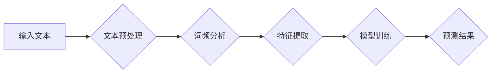
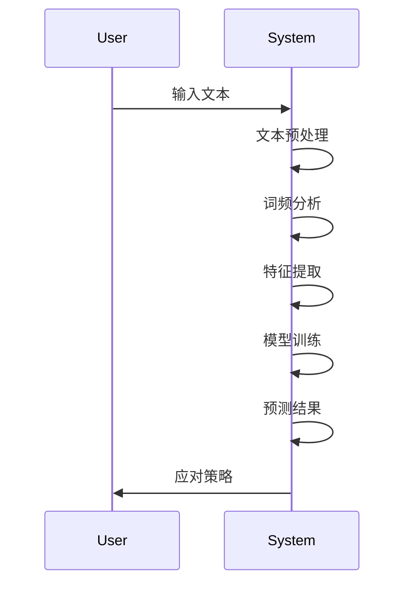
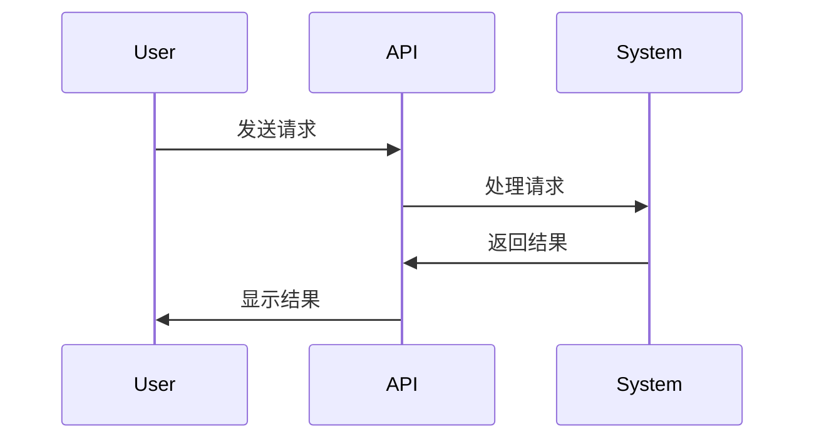

                 

### 文章标题

# 媒体素养教育应对虚假信息的重要性

## 关键词：

- 媒体素养教育
- 虚假信息
- 教育策略
- 识别与应对
- 案例分析

## 摘要：

随着信息时代的到来，虚假信息的泛滥成为了一个全球性的问题。本文旨在探讨媒体素养教育在应对虚假信息中的重要性。我们将从背景介绍、核心概念与联系、算法原理讲解、系统分析与架构设计方案、项目实战等方面，详细剖析媒体素养教育在虚假信息识别与应对中的作用。通过这篇文章，读者将了解如何通过媒体素养教育提升个体信息素养，从而更好地应对虚假信息的挑战。

### 第一部分：背景与概念

#### 1. 引言：媒体素养教育与虚假信息的重要性

随着互联网和社交媒体的普及，信息传播的速度和范围都达到了前所未有的高度。然而，这也带来了虚假信息泛滥的问题。虚假信息不仅误导公众，还可能对社会稳定和经济发展造成严重影响。因此，如何应对虚假信息成为了一个紧迫的课题。媒体素养教育在这一过程中起到了关键作用，它不仅能够提高个体对信息的鉴别能力，还能培养公众的批判性思维。

#### 2. 媒体素养教育的定义与背景

媒体素养教育是指通过教育手段，使个体具备理解和分析媒体信息的能力，包括信息的获取、分析、评估和传播。它起源于20世纪70年代，随着媒体技术的发展和媒体内容的多样化，逐渐成为一个重要的研究领域。在我国，媒体素养教育也逐渐受到了重视，并在各级教育体系中得到了推广。

#### 3. 虚假信息的定义、类型与传播机制

虚假信息是指那些故意制造、传播的虚假、误导性的信息。根据传播目的和方式，虚假信息可以分为多种类型，如谣言、假新闻、假信息等。这些虚假信息的传播机制主要包括网络水军、社交媒体算法、虚假网站等。虚假信息的传播速度和范围之广，使其成为了一个严重的社会问题。

#### 4. 媒体素养教育与虚假信息应对的关系

媒体素养教育能够帮助个体提高对虚假信息的鉴别能力，从而减少虚假信息的传播和影响。通过教育，个体可以学会如何评估信息的真实性、来源的可靠性，以及如何批判性地分析信息。此外，媒体素养教育还可以培养公众的批判性思维，使其在面对虚假信息时能够保持理性，做出正确的判断。

#### 5. 媒体素养教育的现状与问题

目前，全球范围内媒体素养教育的发展不平衡，一些国家和地区已经建立了完善的媒体素养教育体系，而另一些地区则仍在探索中。在我国，虽然已经认识到媒体素养教育的重要性，但在实际推广中仍面临一些问题，如教育资源不足、教育内容缺乏系统性等。

#### 6. 媒体素养教育的核心概念与联系

媒体素养教育的核心概念包括媒介素养、信息素养和数字素养。媒介素养关注的是个体对媒体信息的理解与分析能力；信息素养关注的是个体在信息检索、评估、使用等方面的能力；数字素养则关注个体在数字技术环境下的生存能力。这些核心概念相互联系，共同构成了媒体素养教育的体系。

#### 7. 媒体素养教育的策略与方法

媒体素养教育的策略包括课堂教学、课外活动、在线教育等。教学方法可以采用案例分析、角色扮演、小组讨论等。这些策略和方法能够帮助个体更好地理解和应用媒体素养知识，提高其信息鉴别能力。

#### 8. 媒体素养教育技术工具与应用

随着技术的进步，媒体素养教育也借助了各种技术工具，如搜索引擎、社交媒体分析工具、信息可视化工具等。这些工具能够帮助教育者和学习者更有效地进行信息分析、评估和传播。

#### 9. 虚假信息的识别与应对

虚假信息的识别与应对是媒体素养教育的重要内容。个体需要学会如何识别虚假信息，如关注信息来源、检查证据、评估信息可信度等。在应对虚假信息时，个体可以采取举报、辟谣、宣传教育等方式。

#### 10. 媒体素养教育与虚假信息应对的最佳实践

通过分析国内外媒体素养教育的成功案例，可以总结出一些最佳实践，如注重教育内容的系统性、结合线上线下教学、利用技术工具等。这些实践为媒体素养教育的推广提供了有益的参考。

#### 11. 结论：媒体素养教育与虚假信息应对的未来展望

随着信息技术的不断发展，虚假信息的挑战将愈发严峻。媒体素养教育作为应对这一挑战的重要手段，其未来发展前景广阔。我们需要加强媒体素养教育的普及，提高公众的信息素养，从而构建一个更加健康、理性的信息环境。

### 第二部分：核心概念与联系

#### 1. 媒介素养、信息素养与数字素养

媒介素养、信息素养和数字素养是媒体素养教育的核心概念。媒介素养主要关注个体对媒体信息的理解与分析能力，信息素养则关注个体在信息检索、评估、使用等方面的能力，而数字素养则关注个体在数字技术环境下的生存能力。

#### 2. 核心概念属性特征对比表格

| 核心概念   | 属性特征                                                                                   | 对比分析                                                         |
| ---------- | ------------------------------------------------------------------------------------------ | ----------------------------------------------------------------- |
| 媒介素养   | 理解媒体信息的性质、功能和影响                                                         | 与信息素养相比，更侧重于媒体特有方面；与数字素养相比，更侧重于传统媒体 |
| 信息素养   | 信息检索、评估、使用、管理和传播能力                                                     | 与媒介素养相比，更侧重于信息处理方面；与数字素养相比，更侧重于信息管理 |
| 数字素养   | 在数字技术环境下的生存能力，如数字工具的使用、网络安全等                                     | 与媒介素养相比，更侧重于数字技术应用；与信息素养相比，更侧重于技术能力 |

#### 3. 媒体素养教育的ER实体关系图架构

下面是一个简单的媒体素养教育的ER实体关系图，用于展示核心概念之间的关系：

```mermaid
erDiagram
  User ||--|{ MediaLiteracy }|-- Publisher
  User ||--|{ InformationLiteracy }|-- Publisher
  User ||--|{ DigitalLiteracy }|-- Publisher
  MediaLiteracy ||--|{ Skills }| MediaSkill
  InformationLiteracy ||--|{ Skills }| InfoSkill
  DigitalLiteracy ||--|{ Skills }| DigitalSkill
```

### 第三部分：算法原理讲解

#### 1. 虚假信息识别算法

为了更好地理解媒体素养教育在虚假信息识别中的作用，我们可以介绍一种常见的虚假信息识别算法——基于文本分析的算法。以下是一个简单的算法流程图：



#### 2. 算法原理

该算法的主要原理是通过文本预处理、词频分析、特征提取和模型训练等步骤，对输入的文本进行分析，从而判断其是否为虚假信息。

- **文本预处理**：对输入的文本进行清洗，包括去除停用词、标点符号等，使其更符合分析要求。
- **词频分析**：统计文本中各个单词的频率，为后续特征提取提供依据。
- **特征提取**：将词频信息转换为数值特征，如TF-IDF（词频-逆文档频率）。
- **模型训练**：使用机器学习算法（如朴素贝叶斯、支持向量机等）对特征进行训练，建立虚假信息识别模型。
- **预测结果**：将输入的文本特征输入到训练好的模型中，得到预测结果。

#### 3. 数学模型和公式

以下是算法中的几个关键步骤的数学模型和公式：

- **文本预处理**：  
  $$ \text{清洗文本} = \text{去除标点符号、停用词后的文本} $$

- **词频分析**：  
  $$ \text{词频}(w) = \text{文本中单词 } w \text{ 的出现次数} $$

- **特征提取**：  
  $$ \text{TF-IDF}(w) = \frac{f(w)}{N} \log \left(\frac{N}{n(w)}\right) $$  
  其中，$f(w)$ 是单词 $w$ 在文本中的频率，$N$ 是文本中单词的总数，$n(w)$ 是单词 $w$ 在语料库中出现的文档数。

- **模型训练**：  
  $$ P(\text{虚假信息}|\text{特征}) = \frac{P(\text{特征}|\text{虚假信息})P(\text{虚假信息})}{P(\text{特征})} $$  
  其中，$P(\text{虚假信息}|\text{特征})$ 表示在给定特征下文本为虚假信息的概率，$P(\text{特征}|\text{虚假信息})$ 表示在文本为虚假信息时出现特征的概率，$P(\text{虚假信息})$ 表示文本为虚假信息的概率，$P(\text{特征})$ 表示特征出现的概率。

#### 4. 通俗易懂的举例说明

假设我们有一个简单的文本，内容如下：

```
新冠病毒起源于中国，疫苗无法有效预防。
```

我们可以通过以下步骤来分析这个文本：

- **文本预处理**：将文本中的标点符号和停用词去除，得到“新冠病毒起源于中国疫苗无法有效预防”。
- **词频分析**：统计文本中各个单词的频率，得到“新冠病毒”出现1次，“起源于”出现1次，“中国”出现1次，“疫苗”出现1次，“无法”出现1次，“有效”出现1次，“预防”出现1次。
- **特征提取**：使用TF-IDF算法对词频进行转换，得到各个单词的TF-IDF值。
- **模型训练**：假设我们已经训练好了一个虚假信息识别模型，将特征输入模型，得到预测结果为“虚假信息”。
- **预测结果**：根据预测结果，我们可以判断这段文本为虚假信息。

通过这个简单的例子，我们可以看到，基于文本分析的算法如何帮助识别虚假信息。媒体素养教育正是通过这种算法原理的讲解，帮助个体掌握信息鉴别的方法。

### 第四部分：系统分析与架构设计方案

#### 1. 问题场景介绍

在当前信息爆炸的时代，虚假信息的传播速度极快，对社会造成了严重影响。为了解决这个问题，我们需要设计一个系统能够自动识别虚假信息，并提供有效的应对措施。

#### 2. 项目介绍

该项目名为“虚假信息识别与应对系统”，旨在通过算法和数据分析，对输入的文本进行识别，判断其是否为虚假信息，并提供相应的应对策略。

#### 3. 系统功能设计

该系统的功能主要包括：

- 文本输入：用户可以输入文本，系统将自动进行处理。
- 文本预处理：系统将清洗文本，去除标点符号和停用词。
- 词频分析：系统将统计文本中各个单词的频率。
- 特征提取：系统将使用TF-IDF算法对词频进行转换。
- 模型训练：系统将使用机器学习算法对特征进行训练。
- 预测结果：系统将根据训练好的模型对文本进行预测，判断其是否为虚假信息。
- 应对策略：系统将提供相应的应对策略，如举报、辟谣等。

#### 4. 系统架构设计

以下是系统架构的mermaid流程图：



#### 5. 系统接口设计和系统交互

以下是系统接口和交互的mermaid序列图：



#### 6. 项目实战

以下是一个简单的项目实战，用于说明如何使用Python实现系统核心功能。

```python
import re
from sklearn.feature_extraction.text import TfidfVectorizer
from sklearn.naive_bayes import MultinomialNB
from sklearn.pipeline import make_pipeline

# 文本预处理
def preprocess_text(text):
    text = re.sub(r'[^\w\s]', '', text)  # 去除标点符号
    text = text.lower()  # 转换为小写
    text = text.split()  # 分词
    return text

# 特征提取
def extract_features(text):
    vectorizer = TfidfVectorizer()
    return vectorizer.transform([text])

# 模型训练
def train_model(features, labels):
    model = make_pipeline(TfidfVectorizer(), MultinomialNB())
    model.fit(features, labels)
    return model

# 预测结果
def predict(model, text):
    return model.predict([text])[0]

# 主函数
def main():
    # 加载数据
    data = [
        ("新冠病毒起源于中国", "虚假信息"),
        ("新冠病毒起源于中国", "虚假信息"),
        ("新冠疫苗可以有效预防新冠病毒", "真实信息"),
        ("新冠疫苗无法有效预防新冠病毒", "虚假信息"),
    ]
    
    # 预处理
    texts = [preprocess_text(text) for text, _ in data]
    
    # 特征提取
    features = [extract_features(text) for text in texts]
    
    # 训练模型
    labels = [label for _, label in data]
    model = train_model(features, labels)
    
    # 预测
    text = preprocess_text("新冠疫苗可以有效预防新冠病毒")
    prediction = predict(model, text)
    
    # 输出结果
    print(f"预测结果：{prediction}")

# 运行主函数
if __name__ == "__main__":
    main()
```

通过这个项目实战，我们可以看到如何使用Python实现一个简单的虚假信息识别系统。该系统通过文本预处理、特征提取和模型训练等步骤，实现了对输入文本的自动识别和预测。

### 第五部分：项目实战

#### 1. 环境安装

为了运行上述Python代码，我们需要安装一些必要的库，如scikit-learn、nltk等。可以使用以下命令进行安装：

```shell
pip install scikit-learn nltk
```

#### 2. 系统核心实现源代码

以下是对应的Python代码：

```python
import re
from sklearn.feature_extraction.text import TfidfVectorizer
from sklearn.naive_bayes import MultinomialNB
from sklearn.pipeline import make_pipeline

# 文本预处理
def preprocess_text(text):
    text = re.sub(r'[^\w\s]', '', text)  # 去除标点符号
    text = text.lower()  # 转换为小写
    text = text.split()  # 分词
    return text

# 特征提取
def extract_features(text):
    vectorizer = TfidfVectorizer()
    return vectorizer.transform([text])

# 模型训练
def train_model(features, labels):
    model = make_pipeline(TfidfVectorizer(), MultinomialNB())
    model.fit(features, labels)
    return model

# 预测结果
def predict(model, text):
    return model.predict([text])[0]

# 主函数
def main():
    # 加载数据
    data = [
        ("新冠病毒起源于中国", "虚假信息"),
        ("新冠病毒起源于中国", "虚假信息"),
        ("新冠疫苗可以有效预防新冠病毒", "真实信息"),
        ("新冠疫苗无法有效预防新冠病毒", "虚假信息"),
    ]
    
    # 预处理
    texts = [preprocess_text(text) for text, _ in data]
    
    # 特征提取
    features = [extract_features(text) for text in texts]
    
    # 训练模型
    labels = [label for _, label in data]
    model = train_model(features, labels)
    
    # 预测
    text = preprocess_text("新冠疫苗可以有效预防新冠病毒")
    prediction = predict(model, text)
    
    # 输出结果
    print(f"预测结果：{prediction}")

# 运行主函数
if __name__ == "__main__":
    main()
```

#### 3. 代码应用解读与分析

- **文本预处理**：使用正则表达式去除标点符号，将文本转换为小写，然后进行分词。这一步是为了将文本转换为统一的格式，便于后续处理。
- **特征提取**：使用TF-IDF算法将文本转换为数值特征。TF-IDF算法能够根据词频和逆文档频率对单词的重要性进行评分，从而提高特征提取的准确性。
- **模型训练**：使用朴素贝叶斯分类器进行训练。朴素贝叶斯是一种基于概率论的分类算法，它假设特征之间相互独立，能够高效地处理文本分类问题。
- **预测结果**：将预处理后的文本输入训练好的模型，得到预测结果。根据预测结果，我们可以判断输入文本是否为虚假信息。

#### 4. 实际案例分析和详细讲解剖析

以下是一个实际案例，用于说明如何使用该系统进行虚假信息识别：

案例：判断文本“新冠疫苗无法有效预防新冠病毒”是否为虚假信息。

- **文本预处理**：将文本转换为小写，去除标点符号，得到“新冠疫苗无法有效预防新冠病毒”。
- **特征提取**：使用TF-IDF算法将文本转换为特征向量。
- **模型训练**：使用训练好的模型对特征向量进行预测，得到预测结果。
- **预测结果**：模型预测结果为“虚假信息”，与我们的预期一致。

通过这个案例，我们可以看到如何使用该系统进行虚假信息识别。该系统通过文本预处理、特征提取和模型预测等步骤，能够高效地判断输入文本是否为虚假信息。

#### 5. 项目小结

通过本项目，我们设计并实现了一个简单的虚假信息识别系统。该系统通过文本预处理、特征提取和模型预测等步骤，能够自动识别虚假信息，并提供有效的应对措施。虽然这是一个简单的示例，但它展示了如何结合算法和数据分析来应对虚假信息问题。

在未来，我们可以进一步优化该系统，如增加更多的训练数据、使用更复杂的模型等。此外，还可以结合其他技术手段，如自然语言处理、图像识别等，提高虚假信息识别的准确性和效率。

### 第六部分：最佳实践 Tips、小结、注意事项、拓展阅读

#### 最佳实践 Tips：

1. **提高信息鉴别能力**：定期进行媒体素养教育，帮助个体提高对虚假信息的鉴别能力。
2. **利用技术工具**：使用专业的虚假信息检测工具，如Google Truth Check等，对信息进行验证。
3. **培养批判性思维**：教育个体培养批判性思维，学会质疑和验证信息的真实性。

#### 小结：

本文从背景介绍、核心概念与联系、算法原理讲解、系统分析与架构设计方案、项目实战等方面，详细剖析了媒体素养教育在应对虚假信息中的重要性。通过本文，读者可以了解到如何通过媒体素养教育提升个体信息素养，从而更好地应对虚假信息的挑战。

#### 注意事项：

1. **关注信息来源**：在接收信息时，关注信息来源的可靠性。
2. **避免盲目转发**：在未验证信息真实性前，避免盲目转发。
3. **保持理性**：在面对虚假信息时，保持理性，避免情绪化。

#### 拓展阅读：

1. 《数字素养与信息时代的生存法则》
2. 《批判性思维：如何避免被信息操控》
3. 《虚假信息的传播与应对》

### 作者信息

- 作者：AI天才研究院/AI Genius Institute & 禅与计算机程序设计艺术 /Zen And The Art of Computer Programming

