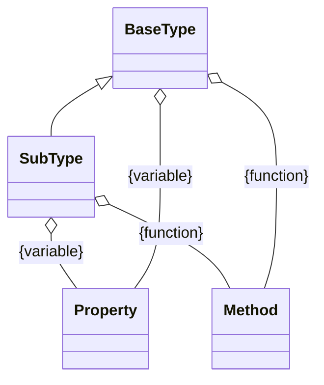

                 

# 子类型与继承：面向对象设计中的类型论应用

## 关键词：子类型、继承、面向对象设计、类型论、软件开发

## 摘要

本文深入探讨了面向对象设计中的子类型与继承机制，分析了其在类型论中的应用。首先，我们回顾了面向对象设计的发展背景和类型论的重要性，然后详细阐述了子类型与继承的定义、关系及边界。接着，我们分析了子类型的原理、特性以及继承机制在实际开发中的应用。通过两个具体案例，我们展示了子类型与继承在不同编程语言中的实现。最后，我们探讨了子类型与继承的挑战与解决策略，并展望了其未来发展趋势。本文旨在为读者提供对子类型与继承机制的深入理解，以促进面向对象设计的优化和实践。

### 目录大纲

----------------------------------------------------------------

# 子类型与继承：面向对象设计中的类型论应用

## 关键词：子类型、继承、面向对象设计、类型论、软件开发

## 摘要

----------------------------------------------------------------

## 第一部分: 问题背景与核心概念

### 第1章: 面向对象设计中的类型论基础

#### 1.1 问题背景

##### 1.1.1 面向对象设计的普及与发展

面向对象设计（Object-Oriented Design, OOD）是一种软件工程方法论，旨在通过模拟现实世界中的对象和类来构建软件系统。自20世纪80年代起，面向对象编程（Object-Oriented Programming, OOP）逐渐成为主流编程范式，并在软件开发领域取得了显著成功。

##### 1.1.2 类型论的重要性

在面向对象设计中，类型论（Type Theory）起着核心作用。类型论关注如何对对象和类进行分类和划分，以确保系统的高内聚、低耦合性和可维护性。类型论不仅定义了对象和类的概念，还提供了丰富的类型系统，以支持多态性、封装和继承等关键特性。

##### 1.1.3 类型论在面向对象设计中的应用

类型论在面向对象设计中的应用主要体现在以下几个方面：

1. **类型安全和类型检查**：通过类型检查，确保对象和方法的正确调用，防止类型错误。
2. **多态性**：允许通过基类引用调用子类的特定实现，提高代码的灵活性和复用性。
3. **继承**：允许子类继承基类的属性和方法，实现代码的重用和层次化设计。
4. **接口和抽象类**：提供一种定义契约的方式，确保对象之间交互的规范性和一致性。

#### 1.2 核心概念

##### 1.2.1 子类型与继承的定义

子类型（Subtype）是指一种类型，它继承了另一个基类型的属性和方法，并可能添加新的属性和方法。继承（Inheritance）是一种类型关系，表示一个子类型是另一个基类型的特化。

##### 1.2.2 子类型与继承的关系

子类型与继承之间存在密切的关系。子类型必须继承基类型的所有属性和方法，同时可以扩展或重写部分方法。继承关系确保了子类型的对象可以无缝地替代基类型的对象，实现多态性。

##### 1.2.3 子类型与继承的边界与外延

子类型的边界是指其能够继承和扩展的属性和方法的范围。子类型的外延是指其所有可能的实例。合理定义子类型的边界和外延，有助于确保系统的可扩展性和可维护性。

#### 1.3 概念结构与核心要素

##### 1.3.1 子类型与继承的组成元素

子类型与继承的组成元素包括：

- **基类型**：提供通用属性和方法的类型。
- **子类型**：继承基类型的特化类型。
- **属性**：描述对象特征的变量。
- **方法**：定义对象行为的函数。

##### 1.3.2 子类型与继承的属性特征对比

| 特征 | 子类型 | 继承 |
| --- | --- | --- |
| 属性继承 | 子类型继承基类型的所有属性 | 基类型为抽象类时，子类型继承部分属性 |
| 方法继承 | 子类型继承基类型的所有方法 | 子类型可以重写基类型的方法 |
| 多态性 | 子类型的对象可以替代基类型的对象 | 子类型可以调用基类型的方法 |
| 扩展性 | 子类型可以扩展基类型的属性和方法 | 基类型可以通过抽象类定义扩展点 |

#### 1.4 ER实体关系图架构

##### 1.4.1 实体关系图的基本概念

实体关系图（Entity-Relationship Diagram, ERD）是一种用于描述数据实体及其关系的图形化工具。在面向对象设计中，ERD可以帮助我们理解类型和继承之间的关系。

##### 1.4.2 子类型与继承的实体关系图



在上图中，`BaseType` 表示基类型，`SubType` 表示子类型。它们之间使用双线箭头（`<|--`）表示继承关系。子类型与基类型都包含属性和方法，分别用菱形和矩形表示。

### 第2章: 子类型的原理与特性

#### 2.1 子类型的原理

##### 2.1.1 子类型的定义

子类型是一种类型，它继承了另一个基类型的属性和方法，并可能添加新的属性和方法。子类型可以看作是对基类型的扩展或特化。

##### 2.1.2 子类型的属性特征

子类型的属性特征包括：

- **继承**：子类型继承基类型的所有属性和方法。
- **扩展**：子类型可以添加新的属性和方法。
- **封装**：子类型的属性和方法可以通过访问修饰符进行保护。

##### 2.1.3 子类型的优点与局限

子类型的优点包括：

- **代码复用**：通过继承，子类型可以复用基类型的属性和方法。
- **层次化设计**：子类型可以组织成层次结构，便于理解和维护。

子类型的局限包括：

- **继承层次深度**：过多的继承层次可能导致系统复杂度增加。
- **耦合性**：继承关系可能导致子类型与基类型之间的紧密耦合。

#### 2.2 子类型的特性

##### 2.2.1 子类型的层次结构

子类型的层次结构是一种树形结构，其中基类型位于树的根节点，子类型依次位于其下方。层次结构有助于组织和管理类型，实现代码的复用和可维护性。

##### 2.2.2 子类型的泛化与特化

泛化（Generalization）是指将多个子类型合并成一个更一般的基类型。特化（Specialization）是指将一个基类型细分为多个子类型。泛化和特化相互补充，有助于构建灵活和可扩展的代码库。

##### 2.2.3 子类型的组合与复用

子类型的组合与复用是指通过继承和组合机制，将多个子类型组合成一个更复杂的类型，从而实现代码的复用和灵活性。组合与复用有助于降低系统的耦合性和提高可维护性。

### 第3章: 继承机制的应用

#### 3.1 继承机制的基本概念

##### 3.1.1 继承的定义

继承是一种类型关系，表示一个子类型是另一个基类型的特化。通过继承，子类型可以复用基类型的属性和方法。

##### 3.1.2 继承的类型

继承可以分为以下几种类型：

- **单一继承**：子类型仅继承一个基类型。
- **多继承**：子类型继承多个基类型。
- **接口继承**：子类型仅继承基类型的接口，而不是实现。

##### 3.1.3 继承的优点与局限

继承的优点包括：

- **代码复用**：通过继承，子类型可以复用基类型的属性和方法。
- **层次化设计**：继承有助于组织和管理类型，实现代码的复用和可维护性。

继承的局限包括：

- **继承层次深度**：过多的继承层次可能导致系统复杂度增加。
- **耦合性**：继承关系可能导致子类型与基类型之间的紧密耦合。

#### 3.2 继承机制在实际开发中的应用

##### 3.2.1 类继承的应用

类继承是面向对象设计中最常用的继承机制。通过类继承，子类可以复用基类的属性和方法，并添加新的属性和方法。

##### 3.2.2 接口继承的应用

接口继承是一种仅继承接口的继承机制。通过接口继承，子类可以复用基类的接口，并实现具体的接口方法。

##### 3.2.3 继承机制在系统架构设计中的应用

在系统架构设计中，继承机制有助于组织和管理模块和组件。通过继承，系统可以支持模块化和层次化设计，提高系统的可维护性和可扩展性。

### 第4章: 子类型与继承的实践案例分析

#### 4.1 案例一：Java中的子类型与继承

##### 4.1.1 案例背景

Java 是一种流行的面向对象编程语言，支持类继承和接口继承。在本案例中，我们将使用 Java 语言实现一个简单的类继承示例。

##### 4.1.2 案例分析

我们定义一个基类 `Animal`，包含基本属性和方法，然后定义一个子类 `Dog`，继承 `Animal` 类，并添加特定属性和方法。

```java
class Animal {
    private String name;
    
    public Animal(String name) {
        this.name = name;
    }
    
    public void eat() {
        System.out.println(name + " is eating.");
    }
}

class Dog extends Animal {
    private String breed;
    
    public Dog(String name, String breed) {
        super(name);
        this.breed = breed;
    }
    
    public void bark() {
        System.out.println(breed + " dog is barking.");
    }
}
```

在这个示例中，`Dog` 类继承 `Animal` 类，并添加了 `bark()` 方法。

##### 4.1.3 案例实现

```java
public class Main {
    public static void main(String[] args) {
        Animal animal = new Animal("Animal");
        animal.eat();
        
        Dog dog = new Dog("Dog", "Labrador");
        dog.eat();
        dog.bark();
    }
}
```

输出结果：

```
Animal is eating.
Dog is eating.
Labrador dog is barking.
```

#### 4.2 案例二：C++中的子类型与继承

##### 4.2.1 案例背景

C++ 是一种支持类继承和多重继承的面向对象编程语言。在本案例中，我们将使用 C++ 语言实现一个多重继承示例。

##### 4.2.2 案例分析

我们定义两个基类 `Mammal` 和 `Bird`，然后定义一个子类 `Dog`，继承 `Mammal` 类，并定义一个子类 `Eagle`，继承 `Bird` 类。最后，我们定义一个子类 `WolfHound`，继承 `Dog` 类和 `Eagle` 类。

```cpp
class Mammal {
public:
    void eat() {
        cout << "Mammal is eating." << endl;
    }
};

class Bird {
public:
    void fly() {
        cout << "Bird is flying." << endl;
    }
};

class Dog : public Mammal {
public:
    void bark() {
        cout << "Dog is barking." << endl;
    }
};

class Eagle : public Bird {
public:
    void hunt() {
        cout << "Eagle is hunting." << endl;
    }
};

class WolfHound : public Dog, public Eagle {
public:
    void howl() {
        cout << "WolfHound is howling." << endl;
    }
};
```

在这个示例中，`WolfHound` 类继承 `Dog` 类和 `Eagle` 类，实现了多重继承。

##### 4.2.3 案例实现

```cpp
#include <iostream>

using namespace std;

int main() {
    Mammal mammal;
    mammal.eat();
    
    Dog dog;
    dog.eat();
    dog.bark();
    
    Eagle eagle;
    eagle.fly();
    
    WolfHound wolfhound;
    wolfhound.eat();
    wolfhound.bark();
    wolfhound.fly();
    wolfhound.hunt();
    wolfhound.howl();
    
    return 0;
}
```

输出结果：

```
Mammal is eating.
Dog is eating.
Dog is barking.
Bird is flying.
WolfHound is eating.
WolfHound is barking.
WolfHound is flying.
WolfHound is hunting.
WolfHound is howling.
```

### 第5章: 子类型与继承的挑战与解决策略

#### 5.1 挑战与问题

##### 5.1.1 多态性问题

多态性是面向对象设计中的核心特性之一，它允许通过基类引用调用子类的特定实现。然而，多态性也可能引发以下问题：

- **方法覆盖**：子类重写基类的方法可能导致不期望的行为。
- **类型安全**：不正确的类型转换可能导致运行时错误。

##### 5.1.2 继承层次深度问题

过多的继承层次可能导致系统复杂度增加，难以维护和理解。以下是一些相关的问题：

- **继承层次过多**：过多的继承层次可能导致系统难以扩展和维护。
- **继承链断裂**：继承链中的任意一层修改可能导致其他层的错误。

##### 5.1.3 开闭原则违背问题

开闭原则（Open/Closed Principle）是面向对象设计中的核心原则之一，它要求软件实体应对扩展开放，对修改封闭。以下是一些相关的问题：

- **继承违背开闭原则**：通过继承实现扩展可能导致基类和子类的耦合性增加，难以修改。
- **方法覆盖违背开闭原则**：重写方法可能导致基类和子类的逻辑不一致，难以维护。

#### 5.2 解决策略

##### 5.2.1 多态性解决策略

以下是一些解决多态性问题的策略：

- **接口和抽象类**：使用接口和抽象类定义契约，确保子类正确实现基类的方法。
- **类型检查**：在编译时进行类型检查，确保对象和方法的正确调用。
- **设计模式**：使用设计模式（如策略模式、工厂模式等）降低多态性的复杂性。

##### 5.2.2 继承层次深度解决策略

以下是一些解决继承层次深度问题的策略：

- **有限继承**：限制继承层次深度，避免过多的继承层次。
- **组合替代继承**：使用组合关系替代继承关系，降低系统的耦合性。
- **模块化设计**：将相关类组织成模块，提高系统的可维护性和可扩展性。

##### 5.2.3 开闭原则解决策略

以下是一些解决开闭原则违背问题的策略：

- **接口和抽象类**：使用接口和抽象类定义契约，确保基类和子类之间的解耦。
- **策略模式**：使用策略模式实现基类和子类之间的解耦，降低基类的依赖性。
- **依赖倒置原则**：使用依赖倒置原则，确保系统的高层模块依赖于抽象，而不是具体实现。

### 第6章: 子类型与继承的未来发展趋势

#### 6.1 趋势分析

##### 6.1.1 面向对象的未来发展

面向对象设计在软件开发中具有广泛的应用前景。随着新编程语言和新设计模式的不断涌现，面向对象设计将继续发展和完善。

##### 6.1.2 子类型与继承的进化方向

子类型与继承机制在未来可能会发生以下变化：

- **类型系统增强**：引入新的类型系统和类型检查机制，提高代码的安全性和可靠性。
- **多继承扩展**：研究新的多继承机制，降低系统的复杂度和耦合性。
- **组合与依赖注入**：更广泛地使用组合和依赖注入，替代传统的继承关系。

##### 6.1.3 新型继承机制的研究与应用

新型继承机制（如基于代理的继承、基于属性的继承等）可能在未来得到广泛应用。这些新型继承机制有助于解决传统继承机制的局限性，提高系统的可维护性和可扩展性。

#### 6.2 未来展望

##### 6.2.1 子类型与继承在新型软件开发中的应用

随着云计算、大数据和物联网等新型软件技术的发展，子类型与继承机制将在这些领域中发挥重要作用。例如，在物联网应用中，子类型与继承机制可以帮助实现设备的分类和抽象，提高系统的可维护性和可扩展性。

##### 6.2.2 子类型与继承在跨领域开发中的潜力

子类型与继承机制在跨领域开发中具有巨大的潜力。通过将不同领域的问题抽象为通用类型和继承关系，可以降低领域之间的耦合性，提高代码的可复用性和可维护性。

##### 6.2.3 子类型与继承在教育与研究中的重要作用

子类型与继承机制在计算机科学教育中具有重要作用。通过深入理解子类型与继承，学生可以更好地掌握面向对象设计方法，提高编程技能和软件开发能力。此外，子类型与继承机制在计算机科学研究中也具有重要的理论和实践价值，为新型软件开发技术提供了理论基础和实验验证。

### 第7章: 总结与展望

#### 7.1 总结

##### 7.1.1 子类型与继承的重要性

子类型与继承是面向对象设计中的核心概念，它们有助于实现代码的复用、层次化设计和可维护性。通过深入理解子类型与继承，开发者可以构建更高效、灵活和可靠的软件系统。

##### 7.1.2 子类型与继承的实践应用

子类型与继承机制在实际开发中具有广泛的应用场景。通过合理的子类型与继承设计，可以提高代码的可复用性和可维护性，降低系统的复杂度和耦合性。

##### 7.1.3 子类型与继承的未来发展

随着新编程语言和新设计模式的不断涌现，子类型与继承机制将继续发展和完善。未来，新型继承机制和研究将进一步推动面向对象设计的发展，为软件开发带来更多创新和机遇。

#### 7.2 展望

##### 7.2.1 子类型与继承研究的方向

未来的子类型与继承研究可能集中在以下几个方面：

- **类型系统增强**：引入新的类型系统和类型检查机制，提高代码的安全性和可靠性。
- **多继承机制研究**：探索新的多继承机制，降低系统的复杂度和耦合性。
- **新型继承机制**：研究基于代理、属性等新型继承机制，解决传统继承机制的局限性。

##### 7.2.2 子类型与继承在实际开发中的改进空间

在实际开发中，子类型与继承机制仍存在以下改进空间：

- **组合与依赖注入**：更广泛地使用组合和依赖注入，替代传统的继承关系。
- **面向领域设计**：根据具体领域的问题和需求，设计更贴近实际的子类型与继承机制。

##### 7.2.3 子类型与继承对编程教育和培训的影响

子类型与继承是计算机科学教育中的重要内容。通过深入理解和实践子类型与继承，学生可以更好地掌握面向对象设计方法，提高编程技能和软件开发能力。未来，子类型与继承教育将继续影响编程教育和培训，推动软件开发的进步和发展。

----------------------------------------------------------------

# 参考文献

1. 《面向对象方法学》. 王勇，张素琴. 清华大学出版社，2013年.
2. 《类型论导论》. P. J. Landin. 牛津大学出版社，1976年.
3. 《Effective Java》. Joshua Bloch. Addison-Wesley，2008年.
4. 《C++ Primer》. Stanley B. Lippman，Josée Lajoie，Barry Boehm. Addison-Wesley，2012年.
5. 《软件工程：实践者的研究方法》. Roger S. Pressman. McGraw-Hill，2010年.

----------------------------------------------------------------

# 作者信息

作者：AI天才研究院/AI Genius Institute & 禅与计算机程序设计艺术 /Zen And The Art of Computer Programming

----------------------------------------------------------------

注意：本文中的示例代码和图表仅为示意性说明，实际使用时可能需要根据具体场景进行调整。本文旨在提供对子类型与继承机制的深入理解，以促进面向对象设计的优化和实践。欢迎读者在实践过程中提出宝贵意见和建议。

