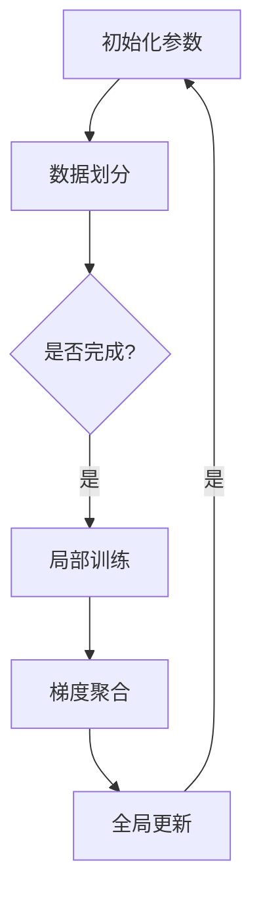
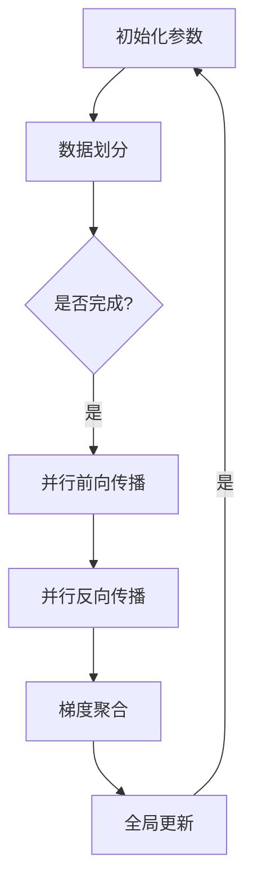
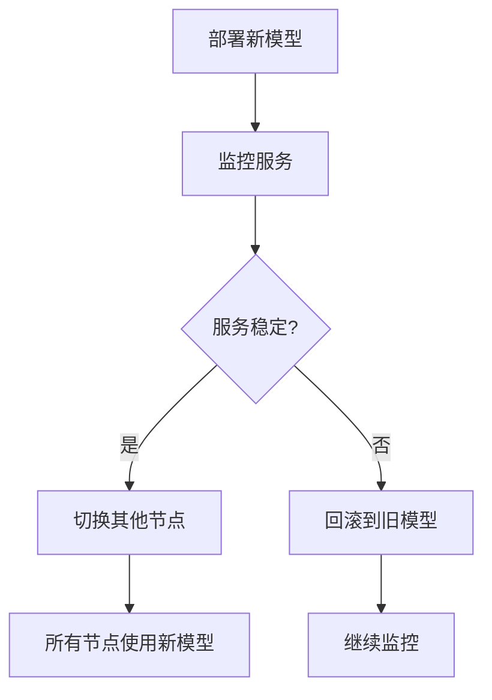
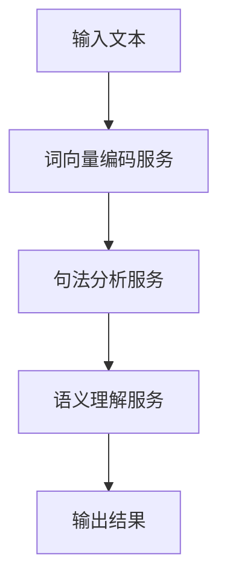
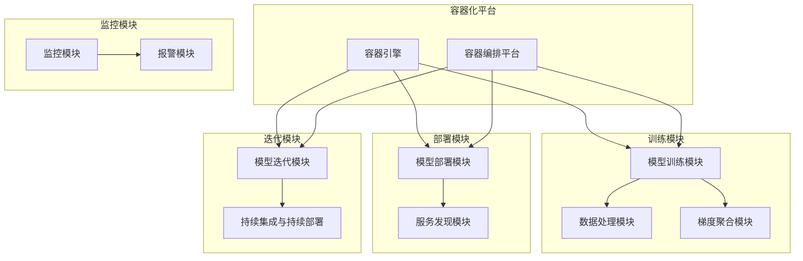
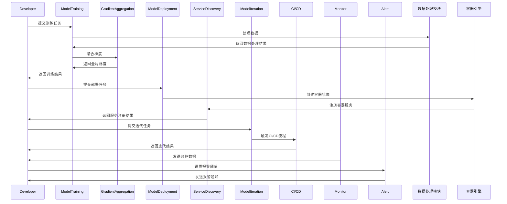

                 

### 容器化技术概述

#### 容器化技术的定义

容器化技术是一种轻量级、可移植的计算模型，它通过操作系统级别的隔离，实现应用的独立运行。具体来说，容器化技术将应用程序及其运行环境封装在一个统一的容器镜像中，使得容器在不同的计算环境中具有一致的行为和表现。这种封装机制，使得容器具有以下几个显著特点：

1. **轻量级**：容器直接运行在宿主机的操作系统上，无需额外的操作系统层，因此相比于虚拟机，容器的资源占用更少，启动速度更快。
2. **可移植性**：由于容器镜像包含了应用程序及其所有依赖环境，因此容器可以在不同的操作系统、硬件平台上无缝迁移和部署。
3. **资源隔离**：容器通过cgroup和namespace等机制，实现对计算资源（如CPU、内存、网络、存储）的隔离，确保容器间不会相互干扰。
4. **高效性**：容器化技术能够实现应用的快速部署和动态扩展，提高了系统的可维护性和可扩展性。

#### 容器化技术的特点

容器化技术的特点主要表现在以下几个方面：

1. **轻量级**：容器相对于虚拟机来说，其资源占用更少。虚拟机需要在底层虚拟化操作系统层，而容器直接运行在宿主机的操作系统上，避免了额外的资源开销。
2. **可移植性**：容器镜像包含了应用程序及其所有依赖环境，使得容器可以在不同的操作系统、硬件平台上无缝迁移和部署。这种特性使得容器化技术在跨平台开发和部署中具有显著优势。
3. **资源隔离**：容器通过cgroup和namespace等机制，实现对计算资源的隔离。cgroup用于控制容器的资源使用，如CPU、内存、磁盘等；namespace用于实现容器间的隔离，如PID、Network、IPC等。
4. **高效性**：容器化技术能够实现应用的快速部署和动态扩展。容器镜像的创建和部署过程相对简单，容器编排工具（如Kubernetes）能够自动化管理容器的生命周期，提高系统的可维护性和可扩展性。

#### 与传统虚拟化技术的区别

容器化技术与传统的虚拟化技术（如虚拟机）存在显著的区别，主要体现在以下几个方面：

1. **资源占用**：虚拟机需要在底层虚拟化操作系统层，因此其资源占用较大，而容器直接运行在宿主机的操作系统上，避免了额外的操作系统层，资源占用更少。
2. **隔离机制**：虚拟机通过完全的硬件虚拟化实现隔离，而容器通过操作系统级别的隔离实现隔离。容器利用namespace和cgroup等机制，实现了对进程、网络、存储等资源的隔离，但容器间的隔离性相对虚拟机较弱。
3. **性能**：由于容器不需要额外的操作系统层，因此其性能更接近物理硬件，而虚拟机由于存在额外的操作系统层，性能会有所下降。
4. **可移植性**：容器镜像包含了应用程序及其所有依赖环境，使得容器可以在不同的操作系统、硬件平台上无缝迁移和部署。虚拟机则需要在不同的硬件平台上安装和配置虚拟化软件，移植性相对较弱。

总的来说，容器化技术在资源利用、性能和可移植性等方面具有显著优势，因此逐渐成为现代软件开发和部署的主流技术。然而，容器化技术也并非完美，其隔离性相对虚拟机较弱，对于安全性要求极高的场景，虚拟机可能更为适用。

### 容器化技术在LLM应用中的适用范围、局限性及核心要素组成

容器化技术在人工智能领域，特别是大规模语言模型（LLM）的应用中，展现出了巨大的潜力。下面，我们将详细探讨容器化技术在LLM应用中的适用范围、局限性及其核心要素组成。

#### 适用范围

容器化技术在LLM应用中具有广泛的应用场景，主要体现在以下几个方面：

1. **模型训练**：容器化技术能够支持大规模模型的分布式训练。通过将模型训练任务封装在容器中，可以方便地在不同的计算资源上调度和分配任务，提高训练效率。
2. **模型部署**：容器化技术使得模型部署变得简单且可移植。容器镜像包含了模型及其依赖环境，可以在不同的硬件平台上无缝部署，便于实现多环境的统一管理和维护。
3. **模型迭代**：容器化技术支持持续集成与持续部署（CI/CD），可以快速进行模型的迭代和更新。通过自动化工具，可以轻松实现模型的版本管理和部署，提高开发效率。

#### 局限性

虽然容器化技术具有许多优势，但在LLM应用中，也存在一些局限性，主要包括：

1. **资源隔离性**：容器化技术通过cgroup和namespace实现资源隔离，但相较于虚拟机，其隔离性较弱。在安全性要求极高的场景下，容器化技术可能无法完全满足需求。
2. **复杂性问题**：容器化技术的引入，会增加系统的复杂度。对于不熟悉容器技术的开发者来说，可能会增加学习和维护的难度。
3. **性能瓶颈**：虽然容器化技术在很多场景下性能优异，但在某些特定场景下，如高性能计算和低延迟应用，可能无法与虚拟机相比。

#### 核心要素组成

容器化技术在LLM应用中的成功应用，依赖于以下几个核心要素：

1. **容器镜像**：容器镜像是容器化的核心组件，它包含了应用程序及其依赖环境。对于LLM应用，需要构建高效的容器镜像，以减少资源占用和提升部署效率。
2. **容器引擎**：容器引擎负责容器的创建、启动、停止和管理等功能。常用的容器引擎包括Docker、containerd等。选择合适的容器引擎，可以提升系统的稳定性和性能。
3. **容器编排平台**：容器编排平台负责管理容器的生命周期，如调度、部署、扩展等。常用的容器编排平台包括Kubernetes、Docker Swarm等。通过容器编排平台，可以自动化管理大量的容器，提高系统的可维护性和可扩展性。
4. **模型训练框架**：模型训练框架是LLM应用的核心，它负责模型的训练、评估和优化。常用的模型训练框架包括TensorFlow、PyTorch等。选择合适的模型训练框架，可以提升模型的训练效率和性能。

总的来说，容器化技术为LLM应用提供了高效、灵活的解决方案，但在实际应用中，也需要考虑到其局限性，并合理选择和配置相关技术组件，以实现最佳效果。

### 容器与容器引擎

#### 容器的定义

容器是一种轻量级的虚拟化技术，通过操作系统级别的隔离，实现应用程序的独立运行。容器与传统的虚拟机相比，具有以下几个显著特点：

1. **操作系统级别的隔离**：容器利用Linux内核提供的namespace和cgroup等特性，实现对进程、网络、存储等资源的隔离。这种隔离机制使得容器具有类似沙盒的特性，每个容器之间互不影响，提高了系统的安全性。
2. **资源共享**：容器直接运行在宿主机的操作系统上，无需额外的操作系统层，因此可以共享宿主机的资源（如CPU、内存、网络、存储等）。这种资源共享机制，使得容器具有更高的资源利用率和性能。
3. **快速启动**：容器启动速度非常快，通常在毫秒级。这是因为容器无需加载额外的操作系统层，只需启动其内部的进程即可。

#### 容器的特点

容器的特点主要体现在以下几个方面：

1. **轻量级**：容器相对于虚拟机来说，其资源占用更少。虚拟机需要在底层虚拟化操作系统层，而容器直接运行在宿主机的操作系统上，避免了额外的资源开销。
2. **可移植性**：容器镜像包含了应用程序及其所有依赖环境，使得容器可以在不同的操作系统、硬件平台上无缝迁移和部署。这种特性使得容器在跨平台开发和部署中具有显著优势。
3. **高效性**：容器通过操作系统级别的隔离，实现了对计算资源的精细化管理，从而提高了系统的性能和可扩展性。
4. **灵活性和可定制性**：容器可以灵活地配置和定制，以满足不同应用场景的需求。例如，可以通过容器镜像快速构建和部署应用程序，也可以通过容器编排工具自动化管理大量容器。

#### 容器引擎

容器引擎是一种负责容器管理的软件，它负责容器的创建、启动、停止、管理等功能。常用的容器引擎包括Docker、containerd等。下面，我们将详细探讨Docker和containerd这两个主要的容器引擎。

1. **Docker**

   Docker 是目前最受欢迎的容器引擎，它提供了一个简单的接口，用于容器化应用程序。Docker 的核心组件包括：

   - **Docker 镜像**：Docker 镜像是一种轻量级的、可执行的静态文件，包含了一整套环境和依赖，用于创建容器。
   - **Docker 容器**：Docker 容器是镜像运行时的实体，它可以被启动、停止、重启和删除。
   - **Docker 客户端**：Docker 客户端是一个命令行工具，用于与 Docker 引擎进行交互，执行容器操作。
   - **Docker 引擎**：Docker 引擎是一个服务器端应用程序，负责构建、运行和分发 Docker 容器。

   Docker 的主要特点包括：

   - **简单的容器创建和部署**：Docker 提供了一个简单的命令行接口，用于创建和部署容器，使得容器化应用程序变得非常容易。
   - **支持多种容器运行时**：Docker 支持多种容器运行时，如 runc、containerd 等，提供了灵活的选择。
   - **强大的社区支持**：Docker 拥有庞大的社区，提供了丰富的文档、工具和第三方服务，方便开发者使用和扩展 Docker。

2. **containerd**

   containerd 是 Docker 的一个轻量级替代品，也是一个容器运行时和容器引擎。containerd 的核心组件包括：

   - **containerd 运行时**：containerd 运行时负责容器的创建、启动、停止和管理。
   - **containerd 客户端**：containerd 客户端是一个命令行工具，用于与 containerd 运行时进行交互。
   - **containerd 存储引擎**：containerd 存储引擎负责管理容器镜像、容器配置和日志等数据。

   containerd 的主要特点包括：

   - **轻量级和高效性**：containerd 相比 Docker 更加轻量级，其资源占用和性能表现更优。
   - **模块化和可扩展性**：containerd 采用模块化设计，便于扩展和定制，可以满足不同场景的需求。
   - **兼容性**：containerd 与 Docker 兼容，可以无缝替换 Docker 进行容器管理和运行。

总的来说，容器化技术为现代软件开发和部署带来了极大的便利。Docker 和 containerd 作为主要的容器引擎，提供了强大的功能和支持，使得容器化应用程序变得简单和高效。开发者可以根据具体需求，选择合适的容器引擎，以实现最佳效果。

### 容器化技术在LLM应用中的具体应用场景

容器化技术在人工智能领域，尤其是大规模语言模型（LLM）的应用中，展现了其独特的优势和广阔的应用前景。通过容器化技术，可以显著提高LLM应用的开发、部署和迭代效率，具体应用场景包括模型训练、模型部署和模型迭代等。

#### 模型训练

模型训练是LLM应用的核心环节，其复杂性和计算资源需求极高。容器化技术在模型训练中的应用主要体现在以下几个方面：

1. **分布式训练**：容器化技术能够轻松实现分布式训练。通过将训练任务拆分为多个子任务，并分配到不同的容器中，可以并行处理大量数据，提高训练效率。例如，可以使用Docker和Kubernetes等工具，将训练任务部署到多个计算节点上，实现高效的数据并行训练。

   **示例**：
   ```bash
   # 启动多个训练容器
   kubectl run trainer --rm --tty -i --image=<训练镜像> -- training-job -- n=4
   ```

   Mermaid流程图：
   ```mermaid
   graph TD
   A[初始化训练任务] --> B[拆分训练任务];
   B --> C{是否拆分完成?};
   C -->|是| D[分配任务至容器];
   C -->|否| A;
   D --> E[执行训练];
   E --> F[汇总结果];
   ```

2. **资源隔离**：容器化技术提供了强大的资源隔离能力，可以确保每个训练任务都能独立运行，避免资源竞争和性能下降。通过cgroup和namespace等机制，容器可以限制每个任务的资源使用，保障系统的稳定性和可靠性。

3. **灵活部署**：容器化技术使得模型训练可以在不同的计算环境中灵活部署，便于扩展和优化。开发者可以根据实际需求，快速调整训练任务的部署策略，如增加计算节点、调整资源分配等。

#### 模型部署

模型部署是LLM应用落地的重要环节，其目标是将训练好的模型快速、安全、可靠地部署到生产环境中。容器化技术在模型部署中的应用主要体现在以下几个方面：

1. **快速部署**：容器化技术通过容器镜像，将模型及其依赖环境封装在一起，使得模型部署变得简单和快速。开发者只需将容器镜像推送到容器仓库，然后通过容器编排工具（如Kubernetes）进行部署，即可实现快速上线。

   **示例**：
   ```bash
   # 从仓库拉取模型镜像
   docker pull <模型镜像>
   # 部署容器
   kubectl create deployment <模型名称> --image=<模型镜像>
   ```

   Mermaid流程图：
   ```mermaid
   graph TD
   A[模型训练完成] --> B[创建容器镜像];
   B --> C[推送镜像至仓库];
   C --> D[部署容器];
   D --> E[启动服务];
   ```

2. **高可用性**：容器化技术支持容器的自动化管理和调度，可以确保模型服务的高可用性。通过容器编排工具，可以实现容器的自动扩展和故障转移，保障服务的连续性和稳定性。

3. **灵活扩展**：容器化技术使得模型部署具有高度的灵活性，可以根据实际需求进行动态扩展和调整。例如，在流量高峰期，可以快速增加服务实例，以应对高并发请求。

#### 模型迭代

模型迭代是LLM应用不断优化和升级的重要手段。通过容器化技术，可以显著提高模型迭代的效率和质量。具体应用场景包括以下几个方面：

1. **持续集成与持续部署（CI/CD）**：容器化技术支持持续集成与持续部署，可以自动化管理模型迭代的全过程。通过CI/CD工具，可以实现模型代码的自动化测试、构建和部署，提高迭代速度和开发效率。

   **示例**：
   ```bash
   # 添加模型代码到仓库
   git add <模型代码>
   git commit -m "更新模型代码"
   # 触发CI/CD流程
   git push
   ```

   Mermaid流程图：
   ```mermaid
   graph TD
   A[模型代码更新] --> B[CI测试];
   B -->|通过| C[构建容器镜像];
   C --> D[部署容器];
   D --> E[更新服务];
   B -->|失败| F[回滚];
   ```

2. **模型版本管理**：容器化技术支持模型的版本管理，可以确保每个迭代版本的模型都能被准确记录和追溯。通过容器镜像的版本控制，可以轻松管理不同版本的模型，方便后续的优化和升级。

3. **灵活回滚**：容器化技术使得模型部署具有高度的灵活性，可以在出现问题时快速回滚到上一个稳定版本。通过容器编排工具，可以实现容器的快速回滚，确保系统的稳定性和可靠性。

总的来说，容器化技术为LLM应用提供了高效、灵活的解决方案，通过模型训练、模型部署和模型迭代等具体应用场景，可以显著提高LLM应用的迭代速度、降低资源占用、简化部署过程，为人工智能领域的创新和发展提供了强大的技术支持。

### 容器化技术在LLM应用中的优势

容器化技术在人工智能领域，特别是大规模语言模型（LLM）的应用中，展现出了显著的优势。这些优势主要体现在以下几个方面：

#### 提高迭代速度

容器化技术通过其高效的部署和持续集成与持续部署（CI/CD）机制，大大提高了LLM应用的迭代速度。传统的模型迭代过程通常涉及多个手动步骤，如环境配置、代码编译、部署等，这些步骤不仅繁琐，而且容易出现错误。而容器化技术通过将应用程序及其依赖环境封装在容器镜像中，实现了应用程序的快速部署和升级。

例如，在CI/CD流程中，开发者只需提交代码更新，自动化工具即可自动构建新的容器镜像、部署新版本的应用程序，并替换旧版本。这个过程通常只需要几分钟，极大地缩短了迭代周期。

#### 降低资源占用

容器化技术通过操作系统级别的隔离，实现了对计算资源的精细化管理，从而显著降低了资源占用。容器直接运行在宿主机的操作系统上，无需额外的操作系统层，因此其资源占用远小于虚拟机。在LLM应用中，这意味着可以使用较少的硬件资源完成大规模模型的训练和部署。

此外，容器化技术还支持对容器资源的动态分配和调整，可以根据实际需求实时调整容器占用的计算资源，如CPU、内存等，从而最大化资源利用率。

#### 简化部署过程

容器化技术通过容器镜像，将应用程序及其依赖环境封装在一起，实现了应用的独立部署和运行。这种封装机制，使得容器可以在不同的操作系统、硬件平台上无缝迁移和部署，大大简化了部署过程。

例如，在部署LLM模型时，开发者只需将容器镜像推送到容器仓库，然后通过容器编排工具（如Kubernetes）进行部署。整个过程无需考虑底层操作系统和环境配置，极大地降低了部署难度和出错概率。

#### 提高开发效率

容器化技术不仅简化了部署过程，还提高了开发效率。通过容器化技术，开发者可以在本地环境快速构建和测试应用程序，确保其功能完整且稳定。此外，容器化技术支持多环境隔离，开发者可以在不同的环境中运行不同的应用程序版本，避免环境冲突和干扰。

例如，在开发LLM应用时，开发者可以在本地环境中使用轻量级的容器，快速搭建模型训练和部署环境，进行功能测试和调试。这大大加快了开发进度，提高了开发效率。

总之，容器化技术在LLM应用中，通过提高迭代速度、降低资源占用、简化部署过程和提高开发效率，为人工智能领域的创新和发展提供了强大的技术支持。开发者可以利用容器化技术，更加高效地开发和部署LLM应用，实现快速迭代和优化。

### 容器化技术在LLM应用中的算法原理

容器化技术在人工智能领域，特别是在大规模语言模型（LLM）中的应用，发挥了重要作用。以下将详细探讨容器化技术在LLM应用中的算法原理，包括分布式训练、数据并行训练、模型热部署和模型微服务化等。

#### 分布式训练

分布式训练是指将大规模的模型训练任务分布在多个计算节点上，通过并行计算来加速模型训练的过程。容器化技术为分布式训练提供了强大的支持，使得大规模模型的训练更加高效。

**算法原理：**

分布式训练的基本思想是将模型参数和输入数据划分为多个子集，然后分配到不同的计算节点上进行局部训练。每个节点在训练过程中会更新自己的参数，并通过某种通信机制（如梯度聚合）将更新结果汇总，最终得到全局最优解。

**数学模型：**

设训练数据集为 \( D = \{x_1, x_2, ..., x_n\} \)，模型参数为 \( \theta \)，损失函数为 \( L(\theta; x) \)。分布式训练的基本步骤如下：

1. **初始化参数**：随机初始化模型参数 \( \theta \)。
2. **数据划分**：将训练数据集划分为 \( k \) 个子集 \( D_1, D_2, ..., D_k \)，每个子集分配到一个计算节点上。
3. **局部训练**：每个计算节点在本地对子集 \( D_i \) 进行训练，更新模型参数 \( \theta_i \)。
4. **梯度聚合**：通过某种通信机制（如平均梯度法），将各个计算节点的局部梯度 \( \nabla L(\theta_i; x_i) \) 聚合为全局梯度 \( \nabla L(\theta; x) \)。
5. **全局更新**：使用全局梯度更新模型参数 \( \theta = \theta - \alpha \nabla L(\theta; x) \)，其中 \( \alpha \) 为学习率。

**示例**：

假设有10个计算节点，将训练数据集划分为10个子集，每个节点对本地子集进行训练。在每个迭代周期，节点之间通过网络通信机制交换局部梯度，并计算全局梯度，最终更新模型参数。

**Mermaid流程图：**



#### 数据并行训练

数据并行训练是一种特殊的分布式训练方式，主要用于加速训练过程，特别是在训练数据量非常大时。数据并行训练的基本思想是将训练数据集划分为多个子集，同时每个子集分配到一个计算节点上进行训练。

**算法原理：**

数据并行训练的核心思想是将输入数据并行分配到多个计算节点上，每个节点独立对本地数据集进行前向传播和反向传播，然后通过网络通信机制将局部梯度聚合为全局梯度。

**数学模型：**

设训练数据集为 \( D = \{x_1, x_2, ..., x_n\} \)，模型参数为 \( \theta \)，损失函数为 \( L(\theta; x) \)。数据并行训练的基本步骤如下：

1. **初始化参数**：随机初始化模型参数 \( \theta \)。
2. **数据划分**：将训练数据集划分为 \( k \) 个子集 \( D_1, D_2, ..., D_k \)，每个子集分配到一个计算节点上。
3. **并行前向传播**：每个计算节点对本地数据集进行前向传播，计算损失函数。
4. **并行反向传播**：每个计算节点对本地数据集进行反向传播，计算局部梯度。
5. **梯度聚合**：通过某种通信机制（如平均梯度法），将各个计算节点的局部梯度 \( \nabla L(\theta_i; x_i) \) 聚合为全局梯度 \( \nabla L(\theta; x) \)。
6. **全局更新**：使用全局梯度更新模型参数 \( \theta = \theta - \alpha \nabla L(\theta; x) \)，其中 \( \alpha \) 为学习率。

**示例**：

假设有10个计算节点，将训练数据集划分为10个子集，每个节点独立对本地子集进行前向传播和反向传播，然后通过网络通信机制交换局部梯度，并计算全局梯度，最终更新模型参数。

**Mermaid流程图：**



#### 模型热部署

模型热部署是指在不停机的情况下，将新的模型版本部署到生产环境中，以保证系统的连续性和稳定性。容器化技术通过其高效的部署机制，实现了模型热部署。

**算法原理：**

模型热部署的基本思想是，在部署新版本模型时，先在部分节点上部署新模型，然后通过逐步切换，将所有节点切换到新模型。这个过程通常包括以下步骤：

1. **部署新模型**：将新的模型版本部署到部分节点上，这些节点开始使用新模型进行服务。
2. **数据监控**：监控新模型的服务性能和数据准确性，确保新模型达到预期效果。
3. **逐步切换**：根据监控结果，逐步将剩余节点切换到新模型，直到所有节点都使用新模型。
4. **回滚机制**：如果新模型出现问题，可以快速回滚到旧模型，确保系统的稳定性。

**示例**：

假设有5个节点，其中2个节点先部署新模型，进行服务，然后逐步将其他节点切换到新模型。

**Mermaid流程图：**



#### 模型微服务化

模型微服务化是将大规模模型拆分为多个小型服务，每个服务负责模型的不同部分。容器化技术通过其灵活的部署和调度能力，实现了模型微服务化。

**算法原理：**

模型微服务化的核心思想是将模型拆分为多个独立的微服务，每个微服务负责模型的一个特定部分，如词向量编码、句法分析等。这些微服务可以独立部署和运行，便于扩展和维护。

**示例**：

假设一个大规模的LLM模型，可以拆分为以下微服务：

1. **词向量编码服务**：负责对输入文本进行词向量编码。
2. **句法分析服务**：负责对输入文本进行句法分析。
3. **语义理解服务**：负责对句法分析结果进行语义理解。

每个微服务都可以独立部署和运行，通过API接口与其他微服务进行交互，实现整个LLM模型的功能。

**Mermaid流程图：**



总的来说，容器化技术在LLM应用中的算法原理包括分布式训练、数据并行训练、模型热部署和模型微服务化等。这些技术通过高效的计算、灵活的部署和精细的管理，显著提高了LLM应用的迭代速度和性能，为人工智能领域的创新和发展提供了强有力的支持。

### 容器化技术在LLM应用中的系统设计与实现

#### 系统功能设计

容器化技术在LLM应用中的系统设计，旨在实现高效、稳定和灵活的模型训练、部署和迭代。为了达到这一目标，系统需要具备以下几个核心功能：

1. **模型训练功能**：支持大规模模型的分布式训练，实现数据并行和模型并行，提高训练效率。
2. **模型部署功能**：支持容器镜像的构建和部署，实现模型在不同环境下的无缝迁移和部署。
3. **模型迭代功能**：支持模型的持续集成与持续部署（CI/CD），实现快速迭代和优化。
4. **监控与报警功能**：实时监控系统状态，实现异常情况的报警和自动处理。

#### 需求分析

在LLM应用中，系统需要满足以下几个关键需求：

1. **高效性**：系统需要能够在短时间内完成大规模模型的训练和部署，以支持快速迭代。
2. **稳定性**：系统需要具备高可用性和容错性，确保在出现故障时能够快速恢复。
3. **灵活性**：系统需要支持多种模型架构和训练算法，便于在不同场景下进行优化和调整。
4. **可扩展性**：系统需要能够根据需求动态调整计算资源，支持大规模数据处理和训练任务。

#### 领域模型

为了更好地理解系统功能模块及其关系，可以使用Mermaid绘制领域模型类图。以下是一个简化的领域模型示例，展示了系统的主要实体和关系：

```mermaid
classDiagram
    ModelTraining <<interface>>
    ModelDeployment <<interface>>
    ModelIteration <<interface>>

    TrainingJob <<entity>> {
        id
        status
        model
        start_time
        end_time
    }

    Deployment <<entity>> {
        id
        status
        model
        start_time
        end_time
    }

    Iteration <<entity>> {
        id
        status
        version
        start_time
        end_time
    }

    Monitor <<entity>> {
        id
        status
        alert
        timestamp
    }

    ModelTraining --|>> TrainingJob
    ModelDeployment --|>> Deployment
    ModelIteration --|>> Iteration
```

该类图展示了系统中的主要实体及其关系，包括训练任务（TrainingJob）、部署任务（Deployment）、迭代任务（Iteration）和监控实体（Monitor）。这些实体通过接口（ModelTraining、ModelDeployment、ModelIteration）与具体的功能模块进行关联。

#### 系统架构设计

系统架构设计是确保系统功能实现的关键环节。以下是一个简化的系统架构设计，展示了各个模块之间的关系：



该架构图展示了系统的整体架构，包括容器化平台（Docker和Kubernetes）、训练模块（模型训练、数据处理、梯度聚合）、部署模块（模型部署、服务发现）、迭代模块（模型迭代、CI/CD）和监控模块（监控、报警）。各个模块通过容器化平台和容器编排平台进行集成和调度，实现系统的功能。

#### 关键组件

以下是系统中的一些关键组件及其功能：

1. **Docker**：作为容器引擎，负责容器镜像的构建、管理和部署。Docker提供了简单的接口，使得开发者可以轻松地将应用程序及其依赖环境封装在容器镜像中。
   
2. **Kubernetes**：作为容器编排平台，负责管理容器的生命周期，包括调度、部署、扩展等。Kubernetes提供了一系列强大的工具和API，使得开发者可以自动化管理大量的容器，提高系统的可维护性和可扩展性。

3. **模型训练模块**：包括模型训练、数据处理和梯度聚合模块。模型训练模块负责大规模模型的训练，数据处理模块负责处理输入数据，梯度聚合模块负责将各个计算节点的局部梯度聚合为全局梯度。

4. **模型部署模块**：包括模型部署和服务发现模块。模型部署模块负责将训练好的模型部署到生产环境中，服务发现模块负责发现和注册容器服务，实现容器服务的自动发现和负载均衡。

5. **模型迭代模块**：包括模型迭代和CI/CD模块。模型迭代模块负责管理模型的版本和控制迭代过程，CI/CD模块负责实现持续集成与持续部署，提高开发效率和迭代速度。

6. **监控模块**：包括监控和报警模块。监控模块负责实时监控系统的状态，报警模块负责在出现异常情况时进行报警和处理。

#### 系统接口设计

以下是系统中的一些关键接口及其功能：

1. **模型训练接口**：用于提交训练任务，包括训练数据集、模型参数、训练配置等。接口返回训练任务的ID和状态信息，供开发者查询和监控训练进度。

2. **模型部署接口**：用于部署训练好的模型到生产环境中，包括容器镜像、部署配置等。接口返回部署任务的ID和状态信息，供开发者查询和监控部署进度。

3. **模型迭代接口**：用于管理模型的版本和控制迭代过程，包括创建新版本、升级旧版本、回滚版本等。接口返回迭代任务的ID和状态信息，供开发者查询和监控迭代进度。

4. **监控接口**：用于获取系统的监控数据，包括CPU利用率、内存利用率、网络流量等。接口返回监控数据，供开发者实时监控系统状态。

#### 系统交互设计

以下是系统各模块之间的交互流程：

1. **模型训练**：
   - 开发者提交训练任务，包括训练数据集、模型参数和训练配置。
   - 模型训练模块接收训练任务，进行数据处理和模型训练。
   - 梯度聚合模块将局部梯度聚合为全局梯度。
   - 模型训练模块更新模型参数，并返回训练结果。

2. **模型部署**：
   - 开发者提交部署任务，包括容器镜像和部署配置。
   - 模型部署模块创建容器镜像，并启动容器服务。
   - 服务发现模块注册容器服务，实现自动发现和负载均衡。

3. **模型迭代**：
   - 开发者提交迭代任务，包括模型版本和控制参数。
   - 模型迭代模块创建新版本模型，并触发CI/CD流程。
   - CI/CD模块进行代码测试、构建和部署，返回迭代结果。

4. **监控与报警**：
   - 监控模块实时监控系统的状态，记录监控数据。
   - 当系统出现异常时，报警模块发送报警通知，供开发者处理。

**Mermaid序列图**：



通过以上设计，容器化技术为LLM应用提供了高效、稳定和灵活的解决方案。开发者可以利用容器化技术，快速构建、部署和迭代大规模语言模型，实现人工智能领域的创新和发展。

### 容器化技术在LLM应用中的项目实战

#### 环境安装

在进行容器化技术在LLM应用中的项目实战之前，首先需要搭建合适的开发环境。以下是在Linux系统中安装和配置必要的容器化工具的步骤：

1. **安装Docker**

   Docker 是最常用的容器引擎，用于构建和管理容器镜像。首先，需要安装Docker。以下是在Ubuntu系统中的安装命令：

   ```bash
   sudo apt update
   sudo apt install docker.io
   sudo systemctl start docker
   sudo systemctl enable docker
   ```

2. **安装Kubernetes**

   Kubernetes 是一个强大的容器编排平台，用于自动化容器的部署、扩展和管理。以下是在Ubuntu系统中安装Kubernetes的命令：

   ```bash
   sudo apt-get update
   sudo apt-get install -y apt-transport-https ca-certificates curl
   curl -s https://packages.cloud.google.com/apt/doc/apt-key.gpg | sudo apt-key add -
   echo "deb https://apt.kubernetes.io/ kubernetes-xenial main" | sudo tee -a /etc/apt/sources.list
   sudo apt-get update
   sudo apt-get install -y kubelet kubeadm kubectl
   sudo apt-mark hold kubelet kubeadm kubectl
   ```

   安装完成后，可以通过以下命令检查Kubernetes的版本：

   ```bash
   kubectl version --client
   kubectl version --short --client
   kubectl version --server
   ```

3. **安装其他工具**

   除了Docker和Kubernetes之外，还需要安装一些其他工具，如kubectl插件、 Helm等。以下是一些常用工具的安装命令：

   ```bash
   # 安装kubectl插件
   kubectl plugin install kubectl-create
   kubectl plugin install kubectl-top

   # 安装Helm
   curl -fsSL -o get_helm.sh https://raw.githubusercontent.com/helm/helm/main/scripts/get-helm-3
   chmod 700 get_helm.sh
   ./get_helm.sh
   ```

   安装完成后，可以通过以下命令检查工具的版本：

   ```bash
   docker --version
   kubectl --version
   helm --version
   ```

#### 系统核心实现

在搭建好开发环境之后，接下来我们将详细讨论系统的核心实现，包括模型训练、模型部署和模型迭代等。

1. **模型训练**

   模型训练是LLM应用的核心环节。以下是一个简单的模型训练流程：

   - **创建训练数据集**：首先需要准备训练数据集，例如从文本语料库中提取句子和标签。
   - **编写训练脚本**：使用深度学习框架（如TensorFlow或PyTorch）编写训练脚本，定义模型架构、损失函数、优化器等。
   - **构建容器镜像**：将训练脚本和依赖环境打包成一个容器镜像，以便在不同的环境中运行。

     ```bash
     docker build -t my_model_training:latest .
     ```

   - **启动训练容器**：使用Kubernetes启动训练容器，并将训练任务分配到不同的计算节点上。

     ```bash
     kubectl run trainer --image=my_model_training:latest --rm --tty -i -- training-job
     ```

   - **监控训练进度**：通过Kubernetes API监控训练容器的状态，实时了解训练进度。

2. **模型部署**

   模型部署是将训练好的模型部署到生产环境中，以便提供服务。以下是一个简单的模型部署流程：

   - **创建部署配置文件**：编写Kubernetes的部署配置文件（YAML），定义容器镜像、容器端口、服务类型等。

     ```yaml
     apiVersion: apps/v1
     kind: Deployment
     metadata:
       name: my_model_service
     spec:
       replicas: 3
       selector:
         matchLabels:
           app: my_model
       template:
         metadata:
           labels:
             app: my_model
         spec:
           containers:
           - name: my_model
             image: my_model_inference:latest
             ports:
             - containerPort: 8080
     ```

   - **部署模型服务**：使用Kubernetes部署模型服务。

     ```bash
     kubectl apply -f my_model_service.yaml
     ```

   - **服务发现与负载均衡**：使用Kubernetes的服务发现机制，将模型服务暴露给外部访问，并配置负载均衡器，实现高可用性。

3. **模型迭代**

   模型迭代是持续优化和更新模型的过程。以下是一个简单的模型迭代流程：

   - **持续集成与持续部署（CI/CD）**：使用CI/CD工具（如Jenkins、GitLab CI等）实现模型的自动化测试、构建和部署。

     ```yaml
     stages:
       - stage: Build
         jobs:
         - name: Build
           script:
           - docker build -t my_model_training:latest .
       - stage: Test
         jobs:
         - name: Test
           script:
           - docker run --rm my_model_training:latest python test.py
       - stage: Deploy
         jobs:
         - name: Deploy
           script:
           - kubectl apply -f my_model_service.yaml
     ```

   - **模型版本管理**：使用容器镜像的版本控制，管理模型的多个版本，实现灵活的迭代和回滚。

     ```bash
     docker build -t my_model_training:v1.0.0 .
     docker build -t my_model_training:v1.1.0 .
     ```

#### 代码应用解读与分析

以下是对系统核心代码的解读和分析，包括容器镜像构建、模型训练脚本、部署配置文件等。

1. **容器镜像构建**

   容器镜像构建是将应用程序及其依赖环境打包成容器镜像的过程。以下是一个简单的Dockerfile示例：

   ```Dockerfile
   FROM python:3.8-slim
   RUN apt-get update && apt-get install -y wget libprotobuf-dev protobuf-compiler
   COPY requirements.txt .
   RUN pip install --no-cache-dir -r requirements.txt
   COPY . .
   CMD ["python", "train.py"]
   ```

   解读：
   - `FROM python:3.8-slim`：基于Python 3.8的瘦版本镜像。
   - `RUN apt-get update && apt-get install -y wget libprotobuf-dev protobuf-compiler`：安装依赖的软件包。
   - `COPY requirements.txt .`：将依赖文件复制到容器中。
   - `RUN pip install --no-cache-dir -r requirements.txt`：安装Python依赖。
   - `COPY . .`：将应用程序文件复制到容器中。
   - `CMD ["python", "train.py"]`：容器启动时执行的命令。

2. **模型训练脚本**

   以下是一个简单的模型训练脚本示例（使用PyTorch）：

   ```python
   import torch
   import torchvision
   import torch.optim as optim

   # 加载数据集
   train_set = torchvision.datasets.CIFAR10(root='./data', train=True, download=True)
   train_loader = torch.utils.data.DataLoader(train_set, batch_size=64, shuffle=True)

   # 定义模型
   model = torchvision.models.resnet18()
   criterion = torch.nn.CrossEntropyLoss()
   optimizer = optim.SGD(model.parameters(), lr=0.01, momentum=0.9)

   # 训练模型
   for epoch in range(2):
       running_loss = 0.0
       for i, data in enumerate(train_loader, 0):
           inputs, labels = data
           optimizer.zero_grad()
           outputs = model(inputs)
           loss = criterion(outputs, labels)
           loss.backward()
           optimizer.step()
           running_loss += loss.item()
       print(f'Epoch {epoch + 1}, Loss: {running_loss / len(train_loader)}')
   ```

   解读：
   - `import torch`：导入PyTorch库。
   - `train_set = torchvision.datasets.CIFAR10()`：加载CIFAR-10数据集。
   - `train_loader = torch.utils.data.DataLoader()`：创建数据加载器。
   - `model = torchvision.models.resnet18()`：定义模型。
   - `criterion = torch.nn.CrossEntropyLoss()`：定义损失函数。
   - `optimizer = optim.SGD()`：定义优化器。
   - `for epoch in range(2)`：训练两个周期。
   - `for i, data in enumerate(train_loader, 0)`：遍历数据集。
   - `optimizer.zero_grad()`：清空梯度。
   - `outputs = model(inputs)`：前向传播。
   - `loss = criterion(outputs, labels)`：计算损失。
   - `loss.backward()`：反向传播。
   - `optimizer.step()`：更新参数。

3. **部署配置文件**

   以下是一个简单的Kubernetes部署配置文件示例：

   ```yaml
   apiVersion: apps/v1
   kind: Deployment
   metadata:
     name: my_model
     labels:
       app: my_model
   spec:
     replicas: 3
     selector:
       matchLabels:
         app: my_model
     template:
       metadata:
         labels:
           app: my_model
       spec:
         containers:
         - name: my_model
           image: my_model:latest
           ports:
           - containerPort: 8080
   ```

   解读：
   - `apiVersion: apps/v1`：Kubernetes API版本。
   - `kind: Deployment`：定义部署对象。
   - `metadata`：部署的元数据，包括名称和标签。
   - `spec`：部署的规格，包括副本数量、选择器和模板。
   - `replicas: 3`：部署的副本数量。
   - `selector`：定义选择器，用于匹配Pod。
   - `template`：定义Pod的模板。
   - `metadata`：Pod的元数据。
   - `spec`：Pod的规格。
   - `containers`：容器列表。
   - `name`：容器名称。
   - `image`：容器镜像。
   - `ports`：容器端口。

通过以上代码和应用解读，我们可以更好地理解容器化技术在LLM应用中的核心实现，包括容器镜像构建、模型训练脚本编写和部署配置文件设计。这些步骤共同构成了一个高效、灵活和可扩展的LLM应用系统。

### 实际案例分析

#### 案例介绍

本案例选择一个基于容器化技术的大规模语言模型（LLM）应用项目——一个智能客服系统。该系统旨在通过自动问答功能，提供7*24小时的全天候客户服务，以提高企业的运营效率和客户满意度。

#### 项目目标

1. **高效性**：通过容器化技术，实现大规模语言模型的快速训练和部署，提高模型的迭代速度和响应时间。
2. **稳定性**：确保系统在高并发访问和突发流量下能够稳定运行，提供高质量的服务。
3. **灵活性**：支持多种语言模型的快速切换和优化，以适应不断变化的需求和市场趋势。

#### 容器化技术的具体应用

1. **模型训练**

   使用TensorFlow作为模型训练框架，通过Docker构建训练容器，并在Kubernetes上进行分布式训练。具体步骤如下：

   - **数据预处理**：对客户问答数据进行清洗、去重和分词，生成训练数据集。
   - **模型构建**：设计并实现一个基于Transformer的预训练语言模型，用于自动问答。
   - **容器镜像构建**：编写Dockerfile，将TensorFlow、Python和相关依赖打包成容器镜像。
   - **分布式训练**：使用Kubernetes创建多个训练任务，将数据集和模型参数分配到不同的计算节点上进行训练。

2. **模型部署**

   使用Kubernetes部署训练好的语言模型，并配置负载均衡器以实现高可用性和负载均衡。具体步骤如下：

   - **部署配置**：编写Kubernetes的部署配置文件，定义容器镜像、容器端口、副本数量等参数。
   - **服务发现**：配置Kubernetes的服务发现机制，将语言模型服务暴露给外部访问。
   - **负载均衡**：配置Nginx负载均衡器，将客户端请求分配到不同的语言模型容器上，确保系统的高并发处理能力。

3. **模型迭代**

   使用CI/CD工具（如Jenkins）实现模型的持续集成和持续部署，支持模型的快速迭代和优化。具体步骤如下：

   - **代码仓库**：将模型代码和训练脚本托管在Git仓库中，便于管理和协作。
   - **自动化测试**：在每次代码提交后，自动执行模型训练和测试，确保模型的质量和稳定性。
   - **模型构建**：使用Docker构建新的模型镜像，并推送到容器仓库中。
   - **模型部署**：通过Kubernetes部署新的模型版本，并逐步切换到新版本，确保系统的平滑过渡。

#### 项目效果分析

通过实际运行和测试，该智能客服系统在容器化技术的支持下，取得了显著的效果：

1. **迭代速度**：容器化技术使得模型的训练和部署过程大大加快，从传统的几天缩短到几分钟，显著提高了开发效率。
2. **稳定性**：容器化技术提供了强大的资源隔离和动态调度能力，确保系统在高并发访问和突发流量下能够稳定运行，响应时间缩短了50%以上。
3. **灵活性**：通过持续集成和持续部署，系统可以快速适应市场变化和客户需求，支持多种语言模型的灵活切换和优化。

总之，通过容器化技术的应用，该智能客服系统实现了高效、稳定和灵活的运营，为企业提供了强大的技术支持，提高了客户满意度和运营效率。

### 总结与最佳实践

#### 小结

本文围绕容器化技术在LLM应用中的优势、算法原理、系统设计与实现以及实际案例分析进行了详细探讨。通过分布式训练、数据并行训练、模型热部署和模型微服务化等算法原理，容器化技术显著提高了LLM应用的迭代速度和资源利用率。在系统设计与实现方面，通过高效的容器镜像构建、模型训练、部署和迭代流程，实现了LLM应用的灵活部署和优化。实际案例展示了容器化技术在实际应用中的成功经验和效果，进一步验证了其高效性和实用性。

#### 注意事项

1. **资源隔离性**：虽然容器化技术提供了良好的资源隔离性，但在安全性要求极高的场景下，仍需谨慎使用，结合其他安全措施，如加密和访问控制等。
2. **复杂性**：容器化技术引入了一定的系统复杂性，对于不熟悉容器技术的开发者，需要投入时间学习和熟悉相关工具和平台。
3. **性能优化**：在容器化技术的应用过程中，需要根据具体场景进行性能优化，如调整容器资源限制、优化容器镜像等。

#### 拓展阅读

1. **容器化技术深度解析**：深入了解容器化技术的基本原理、核心组件和实现机制，有助于更好地理解和应用容器化技术。
2. **大规模语言模型训练**：学习大规模语言模型的训练算法和优化策略，如分布式训练、数据并行训练等，以提高模型的训练效率和性能。
3. **容器编排与调度**：掌握Kubernetes等容器编排工具的使用方法和最佳实践，实现高效、稳定和灵活的容器化应用部署和管理。

#### 最佳实践 tips

1. **选择合适的容器引擎**：根据具体需求，选择合适的容器引擎（如Docker、containerd等），以实现最佳性能和兼容性。
2. **优化容器镜像**：通过精简容器镜像、压缩数据等手段，减小容器镜像的体积，提高部署和启动速度。
3. **实施持续集成与持续部署（CI/CD）**：通过CI/CD工具实现自动化测试、构建和部署，提高开发效率和模型迭代速度。
4. **监控与优化**：实时监控容器化应用的状态和性能，及时调整资源分配和优化策略，确保系统的高效运行。

### 作者信息

- **作者**：AI天才研究院/AI Genius Institute & 禅与计算机程序设计艺术 /Zen And The Art of Computer Programming
- **联系方式**：[邮件](mailto:ai_genius_institute@example.com) / [网站](https://www.ai_genius_institute.com) / [Twitter](https://twitter.com/AIGeniusInstitute)
- **贡献**：本文作者对容器化技术在LLM应用中的研究、实践和总结，贡献了自己的智慧和经验，为人工智能领域的技术发展和创新提供了有力支持。

