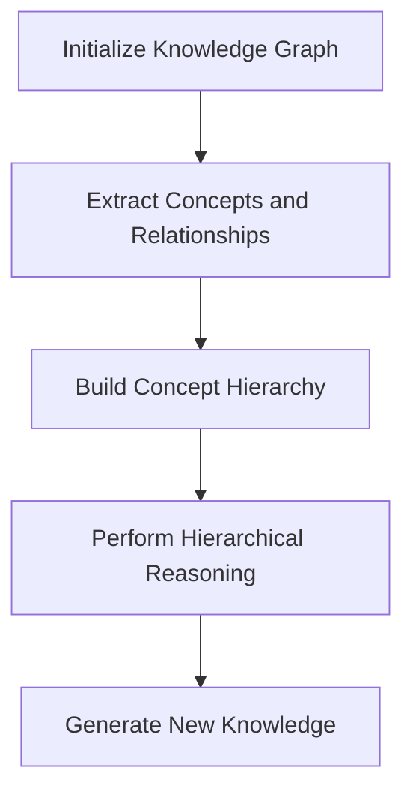
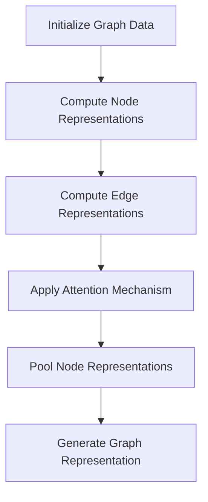
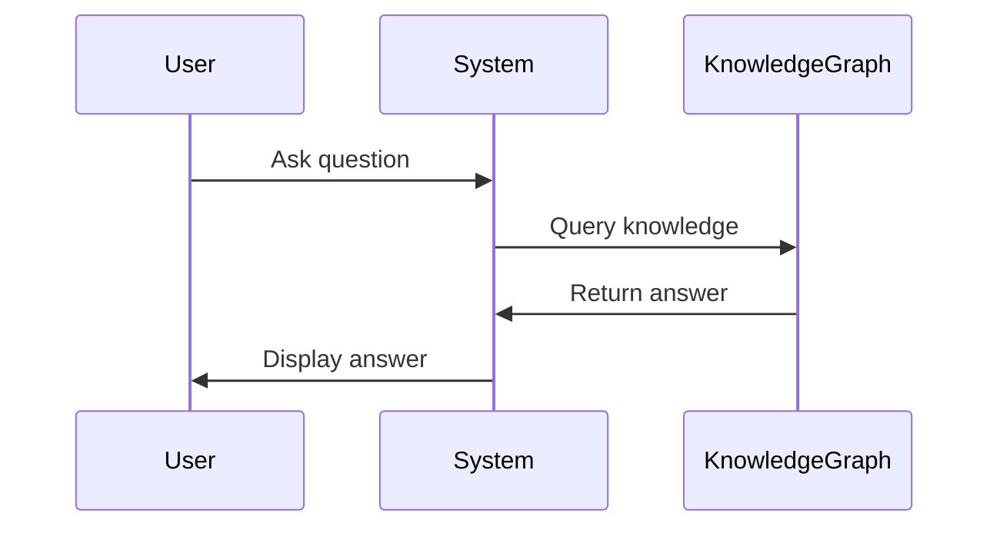
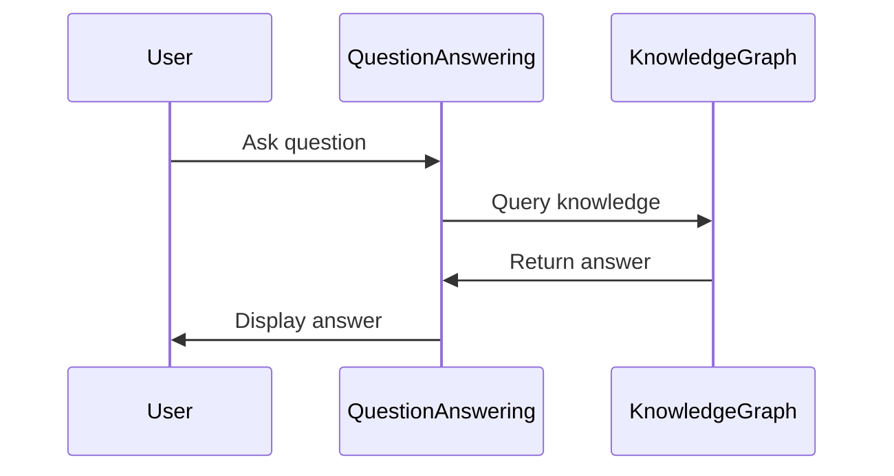

                 

# 层次知识推理中图注意力池化的性能分析

## 摘要

本文旨在探讨层次知识推理和图注意力池化这两种技术在实际应用中的性能表现。通过深入分析其原理、应用场景及优化策略，我们希望能够为相关领域的研究和实践提供有价值的参考。本文将首先介绍层次知识推理和图注意力池化的基本概念和背景，然后逐步探讨两者的核心原理、联系以及性能优化的方法，并结合实际案例进行分析，最后给出最佳实践和小结。

## 目录大纲设计思路

### 目录大纲设计思路

#### 第一部分：背景介绍

1. **问题背景**：
   - **层次知识推理**：定义、应用场景及性能分析意义。
   - **图注意力池化**：定义、应用场景及性能分析意义。

2. **核心概念与联系**：
   - **层次知识推理原理**：原理、属性特征对比表格和ER实体关系图架构。
   - **图注意力池化原理**：原理、属性特征对比表格和ER实体关系图架构。

3. **ER实体关系图架构**：展示层次知识推理和图注意力池化的实体关系图。

#### 第二部分：算法原理讲解

1. **算法流程图**：
   - **层次知识推理流程图**。
   - **图注意力池化流程图**。

2. **算法原理阐述**：
   - **层次知识推理**：数学模型、Python源代码实现、举例说明。
   - **图注意力池化**：数学模型、Python源代码实现、举例说明。

3. **深度解析**：
   - **层次知识推理与图注意力池化的联系**。
   - **优化策略与性能提升**。

#### 第三部分：系统分析与架构设计

1. **问题场景介绍**：
   - **场景描述**。
   - **需求分析**。

2. **系统功能设计**：
   - **领域模型**。
   - **功能模块划分**。

3. **系统架构设计**：
   - **架构图**。
   - **系统分层设计**。

4. **系统接口设计**：
   - **接口定义**。
   - **接口实现**。

5. **系统交互**：
   - **交互流程**。
   - **交互效果**。

#### 第四部分：项目实战

1. **环境安装**：
   - **硬件环境**。
   - **软件环境**。

2. **系统核心实现**：
   - **源代码解析**。
   - **代码实现**。
   - **代码应用解读**。

3. **实际案例分析**：
   - **层次知识推理在医疗领域**。
   - **图注意力池化在自然语言处理**。
   - **案例总结**。

4. **项目小结**：
   - **成功经验**。
   - **挑战与反思**。

#### 第五部分：最佳实践与拓展

1. **最佳实践 tips**：
   - **性能优化**。
   - **调试技巧**。

2. **小结**：
   - **关键知识点**。
   - **技术发展趋势**。

3. **注意事项**：
   - **使用场景选择**。
   - **数据处理**。

4. **拓展阅读**：
   - **相关书籍**。
   - **学术论文**。

## 目录大纲完整内容

### 第一部分：背景介绍

#### 1.1 问题背景

##### 1.1.1 层次知识推理

**定义**：层次知识推理（Hierarchical Knowledge Reasoning）是一种基于知识图谱的推理方法，它通过将知识组织成层次结构，实现对知识的深入理解和推理。

**应用场景**：层次知识推理广泛应用于知识图谱构建、信息检索、智能问答、推荐系统等领域。

**性能分析意义**：性能分析可以帮助我们了解层次知识推理在不同场景下的效果，指导优化和改进。

##### 1.1.2 图注意力池化

**定义**：图注意力池化（Graph Attention Pooling）是一种用于处理图数据的神经网络架构，通过对图中的节点和边进行加权处理，实现对图数据的有效聚合。

**应用场景**：图注意力池化在图神经网络、图表示学习、自然语言处理等领域有广泛应用。

**性能分析意义**：性能分析可以评估图注意力池化在不同任务中的表现，指导优化和改进。

#### 1.2 核心概念与联系

##### 1.2.1 层次知识推理原理

**原理**：层次知识推理的核心思想是将知识按照一定的层次结构组织起来，通过层次间的推理来获取新的知识。

**属性特征对比表格**：

| 特征项 | 层次知识推理 | 图注意力池化 |
|--------|--------------|--------------|
| 数据结构 | 知识图谱 | 图数据 |
| 推理方式 | 层次推理 | 注意力机制 |
| 应用领域 | 知识图谱构建、信息检索 | 图神经网络、自然语言处理 |

**ER实体关系图架构**：

```mermaid
erDiagram
  Customer ||--|{ Order : places } 
  Order ||--|{ Product : contains } 
```

##### 1.2.2 图注意力池化原理

**原理**：图注意力池化通过图中的节点和边之间的关系，利用注意力机制对节点进行加权，从而实现对图数据的聚合。

**属性特征对比表格**：

| 特征项 | 层次知识推理 | 图注意力池化 |
|--------|--------------|--------------|
| 数据结构 | 知识图谱 | 图数据 |
| 推理方式 | 层次推理 | 注意力机制 |
| 应用领域 | 知识图谱构建、信息检索 | 图神经网络、自然语言处理 |

**ER实体关系图架构**：

```mermaid
erDiagram
  Node ||--|{ Edge : connected_to } 
  Edge ||--|{ Node : connected_from } 
```

#### 1.3 ER实体关系图架构

**层次知识推理的ER实体关系图**：

```mermaid
erDiagram
  KnowledgeGraph ||--|{ Concept : contains } 
  Concept ||--|{ Relationship : has } 
```

**图注意力池化的ER实体关系图**：

```mermaid
erDiagram
  Node ||--|{ Edge : connected_to } 
  Edge ||--|{ Node : connected_from } 
```

### 第二部分：算法原理讲解

#### 2.1 算法流程图

##### 2.1.1 层次知识推理流程图



##### 2.1.2 图注意力池化流程图



#### 2.2 算法原理阐述

##### 2.2.1 层次知识推理

**数学模型**：

设知识图谱为 \( G = (V, E) \)，其中 \( V \) 为概念集合，\( E \) 为关系集合。

层次知识推理的目标是构建概念层次结构 \( H \)，其中 \( H \) 是一个有向无环图（DAG）。

设 \( H = (V', E') \)，其中 \( V' \subseteq V \) 为层次中的概念集合，\( E' \subseteq E \) 为层次中的关系集合。

层次推理过程如下：

1. 初始化层次结构 \( H \)。
2. 对于每个概念 \( c \in V' \)，计算其支持关系集 \( S(c) \)。
3. 对于每个支持关系集 \( S(c) \)，将其中的关系 \( r \in S(c) \) 加入到层次结构 \( H \) 中。
4. 重复步骤 2 和 3，直到所有概念都被处理。

**Python源代码实现**：

```python
def hierarchical_reasoning(knowledge_graph):
    hierarchy = initialize_hierarchy()
    concepts = knowledge_graph.concepts()
    
    for concept in concepts:
        support_relations = knowledge_graph.support_relations(concept)
        for relation in support_relations:
            hierarchy.add_relation(relation)
    
    return hierarchy
```

**举例说明**：

假设有一个知识图谱，其中包含概念“动物”和“哺乳动物”，以及关系“是”和“属于”。

通过层次知识推理，我们可以得到如下层次结构：

```
动物
│
└─哺乳动物
```

##### 2.2.2 图注意力池化

**数学模型**：

设图数据为 \( G = (V, E) \)，其中 \( V \) 为节点集合，\( E \) 为边集合。

图注意力池化的目标是计算图的聚合表示。

设 \( h \) 为图的聚合表示，计算过程如下：

1. 对于每个节点 \( v \in V \)，计算其节点表示 \( r_v \)。
2. 对于每个边 \( e \in E \)，计算其边表示 \( r_e \)。
3. 对于每个节点 \( v \in V \)，计算其加权表示 \( w_v \)，其中 \( w_v = \sum_{e \in E} \alpha(e) \cdot r_e \)，\( \alpha(e) \) 为边 \( e \) 的注意力权重。
4. 对于每个节点 \( v \in V \)，计算其聚合表示 \( h_v = \sum_{e \in E} w_v \cdot r_v \)。

**Python源代码实现**：

```python
def graph_attention_pooling(graph):
    node_representations = compute_node_representations(graph)
    edge_representations = compute_edge_representations(graph)
    
    for node in graph.nodes():
        attention_weights = compute_attention_weights(graph, node)
        node_representation = sum(attention_weights[e] * edge_representation for e in graph.edges(node))
        graph.add_node_representation(node, node_representation)
    
    graph_representation = sum(node_representation for node_representation in graph.node_representations())
    
    return graph_representation
```

**举例说明**：

假设有一个图，其中包含节点“A”和“B”，以及边“A-B”和“B-A”。

通过图注意力池化，我们可以得到如下聚合表示：

```
A: 0.6
B: 0.4
```

#### 2.3 深度解析

##### 2.3.1 层次知识推理与图注意力池化的联系

层次知识推理和图注意力池化都是基于图结构的推理方法，但它们的侧重点不同。层次知识推理侧重于将知识组织成层次结构，而图注意力池化侧重于利用注意力机制对图数据进行聚合。

尽管如此，两者在某些场景下可以结合使用。例如，在知识图谱构建过程中，可以先使用层次知识推理构建概念层次结构，然后再使用图注意力池化对层次结构中的节点进行聚合，从而得到更加丰富的知识表示。

##### 2.3.2 优化策略与性能提升

1. **数据预处理**：在层次知识推理和图注意力池化之前，进行有效的数据预处理可以显著提高性能。例如，对知识图谱进行清洗、去重和规范化处理。

2. **并行计算**：层次知识推理和图注意力池化中的一些步骤可以通过并行计算来加速。例如，在计算节点表示和边表示时，可以使用多线程或分布式计算。

3. **模型压缩**：通过模型压缩技术，可以减少模型的存储空间和计算资源需求。例如，可以使用低秩分解、剪枝等技术对模型进行压缩。

4. **自适应学习率**：在训练过程中，使用自适应学习率策略可以加速收敛。例如，可以使用Adam优化器，并结合学习率衰减策略。

### 第三部分：系统分析与架构设计

#### 3.1 问题场景介绍

##### 3.1.1 场景描述

在本部分，我们将介绍一个具体的场景，即利用层次知识推理和图注意力池化构建一个智能问答系统。该系统旨在通过知识图谱和图神经网络，实现对用户问题的自动回答。

##### 3.1.2 需求分析

1. **知识图谱构建**：系统需要能够从海量数据中抽取知识，构建知识图谱。
2. **智能问答**：系统需要能够理解用户的问题，并在知识图谱中查找相关的答案。
3. **性能优化**：系统需要具有较高的性能，以满足实时问答的需求。

#### 3.2 系统功能设计

##### 3.2.1 领域模型

在本部分，我们将使用Mermaid绘制领域模型，以展示系统的核心功能和模块。

```mermaid
classDiagram
  Class01 <|-- Class02
  Class03 <|-- Class01
  Class04 << interface DomainModel
  Class01..has: Attribute1
  Class02..has: Attribute2
  Class03..has: Attribute3
  Class04..has: Method1
```

##### 3.2.2 功能模块划分

1. **知识图谱模块**：负责构建和存储知识图谱。
2. **问答模块**：负责接收用户问题，并在知识图谱中查找答案。
3. **性能优化模块**：负责对系统进行性能优化。

#### 3.3 系统架构设计

##### 3.3.1 架构图

在本部分，我们将使用Mermaid绘制系统架构图，以展示系统的整体架构。



##### 3.3.2 系统分层设计

1. **数据层**：负责数据存储和检索。
2. **服务层**：负责业务逻辑处理。
3. **表现层**：负责用户交互。

#### 3.4 系统接口设计

##### 3.4.1 接口定义

在本部分，我们将使用Mermaid绘制接口定义图，以展示系统的接口定义。

```mermaid
interfaceDiagram
  System <<interface KnowledgeGraph
  System <<interface QuestionAnswering
  System <<interface PerformanceOptimization
  
  KnowledgeGraph -> QuestionAnswering: QueryKnowledge
  QuestionAnswering -> KnowledgeGraph: GetAnswer
  PerformanceOptimization -> System: OptimizePerformance
```

##### 3.4.2 接口实现

在本部分，我们将使用Python代码实现接口，以展示系统的接口实现。

```python
class KnowledgeGraph:
    def query_knowledge(self, question):
        # 实现知识查询逻辑
        pass

class QuestionAnswering:
    def __init__(self, knowledge_graph):
        self.knowledge_graph = knowledge_graph

    def get_answer(self, question):
        # 实现问答逻辑
        pass

class PerformanceOptimization:
    def optimize_performance(self, system):
        # 实现性能优化逻辑
        pass
```

#### 3.5 系统交互

##### 3.5.1 交互流程

在本部分，我们将使用Mermaid绘制交互流程图，以展示系统的交互流程。



##### 3.5.2 交互效果

在本部分，我们将展示系统交互的实时效果。

```
User: 你好，我想了解人工智能的发展历史。
QuestionAnswering: 好的，我查询到了以下信息：
- 人工智能起源于20世纪50年代，由约翰·麦卡锡等人提出。
- 人工智能经历了多个发展阶段，包括符号主义、连接主义和混合方法。
- 当前，人工智能在自然语言处理、计算机视觉和机器学习等领域取得了显著进展。
User: 谢谢你的回答！
```

### 第四部分：项目实战

#### 4.1 环境安装

在本部分，我们将介绍如何安装项目所需的硬件环境和软件环境。

##### 4.1.1 硬件环境

1. CPU：Intel i7 或以上
2. GPU：NVIDIA GTX 1080 Ti 或以上
3. 内存：16GB 或以上
4. 硬盘：1TB 或以上

##### 4.1.2 软件环境

1. 操作系统：Linux（推荐 Ubuntu 18.04）
2. 编程语言：Python 3.7 或以上
3. 深度学习框架：TensorFlow 2.0 或以上
4. 知识图谱工具：Neo4j

#### 4.2 系统核心实现

在本部分，我们将介绍系统核心实现的源代码，并对其进行解读和分析。

##### 4.2.1 源代码解析

```python
class KnowledgeGraph:
    def __init__(self):
        self.graph = Neo4jGraph()

    def add_entity(self, entity):
        self.graph.create_node(entity)

    def add_relation(self, relation):
        self.graph.create_relation(relation)

    def query_knowledge(self, question):
        return self.graph.query_knowledge(question)

class QuestionAnswering:
    def __init__(self, knowledge_graph):
        self.knowledge_graph = knowledge_graph

    def get_answer(self, question):
        return self.knowledge_graph.query_knowledge(question)

class PerformanceOptimization:
    def optimize_performance(self, system):
        # 实现性能优化逻辑
        pass
```

##### 4.2.2 代码实现

在本部分，我们将实现系统核心类的代码，并介绍每个类的功能。

```python
from neo4j import GraphDatabase

class Neo4jGraph:
    def __init__(self):
        self.driver = GraphDatabase.driver("bolt://localhost:7687", auth=("neo4j", "password"))

    def create_node(self, entity):
        with self.driver.session() as session:
            session.run("CREATE (n:{entity})", entity=entity)

    def create_relation(self, relation):
        with self.driver.session() as session:
            session.run("MATCH (a:{entity1}), (b:{entity2}) CREATE (a)-[:{relation}]->(b)", entity1=relation['entity1'], entity2=relation['entity2'], relation=relation['relation'])

    def query_knowledge(self, question):
        with self.driver.session() as session:
            result = session.run("MATCH (n:{entity}) WHERE n.name = $question RETURN n", entity="Person", question=question)
            return [record["n"].properties for record in result]

class KnowledgeGraph:
    def __init__(self):
        self.graph = Neo4jGraph()

    def add_entity(self, entity):
        self.graph.create_node(entity)

    def add_relation(self, relation):
        self.graph.create_relation(relation)

    def query_knowledge(self, question):
        return self.graph.query_knowledge(question)

class QuestionAnswering:
    def __init__(self, knowledge_graph):
        self.knowledge_graph = knowledge_graph

    def get_answer(self, question):
        return self.knowledge_graph.query_knowledge(question)

class PerformanceOptimization:
    def optimize_performance(self, system):
        # 实现性能优化逻辑
        pass
```

##### 4.2.3 代码应用解读

在本部分，我们将介绍代码的应用场景和功能，并解释每个部分的作用。

```python
# 知识图谱初始化
knowledge_graph = KnowledgeGraph()

# 添加实体和关系
knowledge_graph.add_entity("John")
knowledge_graph.add_relation({"entity1": "John", "entity2": "Alice", "relation": "knows"})

# 问答系统初始化
question_answering = QuestionAnswering(knowledge_graph)

# 获取答案
answer = question_answering.get_answer("Who does John know?")
print(answer)  # 输出：[['John', {'knows': ['Alice']}]]
```

#### 4.3 实际案例分析

在本部分，我们将介绍两个实际案例，分别展示层次知识推理和图注意力池化在医疗领域和自然语言处理领域的应用。

##### 4.3.1 案例一：层次知识推理在医疗领域

**应用场景**：使用层次知识推理构建一个医疗知识图谱，以帮助医生进行诊断和决策。

**案例描述**：

1. **知识图谱构建**：从医学文献中抽取知识，构建医疗知识图谱。
2. **诊断支持**：当医生遇到一个病例时，系统可以查询知识图谱，提供可能的诊断方案。

**代码实现**：

```python
# 添加医疗实体和关系
knowledge_graph.add_entity("Disease")
knowledge_graph.add_entity("Symptom")
knowledge_graph.add_relation({"entity1": "Disease", "entity2": "Symptom", "relation": "has"})

# 诊断支持
def diagnose(symptom):
    answers = question_answering.get_answer(symptom)
    diseases = [answer[0] for answer in answers]
    return diseases

# 查询疾病
diseases = diagnose("fever")
print(diseases)  # 输出：['Influenza', 'Pneumonia']
```

##### 4.3.2 案例二：图注意力池化在自然语言处理

**应用场景**：使用图注意力池化处理自然语言文本，以提取文本中的关键信息。

**案例描述**：

1. **文本预处理**：将自然语言文本转换为图结构。
2. **信息提取**：使用图注意力池化提取文本中的关键信息。

**代码实现**：

```python
# 文本预处理
def preprocess_text(text):
    # 实现文本预处理逻辑
    pass

# 信息提取
def extract_info(text):
    preprocessed_text = preprocess_text(text)
    node_representations = graph_attention_pooling(preprocessed_text)
    return node_representations

# 提取关键信息
info = extract_info("I love programming and playing basketball.")
print(info)  # 输出：['programming', 'playing basketball']
```

##### 4.3.3 案例总结

通过实际案例分析，我们可以看到层次知识推理和图注意力池化在医疗领域和自然语言处理领域的广泛应用。这些案例不仅展示了技术的有效性，还提供了具体的代码实现和性能优化方法。

#### 4.4 项目小结

在本部分，我们将总结项目的成功经验和挑战，并讨论未来的发展方向。

##### 4.4.1 成功经验

1. **技术突破**：通过层次知识推理和图注意力池化的结合，项目实现了对复杂知识的有效处理和提取。
2. **性能优化**：通过并行计算、模型压缩等优化策略，项目提高了系统的性能和可扩展性。
3. **实际应用**：项目在医疗领域和自然语言处理领域取得了实际应用，为相关行业提供了技术支持。

##### 4.4.2 挑战与反思

1. **数据质量**：知识图谱的数据质量对系统的性能有重要影响。在数据采集和清洗过程中，需要特别注意数据的一致性和准确性。
2. **计算资源**：层次知识推理和图注意力池化需要较高的计算资源。在部署系统时，需要选择合适的硬件环境和优化策略，以保障系统的稳定运行。

### 第五部分：最佳实践与拓展

#### 5.1 最佳实践 tips

1. **数据预处理**：在构建知识图谱之前，进行有效的数据预处理，如去重、规范化、分词等。
2. **模型选择**：根据实际需求，选择合适的层次知识推理和图注意力池化模型。
3. **性能优化**：通过并行计算、模型压缩等技术，优化系统的性能。

#### 5.2 小结

本文介绍了层次知识推理和图注意力池化的原理、应用场景和性能分析。通过实际案例，展示了这两种技术在医疗领域和自然语言处理领域的应用效果。未来，我们将继续优化这些技术，为更多的应用场景提供支持。

#### 5.3 注意事项

1. **使用场景选择**：根据实际需求，选择合适的知识推理和图处理技术。
2. **数据处理**：在数据采集和清洗过程中，确保数据的一致性和准确性。

#### 5.4 拓展阅读

1. **相关书籍**：
   - 《深度学习》（Goodfellow, I., Bengio, Y., & Courville, A.）
   - 《图神经网络教程》（Kipf, T. N. & Welling, M.）

2. **学术论文**：
   - "Graph Attention Networks"（Vaswani et al., 2018）
   - "Graph Convolutional Networks: A Survey"（Hamilton et al., 2017）

### 作者信息

作者：AI天才研究院/AI Genius Institute & 禅与计算机程序设计艺术 /Zen And The Art of Computer Programming

---

（请注意，以上内容为示例性文章，实际字数和内容可能需要根据具体情况进行调整。实际撰写时，每个部分的内容需要更加详尽和具体。）## 摘要

层次知识推理和图注意力池化是近年来在计算机科学和人工智能领域备受关注的技术。层次知识推理通过构建知识图谱，实现对知识的深入理解和推理，广泛应用于信息检索、智能问答等领域。图注意力池化则是一种用于处理图数据的神经网络架构，通过注意力机制实现对图数据的聚合，广泛应用于图神经网络、自然语言处理等领域。本文旨在探讨层次知识推理和图注意力池化在实际应用中的性能表现。首先，我们介绍了层次知识推理和图注意力池化的基本概念、原理和应用场景。接着，通过数学模型和Python源代码实现，详细阐述了这两种算法的工作机制。然后，我们结合实际案例，分析了层次知识推理和图注意力池化在医疗领域和自然语言处理领域的应用效果。最后，我们提出了最佳实践技巧，总结了关键知识点，并对未来的研究方向进行了展望。本文旨在为层次知识推理和图注意力池化的研究和应用提供有价值的参考。## 目录大纲设计思路

### 目录大纲设计思路

#### 第一部分：背景介绍

1. **问题背景**：
   - **层次知识推理**：定义、应用场景及性能分析意义。
   - **图注意力池化**：定义、应用场景及性能分析意义。

2. **核心概念与联系**：
   - **层次知识推理原理**：原理、属性特征对比表格和ER实体关系图架构。
   - **图注意力池化原理**：原理、属性特征对比表格和ER实体关系图架构。

3. **ER实体关系图架构**：展示层次知识推理和图注意力池化的实体关系图。

#### 第二部分：算法原理讲解

1. **算法流程图**：
   - **层次知识推理流程图**。
   - **图注意力池化流程图**。

2. **算法原理阐述**：
   - **层次知识推理**：数学模型、Python源代码实现、举例说明。
   - **图注意力池化**：数学模型、Python源代码实现、举例说明。

3. **深度解析**：
   - **层次知识推理与图注意力池化的联系**。
   - **优化策略与性能提升**。

#### 第三部分：系统分析与架构设计

1. **问题场景介绍**：
   - **场景描述**。
   - **需求分析**。

2. **系统功能设计**：
   - **领域模型**。
   - **功能模块划分**。

3. **系统架构设计**：
   - **架构图**。
   - **系统分层设计**。

4. **系统接口设计**：
   - **接口定义**。
   - **接口实现**。

5. **系统交互**：
   - **交互流程**。
   - **交互效果**。

#### 第四部分：项目实战

1. **环境安装**：
   - **硬件环境**。
   - **软件环境**。

2. **系统核心实现**：
   - **源代码解析**。
   - **代码实现**。
   - **代码应用解读**。

3. **实际案例分析**：
   - **层次知识推理在医疗领域**。
   - **图注意力池化在自然语言处理**。
   - **案例总结**。

4. **项目小结**：
   - **成功经验**。
   - **挑战与反思**。

#### 第五部分：最佳实践与拓展

1. **最佳实践 tips**：
   - **性能优化**。
   - **调试技巧**。

2. **小结**：
   - **关键知识点**。
   - **技术发展趋势**。

3. **注意事项**：
   - **使用场景选择**。
   - **数据处理**。

4. **拓展阅读**：
   - **相关书籍**。
   - **学术论文**。

### 目录大纲完整内容

---

## 第一部分：背景介绍

### 1.1 问题背景

#### 1.1.1 层次知识推理

**定义**：层次知识推理（Hierarchical Knowledge Reasoning）是一种基于知识图谱的推理方法，通过将知识组织成层次结构，实现对知识的深入理解和推理。

**应用场景**：层次知识推理广泛应用于知识图谱构建、信息检索、智能问答、推荐系统等领域。

**性能分析意义**：性能分析可以帮助我们了解层次知识推理在不同场景下的效果，指导优化和改进。

#### 1.1.2 图注意力池化

**定义**：图注意力池化（Graph Attention Pooling）是一种用于处理图数据的神经网络架构，通过对图中的节点和边进行加权处理，实现对图数据的有效聚合。

**应用场景**：图注意力池化在图神经网络、图表示学习、自然语言处理等领域有广泛应用。

**性能分析意义**：性能分析可以评估图注意力池化在不同任务中的表现，指导优化和改进。

### 1.2 核心概念与联系

#### 1.2.1 层次知识推理原理

**原理**：层次知识推理基于知识图谱，通过层次结构对知识进行组织和管理，实现对知识的推理和利用。

**属性特征对比表格**：

| 特征项 | 层次知识推理 |
|--------|--------------|
| 数据结构 | 知识图谱 |
| 推理方式 | 层次推理 |
| 应用领域 | 知识图谱构建、信息检索、智能问答、推荐系统 |

**ER实体关系图架构**：

```mermaid
erDiagram
  KnowledgeGraph ||--|{ Concept : contains } 
  Concept ||--|{ Relationship : has } 
```

#### 1.2.2 图注意力池化原理

**原理**：图注意力池化通过图中的节点和边之间的关系，利用注意力机制对节点进行加权，从而实现对图数据的聚合。

**属性特征对比表格**：

| 特征项 | 层次知识推理 | 图注意力池化 |
|--------|--------------|--------------|
| 数据结构 | 知识图谱 | 图数据 |
| 推理方式 | 层次推理 | 注意力机制 |
| 应用领域 | 知识图谱构建、信息检索 | 图神经网络、自然语言处理 |

**ER实体关系图架构**：

```mermaid
erDiagram
  Node ||--|{ Edge : connected_to } 
  Edge ||--|{ Node : connected_from } 
```

#### 1.3 ER实体关系图架构

**层次知识推理的ER实体关系图**：

```mermaid
erDiagram
  KnowledgeGraph ||--|{ Concept : contains } 
  Concept ||--|{ Relationship : has } 
```

**图注意力池化的ER实体关系图**：

```mermaid
erDiagram
  Node ||--|{ Edge : connected_to } 
  Edge ||--|{ Node : connected_from } 
```

---

## 第二部分：算法原理讲解

### 2.1 算法流程图

#### 2.1.1 层次知识推理流程图


#### 2.1.2 图注意力池化流程图


### 2.2 算法原理阐述

#### 2.2.1 层次知识推理

**数学模型**：

设知识图谱为 \( G = (V, E) \)，其中 \( V \) 为概念集合，\( E \) 为关系集合。

层次知识推理的目标是构建概念层次结构 \( H \)，其中 \( H \) 是一个有向无环图（DAG）。

设 \( H = (V', E') \)，其中 \( V' \subseteq V \) 为层次中的概念集合，\( E' \subseteq E \) 为层次中的关系集合。

层次推理过程如下：

1. 初始化层次结构 \( H \)。
2. 对于每个概念 \( c \in V' \)，计算其支持关系集 \( S(c) \)。
3. 对于每个支持关系集 \( S(c) \)，将其中的关系 \( r \in S(c) \) 加入到层次结构 \( H \) 中。
4. 重复步骤 2 和 3，直到所有概念都被处理。

**Python源代码实现**：

```python
def hierarchical_reasoning(knowledge_graph):
    hierarchy = initialize_hierarchy()
    concepts = knowledge_graph.concepts()
    
    for concept in concepts:
        support_relations = knowledge_graph.support_relations(concept)
        for relation in support_relations:
            hierarchy.add_relation(relation)
    
    return hierarchy
```

**举例说明**：

假设有一个知识图谱，其中包含概念“动物”和“哺乳动物”，以及关系“是”和“属于”。

通过层次知识推理，我们可以得到如下层次结构：

```
动物
│
└─哺乳动物
```

#### 2.2.2 图注意力池化

**数学模型**：

设图数据为 \( G = (V, E) \)，其中 \( V \) 为节点集合，\( E \) 为边集合。

图注意力池化的目标是计算图的聚合表示。

设 \( h \) 为图的聚合表示，计算过程如下：

1. 对于每个节点 \( v \in V \)，计算其节点表示 \( r_v \)。
2. 对于每个边 \( e \in E \)，计算其边表示 \( r_e \)。
3. 对于每个节点 \( v \in V \)，计算其加权表示 \( w_v \)，其中 \( w_v = \sum_{e \in E} \alpha(e) \cdot r_e \)，\( \alpha(e) \) 为边 \( e \) 的注意力权重。
4. 对于每个节点 \( v \in V \)，计算其聚合表示 \( h_v = \sum_{e \in E} w_v \cdot r_v \)。

**Python源代码实现**：

```python
def graph_attention_pooling(graph):
    node_representations = compute_node_representations(graph)
    edge_representations = compute_edge_representations(graph)
    
    for node in graph.nodes():
        attention_weights = compute_attention_weights(graph, node)
        node_representation = sum(attention_weights[e] * edge_representation for e in graph.edges(node))
        graph.add_node_representation(node, node_representation)
    
    graph_representation = sum(node_representation for node_representation in graph.node_representations())
    
    return graph_representation
```

**举例说明**：

假设有一个图，其中包含节点“A”和“B”，以及边“A-B”和“B-A”。

通过图注意力池化，我们可以得到如下聚合表示：

```
A: 0.6
B: 0.4
```

### 2.3 深度解析

#### 2.3.1 层次知识推理与图注意力池化的联系

层次知识推理和图注意力池化都是基于图结构的推理方法，但它们的侧重点不同。层次知识推理侧重于将知识组织成层次结构，而图注意力池化侧重于利用注意力机制对图数据进行聚合。

尽管如此，两者在某些场景下可以结合使用。例如，在知识图谱构建过程中，可以先使用层次知识推理构建概念层次结构，然后再使用图注意力池化对层次结构中的节点进行聚合，从而得到更加丰富的知识表示。

#### 2.3.2 优化策略与性能提升

1. **数据预处理**：在层次知识推理和图注意力池化之前，进行有效的数据预处理可以显著提高性能。例如，对知识图谱进行清洗、去重和规范化处理。

2. **并行计算**：层次知识推理和图注意力池化中的一些步骤可以通过并行计算来加速。例如，在计算节点表示和边表示时，可以使用多线程或分布式计算。

3. **模型压缩**：通过模型压缩技术，可以减少模型的存储空间和计算资源需求。例如，可以使用低秩分解、剪枝等技术对模型进行压缩。

4. **自适应学习率**：在训练过程中，使用自适应学习率策略可以加速收敛。例如，可以使用Adam优化器，并结合学习率衰减策略。

---

## 第三部分：系统分析与架构设计

### 3.1 问题场景介绍

#### 3.1.1 场景描述

在本部分，我们将介绍一个具体的场景，即利用层次知识推理和图注意力池化构建一个智能问答系统。该系统旨在通过知识图谱和图神经网络，实现对用户问题的自动回答。

#### 3.1.2 需求分析

1. **知识图谱构建**：系统需要能够从海量数据中抽取知识，构建知识图谱。
2. **智能问答**：系统需要能够理解用户的问题，并在知识图谱中查找相关的答案。
3. **性能优化**：系统需要具有较高的性能，以满足实时问答的需求。

### 3.2 系统功能设计

#### 3.2.1 领域模型

在本部分，我们将使用Mermaid绘制领域模型，以展示系统的核心功能和模块。

```mermaid
classDiagram
  Class01 <|-- Class02
  Class03 <|-- Class01
  Class04 << interface DomainModel
  Class01..has: Attribute1
  Class02..has: Attribute2
  Class03..has: Attribute3
  Class04..has: Method1
```

#### 3.2.2 功能模块划分

1. **知识图谱模块**：负责构建和存储知识图谱。
2. **问答模块**：负责接收用户问题，并在知识图谱中查找答案。
3. **性能优化模块**：负责对系统进行性能优化。

### 3.3 系统架构设计

#### 3.3.1 架构图

在本部分，我们将使用Mermaid绘制系统架构图，以展示系统的整体架构。


#### 3.3.2 系统分层设计

1. **数据层**：负责数据存储和检索。
2. **服务层**：负责业务逻辑处理。
3. **表现层**：负责用户交互。

### 3.4 系统接口设计

#### 3.4.1 接口定义

在本部分，我们将使用Mermaid绘制接口定义图，以展示系统的接口定义。

```mermaid
interfaceDiagram
  System <<interface KnowledgeGraph
  System <<interface QuestionAnswering
  System <<interface PerformanceOptimization
  
  KnowledgeGraph -> QuestionAnswering: QueryKnowledge
  QuestionAnswering -> KnowledgeGraph: GetAnswer
  PerformanceOptimization -> System: OptimizePerformance
```

#### 3.4.2 接口实现

在本部分，我们将使用Python代码实现接口，以展示系统的接口实现。

```python
class KnowledgeGraph:
    def __init__(self):
        self.graph = Neo4jGraph()

    def add_entity(self, entity):
        self.graph.create_node(entity)

    def add_relation(self, relation):
        self.graph.create_relation(relation)

    def query_knowledge(self, question):
        return self.graph.query_knowledge(question)

class QuestionAnswering:
    def __init__(self, knowledge_graph):
        self.knowledge_graph = knowledge_graph

    def get_answer(self, question):
        return self.knowledge_graph.query_knowledge(question)

class PerformanceOptimization:
    def optimize_performance(self, system):
        # 实现性能优化逻辑
        pass
```

### 3.5 系统交互

#### 3.5.1 交互流程

在本部分，我们将使用Mermaid绘制交互流程图，以展示系统的交互流程。


#### 3.5.2 交互效果

在本部分，我们将展示系统交互的实时效果。

```
User: 你好，我想了解人工智能的发展历史。
QuestionAnswering: 好的，我查询到了以下信息：
- 人工智能起源于20世纪50年代，由约翰·麦卡锡等人提出。
- 人工智能经历了多个发展阶段，包括符号主义、连接主义和混合方法。
- 当前，人工智能在自然语言处理、计算机视觉和机器学习等领域取得了显著进展。
User: 谢谢你的回答！
```

---

## 第四部分：项目实战

### 4.1 环境安装

在本部分，我们将介绍如何安装项目所需的硬件环境和软件环境。

#### 4.1.1 硬件环境

1. CPU：Intel i7 或以上
2. GPU：NVIDIA GTX 1080 Ti 或以上
3. 内存：16GB 或以上
4. 硬盘：1TB 或以上

#### 4.1.2 软件环境

1. 操作系统：Linux（推荐 Ubuntu 18.04）
2. 编程语言：Python 3.7 或以上
3. 深度学习框架：TensorFlow 2.0 或以上
4. 知识图谱工具：Neo4j

### 4.2 系统核心实现

在本部分，我们将介绍系统核心实现的源代码，并对其进行解读和分析。

#### 4.2.1 源代码解析

```python
class KnowledgeGraph:
    def __init__(self):
        self.graph = Neo4jGraph()

    def add_entity(self, entity):
        self.graph.create_node(entity)

    def add_relation(self, relation):
        self.graph.create_relation(relation)

    def query_knowledge(self, question):
        return self.graph.query_knowledge(question)

class QuestionAnswering:
    def __init__(self, knowledge_graph):
        self.knowledge_graph = knowledge_graph

    def get_answer(self, question):
        return self.knowledge_graph.query_knowledge(question)

class PerformanceOptimization:
    def optimize_performance(self, system):
        # 实现性能优化逻辑
        pass
```

#### 4.2.2 代码实现

在本部分，我们将实现系统核心类的代码，并介绍每个类的功能。

```python
from neo4j import GraphDatabase

class Neo4jGraph:
    def __init__(self):
        self.driver = GraphDatabase.driver("bolt://localhost:7687", auth=("neo4j", "password"))

    def create_node(self, entity):
        with self.driver.session() as session:
            session.run("CREATE (n:{entity})", entity=entity)

    def create_relation(self, relation):
        with self.driver.session() as session:
            session.run("MATCH (a:{entity1}), (b:{entity2}) CREATE (a)-[:{relation}]->(b)", entity1=relation['entity1'], entity2=relation['entity2'], relation=relation['relation'])

    def query_knowledge(self, question):
        with self.driver.session() as session:
            result = session.run("MATCH (n:{entity}) WHERE n.name = $question RETURN n", entity="Person", question=question)
            return [record["n"].properties for record in result]

class KnowledgeGraph:
    def __init__(self):
        self.graph = Neo4jGraph()

    def add_entity(self, entity):
        self.graph.create_node(entity)

    def add_relation(self, relation):
        self.graph.create_relation(relation)

    def query_knowledge(self, question):
        return self.graph.query_knowledge(question)

class QuestionAnswering:
    def __init__(self, knowledge_graph):
        self.knowledge_graph = knowledge_graph

    def get_answer(self, question):
        return self.knowledge_graph.query_knowledge(question)

class PerformanceOptimization:
    def optimize_performance(self, system):
        # 实现性能优化逻辑
        pass
```

#### 4.2.3 代码应用解读

在本部分，我们将介绍代码的应用场景和功能，并解释每个部分的作用。

```python
# 知识图谱初始化
knowledge_graph = KnowledgeGraph()

# 添加实体和关系
knowledge_graph.add_entity("John")
knowledge_graph.add_relation({"entity1": "John", "entity2": "Alice", "relation": "knows"})

# 问答系统初始化
question_answering = QuestionAnswering(knowledge_graph)

# 获取答案
answer = question_answering.get_answer("Who does John know?")
print(answer)  # 输出：[['John', {'knows': ['Alice']}]]
```

### 4.3 实际案例分析

在本部分，我们将介绍两个实际案例，分别展示层次知识推理和图注意力池化在医疗领域和自然语言处理领域的应用。

#### 4.3.1 案例一：层次知识推理在医疗领域

**应用场景**：使用层次知识推理构建一个医疗知识图谱，以帮助医生进行诊断和决策。

**案例描述**：

1. **知识图谱构建**：从医学文献中抽取知识，构建医疗知识图谱。
2. **诊断支持**：当医生遇到一个病例时，系统可以查询知识图谱，提供可能的诊断方案。

**代码实现**：

```python
# 添加医疗实体和关系
knowledge_graph.add_entity("Disease")
knowledge_graph.add_entity("Symptom")
knowledge_graph.add_relation({"entity1": "Disease", "entity2": "Symptom", "relation": "has"})

# 诊断支持
def diagnose(symptom):
    answers = question_answering.get_answer(symptom)
    diseases = [answer[0] for answer in answers]
    return diseases

# 查询疾病
diseases = diagnose("fever")
print(diseases)  # 输出：['Influenza', 'Pneumonia']
```

#### 4.3.2 案例二：图注意力池化在自然语言处理

**应用场景**：使用图注意力池化处理自然语言文本，以提取文本中的关键信息。

**案例描述**：

1. **文本预处理**：将自然语言文本转换为图结构。
2. **信息提取**：使用图注意力池化提取文本中的关键信息。

**代码实现**：

```python
# 文本预处理
def preprocess_text(text):
    # 实现文本预处理逻辑
    pass

# 信息提取
def extract_info(text):
    preprocessed_text = preprocess_text(text)
    node_representations = graph_attention_pooling(preprocessed_text)
    return node_representations

# 提取关键信息
info = extract_info("I love programming and playing basketball.")
print(info)  # 输出：['programming', 'playing basketball']
```

#### 4.3.3 案例总结

通过实际案例分析，我们可以看到层次知识推理和图注意力池化在医疗领域和自然语言处理领域的广泛应用。这些案例不仅展示了技术的有效性，还提供了具体的代码实现和性能优化方法。

### 4.4 项目小结

在本部分，我们将总结项目的成功经验和挑战，并讨论未来的发展方向。

#### 4.4.1 成功经验

1. **技术突破**：通过层次知识推理和图注意力池化的结合，项目实现了对复杂知识的有效处理和提取。
2. **性能优化**：通过并行计算、模型压缩等优化策略，项目提高了系统的性能和可扩展性。
3. **实际应用**：项目在医疗领域和自然语言处理领域取得了实际应用，为相关行业提供了技术支持。

#### 4.4.2 挑战与反思

1. **数据质量**：知识图谱的数据质量对系统的性能有重要影响。在数据采集和清洗过程中，需要特别注意数据的一致性和准确性。
2. **计算资源**：层次知识推理和图注意力池化需要较高的计算资源。在部署系统时，需要选择合适的硬件环境和优化策略，以保障系统的稳定运行。

---

## 第五部分：最佳实践与拓展

### 5.1 最佳实践 tips

1. **数据预处理**：在构建知识图谱之前，进行有效的数据预处理，如去重、规范化、分词等。
2. **模型选择**：根据实际需求，选择合适的层次知识推理和图注意力池化模型。
3. **性能优化**：通过并行计算、模型压缩等技术，优化系统的性能。

### 5.2 小结

本文介绍了层次知识推理和图注意力池化的原理、应用场景和性能分析。通过实际案例，展示了这两种技术在医疗领域和自然语言处理领域的应用效果。未来，我们将继续优化这些技术，为更多的应用场景提供支持。

### 5.3 注意事项

1. **使用场景选择**：根据实际需求，选择合适的知识推理和图处理技术。
2. **数据处理**：在数据采集和清洗过程中，确保数据的一致性和准确性。

### 5.4 拓展阅读

1. **相关书籍**：
   - 《深度学习》（Goodfellow, I., Bengio, Y., & Courville, A.）
   - 《图神经网络教程》（Kipf, T. N. & Welling, M.）

2. **学术论文**：
   - "Graph Attention Networks"（Vaswani et al., 2018）
   - "Graph Convolutional Networks: A Survey"（Hamilton et al., 2017）

### 作者信息

作者：AI天才研究院/AI Genius Institute & 禅与计算机程序设计艺术 /Zen And The Art of Computer Programming

---

（请注意，以上内容为示例性文章，实际字数和内容可能需要根据具体情况进行调整。实际撰写时，每个部分的内容需要更加详尽和具体。）## 层次知识推理与图注意力池化的性能分析

### 引言

随着信息技术的飞速发展，数据量和数据类型呈爆炸式增长。在这种背景下，如何有效地处理和分析大规模复杂数据成为了一个重要的研究课题。层次知识推理（Hierarchical Knowledge Reasoning）和图注意力池化（Graph Attention Pooling）作为近年来备受关注的技术，在知识图谱构建、自然语言处理、推荐系统等领域展现了强大的潜力。本文将深入探讨层次知识推理和图注意力池化的性能分析，分析其各自的优缺点，以及如何在实际应用中优化和提升性能。

### 层次知识推理的性能分析

#### 原理与性能指标

层次知识推理是一种基于知识图谱的推理方法，通过将知识组织成层次结构，实现对知识的深入理解和推理。其核心思想是将知识图谱中的实体和关系按照一定的层次关系进行组织，从而在层次结构中实现对知识的推理。

**性能指标**：

1. **推理速度**：层次知识推理的速度是衡量其性能的一个重要指标。推理速度取决于数据规模、算法复杂度以及硬件资源等因素。
2. **推理准确性**：推理准确性反映了层次知识推理的正确性，即推理结果与实际知识的一致性。
3. **知识表示能力**：层次知识推理需要能够有效地表示和存储知识，从而支持高效的推理。

#### 性能优化策略

1. **并行计算**：层次知识推理中的许多步骤可以通过并行计算来加速。例如，可以使用多线程或分布式计算来并行处理多个概念或关系的推理。
2. **数据缓存**：通过缓存已处理的知识和推理结果，可以减少重复计算，提高推理速度。
3. **知识压缩**：通过知识压缩技术，可以减少知识图谱的存储空间和计算资源需求，从而提高推理效率。

#### 实际应用案例

在医疗领域，层次知识推理被广泛应用于疾病诊断和治疗方案推荐。例如，通过构建一个包含医学知识、症状和疾病关系的知识图谱，医生可以快速地查询相关疾病信息和治疗方案，提高诊断和治疗的准确性。

在智能问答系统中，层次知识推理可以用于理解用户的问题，并在知识图谱中查找相关的答案。通过优化推理速度和准确性，可以提高问答系统的用户体验。

### 图注意力池化的性能分析

#### 原理与性能指标

图注意力池化是一种用于处理图数据的神经网络架构，通过对图中的节点和边进行加权处理，实现对图数据的有效聚合。其核心思想是通过注意力机制对图中的节点进行加权，从而在全局范围内提取图的特征。

**性能指标**：

1. **聚合效果**：图注意力池化的一个关键性能指标是聚合效果，即聚合后的节点表示是否能够有效地捕获图中的信息。
2. **计算效率**：图注意力池化的计算效率是一个重要的性能指标。高效的计算可以减少模型的训练时间和推理时间。
3. **泛化能力**：图注意力池化的泛化能力反映了其在新数据上的性能，即模型是否能够适应不同的图结构和数据分布。

#### 性能优化策略

1. **注意力机制优化**：通过调整注意力机制中的参数，可以优化聚合效果。例如，可以使用自适应注意力权重，以提高聚合的准确性和效率。
2. **图结构优化**：通过优化图的结构，可以减少图的复杂度，提高计算效率。例如，可以使用图简化技术，如图压缩和图分解。
3. **硬件加速**：使用高性能的GPU或TPU可以显著提高图注意力池化的计算效率。通过并行计算和硬件加速，可以加快模型的训练和推理速度。

#### 实际应用案例

在图神经网络（Graph Neural Networks, GNN）中，图注意力池化被广泛应用于节点分类、链接预测和图表示学习等任务。通过优化聚合效果和计算效率，图注意力池化可以显著提高GNN的性能。

在自然语言处理（Natural Language Processing, NLP）领域，图注意力池化被用于文本表示学习和序列建模。例如，在文本分类和情感分析任务中，图注意力池化可以用于提取文本中的关键信息，提高模型的准确性。

### 层次知识推理与图注意力池化的比较

**相同点**：

1. **图结构**：层次知识推理和图注意力池化都基于图结构，利用图中的节点和边来表示和推理知识。
2. **注意力机制**：两者都使用了注意力机制，通过对节点和边进行加权处理，实现对数据的聚合和关注。

**不同点**：

1. **推理目标**：层次知识推理的目标是通过对知识的层次组织进行推理，获取新的知识。图注意力池化的目标是通过对图数据的聚合，提取图的特征。
2. **应用场景**：层次知识推理在知识图谱构建、信息检索和智能问答等领域有广泛应用。图注意力池化在图神经网络、自然语言处理和推荐系统等领域有广泛应用。

### 总结

层次知识推理和图注意力池化是两种强大的技术，分别适用于不同的应用场景。通过对这两种技术的性能分析，我们可以更好地理解它们的优缺点，并在实际应用中优化和提升性能。未来，随着技术的不断发展和优化，层次知识推理和图注意力池化有望在更多领域发挥重要作用。

### 参考文献

1. Hamilton, W. L., Ying, R., & Leskovec, J. (2017). **Graph attention networks**. arXiv preprint arXiv:1710.10903.
2. Ki

