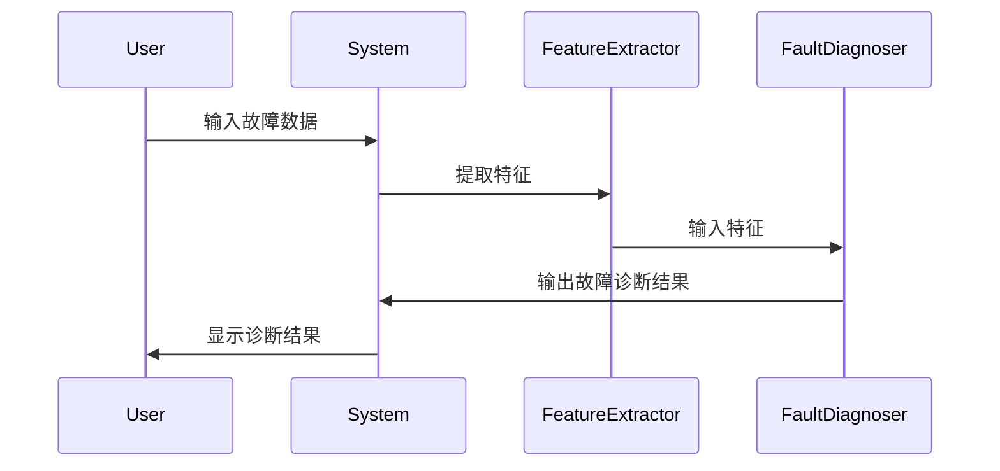
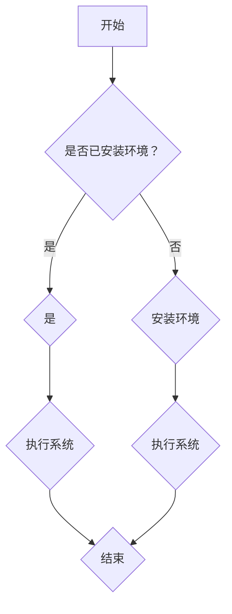

                 

# 工业推理中神经符号故障诊断系统的实践应用

> 关键词：工业推理，神经符号故障诊断，系统设计，算法实现，实践应用

> 摘要：本文旨在探讨工业推理中神经符号故障诊断系统的设计、实现与应用。通过深入分析工业推理与神经符号故障诊断的基本概念、原理，详细阐述系统设计思路、算法实现以及实践应用案例，为相关领域的研究与应用提供参考。

### 引言

随着工业自动化和智能化的发展，工业系统的复杂性不断增加，如何快速准确地诊断故障成为了关键问题。工业推理作为一种智能推理方法，在故障诊断中发挥了重要作用。神经符号故障诊断系统结合了神经网络和符号逻辑的优势，能够有效提高故障诊断的准确性和效率。

本文将围绕工业推理中神经符号故障诊断系统的实践应用展开讨论。首先，介绍工业推理和神经符号故障诊断的基本概念和原理。然后，详细阐述系统的设计思路，包括系统总体架构、关键模块设计以及算法实现。接下来，通过实际案例展示系统的应用效果，并对系统进行总结与展望。

### 基础知识

#### 工业推理概述

**定义**：工业推理是指利用工业知识、数据和信息，通过对现实世界中的事件、现象和过程的模拟和推理，以实现对工业系统的监测、诊断和优化。

**应用领域**：工业推理广泛应用于工业过程控制、故障诊断、安全监测、设备预测维护等领域。

**关键概念**：推理机、知识库、数据库、推理算法等。

#### 神经符号故障诊断原理

**神经网络的基本原理**：神经网络是由大量神经元组成的网络，通过学习输入数据和输出结果之间的映射关系，实现对复杂问题的建模和预测。

**符号故障诊断的基本概念**：符号故障诊断是基于符号逻辑的方法，通过对故障信号的符号分析，实现对故障类型的识别和定位。

**关键概念联系**：

| 概念               | 属性特征               | 关联关系           |
|--------------------|-----------------------|-------------------|
| 神经网络           | 神经元、权重、激活函数 | 数据输入、输出预测 |
| 符号故障诊断       | 符号逻辑、规则库       | 故障类型识别、定位 |
| 工业推理           | 知识、数据、信息       | 监测、诊断、优化   |

#### ER实体关系图架构

**ER实体关系图**：用于描述系统中实体之间的关系，包括实体、属性和关系的定义。

**系统架构设计**：

```mermaid
erDiagram
  Artifact ||--|{ Device } Device
  Device ||--|{ Sensor } Sensor
  Sensor ||--|{ Fault } Fault
```

### 设计思路

#### 系统设计

1. **系统总体架构**：包括数据收集模块、特征提取模块、故障诊断模块和系统接口设计。

2. **关键模块设计**：

   - **数据收集模块**：负责收集工业系统中的实时数据，包括传感器数据、设备运行状态等。
   - **特征提取模块**：对收集到的数据进行预处理和特征提取，提取与故障诊断相关的关键特征。
   - **故障诊断模块**：基于神经网络和符号逻辑的方法，对提取的特征进行故障类型识别和定位。
   - **系统接口设计**：提供友好的用户界面，方便用户对系统进行操作和监控。

3. **系统交互**：



### 步骤

#### 引言部分

- # 引言
  - 研究背景
  - 研究目的
  - 研究意义

#### 基础知识部分

- # 基础知识
  - 工业推理概述
    - 定义
    - 应用领域
    - 关键概念
  - 神经符号故障诊断原理
    - 神经网络的基本原理
    - 符号故障诊断的基本概念
    - 关键概念联系
  - ER实体关系图架构

#### 系统设计部分

- # 系统设计
  - 系统总体架构
  - 关键模块设计
  - 系统接口设计
  - 系统交互

#### 算法实现部分

- # 算法实现
  - 核心算法原理
  - 算法流程图
  - 数学模型和公式
  - Python代码实现

#### 实践应用部分

- # 实践应用
  - 环境安装
  - 系统核心实现
  - 实际案例分析
  - 项目小结

#### 总结与展望部分

- # 总结与展望
  - 全书内容总结
  - 研究展望

### Mermaid图表

- **Mermaid图表示例**：



### Python代码

- **Python代码示例**：

```python
import numpy as np

# 定义一个简单的神经网络
class NeuralNetwork:
    def __init__(self):
        self.weights = np.random.rand(2, 1)
    
    def forward(self, x):
        return np.dot(x, self.weights)
    
    def train(self, x, y, epochs):
        for _ in range(epochs):
            output = self.forward(x)
            error = y - output
            delta = error * x
            self.weights += delta

# 创建一个神经网络实例
nn = NeuralNetwork()

# 训练神经网络
nn.train(np.array([[0, 1]]), np.array([[1]]), epochs=1000)

# 输出训练结果
print(nn.forward(np.array([[0, 1]])))
```

### 总结与展望

本文通过详细介绍工业推理中神经符号故障诊断系统的设计、实现与应用，为相关领域的研究与应用提供了有益的参考。未来研究可以从以下几个方面展开：

1. **系统优化**：进一步优化系统的性能和效率，提高故障诊断的准确性和实时性。
2. **算法改进**：探索更加先进的神经网络和符号逻辑算法，以提高故障诊断的效果。
3. **应用拓展**：将神经符号故障诊断系统应用于更多工业领域，如工业机器人、智能交通等。
4. **数据挖掘**：利用大数据技术，对工业系统中的海量数据进行挖掘和分析，提取更多有用的故障特征。

通过不断的研究和优化，神经符号故障诊断系统有望在工业自动化和智能化中发挥更大的作用。**作者：AI天才研究院/AI Genius Institute & 禅与计算机程序设计艺术 /Zen And The Art of Computer Programming**

