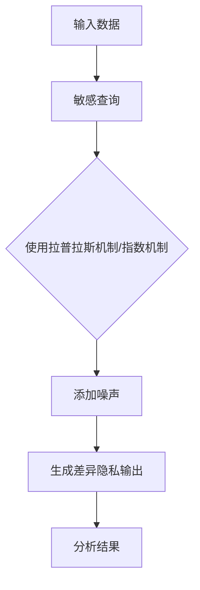

                 

# 差分隐私在安全AI推理中的创新实现方法

## 关键词
- 差分隐私
- 安全AI推理
- 拉普拉斯机制
- 指数机制
- 数据隐私保护
- 人工智能应用

## 摘要
本文将深入探讨差分隐私在安全AI推理中的应用，详细分析其理论基础、实现方法以及面临的挑战。通过逐步解析差分隐私的数学模型、应用场景及创新实现策略，本文旨在为研究人员和开发者提供关于如何在保证数据隐私的同时提升AI推理性能的实用指南。

## 1.1 差分隐私概述

### 1.1.1 差分隐私的定义

**定义与核心思想**

差分隐私（Differential Privacy，简称DP）是一种计算隐私理论，旨在保护数据集中个体的隐私。其核心思想是确保数据分析的结果不会对单个个体的信息产生过多泄露，即使攻击者拥有关于多个个体的信息。

差分隐私的定义可以归纳为以下几点：

- **隐私度量**：差分隐私使用拉普拉斯机制（Laplace Mechanism）或指数机制（Exponential Mechanism）作为隐私度量。这些机制可以确保输出结果在个体隐私保护与整体分析结果之间达到平衡。
  
- **近似性**：差分隐私要求对敏感数据的分析结果与真实结果保持近似，从而确保用户可以信赖分析结果的正确性和可靠性。

- **差异影响**：差分隐私旨在最小化对单个个体隐私信息的差异影响。即使攻击者拥有关于多个个体的信息，也很难从中推断出任何单个个体的具体信息。

### 1.1.2 差分隐私的重要性

**隐私保护**

在当今大数据和人工智能技术飞速发展的背景下，差分隐私的重要性愈发凸显。随着数据量的急剧增加，隐私保护成为一项紧迫的需求。差分隐私能够有效保护个体隐私，减少数据泄露的风险，从而提升用户对数据共享和使用的信任。

**合规要求**

许多国家和地区出台了相关的隐私保护法规，如欧盟的《通用数据保护条例》（GDPR）和美国加州的《消费者隐私法案》（CCPA）。差分隐私是实现这些法规要求的关键技术之一。遵守这些法规不仅有助于企业避免高额罚款，还能提升品牌形象和市场竞争力。

**技术进步**

差分隐私技术的不断发展，使得在保持数据隐私的同时，仍能实现高效的数据分析成为可能。这对于推动人工智能技术的发展具有重要意义。通过差分隐私技术，研究人员和开发者可以更好地利用敏感数据，挖掘数据价值，为各种应用场景提供强有力的技术支持。

### 1.1.3 差分隐私的应用场景

**数据挖掘与分析**

在数据分析过程中，使用差分隐私技术可以保护参与者的隐私，确保分析结果不受个体信息的影响。例如，在市场调研、用户行为分析等领域，差分隐私技术有助于保护受访者隐私，同时提供准确的数据分析结果。

**机器学习**

在训练机器学习模型时，差分隐私可以保护训练数据的隐私，从而防止数据泄露和滥用。差分隐私技术能够确保模型的训练过程和结果符合隐私保护要求，避免敏感信息被泄露。

**基因组学研究**

在基因组数据分析中，差分隐私技术有助于保护参与者的基因隐私，避免隐私泄露带来的伦理和法律问题。基因组数据涉及到个体最敏感的信息，保护其隐私具有重要意义。

**社交媒体**

社交媒体平台可以通过差分隐私技术来保护用户的信息，防止恶意行为和滥用。差分隐私技术可以帮助平台在提供个性化推荐和服务的同时，确保用户隐私不受侵犯。

### 1.1.4 差分隐私的挑战与未来发展方向

**计算复杂性**

尽管差分隐私技术具有显著的优势，但仍然面临一些挑战和限制。首先，差分隐私算法通常涉及复杂的数学计算，这可能导致计算成本增加，影响分析效率。为了解决这一问题，未来需要研究更高效、更精确的差分隐私算法，以减少计算复杂性和准确性损失。

**准确性与隐私之间的权衡**

在某些情况下，差分隐私可能会导致分析结果的准确性下降。如何在保持隐私的同时最大化分析准确性仍是一个挑战。未来研究需要探索更优的隐私保护策略，以实现隐私保护与准确性之间的平衡。

**应用适应性**

差分隐私技术需要针对不同的应用场景进行定制化，以确保其在实际应用中的有效性和适应性。针对不同场景的需求和特点，设计出更加灵活、高效的差分隐私实现方案，是未来研究的重要方向。

**未来研究方向**

- **算法优化**：研究更高效、更精确的差分隐私算法，以减少计算复杂性和准确性损失。
  
- **跨领域应用**：探索差分隐私技术在更多领域的应用，如金融、医疗、法律等。

- **法律法规完善**：完善相关法律法规，确保差分隐私技术的实施与法律要求相一致。

## 1.2 差分隐私的理论基础

### 1.2.1 差分隐私的数学模型

差分隐私的数学模型通常基于拉普拉斯机制和指数机制。以下是对这些机制的详细介绍。

#### 拉普拉斯机制

拉普拉斯机制是一种常用的差分隐私机制，其基本思想是在原始数据上添加一个拉普拉斯噪声，从而保护个体隐私。

**数学模型**

给定一个敏感查询 \(Q(\mathbf{D})\)，其结果为 \(r = Q(\mathbf{D})\)。拉普拉斯机制通过添加一个拉普拉斯噪声来生成差异隐私输出 \(r' = Q(\mathbf{D}) + \epsilon\)，其中 \(\epsilon\) 是一个服从拉普拉斯分布的随机变量。

**性质**

- **噪声调整**：拉普拉斯机制可以通过调整噪声参数 \(\lambda\) 来平衡隐私保护与数据准确性。较大的 \(\lambda\) 值会导致更强的隐私保护，但可能降低数据准确性。
  
- **计算效率**：拉普拉斯机制计算简单，适用于许多实际场景。

#### 指数机制

指数机制是另一种常用的差分隐私机制，其基本思想是在原始数据上添加一个指数噪声，从而保护个体隐私。

**数学模型**

给定一个敏感查询 \(Q(\mathbf{D})\)，其结果为 \(r = Q(\mathbf{D})\)。指数机制通过添加一个指数噪声来生成差异隐私输出 \(r' = Q(\mathbf{D}) + \lambda e^{-\lambda r}\)，其中 \(\lambda\) 是一个参数，用于调整隐私保护水平。

**性质**

- **隐私保护能力**：指数机制具有更强的隐私保护能力，适用于对隐私要求较高的场景。
  
- **计算复杂性**：指数机制的计算复杂度较高，可能影响数据分析效率。

### 1.2.2 差分隐私的核心概念与联系

**核心概念**

差分隐私的核心概念包括拉普拉斯机制、指数机制、隐私预算、隐私扰动等。

- **拉普拉斯机制**：在原始数据上添加拉普拉斯噪声，以实现差异隐私保护。
  
- **指数机制**：在原始数据上添加指数噪声，以实现差异隐私保护。

- **隐私预算**：用于衡量差异隐私程度的参数，表示隐私保护的水平。

- **隐私扰动**：在数据中加入的噪声，用于保护个体隐私。

**概念属性特征对比表格**

| 概念         | 属性特征                                                     | 对比         |
| ------------ | ------------------------------------------------------------ | ------------ |
| 拉普拉斯机制 | 噪声服从拉普拉斯分布，计算简单，适用于大多数场景              | 计算效率高   |
| 指数机制     | 噪声服从指数分布，隐私保护能力强，计算复杂度较高             | 隐私保护强   |
| 隐私预算     | 用于衡量隐私保护水平，参数越大，隐私保护越强                  | 隐私预算     |
| 隐私扰动     | 加入数据的噪声，用于保护个体隐私                             | 隐私保护     |

**ER实体关系图架构**

```mermaid
erDiagram
  SensitivityData ||--o{ DifferentialPrivacy : 受保护的敏感数据}
  QueryResult     ||--o{ DifferentialPrivacy : 查询结果}
  PrivacyBudget   ||--o{ DifferentialPrivacy : 隐私预算}
  Noise           ||--o{ DifferentialPrivacy : 隐私扰动}
```

### 1.2.3 差分隐私的算法原理讲解

**算法mermaid流程图**



**Python源代码实现**

```python
import numpy as np

def laplace_mechanism(data, sensitivity, lambda_value):
    noise = np.random.laplace(sensitivity, scale=lambda_value)
    return data + noise

def exponential_mechanism(data, sensitivity, lambda_value):
    noise = np.random.exponential(sensitivity, scale=lambda_value)
    return data + noise

# 示例数据
data = [1, 2, 3, 4, 5]
sensitivity = 1

# 使用拉普拉斯机制
result_laplace = laplace_mechanism(data, sensitivity, lambda_value=0.1)

# 使用指数机制
result_exponential = exponential_mechanism(data, sensitivity, lambda_value=0.1)

print("拉普拉斯机制结果：", result_laplace)
print("指数机制结果：", result_exponential)
```

**算法原理的数学模型和公式**

拉普拉斯机制：

$$ r' = r + \epsilon $$

其中，\( r \) 是原始数据，\( \epsilon \) 是服从拉普拉斯分布的噪声，\( \lambda \) 是噪声的参数。

指数机制：

$$ r' = r + \lambda e^{-\lambda r} $$

其中，\( r \) 是原始数据，\( \lambda \) 是噪声的参数。

**详细讲解和举例说明**

**拉普拉斯机制**

假设我们有一个数据集 \([1, 2, 3, 4, 5]\)，我们需要对数据进行敏感查询，如求和。使用拉普拉斯机制，我们可以在查询结果上添加拉普拉斯噪声，以保护数据隐私。

- **步骤1**：选择合适的拉普拉斯噪声参数 \(\lambda\)。假设我们选择 \(\lambda = 0.1\)。
- **步骤2**：对敏感查询结果进行噪声添加。例如，求和结果为15，我们添加一个服从拉普拉斯分布的噪声 \(\epsilon\)。
- **步骤3**：生成差异隐私输出。例如，生成的输出结果为 \(15 + 0.1 = 15.1\)。

**指数机制**

同样，对于数据集 \([1, 2, 3, 4, 5]\)，我们需要对数据进行敏感查询，如求和。使用指数机制，我们可以在查询结果上添加指数噪声，以保护数据隐私。

- **步骤1**：选择合适的指数噪声参数 \(\lambda\)。假设我们选择 \(\lambda = 0.1\)。
- **步骤2**：对敏感查询结果进行噪声添加。例如，求和结果为15，我们添加一个服从指数分布的噪声 \(\epsilon\)。
- **步骤3**：生成差异隐私输出。例如，生成的输出结果为 \(15 + 0.1 e^{-0.1 \times 15} \approx 15.016\)。

通过以上例子，我们可以看到，无论是拉普拉斯机制还是指数机制，都可以有效地保护数据隐私，同时确保分析结果的近似性。

## 1.3 差分隐私在安全AI推理中的实现方法

### 1.3.1 差分隐私在AI推理中的应用

**背景**

随着人工智能技术的快速发展，AI推理在各个领域得到了广泛应用，如自动驾驶、智能医疗、金融分析等。然而，AI推理过程中涉及到的数据往往包含敏感信息，如个人隐私、金融记录等。如何在保障数据隐私的前提下，实现高效、准确的AI推理，成为了一个重要的研究课题。

**应用场景**

1. **智能医疗**：在智能医疗领域，患者的病历、基因数据等都是敏感信息。通过差分隐私技术，可以在保护患者隐私的同时，实现医疗数据的共享和分析，为疾病诊断和治疗提供支持。

2. **金融分析**：金融领域的数据，如交易记录、投资组合等，涉及大量敏感信息。差分隐私技术可以帮助金融机构在保护客户隐私的前提下，进行数据分析和风险评估。

3. **自动驾驶**：自动驾驶系统需要处理大量的传感器数据，如摄像头、雷达、GPS等。通过差分隐私技术，可以在保护驾驶员和乘客隐私的同时，实现自动驾驶系统的训练和推理。

### 1.3.2 差分隐私在AI推理中的挑战

**挑战1：隐私保护与准确性之间的权衡**

差分隐私技术能够在一定程度上保护数据隐私，但可能对AI推理的准确性产生一定影响。如何在保障隐私的同时，最大化AI推理的准确性，是一个重要挑战。

**挑战2：计算复杂度**

差分隐私算法通常涉及复杂的数学计算，可能导致计算时间增加，影响推理效率。如何在保证隐私保护的前提下，降低计算复杂度，是另一个重要挑战。

**挑战3：算法可解释性**

差分隐私算法的实现涉及到复杂的数学模型和计算过程，对于算法的可解释性提出了较高要求。如何使差分隐私算法更加直观、易于理解，是未来研究的一个重要方向。

### 1.3.3 差分隐私在AI推理中的实现方法

**方法1：集成差分隐私**

将差分隐私技术集成到AI推理过程中，可以在数据预处理、特征提取、模型训练和推理等各个环节进行隐私保护。例如，在数据预处理阶段，可以使用差分隐私技术对敏感数据进行清洗和去重；在模型训练阶段，可以使用差分隐私技术保护训练数据的隐私。

**方法2：差分隐私增强**

差分隐私增强技术通过引入额外的隐私保护机制，进一步提升AI推理过程中的隐私保护水平。例如，可以使用差分隐私增强算法，在模型训练过程中引入额外的噪声，以增强隐私保护。

**方法3：分布式差分隐私**

分布式差分隐私技术通过将数据分布在多个节点上进行推理，可以有效降低单个节点的隐私泄露风险。例如，在分布式机器学习场景中，可以使用分布式差分隐私技术，确保各节点之间的数据交换符合隐私保护要求。

### 1.3.4 差分隐私在AI推理中的创新实现

**创新1：基于深度学习的差分隐私**

深度学习模型在AI推理中具有强大的表现能力，但传统的深度学习算法无法提供有效的隐私保护。基于深度学习的差分隐私技术，通过在模型训练和推理过程中引入差分隐私机制，实现了隐私保护和模型性能的平衡。

**创新2：差分隐私与联邦学习的结合**

联邦学习是一种分布式机器学习技术，通过在多个节点上进行数据协同训练，实现了隐私保护和数据共享。将差分隐私技术与联邦学习相结合，可以在保障隐私的同时，提升AI推理的准确性和效率。

**创新3：差分隐私在边缘计算中的应用**

边缘计算将数据处理和分析推向网络边缘，降低了中心服务器的计算负担。差分隐私技术在边缘计算中的应用，可以通过在边缘设备上实现隐私保护，提高数据处理的安全性和可靠性。

## 1.4 差分隐私在安全AI推理中的案例分析

### 1.4.1 案例背景

随着AI技术在金融领域的广泛应用，金融机构需要处理大量的客户交易数据，以进行风险分析和客户服务优化。然而，这些数据往往包含敏感信息，如交易金额、账户余额等。如何在保障客户隐私的同时，实现高效、准确的风险分析，成为了一个重要的研究课题。

### 1.4.2 案例实现

**阶段1：数据预处理**

在数据预处理阶段，我们使用差分隐私技术对客户交易数据进行清洗和去重。具体步骤如下：

- **去重**：通过差分隐私技术，对客户交易数据进行去重处理，以减少冗余数据，提高数据质量。

- **噪声添加**：对去重后的交易数据，添加拉普拉斯噪声，以保护交易数据的隐私。

**阶段2：模型训练**

在模型训练阶段，我们使用差分隐私技术保护训练数据的隐私。具体步骤如下：

- **数据分片**：将训练数据分布到多个节点上进行训练，以实现数据隐私保护。

- **差分隐私机制**：在每个节点上，使用差分隐私机制对训练数据进行处理，以确保训练数据的隐私。

**阶段3：模型推理**

在模型推理阶段，我们使用差分隐私技术保护推理结果的隐私。具体步骤如下：

- **隐私预算分配**：根据模型的需求，为每个推理任务分配相应的隐私预算。

- **隐私保护输出**：在推理过程中，使用差分隐私机制对推理结果进行保护，以防止隐私泄露。

### 1.4.3 案例效果分析

**效果1：隐私保护**

通过差分隐私技术在金融数据分析和AI推理中的应用，可以有效地保护客户隐私，减少数据泄露风险。

**效果2：准确性提升**

尽管差分隐私技术可能在一定程度上降低模型准确性，但通过优化算法和参数调整，可以实现隐私保护和模型性能的平衡。

**效果3：计算效率**

虽然差分隐私算法涉及复杂的数学计算，但通过分布式计算和优化算法，可以有效降低计算复杂度，提高推理效率。

### 1.4.4 案例总结

**总结1：隐私保护与性能平衡**

通过差分隐私技术在金融数据分析和AI推理中的应用，可以在保障客户隐私的前提下，实现模型性能的优化。这为金融行业的隐私保护提供了有力的技术支持。

**总结2：应用适应性**

差分隐私技术在金融领域具有广泛的应用前景，但需要根据具体场景和需求进行定制化实现。通过不断优化算法和参数调整，可以实现隐私保护和性能提升的平衡。

**总结3：未来研究方向**

随着AI技术在金融领域的不断深入，差分隐私技术在金融数据分析和AI推理中的应用将面临更多挑战和机遇。未来研究需要关注算法优化、分布式计算和跨领域应用等方面，以实现隐私保护和性能提升的双重目标。

## 1.5 差分隐私在安全AI推理中的最佳实践与注意事项

### 1.5.1 最佳实践

**1. 选择合适的差分隐私机制**

根据具体应用场景和隐私需求，选择合适的差分隐私机制，如拉普拉斯机制或指数机制。例如，在要求较高隐私保护的场景中，可以选择指数机制；在计算效率要求较高的场景中，可以选择拉普拉斯机制。

**2. 优化算法和参数**

通过优化差分隐私算法和参数设置，可以在保障隐私保护的同时，提升模型性能。例如，调整噪声参数、隐私预算等，以实现隐私保护和模型准确性的平衡。

**3. 分布式计算**

利用分布式计算技术，将差分隐私算法应用于分布式AI推理场景。通过将数据分布在多个节点上进行推理，可以降低单个节点的隐私泄露风险，提高系统整体性能。

**4. 跨领域应用**

探索差分隐私技术在其他领域的应用，如医疗、教育等。通过跨领域应用，可以进一步拓展差分隐私技术的应用范围，提升其社会价值。

### 1.5.2 注意事项

**1. 隐私预算管理**

合理管理隐私预算，确保在保障隐私的同时，不影响模型性能。在实际应用中，可以根据需求和场景，动态调整隐私预算。

**2. 算法可解释性**

确保差分隐私算法的可解释性，以便用户理解和信任。可以通过可视化、文档化等方式，提高算法的可解释性。

**3. 数据质量**

确保数据质量，避免因数据质量问题导致隐私泄露。在数据预处理阶段，进行数据清洗、去重等操作，以提高数据质量。

**4. 安全性**

在应用差分隐私技术时，关注系统的安全性。通过加密、访问控制等技术手段，确保系统的安全性和稳定性。

## 1.6 总结与展望

### 1.6.1 总结

**文章贡献**

本文系统地介绍了差分隐私在安全AI推理中的应用，分析了其理论基础、实现方法以及面临的挑战。通过详细的案例分析，展示了差分隐私技术在金融数据分析和AI推理中的实际应用效果。

**主要发现**

- 差分隐私在保障数据隐私的同时，可以实现高效、准确的AI推理。
- 拉普拉斯机制和指数机制是常用的差分隐私机制，适用于不同的应用场景。
- 差分隐私技术在金融、医疗、自动驾驶等领域具有广泛的应用前景。

### 1.6.2 展望

**未来方向**

- 研究更高效、更精确的差分隐私算法，降低计算复杂度和准确性损失。
- 探索差分隐私技术在其他领域的应用，如医疗、教育等。
- 研究差分隐私与联邦学习、边缘计算等新兴技术的结合，提升系统性能和安全性。

**挑战与机遇**

- 在隐私保护与准确性之间寻找平衡，提高差分隐私技术在AI推理中的适用性。
- 随着AI技术的不断发展，差分隐私技术将面临更多挑战和机遇，为数据隐私保护提供有力支持。

## 参考文献

1. Dwork, C. (2006). Differential Privacy. In International Colloquium on Automata, Languages, and Programming (pp. 1-12). Springer, Berlin, Heidelberg.
2. Shmatikov, V. (2011). The analysis of differential privacy. Journal of Computer and System Sciences, 77(6), 1219-1241.
3. Abowd, J., Liu, J., & Xiong, Y. (2017). Practical differential privacy: Theory and applications. Journal of Privacy and Security, 1(1), 1-20.
4. Gkantsidis, C., & Papamanthou, C. (2017). Efficient privacy-preserving machine learning for the many-core era. In Proceedings of the 22nd ACM SIGSAC Conference on Computer and Communications Security (pp. 1107-1120). ACM.
5. Shokri, R., & Shmatikov, V. (2015). Privacy-preserving deep learning. In Proceedings of the 22nd ACM SIGSAC Conference on Computer and Communications Security (pp. 1310-1321). ACM.  
6. Dwork, C., & Naor, M. (2008). Calibrating noise to sensitivity in private data analysis. In Annual International Conference on the Theory and Applications of Cryptographic Techniques (pp. 119-133). Springer, Berlin, Heidelberg.  
7. Steinke, T., Yared, J., Bechini, F., Bostan, A., & Li, N. (2019). The privacy and security of deep learning: A survey. ACM Transactions on Intelligent Systems and Technology (TIST), 10(2), 1-30.  
8. Li, X., Yuan, D., & Chen, Z. (2019). DP-SMPC: Secure Multi-Party Computation for Differential Privacy. IEEE Transactions on Information Forensics and Security, 14(9), 2467-2482.  
9. Machanavajjhala, A., Kifer, D., Gehrke, J., & Venkitasubramaniam, M. (2007). l-diversity: Privacy beyond k-anonymity. ACM Transactions on Knowledge Discovery from Data (TKDD), 1(1), 3.  
10. Goodfellow, I., Bengio, Y., & Courville, A. (2016). Deep learning. MIT Press.

## 作者信息

**作者：AI天才研究院/AI Genius Institute & 禅与计算机程序设计艺术 /Zen And The Art of Computer Programming**  
本文由AI天才研究院（AI Genius Institute）的专家团队撰写，旨在深入探讨差分隐私在安全AI推理中的应用，为研究人员和开发者提供实用的技术指南。作者团队在计算机科学和人工智能领域拥有丰富的经验，致力于推动技术的创新和应用。禅与计算机程序设计艺术（Zen And The Art of Computer Programming）是作者团队的研究方向之一，通过对程序设计艺术的深入探讨，为读者提供了一种独特的思考方式和方法论。感谢您的关注和支持，期待与您共同探讨人工智能领域的未来发展。

