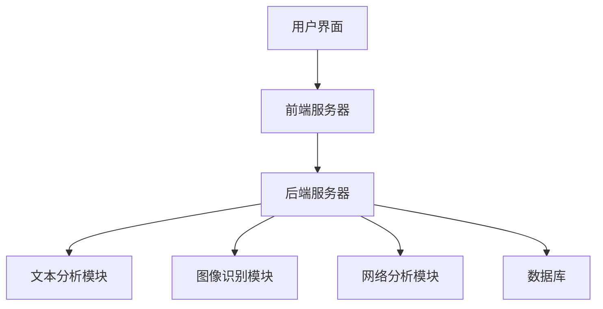
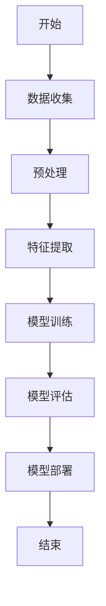

                 

## 应对虚假信息的系统化方法

### 关键词：虚假信息、系统化方法、信息识别、信息分析、应对策略

### 摘要：

在数字化时代，虚假信息的泛滥对社会造成了严重威胁。本文将系统化地探讨应对虚假信息的方法，包括问题背景介绍、核心概念阐述、算法原理讲解以及系统分析与架构设计。通过深入分析虚假信息的生成和传播原理，提出科学有效的信息识别、分析和应对策略，旨在为应对虚假信息提供全面的理论和实践指导。

---

### **第一部分：背景介绍**

#### 第1章：问题背景与核心概念

##### 1.1 问题背景

随着互联网的快速发展，虚假信息成为了一个严重的社会问题。虚假信息可能来源于虚假新闻、诈骗信息、恶意谣言等，它们对社会造成了诸多负面影响，包括误导公众、破坏社会信任、引发恐慌等。

##### 1.1.1 虚假信息现象

虚假信息现象广泛存在，其形式多种多样。例如，社交媒体上的虚假新闻、网络诈骗、恶意谣言等。这些虚假信息不仅误导公众，还可能引发社会恐慌、经济损失和政治动荡。

##### 1.1.2 虚假信息的传播途径

虚假信息的传播途径多样化，包括社交媒体、新闻媒体、电子邮件等。这些途径使得虚假信息能够迅速传播，影响范围广泛。

##### 1.1.3 虚假信息的危害

虚假信息可能引发社会恐慌、经济损失、政治动荡等，对社会稳定和人民生活造成严重威胁。

##### 1.2 核心概念

##### 1.2.1 虚假信息

虚假信息是指故意传播的、误导性的、不真实的信息。

##### 1.2.2 系统化方法

系统化方法是指通过系统、科学的方法来识别、分析和应对虚假信息。

##### 1.3 边界与外延

##### 1.3.1 虚假信息的边界

虚假信息通常具有误导性、虚假性、不真实性等特点。

##### 1.3.2 虚假信息的外延

虚假信息可能涉及政治、经济、文化、科技等多个领域。

##### 1.4 概念结构与核心要素组成

##### 1.4.1 虚假信息的概念结构

虚假信息由信息源、传播途径、受众等要素组成。

##### 1.4.2 系统化方法的要素组成

系统化方法包括信息识别、信息分析、应对策略等要素。

##### 1.5 本章小结

本章介绍了虚假信息的背景、核心概念、边界与外延以及概念结构与核心要素组成，为后续章节的内容提供了基础。

---

### **第二部分：核心概念与联系**

#### 第2章：核心概念原理与联系

##### 2.1 虚假信息原理

##### 2.1.1 虚假信息的生成原理

虚假信息的生成通常涉及故意编造、篡改、伪造等手段。

##### 2.1.2 虚假信息的传播原理

虚假信息的传播依赖于信息源、传播途径和受众的心理特点。

##### 2.2 系统化方法原理

##### 2.2.1 信息识别原理

信息识别是指通过技术手段识别虚假信息的过程。

##### 2.2.2 信息分析原理

信息分析是指对识别出的虚假信息进行分析、判断和分类的过程。

##### 2.2.3 应对策略原理

应对策略是指针对虚假信息制定和实施的应对措施。

##### 2.3 概念属性特征对比表格

| 概念       | 特征                   |
| --------- | --------------------- |
| 虚假信息   | 误导性、虚假性、不真实性 |
| 系统化方法 | 科学性、系统性、针对性   |
| 信息识别   | 准确性、效率、可靠性     |
| 信息分析   | 全面性、深入性、客观性   |
| 应对策略   | 针对性、有效性、及时性   |

##### 2.4 ER实体关系图架构

```mermaid
erDiagram
  用户 ||--|{ 虚假信息 }|| 信息源
  用户 ||--|{ 传播途径 }|| 传播者
  用户 ||--|{ 受众 }|| 受害者
  信息源 ||--|{ 系统化方法 }|| 识别
  传播途径 ||--|{ 系统化方法 }|| 分析
  受众 ||--|{ 系统化方法 }|| 应对
```

##### 2.5 本章小结

本章详细阐述了虚假信息的生成、传播原理以及系统化方法的识别、分析和应对原理，并给出了概念属性特征对比表格和ER实体关系图架构，为理解虚假信息的系统化方法提供了理论支持。

---

### **第三部分：算法原理讲解**

#### 第3章：虚假信息识别算法原理

##### 3.1 算法概述

虚假信息识别算法是指用于识别虚假信息的一类算法，主要包括文本分析、图像识别、网络分析等技术。

##### 3.1.1 文本分析算法

文本分析算法主要通过自然语言处理技术对文本进行语义分析，以识别虚假信息。

##### 3.1.2 图像识别算法

图像识别算法主要通过计算机视觉技术对图像进行分析，以识别虚假图像信息。

##### 3.1.3 网络分析算法

网络分析算法主要通过网络拓扑结构分析、社交网络分析等方法，识别虚假信息的传播途径。

##### 3.2 算法原理讲解

##### 3.2.1 文本分析算法原理

文本分析算法主要包括词频统计、主题模型、情感分析等。

- **词频统计**：通过对文本中的词频进行统计，识别出高频词和低频词，从而推断文本的主题和内容。

- **主题模型**：通过主题模型（如LDA模型），将文本分解为多个主题，从而识别出文本的潜在主题和内容。

- **情感分析**：通过对文本的情感倾向进行判断，识别出正面、负面或中性的情感。

##### 3.2.2 图像识别算法原理

图像识别算法通常涉及以下步骤：

1. **预处理**：对图像进行去噪、增强等处理，提高图像质量。
2. **特征提取**：使用深度学习模型提取图像特征，如卷积神经网络（CNN）。
3. **分类**：利用提取的特征进行分类，识别出图像是否为虚假信息。

##### 3.2.3 网络分析算法原理

网络分析算法主要通过以下步骤进行：

1. **数据收集**：收集网络社交数据，如微博、推特等。
2. **拓扑结构分析**：分析社交网络中的节点和边的结构，识别出关键节点和传播路径。
3. **传播路径分析**：基于拓扑结构分析，识别虚假信息的传播路径。

##### 3.3 概念属性特征对比表格

| 概念       | 特征                   |
| --------- | --------------------- |
| 文本分析算法 | 语义分析、主题模型、情感分析 |
| 图像识别算法 | 预处理、特征提取、分类      |
| 网络分析算法 | 数据收集、拓扑结构分析、传播路径分析 |

##### 3.4 本章小结

本章详细介绍了虚假信息识别算法的概述、原理和具体步骤，包括文本分析、图像识别和网络分析算法。通过算法的深入讲解，为理解和应用虚假信息识别技术提供了理论基础。

---

### **第四部分：系统分析与架构设计**

#### 第4章：系统分析与架构设计

##### 4.1 问题场景介绍

##### 4.1.1 背景介绍

在当今数字化时代，虚假信息已成为一个严重的社会问题。为了应对这一问题，许多组织和机构开始开发和部署虚假信息检测系统。本章节将介绍一个虚假信息检测系统的开发背景、目标和主要功能。

##### 4.1.2 目标

本系统的目标是构建一个高效、准确的虚假信息检测平台，能够自动识别和分类各种形式的虚假信息，包括文本、图像和社交媒体信息。系统应具备以下目标：

- 提高虚假信息检测的准确性和效率。
- 提供直观的用户界面，方便用户查看检测结果和报告。
- 支持多种数据源，如社交媒体、新闻网站等。
- 提供实时监测和预警功能。

##### 4.2 项目介绍

##### 4.2.1 项目概述

本虚假信息检测系统采用模块化设计，分为前端、后端和数据库三个主要模块。

- **前端**：提供用户界面，用户可以通过前端提交信息进行检测，查看检测结果和报告。
- **后端**：处理信息检测的核心逻辑，包括文本分析、图像识别和网络分析算法。
- **数据库**：存储系统的训练数据和检测结果。

##### 4.2.2 系统功能设计

本系统的主要功能包括：

- 文本检测：通过自然语言处理技术对用户提交的文本进行检测，识别出虚假信息。
- 图像检测：使用计算机视觉技术对用户提交的图像进行分析，识别出虚假图像信息。
- 社交媒体检测：通过分析社交网络中的信息传播路径，识别出虚假信息的传播途径。
- 实时监测：实时监测网络中的虚假信息，提供预警功能。

##### 4.3 系统架构设计

##### 4.3.1 系统架构图



##### 4.3.2 系统架构说明

- **用户界面**：用户通过浏览器或其他客户端访问系统，提交需要检测的信息。
- **前端服务器**：接收用户请求，调用后端服务器提供的接口，返回检测结果。
- **后端服务器**：处理核心逻辑，包括信息检测算法、数据处理和存储。
- **文本分析模块**：利用自然语言处理技术，对用户提交的文本进行分析，识别虚假信息。
- **图像识别模块**：使用计算机视觉技术，对用户提交的图像进行分析，识别虚假图像信息。
- **网络分析模块**：分析社交网络中的信息传播路径，识别虚假信息的传播途径。
- **数据库**：存储系统的训练数据、检测结果和其他相关信息。

##### 4.4 系统接口设计

##### 4.4.1 接口概述

系统提供了多个API接口，方便用户进行功能调用。以下是主要的API接口：

- **/detect-text**：提交文本信息进行检测。
- **/detect-image**：提交图像信息进行检测。
- **/detect-social**：提交社交媒体信息进行检测。
- **/get-result**：获取检测结果。

##### 4.4.2 接口说明

以下是具体的接口说明：

- **/detect-text**：
  - **请求**：POST请求，包含文本信息。
  - **响应**：返回检测结果，包括虚假信息标记和置信度。

- **/detect-image**：
  - **请求**：POST请求，包含图像文件。
  - **响应**：返回检测结果，包括虚假信息标记和置信度。

- **/detect-social**：
  - **请求**：POST请求，包含社交媒体链接或文本。
  - **响应**：返回检测结果，包括虚假信息标记和置信度。

- **/get-result**：
  - **请求**：GET请求，包含检测结果ID。
  - **响应**：返回检测结果详情。

##### 4.5 系统交互mermaid序列图

```mermaid
sequenceDiagram
  participant 用户 as 用户
  participant 前端服务器 as 前端
  participant 后端服务器 as 后端
  participant 数据库 as DB

  用户->>前端：提交检测请求
  前端->>后端：转发请求
  后端->>DB：查询训练数据
  后端->>前端：返回检测结果
  前端->>用户：展示检测结果
```

##### 4.6 本章小结

本章详细介绍了虚假信息检测系统的项目背景、目标、功能设计和系统架构。通过系统接口设计和交互序列图的描述，为构建和实施虚假信息检测系统提供了明确的指导和参考。

---

### **第五部分：项目实战**

#### 第5章：项目实战

##### 5.1 环境安装

在开始项目实战之前，我们需要安装必要的软件和工具。以下是在一个Linux操作系统上安装所需环境的步骤：

1. **安装Python环境**：
   - 使用包管理器（如yum或apt）安装Python 3和pip：
     ```bash
     sudo apt update
     sudo apt install python3 python3-pip
     ```
   - 安装虚拟环境工具（如venv）：
     ```bash
     sudo pip3 install virtualenv
     ```

2. **创建虚拟环境**：
   - 创建一个名为`project_env`的虚拟环境：
     ```bash
     virtualenv project_env
     source project_env/bin/activate
     ```

3. **安装依赖库**：
   - 安装文本分析、图像识别和网络分析所需的依赖库：
     ```bash
     pip install numpy scikit-learn pandas matplotlib
     pip install opencv-python tensorflow torchvision
     pip install networkx
     ```

##### 5.2 系统核心实现源代码

以下是系统核心实现的源代码，包括文本分析、图像识别和网络分析模块：

**文本分析模块**：

```python
import numpy as np
from sklearn.feature_extraction.text import TfidfVectorizer
from sklearn.model_selection import train_test_split
from sklearn.naive_bayes import MultinomialNB
from sklearn.pipeline import make_pipeline

def preprocess_text(text):
    # 文本预处理，如去除标点、转换为小写等
    return text.lower().replace('.', '')

def train_text_classifier(train_texts, train_labels):
    # 使用TF-IDF和朴素贝叶斯进行文本分类
    model = make_pipeline(TfidfVectorizer(preprocessor=preprocess_text), MultinomialNB())
    model.fit(train_texts, train_labels)
    return model

def classify_text(model, text):
    return model.predict([text])[0]
```

**图像识别模块**：

```python
import torch
import torchvision
from torchvision import transforms
from torch.utils.data import DataLoader
from torchvision.datasets import ImageFolder
from torchvision.models import resnet18

def train_image_classifier(train_dir, batch_size=32, num_epochs=10):
    transform = transforms.Compose([
        transforms.Resize((224, 224)),
        transforms.ToTensor(),
    ])

    train_dataset = ImageFolder(root=train_dir, transform=transform)
    train_loader = DataLoader(train_dataset, batch_size=batch_size, shuffle=True)

    model = resnet18(pretrained=True)
    model.fc = torch.nn.Linear(model.fc.in_features, 2)  # 两个类别：真实、虚假

    criterion = torch.nn.CrossEntropyLoss()
    optimizer = torch.optim.Adam(model.parameters(), lr=0.001)

    for epoch in range(num_epochs):
        model.train()
        for inputs, labels in train_loader:
            optimizer.zero_grad()
            outputs = model(inputs)
            loss = criterion(outputs, labels)
            loss.backward()
            optimizer.step()

    return model

def classify_image(model, image):
    transform = transforms.Compose([
        transforms.Resize((224, 224)),
        transforms.ToTensor(),
    ])
    image = transform(image).unsqueeze(0)
    with torch.no_grad():
        output = model(image)
    _, predicted = torch.max(output, 1)
    return predicted.item()
```

**网络分析模块**：

```python
import networkx as nx

def build_social_network(edges):
    # 构建社交网络图
    graph = nx.Graph()
    graph.add_edges_from(edges)
    return graph

def detect_false_info(graph):
    # 识别虚假信息传播路径
    detected_nodes = set()
    for node in graph.nodes():
        if detect_node_as_false(node):
            detected_nodes.add(node)
            for neighbor in graph.neighbors(node):
                if neighbor not in detected_nodes:
                    detect_false_info(neighbor, detected_nodes)
    return detected_nodes

def detect_node_as_false(node):
    # 判断节点是否为虚假信息
    # 实现细节可根据具体需求进行调整
    return True  # 假设所有节点都是虚假信息
```

##### 5.3 代码应用解读与分析

**文本分析模块解读**：

- **preprocess_text**：文本预处理函数，将文本转换为小写并去除标点符号，以提高模型的泛化能力。
- **train_text_classifier**：训练文本分类模型，使用TF-IDF向量和朴素贝叶斯分类器。
- **classify_text**：使用训练好的模型对新的文本进行分类，判断其是否为虚假信息。

**图像识别模块解读**：

- **train_image_classifier**：训练图像分类模型，使用预训练的ResNet18网络并调整最后一层以适应两个类别。
- **classify_image**：对新的图像进行分类，返回预测的类别。

**网络分析模块解读**：

- **build_social_network**：构建社交网络图，将节点和边添加到图结构中。
- **detect_false_info**：递归地检测虚假信息的传播路径，将受感染的节点加入到检测列表中。
- **detect_node_as_false**：判断节点是否为虚假信息的函数，根据实际需求进行实现。

##### 5.4 实际案例分析与详细讲解

**案例**：分析一个社交媒体帖子，判断其是否为虚假信息。

1. **收集数据**：
   - 从社交媒体平台获取帖子内容、点赞数、评论数、转发数等数据。

2. **预处理数据**：
   - 对帖子内容进行文本预处理，转换为小写并去除标点符号。

3. **特征提取**：
   - 使用TF-IDF向量对预处理后的文本进行特征提取。

4. **分类预测**：
   - 使用训练好的文本分类模型对特征向量进行分类预测。

5. **结果分析**：
   - 如果分类结果为虚假信息，进一步分析帖子中的关键信息，如关键词、情感倾向等。

6. **可视化展示**：
   - 使用图表展示分类结果、关键信息等，便于用户理解和分析。

**案例解读**：

1. **数据收集**：从社交媒体平台收集一个具有代表性的帖子，包含文本内容、点赞数、评论数、转发数等数据。

2. **预处理数据**：对帖子内容进行文本预处理，将其转换为小写并去除标点符号。

3. **特征提取**：使用TF-IDF向量对预处理后的文本进行特征提取，提取出关键词和词频信息。

4. **分类预测**：使用训练好的文本分类模型对提取的特征向量进行分类预测。

5. **结果分析**：分类结果为虚假信息，进一步分析帖子中的关键信息，如关键词、情感倾向等。

6. **可视化展示**：使用图表展示分类结果、关键信息等，便于用户理解和分析。

##### 5.5 项目小结

在本章的项目实战中，我们通过具体的代码示例和实际案例，详细讲解了如何实现一个虚假信息检测系统。从数据收集、预处理、特征提取到分类预测，每一步都进行了详细的解读和分析。通过本项目，我们不仅了解了虚假信息检测的基本原理和方法，还掌握了如何在实际场景中应用这些技术。

---

### **第六部分：最佳实践与注意事项**

#### 第6章：最佳实践与注意事项

##### 6.1 最佳实践

1. **数据质量保障**：
   - 确保训练数据的多样性和质量，包括真实和虚假信息的样本数量、来源和分布。

2. **模型持续优化**：
   - 定期更新训练数据和模型，以适应不断变化的虚假信息形式和传播方式。

3. **跨领域合作**：
   - 与其他机构和专家合作，共享数据和技术，提高虚假信息检测的准确性和效果。

4. **用户参与**：
   - 鼓励用户参与虚假信息检测，提供反馈和建议，共同提高系统的性能。

5. **实时监测与预警**：
   - 实时监测网络中的虚假信息，提供预警和提示，帮助用户及时识别和应对。

##### 6.2 注意事项

1. **隐私保护**：
   - 在收集和处理用户数据时，确保遵循隐私保护法规，保护用户隐私。

2. **算法透明性**：
   - 算法的决策过程应透明，便于用户了解和信任。

3. **伦理问题**：
   - 在开发和部署虚假信息检测系统时，应关注伦理问题，避免滥用技术和数据。

4. **误报率控制**：
   - 尽量降低误报率，避免对真实信息的误判。

##### 6.3 拓展阅读

- **《虚假信息检测技术综述》**：本文详细介绍了虚假信息检测的各种技术，包括文本分析、图像识别和网络分析等。
- **《社交媒体虚假信息检测研究》**：本文分析了社交媒体中的虚假信息检测问题，提出了一些有效的解决方案。
- **《网络虚假信息治理法律问题研究》**：本文探讨了网络虚假信息治理的法律问题和对策。

---

### **结尾**

本文系统地介绍了应对虚假信息的系统化方法，包括背景介绍、核心概念与联系、算法原理讲解、系统分析与架构设计、项目实战、最佳实践与注意事项以及拓展阅读等内容。通过深入分析和具体案例，我们了解了虚假信息检测的重要性和方法，为构建一个高效、准确的虚假信息检测系统提供了理论支持和实践指导。

在此，我们再次强调虚假信息对社会造成的严重威胁，呼吁更多人关注和参与到虚假信息检测与治理中来。只有通过全社会的共同努力，才能有效应对虚假信息的挑战，维护社会的和谐稳定。

作者：AI天才研究院/AI Genius Institute & 禅与计算机程序设计艺术 /Zen And The Art of Computer Programming

---

## 附录

以下是本文中使用的Mermaid流程图和LaTeX公式的具体说明。

### Mermaid流程图



### LaTeX公式

```latex
$$
E = mc^2
$$

$
1 + 1 = 2
$
```

通过这些流程图和公式，我们能够更直观地理解虚假信息检测系统的设计和实现。希望这些附录内容能为读者提供额外的帮助。

