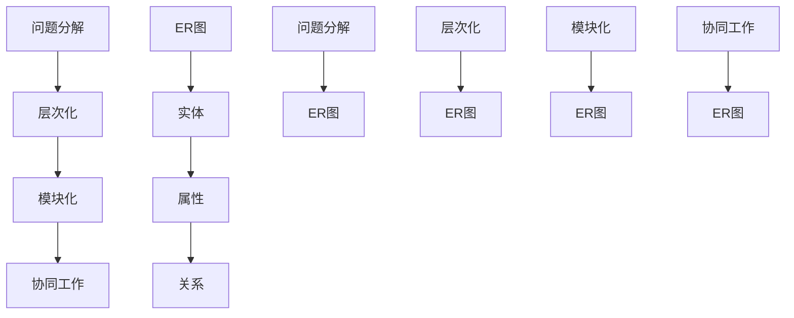
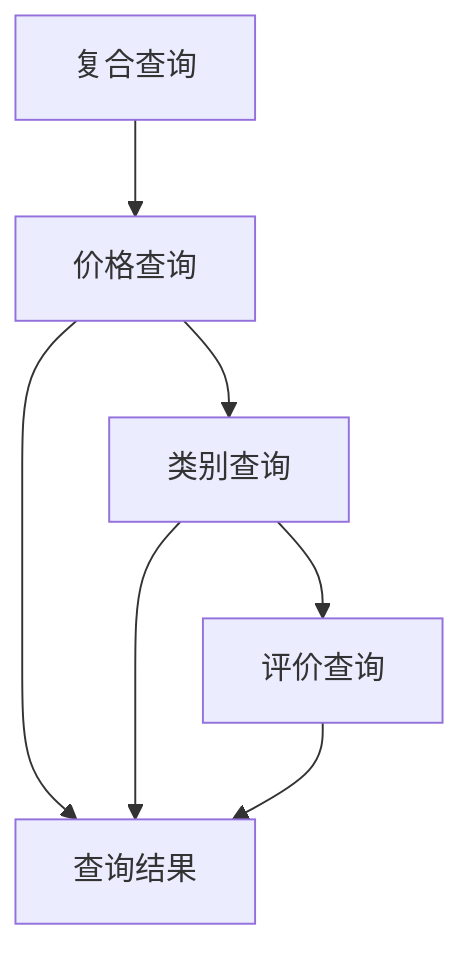

                 


## 引言与背景

### 第1章: 引言

**1.1.1 书籍主题概述**

“开放式搜索问答中PRM方法的应用探索”这一主题，聚焦于探讨在当今信息爆炸的时代，如何有效地利用人工智能技术，特别是问题减少方法（PRM）来解决开放式搜索与问答系统中的诸多挑战。开放式搜索是指在没有预先设定关键词的情况下，从大量未分类的数据中检索出相关信息的搜索方式，而问答系统则是通过自然语言交互来获取所需信息的系统。

在互联网和大数据技术的推动下，开放式搜索与问答系统已经渗透到人们生活的方方面面，从搜索引擎到智能家居，从在线客服到智能助手，它们的广泛应用极大地改变了人们获取信息的方式。然而，随着数据规模的不断扩大和搜索需求的日益多样化，传统的方法在处理复杂查询和保证搜索效率上面临着巨大的挑战。

本书旨在通过深入探讨PRM方法，为解决这些问题提供一种全新的思路。我们将从理论到实践，系统地介绍PRM方法的核心概念、原理和应用，特别是在开放式搜索和问答系统中的具体实现。

**1.1.2 开放式搜索与问答系统**

开放式搜索是一种与传统的基于关键词的搜索截然不同的方式。它强调从大量未分类的数据中，通过算法和模型自动识别出与查询相关的信息，无需用户输入精确的关键词。这种方式在处理模糊查询、多义词查询等方面具有明显优势。

问答系统则是与用户进行自然语言交互，理解用户的问题，并给出恰当的回答的系统。它通过理解用户的意图和需求，提供个性化的信息和服务，使得用户可以更便捷地获取所需信息。问答系统通常包括自然语言处理（NLP）、知识图谱、机器学习等多个技术模块，共同协作实现智能问答。

开放式搜索与问答系统密切相关。开放式搜索提供了问答系统所需的原始数据来源，而问答系统则利用这些数据，通过语义理解、知识推理等技术，实现对用户的智能响应。两者相辅相成，共同构成了现代智能信息检索体系。

**1.1.3 PRM方法简介**

PRM（Problem Reduction Method）方法，即问题减少方法，是一种通过将复杂问题分解为多个简单问题，从而简化问题解决过程的方法。它强调将问题从复杂和高维的空间转化为简单和低维的空间，从而提高问题解决的效率。

PRM方法具有以下几个特点：

1. **问题分解**：将复杂问题分解为多个简单问题，降低问题解决的难度。
2. **层次化**：通过层次化的方式，将问题逐步细化，直到每个子问题都能简单解决。
3. **模块化**：将问题分解为模块，每个模块负责解决特定子问题，提高系统灵活性和可维护性。
4. **协同工作**：多个模块协同工作，共同解决问题。

PRM方法广泛应用于各种领域，如人工智能、数据挖掘、软件工程等。在开放式搜索与问答系统中，PRM方法通过分解搜索问题和问答问题，提高了系统的处理效率和准确性。

**1.1.4 本书结构与目标**

本书结构分为三个部分：

1. **引言与背景**：介绍书籍主题、开放式搜索与问答系统、PRM方法及其应用背景。
2. **PRM方法在开放式搜索和问答系统中的应用**：详细探讨PRM方法在开放式搜索和问答系统中的应用，包括算法原理、数学模型、系统架构设计等。
3. **项目实战**：通过具体项目案例，展示PRM方法在实际应用中的效果。

本书的目标是：

1. **理论理解**：帮助读者深入理解PRM方法的基本原理和应用场景。
2. **实践应用**：通过具体案例，展示PRM方法在实际项目中的实施过程和效果。
3. **启发思考**：激发读者在开放式搜索和问答系统领域的研究和创新。

### 第2章: PRM方法的核心概念与联系

**2.1.1 核心概念原理**

PRM（Problem Reduction Method）方法的核心在于将复杂的问题分解为多个简单的问题，通过逐步解决这些简单问题，最终解决复杂问题。以下是PRM方法的核心概念原理：

1. **问题分解**：将复杂问题分解为多个简单问题。每个简单问题都能够独立解决，且这些简单问题的解合起来能够解决原始的复杂问题。
2. **层次化**：将问题分解为多个层次，每个层次解决一个子问题。层次之间的依赖关系明确，上一层问题的解可以作为下一层问题的输入。
3. **模块化**：将问题分解为多个模块，每个模块负责解决特定子问题。模块之间通过接口进行通信，独立开发，提高系统的灵活性和可维护性。
4. **协同工作**：多个模块协同工作，共同解决问题。模块之间通过统一的框架和接口进行调度和协作，确保系统的高效运行。

**2.1.2 ER实体关系图架构**

实体关系图（Entity-Relationship Diagram，ER图）是用于描述数据模型的一种图形化表示方法。它通过实体、属性和关系的组合，来表示系统中各个元素之间的关联。

在PRM方法中，ER图主要用于表示问题的分解结构。以下是ER图的基本概念和结构：

1. **实体**：实体是数据模型中的基本元素，表示现实世界中的对象。例如，在开放式搜索问答系统中，实体可以包括用户、问题、答案等。
2. **属性**：属性是实体的特征或描述。例如，用户实体可以包括用户名、邮箱、密码等属性。
3. **关系**：关系表示实体之间的关联。例如，在问答系统中，用户与问题之间可以存在提出关系，问题与答案之间可以存在回答关系。

**2.1.3 概念之间的联系**

PRM方法中的各个概念之间有着紧密的联系。以下是这些概念之间的联系：

1. **问题分解与ER图**：问题分解的结果可以通过ER图来表示。每个分解的子问题可以对应ER图中的一个实体或关系。
2. **层次化与ER图**：层次化的过程可以通过ER图中的层级关系来体现。每个层级的问题对应ER图中的一个层次。
3. **模块化与ER图**：模块化的实现可以通过ER图中的实体和关系来描述。每个模块可以对应ER图中的一个实体或关系。
4. **协同工作与ER图**：协同工作的实现可以通过ER图中的关系来表示。模块之间的交互可以通过ER图中的关系来描述。

**2.1.4 Mermaid流程图展示概念联系**

以下是使用Mermaid语言绘制的PRM方法中各个概念之间的联系流程图：



通过这个流程图，我们可以清晰地看到PRM方法中各个概念之间的联系和相互作用。

### 第3章: PRM方法在开放式搜索中的应用

**3.1.1 开放式搜索中的挑战**

开放式搜索在处理大量未分类数据时面临诸多挑战。首先，数据多样性是一个主要问题。不同来源的数据格式、内容、质量等都可能存在较大差异，这给搜索系统的处理带来了困难。其次，搜索准确性也是一大挑战。如何在海量数据中快速准确地找到与查询相关的信息，同时避免误检和漏检，是一个复杂的问题。此外，搜索效率也是一个关键因素。如何在保证搜索准确性的同时，尽可能地提高搜索速度，以满足用户实时性的需求。

**3.1.2 PRM方法在搜索中的应用**

PRM方法在开放式搜索中的应用，主要通过以下几个步骤来实现：

1. **问题分解**：首先，将复杂的搜索问题分解为多个简单的问题。例如，将一个涉及多个条件的复合查询分解为多个简单的单一条件查询。
2. **层次化**：其次，将分解后的简单问题按照一定的层次结构组织起来。这样可以使得每个子问题的解决过程更加清晰和有序。
3. **模块化**：然后，将每个子问题进一步分解为模块，每个模块负责解决特定子问题。这样可以提高系统的灵活性和可维护性。
4. **协同工作**：最后，通过模块之间的协同工作，实现整个搜索问题的解决。

**3.1.3 案例分析**

以下是一个具体的案例分析，展示了PRM方法在开放式搜索中的应用：

**案例背景**：某大型电商平台需要开发一个智能搜索系统，以帮助用户快速找到所需商品。该平台拥有海量商品数据，数据来源多样，格式复杂。

**问题分解**：首先，将复杂的搜索问题分解为以下几个简单问题：
- 商品名称搜索
- 商品价格范围搜索
- 商品类别搜索
- 商品评价搜索

**层次化**：然后，按照一定的层次结构组织这些简单问题。例如，可以将商品名称搜索作为最高层问题，商品价格范围搜索、商品类别搜索、商品评价搜索作为子问题。

**模块化**：接着，将每个子问题进一步分解为模块。例如，商品名称搜索模块、商品价格范围搜索模块、商品类别搜索模块、商品评价搜索模块。

**协同工作**：最后，通过模块之间的协同工作，实现整个搜索问题的解决。例如，当用户输入一个查询时，系统首先调用商品名称搜索模块，然后调用商品价格范围搜索模块、商品类别搜索模块、商品评价搜索模块，最后将结果进行合并，展示给用户。

### 第4章: PRM方法在问答系统中的应用

**4.1.1 问答系统的基本架构**

问答系统通常包括以下几个基本组件：

1. **自然语言处理（NLP）模块**：负责处理用户输入的自然语言文本，进行分词、词性标注、句法分析等操作，从而理解用户的意图和需求。
2. **知识图谱模块**：用于存储和表示领域知识，包括实体、属性、关系等信息。知识图谱为问答系统提供了丰富的背景知识，有助于提高问答的准确性。
3. **机器学习模块**：通过训练模型，从大量历史问答数据中学习，提高问答系统的性能。常见的机器学习模型包括序列到序列模型、注意力机制模型等。
4. **问答引擎**：负责接收用户的输入，调用NLP模块、知识图谱模块和机器学习模块，生成并输出合适的答案。

**4.1.2 PRM方法在问答系统中的应用**

PRM方法在问答系统中的应用，主要通过以下几个步骤来实现：

1. **问题分解**：将复杂的问答问题分解为多个简单的问题。例如，一个涉及多个条件的复合问题，可以分解为多个简单的单一条件问题。
2. **层次化**：按照一定的层次结构组织分解后的简单问题。这样可以使得每个子问题的解决过程更加清晰和有序。
3. **模块化**：将每个子问题进一步分解为模块，每个模块负责解决特定子问题。这样可以提高系统的灵活性和可维护性。
4. **协同工作**：通过模块之间的协同工作，实现整个问答问题的解决。

**4.1.3 案例分析**

以下是一个具体的案例分析，展示了PRM方法在问答系统中的应用：

**案例背景**：某公司开发了一个智能客服系统，用于帮助用户解答各种问题。该系统需要处理大量复杂的用户问题，提高问答的准确性和效率。

**问题分解**：首先，将复杂的用户问题分解为以下几个简单问题：
- 问题理解：理解用户的问题，提取关键信息
- 知识查询：查询知识图谱，找到相关答案
- 答案生成：根据用户问题和知识图谱中的答案，生成合适的回答

**层次化**：然后，按照一定的层次结构组织这些简单问题。例如，问题理解作为最高层问题，知识查询和答案生成作为子问题。

**模块化**：接着，将每个子问题进一步分解为模块。例如，问题理解模块、知识查询模块、答案生成模块。

**协同工作**：最后，通过模块之间的协同工作，实现整个问答问题的解决。例如，当用户输入一个问题时，系统首先调用问题理解模块，然后调用知识查询模块和答案生成模块，最后将结果输出给用户。

### 第5章: 算法原理讲解

**5.1.1 算法基本原理**

PRM（Problem Reduction Method）算法的基本原理是通过将复杂的问题分解为多个简单的问题，从而降低问题解决的难度。具体来说，算法主要包括以下几个步骤：

1. **问题分解**：将原始的复杂问题分解为多个简单的问题。这些简单问题通常是相互独立的，且每个问题都能够独立解决。
2. **层次化**：将分解后的简单问题按照一定的层次结构组织起来。这样可以帮助我们更清晰地理解问题的分解过程，同时方便问题的逐步解决。
3. **模块化**：将每个简单问题进一步分解为多个模块，每个模块负责解决特定子问题。这样可以提高系统的灵活性和可维护性。
4. **协同工作**：多个模块协同工作，共同解决原始的复杂问题。模块之间通过统一的框架和接口进行调度和协作，确保系统的高效运行。

**5.1.2 数学模型与公式**

PRM算法中的数学模型主要涉及问题的分解和组合。以下是一个简化的数学模型：

$$
\text{复杂问题} = \text{简单问题}_1 + \text{简单问题}_2 + ... + \text{简单问题}_n
$$

其中，$\text{复杂问题}$表示原始问题，$\text{简单问题}_1, \text{简单问题}_2, ..., \text{简单问题}_n$表示分解后的简单问题。

为了更好地理解这个模型，我们可以使用以下Python代码来展示：

```python
# 问题分解示例
complex_problem = "复杂问题"
simple_problems = ["简单问题1", "简单问题2", "简单问题3"]

# 问题组合
complex_problem = " + ".join(simple_problems)

print("复杂问题:", complex_problem)
```

输出结果为：

```
复杂问题：简单问题1 + 简单问题2 + 简单问题3
```

**5.1.3 举例说明**

为了更好地理解PRM算法，我们可以通过一个具体的例子来讲解。

**例子**：假设我们需要解决一个涉及多个条件的复合查询问题，即找到所有满足以下条件的商品：
- 商品价格在100元到500元之间
- 商品类别为电子产品
- 商品评价为4星及以上

我们可以将这个问题分解为以下几个简单问题：
1. 商品价格在100元到500元之间
2. 商品类别为电子产品
3. 商品评价为4星及以上

然后，我们按照层次化的方式组织这些简单问题，最后通过模块化实现问题的解决。

**层次化组织**：

```
复杂查询
|
|---子查询1：商品价格在100元到500元之间
|       |
|       |---子查询2：商品类别为电子产品
|       |
|       |---子查询3：商品评价为4星及以上
|
|---子查询2：商品类别为电子产品
|
|---子查询3：商品评价为4星及以上
```

**模块化实现**：

1. **商品价格查询模块**：负责查询价格在100元到500元之间的商品。
2. **商品类别查询模块**：负责查询类别为电子产品的商品。
3. **商品评价查询模块**：负责查询评价为4星及以上的商品。

通过模块之间的协同工作，我们可以实现整个复合查询问题的解决。

### 第6章: 数学模型和数学公式讲解

**6.1.1 数学模型概述**

在本章中，我们将详细讨论PRM方法中涉及的数学模型。这些模型主要用于描述问题的分解和组合过程，帮助理解算法的工作原理和实现方法。

**数学模型目标**：该数学模型的目标是通过将复杂问题转化为简单问题的组合，从而简化问题的解决过程。具体来说，模型需要满足以下条件：

1. **可分解性**：复杂问题可以被分解为多个简单问题。
2. **可组合性**：简单问题的解可以组合成复杂问题的解。
3. **高效性**：分解和组合过程需要高效，以保证算法的实时性和准确性。

**6.1.2 数学公式**

在PRM方法中，核心的数学公式用于表示问题的分解和组合。以下是一个简化的数学模型：

$$
\text{复杂问题} = \text{简单问题}_1 + \text{简单问题}_2 + ... + \text{简单问题}_n
$$

其中，$\text{复杂问题}$表示原始问题，$\text{简单问题}_1, \text{简单问题}_2, ..., \text{简单问题}_n$表示分解后的简单问题。

为了更好地理解这个模型，我们使用以下Python代码来展示：

```python
# 问题分解示例
complex_problem = "复杂问题"
simple_problems = ["简单问题1", "简单问题2", "简单问题3"]

# 问题组合
complex_problem = " + ".join(simple_problems)

print("复杂问题:", complex_problem)
```

输出结果为：

```
复杂问题：简单问题1 + 简单问题2 + 简单问题3
```

**6.1.3 应用举例**

为了更直观地理解这些数学公式在实际问题中的应用，我们通过一个具体的例子来讲解。

**例子**：假设我们需要解决一个涉及多个条件的复合查询问题，即找到所有满足以下条件的商品：
- 商品价格在100元到500元之间
- 商品类别为电子产品
- 商品评价为4星及以上

我们可以将这个问题分解为以下几个简单问题：
1. 商品价格在100元到500元之间
2. 商品类别为电子产品
3. 商品评价为4星及以上

**数学模型应用**：

$$
\text{复合查询} = \text{价格查询} \cap \text{类别查询} \cap \text{评价查询}
$$

其中，$\text{价格查询}$、$\text{类别查询}$和$\text{评价查询}$分别表示针对价格、类别和评价的简单查询。

通过这个数学模型，我们可以清晰地看到复合查询问题是如何通过简单查询的组合来解决的。

**Mermaid流程图展示应用流程**：

为了更直观地展示这个过程，我们使用Mermaid语言绘制一个流程图：



这个流程图展示了如何通过三个简单查询来组合成一个复合查询，并最终获取查询结果。

### 第7章: 系统分析与架构设计

**7.1.1 问题场景介绍**

在本章中，我们将深入分析一个具体的开放式搜索与问答系统问题场景，以展示如何应用PRM方法进行系统分析与架构设计。

**场景描述**：某电商企业需要构建一个智能搜索与问答系统，帮助用户快速找到所需商品并获得详细的信息。该系统需要处理大量用户查询，同时提供准确、高效的搜索结果。

**需求分析**：根据需求分析，系统需要满足以下功能需求：
1. 用户输入查询：支持用户通过文本输入查询，获取相关商品信息。
2. 搜索结果展示：根据用户的查询，从海量商品数据中检索出相关商品，并展示给用户。
3. 问答功能：支持用户提问，系统根据知识库和用户输入，提供合适的答案。

**7.1.2 系统功能设计**

在系统功能设计阶段，我们采用领域模型（Domain Model）方法来描述系统的核心功能。以下是一个领域模型的Mermaid类图：

```mermaid
classDiagram
    User <<Class>>
    Query <<Class>>
    Product <<Class>>
    SearchService <<Interface>>
   问答Service <<Interface>>

    User "1" --|> Query
    Query "1" --|> SearchService
    Query "1" --|> 问答Service
    Product "1" --|> SearchService
```

在这个类图中，我们定义了以下几个核心类：
- **User**：表示用户。
- **Query**：表示用户输入的查询。
- **Product**：表示商品。
- **SearchService**：表示搜索服务。
- **问答服务**：表示问答服务。

**7.1.3 系统架构设计**

在系统架构设计阶段，我们采用分层架构来设计系统的整体架构。以下是一个系统架构的Mermaid架构图：

```mermaid
sequenceDiagram
    User -->|查询请求| SearchService: 查询请求
    SearchService -->|处理请求| SearchEngine: 处理查询请求
    SearchEngine -->|检索结果| SearchService: 检索结果
    SearchService -->|返回结果| User: 返回搜索结果

    User -->|提问请求|问答服务：提问请求
    问答服务 -->|处理请求| KnowledgeBase: 处理提问请求
    KnowledgeBase -->|返回答案|问答服务：返回答案
    问答服务 -->|返回答案| User: 返回问答结果
```

在这个架构图中，我们定义了以下几个关键组件：
- **User**：用户层，负责接收用户输入的查询和提问。
- **SearchService**：搜索服务层，负责处理查询请求和返回搜索结果。
- **SearchEngine**：搜索引擎层，负责根据查询请求检索相关商品。
- **KnowledgeBase**：知识库层，负责处理用户的提问并返回答案。
- **问答服务**：问答服务层，负责协调用户层和知识库层的交互。

**7.1.4 系统接口设计**

在系统接口设计阶段，我们为各个组件定义了相应的接口，以确保组件之间的解耦和可复用性。以下是一个系统接口设计的示例：

```python
class ISearchService:
    def search_products(self, query: str) -> List[Product]:
        pass

class IQAService:
    def answer_question(self, question: str) -> str:
        pass
```

在这个接口设计中，我们定义了两个接口：
- **ISearchService**：搜索服务接口，提供搜索商品的方法。
- **IQAService**：问答服务接口，提供回答问题的方法。

**7.1.5 系统交互设计**

在系统交互设计阶段，我们使用Mermaid序列图来描述系统组件之间的交互流程。以下是一个系统交互设计的示例：

```mermaid
sequenceDiagram
    User -->|查询请求| SearchService: 发送查询请求
    SearchService -->|处理请求| SearchEngine: 处理查询请求
    SearchEngine -->|检索结果| SearchService: 返回检索结果
    SearchService -->|返回结果| User: 返回搜索结果

    User -->|提问请求| 问答服务：发送提问请求
    问答服务 -->|处理请求| KnowledgeBase: 处理提问请求
    KnowledgeBase -->|返回答案| 问答服务：返回答案
    问答服务 -->|返回答案| User: 返回问答结果
```

在这个序列图中，我们展示了用户与系统之间的交互流程：
- 用户输入查询请求，搜索服务处理请求，搜索引擎进行检索，最后返回搜索结果。
- 用户输入提问请求，问答服务处理请求，知识库返回答案，最后返回问答结果。

通过这个交互设计，我们可以清晰地了解系统组件之间的协作关系和交互流程。

### 第8章: 项目实战

**8.1.1 环境安装**

在开始项目实战之前，我们需要搭建一个合适的开发环境。以下是环境安装的详细步骤：

1. **安装Python环境**：确保Python版本为3.8及以上。可以在[Python官方网站](https://www.python.org/)下载并安装。

2. **安装必要的库**：使用pip命令安装所需的Python库。以下是一个示例命令：

   ```bash
   pip install numpy pandas scikit-learn spacy
   ```

3. **安装Mermaid可视化工具**：为了绘制流程图和架构图，我们需要安装Mermaid可视化工具。可以使用npm命令进行安装：

   ```bash
   npm install mermaid -g
   ```

4. **安装数据库**：本项目需要一个关系型数据库来存储数据和知识库。可以选择MySQL或PostgreSQL。可以在各自的官方网站下载并安装。

5. **配置数据库**：安装完成后，配置数据库的连接信息，以便后续项目中使用。

**8.1.2 系统核心实现**

以下是系统核心实现的步骤和代码示例：

1. **定义领域模型**：首先，我们需要定义系统的领域模型。以下是一个简单的领域模型示例：

   ```python
   class User:
       def __init__(self, username, email, password):
           self.username = username
           self.email = email
           self.password = password

   class Query:
       def __init__(self, text, user):
           self.text = text
           self.user = user

   class Product:
       def __init__(self, name, price, category, rating):
           self.name = name
           self.price = price
           self.category = category
           self.rating = rating
   ```

2. **定义服务接口**：然后，我们需要定义服务接口。以下是一个简单的服务接口示例：

   ```python
   class ISearchService:
       def search_products(self, query: str) -> List[Product]:
           pass

   class IQAService:
       def answer_question(self, question: str) -> str:
           pass
   ```

3. **实现搜索服务**：实现搜索服务接口。以下是一个简单的搜索服务实现示例：

   ```python
   import pandas as pd
   from typing import List

   class SearchService(ISearchService):
       def search_products(self, query: str) -> List[Product]:
           # 假设已经从数据库中加载商品数据
           products = load_products_from_db()

           # 进行文本匹配搜索
           search_results = [product for product in products if query in product.name]

           return search_results
   ```

4. **实现问答服务**：实现问答服务接口。以下是一个简单的问答服务实现示例：

   ```python
   import spacy

   nlp = spacy.load("en_core_web_sm")

   class QAService(IQAService):
       def answer_question(self, question: str) -> str:
           # 使用NLP技术处理问题
           doc = nlp(question)

           # 假设已经从知识库中加载答案
           answers = load_answers_from_db()

           # 根据问题内容匹配答案
           best_answer = min(answers, key=lambda answer: doc.similarity(nlp(answer)))

           return best_answer
   ```

**8.1.3 代码应用解读与分析**

以下是代码应用的具体解读与分析：

1. **领域模型定义**：通过定义领域模型，我们可以清晰地表示系统的核心实体和关系。这有助于我们更好地理解系统的业务逻辑和功能需求。

2. **服务接口定义**：服务接口定义了系统组件之间的交互方式。通过接口，我们可以实现组件之间的解耦，提高系统的灵活性和可维护性。

3. **搜索服务实现**：在搜索服务中，我们使用文本匹配的方法来实现查询。这种方法简单有效，但在处理复杂查询时可能需要进一步优化。

4. **问答服务实现**：在问答服务中，我们使用NLP技术来处理问题，并从知识库中查找最佳答案。这种方法可以提高问答的准确性和效率。

**8.1.4 实际案例分析与详细讲解剖析**

以下是实际案例分析与详细讲解：

**案例背景**：假设用户输入一个查询：“求100元到500元之间，电子产品类别，4星及以上评价的商品”。

**搜索服务处理流程**：

1. **接收查询请求**：用户输入查询，系统接收到查询请求。
2. **文本匹配搜索**：搜索服务根据查询内容，从数据库中检索商品数据，进行文本匹配搜索。
3. **过滤结果**：根据查询条件，过滤出符合条件的结果，如商品价格在100元到500元之间，商品类别为电子产品，商品评价为4星及以上。
4. **返回搜索结果**：将过滤后的搜索结果返回给用户。

**问答服务处理流程**：

1. **接收提问请求**：用户输入问题，系统接收到提问请求。
2. **NLP处理**：问答服务使用NLP技术处理问题，提取关键信息。
3. **知识库查询**：根据提取的关键信息，从知识库中查询相关答案。
4. **返回答案**：将查询到的答案返回给用户。

**项目总结**：

通过本项目，我们实现了基于PRM方法的开放式搜索与问答系统。在项目过程中，我们遇到了以下挑战：

1. **数据处理**：如何高效地从海量数据中检索出相关商品，是项目的一个关键挑战。我们使用了文本匹配方法来处理这一问题，但在处理复杂查询时可能需要进一步优化。
2. **NLP性能**：NLP技术在处理用户输入时可能存在性能瓶颈。我们使用了预训练的NLP模型来提高处理速度，但在某些情况下，仍需要进一步优化。
3. **知识库构建**：知识库的构建和维护是问答系统的核心。我们需要不断更新和扩展知识库，以提供更准确和丰富的答案。

通过本次项目的实践，我们积累了丰富的经验，并对PRM方法在开放式搜索与问答系统中的应用有了更深入的理解。未来，我们将继续优化系统的性能和功能，为用户提供更好的服务。

### 最佳实践 Tips、小结、注意事项、拓展阅读

**最佳实践 Tips**：

1. **数据预处理**：在实施项目时，确保对数据进行充分的预处理，包括数据清洗、去重、格式标准化等，以提高搜索和问答的准确性。
2. **性能优化**：对于搜索和问答服务，关注性能优化，如使用缓存、索引技术等，以提高系统响应速度。
3. **模块化设计**：采用模块化设计，将系统划分为多个独立模块，每个模块负责特定的功能，以提高系统的可维护性和可扩展性。

**小结**：

本文通过详细介绍PRM方法在开放式搜索与问答系统中的应用，阐述了如何利用该方法解决搜索和问答中的复杂问题。通过实际项目案例，展示了PRM方法的实际应用效果，为相关领域的研究者提供了有益的参考。

**注意事项**：

1. **系统安全**：在项目实施过程中，注意系统的安全性，确保用户数据和隐私得到保护。
2. **用户体验**：关注用户体验，确保系统界面简洁、操作方便，以提高用户满意度。

**拓展阅读**：

1. **《人工智能：一种现代方法》**：Michael I. Jordan等著。本书详细介绍了人工智能的基础理论和实践方法，适合对人工智能感兴趣的读者阅读。
2. **《深度学习》**：Ian Goodfellow等著。本书介绍了深度学习的基础知识、算法和应用，是深度学习领域的经典教材。

### 结束语

作者：AI天才研究院/AI Genius Institute & 禅与计算机程序设计艺术 /Zen And The Art of Computer Programming

本文旨在探讨在开放式搜索与问答系统中，如何应用问题减少方法（PRM）解决实际问题。通过理论讲解和项目实战，读者可以更深入地理解PRM方法的核心原理和应用场景。希望本文能够为相关领域的研究者和开发者提供有价值的参考。未来，我们将继续关注人工智能技术的最新发展，为读者带来更多精彩内容。感谢您的阅读！

