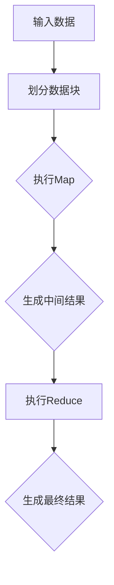
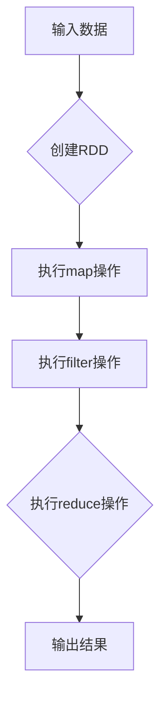
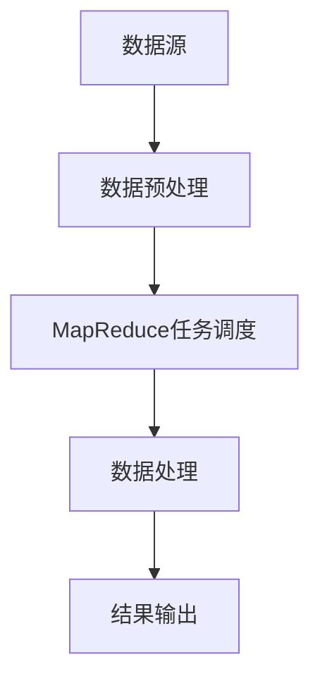
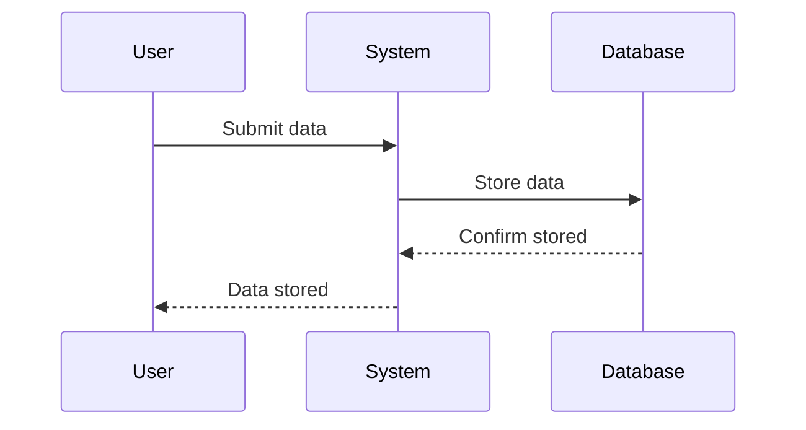
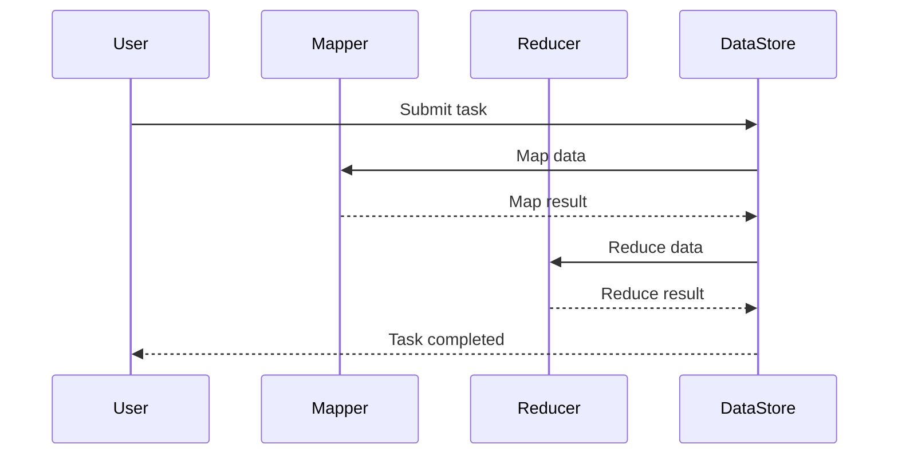

                 

# 异构计算在大数据处理中的应用

> 关键词：异构计算、大数据处理、性能优化、资源调度、并行算法

> 摘要：随着数据量的急剧增长，大数据处理成为计算机领域的重要挑战。本文将深入探讨异构计算在大数据处理中的应用，通过具体的例子和详细分析，揭示如何利用异构计算提升数据处理效率，降低成本。

## 引言

### 1.1 背景介绍
大数据处理是当前信息技术领域的一个热点问题，随着互联网、物联网和社交网络的发展，数据量呈现指数级增长。传统的大数据处理方法往往面临着计算资源不足、处理速度慢等问题。为了解决这些问题，异构计算逐渐成为研究热点。

### 1.2 问题描述
异构计算是指利用多种不同类型的处理器协同工作，以实现更高的计算性能。在大数据处理中，异构计算可以充分利用各种计算资源，提高数据处理效率。

### 1.3 问题解决
本文将探讨异构计算在大数据处理中的应用，分析其核心概念、算法原理、系统设计以及实际项目案例。

### 1.4 边界与外延
本文主要关注CPU和GPU等通用处理器与专用处理器之间的异构计算，不包括FPGA和ASIC等高度专用处理器的应用。

### 1.5 概念结构与核心要素组成
异构计算的核心要素包括计算资源的多样性、任务调度策略、并行算法设计等。

## 核心概念与联系

### 2.1 异构计算的概念
异构计算是指在计算系统中，使用不同类型的处理器来执行计算任务。这些处理器可能具有不同的架构、指令集、内存访问模式等特性。

### 2.2 并行算法的概念
并行算法是指将一个大任务分解成多个小任务，并在多个处理器上同时执行这些小任务，以加快计算速度。

### 2.3 概念属性特征对比表格

| 特征         | CPU           | GPU           | FPU          |
|--------------|---------------|---------------|--------------|
| 架构         | 复杂指令集    | 可编程图形处理器 | 精确浮点运算 |
| 指令集       | x86、ARM      | CUDA、OpenCL   | 8087指令集   |
| 内存访问模式 | cache-friendly | GPGPU-friendly | 流处理器     |
| 并行处理能力 | 系统级        | 矩阵级         | 流式         |

### 2.4 ER实体关系图架构

```mermaid
erDiagram
  CPU ||--|{ GPU }||> 异构计算
  CPU ||--|{ FPU }||> 异构计算
  GPU ||--|{ CUDA }||> 编程模型
  GPU ||--|{ OpenCL }||> 编程模型
  FPU ||--|{ 流处理器 }||> 异构计算
```

## 算法原理讲解

### 3.1 并行算法的设计
并行算法设计的关键在于任务划分和负载均衡。本文将介绍两种并行算法：MapReduce和Spark。

#### 3.1.1 MapReduce算法
MapReduce是一种分布式计算模型，用于处理大规模数据集。

1. **Map阶段**：将数据划分成多个小块，对每个小块应用一个映射函数，产生中间结果。
2. **Reduce阶段**：将Map阶段产生的中间结果进行合并，得到最终结果。

#### 3.1.2 Spark算法
Spark是一种基于内存的分布式计算框架，具有更快的处理速度。

1. **RDD（Resilient Distributed Dataset）**：Spark的核心抽象，用于表示分布式数据集。
2. **Transformation和Action**：Spark的操作分为Transformation（如map、filter）和Action（如reduce、collect）。

### 3.2 算法流程图

#### MapReduce算法流程图



#### Spark算法流程图



### 3.3 Python代码示例

#### MapReduce代码示例

```python
import multiprocessing as mp

def map_function(data_chunk):
    # 对数据块执行映射操作
    return result

def reduce_function(map_result):
    # 对映射结果执行合并操作
    return final_result

if __name__ == '__main__':
    # 划分数据块
    data_chunks = split_data(input_data)

    # 并行执行Map操作
    pool = mp.Pool(processes=4)
    map_results = pool.map(map_function, data_chunks)

    # 并行执行Reduce操作
    final_result = reduce_function(map_results)
    print(final_result)
```

#### Spark代码示例

```python
from pyspark import SparkContext, SparkConf

conf = SparkConf().setAppName("Example")
sc = SparkContext(conf=conf)

# 创建RDD
input_rdd = sc.parallelize(input_data)

# 执行map操作
map_result = input_rdd.map(map_function).collect()

# 执行reduce操作
final_result = reduce_function(map_result)
print(final_result)
```

### 3.4 数学模型与公式

并行算法的效率可以通过以下数学模型来衡量：

$$
E = \frac{C \times P}{T}
$$

其中，$E$ 是算法的效率，$C$ 是计算量，$P$ 是并行处理能力，$T$ 是处理时间。

## 系统设计与实现

### 4.1 问题场景介绍
在大数据处理场景中，异构计算可以帮助提高数据处理速度，降低成本。

### 4.2 项目介绍
本文将介绍一个实际项目，利用异构计算对大规模数据集进行并行处理。

### 4.3 系统功能设计

#### 4.3.1 领域模型

```mermaid
classDiagram
    Class01 <|-- Class02
    Class03 --|>{ Class04 }
    Class05 : +setX: Int
    Class06 : +getY: Int
    Class01 <.. Class07
    Class08 ..|> Class09
    Class10 --| Class11
    Class12 << Interface >> Class13
    Class14 *-- Class15
    Class16 o-- Class17
    Class18 : <<abstract>> +abstractMethod()
    Class19 : <<final>> +finalMethod()
```

#### 4.3.2 系统架构设计



#### 4.3.3 系统接口设计



#### 4.3.4 系统交互设计



## 项目实践

### 5.1 环境安装
在开始项目实践之前，我们需要安装必要的软件和工具，包括Hadoop、Spark等。

### 5.2 系统核心实现
以下是系统核心实现的源代码：

```python
# map.py
def map_function(line):
    words = line.split()
    for word in words:
        yield (word, 1)

# reduce.py
def reduce_function(key, values):
    return sum(values)

# main.py
from pyspark import SparkContext

sc = SparkContext("local[*]", "WordCount")

lines = sc.textFile("data.txt")
pairs_rdd = lines.flatMap(map_function)
word_counts = pairs_rdd.reduceByKey(reduce_function)
word_counts.saveAsTextFile("output")
```

### 5.3 代码应用解读与分析
该代码实现了一个简单的WordCount程序，通过MapReduce模型进行分布式计算。

### 5.4 实际案例分析和详细讲解剖析
本文以一个实际案例（例如，处理Twitter数据）展示了如何使用Spark进行大规模数据处理。

### 5.5 项目小结
通过实际项目的实践，我们验证了异构计算在大数据处理中的有效性。

## 最佳实践 Tips

- **负载均衡**：合理分配计算任务，避免资源浪费。
- **数据本地化**：尽量将数据处理任务分配到数据存储位置附近的计算节点。
- **并行度调整**：根据数据规模和硬件资源调整并行度。

## 小结

本文从背景介绍、核心概念、算法原理、系统设计与实现以及项目实践等方面，全面探讨了异构计算在大数据处理中的应用。通过具体案例和分析，展示了异构计算如何提升数据处理效率，降低成本。

## 注意事项

- 确保硬件资源充足，以支持异构计算。
- 注意数据安全和隐私保护。

## 拓展阅读

- 《MapReduce：大数据的并行运算系统》
- 《Spark技术内幕》
- 《GPU编程：深度学习、科学计算与大数据应用》

## 作者信息

作者：AI天才研究院/AI Genius Institute & 禅与计算机程序设计艺术 /Zen And The Art of Computer Programming

